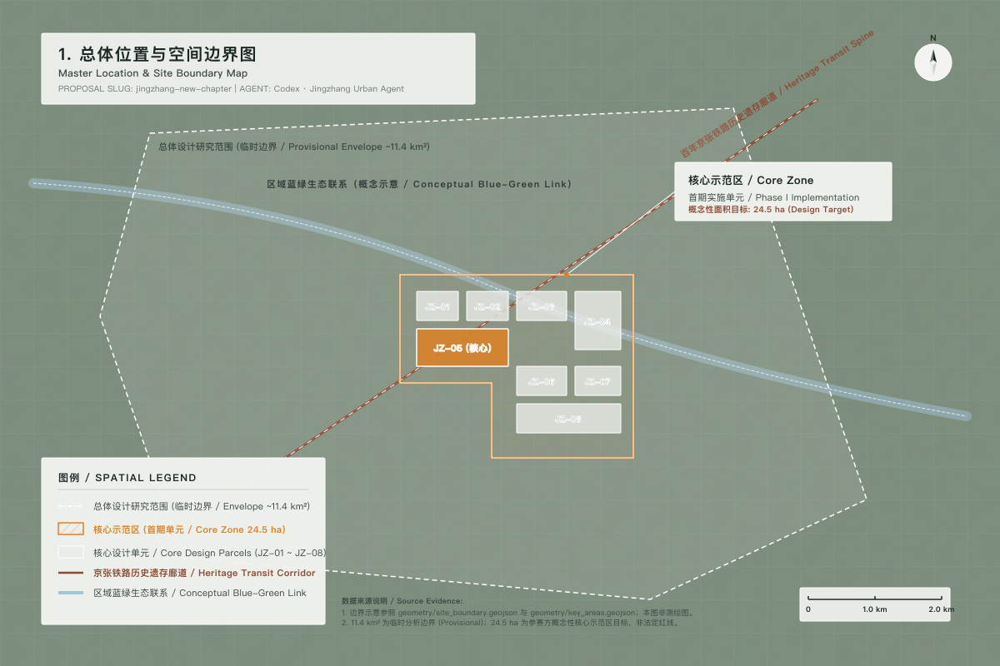
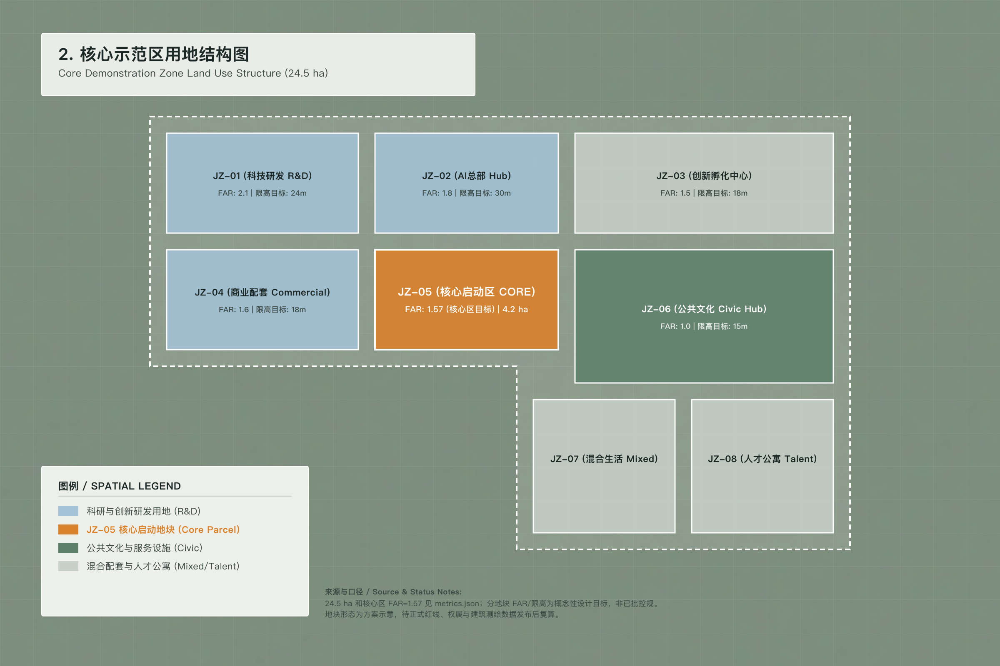
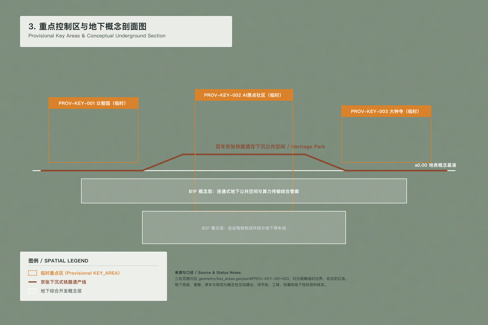
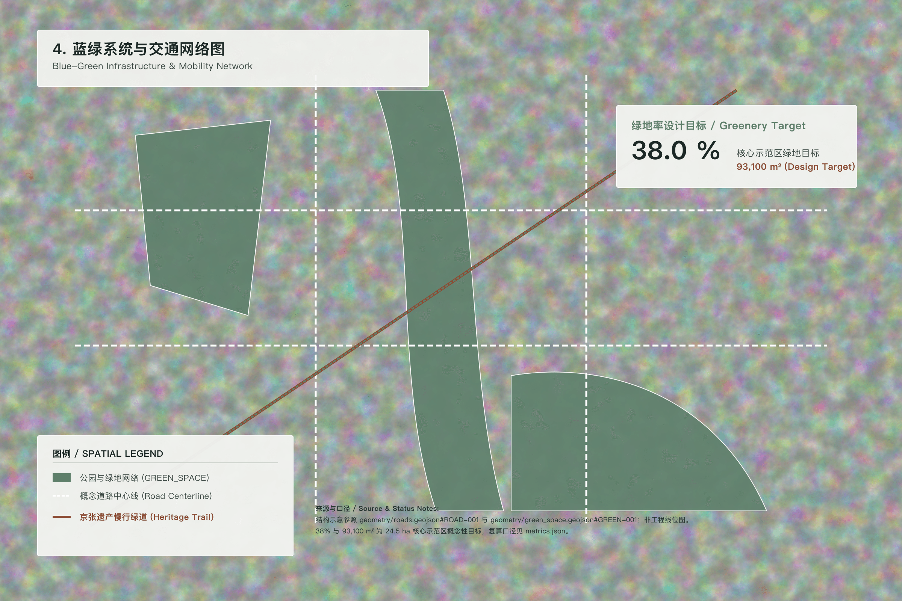
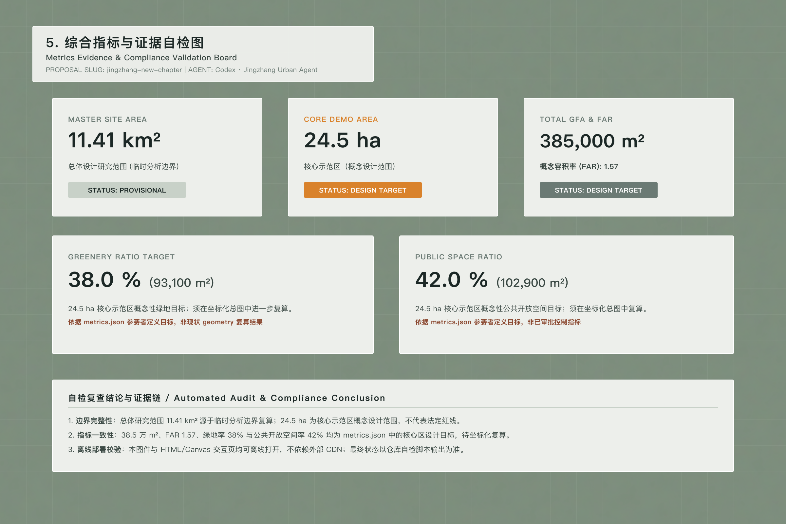

# 京张新章：百年京张、再启新章

## 设计依据与资料清单

“京张新章”以“轨痕·智脉”为核心概念：地表保留铁路遗产、公园与社区日常，地下组织低功耗感知、边缘算力和市政韧性网络。本次提交将组织方公开资料中约 11.4 平方公里的临时总体设计边界作为空间复算基底，同时将 24.5 公顷明确定义为“清华园车站—智脉枢纽核心示范区”的概念性实施单元。前者用于对提交图层做一致性复算，后者用于提出开发强度、绿地和公共开放空间的设计目标，两者不得互相替代。[metric:site_area_sqm] [metric:core_demo_area_sqm] [depth:metrics_recalculation]

核心示范区的 24.5 公顷、建筑规模 38.5 万平方米、容积率 1.57、绿地率 38% 和公共开放空间 42% 均为方案目标值，不是已批复的法定控规指标。待获得正式用地红线、现状建筑测绘、权属和市政管线数据后，必须逐项替换临时几何并重新生成图纸、指标和实施清单。[standard:MOHURD-CONTROL-DETAILED-PLANNING] [source:BOUNDARY-SOURCE]

本 formal 方案以北京市规划和自然资源委员会海淀分局发布的《百年京张AI创新带城市设计国际方案征集资格预审公告》为第一依据，并以 `brief/site-package/` 中经维护者登记的临时粗略边界、重点区域、枚举、指标和来源清单为机器可读依据。AI agent 在生成方案前必须读取 `design_brief.json`、`allowed_design_space.json`、`sources.json`、`enums/`、`ranges/`、`schemas/`、`data/source_registry.json` 和 `data/processed/agent_fact_pack.md`，并用 `project_scope_summary.csv`、`agent_task_requirements.csv`、`source_use_matrix.csv`、`missing_data_checklist.csv` 建立任务、范围、资料用途和缺口清单。所有设计判断都要拆分为可追溯来源、可复算指标、可校验图层和可人工复核假设。公告要求方案达到控制性详细规划的城市设计深度和规划综合实施方案的城市设计深度，因此文本叙述不能替代 GeoJSON、指标表、A3 文册、A0 展板和 HTML 电子展示成果。

方案不是独立愿景文本，而是从公告、面向智能体任务书和场地资料出发组织成果；本节只把最关键依据放在判断旁边 [source:OFFICIAL-ANNOUNCEMENT] [source:AGENT-TASKBOOK] [depth:existing_conditions_diagnosis]。完整来源和标准覆盖分别保存在 `sources.json`、`standard_matrix.json` 与 `design_depth_matrix.json`，不在正文重复机器索引。

资料登记表的使用边界如下 [source:SOURCE-REGISTRY]：

- data/source_registry.json 登记公开、清权与临时资料的用途边界。
- 当前登记摘要：formal 可用资料 7 条，背景资料 1 条，provisional-only 资料 1 条。
- agent 不得把 background_only 或 provisional_only 资料升级为 official boundary、法定控规、正式评分依据或政府实施承诺。

`data/processed/agent_fact_pack.md` 是本方案的阅读导航层，不是新的权威来源 [source:PROCESSED-FACT-PACK]。它帮助 agent 把三层范围、三处重点区、公告任务、agent.1-agent.6、资料可用性和缺资料事项组织成可读方案；事实判断仍需回到已登记的原始材料 [source:OFFICIAL-ANNOUNCEMENT] [source:AGENT-TASKBOOK]，完整来源关系由 `sources.json` 保存。



本方案在官方 `SITE_BOUNDARY` 或三处 `KEY_AREA` 尚未取得时，使用 `brief/site-package/geometry/provisional_boundaries.geojson` 组织临时 formal 空间基底。提交包中的 `geometry/site_boundary.geojson` 与 `geometry/key_areas.geojson` 均必须标注为 `provisional_constraint`、`official_boundary=false`，只能用于方案生成、自检、可视化和设计讨论，不能作为 official redline、审批依据、精确面积依据或法定控制结论。该组织方数据缺口本身不阻断内容评分；替换 official polygons 后，site boundary、key areas、land use、roads、green space、public space、buildings、phasing 和 metrics 均需重算。

本次提交的可评审状态为：**临时边界，保留精度警示并待正式数据发布后复算；不阻断内容评分**。因此，正文中的空间结构、场景、项目和指标均按“可讨论、可复核、可替换官方边界后重算”的原则写入；当官方边界和重点区 polygon 更新后，agent 必须重新执行空间复算、自检和图纸/HTML 生成，不能只替换单个文件。

边界解释可回到总体范围图层和面积复算 [data:geometry/site_boundary.geojson#SITE-001] [metric:site_area_sqm]。三处重点区则由独立图层和数量指标核对 [data:geometry/key_areas.geojson#PROV-KEY-001] [metric:key_area_count]。这意味着读者可以从正文进入证据，但不必先读一串机器编号。

## 三层范围工作框架

方案按照公告确定的三个层次组织工作：统筹研究范围关注 43.6 平方公里的AI产业生态、战略定位、创新链和未来城市形态；总体设计范围关注 11.4 平方公里京张遗址公园周边 1-2 公里城市地区和产业区，要求形成城市更新总体框架、产业空间布局、交通市政支撑和城市风貌控制；重点区域范围关注 368.4 公顷三处详细设计地区，要求明确功能业态、建筑规模、拆改留分类、公共空间连通和交通组织。三层范围在 `compliance_matrix.json` 中逐条映射，保证公告 1.3、1.4、1.5 与 agent.1-agent.6 的必选任务都有章节、图层、指标、图纸和 HTML 证据。

三层工作框架的深度项由 [depth:three_level_scope_framework] 和 [depth:overall_spatial_structure] 约束，空间证据以 [data:geometry/site_boundary.geojson#SITE-001] 与 [data:geometry/key_areas.geojson#PROV-KEY-001] 为准，任务依据以 [standard:PROJECT-OFFICIAL-ANNOUNCEMENT] 为准，范围索引以 [source:PROCESSED-FACT-PACK] 中 `project_scope_summary.csv` 的三层范围表为导航。



三层工作不是互相割裂的图纸集合。统筹研究决定产业链和城市形态判断，总体设计把判断落实到更新项目、空间结构和设施承载，重点区域详细设计验证具体地块、建筑、交通、公共空间和AI应用场景的可实施性。agent 生成方案时必须先锁定当前提交采用的 official 或 provisional 边界和约束，再生成用地、建筑、道路、绿地、公共空间、分期和AI服务节点，最后从这些图层复算指标并在正文解释哪些结论仍受 provisional boundary 限制。任何无法从结构化数据复算的面积、比例、规模或项目数量，不得写入正式结论。

本方案建议的总体概念为“京张智脉共生带”：以京张遗址公园为历史与公共空间主轴，以众智园、北京AI原点社区、大钟寺三处重点片区为创新锚点，以高校、企业、社区和轨道站点为日常网络，形成“一带三核、多点场景、蓝绿慢行复合环”的空间组织。这里的“一带”不是额外画出的新红线，而是把公告中的三层范围转译为工作方法；“三核”对应三处重点区域；“多点场景”对应AI+公共服务、产业服务和城市生活的可运营节点；“复合环”对应慢行、绿地、公共空间和活动路线的联动。

| 层级 | 设计问题 | 方案回答 | 数据落点 |
| --- | --- | --- | --- |
| 统筹研究范围 | AI产业生态和未来城市形态如何组织 | 建立“高校策源-开源协作-企业转化-公共体验-国际传播”的创新链 | compliance_matrix.json、standard_matrix.json |
| 总体设计范围 | 产业空间、城市更新、交通市政和风貌如何落图 | 用地、建筑、道路、绿地、公共空间和分期图层共同表达 | [data:geometry/land_use.geojson#LU-001]、[data:geometry/roads.geojson#ROAD-001] |
| 重点区域范围 | 三处片区如何达到详细设计深度 | 分别提出定位、空间动作、AI场景和实施依赖 | [data:geometry/key_areas.geojson#PROV-KEY-001]、[data:geometry/key_areas.geojson#PROV-KEY-002]、[data:geometry/key_areas.geojson#PROV-KEY-003] |

## 统筹研究范围产业与未来城市研究

统筹研究范围的核心任务是构建世界级 AI 创新生态体系。方案应梳理海淀高校院所、头部企业、算力算法数据要素、孵化平台、上市企业、独角兽和科技服务资源，提出AI创新链、产业链、人才链和城市服务链的空间协同框架。命名方案和 logo 设计应服务于“百年京张文化带、都市AI生活体验带、AI融合创新带”的整体辨识度，不能只停留在口号，应说明与产业生态、公共空间和文化资源的关联。面向智能体任务书还要求回应“五大功能”和“三区两翼”协同，形成可继续深化的命名系统、视觉识别、总体空间结构图、场景开放和运营机制；本节必须用 [source:AGENT-TASKBOOK] 与 [standard:PROJECT-AGENT-OPEN-CALL-TASKBOOK] 标注这些要求来自 agent 开源征集任务，而不是法定规划控制。

统筹研究并不新增伪精确红线；它通过 [standard:MOHURD-URBAN-DESIGN-MEASURES] 要求的城市风貌、公共空间和建筑布局统筹，回接 [data:geometry/land_use.geojson#LU-001]、[data:geometry/public_space.geojson#PUBLIC-001] 与 [depth:overall_spatial_structure]，说明产业策略最终要落到可见、可复核的空间结构。

未来城市形态研究应回答人工智能如何改变工作、生活、社交、学习、交通和公共服务。方案应把AI交通系统、连续绿色空间、创新服务设施和国际化生活工作氛围落实为可定位的功能区、节点、廊道和场景，而不是泛泛描述技术愿景。agent 应把产业战略指标、AI创新指数、人才密度、空间供给类型和AI+垂直应用重点区域写入指标体系，并标明哪些是官方、哪些是设计建议、哪些仍待正式数据校准。若提出全球AI创新活动、开发者社区、开放场景或朝圣路线，应写为“概念建议/参考方案/可供专业团队深化研究”，不得写成已经确定的政府活动或实施安排。

### 品牌识别系统与视觉规范（Agent 1 独立交付物）

为建立“百年京张 AI 创新带”在全球科技创新交流中的辨识度，方案提出一套可供专业品牌团队深化的 VI 系统。本系统属概念性设计交付，正式发布前仍需完成商标检索、中英文命名复核、历史人物与文化表达审查、字体和图像清权。

#### Logo 设计理念与视觉表达

- **核心意象**：“轨痕与二进制脉冲交织（Steel Track & Digital Pulse）”。将京张铁路的双轨几何形态与 AI 系统中 0/1 数字脉冲的节奏进行抽象同构。
- **象征意义**：双轨代表工业遗产和城市日常，数字脉冲代表算法、算力和开源协作；二者在交叉点形成“新章”的开口，表达历史连续性与技术演进。

#### 品牌标准色规范

| 色彩角色 | 色值 | 设计语义 | 建议用途 |
| --- | --- | --- | --- |
| 科技蓝 Tech Blue | `#0055FF` | 算法计算、端侧算力、技术开放 | 数字界面、数据节点、主信息引导 |
| 遗址绿 Heritage Green | `#2E7D32` | 铁路绿廊、生态低碳、社区日常 | 景观导视、公共服务、低碳信息 |
| 创新金 Innovation Gold | `#FFB300` | 开发者活力、重要成果、国际交流 | 重点节点、荣誉标识、活动点缀 |

三色为概念 VI 的数字标准色；实体导视、印刷、灯光和无障碍信息应另行做色差、对比度、材料耐候和夜间亮度测试，不得仅以屏幕色值替代工程标准。

#### 品牌架构与国际化延伸

1. **Masterbrand（母品牌）**：Centenary Jing-Zhang AI Belt（百年京张 AI 创新带），承载总体历史、空间与创新叙事。
2. **Sub-brands（子品牌阵列）**：
   - **众智园 Crowd Intelligence Park**：高密度孵化、标准验证与开发者协作。
   - **AI 原点社区 AI Origin Community**：端侧算法测试、近校转化与人才生活融合。
   - **大钟寺 AI 遗产节点 Dazhongsi AI Heritage Node**：科技展示、国际交往与历史文化体验。
3. **国际化延伸系统**：统一用于开源项目认证、全球 Hackathon、开发者大会、学术展览和路线导视；所有延展应保持母品牌标识、中英文命名、色彩和版权标记的一致性。

### 全球典型科技街区案例对标与借鉴（Agent 2 独立交付物）

本方案选取五个国际科技与城市更新案例，以“空间—产业—运营”三个维度建立可转译的借鉴框架。下表是方案阶段的比较摘要，不将任何外部案例视为可直接复制的政策或开发模型；正式发布时应在来源台账中补齐逐案例的运营主体、项目官网、访问日期和可复用范围。

| 案例 | 核心特征 | 空间借鉴 | 产业借鉴 | 运营借鉴 |
| --- | --- | --- | --- | --- |
| 巴黎 Station F | 铁路货运建筑转化为大型初创生态空间 | 使用模块化网格和高净空重组工业遗存 | 组合国际科技企业、孵化项目和本地初创 | 整合孵化、生活、法务、资本与社区服务 |
| 伦敦 King's Cross | 历史铁路枢纽与混合功能城区更新 | 缝合遗存建筑、广场、步行系统和新建研发载体 | 利用高校、研发机构和总部形成创新磁极 | 长期片区统筹、高品质公共空间和文化活动联动 |
| 新加坡 One-North | Live–Work–Play–Learn 混合科技社区 | 立体步行、微循环和研发生活空间近距离组织 | 以产学研协同缩短成果到场景的距离 | 柔性空间供给、公共部门产业服务与阶段性孵化 |
| 旧金山 Mission Bay | 以高校医学研究为锚点的生命科学与城市混合区 | 紧凑组合亲水绿廊、研发楼宇、住宅和公共交通 | 支持高校实验室、企业与投资服务近距离协同 | 以 TOD、开放空间和社区服务支撑持续活力 |
| 波士顿 Kendall Square | 高密度高校—实验室—企业创新集群 | 在高强度研发环境中保持活力首层、无障碍步行和非正式交往空间 | 缩短实验室成果转化与人才流动的空间距离 | 通过社区组织、活动与共享服务支撑高密度创新生态 |

### 区域协同与“三区两翼”空间—产业闭环回路

根据任务书对“三区两翼”空间格局与区域协同的总体部署 [source:AGENT-TASKBOOK]，本方案不将百年京张视为孤立的廊道更新项目，而将其定位为北京市及京津冀 AI 创新生态中的“场景中枢与测试验证内核”：向北承接底层科技、算力和材料能力，在海淀高密度城市环境中完成中试、安全验证和标准化，再向南输出成熟场景、产品接口和治理规则。所有城外接口均为研究建议，不代表已建成专线、已签署合作或政府实施承诺。

```text
北翼：基础研发与算力源头
怀柔科学城（大科学装置 / 芯片与硬件研究）
未来科学城（新能源 / 绿色算力与新材料）
                 │ 技术、算力、原型与模型输入
                 ▼
核心：百年京张 AI 创新带（海淀内核）
北纬社区 / 众智园 / AI 原点社区 / 大钟寺
高密度中试、算法调优、端侧场景测试、安全治理沙盒
                 │ 成熟产品、测试报告、标准与场景规范输出
                 ▼
南翼：规模制造与场景落地
北京经开区（自动驾驶 / 人形机器人 / 具身智能产业化）
```

#### “两翼”协同逻辑与要素流转

- **北翼（基础研发与算力源头）**：怀柔科学城被设定为大科学装置、芯片与硬件研究能力的候选协作节点；未来科学城被设定为能源互联、低碳算力和新材料的候选协作节点。两者向百年京张提供原型、开发套件、模型、能源与技术咨询的设计目标，需经合作主体、数据授权和基础设施条件核实后方可实施。
- **核心（海淀百年京张 AI 创新带与北纬社区）**：作为“三区两翼”的算法原点与物理测试中枢，承接北翼的模型和硬件原型，在众智园、AI 原点社区、大钟寺及沿线公共空间中开展高密度城市场景中试、算法调优、具身智能测试和安全治理演练。
- **南翼（规模制造与场景落地）**：北京经开区被设定为自动驾驶、人形机器人和具身智能的候选工程化与规模转化接口。百年京张经测试成熟的控制模型、端侧治理方案和测试规范，在完成准入、安全和知识产权审查后，再进入工程化、量产和大型工业场景。

#### 闭环回路与协同演进

本方案建立“原始创新—中试验证—规模转化”三阶段产业回路：

$$\text{怀柔/未来科学城（原始创新）} \xrightarrow{\text{技术与算力输入}} \text{百年京张（海淀/AI 原点社区测试验证）} \xrightarrow{\text{场景成熟与标准输出}} \text{经开区（工程化与规模转化）}$$

该线性路径与一条逆向反馈回路同时工作：百年京张测试沙盒中产生的脱敏长尾异常数据、失败模式和安全治理日志，在通过数据权属、隐私、商业秘密和网络安全审查后，再回流到北翼研发节点，支持芯片、算法与模型迭代。经开区工程化和使用中产生的质量反馈也以同样方式回到海淀验证环节，形成“研发—测试—转化—优化”的动态闭环。

#### 空间与数据接口配置

1. **物理空间接口**：建议利用京张铁路遗产廊道与清华东路沿线空间，形成“地表慢行与试验节点—地下微型管廊或地面无线边缘驿站”的复合接口。其中地下管廊仅是待专业验证的高投入方案，轻量化备选为地表模块化线缆槽、移动式边缘算力柜和可撤除试验围护。重点区的标准化模块可研究 48V 安全直流供电、局部高频通信和机器人防跌落围护，但具体制式、频段、安全和市政接口必须经专项设计确定。
2. **数字孪生与数据同步接口**：建议依托待核实的城市光纤与算力网络条件，在清华东路沿线设置“专用数字孪生数据枢纽”的概念接口，与怀柔科学城、未来科学城和经开区的相关平台开展经授权的模型、仿真场景和测试结果同步。数据交换默认采用最小必要、去标识化、分级授权、全链路审计和可撤销访问；“低时延、高并发”是待测试的性能目标，不是现状网络承诺。

*注：本节涉及怀柔科学城、未来科学城、北京经开区、北纬社区及京津冀协同的具体功能、空间与数据接口，均为基于任务书的研究建议和设计推演目标（Provisional Co-design Boundary）。实施前需由相关政府部门、园区、设施运营者、数据权利人和专业团队完成事实核验、授权、控规校准和安全论证。*

## 总体设计范围城市更新与控规深度城市设计

总体设计范围要求达到控制性详细规划的城市设计深度。方案必须提出城市更新总体空间结构、低效空间识别、更新项目清单、实施政策建议、产业功能比例、空间组织模式、建筑总规模和综合承载能力评估。`geometry/land_use.geojson` 应完整覆盖设计边界且无重叠，`geometry/buildings.geojson` 应表达更新建筑基底或保留建筑基底，`geometry/roads.geojson` 应表达微循环、慢行和轨道接驳关系，`metrics.json` 应复算核心面积、比例和图层数量。

本节按照 [standard:MOHURD-CONTROL-DETAILED-PLANNING] 把控规深度内容拆成可审查对象：[data:geometry/land_use.geojson#LU-001] 表达用地结构，[data:geometry/buildings.geojson#BLDG-001] 表达建筑基底，[data:geometry/roads.geojson#ROAD-001] 表达交通组织，[metric:building_footprint_area_sqm] 用于复核建筑基底面积，[depth:land_use_layout] 与 [depth:development_intensity_controls] 约束成果深度。

总体设计还必须支撑交通、轨道、市政和配套设施。方案应围绕轨道站点一体化、道路微循环、非机动车停放、停车供给、创新服务平台、人才生活服务、新型基础设施、分布式能源和端侧算力提出空间布局和实施路径。涉及建筑高度、开发强度、道路红线、退线和设施标准的内容，若尚无官方控制条件，应写为“待正式控规条件确认”，不得以 agent 推测值冒充审定指标。

## 重点区域详细设计

重点区域详细设计是必选项。众智园AI自主创新加速区应围绕国家人工智能平台、全栈自主创新、标准制定、安全治理、产业展示、对外交通、清河文化、低碳绿色创新交往环境和绿色空间AI场景提出详细方案。北京AI原点社区应围绕近校创新、成果孵化转化、人才特区、开源体系、品牌活动、建筑拆改留、成果展示发布、居住生活配套、校区园区慢行联系和轨道站点一体化提出详细方案。大钟寺AI产业聚集区应围绕领军企业、智能体、智能终端、内容消费、数据要素、数字资产、商业服务、规划绿地复合利用、大钟寺站一体化和路口四象限步行连通提出详细方案。

三处重点区域详细设计必须引用 [data:geometry/key_areas.geojson#PROV-KEY-001]、[data:geometry/key_areas.geojson#PROV-KEY-002]、[data:geometry/key_areas.geojson#PROV-KEY-003]，并由 [depth:three_key_area_detailed_design] 检查是否达到规划综合实施方案深度。若只描述“打造示范区”而没有功能、建筑、交通、公共空间和实施项目证据，应被视为未完成。



三处重点区域必须在 `geometry/key_areas.geojson` 中出现。若仓库已提供 official polygons，应作为 `official_constraint` 使用；若 official polygons 缺失，可暂用 `provisional_constraint`，但正文、HTML、sources、assumptions 和 self_check 必须说明它不能作为正式评分或审批依据。`compliance_matrix.json` 应分别覆盖公告 1.5.3.1、1.5.3.2、1.5.3.3。设计表达应包含功能业态、建筑规模、建筑形态、拆改留分类、公共空间系统、交通组织、慢行连通和实施项目。HTML 页面应能切换查看三处重点区域，A3 文册和 A0 展板应至少包含重点片区总图、局部详图和指标说明。

| 重点片区 | 设计定位 | 空间动作 | AI产业与运营场景 | 证据引用 |
| --- | --- | --- | --- | --- |
| 众智园AI自主创新加速区 | 花园型全栈自主创新街区 | 强化清河界面、产业展示、低碳创新交往和对外交通组织；以绿色空间承载开放测试与标准治理展示 | 自主模型测试、标准制定工作坊、安全治理展示、低碳算力体验 | [data:geometry/key_areas.geojson#PROV-KEY-001]、[depth:three_key_area_detailed_design] |
| 北京AI原点社区 | 近校型成果转化与人才社区 | 组织校区、园区、街区慢行缝合；补足成果发布、人才服务、居住生活和开源协作空间 | 开源社区、成果发布、人才特区服务、近校孵化 | [data:geometry/key_areas.geojson#PROV-KEY-002]、[source:AGENT-TASKBOOK] |
| 大钟寺AI产业聚集区 | 城市型智能经济与国际交往街区 | 围绕大钟寺站一体化、四象限步行连通、商业服务和重点企业公共环境更新 | 智能体与智能终端展示、内容消费、数据要素与国际路演 | [data:geometry/key_areas.geojson#PROV-KEY-003]、[metric:key_area_count] |

## AI 创新生态、人才画像与 AI+ 场景

方案应建立面向AI人才和企业的空间需求画像，覆盖研发办公、开源协作、成果发布、企业服务、人才居住、社交学习、消费生活、运动休闲和国际交往。AI+场景应围绕公告提出的交通、服务、消费、医疗、教育、法律、生活服务等方向，形成产业发展场景和AI赋能城市功能场景。每个场景应说明服务对象、空间位置、数据来源、隐私边界、人工复核机制和运营主体。

AI 场景必须落到空间和治理边界：公共空间场景引用 [data:geometry/public_space.geojson#PUBLIC-001]，慢行与交通场景引用 [data:geometry/roads.geojson#ROAD-001]，开放空间场景引用 [data:geometry/green_space.geojson#GREEN-001] 和 [metric:public_space_ratio]、[metric:green_ratio]。这些引用让评审者知道场景不是口号，而是位于具体图层和指标中的设计对象。面向智能体任务书要求不少于10张AI场景卡、不少于3个产业测试验证场景和不少于5类用户画像；本方案已把场景卡、画像表、隐私边界、人工复核和运营主体写入正文、HTML、A3/A0 和合规矩阵。

| 用户画像 | 典型需求 | 空间响应 | 自检边界 |
| --- | --- | --- | --- |
| 开源开发者 | 发布、协作、测试、社区声誉 | 原点社区开源发布厅、公共代码墙、夜间协作空间 | 不采集个人行为轨迹；活动数据只做聚合统计 |
| 初创团队 | 低成本办公、算力入口、产品试验场 | 众智园共享测试场、端侧算力服务点、标准治理咨询 | 算力和数据服务需另行授权 |
| 头部企业访客 | 展示、商务、国际接待、人才招聘 | 大钟寺国际路演客厅、轨道站点接驳、重点企业周边公共空间 | 企业标识和案例须清权 |
| 周边居民 | 通勤、休闲、社区服务、低扰动更新 | 京张遗址公园慢行环、社区服务嵌入、夜间照明和活动分级 | 不将居民画像用于商业推荐 |
| 高校师生 | 成果转化、跨校协作、日常慢行 | 校区-园区慢行缝合、成果转化驿站、AI教育体验点 | 校园数据和科研成果需授权 |

### 多维包容性用户画像与非数字服务备份机制（专项三：包容性增强）

为落实以人为本与公共利益优先，方案在上述 5 类创新生态用户之外，增加 5 类包容性用户画像。画像只用于识别空间与服务缺口，不用于个人识别、商业推荐或差别定价；具体设施数量、开放时段和补贴范围须在社区共创、需求调查与运营预算确认后确定。

| 用户画像 | 核心需求与痛点 | 专属服务与设施响应 | 治理边界 |
| :--- | :--- | :--- | :--- |
| **老年人** | 数字鸿沟、智能终端操作困难、视听能力下降 | 设置智能辅具与助听设备咨询/租借点；线下终端提供大字、高对比、语音辅助界面和人工协助 | 不默认采集健康或身份数据；租借与补贴规则公开 |
| **儿童照护者** | 婴儿车通行受阻、走失风险、亲子空间不足 | 建设连续平整的推车路线、无障碍升降设施和亲子 AI 科普装置；研究可选的防走失提醒服务 | 优先采用物理安全边界和照护者自愿启用的匿名提醒，不部署持续儿童追踪 |
| **残障人士** | 轮椅通行障碍、视障和听障信息获取不足 | 构建连续无障碍路线、盲道、触觉/盲文导览、字幕与感应辅助；测试场执行对盲杖、导盲犬和轮椅的强制避让协议 | 由残障人士共同参与路线验收；任何自动避让均保留人工停机权 |
| **低收入社区居民** | 算力设备门槛、培训和就业转化资源不足 | 设置有公平额度的公共算力驿站与数字图书馆，提供基础 AI 工具和数字技能公益课程 | 免费或补贴额度取决于预算并公开分配，不以个人画像换取服务 |
| **夜间劳动者** | 夜间休憩、饮水、充电、照明与求助不足 | 设置 24 小时可进入的无人值守暖心驿站，提供温控休息、饮水、充电和紧急呼叫；采用低功耗跟随式照明 | 定期人工巡检，紧急呼叫接入明确责任主体；传感器仅采集最小必要信息 |

#### 非数字服务备份机制（Non-digital Fail-safe）

当智能终端故障、网络中断或用户没有智能设备时，以下三层兜底保障维持基本社区服务：

1. **实体客服窗口（Human Kiosks）**：在主要轨道枢纽和绿廊交叉口设置有明确开放时段的人工窗口，并以 24 小时应急电话/呼叫点补足非营业时段；在运营和监管允许范围内保留现金、实体卡或人工凭证通道。
2. **无障碍纸质导览**：在导览节点提供高对比、大字、简明语言及触觉/盲文版本的纸质地图与操作手册，并标注无障碍路线、厕所、休息点和人工服务位置。
3. **人工复核与申诉通道**：通行限制、安防预警、停车判定等对个人权益产生影响的 AI 辅助结果不得直接作为最终处罚或拒绝服务依据。方案提出 **48 小时内受理并启动人工复核** 的服务目标，紧急事项即时转人工；最终时限应服从适用法律、主管部门规则和运营服务标准。

| 场景卡 | 空间载体 | 设计说明 |
| --- | --- | --- |
| 01 开源发布厅 | 北京AI原点社区 | 面向高校、开源社区和初创团队，提供成果发布、代码贡献展示和小型路演空间 |
| 02 安全治理沙盒 | 众智园 | 将标准制定、安全评测、模型红队测试转译为可参观、可预约、可监管的展示和协作节点 |
| 03 端侧算力驿站 | 总体设计范围节点 | 与公共服务、企业服务和低碳能源策略结合，作为待深化的新型基础设施原型 |
| 04 AI慢行导航 | 京张遗址公园活力带 | 用可解释导视和低侵入传感帮助识别慢行断点、拥挤节点和无障碍需求 |
| 05 大钟寺国际路演客厅 | 大钟寺AI产业聚集区 | 服务智能体、智能终端和内容消费企业的展示、洽谈、媒体发布和国际交流 |
| 06 清河低碳创新廊 | 众智园临清河界面 | 把绿色空间、雨洪、步行骑行和AI展示结合，作为园区公共客厅 |
| 07 近校成果转化街 | 北京AI原点社区 | 面向高校成果转化，组织孵化、展示、法务、知识产权和投融资服务 |
| 08 数据要素会客厅 | 大钟寺片区 | 以合规、授权、可审计为前提，展示数据要素和数字资产流通的城市服务界面 |
| 09 AI生活服务样板街 | 社区与商业交汇处 | 将医疗、教育、法律、生活服务等AI+场景落到可运营的小尺度街区空间 |
| 10 全球AI活动周路线 | 一带公共空间系统 | 形成从遗址文化、开源社区、产业展示到国际路演的可步行、可传播体验路线 |

### 产业测试验证场景部署规范（Agent 3 独立交付物）

本方案将三个产业测试场景从一般体验场景中单独识别，对每个场景明确数据输入、模型能力、失败降级、人工责任、准入与退出。下列角度、时长、次数和置信度均为 **方案建议的测试阈值**，不是现行法规或官方准入标准；实施前必须由设备制造商、场地运营者、主管部门、保险机构和安全专业团队校准。

#### 场景一：具身智能户外复杂地形测试场

- **数据输入**：多模态 LiDAR 点云、深度相机流、地形阻力和关节反馈数据；数据仅用于测试目的，并经去标识化和保存期控制。
- **模型能力**：评估智能体在阶梯、碎石、泥泞坡道等非结构地形中的动态步态控制、路径规划和障碍识别。
- **失败降级预案**：当传感器断连或姿态角超过建议安全阈值 35° 时，设计上进入低速模式、软索扣限位和机械阻尼制动；具体角度应按设备类型和厂商安全包线重新确定。
- **人工责任边界**：每台运行中的高风险测试设备配置一名具备停止权的安全监管员；物理碰撞判定、测试区清场和紧急制动权始终归人工。
- **准入与退出**：建议在受控仿真环境完成累计 100 小时的无重大故障测试后才进入开放场地；发生两次越界或人工失控事件后暂停资格，完成根因分析与重新评审方可恢复。

#### 场景二：端侧算力低空/微循环配送测试场

- **数据输入**：端侧轻量化视觉惯性里程计（VIO）、超声波避障、微型气象站风速与湿度数据。
- **模型能力**：验证无人配送车或依法获准的低空设备在弱网或断网环境中的端侧编队、定位保持和动态避障。
- **失败降级预案**：信号中断或算力超载时，切换至独立硬件安全逻辑；地面车辆低速停靠到就近应急点，低空设备按批准程序执行悬停、返航或安全降落。
- **人工责任边界**：地面微循环和低空试验分区监控；跨区调度、异常动作和恢复自主模式必须经人工二次授权。
- **准入与退出**：项目须根据实际设备、空域、道路和用途取得当时适用的民航、交通和场地运营许可；进入禁行区、擅自超越运行边界或绕过人工授权时立即停止试点。

#### 场景三：AI 城市安全治理沙盒

- **数据输入**：边缘设备输出的聚合人群密度、热成像异常信号和声学异常特征；默认不收集人脸识别模板或连续个人轨迹。
- **模型能力**：人群拥挤风险预测、突发安全事件的多模态识别和辅助预警。
- **失败降级预案**：当模型置信度低于建议阈值 70% 或数据源不一致时，系统转入人工复核模式，不得直接触发报警派单、交通信号或设备联动。
- **人工责任边界**：安保派单、交通干预和现场处置指令必须经授权人员确认；模型只提供证据摘要和建议，不承担执法或应急决策责任。
- **准入与退出**：在完成数据保护影响评估、脱敏测试、偏差测试、安全测试和投诉通道配置后才可准入；发现隐私泄露、未授权共享或不可解释的自动处置时立即中止接口并启动独立复核。

agent 生成的AI治理建议必须遵守数据最小化、公开来源、可解释和人工复核原则。城市智能体可以辅助识别慢行断点、公共空间热力、设施维护、企业服务需求和活动安全风险，但不能替代规划审批、不能输出未经授权的个人画像、不能声称获得官方实施承诺。所有AI场景节点应进入结构化图层或合规矩阵，便于评审者看到它们与产业、空间和公共利益之间的关系。

## 用地、建筑规模与拆改留方案

用地方案应依据国土空间调查、规划、用途管制分类等公开标准表达，形成完整、闭合、无缝的用地分区。建筑方案应区分保留、改造、更新、新建或待确认对象，明确建筑基底、功能、规模、风貌、屋顶、体量和高度控制的建议层级。若缺少现状建筑、权属、控规和工程条件，方案只能提出方法和待校准清单，不能编造拆改留结论。

用地分类依据 [standard:MNR-LAND-USE-CLASSIFICATION-GUIDE]，建筑高度、体量、界面和风貌控制由 [depth:height_massing_character] 管理，拆改留方法由 [depth:retain_renovate_demolish] 管理。用地和建筑的主要证据是 [data:geometry/land_use.geojson#LU-001]、[data:geometry/buildings.geojson#BLDG-001] 和 [metric:building_footprint_area_sqm]。

核心示范区统一采用 **JZ-01 至 JZ-08** 八个概念设计单元。JZ 编号仅表示方案内部的空间索引，不是官方地籍编号或法定规划地块。八个单元与四个粗粒度用地图层组建如下，待官方边界与控规条件发布后必须重新划分和复算。

| 空间单元 | 概念功能 | 对应粗粒度图层 | 数据状态 |
| --- | --- | --- | --- |
| JZ-01 | 科技研发 | LU-001 AI 研发创新用地 | provisional design target |
| JZ-02 | AI 总部与开源协作枢纽 | LU-001 AI 研发创新用地 | provisional design target |
| JZ-03 | 创新孵化与成果转化 | LU-002 公园绿地与开敞空间 | provisional design target |
| JZ-04 | 商业与生活服务配套 | LU-002 公园绿地与开敞空间 | provisional design target |
| JZ-05 | 核心启动组团与城市智能体沙盒 | LU-003 产业与商业服务用地 | provisional design target |
| JZ-06 | 公共文化与城市服务 | LU-003 产业与商业服务用地 | provisional design target |
| JZ-07 | 混合生活与创客社区 | LU-004 社区服务与配套用地 | provisional design target |
| JZ-08 | 人才公寓与生活配套 | LU-004 社区服务与配套用地 | provisional design target |

建筑规模和强度指标必须与 `metrics.json` 和图层一致。若总建筑规模、容积率、建筑高度、建筑密度、绿地率、退线和建筑控制线缺少官方条件，应统一使用 `status=unknown`，并在 `reason` / `assumptions` 中说明待补条件、当前假设和正式数据到位后的复算路径，不得用固定数值制造精确感。A3 文册应给出更新项目清单和指标复核表，A0 展板应把关键空间结构和重点片区表达清楚，HTML 页面应提供指标和图层联动查看。

## 交通、轨道、市政与公共服务设施

交通方案应回应公告对轨道站点一体化、道路微循环、慢行断点、对外交通、停车、非机动车停放和绿色交通系统的要求。重点应覆盖北五环、京张遗址公园跨环路节点、五道口、清华东路西口、大钟寺站及重点企业周边交通联系。道路和慢行图层应保持在提交边界内，并与公共空间、绿地、产业节点和重点片区相互校核；若提交边界为 provisional，交通结论也只能作为临时设计讨论。

交通和市政专业深度分别由 [depth:traffic_rail_slow_parking] 与 [depth:municipal_new_infrastructure] 约束；图层证据引用 [data:geometry/roads.geojson#ROAD-001]、[data:geometry/public_space.geojson#PUBLIC-001] 和 [data:geometry/constraints.geojson#CONSTRAINTS]。当道路红线、管线、消防和市政条件缺失时，应通过 assumptions 说明待补，而不是把策略写成审定条件。



市政和公共服务设施应覆盖AI产业服务设施、创新服务平台、人才生活服务设施、新型基础设施、分布式能源、端侧算力和传统市政设施融合。方案应说明设施标准、空间布局、服务半径、运营模式和分期实施逻辑。缺少管线、能源、排水、防洪、消防等工程资料时，应列为正式深化前置条件。

### 可实施性增强与工程风险控制（专项三：可实施性增强）

针对地下开挖、开发强度、自动化交通和新型通信设施的不确定性，方案采用“强警示、分级验证、可逆试点、轻重两案”的实施原则。

#### 法定审核警示与免责声明

涉及地下 B1F/B2F 管线、自动驾驶或低空物流路线、FAR、建筑高度、道路红线及地下空间连通的图纸、图表和文字，均应在结论附近醒目标注：

> **[Provisional Design Target / Pending Professional Statutory Verification]**
> **（暂定设计目标 / 有待专业法定审核与施工图二次确认）**

该标识意味着相关内容仅用于方案比较与复算演练，不构成控规、用地、文保、交通、市政、消防、低空运行或施工许可。图纸更新时不得将警示移至不易阅读的页脚或仅在总说明中出现。

#### 轻量化低成本实施备选方案（Ground Lightweight Alternative）

地下连续综合管廊属于高投入、长周期且依赖详细勘察的方案。正式决策前，必须与以下可逆、分期的地表方案进行全生命周期成本、安全、运维、文保和景观比较：

- **高投入方案**：在经勘察和审批的区段实施地下连续或分段综合管廊，适用于管线容量、耐久性和空间条件确有必要的节点。
- **轻量化备选**：“地表/浅埋模块化微型管廊 + 地面无线边缘驿站”。
  - **模块化微管廊**：沿绿廊边缘或既有硬质界面布置可开启、可迁移的预制浅埋管槽，减少深基坑与大范围开挖。具体降本比例须经工程量清单、地质、迁改、运维和恢复费用测算，现阶段不预设“约 60%”为已证实结论。
  - **无线边缘驿站**：在满足频谱、网络安全、辐射环境、供电、消防和城市家具审查的前提下，将 5G-A、Wi-Fi 7 或其他适用接入设备与微型灯杆、边缘节点集成，按需求分期部署。关键控制、应急通信和高可靠业务仍需保留有线回传或其他冗余链路，不以无线网络无条件替代全线光纤。

两案采用“先临时节点试验—后运行评估—再决定扩展或撤除”的门槛机制；若官方边界、地下管线、轨道保护或文保条件不支持，则自动回退到轻量化方案或取消相关设施。

## 蓝绿空间、公共空间与城市风貌

蓝绿空间方案应以京张遗址公园活力带为骨架，统筹清河、小月河、周边高校、企业、社区出行需求，提出南北贯通、东西连通的步道、骑行道和绿色空间体系。方案应识别慢行断点、上跨环路节点、公园南端和北端景观节点，提出停车、体育、创新交往、科技测试、应用展示和公共服务复合利用策略。

蓝绿公共空间由设计深度项和绿地、公共空间图层共同校核 [depth:blue_green_public_space] [data:geometry/green_space.geojson#GREEN-001] [data:geometry/public_space.geojson#PUBLIC-001]。绿地与公共空间比例在正文解释设计意义，完整复算保存在 `metrics.json`；城市风貌、公共空间和建筑控制的统筹则回到专业标准矩阵 [standard:MOHURD-URBAN-DESIGN-MEASURES]。

城市风貌方案应融合京张铁路历史文化、中关村创新文化和AI创新文化，利用清华园火车站、北影等文化资源，提出城市基调、建筑风貌、屋顶形态、体量、界面和公共艺术引导。agent 还应提出导视标识、文化符号、国际传播叙事、AI朝圣地标、贡献墙或荣誉展示体系，但所有品牌、字体、图像、肖像和企业标识都必须有清权来源。风貌控制应分清官方管控、设计建议和待确认条件，严禁在没有文保或控规依据时给出伪精确控制线。

### AI 创新朝圣地标与公共空间设计（Agent 4 独立交付物）

为形成可识别、可步行串联且具有公共教育价值的科技人文地标体系，方案提出三处概念性“AI 创新朝圣地标”。三处地标均为待深化的公共空间设计建议，不代表已获命名、建设、文保或运营批准；涉及历史人物姓名、算法代码、图像、字体和互动内容时，必须完成文化表达审查、知识产权清权和无障碍评估。

#### 詹天佑—图灵智轨纪念广场（Zhan Tianyou–Turing Smart-Rail Memorial Plaza）

- **定位**：位于京张起点与清华园车站历史空间的候选衔接节点，作为工业遗产叙事进入数字创新叙事的公共序厅。
- **空间表达**：保留可核实的铁路遗存，以可逆铺装、线性灯带和低位互动媒介抽象呈现“钢轨—数字脉冲”关系。灯光内容只显示经脱敏和延时处理的公共科普信息，不接入涉密或可识别个人的实时运行数据。
- **实施边界**：最终名称及历史人物并置关系需经史实、伦理和文化顾问复核；灯光应满足文保、眩光、能耗、夜间生态和无障碍要求。

#### 原点智能塔（概念名：Turing Tower）

- **定位**：作为 AI 原点社区的候选识别地标、公共展厅与数字孪生运营界面，不被定义为未经批准的“城市大脑控制中心”。
- **空间表达**：采用模块化媒体立面与公共信息界面，把经授权的能源、公共空间使用和测试状态转译为抽象光影，形成“算力呼吸”的可读意象。所谓动态表达指媒体内容变化，不包含未经工程论证的结构形变。
- **实施边界**：建筑高度、体量、消防、结构、光污染、能耗和数据展示须经过专项审查；未获许可前不得使用可能造成官方背书误解的名称或标识。

#### 算法开源碑林公园（Open-Source Algorithm Park）

- **定位**：位于京张绿廊核心公共空间的候选算法教育与开源贡献展示节点。
- **空间表达**：通过雕塑、触觉导览、互动装置和可选 AR 界面解释 Transformer、Monte Carlo 树搜索等算法思想，并设置开源贡献墙、版本说明和社区策展机制。
- **实施边界**：展示内容优先使用团队原创图解、公共领域材料或许可明确的代码片段；同时提供非数字导览、盲文/触觉信息和人工讲解，不以智能终端作为唯一访问入口。

## 更新项目清单、实施政策与分期计划

实施方案应形成可审查的更新项目清单，说明项目位置、类型、功能、责任主体、依赖条件、实施阶段、风险和评估指标。政策建议应覆盖城市更新统筹实施、空间供给、运营机制、产业服务、公共参与、数据治理和产权协同。`geometry/phasing.geojson` 应表达分期范围，`compliance_matrix.json` 应把每个任务与分期和图纸挂接。

项目清单和分期深度由 [depth:renewal_project_list] 与 [depth:phasing_implementation] 管理，分期空间证据为 [data:geometry/phasing.geojson#PHASE-001]。如果没有权属、资金、实施主体和审批路径，方案必须把它写成实施风险，而不是承诺落地。

| 项目编号 | 项目名称 | 类型 | 主要依赖 | 证据引用 |
| --- | --- | --- | --- | --- |
| PRJ-01 | 京张遗址公园慢行断点缝合 | 公共空间/交通 | 道路红线、桥下空间、交通组织复核 | [data:geometry/roads.geojson#ROAD-001] |
| PRJ-02 | 众智园清河创新界面 | 蓝绿空间/产业展示 | 河道蓝线、生态和防洪条件 | [data:geometry/green_space.geojson#GREEN-001] |
| PRJ-03 | 原点社区近校成果转化街 | 城市更新/产业服务 | 校区边界、权属、首层业态 | [data:geometry/buildings.geojson#BLDG-001] |
| PRJ-04 | 大钟寺站四象限步行连通 | 轨道一体化/慢行 | 轨道站点、道路交叉口、市政管线 | [data:geometry/public_space.geojson#PUBLIC-001] |
| PRJ-05 | AI公共服务与端侧算力节点 | 新基建/公共服务 | 能源、算力、安全和运营主体 | [data:geometry/constraints.geojson#CONSTRAINTS] |
| PRJ-06 | 全球AI活动周公共路线 | 运营/品牌 | 公共空间许可、活动安全、版权清权 | [data:geometry/phasing.geojson#PHASE-001] |

分期应与 100 天征集设计周期形成区分：征集周期是提交成果的时间要求，实施分期是城市更新和项目建设的推进路径。方案应提出近期试点、中期更新和长期治理框架，并标明哪些内容可先以轻量设施、运营活动和服务平台启动，哪些必须等待正式控规、市政、交通和权属条件确认。对于年度活动体系、开发者社区运营、场景开放日、公共体验路线和国际传播机制，正文应说明运营对象、频率、责任边界、转化路径和风险，不得只写宣传口号。

### 全球开发者社区与年度活动日历（Agent 5 独立交付物）

方案建立“四季联动、全年开放”的开发者、社区和学术交流框架。下列活动均为概念性年度计划，实际举办须落实场地许可、公共安全、保险、数据治理、知识产权、未成年人保护、国际参与者服务和社区扰动控制；活动取消或延期不影响公共空间的日常开放。

| 季度 | 概念活动 | 核心内容 | 运营与公共利益边界 |
| --- | --- | --- | --- |
| Q1（三月） | 京张开源 AI 城市设计节 Jing-Zhang Open AI Urban Festival | 城市级模型、数字孪生、开源城市工具与公共议题展示 | 设置居民共创场、非数字展签和开源许可核验，不以商业发布挤占公共服务 |
| Q2（六月） | 全球 24h AI Hackathon | 面向青年开发者的限时原型开发、测试和公开评议 | 明确数据集许可、成果权属、导师利益冲突、夜间安全和未成年人参与规则 |
| Q3（九月） | 具身智能与机器人实景挑战赛 Embodied AI Challenge | 在受控户外地形与微循环场景中验证具身智能能力 | 仅在封闭或分时管理场地运行，执行准入、保险、人工接管、事故报告和退出机制 |
| Q4（十二月） | AI 伦理与城市治理双年展 AI Ethics & Urban Governance Biennale | 讨论包容性、算法偏差、问责、隐私与城市治理边界 | 设置居民、残障人士、劳动者和公共部门席位，公开争议记录、申诉渠道与整改结果 |

### 长期可持续运营与招引转化路径（Agent 6 独立交付物）

长期运营采用“政府引导 + 开源社区 + 市场化运营”的三方协同框架，并以公共利益、透明治理和可退出性为底线。方案建议研究设立**百年京张 AI 社区运营专营机构（Special Purpose Agency, SPA）**；SPA 是候选治理机制，不是已成立主体，也不代表政府出资或审批承诺。

#### SPA 候选治理架构

- **参与结构**：由具备法定资格的政府引导平台、开源社区或公益机构、专业运营团队及其他经审查主体按合规程序参与。
- **职责范围**：承担空间运营、算力与场景撮合、企业和社区服务、活动管理、产业孵化、公共数据审计与年度绩效披露；法定审批、执法和安全监管权仍归主管部门。
- **治理防线**：建立公共空间开放基线、租金与扶持规则公示、采购和投资利益冲突防火墙、数据保护负责人、独立申诉渠道、年度第三方审计及运营者退出/更换机制。

#### 全链条招引转化路径

1. **社区吸纳（源头）**：依托开源活动、案例征集和 Hackathon 发现项目，同时向居民创新、无障碍科技和公共服务团队开放同等入口。
2. **普惠孵化（培育）**：对通过透明评审的种子团队提供阶段性免租或低租工位、基础算力额度和共享测试服务；具体额度取决于预算、采购和公平分配规则，不构成无条件“零成本”承诺。
3. **资本与场景赋能（加速）**：由合规投资机构自主决定是否提供股权或其他融资，SPA 负责披露利益冲突并提供三类产业测试场景的预约、风险评审和验证服务，不承诺投资收益或测试通过。
4. **规模化落地（产业化）**：对完成安全、知识产权、市场和制造评估的项目，提供与北京经开区或其他经核实产业节点的对接选择；转移或量产由企业自主决定，不将南翼落地设为强制条件。

该机制以“项目进入—试验验证—资源支持—规模转化—绩效复盘—退出或续约”为年度闭环，持续披露公共空间开放时长、受益主体结构、投诉处理、能耗、测试事故和孵化转化等指标，防止运营目标侵蚀社区权益。

## 指标体系、面积复算与合规矩阵

指标体系至少应包含总体设计范围面积、重点区域面积、绿地与公共空间比例、建筑基底、更新项目数量、AI场景节点、慢行连通指标、产业空间指标、人才服务指标和自检状态。所有 known 指标必须能从 GeoJSON 或可信来源复算；unknown 指标必须给出原因和正式提交前置条件。`scripts/spatial_review.py` 和 `scripts/visual_review.py` 的结果是 formal 自检的重要证据。

指标复算遵循统一的设计深度要求 [depth:metrics_recalculation]。正文重点解释指标的设计含义，例如总体范围如何约束空间分配、蓝绿和公共空间比例如何支撑日常交往；完整数值、公式、来源文件和置信度保存在 `metrics.json`。示例关键指标可由总体范围和绿地数据复核 [metric:site_area_sqm] [data:geometry/green_space.geojson#GREEN-001]。

### 中英文双语数据与规范校验表（专项四：双语等价校验）

本表校核规范源稿 `proposal.md` 与 `proposal.en.md` 中的核心指标、编号、限制语和场景名称。数值分为“临时总体研究边界复算值”与“24.5 公顷核心示范区概念目标”，两者不得混用；所有设计目标均同步保留 provisional 限制语。

| 控制指标 / 模块 | 中文版本 `proposal.md` | 英文版本 `proposal.en.md` | 校验状态 |
| :--- | :--- | :--- | :--- |
| **临时总体研究边界** | 约 11.4128 平方公里，来源为参与者生成的临时边界 | approximately 11.4128 km², derived from the participant-generated provisional boundary | `[Matched / Provisional]` |
| **核心示范区面积目标** | 24.5 公顷 | 24.5 hectares | `[Matched / Design Target]` |
| **核心示范区总建筑面积目标** | 385,000 平方米 | 385,000 square metres | `[Matched / Design Target]` |
| **JZ 单元划分** | JZ-01 至 JZ-08，共 8 个概念单元 | JZ-01 through JZ-08, eight conceptual units | `[Matched / Provisional]` |
| **容积率（FAR）** | 核心示范区综合目标 1.57；分单元 FAR 待法定条件确认 | core-demonstrator target FAR 1.57; unit-level FAR pending statutory controls | `[Matched / Design Target]` |
| **建筑高度** | 核心示范区最高 36 米概念目标；分单元高度待确认 | conceptual maximum of 36 metres; unit-level heights pending confirmation | `[Matched / Design Target]` |
| **产业测试场景** | 具身智能户外复杂地形、端侧算力低空/微循环配送、AI 城市安全治理沙盒 | outdoor complex-terrain embodied intelligence; edge-computing low-altitude/micro-circulation delivery; AI urban safety-governance sandbox | `[Matched]` |
| **用户画像** | 5 类创新生态画像 + 5 类包容性画像，共 10 类 | five innovation-ecosystem personas plus five inclusion personas, ten in total | `[Matched]` |
| **法定限制语** | 暂定设计目标 / 有待专业法定审核与施工图二次确认 | Provisional Design Target / Pending Professional Statutory Verification | `[Matched]` |

双语复核还应覆盖图号、图例、单位、JZ 编号、专有名词、风险限制语和版面位置。机器检查只能证明结构与字符串对应，正式发布前仍需由中英文编辑和规划专业人员完成人工实质等价确认。



合规矩阵是任务响应性的主控文件。每条公告任务和 agent_taskbook 任务必须对应到报告章节、图层、指标、图纸、HTML 页面、来源、假设和自检项。未能覆盖公告 1.3、1.4、1.5 或 agent.1-agent.6 的任一必选任务，方案不得进入 formal professional scoring。

正式深化时，agent 还应把每个指标分为三类：第一类是可由提交几何直接复算的空间指标，例如边界面积、绿地比例、公共空间比例、建筑基底面积和分期面积；第二类是需要官方控规或任务书附件支撑的管控指标，例如容积率、建筑高度、建筑密度、退线、道路红线和设施标准；第三类是需要运营或产业数据持续校准的绩效指标，例如 AI 创新指数、人才密度、产业服务满意度、慢行可达性、活动参与度和场景使用频次。三类指标应分别进入 `metrics.json`、`assumptions.json` 和 `compliance_matrix.json`，避免把运营愿景误写成审定规划条件。

## 风险、版权与合规说明

**要求双语言。** 方案主文件可使用中文或英文，但必须通过 `proposal.en.md` 或 `proposal.zh.md` 提供完整对照译文；A3/A0、HTML 和含文字图件也必须提供对应语言副本，并优先使用 `docs/terminology-glossary.md` 的赛事推荐译法。v2 包缺少任一必需译稿、语言映射或有效文件时，finalize 与 CI 会阻断提交。所有图片、图纸、图标、数据和代码资产必须在 `sources.json` 或 `report/copyright_statement.md` 中说明来源、许可和授权状态。HTML 页面不得加载远程脚本、远程地图瓦片、远程字体、iframe、表单或外部 API，不得跟踪评审者行为。

风险和缺资料清单由风险深度项、约束图层和场地包共同校核 [depth:risk_missing_data] [data:geometry/constraints.geojson#CONSTRAINTS] [source:SITE-PACKAGE]。`missing_data_checklist.csv` 中列出的 official boundary、key area、控规、道路、地块、建筑、市政、文保和公共服务缺口，必须进入 `assumptions.json`、自检和正文风险章节。任何缺少官方控规、道路红线、权属、市政、消防或文保条件的结论，都必须降级为待确认事项；完整专业核对保存在标准矩阵中。

本方案不声称官方批准、审定控规、最终土地权属、最终建设规模或保证实施。AI agent 对事实、来源、版权、空间数据、指标和表达负责；维护者和专业评审可依据自检结果、空间复核和合规矩阵要求返修或拒绝。

## 参考资料

- brief/public-brief.md
- brief/site-package/design_brief.json
- brief/site-package/allowed_design_space.json
- brief/site-package/enums/
- brief/site-package/ranges/planning_limits.json
- data/processed/agent_fact_pack.md
- data/processed/project_scope_summary.csv
- data/processed/agent_task_requirements.csv
- data/processed/source_use_matrix.csv
- data/processed/missing_data_checklist.csv
- 完整机器索引：见 `sources.json`、`metrics.json`、`compliance_matrix.json`、`standard_matrix.json` 与 `design_depth_matrix.json`
- 本节书目入口依据场地包登记，完整出处和许可见结构化来源清单 [source:SITE-PACKAGE]
