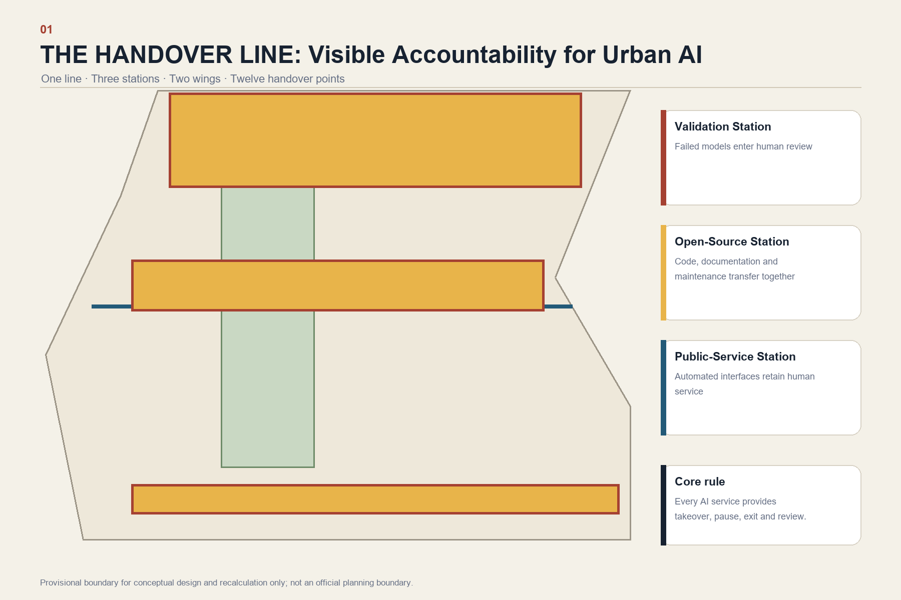
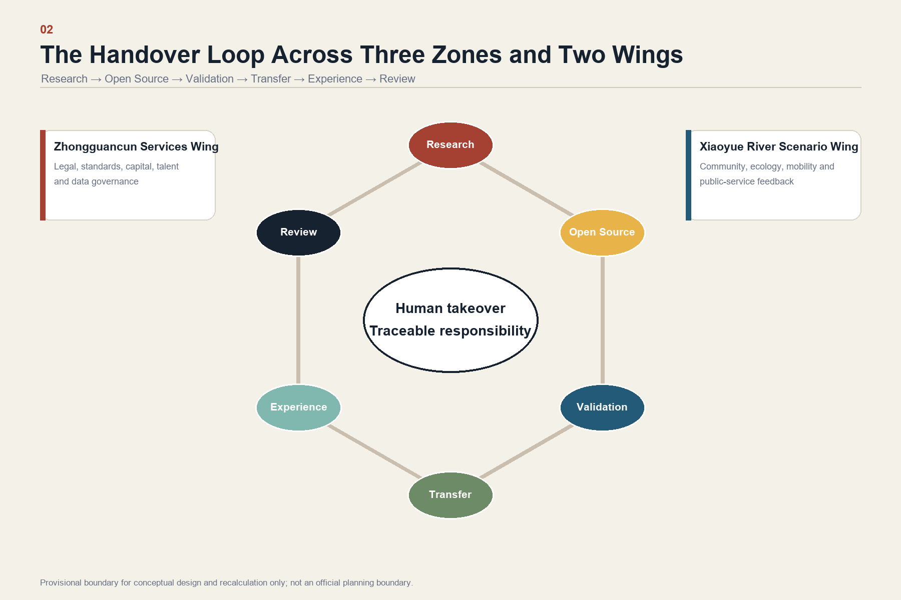
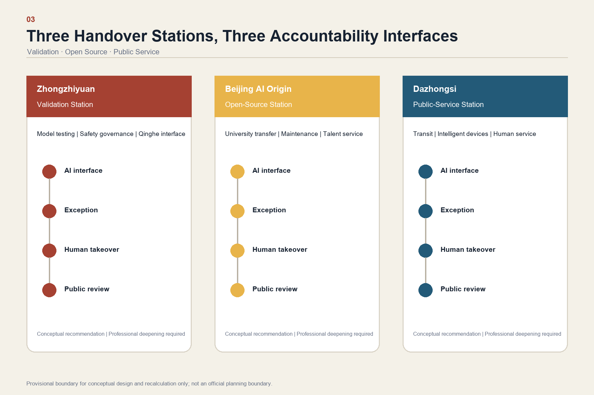
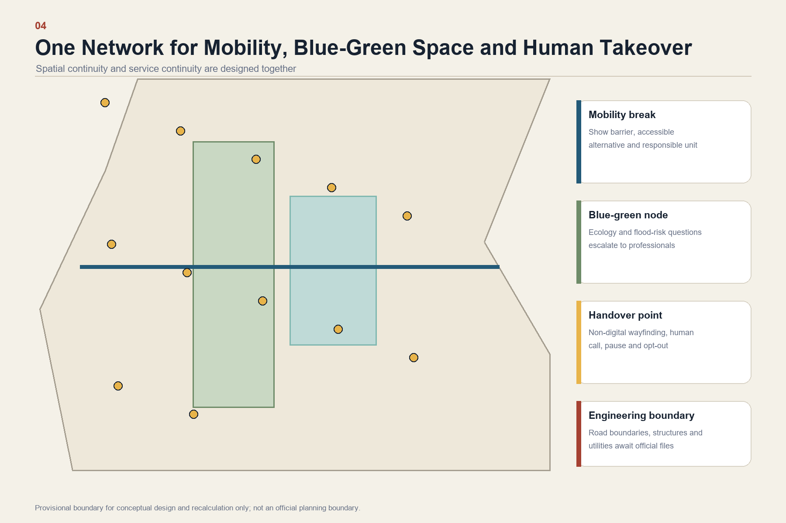
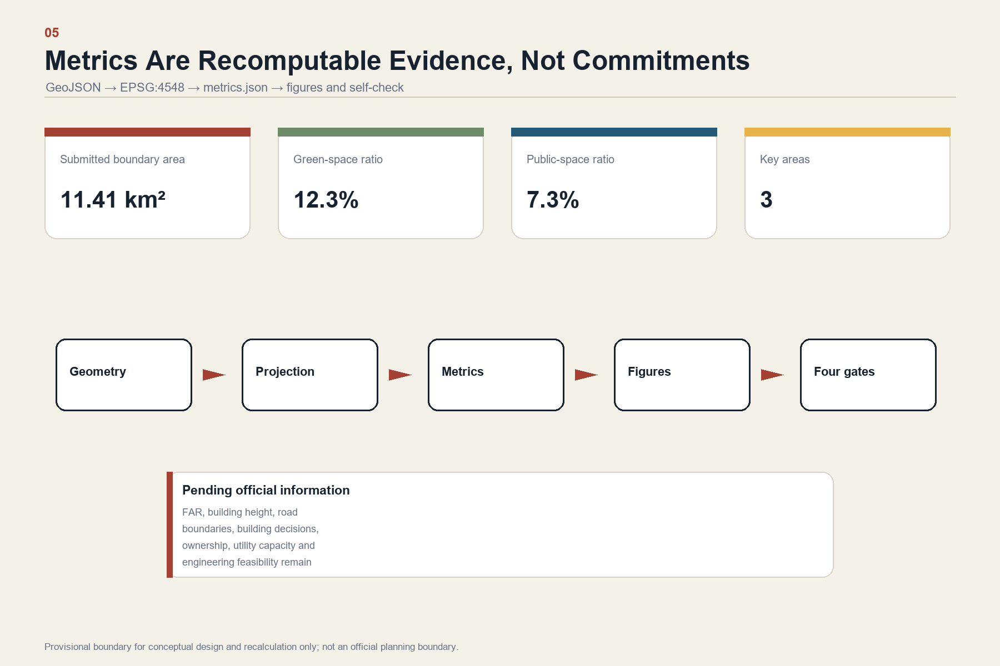

# The Handover Line: Every Urban AI Service Must Return to Human Hands

## Design Basis and Source Inventory

This professional design package responds to the Centennial Jing-Zhang AI Innovation Belt Open Call for Urban Design and its Agent taskbook. It uses only registered public or rights-cleared sources. Its narrative, GeoJSON, metrics, matrices, drawings and offline HTML form one traceable evidence chain. [source:OFFICIAL-ANNOUNCEMENT] [source:AGENT-TASKBOOK] [depth:existing_conditions_diagnosis]

The organizer has not yet supplied trusted exact polygons for the Overall Design Area or the three Key-Area Detailed Design Areas. The package therefore uses the explicitly labelled provisional geometry for intake, visualization and conceptual discussion only. It is not an Official Planning Boundary and cannot support statutory controls, parcel decisions or precise-area scoring. Every derived layer and metric must be recalculated when official polygons become available. [source:SOURCE-REGISTRY] [data:geometry/site_boundary.geojson#SITE-001] [metric:site_area_sqm]

## Three-Level Scope Framework

The 43.6 km² Coordinated Research Area addresses the regional AI ecosystem and future-city strategy; the stated 11.4 km² Overall Design Area addresses urban renewal, spatial structure and supporting systems; the stated 368.4 ha Key-Area Detailed Design Area addresses Zhongzhiyuan, Beijing AI Origin Community and Dazhongsi. These stated official areas coexist with provisional geometry and must not be confused with polygon-derived precise areas. [standard:PROJECT-OFFICIAL-ANNOUNCEMENT] [depth:three_level_scope_framework]

The proposal's spatial structure is “one line, three stations, two wings and twelve handover points.” The line is the Jing-Zhang Railway Heritage Park as a visible line of responsibility. The three stations are a Validation Handover Station at Zhongzhiyuan, an Open-Source Handover Station at Beijing AI Origin Community and a Public-Service Handover Station at Dazhongsi. The Zhongguancun Technology Services Wing supplies legal, standards, capital, talent and data-governance services; the Xiaoyue River Scenario Enablement Wing returns feedback from community, ecology, mobility and public-service settings. [source:AGENT-TASKBOOK] [depth:overall_spatial_structure]

## Coordinated Research Area: Industry and Future City

The regional innovation loop is organized as research - open source - validation - transfer - public experience - review. AI capability is considered mature only when its knowledge, operating status, limitations and responsibility can be handed over to another team and, at critical moments, back to a person. This structure supports the taskbook's three positionings, five functions and Three Zones and Two Wings without pretending to establish statutory planning controls. [standard:PROJECT-AGENT-OPEN-CALL-TASKBOOK]

The identity system uses a railway handover-board motif: two open lines meet at a clearly visible human node. Brick red represents Jing-Zhang heritage, signal yellow represents responsibility, and deep blue represents public information. The Chinese name is “京张交接线,” and the English name is “THE HANDOVER LINE.” All marks are generated from simple geometry and system fonts; no unlicensed corporate mark or portrait is used.

Five comparative references guide the ecosystem logic without being copied as site facts: university-adjacent innovation districts, open-source foundations, regulatory sandboxes, urban living labs and transit-oriented innovation quarters. Their transferable lesson is institutional proximity: research, testing, professional review, public feedback and maintenance must be reachable from one another. Any later quantitative case claims require separately registered primary sources.

## Overall Design Area: Urban Renewal and Design Depth

The Overall Design Area is treated as a network of visible service interfaces rather than a technology showroom. Each AI-enabled place must provide: a notice that AI is in use; a non-digital alternative; a staffed or callable takeover route; the responsible operator; minimum necessary data; a pause or opt-out mechanism; and an incident review channel. Land use, buildings, roads, green space, public space and phasing remain coordinated in the structured layers. [data:geometry/land_use.geojson#LU-001] [data:geometry/buildings.geojson#BLDG-001] [depth:land_use_layout]

No floor-area ratio, building height, road boundary, demolition decision or engineering feasibility is asserted without official control, ownership and infrastructure files. These items remain pending professional confirmation. The current building footprint metric describes submitted conceptual geometry, not an approved development scale. [metric:building_footprint_area_sqm] [standard:MOHURD-CONTROL-DETAILED-PLANNING] [depth:development_intensity_controls]

## Detailed Design of the Three Key Areas

Zhongzhiyuan becomes the Validation Handover Station. Model testing, safety governance, standards workshops and a low-carbon Qinghe public interface are colocated. A failed test must lead to a human review room, a named issue owner and a public problem record rather than an invisible retry. [data:geometry/key_areas.geojson#PROV-KEY-001]

Beijing AI Origin Community becomes the Open-Source Handover Station. University research, maintainers, licensing, intellectual-property support, start-up services and talent amenities meet in a walkable shared-ground-floor network. A project cannot jump directly from demonstration to deployment; code, documentation, data statements, maintenance responsibility and exit conditions travel together. [data:geometry/key_areas.geojson#PROV-KEY-002]

Dazhongsi becomes the Public-Service Handover Station. Transit interchange, commercial services, intelligent-device demonstrations and staffed counters form a four-quadrant urban living room. Children, older people, disabled users and anyone facing a network or model failure must be able to move from an automated interface to an equivalent human service. [data:geometry/key_areas.geojson#PROV-KEY-003] [depth:three_key_area_detailed_design]

All three are Conceptual Recommendations for professional deepening. Exact siting, building intervention, transport design and engineering feasibility remain subject to official information and statutory procedures.

## AI Innovation Ecosystem, Personas and AI-Enabled Scenarios

Five primary personas are maintained across the design: open-source developers; start-up teams; enterprise and international visitors; neighboring residents; and university students and researchers. The accessibility audit also tests children, older people, disabled users and people without smartphones as cross-cutting conditions, not as afterthoughts.

Twelve scenario cards share a common H-A-N-D-O-V-E-R record: Human takeover, Accountability, Necessary data, Disclosure, Opt-out, Verification, Escalation and Review. Spatial anchors include public space, walking and cycling routes, and blue-green corridors. [data:geometry/public_space.geojson#PUBLIC-001] [data:geometry/roads.geojson#ROAD-001] [metric:public_space_ratio]

| No. | Scenario | Spatial carrier | Required handover |
| --- | --- | --- | --- |
| 01 | Open-source release hall | Beijing AI Origin Community | Maintainer, license and support ownership transfer |
| 02 | Safety-governance sandbox | Zhongzhiyuan | Failed tests escalate to named human reviewers |
| 03 | Edge-compute service point | Distributed service nodes | Offline alternative and energy/operator disclosure |
| 04 | AI walking-and-cycling guidance | Heritage park | Staffed help and non-digital wayfinding |
| 05 | International demonstration lounge | Dazhongsi | Claims and demonstrations receive human verification |
| 06 | Qinghe low-carbon innovation corridor | Zhongzhiyuan waterfront interface | Ecology and flood-risk questions escalate to professionals |
| 07 | University-adjacent transfer street | Beijing AI Origin Community | Research, IP and venture-service responsibilities transfer together |
| 08 | Data-governance meeting room | Dazhongsi | Consent, purpose and deletion route remain visible |
| 09 | AI daily-service pilot street | Community-commercial interface | Every automated service preserves a human equivalent |
| 10 | Global AI Week route | Belt-wide public-space system | Event operations include pause and crowd-management handover |
| 11 | Accessible handover navigation | Transit stations and park entrances | One-action transfer to staff and non-digital signage |
| 12 | Model-incident review court | Three handover stations | Anonymized timeline, correction and closure are publicly explained |

Three Testing and Validation Scenarios are prioritized: a trustworthy-model handover sandbox at Zhongzhiyuan; an open-source maintenance handover desk at Beijing AI Origin Community; and an intelligent-terminal human-takeover test street at Dazhongsi. Results create issue lists and design revisions, not regulatory certification or an approval to operate. [standard:GENERATIVE-AI-INTERIM-MEASURES]

## Land Use, Building Scale and Demolish-Renovate-Retain Logic

The conceptual land-use partition covers the submitted provisional boundary without gaps or overlaps and follows the registered land-use classification reference. Building footprints express design evidence only. Retain, renovate, demolish and new-build decisions remain pending because official existing-building, ownership, heritage and regulatory files are unavailable. [standard:MNR-LAND-USE-CLASSIFICATION-GUIDE] [data:geometry/land_use.geojson#LU-001] [depth:retain_renovate_demolish]

The preferred renewal sequence is low-regret: first improve signage, staffed service, accessibility and reversible public-space components; then test shared ground floors and station-area connections; only then consider building intervention after professional confirmation. Development intensity, height, setbacks and municipal capacity remain unknown rather than being filled with artificial precision. [depth:height_massing_character]

## Mobility, Transit, Municipal and Public Services

The Walking and Cycling Network connects the heritage park, transit stations, universities, communities and the three handover stations. Each discontinuity is treated as both a spatial and service problem: wayfinding must identify the barrier, an accessible alternative and the human unit responsible for assistance. Exact road alignments, bridge or tunnel solutions and transit engineering remain pending official data and specialist review. [data:geometry/roads.geojson#ROAD-001] [depth:traffic_rail_slow_parking]

New Infrastructure is distributed as small, reversible and accountable service points. Energy, drainage, flood control, fire safety, communications and compute capacity require later engineering verification. No infrastructure capacity or implementation commitment is inferred from the provisional geometry. [data:geometry/constraints.geojson#CONSTRAINTS] [depth:municipal_new_infrastructure]

## Blue-Green Public Space and Urban Character

The Jing-Zhang Railway Heritage Park is the main civic spine; Qinghe and Xiaoyue River interfaces support ecological continuity and daily recreation. Provisional green and public-space ratios are used only to test the internal consistency of the submitted geometry. They are not official planning indicators. [data:geometry/green_space.geojson#GREEN-001] [metric:green_ratio] [depth:blue_green_public_space]

Three pilgrimage landmarks honor responsible handover rather than a company or model. The “First Pause Bell” at Zhongzhiyuan records cases where teams voluntarily stopped an unreliable system. The “Unnamed Maintainers' Table” at AI Origin credits verifiable documentation, repair, translation and community labor. The “Return the Decision to People” porch at Dazhongsi makes human service entrances and annual public review visible. Location, scale and heritage relationships require professional deepening.

The cultural narrative links railway operating discipline, Zhongguancun's innovation culture and an AI culture of responsible maintenance. Signage distinguishes the belt identity from individual site and event marks. No portrait, trademark, paper figure or proprietary font is used without clearance. [standard:MOHURD-URBAN-DESIGN-MEASURES]

## Renewal Projects, Policy and Phasing

Six conceptual projects organize implementation: repair walking and cycling discontinuities; create the Qinghe validation interface; build the university-adjacent transfer street; improve Dazhongsi's four-quadrant pedestrian connection; deploy accountable public-service and edge-compute points; and operate the annual Handover Week route. Each depends on later confirmation of transport, ownership, ecology, infrastructure, safety and copyright conditions. [data:geometry/phasing.geojson#PHASE-001] [depth:renewal_project_list]

Phase 1 tests signage, staffed counters, public explanation cards and the three validation scenarios. Phase 2 integrates the protocol into the three handover stations, walking nodes and scenario-access mechanisms. Phase 3 establishes cross-institution governance for annual rules, exit cases and international collaboration. [depth:phasing_implementation]

Operations follow weekly, quarterly and annual cycles. Weekly maintainer clinics collect public questions; quarterly handover drills involve developers, professionals, residents and accessibility representatives; the annual THE HANDOVER WEEK presents successful takeovers, voluntary pauses, repaired failures and open-source maintenance. The conversion pathway is public question - small test - independent review - takeover drill - time-limited opening - public review - continue, adjust or exit.

## Metrics, Recalculation and Compliance

Known metrics are recalculated from submitted geometry in EPSG:4548 and retain their source files, formula, assumptions and confidence. Unknown regulatory or operational indicators remain explicitly pending. The official stated area, polygon-derived area and design ratios are never presented as interchangeable facts. [metric:site_area_sqm] [depth:metrics_recalculation]

The complete task mapping is maintained in `compliance_matrix.json`; professional standards are maintained in `standard_matrix.json`; formal design depth is maintained in `design_depth_matrix.json`. The prose explains design decisions while the structured layer retains exhaustive audit coverage.

## Risks, Copyright and Claim Boundaries

This package is an Open Co-Creation proposal. It does not replace statutory planning, constitute government approval, determine ownership, promise investment or guarantee implementation. Official boundaries, regulatory controls, existing buildings, utilities, heritage controls, traffic engineering and public-facility data remain required for professional deepening. [source:SITE-PACKAGE] [data:geometry/constraints.geojson#CONSTRAINTS] [depth:risk_missing_data]

All text and diagrams are generated for this submission from public or rights-cleared material. PDFs and figures are explanatory outputs; JSON and GeoJSON remain the recomputation layer. The offline HTML loads no remote script, map tile, font, iframe, form, API or tracking resource. The English file is a standalone counterpart aligned with the Chinese proposal; if the two versions conflict, both must be corrected before submission.

## References

- `brief/public-brief.md`
- `brief/site-package/design_brief.json`
- `brief/site-package/agent_taskbook.json`
- `brief/site-package/allowed_design_space.json`
- `data/source_registry.json`
- Complete machine-readable records: `sources.json`, `metrics.json`, `compliance_matrix.json`, `standard_matrix.json`, and `design_depth_matrix.json`
