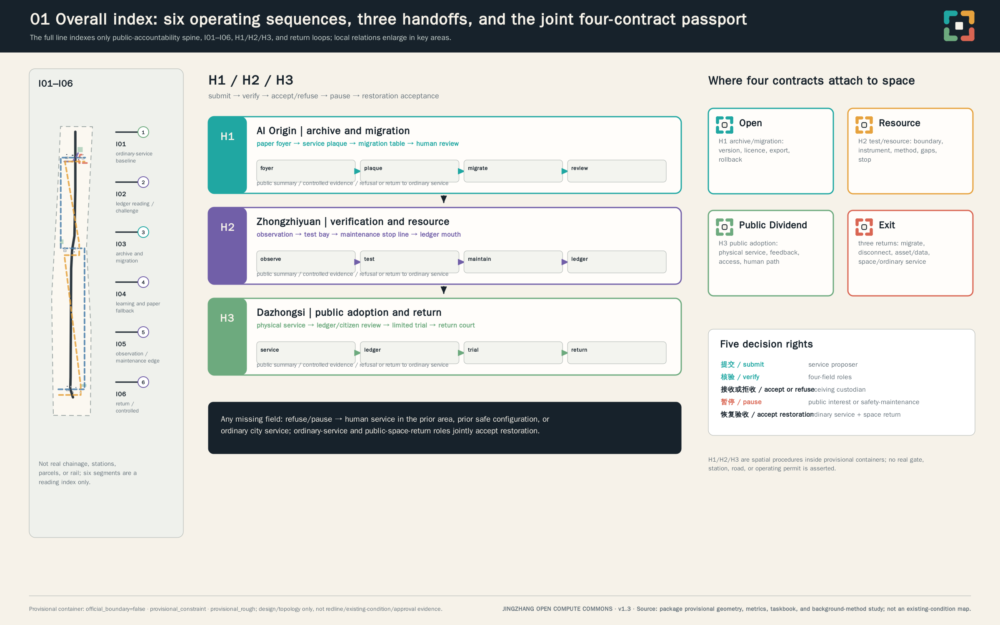
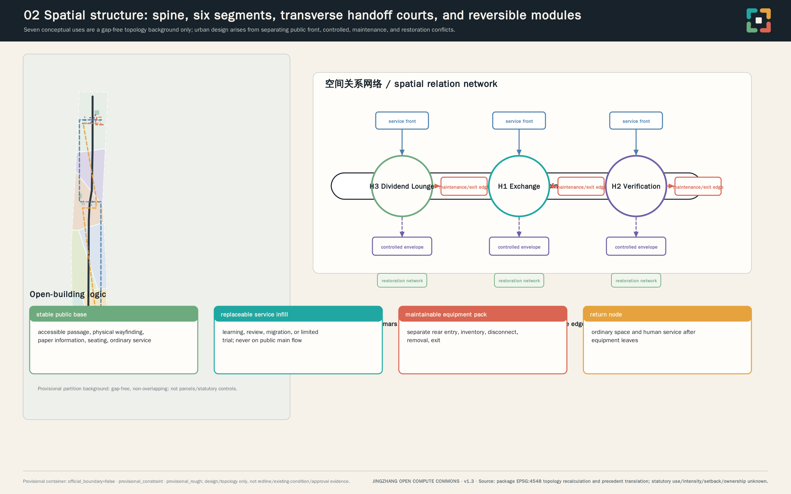
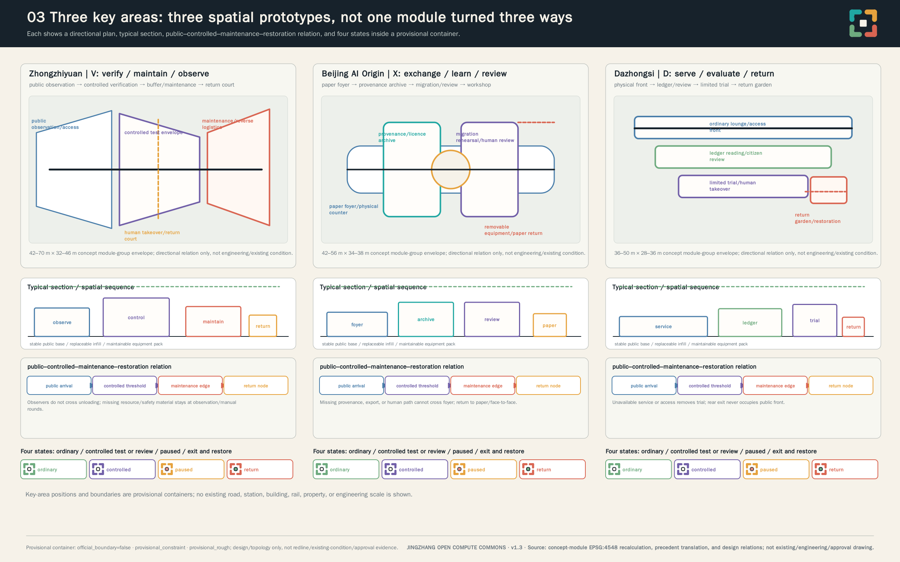
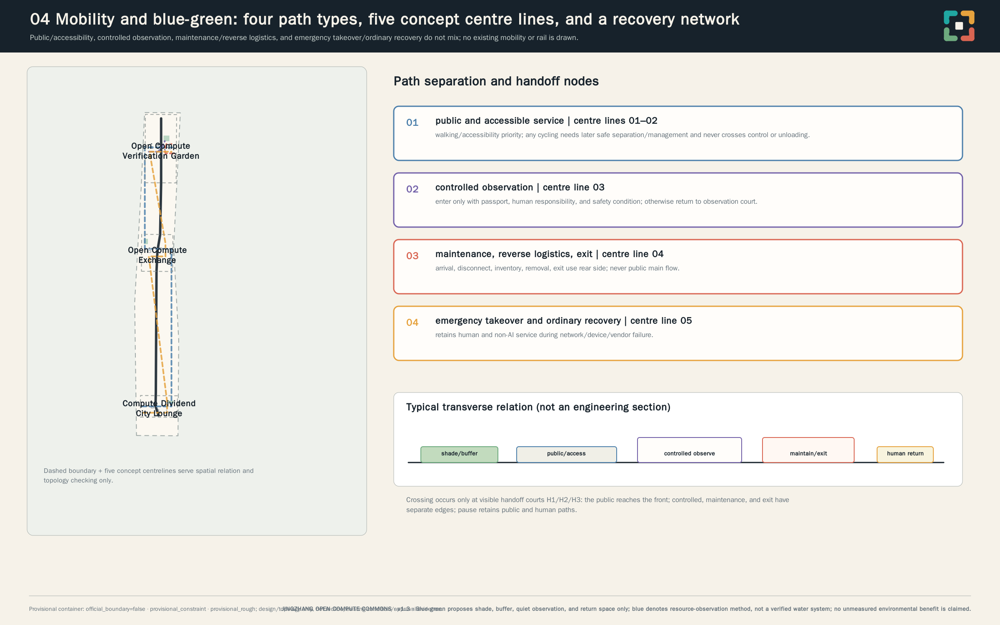
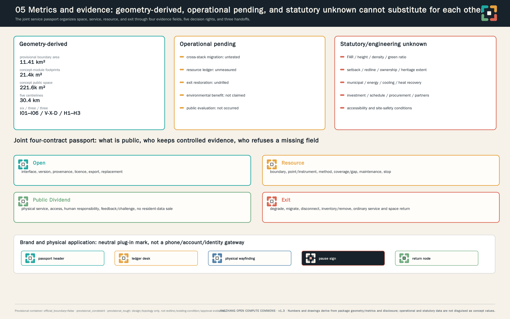

# JINGZHANG OPEN COMPUTE COMMONS

Make urban compute connectable, portable, accountable, and retireable, while returning measurable public value.

This is a professional design proposition for a formal open call, not a built, measured, procured, licensed, or officially approved project. “Contract” means an operating-governance frame rather than an executed legal contract; “commons” means a design concept for shared governance and public use rather than an established land right. No site visit, instrument measurement, simulation, vendor test, service deployment, user study, or human professional review is claimed. [source:AGENT-TASKBOOK] [source:PROVISIONAL-BOUNDARIES]

## Design Basis and Source List

The proposal starts by declaring its evidence boundary. Formal-ready inputs are the call announcement, agent taskbook, public urban-design and control-plan references, and land-use classification guidance. They establish the work scope and expression boundary, but do not provide a statutory red line, parcel ownership, building survey, utility capacity, or engineering condition for this project. Comparative cases provide governance methods only: versioned compatibility evidence, public ledgers, resource accounting, and testable exit packages. They are not upgraded into Beijing facts, law, partnerships, or results. [source:OFFICIAL-ANNOUNCEMENT] [source:URBAN-DESIGN-MEASURES] [source:BG-AIVERIFY]

Source hierarchy controls the language of every claim. The announcement and taskbook support task response; provisional geometry supports only design organization, topology checks, and low-contrast diagrams; international references support only method comparison. No OSM, news screenshot, text-boundary description, or bounding box is treated as official planning geometry. No external imagery, map, company mark, government mark, portrait, or unlicensed typeface is reproduced. The source register records publisher, URL, date, retrieval method, coverage, licence, transformation, and limitation so reviewers can distinguish public fact, transferred method, and unknown local condition. [source:SOURCE-REGISTRY] [source:FACT-PACK]

The official file for *Code for Design Document Depth of Architectural Engineering (2016)* has not been obtained. The repository records `source_status=needs_official_file` and `reference_fetch_status=missing_source_url`; it is not a formal mandatory standard. This proposal can therefore record only an architectural-depth evidence gap and a future evidence-acquisition task: it does not claim formal compliance and does not substitute the *Urban Design Measures*, another standard, a mirror, or a directional drawing as its source. [standard:MOHURD-ARCH-DESIGN-DEPTH-2016] [depth:risk_missing_data]

The design judgment is that urban AI should be evaluated not by equipment scale or degree of automation, but by whether a service can explain how it connects, what it consumes, what public value it returns, and how it stops while ordinary service continues. The four contracts are therefore a single admission sheet: a service without export/version evidence, resource ledger, human fallback, or exit manual cannot enter public space or expand. Official geometry, existing-condition survey, heritage/property review, utilities, accessibility, data protection, and procurement remain professional follow-up. [standard:PROJECT-OFFICIAL-ANNOUNCEMENT] [depth:existing_conditions_diagnosis]

### Precedent Translation: From Verifiable Mechanism to Jingzhang Action

v1.3 studies eleven international and domestic case, standard, and method units, strictly as comparative tools of “mechanism cue—local condition—failure destination”; the full matrix is in `report/narrative.md`. Rail precedents lead to an overall index, enlarged segments, and a few handoff nodes—not a linear site reduced to a landscape strip. Open-building and reversibility precedents lead to a stable public base, replaceable infill, and maintainable equipment pack—not imitation of any project appearance. Public-AI and exit references lead to a three-level record of public summary, controlled evidence, and missing-data/refusal—not overseas rules rewritten as Beijing institutions. If accessibility, heritage, property, utilities, data protection, procurement, or operations conditions are not later obtained, the action returns to ordinary service, prior safe configuration, or professional study; it cannot deploy by analogy. [source:PRECEDENT-SG-RAIL-CORRIDOR] [source:PRECEDENT-BAMB-REVERSIBLE] [source:BG-EU-DATA-ACT-2023]

## Three-Level Scope Framework

The three levels are used as working depth, not as invented statutory hierarchy. The coordinated research level addresses Jingzhang connection, Zhongguancun innovation ecology, and continuity of civic service. The overall design level positions the four contracts in renewal, walking/cycling, public interface, and infrastructure relationships. The key-area level tests spatial carrier, accountability, and exit capability in three distinct roles. They connect through service package, resource ledger, public interface, and exit package—not through an asserted new data-center corridor. [source:OFFICIAL-ANNOUNCEMENT] [depth:three_level_scope_framework]

Current upstream/main contains no trusted official polygon. The submitted overall and key-area boundaries are therefore explicitly official_boundary=false, geometry_role=provisional_constraint, and boundary_precision=provisional_rough. They can support a temporary gap-free functional partition and relationship diagrams; they cannot support official redline, precise site area, statutory control, road redline, ownership conclusion, engineering feasibility, or approved-implementation claim. When official geometry arrives, all nine GeoJSON layers, every area/ratio/path length, graphics, PDFs, HTML, and boundary-dependent text must be recalculated. [data:geometry/site_boundary.geojson#PROV-SITE-001] [data:geometry/key_areas.geojson#PROV-KEY-001]

The provisional condition is designed to remain visible: it is a low-contrast dashed constraint in graphics. Railway, road, station, and water relationships beyond that constraint are not presented as verified existing conditions. The three key areas are directional containers derived from announced names, order, and rough area constraints; the proposal never reads their coordinates as exact parcel, station, road, or building location. [source:PROVISIONAL-BOUNDARIES] [depth:risk_missing_data]

## Coordinated Research Area: Industry and Future City Research

Jingzhang Open Compute Commons reads the railway not as a symbol to copy, but as an ethic of compatible infrastructure: interfaces connect, transfer keeps service continuous, and maintenance and return must be visible. Zhongguancun innovation culture becomes open tools, reproducible methods, and accountable responsibility. AI culture does not pursue frictionless automation; it sets a minimum in which a person can understand, choose, refuse, and restore ordinary service. The original identity uses interfaces, junctions, plug-in modules, heat/resource flows, public ledgers, and migration gates rather than a line-based motif. [source:AGENT-TASKBOOK] [depth:overall_spatial_structure]

The name system is 京张开放算力公地 | JINGZHANG OPEN COMPUTE COMMONS. v1.3 makes the language-neutral core mark real: four unfinished plug-in corners meet a replaceable central junction; their openings code Open, Resource, Public Dividend, and Exit rather than railway, institutional, or company marks. Figure 05, the A3 booklet, and A0 boards show the wordless mark, Chinese lock-up, English lock-up, monochrome, high-contrast, and low-ink versions; the same mark appears on the service passport, resource-ledger table, physical wayfinding, and return node. Deep graphite grounds type; teal, amber, green, and warm brick pair with the four contracts; shape, number, and wording always accompany colour. Only local system type is used and no external font is distributed. [source:AGENT-TASKBOOK] [depth:height_massing_character]

The identity compresses the project into one testable memory line: **four evidence columns, five decision rights, three spatial handoffs.** It names the passport’s four evidence fields; submit, verify, refuse, pause, and restoration acceptance; and the three handoffs from Zhongzhiyuan through AI Origin to Dazhongsi. It is not an existing institution, rule, or authorization. [depth:overall_spatial_structure] [depth:phasing_implementation]

The Three Zones and Two Wings form a handoff loop with a right to refuse. Zhongzhiyuan is the Open Compute Verification Garden for multi-vendor interfaces, edge compute, robotic interoperability, energy/heat/noise records, and shutdown; it outputs only controlled-verified service and evidence packages. Beijing AI Origin is the Open Compute Exchange for research transfer, open tools, shared scheduling, migration drills, licensing, and human review; it accepts only exportable packages with clear rights boundaries. Dazhongsi is the Compute Dividend City Lounge for public-service adoption, AI-native commercial interfaces, human fallback, public ledgers, and citizen evaluation; it accepts limited public evaluation only when human path, ledger, and exit packet are readable. What transfers between zones is an auditable service package—not unexplained data, equipment, or public. A failed package is refused, returned to controlled verification, or kept on ordinary service. The Zhongguancun service wing supplies front-end standards, IP, compliance, procurement, finance, open-source governance, and international-cooperation preparation, and cannot approve its own service object. The Xiaoyue River wing permits limited, reversible observation of microclimate, robotics, public-space operation, and edge infrastructure only after the preceding handoff evidence is complete. [standard:PROJECT-AGENT-OPEN-CALL-TASKBOOK] [depth:overall_spatial_structure]

North Latitude Community, Future Science City, Huairou Science City, Beijing Economic-Technological Development Area, and Jing-Jin-Ji are only conceptual interface objects here: they may later use the same passport to compare portability, resource method, public dividend, and exit material. This does not mean that any area, institution, or party has agreed to cooperate, procure, deploy, or receive a service. [source:AGENT-TASKBOOK] [depth:phasing_implementation]

| Future comparable material format | Handoff content | It cannot claim |
|---|---|---|
| Portable service package | Interface, version, licence, export, and substitution record | Actual deployment, cross-area transfer, or receiving commitment |
| Resource-method package | Sampling method, coverage/gaps, maintenance, and shutdown record | Energy, heat, cooling, water, or noise performance |
| Public-service package | Beneficiary, non-AI equivalent, accessibility, human responsibility, and appeal | Personal-data exchange, profiling, or automatic eligibility decision |
| Exit/restoration package | Migrate, disconnect, asset inventory, ordinary-service and space-return acceptance | Signed collaboration, procurement, or construction implementation |

This table formats future comparable material; it is not a partner map, transport route, or regional deployment list. [depth:phasing_implementation]

Comparative background sources are strictly bounded: AI Verify suggests test/process/report structure; OCP suggests versioned interface evidence; EuroHPC suggests access and post-allocation review; LUMI requires producer–receiver–handoff–operator and metering before any heat-dividend assertion; Amsterdam suggests a readable register; DPGA suggests public-value gates; OSI suggests provenance/export packets; DWP suggests reversible exit. None of these is a Beijing fact, approval, certification, or partnership. [source:BG-OCP-OPENRACK] [source:BG-LUMI-HEAT] [source:BG-DWP-EXIT]

## Overall Design Area: Urban Renewal and Regulatory-Plan-Level Urban Design

The overall design move is one spine, four ledgers, three courts, and two wings. The spine is the Jingzhang railway-heritage park as a public accountability and experience spine: it shows where service comes from, what it consumes, what it returns, who is responsible, and how it stops. It is not a speculative data-center corridor. The four ledgers are interface archive, resource ledger, public-dividend register, and exit/restoration manual. The three courts are Verification Garden, Exchange, and Dividend Lounge. Every technology mechanism has a spatial carrier, affected user, accountable role, entry prerequisite, proposed measurable indicator, stop condition, and ordinary-city fallback. [standard:MOHURD-URBAN-DESIGN-MEASURES] [depth:municipal_new_infrastructure]

The contracts are a single system. The Open Contract requires auditable interfaces, data/service export, portability, vendor replacement, version and provenance. The Resource Contract requires energy, heat, cooling, water, noise, operating hours, maintenance, retention boundary, degradation, and shutdown records. The Public Dividend Contract requires shared compute, education, accessible service, public-space or microclimate method, reproducible tests, and no exploitation or sale of resident data as the business model. The Exit Contract requires degradation, migration, disconnection, removal, restoration of ordinary public space, and permanent non-AI paths. A missing contract blocks public use or expansion. [source:BG-DPGA-STANDARD] [source:BG-OSAID] [source:BG-DWP-EXIT]

Every proposed service therefore carries a versioned “service passport”: interface/export/provenance, resource ledger/method, public dividend/human path, and exit/restoration are separate fields, alongside admission, refusal, pause, and rollback decisions. It is not an existing administrative permit or legal agreement; it is a future auditable joint admission sheet. A failed field prevents zone transfer, public-space entry, or expansion. The passport, handoff checklist, export-package completeness check, human-continuity confirmation, and return record are the minimum future evidence artifacts for professional review. [source:BG-OSAID] [source:BG-DWP-EXIT] [depth:municipal_new_infrastructure]

### Three Spatial Handoffs: Turning the Passport into Enterable Thresholds

H1 at Beijing AI Origin is an archive/migration handoff of printable service plaque, migration rehearsal table, and human review room. Its Open field must hold a public summary, controlled evidence packet, export scope, and reason for any non-exportable element; missing licence, version, human path, or responsibility is refused at the foyer and returns to ordinary consultation, paper, telephone, or prior safe configuration. H2 at Zhongzhiyuan is a test/resource handoff of observation gallery, controlled test bay, maintenance stop line, and resource-ledger mouth. Its Resource field must show boundary, measurement point/instrument, method, coverage/gaps, maintenance/calibration, and stop authority; without them it remains observation and manual rounds and claims no environmental benefit. H3 at Dazhongsi is a public-adoption/return handoff of physical service counter, ledger reading/citizen review, limited trial, and return court. Public Dividend and Exit fields must be readable together, and ordinary-service and public-space-return roles jointly accept restoration before occupation ends. All three have paper/large-print/human-explainable state boards; the controlled side holds evidence and maintenance records, and no one is excluded for lacking a phone, account, or digital identity. [source:BG-AMSTERDAM-REGISTER] [source:BG-EU-DC-REPORT-2024] [depth:three_key_area_detailed_design]

### Joint Four-Contract Service Passport: Fillable Fields and Accountability

| Field | Minimum evidence to enter | Proposed verification and decision | Destination if it fails |
|---|---|---|---|
| Open | Interface/version, provenance/licence, export package, substitution-drill scope | Interface verifier checks; receiving-area passport custodian may refuse | Return to service proposer or original safe configuration |
| Resource | Operating hours, sampling method and coverage/gaps, maintenance, degrade/shutdown | Resource-ledger role checks; safety-maintenance role may pause | Shut down, use manual rounds, or do not enter controlled operation |
| Public Dividend | Beneficiary, non-AI equivalent, accessibility/human responsibility, challenge/appeal | Public-interest and accessibility roles check; may pause public interface | Retain paper, telephone, face-to-face ordinary service |
| Exit | Migrate, disconnect, asset inventory, data disposition, remove, restore space/ordinary service | Exit-restoration role checks; ordinary-service and space-return roles accept | Equipment does not enter the next space until ordinary state returns |

This is a proposed RACI, not an organization chart: the service proposer is Responsible for submitted facts (R); four verification roles are Responsible for Open, Resource, Public Dividend/accessibility, and Exit/restoration (R); the receiving-area passport custodian is Accountable for acceptance/refusal (A); affected users, maintenance, and data roles are Consulted (C); printable ledger summary, restoration state, and refusal reason are Informed publicly (I). A public-interest or safety-maintenance role may pause independently; ordinary-service and space-return roles jointly accept restoration. No real organization, partnership, procurement, or authorization is implied. [depth:phasing_implementation] [depth:municipal_new_infrastructure]

Project screening checks six conditions first: a non-AI equivalent and accessible physical entry; data minimisation with retention/deletion boundary; exportable interface/version and substitution drill; small reversible space separating public, controlled, maintenance, and emergency takeover; a resource method rather than a pre-claimed environmental benefit; and exit, removal, and ordinary-service-continuity acceptance. Later procurement should make export format, replacement test, retention/deletion, asset inventory, maintenance handover, and removal/restoration auditable terms; before official controls, authorization, and accountable parties exist, these remain proposed conditions. [source:BG-OSAID] [source:BG-DWP-EXIT] [depth:renewal_project_list]

Renewal is approached as maintainable, removable, recoverable civic interface rather than technology replacing city. Confirmed public, heritage, structural, or service value should be retained; verifiable spaces may adapt for learning, human service, maintenance, and controlled testing; removal is only a conditional future option after statutory, heritage, structural, property, and restoration review; new modules must be inventoried, detachable, portable, and never block accessibility or ordinary passage. Existing buildings, controls, and utilities are unsurveyed; concept footprints are not existing or approved massing. [data:geometry/buildings.geojson] [depth:retain_renovate_demolish]

Land-use and road layers are temporary functional relationships. Classification vocabulary is used without creating a statutory control plan. Walking/cycling and connection lines represent human-service, maintenance, and exit routes, not road redlines or traffic engineering. Municipal, energy, cooling, heat recovery, water, fire, and structural capacity remain unknown. Resource testing can only begin with applicable authorization, calibrated instruments, manual shutdown, accountable maintenance, and restoration plan; before that, no energy, cooling, noise, or heat-recovery benefit is asserted. [standard:MNR-LAND-USE-CLASSIFICATION-GUIDE] [data:geometry/roads.geojson] [depth:traffic_rail_slow_parking]

## Detailed Design of Key Areas

The three key areas remain provisional containers, but v1.3 develops each into a readable directional plan, typical section/spatial sequence, public–controlled–maintenance–restoration relationship, and four-state strip. The three spatial grammars share stable public base, replaceable service infill, and maintainable equipment pack: the base carries accessible passage, physical wayfinding, seating, paper information, and ordinary service; the infill carries reversible learning, review, or trial; the equipment pack enters only through a separate maintenance side. They are not structural, fire, MEP, disassembly, or approval designs; all scale ranges are EPSG:4548 recalculations of existing conceptual module envelopes. [source:PRECEDENT-BAMB-REVERSIBLE] [source:BG-ISO-20887-DFDA] [data:geometry/buildings.geojson]

**Zhongzhiyuan | Open Compute Verification Garden (V family).** Its directional plan is public observation/interface table → controlled test envelope → thermal/noise/safety buffer → maintenance and reverse-logistics edge → human takeover/return court. Public arrival and accessible observation stay outside; the controlled threshold is central; equipment arrival, disassembly, and exit use only the rear edge and return court before public evaluation. Its typical section reads observation face—controlled face—maintenance face—restoration face, never taking a visitor through test or unloading. The four existing concept-module-group envelopes are about 42–70 m × 32–46 m, describing only directional spatial carrying capacity rather than equipment, load, fire, or noise engineering. In ordinary state the observation court holds a paper state directory; in test state it shows only pending verification/controlled test/paused; in pause or exit it removes equipment, closes the controlled face, and restores human maintenance and ordinary court. H2 stops and returns to observation/maintenance if calibration, coverage, method, stop authority, maintenance edge, or restoration material is missing. [data:geometry/key_areas.geojson#PROV-KEY-001] [source:BG-AIVERIFY] [source:BG-EU-DC-REPORT-2024]

**Beijing AI Origin | Open Compute Exchange (X family).** Its directional plan encloses a court through non-digital public foyer/paper fallback → licence/provenance archive → migration rehearsal and human review → learning workshop and removable equipment. A physical counter and accessible entrance are outermost; archive and review are semi-controlled middle layers; equipment interfaces sit to the rear, so a person can complete inquiry, paper application, or telephone referral without crossing review or back-of-house space. Its typical section separates foyer, archive ring, rehearsal/workshop, and paper restoration counter. At H1, a service plaque in the foyer explains purpose, version, responsibility, human path, current state, and question route. The four concept-module-group envelopes are about 42–56 m × 34–38 m and are relationship scales only. If provenance, right, export, or human service is unclear, H1 refuses and returns to ordinary inquiry and paper/telephone/face-to-face workflow; it cannot hand off to Dazhongsi. [data:geometry/key_areas.geojson#PROV-KEY-002] [source:BG-AMSTERDAM-REGISTER] [source:BG-EU-DATA-ACT-2023]

**Dazhongsi | Compute Dividend City Lounge (D family).** Its directional plan layers physical service front → ledger reading/citizen-review court → limited trial and human takeover → return garden and ordinary-service restoration from outside inward. Ordinary lounge, static wayfinding, human counter, and accessible path always precede digital trial; maintenance/removal uses a separate rear side and does not occupy the public front. Its typical section places outer ordinary service, middle printable ledger/question form, inner removable trial, and rear restoration position together; after failure or exit only the first two and the return court remain. The four concept-module-group envelopes are about 36–50 m × 28–36 m, only as conceptual references. H3 removes the digital interface and returns to physical wayfinding, human inquiry, paper/telephone service, and ordinary city lounge if information is stale, the human counter is closed, an accessible path is blocked, feedback is not reviewed, or exit material is incomplete. Any station-area relationship remains conditional on future rights/operation/accessibility verification. [data:geometry/key_areas.geojson#PROV-KEY-003] [source:BG-HELSINKI-AI-REGISTER] [depth:blue_green_public_space]

All three have public arrival courts, resource-method interfaces, human counters, maintenance/reverse-logistics edges, and return nodes, making the four contracts visible components rather than legend entries. The Jingzhang railway-heritage park remains only the accountability and experience spine: when deactivated, the Interface Registry Table returns to a paper service directory, Resource Ledger Court to printable static explanation, Migration Gate to human handover, and Return Table to ordinary sitting and maintenance. It does not assert verified heritage extent, rail, road, station, ownership, or engineering intervention. [source:PRECEDENT-SG-RAIL-CORRIDOR] [depth:blue_green_public_space]

## AI Innovation Ecosystem, Personas, and AI+ Scenarios

Seven non-scored human categories guide the design: residents, researchers, startups, students/teachers, maintenance workers, older or disabled users, and visitors. They identify different spatial entries, information formats, responsibilities, and fallbacks; they do not create personal profiles, behavioral profiles, or social scores. No public AI service can lack a non-AI equivalent. No phone, screen, account, or face can be the only entry. No system can automatically decide eligibility, medical, legal, enforcement, or planning matters, and no biometric surveillance or persistent public tracking is allowed. [source:AGENT-TASKBOOK] [depth:existing_conditions_diagnosis]

Three complete industrial protocols precede expanded public service. The Cross-stack Portability Test checks whether export, version, licence, user rights, and human service migrate together. The Energy–Thermal Budget Test records power, temperature, noise, and service state under controlled conditions; proposed stop/degrade logic includes instrument failure, unreliable data, exceeded applicable safety envelope, unexpected public impact, or failed human fallback, while numeric thresholds await baseline, equipment material, and professional review. The Exit-and-Restoration Test checks ordinary-space and non-AI recovery after network failure, vendor exit, retirement, or closure. None has been conducted; all listed artifacts are future evidence requirements, not present results. [source:BG-AIVERIFY] [source:BG-DWP-EXIT] [depth:municipal_new_infrastructure]

The proposed service-package loop is: S05 licensing/provenance clinic makes the boundary readable; S01 establishes portability; S02 establishes resource method and ledger; S06 or S10 can only observe in controlled conditions; S04, S07, and S11 can then offer limited service with human staff; S08 and S12 collect printable explanation and issue loop; S03 prepares exit for failure, retirement, or event closure. It is not a mandatory linear script: every service still returns to all four contracts and cannot advance with missing evidence. S01–S12 use the same proposed decision-right triad—activation approval, pause instruction, and restoration acceptance. The respective roles must be able to stop independently, confirm the human and accessible path still operates, and record the reason to continue, hold, roll back, or exit. [source:BG-AIVERIFY] [source:BG-DWP-EXIT] [depth:phasing_implementation]

### Scenario-Card General Rule: Joint Four-Contract Decision Chain

S01–S12 share one fillable, auditable decision chain: a service-proposer role submits; four roles verify their Open, Resource, Public Dividend/accessibility, and Exit/restoration fields; the receiving-area passport custodian accepts or refuses; a public-interest or safety-maintenance role may pause independently; ordinary-service and space-return roles jointly accept restoration. Every card remains proposal-level, undeployed, unmeasured, and unprocured—not a test result, certification, public-service commitment, or human review.

Each card must leave three information layers: a paper/large-print/human-explainable public summary; controlled-side version, method, maintenance, export, or asset evidence; and an explicit missing-data/refusal reason. Ordinary-service continuity is not a repeated footnote: paper, telephone, face-to-face, physical-wayfinding, or manual-maintenance routes remain available through pause, network failure, vendor exit, or removal; phone, screen, account, or face can never be the only entry. Automated eligibility, medical, legal, enforcement, or planning decisions; biometric surveillance; persistent tracking; profiling; social scoring; and commercial exploitation of resident data are outside the scenario scope. [source:AGENT-TASKBOOK] [source:BG-DWP-EXIT] [depth:phasing_implementation]

The three industrial protocols share “claim—method/process check—evidence report—decision,” not “test equals safe.” S01 focuses on export, target stack, and rollback; S02 on boundary, measurement point/instrument, calibration, and gaps; S03 on dual acceptance of asset/data and ordinary-service/public-space return. Controlled testing cannot automatically become public service, and an environmental method cannot become environmental performance. [source:BG-AIVERIFY] [source:BG-EU-DATA-ACT-2023] [source:BG-EU-DC-REPORT-2024]

### S01 | Cross-stack portability test

- User/persona: Researcher, startup engineer, and service steward
- Location or spatial type: Migration rehearsal room in the Open Compute Exchange and compatibility bench in the Verification Garden
- Purpose: Test whether a service can move across models, compute platforms, or device stacks while preserving evidence, user rights, and human service.
- Minimum input data: Authorized synthetic or non-sensitive test tasks, service package, interface/data schema, version and licence list, retention/deletion rules, and a non-AI service script.
- Output: Migration record, export-package completeness check, version-difference note, and human-path confirmation; no performance result is claimed.
- Proposed pass/return condition: Re-import succeeds on an independent target stack and interface, version, licence, retention/deletion rule, user right, and non-AI script are checked item by item. Failure rolls back the original safe configuration and cannot enter limited public evaluation.
- Non-AI equivalent: Manual file handover, paper or telephone service process, and face-to-face technical support.
- Human responsibility: The service steward approves migration; the data steward confirms input boundaries; the maintenance steward confirms equipment safety.
- Privacy and security boundary: No resident records, biometrics, or persistent identifiers; test logs cannot be used for personal profiling.
- Entry condition: All four contract records are complete, licence/data conditions are clear, a human fallback script works, and the controlled setting has applicable authorization.
- Stop condition: Stop for missing licence or version evidence, unauthorized inputs, broken human path, or safety/service risk.
- Restoration action: Close the instance, clear test copies by declared rule, restore human service and the prior safety configuration, and return the testing space.
- Evidence artifact: Service inventory, migration log, interface comparison, export/deletion record, migration-difference and rollback confirmation, and human-fallback confirmation.
- Review cycle: Before and after every migration; proposed quarterly governance review.
- Refusal/return and destination: If the target stack cannot re-import, or interface, version, licence, right, or non-AI script is missing, refuse and return to safe configuration and human support; never enter public evaluation.
- Implementation status: Proposal-level only; not deployed, measured, procured, or presented as an implementation commitment.

### S02 | Energy–thermal budget test

- User/persona: Facility maintenance worker, nearby public-space user, and service steward
- Location or spatial type: Controlled test bay, maintenance strip, and thermal court in the Verification Garden
- Purpose: Record power, temperature, noise, and service state under controlled conditions, creating a resource-ledger method rather than an environmental-benefit claim.
- Minimum input data: Calibration state, equipment state, timestamps, power, temperature/humidity, noise, and service-load class; water conditions and gaps only where applicable.
- Output: Raw records, sampling method, calibration record, resource ledger, and anomaly note; no unmeasured values are filled in.
- Method boundary: Sampling plan first records controlled/public exposure spatial type, reference condition, coverage period, and missing-data flag. Facility steward and public-realm/accessibility steward respectively hold proposed device-degrade/power-down and public-approach pause authority.
- Non-AI equivalent: Manual temperature/noise rounds, handwritten maintenance record, and limited service hours.
- Human responsibility: Facility steward defines controlled conditions; maintenance crew inspects; service steward degrades or stops the service.
- Privacy and security boundary: No faces, voice, personal location, or resident behavior; retain only necessary non-identifying environmental data.
- Entry condition: Safety and authorization conditions are clear, instrument method and calibration are recorded, and a manual shutdown path works.
- Stop condition: Stop for instrument failure, unreliable data, exceeded applicable safety envelope, unexpected thermal/noise risk, or broken manual fallback. Numeric thresholds await baseline and professional review.
- Restoration action: Stop or degrade equipment, remove temporary components, and restore ordinary ventilation, maintenance, and public-space use.
- Evidence artifact: Sampling plan, point–coverage–missing table, raw data, calibration proof, equipment-state log, dual-key stop/reset confirmation, anomaly/shutdown record, and restoration checklist.
- Review cycle: Each controlled run; proposed periodic facility review.
- Refusal/return and destination: If calibration, coverage, method, shutdown, or public-safety condition is incomplete, refuse controlled operation and return to manual rounds and limited service hours; never fabricate readings.
- Implementation status: Proposal-level only; not deployed, measured, procured, or presented as an implementation commitment.

### S03 | Exit-and-restoration test

- User/persona: Maintenance worker, public-service worker, older or disabled user, and resident
- Location or spatial type: Reversible nodes, human counters, and exit-restoration reserve spaces across the three key areas
- Purpose: Test whether a node can restore ordinary public space and non-AI service after network failure, vendor exit, retirement, or event closure.
- Minimum drill cases: Network interruption, vendor exit, equipment retirement, and event close each activate a non-AI path; restoration acceptance jointly confirms ordinary service, passage/accessibility, temporary-component removal, and data disposition.
- Minimum input data: Asset inventory, service-dependency map, exit manual, data retention/deletion boundary, public-space baseline record, and non-AI service workflow.
- Output: Exit-drill record, human-service continuity confirmation, removal inventory, and restoration checklist; no field drill is claimed.
- Non-AI equivalent: Physical counter, paper form, telephone inquiry, manual maintenance, and static wayfinding.
- Human responsibility: Asset steward starts exit; service steward maintains human service; facility steward isolates/removes equipment; public-realm and accessibility stewards accept physical return; data steward confirms retention/deletion boundary.
- Privacy and security boundary: Exit logs minimize personal information; resident data cannot be exported, retained, or reused under cover of exit.
- Entry condition: Exit responsibility, asset custody, restoration materials, and human-service shift are clear; drill is isolated from essential live service.
- Stop condition: Immediately stop and switch to human handling if the drill affects essential service, safety, accessible passage, or an unauthorized system.
- Restoration action: Disconnect and inventory equipment, handle authorized data, remove temporary components, and restore passage, planting, seating, signage, and non-AI service.
- Evidence artifact: Exit-manual version, asset inventory, before/after restoration record, human-service confirmation, and data-disposition record.
- Review cycle: Before activation, expansion, retirement, and after major dependency changes.
- Refusal/return and destination: If asset, data-disposition, human-shift, accessibility, or restoration material cannot be checked, refuse the drill and use human handling under real-service protection.
- Implementation status: Proposal-level only; not deployed, measured, procured, or presented as an implementation commitment.

### S04 | Shared-compute booking and human scheduling desk

- User/persona: Researcher, startup engineer, and student
- Location or spatial type: Service counter in the Open Compute Exchange
- Purpose: Allocate shared resources by an explainable, replaceable process without personal scoring or automatic eligibility decisions.
- Minimum input data: Voluntary resource request, task class, requested time, and minimal institution/project verification; no behavioral profile.
- Output: Booking record, waiting explanation, and link to service version and resource ledger.
- Non-AI equivalent: Paper application, telephone booking, and face-to-face human scheduling.
- Human responsibility: Scheduling steward explains rules, resolves conflicts, and retains human exceptions.
- Scheduling dispute: Publish versioned allocation principles, categories of reason for human exceptions, and a review/appeal entry. Personal profile, protected characteristic, and commercial surcharge cannot decide priority.
- Privacy and security boundary: No personal profile, credit score, or social score; retain only booking-needed information with a stated retention limit.
- Entry condition: Resource availability, human-service shifts, public rules, and exit path are clear.
- Stop condition: Stop if the ledger is unreadable, rules are unexplained, human counter is unavailable, or data minimization fails.
- Restoration action: Suspend automated scheduling and switch to a human waiting list and paper notice.
- Evidence artifact: Rule version, aggregated booking statistics, aggregated exception/dispute record, and continuity checklist.
- Review cycle: At each rule change; proposed monthly fairness and accessibility review.
- Refusal/return and destination: If public rule, human counter, data minimisation, or non-AI application route is missing, refuse automated scheduling and return to paper, telephone, and face-to-face waiting list.
- Implementation status: Proposal-level only; not deployed, measured, procured, or presented as an implementation commitment.

### S05 | Open-source transfer and licensing clinic

- User/persona: Researcher, startup engineer, and student
- Location or spatial type: Archive room and consultation room in the Open Compute Exchange
- Purpose: Turn versions, provenance, licence, and exportability of models, tools, and services into checkable transfer conditions.
- Minimum input data: Software bill of materials, licences, version record, training/deployment restrictions, and proposed service description.
- Output: Provenance/licence checklist, export/replacement advice, and items requiring human review.
- Non-AI equivalent: Human IP/compliance consultation, paper archive, and face-to-face technical discussion.
- Human responsibility: Licence/compliance steward explains; service steward retains final decision.
- Privacy and security boundary: No resident data, trade secrets, or unauthorized source code; sensitive materials have minimum access.
- Entry condition: Material ownership/licence boundary is explainable and proposed service has a human steward.
- Stop condition: Stop for unclear licence, untraceable provenance, unauthorized data, or failed exportability.
- Restoration action: Stop transfer and return to human consultation and prior non-AI workflow.
- Evidence artifact: Material inventory, licence checklist, version archive, and human-opinion record.
- Review cycle: After every version or licence change.
- Refusal/return and destination: If licence, provenance, export, or sensitive-material boundary is unclear, refuse transfer and return to human compliance consultation and prior non-AI workflow.
- Implementation status: Proposal-level only; not deployed, measured, procured, or presented as an implementation commitment.

### S06 | Robotic interoperability and public-space maintenance drill

- User/persona: Maintenance worker, facility steward, and controlled observer
- Location or spatial type: Controlled test field in the Verification Garden; authorized limited test point in the Xiaoyue River enabling wing
- Purpose: Test device and maintenance-process interoperability under isolated, stoppable conditions; never move unverified robots into open pedestrian flow.
- Minimum input data: Test-area constraint, device-interface version, task list, safety boundary, and human-takeover procedure.
- Output: Compatibility record, human-takeover record, and maintenance-process improvement items.
- Non-AI equivalent: Manual cleaning, inspection, handling, and facility check.
- Human responsibility: On-site safety steward, device operator, and maintenance crew jointly control; machine never replaces responsibility.
- Privacy and security boundary: No biometrics or pedestrian tracking; unauthorized devices never test in open public flow.
- Spatial states: Public walking/observation interface, controlled robot/maintenance area, and manual emergency-takeover/egress strip cannot mix; a first boundary change or pedestrian entry stops the drill.
- Entry condition: Controlled boundary, operator, applicable authorization, and manual emergency stop are clear.
- Stop condition: Stop for boundary breach, lost control, interface anomaly, pedestrian entry, or failed human takeover.
- Restoration action: Manually stop, remove device, inspect site, and restore ordinary manual maintenance.
- Evidence artifact: Safety checklist, interface version, takeover log, and site-restoration record.
- Review cycle: Before and after each drill.
- Refusal/return and destination: If boundary, authorization, operator, manual stop, or public separation is incomplete, refuse the drill and return to manual cleaning, inspection, and handling.
- Implementation status: Proposal-level only; not deployed, measured, procured, or presented as an implementation commitment.

### S07 | Dual-channel accessible service counter

- User/persona: Older or disabled user, resident, and public-service worker
- Location or spatial type: Main entry and physical counter in the Compute Dividend City Lounge
- Purpose: Provide understandable civic-service information and human referral, ensuring an AI interface is never the only entry.
- Minimum input data: User-selected service category and, only if needed, minimal contact information recorded by a human.
- Output: Paper, spoken, or accessible-format explanation, human-referral record, and optional digital-service link.
- Non-AI equivalent: Physical counter, telephone, paper form, large-print material, and human wayfinding.
- Human responsibility: Counter steward explains and handles exceptions; system cannot make automatic eligibility, medical, legal, enforcement, or planning decisions.
- Privacy and security boundary: No biometrics, profile, or mandatory registration; contact data is separated from service content.
- Entry condition: Human is on duty, accessible materials are available, and non-AI path has been confirmed operable.
- Stop condition: Stop if content cannot be confirmed, human counter closes, accessible material is missing, or output could be mistaken for a decision.
- Restoration action: Immediately switch to human, telephone, and paper service and remove uncertain digital interface.
- Evidence artifact: Accessible-material version, human-path confirmation, issue classification, and correction record.
- Review cycle: At each content change; proposed periodic accessibility review.
- Refusal/return and destination: If human staffing, accessible material, non-AI route, or content responsibility is incomplete, refuse the digital interface and return to physical desk, telephone, paper, and large print.
- Implementation status: Proposal-level only; not deployed, measured, procured, or presented as an implementation commitment.

### S08 | Public resource-ledger reading table

- User/persona: Resident, student, and visitor
- Location or spatial type: Accountability node in the railway heritage park and Compute Dividend City Lounge
- Purpose: Explain service consumption, operating condition, public dividend, and exit responsibility through an aggregated, readable, printable format.
- Minimum input data: Method-described aggregated resource record, service state, coverage period, gap note, and responsibility role.
- Output: Physical reading board, printable summary, method card, and inquiry referral channel.
- Non-AI equivalent: Poster, paper booklet, human explanation, and telephone inquiry.
- Human responsibility: Ledger steward checks updates; public-service worker explains limitations.
- Privacy and security boundary: Publish only non-identifying aggregate data; no individual location, behavior, account, or device identifier.
- Entry condition: Data method, coverage period, gaps, and responsibility role are public.
- Stop condition: Stop for unexplained method, undisclosed gaps, re-identification risk, or stale display.
- Restoration action: Remove unreliable display; retain the latest verified static explanation and human inquiry.
- Evidence artifact: Ledger version, data dictionary, method statement, and publish/withdraw record.
- Review cycle: At every release; proposed periodic public review.
- Refusal/return and destination: If method, coverage, gaps, responsibility, or re-identification protection is incomplete, refuse publication and return to latest verified static explanation and human inquiry.
- Implementation status: Proposal-level only; not deployed, measured, procured, or presented as an implementation commitment.

### S09 | Compute-literacy and reproducibility workshop

- User/persona: Student, teacher, and researcher
- Location or spatial type: Learning workshop in the Open Compute Exchange and observation interface in the Verification Garden
- Purpose: Help people understand interfaces, licence, resource use, human responsibility, and exit—not only model operation.
- Minimum input data: Openly licensed course material, synthetic example data, versioned exercise package, and non-AI teaching materials.
- Output: Learning material, reproducibility record, and resource/licence understanding checklist.
- Non-AI equivalent: Paper textbook, human demonstration, physical model, and discussion class.
- Human responsibility: Teacher/facilitator is responsible for content, risk explanation, and participant support.
- Privacy and security boundary: No student behavioral profile; minors require applicable educational authorization and protection.
- Entry condition: Material licence is clear, human facilitator is present, and test environment is isolated.
- Stop condition: Stop for licence dispute, sensitive data, missing facilitator, or system security anomaly.
- Restoration action: Close digital exercise environment and switch to paper and human course.
- Evidence artifact: Course version, licence list, reproducibility steps, and issue/revision record.
- Review cycle: Before/after each session and at material update.
- Refusal/return and destination: If course licence, facilitator, isolated environment, or non-AI material is missing, refuse digital exercise and return to paper material and facilitated discussion.
- Implementation status: Proposal-level only; not deployed, measured, procured, or presented as an implementation commitment.

### S10 | Microclimate service observation post

- User/persona: Resident, maintenance worker, and older or disabled user
- Location or spatial type: Authorized temporary observation point in the Xiaoyue River enabling wing
- Purpose: Use minimal environmental data for future shade, ventilation, maintenance, and public-space decisions without claiming cooling or energy results in advance.
- Method disclosure: A future method version states instrument calibration, point spatial type and installation condition, observation window/weather source, coverage and gaps, and removal location. It can form maintenance hypotheses only, never automatically trigger a service decision or environmental-benefit claim.
- Minimum input data: Calibrated environmental instruments, necessary temperature/humidity readings, weather record, and manual maintenance observation; no identifiable imagery.
- Output: Method card, raw record, data-gap note, and proposed maintenance advice.
- Non-AI equivalent: Manual rounds, ordinary thermometer/observation sheet, and routine planting maintenance.
- Human responsibility: Landscape/facility steward confirms method; public-realm steward decides maintenance action.
- Privacy and security boundary: No camera tracking, biometrics, or location traces; environmental data cannot infer personal behavior.
- Entry condition: Authorization, baseline method, calibration, and temporary-facility restoration plan are clear.
- Stop condition: Stop for instrument drift, anomalous data, public safety/comfort issue, authorization conflict, or affected accessibility.
- Restoration action: Close/remove temporary sensor and restore ordinary planting maintenance and public-space arrangement.
- Evidence artifact: Calibration information, sampling method, raw data, maintenance record, and removal record.
- Review cycle: After each controlled seasonal observation window.
- Refusal/return and destination: If authorization, calibration, method, removal plan, or accessibility condition is missing, refuse observation and return to manual rounds and routine planting maintenance.
- Implementation status: Proposal-level only; not deployed, measured, procured, or presented as an implementation commitment.

### S11 | Station-area dual-channel wayfinding and human inquiry

- User/persona: Visitor, resident, and older or disabled user
- Location or spatial type: Compute Dividend City Lounge and an operator-authorized station-area public interface
- Purpose: Guide people to civic service, accessible facilities, and human help without replacing transport-operation decisions.
- Minimum input data: Verified static destination information, accessible route, and service-open status.
- Output: Paper map, physical sign, spoken explanation, and optional digital query.
- Non-AI equivalent: Human inquiry, static sign, paper map, and telephone service.
- Human responsibility: Wayfinding steward maintains information; on-site worker handles uncertainty and exceptions.
- Privacy and security boundary: No device tracking, location trace, or visitor classification/scoring.
- Entry condition: An operations/property steward confirms path/service state, the accessible path and same-day condition are checked, and human inquiry/accessibility material are available. If any condition is missing, retain only static map, human inquiry, and telephone service inside the proposal’s controllable space.
- Stop condition: Stop for stale route, unclear construction/operation status, unavailable accessible path, or absent human confirmation.
- Restoration action: Remove wrong digital prompt and switch to verified static signage and human inquiry.
- Evidence artifact: Wayfinding version, verification record, update record, and human-question classification.
- Review cycle: Before/after every route or operation-status change.
- Refusal/return and destination: If route/operation state, accessibility, human inquiry, or responsibility confirmation is missing, refuse station-area digital connection and return to static sign, telephone, and human inquiry within controllable proposal space.
- Implementation status: Proposal-level only; not deployed, measured, procured, or presented as an implementation commitment.

### S12 | Community maintenance request and non-AI work-order loop

- User/persona: Resident, maintenance worker, and public-realm steward
- Location or spatial type: Dividend lounge, railway-heritage accountability node, and public-space maintenance point
- Purpose: Let residents report equipment, noise, thermal, wayfinding, or public-space issues without dependence on AI or a phone.
- Minimum input data: Issue type, place description, and optional contact information; contact data separated from issue record.
- Output: Work-order identifier, human response path, and public aggregated handling state.
- Non-AI equivalent: Paper comment box, physical counter, telephone repair request, and manual inspection log.
- Human responsibility: Facility steward receives, assigns, and closes work order; public-realm steward confirms restoration.
- Privacy and security boundary: No complainant profile or identity score/surveillance; contact information is retained minimally under public rule.
- Entry condition: Steward, human channel, handling boundary, and retention rule are public.
- Stop condition: Stop for misclassification, sensitive information, unsafe handling, or unavailable digital channel.
- Restoration action: Switch to paper, telephone, and human registration; if needed pause equipment and initiate exit process.
- Evidence artifact: Work-order workflow version, aggregated handling record, human handover, and restoration confirmation.
- Review cycle: Proposed weekly operations review and post-major-event review.
- Refusal/return and destination: If handling boundary, human channel, retention rule, or safe handling is incomplete, refuse digital work order and return to paper, telephone, and human registration.
- Implementation status: Proposal-level only; not deployed, measured, procured, or presented as an implementation commitment.

## Land Use, Building Scale, and Retain-Renovate-Demolish Strategy

The land-use layer is a gap-free, non-overlapping conceptual functional partition under the same provisional site constraint, recalculated in EPSG:4548 and exchanged in EPSG:4326. It no longer uses seven horizontal bands: a public accountability spine, node courtyards, controlled test envelopes, service fronts, maintenance/reverse logistics, and reversible-exit buffers make a relationship network. The seven categories describe temporary functional topology only; they do not constitute statutory land use, a regulatory-plan drawing, road redline, ownership determination, approved parcel, or development capacity. When official boundary and control conditions arrive, the areas and spatial relationships must be verified and recalculated together. [data:geometry/land_use.geojson] [depth:land_use_layout]

Building footprints are conceptual carriers for interface desks, learning workshops, maintenance strips, ledger interfaces, and exit archives—not evidence of existing buildings, approved massing, or construction. Retain decisions require heritage, structural, property, and civic-service verification; adaptation requires MEP, fire, accessibility, and maintenance conditions; removal is only a future conditional option; reversible modules require independent maintenance, asset inventory, and removal route. Since no official boundary, FAR, total floor area, height, density, green ratio, or setback is supplied, every such control is explicitly unknown. [data:geometry/buildings.geojson] [metric:building_footprint_area_sqm] [depth:development_intensity_controls]

Public value is not demonstrated by an AI-building count but by continuity of ordinary city service. Every concept footprint must support a paper, physical, telephone, or face-to-face path before entry. Its device interface must be replaceable, service exportable, resource recordable, and occupation reversible. If maintenance shifts, accountable roles, authorization, accessibility, and recovery plan cannot be assigned, the proposal remains undeployed concept rather than construction or public service. [standard:MOHURD-CONTROL-DETAILED-PLANNING] [depth:retain_renovate_demolish]

## Transport, Rail, Municipal Infrastructure, and Public Services

The transport strategy assumes no new road, rail permission, or station-area connection. Five concept centre lines express four non-mixing paths: public walking/cycling and accessible service front; controlled observation/permit; maintenance/reverse logistics/equipment exit; and emergency takeover/ordinary-service recovery. Each is a relation diagram, not an existing road, rail, station, road redline, or traffic-engineering proposal. Every digital-information route has physical wayfinding, printable material, human inquiry, and ordinary walking/cycling equivalent; no public main flow enters a controlled-test or maintenance-unloading area. Path conflict, accessibility continuity, and removal route require future professional field verification. [data:geometry/roads.geojson] [depth:traffic_rail_slow_parking]

Municipal and new infrastructure follow “verify load before admitting connection.” Edge devices, shared compute, sensors, and robotics may conceptually use detachable bases, independent maintenance strips, and manual emergency stop, but electricity, communications, water, drainage, cooling, fire, noise, loading, and operating hours have no project evidence. The Resource Contract requires method, coverage, gap, maintenance, and stop records before controlled operation. Any proposed thermal or microclimate service needs method, producer–receiver relationship, responsibility, and exit plan; without them it makes no environmental-benefit claim. [source:BG-LUMI-HEAT] [depth:municipal_new_infrastructure]

Facilities are civic interfaces rather than device deployments. The Exchange provides shared scheduling, licensing explanation, and learning; the Dividend Lounge provides physical counter, accessible material, paper service, and referral; the Verification Garden provides maintenance safety and controlled observation; the service wing provides compliance/procurement/replacement preparation; the Xiaoyue River wing only hosts limited reversible tests. Each has proposed service, data, facility, accessibility, and restoration stewards; human responsibility, not system output, bears consequences. [data:geometry/public_space.geojson] [depth:municipal_new_infrastructure]

## Blue-Green Network, Public Space, and Urban Character

Blue-green and public space are not residual equipment sites but visible buffer and restoration interfaces for all four contracts. Dazhongsi return garden, AI Origin quiet-learning buffer, Zhongzhiyuan thermal/noise observation buffer, and continuous public-spine buffer respectively support stopping, reading, separation, maintenance, and ordinary state after removal. Their conceptual coverage is calculated only from submitted geometry; it is neither a statutory green-ratio control nor evidence of cooling, energy, noise, or stormwater performance. Any environmental benefit requires later baseline, instrument, method, coverage period, and public evidence. [data:geometry/green_space.geojson] [metric:public_space_ratio] [depth:blue_green_public_space]

Urban character uses readability, maintenance, and return. Public-facing edges prioritize physical service, resource explanation, human inquiry, maintenance doors, and return space for detachable modules. Equipment maintenance, noise, and safety use buffer courts and controlled thresholds without disguising technical facilities as unconditional landscape. Height, massing, roofscape, heritage protection, and street interface lack statutory inputs, so the proposal supplies compositional direction and material ethic rather than approval-ready control values. [depth:height_massing_character] [depth:blue_green_public_space]

Non-entertainment honor nodes include the Interface Registry Table, recording interfaces, versions, maintenance, and migration responsibility; Resource Ledger Court, showing method, coverage, gaps, and accountable roles; Migration Gate, explaining export, human switch, and transfer; and Return Table, explaining retirement, removal, and ordinary-space restoration. The signage family uses four symbols for interface, resource, public dividend, and exit, with large type, concise Chinese/English, pictogram, physical wayfinding, and human inquiry. QR codes are never sole information. No government marks, company marks, portraits, copyrighted images, or unrecorded-licence fonts are used. [source:AGENT-TASKBOOK] [depth:blue_green_public_space]

## Renewal Projects, Implementation Policy, and Phasing

Implementation uses evidence gates rather than an unsupported construction timetable. G0 “ordinary-service baseline and passport intake” takes non-AI equivalence, accessibility, data boundary, role, and site conditions as input and outputs a minimum passport or return to ordinary service. G1 “controlled verification and resource ledger” takes a G0 pass, separated flows, shutdown, and recording method, and outputs proposed evidence packages for the three protocols or safe shutdown. G2 “limited public evaluation and joint exit” takes readable ledger, human staffing, challenge route, and restoration readiness, and outputs public summary, citizen evaluation, and a “replicate or exit” decision. Custodian, verifier, public-interest/safety pause, and ordinary-service/space-return acceptance roles decide each gate; failure destination is written in geometry/phasing.geojson rather than concealed by dates, investment, collaborators, or schedule. [data:geometry/phasing.geojson] [depth:phasing_implementation]

The project list includes interface/migration archive, resource-ledger table, accessible dual-channel counter, detachable test bay, maintenance safety strip, accountability spine, return court, printable wayfinding, evidence-gate package, and civic maintenance work-order loop. Later work must identify site permission, property, heritage, utilities, fire, data protection, procurement, maintenance, and restoration materials for every item. Without any one of these, it stays a concept. Procurement recommendations set exportability, replaceability, auditability, and removability as conditions rather than naming any real entity as committed operator. [source:BG-AMSTERDAM-REGISTER] [source:BG-DWP-EXIT] [depth:renewal_project_list]

Long-term operations use proposed roles only: service steward, data steward, facility/maintenance steward, civic-service/accessibility steward, public-realm restoration steward, and procurement/replaceability steward. The proposed annual Jingzhang Open Compute Interchange Week could occur only when resources, authorization, and collaborators exist. Its non-entertainment units are a Migration Gate Drill, Interoperability Workbench, Public Ledger Reading Session, Exit-and-Return Day, and Open-source/Learning/Civic-Service Studio. It is not a held event, financing, recruitment, or international-cooperation commitment. [source:AGENT-TASKBOOK] [depth:phasing_implementation]

## Metrics, Area Recalculation, and Compliance Matrix

Metrics have two categories. First are reproducible temporary design values derived from submitted geometry or authored-document counts: site area, conceptual green/public coverage, concept footprints, active network length, three key areas, three protocols, twelve scenario cards, seven human categories, and four honor nodes. Second are operational/statutory values: migration evidence completeness, resource-data completeness, exit-restoration completeness, FAR, total floor area, statutory density/green/height/setback, utilities/energy/cooling capacity, heat recovery, investment, and schedule. With no audit record or official source, the second category is unknown. This prevents narrative aspiration from becoming invented data. [metric:site_area_sqm] [metric:scenario_card_count] [depth:metrics_recalculation]

The package calculates geometry using EPSG:4548 and exchanges GeoJSON in EPSG:4326. Land polygons are cut from the same site geometry with shared edges to form a gap-free, overlap-free partition; green, public, and building unions supply their respective metrics. Confidence is low not because the calculation is hidden, but because the source boundary is rough. When official geometry arrives, all layers, metrics, legends, drawings, and reports must be recalculated together—not merely the total area. [data:geometry/land_use.geojson] [metric:green_space_area_sqm] [metric:road_network_length_m]

The compliance matrix maps announcement and six taskbook requirements to text, geometry, metric, drawing, visual section, source, assumption, and self-check. The standard matrix responds to five required standards and identifies the architectural-depth reference gap. The design-depth matrix covers fifteen professional depth items with readable argument, drawings, geometry, recalculation, and risk. These matrices are indexes for traceability, not a substitute for design. [standard:MOHURD-CONTROL-DETAILED-PLANNING] [depth:metrics_recalculation]

## Risk, Copyright, and Compliance

The principal professional risk is not insufficient novelty, but presenting incomplete evidence as urban fact. Boundary, key-area anchoring, buildings, heritage, property, road, station, utilities, energy, cooling, noise, water, heat recovery, investment, schedule, and real service demand have no project-level verification. They remain unknown or directional concept. The provisional condition is repeated in proposal, source, assumption, self-check, figures, PDFs, and offline HTML, alongside the full recalculation list. Planning, survey, architecture, MEP, transport, landscape, heritage, accessibility, data protection, legal, and procurement professionals must complete future work. [source:PROVISIONAL-BOUNDARIES] [depth:risk_missing_data]

Public-interest risk is treated as a hard gate. No non-AI equivalent means no deployment. No human responsibility means no automatic eligibility, medical, legal, enforcement, or planning effect. No data minimization, retention boundary, and prohibition on resident-data exploitation means no collection. No auditable export/replacement package means no vendor lock-in. No exit/restoration plan means no public-space occupation. No disclosed method/evidence means no environmental benefit claim. The four contracts make these common conditions of admission, operation, expansion, and exit rather than an added social-responsibility paragraph. [source:AGENT-TASKBOOK] [source:BG-DPGA-STANDARD]

For copyright, the package contains team-authored text, procedural SVG/PNG technical figures driven by package provisional geometry and metrics, local ReportLab vector/mixed PDFs, and local HTML/CSS. The five core figures use one disclosed, text-free, non-geographic, non-existing-condition image-generation texture at only 4.5% opacity beneath local vector layers. It is not a map, site image, architectural rendering, boundary, or factual/spatial evidence. All titles, legends, status, geometry values, and source notes are package data and locally drawn shapes. PDFs contain locally readable text and vector shapes and load no network resource. The package contains no government/company mark, portrait, external image, CDN, remote script, tracker, form, or distributed external font file; local system/built-in PDF fonts render output but are not redistributed. See report/copyright_statement.md for full rights and limitations. [source:SOURCE-REGISTRY] [source:IMAGEGEN-ABSTRACT-INTERFACE-BASE-V13] [depth:risk_missing_data]

## References

1. Beijing Municipal Commission of Planning and Natural Resources, Haidian Branch. Centennial Jingzhang AI Innovation Belt Urban Design Open Call, 2026-05-09.
2. Open-call organizer. Agent-facing open-call taskbook, 2026-05-18, cleared repository snapshot.
3. Ministry of Housing and Urban-Rural Development. Urban Design Management Measures, 2017.
4. Ministry of Housing and Urban-Rural Development. Measures for Preparation and Approval of Regulatory Detailed Plans for Cities and Towns, 2011.
5. Ministry of Natural Resources. Land-use Classification Guide for Territorial Spatial Survey, Planning and Use Control, 2023.
6. Project site package. Provisional rough boundaries and key-area constraints, 2026-06-05, generation/topology only.
7. Singapore MDDI, AI Verify announcement, 2022; Open Compute Project, Open Rack Base Specification V3, 2022.
8. EuroHPC JU, AI Factories FAQ; LUMI consortium, excess-heat case, 2026; Municipality of Amsterdam, algorithm tools.
9. Digital Public Goods Alliance, Digital Public Goods Standard; Open Source Initiative, Open Source AI Definition 1.0; UK DWP, Cloud computing security policy.

Full machine-readable source provenance, transformations, and limitations are in sources.json. All comparative references are background methods only. [source:OFFICIAL-ANNOUNCEMENT] [source:BG-OSAID]
