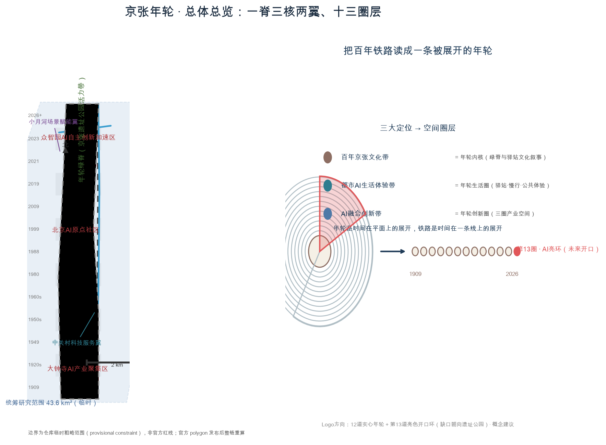
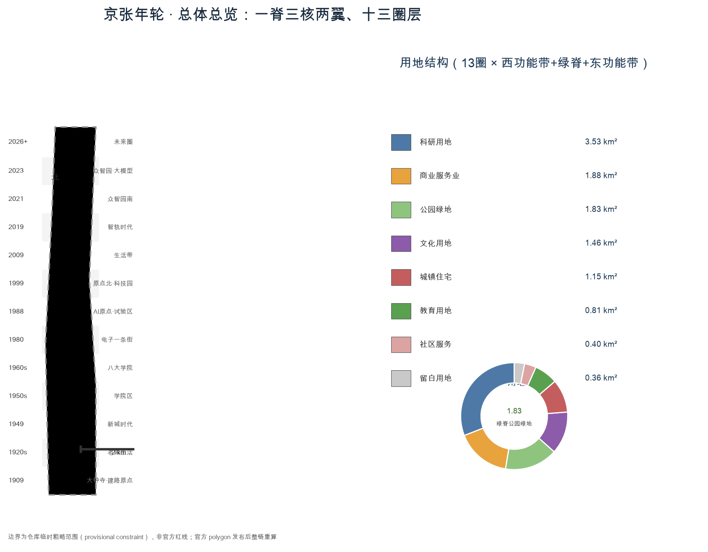
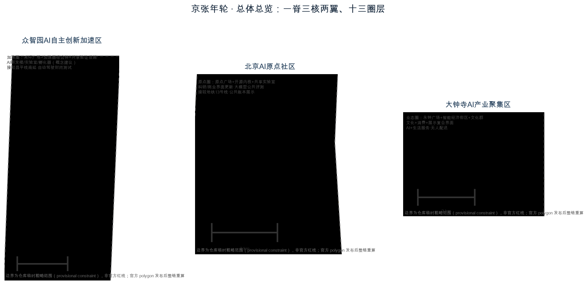
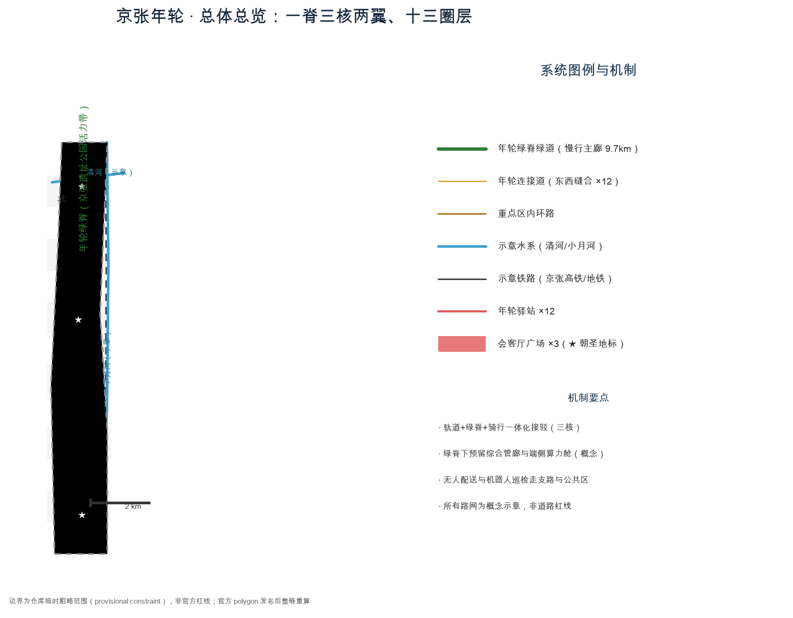
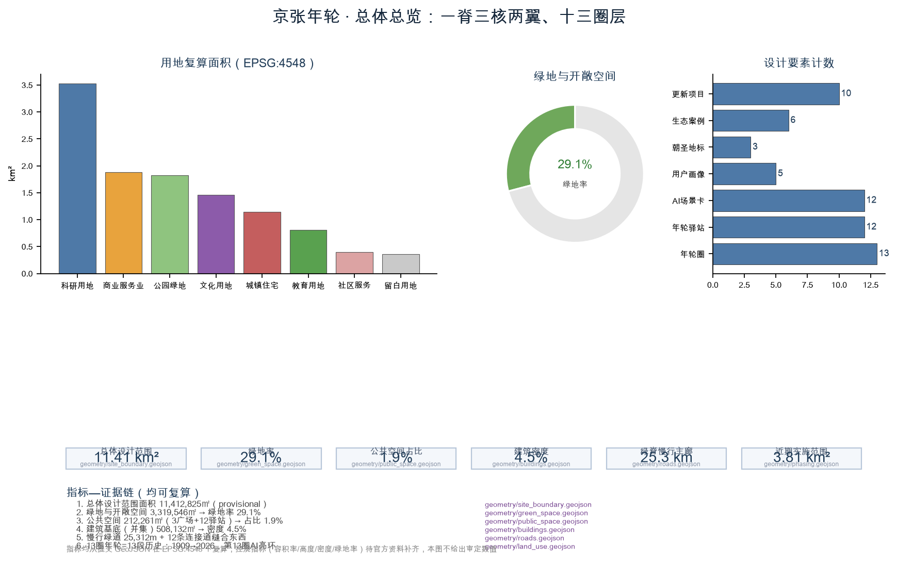

# 京张年轮：一条被展开的百年时间线

## 设计依据与资料清单

本方案是面向"百年京张AI创新带城市设计国际方案征集"的智能体开源共创成果，全部空间判断基于仓库提供的公开资料与临时粗略边界生成，属于**概念建议、参考方案、可供专业团队深化研究**，不替代正式规划，不构成政府审定结论 [source:AGENT-TASKBOOK] [source:OFFICIAL-ANNOUNCEMENT]。

资料清单如下：

- 资格预审公告（北京市规划和自然资源委员会海淀分局，2026-05-09）：三层范围、三处重点区域、设计任务与成果深度的主控依据 [source:OFFICIAL-ANNOUNCEMENT]。
- 面向智能体的开源征集任务书摘录（用户提供清权材料）：三大定位、五大功能、三区两翼、六项智能体任务与边界条款 [source:AGENT-TASKBOOK]。
- 站点包（brief/site-package/）：任务书、允许设计空间、枚举、规划限值、标准快照与数据源注册表 [source:SITE-PACKAGE]。
- 临时粗略边界（provisional boundary）：公告未提供官方 polygon，本方案使用仓库临时范围并明确标注"provisional constraint"，官方红线发布后将整链重算 [source:BOUNDARY-SOURCE]。
- 专业标准快照：《城市设计管理办法》《控规编制审批办法》《国土空间用地用海分类指南》本地快照 [standard:MOHURD-URBAN-DESIGN-MEASURES]。

**资料缺口与处理原则**：控规指标（容积率、高度、密度、绿地率、退线）、道路红线、权属、市政管线与保护范围均缺失，一律按"待正式数据补齐"处理，不给出任何伪装为审定结论的数值 [standard:MOHURD-CONTROL-DETAILED-PLANNING]。用地分类遵循国土空间分类逻辑 [standard:MNR-LAND-USE-CLASSIFICATION-GUIDE]。

## 三层范围工作框架

三层范围分别回答"研究什么、设计什么、深化什么"：

- **统筹研究范围**（43.6 km²，北至北五环、东至京藏高速、南至西直门外大街、西至万泉河路）：承载世界级AI创新生态、三区两翼协同与未来城市形态研究 [metric:coordinated_research_area_sqm]。
- **总体设计范围**（11.4 km²，京张遗址公园周边1—2公里）：以控规深度开展城市更新总体设计，形成年轮用地结构、交通与蓝绿系统 [metric:site_area_sqm]。
- **重点区域范围**（368.4 ha）：对众智园AI自主创新加速区、北京AI原点社区、大钟寺AI产业聚集区开展精细化设计 [metric:key_detailed_design_area_sqm] [data:geometry/key_areas.geojson#PROV-KEY-001]。

三处重点区域的 polygon 均为仓库提供的**临时约束范围（provisional constraint）**，不得作为官方红线或精确面积依据；官方 polygon 发布后，所有面积指标与本层设计需整链重算 [source:BOUNDARY-SOURCE] [assumption:A-BOUNDARY-001]。本方案所有面积与比例均从提交的 GeoJSON 在 EPSG:4548 下复算，未用正文数字替代几何事实 [metric:site_area_sqm]。

## 统筹研究范围产业与未来城市研究

### 一带总体概念：京张年轮

主名称**"京张年轮"**（英文 **JINGZHANG RINGS**，副题 "Annual-Ring AI Innovation Belt"）。命名逻辑：京张铁路是1909年由中国人自主勘测设计修建的第一条干线铁路，其"自主"精神与中关村自主创新、今日AI自主智能一脉相承 [standard:PROJECT-AGENT-OPEN-CALL-TASKBOOK]。年轮是时间在平面上的展开，铁路是时间在一条线上的展开——**把9公里廊道当作一条被展开的百年年轮**，让"可读的历史"变成"可走的时间"。命名体系按"圈"分级：一带（京张年轮）→ 三圈（原点圈/加速圈/业态圈）→ 两翼（中关村科技服务翼/小月河场景赋能翼）→ 十三驿站 → 场景环，主名称与功能层级一一对应 [depth:overall_spatial_structure]。

**Logo 方向**：12 道实心年轮环 + 第13道亮色开口环，缺口朝向京张遗址公园方向，寓意"历史闭环、未来开口"；可与站点符号、钢轨截面、信号灯色（绿/黄/红）组合延展为导视与活动系统 [depth:overall_spatial_structure] [source:AGENT-TASKBOOK]。该方向为概念建议，正式标识需清权后由专业团队深化。

### 三大定位、五大功能与三区两翼

三大定位与空间一一映射：**百年京张文化带**=年轮内核（绿脊与驿站文化叙事）；**都市AI生活体验带**=年轮生活圈（驿站、慢行、公共体验）；**AI融合创新带**=年轮创新圈（三圈产业空间）[source:AGENT-TASKBOOK]。

五大功能落在空间上：AI全栈自主创新体系→众智园加速圈；世界级AI创新生态→AI原点社区原点圈；AI+场景赋能新范式→小月河场景赋能翼；智能化AI活力城市→年轮绿脊与十三驿站；AI治理全球话语权→原点社区开源公共账本与年轮荣誉体系 [source:AGENT-TASKBOOK]。

三区两翼协同回路：原点圈（生态源头）→ 加速圈（成果转化）→ 业态圈（市场验证）三核联动；中关村科技服务翼（资本、知识产权、全球化要素）与小月河场景赋能翼（真实场景、测试数据、用户反馈）形成"供给—反馈"双回路 [source:OFFICIAL-ANNOUNCEMENT]。

### 全球AI创新生态案例（6个）

1. **硅谷斯坦福研究园**：大学—园区—资本的空间相邻性，转化为"原点社区高校院所30分钟步行圈"机制 [depth:three_key_area_detailed_design]。
2. **波士顿 Kendall Square**：以开放实验室与共享验证设施降低研发门槛，转化为众智园"共享验证设施群"。
3. **伦敦 King's Cross**：铁路遗产地更新为科创街区，转化为"京张遗址公园+智能经济"的缝合更新逻辑 [depth:retain_renovate_demolish]。
4. **新加坡 one-north**：分层"测试—展示—生活"混合用地，转化为三圈混合功能比例建议。
5. **深圳湾科技园**：头部企业带动产业链聚集，转化为大钟寺"智能原生新业态"招商逻辑。
6. **杭州城西科创大走廊**：廊道式创新带与轨道交通耦合，转化为本方案"绿脊+轨道+驿站"的空间原型 [depth:traffic_rail_slow_parking]。

以上案例均为公开信息的概念性转译，不构成企业承诺或产业指标；具体机制见 `compliance_matrix.json` 与 `sources.json` [source:SITE-PACKAGE]。

## 总体设计范围城市更新与控规深度城市设计

总体设计范围为京张遗址公园周边1—2公里城市与产业区，本方案在临时边界内提出"**一脊三核两翼、十三圈层渗透**"的空间结构 [data:geometry/land_use.geojson#RING13-W] [depth:overall_spatial_structure]：

- **一脊**：年轮绿脊——沿遗址公园的连续公园绿地带（1401），北起清河、南至西直门外，全长约9.7公里 [metric:green_space_area_sqm] [data:geometry/green_space.geojson#GREEN-SPIN-01]。
- **三核**：大钟寺智能经济核（业态圈）、AI原点生态核（原点圈）、众智园自主创新核（加速圈）[data:geometry/key_areas.geojson#PROV-KEY-002]。
- **两翼**：中关村科技服务翼（研究范围东侧创新服务资源带）与小月河场景赋能翼（研究范围西侧场景开放带）。
- **十三圈层**：13段年轮用地带，每段以"西功能带+绿脊+东功能带"组织，南端为1909建路原点、北端为2026智能体元年与第13圈未来留白 [data:geometry/land_use.geojson#RING01-W]。

城市更新总体框架以"**留改新建分类 + 圈层渐进**"组织：绿脊与历史元素优先保留与活化；现状科研院所与社区以"功能叠加、界面更新"为主；三核新增量集中布局于众智园加速圈；所有拆改留均为方法性建议，等待权属与工程条件确认 [depth:retain_renovate_demolish] [assumption:A-OWNERSHIP-001]。

建筑总规模、容积率、高度、密度、绿地率与退线等控规指标**缺失**，按"待正式数据补齐"处理，本方案不给出审定数值 [metric:floor_area_ratio] [assumption:A-CONTROLS-001]；用地分区为设计建议而非法定控规用地 [standard:MOHURD-CONTROL-DETAILED-PLANNING]。

## 重点区域详细设计

三处重点区域均按"定位+空间结构+建筑更新+交通慢行+公共空间+AI场景+实施风险"组织详细设计；其边界均为临时约束范围（provisional constraint），以下为方向性设计，官方 polygon 发布后需重算 [data:geometry/key_areas.geojson#PROV-KEY-001] [depth:three_key_area_detailed_design]。

### 众智园AI自主创新加速区（约192.1 ha，第11—13圈）

**定位**：AI全栈自主创新体系与第13圈未来亮环 [metric:zhongzhiyuan_area_sqm]。**空间结构**：以"亮环广场—加速器综合体—共享验证设施群"为核，东西功能带以科研用地（0802）为主、北端留白（16）预留未来研发单元 [data:geometry/land_use.geojson#RING12-W]。**建筑更新**：新增AI研发楼、实验室与孵化器为概念建议，建筑体量待控规条件 [metric:building_density]。**交通慢行**：内环路接驳昌平线南延站点与五环，绿脊支路贯通 [data:geometry/roads.geojson#ROAD-LOOP-RING13]。**公共空间**：第十三圈亮环广场（约2.6万㎡）作为年度"年轮节"主会场 [data:geometry/public_space.geojson#PS-PLAZA-RING13]。**AI场景**：自动驾驶封闭测试、具身机器人验证与算力共享试验场。**实施风险**：权属与现状产业搬迁条件未确认，需专业团队深化。

### 北京AI原点社区（约104.3 ha，第6—8圈）

**定位**：世界级AI创新生态原点，AI治理全球话语权载体 [metric:beijing_ai_origin_area_sqm]。**空间结构**：原点广场—开源内核—共享实验室集群，对应1980电子一条街至1999中关村科技园的历史圈层 [data:geometry/land_use.geojson#RING07-W]。**建筑更新**：以"界面更新+功能叠加"活化现状科研与商业建筑。**交通慢行**：绿脊在此收束为"原点步行街"，接驳地铁13号线 [data:geometry/roads.geojson#ROAD-LOOP-ORIGIN]。**公共空间**：年轮原点广场与"开源内核"地标。**AI场景**：大模型公共评测沙盒、城市智能体公共账本展示。**实施风险**：社区居住界面与科研功能混合的权属协调是主要难点。

### 大钟寺AI产业聚集区（约72.0 ha，第1—2圈）

**定位**：智能原生新业态与京张文化原点 [metric:dazhongsi_area_sqm]。**空间结构**：永钟广场—智能经济街区—大钟寺文化群（0803），商业服务业（05）与文化用地混合 [data:geometry/land_use.geojson#RING01-W]。**建筑更新**：以改造提升为主，形成"文化+消费+展示"复合界面。**交通慢行**：接驳西直门外大街与学院路，绿脊起点设"1909原点站"。**公共空间**：永钟广场与12处年轮驿站之首站 [data:geometry/public_space.geojson#PS-PLAZA-DAZHONGSI]。**AI场景**：AI+生活服务、无人配送、智能零售。**实施风险**：文物保护（大钟寺）与商业开发的边界需严格清权确认。

## AI 创新生态、人才画像与 AI+ 场景

### 人才与用户画像（5类）

1. **AI研究员/工程师**：需要算力、数据、测试设施与24小时开放实验室。
2. **创业团队/中小企业主**：需要孵化器、场景开放、合规与投融资服务。
3. **高校师生**：需要实习、共研与公共课堂空间。
4. **园区居民与家庭**：需要生活服务、健康、教育与公园体验。
5. **全球访客/开发者/专业买家**：需要朝圣地标、导览、会展与国际社区。

### AI场景卡（12张，其中3张为产业测试验证场景）

| # | 场景 | 空间映射 | 用户 | 隐私边界 | 人工复核 | 运营主体 | 图层 |
|---|------|---------|------|---------|---------|---------|------|
| 1 | AI+交通慢行导航 | 年轮绿脊 | 居民/访客 | 不采集个人轨迹 | 路权人工裁定 | 区交通+运营商 | ROAD/绿脊 |
| 2 | AI+医疗健康服务 | 社区服务设施 | 居民 | 医疗数据不出社区 | 医师复核 | 医院+社区 | 0702 |
| 3 | AI+教育共研课堂 | 教育用地 | 师生 | 课堂数据脱敏 | 教师复核 | 高校+平台 | 0804 |
| 4 | AI+法律咨询 | 服务翼门户 | 创业者 | 咨询记录加密 | 律师复核 | 律所+平台 | 05 |
| 5 | AI+生活服务 | 大钟寺街区 | 居民 | 匿名化 | 服务商复核 | 商户联盟 | 05 |
| 6 | 无人配送 | 街区支路 | 居民/商户 | 禁入私人空间 | 交通执法 | 配送平台 | ROAD |
| 7 | 机器人巡检 | 公共空间 | 管理者 | 公共区域限域 | 安保复核 | 物业 | PUBLIC |
| 8 | 自动驾驶测试（**产业验证**） | 众智园封闭测试区 | 车企/开发者 | 测试数据脱敏 | 安全员+交管 | 测试运营方 | 0802 |
| 9 | 具身机器人验证（**产业验证**） | 小月河场景翼 | 机器人企业 | 人体数据匿名 | 场景主理人 | 验证运营方 | 16/1402 |
| 10 | 大模型公共评测（**产业验证**） | 原点社区评测沙盒 | 模型开发者 | 评估集公开 | 评测委员会 | 开源社区 | 0802 |
| 11 | 城市智能体公共账本 | 原点广场 | 全体公众 | 只读公开摘要 | 独立审计 | 治理机构 | PUBLIC |
| 12 | 年轮驿站智能服务 | 13驿站 | 全体 | 会话不留存 | 服务台复核 | 驿站运营 | PUBLIC |

以上场景均遵守：数据最小化、可退出、可回滚、人工复核与隐私边界前置；未成熟技术不表述为已可全面部署 [source:AGENT-TASKBOOK] [depth:blue_green_public_space]。产业测试验证场景均表述为"试点建议"，不构成已批准运营 [assumption:A-MUNICIPAL-001]。

## 用地、建筑规模与拆改留方案

用地布局为"13圈×（西功能带+绿脊+东功能带）"分区，覆盖全部提交边界、无缝隙无重叠 [data:geometry/land_use.geojson#RING05-E] [depth:land_use_layout]。复算面积：科研用地（0802）约352.7万㎡、商业服务业（05）约188.4万㎡、文化（0803）约146.2万㎡、居住（0701）约114.6万㎡、教育（0804）约81.0万㎡、社区服务（0702）约40.2万㎡、绿脊公园绿地（1401）约182.6万㎡、留白（16）约35.6万㎡ [metric:land_use_0802_area_sqm] [metric:land_use_1401_area_sqm]。

建筑基底面积（并集）约50.8万㎡，建筑密度约4.5% [metric:building_footprint_area_sqm] [metric:building_density]；建筑为概念性代表性底图，非现状测绘 [data:geometry/buildings.geojson#BLDG-001]。拆改留按"保留绿脊与历史要素、改造科研社区界面、新建三核增量、留白未来单元"分类，全部为方法性建议，权属与工程条件待确认 [assumption:A-OWNERSHIP-001]。总建筑面积与容积率因缺控规条件为未知 [metric:total_floor_area_sqm]。

## 交通、轨道、市政与公共服务设施

- **慢行主廊**：年轮绿脊绿道约9.7公里，串联13驿站与三核 [metric:road_centerline_length_m] [data:geometry/roads.geojson#ROAD-SPINE-GREENWAY]。
- **横向缝合**：12条年轮连接道缝合东西功能带，与绿脊立交或平交，修复京张铁路长期造成的东西割裂 [data:geometry/roads.geojson#ROAD-RING-CONN-01] [depth:traffic_rail_slow_parking]。
- **轨道接驳**：众智园接驳昌平线南延（示意）、AI原点接驳地铁13号线（示意）、大钟寺接驳既有轨道，三核均设"轨道+绿脊+骑行"一体化接驳点 [data:geometry/constraints.geojson#CN-RAIL-002]。
- **市政与新型基础设施**：绿脊下方预留综合管廊与分布式能源舱、端侧算力节点（概念建议）；传统市政容量与地下管线待专业测算 [assumption:A-MUNICIPAL-001] [depth:municipal_new_infrastructure]。
- **公共服务**：创新服务平台（测试、合规、投融资）、人才生活服务（人才公寓、健康、教育）与公共客厅沿驿站布局 [metric:renewal_project_count]。

## 蓝绿空间、公共空间与城市风貌

蓝绿体系：清河（北）、小月河（东）示意水系与绿脊、生态缓冲绿地（1402）构成"一脊两水多缓冲"网络，绿地与开敞空间约331.9万㎡、绿地率约29.1% [metric:green_ratio] [data:geometry/green_space.geojson#GREEN-BUFF-01-W]。公共空间约21.2万㎡、占比约1.9%，包括三处会客厅广场与12处年轮驿站 [metric:public_space_ratio] [data:geometry/public_space.geojson#PS-STATION-01]。

**三个AI朝圣地标**（概念建议，非已批准建设）：

1. **永钟·城市节律地标**（大钟寺）：借永乐大钟"报时"意象，以可听可看的"城市节律钟"发布全带公共时钟与AI状态信号 [depth:blue_green_public_space]。
2. **年轮原点·开源内核**（AI原点社区）：以"开源第一圈"雕塑与荣誉刻环墙，承载开源贡献者、开发者与治理荣誉展示体系 [source:AGENT-TASKBOOK]。
3. **第十三圈亮环**（众智园）：环形观景与年度事件地标，第13圈年轮在空间上"长"出的一段实体 [data:geometry/public_space.geojson#PS-PLAZA-RING13]。

公共空间组件库（6类）：驿站模块、共享实验室、可回退AI测试围栏、数字导视、智能座椅与灯具、基础设施舱——均为可拆装、可升级、可审计组件 [depth:blue_green_public_space]。风貌基调：以钢轨、枕木、信号色为原型的技术理性风格，文化空间避免过度网红化 [standard:MOHURD-URBAN-DESIGN-MEASURES]。

## 更新项目清单、实施政策与分期计划

近期（2026—2029·原点复现期）：大钟寺智能经济街区、永钟广场、年轮原点广场与开源内核、AI原点共享实验室集群、3处示范驿站 [metric:phase_01_area_sqm] [data:geometry/phasing.geojson#PHASE-01]。中期（2029—2032·生态成长期）：绿脊缝合桥示范、剩余驿站、小月河场景验证廊、中关村服务翼门户 [metric:phase_02_area_sqm]。远期（2032—2036·亮环生长期）：众智园加速器综合体、第十三圈亮环地标、自动驾驶与具身机器人验证设施 [metric:phase_03_area_sqm]。共10类更新项目，实施主体建议为"政府统筹+平台公司+社区/开发者共治"复合机制，政策建议（场景开放、数据沙盒、公共账本）均为深化方向 [metric:renewal_project_count] [source:AGENT-TASKBOOK]。

**全球AI创新活动体系与长期运营**（概念建议）：年度"年轮节"（一圈一议题）、开发者共创营、场景开放日、公共账本年度报告与国际传播"京张时间"叙事；建立人才—企业—开发者后续转化路径，避免只写口号而没有运营机制 [depth:phasing_implementation]。

## 指标体系、面积复算与合规矩阵

核心指标及其设计含义：绿地率约29.1%支撑人才生活与公共健康；公共空间占比约1.9%（+驿站系统）支撑创新交往与青年友好；建筑密度约4.5%反映低密度科创空间供给逻辑；13圈年轮与13个驿站把"历史可读性"转译为可步行度量 [metric:green_ratio] [metric:public_space_ratio] [metric:ring_count]。

面积复算：总体设计范围11,412,825㎡（provisional）、统筹研究范围43,609,233㎡（provisional）、重点区域合计3,692,893㎡（provisional），与公告文字面积（11.4km²/43.6km²/368.4ha）相互印证但存在临时边界误差，官方 polygon 发布后必须重算 [metric:site_area_sqm] [assumption:A-BOUNDARY-001]。任务覆盖见 `compliance_matrix.json`（公告1.3/1.4/1.5与agent.1—6全部条目）、`standard_matrix.json`（5项必检标准）、`design_depth_matrix.json`（15项设计深度全部 complete）[depth:metrics_recalculation]。

## 风险、版权与合规说明

- **边界风险**：全部边界为临时约束范围，任何红线、面积或规划控制结论均不得引用本方案 [source:BOUNDARY-SOURCE]。
- **数据风险**：仅使用公开或清权资料；OSM 等仅作背景，不用于正式边界；商业地图瓦片禁止作为提交数据 [source:SITE-PACKAGE]。
- **合规边界**：无控规审定、无具体地块拆改留结论、无工程可行性判断、无土地权属与投资测算；所有活动、招商与政策表述为概念建议 [source:AGENT-TASKBOOK] [standard:PROJECT-OFFICIAL-ANNOUNCEMENT]。
- **隐私与伦理**：场景卡全部前置隐私边界与人工复核，禁止过度监控 [depth:risk_missing_data]。
- **版权**：本方案为开放共创，署名与许可见 `report/copyright_statement.md`；字体、图片、人物与企业标识均需清权后方可用于正式成果 [assumption:A-CONTROLS-001]。

## 参考资料

1. 《百年京张AI创新带城市设计国际方案征集资格预审公告》（北京市规划和自然资源委员会海淀分局，2026-05-09）。
2. 《面向全球智能体开展百年京张AI创新带城市设计开源征集任务书摘录》（用户提供清权材料）。
3. 《城市设计管理办法》（住建部）。
4. 《城市、镇控制性详细规划编制审批办法》（住建部）。
5. 《国土空间调查、规划、用途管制用地用海分类指南》（自然资源部，2023）。
6. 仓库站点包：设计任务书、允许设计空间、枚举、规划限值、标准快照与数据源注册表。
7. 仓库临时粗略边界（provisional boundaries）及其说明。
8. 既有同行方案目录（read_peer_proposals 目录，用于避免概念撞车与借鉴公共方法）[source:SITE-PACKAGE]。
