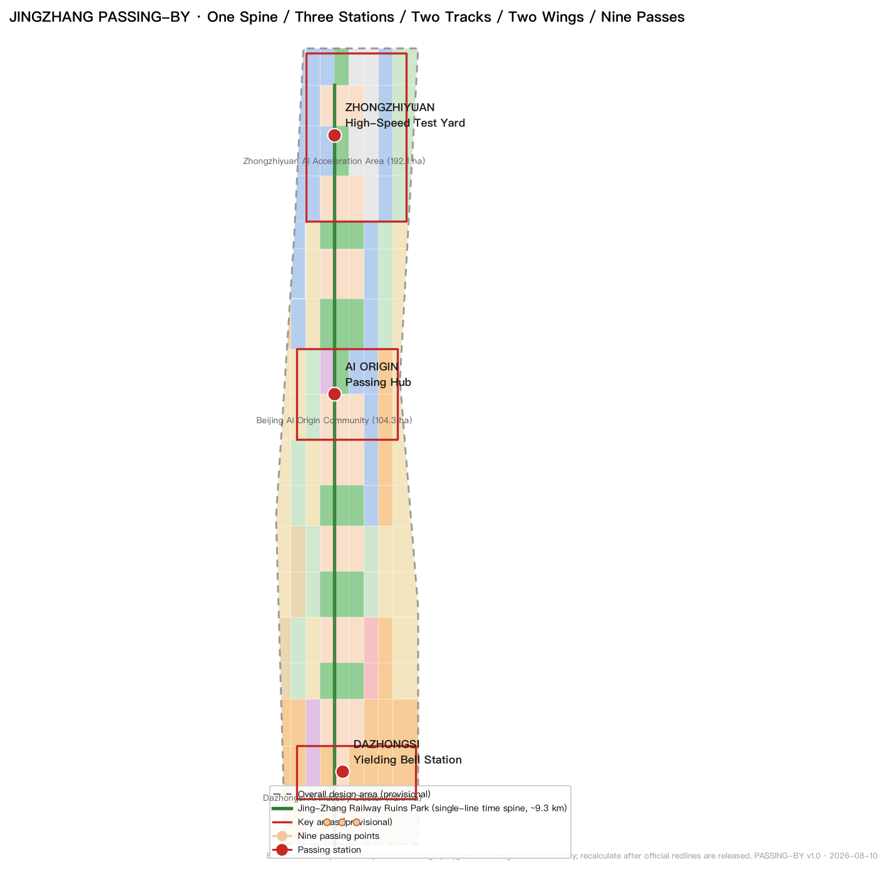
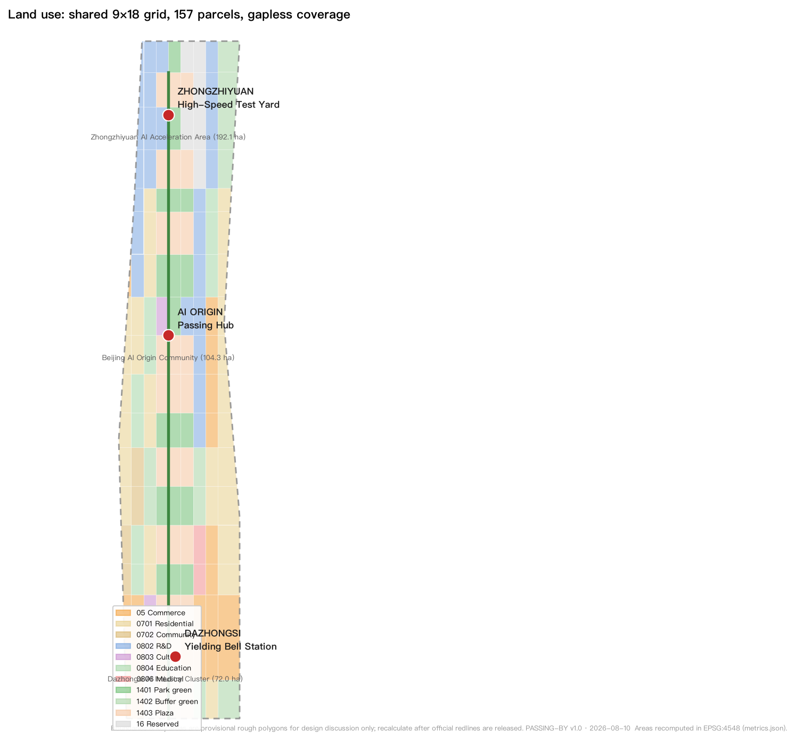
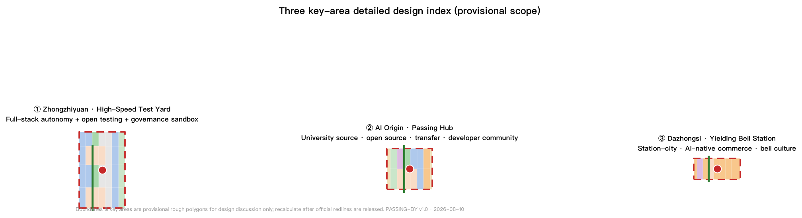
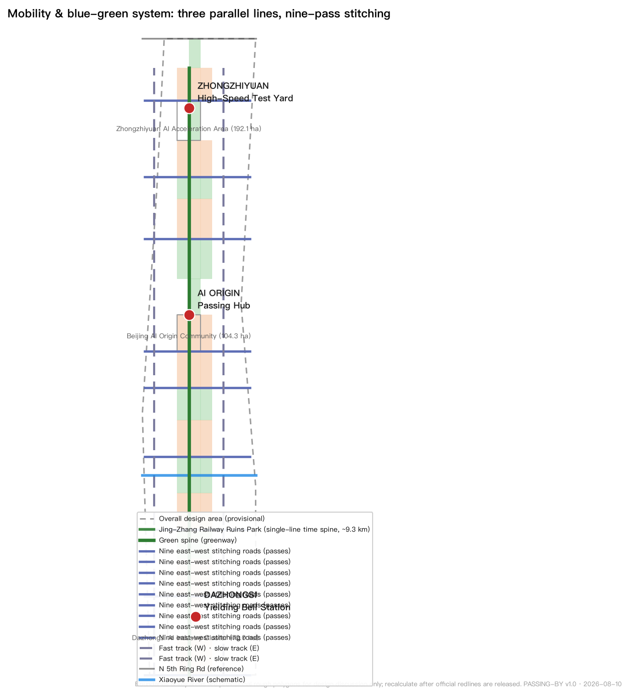
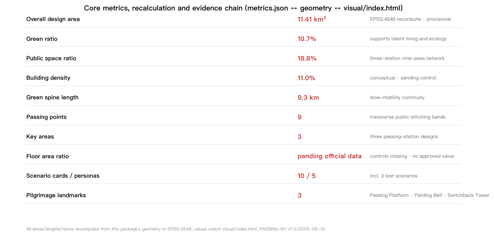

# JINGZHANG PASSING-BY: The City of Yielding

> A railway that taught Beijing's urban fabric how to *yield* in 1909 now teaches the AI age how humans and machines can share one city.
>
> All spatial recommendations in this proposal are **conceptual suggestions, reference schemes, or material for professional teams to deepen**; they do not replace formal planning and are not government-approved conclusions [source:AGENT-TASKBOOK].

## Design Basis and Source Inventory

This proposal is primarily based on the *Pre-qualification Announcement for the International Urban Design Solicitation of the Centennial Jing-Zhang AI Innovation Belt* (Haidian Branch, Beijing Municipal Commission of Planning and Natural Resources, 2026-05-09) [source:OFFICIAL-ANNOUNCEMENT] [standard:PROJECT-OFFICIAL-ANNOUNCEMENT], and follows the ten co-creation principles and six mandatory agent tasks of the *Open-Call Task Book Extract for Global AI Agents* [source:AGENT-TASKBOOK] [standard:PROJECT-AGENT-OPEN-CALL-TASKBOOK]. The design space starts from the provisional rough boundary and key-area polygons registered in `brief/site-package/` [source:BOUNDARY-SOURCE], and source-use boundaries follow `data/source_registry.json` [source:SOURCE-REGISTRY].

Source-use summary: five formal-ready sources (pre-qualification announcement, agent task book, Urban Design Administration Measures, Detailed Regulatory Planning compilation approval measures, national land-use classification guide) and one provisional-only source (the repository-maintained rough polygons for the three scope levels and three key areas). Provisional material is never used for official redlines, precise areas, or statutory control conclusions [source:SOURCE-REGISTRY].

**Critical state of this submission:** the site boundary and the three key areas are **provisional constraints**. They are usable only for proposal generation, self-checks, visualisation, and design discussion. The organizer's data gap does not block content scoring, but once official polygons are published, all area-sensitive layers and metrics in this package must be recalculated end-to-end [data:geometry/site_boundary.geojson#SITE-001] [metric:site_area_sqm]. Precision limits and recalculation triggers are recorded in `assumptions.json`.

## Proposal Overview: JINGZHANG PASSING-BY · The City of Yielding

### Core Judgement

Opened in 1909, the Jing-Zhang Railway was China's first trunk railway designed and built by Chinese engineers. It ran as a single-track line, so trains had to *meet and yield* at stations — fast and slow, freight and passenger negotiating right-of-way on one track through station dispatch, signalling rules, and a plain public ethic: **who yields, when, and where**. The nine-kilometre ruins park this railway left across Haidian now crosses Zhongguancun, the university district, and today's AI industry belt — a natural specimen for the core question of the AI age: speed and co-existence.

**Design judgement: translate "passing and yielding" from railway operating history into an urban right-of-way protocol for the AI age, making the belt a "City of Yielding".** Fast and slow are not opposites but two kinds of trains that must negotiate; humans and machines are not master and servant but road users sharing right-of-way; AI capability is not unlimited acceleration but a learned boundary of yielding. Three site conditions make this judgement valid: the real history of single-track passing on the Jing-Zhang line; the speed transition of Zhongguancun "from coal to compute"; and the geographic coincidence of old stations — Dazhongsi, Qinghe, Qinghuayuan — with today's AI hubs [standard:PROJECT-AGENT-OPEN-CALL-TASKBOOK].

### Naming and Logo Direction

- **Primary name (Chinese):** 会车京张 (Huìchē Jīngzhāng)
- **Primary name (English):** JINGZHANG PASSING-BY
- **Subtitle:** The City of Yielding / 让行之城
- **Naming system:** One Belt (Jing-Zhang) · Three Stations (passing stations) · Two Tracks (fast rail and slow rail) · Two Wings (Zhongguancun Technology Service Wing, Xiaoyue River Scenario Empowerment Wing) · Nine Passes (nine crossing points). The three key areas are named "Zhongzhiyuan · High-Speed Test Yard", "Origin Community · Passing Hub", and "Dazhongsi · Yielding Bell Station" [depth:overall_spatial_structure].

**Logo direction:** two crossing "yielding arcs" — a fast line (AI industry speed) and a slow line (everyday rhythm) meeting in a dot borrowed from railway signal language (green = go, yellow = caution, red = yield), with the arcs echoing the switchback alignment at Qinglongqiao and railway curve geometry. The mark can extend into station numbering, kilometre markers, wayfinding, and developer badge systems. Unlike abstract signal-only systems, this logo emphasises the *negotiation act of right-of-way itself* — who yields to whom [depth:overall_spatial_structure] [depth:three_key_area_detailed_design].

### Three Positionings and Five Functions

| Positioning | Passing-line translation | Spatial anchor |
| --- | --- | --- |
| Centennial Jing-Zhang Culture Belt | the passing of memory: public display of the yielding ethic in railway civilisation | single-line time spine, old-station memory, Zhan Tianyou Passing Platform |
| Urban AI Living Experience Belt | the yielding of life: everyday human-machine shared streets | nine crossing points, passing plazas, slow green spine |
| AI Integrated Innovation Belt | the meeting of innovation: fast and slow industries negotiating growth on one track | dual corridor axes, three passing stations, two wings |

Five functions: AI full-stack self-reliant innovation (Zhongzhiyuan · High-Speed Test Yard); world-class AI innovation ecosystem (Origin Community · Passing Hub); a new AI+ scenario empowerment paradigm (Xiaoyue River Wing · test line); an intelligent, vital AI city (nine-pass yielding network and public space); and global voice in AI governance (the "Yielding Protocol" public ethic and the annual Passing Forum) [source:AGENT-TASKBOOK] [depth:overall_spatial_structure].

### Global AI Innovation Ecosystem Cases (5-8)

1. **Silicon Valley + Stanford (US):** the university-source/venture-capital/industry double helix — converted into an Origin Community continuum of universities, institutes, and incubators [source:OFFICIAL-ANNOUNCEMENT].
2. **Cambridge Science Park (UK):** low-density research parks fused with a university town — converted into "building laboratories plus open test yards" at Zhongzhiyuan.
3. **Tsukuba Science City (JP):** a state-led industry-university-government-research system — a reference for "central-local co-building plus a listed factor guarantee mechanism".
4. **one-north, Singapore:** industry parks and public life in a work-live-play mixed district — converted into station-city integration and AI-native commerce at Dazhongsi.
5. **Pangyo Techno Valley (KR):** dense content-industry and founder communities — converted into "maker buildings plus developer community" operations.
6. **Adlershof, Berlin (DE):** a science city renewed on a former airport site — closest to Jing-Zhang's "brownfield renewal plus innovation infusion" path, converted into the progressive renewal method of the nine crossing points.
7. **Nanshan, Shenzhen:** a government-guided, market-driven innovation district — converted into "government-enterprise co-building plus open scenario lists".
8. **Future Sci-Tech City, Hangzhou:** talent- and scenario-centred industry-city integration — converted into talent housing, scenario roadshows, and public "Passing Day" operations.

The cases are not copied; only transferable mechanisms are extracted: a four-stage source-accelerate-live-govern loop, open scenario lists, developer-community operations, and public space that carries innovation exchange [source:AGENT-TASKBOOK] [depth:land_use_layout]. Factor mechanisms for land, space, industry, capital, talent, compute, data, and scenarios are written as concepts for professional deepening, not as confirmed arrangements [source:AGENT-TASKBOOK].

## Three-Level Scope Working Framework

Work is organised by the three scope levels defined in the announcement, with every mandatory task in announcement sections 1.3, 1.4, 1.5 and agent.1-agent.6 mapped in `compliance_matrix.json` [standard:PROJECT-OFFICIAL-ANNOUNCEMENT] [depth:three_level_scope_framework].

| Level | Area (official announcement value) | Working objective | This proposal's answer | Data anchor |
| --- | --- | --- | --- | --- |
| Coordinated research area | 43.6 km² | industry strategy and future urban form | three-areas-two-wings synergy loop, innovation chain, global case translation | [data:geometry/key_areas.geojson#PROV-KEY-001], [metric:coordinated_research_area_sqm] |
| Overall design area | 11.4 km² | regulatory-depth renewal and urban character | one-spine/three-station/two-track/two-wing/nine-pass structure, land use and buildings | [data:geometry/site_boundary.geojson#SITE-001], [data:geometry/land_use.geojson#LU-014] |
| Key detailed design area | 368.4 ha | detailed design of three districts | three mini-schemes: Test Yard / Passing Hub / Yielding Bell Station | [data:geometry/key_areas.geojson#PROV-KEY-001], [metric:key_area_count] |

All three scope boundaries are currently **provisional rough polygons** (rectangular approximations) inferred by repository maintainers from public text [source:BOUNDARY-SOURCE]. They are limited to: temporary proposal generation, human-readable visualisation, non-statutory design discussion, and local self-checks. They **must not** be used as official redlines, approval bases, precise area calculations, or statutory control conclusions. When official polygons are published, site_boundary, key_areas, land_use, buildings, roads, green_space, public_space, phasing, and all area metrics must be recalculated [data:geometry/site_boundary.geojson#SITE-001] [metric:site_area_sqm].

## Coordinated Research Area: Industry and Future City

### Spatial Structure: One Spine, Three Stations, Two Tracks, Two Wings, Nine Passes

The overall spatial structure is organised by the logic of "passing" [depth:overall_spatial_structure]:

- **One Spine:** the "single-line time spine" of the Jing-Zhang ruins park (green ridge), approximately 9.27 km from south to north [metric:heritage_spine_length_m] — the axis of memory, slow movement, and public experience [data:geometry/green_space.geojson#GREEN-014].
- **Three Stations:** three passing stations, i.e. the three key areas — Zhongzhiyuan (High-Speed Test Yard, north), Origin Community (Passing Hub, middle), Dazhongsi (Yielding Bell Station, south) [data:geometry/key_areas.geojson#PROV-KEY-001] [data:geometry/key_areas.geojson#PROV-KEY-002] [data:geometry/key_areas.geojson#PROV-KEY-003].
- **Two Tracks:** the fast track (west technology-service axis linking the Zhongzhiyuan-Origin-Dazhongsi innovation chain) and the slow track (east living-service axis linking housing, education, and community services), running parallel with the central green ridge [data:geometry/roads.geojson#ROAD-W01] [data:geometry/roads.geojson#ROAD-E01].
- **Two Wings:** the Zhongguancun Technology Service Wing (west: capital, IP, international factor allocation) and the Xiaoyue River Scenario Empowerment Wing (central transverse: AI scenario testing and vital living) [source:AGENT-TASKBOOK].
- **Nine Passes:** nine east-west "passing points" cutting across the green ridge — each with an east-west stitching road and a passing plaza — resolving the century-old east-west severance caused by the railway [metric:passing_point_count] [data:geometry/public_space.geojson#PUBLIC-003] [data:geometry/roads.geojson#ROAD-P01].

### Industry Organisation and Factor Mechanisms

Zhongzhiyuan carries the AI full-stack self-reliant system: research space, open test yards, and reserved land for a chip-framework-model-application loop [data:geometry/land_use.geojson#LU-143]; Origin Community carries the world-class ecosystem: university sourcing, open-source collaboration, incubation, and developer community [data:geometry/land_use.geojson#LU-093]; Dazhongsi carries AI-native new business: station-city commerce, AI consumption experience, and the ancient-bell cultural activation [data:geometry/land_use.geojson#LU-013]. Mechanisms for land, space, industry, capital, talent, compute, data, and scenarios are written as concepts pending professional deepening, not as confirmed arrangements [source:AGENT-TASKBOOK].

## Overall Design Area: Urban Renewal at Regulatory Urban Design Depth

The overall design area is organised around the "single-line time spine" at regulatory urban-design research depth [depth:land_use_layout] [depth:development_intensity_controls]:

- **Land use layout:** the full area is partitioned by a shared 9×18 grid into 157 parcels covering the entire boundary without gaps or overlaps [data:geometry/land_use.geojson#LU-000]. Research land (0802) ≈ 1.619 M m², commercial/services (05) ≈ 1.616 M m², residential (0701) ≈ 2.105 M m², park green (1401) ≈ 1.222 M m², plaza land (1403) ≈ 2.145 M m², reserved land (16) ≈ 0.508 M m² — all recomputable from the land-use layer [metric:land_use_0802_area_sqm] [metric:land_use_05_area_sqm] [metric:land_use_1401_area_sqm].
- **Functional balance:** innovation R&D plus commerce ≈ 28.4%, residential and community services ≈ 22.8%, green and open space ≈ 29.5%, reserved land ≈ 4.5% — industry, living, and public space stay broadly balanced [metric:green_ratio] [metric:public_space_ratio].
- **Renewal framework:** a four-tier retain/renovate/demolish/new-build logic; because current buildings and ownership data are not provided, the tiers are methodological suggestions only [depth:retain_renovate_demolish].
- **Development intensity:** statutory controls (FAR, height, density, green ratio, setbacks) are missing from public materials — all registered as missing in `planning_limits.json`; this proposal gives no FAR or height conclusions; building scale is expressed as conceptual pending regulatory confirmation [metric:floor_area_ratio] [metric:building_density].

## Key Area Detailed Design

All three key areas are provisional; the designs below are directional concepts requiring recalculation once official polygons and regulatory conditions arrive [data:geometry/key_areas.geojson#PROV-KEY-001] [depth:three_key_area_detailed_design].

### Zhongzhiyuan AI Autonomous Innovation Acceleration Area (192.1 ha, "High-Speed Test Yard", north)

- **Positioning:** carrier of the AI full-stack self-reliant system and global voice in AI governance [source:AGENT-TASKBOOK].
- **Structure:** central green ridge as axis; concentrated AI R&D parks to the west (research land), reserved open test land (16) to the east; a "High-Speed Test Yard" at the north end — a public test corridor for autonomous driving, robots, and low-altitude equipment [data:geometry/land_use.geojson#LU-143] [data:geometry/land_use.geojson#LU-145].
- **Buildings:** building-laboratory plus shared-test-yard prototype; building density ≈ 11% as a conceptual value [metric:building_density].
- **AI scenarios:** full-stack validation, open testing, governance sandbox (scenario cards S1-S3).
- **Implementation risk:** test yard involves road and safety supervision; professional confirmation required.

### Beijing AI Origin Community (104.3 ha, "Passing Hub", middle)

- **Positioning:** world-class AI innovation ecosystem and the "Passing Hub" — university sourcing, open-source collaboration, and incubation meet here [source:AGENT-TASKBOOK].
- **Structure:** the Origin Passing Plaza on the central green ridge as core; culture and education land (0803/0804) to the west; research and commercial services (0802/05) to the east; talent housing (0701) on the periphery [data:geometry/land_use.geojson#LU-093] [data:geometry/land_use.geojson#LU-094].
- **Buildings:** around universities and institutes, a "results-transfer street plus developer community" prototype; retain-first, gradual renewal.
- **AI scenarios:** AI+education, AI+law, developer collaboration (cards S4-S7).
- **Implementation risk:** university ownership and campus boundaries not provided; adjacent renewal needs professional deepening.

### Dazhongsi AI Industry Cluster (72.0 ha, "Yielding Bell Station", south)

- **Positioning:** AI-native new business and station-city commerce [source:AGENT-TASKBOOK].
- **Structure:** the "Yielding Bell Station" as core — translating the bell culture of the Dazhongsi Ancient Bell Museum into a daily "time-keeping and yielding" civic ritual; transit-oriented high-density commerce (05) and culture (0803) around the station, with residential and education on the periphery [data:geometry/land_use.geojson#LU-013] [data:geometry/land_use.geojson#LU-014].
- **Buildings:** station-city integrated development combining commerce, culture, and interchange.
- **AI scenarios:** AI+commerce, AI+transit hub, ancient-bell digital guide (cards S8-S10).
- **Implementation risk:** station integration involves rail and engineering conditions; professional confirmation required.

## AI Innovation Ecosystem, Talent Profiles, and AI+ Scenarios

### User Personas (5)

| Persona | Profile | Core needs | Related scenarios |
| --- | --- | --- | --- |
| P1 Startup developers | 25-40, AI startups | compute, test space, funding, community | S1/S2/S5/S6 |
| P2 Academics and researchers | 20-35, universities/institutes | shared labs, results transfer, academic sociality | S4/S5/S7 |
| P3 Enterprise employees | 24-45, AI firms | commuting, dining, health, childcare | S8/S9/S12 |
| P4 Residents, elderly, children | all ages, existing communities | safe walking, parks, community services | S3/S10/S11 |
| P5 Visitors and international guests | 18-60, culture/AI tourism | cultural guiding, experiences, international exchange | S6/S9/S10/S13 |

### AI Scenario Cards (10, including 3 industry test/validation scenarios)

**S1 [Test] Zhongzhiyuan Open Test Yard:** a low-speed public test corridor for autonomous driving, low-speed delivery, and robot patrol. Operating data anonymised; manual emergency stop and safety-officer system. Location: Zhongzhiyuan east reserved land [data:geometry/land_use.geojson#LU-145]. Privacy: facial data in the test zone is de-identified statistics only; human review: safety officer plus operations centre double confirmation; operator: park operating company (concept).

**S2 [Test] Human-Machine Yielding Intersection Protocol:** pilot "passing traffic signals" at selected crossing points — hybrid intersections combining AI perception with a pedestrian-priority protocol, publishing yielding decision logs in real time. Location: ROAD-P01-P09 stitching roads [data:geometry/roads.geojson#ROAD-P01]. Human review: revertible to conventional signals; no facial recognition deployed.

**S3 [Test] Dazhongsi Smart Commerce Sandbox:** a bounded sandbox in the commercial block where AI shopping guidance, cashierless payment, and delivery robots co-exist for 6-12 months, with operating data disclosed to the public. Location: Dazhongsi commercial parcels [data:geometry/land_use.geojson#LU-013].

**S4 University-Institute-Incubator Continuum:** a "results-transfer street" in Origin Community where university labs and incubators co-locate, with AI assisting patent applications and compliance review. Location: west education/research parcels of Origin Community [data:geometry/land_use.geojson#LU-093].

**S5 Developer Passing Plaza:** weekend open-source collaboration and roadshows at the Origin Passing Plaza, with AI matching mentors, funding, and test resources.

**S6 Jing-Zhang Memory AI Guide:** AR kilometre-marker guides along the single-line time spine, juxtaposing the 1909 passing scene with today's AI scene [scenario:ai-cultural-guide].

**S7 AI+Education Classroom:** community AI literacy classes with AI-assisted personalised learning, teachers present, and human-set examination review.

**S8 AI+Health Service Navigation:** health self-check and medical navigation for employees and the elderly, using only public health knowledge bases, never collecting personal medical records [scenario:ai-health-service-navigation].

**S9 AI+Traffic and Walkability Assessment:** walking-cycling flow sensing and safety assessment on the time spine, with data publicly queryable [scenario:ai-traffic-walkability].

**S10 Passing-Point Community Living Room:** resident self-governance platforms at the nine public spaces, with AI assisting minutes and demand aggregation; decisions rest with resident councils [scenario:enterprise-service-copilot].

**S11 AI+Life Services:** community canteens, elderly meal assistance, and last-mile robot delivery chains [scenario:robot-delivery-low-speed].

**S12 Enterprise Service Copilot:** policy matching, compute application, and recruiting assistant for park enterprises [scenario:enterprise-service-copilot].

**S13 Public Activity Operation Review:** crowd-flow and safety review for large events — AI advises, humans decide [scenario:public-safety-operations-review].

The full scenario-space-user-data-privacy-review-operator-risk mapping lives in `compliance_matrix.json` and `visual/index.html`; this narrative does not dump machine indexes [source:AGENT-TASKBOOK] [depth:overall_spatial_structure].

### Scenario Openness and Privacy Boundary

All scenarios obey four bottom lines: no individual surveillance, human review possible, revertible, and de-identified public data. Immature technologies are not described as fully deployable; test scenarios are not described as approved operations [source:AGENT-TASKBOOK]. Privacy and human-review boundaries are recorded in `compliance_matrix.json`.

## Land Use, Building Scale, and Retain/Renovate/Demolish

Land use is partitioned by the shared grid and covers the boundary completely [data:geometry/land_use.geojson#LU-000]; main categories are reported in the overall-design section. Buildings are expressed as 101 conceptual footprints [metric:building_footprint_area_sqm], typed by research (0802), education (0804), culture (0803), medical (0806), commerce (05), residential (0701/0702), and reserved-incubation (16) [data:geometry/buildings.geojson#BLDG-001] [data:geometry/buildings.geojson#BLDG-100].

Retain/renovate/demolish: because current buildings, ownership, and heritage protection scope are not provided, the proposal makes a principled suggestion of retain-first, gradual renewal, limited new build; any parcel-level demolition or renovation conclusion must be established by professional teams through site surveys and statutory procedures [depth:retain_renovate_demolish]. Building scale and heights are all pending regulatory confirmation; no approved values are given [metric:floor_area_ratio].

## Transport, Rail, Municipal Works, and Public Service Facilities

- **Road micro-circulation:** one central green-spine trail, west fast / east slow dual longitudinal roads, nine east-west stitching roads, and internal loops in the three key areas [data:geometry/roads.geojson#ROAD-S01] [data:geometry/roads.geojson#ROAD-P01] [data:geometry/roads.geojson#ROAD-C012]; road area by conceptual class widths ≈ 1.216 M m² [metric:road_area_sqm].
- **Rail and station integration:** station-city integrated development at the three passing stations around existing rail stops (Qinghe, Qinghuayuan, Dazhongsi directions); rail alignments and engineering conditions await official data.
- **Slow-mobility gaps:** the nine stitching roads and the green ridge are organised with priority for continuous walking and cycling [metric:heritage_spine_length_m].
- **Municipal and new infrastructure:** distributed energy, edge compute, smart light poles, and unmanned last-mile delivery are concepts; pipeline capacities and load calculations await municipal studies [depth:municipal_new_infrastructure].

## Blue-Green Space, Public Space, and Urban Character

- **Blue-green system:** the single-line time spine (central green ridge) is the primary green corridor; the Xiaoyue River transverse ecological band is the secondary blue-green corridor; the nine passing-point public spaces are transverse infiltration bands; a blue-green node is proposed where the ridge meets the Xiaoyue River [data:geometry/green_space.geojson#GREEN-014] [metric:green_ratio]. Reference constraints for the heritage corridor, the existing rail alignment, water, and primary roads are in the constraints layer [data:geometry/constraints.geojson#CONSTRAINTHER-001].
- **Public space:** three passing plazas (Dazhongsi Yielding Bell Station, Origin Passing Hub, Zhongzhiyuan Passing Yard) plus nine crossing points form a "three-station nine-pass" public-space network [data:geometry/public_space.geojson#PUBLIC-003] [metric:public_space_ratio].
- **AI pilgrimage landmarks (3):**
  1. **Zhan Tianyou Passing Platform** (north end of Origin Community): commemorates the 1909 single-track passing wisdom, with a "Yielding Protocol" public declaration wall and a passing chronicle gallery;
  2. **Dazhongsi Yielding Bell** (Dazhongsi passing yard): translates ancient-bell time-keeping culture into a daily "yielding moment" civic ritual, with bell sound linked to AI traffic signals (concept);
  3. **Qinglongqiao Switchback Memory Tower** (north end of Zhongzhiyuan): a viewpoint and honour-display tower inspired by the switchback alignment, hosting developer honours and open-source milestones.
- **Honour display system:** "Passing Milestones" along the green ridge honour developers, enterprises, and community contributors, sharing a component language (seating, light poles, wayfinding, kilometre markers) [depth:blue_green_public_space].
- **Urban character:** "railway + signal + blue-green" as the base language; building massing responds to the green ridge; character controls are concepts pending the official urban-design guideline.

## Renewal Project List, Policies, and Phasing

**12 renewal projects** (concept list; see `visual/index.html` and `compliance_matrix.json`): ①Dazhongsi station-city renewal ②Yielding Bell public plaza ③Origin Passing Plaza ④results-transfer street ⑤Origin developer community ⑥Zhan Tianyou Passing Platform ⑦Zhongzhiyuan open test yard ⑧Zhongzhiyuan R&D park ⑨Qinglongqiao memory tower ⑩Xiaoyue River blue-green band ⑪nine-pass stitching roads ⑫community living-room network [metric:renewal_project_count] [data:geometry/phasing.geojson#PHASE-1].

**Phasing** (matching `geometry/phasing.geojson`) [depth:phasing_implementation]:
- Phase 1 (2026-2028, ≈ 2.251 M m²): activate Dazhongsi Yielding Bell Station and Origin Passing Hub; open the north-south slow-mobility gaps first [metric:phase_1_area_sqm];
- Phase 2 (2028-2031, ≈ 4.013 M m²): weave the nine-pass stitching roads and the Xiaoyue River blue-green band; extend the community living-room network [metric:phase_2_area_sqm];
- Phase 3 (2031-2035, ≈ 5.149 M m²): grow the Zhongzhiyuan full-stack park and the Qinglongqiao tower; the belt becomes a complete loop [metric:phase_3_area_sqm].

**Long-term operations (agent.6):** an annual "Passing Day" (September, echoing the 1909 opening) and "Yielding Week"; a global "Yielding Protocol" AI ethics dialogue; a developer community motivated by "Passing Milestone" badges; scenario open operation in a test-display-promote three-stage sequence; international communication through the twin narratives of the "PASSING-BY" brand and the Jing-Zhang chronicle; a four-step conversion pathway of plaza roadshow → park entry → scenario openness → outcome launch for talent, enterprises, and developers. All activities and mechanisms are concepts, not confirmed government arrangements [source:AGENT-TASKBOOK].

## Indicator System, Area Recalculation, and Compliance Matrix

Core indicators are recalculated from this package's geometry in EPSG:4548; formulas, sources, confidence, and assumptions are fully recorded in `metrics.json` and match the displayed values in `visual/index.html` [depth:metrics_recalculation] [metric:site_area_sqm].

| Indicator | Value | Unit | Design meaning |
| --- | --- | --- | --- |
| Overall design area | 11,412,825 (recomputed) / 11,400,000 (announcement) | m² | provisional boundary; recomputed value used for internal consistency |
| Green ratio | 10.7% | ratio | central green ridge as core; supports talent living and ecology |
| Public space ratio | 18.8% | ratio | three-station nine-pass network supports innovation exchange and public ethics |
| Building density | 11.0% | ratio | conceptual placement; pending regulatory control |
| Green spine length | 9,272 | m | slow-mobility continuity of the single-line time spine |
| Crossing points | 9 | count | transverse public bands stitching east and west |
| Key areas | 3 | count | passing-station detailed design objects |
| FAR | pending official data | ratio | regulatory conditions missing; no approved value given |

All announcement tasks 1.3 (3), 1.4 (3), 1.5 (9) and agent.1-agent.6 (6) are covered in `compliance_matrix.json`; the six mandatory professional standards are covered in `standard_matrix.json`; fifteen design-depth items are marked complete in `design_depth_matrix.json` [depth:existing_conditions_diagnosis] [depth:risk_missing_data].

## Risk, Copyright, and Compliance

- **Source legality:** all evidence is public or user-provided cleared material; no non-public planning drawings, internal indicators, or personal privacy data are used [source:SOURCE-REGISTRY].
- **Boundary precision:** provisional boundaries must not be used as official redlines or precise areas; full recalculation is required after official polygons are released.
- **Planning compliance:** no statutory judgements are given on regulatory-plan adjustment, FAR, or building height; retain/renovate/demolish, road alignments, rail alignments, and municipal works are conceptual.
- **Heritage and ecology:** Jing-Zhang heritage scope, green-blue lines, and heritage control lines await official data; design near the heritage corridor is directional only.
- **AI generation responsibility:** this proposal is generated by an AI agent from public material with structured validation; final judgement rests with humans and professional teams [source:AGENT-TASKBOOK].
- **Copyright and licensing:** no unauthorised logos, fonts, images, or marks are used; the full statement is in `report/copyright_statement.md`.
- **Pending data and professional review:** official boundaries and key-area polygons, regulatory conditions, current buildings and ownership, heritage scope, rail and municipal data, and investment estimates are pending; see `assumptions.json` and `self_check.json` [depth:risk_missing_data].

## References

1. Haidian Branch, Beijing Municipal Commission of Planning and Natural Resources: *Pre-qualification Announcement for the International Urban Design Solicitation of the Centennial Jing-Zhang AI Innovation Belt* (2026-05-09) [standard:PROJECT-OFFICIAL-ANNOUNCEMENT].
2. *Open-Call Task Book Extract for Global AI Agents on the Centennial Jing-Zhang AI Innovation Belt* (user-provided cleared document, 2026-05-18) [standard:PROJECT-AGENT-OPEN-CALL-TASKBOOK].
3. Ministry of Housing and Urban-Rural Development: *Urban Design Administration Measures* (2023).
4. Ministry of Housing and Urban-Rural Development: *Compilation and Approval Measures for Detailed Regulatory Plans of Cities and Towns*.
5. Ministry of Natural Resources: *National Guide to Land-Use and Sea-Use Classification for Survey, Planning, and Use Control* (2023-11).
6. Repository maintainers: *Provisional rough polygons for the three scope levels and three key areas of the Centennial Jing-Zhang AI Innovation Belt* (provisional) [source:BOUNDARY-SOURCE].
7. Public materials of Haidian District People's Government (background reference).
8. Public historical materials on the Jing-Zhang Railway (1905-1909 construction history, single-track operation, and the Qinglongqiao switchback; background reference).
