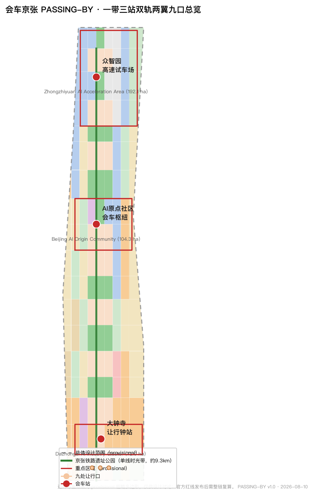
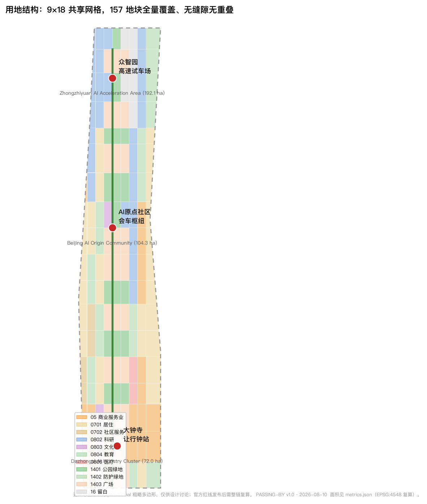
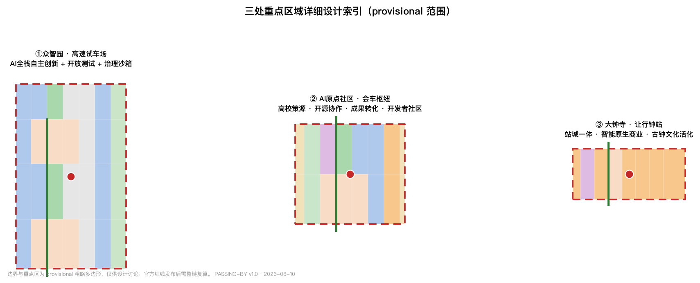
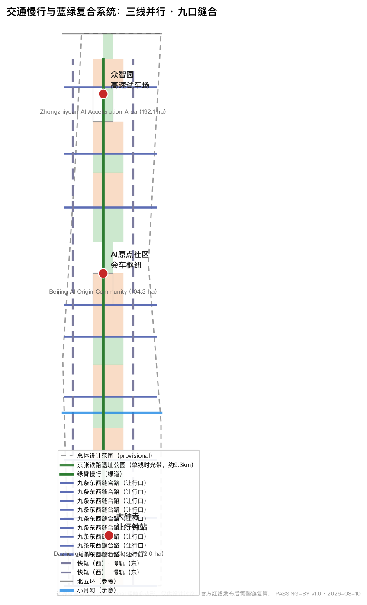
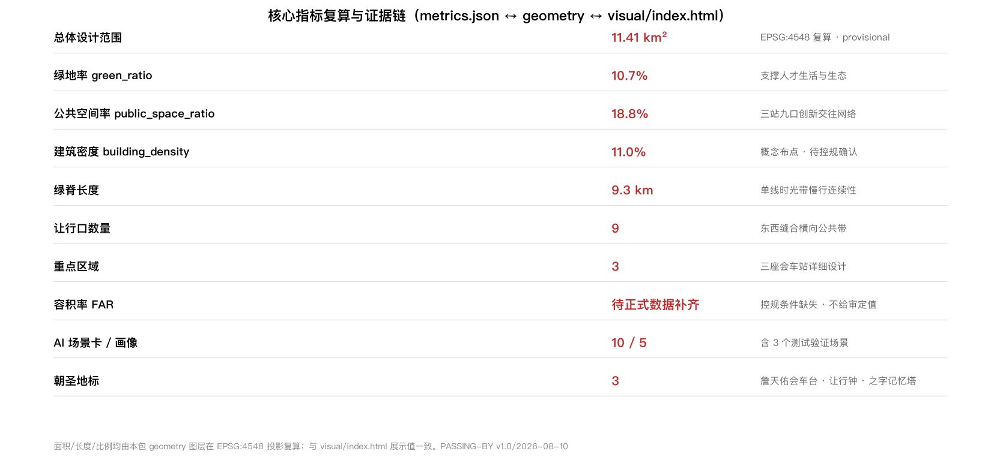

# 会车京张 PASSING-BY：让行之城

> 一条在 1909 年教会中国城市「让行」的铁路，在 2026 年教会 AI 时代的人类与机器如何共用一个城市。
>
> 本方案所有空间建议均为**概念建议、参考方案或可供专业团队深化研究**，不替代正式规划，不构成政府审定结论 [source:AGENT-TASKBOOK]。

## 设计依据与资料清单

本方案以《百年京张AI创新带城市设计国际方案征集资格预审公告》（北京市规划和自然资源委员会海淀分局，2026-05-09）为第一依据 [source:OFFICIAL-ANNOUNCEMENT] [standard:PROJECT-OFFICIAL-ANNOUNCEMENT]，并遵循《面向全球智能体开展百年京张AI创新带城市设计开源征集任务书摘录》的十条共创原则与六项必答任务 [source:AGENT-TASKBOOK] [standard:PROJECT-AGENT-OPEN-CALL-TASKBOOK]。设计空间以 `brief/site-package/` 登记的临时粗略边界与重点区域多边形为起点 [source:BOUNDARY-SOURCE]，资料用途边界以 `data/source_registry.json` 为准 [source:SOURCE-REGISTRY]。

资料来源边界如下：正式可用（formal-ready）资料 5 条，包括资格预审公告、面向智能体任务书、城市设计管理办法、控规编制审批办法、国土空间用地用海分类指南；provisional-only 资料 1 条，即仓库维护者登记的三层范围与三处重点区临时粗略 polygon。本方案不将 provisional 资料用于官方红线、精确面积或法定控制结论 [source:SOURCE-REGISTRY]。

本次提交的关键状态：**边界与三处重点区均为 provisional 临时范围**，只能用于方案生成、自检、可视化和设计讨论；组织方数据缺口不阻断内容评分，但官方 polygon 发布后，本包所有面积敏感指标与图层需整链重算 [data:geometry/site_boundary.geojson#SITE-001] [metric:site_area_sqm]。边界精度限制与复算触发条件完整记录于 `assumptions.json`。

## 方案总述：会车京张 · 让行之城

### 核心判断

1909 年通车的京张铁路是中国自行设计建造的第一条干线铁路，全程单线运行。单线铁路上的列车必须在车站**会车让行**——快车、慢车、货车、客车在同一根轨道上协商路权，靠的是站场调度、信号规则和一种朴素的公共伦理：**谁该让、何时让、让到哪里**。这条铁路在海淀留下的九公里遗址公园，恰好横穿今天的中关村、学院路与 AI 产业带，是观察"速度与共处"这一 AI 时代核心问题的天然标本。

**设计判断：把"会车让行"从铁路技术史转译为 AI 时代的城市通行协议，让京张创新带成为一座"让行之城"。** 在这里，快与慢不是对立，而是需要协商的两类列车；人类与机器不是主仆，而是共享路权的出行者；AI 的能力不是无限提速，而是学会让行的边界。这一判断之所以成立，是因为场地具备三重条件：一是京张铁路单线会车的真实历史在场，二是中关村"从运煤到运算"的速度变迁在场，三是大钟寺、清河、清华园等老站与今日 AI 枢纽在地理上重合 [standard:PROJECT-AGENT-OPEN-CALL-TASKBOOK]。

### 命名与 Logo 方向

- **主名称（中文）**：会车京张
- **主名称（英文）**：JINGZHANG PASSING-BY
- **副题**：让行之城 / The City of Yielding
- **命名体系**：一带（京张）· 三站（会车站）· 双轨（快轨与慢轨）· 两翼（中关村科技服务翼、小月河场景赋能翼）· 九口（九处让行口）。三处重点区域分别命名为"众智园·高速试车场""原点社区·会车枢纽""大钟寺·让行钟站" [depth:overall_spatial_structure]。

**Logo 方向**：以两条交叉的"让行弧线"为主体——一条快线（代表 AI 产业速度）与一条慢线（代表日常生活节奏）在中间交汇出一个圆点，圆点取自铁路信号灯的三色语言（绿=通行、黄=提示、红=让行），弧线取自京张铁路在青龙桥的之字形线路与轨道曲线。标志可延展为站场编号、里程碑、导视牌与开发者徽章系统，与"京张信标""信号语言"等既有方案的抽象信号体系不同，本 Logo 强调**路权的协商动作本身**（谁让谁）[depth:overall_spatial_structure] [depth:three_key_area_detailed_design]。

### 三大定位与五大功能

| 定位 | 让行语言转译 | 空间落点 |
| --- | --- | --- |
| 百年京张文化带 | 记忆的会车：铁路文明中"让行"伦理的公共展示 | 单线时光带、老站记忆、詹天佑会车台 |
| 都市AI生活体验带 | 生活的让行：人机共享街道的日常化 | 九处让行口、会车广场、慢行绿脊 |
| AI融合创新带 | 创新的交汇：快慢产业在同一轨道上协商成长 | 双轨纵轴、三处会车站、两翼回路 |

五大功能对应：AI 全栈自主创新体系（众智园·高速试车场）、世界级 AI 创新生态（原点社区·会车枢纽）、AI+场景赋能新范式（小月河场景赋能翼·试车线）、智能化 AI 活力城市（九口让行网络与公共空间）、AI 治理全球话语权（"让行协议"公共伦理与年度会车论坛）[source:AGENT-TASKBOOK] [depth:overall_spatial_structure]。

### 全球 AI 创新生态案例（5-8 个）

1. **美国硅谷+斯坦福**：高校策源-风险资本-产业转化的"双螺旋"，转化为原点社区的"高校-研究院-孵化器"连续体 [source:OFFICIAL-ANNOUNCEMENT]。
2. **英国剑桥科技园**：低密度科研园区与学院镇的产学研一体，转化为众智园的"楼宇实验室+开放测试场"。
3. **日本筑波科学城**：国家主导的产官学研体系，转化为"央地共建+清单化要素保障"的机制参考。
4. **新加坡纬壹科技城 one-north**：产业园区与公共生活共生的"工作-生活-游乐"混合街区，转化为大钟寺"站城一体+智能原生商业"。
5. **韩国板桥科技谷**：内容产业与创业者社区的高密度聚合，转化为"众创楼宇+开发者社区"运营。
6. **德国柏林 Adlershof**：在原东柏林机场旧址上的科学城更新——与京张"旧址更新+创新导入"路径最接近，转化为九口缝合带的渐进式更新方法。
7. **深圳南山区**：政府引导与市场双轮驱动的创新城区，转化为"政企共建+场景清单开放"。
8. **杭州未来科技城**：以人才与场景为核心的产城融合，转化为人才公寓、场景路演与"让行日"公共运营。

这些案例不照搬，只提取可转化的机制：策源-加速-生活-治理四段闭环、场景清单开放、开发者社区运营、公共空间承载创新交往 [source:AGENT-TASKBOOK] [depth:land_use_layout]。

## 三层范围工作框架

方案按公告确定的三层范围组织工作，并在 `compliance_matrix.json` 中逐条映射公告 1.3、1.4、1.5 与 agent.1-agent.6 必答任务 [standard:PROJECT-OFFICIAL-ANNOUNCEMENT] [depth:three_level_scope_framework]。

| 层级 | 面积（官方公告值） | 工作目标 | 本方案回答 | 数据落点 |
| --- | --- | --- | --- | --- |
| 统筹研究范围 | 43.6 km² | 产业战略与未来城市形态 | 三区两翼协同回路、创新链组织、全球案例转化 | [data:geometry/key_areas.geojson#PROV-KEY-001]、[metric:coordinated_research_area_sqm] |
| 总体设计范围 | 11.4 km² | 控规深度城市更新与风貌 | 一带三站双轨两翼九口空间结构、用地与建筑布局 | [data:geometry/site_boundary.geojson#SITE-001]、[data:geometry/land_use.geojson#LU-014] |
| 重点区域范围 | 368.4 ha | 三处片区详细设计 | 会车场/会车枢纽/让行钟站三套小方案 | [data:geometry/key_areas.geojson#PROV-KEY-001]、[metric:key_area_count] |

三层范围的边界当前均为**provisional 粗略多边形**（矩形近似），来源为仓库维护者基于公开文字描述推断 [source:BOUNDARY-SOURCE] [assumption:A-BOUNDARY-001]。其适用范围仅限于：临时方案生成、人类可读可视化、非法定设计讨论、本地自检；**不得**用于官方红线、审批依据、精确面积计算或法定控制结论。官方 polygon 发布后，site_boundary、key_areas、land_use、buildings、roads、green_space、public_space、phasing 与全部面积指标需按官方边界重算 [data:geometry/site_boundary.geojson#SITE-001] [metric:site_area_sqm]。

## 统筹研究范围产业与未来城市研究

### 空间结构：一带三站双轨两翼九口

总体空间结构以"会车"为组织逻辑 [depth:overall_spatial_structure]：

- **一带**：京张遗址公园"单线时光带"（绿脊），自南向北约 9.27 公里 [metric:heritage_spine_length_m]，是记忆轴、慢行轴与公共体验轴 [data:geometry/green_space.geojson#GREEN-014]。
- **三站**：三处会车站，即三处重点区域——众智园（高速试车场，北）、原点社区（会车枢纽，中）、大钟寺（让行钟站，南）[data:geometry/key_areas.geojson#PROV-KEY-001] [data:geometry/key_areas.geojson#PROV-KEY-002] [data:geometry/key_areas.geojson#PROV-KEY-003]。
- **双轨**：快轨（西侧科创服务纵轴，连接众智园-原点-大钟寺的产业创新链）与慢轨（东侧生活服务纵轴，串联居住、教育与社区服务），与中央绿脊构成"三线并行" [data:geometry/roads.geojson#ROAD-W01] [data:geometry/roads.geojson#ROAD-E01]。
- **两翼**：中关村科技服务翼（西，资本、知识产权、国际要素配置）与小月河场景赋能翼（中段横向，AI 场景测试与活力生活）[source:AGENT-TASKBOOK]。
- **九口**：九处横贯绿脊的东西缝合"让行口"，每口对应一条东西缝合路与一座会车广场，解决京张铁路百年"东西阻隔"问题 [metric:passing_point_count] [data:geometry/public_space.geojson#PUBLIC-003] [data:geometry/roads.geojson#ROAD-P01]。

### 产业组织与要素机制

众智园承担 AI 全栈自主创新体系：芯片-框架-模型-应用四层闭环的研发空间、开放测试场与留白用地 [data:geometry/land_use.geojson#LU-143]；原点社区承担世界级创新生态：高校策源、开源协作、孵化转化与开发者社区 [data:geometry/land_use.geojson#LU-093]；大钟寺承担智能原生新业态：站城一体商业、AI 消费体验与古钟文化活化 [data:geometry/land_use.geojson#LU-013]。土地、空间、产业、资金、人才、算力、数据、场景八类要素的配置机制写成概念建议与"待专业团队深化"事项，不作已确定安排 [source:AGENT-TASKBOOK]。

## 总体设计范围城市更新与控规深度城市设计

总体设计范围以"单线时光带"为主脊组织城市更新，达到控规深度城市设计的研究深度 [depth:land_use_layout] [depth:development_intensity_controls]：

- **用地布局**：以 9×18 共享网格对总体范围做完整用地划分（157 个地块），覆盖全部边界、无缝隙无重叠 [data:geometry/land_use.geojson#LU-000]。科研用地（0802）约 161.9 万 m²、商业服务业用地（05）约 161.6 万 m²、居住用地（0701）约 210.5 万 m²、公园绿地（1401）约 122.2 万 m²、广场用地（1403）约 214.5 万 m²、留白用地（16）约 50.8 万 m²，各类面积均可由用地图层复算 [metric:land_use_0802_area_sqm] [metric:land_use_05_area_sqm] [metric:land_use_1401_area_sqm]。
- **功能比例**：创新研发与商业服务合计约 28.4%，居住与社区服务约 22.8%，绿地与开敞空间约 29.5%，留白约 4.5%——产业空间、生活空间与公共空间保持大致均衡，避免单一功能主导 [metric:green_ratio] [metric:public_space_ratio]。
- **城市更新框架**：以"留-改-拆-新建"四级逻辑组织，现状建筑与权属资料未提供，拆改留仅作方法性建议 [depth:retain_renovate_demolish] [assumption:A-OWNERSHIP-001]。
- **开发强度**：容积率、建筑高度、建筑密度、绿地率、退线等法定控制指标在公开资料中缺失，`planning_limits.json` 全部登记为 missing；本方案不给出容积率/高度结论，建筑规模以"概念性、待控规条件确认"表述 [metric:floor_area_ratio] [metric:building_density]。

## 重点区域详细设计

三处重点区域均为 provisional 范围，以下设计为方向性概念，官方 polygon 与控规条件补齐后需复算 [data:geometry/key_areas.geojson#PROV-KEY-001] [depth:three_key_area_detailed_design]。

### 众智园 AI 自主创新加速区（192.1 ha，北段"高速试车场"）

- **定位**：AI 全栈自主创新体系与 AI 治理全球话语权的承载区 [source:AGENT-TASKBOOK]。
- **空间结构**：以中央绿脊为轴，西侧集中 AI 研发园区（科研用地为主），东侧预留开放测试与留白用地（16），北端设"高速试车场"——面向自动驾驶、机器人、低空设备的公共测试走廊 [data:geometry/land_use.geojson#LU-143] [data:geometry/land_use.geojson#LU-145]。
- **建筑更新**：以"楼宇实验室+共享测试场"为原型，建筑基底密度约 11% 为概念建议值 [metric:building_density]。
- **AI 场景**：全栈验证、测试开放、治理沙箱（见场景卡 S1-S3）。
- **实施风险**：测试场涉及道路与安全监管，需专业团队确认。

### 北京 AI 原点社区（104.3 ha，中段"会车枢纽"）

- **定位**：世界级 AI 创新生态与"会车枢纽"——高校策源、开源协作、孵化转化在此交汇 [source:AGENT-TASKBOOK]。
- **空间结构**：以中央绿脊上的"原点会车广场"为核心，西侧布局文化与教育用地（0803/0804），东侧布局科研与商业服务（0802/05），外围人才社区（0701）[data:geometry/land_use.geojson#LU-093] [data:geometry/land_use.geojson#LU-094]。
- **建筑更新**：依托高校与院所周边，以"成果转化街+开发者社区"为原型，保留为主、渐进改造。
- **AI 场景**：AI+教育、AI+法律、开发者协作（见场景卡 S4-S7）。
- **实施风险**：高校权属与校园边界未提供，邻近地块改造需专业团队深化。

### 大钟寺 AI 产业集聚区（72.0 ha，南段"让行钟站"）

- **定位**：智能原生新业态与站城一体商业区 [source:AGENT-TASKBOOK]。
- **空间结构**：以"让行钟站"为核心——把大钟寺古钟博物馆的钟声文化转译为"报时+让行"公共仪式；站点周边集中商业服务业用地（05）与文化用地（0803），TOD 高强度聚合，外围为居住与教育配套 [data:geometry/land_use.geojson#LU-013] [data:geometry/land_use.geojson#LU-014]。
- **建筑更新**：站城一体开发为主，商业、文化、交通接驳复合。
- **AI 场景**：AI+商业、AI+交通枢纽、古钟数字导览（见场景卡 S8-S10）。
- **实施风险**：站点一体化涉及轨道与工程条件，需专业团队确认。

## AI 创新生态、人才画像与 AI+ 场景

### 用户画像（5 类）

| 画像 | 特征 | 核心诉求 | 对应场景 |
| --- | --- | --- | --- |
| P1 创业开发者 | 25-40 岁，AI 初创团队 | 算力、测试场地、融资、社区 | S1/S2/S5/S6 |
| P2 高校师生科研者 | 20-35 岁，高校院所 | 实验室共享、成果转化、学术社交 | S4/S5/S7 |
| P3 园区企业员工 | 24-45 岁，AI 企业 | 通勤、餐饮、健康、育儿 | S8/S9/S12 |
| P4 原住居民与老人儿童 | 全龄，既有社区 | 安全步行、公园、社区服务 | S3/S10/S11 |
| P5 游客与国际访客 | 18-60 岁，京张文化/AI 旅游 | 文化导览、体验、国际交流 | S6/S9/S10/S13 |

### AI 场景卡（10 张，含 3 张产业测试验证场景）

**S1【测试验证】众智园开放测试场**：面向自动驾驶、低速无人配送、机器人巡检的低速公共测试走廊。运行数据匿名化，设置人工急停与安全员制度。空间落点：众智园东侧留白区 [data:geometry/land_use.geojson#LU-145]。隐私边界：测试区人脸数据只做脱敏统计；人工复核：安全员+运营中心双确认；运营主体：园区运营公司（概念建议）。

**S2【测试验证】人机让行交叉口协议**：在九处让行口中选点设置"会车红绿灯"——AI 感知系统与行人优先协议结合的混合交叉口，实时公开让行决策日志。空间落点：ROAD-P01-P09 横向缝合路 [data:geometry/roads.geojson#ROAD-P01]。人工复核：可回退为传统信号；不部署人脸识别。

**S3【测试验证】大钟寺智能商业沙箱**：在商业街区开放 AI 导购、无感支付、配送机器人共存的限定沙箱，测试期 6-12 个月，运营数据向公众披露。空间落点：大钟寺商业地块 [data:geometry/land_use.geojson#LU-013]。

**S4 高校-研究院-孵化器连续体**：原点社区"成果转化街"，高校实验室与孵化器同街共建，AI 协助专利申请与合规审查。空间落点：原点社区西侧教育/科研地块 [data:geometry/land_use.geojson#LU-093]。

**S5 开发者会车广场**：原点会车广场的周末开源协作与路演，AI 协助开发者匹配导师、资金与测试资源。

**S6 京张记忆 AI 导览**：沿单线时光带部署 AR 里程牌导览，还原 1909 会车场景与今日 AI 场景对照 [scenario:ai-cultural-guide]。

**S7 AI+教育学堂**：社区 AI 素养课堂，AI 辅助个性化学习，坚持教师在场与人工出题复核。

**S8 AI+医疗健康服务导航**：面向园区员工与老人的健康自测与就医导航，仅使用公开健康知识库，不采集个人病历 [scenario:ai-health-service-navigation]。

**S9 AI+交通与慢行评估**：单线时光带的步行-骑行流量感知与安全评估，数据公开可查 [scenario:ai-traffic-walkability]。

**S10 让行口社区客厅**：九口公共空间的居民自治平台，AI 协助议事记录与需求聚合，决策由居民议事会完成 [scenario:enterprise-service-copilot]。

**S11 AI+生活服务**：社区食堂、老年助餐、无人配送的末端服务链 [scenario:robot-delivery-low-speed]。

**S12 企业服务 Copilot**：面向园区企业的政策匹配、算力申请、人才招聘一体化助手 [scenario:enterprise-service-copilot]。

**S13 公共活动运营复核**：大型活动的人流与安全复核，AI 输出建议、人工最终决策 [scenario:public-safety-operations-review]。

以上场景的空间-服务对象-数据-隐私-复核-运营主体-风险完整映射见 `compliance_matrix.json` 与 `visual/index.html`，正文不做机器索引堆叠 [source:AGENT-TASKBOOK] [depth:overall_spatial_structure]。

### 场景开放与隐私边界

所有场景遵守"不监控个体、可人工复核、可回退、数据脱敏公开"四条底线；未成熟技术不得表述为已可全面部署；测试场景不得表述为已批准运营 [source:AGENT-TASKBOOK]。隐私与人工复核边界见 `compliance_matrix.json`。

## 用地、建筑规模与拆改留方案

用地布局以共享网格划分并全量覆盖边界 [data:geometry/land_use.geojson#LU-000]，主要类别面积见"总体设计范围"一节。建筑方案以 101 个建筑基底概念表达 [metric:building_footprint_area_sqm]，按科研（0802）、教育（0804）、文化（0803）、医疗（0806）、商业（05）、居住（0701/0702）、留白孵化（16）分型布点 [data:geometry/buildings.geojson#BLDG-001] [data:geometry/buildings.geojson#BLDG-100]。

拆改留分类：现状建筑、权属与文保范围未提供，方案以"保留为主、渐进改造、有限新建"为原则性建议；任何地块级拆改留结论均须由专业团队基于现状调查与法定程序确定 [depth:retain_renovate_demolish]。建筑规模与高度全部待控规条件确认，本方案不给出审定值 [metric:floor_area_ratio]。

## 交通、轨道、市政与公共服务设施

- **道路微循环**：一条中央绿脊步道 + 西快轨/东慢轨双纵路 + 九条东西缝合路 + 三处重点区内环路 [data:geometry/roads.geojson#ROAD-S01] [data:geometry/roads.geojson#ROAD-P01] [data:geometry/roads.geojson#ROAD-C012]；道路面积按概念路幅折算约 121.6 万 m² [metric:road_area_sqm]。
- **轨道与站点一体化**：依托既有轨道站点（清河、清华园、大钟寺方向），以三处会车站组织站城一体开发；轨道线位与工程条件待官方资料确认。
- **慢行断点**：九口缝合路与绿脊立交/平交组织，优先保障步行与骑行连续 [metric:heritage_spine_length_m]。
- **市政与新型基础设施**：分布式能源、端侧算力、智慧灯杆、无人物流末端等作为概念建议；管线容量、负荷测算等专业结论待市政专项确认 [depth:municipal_new_infrastructure]。

## 蓝绿空间、公共空间与城市风貌

- **蓝绿系统**：单线时光带（中央绿脊）为一级绿廊，小月河横向生态带为二级蓝绿廊道，九口公共空间为横向渗透带；绿脊与小月河交汇处设蓝绿节点 [data:geometry/green_space.geojson#GREEN-014] [metric:green_ratio]。遗产保护走廊、既有铁路线位、水系与主干路的参考约束见 constraints 图层 [data:geometry/constraints.geojson#CONSTRAINTHER-001]。
- **公共空间**：三座会车广场（大钟寺让行钟站、原点会车枢纽、众智园会车场）与九处让行口共同构成"三站九口"公共空间网络 [data:geometry/public_space.geojson#PUBLIC-003] [metric:public_space_ratio]。
- **AI 朝圣地标（3 个）**：
  1. **詹天佑会车台**（原点社区北端）：纪念 1909 年单线会车智慧，设"让行协议"公共宣言墙与 AI 时代会车编年史展廊；
  2. **大钟寺让行钟**（大钟寺会车场）：以古钟报时文化转译为每日"让行时刻"公共仪式，钟声与 AI 交通信号联动（概念）；
  3. **青龙桥之字记忆塔**（众智园北端）：以之字形线路为原型的高点观景与荣誉展示塔，承载开发者荣誉与开源里程碑。
- **荣誉展示体系**：沿绿脊设"会车里程碑"——开发者、企业、社区贡献者的荣誉节点，与公共空间组件库（座椅、灯柱、导视、里程牌）统一语言 [depth:blue_green_public_space]。
- **城市风貌**：以"铁路+信号+蓝绿"为基调语言，建筑风貌强调体量错落与绿脊对景；风貌控制为概念建议，待官方城市设计导则确认。

## 更新项目清单、实施政策与分期计划

**12 个更新项目**（概念清单，见 `visual/index.html` 与 `compliance_matrix.json`）：①大钟寺站城一体更新 ②让行钟公共广场 ③原点会车广场 ④成果转化街 ⑤原点开发者社区 ⑥詹天佑会车台 ⑦众智园开放测试场 ⑧众智园研发园区 ⑨青龙桥记忆塔 ⑩小月河蓝绿带 ⑪九口缝合路工程 ⑫社区客厅网络 [metric:renewal_project_count] [data:geometry/phasing.geojson#PHASE-1]。

**分期计划**（与 `geometry/phasing.geojson` 对应）[depth:phasing_implementation]：
- 一期（2026-2028，约 225.1 万 m²）：大钟寺让行钟站与原点会车枢纽激活，先行打通南北慢行断点 [metric:phase_1_area_sqm]；
- 二期（2028-2031，约 401.3 万 m²）：九口缝合路与小月河蓝绿带织补，社区客厅网络扩展 [metric:phase_2_area_sqm]；
- 三期（2031-2035，约 514.9 万 m²）：众智园全栈园区与青龙桥记忆塔生长，创新带全面成环 [metric:phase_3_area_sqm]。

**长期运营（agent.6）**：年度"会车日"（9 月，呼应 1909 通车）与"让行周"；全球"让行协议"AI 伦理年度对话；开发者社区以"会车里程碑"徽章体系激励贡献；AI 场景开放运营以"测试-展示-推广"三阶段推进；国际传播以"PASSING-BY"品牌与京张编年史双线叙事；人才、企业、开发者转化路径以"会车广场路演-园区入驻-场景开放-成果发布"四步闭环。所有活动与机制均为概念建议，不构成已确定政府安排 [source:AGENT-TASKBOOK]。

## 指标体系、面积复算与合规矩阵

核心指标均由本包几何图层在 EPSG:4548 投影下复算，公式、来源、置信度与假设完整记录于 `metrics.json`，与 `visual/index.html` 展示值一一对应 [depth:metrics_recalculation] [metric:site_area_sqm]。

| 指标 | 值 | 单位 | 设计含义 |
| --- | --- | --- | --- |
| 总体设计范围面积 | 11,412,825（复算）/ 11,400,000（公告） | m² | 边界为 provisional，复算值用于本包一致性 |
| 绿地率 green_ratio | 10.7% | 比例 | 中央绿脊为核心，支撑人才生活与生态 |
| 公共空间率 public_space_ratio | 18.8% | 比例 | 三站九口公共网络支撑创新交往与公共伦理 |
| 建筑密度 building_density | 11.0% | 比例 | 概念布点，待控规确认 |
| 绿脊长度 | 9,272 | m | 单线时光带的慢行连续性 |
| 让行口数量 | 9 | 个 | 东西缝合的横向公共带 |
| 重点区域 | 3 | 个 | 会车站详细设计对象 |
| 容积率 FAR | 待正式数据补齐 | 比例 | 控规条件缺失，不给出审定值 |

公告 1.3（3 项）、1.4（3 项）、1.5（9 项）与 agent.1-agent.6（6 项）全部在 `compliance_matrix.json` 覆盖；6 项强制专业标准在 `standard_matrix.json` 覆盖；15 项设计深度项在 `design_depth_matrix.json` 标记 complete [depth:existing_conditions_diagnosis] [depth:risk_missing_data]。

## 风险、版权与合规说明

- **资料合法性**：全部依据为公开或用户提供且已清权资料；不使用非公开规划图件、内部指标或个人隐私 [source:SOURCE-REGISTRY]。
- **边界精度**：provisional 边界不得用于官方红线与精确面积；替换 official polygon 后需整链重算。
- **规划合规**：不提供控规调整、容积率、建筑高度等法定判断；拆改留、道路线形、轨道线位、市政工程均为概念建议。
- **文保与生态**：京张遗产保护范围、绿地蓝线、文保控制线待官方数据，邻近遗产廊道的设计仅作方向性表达。
- **AI 生成责任**：本方案由 AI agent 基于公开资料与结构化校验生成，人工与专业团队负责最终判断 [source:AGENT-TASKBOOK]。
- **版权与授权**：Logo、命名、字体、图片均未使用未授权素材；完整声明见 `report/copyright_statement.md`。
- **待补资料与专业复核**：官方边界与重点区 polygon、控规条件、现状建筑与权属、文保范围、轨道与市政资料、投资测算等均待补齐，详见 `assumptions.json` 与 `self_check.json` [depth:risk_missing_data]。

## 参考资料

1. 北京市规划和自然资源委员会海淀分局：《百年京张AI创新带城市设计国际方案征集资格预审公告》（2026-05-09）[standard:PROJECT-OFFICIAL-ANNOUNCEMENT]。
2. 《面向全球智能体开展百年京张AI创新带城市设计开源征集任务书摘录》（用户提供清权文件，2026-05-18）[standard:PROJECT-AGENT-OPEN-CALL-TASKBOOK]。
3. 住房和城乡建设部：《城市设计管理办法》（2023）。
4. 住房和城乡建设部：《城市、镇控制性详细规划编制审批办法》。
5. 自然资源部：《国土空间调查、规划、用途管制用地用海分类指南》（2023-11）。
6. 仓库维护者：《百年京张AI创新带三层范围与三处重点区临时粗略 polygon》（provisional）[source:BOUNDARY-SOURCE]。
7. 北京市海淀区人民政府公开资料（背景参考）。
8. 京张铁路历史公开资料（1905-1909 建设史、单线运营与青龙桥之字形线路，背景参考）。

（2026-08-10 定稿 · PASSING-BY v1.0）
