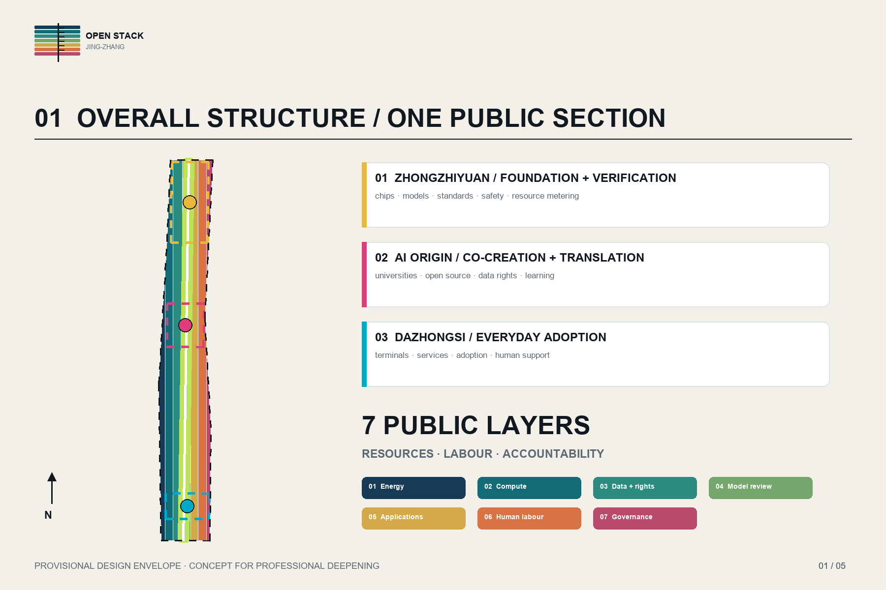
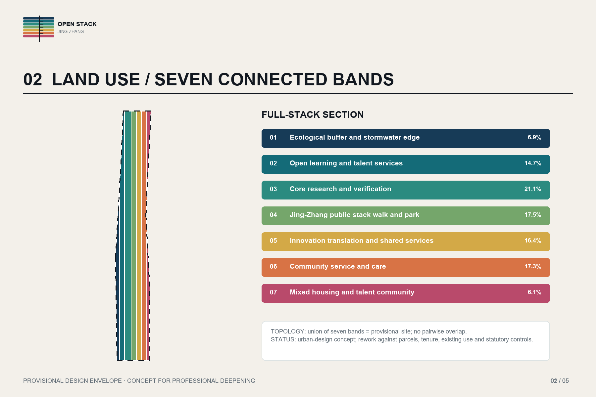
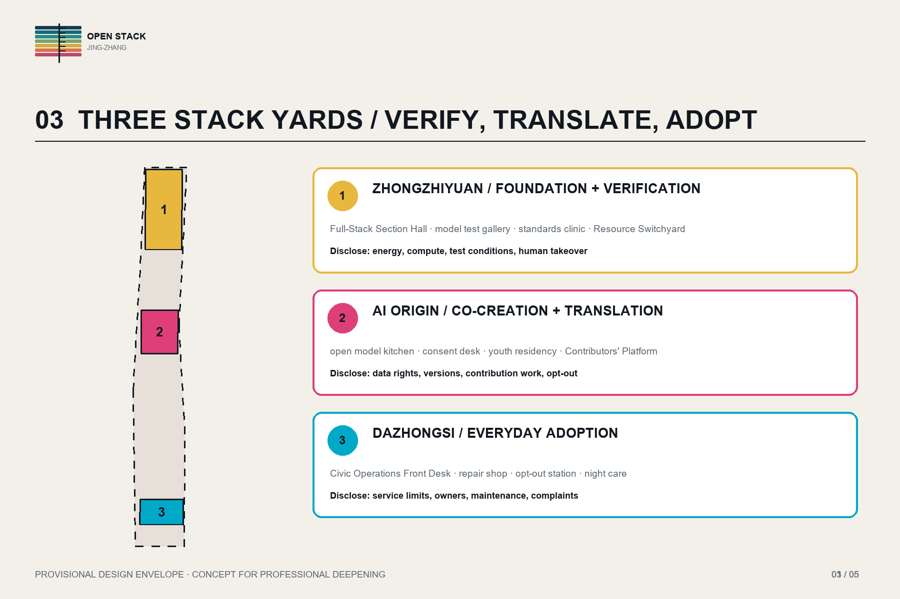
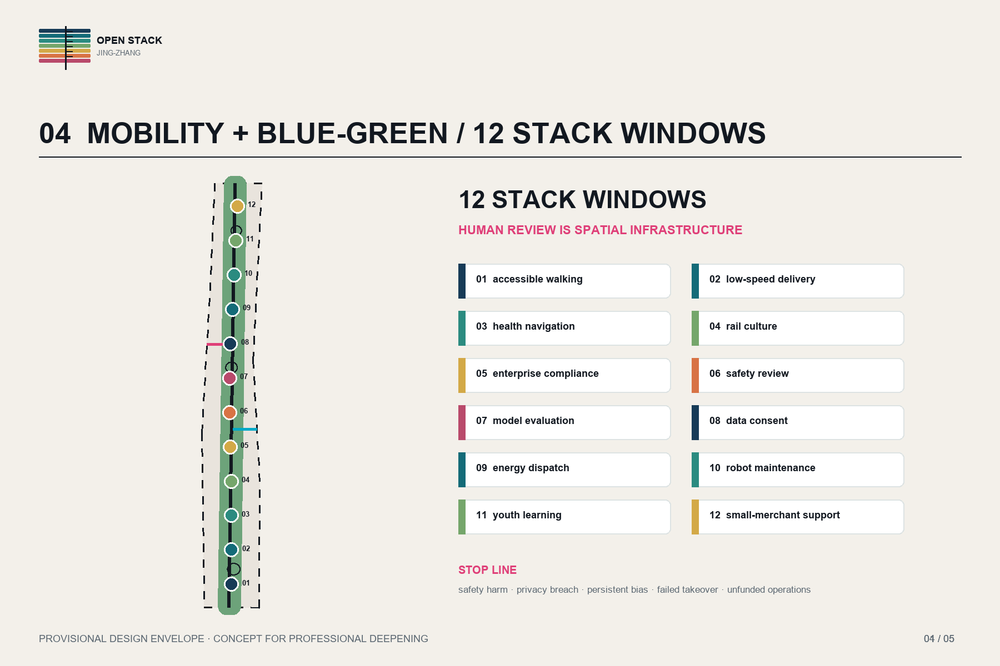
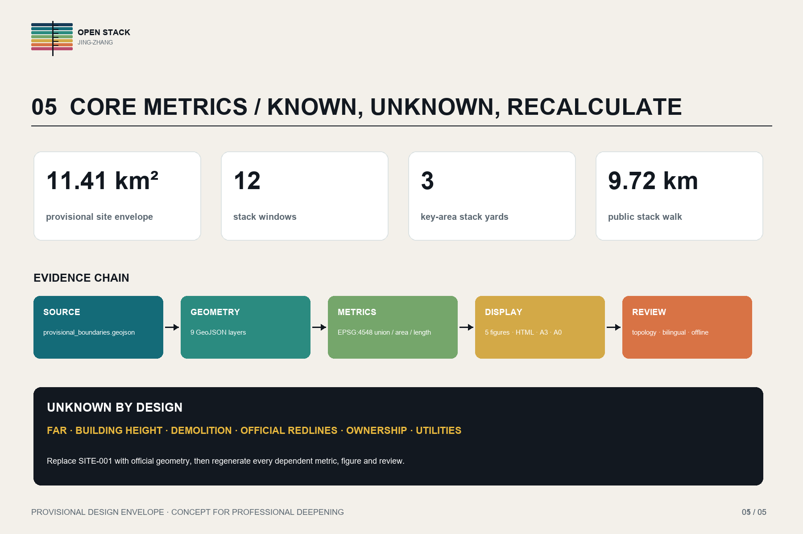

# OPEN STACK JING-ZHANG

> A public section through the resources, labour and accountability behind urban AI. Every spatial move is a concept for professional deepening; provisional boundaries have no statutory or approval status.

## Design Basis and Source List

This proposal uses only registered repository material and public webpages. The official announcement defines the three scope levels, three key areas, professional depth and approximate area basis. The agent taskbook adds six obligations: identity, global cases, future personas, pilgrimage landmarks, AI+ scenarios and long-term operation. The overall and key-area geometries are rough repository proxies. They are drawn with dashed boundaries and must never be represented as road redlines, cadastral limits, statutory zoning or government commitments. [source:OFFICIAL-ANNOUNCEMENT] [source:AGENT-TASKBOOK]

The source-use table separates authority from inspiration. Official planning documents govern tasks and review depth; provisional geometry supports generation and topology checks only; seven international cases supply operational mechanisms without importing standards or copying media. Missing inputs include official boundaries, existing land use and buildings, tenure, population and jobs, mobility surveys, utilities, ecology, heritage, land values and confirmed operators. Each gap remains visible in assumptions.json or as an unknown metric. The five figures, nine GeoJSON layers, PDFs and offline HTML share one EPSG:4548 geometry and metric chain. [data:geometry/site_boundary.geojson#SITE-001] [depth:existing_conditions_diagnosis]

The readable proposal explains decisions while structured files preserve the audit trail. Official data should replace the provisional input before any statutory or implementation use. The package must then be recalculated and reviewed by qualified planning, architecture, transport, infrastructure, landscape, industry, operations and legal professionals. [source:SOURCE-REGISTRY] [standard:PROJECT-OFFICIAL-ANNOUNCEMENT]

## Three-Level Scope Framework

The coordinated research area is used to understand industry networks and regional services, without inventing a precise boundary. The overall design area uses the repository's roughly 11.4-square-kilometre corridor proxy to organise one public stack walk, seven longitudinal program bands, two external feeds and twelve stack windows. The three key-area proxies carry detailed roles, public-space prototypes and operating tests. These scales produce different outputs: a relationship framework, an urban-design structure and implementable project cards. [depth:three_level_scope_framework] [data:geometry/key_areas.geojson#PROV-KEY-001]

Open Stack is a public inspection method, not another branded innovation axis. Urban AI usually hides energy, compute, data, models, labour and accountability backstage. The proposal exposes seven layers: energy and environment; compute and network; data and rights; model evaluation; applications and services; human labour; governance and culture. Each stack window publishes at least three layers together with an accountable operator, resource account, human-review path, opt-out and annual learning record. [data:geometry/roads.geojson#ROAD-STACK-001] [source:AGENT-TASKBOOK]

The seven program bands are conceptual and do not amend statutory land use. Ecological buffer, open learning, core research, public park, innovation translation, community service and mixed housing cover the provisional design envelope. Professional deepening must rework them against parcels, roads, tenure, existing uses and regulatory codes while protecting continuous public access and non-digital services. [data:geometry/land_use.geojson#LU-001] [standard:MNR-LAND-USE-CLASSIFICATION-GUIDE]

## Coordinated Research Area: Industry and Future City Research

Seven cases provide verifiable operating lessons. Punggol Digital District links physical systems and a district digital platform; one-north combines specialised clusters with living, learning and public activity; Cambridge's Foundry turns an industrial building into accessible community and workforce space; STATION F combines startup programs, partners, housing and shared services; Knowledge Quarter London illustrates cross-institution partnership; Amsterdam makes algorithm accountability visible; and Tonsley connects government, university and industry in industrial-site regeneration. They are mechanism references, not sources of Beijing controls. [source:CASE-PUNGGOL] [source:CASE-AMSTERDAM] [source:CASE-TONSLEY]

The local industry proposition is a visible chain rather than a company count. Zhongzhiyuan concentrates chips, models, evaluation, safety and resource metering. AI Origin connects universities, open-source communities, data rights, talent learning and translation. Dazhongsi tests terminals, everyday services, adoption and human support. A western service feed supplies legal, IP, finance, talent and standards capacity; an eastern scenario feed turns mobility, ecology, education, health, culture and neighbourhood needs into bounded tests. [depth:overall_spatial_structure] [data:geometry/key_areas.geojson#PROV-KEY-002]

Projects enter the public stack only when resource costs can be measured, public effects can be reviewed and local value can be demonstrated through learning, work, procurement or maintenance. Projects that fail these gates remain in controlled research settings. Annual hearings and operations data decide whether each test continues, changes or closes. [standard:PROJECT-AGENT-OPEN-CALL-TASKBOOK] [metric:stack_window_count]

## Overall Design Area: Urban Renewal and Regulatory-Plan-Level Urban Design

The overall structure is one public stack walk, three stack yards, two supply feeds, twelve stack windows and seven disclosed layers. The walk is a slow-mobility and sponge-space line rather than a claim for a new motor road. The three yards enlarge the roles of the key areas. The western feed brings enterprise services; the eastern feed brings civic scenarios and public feedback. Each window is simultaneously a small gallery, human service desk, maintenance hatch, consent point and civic meeting room. [data:geometry/public_space.geojson#WINDOW-01] [depth:overall_spatial_structure]

Seven continuous bands form a topology-complete concept plan. Research and education support verification and learning; commercial and community uses host translation, support and shared facilities; housing supports mixed daily life; park and buffer bands carry walking, stormwater and rest. The proposal does not claim FAR or building height. Twelve small building prototypes keep the geometry and footprint metric internally consistent while remaining explicitly subject to survey and professional design. [data:geometry/buildings.geojson#BLDG-001] [metric:building_footprint_area_sqm]

Controls are separated into three levels. Continuous access, universal design, visible operations and service opt-out are firm design commitments. Street sections, height, intensity, parking, utilities, fire safety and landscape engineering require professional confirmation. Demolition, land assembly and statutory rezoning remain undecided. Reversible connections, staged acceptance and operations-first procurement prevent premature capital lock-in. [standard:MOHURD-CONTROL-DETAILED-PLANNING] [depth:development_intensity_controls]

## Detailed Design of Key Areas

Zhongzhiyuan becomes the Foundation and Verification Stack Yard. A resource exchange hall, model test gallery, standards clinic and safety drill court allow companies to submit models or devices, qualified organisations to publish test conditions, and visitors to see energy demand, limits and human takeover. The Full-Stack Section Hall makes the seven layers spatially legible; the Resource Switchyard displays electricity, compute and maintenance time. All locations remain provisional pending tenure and existing-condition surveys. [data:geometry/key_areas.geojson#PROV-KEY-001] [depth:three_key_area_detailed_design]

AI Origin becomes the Co-creation and Translation Stack Yard. An open model kitchen, data-consent desk, youth residency and public evaluation classroom connect universities, open-source communities and urban needs. The Contributors' Platform names code, data, annotation, testing, translation and maintenance work instead of celebrating one founder. Quarterly problem briefs require a non-digital alternative, accessibility test and exit note. [source:AGENT-TASKBOOK] [data:geometry/public_space.geojson#WINDOW-07]

Dazhongsi becomes the Everyday Adoption Stack Yard. A Civic Operations Front Desk, terminal repair shop, scenario opt-out station and night-care node test health navigation, cultural guidance, low-speed delivery, walking support, enterprise services and safety review. The three yards share a data dictionary and annual audit while retaining independent stop authority. [data:geometry/key_areas.geojson#PROV-KEY-003] [standard:MOHURD-URBAN-DESIGN-MEASURES]

## AI Innovation Ecosystem, Personas, and AI+ Scenarios

Six initial personas test whether the district serves more than a technical elite: an algorithm founder needs affordable testing and compliance advice; a student needs open courses, night learning and credible internships; an older resident needs face-to-face explanation and easy opt-out; a wheelchair user needs continuous access and multimodal interfaces; a maintenance worker needs safe work, spares, rest and attribution; a small merchant needs understandable procurement, training and appeal. Each has a human service touchpoint, but real participatory research must revise these assumptions. [source:AGENT-TASKBOOK] [depth:risk_missing_data]

Twelve scenario cards share six fields: purpose, place, disclosed stack layers, human review, stop condition and evaluation. They cover accessible walking, low-speed delivery, health navigation, railway culture, enterprise compliance, after-action safety review, open model evaluation, data consent and withdrawal, energy dispatch, robot maintenance training, youth learning and small-merchant support. Model evaluation, energy dispatch and robot maintenance are the three industrial tests and begin in controlled settings. [data:geometry/constraints.geojson#SCENARIO-01] [metric:stack_window_count]

Testing stops after safety harm, privacy breach, persistent bias, failed takeover or unfunded operation. Evaluation covers takeover time, correction, availability of non-digital paths, maintenance hours, resource demand and affected-group feedback, not just usage. The Full-Stack Section Hall, Contributors' Platform, Resource Switchyard and Civic Operations Front Desk form four pilgrimage landmarks that honour engineering, care, scrutiny and shared learning. [standard:PROJECT-AGENT-OPEN-CALL-TASKBOOK] [source:CASE-KENDALL-FOUNDRY]

## Land Use, Building Scale, and Retain-Renovate-Demolish Strategy

Seven conceptual land-use bands cover the provisional site without gaps or overlaps. Codes use the repository's subset of the national classification for machine review, but the diagram does not amend statutory planning. Park and ecological bands secure a blue-green base; research, education, business, community and housing create a section from invention to daily life. Parcel, road, tenure and regulatory data must replace this abstract partition during professional deepening. [data:geometry/land_use.geojson#LU-004] [standard:MNR-LAND-USE-CLASSIFICATION-GUIDE]

The building strategy is survey first, classification second and action third. No reliable building inventory exists, so the proposal claims no demolition. Twelve prototypes express the stack windows' massing, interface and calculable footprint. Their attributes rotate among retain, renovate and new-build research directions, with every feature flagged for heritage, structural, fire, tenure and operational review. Priority actions are opening ground floors, repairing galleries, adding accessible connections and providing service interfaces. [data:geometry/buildings.geojson#BLDG-006] [depth:retain_renovate_demolish]

FAR, height, total floor area and demolition area remain unknown. A future package needs a building-by-building inventory, tenure table, structural and fire assessment, heritage value, utilisation and whole-life carbon. Demolition can proceed only after public-interest, alternative, displacement and carbon reviews. [metric:floor_area_ratio] [metric:demolition_area_sqm]

## Transport, Rail, Municipal Infrastructure, and Public Services

The transport concept neither promises a new rail station nor changes existing arterials. The Jing-Zhang Public Stack Walk is the walking and cycling spine. A western feed reaches enterprise services, an eastern feed reaches civic scenarios and three cross-links improve permeability. Key-area entrances provide visible transfer information, accessible rest and staffed help. Low-speed robots operate only within defined times and segments, with pedestrian priority, on-site takeover and physical emergency stops. [data:geometry/roads.geojson#ROAD-WING-W-001] [depth:traffic_rail_slow_parking]

Municipal and digital infrastructure are organised through a resource account. Each stack window discloses approved summaries of electricity, water, compute time, device temperature, maintenance and accountable operator. Existing server rooms and networks should be reused; new equipment stays modular and relocatable. Retention gardens support stormwater and cooling, but utility capacity, sponge targets, power load and fire conditions require dedicated surveys. [data:geometry/green_space.geojson#GREEN-STACK-001] [depth:municipal_new_infrastructure]

Public services combine a digital entry, staffed front desk and offline alternative. Health navigation does not diagnose; cultural guidance can disable location; enterprise copilots require professional review; public-safety scenarios are restricted to authorised after-action learning. Toilets, water, rest, first aid, child and care functions accompany the windows. Service radii and capacity remain subject to population, job and existing-facility evidence. [standard:MOHURD-CONTROL-DETAILED-PLANNING] [source:CASE-PUNGGOL]

## Blue-Green Network, Public Space, and Urban Character

The blue-green network combines the Jing-Zhang sponge stack walk with three retention gardens. The green strip shares an alignment with the public walk but retains distinct stormwater, shade, habitat and rest functions. Current green ratio is derived from conceptual geometry and is not a statutory target. Soil, trees, runoff, utilities, lighting and biodiversity need field investigation before detailed design. [data:geometry/green_space.geojson#GREEN-YARD-002] [metric:green_ratio]

Twelve stack windows form a public-space sequence. Daily use includes seating, shade, drinking water, charging, accessibility and staffed help; event use includes model briefings, repair classes, resident evaluation and annual audit. Entry never depends on scanning a code. Paper guidance, physical controls and staff remain available beside digital interfaces. The public-space ratio describes the concept only and needs people-flow, fire, sightline, noise and night-management testing. [data:geometry/public_space.geojson#WINDOW-12] [metric:public_space_ratio]

Urban character draws on the railway's legible engineering rather than imitating a historic style. Materials should be durable, repairable and traceable. Seven colours identify interfaces without becoming theme decoration. Night design lights work surfaces and safe paths while switching off idle screens. Algorithm version, maintenance date and accountable operator are as readable as a building nameplate. [standard:MOHURD-URBAN-DESIGN-MEASURES] [depth:height_massing_character]

## Renewal Projects, Implementation Policy, and Phasing

Phase one creates a Minimum Public Stack: official data collection, a corridor accessibility audit, three temporary windows, common accountability plates and an annual disclosure template. It uses accessible sites with clear tenure and little heavy construction. Phase two links the three stack yards and tests model evaluation, data consent, maintenance and everyday services. Phase three extends to twelve windows only after two years of public-value, cost and risk records support permanent investment. [data:geometry/phasing.geojson#PHASE-001] [depth:phasing_implementation]

The first project list includes a temporary Full-Stack Section Hall, Contributors' Platform, Resource Switchyard, Civic Operations Front Desk, three retention gardens, accessibility repairs, window prototypes, an open model kitchen, maintenance classes, annual public audit and a common opt-out protocol. Every project needs named construction, operations and data owners, a maintenance budget, complaint channel and removal plan. Without them it remains a short event. [source:AGENT-TASKBOOK] [depth:renewal_project_list]

Implementation tools include reversible micro-renewal, challenge procurement, short-term space agreements, open-course purchasing, maintenance training and annual disclosure. A council of local government, parks, universities, companies, communities, professionals and an independent ethics voice reviews incidents quarterly and resources annually. Audit covers privacy, equity, access, energy, maintenance work and procurement transparency. [source:CASE-KQ-LONDON] [standard:PROJECT-AGENT-OPEN-CALL-TASKBOOK]

Each phase assigns named parties for construction, operations, data, maintenance and oversight. Measurable indicators include three temporary windows opened on schedule, human-takeover response time, completed opt-out requests, accessibility breaks repaired, maintenance hours and annual feedback closure. No score is prefilled before the baseline, accountable owner and data permission are confirmed. [depth:phasing_implementation] [metric:stack_window_count]

## Metrics, Area Recalculation, and Compliance Matrix

Metrics have three groups. Spatial measures include provisional site area, conceptual building footprint, green ratio, public-space ratio, stack-walk length, window count and key-area count. Operating measures include human takeover time, successful opt-out, maintenance response, resource demand, learning and job participation. Public-value measures include accessibility, correction completion, affected-group feedback and local procurement. Only directly computable spatial measures are known in this package. [metric:site_area_sqm] [metric:stack_walk_length_m] [depth:metrics_recalculation]

The provisional site area is calculated in EPSG:4548 at about 11.41 square kilometres, close to the announcement's approximate number but still provisional_rough. Green and public-space ratios use geometry unions to avoid double counting. The seven land-use bands must union to the site and never overlap. FAR, height and demolition remain unknown with reasons and required data. Replacing SITE-001 triggers every dependent geometry, metric and figure. [data:geometry/site_boundary.geojson#SITE-001] [metric:green_ratio]

The compliance matrix covers seventeen official tasks and six agent tasks. The standards matrix covers the announcement, taskbook, urban-design measures, regulatory-plan requirements and national land-use guide. The depth matrix covers fifteen professional dimensions. Common IDs link narrative, geometry, drawings and checks for maintainer sampling. [standard:MOHURD-URBAN-DESIGN-MEASURES] [data:geometry/land_use.geojson#LU-007]

## Risk, Copyright, and Compliance

Six risk groups structure review. Spatial risk comes from provisional boundaries and missing tenure, buildings, utilities and engineering data. Technical risk includes model bias, failure and resource demand. Governance risk includes unclear accountability and supplier lock-in. Equity risk includes digital barriers and invisible maintenance work. Operations risk includes unfunded long-term service. Cultural risk includes turning rail heritage or AI into superficial decoration. Unknown metrics, professional review, human takeover, opt-out, resource accounts, maintenance roles and annual audit address these risks. [depth:risk_missing_data] [source:AGENT-TASKBOOK]

Data practice follows minimisation, purpose limitation, tiered access, retention limits and withdrawal. Windows do not publish personal traces, confidential business data or unlicensed training material. Safety scenarios are authorised after-action reviews; health scenarios are navigation only. Model version, scope and accountable organisation remain visible. Qualified people make consequential decisions, while ethics and accessibility representatives can recommend suspension and site operators can stop emergencies. [standard:PROJECT-AGENT-OPEN-CALL-TASKBOOK] [data:geometry/constraints.geojson#SCENARIO-06]

The proposal text, original diagrams, map styling, generated graphics and identity were produced for this submission under COMMUNITY-DISPLAY-ONLY. Case studies are paraphrased without copied photos, logos or drawings. Repository data is used within its registered permissions. This package is not a licensed design document, administrative approval or implementation promise. [source:SOURCE-REGISTRY] [standard:PROJECT-OFFICIAL-ANNOUNCEMENT]

## References

Primary references are the official announcement, agent taskbook, site package, source registry, national and ministry planning references. They separately govern task definition, open-call obligations, geometry and enums, source permissions, professional depth and land-use codes. Web access dates and use limits are stored in sources.json. No precise site fact is asserted beyond registered evidence. [source:OFFICIAL-ANNOUNCEMENT] [standard:MNR-LAND-USE-CLASSIFICATION-GUIDE]

International mechanism references are JTC Punggol Digital District, JTC one-north, Cambridge Foundry, STATION F, Knowledge Quarter London, City of Amsterdam algorithm and Civic AI pages, and Renewal SA Tonsley Innovation District. They answer how platforms, partnerships, public learning, accountability and industrial regeneration can operate. Foreign law, investment, intensity and dimensions are not transferred. [source:CASE-ONE-NORTH] [source:CASE-STATION-F] [source:CASE-KQ-LONDON]

The structured package contains metrics, assumptions, sources, compliance, standards, design-depth and self-check files; nine GeoJSON layers; and paired Chinese-English display material. Review should check permissions, replace boundaries, recalculate topology and metrics, inspect claim-adjacent evidence, verify translations and offline assets, and then obtain professional deepening sign-off. [data:geometry/phasing.geojson#PHASE-003] [metric:key_area_count]
