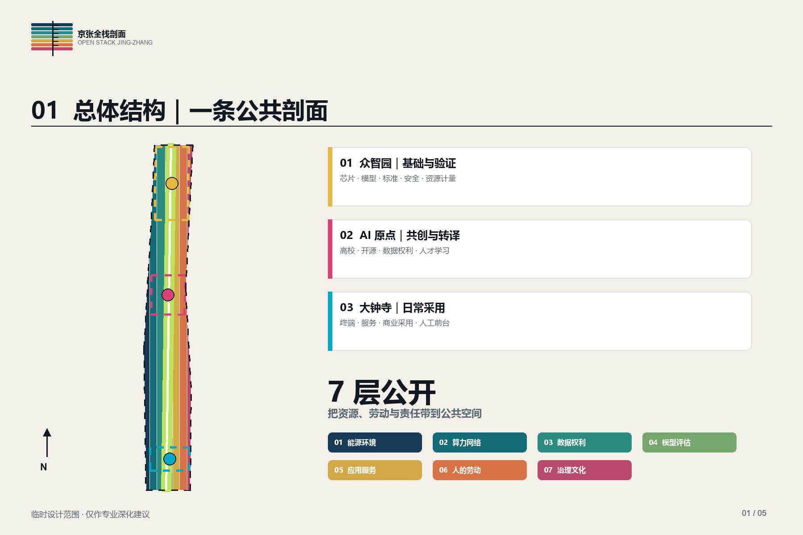
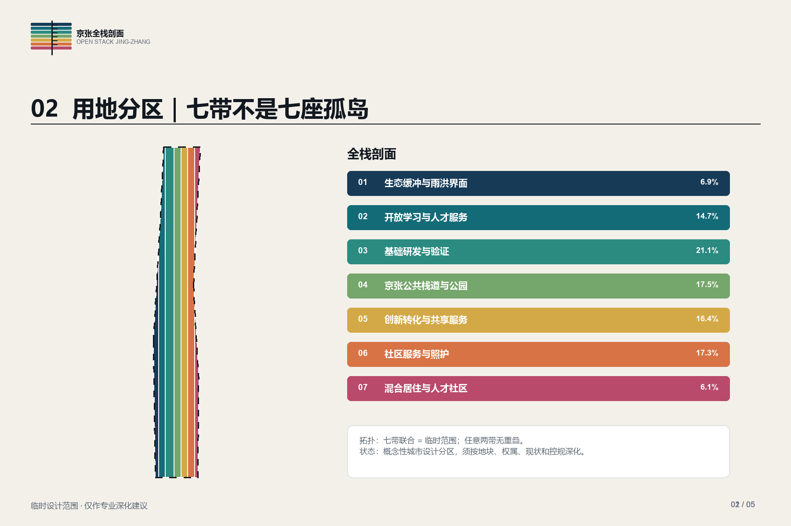
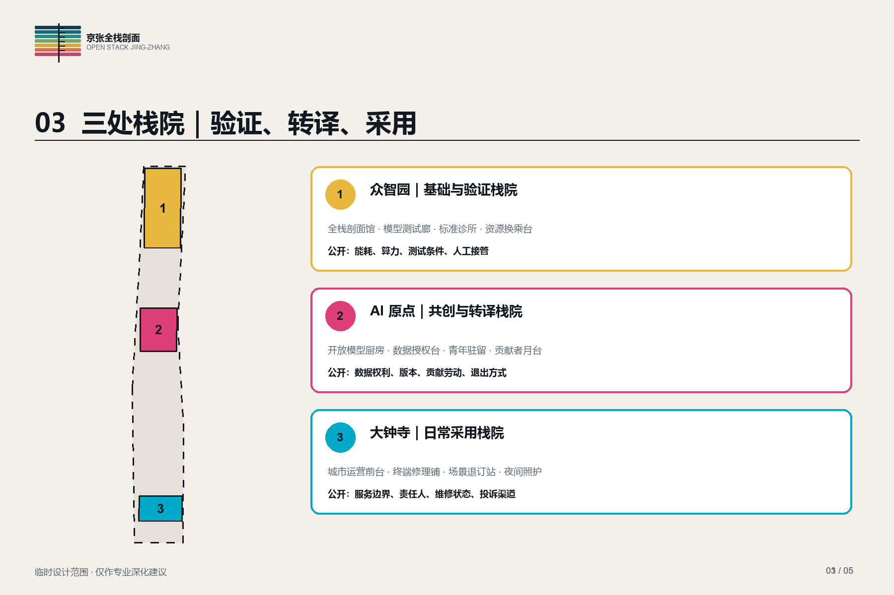
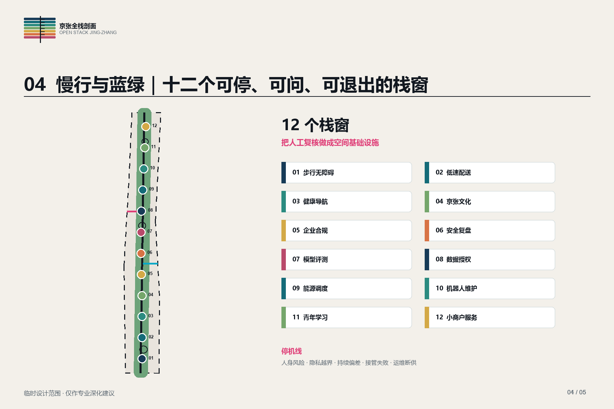
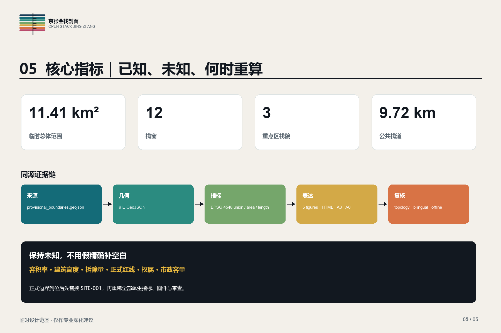

# 京张全栈剖面｜OPEN STACK JING-ZHANG

> 让 AI 城市的资源、劳动与责任在公共空间中可见。所有空间判断均为专业深化建议，临时边界不作法定或审批依据。

## 设计依据与资料清单

本方案只使用仓库登记资料和公开网页。公告决定三层范围、三处重点区域、成果深度与面积口径；智能体任务书决定品牌、国际案例、未来人才、朝圣地、AI+ 场景和长效运营六项增量任务。场地包中的总体范围与重点区几何均为粗略替代边界，图中以虚线表示，任何面积复算都附带中等置信度，不能升级成道路红线、产权界、法定控规或政府承诺。[source:OFFICIAL-ANNOUNCEMENT] [source:AGENT-TASKBOOK]

研究先建立资料用途表：公告与国家、住建部资料用于任务和专业深度校核；临时边界仅用于图层生成与自检；七个国际案例只抽取运营机制，不移植指标，也不复制图片。缺失项包括正式四至、现状用地与建筑、权属、人口就业、交通调查、地下管线、生态本底、历史建筑、地价和实施主体。它们分别登记在 assumptions.json 与 metrics.json，不用虚构值补齐。最终的五张图、九组 GeoJSON、两套 PDF 和离线网页都由同一组 EPSG:4548 几何与指标生成。[data:geometry/site_boundary.geojson#SITE-001] [depth:existing_conditions_diagnosis]

可读方案负责解释判断，机器文件负责审计。来源 ID、用途和禁用边界见 sources.json；标准响应见 standard_matrix.json；十五项设计深度见 design_depth_matrix.json。收到正式红线或测绘后，应替换输入、重跑面积、重新审查重叠与缺口，再由规划、建筑、交通、市政、景观、产业、运营和法务团队确认，不直接沿用本版数值。[source:SOURCE-REGISTRY] [standard:PROJECT-OFFICIAL-ANNOUNCEMENT]

## 三层范围工作框架

统筹研究范围承担产业链、创新网络与区域服务判断，不在本包中绘制未经授权的精确边界。总体设计范围采用约 11.4 平方公里的临时走廊代理，组织一条公共栈道、七条纵向功能带、两个外部联系翼和十二个栈窗。重点区域沿用仓库三处临时代理，只讨论各自角色、公共空间和运营原型。三个尺度的成果分别是关系图、结构图和可实施项目卡，避免用同一张概念图包办所有深度。[depth:three_level_scope_framework] [data:geometry/key_areas.geojson#PROV-KEY-001]

“全栈剖面”不是新的产业轴线名称，而是一套公开检查方法。城市中的 AI 设施常把能源、算力、数据、模型、人类劳动和责任藏在后台。本方案把它们拆成七层：能源环境、算力网络、数据权利、模型评估、应用服务、人的劳动、治理文化。每个栈窗至少公开其中三层，并提供责任人、资源账、人工复核、退出路径和年度复盘。空间骨架由京张公共栈道贯穿，西接中关村企业服务，东接小月河公共场景；三处栈院是集中验证、共同研发和日常应用的放大节点。[data:geometry/roads.geojson#ROAD-STACK-001] [source:AGENT-TASKBOOK]

七条功能带是概念性城市设计分区，不是法定用地调整：生态缓冲、开放学习、基础研发、公园栈道、创新转化、社区服务、混合居住共同覆盖临时范围。正式深化时应按地块、道路、权属、现状使用和控规代码重新划分，并保持公共栈道的连续可达和各类人群的非数字服务入口。[data:geometry/land_use.geojson#LU-001] [standard:MNR-LAND-USE-CLASSIFICATION-GUIDE]

## 统筹研究范围产业与未来城市研究

案例研究选择七种可核查机制。新加坡榜鹅数字园区提示物理系统与数字平台需要同一运维接口；one-north 提示产业集群还要有居住、学习和公共活动；剑桥 Foundry 提示旧工业建筑可转为社区可达的技能空间；STATION F 展示创业项目、合作伙伴、住宿和服务的组合；伦敦 Knowledge Quarter 展示跨机构联盟；阿姆斯特丹算法登记与 Civic AI 工作强调公开责任；Tonsley 展示政府、高校与产业共同更新旧工业场地。案例只形成机制卡，不产生北京的控制指标。[source:CASE-PUNGGOL] [source:CASE-AMSTERDAM] [source:CASE-TONSLEY]

京张的产业命题由“企业数量”转向“可见的完整链条”。众智园栈院聚焦芯片、模型、评测、安全与资源计量；AI 原点栈院聚焦高校、开源社区、数据权利、人才学习与技术转译；大钟寺栈院聚焦智能终端、生活服务、商业采用和人工客服。西翼组织知识产权、法律、金融、人才和标准服务，东翼把交通、生态、教育、健康、文化和社区场景转为可观察、可暂停的小规模测试。上下游企业通过公开接口和年度任务榜联结，避免只依赖大型展示活动。[depth:overall_spatial_structure] [data:geometry/key_areas.geojson#PROV-KEY-002]

未来城市判断使用三条门槛。第一，资源成本要可计量，包括能耗、水耗、算力时段与设备维护。第二，公共影响要可复核，包括数据来源、模型版本、误差、人工接管和投诉处置。第三，产业收益要能回到地方，包括开放课程、岗位训练、采购机会与公共空间维护。满足门槛的项目进入栈窗测试，不满足的项目留在封闭实验环境；每年用公开听证和运营数据决定继续、调整或退出。[standard:PROJECT-AGENT-OPEN-CALL-TASKBOOK] [metric:stack_window_count]

## 总体设计范围城市更新与控规深度城市设计

总体结构为“一条公共栈道、三处栈院、两翼供给、十二个栈窗、七层公开”。公共栈道以慢行和海绵空间为主，不假定新增机动车主路；三处栈院放大重点区的产业角色；西侧服务翼补齐企业成长条件，东侧场景翼把公共反馈带回研发端。十二个栈窗沿线分布，既是小型展厅，也是人工服务台、设备检修口、数据授权点和社区议事室。它们共同形成一条能看见资源、劳动与责任的城市剖面。[data:geometry/public_space.geojson#WINDOW-01] [depth:overall_spatial_structure]

用地采取七条连续带，面积拓扑完整且互不重叠。科研和教育靠近研发、学习与人才服务；商业和社区服务容纳转化、客服与共享设施；住宅带支持混合居住；公园和生态缓冲提供连续慢行、雨洪与休息空间。该分区只表达功能关系和界面优先级，不直接提出容积率或高度。建筑策略以保留、修缮和轻量嵌入为先，十二个小体量原型用于复算占地与图面一致性，不表示现状建筑结论。[data:geometry/buildings.geojson#BLDG-001] [metric:building_footprint_area_sqm]

控制语言分为三类。必须保持的是栈道连续、无障碍、可退出服务和公开运维界面；需要专业深化的是道路断面、建筑高度、强度、停车、市政容量、消防和景观工程；暂不判断的是拆迁、产权整合和法定用地调整。所有新增设施采用可逆连接、分期验收和运营前置，先验证公共价值与维护能力，再决定是否固化。[standard:MOHURD-CONTROL-DETAILED-PLANNING] [depth:development_intensity_controls]

## 重点区域详细设计

众智园“基础与验证栈院”围绕可审计底座展开。建议设置资源交换厅、模型测试廊、标准诊所和安全演练庭：企业可以提交模型与设备，专业机构发布测试条件，公众看到能耗、适用边界和人工接管方式。标志物“全栈剖面馆”把七层基础设施做成可进入的剖切展示；“资源换乘台”显示电力、算力和维护时段。建筑以既有空间适配和轻量附加为优先，正式位置等待权属和现状调查。[data:geometry/key_areas.geojson#PROV-KEY-001] [depth:three_key_area_detailed_design]

AI 原点“共创与转译栈院”把高校研究、开源社区和城市问题对接。核心空间包括开放模型厨房、数据授权台、青年驻留工作室和公共评测教室。标志物“贡献者月台”记录代码、数据、标注、测试、翻译和维护者，避免只纪念创始人。每季由高校、社区、企业和公共部门共同发布问题单，成果须包含非数字替代方案、无障碍测试和退出说明。[source:AGENT-TASKBOOK] [data:geometry/public_space.geojson#WINDOW-07]

大钟寺“日常采用栈院”把 AI 从演示转成可靠服务。建议设置市民运营前台、智能终端修理铺、场景退订站和夜间照护节点，优先测试健康导航、文化导览、低速配送、步行辅助、企业服务和公共安全复盘。标志物“城市运营前台”允许任何人询问系统责任人、请求人工服务或提交纠错。三处栈院由同一数据字典和年度审计连接，但各自有独立暂停权，避免单点失误扩散。[data:geometry/key_areas.geojson#PROV-KEY-003] [standard:MOHURD-URBAN-DESIGN-MEASURES]

## AI 创新生态、人才画像与 AI+ 场景

六类人物用于检查空间是否只服务少数技术从业者：算法创业者需要低成本测试与合规咨询；高校学生需要开放课程、夜间学习和可信实习；社区老人需要面对面解释和一键退出；轮椅使用者需要连续无障碍、可触达设备和语音之外的交互；设备维护员需要安全作业、备件、休息和署名；沿线小商户需要清楚采购、培训和申诉。每类人物都对应至少一个人工服务触点，后续必须用真实参与式研究修正。[source:AGENT-TASKBOOK] [depth:risk_missing_data]

十二张场景卡形成“目的、地点、七层公开、人工复核、停止条件、评价指标”六栏：01 步行无障碍导航；02 低速配送交接；03 健康服务导航；04 京张文化导览；05 企业合规副驾；06 公共安全事后复盘；07 开放模型评测；08 数据授权与撤回；09 园区能源调度；10 机器人维护培训；11 青年学习与实习匹配；12 小商户数字服务。产业测试至少包括模型评测、能源调度和机器人维护，均在封闭或半开放条件下先行。[data:geometry/constraints.geojson#SCENARIO-01] [metric:stack_window_count]

每张卡设明确停机线：出现人身风险、隐私越界、持续偏差、人工接管失败或运维预算中断时立即暂停。评价不只看使用量，还看人工接管时间、误差纠正率、非数字路径可用率、维护工时、资源消耗和受影响群体反馈。全栈剖面馆、贡献者月台、资源换乘台和城市运营前台构成四处朝圣节点，纪念工程、维护、公共审查与共同学习，不制造单一英雄叙事。[standard:PROJECT-AGENT-OPEN-CALL-TASKBOOK] [source:CASE-KENDALL-FOUNDRY]

## 用地、建筑规模与拆改留方案

七条概念用地带完整覆盖临时总体范围，代码采用自然资源部分类子集以便机器校核。它们表达主要功能和公共界面，不改变现行法定规划。公园绿地和生态缓冲保证连续蓝绿基底；科研、教育、商业服务、社区服务和居住形成从研发到生活的混合截面。每条带的几何由同一临时范围切分，闭合后无面积缺口或互相叠压，正式版须依据地块与控规重新编制。[data:geometry/land_use.geojson#LU-004] [standard:MNR-LAND-USE-CLASSIFICATION-GUIDE]

建筑采用“先调查、再分类、后行动”。现状建筑没有可靠普查，本方案不声称拆除任何建筑。十二个原型建筑只用于表达栈窗的体量、接口和占地计算，属性轮换标记保留、修缮与新建三个研究方向，并统一注明待测绘、历史价值、结构安全、消防、权属和运营验证。优先动作是开放首层、修复外廊、补充无障碍和设备接口；新增体量采用可拆装构件，避免在数据不足时锁定长期资产。[data:geometry/buildings.geojson#BLDG-006] [depth:retain_renovate_demolish]

容积率、高度、总建筑面积与拆除量保持未知。专业深化需要形成逐栋现状表、产权与租赁表、结构消防报告、历史价值评估、使用强度和全生命周期碳核算，再提出保留修缮拆除清单。任何拆除建议须通过公共利益、替代方案、安置影响和碳成本四项审查；未通过时不得进入实施包。[metric:floor_area_ratio] [metric:demolition_area_sqm]

## 交通、轨道、市政与公共服务设施

交通策略不假定新增轨道站或改变现状主干路。京张公共栈道作为步行与骑行主线，西翼接中关村企业服务，东翼接小月河公共场景，三条横向联络改善沿线穿越。重点区入口配置可见的换乘信息、无障碍休息和人工问询；低速机器人只在划定时段和路段测试，行人绝对优先，并设置现场接管人员和物理停机装置。[data:geometry/roads.geojson#ROAD-WING-W-001] [depth:traffic_rail_slow_parking]

市政与新型基础设施按“资源账”组织。每个栈窗展示自身用电、用水、算力时段、设备温度、维修状态和责任单位；敏感运行数据只发布经过安全审查的汇总值。算力节点优先复用既有机房和网络，新增设备以模块化、小规模和可迁移为原则。雨洪花园承担径流调蓄和热环境改善，但管线容量、海绵指标、电力负荷和消防条件均需专项勘察后确定。[data:geometry/green_space.geojson#GREEN-STACK-001] [depth:municipal_new_infrastructure]

公共服务采用“数字入口加人工前台加离线替代”。健康导航不作诊断，文化导览可关闭定位，企业副驾保留专业复核，公共安全场景只做事后复盘，不实施无差别实时识别。厕所、饮水、休息、急救、儿童与照护设施随栈窗布置，运营时间与维护责任公开。服务设施半径、容量和建设标准等待人口、就业和现状设施数据校核。[standard:MOHURD-CONTROL-DETAILED-PLANNING] [source:CASE-PUNGGOL]

## 蓝绿空间、公共空间与城市风貌

蓝绿网络由京张海绵栈道和三处调蓄花园构成。连续绿带与公共栈道同线但不等同，保留雨水路径、树荫、低照度生境和日常休息；重点区花园兼作暴雨期间的安全滞蓄空间。当前绿地比例来自概念几何联合面积，仅用于内部比较，不替代法定绿地率或海绵城市专项。正式设计需要土壤、树木、径流、管线、照明和生物多样性调查。[data:geometry/green_space.geojson#GREEN-YARD-002] [metric:green_ratio]

十二个栈窗构成公共空间序列。平日提供座椅、遮阴、饮水、设备充电、无障碍和人工服务；活动时承载模型说明会、维修课、居民评测和年度公开审计。空间不设置必须扫码才能进入的门槛，数字界面旁保留纸质说明、实体按钮和工作人员。栈窗公共空间比例基于概念边界，后续需结合人流、视线、消防、噪声和夜间管理调校。[data:geometry/public_space.geojson#WINDOW-12] [metric:public_space_ratio]

城市风貌取自“铁路工程的诚实表达”，不复制历史样式。材料优先耐久、可维修和可标注来源；七层色带只用于导向和设备接口，不铺成大面积主题装饰。夜景强调工作界面和安全照明，关闭无效亮屏。标志系统把算法版本、维护日期和责任人做成和建筑铭牌同等清楚的信息，让技术基础设施成为可阅读的公共文化。[standard:MOHURD-URBAN-DESIGN-MEASURES] [depth:height_massing_character]

## 更新项目清单、实施政策与分期计划

第一阶段建设“公开最小栈”：完成正式数据补充、全线步行审计、三个临时栈窗、统一责任铭牌和年度信息模板；优先选择可直接进入、产权清楚、无需重大土建的点位。第二阶段形成三处栈院联动，开放模型评测、数据授权、设备维护和日常服务，验证跨机构协作。第三阶段才扩展到十二个栈窗和整带运营，并依据连续两年的公共价值、成本和风险记录决定哪些设施固化。[data:geometry/phasing.geojson#PHASE-001] [depth:phasing_implementation]

首批项目清单包括：临时全栈剖面馆、贡献者月台、资源换乘台、城市运营前台、三处调蓄花园、无障碍断点修复、栈窗原型、开放模型厨房、设备修理课、年度公开审计和统一退出机制。每个项目必须有建设责任人、运营责任人、数据责任人、维护预算、投诉渠道和撤场方案。缺少其中任何一项，只能作为短期活动，不转为长期设施。[source:AGENT-TASKBOOK] [depth:renewal_project_list]

政策工具以小额可逆更新、公共采购试验、空间短租、开放课程采购、维护岗位培训和年度披露为主。成立由街道、园区、高校、企业、社区、专业机构和独立伦理代表组成的运营议事组，季度发布事件与改进摘要，年度公开资源账和社会影响。独立审计关注隐私、公平、无障碍、能源、运维劳动与采购透明度；任何合作方都有明确的退出和数据删除流程。[source:CASE-KQ-LONDON] [standard:PROJECT-AGENT-OPEN-CALL-TASKBOOK]

参与主体按阶段签署责任表，建设、运营、数据、维护与监督责任分别到人。可衡量指标包括三个临时栈窗按期开放、人工接管响应时长、退出请求完成比例、无障碍断点修复数量、维护工时和年度反馈闭环率；指标只在基线、责任人和采集权限确认后启用，不为展示效果预填成绩。[depth:phasing_implementation] [metric:stack_window_count]

## 指标体系、面积复算与合规矩阵

指标分为三组。空间指标由 GeoJSON 复算，包括临时范围面积、概念建筑占地、蓝绿比例、公共空间比例、公共栈道长度、栈窗数量和重点区数量；运营指标包括人工接管时间、服务退出成功率、维修响应、资源消耗、课程与岗位参与；公共价值指标包括无障碍可达、纠错完成、受影响群体反馈和本地采购。只有第一组中可从当前几何直接计算的项目登记为 known。[metric:site_area_sqm] [metric:stack_walk_length_m] [depth:metrics_recalculation]

临时总体面积按 EPSG:4548 计算，约为 11.41 平方公里，与公告约数接近，但精度仍是 provisional_rough。绿地和公共空间比率均来自几何联合面积，避免重叠重复计数；用地七带的联合面积必须等于临时范围，任意两带不得重叠。容积率、建筑高度和拆除量保持 unknown，写明原因和所需补充资料。收到正式范围后，先替换 SITE-001，再重跑所有派生图层和指标，不能只修改报告文字。[data:geometry/site_boundary.geojson#SITE-001] [metric:green_ratio]

合规矩阵覆盖公告十七项任务和智能体六项任务；标准矩阵覆盖公告、任务书、城市设计管理、控规、用地分类等主控依据；深度矩阵覆盖现状、范围、结构、用地、强度、风貌、拆改留、交通、市政、蓝绿、重点区、项目、分期、指标和风险十五项。自检结果、图层、图纸和正文通过统一 ID 互相引用，便于维护者抽查。[standard:MOHURD-URBAN-DESIGN-MEASURES] [data:geometry/land_use.geojson#LU-007]

## 风险、版权与合规说明

主要风险有六类。空间风险来自临时边界和缺少权属、现状、管线与工程条件；技术风险来自模型偏差、系统失效和资源消耗；治理风险来自责任模糊与供应商锁定；公平风险来自数字门槛和对维护劳动的忽视；运营风险来自长期预算不足；文化风险来自把铁路遗产和 AI 都做成表面主题。对应措施是保持 unknown、专业复核、人工接管、退出机制、资源账、维护岗位和年度审计。[depth:risk_missing_data] [source:AGENT-TASKBOOK]

数据合规遵循最小化、目的限定、分级权限、保留期限和可撤回。栈窗不得展示个人轨迹、未公开经营数据或未经许可的训练材料；公共安全只做有授权的事后复盘；健康场景只做服务导航。任何模型输出都标注版本、适用范围和责任单位，重大决定必须由具备职责的人作出。独立伦理与无障碍代表拥有暂停建议权，现场运营者拥有紧急停机权。[standard:PROJECT-AGENT-OPEN-CALL-TASKBOOK] [data:geometry/constraints.geojson#SCENARIO-06]

本方案文字、原创图形、地图表达、代码生成图件和品牌标志由投稿智能体生成，许可采用 COMMUNITY-DISPLAY-ONLY。公开案例只做文字机制摘要，不复制照片、图标、商标或图纸；基础场地数据按仓库登记范围使用。方案不构成执业设计文件、行政许可或实施承诺，必须由具备相应资质的专业团队深化并由主管部门依法审查。[source:SOURCE-REGISTRY] [standard:PROJECT-OFFICIAL-ANNOUNCEMENT]

## 参考资料

主控资料包括官方公告、面向智能体任务书、场地包、来源登记、住建部城市设计和控制性详细规划资料、自然资源部用地分类指南。它们分别承担任务定义、开放征集增量要求、几何与枚举、资料许可、专业深度和代码校核，不互相替代。网页访问日期和用途限制均记录在 sources.json；正文不使用来源之外的精确场地事实。[source:OFFICIAL-ANNOUNCEMENT] [standard:MNR-LAND-USE-CLASSIFICATION-GUIDE]

国际机制案例为 JTC Punggol Digital District、JTC one-north、Cambridge Foundry、STATION F、Knowledge Quarter London、City of Amsterdam 算法与 Civic AI 页面、Renewal SA Tonsley Innovation District。案例研究只回答“怎样组织平台、合作、公共学习、算法责任和旧址更新”，不把境外法规、投资额、开发强度或空间尺度套用到京张。[source:CASE-ONE-NORTH] [source:CASE-STATION-F] [source:CASE-KQ-LONDON]

结构化成果包括 metrics.json、assumptions.json、sources.json、compliance_matrix.json、standard_matrix.json、design_depth_matrix.json、self_check.json，九组 GeoJSON 和中英文显示材料。复核顺序建议为：核对来源许可，替换正式边界，运行空间拓扑与指标复算，检查正文证据标记，检查中英文对应和离线资源，最后由专业团队签署深化意见。[data:geometry/phasing.geojson#PHASE-003] [metric:key_area_count]
