# JING-ZHANG CITY COMPLETENESS

> **Complete the city before adding AI to everyday life.**
>
> AI may increase urban capability, but it cannot substitute for housing, schools, care, public transport, green space, work space or common life that remains accessible without an account.

This is a conceptual urban-design submission for the open call. The current `SITE_BOUNDARY` and three `KEY_AREA` features use repository-maintained provisional rough geometry only for generation, topology checks, relative relationships, visualisation and package-level recalculation. They are not statutory redlines, parcels, ownership boundaries, road redlines, regulatory plans or engineering implementation conclusions. [source:BOUNDARY-SOURCE] [source:ALLOWED-DESIGN-SPACE]

<!-- V016-CORE-START -->
## v0.16.s Core Judgment | CLEAN EXIT CITY

**AI must not only switch off; the city must be able to remove it cleanly.** v0.15.s established that the ordinary city is the host and AI is only a sidecar. v0.16.s turns reversibility into a spatial lifecycle: **BASE CITY → ATTACH → OPERATE → CLEAN EXIT**. [metric:sidecar_lifecycle_stage_count] [metric:clean_exit_host_count]

Every AI attachment must answer two questions at entry: where does it attach, and what ordinary-city use returns after removal? `ROAD-009 / 010 / 011` remain the same ordinary civic routes across all four lifecycle stages. Only the lateral layer on nine existing hosts changes. [metric:clean_exit_restore_use_coverage_ratio] [metric:ai_off_route_preservation_ratio]

| Key area | BASE CITY | ATTACH / OPERATE | Restored after CLEAN EXIT | Invariant public promise |
| --- | --- | --- | --- | --- |
| Zhongzhiyuan | R&D ground floors, food/rest, green spine and public exchange | `TEST POCKET` stays at side yards/service edges for bounded tests and temporary interfaces | removal restores ordinary courtyards, work/rest and public exchange without relocating `ROAD-009` | **TEST WITHOUT BLOCKING** |
| AI Origin | homes, human help, shared learning, public ground floors and civic commons | `CARE PORCH` adds only opt-in navigation, matching and care prompts | removal leaves staffed service, public ground floors and community life intact without relocating `ROAD-010` | **CARE WITHOUT ACCOUNT** |
| Dazhongsi | fixed wayfinding, staffed help, ordinary waiting/retail and the Jing-Zhang public interface | `ARRIVAL SIDECAR` adds only dynamic translation, information and crowd assistance | removal leaves fixed wayfinding and human service intact without relocating `ROAD-011` | **ARRIVE WITHOUT APP** |

All nine sidecar hosts receive `ordinary_restore_use`, `clean_exit_mode` and `field_check_required`; the three routes receive `clean_exit_route_preserved=true`. These are relationship and lifecycle semantics only. They do not change building, public-space or road geometry and they create no eighth AI land-use class. [metric:new_ai_land_use_code_count]

**CLEAN EXIT is more than AI OFF.** Switching off proves software stops. Clean exit additionally requires temporary equipment, interfaces, signs and operating dependencies to be removable so the host returns to ordinary city use with human service, fixed wayfinding, everyday routes and public access intact. Real de-installation methods, fire safety, utilities, ownership and asset disposal remain project-stage questions rather than fabricated engineering parameters.

Dazhongsi remains **REAL LEVEL DATA REQUIRED**. Until real station entrances, levels, bridges/tunnels, passenger capacity, ownership and operating roles are verified, clean exit is not drawn as a fake engineering alignment. [data:geometry/key_areas.geojson#PROV-KEY-003]

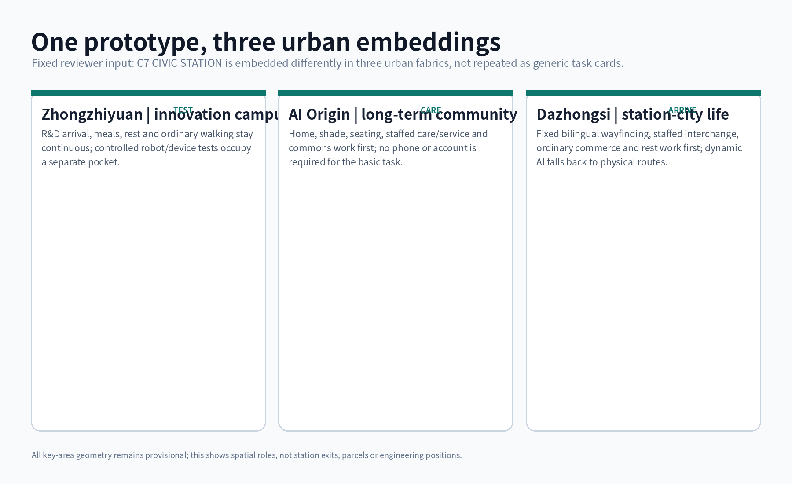
<!-- V016-CORE-END -->

## Design Basis and Source List

The proposal is based on the official prequalification announcement, `brief/site-package/`, the agent taskbook, the repository source registry and the processed fact pack. The announcement gives an approximately 43.6 km² coordinated research area, an approximately 11.4 km² overall design area and three key areas totalling approximately 368.4 ha. These figures define task scale; package-level calculations from provisional polygons are not promoted into official redlines or approval areas. [source:OFFICIAL-ANNOUNCEMENT] [source:SITE-PACKAGE] [standard:PROJECT-OFFICIAL-ANNOUNCEMENT]

The source registry distinguishes formal, background and provisional uses. The processed fact pack is a navigation layer rather than a replacement for original evidence. The repository formal guide governs the bilingual contract, core figures, PDFs, HTML, matrices and participant preflight workflow. [source:SOURCE-REGISTRY] [source:PROCESSED-FACT-PACK] [source:FORMAL-GUIDE]

Land-use codes are limited to registered residential, community-service, research, culture, education, commercial-service and green-space categories. Building types use the registered residential, talent-apartment, community-service, research, office, mixed-use, education, cultural and mobility-hub enums. Approved FAR, height, density, statutory green-space controls, setbacks, road redlines, ownership, utilities, fire-safety and heritage controls remain incomplete, so `conceptual_floors`, footprints and area quantities remain capacity and adjacency tests. [source:LAND-USE-CODES] [source:BUILDING-TYPES] [source:PLANNING-LIMITS]

Cleared building-by-building conditions, household data, school/childcare/care capacity, ownership and transport sections are also missing. City Completeness therefore begins as a survey-and-design framework, not a fabricated current-condition score. Its first deliverable is a disciplined separation among known evidence, design proposals and pending data, with a recalculation path when official information arrives. [depth:existing_conditions_diagnosis]

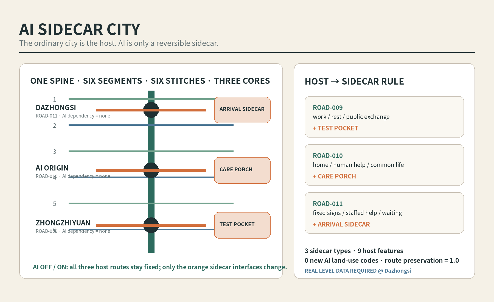

## Three-Level Scope Framework

The three levels answer different questions rather than enlarging the same masterplan. The coordinated research area studies mechanisms linking AI industry, universities, talent, ordinary public life and the two wings. The overall design area builds a continuous spatial structure through land use, walking, green space and public space. The three key areas carry detailed design tasks that can be reviewed independently. Results cross-check each other, but provisional geometry never becomes statutory control simply by appearing at a smaller scale. [source:DESIGN-BRIEF] [depth:three_level_scope_framework]

| Scope | Core question | Proposal output |
| --- | --- | --- |
| ~43.6 km² coordinated research area | How can AI innovation support research, work and long-term city life together? | C7 framework, global mechanisms and three-areas/two-wings coordination [metric:coordinated_research_area_sqm] |
| ~11.4 km² overall design area | How do seven ordinary-city capabilities form a continuous network? | One spine, six segments, six stitches and three cores [metric:official_declared_overall_design_area_sqm] |
| ~368.4 ha in three key areas | What is missing in Zhongzhiyuan, AI Origin and Dazhongsi, and how should it be filled? | Three differentiated key-area packages [metric:key_area_announced_total_sqm] |

The submitted provisional overall polygon recalculates to roughly 11,412,825 m² in EPSG:4548; that value checks package-scale consistency only. [data:geometry/site_boundary.geojson#SITE-001] [metric:site_area_sqm] All three key areas are represented, but the provisional Dazhongsi polygon has a known absolute-location risk, so it is not used to infer real stations, ownership, parcels, roads or engineering positions. [source:KEY-AREA-SOURCE] [data:geometry/key_areas.geojson#PROV-KEY-003] [metric:key_area_count]

## Coordinated Research Area: Industry and Future City Research

A world-class AI ecosystem is not reduced to a company list or a technology-park acreage. It is organised as five interdependent urban stages: **research - translation - testing - adoption - long-term living**. Universities and institutes supply knowledge and talent; Zhongzhiyuan hosts R&D and controlled testing; AI Origin asks whether technology improves ordinary life; Dazhongsi supports market, mobility and urban adoption; and the Jing-Zhang heritage park provides a public interface, cultural continuity and social feedback. [source:AGENT-TASKBOOK] [standard:PROJECT-AGENT-OPEN-CALL-TASKBOOK]

Six international cases contribute mechanisms rather than scale. Vector Institute suggests a neutral connector among research, talent and industry adoption; Mila combines university collaboration, open science and responsible AI; the Alan Turing Institute foregrounds interdisciplinary work, knowledge exchange and public engagement; AI Singapore 100 Experiments starts from real problems and develops PoC/MVP evidence before expansion; Seoul AI Hub combines startup support, talent and shared space; Punggol Digital District demonstrates that industry, university, public space and community life can be adjacent rather than segregated. [source:CASE-VECTOR] [source:CASE-MILA] [source:CASE-TURING]

These cases do not support statutory Jing-Zhang boundaries, heights or development intensity; they support organisational and operating choices only. [source:CASE-AISG-100E] [source:CASE-SEOUL-AI-HUB] [source:CASE-PUNGGOL]

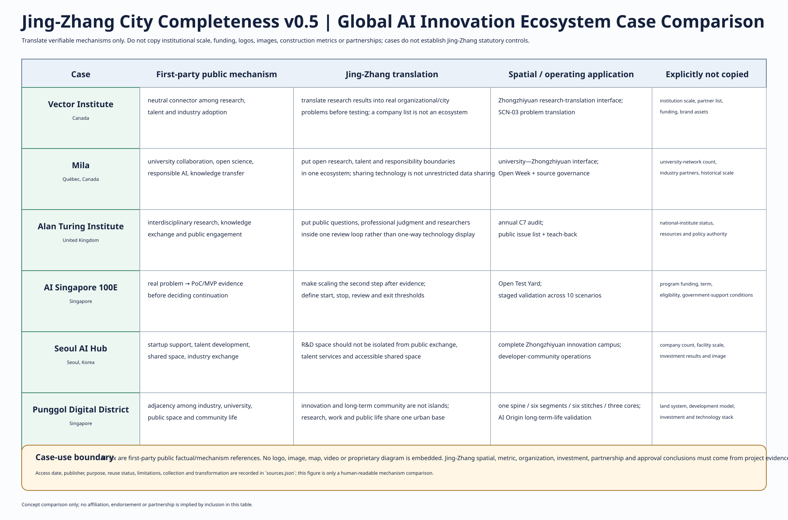

The C7 City Completeness Contract is **HOME, LEARN, CARE, MOVE, GREEN, WORK and COMMON LIFE**. Every renewal move states which capability it improves, whether it weakens another, and who maintains a non-AI baseline. **AI is not an eighth land-use category**; it is an optional enhancement layer across the seven capabilities. [metric:city_completeness_dimension_count]

### Three Positionings—Five Functions—Three Areas and Two Wings Coordination Loop

v0.5 upgrades the taskbook structure from a text registry into an explicit design loop. The three positionings—**Centennial Jing-Zhang Cultural Belt, Urban AI Life Experience Belt, and AI Integrated Innovation Belt**—flow through five functions—**full-stack AI innovation, a world-class AI ecosystem, AI+ scenario empowerment, a vibrant AI-enabled city, and a global AI-governance voice**—and become five urban interfaces: **AI Origin Community, Zhongzhiyuan AI Innovation Acceleration Area, Dazhongsi AI Industry Cluster, Zhongguancun Technology Service Wing, and Xiaoyuehe Scenario Empowerment Wing**. Every interface returns to C7 acceptance rather than allowing industry or technology objectives to bypass ordinary-city capability. [source:AGENT-TASKBOOK]

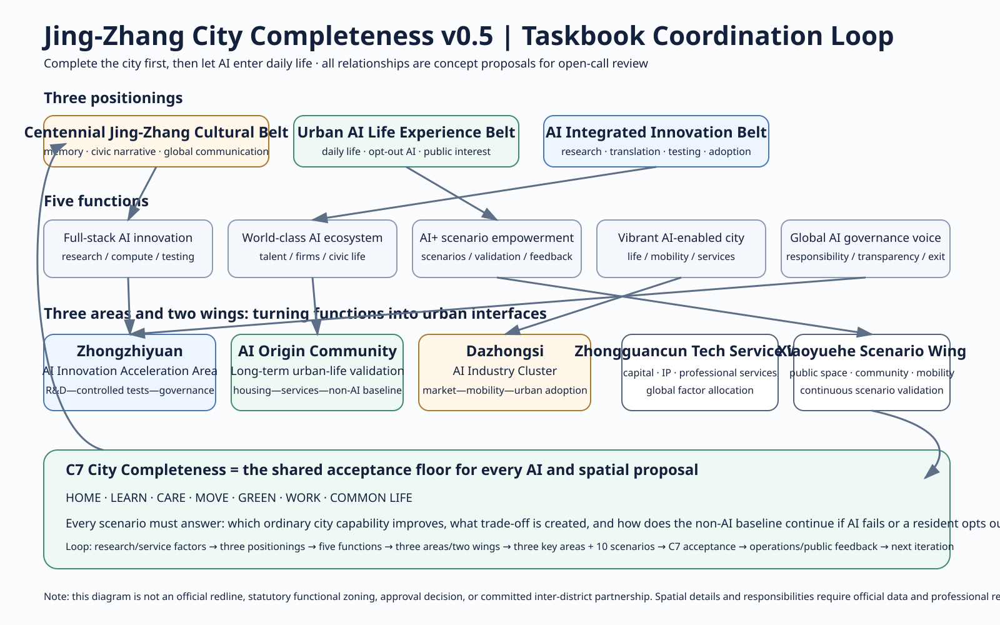

The eight factor classes are no longer a flat resource list. They form one conversion chain: **land, space, industry, capital, talent, compute, data and scenarios → research → translation → testing → adoption → long-term life → C7 feedback**. Capital, compute, institutional cooperation and data arrangements remain conceptual interfaces pending confirmation by real responsible parties; potential interfaces are not described as established commitments. [source:AGENT-TASKBOOK]

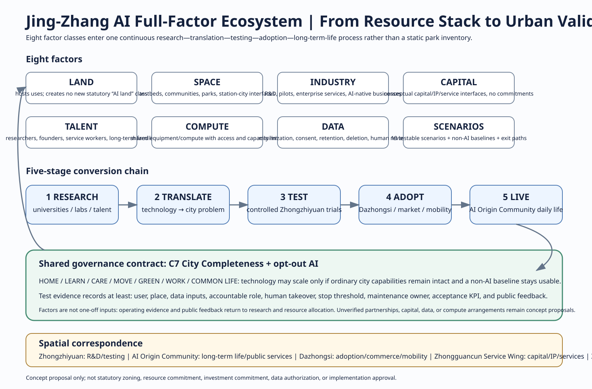

Regional collaboration uses the same discipline: potential role, exchanged factor, interface, data boundary and validation method. Beiyuwei Community provides a daily-life scenario comparison; Future Science City provides a research-translation method comparison; Huairou Science City provides a research-ecosystem method reference; Beijing E-Town provides an industrialisation and market-validation comparison; and Beijing–Tianjin–Hebei provides a cross-regional scale for talent, industry and governance research. None means that the counterpart has consented, funded, shared data or made an administrative commitment.

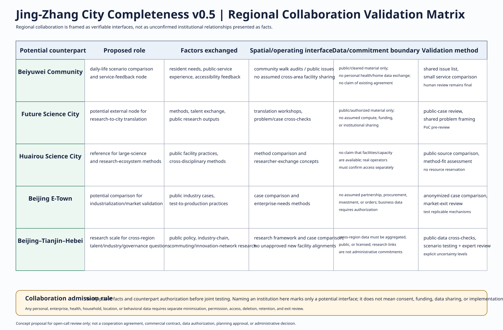

The brand layer does not create an “official event logo”. It proposes an identity for this submission itself: **C7 COMPLETE LOOP**. The open ring means the city is continually being completed; the two rail lines recall the Jing-Zhang linear memory; seven nodes correspond to C7. Chinese and English have equal rank, every C7 icon is paired with text, and the system avoids government emblems, official seals, unauthorised institutional logos or visual claims that the proposal has already been implemented.

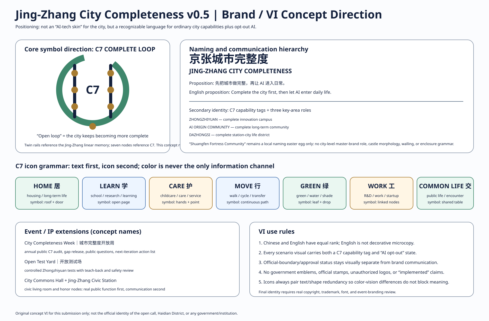

## Overall Design Area: Urban Renewal and Regulatory-Plan-Level Urban Design

The spatial structure is **one spine, six segments, six stitches and three cores**. The Jing-Zhang public green spine is the shared north-south base and first provides walking, cycling, accessibility, cultural memory, shade, stormwater performance and free places to stay; digital interpretation and sensing are secondary overlays. Six completeness segments run from a southern culture/arrival zone through daily services, long-term living, AI Origin, academy collaboration and northern R&D. Six east-west stitching links express priority connections among communities, the park, universities/innovation areas and transit/city districts. [depth:overall_spatial_structure] [standard:MOHURD-URBAN-DESIGN-MEASURES]

The three cores are not three AI showrooms. Zhongzhiyuan is a complete innovation campus, AI Origin is a complete long-term community, and Dazhongsi is a complete station-city everyday district. Thirteen conceptual land-use features describe functional infill. C7 remains a review method and does not invent a statutory “AI land-use” category. [data:geometry/land_use.geojson#LU-001] [metric:land_use_feature_count] [depth:land_use_layout]

The public green spine and slow-mobility line form the north-south backbone. Six east-west lines are connection intentions, not confirmed new roads, bridges, tunnels or station exits. The six working segments are conceptual design bands rather than administrative communities. [data:geometry/roads.geojson#ROAD-001] [metric:city_completeness_segment_count] [metric:east_west_stitch_count]

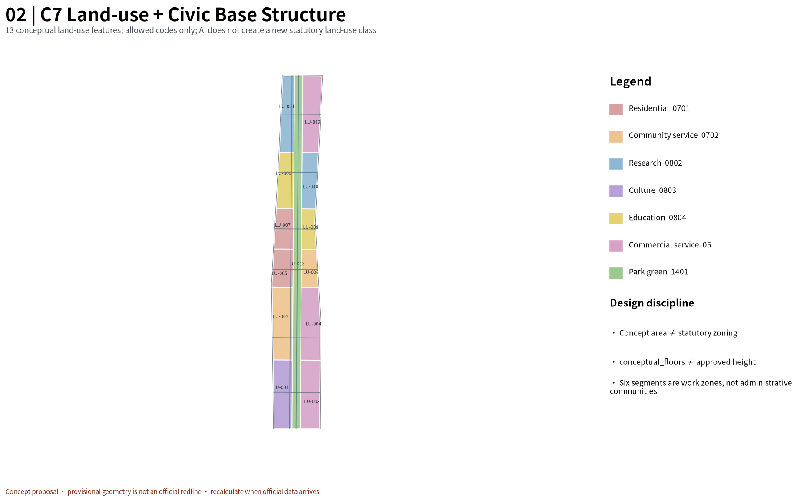

## Detailed Design of Key Areas

**Zhongzhiyuan: complete innovation campus + TEST POCKET.** Research, pilot work, incubation and enterprise services remain central, but ordinary work, food/rest, the public green spine and open exchange must first form one legible daily chain. `ROAD-009` is the AI-independent host route. `BLDG-012`, `BLDG-013` and `PUBLIC-006` are sidecar hosts for stoppable tests, temporary equipment and replaceable service interfaces only. Real test boundaries, clearances, speeds, emergency-stop design, permits and safety performance require field survey and professional review; this proposal does not pre-set engineering values. [data:geometry/roads.geojson#ROAD-009] [data:geometry/buildings.geojson#BLDG-012] [data:geometry/public_space.geojson#PUBLIC-006]

**AI Origin Community: complete long-term neighborhood + CARE PORCH.** Homes, shared learning, human help, ordinary retail, green space and civic commons form an account-free everyday chain. `ROAD-010` remains the ordinary-city host route. Public-ground-floor and commons interfaces in `BLDG-007`, `BLDG-009` and `PUBLIC-004` host opt-in navigation, service matching and care prompts. Real accessibility dimensions, service catchments, staffing and response times require field and operating evidence; the proposal fixes only the rule that refusing login or data consent still reaches people and services on the same physical route. [data:geometry/roads.geojson#ROAD-010] [data:geometry/buildings.geojson#BLDG-007] [data:geometry/public_space.geojson#PUBLIC-004]

**Dazhongsi: complete station-city arrival + ARRIVAL SIDECAR.** Ordinary arrival, fixed wayfinding, staffed help, waiting/retail and the Jing-Zhang public interface form the host. Dynamic translation, information and crowd assistance remain lateral enhancements to `ROAD-011`. `BLDG-001`, `BLDG-002` and `PUBLIC-001` are conceptual host relationships only. Because `PROV-KEY-003` has a known absolute-location risk, real station entrances, levels, bridges/tunnels, vertical circulation, corridor widths, passenger capacity, ownership and operations remain **REAL LEVEL DATA REQUIRED** rather than being fabricated from concept geometry. [data:geometry/roads.geojson#ROAD-011] [data:geometry/public_space.geojson#PUBLIC-001] [data:geometry/key_areas.geojson#PROV-KEY-003]; additional evidence: [depth:three_key_area_detailed_design]

Public exchange space accompanies all three tasks: an open exchange yard in Zhongzhiyuan, the AI Origin civic commons and a southern public interface. Each solves an everyday use first and takes on communication or landmark value second. [data:geometry/public_space.geojson#PUBLIC-004] [metric:public_space_count]

The v0.7 fixed key-area figure is no longer a task card alone. It draws the three distinct ground-floor/public-space sections side by side: a research campus with a physically bounded test pocket; a long-term neighborhood with home—care—rest—commons continuity; and a station-city arrival chain with fixed bilingual signs, staffed help, accessible interchange, ordinary retail and heritage public realm.

## AI Innovation Ecosystem, Personas, and AI+ Scenarios

v0.6 expands the former five grouped personas into nine explicit design-test groups: long-term residents/families; older residents; disabled, mobility-limited or sensory-limited users; children/caregivers; students/researchers; founders/company employees; service workers/commuters; visitors/international users; and people with no smartphone, no account or a deliberate opt-out from digital services. These are used to test benefit, burden, exclusion risk and human fallback, not to claim demographic statistics. [metric:persona_count]

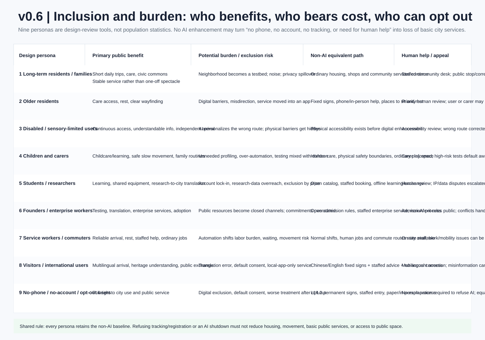

Ten AI+ scenarios answer the same questions: who uses it, where, what real problem exists, what AI does, what the non-AI baseline is, who is accountable, how a human takes over on failure, and how success is evaluated. They are: controlled low-speed robotics in Zhongzhiyuan; shared research equipment and compute; university-result-to-city-problem translation; an accessibility assistant in Shuangfen Fortress; voluntary home-robot tests; community shared-space scheduling; multilingual Jing-Zhang heritage interpretation; complex-transfer and walking assistance; time-limited AI-native retail pilots; and a C7 completeness audit assistant. [metric:ai_scenario_count] [metric:non_ai_baseline_coverage_ratio]

v0.5 expands those ten items from a one-line list into complete scenario cards. Every card states place/users, the real problem, the AI enhancement, the non-AI baseline and exit, and the evidence direction that decides whether the pilot can scale. Scenario KPIs are concept-stage validation directions, not measured performance or government commitments.

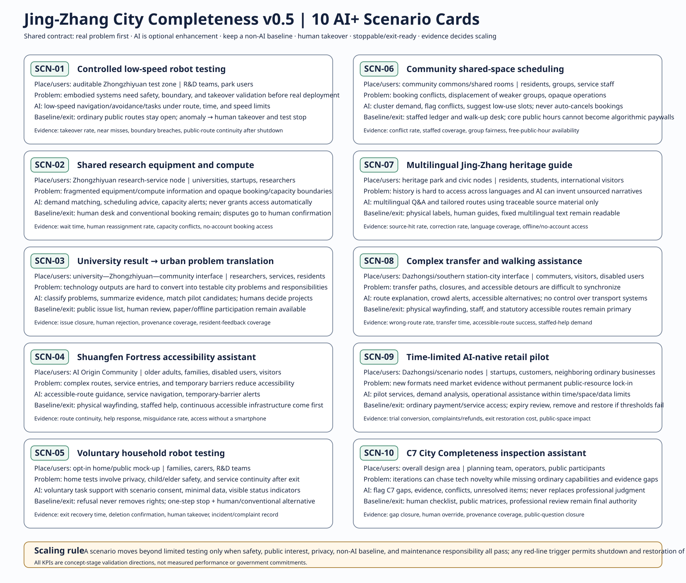

SCN-01, SCN-05 and SCN-09 provide technology, living-environment and market validation respectively, following “small scope, stoppable, reviewable, then consider expansion”. [metric:industry_test_scenario_count] Three public honour/pilgrimage nodes—Open Test Yard, City Commons Hall and Jing-Zhang Civic Station—must have real public functions before image-making value. [metric:pilgrimage_landmark_count]

v0.6 then selects three **flagship pilot protocols** from the ten scenarios so a reviewer can see how a pilot starts, stops and leaves an evidence receipt: controlled low-speed robotics in Zhongzhiyuan, accessibility/care navigation in AI Origin, and transfer/multilingual guidance in Dazhongsi. Each specifies a non-AI baseline, concept quantity basis, prerequisite evidence gates, a test window, KPI direction, stop threshold, exit receipt and accountability structure. Real permits, contracts, insurance, currency budgets and field performance remain UNKNOWN until verified. [metric:flagship_pilot_count]

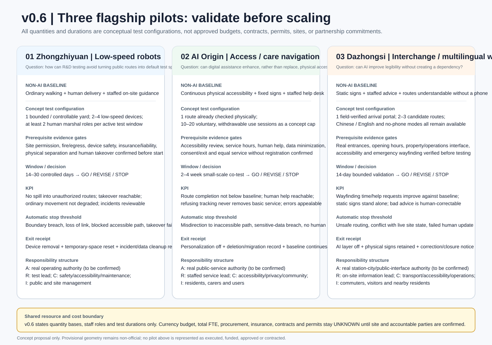

All scenarios share a governance floor: basic circulation and services work without an app; non-participation does not remove community rights; high-risk decisions escalate to humans; and basic urban functions survive when a model, device, account or platform is withdrawn. This is both technological robustness and public-space equity.

### v0.7 Three Everyday Journeys: Turn Protocols Back into Space

v0.7 no longer treats a reviewer index as the first visual. The three key areas are reorganized around everyday journeys: a researcher and service worker in Zhongzhiyuan move from arrival to R&D, food/rest and a bounded test yard; an older resident, carer and no-phone user in AI Origin move from home to rest, care and civic commons; a commuter, international visitor and service worker in Dazhongsi move from arrival and interchange through ordinary retail to the Jing-Zhang heritage public interface. Each journey requires a complete physical city first; AI is only a switchable enhancement layer.

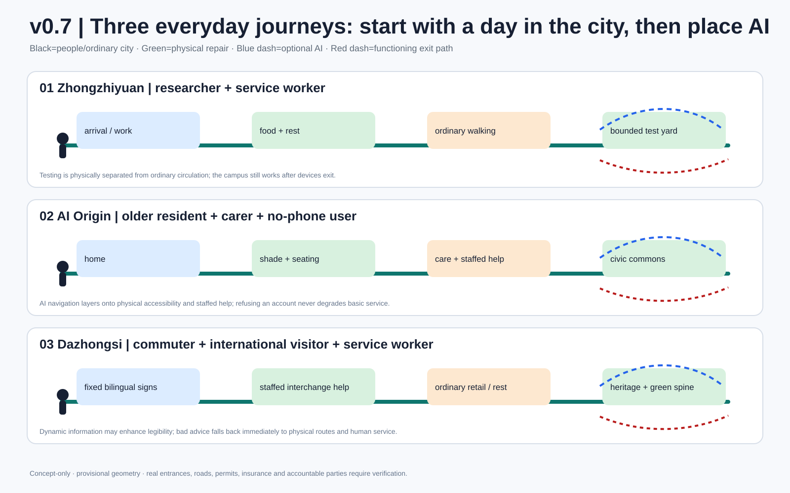

### How AI Changes Urban Form, Not Just Screens

AI still changes urban form through six reversible prototypes: test pockets, accessible/human help nodes, continuous station-city arrival interfaces, replaceable service nodes, people-first public ground floors, and a reversible spatial version chain. v0.15.s regroups the first five into three legible interfaces—TEST POCKET, CARE PORCH and ARRIVAL SIDECAR—and writes their host features into geometry; the sixth becomes their shared physical version-management method. AI's spatial delta can therefore be located, switched off, removed and reviewed without redrawing the ordinary-city host. [metric:ai_sidecar_type_count] [metric:ai_sidecar_host_feature_count]

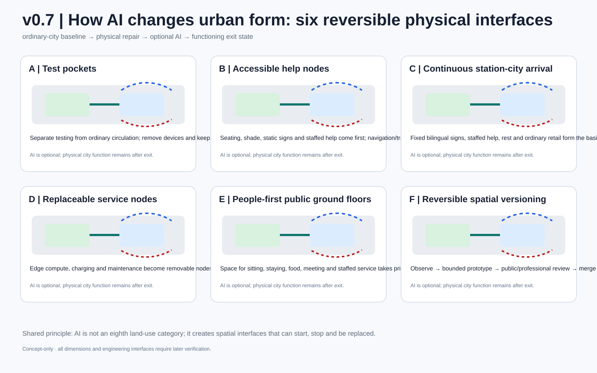

<!-- V09-REALITY-START -->
### v0.10 | DESIGN-FIRST + REALITY: evidence appears only when it changes space

v0.10 keeps the **design-first** hierarchy of the 86-point v0.7 baseline and absorbs only reality anchors that change a spatial decision; the story still starts with everyday public tasks, not evidence indexing or scoring structure. It applies a narrower rule: a public source enters the main design narrative only when it changes a section, interface, node, or the precision of an unknown. This round registers three official-public reality anchors and five explicit design-response rules. [metric:official_constraint_anchor_count] [metric:design_response_rule_count]

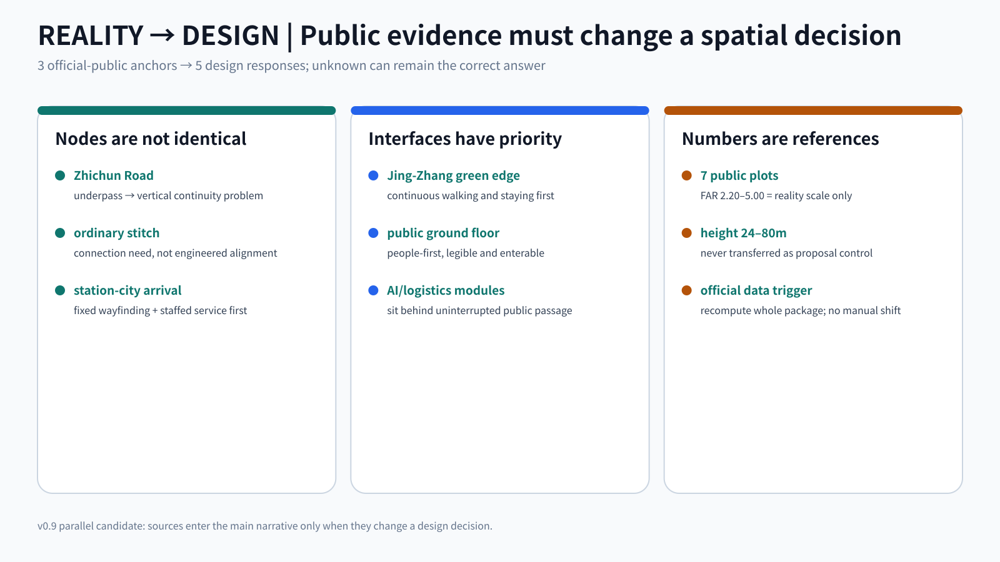

**Zhichun Road:** the official public response to the draft control plan records this railway-related segment as underpassing the railway and unsuitable for an at-grade junction. [source:HD00-1601-DRAFT-RESPONSE-V09] The proposal therefore stops drawing every east-west stitch as the same surface crossing. Zhichun Road becomes a **vertical-continuity problem to be resolved**, with pedestrian continuity, level changes, accessibility and engineering conditions left for professional verification. No bridge/tunnel alignment or feasibility is claimed.

**Jing-Zhang green edge:** the official planning-response material for Lanjinglijia calls for integration with the Jing-Zhang railway green corridor and improved spatial quality. [source:HD-LANJINGLIJIA-INTEGRATED-RESPONSE-V09] The design response is people-first: continuous walking, staying and public frontage precede AI equipment, logistics and replaceable service modules. The case is not transferred as a parcel control.

**Reality scale references:** three published planning-condition documents cover seven plots, with reference FAR values of 2.20–5.00 and reference height controls of 24–80 m; some also publish density and green-ratio conditions. [source:HD-PLOT-CONDITIONS-REFERENCE-V09] These values answer only “what has appeared in approved plot conditions nearby”; they do not answer “what this proposal should receive”. Proposal `approved_*` metrics remain unknown. [metric:reference_plot_condition_count]

All five response rules are machine-readable in `visual/assets/reality-constraint-register.json`. The fixed `mobility-bluegreen.en.png` is rebuilt to distinguish ordinary stitching, the underpass/vertical-continuity condition, people-first green-corridor frontage, station-city arrival, and the future official-data recomputation trigger.
<!-- V09-REALITY-END -->

<!-- V016-LIFECYCLE-START -->
### v0.16.s | Four-Step Spatial Lifecycle: BASE CITY → ATTACH → OPERATE → CLEAN EXIT

These four steps are not another governance state machine. They are the **spatial handover sequence** every sidecar must satisfy. `BASE CITY` proves the ordinary city works independently; `ATTACH` permits only a lateral, legible and removable layer; `OPERATE` preserves human takeover and ordinary routes; `CLEAN EXIT` returns the host to ordinary use and leaves reviewable exit evidence. [metric:sidecar_lifecycle_stage_count]

| Lifecycle | Spatial question | Zhongzhiyuan | AI Origin | Dazhongsi |
| --- | --- | --- | --- | --- |
| BASE CITY | What is here without AI? | ordinary R&D/work courtyard + public green spine | homes + staffed service + public ground floor | fixed wayfinding + staffed help + waiting/retail |
| ATTACH | Where can AI enter without occupying the main route? | test side yard / service edge | public ground floor / care porch | arrival side band / information interface |
| OPERATE | What may AI never take over? | `ROAD-009` and ordinary work/rest chain | `ROAD-010`, human help and account-free entry | `ROAD-011`, fixed wayfinding and staffed help |
| CLEAN EXIT | What ordinary city returns after removal? | remove equipment/interfaces; restore courtyard/public exchange | remove digital interface; retain staffed service and public ground floor | remove dynamic layer; retain fixed wayfinding, help and ordinary waiting |

Each host's `ordinary_restore_use` is a qualitative spatial use, not a claim that field conditions are already built or verified. Real attachment and exit require before/after field checks. Reversibility therefore becomes a designed return state rather than a future promise. [metric:clean_exit_restore_use_coverage_ratio]
<!-- V016-LIFECYCLE-END -->

## Land Use, Building Scale, and Retain-Renovate-Demolish Strategy

Land use follows the permitted official classification subset rather than inventing AI land-use codes. Current conceptual quantities include residential, community service, research, culture, education, commercial service and park green space. They support adjacency and completeness discussion; they are neither existing-condition certification nor approved regulatory zoning. [standard:MNR-LAND-USE-CLASSIFICATION-GUIDE]

| Conceptual land-use quantity | Package audit reference |
| --- | --- |
| Residential | [metric:land_use_residential_sqm] |
| Community service | [metric:land_use_community_service_sqm] |
| Research | [metric:land_use_research_sqm] |
| Cultural | [metric:land_use_cultural_sqm] |
| Education | [metric:land_use_education_sqm] |
| Commercial service | [metric:land_use_commercial_service_sqm] |
| Park green | [metric:land_use_park_green_sqm] |

Thirteen conceptual building prototypes test adjacency among home, learning, care, work and common life. [metric:conceptual_building_count] Footprint area, total floor-capacity and conceptual FAR are internal design-model outputs rather than approved development quantities. [metric:building_footprint_area_sqm] [metric:conceptual_total_floor_area_sqm] [metric:conceptual_floor_area_ratio]

Approved FAR and height remain unknown; `conceptual_floors` is not approved building height. This completes the response by separating known controls, design suggestions and pending confirmations. [standard:MOHURD-CONTROL-DETAILED-PLANNING] [depth:development_intensity_controls] [depth:height_massing_character]

Building-by-building existing conditions, ownership, structural, fire-safety and heritage information are missing, so no specific building receives a final retain, renovate or demolish decision. `infill/reuse` in the prototypes represents reversible study actions only. [standard:MOHURD-ARCH-DESIGN-DEPTH-2016] [depth:retain_renovate_demolish]

## Transport, Rail, Municipal Infrastructure, and Public Services

The roads layer expresses permitted greenway, cycling, walking and rail-transfer concepts only. It neither modifies expressways/primary roads nor calls conceptual centre lines road redlines. The package can recalculate conceptual slow-mobility/connection centre-line length, while road area remains unknown because official road redlines and verified widths are absent. [metric:road_centerline_length_m] [depth:traffic_rail_slow_parking]

Public-service priorities are real access points: childcare/education, care, staffed service, community civic halls, ordinary retail and accessible routes. New infrastructure such as edge compute, charging, robot maintenance and sensing remains subordinate to formal fire, energy, network and municipal requirements; “AI infrastructure” cannot bypass utilities or engineering approval. [depth:municipal_new_infrastructure]

This iteration does not assume station exits, parking supply, bridge/tunnel alignments or engineering feasibility. Every east-west stitch says “this relationship needs solving”, not “this engineering line is approved”; transport surveys, professional design and official constraints must replace conceptual lines later.

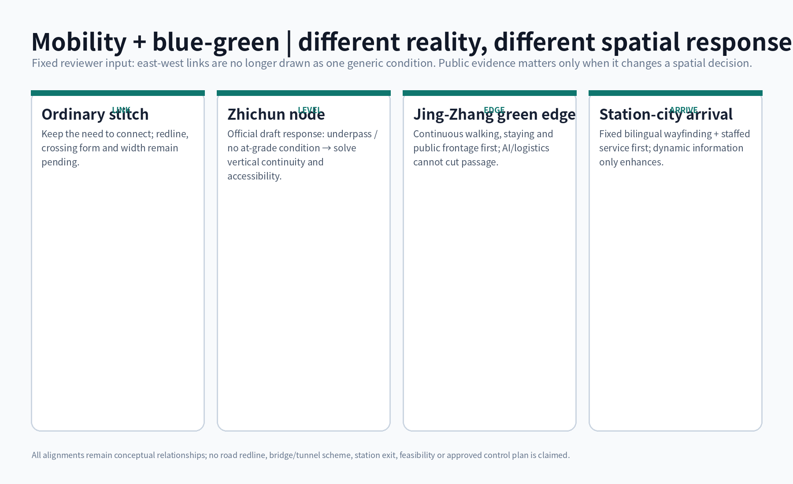

## Blue-Green Network, Public Space, and Urban Character

The Jing-Zhang public green spine is first an ordinary public-life infrastructure: people can walk, cycle, stop, find shade, orient themselves and encounter railway memory. AI interpretation, sensing or smart scheduling is optional. The design layer divides the spine into south, middle and north segments and adds neighbourhood pocket green space in AI Origin. [data:geometry/green_space.geojson#GREEN-001] [metric:green_space_area_sqm] [metric:green_ratio]

Six civic commons follow `public_first_non_app_entry`: a person without an account, smartphone or willingness to be profiled can still enter and receive basic service. Package public-space area and ratio support conceptual comparison and are not statutory public-space controls. [metric:public_space_area_sqm] [metric:public_space_ratio] [depth:blue_green_public_space]

v0.5 adds seven reusable public-space components: C7 orientation post, shaded stay island, robot handoff bay, staffed service desk, community shared table, accessibility continuity node and Jing-Zhang memory rail. Wayfinding has three layers: L1 permanent physical information keeps movement and help usable without power, network or a phone; L2 operations information communicates opening, closures, events and test status; L3 optional AI adds multilingual Q&A, personalised routing or booking assistance. Turning off L3 must automatically fall back to L1/L2 without loss of basic service.

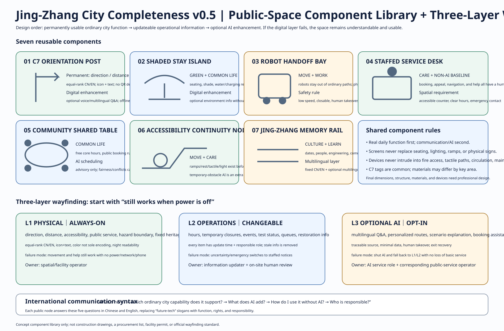

Urban character does not pursue an “AI architecture look”. Research, residential, education and commercial buildings may have distinct characters, but all should have legible public ground floors, clear pedestrian entries, maintainable equipment, restrained heritage interfaces and night environments that do not depend on giant screens. Technological quality comes from service and spatial organisation rather than chip patterns on façades.

## Renewal Projects, Implementation Policy, and Phasing

Implementation does not follow “build a landmark first, repair ordinary life later”. The near term completes the C7 baseline survey, public-green-spine/walking audit, community-service gap inventory and low-impact shared-space pilots. The mid term deepens R&D-public-service-controlled-test interfaces in Zhongzhiyuan and closes daily-service and transverse-connectivity gaps in AI Origin. The long term deepens southern station-city, cultural and market coordination only on reliable station, ownership, transport and heritage information. [depth:renewal_project_list]

`geometry/phasing.geojson` expresses near-, mid- and long-term conceptual study ranges, not a government construction timetable. Every stage has a “data arrives - recheck - then expand” prerequisite. If official polygons or key constraints change, phasing, land use, metrics, figures and PDFs are recalculated together. [data:geometry/phasing.geojson#PHASE-001] [depth:phasing_implementation]

Long-term operation can include a public C7 walk-through, developer open week, controlled robotics open day, community public-service review and Jing-Zhang technology-history exhibition. Annual reporting should not only announce “what new AI was deployed”; it should also state which ordinary urban capability remains incomplete and which pilots were stopped, rolled back or redesigned.

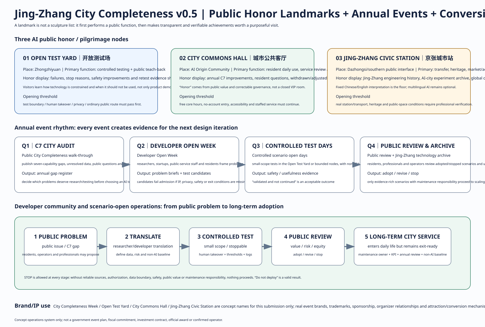

v0.5 further engineers implementation as **project—space—proposed role—prerequisite—start/stop threshold—maintenance responsibility—acceptance KPI**. The AI layer must be independently stoppable; real organizations, budgets, contracts, events and cross-institution arrangements require separate confirmation by real responsible parties.

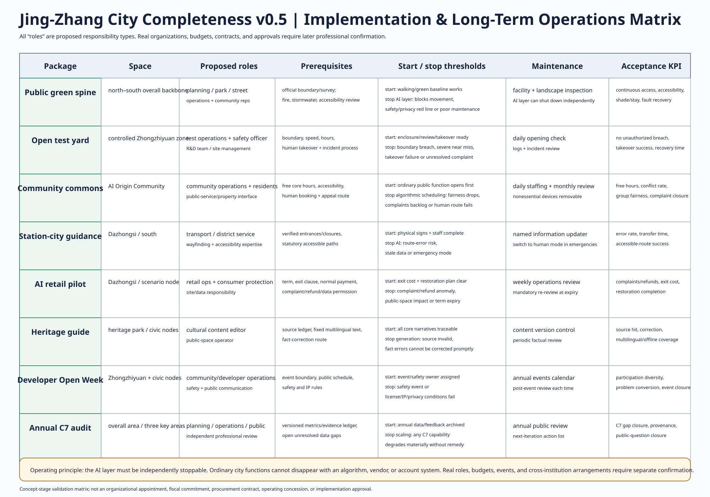

v0.6 adds **resource quantity basis + RACI + maintenance cadence + prerequisite evidence gates**. Each flagship pilot states concept equipment/interface quantity, A/R/C/I responsibility types, daily/weekly/monthly maintenance rhythms, and pre-start checks for permits, safety, insurance, staffed fallback and data governance; all use a shared `PRECONDITION → TEST → RECEIPT → GO/REVISE/STOP` chain. S/M are concept resource bands, not currency budgets; final FTE, procurement, insurance, contracts and named institutions remain pending real-world confirmation.

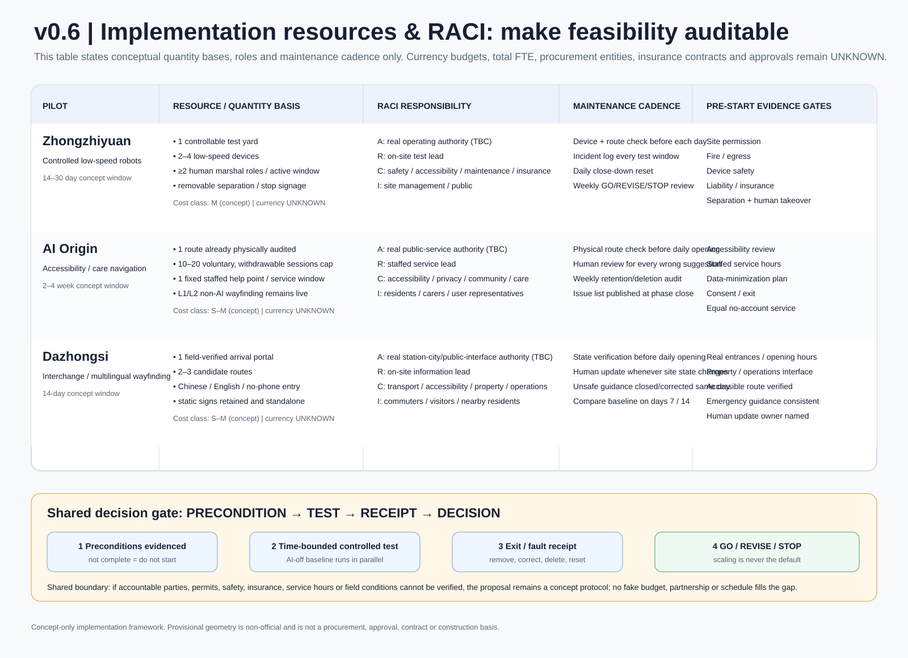

## Metrics, Area Recalculation, and Compliance Matrix

Metrics are separated into announced approximate values, conceptual design quantities recalculated from submitted geometry, and statutory/engineering quantities that remain unknown because formal data are missing. Every known metric records formula, source file, confidence and assumptions. Every provisional derived value is recalculated when official polygons become available. [depth:metrics_recalculation]

| Known metric | Audit reference |
| --- | --- |
| Coordinated research area | [metric:coordinated_research_area_sqm] |
| Announced overall design area | [metric:official_declared_overall_design_area_sqm] |
| Submitted provisional site area | [metric:site_area_sqm] |
| Announced key-area total | [metric:key_area_announced_total_sqm] |
| Key-area count | [metric:key_area_count] |
| C7 dimensions | [metric:city_completeness_dimension_count] |
| Completeness segments | [metric:city_completeness_segment_count] |
| Land-use feature count | [metric:land_use_feature_count] |
| Residential conceptual area | [metric:land_use_residential_sqm] |
| Community-service conceptual area | [metric:land_use_community_service_sqm] |
| Research conceptual area | [metric:land_use_research_sqm] |
| Cultural conceptual area | [metric:land_use_cultural_sqm] |
| Education conceptual area | [metric:land_use_education_sqm] |
| Commercial-service conceptual area | [metric:land_use_commercial_service_sqm] |
| Park-green conceptual area | [metric:land_use_park_green_sqm] |
| Design green-space area | [metric:green_space_area_sqm] |
| Design green ratio | [metric:green_ratio] |
| Design public-space area | [metric:public_space_area_sqm] |
| Design public-space ratio | [metric:public_space_ratio] |
| Civic-commons count | [metric:public_space_count] |
| Conceptual building count | [metric:conceptual_building_count] |
| Conceptual building footprint | [metric:building_footprint_area_sqm] |
| Conceptual total floor capacity | [metric:conceptual_total_floor_area_sqm] |
| Conceptual capacity ratio | [metric:conceptual_floor_area_ratio] |
| Conceptual slow-mobility/connection length | [metric:road_centerline_length_m] |
| East-west stitch count | [metric:east_west_stitch_count] |
| Registered official-constraint feature count | [metric:constraints_feature_count] |
| Persona count | [metric:persona_count] |
| AI+ scenario count | [metric:ai_scenario_count] |
| Industry test-scenario count | [metric:industry_test_scenario_count] |
| v0.6 flagship pilot-protocol count | [metric:flagship_pilot_count] |
| Public honour/pilgrimage node count | [metric:pilgrimage_landmark_count] |
| Non-AI baseline coverage | [metric:non_ai_baseline_coverage_ratio] |

All nine spatial evidence layers remain traceable: site and key areas are provisional constraints; land use, buildings, roads, green space, public space and phasing are design proposals; the constraints layer is intentionally empty with its data gaps documented rather than left as forgotten scaffold. [data:geometry/land_use.geojson#LU-013] [data:geometry/buildings.geojson#BLDG-001]

The empty constraints layer is itself an auditable data gap. Official heritage, road, municipal or other constraints must add features and trigger package-wide review when they arrive. [data:geometry/constraints.geojson#metadata] [metric:constraints_feature_count]

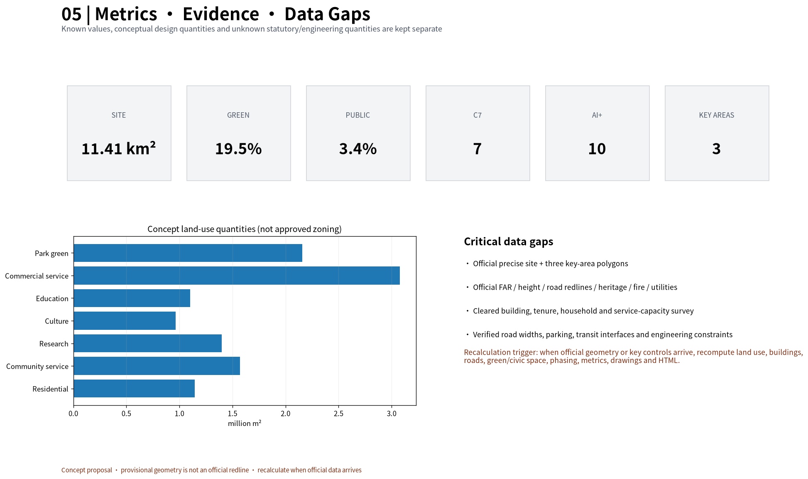

v0.7 demotes the v0.6 reviewer evidence dashboard/index to a back-of-package traceability appendix. It is no longer part of the design narrative or first-screen visual; scoring, gates and design content remain separate.

## Risk, Copyright, and Compliance

The first risk class is **spatial evidence precision**: precise official overall and key-area polygons are unavailable, and the provisional Dazhongsi rectangle has a known location risk. The second is **professional data availability**: building conditions, ownership, regulatory controls, utilities, fire safety, heritage, traffic sections and parking surveys are incomplete. The third is **technology governance**: AI scenarios can create privacy, exclusion, platform dependence, false decisions and maintenance cost, so every scenario keeps a non-AI baseline, human takeover, opt-out and review path. [depth:risk_missing_data]

v0.5 moves privacy principles down to scenario-level data flows. Location/route, health/care, home environment, account/identity, behavior/usage, and research/enterprise data each receive purpose limitation, minimization, access, retention/deletion, human-review and opt-out rules. Refusing tracking cannot become a condition for movement, housing, basic services or public-space access; authorization for one scenario does not automatically extend to another.

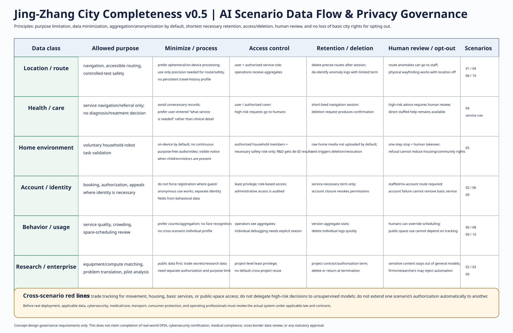

The empty `constraints.geojson` is an active disclosure and does not mean “there are no constraints”. Statutory FAR, height and road area remain unknown; schema sanity bounds or conceptual models are not used to fill them. Figures use locally generated graphics and public/cleared material without commercial map tiles, remote fonts, unlicensed imagery or third-party trademarks. [data:geometry/constraints.geojson#metadata]

AI assisted public-source research, peer scanning, structured writing, GeoJSON, figures, HTML/PDF and validation work. The participant remains responsible for the conceptual direction, the Shuangfen Fortress naming easter egg and the final public submission. `report/copyright_statement.md` now contains a v0.5/v0.6 per-asset rights and generation ledger covering core PNGs, all new SVGs, HTML, PDFs, GeoJSON, font/icon/code status and AI participation. The v0.6 flagship-pilot, inclusion/burden, RACI, reviewer-index and above-fold dashboard assets are submission-original/AI-assisted SVGs with no embedded third-party logos, images, maps or font files. The six international cases in `sources.json` retain access date, intended use, reuse status, limitations, collection and transformation notes. Any real implementation still requires statutory planning, professional design, public participation and competent-authority procedures that this package cannot replace.

## References

The prose keeps one to three references next to each substantive judgment; complete provenance, usage limitations, source type and paths remain in `sources.json`. This compact table confirms that project evidence appears in the human-readable proposal without promoting external cases into spatial controls. Project-specific evidence outranks case studies, and provisional material supports generation, visualisation and discussion only.

| Source role | Evidence |
| --- | --- |
| Project site package | [source:SITE-PACKAGE] |
| Central source registry | [source:SOURCE-REGISTRY] |
| Processed fact pack | [source:PROCESSED-FACT-PACK] |
| Agent taskbook | [source:AGENT-TASKBOOK] |
| Design brief | [source:DESIGN-BRIEF] |
| Planning-control gaps | [source:PLANNING-LIMITS] |
| Locked/editable design-space rules | [source:ALLOWED-DESIGN-SPACE] |
| Land-use codes | [source:LAND-USE-CODES] |
| Building types | [source:BUILDING-TYPES] |
| Provisional overall boundary | [source:BOUNDARY-SOURCE] |
| Provisional key-area boundaries | [source:KEY-AREA-SOURCE] |
| Official call announcement | [source:OFFICIAL-ANNOUNCEMENT] |
| Formal submission guide | [source:FORMAL-GUIDE] |
| Vector Institute | [source:CASE-VECTOR] |
| Mila | [source:CASE-MILA] |
| Alan Turing Institute | [source:CASE-TURING] |
| AI Singapore 100 Experiments | [source:CASE-AISG-100E] |
| Seoul AI Hub | [source:CASE-SEOUL-AI-HUB] |
| Punggol Digital District | [source:CASE-PUNGGOL] |

A data gap is not treated as an unanswered design-depth item. All fifteen depth responses state what can be answered now, what information is missing and how later professional confirmation changes the package. The standard matrix similarly separates response completeness from data availability. [standard:MOHURD-URBAN-DESIGN-MEASURES] [depth:metrics_recalculation]