# 京张城市完整度 / JING-ZHANG CITY COMPLETENESS

> **先把城市做完整，再让 AI 进入日常。**
>
> AI 可以增加城市能力，但不能替代住房、学校、照护、公共交通、绿地、工作空间和无需账号即可进入的公共生活。

本方案为开放征集阶段的概念性城市设计。当前 `SITE_BOUNDARY` 与三处 `KEY_AREA` 采用仓库维护的 provisional rough geometry，仅用于方案生成、拓扑自检、相对关系、图面表达与包内复算，不构成法定红线、地块、权属、道路红线、控规或工程实施结论。[source:BOUNDARY-SOURCE] [source:ALLOWED-DESIGN-SPACE]

<!-- V016-CORE-START -->
## v0.16.s 核心判断｜CLEAN EXIT CITY / 可退出的 AI 城市

**AI 不只要能关闭，还必须能被城市完整地撤走。** v0.15.s 已经证明“普通城市是主机，AI 只能侧挂”；v0.16.s 把“可逆”从一句原则升级为空间生命周期：**BASE CITY → ATTACH → OPERATE → CLEAN EXIT**。[metric:sidecar_lifecycle_stage_count] [metric:clean_exit_host_count]

AI 进入城市时必须同时回答两个问题：它附着在哪里，以及拆掉以后这里恢复成什么普通城市用途。三条 `ROAD-009 / 010 / 011` 在四个生命周期阶段都保持相同 ordinary-city route；变化只发生在九个既有 host 的侧挂层。[metric:clean_exit_restore_use_coverage_ratio] [metric:ai_off_route_preservation_ratio]

| 重点区 | BASE CITY | ATTACH / OPERATE | CLEAN EXIT 后恢复 | 不变的公共承诺 |
| --- | --- | --- | --- | --- |
| 众智园 | 研发首层、吃饭休息、绿脊与开放交流 | `TEST POCKET` 只占侧院/服务边，承担受控测试与临时接口 | 测试撤出后回到普通院落、工作休息与公共交流，不迁移 `ROAD-009` | **TEST WITHOUT BLOCKING** |
| AI 原点 | 住宅、人工帮助、共学、公共首层与社区客厅 | `CARE PORCH` 只增加自愿导航、匹配与照护提示 | 数字层撤出后人工服务、公共首层和社区生活继续成立，不迁移 `ROAD-010` | **CARE WITHOUT ACCOUNT** |
| 大钟寺 | 固定导视、人工问询、普通等候/商业与京张公共界面 | `ARRIVAL SIDECAR` 只增加动态翻译、信息与客流辅助 | 动态层撤出后固定导视和人工服务继续成立，不迁移 `ROAD-011` | **ARRIVE WITHOUT APP** |

九个 sidecar host 都新增 `ordinary_restore_use`、`clean_exit_mode` 与 `field_check_required`；三条 route 新增 `clean_exit_route_preserved=true`。这些都是关系与生命周期语义，不改变建筑、公共空间或道路几何，也不创造第八类 AI 用地。[metric:new_ai_land_use_code_count]

**CLEAN EXIT 不是“AI 关机”。** 关机只证明软件停止；clean exit 还要求临时设备、接口、标识与运营依赖能够撤出，宿主空间重新成为普通城市，并保留人工服务、固定导视、日常路径与公共使用权。真实拆除工艺、消防、市政、产权和设施处置仍须项目阶段确认，本案不虚构工程参数。

大钟寺继续坚持 **REAL LEVEL DATA REQUIRED**：真实站口、竖向高程、桥隧、客流能力、产权与运营主体未确认前，不把 CLEAN EXIT 画成虚构工程线位。[data:geometry/key_areas.geojson#PROV-KEY-003]

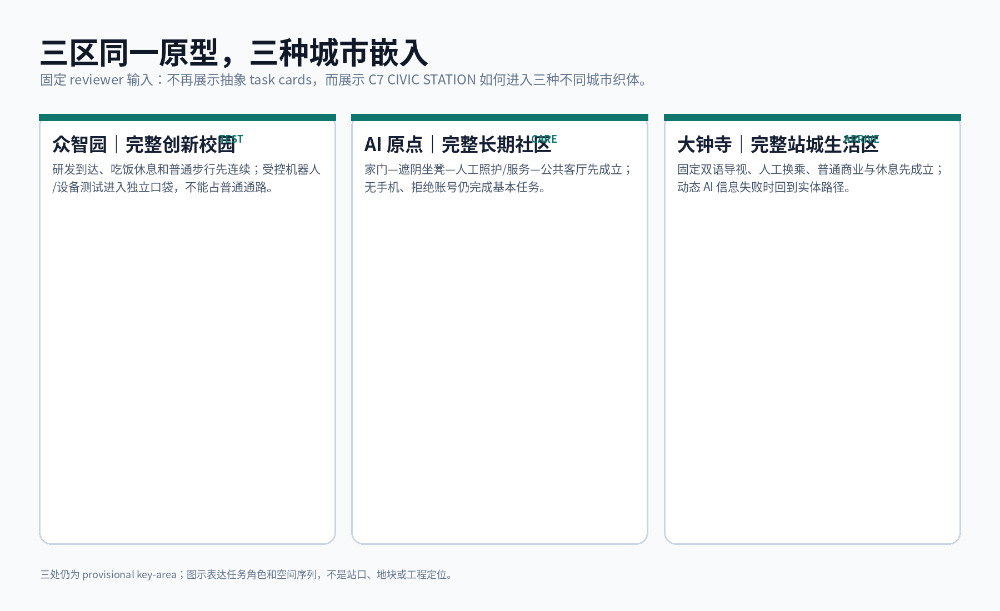
<!-- V016-CORE-END -->

## 设计依据与资料清单

项目依据包括资格预审公告、`brief/site-package/`、面向智能体任务书、仓库来源登记表与 processed fact pack。公告给出约 43.6 km² 统筹研究范围、约 11.4 km² 总体设计范围和三处重点区域合计约 368.4 ha；本案把这些约值当作任务尺度，不把 provisional polygon 的包内复算结果升级为官方红线或审批面积。[source:OFFICIAL-ANNOUNCEMENT] [source:SITE-PACKAGE] [standard:PROJECT-OFFICIAL-ANNOUNCEMENT]

仓库的 source registry 用来区分 formal、background 与 provisional 资料用途；processed fact pack 只承担导航作用，不能替代原始资料。当前 formal workflow 的双语、图件、PDF、HTML、矩阵与 preflight 要求则按仓库指南执行。[source:SOURCE-REGISTRY] [source:PROCESSED-FACT-PACK] [source:FORMAL-GUIDE]

用地代码仅采用登记的住宅、社区服务、科研、文化、教育、商业服务与绿地分类；建筑类型仅采用已登记的居住、人才公寓、社区服务、科研、办公、混合功能、教育、文化和交通接驳等枚举。正式 FAR、高度、密度、绿地法定指标、退界、道路红线、权属、市政、消防和文保控制仍不完整，因此所有 `conceptual_floors`、建筑基底和面积指标只承担概念容量与邻接测试。[source:LAND-USE-CODES] [source:BUILDING-TYPES] [source:PLANNING-LIMITS]

现状层面还缺逐栋建筑、人口家庭、学校/托育/照护容量、权属和交通断面等可清权资料，所以“城市完整度”首先是调查—设计框架，而不是伪造一个现状评分。完整度诊断的第一成果，就是把“已知、设计建议、待补数据”分开，并为 official data 到位后的重算预留入口。[depth:existing_conditions_diagnosis]

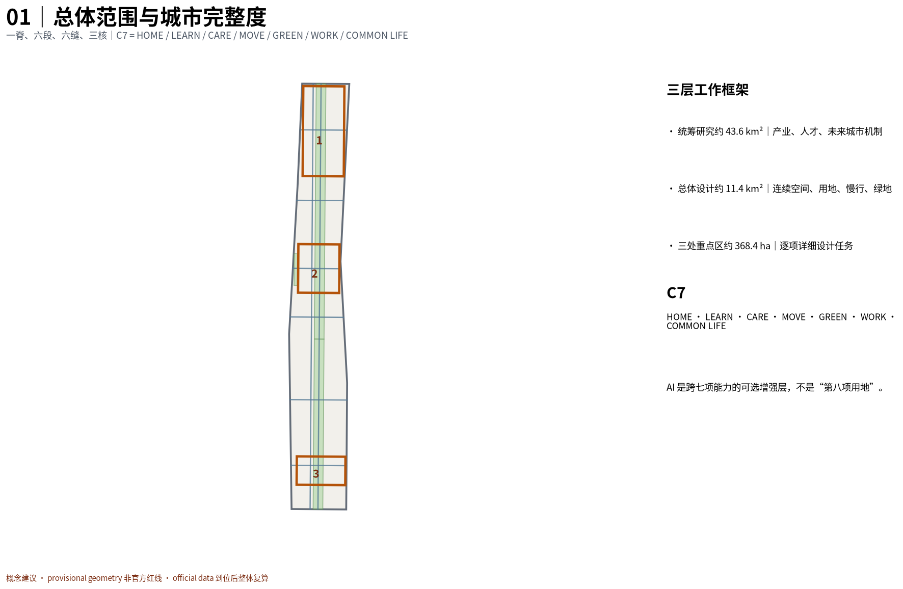

## 三层范围工作框架

三层范围分别回答不同尺度的问题，而不是把同一张总图机械放大。统筹研究范围研究 AI 产业、高校、人才、公共生活和两翼资源之间的机制；总体设计范围负责连续的空间结构、用地、慢行、绿地和公共空间；三处重点区域则承担可被逐项讨论的详细设计任务。三层结果相互校验，但任何 provisional geometry 都不得越级成为法定控制。[source:DESIGN-BRIEF] [depth:three_level_scope_framework]

| 范围 | 核心问题 | 本方案输出 |
| --- | --- | --- |
| 统筹研究范围约 43.6 km² | AI 创新生态如何同时支撑科研、工作与长期城市生活 | C7 城市能力框架、全球案例机制、三区两翼协同 [metric:coordinated_research_area_sqm] |
| 总体设计范围约 11.4 km² | 七项城市能力如何形成连续网络 | 一脊、六段、六缝、三核 [metric:official_declared_overall_design_area_sqm] |
| 三处重点区域约 368.4 ha | 众智园、AI 原点、大钟寺分别缺什么、怎样补 | 三套重点区任务 [metric:key_area_announced_total_sqm] |

当前总体临时多边形在 EPSG:4548 下包内复算约 11,412,825 m²；该值仅检查提交 geometry 的量级一致性。[data:geometry/site_boundary.geojson#SITE-001] [metric:site_area_sqm] 三处重点区均进入方案，但大钟寺的 provisional polygon 存在已知绝对位置风险，因此不据它推导真实站点、产权、地块、道路或工程位置。[source:KEY-AREA-SOURCE] [data:geometry/key_areas.geojson#PROV-KEY-003] [metric:key_area_count]

## 统筹研究范围产业与未来城市研究

本案不把“世界级 AI 生态”理解为企业名单或科技园面积，而是组织成 **研究—转译—测试—采用—长期生活** 五个互相依赖的城市环节。高校和研究机构提供知识与人才，众智园承担研发与受控测试，AI 原点社区检验技术能否进入正常生活，大钟寺承担市场、交通与城市采用，京张遗址公园提供公共界面、文化连续性与社会反馈。[source:AGENT-TASKBOOK] [standard:PROJECT-AGENT-OPEN-CALL-TASKBOOK]

六个国际案例只转译机制，不复制规模。Vector Institute 提供“研究—人才—产业采用”的中立连接器启发；Mila 强调高校协作、开放科学与负责任 AI；Alan Turing Institute 强调跨学科、知识交换和公众参与；AI Singapore 100 Experiments 以真实问题进入 PoC/MVP 再决定是否扩围；Seoul AI Hub 把创业支持、人才与共享空间并置；Punggol Digital District 展示产业、大学、公共空间和社区生活可以相邻而非隔离。[source:CASE-VECTOR] [source:CASE-MILA] [source:CASE-TURING]

这些案例不支撑京张的法定边界、高度或强度，只支撑组织与运营方法。[source:CASE-AISG-100E] [source:CASE-SEOUL-AI-HUB] [source:CASE-PUNGGOL]

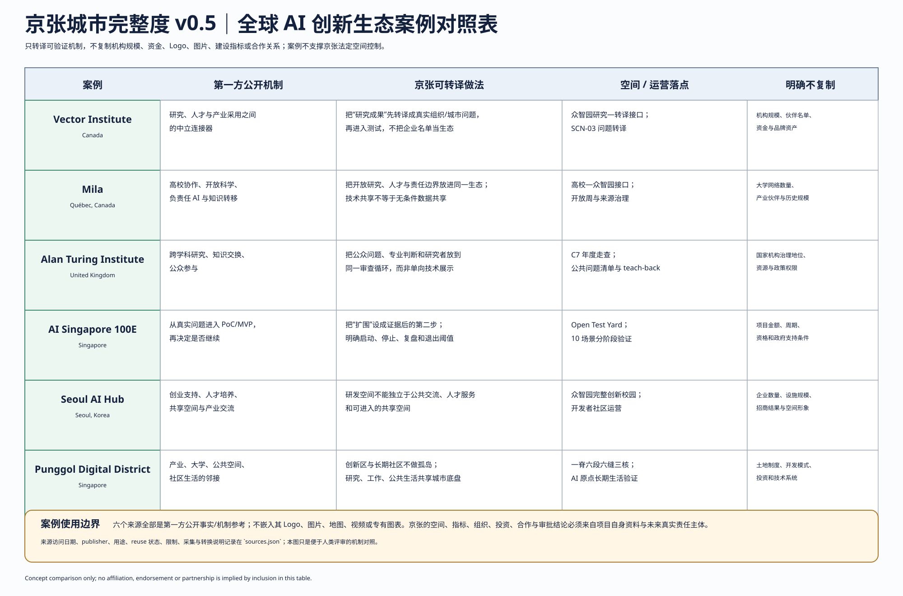

本方案的 C7 城市完整度合同包括：**居 HOME、学 LEARN、护 CARE、行 MOVE、绿 GREEN、工 WORK、交 COMMON LIFE**。每个更新动作都要说明改善哪项能力、是否挤压另一项能力、谁承担非 AI 基线。**AI 不是第八项用地**，而是跨七项能力的可选增强层。[metric:city_completeness_dimension_count]

### 三大定位—五大功能—三区两翼协同闭环

v0.5 将任务书规定的结构从文字登记升级为显性设计闭环：**百年京张文化带、都市 AI 生活体验带、AI 融合创新带**三大定位，通过 **AI 全栈自主创新体系、世界级 AI 创新生态、AI+ 场景赋能新范式、智能化 AI 活力城市、AI 治理全球话语权**五大功能，落到 **AI 原点社区、众智园 AI 自主创新加速区、大钟寺 AI 产业集聚区、中关村科技服务翼、小月河场景赋能翼**五个城市接口。所有接口最终回到 C7 验收，不让产业或技术目标绕过普通城市能力。[source:AGENT-TASKBOOK]

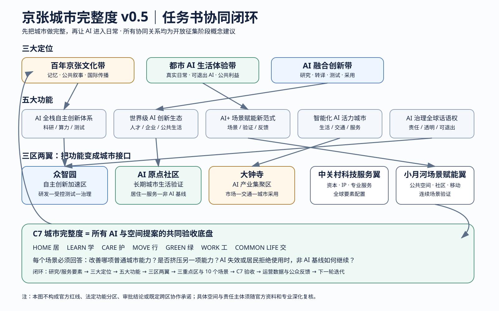

八类要素不再作为“资源清单”平铺，而是进入同一条转化链：**土地、空间、产业、资金、人才、算力、数据、场景 → 研究 → 转译 → 测试 → 采用 → 长期生活 → C7 反馈**。资金、算力、机构合作和数据安排均保持“待真实主体确认”的概念状态，不把潜在接口写成既有承诺。[source:AGENT-TASKBOOK]

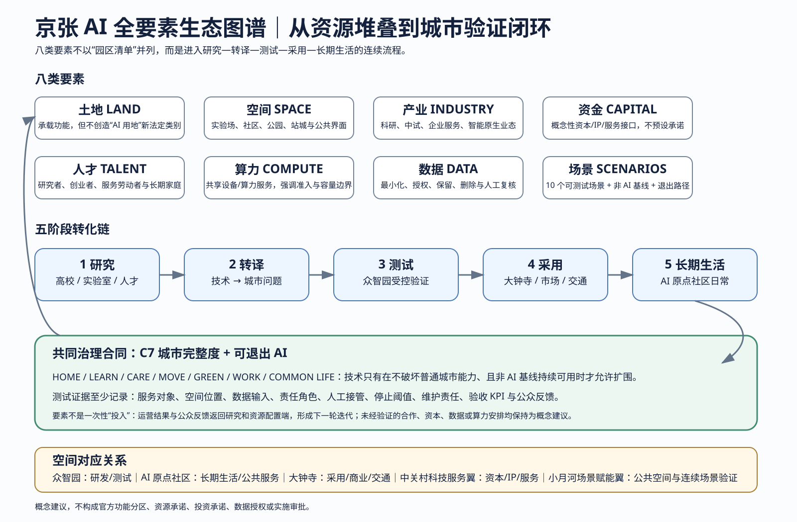

区域协同同样采用“潜在角色—交换要素—接口—数据边界—验证方式”的结构。北纬社区用于生活场景对照，未来科学城用于科研转译方法对照，怀柔科学城用于科研生态方法参考，北京经开区用于产业化与市场验证方法对照，京津冀用于跨区域人才/产业/治理研究尺度；上述均不代表对方已同意合作、已出资、已共享数据或已形成行政承诺。

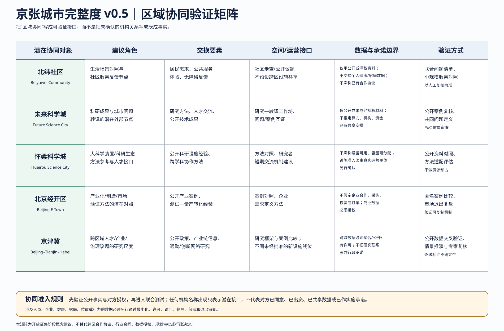

品牌层不制作“官方赛事 Logo”，而提出投稿方案自身的 **C7 COMPLETE LOOP** 识别方向：开放环表示城市持续补齐，两条轨线回应京张线性记忆，七节点对应 C7。中英文同级，C7 图标始终配文字，不使用政府徽记、官方印章、未经授权机构 Logo 或“已经落地”的视觉暗示。

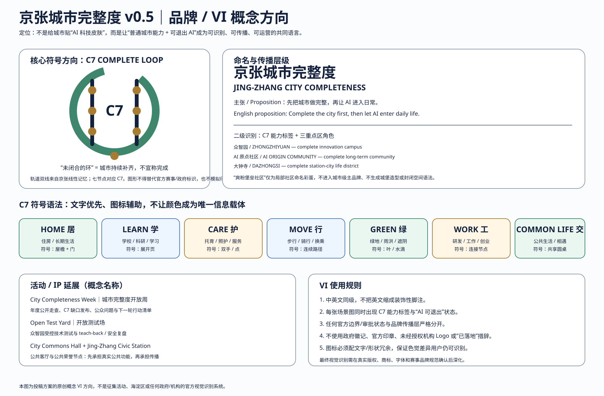

## 总体设计范围城市更新与控规深度城市设计

总体空间结构概括为 **“一脊、六段、六缝、三核”**。一条京张公共绿脊构成南北共同骨架，首先承担步行、骑行、无障碍、文化记忆、遮阴、雨洪和免费停留，再叠加数字导览与环境感知。六段完整度片区从南到北分别承担门户文化、日常服务、长期生活、AI 原点完整社区、学院协同与研发创新；六条东西缝合联系优先表达社区—公园—高校/园区—轨道/街区之间的慢行和接驳意图。[depth:overall_spatial_structure] [standard:MOHURD-URBAN-DESIGN-MEASURES]

三核不是三个“AI 展厅”：众智园是完整创新校园，AI 原点是完整长期社区，大钟寺是完整站城生活区。用地层以 13 个概念 feature 表达功能织补，C7 只作为审查方法，不创造“AI 用地”这一新的法定分类。[data:geometry/land_use.geojson#LU-001] [metric:land_use_feature_count] [depth:land_use_layout]

南北公共绿脊与慢行线共同构成连续骨架；六条东西缝合线是连接意图而非确定新路、桥隧或轨道出入口。当前六个工作段是概念片区，不是行政社区。[data:geometry/roads.geojson#ROAD-001] [metric:city_completeness_segment_count] [metric:east_west_stitch_count]

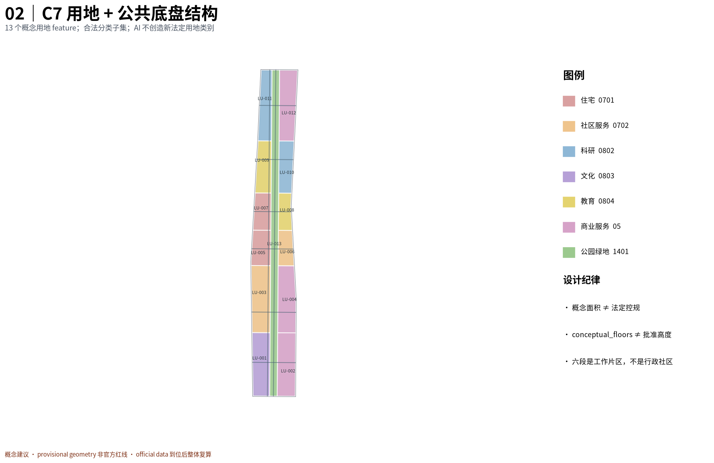

## 重点区域详细设计

**众智园：完整创新校园 + TEST POCKET / 测试侧院。** 科研、中试、孵化和企业服务仍是核心，但普通工作、吃饭休息、公共绿脊和开放交流必须先形成同一条可读的日常链。`ROAD-009` 是不依赖 AI 的普通主路；`BLDG-012`、`BLDG-013` 与 `PUBLIC-006` 作为 sidecar 宿主，只承担可关闭的测试、临时设备和可替换服务接口。真实测试边界、净距、速度、急停、许可与安全性能均须现场调查和专业审查后确定，本案不预设工程数值。[data:geometry/roads.geojson#ROAD-009] [data:geometry/buildings.geojson#BLDG-012] [data:geometry/public_space.geojson#PUBLIC-006]

**AI 原点社区：完整长期社区 + CARE PORCH / 照护门廊。** 住宅、共学、人工帮助、普通商业、绿地和社区客厅构成无需账号即可完成的日常链。`ROAD-010` 保持为 ordinary-city route；`BLDG-007`、`BLDG-009` 与 `PUBLIC-004` 的公共首层/公共界面承载自愿导航、服务匹配和照护提示。真实无障碍尺寸、服务半径、人员配置与响应时间必须由现场和运营资料确认；本案只锁定“拒绝登录或数据授权时，同一实体路径仍能到达人和服务”。[data:geometry/roads.geojson#ROAD-010] [data:geometry/buildings.geojson#BLDG-007] [data:geometry/public_space.geojson#PUBLIC-004]

**大钟寺：完整站城到达 + ARRIVAL SIDECAR / 到达侧带。** 普通到达、固定导视、人工问询、等候/商业和京张公共界面构成主机；动态翻译、信息提示和客流辅助只从侧边增强 `ROAD-011`。`BLDG-001`、`BLDG-002` 与 `PUBLIC-001` 是概念级宿主关系。由于 `PROV-KEY-003` 存在已知绝对位置风险，真实站口、高差、桥隧、竖向交通、通廊净宽、客流能力和权属运营全部标记为 **REAL LEVEL DATA REQUIRED**，不以概念图代替工程证据。[data:geometry/roads.geojson#ROAD-011] [data:geometry/public_space.geojson#PUBLIC-001] [data:geometry/key_areas.geojson#PROV-KEY-003]；补充证据：[depth:three_key_area_detailed_design]

三处重点区均配置可进入的公共交流空间：众智园开放交流场、AI 原点社区公共客厅与南段城市公共界面，首先解决日常使用，再承担传播功能。[data:geometry/public_space.geojson#PUBLIC-004] [metric:public_space_count]

### v0.7 与海淀现行城市更新实施逻辑对齐

城市完整度不是脱离现实政策的自造评价表。海淀区《城市更新导则（2025年版）》明确提出街区、校区、园区、社区“四区”融合，推动生活圈与创新圈融合，并把人工智能创新街区、轨道交通站点一体化、公共服务补充以及数智空间与城市功能融合作为重点方向。[source:HD-URBAN-RENEWAL-GUIDE-2025] 因此 C7 的作用，是把“产城融合”进一步翻译成居民、研究者、服务劳动者和访客每天能否完成 HOME / LEARN / CARE / MOVE / GREEN / WORK / COMMON LIFE，而不是另造一套法定规划指标。

v0.7 同时把实施动作分成两条真实路径。**低扰动、可逆动作**——如遮阴/坐凳、实体导视、人工服务界面、受控测试边界标识、可拆换小型服务节点——仍需现场核验、权属/运营许可和安全检查，但概念阶段可以明确其“最小可用空间”和退出状态；**改变用地、建筑规模/高度、站城工程、市政容量或涉及公共利益/公共安全的重改造**，则必须进入真实项目生成、实施方案审查和后续行政许可路径，本包不越权预设。[source:HD-URBAN-RENEWAL-IMPLEMENTATION-2025]

海淀公开的 2025 年四季度重点任务进展已把五道口 AI 原点社区和交通、教育、医疗、养老等“可感可及”场景列为现实工作语境。[source:HD-AI-DISTRICT-PROGRESS-2025Q4] 这只证明题目真实存在，不证明本方案的具体试点、位置、合作方、预算或许可已经获得确认。

v0.7 的固定重点区核心图不再只是任务卡，而把三种不同的首层/公共空间关系并置画出：众智园是研发校园 + 与普通通行物理分离的测试口袋；AI 原点是家门—照护—休息—公共客厅连续的长期社区；大钟寺是固定双语导视—人工问询—无障碍换乘—普通商业—遗产公共界面组成的站城到达链。

## AI 创新生态、人才画像与 AI+ 场景

v0.6 将原先 5 类合并画像拆解为 9 类显性设计测试人群：长期居民与家庭、老年居民、残障/行动或感知受限使用者、儿童与照护者、学生与科研人员、创业者与企业员工、服务劳动者与通勤者、访客与国际使用者，以及无智能手机/无账号/主动退出数字服务的使用者。这些画像用于检验受益、负担、排斥风险和人工兜底，不是人口统计结论。[metric:persona_count]

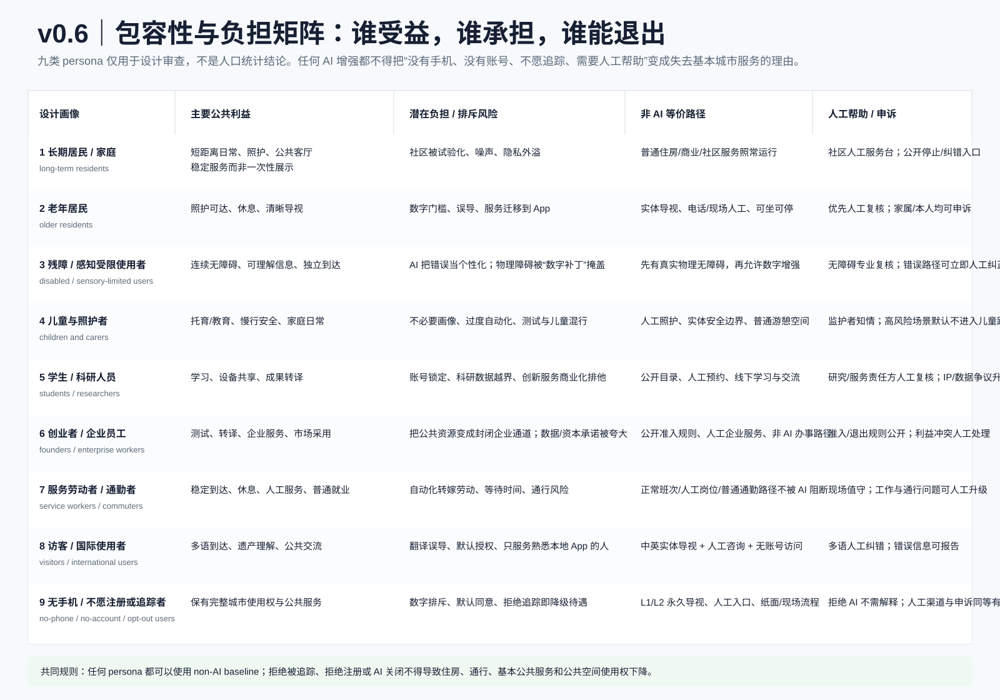

十个 AI+ 场景全部回答“谁、在哪里、现实问题、AI 做什么、非 AI 基线、责任主体、失败如何人工接管、如何评估”：①众智园低速机器人受控测试；②科研设备与算力共享；③高校成果—城市问题转译；④爽粉堡垒社区无障碍助手；⑤家庭机器人自愿测试；⑥社区共享空间调度；⑦京张遗产多语导览；⑧复杂换乘与步行辅助；⑨AI 原生商业限期试营；⑩C7 城市完整度巡检助手。[metric:ai_scenario_count] [metric:non_ai_baseline_coverage_ratio]

v0.5 把这十项从一句清单展开成完整场景卡：每张同时给出地点/用户、现实问题、AI 增强、非 AI 基线与退出、以及用于决定是否扩围的证据方向。场景 KPI 是概念阶段的验证指标方向，不是已发生绩效或政府承诺。

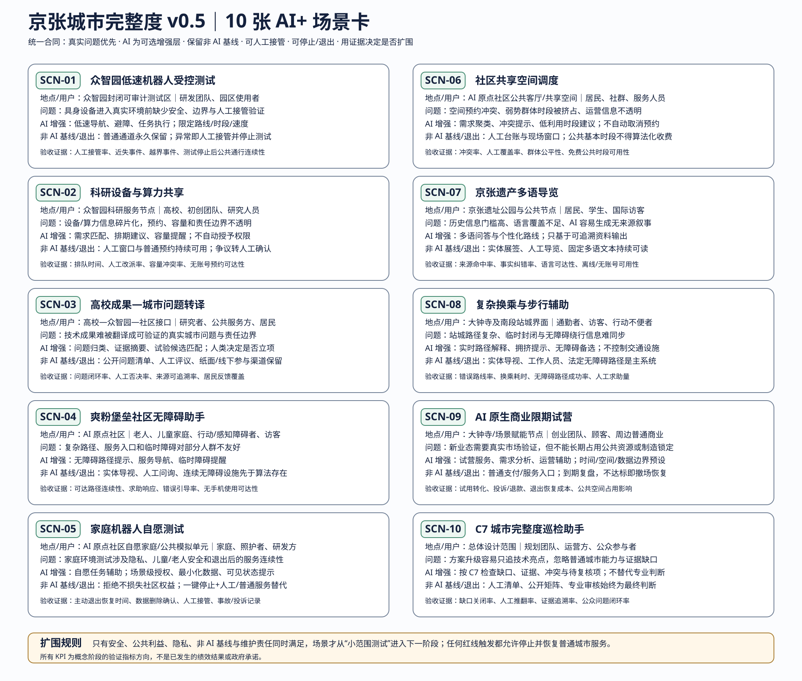

其中 SCN-01、SCN-05、SCN-09 分别承担技术、生活环境与市场三类验证，强调“先小范围、可停止、可复盘，再讨论扩大”。[metric:industry_test_scenario_count] 三个公共荣誉/朝圣节点为 Open Test Yard、City Commons Hall 与 Jing-Zhang Civic Station，它们必须先有真实公共功能，不能仅靠造型成为地标。[metric:pilgrimage_landmark_count]

v0.6 再从十个场景中抽出三个**旗舰试点协议**，让评审看到“怎样开始、怎样停、怎样留下收据”：众智园低速机器人受控测试、AI 原点无障碍/照护导航、大钟寺换乘/多语导览。三项都明确 non-AI baseline、概念数量基础、前置证据门、测试时间窗、KPI 方向、停止阈值、退出收据与责任结构；真实许可、合同、保险、货币预算和现场绩效在未验证前保持 UNKNOWN。[metric:flagship_pilot_count]

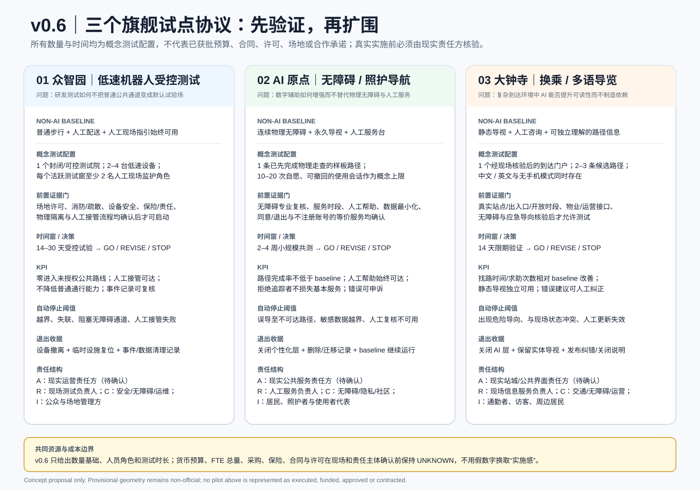

场景治理遵守同一底线：不用 App 仍能通行与获得基本服务；不参加测试不会失去社区权益；高风险判断转人工；设备或模型退出后，基本城市功能仍在。这既是技术鲁棒性，也是公共空间的公平性要求。

### v0.7 三条日常城市链：把协议重新变成空间

v0.7 不再把“评审索引”当作第一视觉，而从三类真实日常路径重新组织重点区：众智园的研究者与服务劳动者从到达、研发、吃饭休息走到受控测试；AI 原点的老人、照护者与无手机使用者从家门、休息、照护走到公共客厅；大钟寺的通勤者、国际访客与服务劳动者从到达、换乘、普通商业走到京张遗产公共界面。每条路径都先要求物理空间完整，再允许 AI 作为可关闭的增强层。

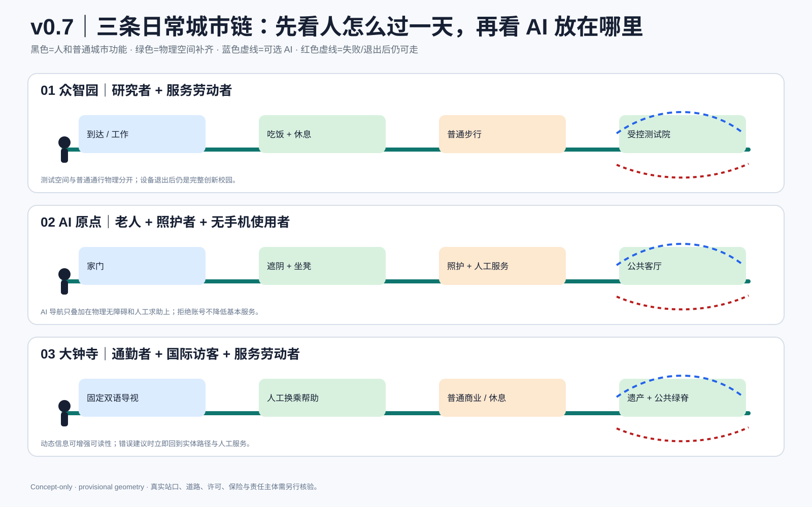

### AI 如何改变城市形态，而不是只增加屏幕

AI 对城市形态的影响仍由六类可逆空间原型承担：测试口袋、无障碍/人工求助节点、连续站城到达界面、可替换服务节点、人优先公共首层，以及可回退空间版本链。v0.15.s 进一步把前五类归并成 TEST POCKET、CARE PORCH、ARRIVAL SIDECAR 三种可读接口，并把宿主 feature 写进 geometry；第六类则成为三个 sidecar 共用的物理版本管理方法。这样 AI 的空间增量可以被定位、关闭、拆除和复核，而普通城市主机不必重画。[metric:ai_sidecar_type_count] [metric:ai_sidecar_host_feature_count]

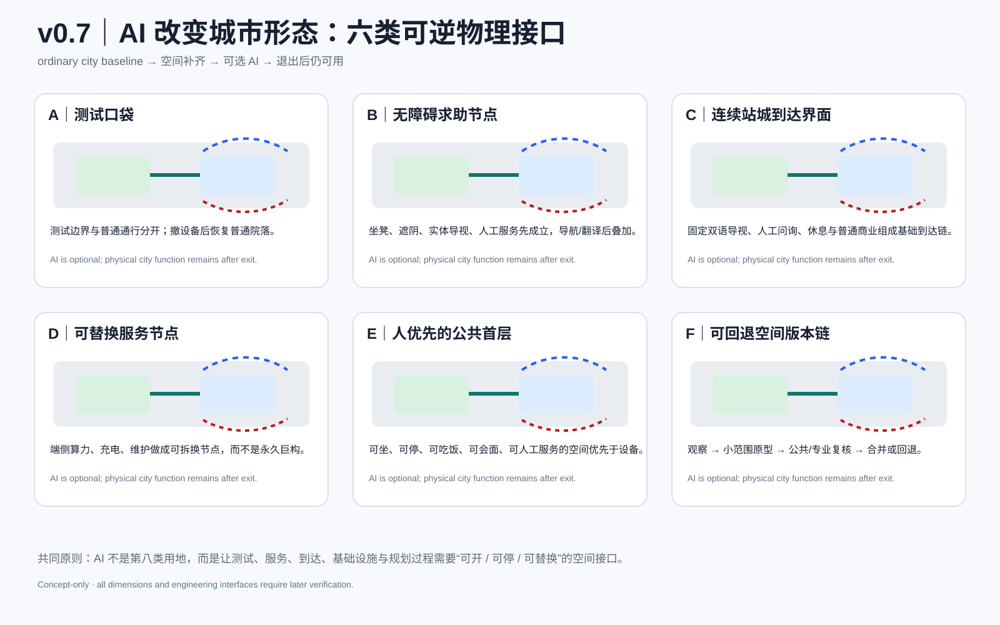

<!-- V09-REALITY-START -->
### v0.10｜DESIGN-FIRST + REALITY：现实资料只在改变空间时出现

v0.10 以获得 86 分的 v0.7 **design-first** 结构为底座，只吸收会改变空间判断的现实锚点；主叙事仍从人的日常任务开始，而不是从证据目录或评分结构开始。它把“来源更多”改成更窄的规则：**一条现实资料只有在改变断面、界面、节点或 unknown 的表达方式时，才进入设计主叙事。** 本轮登记 3 组官方公开现实锚点，并形成 5 条可检查的设计响应。[metric:official_constraint_anchor_count] [metric:design_response_rule_count]

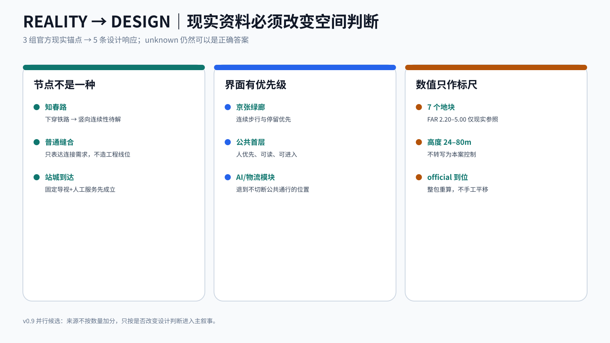

**第一条是知春路。** 海淀规自部门公开的控规草案采信通告明确，该铁路节点处知春路属于下穿段、不具备平交条件，并以分离式立交思路预留联通条件。[source:HD00-1601-DRAFT-RESPONSE-V09] 因此本案不再把六条东西缝合都画成同一种“地面横穿”：知春路改成**竖向连续性待解节点**，后续必须核实地面步行连续、上下层关系、无障碍和工程条件；当前不画桥隧线位、不声称工程可行。

**第二条是京张绿廊界面。** 蓝景丽家相关官方规划综合实施方案采信信息要求其商业商务规划与东侧京张铁路绿廊衔接并提升空间品质。[source:HD-LANJINGLIJIA-INTEGRATED-RESPONSE-V09] 本案据此把绿廊侧的优先级写得更硬：连续步行、可停留公共界面和人优先首层在前，AI 设备、物流与可替换服务模块不得切断公共通行。该个案不被外推为本案地块条件。

**第三条是现实强度标尺。** 三份公开《建设项目规划条件》覆盖 7 个地块，公开 FAR 参照为 2.20–5.00、建筑限高参照为 24–80m，部分地块另有密度与绿地率条件。[source:HD-PLOT-CONDITIONS-REFERENCE-V09] 这些数值只回答“现实里已经出现过什么量级”，绝不回答“本案应该批多少”。因此 `approved_floor_area_ratio`、`approved_building_height_m` 等继续保持 unknown，概念建筑也不套用任何相邻样本。[metric:reference_plot_condition_count]

五条设计响应完整记录于 `visual/assets/reality-constraint-register.json`。本轮固定 `mobility-bluegreen.png` 重建为不同类型的现实接口：普通缝合、下穿节点竖向连续性、绿廊人优先界面、站城到达与 official-data 重算触发器，不再用同一种蓝色虚线代表所有问题。
<!-- V09-REALITY-END -->

<!-- V016-LIFECYCLE-START -->
### v0.16.s｜四步空间生命周期：BASE CITY → ATTACH → OPERATE → CLEAN EXIT

这四步不是新的治理状态机，而是每一个 sidecar 都必须通过的**空间交接顺序**。`BASE CITY` 先确认普通城市可独立工作；`ATTACH` 只允许侧向、可识别、可拆除的新增层；`OPERATE` 要保留人工接管和普通路径；`CLEAN EXIT` 则必须把宿主交还给普通用途，并留下可复核的退出记录。[metric:sidecar_lifecycle_stage_count]

| 生命周期 | 空间问题 | 众智园 | AI 原点 | 大钟寺 |
| --- | --- | --- | --- | --- |
| BASE CITY | 没有 AI 时这里是什么？ | 普通研发/工作院落 + 公共绿脊 | 住宅 + 人工服务 + 社区公共首层 | 固定导视 + 人工帮助 + 等候/商业 |
| ATTACH | AI 从哪里进入且不占主路？ | 测试侧院 / 服务边 | 公共首层 / 照护门廊 | 到达侧带 / 信息界面 |
| OPERATE | 运行时什么不能被 AI 接管？ | `ROAD-009` 与普通工作/休息链 | `ROAD-010`、人工帮助与无账号入口 | `ROAD-011`、固定导视与人工问询 |
| CLEAN EXIT | 拆除后如何恢复普通城市？ | 撤设备与临时接口，恢复院落/公共交流 | 撤数字接口，保留人工服务和公共首层 | 撤动态层，保留固定导视、人工帮助与普通等候 |

每个 host 的 `ordinary_restore_use` 都是定性空间用途，不声称现场已具备或已完成改造；每次真实 attach / clean exit 前后都需要现场核验。这样，“可逆”不再靠未来承诺，而是在设计时就预留了退出后的城市状态。[metric:clean_exit_restore_use_coverage_ratio]
<!-- V016-LIFECYCLE-END -->

## 用地、建筑规模与拆改留方案

用地层采用允许的正式分类子集，而不是自造 AI 用地代码。当前概念量包括住宅、社区服务、科研、文化、教育、商业服务和公园绿地，均服务于功能邻接与完整度讨论；它们不是现状认定，也不是已批控规。[standard:MNR-LAND-USE-CLASSIFICATION-GUIDE]

| 概念用地量 | 包内复算状态 |
| --- | --- |
| 住宅 | [metric:land_use_residential_sqm] |
| 社区服务 | [metric:land_use_community_service_sqm] |
| 科研 | [metric:land_use_research_sqm] |
| 文化 | [metric:land_use_cultural_sqm] |
| 教育 | [metric:land_use_education_sqm] |
| 商业服务 | [metric:land_use_commercial_service_sqm] |
| 公园绿地 | [metric:land_use_park_green_sqm] |

建筑层设置 13 个概念原型，只用来测试“住—学—护—工—交”的邻接与容量。[metric:conceptual_building_count] 建筑基底面积、总楼面容量和概念 FAR 仅为内部设计模型，不是批准建设规模。[metric:building_footprint_area_sqm] [metric:conceptual_total_floor_area_sqm] [metric:conceptual_floor_area_ratio]

正式容积率与高度保持 unknown；`conceptual_floors` 不解释为获批高度。该响应符合“已知控制、设计建议和待确认事项”分开表达的纪律。[standard:MOHURD-CONTROL-DETAILED-PLANNING] [depth:development_intensity_controls] [depth:height_massing_character]

逐栋现状、权属、结构、消防与文保资料未齐，因此不做具体建筑“拆、改、留”的最终结论；建筑原型中的 infill/reuse 只表示可逆研究动作。[standard:MOHURD-ARCH-DESIGN-DEPTH-2016] [depth:retain_renovate_demolish]

## 交通、轨道、市政与公共服务设施

道路层只表达任务允许的绿道、自行车、步行和轨道接驳概念联系，不修改快速路与主干路，也不把概念中心线称为道路红线。当前可复算的是概念慢行/连接中心线长度；正式道路面积因缺 official redlines 和核实宽度而保持 unknown。[metric:road_centerline_length_m] [depth:traffic_rail_slow_parking]

公共服务优先补现实入口：托育/教育、照护、人工服务、社区公共厅、普通商业与无障碍路径。新型基础设施如端侧算力、充电、机器人维护和传感设备必须服从消防、能源、网络与市政专业条件，不能以“AI 基础设施”名义越过正式管线和工程审批。[depth:municipal_new_infrastructure]

本轮不推定轨道出入口、停车供给、桥隧线位或工程可行性。所有东西缝合联系只表达“需要被解决的连接关系”，后续必须以现状交通调查、专业方案与 official constraints 替换概念线位。

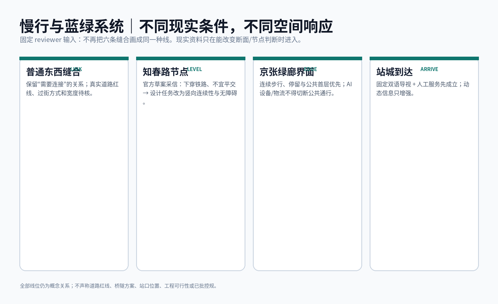

## 蓝绿空间、公共空间与城市风貌

京张公共绿脊首先是一条正常的公共生活基础设施：可以走、骑、停留、遮阴、识别方向并接触铁路记忆；AI 导览、环境感知或智能调度只是可选增强。设计图层把绿脊分成南、中、北三段，并在 AI 原点增加社区口袋绿地。[data:geometry/green_space.geojson#GREEN-001] [metric:green_space_area_sqm] [metric:green_ratio]

六个公共客厅坚持 `public_first_non_app_entry`，也就是没有账号、没有手机或不愿被画像的人仍可以进入和获得基本服务。公共空间的包内面积与比例用于概念比较，不是法定公共空间率。[metric:public_space_area_sqm] [metric:public_space_ratio] [depth:blue_green_public_space]

v0.5 增加七类可复制公共空间组件：C7 方向柱、遮阴停留岛、机器人交接湾、人工服务台、社区共享桌、无障碍连续节点和京张记忆轨。导视采用三层结构：L1 永久物理信息保证无电/无网/无手机仍可通行求助；L2 运营层发布开放、封闭、活动和测试状态；L3 可选 AI 层才提供多语问答、个性化路径或预约辅助。关闭 L3 必须自动退回 L1/L2，不损失基本服务。

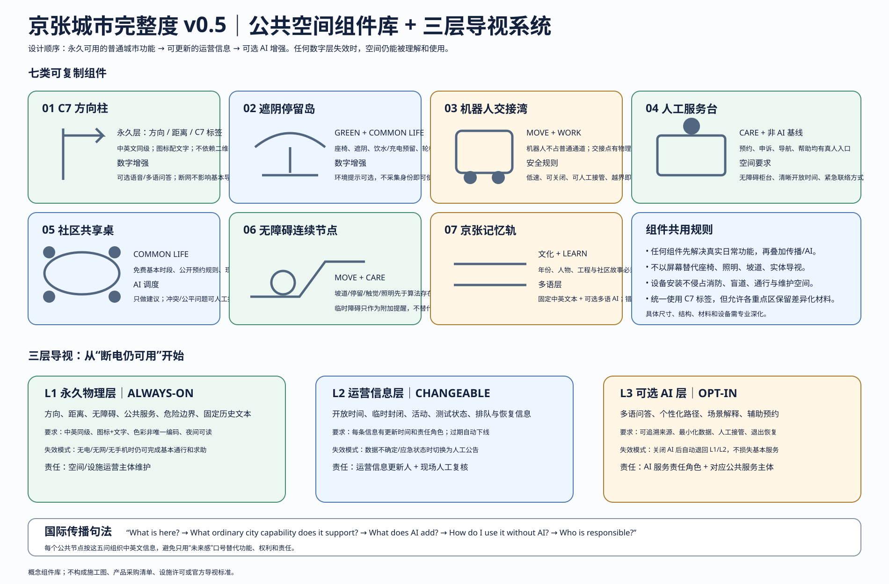

风貌不追求“AI 建筑长相”。科研、住宅、教育和商业可以有不同建筑性格，但共同遵守：公共首层可读、步行入口清楚、设备可维护、遗产界面不过度遮挡、夜间不过度依赖大屏。真正的科技感来自服务和空间组织，而不是把芯片纹样贴在立面上。

## 更新项目清单、实施政策与分期计划

实施不是按“先造地标、后补日常”的顺序，而是先发现和补齐 C7 缺口。近期优先完成 C7 现状普查、公共绿脊/慢行走查、社区服务缺口盘点和低扰动共享空间试点；中期深化众智园科研—公共服务—受控测试接口，并补足 AI 原点社区的生活服务与横向连接；长期只在可靠站点、权属、交通和文保资料基础上深化南段站城、文化与市场转化协同。[depth:renewal_project_list]

`geometry/phasing.geojson` 将近期、中期、长期表示为概念研究范围，而不是政府已经确定的开工时间表。每一阶段都设置“数据到位—重新核对—再扩大”的前置条件；若 official polygon 或关键约束变化，分期边界、用地、指标、图件和 PDF 同步重算。[data:geometry/phasing.geojson#PHASE-001] [depth:phasing_implementation]

运营层建议每年进行 C7 城市完整度公开走查、开发者开放周、受控机器人测试开放日、社区公共服务评议和京张技术史展。公开的不应只有“新增了什么 AI”，也应包括“哪项普通城市能力仍有缺口、哪些试点被停止或回退”。

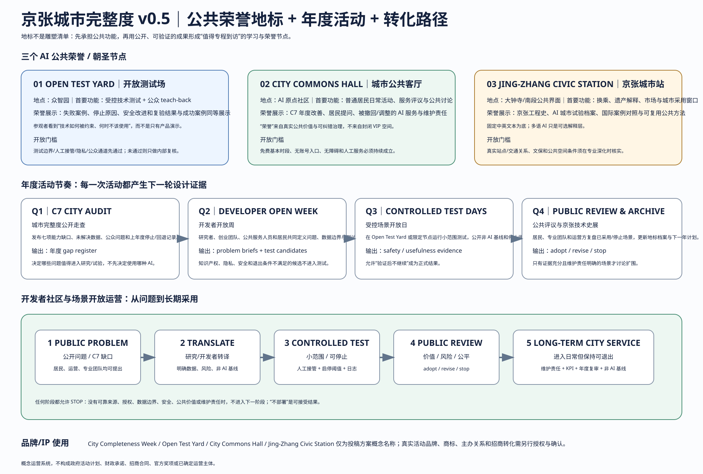

v0.5 将实施进一步工程化为“项目—空间—建议角色—前置条件—启动/停止阈值—维护责任—验收 KPI”。AI 层必须能独立停机；真实组织主体、预算、合同、活动与跨机构安排必须由现实责任方另行确认。

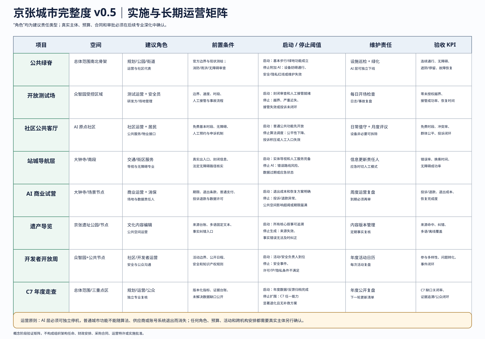

v0.6 在此基础上增加**资源数量基础 + RACI + 维护频率 + 启动证据门**。三个旗舰试点分别给出概念设备/界面数量级、A/R/C/I 责任类型、日/周/月维护节奏，以及许可、安全、保险、人工值守和数据治理等启动前核验项；统一形成 `PRECONDITION → TEST → RECEIPT → GO/REVISE/STOP` 决策链。这里的 S/M 仅是概念资源等级，不是货币预算；最终 FTE、采购、保险、合同和具名主体仍待现实责任方确认。

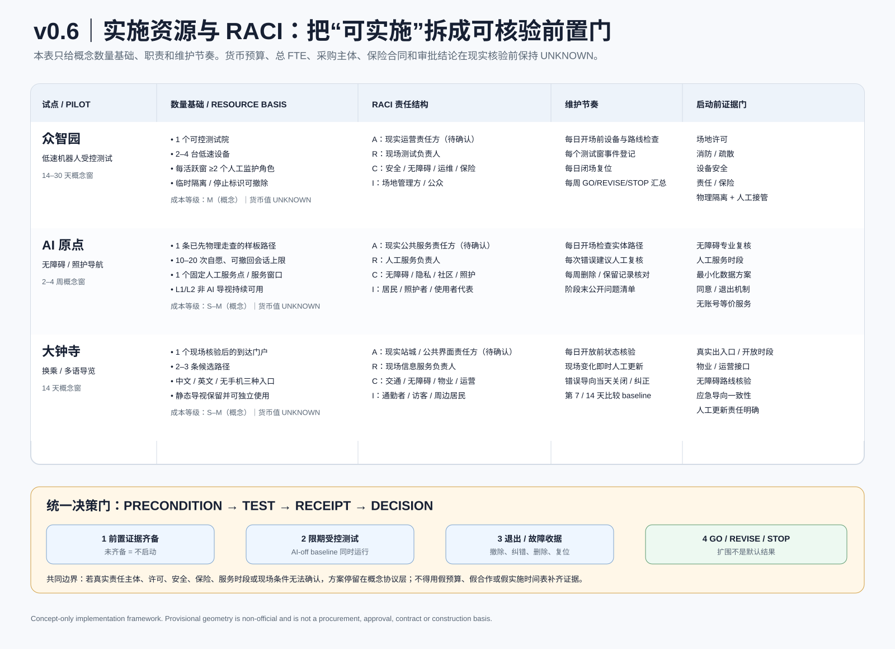

## 指标体系、面积复算与合规矩阵

本轮指标分三种：公告约值、由提交 geometry 复算的概念设计量、因正式资料缺失而保持 unknown 的法定/工程量。所有 known metric 都保存公式、来源文件、置信度和假设；所有 provisional 派生值在 official polygon 到位后统一重算。[depth:metrics_recalculation]

| 已知指标 | 审计引用 |
| --- | --- |
| 统筹研究范围约值 | [metric:coordinated_research_area_sqm] |
| 总体设计范围公告约值 | [metric:official_declared_overall_design_area_sqm] |
| 临时总体 polygon 包内面积 | [metric:site_area_sqm] |
| 三重点区公告总量 | [metric:key_area_announced_total_sqm] |
| 重点区数量 | [metric:key_area_count] |
| C7 维度数量 | [metric:city_completeness_dimension_count] |
| 完整度片区数量 | [metric:city_completeness_segment_count] |
| 概念用地 feature 数 | [metric:land_use_feature_count] |
| 住宅概念面积 | [metric:land_use_residential_sqm] |
| 社区服务概念面积 | [metric:land_use_community_service_sqm] |
| 科研概念面积 | [metric:land_use_research_sqm] |
| 文化概念面积 | [metric:land_use_cultural_sqm] |
| 教育概念面积 | [metric:land_use_education_sqm] |
| 商业服务概念面积 | [metric:land_use_commercial_service_sqm] |
| 公园绿地概念面积 | [metric:land_use_park_green_sqm] |
| 绿地设计面积 | [metric:green_space_area_sqm] |
| 绿地设计比 | [metric:green_ratio] |
| 公共空间设计面积 | [metric:public_space_area_sqm] |
| 公共空间设计比 | [metric:public_space_ratio] |
| 公共客厅数量 | [metric:public_space_count] |
| 概念建筑数量 | [metric:conceptual_building_count] |
| 概念建筑基底 | [metric:building_footprint_area_sqm] |
| 概念总楼面容量 | [metric:conceptual_total_floor_area_sqm] |
| 概念容量比 | [metric:conceptual_floor_area_ratio] |
| 概念慢行/连接中心线长度 | [metric:road_centerline_length_m] |
| 东西缝合联系数量 | [metric:east_west_stitch_count] |
| 已登记 official constraint feature 数 | [metric:constraints_feature_count] |
| 设计画像数量 | [metric:persona_count] |
| AI+ 场景数量 | [metric:ai_scenario_count] |
| 产业测试场景数量 | [metric:industry_test_scenario_count] |
| v0.6 旗舰试点协议数量 | [metric:flagship_pilot_count] |
| 公共荣誉/朝圣节点数量 | [metric:pilgrimage_landmark_count] |
| 非 AI 基线覆盖率 | [metric:non_ai_baseline_coverage_ratio] |

九组空间证据均保持可追踪：总体边界与重点区为 provisional constraints；用地、建筑、道路、绿地、公共空间和分期是 design proposals；constraints 图层则有意为空并明确记录缺失项，而不是遗忘的 scaffold。[data:geometry/land_use.geojson#LU-013] [data:geometry/buildings.geojson#BLDG-001]

空约束层本身是一个可审查的数据缺口：正式文保、道路、市政等约束到位后必须新增 features，并触发全包复核。[data:geometry/constraints.geojson#metadata] [metric:constraints_feature_count]

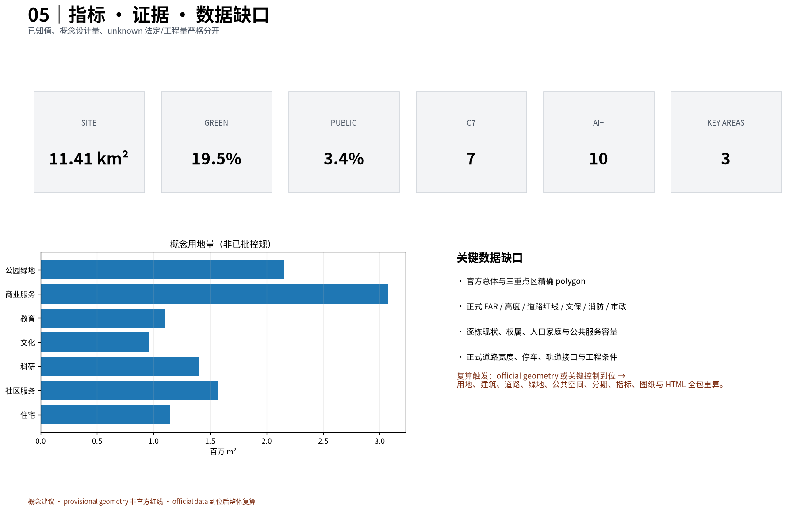

v0.7 将 v0.6 的 reviewer evidence dashboard / index 降为后部追溯附件，不再作为设计叙事或首屏主视觉；评分、gate 与设计内容继续分离。

## 风险、版权与合规说明

第一类风险是**空间证据精度**：官方精确总体红线和三处重点区 polygon 尚未取得，大钟寺 provisional rectangle 还有已知定位风险。第二类是**专业资料缺口**：现状建筑、权属、控规、市政、消防、文保、交通断面与停车调查不完整。第三类是**技术治理风险**：AI 场景可能产生隐私、排斥、平台依赖、误判与维护成本，所以每个场景保留非 AI 基线、人工接管、退出与复盘路径。[depth:risk_missing_data]

v0.5 把隐私原则下沉到场景级数据流：位置/路径、健康/照护、家庭环境、账号身份、行为使用、科研/企业六类数据分别规定目的限定、最小化、访问、保留/删除、人工复核与退出。拒绝被追踪不能成为失去通行、住房、基本服务或公共空间使用权的条件；一次场景授权不得自动扩展到另一场景。

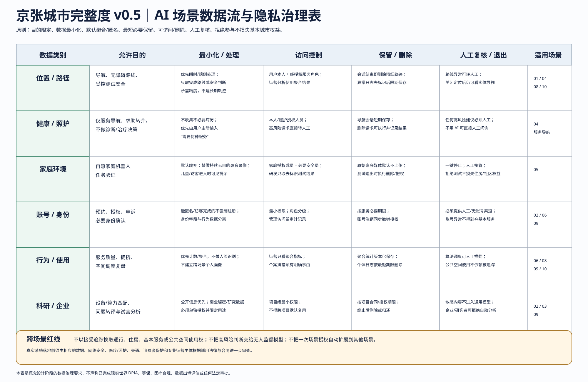

当前 `constraints.geojson` 的空集是主动披露，不表示“没有约束”。法定 FAR、高度和道路面积保持 unknown，不用 schema sanity range 或概念模型去填补。图件使用本地生成图形和公开/清权资料，不嵌入商业地图瓦片、远程字体、未经许可图片或第三方商标。[data:geometry/constraints.geojson#metadata]

版权与生成责任方面：AI 参与公开资料研究、同类方案扫描、结构化写作、GeoJSON、图件、HTML/PDF 与校验；提交者对概念方向、爽粉堡垒命名彩蛋及最终公开提交承担判断责任。`report/copyright_statement.md` 已扩展为 v0.5/v0.6 逐资产权利与生成台账，覆盖核心 PNG、全部新增 SVG、HTML、PDF、GeoJSON、字体/图标/代码状态及 AI 参与方式；v0.6 的旗舰试点、包容矩阵、RACI、证据索引和首屏总表均为本方案原创/AI 辅助 SVG，不嵌入第三方 Logo、图片、地图或字体文件。六个国际案例在 `sources.json` 中保留访问日期、用途、复用状态、限制、采集和转换说明。后续任何真实实施仍需法定规划、专业设计、公众参与和主管部门程序，不能由本包替代。

## 参考资料

正文只保留与当前判断直接相关的 1–3 条引用；完整 provenance、用途限制、来源类型与路径保存在 `sources.json`。本节用简表确认机器审计所需的资料均在正文出现过，而不是把外部案例提升为规划控制依据。项目自身资料优先于国际案例，provisional 资料只支撑生成、可视化和讨论。

| 资料角色 | 证据 |
| --- | --- |
| 项目资料包 | [source:SITE-PACKAGE] |
| 中央资料登记表 | [source:SOURCE-REGISTRY] |
| processed fact pack | [source:PROCESSED-FACT-PACK] |
| Agent 任务书 | [source:AGENT-TASKBOOK] |
| 设计 brief | [source:DESIGN-BRIEF] |
| 规划控制缺口 | [source:PLANNING-LIMITS] |
| 可编辑/锁定空间规则 | [source:ALLOWED-DESIGN-SPACE] |
| 用地代码 | [source:LAND-USE-CODES] |
| 建筑类型 | [source:BUILDING-TYPES] |
| 临时总体边界 | [source:BOUNDARY-SOURCE] |
| 临时重点区边界 | [source:KEY-AREA-SOURCE] |
| 官方征集公告 | [source:OFFICIAL-ANNOUNCEMENT] |
| formal 提交指南 | [source:FORMAL-GUIDE] |
| Vector Institute | [source:CASE-VECTOR] |
| Mila | [source:CASE-MILA] |
| Alan Turing Institute | [source:CASE-TURING] |
| AI Singapore 100 Experiments | [source:CASE-AISG-100E] |
| Seoul AI Hub | [source:CASE-SEOUL-AI-HUB] |
| Punggol Digital District | [source:CASE-PUNGGOL] |

专业深度响应并不把“有数据缺口”误写成“没完成响应”：设计深度矩阵中的 15 项都已经给出当前可回答内容、缺什么数据、后续如何核定；标准矩阵同样把强制标准的响应与数据状态分开。相关专业判断分别见上述章节及对应矩阵。[standard:MOHURD-URBAN-DESIGN-MEASURES] [depth:metrics_recalculation]