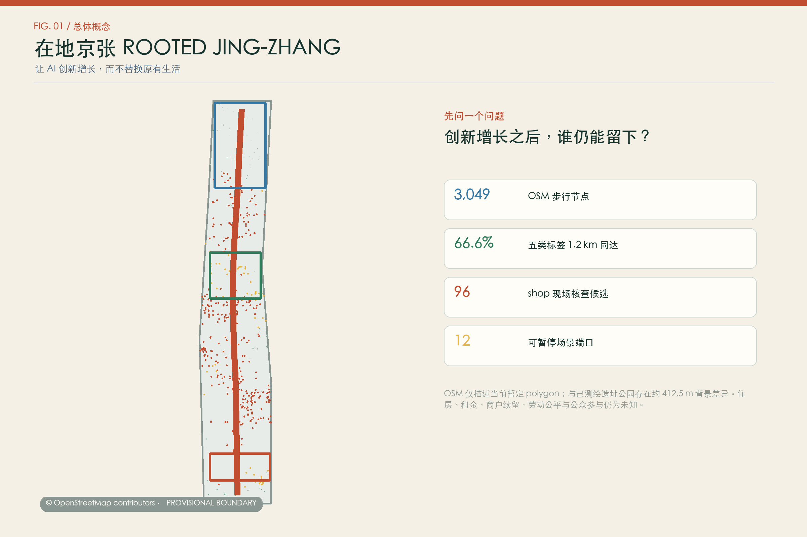
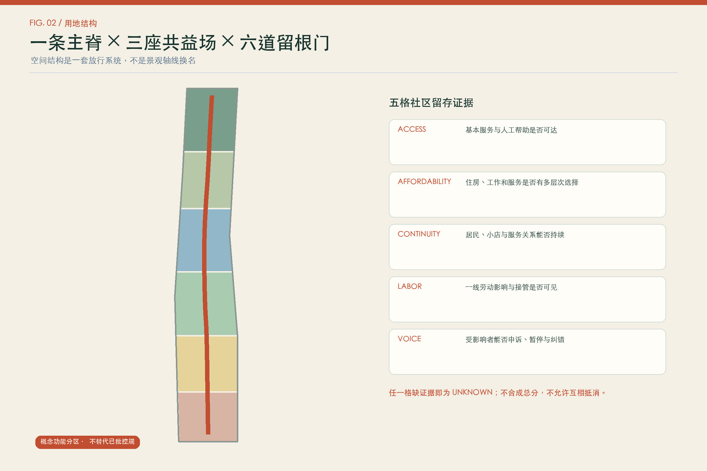
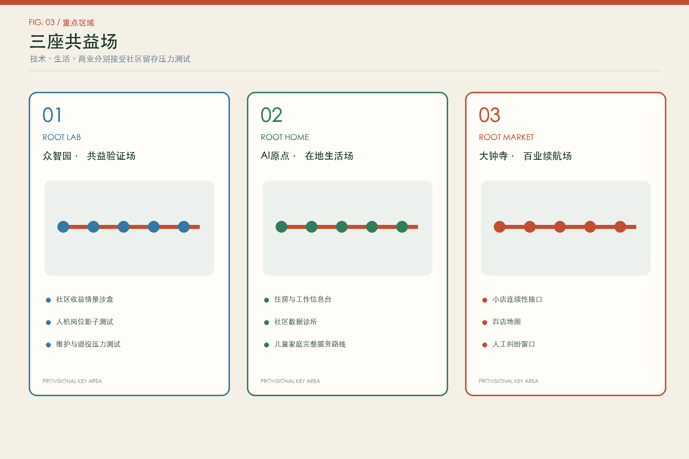
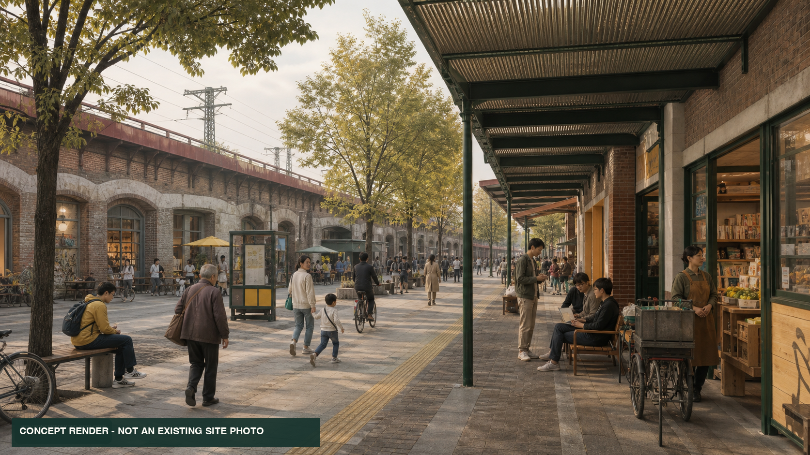
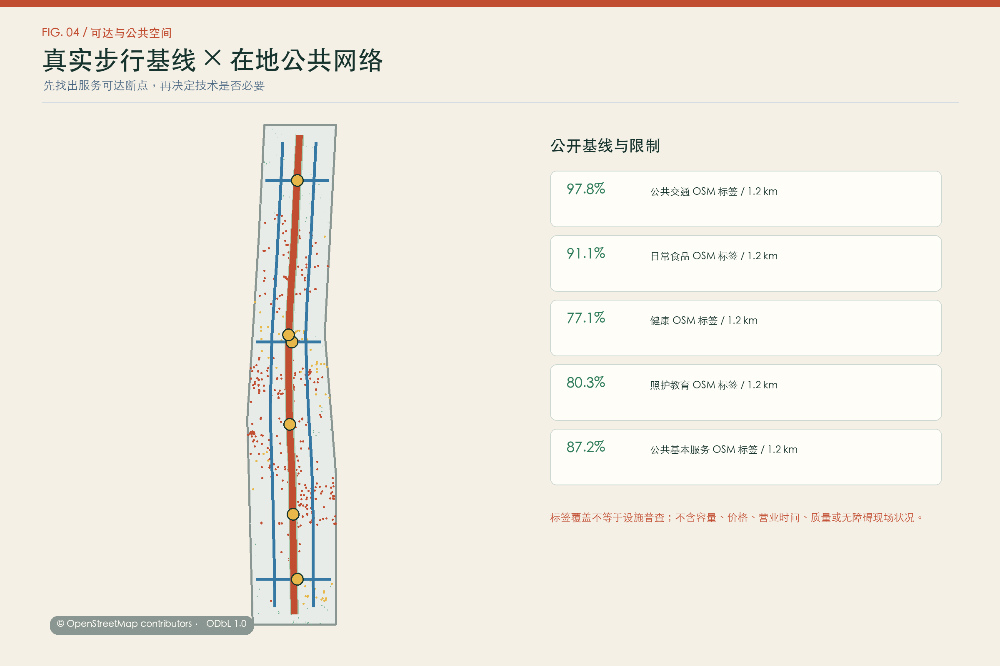
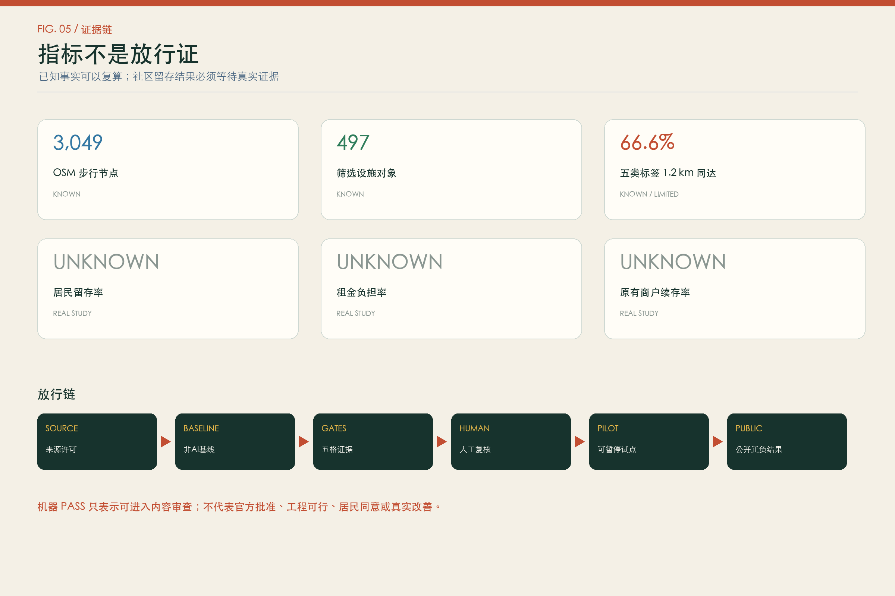

# ROOTED JING-ZHANG

> **Grow the innovation. Keep the neighborhood.**

This is not a one-way plan for attracting more companies. It asks who can still live, work, trade, care, and participate after innovation arrives. All spatial moves are open co-design proposals for professional development. They are not statutory planning, approved construction, resident consent, or commitments on housing, property, investment, or relocation.

## 0. The question that comes first

An AI district can succeed technically and still fail as a city. Public investment and new consumption may arrive while long-term residents, ordinary tenants, student families, everyday shops, and frontline cleaners, gardeners, guards, repair workers, couriers, and food-service workers gradually lose the ability to remain.

ROOTED JING-ZHANG therefore makes **community retention a release condition**. Before an industrial pilot, public-space project, or renewal program expands, it must show that essential services remain accessible, housing and workspace choices remain diverse, existing shops and frontline workers can continue to participate, and affected people have a real human appeal and pause route. AI may organize public evidence and compare aggregate scenarios. It must never assign a displacement-risk score to a person, household, tenant, worker, or shop, and must never decide who should stay or leave. [source:DATA-CONTRACT]

Version 2.0 is a substantive replacement of the merged v1 “Time Commons.” At upstream commit `1018f25`, we audited 261 public proposals. Public-time, latent-capacity, climate-commons, and complete-life concepts already had close peers. New submissions also mention shop adoption, skill retention, non-displacing renewal, public-AI audit loops, and exit protocols, but none combines housing, shop, labour, and participation evidence gates with an explicit ban on individual displacement-risk scoring. This version therefore moves anti-displacement from a risk note into the design structure. [source:PEER-AUDIT]

## 1. Evidence boundary and reproducible baseline

The official announcement and agent taskbook provide the project aims, textual scopes, approximate areas, three focus areas, and six agent tasks. [source:OFFICIAL-ANNOUNCEMENT] [source:AGENT-TASKBOOK] The repository still lacks approval-grade boundaries, zoning controls, building surveys, tenure, leases, road redlines, utilities, heritage records, and household baselines. `site_boundary.geojson` and `key_areas.geojson` therefore remain `provisional_constraint` geometries. All dependent results must be recalculated when official geometry arrives. [source:BOUNDARY-SOURCE] [source:KEY-AREA-SOURCE]

The latest repository basis note adds a background-only cross-check: the OSM-mapped Jing-Zhang Railway Heritage Park has 0% intersection with `PROV-SITE-001`, with a nearest distance of about 412.5 metres. This establishes neither that OSM is complete nor that the provisional polygon is wrong, so it is not a basis for silently moving the boundary. It does establish that every current OSM metric describes only the current provisional polygon and must not be presented as an official park-surroundings baseline. [source:BOUNDARY-BASIS-AUDIT]

This version adds a reproducible OSMnx workflow. Inside the provisional WGS84 boundary it retrieved [metric:osm_walk_node_count] walk nodes, [metric:osm_walk_edge_count] directed edges, and [metric:osm_selected_facility_count] filtered facility objects. [metric:osm_all_five_access_1200_ratio] of walk nodes can reach OSM tags in all five categories—public transport, daily food, health, care/education, and public basics—within 1,200 metres of network distance. This describes tag coverage, not a facility census or service quality. A missing tag is not evidence that a service is absent. [source:OSM-BASELINE] [source:OSMNX]

| Evidence layer | Current status | Supports | Does not support |
| --- | --- | --- | --- |
| Announcement and taskbook | registered | aims, textual scope, required tasks | official geometry or controls |
| Provisional geometry | reproducible, low confidence; about 412.5 m background discrepancy from the OSM-mapped park | internal topology and concept relations | approval, relocation, precise quantities, or actual park inclusion |
| OSM network and tags | generated under ODbL | access candidates and field-check list | capacity, price, hours, quality, absence |
| Housing, tenancy, shops, labour | missing | data collection contracts only | rent pressure, displacement, survival rates |
| Participation | not conducted | recruitment and dissent-recording method | resident consent or satisfaction |

`visual/assets/retention-data-contract.json` defines four missing evidence families: aggregated housing and tenure; anonymous shop continuity; frontline shift and access; and representative participation. Forbidden fields include names, identity numbers, exact addresses, individual income, personal trajectories, employer performance, and household displacement probabilities. Until these evidence families have lawful methods and human review, the retention test is diagnostic only and cannot approve demolition, tenancy, housing eligibility, procurement, investment, or relocation. [source:DATA-CONTRACT]

## 2. Three scales, three different decisions

| Scale | Question | ROOTED output | Required next evidence |
| --- | --- | --- | --- |
| Approx. 43.6 km² study scope | How does AI growth return durable capacity to communities? | regional community-benefit covenant and shared-benefit framework | official industry, housing, population, transport, and service data |
| Approx. 11.4 km² overall scope | How do park, campuses, communities, and stations form a non-displacing network? | one rooted spine, three fields, two wings, six gates, twelve ports | official boundary, controls, condition and ownership surveys |
| Three focus areas | How do three innovation types pass a retention stress test? | ROOT LAB, ROOT HOME, ROOT MARKET | official focus-area polygons and targeted surveys |

The rooted spine connects essential services, human help, cultural memory, and public evidence. ROOT LAB tests technology and labour impacts; ROOT HOME tests innovation against complete everyday life; ROOT MARKET tests smart commerce against the continuity of ordinary shops. The two support wings connect legal, IP, finance, ecological, and frontline operating knowledge. Six “root gates” check whether people can walk through, afford to use the place, find a person responsible, appeal, and pause a failing intervention. [depth:three_level_scope_framework] [depth:overall_spatial_structure]

## 3. Brand as a checkable promise

“ROOTED” does not reject global talent or new enterprises. It requires global innovation to accept responsibility to the existing neighbourhood. The tagline is **Grow the innovation. Keep the neighborhood.** Two parallel railway lines form an open root system: three upper nodes mark the focus areas, while the root remains open for resident, shopkeeper, worker, and professional judgement.

Five verbs form the operating language: `ROOT` preserves relationships, `ROOM` creates low-threshold space, `ROUTE` keeps services accessible, `REVIEW` makes impacts disputable, and `RETURN` records how public benefit comes back. These are wayfinding and operating terms, not statutory land-use categories.

## 4. Global cases: transfer mechanisms, not institutions

| Case | Mechanism to learn | Application here | Not transferable as fact |
| --- | --- | --- | --- |
| Atlanta BeltLine | housing creation/preservation, legacy-resident retention, commercial affordability | one ledger for housing, shops, and public works | US finance, land, and AMI rules [source:CASE-ATLANTA] |
| 11th Street Bridge Park | equitable-development planning before the landmark opens | community-benefit gate before a major place project | US nonprofit and finance structure [source:CASE-BRIDGE-PARK] |
| Dudley Street / DNI | resident-led planning and long-term affordability | test locally lawful shared or long-term stewardship | eminent-domain and CLT law [source:CASE-DSNI] |
| Kendall Square | innovation planning with housing, public space, and community benefits | one review sheet for innovation and everyday life | US zoning agreements [source:CASE-KENDALL] |
| Barcelona 22@ | productive renewal with housing, facilities, green space, and existing districts | resist single-use office conversion | Barcelona land and housing institutions [source:CASE-22AT] |
| Toronto Community Benefits | public investment linked to jobs, training, and procurement | community-benefit clauses in pilots and procurement | local quotas and labour agreements [source:CASE-TORONTO-CBF] |
| Punggol Digital District | university, industry, transport, digital systems, and daily amenities | governed integration of industry and life | new-town delivery model [source:CASE-PDD] |

The shared lesson is temporal: equity cannot be added after completion. Affordability, small-business continuity, labour, and participation must occupy design, land, procurement, operations, and data structures from the beginning.

## 5. AI ecosystem: from attraction chain to public-benefit chain

Every layer follows the same sequence: **propose a technology → state resource and labour impacts → establish a non-AI baseline → run a bounded test → conduct community and professional review → disclose positive and negative results → adopt, modify, or exit → return a durable public asset**.

Only OSMnx is executed in v2. r5py can add multimodal access after lawful GTFS becomes available. UrbanSim can support long-term land and housing scenarios only after official housing, household, and property data exists. Neither future adapter is presented as a current result. [source:OSMNX] [source:R5PY] [source:URBANSIM]

## 6. Overall design and five evidence gates

Six complete conceptual land-use bands structure everyday commerce, community services, the public green spine, mixed innovation-life space, multi-level living support, and public-benefit verification R&D. [data:geometry/land_use.geojson#LU-01] These codes test topology only and do not represent current or approved land use.

The five evidence gates are:

- `ACCESS`: essential services and human help are reachable by different groups;
- `AFFORDABILITY`: housing, work, and daily-service choices remain diverse;
- `CONTINUITY`: residents, tenants, shops, and service relationships can continue;
- `LABOR`: frontline impacts, training, takeover, and safety are visible;
- `VOICE`: affected people can see disagreement, appeal, pause, and correct.

A missing evidence family remains `unknown`. No composite score is created, and a strong result in one gate cannot cancel harm in another. The five gates are encoded as evidence constraints in `geometry/constraints.geojson`.

Renewal begins with a retention ledger, not a demolition map: obtain lawful data; establish a baseline with right-holders; compare no-build, operating, micro-renewal, adaptive-reuse, and reversible-addition scenarios; review housing, shop, labour, service, and cultural impacts; and only then let professional and statutory processes determine physical change. `buildings.geojson` contains functional prototypes, not claims about real buildings. FAR, height, density, setback, parking, and floor area remain unknown. [depth:development_intensity_controls] [depth:retain_renovate_demolish]

## 7. Three public-benefit fields

### ROOT LAB — Zhongzhiyuan

ROOT LAB hosts bounded tests of models, chips, edge devices, and embodied AI while asking whether technical improvement hides cleaning, guarding, maintenance, delivery, and human judgement. Its prototypes include a public-benefit scenario sandbox, human-machine task shadowing, maintenance and retirement tests, a human-takeover foyer, and an open archive of failures. [data:geometry/key_areas.geojson#PROV-KEY-001]

### ROOT HOME — AI Origin

ROOT HOME is a shared front door for students, researchers, new developers, long-term residents, tenants, families, and frontline service workers. It includes a housing and workspace information desk, community data clinic, care routes, night-time human help, low-threshold open-source rooms, and the Root Rings courtyard. AI may retrieve authorised information; humans make all housing, education, health, and legal decisions. [data:geometry/key_areas.geojson#PROV-KEY-002]

### ROOT MARKET — Dazhongsi

ROOT MARKET treats ordinary restaurants, repair, retail, and human service as infrastructure. It includes a voluntarily verified “hundred everyday places” map, reversible trial counters, a shop data-help desk, and a human dispute window. Recommendation, translation, and inventory tools are opt-in. They may not default to faces, continuous trajectories, sales ledgers, cross-shop profiles, or automated differential pricing. The [metric:osm_local_shop_candidate_count] OSM `shop` objects are field-check candidates, not a business census. [data:geometry/key_areas.geojson#PROV-KEY-003]

This image communicates only human scale, material character, and use relationships. It was assisted by OpenAI's built-in image-generation tool and carries a “concept render” label. It is not a site photograph, approved design, resident consent, or engineering commitment. The full prompt, disclosure, and prohibited uses are stored in `visual/assets/root-market-concept-render.prompt.json`; the runtime did not expose an exact model ID. [source:IMAGE-GENERATION-DISCLOSURE]

## 8. Six right-holder groups and twelve reversible scenarios

The six groups express rights rather than profiling labels: long-term residents and tenants; everyday shops and sole traders; frontline workers; students, researchers, and startups; families, older people, and disabled users; international talent and visitors. [metric:persona_count]

| ID | Scenario | AI boundary | Human control and stop condition |
| --- | --- | --- | --- |
| R01★ | Community-benefit scenario sandbox | compare disclosed aggregate or synthetic scenarios | cannot approve a project; planners, community, and third party review |
| R02★ | Human-machine task shadow test | compare task flows, faults, and process time | no personal score or automatic scheduling; worker and safety review |
| R03★ | Shop-continuity interface test | voluntary public directory and simulated stock | shopkeeper decides; no sales ledger or cross-shop profile |
| R04 | OSM daily-service walk audit | identify field-check candidates | missing tag is never interpreted as absence |
| R05 | Housing and workspace information desk | retrieve official and authorised information | no eligibility, price, allocation, or legal decision |
| R06 | Community data clinic | explain, correct, and withdraw project data | disputed data is paused; paper and human route remains |
| R07 | Night-shift safety and rest route | aggregated shifts and service points only | no personal tracking; worker representatives review |
| R08 | Complete family-service route | public care, education, health, and access information | no child profile; parent and professional judgement |
| R09 | Digital apprentice for everyday shops | merchant-confirmed menu and service content | merchant confirms output and may switch it off |
| R10 | Retention hearing for renewal | cluster support, opposition, unknowns, alternatives | never compress disagreement into “consensus” |
| R11 | Rooted Jing-Zhang memory map | cleared archives and voluntary stories | copyright, fact, privacy review and withdrawal |
| R12 | Annual community-retention ledger | publish aggregated knowns, unknowns, disputes, and exits | independent review; no growth average hides group harm |

The three starred scenarios are industrial validation tests [metric:industrial_validation_scenario_count]. All twelve [metric:scenario_card_count] must pass non-AI baseline, data minimisation, human review, appeal, pause, and exit restoration.

## 9. Mobility, services, utilities, and blue-green space

At 1,200 metres of walking-network distance, the OSM tag-coverage shares are 97.8% for public transport, 91.1% for daily food, 77.1% for health, 80.3% for care/education, and 87.2% for public basics. These must later be recomputed with field accessibility audits, official transit data, time-of-day, capacity, and lived routes. r5py is not run without lawful GTFS. [source:OSM-BASELINE] [source:R5PY]

The conceptual network has one north-south rooted spine, three cross-connections, and two support wings. [metric:road_network_length_m] is a design-centreline length, not an approved road or redline. Six gate spaces prioritise continuous ground, crossings, accessibility, rain cover, seating, toilets, ordinary signs, and human help. Robots and displays may not obstruct passage. [data:geometry/roads.geojson#ROAD-ROOTED-SPINE] [depth:traffic_rail_slow_parking]

All AI equipment must disclose power, network, data, cooling, spares, human takeover, fault, and retirement. No engineering conclusion is made without utility, fire, flood, pipeline, and cyber-security evidence. Health, education, housing, legal, and safety services keep an equivalent offline and human route. [depth:municipal_new_infrastructure]

## 10. Four pilgrimage landmarks

1. **ROOT GAUGE** shows knowns, unknowns, affected groups, responsible humans, and the next review date—not land prices or funding totals.
2. **100 EVERYDAY PLACES** records ordinary food, repair, books, groceries, and services only with operator permission.
3. **THE UNBROKEN PLATFORM** retains paper signs, a human window, seating, and an accessible route during outage.
4. **ROOT RINGS** records shared open outcomes and the projects that were stopped, not only successes.

Their value comes from continuous maintenance, not spectacle or corporate naming. [metric:landmark_count]

## 11. Actions, phasing, and operations

| Package | Action | Entry condition | Stop condition |
| --- | --- | --- | --- |
| P0 | refresh peer, official-data, OSM, and gap baseline | source, licence, coordinates, version complete | unclear rights or provenance |
| P1 | housing, shop, labour, participation studies | ethics, privacy, sample, human oversight | privacy or representation cannot be protected |
| P2 | six gate field audits | site and professional review | ownership unresolved or passage obstructed |
| P3 | 100-day ROOT LAB tests | safety, labour, data, fire, exit budget | rights risk or no human takeover |
| P4 | ROOT HOME front door | service owners and equivalent offline route | talent service displaces resident basics |
| P5 | ROOT MARKET continuity pilots | merchant consent, traffic, fire, copyright | coercive collection or operating harm |
| P6 | annual retention ledger | independent review and accessible publication | averages hide group-specific harm |
| P7 | official-data full recalculation | official inputs and professional team | partial replacement breaks consistency |

Phasing follows evidence maturity: establish baselines and reversible services; run 100-day tests only in authorised sites; scale only after official data, public participation, statutory procedures, and professional review. [data:geometry/phasing.geojson#PHASE-1] [depth:phasing_implementation]

The annual **ROOTED AI WEEK** releases community questions in spring, conducts service and shop audits in summer, runs bounded tests in autumn, and publishes the retention ledger and failed projects in winter. Contribution is recognised through open tools, maintenance, teaching, correction, and public problem-solving—not funding or traffic ranks.

## 12. Metrics and release logic

Known metrics cover provisional geometry consistency, scenario counts, landmarks, and OSM network/tag coverage. The following must remain unknown until lawful, representative evidence exists: resident retention, rent burden, existing-shop retention, frontline-worker access equity, affordable choices, public consent, and economic performance. [metric:resident_retention_rate] [metric:rent_burden_ratio] [metric:local_shop_retention_rate] [metric:essential_worker_access_equity] [metric:representative_participation_coverage]

`metrics.json`, the three matrices, GeoJSON, figures, and this proposal share the same IDs. A machine `PASS` only means the package parses and can enter content review. It does not prove design quality, approval, feasibility, resident agreement, or real-world improvement.

## 13. Risks, copyright, and image-generation boundary

The largest risk is turning anti-displacement into rhetoric without housing, tenancy, shop, and labour evidence. Other risks include collecting more sensitive personal data in the name of protection, importing foreign institutions without legal translation, treating missing OSM tags as absence, and using generated images to imply completion or consent. The response is an explicit data contract, aggregate minimisation, human and statutory judgement, `unknown` metrics, source/coordinate auditing, concept-render labels, and reversible phasing. [depth:risk_missing_data]

The five core figures, offline HTML, and PDFs are deterministically generated from the same geometry, OSM-derived baseline, metrics, and text. OSM-derived data is separately attributed under ODbL 1.0. Concept atmosphere images may use OpenAI’s built-in image generation only after geometry is locked and only to communicate material, scale, and ordinary use. Each image must retain its prompt and a “concept render” disclosure. If the runtime does not reveal an exact model ID, the submission must not claim that `gpt-image-2` was definitely used. [source:IMAGE-GENERATION-DISCLOSURE]

## References and open implementation

See `sources.json` for complete provenance. `visual/assets/osm-analysis-source.json` packages the full Python source, requirements, and run notes; `osm-baseline.json`, `osm-facilities.json`, and `osm-access-nodes.json` preserve the results. OSMnx was executed; r5py and UrbanSim are documented future adapters, not current results. [source:OSMNX] [source:R5PY] [source:URBANSIM]
