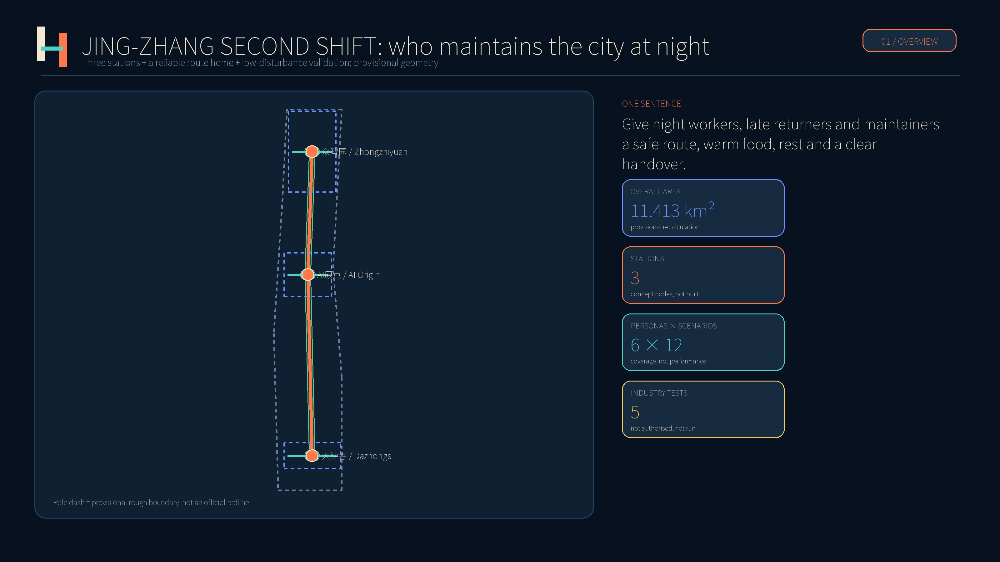
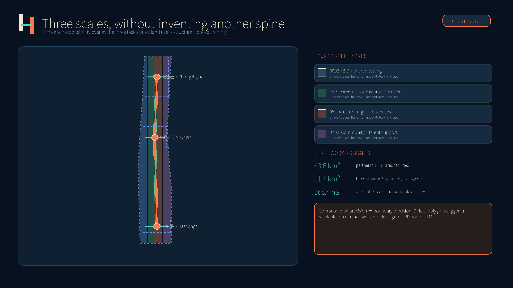
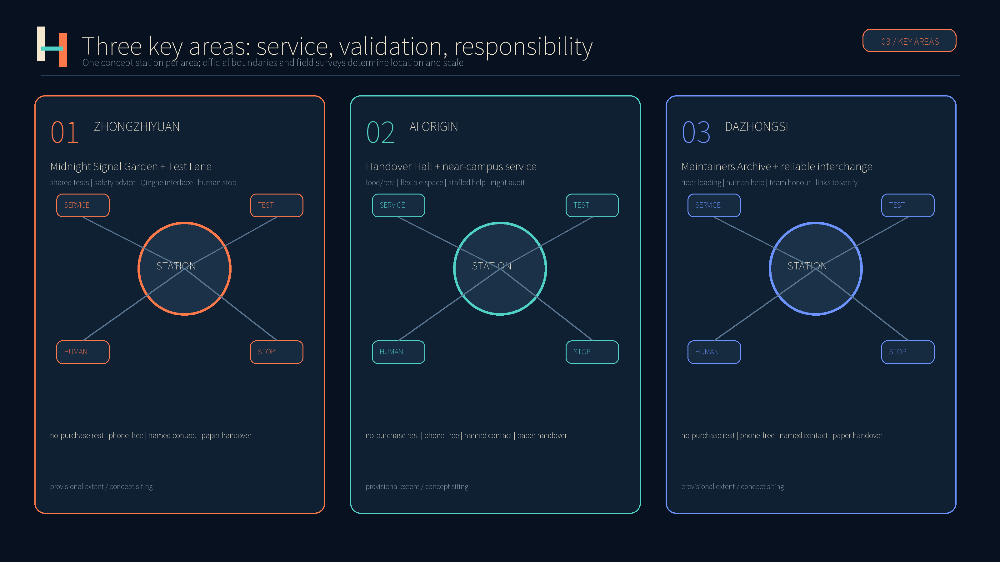
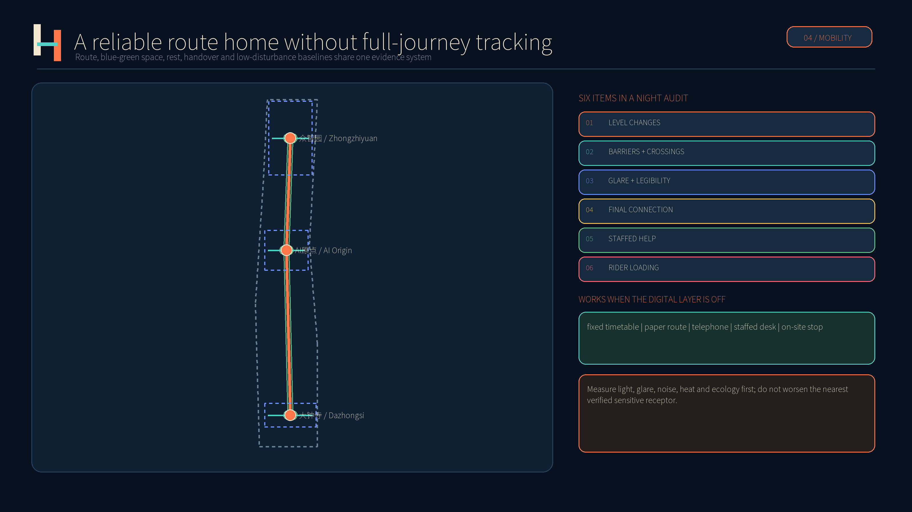
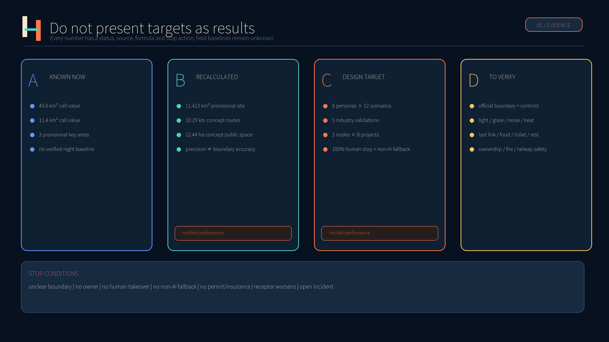

# JING-ZHANG SECOND SHIFT｜京张第二班

> Give night workers, late returners and city maintainers a safe way home, a warm meal, a place to rest and a clear handover after normal office hours.

Every spatial layout, project quantity and operating arrangement in this submission is a **conceptual recommendation for further development by professional teams**. It is not statutory planning, a construction commitment, an official site selection or an approved scheme. Implementation requires official boundaries, planning controls, ownership, transport, railway safety, fire safety, ecology, noise, lighting and field surveys.

## Design Basis and Source List

The official call and the agent taskbook define the assignment. The proposal also reads the site package, source registry, processed fact pack, enums, planning limits, standard snapshots and requirements for nine geometry layers [source:OFFICIAL-ANNOUNCEMENT] [source:AGENT-TASKBOOK] [source:SOURCE-REGISTRY]. The call states approximately 43.6 km² for coordinated research, 11.4 km² for overall design and 368.4 ha for the three key areas. These values describe task scale and do not replace official polygons.

The repository currently contains no trusted official polygon for the overall area or three key areas. This package therefore retains the provisional geometry. Its recalculated site area is 11.413 km². The decimal places are computational, not surveying accuracy, and the boundary is visually de-emphasised with a pale dashed line [data:geometry/site_boundary.geojson#SITE-001] [metric:site_area_sqm]. Once official polygons arrive, land use, roads, buildings, green space, public space, phasing, metrics, figures, PDFs and HTML must all be recalculated, rather than replacing a background alone [depth:existing_conditions_diagnosis].

Evidence uses four statuses: official announced values; recalculations from provisional geometry; proposal-defined targets; and baseline items still to be measured. Verified night footfall, shift times, lighting, glare, noise, heat, last-mile links, food, toilets, rest and fault response are unavailable, so none is presented as an existing fact. Missing planning controls, ownership, road redlines, utilities, heritage, fire and railway-safety conditions are logged in `assumptions.json` and act as stop conditions for further work [standard:PROJECT-OFFICIAL-ANNOUNCEMENT].

## Three-Level Scope Framework

Second Shift does not draw another spatial spine. It adds a time-and-responsibility layer to the three official task scales. The coordinated scale asks who co-operates and carries night-time public obligations; the overall-design scale organises service nodes, walking links, concept zoning and renewal projects; the key-area scale specifies who owns each station, route and pilot, when it stops and how it is accepted. Its test is simple: innovation proposed in the daytime must remain maintainable at night [depth:three_level_scope_framework] [standard:PROJECT-AGENT-OPEN-CALL-TASKBOOK].

| Level | Call scale | Second Shift answer | Evidence status |
| --- | --- | --- | --- |
| Coordinated research | approx. 43.6 km² | A corridor partnership among universities, estates, firms, communities, maintenance and public services; shared labs and an annual problem list. | Official text value; no official polygon and no new precise boundary. |
| Overall design | approx. 11.4 km² | Three service stations, a reliable route home, a low-disturbance blue-green belt and eight renewal projects. | 11.413 km² from provisional geometry; discussion only. |
| Key areas | approx. 368.4 ha total | One station per area for testing, handover, rest, food, help and public explanation. | All three rectangles are provisional, not parcels or road redlines. |

The identity uses two parallel lines and a short handover bar. The first line remains open and the second continues: shifts may change, responsibility does not stop. The mark also resembles a simplified railway and pause symbol. Deep indigo signals night-time stability, warm white legibility and safety orange only human help and stop actions. It avoids gears, robot faces, surveillance eyes and flashing; Chinese and English have equal visual weight [source:AGENT-TASKBOOK].

## Coordinated Research Area: Industry and Future City Research

The industry strategy links space, translation, validation, public adoption and night maintenance. Shared labs, small flexible leases, a regulatory coordination desk and a public problem list lower entry barriers for small firms. Independent safety and data review turns real-city settings into time-limited, bounded and stoppable tests. Public-service procurement is discussed only after a baseline, a non-AI comparison and human review. Night workers join co-design as paid work, not unpaid “experience” [depth:overall_spatial_structure] [source:COMMUNITY-ISSUE-1061].

The eight cases below are mechanism comparisons only. The proposal copies none of their maps, renderings, photographs, logos or wording and does not assume their land, finance, university, regulatory or corporate conditions transfer directly. Links, publishers, uses and rights are recorded in `sources.json`.

| Case | Transferable mechanism | Boundary for Jing-Zhang |
| --- | --- | --- |
| Kendall Square | Small units, short leases and shared facilities protect start-ups from displacement | Mechanism paraphrased and independently redrawn; no copied form, imagery or identity. [source:KENDALL-INNOVATION-SPACE] |
| Paris-Saclay | A developer, university and innovation-place network manage real-city demonstrations | Mechanism paraphrased and independently redrawn; no copied form, imagery or identity. [source:PARIS-SACLAY-INNOVATION] |
| one-north | Modular space, flexible leases and one-stop cross-estate testing | Mechanism paraphrased and independently redrawn; no copied form, imagery or identity. [source:ONE-NORTH-LAUNCHPAD] |
| Seoul DMC | Public infrastructure first, open ground floors and industry co-operated living-lab streets | Mechanism paraphrased and independently redrawn; no copied form, imagery or identity. [source:SEOUL-DMC-POLICY] |
| Tsukuba | Regulatory coordination, privacy impact assessment and time-limited reversible pilots | Mechanism paraphrased and independently redrawn; no copied form, imagery or identity. [source:TSUKUBA-SCIENCE-CITY] |
| Eindhoven HTCE | Shared expensive labs with professional community managers | Mechanism paraphrased and independently redrawn; no copied form, imagery or identity. [source:EINDHOVEN-HTCE] |
| London Knowledge Quarter | Partnership agreements, fees and annual metrics coordinate fragmented ownership | Mechanism paraphrased and independently redrawn; no copied form, imagery or identity. [source:LONDON-KQ2050] |
| Toronto MaRS + Vector | A mixed innovation hub plus an independent AI institute connect research, firms and adoption | Mechanism paraphrased and independently redrawn; no copied form, imagery or identity. [source:TORONTO-MARS-VECTOR] |

The combined mechanism uses Kendall and one-north for small flexible space; Eindhoven for shared expensive facilities and community managers; Tsukuba for regulatory, privacy and time-limited trials; London KQ for partnership across fragmented ownership; Seoul for open ground floors and public street tests; and Toronto and Paris-Saclay for research-to-adoption networks. Success is whether night users receive more reliable service, not screen counts, model calls or event attendance [source:LONDON-KQ2050] [source:TSUKUBA-SCIENCE-CITY].

The future-city unit is a service with a person ready to take over, not an unattended pod. AI may assist prediction, scheduling and anomaly screening, while named people decide fares, penalties, denial of service, work schedules, dismissal, maintenance closure and emergency judgement. Every digital service keeps a phone, paper, fixed timetable or staffed desk. If the digital layer is off, the essential service remains [standard:MOHURD-URBAN-DESIGN-MEASURES].

## Overall Design Area: Urban Renewal and Regulatory-Plan-Level Urban Design

The concept is organised as three stations, one route, one low-disturbance belt and eight projects, without claiming an approved plan. Stations sit near the centres of the three provisional key areas only to test capacity and relationships. The route links late-return movement, interchange and staffed help. The belt places walking, green space, public space and night-environment baselines in one system. Eight projects name owners, beneficiaries and acceptance [data:geometry/roads.geojson#ROAD-NIGHT-001] [depth:overall_spatial_structure].

`land_use.geojson` fully covers the provisional site with four shared-edge concept zones: R&D and shared testing; green and open space; industry and night-life services; and community and talent support. It is not statutory land use, ownership, development permission or demolition scope. Six small footprints in `buildings.geojson` test only the capacity relationship between stations and food/handover support. Adaptive reuse is preferred; there is no building-by-building decision before a verified existing-building survey [data:geometry/land_use.geojson#LU-001] [data:geometry/buildings.geojson#BLDG-STATION-001].

Regulatory-plan-level discipline separates known, proposed and unconfirmed information. Site area and concept green/public-space geometry are recalculable; stations, routes and projects are proposals; FAR, height, building density, setbacks, road redlines, parking, facility standards, total floor area, ownership, utilities, fire, heritage and railway distances remain unknown. Unknown metrics keep `value=null` rather than invented precision [standard:MOHURD-CONTROL-DETAILED-PLANNING] [metric:floor_area_ratio].

Renewal proceeds service first, testing second, construction last. Start with night audits, opening hours and named owners. Use movable seating, water, lighting mock-ups, staffed help and separated tests for small-scale validation. Permanent construction is considered only after official boundaries, ownership, regulation, insurance, fire safety, budget and professional review. Built form should provide continuous active ground floors, legible entries, visible staffed windows and no glare or flashing; specific form and height follow official design and heritage controls [depth:development_intensity_controls].

## Detailed Design of Key Areas

The three rectangles are repository-provided provisional extents used only to place tasks, scenarios and implementation dependencies in one package; they are not precise siting, approval or area evidence [data:geometry/key_areas.geojson#PROV-KEY-001] [metric:key_area_count]. Each conceptual station includes no-purchase rest, water, charging, toilet information, staffed help, a paper route, a handover notice and pilot explanation. Existing-space adaptive reuse comes first.

**Zhongzhiyuan AI Independent Innovation Acceleration Area: Midnight Signal Garden and Low-disturbance Test Lane.** Shared testing and standards/safety advice meet low-disturbance open space toward the Qinghe context. Industry validation stays on separated routes or dedicated rigs with a named safety owner, on-site stop, incident report and authorised restart, never live railway control. A public ground floor explains tests while serving staff rest and resident notice. Water, flood, ecology and external transport remain to be verified [data:geometry/key_areas.geojson#PROV-KEY-001] [source:AGENT-TASKBOOK].

**Beijing AI Origin Community: Handover Hall and near-campus shared service.** The station serves late researchers, students, start-ups and maintainers. Handover Hall shows one service from detection and assignment to action and verification, with warm food, phone-free access, short-lease collaboration and IP/regulatory advice. A night walk identifies campus, estate and station barriers without pre-drawing a new road. Campus data and research outputs require separate permission. Existing buildings, ownership and structure are checked before retention, repair or small infill [data:geometry/key_areas.geojson#PROV-KEY-002] [depth:three_key_area_detailed_design].

**Dazhongsi AI Industry Cluster: Archive of Everyday Maintainers and reliable interchange home.** Late interchange, courier loading, food/water, staffed help and company-facing display share a walkable frontage. The archive records team methods in cleaning, repair, care and delivery only by opt-in, without mandatory naming or productivity ranking. Four-quadrant links, station integration, junction works and opening hours require transport, railway, ownership, fire and operator surveys [data:geometry/key_areas.geojson#PROV-KEY-003] [standard:PROJECT-OFFICIAL-ANNOUNCEMENT].

## AI Innovation Ecosystem, Personas, and AI+ Scenarios

Personas are task simulations, not behavioural profiles of real people. Cleaners, maintainers, riders, carers, residents and small firms sit beside research talent. Acceptance asks whether a night task can be completed and whether a person can be found after failure; the count of scenario cards is not an operating result [source:AGENT-TASKBOOK] [depth:existing_conditions_diagnosis].

| Persona | Night task | Acceptance rule |
| --- | --- | --- |
| 周妍 / Zhou Yan | 28-year-old engineer leaving at 23:30; needs reliable last-mile travel and help without excessive data collection. | At least one staffed, telephone, paper-sign or fixed-timetable route; no personal-profile pricing, scheduling or punishment. |
| 马师傅 / Mr Ma | 47-year-old maintainer; needs clear hazards, previous actions and stop-work authority. | At least one staffed, telephone, paper-sign or fixed-timetable route; no personal-profile pricing, scheduling or punishment. |
| 李春梅 / Li Chunmei | 52-year-old cleaning lead; needs no-purchase seating, water, charging, toilets and human-confirmed schedules. | At least one staffed, telephone, paper-sign or fixed-timetable route; no personal-profile pricing, scheduling or punishment. |
| 阿迪力 / Adil | 33-year-old rider; needs safe loading and warm food without opaque speed pressure. | At least one staffed, telephone, paper-sign or fixed-timetable route; no personal-profile pricing, scheduling or punishment. |
| 孙姨 / Aunt Sun | 64-year-old resident; needs level routes, low glare/noise and staffed help without a smartphone. | At least one staffed, telephone, paper-sign or fixed-timetable route; no personal-profile pricing, scheduling or punishment. |
| 林乔 / Lin Qiao | 36-year-old small-firm test lead; needs affordable trials with clear boundaries, approval, stop and incident rules. | At least one staffed, telephone, paper-sign or fixed-timetable route; no personal-profile pricing, scheduling or punishment. |

Five of the twelve scenarios are industry tests. Each registers purpose, boundary, owner, data, risk, stop condition, rollback and non-AI comparison. Without formal approval its state is “not authorised, not run”; a desk exercise is never a field result. Every digital scenario retains a human or non-smartphone route [standard:PROJECT-AGENT-OPEN-CALL-TASKBOOK].

| ID and scenario | Type | Purpose and boundary | Non-AI fallback |
| --- | --- | --- | --- |
| 01 Late-return route | Public service | Uses verified lighting, works, accessibility and connection information without full-journey tracking. | Paper map + staffed help |
| 02 Last-mile connection | Public service | Shows alternatives from published schedules and staff confirmation; operators control dispatch and fares. | Fixed timetable + phone |
| 03 Warm-meal window | Public service | Uses aggregate demand to prepare food and reduce waste; no identity-based pricing. | On-site menu + cash |
| 04 Rest-point status | Public service | Shows seating, water, toilets and charging; on-site signs take priority. | Fixed signs + staff |
| 05 Handover assistant | Public service | Organises authorised records into done, pending and next contact; cannot auto-close. | Paper handover log |
| 06 Multilingual night help | Public service | Assists translation for routes, medical and police information; high-risk requests transfer to a person. | Phone interpreter + desk |
| 07 Low-disturbance notice | Public service | Flags possible noise or glare using verified works, event and equipment schedules. | Notice board + hotline |
| T1 Closed low-speed delivery robot test | Industry validation | Tests obstacle avoidance, takeover and noise only on separated routes and defined hours; no open-road use. | Human trolley baseline |
| T2 Facility fault-warning sandbox | Industry validation | Uses synthetic, de-identified or dedicated rigs to test false and missed alerts; qualified staff decide repairs. | Scheduled manual inspection |
| T3 Privacy-preserving footfall estimation | Industry validation | Compares manual samples, non-imaging sensing and edge processing; outputs time-banded totals only. | Manual sample counts |
| T4 Night lighting and wayfinding validation | Industry validation | Older, low-vision and night-shift users blind-test glare, legibility and wrong turns; model suggestions are field-checked. | Physical mock-up comparison |
| T5 Emergency communication interoperability drill | Industry validation | Tests multilingual prompts, human escalation, offline operation and logs without connecting to live emergency systems. | Paper procedure + radio |

The three pilgrimage/honour nodes are **Handover Hall**, which reveals a complete service handover and keeps staffed hours; the **Archive of Everyday Maintainers**, which displays opt-in team contributions without mandatory naming or individual ranking; and **Midnight Signal Garden**, where low-brightness, low-noise physical signals explain running, maintenance and paused states. Honour belongs to the people who keep the city usable, not to equipment as monument [depth:three_key_area_detailed_design].

## Land Use, Building Scale, and Retain-Renovate-Demolish Strategy

Concept land use retains public national classification codes, and four polygons share edges and cover the provisional site without gaps [standard:MNR-LAND-USE-CLASSIFICATION-GUIDE]. Code `0802` frames R&D and shared testing, `1401` park and low-disturbance open space, `05` industry and night-life services and `0702` community and talent support. Areas can be recalculated, but absent official controls and base data they compare structure only, not supply or construction entitlements [data:geometry/land_use.geojson#LU-001].

Buildings follow survey, classification, review and decision. A register first covers age, structural safety, use, ownership, fire, accessibility, energy, heritage and night noise. Assets are then classified as retain first, adaptive renewal, local intervention or pending professional review. Any demolition must explain public interest, alternatives, material reuse and affected users. Six footprints total about 16956 m² only as capacity tests, not existing buildings, approved scale or demolition decisions [data:geometry/buildings.geojson#BLDG-STATION-001] [metric:building_footprint_area_sqm].

Stations should first reuse existing ground floors, gatehouses, estate service centres or vacant support rooms. They need legible entries, visible staffed windows, step-free or equivalent accessible paths, no-purchase seating, water, quiet edges and separate back-of-house movement. Food windows require food safety, exhaust, waste and rider loading; handover workshops require occupational safety and equipment separation. Height, floor area, FAR, density, setbacks, parking, daylight and fire remain subject to official controls and professional design [depth:height_massing_character] [depth:retain_renovate_demolish].

Character avoids imitation historic stations and technological spectacle by screens. Durable, repairable, replaceable parts use deep-indigo information fields, warm-white text and safety-orange human help. Night signs do not flash and offer physical text, tactile or high-contrast alternatives. Heritage authenticity, extent and repair methods await professional investigation; no date or event is invented.

## Transport, Rail, Municipal Infrastructure, and Public Services

Transport begins with real night tasks. Workers, residents, accessibility representatives, transport staff and property operators walk every pilot route after dark, recording level changes, barriers, glare, crossings, sightlines, staffed help, final connections and cycle/loading space. Every defect receives an owner, deadline and closure evidence. `ROAD-NIGHT-001` and three cross-links are conceptual relationships, not existing roads, railway, approved redlines or navigation [data:geometry/roads.geojson#ROAD-NIGHT-001] [depth:traffic_rail_slow_parking].

Station integration first makes the system understandable, available and recoverable. Published final-service information is staff-verified and supported by fixed timetables, paper and telephone. Field review identifies safe short stays for riders, maintenance vehicles and accessible pickup. Failed interchange reveals a named operator contact. Algorithms cannot autonomously alter fares, restrict passage or dispatch live trains, and robots never enter open roads or live railway safety systems [source:OFFICIAL-ANNOUNCEMENT].

Municipal and digital infrastructure is minimum-necessary. Stations need water, toilet information, charging, emergency light, communication and paper procedures that work offline. Sensing uses non-imaging or edge aggregation only for a stated purpose and retains no identifiable route. Fault warnings start with synthetic, de-identified or dedicated rigs; qualified staff decide repairs. Energy, drainage, exhaust, waste, fire, accessibility, network, railway distance and underground utilities remain preconditions [depth:municipal_new_infrastructure].

## Blue-Green Network, Public Space, and Urban Character

Blue-green design starts with a joint baseline, not invented decibel or illuminance targets. Surveys cover day/night, weekday/weekend, seasons and nearest sensitive receptors: illuminance, uniformity, glare, noise, heat, ecology, walking safety and user experience. A project must meet applicable safety standards without worsening the verified nearest-sensitive-receptor baseline. The repository lacks statutory green, water, ecology and flood boundaries, so the layer communicates continuity and low-disturbance intent only [data:geometry/green_space.geojson#GREEN-SECOND-SHIFT-001] [depth:blue_green_public_space].

Three concept public spaces total roughly 12.44 ha and carry signal education, handover display and the maintainer archive. This is a circular capacity test, not an existing-space statistic. Public space offers no-purchase seating, phone-free use, staffed help, quiet edges, clear closing and resident complaints. Night vitality is not longer hours or more noise; low-disturbance tests stay within defined time and space [data:geometry/public_space.geojson#PUBLIC-STATION-001] [metric:public_space_ratio].

The cultural narrative uses the plain work language of handover, signals, maintenance and timing. Jing-Zhang is about more than departure; one shift hands lines, equipment and the city to the next. The proposal neither copies historic buildings nor invents history nor turns workers into décor. Zhongguancun open-source culture becomes public problems and reviewable methods; AI culture means a person receives every machine suggestion, failure can be explained and responsibility continues. Heritage inventory, authenticity, integrity and reuse await professional investigation [standard:MOHURD-URBAN-DESIGN-MEASURES].

## Renewal Projects, Implementation Policy, and Phasing

Eight projects name proposed owners, direct beneficiaries and acceptance. Role combinations do not indicate institutional commitment. Before initiation, each project adds ownership, permit, budget range, procurement, insurance, labour, safety, data, fire, ecology and exit arrangements [depth:renewal_project_list] [source:COMMUNITY-ISSUE-1061].

| Project | Proposed owner | Main beneficiaries | Acceptance |
| --- | --- | --- | --- |
| P01 Three Second Shift Stations | Local public-service lead + venue operator | Night workers, late returners, residents | All three concept pilots publish hours, human contacts and phone-free access. |
| P02 Reliable Route Home | Transport, local-service and property group | Late returners, older and disabled users | Every pilot route gets a human after-dark audit; each issue has an owner and closure record. |
| P03 Warm Food and Water Windows | Licensed vendors + operator | Night workers and riders | Publish price, hours, permit and surplus handling; no identity pricing. |
| P04 No-purchase Rest Points | Venue operator + worker/community partner | Cleaners, guards, couriers, carers | Provide seating, water, charging and toilets without purchase or app. |
| P05 Handover Workshop | Facilities maintenance consortium | Maintenance teams and site users | Orders record source, time, owner, risk, action and verification; AI cannot auto-close. |
| P06 Low-disturbance Test Lane | Sandbox operator + independent reviewer | Small firms, researchers, residents | At least four industry validations, each with boundary, hours, human stop, rollback and incident report. |
| P07 Darker and Quieter Edge | Landscape, lighting, ecology and resident group | Residents, nocturnal wildlife, night workers | Measure first; do not worsen sensitive receptors and meet applicable safety standards. |
| P08 Second Shift Public Ledger | Governance board + third-party auditor | All public users | Publish status, data notes, model cards, complaints, incidents and corrections while protecting sensitive data. |

Phasing is not the call's 100-day submission period. **Near term** conducts baseline surveys, co-audits and movable station prototypes in three areas, reporting only measured or unmeasured. **Medium term** opens the test lane and reliable route only after permission, insurance and safety review, publishing the non-AI comparison, complaints and incidents. **Long term** adjusts permanent space to official boundaries, regulatory plans and urban-renewal implementation. The three geometry phases are conceptual work areas, not investment commitments or construction dates [data:geometry/phasing.geojson#PHASE-001] [depth:phasing_implementation].

A proposed Second Shift Governance Table includes night workers, residents, accessibility representatives, small firms, site operators, maintenance, safety and data protection. Any on-site worker may pause a pilot for safety; restart needs a named owner. Complaints work on site, by phone and on paper. Daily Two-minute Handover, weekly Walk the Night Route, monthly Open Maintenance Day, quarterly Low-disturbance Test Night and an annual Handover Festival recognise team contribution without ranking individual speed [source:AGENT-TASKBOOK].

## Metrics, Area Recalculation, and Compliance Matrix

Metrics fall into four groups: geometry recalculations test internal package consistency; design targets state intent; baselines identify what decision-makers must learn; and operating results appear only after a real pilot. Persona, scenario and node counts are coverage, not impact. No field pilot has occurred, so improvements in complaints, failures, response time, independent completion, accessible detour, energy or satisfaction are not claimed [depth:metrics_recalculation].

| Metric | Status | Value/expression | Meaning |
| --- | --- | --- | --- |
| Overall site area | Provisional geometry recalculation | 11412825.386 m² | Computational precision is not boundary precision; recalculate when official polygons arrive. |
| Concept building footprint | Design geometry recalculation | 16956.000 m² | Six capacity-test footprints, not approved scale. |
| Concept green ratio | Design geometry recalculation | 0.086638 | Low-disturbance continuity intent, not statutory green ratio. |
| Concept public-space ratio | Design geometry recalculation | 0.010904 | Three concept nodes, not an existing-condition statistic. |
| Concept route length | Design geometry recalculation | 10293.2 m | Submission geometry length only; not navigation or quantity surveying. |
| FAR/height/density/setback | Unconfirmed | unknown | Official controls, ownership and engineering conditions are absent. |

Design targets are six personas, twelve scenarios with five industry validations, three honour nodes and eight projects; 100% human after-dark audit for pilot routes; at least one phone-free route for 100% of pilot public services; and human stop, data note, incident report and rollback for 100% of pilots. There is no facial recognition, personal movement ranking or AI-only punishment, dismissal, denial of service or maintenance closure. These are future acceptance rules, not current performance [metric:scenario_count] [metric:industry_validation_scenario_count].

`compliance_matrix.json` covers 17 official requirements plus agent.1–agent.6; `standard_matrix.json` covers five mandatory standards; `design_depth_matrix.json` covers fifteen depth items; and repository scripts persist deterministic, spatial, visual and professional-evidence gates in `self_check.json`. A machine pass means package consistency and review readiness only—not official boundaries, professional approval, field validity or implementation authority [standard:PROJECT-OFFICIAL-ANNOUNCEMENT].

## Risk, Copyright, and Compliance

The principal spatial risk is misalignment between provisional geometry and the real site. All positions, areas and routes require recalculation when official boundaries arrive. Without existing buildings, roads, rail, water, utilities, heritage, ownership and night baselines, the proposal makes no precise engineering or statutory claim. High-risk scenarios use synthetic, de-identified or dedicated rig data only in separated settings. Real public services require impact assessment, permission, insurance, human review, appeal, deletion, exit and restoration [source:BOUNDARY-SOURCE] [depth:risk_missing_data].

Digital service follows data minimisation and non-AI equivalence: no facial recognition, identifiable full-route retention, identity pricing, model-decided worker scheduling/punishment/dismissal or automatic work-order closure. Worker participation is paid work or compensatory leave. Any on-site worker may pause for safety and a named owner approves restart. Without a smartphone, network or model, fixed signs, paper procedures, telephone and staffed desks remain [source:COMMUNITY-ISSUE-1061].

Chinese and English proposal Markdown, report HTML, static visual, A3 booklet, A0 boards and all five text-bearing figures are paired. English is a complete equivalent translation. Every graphic is independently drawn from repository provisional geometry; no external case map, image, rendering, logo or long text is copied. Typesetting uses Noto Sans SC under SIL Open Font License 1.1; the font file is not redistributed. Rights and restrictions are recorded in `sources.json` and `report/copyright_statement.md` [source:NOTO-SANS-SC].

The submission license is `COMMUNITY-DISPLAY-ONLY`. The proposal claims no official approval, adopted plan, final ownership, final construction scale, government commitment or field outcome and does not control live railway, emergency or public-safety systems. `ready_for_review` means only that readable outputs, bilingual pairs and repository self-checks are complete for community and professional review.

## References

- Beijing Municipal Commission of Planning and Natural Resources, Haidian Branch, official Centennial Jing-Zhang AI Innovation Belt call [source:OFFICIAL-ANNOUNCEMENT].
- Repository `agent_taskbook.json`, `design_brief.json`, `allowed_design_space.json`, enums, planning limits, standard snapshots and provisional geometry [source:SITE-PACKAGE] [source:AGENT-TASKBOOK].
- Repository source registry, fact pack and missing-data checklist, used as navigation and usability records rather than new authority [source:SOURCE-REGISTRY] [source:PROCESSED-FACT-PACK].
- MOHURD urban-design and regulatory-planning materials and the MNR land-use-classification page snapshot, with use boundaries in the standard matrix [standard:MOHURD-URBAN-DESIGN-MEASURES] [standard:MNR-LAND-USE-CLASSIFICATION-GUIDE].
- Global mechanisms: Kendall Square, Paris-Saclay, one-north, Seoul DMC, Tsukuba, High Tech Campus Eindhoven, London Knowledge Quarter and Toronto MaRS/Vector. `sources.json` records links and rights; facts are paraphrased and diagrams independently redrawn.
- Community issue #1061 informs the response to jargon, pretend fieldwork and missing accountability; it is not treated as official fact [source:COMMUNITY-ISSUE-1061].
- Noto Sans SC and SIL Open Font License 1.1 [source:NOTO-SANS-SC]. All external sources were accessed 2026-08-11.
