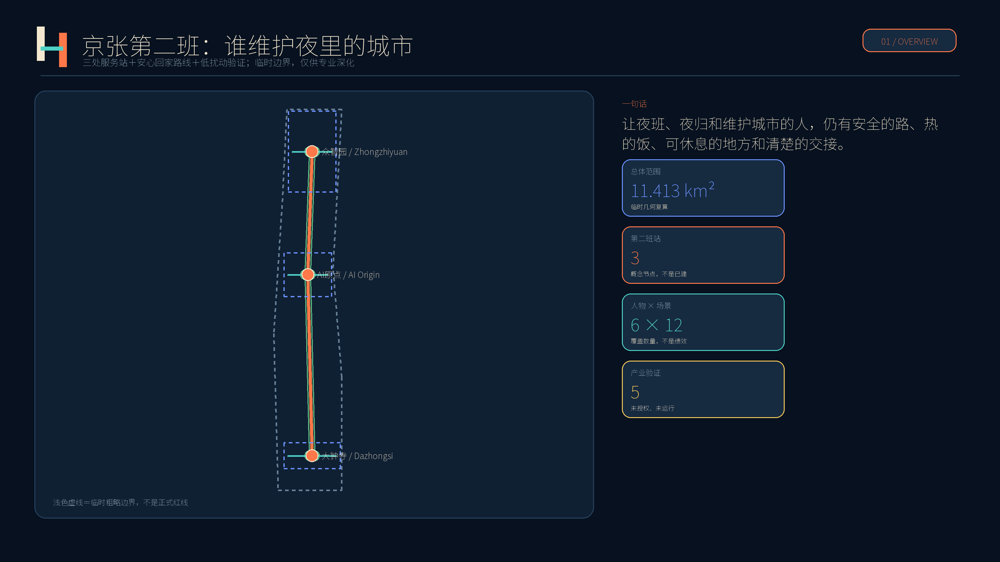
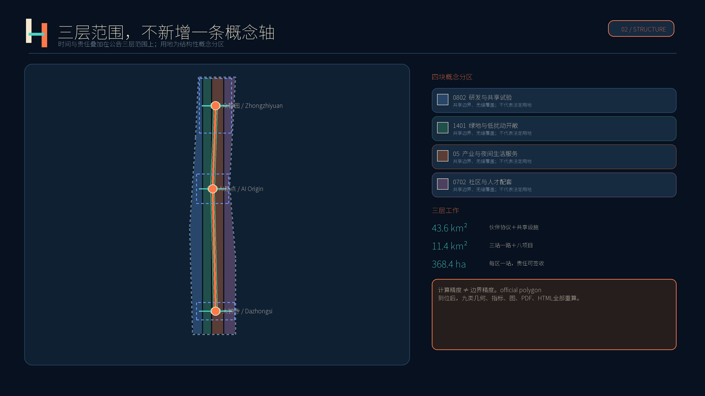
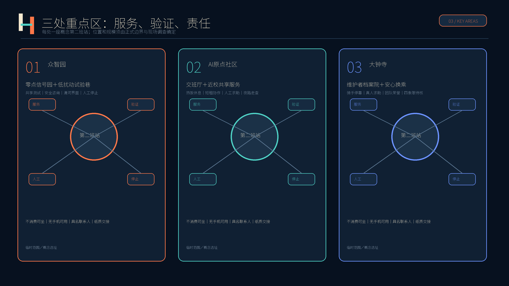
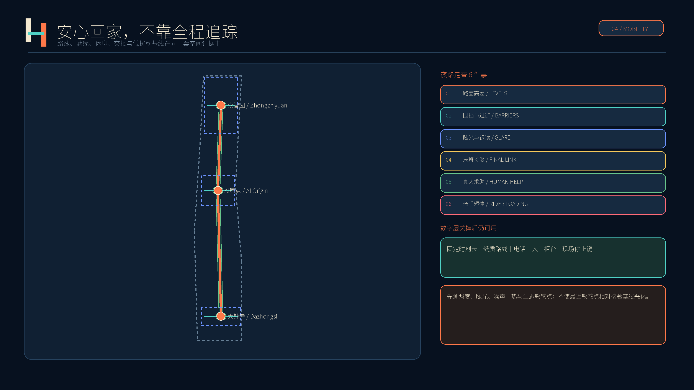
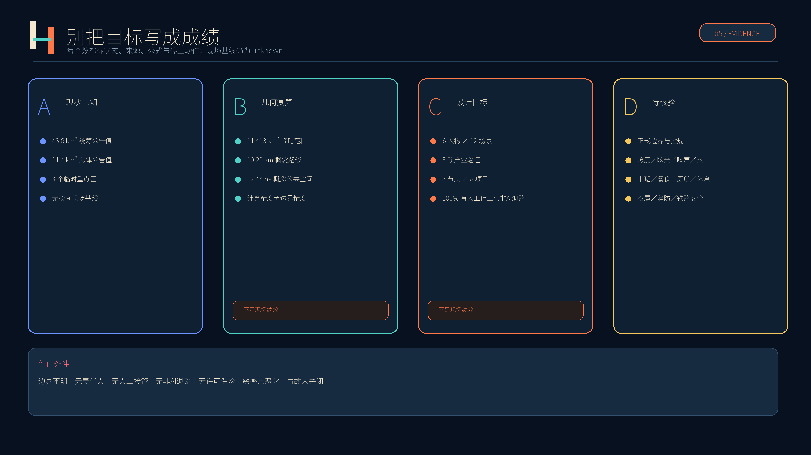

# 京张第二班｜JING-ZHANG SECOND SHIFT

> 让夜班、夜归和维护城市的人，在下班之后仍有安全的路、热的饭、可休息的地方和清楚的交接。

本方案所有空间布局、项目数量与运营安排均为**供专业团队深化的概念性建议**，不代表法定规划、建设承诺、官方选址或已批准方案。实施前须以正式边界、控规、权属、交通、铁路安全、消防、生态、噪声、照明及现场调查为准。

## 设计依据与资料清单

方案以官方征集公告与面向智能体任务书为任务依据，读取场地包、来源登记、处理后事实包、枚举、规划限制、标准快照与九类几何要求 [source:OFFICIAL-ANNOUNCEMENT] [source:AGENT-TASKBOOK] [source:SOURCE-REGISTRY]。公告公布统筹研究范围约43.6平方公里、总体设计范围约11.4平方公里，三处重点区域合计约368.4公顷；这些公告值用于任务尺度说明，不替代官方图形边界。

仓库目前没有可信的正式总体范围和三处重点区域 polygon。提交沿用 `provisional_boundaries.geojson` 形成临时粗略几何：基于该几何复算的总体范围为 11.413 平方公里。其小数位来自计算过程，不代表测绘精度；图中用浅色虚线退后表达 [data:geometry/site_boundary.geojson#SITE-001] [metric:site_area_sqm]。一旦官方 polygon 到位，必须整体重算用地、道路、建筑、绿地、公共空间、分期、指标、图件、PDF 与 HTML，而不是只换底图 [depth:existing_conditions_diagnosis]。

证据按四种状态管理：①官方公告数值；②基于临时几何的可复算值；③本方案自设目标；④尚无基线的待核验事项。现状夜间人流、换班时刻、照度、眩光、噪声、热环境、末班接驳、餐食、厕所、休息点、故障响应均未取得，因此不写成现状结论。缺失的控规、权属、道路红线、市政、文保、消防与铁路安全条件在 `assumptions.json` 登记，并作为下一阶段的停线条件 [standard:PROJECT-OFFICIAL-ANNOUNCEMENT]。

## 三层范围工作框架

“第二班”不是再画一条新的空间主轴，而是在公告三层范围上增加一个时间与责任层：统筹层回答谁共同运营、谁承担夜间公共利益；总体设计层回答服务节点、慢行联系、功能分区与更新项目如何协同；重点区层回答每一处站、路线和试验由谁负责、何时停止、怎样验收。它以“白天提出的创新，夜里也经得起维护”为判断标准 [depth:three_level_scope_framework] [standard:PROJECT-AGENT-OPEN-CALL-TASKBOOK]。

| 层级 | 公告尺度 | 第二班回答 | 证据状态 |
| --- | --- | --- | --- |
| 统筹研究 | 约43.6 km² | 高校、园区、企业、社区、运维与公共服务组成廊道伙伴协议；共享实验设施和年度问题清单。 | 官方面积文字；无官方 polygon，不新增精确红线。 |
| 总体设计 | 约11.4 km² | 以三处服务站、安心回家路线、低扰动蓝绿带和八个更新项目形成概念网络。 | 临时几何复算 11.413 km²；仅供讨论。 |
| 重点区域 | 合计约368.4 ha | 每区一处第二班站，分别承载测试、交接、休息、热饭、求助和公众解释。 | 三处矩形均为临时粗略范围，不是地块或道路红线。 |

Logo由两条平行线与一段交接横线组成：左线未闭合、右线接续，表示班次可以更换，责任不能中断；也像简化铁路与暂停符号。深靛蓝代表夜间稳定，暖白保证易读，安全橙只标人工求助与停止动作。它不使用齿轮、机器人头像、监控眼或动态闪烁；中英文保持同级 [source:AGENT-TASKBOOK]。

## 统筹研究范围产业与未来城市研究

产业策略由“空间、转化、验证、公共采用、夜间维护”五段组成。共享实验室、小单元短租、法规协调窗口和公共问题清单降低小企业进入成本；独立安全与数据保护审查把真实城市场景变成有限时、有限地、可停止的试验；公共服务采购只在完成基线、非AI对照和人工复核后讨论。夜班人员作为共同设计者并计入工时，不能以志愿体验替代劳动 [depth:overall_spatial_structure] [source:COMMUNITY-ISSUE-1061]。

下列八个案例只用于机制比较。方案未复制其地图、效果图、照片、Logo或文字，也不假设其土地、财政、大学、监管和企业条件可直接移植。完整链接、发布者、用途与权利边界登记在 `sources.json`。

| 案例 | 可转化机制 | 京张转译边界 |
| --- | --- | --- |
| Kendall Square | 小单元、短租约、共享设施，防止初创团队被大租户挤出 | 只转述机制并自行重绘；不复制形态、图像或标识。[source:KENDALL-INNOVATION-SPACE] |
| Paris-Saclay | 开发机构、大学与创新场所网络共同管理真实城市示范 | 只转述机制并自行重绘；不复制形态、图像或标识。[source:PARIS-SACLAY-INNOVATION] |
| one-north | 模块化空间、灵活租约和跨园区试验的一站式运营 | 只转述机制并自行重绘；不复制形态、图像或标识。[source:ONE-NORTH-LAUNCHPAD] |
| Seoul DMC | 公共设施先行、底层开放和企业参与运营的生活实验街道 | 只转述机制并自行重绘；不复制形态、图像或标识。[source:SEOUL-DMC-POLICY] |
| Tsukuba | 法规协调、隐私影响评估、限期且可撤回的城市试验窗口 | 只转述机制并自行重绘；不复制形态、图像或标识。[source:TSUKUBA-SCIENCE-CITY] |
| Eindhoven HTCE | 共享昂贵实验设施，并由专业社区经理促成协作 | 只转述机制并自行重绘；不复制形态、图像或标识。[source:EINDHOVEN-HTCE] |
| London Knowledge Quarter | 多产权条件下以伙伴协议、会费与年度指标协同 | 只转述机制并自行重绘；不复制形态、图像或标识。[source:LONDON-KQ2050] |
| Toronto MaRS + Vector | 综合创新空间与独立AI转化机构连接研究、企业和公共采用 | 只转述机制并自行重绘；不复制形态、图像或标识。[source:TORONTO-MARS-VECTOR] |

组合后的京张机制是：用 Kendall 与 one-north 的灵活小空间服务初创企业；用 Eindhoven 的共享昂贵设施和专业社区经理保证设施被真正使用；用 Tsukuba 的法规、隐私与限期试验窗口管理城市测试；用 London KQ 的伙伴协议协调多产权；用 Seoul 的开放首层与街道试验连接公众；用 Toronto 与 Paris-Saclay 的研究到采用网络形成长期转化。所有场景优先验证“是否对夜间使用者更可靠”，而不是以屏幕数量、模型调用量或活动人次代表创新 [source:LONDON-KQ2050] [source:TSUKUBA-SCIENCE-CITY]。

未来城市的基本单元不是无人值守舱，而是“有人接手的服务”：AI可辅助预测、排程与异常筛查，但票价、处罚、拒绝服务、排班、解雇、维修结单和应急判断必须由具名人员决定。每个数字服务都保留电话、纸质、固定时刻表或人工柜台之一；若数字系统停用，基本服务仍然存在。这一原则同时服务产业可信度、人才日常生活与周边居民权利 [standard:MOHURD-URBAN-DESIGN-MEASURES]。

## 总体设计范围城市更新与控规深度城市设计

总体设计采用“三站、一路、一条低扰动带、八个项目”的概念结构，但不把它包装为审定规划。“三站”分别位于三处临时重点区中心附近，用于容量和关系测试；“一路”连接夜归、接驳和人工求助；低扰动带把慢行、绿地、公共空间和夜间环境基线放在同一张图；八个项目则给出责任主体、受益人和验收方式 [data:geometry/roads.geojson#ROAD-NIGHT-001] [depth:overall_spatial_structure]。

`land_use.geojson` 以四块共享边界的概念分区完整覆盖临时总体范围：研发与共享试验、绿地与开敞空间、产业及夜间生活服务、社区与人才配套。它只用于结构讨论，不能解释为法定用地、权属、开发许可或拆迁范围。`buildings.geojson` 的六个小型概念基底只测试第二班站与热饭/交接配套的容量关系，优先策略是调查后适应性再利用；没有现状建筑普查前，不作逐栋拆改留判断 [data:geometry/land_use.geojson#LU-001] [data:geometry/buildings.geojson#BLDG-STATION-001]。

控规深度的表达纪律是把结果分为“已知、建议、待确认”。总面积、概念绿地与公共空间等可由提交几何复算；三处站、路线和项目为设计建议；容积率、建筑高度、建筑密度、退线、道路红线、停车、设施标准、总建筑规模、权属、市政、消防、文保与铁路安全距离均为待确认。未知指标在 `metrics.json` 保持 `value=null`，不得用固定值造成虚假精度 [standard:MOHURD-CONTROL-DETAILED-PLANNING] [metric:floor_area_ratio]。

更新以“先服务、再测试、后建设”为序：先做夜间走查、开放时间与责任人台账；再以可移动座椅、饮水、照明样板、人工值守和封闭测试完成小规模验证；只有官方边界、权属、法规、保险、消防、预算和专业审查齐备后，才讨论永久建设。建筑体量采用连续首层、清楚入口、可见人工窗口、避开眩光与闪烁的原则，具体高度与形态服从正式城市设计和文保条件 [depth:development_intensity_controls]。

## 重点区域详细设计

三处重点区的矩形边界均为仓库临时粗略范围，只用于把任务、场景和实施依赖放进同一套成果；它们不能作为精确选址、审批或面积结论 [data:geometry/key_areas.geojson#PROV-KEY-001] [metric:key_area_count]。每区的“第二班站”都具备不消费休息、饮水、充电、卫生间信息、人工求助、纸质路线、交接公告和试验说明；实际建筑以既有空间适应性再利用为先。

**众智园AI自主创新加速区：零点信号园＋低扰动试验巷。** 概念上把共享测试、标准/安全咨询与清河方向的低扰动开放空间结合。产业验证只在隔离路段或专用设备进行，设置具名安全负责人、现场停止键、事故报告和恢复批准；不接真实铁路控制。建筑首层设置可参观测试说明与人工窗口，外部空间同时承担员工夜间休息和居民知情沟通。水系、防洪、生态和对外交通均待专业核验 [data:geometry/key_areas.geojson#PROV-KEY-001] [source:AGENT-TASKBOOK]。

**北京AI原点社区：交班厅＋近校共享服务。** 概念上服务深夜研发、高校师生、初创团队和维护人员：交班厅展示一项服务从发现、派单、处置到复核的完整流程；配套热饭、无手机服务、短租协作空间和知识产权/法规咨询。校区、园区和轨道接驳先以夜间步行走查寻找断点，不预设新道路；任何校园数据和科研成果另行授权。建筑策略先查现状、权属与结构条件，再决定保留、修缮或小规模嵌入 [data:geometry/key_areas.geojson#PROV-KEY-002] [depth:three_key_area_detailed_design]。

**大钟寺AI产业聚集区：无名维护者档案院＋安心回家换乘。** 概念上把轨道站周边晚间换乘、骑手停靠、热饭饮水、真人求助和企业公共展示组织到可步行界面。档案院经本人选择记录清洁、维修、照护、配送等团队的方法，不强制实名、不排名劳动速度。四象限连通、站点一体化、路口工程和商业开放时间必须由交通、轨道、权属、消防和运营调查确认 [data:geometry/key_areas.geojson#PROV-KEY-003] [standard:PROJECT-OFFICIAL-ANNOUNCEMENT]。

## AI 创新生态、人才画像与 AI+ 场景

人物画像来自任务推演，不是对真实个人的行为采集。它刻意把保洁、维修、配送、照护、居民和小企业与研发人才放在同一张需求表中；验收关注能否完成夜间任务、失败时能否找到人，而不是把场景卡数量当成运营成绩 [source:AGENT-TASKBOOK] [depth:existing_conditions_diagnosis]。

| 人物 | 夜间任务 | 设计验收 |
| --- | --- | --- |
| 周妍 / Zhou Yan | 28岁算法工程师；23:30离开实验室，需要可靠末班接驳和不过度收集信息的求助。 | 必须有人工、电话、纸质标识或固定时刻表之一；不得以个人画像定价、排班或惩罚。 |
| 马师傅 / Mr Ma | 47岁设施维护员；需要清楚的危险点、上一班处置和现场停机权。 | 必须有人工、电话、纸质标识或固定时刻表之一；不得以个人画像定价、排班或惩罚。 |
| 李春梅 / Li Chunmei | 52岁保洁班组长；需要不消费的座位、饮水、充电、卫生间与人工确认排班。 | 必须有人工、电话、纸质标识或固定时刻表之一；不得以个人画像定价、排班或惩罚。 |
| 阿迪力 / Adil | 33岁配送骑手；需要安全停靠和热饭，不接受不透明评分催赶。 | 必须有人工、电话、纸质标识或固定时刻表之一；不得以个人画像定价、排班或惩罚。 |
| 孙姨 / Aunt Sun | 64岁附近居民；关心高差、眩光、噪声和无手机也可用的真人求助。 | 必须有人工、电话、纸质标识或固定时刻表之一；不得以个人画像定价、排班或惩罚。 |
| 林乔 / Lin Qiao | 36岁小型机器人企业测试负责人；需要负担得起且边界、批准、停止、事故程序清楚的测试场。 | 必须有人工、电话、纸质标识或固定时刻表之一；不得以个人画像定价、排班或惩罚。 |

十二个场景中五个为产业测试与验证。每项都先登记目的、边界、责任人、数据、风险、停止条件、回滚办法与非AI对照；没有正式许可时状态只能是“未授权、未运行”，不能把桌面推演写成现场成绩。所有数字场景都保留至少一种人工或非智能机路径 [standard:PROJECT-AGENT-OPEN-CALL-TASKBOOK]。

| 编号与场景 | 类型 | 用途与边界 | 非AI退路 |
| --- | --- | --- | --- |
| 01 夜归路线 | 公共服务 | 汇总已核验照明、施工、无障碍与接驳信息；不追踪全程位置。 | 纸质图＋真人求助 |
| 02 最后一程接驳 | 公共服务 | 基于公开班次和人工确认提示替代路径；调度、票价由运营人员决定。 | 固定时刻表＋电话 |
| 03 热饭窗口 | 公共服务 | 按匿名总量备餐并减少浪费；不按身份差别定价。 | 现场菜单＋现金支付 |
| 04 休息点状态 | 公共服务 | 显示座位、饮水、卫生间、充电是否可用；现场标识优先。 | 固定标识＋值守 |
| 05 交接助手 | 公共服务 | 整理已授权工单为已做、未做、下一班联系人；不得自动结单。 | 纸质交班簿 |
| 06 多语言夜间求助 | 公共服务 | 辅助翻译路线、医疗和报警信息；高风险请求立即转真人。 | 电话翻译＋人工柜台 |
| 07 低扰动环境提示 | 公共服务 | 依据经核验施工、活动和设备安排提示噪声或眩光时段。 | 公告栏＋热线 |
| T1 低速配送机器人封闭测试 | 产业验证 | 仅在隔离路线、限定时段测试避障、人工接管和噪声；不进入开放道路。 | 人工推车基线 |
| T2 设施故障预警沙盒 | 产业验证 | 使用合成、脱敏或专用试验设备验证误报漏报；持证人员决定维修。 | 定期人工巡检 |
| T3 隐私保护客流估计 | 产业验证 | 比较人工抽样、非成像传感和边缘计算，只输出时段总量。 | 人工抽样计数 |
| T4 夜间照明与导向验证 | 产业验证 | 老人、低视力者与夜班人员盲测眩光、识读和转向错误；现场复核模型建议。 | 实体样板段对比 |
| T5 应急通信互操作演练 | 产业验证 | 在不接真实应急系统的环境测试多语言提示、人工升级、断网和审计日志。 | 纸质流程＋对讲机 |

三处朝圣/荣誉节点分别是：**交班厅**，公开一项城市服务的完整交接并保留真人值守；**无名维护者档案墙/院**，经本人选择展示团队贡献，不强制实名和个人排名；**零点信号园**，用低亮度、低噪声的实体信号解释“运行、检修、暂停”。它们把荣誉给到保持城市可用的人，而不是把技术设备变成纪念碑 [depth:three_key_area_detailed_design]。

## 用地、建筑规模与拆改留方案

概念用地分区沿用国家公开分类代码，四块多边形共享边界、无缝覆盖临时总体范围 [standard:MNR-LAND-USE-CLASSIFICATION-GUIDE]。其中 `0802` 用于研发与共享试验的结构性讨论，`1401` 用于公园绿地与低扰动开敞空间，`05` 用于产业和夜间生活服务，`0702` 用于社区服务和人才生活配套。分区比例可从几何复算，但因底图与正式控制条件缺失，只能比较结构，不能作为供地或建设指标 [data:geometry/land_use.geojson#LU-001]。

建筑采用“调查—分级—复核—决策”的拆改留方法。先建立年代、结构安全、使用、权属、消防、无障碍、能源、历史价值与夜间噪声档案；再分为优先保留、适应性改造、局部更新和待专业论证；任何拆除须说明公共利益、替代方案、材料再用与受影响使用者安排。当前六个建筑 footprint 仅是约 16956 平方米的概念容量测试，不代表现状建筑、批准规模或拆建决定 [data:geometry/buildings.geojson#BLDG-STATION-001] [metric:building_footprint_area_sqm]。

第二班站优先利用既有首层、门房、园区服务中心或闲置配套，形成清楚入口、可见人工窗口、无台阶或等价无障碍路径、可坐可饮水的非消费区、独立后勤与安静边缘。热饭窗口须满足食品安全、排烟、垃圾和配送停靠；交接工坊须满足职业安全和设备隔离。具体建筑高度、总建筑规模、容积率、密度、退线、停车、日照和消防均待正式控规与专业设计确认 [depth:height_massing_character] [depth:retain_renovate_demolish]。

建筑风貌不仿制历史车站，不以大屏和发光立面制造科技感。建议使用耐久、可修、易替换的构件，深靛蓝信息底、暖白文字与安全橙人工求助点；夜间禁止动态闪烁，标识同时具备实体文字、触觉或高对比方案。遗存真实性、保护范围和修缮方法须由文保调查决定，本方案不虚构年代和历史事件。

## 交通、轨道、市政与公共服务设施

交通策略从真实夜间任务出发：每条试点路线在日落后由夜班人员、居民、无障碍代表、交通与物业共同走查，记录路面高差、围挡、眩光、过街、视线、真人求助、末班接驳和非机动车停靠；问题必须有责任人、时限与关闭证据。`ROAD-NIGHT-001` 和三条横向接驳仅表示概念联系，不是现状道路、轨道、审批红线或导航依据 [data:geometry/roads.geojson#ROAD-NIGHT-001] [depth:traffic_rail_slow_parking]。

轨道站点一体化先解决“看得懂、等得到、失败后找得到人”：公开并人工核验末班信息，提供固定时刻表、电话和纸质替代；为骑手、维护车辆和无障碍接送设置经现场论证的短停界面；换乘失效时给出具名运营联系人。任何算法不得自动改变票价、限制通行或调度真实列车，机器人不得进入开放道路和真实铁路安全系统 [source:OFFICIAL-ANNOUNCEMENT]。

市政与新型基础设施采用最小必要原则：第二班站需要饮水、卫生间信息、充电、应急照明、通信和断网可用的纸质流程；传感只在明确目的下使用非成像或边缘汇总，原始可识别轨迹不留存。设施故障预警先在合成、脱敏或专用设备上测试，维修决定由持证人员作出。能源、排水、排烟、垃圾、消防、无障碍、网络、铁路间距和地下管线均为深化前置条件 [depth:municipal_new_infrastructure]。

## 蓝绿空间、公共空间与城市风貌

蓝绿设计的第一步不是设定分贝和照度目标，而是建立日夜、工作日/周末、季节和最近敏感点的联合基线。调查涵盖照度、均匀度、眩光、噪声、热环境、生态敏感点、步行安全与使用者感受；任何项目必须在满足适用安全标准的同时，不使最近敏感点相对核验基线恶化。仓库没有法定绿地、水系、生态或防洪边界，因此图层只表达连续性与低扰动意图 [data:geometry/green_space.geojson#GREEN-SECOND-SHIFT-001] [depth:blue_green_public_space]。

三个概念公共空间合计约 12.44 公顷，分别承担信号教育、交班展示和维护者档案；该值来自概念圆形容量测试，不是现状公共空间统计。公共空间必须不消费可坐、无手机可用、提供人工求助，并设置安静边缘、清楚闭场和居民投诉渠道。活动不会以延长营业和制造噪声为“夜间活力”，低扰动试验只在限定时段和边界内进行 [data:geometry/public_space.geojson#PUBLIC-STATION-001] [metric:public_space_ratio]。

京张文化叙事取“交班、信号、检修、准点”的朴素工作语言：京张的价值不只在出发，也在一班人把线路、设备和城市交给下一班。它不复制历史建筑、不虚构史实、不把劳动者当装饰。中关村的开源协作对应公开问题和可复核方法；AI新文化对应机器建议有人接手、失败可以说明、责任不能中断。历史遗存清单、真实性、完整性和活化利用必须在文保专业调查后深化 [standard:MOHURD-URBAN-DESIGN-MEASURES]。

## 更新项目清单、实施政策与分期计划

八个项目都写明建议责任主体、直接受益人和验收方式；机构名称是角色组合，不表示任何机构已经承诺。每个项目在立项前补齐权属、许可、预算量级、采购、保险、劳动、安全、数据、消防、生态和运营退出安排 [depth:renewal_project_list] [source:COMMUNITY-ISSUE-1061]。

| 项目 | 建议责任主体 | 主要受益人 | 验收要点 |
| --- | --- | --- | --- |
| P01 三处第二班站 | 属地公共服务牵头方＋场地运营方 | 夜班、夜归、居民 | 三处概念试点均公布开放时间、真人联系人和无手机使用办法。 |
| P02 安心回家路 | 交通、街道与物业协同组 | 夜归者、老人、残障人士 | 试点路线全部完成日落后人工走查；问题有责任人和关闭记录。 |
| P03 热饭与饮水窗口 | 合规餐饮经营者＋运营方 | 夜班人员、骑手 | 公示价格、时段、许可和剩食处理；禁止身份定价。 |
| P04 不消费休息点 | 场地运营方＋工会或社区伙伴 | 保洁、安保、配送、照护者 | 可坐、饮水、充电、如厕；不得要求消费或下载应用。 |
| P05 交接工坊 | 设施运维联合组 | 维护团队、场地使用者 | 工单记录来源、时间、负责人、风险、处置和复核；AI不得自动结单。 |
| P06 低扰动试验巷 | 沙盒运营方＋独立安全审查方 | 小企业、研究团队、居民 | 至少4类产业验证，各有边界、时段、人工停止、回滚和事故报告。 |
| P07 暗夜与安静边缘 | 景观、照明、生态及居民小组 | 居民、夜行动物、夜班人员 | 先测基线再设计；敏感点不恶化且满足适用安全标准。 |
| P08 第二班公开账本 | 治理委员会＋第三方审计 | 所有公众 | 发布状态、数据说明、模型卡、投诉、事故和整改，同时保护敏感信息。 |

分期不是征集100天倒计时。**近期**先做三处基线调查、共创走查和可移动第二班站样板，结果只写“测得/未测”；**中期**在许可、保险和安全审查后开放低扰动测试巷与安心回家路线，公开非AI对照、投诉和事故；**长期**才随官方边界、控规和城市更新实施方案调整永久空间。三期范围是概念性工作分区，不表示投资承诺或建设时序 [data:geometry/phasing.geojson#PHASE-001] [depth:phasing_implementation]。

治理由“第二班治理桌”承担建议性统筹，席位包括夜班劳动者、居民、无障碍代表、小企业、场地运营、运维、安全和数据保护人员。任何现场工作人员都可因安全风险暂停试验；恢复须由具名负责人批准。投诉支持现场、电话和纸质渠道。每日发布“两分钟交班”，每周共同夜路走查，每月开放检修日，每季度低扰动试验夜，每年交班节表彰团队而不排名个人速度 [source:AGENT-TASKBOOK]。

## 指标体系、面积复算与合规矩阵

指标分四类：**几何复算值**说明本提交内部是否一致；**设计目标**说明方案打算做到什么；**待采基线**说明正式决策前必须知道什么；**运营结果**只在真实试点后记录。人物、场景、节点数量是交付覆盖，不是效果。当前没有现场试点，因此投诉率、故障率、响应时间、独立完成率、无障碍绕行、能耗和满意度均不得声称改善 [depth:metrics_recalculation]。

| 指标 | 状态 | 数值/表达 | 解释 |
| --- | --- | --- | --- |
| 总体范围面积 | 临时几何复算 | 11412825.386 m² | 计算精度不等于边界精度；official polygon 到位后全量重算。 |
| 概念建筑基底 | 设计几何复算 | 16956.000 m² | 六个容量测试 footprint，不是批准建筑规模。 |
| 概念绿地比例 | 设计几何复算 | 0.086638 | 低扰动连续性意图，不是法定绿地率。 |
| 概念公共空间比例 | 设计几何复算 | 0.010904 | 三处概念节点，不是现状统计。 |
| 概念路线长度 | 设计几何复算 | 10293.2 m | 仅为提交图层长度，不可用于导航或工程量。 |
| 容积率/高度/密度/退线 | 待确认 | unknown | 缺少正式控规、权属和工程条件。 |

设计目标包括：6名人物、12个场景且5个产业验证、3个荣誉节点、8个项目；试点路线100%完成日落后人工走查；试点公共服务100%提供至少一种无智能手机方式；试验100%具备人工停止、数据说明、事故报告和回滚；不使用人脸识别，不做个人行动排名，不由AI自动处罚、解雇、拒绝服务或维修结单。这些是未来验收规则，不是当前绩效 [metric:scenario_count] [metric:industry_validation_scenario_count]。

`compliance_matrix.json` 精确覆盖公告17项要求与 agent.1—agent.6；`standard_matrix.json` 覆盖5项必需标准；`design_depth_matrix.json` 覆盖15项专业深度；`self_check.json` 由仓库脚本持久化确定性、空间、视觉和专业证据四道门。机器通过只说明包内一致和就绪，不代表官方边界、专业审定、现场有效或实施授权 [standard:PROJECT-OFFICIAL-ANNOUNCEMENT]。

## 风险、版权与合规说明

最大空间风险是临时几何与真实场地可能偏移。所有位置、面积和路线必须在官方边界到位后重算；没有现状建筑、道路、轨道、水系、市政、文保、权属与夜间基线时，不作精确工程和法定结论。高风险场景只在隔离环境使用合成、脱敏或专用设备数据；真实公共服务必须完成影响评估、许可、保险、人工复核、申诉、删除、退出和恢复设计 [source:BOUNDARY-SOURCE] [depth:risk_missing_data]。

数字服务坚持数据最小化和非AI等价路径：不做人脸识别、不保留可识别全程轨迹、不按身份定价、不以模型决定劳动者排班/惩罚/解雇、不自动关闭维修工单。夜班人员参与设计和测试计入工时并获得报酬或补休。任何现场人员可因安全暂停，恢复由具名负责人批准。没有智能手机、网络中断或模型不可用时，固定标识、纸质流程、电话和人工柜台继续服务 [source:COMMUNITY-ISSUE-1061]。

方案中英文正文、报告HTML、静态展示、A3文册、A0展板和五张含文字图件成对提供；英文为等义完整译文。所有图示由本提交基于仓库临时几何自行绘制，未复制外部案例的地图、图片、效果图、Logo或大段文字。排版使用 Noto Sans SC，依据 SIL Open Font License 1.1；字体文件未随包分发。完整来源与权利限制见 `sources.json` 和 `report/copyright_statement.md` [source:NOTO-SANS-SC]。

提交许可为 `COMMUNITY-DISPLAY-ONLY`。本方案不声称官方批准、审定控规、最终权属、最终建设规模、政府承诺或现场成效；不接管真实铁路、应急或公共安全系统。ready_for_review 只表示按仓库合同完成可读成果、双语配对和自检，可供社区与专业评审继续核查。

## 参考资料

- 北京市规划和自然资源委员会海淀分局：《百年京张AI创新带城市设计国际方案征集资格预审公告》 [source:OFFICIAL-ANNOUNCEMENT]。
- 仓库 `brief/site-package/agent_taskbook.json`、`design_brief.json`、`allowed_design_space.json`、枚举、规划限制、标准快照与临时几何 [source:SITE-PACKAGE] [source:AGENT-TASKBOOK]。
- 仓库来源登记、事实包与数据缺口清单，仅作导航和可用性判断，不升级来源权威性 [source:SOURCE-REGISTRY] [source:PROCESSED-FACT-PACK]。
- 住建部《城市设计管理办法》、控制性详细规划相关办法与自然资源部用地分类页面快照，使用边界见标准矩阵 [standard:MOHURD-URBAN-DESIGN-MEASURES] [standard:MNR-LAND-USE-CLASSIFICATION-GUIDE]。
- 全球机制案例：Kendall Square、Paris-Saclay、one-north、Seoul DMC、Tsukuba、High Tech Campus Eindhoven、London Knowledge Quarter、Toronto MaRS/Vector；逐项链接与许可限制见 `sources.json`，只做事实转述和独立重绘。
- 社区反馈 issue #1061 用于提醒方案避免AI术语堆砌、伪现场与无责任主体；不把其观点当作官方事实 [source:COMMUNITY-ISSUE-1061]。
- Noto Sans SC 字体项目与 SIL OFL 1.1 许可 [source:NOTO-SANS-SC]。检索日期统一为2026-08-11。
