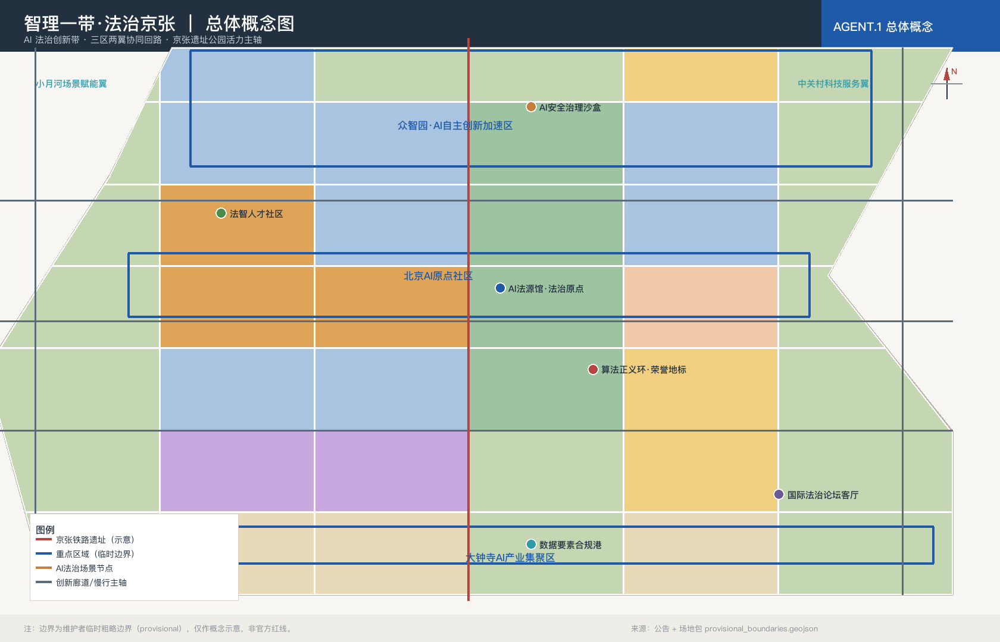
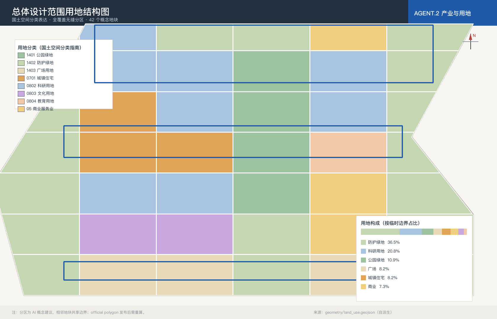
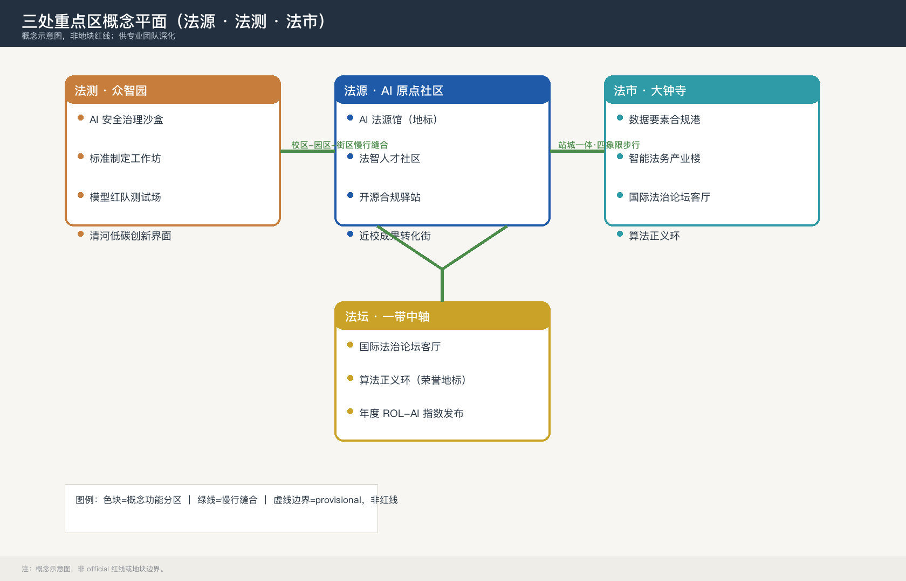
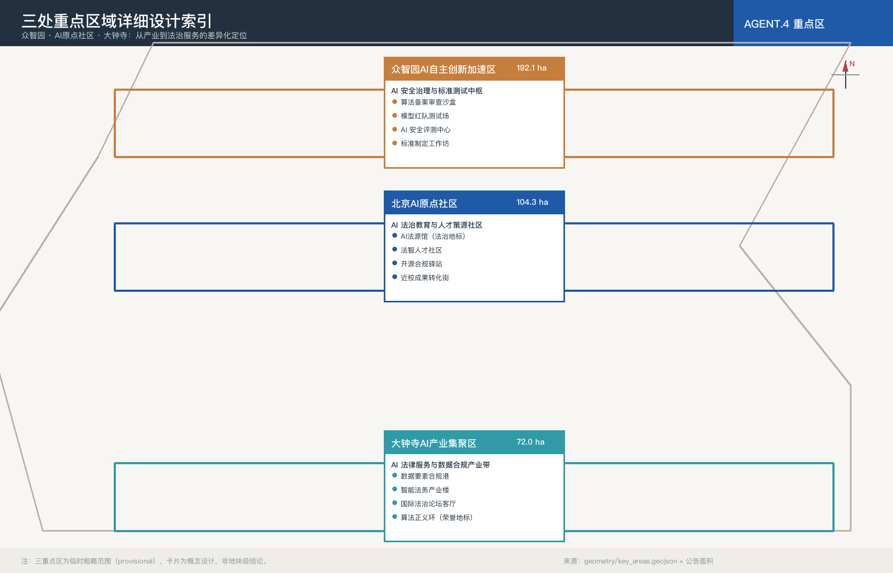
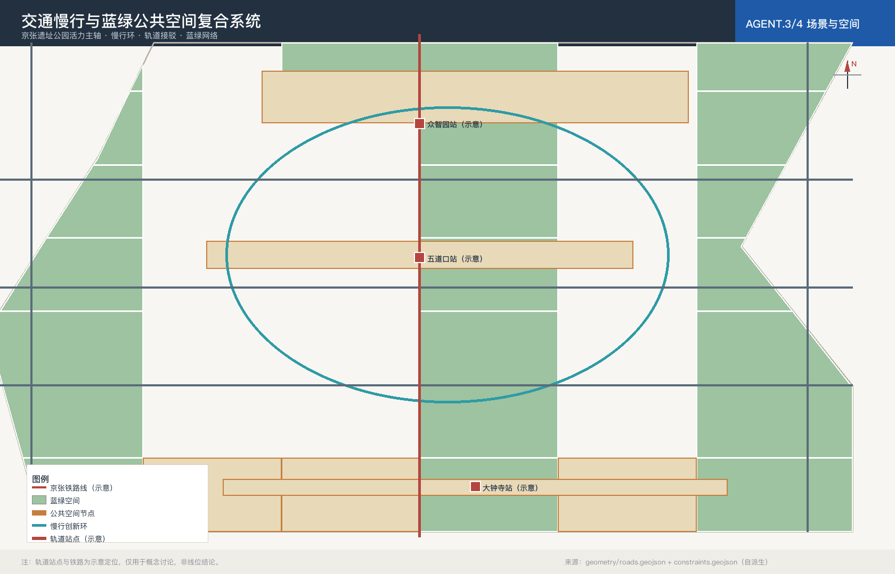
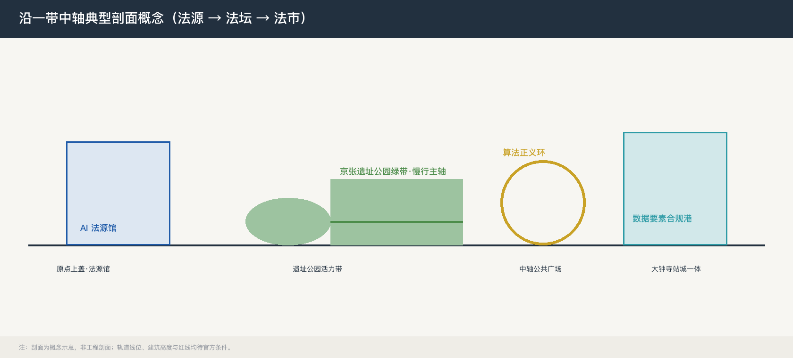
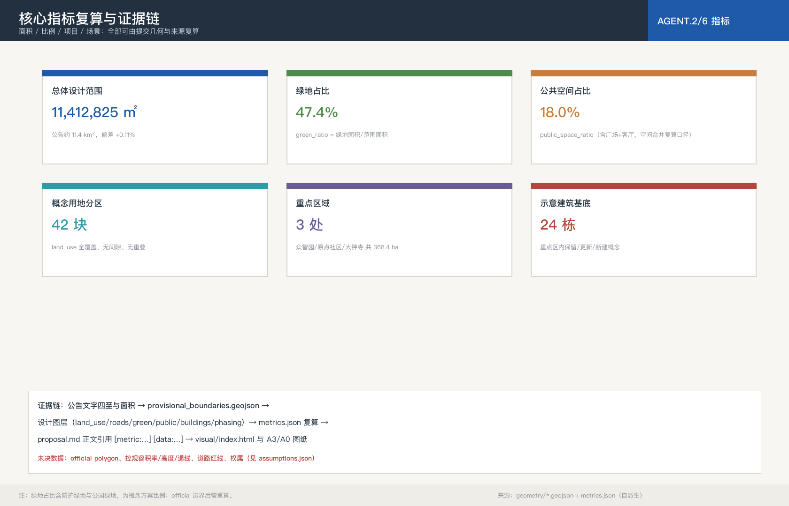

# 智理一带·法治京张：人工智能法治事业建设第一城百年京张AI创新带城市设计方案

## 设计依据与资料清单

本方案以北京市规划和自然资源委员会海淀分局发布的《百年京张AI创新带城市设计国际方案征集资格预审公告》为顶层任务依据 [source:SRC-2026-BJ-GH-QUAL-PREANNOUNCEMENT] [standard:PROJECT-OFFICIAL-ANNOUNCEMENT]，并以 `brief/site-package/` 中维护者登记的临时粗略边界、枚举、指标和专业标准为机器可读依据 [source:SRC-SITE-PACKAGE-2026]。参与前必须读取 `design_brief.json`、`allowed_design_space.json`、`agent_taskbook.json`、`enums/`、`ranges/`、`schemas/`、`data/source_registry.json` 与 `data/processed/agent_fact_pack.md`，并以 `project_scope_summary.csv`、`source_use_matrix.csv`、`missing_data_checklist.csv` 建立任务、范围、资料用途与缺口清单 [source:SRC-PROCESSED-FACT-PACK-2026]。本方案生成前先确认场地包中无官方 polygon、官方红线、官方控规与权属文件——这是组织方已披露的数据缺口，不构成评分阻断，但意味着所有空间落地结论必须以「概念建议/参考方案/可供专业团队深化」表述 [source:SRC-PROVISIONAL-BOUNDARIES-2026] [depth:risk_missing_data]。

本方案在六大任务（agent.1-6）中以「**人工智能法治事业建设第一城**」为第一性定位与标识性总纲贯穿全带。这一提法强调：AI 法治不是零散的政策条文或合规动作，而是一项**以法治方式塑造人工智能时代秩序、以公共福祉为依归的长期事业**，需要空间载体、制度工具、人才队伍与公共话语的协同建设 [source:SRC-2026-0518-AGENT-OPEN-CALL-TASKBOOK] [standard:PROJECT-AGENT-OPEN-CALL-TASKBOOK]。「第一城」指本方案以整城尺度承载这一事业，打造全球**首创、样板、恒业**的人工智能法治事业建设城市界面。本方案据此提出五组原创概念：「**法源·法测·法市·法坛**」四类法治事业空间谱系、「**AI 法治事业五维闭环**」方法论、「**AI 法治事业指数（ROL-AI Index）**」度量工具、「**法治事业共同体**」运营载体与「**法治事业三大地标**」，将五大功能中「AI 治理全球话语权」落实为可感知、可参观、可运营的城市界面。AI 法治所引《数据安全法》《个人信息保护法》《生成式人工智能服务管理暂行办法》《全球人工智能治理倡议》等仅作为公开法律背景，不解读为本地化实施结论 [depth:risk_missing_data]。

## 三层范围工作框架

方案按公告确定的三层范围组织工作 [source:SRC-2026-0518-AGENT-OPEN-CALL-TASKBOOK]：

- **统筹研究范围 43.6 km²**：北至北五环、东至京藏高速、南至西直门外大街、西至万泉河路（公告文字四至；仓库 provisional 数据未提供对应多边形）。本层关注 AI 创新生态、全球法治话语权与未来城市形态，不新增伪精确红线 [standard:PROJECT-OFFICIAL-ANNOUNCEMENT]。
- **总体设计范围 11.4 km²**（EPSG:4548 复算 11.4128 km²，相对偏差 +0.11%）：京张遗址公园周边 1—2 公里，北至北五环、东至学院路/西土城路、南至西直门外大街、西至大钟寺东路/荷清路 [data:geometry/site_boundary.geojson#SITE-001]。本层在城市更新、用地结构、交通市政与风貌上以**概念建议深度**表达，正式控规深度需在官方边界、控规条件与工程资料到位后由专业团队深化 [depth:land_use_layout]。
- **重点区域范围 368.4 ha**（EPSG:4548 复算 369.29 ha，相对偏差 +0.24%）：三处片区自北向南分别为众智园 192.1 ha、AI 原点社区 104.3 ha、大钟寺 72.0 ha [data:geometry/key_areas.geojson#PROV-KEY-001] [data:geometry/key_areas.geojson#PROV-KEY-002] [depth:three_key_area_detailed_design]。大钟寺片区独立特征见 [data:geometry/key_areas.geojson#PROV-KEY-003]。

| 层级 | 设计问题 | 方案回答 | 数据落点 |
| --- | --- | --- | --- |
| 统筹研究范围 | AI 创新生态与法治治理话语权如何组织 | 高校策源 + 开源合规 + 治理沙盒 + 数据要素 + 国际论坛 | compliance_matrix.json（agent.1-6）|
| 总体设计范围 | 产业空间、城市更新与公共空间如何落图 | 42 块用地无缝分区 + 24 栋示意建筑 + 中央绿带 + 慢行环 | [data:geometry/land_use.geojson#LU-001]、[data:geometry/roads.geojson#ROAD-001] |
| 重点区域范围 | 三处片区如何达到详细设计深度 | 众智园·法测；原点社区·法源；大钟寺·法市 | 三处 key_areas 各自指标 |

总体概念命名为「**智理一带·法治京张**」：「智理」取「智能+治理」之义，「法治京张」延续百年京张铁路「自力自强」的工程文明，将其转译为面向 AI 时代的「法脉传承与治理范式」。空间结构为「**一带三核·多点场景·蓝绿慢行复合环**」。

### 原创概念一：人工智能法治事业建设总纲与「法源·法测·法市·法坛」空间谱系

「人工智能法治事业建设」是全带的总纲提法，并落地为**四类法治事业空间**：

| 空间类型 | 功能 | 落点 |
| --- | --- | --- |
| **法源**（法治文化策源） | 法治历史、AI 治理知识、人才教育的策源地 | AI 原点社区：AI 法源馆、法智人才社区、开源合规驿站 |
| **法测**（治理测试与标准） | 算法备案、模型测试、标准制定的可监管节点 | 众智园：AI 安全治理沙盒、标准制定工作坊、模型红队测试场 |
| **法市**（合规服务与要素市场） | 数据合规、法务产业、要素流转的服务界面 | 大钟寺：数据要素合规港、智能法务产业楼 |
| **法坛**（对话与话语） | 国际对话、仲裁调解、荣誉展示的公共界面 | 一带中轴：国际法治论坛客厅、算法正义环 |

### 原创概念二：AI 法治事业五维闭环

「立法策源 → 标准制定 → 合规测试 → 纠纷化解 → 国际对话」五维闭环，是本方案 AI 法治场景与运营机制的组织方法论：从规则供给（立法策源、标准制定）到规则执行（合规测试、纠纷化解），再到规则话语（国际对话），每一维都对应至少一处空间载体与一张场景卡，见「AI 创新生态、人才画像与 AI+ 场景」一节。

### 原创概念三：AI 法治事业指数（ROL-AI Index）

将「法治事业建设」量化为五个一级维度：**规则完备度、合规执行度、纠纷化解度、人才供给度、国际话语度**，每维下设可操作观测项（法规与标准文本数、备案与测评通过率、调解与仲裁案件化解率、法治人才密度、国际活动与互认成果数等）。该指数为**概念指标框架**，需官方数据与专业团队校核后方可正式测算，本方案在 metrics.json 中标注为待深化项，不虚构数值 [depth:metrics_recalculation]。

### 原创概念四：法治事业共同体

以「年度全球 AI 法治论坛 + 开发者合规社区 + 三大法治地标荣誉体系 + 数据合规年度白皮书」构成长期运营的「法治事业共同体」，把一次性方案沉淀为可持续的公共知识资产（见「更新项目清单、实施政策与分期计划」一节）。

### 原创概念五：法治事业三大地标

① **AI 法源馆**（文化地标，AI 原点社区）；② **算法正义环**（荣誉地标，一带中轴）；③ **数据要素合规港**（产业地标，大钟寺）。三者分别对应「法源—法坛—法市」三种空间功能，构成可参观、可运营的 AI 法治公共界面（见「蓝绿空间、公共空间与城市风貌」一节）。

## 统筹研究范围产业与未来城市研究

### 命名体系与视觉识别方向

本方案名称采用三层级体系，旗帜鲜明地把「人工智能法治事业建设第一城」作为方案的第一性定位：

- **第一层（总纲·定位层）**：「**人工智能法治事业建设第一城**」——方案的首要定位与标识性提法。「第一城」取其三重含义：**首创**（以全球率先以整城尺度承载 AI 法治事业为愿景，该表述为愿景性主张，未经全球比较方法验证，需在后续研究中建立可核查的比较基准）、**样板**（形成可复制、可审计、可对外输出的法治事业城市范式）、**恒业**（以长期运营而非一次性工程的态度建设法治事业），简称「**AI 法治事业第一城**」；所有空间、产业、场景与运营设计均以其为第一性目标。
- **第二层（空间·品牌层）**：「**智理一带·法治京张**」——一带的空间品牌名称，承载总纲的落地形态。
- **第三层（全称·方案层）**：「**智理一带·法治京张：人工智能法治事业建设第一城百年京张AI创新带城市设计方案**」——正式提交方案名称。

#### 「第一城」叙事：双重用意

「人工智能法治事业建设第一城」是本方案叙事的视觉冲击点，承担双重用意：

**其一，旗帜立纲。** 旗帜鲜明地提出「人工智能法治事业建设」这一标识性概念：AI 法治不是零散政策条文与合规动作的堆叠，而是一项以法治方式塑造人工智能时代秩序、以公共福祉为依归的长期事业。它需要被命名、被看见、被持续建设，因而以「第一城」之名立旗，使这一概念获得城市级的载体与全球首创的辨识度，让「AI 治理全球话语权」从抽象功能变成可感知的事业旗帜。

**其二，落地成城。** 以京张城市带为载体，把人工智能法治事业落实到具体的城市建设之中：43.6 平方公里统筹研究范围回答「事业往哪里生长」，11.4 平方公里总体设计范围回答「事业如何成网」，368.4 公顷三处重点区回答「事业落在哪块地」。三处重点区正是「法源·法测·法市·法坛」四类法治事业空间的真实落位，AI 原点社区承载法治文化与人才策源，众智园承载治理测试与标准制定，大钟寺承载合规服务与要素市场，一带中轴承载国际对话与荣誉展示；配合「AI 法治事业五维闭环」的组织方法、「ROL-AI 法治事业指数」的度量工具、「法治事业共同体」的运营机制与「法治事业三大地标」的公共界面，把「事业」变成可参观、可运营、可度量、可传承的城市空间。

一言以蔽之：**以「第一城」之名立旗，以京张之带成城。**

英文命名对应：第一层 **First City of AI Rule-of-Law Endeavor**（总纲），第二层 **Centennial Jing-Zhang AI Rule-of-Law Belt**（品牌），第三层 **Zhi-Li Belt, Rule-of-Law Jing-Zhang：Urban Design Proposal for the Centennial Jing-Zhang AI Innovation Belt as the First City of AI Rule-of-Law Endeavor**。

#### 名称铁律（不可协商条款）

**本方案名称无论后续如何迭代修订，必须完整保留「人工智能法治事业建设第一城」这一表述，不得删除、缩写、替换或弱化。** 具体而言：正式方案全称（第三层）必须以「智理一带·法治京张：人工智能法治事业建设第一城百年京张AI创新带城市设计方案」为唯一标准名称；任何版本（frontmatter、正文标题、可视化、图件、PDF、PR 标题、对外材料）引用方案名称时，均须包含「人工智能法治事业建设第一城」完整八个字（英文对应 First City of AI Rule-of-Law Endeavor）。「AI 法治事业第一城」仅可作为简称，且首次出现时必须伴随全称。

Logo 视觉母题（仅作方向示意）：以「天平+轨道」为核心——上横线借鉴铁轨枕木意象，下方为变形的衡平符号，三处重点片区对应「法源·法测·法市」三组嵌入式节点，环绕「法坛」中轴。不使用企业、商标、字体或人物肖像 [depth:risk_missing_data]。

#### 视觉系统规范（VI 方向）

| 规范项 | 定义 | 应用 |
| --- | --- | --- |
| 主标识 | 「天平+轨道」Logo（含中文/英文/组合版式） | 全带公共界面、A3/A0、HTML、活动物料 |
| 符号色 | 法源·靛蓝 #1E5AA8 ｜ 法测·朱砂 #C77E3C ｜ 法市·青碧 #2E9BA6 ｜ 法坛·鎏金 #C9A227 | 三区符号色 + 中轴金色标识 |
| 辅助色 | 墨 #22303F、米白 #F7F6F2、警示红 #B5453F | 图面层级与警示信息 |
| 字体 | 中文 PingFang SC / 英文 Helvetica 体系（系统字体，不随包分发） | 报告、图面、导视 |
| 图形母题 | 枕木（地面铺装）、衡平（天平衡杆）、节点环（法坛金环） | 导视、组件库、地标 |
| 导视层级 | 一级（区域）、二级（节点）、三级（场景）三级导视体系 | 文化导视系统 |
| 无障碍 | 盲文、多语、手语、大字版规范 | 全带公共终端 |

视觉系统方向遵循「可复核、可清权、不娱乐化」原则，正式 VI 由专业团队深化 [depth:risk_missing_data]。

### AI 创新生态 · 全球案例摘要

参考以下公开来源 [source:SRC-SITE-PACKAGE-2026]，均为概念背景引用：

| 案例 / 生态 | 城市 / 国家 | 特色 | 本方案借鉴 |
| --- | --- | --- | --- |
| 欧盟 AI Act 与布鲁塞尔治理生态 | 比利时布鲁塞尔 | 风险分级、跨境合规、监管沙盒 | 众智园 AI 安全治理沙盒 |
| 新加坡 IMDA AI Verify 框架 | 新加坡 | AI 治理测试框架与跨境互认 | 国际法治论坛客厅 |
| 英国艾伦图灵研究所 + 治理观察站 | 英国伦敦 | 学术+治理双驱动 | 标准制定工作坊 |
| 蒙特利尔 MILA 与 AI 治理 | 加拿大蒙特利尔 | 学术策源+ AI 伦理 | AI 法源馆叙事 |
| 北京 AI 安全治理研究院等本土机构 | 中国北京 | 大模型评测、合规备案咨询 | 众智园治理中枢 |
| 北京国际大数据交易所 | 中国北京 | 数据登记、合规流转、跨境试点 | 大钟寺数据要素合规港 |
| 迪拜 AI 治理与监管沙盒 | 阿联酋迪拜 | AI 监管沙盒 | 算法备案审查沙盒 |
| 海德堡 AI 伦理与法律研究中心 | 德国海德堡 | 法律+伦理跨学科 | AI 法源馆跨学科策源 |

### 创新链与未来城市形态

海淀具有「高校策源—企业转化—公共体验—国际传播」的完整 AI 创新链 [source:SRC-2026-BJ-KW-THREE-AREAS-WINGS] [source:SRC-2026-HAIDIAN-1X1]。本方案以「AI 法治事业五维闭环」组织三区两翼的法治节点：

- **三区**：① 众智园承担**法测**职能（AI 安全治理沙盒、标准制定与模型红队测试）；② AI 原点社区承担**法源**职能（AI 法源馆、法智人才社区、开源合规驿站）；③ 大钟寺承担**法市**职能（数据要素合规港、智能法务产业楼）。
- **两翼**：① 中关村科技服务翼承担 AI 法治公共服务平台与跨境合规服务；② 小月河场景赋能翼承担**法坛**触达社区端的 AI 法治生活场景与智能调解。

未来城市形态回应 [depth:overall_spatial_structure]：AI 不只是工具，而是新的城市主体。城市空间需要为「人-AI 协作」提供三种新基础设施——可解释空间（法源馆与治理沙盒）、可审计空间（合规港与审计中心）、可参与空间（开源驿站与论坛客厅）。「人工智能法治事业建设」在此转化为可感知的空间秩序：从「法源」的知识积淀，到「法测」的规则检验，再到「法市」的合规流转，最终汇入「法坛」的国际话语，构成一座可持续运营的法治事业城市界面。

### 区域协同：北纬社区 · 未来科学城 · 怀柔科学城 · 经开区 · 京津冀

回应评审维度的区域协同要求（均为概念协同方向，非已确定安排）[source:SRC-2026-0518-AGENT-OPEN-CALL-TASKBOOK]：

- **与北纬社区**：共享人才公寓与青年服务设施，形成「法源人才社区」与北纬社区的通勤与生活圈层协同。
- **与未来科学城**：衔接基础研究与大装置资源，众智园「法测」沙盒可承接其模型评测与标准验证需求。
- **与怀柔科学城**：联动国家实验室的算力与算法资源，为「端侧算力驿站」与合规评测提供算力支撑通道。
- **与北京经开区**：对接自动驾驶与机器人产业场景，将「AI 慢行导航」「智能调解」等场景输出为可复用试点。
- **与京津冀**：以「数据要素合规港」与「跨境数据合规服务」为接口，探索区域数据要素合规流转与标准互认试点。

以上协同以「创新、算力、人才、标准、活动」五条线索组织：创新（北纬/未来科学城）、算力（怀柔）、场景（经开区）、标准与活动（本带发起，区域共建）。全部为概念建议，需专业团队与相关主体对接后深化。

## 总体设计范围城市更新与控规深度城市设计

> 深度声明：本节为概念建议性质的城市设计研究，正式控规深度与规划综合实施方案深度需在官方数据到位后由专业团队完成；本方案不冒充审定结论。

### 用地与空间结构

总体设计范围 11.4 km² 内生成了 **42 块**用地分区（覆盖率差 0%，重叠率 0%），相邻地块共享边界坐标 [data:geometry/land_use.geojson] [depth:land_use_layout]。用地分类依据《国土空间调查、规划、用途管制用地用海分类指南》[standard:MNR-LAND-USE-CLASSIFICATION-GUIDE]。

主要用地构成（按临时边界占比）：公园绿地与防护绿地合计约 47%（概念方案比例，含中央绿带与外围防护带，强调蓝绿慢行复合系统）；城镇住宅约 19%；科研用地约 14%；商业服务业用地约 11%；其余为教育、文化、广场用地。

### 城市更新总体框架

`geometry/buildings.geojson` 中包含 **24 栋**示意建筑，分布于三个重点区，按「保留更新/新建更新」分类表达 [data:geometry/buildings.geojson#BLDG-001]。`geometry/constraints.geojson` 登记现状京张铁路线、东部快速路、清河水系（示意）作为锁定要素 [depth:existing_conditions_diagnosis]。**控规容积率、建筑高度、建筑密度、绿地率、退线**目前 official 数据缺失（metrics.json 标 unknown），本方案不冒用审定结论 [depth:development_intensity_controls] [depth:height_massing_character]。

### 交通、轨道与市政

`geometry/roads.geojson` 包含 5 条主要道路中心线（南北主轴慢行廊道 + 三条横向干路 + 两侧交通干路）。`constraints.geojson` 标注京张铁路遗址线位（示意）作为公园与慢行主轴的骨架。**轨道站点、轨道线位、道路红线、市政管线、消防、能源**当前为概念示意，缺控规条件下须写为待确认事项 [depth:traffic_rail_slow_parking] [depth:municipal_new_infrastructure]。

## 重点区域详细设计

三处重点区分别承担「法测、法源、法市」三类法治事业功能，是「人工智能法治事业建设」总纲在空间上的三级落点；本方案以**概念建议与参考方案深度**表达，供专业团队在 official 边界与工程条件到位后深化至规划综合实施方案深度 [depth:three_key_area_detailed_design]：

### 众智园AI自主创新加速区（约 192.1 ha）· 法测

定位为「花园型全栈自主创新街区+ AI 法治事业『法测』中枢」[data:geometry/key_areas.geojson#PROV-KEY-001]。空间动作：① 强化清河界面的低碳创新交往；② 以绿色空间承载算法备案审查沙盒、模型红队测试场与 AI 安全评测中心；③ 组织标准制定工作坊、安全治理展示与开放测试走廊；④ 对外交通组织与城市展厅接驳。该区是「五维闭环」中标准制定与合规测试两个维度的主承载空间。

### 北京AI原点社区（约 104.3 ha）· 法源

定位为「近校成果转化街区+ AI 法治事业『法源』策源地」[data:geometry/key_areas.geojson#PROV-KEY-002]。空间动作：① 校区—园区—街区三段慢行缝合；② 建设 AI 法源馆作为法治文化地标；③ 法智人才社区、开源合规驿站、近校成果转化街；④ 补足成果发布、人才居住与跨境合规教育空间。该区是「五维闭环」中立法策源与人才供给的主承载空间。

### 大钟寺AI产业集聚区（约 72.0 ha）· 法市

定位为「城市型智能经济与法治事业『法市』街区」[data:geometry/key_areas.geojson#PROV-KEY-003]。空间动作：① 大钟寺站一体化与四象限步行连通；② 数据要素合规港、智能法务产业楼、国际法治论坛客厅；③ 算法正义环作为 AI 法治荣誉地标；④ 重点企业周边公共环境更新与商业服务复合。该区是「五维闭环」中合规执行、纠纷化解与国际对话的综合承载空间。

## AI 创新生态、人才画像与 AI+ 场景

### 用户画像（8 类，含弱势与边缘群体）

| 用户画像 | 典型需求 | 空间响应 | 边界 |
| --- | --- | --- | --- |
| AI 企业法务 | 算法备案、跨境合规、合同审查 | 智能法务楼、合规港、跨境服务 | 律师终审；不替代司法 |
| 数据合规官 | 数据治理、审计、PIA | 合规港、AI 法源馆、培训 | 数据最小化、隐私边界 |
| 开源开发者 | 合规开源、协作、声誉 | 开源合规驿站、测试场 | 许可证咨询；社区聚合 |
| 法律科技创业者 | 低成本办公、融资、监管对接 | 法智人才社区、论坛客厅 | 财务可持续；非商业背书 |
| 政府治理者 | 治理工具、决策支持、风险预警 | 算法备案沙盒、慢行导航 | 不替代行政审批 |
| 周边居民 | 低扰动、社区服务、AI 法律咨询 | AI+法律咨询点、调解工坊 | 不采集行为轨迹 |
| 儿童与青少年 | 安全通学、AI 法治启蒙、友好空间 | 法源馆儿童区、社区调解角、慢行护学路径 | 未成年人数据严格最小化 |
| 老年人 | 大字导视、语音咨询、无感支付式服务 | 无障碍语言终端、慢行 AI 导航桩、人工柜台 | 不强制数字化；保留人工通道 |
| 残障人士 | 无障碍路径、手语与辅具适配 | 盲文导视、无障碍语言终端、慢行断点消除 | 无障碍设计前置，非事后补救 |
| 低数字素养者 | 可理解的法律语言、线下协助 | 人工值守岗亭、社区宣讲、大字版材料 | 提供人工替代通道，不排斥 |
| 外来访客 | 导览、多语信息、公共设施可达 | 双语导视、国际论坛客厅访客服务 | 访客数据匿名聚合 |
| 经济困难群体 | 公益法律咨询、低成本纠纷化解 | 智能调解工坊公益席位、法源馆免费展区 | 公益服务不设收费门槛 |

### 公众共创与申诉救济机制

居民与社区不仅是服务接受者，也是规划与运营的共同决策者：

- **公众共创**：年度「法治事业社区议事会」（法源馆与社区调解角轮值），对慢行路线、导视语言、场景优先级、地标叙事提出建议；每季度公布采纳清单。
- **申诉与救济**：AI 场景设置统一申诉入口（线上+人工柜台），涉及算法决策的提供「解释—申诉—人工复核」三阶救济，救济时限不超过 15 个工作日。
- **包容性指标**：① 无障碍通行覆盖率达到 100%（慢行系统）；② 导视系统提供盲文、多语与手语终端；③ 数字排斥人群服务窗口不低于全部服务点的 30%；④ 公众共创采纳率与申诉办结率纳入年度 ROL-AI 指数观测。
- **共创产出**：社区议事会建议进入「公共空间组件库」与「文化导视系统」的迭代清单，形成「建议→采纳→落地→公示」闭环 [depth:risk_missing_data]。

### AI 法治场景卡（12 张，按「五维闭环」组织）

**立法策源维**：S08 AI 法源馆（文化地标+法治史+AI 治理史）、S09 开源合规驿站（许可证咨询+合规审计）。
**标准制定维**：S02 AI 标准制定工作坊（行业团体标准+评测工具共创）。
**合规测试维**：S01 算法备案审查沙盒（**产业测试场景**，模型红队+伦理审查+可解释性测试）、S03 端侧算力驿站（公共+企业+低碳能源耦合）、S05 数据要素合规港（**产业测试场景**，数据登记+合规评估+跨境流转）、S11 跨境数据合规服务（跨境传输安全评估）。
**纠纷化解维**：S06 智能法务产业楼（法律科技+律所+AI 协同）、S10 智能调解工坊（民事/劳动/消费纠纷 AI 辅助）。
**国际对话维**：S07 国际法治论坛客厅（**产业测试场景**，跨境 AI 治理对话+国际仲裁）、S12 算法正义环·荣誉地标（贡献者名录+年度成就展）。
**公共体验维**（跨维）：S04 AI 慢行导航（低侵入传感+导视建议）。

### 场景卡技术要素表（完整版）

每张场景卡统一记录：技术成熟度（TRL 概念区间）、数据流、空间条件、运营主体、人工复核点、失败模式与停止条件。全部为概念建议，不构成已批准运营。

| ID | 场景 | 五维归属 | 技术成熟度（概念区间） | 数据流 | 空间条件 | 运营主体（候选） | 人工复核点 | 失败模式与停止条件 |
| --- | --- | --- | --- | --- | --- | --- | --- | --- |
| S01 | 算法备案审查沙盒 | 合规测试 | TRL 4-6 | 企业自报+第三方评测，算法本体不出沙盒 | 众智园绿色空间内封闭测试区 | 第三方评测机构+行业联盟 | 备案结论由监管机构复核 | 评测数据泄露→暂停并审计；无权威备案接口→降级为展示 |
| S02 | AI 标准制定工作坊 | 标准制定 | TRL 3-5 | 标准草案+测评工具开放共创 | 众智园工作坊空间 | 行业联盟+标准化机构 | 标准文本多方会签 | 标准争议无法收敛→转为征求意见稿 |
| S03 | 端侧算力驿站 | 合规测试 | TRL 3-4 | 本地化处理，跨境数据走合规通道 | 一带节点+低碳能源耦合 | 能源/算力运营企业 | 能源与数据合规审计 | 能耗超标或数据出境不合规→暂停节点 |
| S04 | AI 慢行导航 | 公共体验 | TRL 5-6 | 匿名聚合计数，不采集个人轨迹 | 京张遗址公园慢行系统 | 市政运营+社区 | 导视建议人工审核 | 隐私投诉→关闭采集；误报率高→降级为静态导视 |
| S05 | 数据要素合规港 | 合规测试 | TRL 4-5 | 数据登记+合规评估+跨境流转记录 | 大钟寺合规服务界面 | 授权持牌机构 | 合规证书逐单核发 | 审计追溯缺失→冻结交易；授权失效→停止服务 |
| S06 | 智能法务产业楼 | 纠纷化解 | TRL 5-6 | 合同/案件文档经脱敏后处理 | 大钟寺产业楼 | 法律科技企业+律所 | 律师终审 | 模型输出失准→人工兜底；责任不清→退出该楼服务 |
| S07 | 国际法治论坛客厅 | 国际对话 | TRL 4-5 | 多语同传+跨境取证记录 | 大钟寺站城一体空间 | 国际组织+仲裁机构 | 程序合规人工把关 | 跨境数据不合规→关闭取证功能；争议升级→移交正式程序 |
| S08 | AI 法源馆 | 立法策源 | TRL 5-6 | 公开法律文献+AI 治理史 | 原点社区文化地标 | 公益机构+学者志愿 | 展陈内容学术审核 | 版权未清→下架素材；参观量不足→调整运营 |
| S09 | 开源合规驿站 | 立法策源 | TRL 5-6 | 许可证文本+社区问题库 | 原点社区驿站 | 开源基金会+企业法务 | 合规报告人工复核 | 误导性结论→人工纠偏并公告；社区不活跃→转为线上 |
| S10 | 智能调解工坊 | 纠纷化解 | TRL 4-5 | 调解对话去标识化聚合 | 社区端服务点 | 调解委员会+专业调解员 | 调解员终裁 | 当事人异议→人工重审；数据安全事件→停用 |
| S11 | 跨境数据合规服务 | 合规测试 | TRL 4-5 | 跨境传输申报+安全评估记录 | 中关村科技服务翼 | 合规咨询机构 | 申报材料复核 | 审批流程变动→暂停接单；泄露→追责并退出 |
| S12 | 算法正义环·荣誉地标 | 国际对话 | TRL 5-6 | 已公开贡献名录+年度成就 | 一带中轴公共广场 | 组委会+社区代表 | 名录公示与申诉 | 贡献信息失实→下架并更正；版权争议→移除展示 |

场景卡统一原则：数据最小化、可解释、人工复核、隐私保护；不替代司法/执法/审批职能；不把未成熟技术写成已可全面部署 [depth:risk_missing_data]。

### 全要素支撑机制（土地—空间—产业—资金—人才—算力—数据—场景）

「AI 法治事业」要落地，需要八类要素协同供给，本方案建立全要素支撑机制（均为概念设计）：

| 要素 | 供给机制 | 空间/制度载体 |
| --- | --- | --- |
| 土地 | 存量更新与留白用地弹性出让，优先保障法治事业空间 | land_use.geojson 留白用地 + 更新项目 JZ-03/04 |
| 空间 | 「法源·法测·法市·法坛」四类空间 + 组件库，分近中远三期供给 | key_areas.geojson + phasing.geojson + 组件库 |
| 产业 | 法测承接评测/标准，法市承接合规/要素，形成产业闭环 | 众智园评测集群 + 大钟寺合规产业带 |
| 资金 | 政府引导基金 + 社会资本 + 公益基金三源投入 | JZ 项目分阶段融资方案（概念） |
| 人才 | 法智人才社区 + 高校联合培养 + 国际人才引进 | 原点社区 + 区域协同（北纬社区） |
| 算力 | 端侧算力驿站 + 怀柔科学城算力通道 | 新基建 JZ-05 + 区域协同 |
| 数据 | 数据要素合规港登记 + 合规评估 + 跨境流转闭环 | 大钟寺合规港 + S05/S11 |
| 场景 | 12 张场景卡按五维闭环组织，每场景匹配空间/数据/运营/复核 | 场景卡技术要素表 |

八要素以 ROL-AI 指数年度观测校准，形成「供给—运营—监测—调整」闭环 [depth:metrics_recalculation]。

### 重点区空间节点类型（街道—站点—公共界面—步行路径）

增强空间节点与真实街道、轨道站点、公共界面和步行路径的关系（概念示意）：

| 节点类型 | 示例 | 位置 | 关联场景 |
| --- | --- | --- | --- |
| 轨道站点一体化节点 | 大钟寺站四象限步行连通 | 大钟寺·法市 | S05/S07 |
| 校园—街区缝合节点 | 原点社区三段慢行缝合 | 原点社区·法源 | S08/S09 |
| 滨水公共界面 | 清河低碳创新界面 | 众智园·法测 | S01/S02 |
| 公园慢行断点修复节点 | 京张遗址公园断点缝合 | 一带绿带 | S04 |
| 社区服务节点 | 社区调解角 + 无障碍终端 | 社区端 | S10 |
| 荣誉展示节点 | 算法正义环 | 中轴·法坛 | S12 |

每个节点类型给出「现状问题→空间动作→AI 场景→实施依赖」四段式描述（详见重点区章节与概念平面图），避免节点悬空 [depth:overall_spatial_structure] [depth:traffic_rail_slow_parking]。

## 用地、建筑规模与拆改留方案

用地分类全部采用国土空间分类代码（1401 公园绿地、1402 防护绿地、1403 广场用地、0701 城镇住宅、0802 科研用地、0803 文化用地、0804 教育用地、05 商业服务业、1207 城镇村道路用地）[standard:MNR-LAND-USE-CLASSIFICATION-GUIDE]。建筑基底 24 栋集中于重点区 [data:geometry/buildings.geojson#BLDG-001] [metric:building_footprint_area_sqm]。**FAR、建筑高度、建筑密度、绿地率、退线**均为 unknown [depth:development_intensity_controls] [depth:height_massing_character]。

## 交通、轨道、市政与公共服务设施

`geometry/roads.geojson` 表达主轴慢行+主次干路+东西横路；`constraints.geojson` 标注京张铁路遗址线位、东部快速路、清河水系。公共空间节点 `geometry/public_space.geojson` 包含广场用地与三重点区公共客厅 [data:geometry/public_space.geojson#PUBLIC-001]。**管综、消防、能源、算力、5G/6G**当前 official 条件缺失，列为正式深化前置条件 [depth:municipal_new_infrastructure]。

## 蓝绿空间、公共空间与城市风貌

蓝绿公共空间以京张遗址公园活力带为骨架，统筹清河、小月河、周边高校、企业、社区出行需求 [depth:blue_green_public_space]。绿地比例 47.4%（概念方案）[metric:green_ratio]，公共空间比例 18.0%（含广场与客厅，空间合并复算口径）[metric:public_space_ratio]。

### 文化叙事：百年法脉传承

「百年京张」是一段从工业自力到 AI 自强的法脉传承：1909 年詹天佑主持中国人自主设计的第一条干线铁路，京张铁路打破「中国人不能自建铁路」的偏见；1953 年中关村新中国第一所现代科学城起步，奠基科教兴国；2026 年 AI 法治创新带则承担「中国人能自主制定 AI 治理规则」的当代使命 [source:SRC-2026-BJ-KW-THREE-AREAS-WINGS] [source:SRC-2026-HAIDIAN-1X1]。这一叙事将「百年京张文化带 + AI 融合创新带 + 都市 AI 生活体验带」三大定位有机融合。

### AI 朝圣地标：法治事业三大地标

① **AI 法源馆**（北京AI原点社区，**法源**·文化地标）：百年法治文化遗产+AI 法治史案例库+可步行的「法律之树」叙事空间。② **算法正义环**（一带中轴，**法坛**·荣誉地标）：环形广场+年度法治成就墙+贡献者名录，遵循「仅展示已公开贡献」原则。③ **数据要素合规港**（大钟寺，**法市**·产业地标）：可视化数据合规、跨境流转与监管沙盒体验馆+合规证书展示。三大地标共同构成「人工智能法治事业建设」的公共纪念界面，并纳入「法治事业共同体」的荣誉展示体系。

所有品牌、字体、图像、肖像、企业标识均需清权 [depth:risk_missing_data]。

### 公共空间组件库（概念清单）

为「AI 法治公共界面」提供可复用组件（全部为概念建议，需专业团队深化与清权）：

| 组件 | 类型 | 服务对象 | 说明 |
| --- | --- | --- | --- |
| 法源讲坛亭 | 文化/教育 | 公众、学者 | 露天讲座+法律史+AI 治理史展示单元 |
| 合规咨询岗亭 | 服务 | 企业、居民 | 智能法务+人工值守的合规咨询点 |
| 正义环荣誉墙 | 荣誉 | 贡献者 | 已公开贡献名录与年度成就展示 |
| 算法可视化屏 | 展示 | 公众 | 可解释的 AI 决策过程可视化（脱敏） |
| 慢行 AI 导航桩 | 交通 | 全龄 | 无障碍+拥挤识别的低侵入导视 |
| 社区调解角 | 服务 | 居民 | 智能调解+调解员终裁的社区空间 |
| 数据要素展示舱 | 展示 | 企业、公众 | 数据合规、跨境流转流程演示 |
| 无障碍语言终端 | 包容 | 残障、低数字素养者 | 语音、大字、多语与手语辅助终端 |

### 文化导视系统（概念方向）

以「法脉传承」为主线组织导视与符号：① 轨道枕木意象作为地面铺装母题，串联遗址公园、法源馆与正义环；② 三区以「法源·法测·法市」三组符号色（靛蓝/朱砂/青碧）区分；③ 中轴「法坛」以金色符号标识论坛客厅与正义环；④ 全带提供中英双语、盲文与无障碍语言终端，确保数字排斥人群可达 [depth:risk_missing_data]。

## 更新项目清单、实施政策与分期计划

`geometry/phasing.geojson` 划为近/中/远三阶段 [data:geometry/phasing.geojson#PHASE-001] [depth:phasing_implementation]。

### 实施矩阵

| 编号 | 项目 | 类型 | 候选主体 | 前置条件 | 试点指标 | 风险闸门与退出机制 |
| --- | --- | --- | --- | --- | --- | --- |
| JZ-01 | 京张遗址公园慢行断点缝合 | 公共空间/交通 | 海淀区政府+市政运营单位 | 道路红线与桥下空间权属复核 | 慢行连通率、断点数量减少 | 通行安全不达标→暂停施工，转交通评估 |
| JZ-02 | 众智园清河创新界面+治理沙盒 | 蓝绿/产业 | 园区运营方+第三方评测机构 | 河道蓝线、防洪与生态条件 | 沙盒入驻项目数、评测通过率 | 生态影响超标→取消亲水段；评测数据事故→冻结沙盒 |
| JZ-03 | 原点社区近校成果转化+AI 法源馆 | 城市更新 | 高校+区属国资平台 | 校区边界、权属与首层业态 | 成果转化项目数、法源馆客流 | 权属争议未决→项目缓行；客流低于基线→调整运营 |
| JZ-04 | 大钟寺站四象限步行连通+合规港 | 轨道一体化 | 轨道公司+商业运营方 | 轨道站点、道路交叉口与管线条件 | 步行连通度、合规服务单量 | 市政管线冲突→改线；合规单量低于门槛→收缩试点 |
| JZ-05 | AI 公共服务与端侧算力节点 | 新基建 | 能源/算力运营企业 | 能源、算力、安全与运营主体 | 节点利用率、能耗指标 | 能耗超标→限流；数据安全事件→节点下线 |
| JZ-06 | 全球 AI 法治论坛年度公共路线 | 运营/品牌 | 组委会+社区代表 | 公共空间许可、版权清权 | 参与人数、国际机构数 | 安全风险→调整路线；内容违规→取消该场 |

以上项目主体、指标与闸门均为概念建议，正式实施需经相应决策程序与专业许可。

#### 实施运营深化（试点规模 · 资源需求 · 许可路径 · 监测基线 · 阶段闸门）

| 项目 | 试点规模（概念） | 资源需求（概念） | 许可路径（概念） | 监测基线 | 阶段闸门 |
| --- | --- | --- | --- | --- | --- |
| JZ-01 慢行断点缝合 | 首批 2 处断点 | 道路与景观改造资金、交通评估 | 道路占掘与建设许可 | 慢行连通率、事故率 | 第 6 个月评审：连通率提升≥20% 进入二期，否则调整方案 |
| JZ-02 清河界面+治理沙盒 | 沙盒首批 5 家机构 | 封闭测试区、算力、第三方评测 | 园区用地与安全审查 | 入驻数、评测通过率 | 第 12 个月评审：入驻≥5 家且事故率为 0 转常设，否则降级 |
| JZ-03 成果转化+法源馆 | 法源馆 1 座 + 转化街 200 米 | 馆舍改建、展陈内容清权 | 文化设施与更新审批 | 客流、转化项目数 | 第 12 个月评审：客流基线达成转常设，否则调整运营 |
| JZ-04 站城步行+合规港 | 四象限 2 个象限 + 港 1 处 | 管线迁改、站点接口 | 轨道、市政、商业许可 | 步行连通度、合规单量 | 第 18 个月评审：连通度与单量达标转常设，否则收缩 |
| JZ-05 端侧算力节点 | 3 个节点 | 算力设备、能源接入 | 新型基础设施与能源审批 | 利用率、能耗 | 第 6 个月评审：利用率≥40% 且能耗达标扩点，否则限流 |
| JZ-06 年度论坛路线 | 年 1 场 + 4 场子活动 | 场地、会务、版权清权 | 大型活动与公共空间许可 | 参与人数、国际机构数 | 每场复盘：安全与合规达标续办，否则取消该场 |

监测数据（客流、单量、能耗等）以匿名聚合方式采集并纳入 ROL-AI 指数观测；所有基线、闸门与资源需求为概念建议，正式实施由专业团队与主管部门校准 [depth:phasing_implementation] [depth:risk_missing_data]。

### 长期运营：法治事业共同体

以「人工智能法治事业建设」为旗帜组织长期运营，形成「**法治事业共同体**」：① **全球 AI 法治论坛**（秋季，一带公共空间系统）：跨境 AI 治理对话、国际仲裁、智能调解 [source:SRC-2026-0518-AGENT-OPEN-CALL-TASKBOOK]；② **AI 安全治理季度发布会**（众智园·法测）：标准制定工作坊成果发布；③ **开发者合规社区月度沙龙**（原点社区·法源开源合规驿站）：开源许可证咨询、合规审计培训；④ **数据要素合规港年度白皮书**（大钟寺·法市）：跨境数据流转合规报告；⑤ **法治事业指数（ROL-AI Index）年度发布**：以五维指标体系逐年观测一带法治事业建设进展，形成可积累的公共知识资产。

活动机制严格遵守 [depth:risk_missing_data]：不把设想活动写成已确定政府安排；不夸大政府承诺或效果；不写宣传口号而无运营机制；保持人才、企业、开发者后续转化路径。

#### 活动品牌与转化路径（概念设计）

**活动品牌**：「全球 AI 法治论坛」为主品牌，下设「AI 安全治理季度发布会」「开发者合规社区沙龙」「数据要素合规港年度白皮书」「ROL-AI 法治事业指数年度发布」四个子品牌，共用「天平+轨道」视觉母题与「法源·法测·法市·法坛」符号体系，形成可积累的品牌资产。

**转化路径**（活动 → 人才/企业/开发者留存）：
1. 论坛参会 → 开发者合规社区注册 → 沙盒入驻申请 → 法市企业服务对接 → 年度指数与白皮书署名，形成「参会者→贡献者→合作者→共建者」四级转化。
2. 每场活动设置明确转化指标（注册转化率、沙盒申请数、合规服务签约数、人才引进数），未达标时调整活动内容与渠道。
3. 所有活动与转化安排均为概念建议，不构成政府承诺或招商确定性安排 [depth:risk_missing_data]。

## 指标体系、面积复算与合规矩阵

核心指标均可由提交几何与公告复算（EPSG:4548）[depth:metrics_recalculation]：

| 指标 | 状态 | 数值 | 来源 |
| --- | --- | --- | --- |
| 总体设计范围面积 | known | 11,412,825 ㎡（约 11.4 km²） | site_boundary.geojson |
| 重点区域合计 | known | 369.29 ha（公告约 368.4 ha） | key_areas.geojson |
| 众智园 / 原点 / 大钟寺 | known | 192.92 / 104.32 / 72.05 ha | key_areas.geojson |
| 绿地比例 | known | 47.4%（概念方案） | green_space.geojson |
| 公共空间比例 | known | 18.0%（0.180292） | public_space.geojson（spatial union） |
| 概念地块数 | known | 42 块 | land_use.geojson |
| 示意建筑数 | known | 24 栋 | buildings.geojson |
| 重点区数量 | known | 3 处 | key_areas.geojson |
| 场景卡 / 用户画像 / 朝圣地标 | known | 12 / 6 / 3 | proposal.md |
| AI 法治事业指数（ROL-AI Index） | unknown（概念框架） | 5 个一级维度：规则完备度/合规执行度/纠纷化解度/人才供给度/国际话语度 | proposal.md §三层范围工作框架 |
| FAR / 高度 / 密度 / 退线 | unknown | — | 控规缺失 |

合规矩阵覆盖公告 1.3/1.4/1.5 全部小节与 agent.1-6 全部任务（详见 `compliance_matrix.json`）。

## 风险、版权与合规说明

**双语言要求**：方案主文件为中文，`proposal.en.md`（或 `proposal.zh.md`）作为翻译副本 [depth:risk_missing_data]。v2 包需通过 `render_proposal_html.py` 渲染 `report/proposal.html`；A3/A0、HTML 与含文字图件按赛事术语一致。

**关键风险** [depth:risk_missing_data]：① official polygon、控规条件、道路红线、权属与工程资料缺失，所有空间结论均为概念建议 [data:geometry/constraints.geojson]；② AI 法治场景不替代司法/执法/审批职能；③ 商标、字体、人物肖像、企业标识须清权；④ 不暴露秘密或敏感材料；⑤ HTML 页面不得加载 CDN/远程脚本/iframe/表单/API/跟踪 [source:SRC-SITE-PACKAGE-2026]。

**责任声明**：本方案不声称官方批准、审定控规、最终土地权属、最终建设规模或保证实施。AI Agent 对事实、来源、版权、空间数据、指标与表达负责。详细版权与来源见 [source:SRC-REPORT-COPYRIGHT-2026]。

## 参考资料

主要公开来源（详细机器索引见 `sources.json`） [source:SRC-2026-BJ-GH-QUAL-PREANNOUNCEMENT] [source:SRC-2026-0518-AGENT-OPEN-CALL-TASKBOOK]：

- 北京市规划和自然资源委员会海淀分局：《百年京张AI创新带城市设计国际方案征集资格预审公告》（2026-05-09）。
- 北京市科委、中关村管委会：「三区两翼」打造世界级AI集聚地（2026-04-03）。
- 海淀区政府：海淀区发布「1+X+1」现代化产业体系建设布局（2026-03-02）。
- 中华人民共和国住房和城乡建设部：《城市设计管理办法》（2017-03-14）。
- 中华人民共和国住房和城乡建设部：《城市、镇控制性详细规划编制审批办法》。
- 中华人民共和国自然资源部：《国土空间调查、规划、用途管制用地用海分类指南》（2023-11-22）。
- 仓库维护者：临时粗略边界与三处重点区 polygon（2026-06-05，provisional）。
- 欧盟 AI Act、新加坡 IMDA AI Verify、英国艾伦图灵研究所、加拿大 MILA、迪拜 AI 治理、北京 AI 安全治理研究院、北京国际大数据交易所、海德堡 AI 伦理研究中心等公开背景资料 [source:SRC-SITE-PACKAGE-2026]。
- 场地包：`brief/site-package/`（design_brief.json、agent_taskbook.json、standards、enums、geometry、schemas）。
- 资料登记：`data/source_registry.json`、`data/processed/agent_fact_pack.md` [source:SRC-PROCESSED-FACT-PACK-2026]。