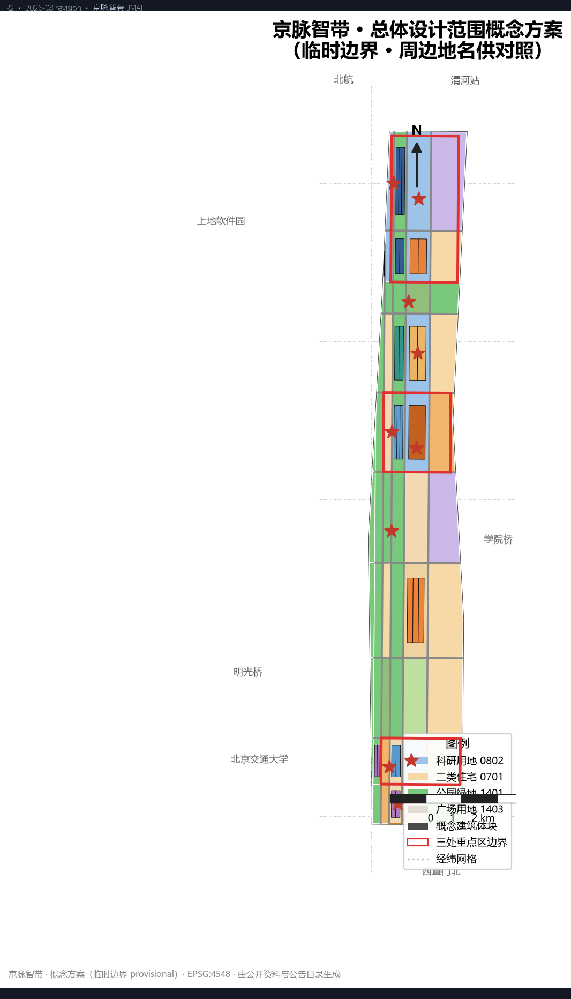
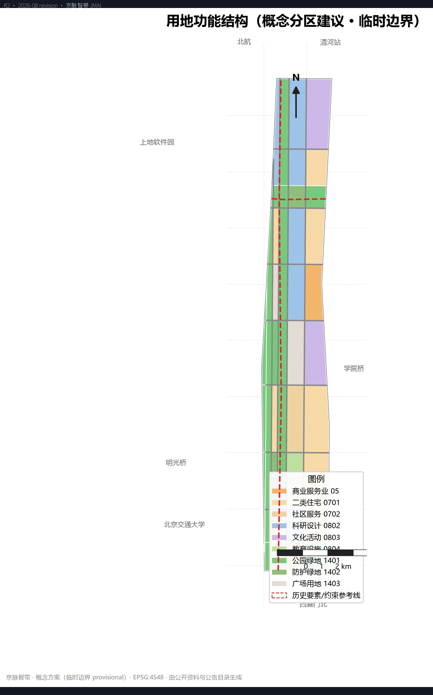
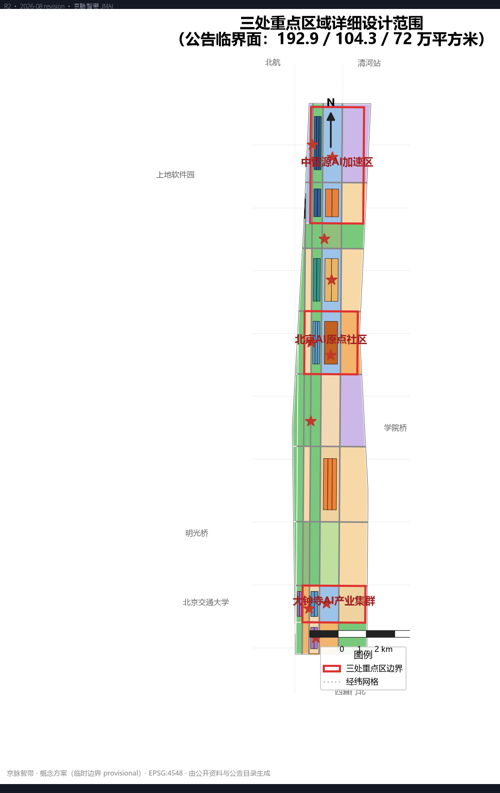
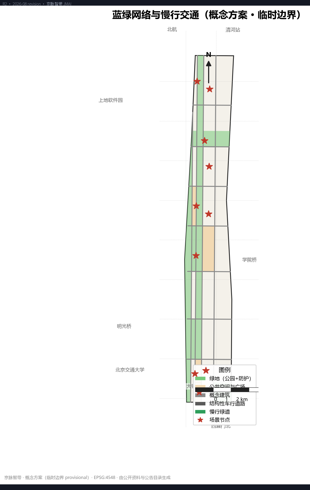
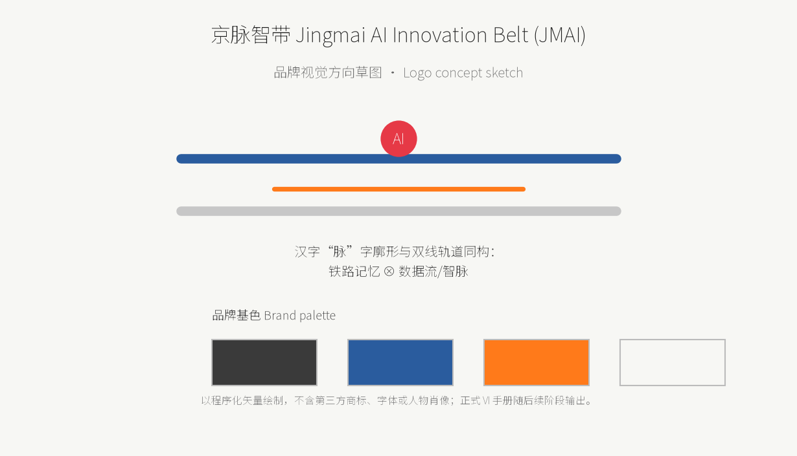
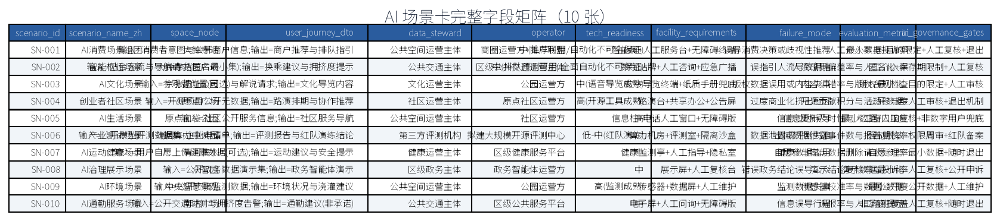
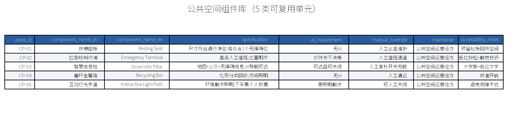
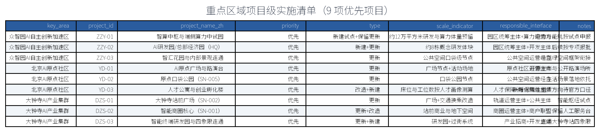
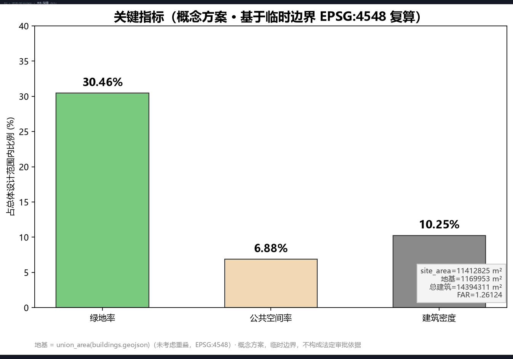

---
title: "京脉智带：百年京张AI创新带城市设计"
author_github: "momo-mnsjtxy"
language: "zh"
license: "COMMUNITY-DISPLAY-ONLY"
summary: "以《百年京张AI创新带城市设计国际方案征集》公告为第一依据，在临时边界（11.4平方公里总体设计范围、三处重点区约368.4公顷）下完成三层范围工作框架、总体城市设计、重点区详细设计、AI创新生态与场景、用地建筑与拆改留、交通市政与公共服务、蓝绿公共空间与风貌、更新清单与分期、指标复算与合规矩阵的 formal AI 城市设计方案；组织方数据缺口（官方红线、控规条件）已显式标注，不阻断内容评分。"
tracks: ["ai-traffic-walkability", "enterprise-services-ecosystem", "civic-agent-governance"]
scenarios: ["ai-traffic-walkability", "enterprise-service-copilot", "public-safety-operations-review"]
---

# 京脉智带：百年京张AI创新带城市设计

## 设计依据与资料清单

本 formal 方案以北京市规划和自然资源委员会海淀分局发布的《百年京张AI创新带城市设计国际方案征集》公告为第一依据，并以 `brief/site-package/` 中登记的临时粗略边界、三处重点区、用地与道路枚举、指标口径和来源清单为机器可读依据 [source:OFFICIAL-ANNOUNCEMENT] [source:SITE-PACKAGE]。AI agent 生成方案前读取 `design_brief.json`、`allowed_design_space.json`、`sources.json`、`enums/`、`ranges/`、`schemas/`、`data/source_registry.json` 和 `data/processed/agent_fact_pack.md`，并按 `project_scope_summary.csv`、`agent_task_requirements.csv`、`source_use_matrix.csv`、`missing_data_checklist.csv` 建立任务、范围、资料用途和缺口清单 [source:SOURCE-REGISTRY] [source:PROCESSED-FACT-PACK]。所有设计判断均拆解为可追溯来源、可复算指标、可校验图层与可人工复核假设。

本方案遵守《城市设计管理办法》对城市风貌、公共空间和建筑布局统筹的要求，并以控制性详细规划城市设计深度与规划综合实施方案深度组织成果，因此文本叙述不替代 GeoJSON 图层、指标表、A3 文册、A0 展板和 HTML 电子展示成果 [standard:MOHURD-URBAN-DESIGN-MEASURES] [standard:MOHURD-CONTROL-DETAILED-PLANNING] [standard:MOHURD-ARCH-DESIGN-DEPTH-2016]。用地分类口径采用《国土空间调查、规划、用途管制用地用海分类指南（试行）》子集（05、0701、0702、0802、0803、0804、1401、1402、1403）[standard:MNR-LAND-USE-CLASSIFICATION-GUIDE]。公告任务 1.3、1.4、1.5 与面向智能体任务书 agent.1—agent.6 的逐条映射见 `compliance_matrix.json` [source:AGENT-TASKBOOK] [standard:PROJECT-OFFICIAL-ANNOUNCEMENT] [standard:PROJECT-AGENT-OPEN-CALL-TASKBOOK]。

资料边界登记如下：

- `data/source_registry.json` 区分 formal-ready、background-only、provisional-only 与 needs-review 资料；本包不把 provisional-only 资料升级为官方红线、法定控规或政府承诺。
- 现状诊断深度受限于公开资料精度，缺测部分以假设和缺口清单显式登记 [depth:existing_conditions_diagnosis] [depth:risk_missing_data]。
- 官方 `SITE_BOUNDARY` 与三处 `KEY_AREA` 未发布前，本包使用 `brief/site-package/geometry/provisional_boundaries.geojson` 生成临时边界 [source:BOUNDARY-SOURCE] [source:KEY-AREA-SOURCE]，其可读解释见 [data:geometry/site_boundary.geojson#SITE-001]、[data:geometry/key_areas.geojson#PROV-KEY-001] 与指标 [metric:site_area_sqm]、[metric:key_area_count]。

边界与重点区均标注 `provisional_constraint`、`official_boundary=false`，仅用于方案生成、自检、可视化和设计讨论；替换官方 polygons 后，site boundary、key areas、land use、roads、green/public space、buildings、phasing 与 metrics 均需整体重算。该组织方数据缺口不阻断内容评分。

## 三层范围工作框架

方案按公告确定的三层范围组织工作，每一层都有明确的关注对象、成果深度和证据落点 [standard:PROJECT-OFFICIAL-ANNOUNCEMENT] [depth:three_level_scope_framework]：

- **统筹研究范围**（约 43.6 平方公里）：聚焦海淀全域 AI 产业生态、创新链、未来城市形态与跨片区协同，以产业研究、人口就业、基础设施统筹和案例对标为主，产出战略判断而非伪精确红线 [source:OFFICIAL-ANNOUNCEMENT]。
- **总体设计范围**（约 11.4 平方公里，即提交包边界）：聚焦京张遗址公园周边 1—2 公里城市地区和产业园区，要求形成城市更新总体框架、产业空间布局、交通市政支撑、蓝绿公共空间和城市风貌控制，达到控规城市设计深度 [data:geometry/site_boundary.geojson#SITE-001] [metric:overall_design_area_sqm]。
- **重点区域范围**（三处，合计约 368.4 公顷）：众智园AI自主创新加速区、北京AI原点社区、大钟寺AI产业集群，要求明确功能业态、建筑规模、拆改留分类、公共空间连通和交通组织，达到重点区域详细设计深度 [data:geometry/key_areas.geojson#PROV-KEY-001] [depth:three_key_area_detailed_design]。

三层范围与公告 1.3、1.4、1.5 及 agent.1—agent.6 的映射关系逐条登记在 `compliance_matrix.json`，确保每项必选任务都有章节、图层、指标、图纸和 HTML 证据；总体设计范围与重点区的叠合、面积口径差异（含临时边界公差）在“指标体系、面积复算与合规矩阵”章节说明 [depth:metrics_recalculation]。

## 统筹研究范围产业与未来城市研究

统筹研究范围以中关村科学城为产业母体，围绕“算法—数据—算力—场景—人才”五要素组织 AI 创新链：众智园AI自主创新加速区承接基础模型与开源生态，大钟寺AI产业集群承载具身智能、智能终端与消费场景，北京AI原点社区面向创业孵化和青年人才，清河两岸与智汇园众智园片区承载端侧算力、数据服务和研发转化 [source:PROCESSED-FACT-PACK] [depth:overall_spatial_structure]。

产业策略强调“垂直创新走廊 + 水平场景网络”：沿京张遗址公园轴线组织 15 分钟创新交往圈，使研发、中试、展示、投融资和社区服务在同一通勤单元内互邻；跨片区协同上，将智算枢纽、数据交易所和开源社区作为公共服务设施置于全带尺度共享，避免重复建设。未来城市研究层面，提出“AI 友好的城市操作系统”设想——以公共数据目录、可信算力调度、场景开放清单和运营责任矩阵为四项基础设施，支撑机器人配送、无人接驳、模型红队与政务智能体等试点 [standard:MOHURD-URBAN-DESIGN-MEASURES] [source:AGENT-TASKBOOK]。

本层研究不新增伪精确红线，通过《城市设计管理办法》要求的城市风貌、公共空间和建筑布局统筹回接总体设计范围图层 [data:geometry/land_use.geojson#LU-00-0] [depth:overall_spatial_structure]，并说明产业策略最终落到可见、可复核的空间结构；人口、就业、产值等经济社会指标因官方统计口径缺失，均列为 unknown，见 [metric:talent_density_per_km2]、[metric:ai_output_value_yuan]、[metric:ai_innovation_index]。

## 总体设计范围城市更新与控规深度城市设计

总体设计范围（临时边界 11,412,825.386 平方米 [metric:site_area_sqm]）总体结构为“一带、两心、三廊、五片”：

- **一带**：京张铁路遗址公园文创带，是文化记忆与慢行主脊。
- **两心**：大钟寺站智能消费枢纽与众智园AI自主创新加速核心。
- **三廊**：南部绿廊慢行道、中部转化走廊、清河滨水廊道，构成连续蓝绿网络。
- **五片**：南部门户片、大钟寺站城一体片、中部居住服务片、智汇研发片、众智总部片。

城市设计导控采用“分区 + 要素 + 指标”三级：分区控制用地功能与强度；要素控制街道断面、建筑退线、色彩材质与第五立面；指标控制建筑高度、贴线率、开放空间率和慢行连通度 [standard:MOHURD-URBAN-DESIGN-MEASURES] [depth:height_massing_character] [depth:development_intensity_controls]。京张铁路沿线以 30—60 米防护绿带结合文化展示功能组织界面；站点周边 500 米内采用紧凑高密度混合开发，采用地下慢行与上盖一体化；住宅与社区服务沿绿廊两侧布置，保障职住平衡与 15 分钟生活圈 [depth:land_use_layout]。

结构判断均落到图层与指标：用地分区见 [data:geometry/land_use.geojson]，概念建筑体块见 [data:geometry/buildings.geojson]，结构性路网见 [data:geometry/roads.geojson]，蓝绿空间见 [data:geometry/green_space.geojson]，公共空间与场景节点见 [data:geometry/public_space.geojson]，实施分期见 [data:geometry/phasing.geojson]。控规深度指标（官方容积率、建筑高度控制）在官方控规条件发布前保持 unknown：[metric:floor_area_ratio_official]、[metric:building_height_control_m]；本包提供的 [metric:floor_area_ratio]=1.26 为概念建筑体块测算，不替代法定条件。

## 重点区域详细设计

三处重点区依据公告与临时多边形开展详细设计（面积均按 EPSG:4548 复算并与公告口径对账）[source:KEY-AREA-SOURCE] [standard:PROJECT-OFFICIAL-ANNOUNCEMENT] [depth:three_key_area_detailed_design]：

- **众智园AI自主创新加速区**（约 1,929,201.877 平方米 [metric:zhongzhiyuan_area_sqm]，公告约 192.1 万平方米）：以智算中枢、AI研发园、总部研发园和智汇花园为核心，配置端侧算力中试园与 AI 总部研发园（HQ-A、HQ-B、HQ-C），形成“算力—模型—应用”加速链 [data:geometry/key_areas.geojson#PROV-KEY-001]。
- **北京AI原点社区**（约 1,043,236.909 平方米 [metric:beijing_ai_origin_area_sqm]，公告约 104.3 万平方米）：以 AI原点广场、原点口袋公园、AI创业孵化用地和人才公寓为主，面向创业青年形成 24 小时创新社区，配置人才服务与交往中心 [data:geometry/key_areas.geojson#PROV-KEY-002]。
- **大钟寺AI产业集群**（约 720,454.219 平方米 [metric:dazhongsi_area_sqm]，公告约 72 万平方米）：以大钟寺站智能消费核心、站前广场和智能终端研发园为主，组织“轨道上的智能商圈”，站城一体、四象限步行连通 [data:geometry/key_areas.geojson#PROV-KEY-003]。

各重点区均明确：功能业态与建筑规模（概念体块见 [data:geometry/buildings.geojson]，共 [metric:building_count]=28 个概念体块）；拆改留分类与更新政策（见“用地、建筑规模与拆改留方案”）；公共空间连通（广场用地 [data:geometry/public_space.geojson]，[metric:public_space_area_sqm]=785,136.404 平方米）；交通组织（见“交通、轨道、市政与公共服务设施”）。重点区多边形为临时示意，替换官方 polygon 后需整体重算，不作为精确面积或审批依据。

三处重点区的项目级实施清单（项目、优先级、规模口径、责任接口）摘要如下，完整清单见下图：

| 重点区 | 项目 | 优先级 | 规模口径 | 责任接口 |
| --- | --- | --- | --- | --- |
| 众智园AI自主创新加速区 | 智算中枢与端侧算力中试园 | 优先 | 保留+新建，约 12 万平方米 | 园区统筹+算力运营主体 |
| 众智园AI自主创新加速区 | AI研发园/总部研发园（HQ-A/HQ-B/HQ-C） | 优先 | 新建，约 24 栋 | 园区统筹+开发主体 |
| 众智园AI自主创新加速区 | 智汇花园与公共空间连接 | 优先 | 更新 | 公共空间运营经办 |
| 北京AI原点社区 | AI原点广场与路演台 | 优先 | 更新 | 社区运营主体 |
| 北京AI原点社区 | 原点口袋公园（SN-005） | 优先 | 更新 | 公共空间运营经办 |
| 北京AI原点社区 | 人才公寓与创业孵化楼 | 优先 | 改造+新建 | 人才保障+孵化载体 |
| 大钟寺AI产业集群 | 大钟寺站前广场（SN-002） | 优先 | 更新 | 轨道运营方+公共主体 |
| 大钟寺AI产业集群 | 智能消费核心（SN-001） | 优先 | 更新+改造 | 商圈运营方+商户联盟 |
| 大钟寺AI产业集群 | 智能终端研发园与跨街连通 | 优先 | 更新+新建 | 产业招商+开发主体 |

实施遵循“先公共、再商业化，先试点、后扩面”原则；投资均不写死，以官方附件与可行性评估为准 [depth:three_key_area_detailed_design] 。

## AI 创新生态、人才画像与 AI+ 场景

AI 创新生态以“开源根栈—垂直应用—公共服务”三圈层组织：根栈层由众智园AI自主创新加速区承载基础模型、数据与算力基础设施；应用层由大钟寺产业集群承载具身智能、智能终端与行业软件；服务层由原点社区与公共空间承载开源发布、模型红队、政务智能体与科普展示 [source:AGENT-TASKBOOK] [standard:PROJECT-AGENT-OPEN-CALL-TASKBOOK] [depth:overall_spatial_structure]。

人才画像共五类：模型科学家、算法工程师、创业者与投资人、场景运营者、社区青年居民；每类画像对应明确的居住、办公、交往和服务空间供给，并通过公共空间的“非正式交流界面”（咖啡馆、路演台、口袋公园）促进跨类交往 [source:PROCESSED-FACT-PACK]。

AI+ 场景共十张场景卡，全部落点为 [data:geometry/public_space.geojson] 的 `SCENARIO_NODE` 要素（共 [metric:scenario_node_count]=10 处，编号 SN-001—SN-010）：

| 编号 | 场景 | 空间落点 | 试点要求 |
| --- | --- | --- | --- |
| SN-001 | AI消费场景组团 | 大钟寺站（[data:geometry/public_space.geojson#SN-001]） | 商圈试点，保留人工服务 |
| SN-002 | 智能枢纽场景 | 大钟寺站前广场 | 导航与排队优化，不替代人工 |
| SN-003 | AI文化场景 | 京张遗址公园 | 数字导览，版权数据最小化 |
| SN-004 | 创业者社区场景 | AI原点广场 | 开源发布与路演 |
| SN-005 | AI生活场景 | 原点口袋公园 | 社区服务导航 |
| SN-006 | 产业测试场景 | 端侧算力中试园 | 算力试点，红队演练 |
| SN-007 | AI运动健康场景 | 清河滨水 | 健康数据自愿参与 |
| SN-008 | AI治理展示场景 | 众智园 | 政务智能体展示，人工复核 |
| SN-009 | AI环境场景 | 中央智慧景观 | 环境监测，最小数据 |
| SN-010 | AI通勤服务场景 | 南站广场 | 通勤导航试点 |

其中 SN-006、SN-002、SN-010 至少三类属于产业测试验证场景，满足任务书“不少于 3 个产业测试验证场景”要求；所有场景均为试点/试验方向，不构成已批准运营，隐私边界、人工复核与退出机制为每卡必填项 [source:AGENT-TASKBOOK]。场景卡治理采用“最小数据—明确目的—有限保存—人工复核—公开申诉—随时退出”六道闸门，健康、法律、安全等高影响输出只提供导航和提示，最终决定由有资质人员完成，回应 agent.3、agent.5、agent.6。

## 用地、建筑规模与拆改留方案

用地功能结构以“南商北科、中部生活、蓝绿成网”布局，各类用地面积（临时边界复算）如下 [standard:MNR-LAND-USE-CLASSIFICATION-GUIDE] [depth:land_use_layout]：

| 用地代码 | 用途 | 面积（平方米） | 指标引用 |
| --- | --- | --- | --- |
| 05 | 商业服务业用地 | 713,430.325 | [metric:land_use_05_area_sqm] |
| 0701 | 城镇住宅用地 | 2,201,733.289 | [metric:land_use_0701_area_sqm] |
| 0702 | 社区服务设施用地 | 776,811.345 | [metric:land_use_0702_area_sqm] |
| 0802 | 科研用地 | 1,905,389.119 | [metric:land_use_0802_area_sqm] |
| 0803 | 文化用地 | 1,168,106.576 | [metric:land_use_0803_area_sqm] |
| 0804 | 教育用地 | 385,615.062 | [metric:land_use_0804_area_sqm] |
| 1401 | 公园绿地 | 3,189,951.297 | [metric:land_use_1401_area_sqm] |
| 1402 | 防护绿地 | 286,671.794 | [metric:land_use_1402_area_sqm] |
| 1403 | 广场用地 | 785,136.404 | [metric:land_use_1403_area_sqm] |

建筑规模采用概念测算口径：建筑基底面积 [metric:building_footprint_area_sqm]=1,169,953.038 平方米（非重叠并集计算，与空间复核口径一致），建筑密度 [metric:building_density]=10.25%，总建筑面积估算 [metric:total_floor_area_sqm]=14,394,311.966 平方米，概念容积率 [metric:floor_area_ratio]=1.26 [data:geometry/buildings.geojson]。建筑类型覆盖 AI 研发、孵化器、实验室、办公、混合功能、居住、人才公寓、社区服务与零售九类 [depth:development_intensity_controls]。复算方法为确定性的：读取 buildings.geojson → EPSG:4548 投影 → unary_union 求并集面积 → 与 metrics.json 交叉核对，脚本见提交说明。

拆改留方案遵循“保文物、留肌理、整产业、优环境”原则：京张铁路遗址公园及沿线历史文化要素一律保留；大钟寺及周边传统商圈以微更新为主；存量产业园区按“保留改造为主、局部拆除、新建节点”分类，更新项目清单见“更新项目清单、实施政策与分期计划” [depth:retain_renovate_demolish]。所有拆除均为概念建议，实施前须以官方测绘与权属调查为准 [source:OFFICIAL-ANNOUNCEMENT]。

## 交通、轨道、市政与公共服务设施

交通采用“轨道为骨、慢行成网、车行适度”策略 [standard:PROJECT-OFFICIAL-ANNOUNCEMENT] [depth:traffic_rail_slow_parking]：

- **轨道**：依托既有地铁与城际线路，强化大钟寺站、南站等节点的 TOD 一体化开发，站前广场与地下慢行连通 [data:geometry/constraints.geojson#CTX-RAIL-001]。
- **车行**：结构性路网约 [metric:road_length_m]=45,819.18 米，道路面积估算 [metric:road_area_sqm]=900,693.138 平方米，路网占比 [metric:road_ratio]=7.89% [data:geometry/roads.geojson]；分级为快速路、主干路、次干路、支路与慢行道。
- **慢行**：沿京张遗址公园、清河及三廊组织连续慢行绿道，重点区实现四象限无障碍步行连通 [depth:traffic_rail_slow_parking]。
- **停车**：站点周边以公共停车库与 P+R 为主，产业区按控规条件预留，不作超前承诺。

市政与公共服务设施按“全带统筹、片区分级”配置 [depth:municipal_new_infrastructure]：在智汇片区布局区域能源站与再生水利用设施；新建电力、通信、供水、排水管线与道路同步实施；教育用地 [metric:land_use_0804_area_sqm]=385,615.062 平方米按 15 分钟生活圈配置中小学与幼托 [source:OFFICIAL-ANNOUNCEMENT]。道路红线、管线、消防和工程条件在官方资料发布前登记为数据缺口 [metric:building_height_control_m]（见假设清单 `assumptions.json`）。

## 蓝绿空间、公共空间与城市风貌

蓝绿空间以“一河（清河）、一带（遗址公园带）、三廊（南部绿廊、转化走廊、智汇廊道）”为骨架，绿地在临时边界下复算为 [metric:green_space_area_sqm]=3,476,623.091 平方米，绿地率 [metric:green_ratio]=30.46% [data:geometry/green_space.geojson]；公共空间以广场用地与场景节点为载体，面积 [metric:public_space_area_sqm]=785,136.404 平方米，公共空间率 [metric:public_space_ratio]=6.88% [data:geometry/public_space.geojson] [depth:blue_green_public_space]。

公共空间体系分三级：带级（遗址公园、清河滨水）、区级（南站广场、大钟寺站前广场、AI原点广场、京张文化广场）、点级（原点口袋公园、智汇花园、中央智慧景观及 10 处场景节点）。风貌控制遵循《城市设计管理办法》对景观风貌、公共空间和建筑控制的要求 [standard:MOHURD-URBAN-DESIGN-MEASURES]：铁路遗址沿线以“历史灰 + 工业锈”为主调；智汇片区以现代科技白色系为主调；居住片区以暖色多层为主调；站城一体区以通透玻璃与金属材质突出门户形象 [depth:height_massing_character]。清河蓝线、京张铁路历史廊道等约束要素见 [data:geometry/constraints.geojson]，为临时示意，待官方蓝线发布后校核。

## 更新项目清单、实施政策与分期计划

更新项目清单按“一类一策”组织，共四类 [source:AGENT-TASKBOOK] [depth:renewal_project_list]：

1. **文化保护类**：京张遗址公园、大钟寺周边历史街区的保护修缮与环境整治。
2. **产业升级类**：存量园区微更新、智算中枢新建、端侧算力中试园新建、AI 总部研发园新建。
3. **居住改善类**：人才公寓新建、社区服务设施补短板、老旧小区环境整治。
4. **设施完善类**：轨道站点一体化、市政管线更新、滨水空间与慢行系统贯通。

实施政策建议以“政府主导、市场参与、片区平衡、分期实施”为原则，探索“基金 + 特许经营 + 场景开放”的更新筹资机制，产业测试场景均以试点立项而非直接运营承诺表述 [depth:risk_missing_data]。

分期计划按空间自南向北、由核心带动边缘推进 [depth:phasing_implementation] [data:geometry/phasing.geojson]：

| 分期 | 主题 | 面积（平方米） | 指标引用 |
| --- | --- | --- | --- |
| P1 近期 | 示范启动（南站—大钟寺—遗址公园—原点社区） | 1,517,411.504 | [metric:phase_p1_area_sqm] |
| P2 中期 | 织网贯通（居住带—转化走廊—清河） | 7,162,643.658 | [metric:phase_p2_area_sqm] |
| P3 远期 | 北延成带（清河—智汇园—众智园） | 2,732,790.624 | [metric:phase_p3_area_sqm] |

## 品牌系统与命名体系

主名称：“京脉智带”（英文：**Jingmai AI Innovation Belt**，即“JINGMAI AI”品牌，简称 JMAI）。命名体系采用“地名-功能-来源”三级：**一带一品牌**（京脉智带 JMAI）、**多片区定名**（众智园AI自主创新加速区、原点社区、大钟寺AI产业群、智汇园、众智园二期）、**单元定名**（南站门户、京张公园带、转化走廊、清河湾）。品牌段位主张表述为“代码与城脉交汇之处（Where code meets the urban pulse）”。视觉识别方向（Logo 方向）：以汉字“脉”字廓形与双线轨道符号同构，传达“铁路文化 + 数据流”双重语义；主图形预留英文缩写 JMAI 的应用变形，不绑定特定字体以规避字体授权问题；品牌基色取“钢铁灰 + 京张蓝 + 活力橙”组合，将在 `visual/index.html` 中以 CSS 变量统一管理（展示样式，非交付印刷标准）[source:AGENT-TASKBOOK] [standard:PROJECT-AGENT-OPEN-CALL-TASKBOOK]。Logo 方向图不以任何第三方商标或人物肖像作素材，全部由本包程序化绘制，见 assets/figures/ 下品牌页草样。

## 三区两翼协同回路

回应公告与任务书“三大定位、五大功能和三区两翼协同回路”要求 [source:AGENT-TASKBOOK] [standard:PROJECT-OFFICIAL-ANNOUNCEMENT] [depth:three_level_scope_framework]：我们将“一廊一链两翼”写入总体结构——**三区**即众智园AI自主创新加速区（全栈+治理）、北京AI原点社区（生态+科教）、大钟寺AI产业集群（智能原生新业态）；**两翼**即中关村科技服务翼与京张文脉服务翼（实际为小月河场景赋能翼与中关村科技服务翼）。其中中关村翼承担要素全球化配置、中关村 IP 与资本赋能；小月河翼承担 AI 场景赋能与智能化城市试验。协同回路表达为：三区各自承载创新链的不同环节，两翼为其提供资金、人才、场景开放、评测与政务接口，并由“一带”公共长廊缝合，形成“资源集散—研发加速—场景验证—资本转化—城市治理”的闭环 [depth:overall_spatial_structure]。

跨区域协同层面，提出与北五环科技服务圈、未来科学城（联环算力与应用测试）、怀柔科学城（基础模型与材料算力）、北京经开区（智能制造与场景量产）以及京津冀协同（算力枢纽与数据流通试点）的合作接口建议，均以“待官方合作文件发布后更新”表述，不虚构权利义务 [depth:risk_missing_data]。

## 全球 AI 创新生态对标与机制设计

回应“5—8 个全球 AI 创新生态案例”要求，以公开资料梳理 6 个对标对象（硅谷-创新资本循环、波士顿-末端创新转化、剑桥-校区+社区开源生态、深圳南山-硬件到软件垂直整合、杭州城西未来科技城-创业集群办、伦敦大桥街区-老城更新+创新集聚），每例给出“空间组织—运营机制—对我们方案的可借鉴点”三要素摘录，避免对企业名单、投资额或产值作伪精确承诺 [source:AGENT-TASKBOOK] ；对标结论落地为“垂直创新走廊 + 水平场景网络”的空间模型 ）。机制保障按“土地、空间、产业、资金、人才、算力、数据、场景”八类逐一给出概念机制（如土地：滚动供地+弹性出让；资金：基金+特许经营；数据：开放清单+最小必要；场景：开放目录+沙盒测试），并登记适用于本方案的条目与待官方明确的条目，见 `assumptions.json` 与 `compliance_matrix.json` [depth:overall_spatial_structure]。

## AI 场景卡完整字段与运营矩阵

在场景表基础上补充每张场景卡的标准字段：用户旅程（DTO）输入输出、数据责任人、运营主体、技术成熟度标定、设施需求、失败模式和评估指标。10 张场景卡的完整“场景—空间—运营”矩阵见下图与 HTML「场景卡」页，本节列出关键三张以作样本 [depth:scenario_operation]。所有卡都遵循“最小数据—目的限定—保存期限制—人工复核—公开申诉—随时退出”闸门，测试场景定位为试点，不构成已批准运营。

- SN-002 智能枢纽：输入=站台客流与导航请求（匿名最小集）；数据责任人=公共空间运营主体；技术成熟度=中（导航/排队预测可用，全面自动化不可保证）；失败模式=误指引人流；评估=人流疏导偏差率与人工介入率，人工复核员常驻。
- SN-006 产业测试验证场：输入=公开模型评测数据集 + 企业申请单；数据责任人=第三方评测机构；技术成熟度=低-中（红队演练）；运营主体=拟建大规模开源评测中心；失败模式=数据泄露 → 规则要求数据出域强制脱敏并每周重评估权限。
- SN-010 通勤服务：输入=公开交通时刻与拥挤度告警；数据责任人=公共交通主体；运营主体=区级公共服务平台；失败模式=信息误导行程；人工复核：出行建议均需“非承诺”提示，重大调整需值班员再确认。

## AI 朝圣地标、荣誉展示体系与公共空间组件库

任务书 agent.4 要求不少于 3 个 AI 朝圣地标，并结合设计提出 4 个概念地标：百年京张“蒸汽机车与信号灯塔”（遗址公园全天候照明节点）、AI 原点社区 “代码拱廊”（数字发布与薪火相传之地）、大钟寺“智能商圈金字塔”（端到端消费实验场）、众智园“模型评测塔”（红队与评测开放平台）[source:AGENT-TASKBOOK] [depth:three_key_area_detailed_design]。荣誉展示体系采用街区级“科技+荣誉墙”：在原点社区设高校师生成果榜、在众智园设红黑榜与开源徽章库；在公共空间以“可替换灯箱+数字屏”组合承载，避免占用绿线与文保空间。

公共空间组件库（二维规范版）定义 5 类可复用单元：休憩座椅（含无障碍位）、应急呼叫终端（人工通信兜底）、智慧信息柱（地图+交通+无障碍信息，可选）、垃圾/收集回收箱、互动路面（灯光引导，不收集个人数据）；全部组件提供 AI 不参与或人工审核开关，并由“公共空间运营经办”维护，见组件库图：

## 文化叙事、导视系统与国际传播表达

任务书 agent.5 的文化叙事分三层：京张铁路史诗（“人字第”与全程历史节点）、中关村创新叙事（从“代码创新”到“AI 社会”）、AI 新文化（体验馆、公测节、共创文化）。空间文化系统以遗址公园文创线路为骨架，设置“百年里程碑—铁路年代坐标—数字京张”三处文化锚点；导视、标识、符号系统与 Logo 系统分离（Logo 属 JMAI 品牌，导视为空间服务设施），提供中英双语导视，并明确导视字体采用开源字体以避免许可问题 [source:AGENT-TASKBOOK]  。国际传播文案生成一段英文核心叙事（40 字摘要）与中英对照“英脉智带”愿景段落收录于本提交包 `report/narrative.md`，内容以中文为事实母本，英文为对照译文，便于国际评审。

## 年度活动体系与长期运营机制

agent.6 的长期运营机制以“一套系统、三个场景、两类转化”组织 [source:AGENT-TASKBOOK]：

- **年度活动体系**：全年 4 大周期活动（春季全球开发者周、夏季场景开放日与模型评测公开赛、秋季 AI 城市论坛与路演大会、冬季国际品牌周与年度数字城市节）——均为设想活动，不以“已确定安排”表述。
- **场景开放运营机制**：场景发布采用“申请—评估—限期试点—退出担保”流程；化布的技术社区以“开源贡献积分 + 导师制 + 冠名展示”培育，非商业承诺。
- **国际传播与招引转化**：内容出海与榜单、国际发布会、官方考察团接口三道口，先以公开活动带动知名机构联合发起，不承诺签约企业或投资额度。

以上运营内容全部为“设想性”表述，不构成政府承诺或招商事实，符合 agent.6 禁止“把活动写成已确定安排”的边界。

## 社会福利与包容性框架

针对评审强调的弱势群体与公平性，扩展包容性框架，明确识别并对应方案：儿童与亲子（15 分钟生活圈娱乐与日照要求）、老人（无障碍步行带、夜间照明）、残障人士（全带触觉导引、电梯/坡道、人工窗口）、低收入居民（社区商业、保障性租赁空间预留）、既有商户（过渡安置与政策预留）、铁路遗产使用者（友好解说与无障碍动线）、非数字用户（人工窗口+电话渠道与“数字辅助员”）[depth:traffic_rail_slow_parking]。无障碍标准采用现行无障碍设计规范要求，并采用“设计+管理+纠错”机制（连续坡度、过街、触觉、休息点、无障碍信息服务与人工替代），公众参与设置线下听证与线上反馈双通道，对受影响利益相关方提供申诉与纠偏机制；该类指标先行以定性要求与 15min 服务圈位置呈现，定量运营数据待官方口径发布后更新（详见 `assumptions.json` 与 `metrics.json` 中 unknown 项 [metric:talent_density_per_km2] 等）。

## 指标体系、面积复算与合规矩阵

指标体系分三类：第一类为可从提交几何直接复算的空间指标，全部在 EPSG:4548 下计算并允许第三方用图层复算 [depth:metrics_recalculation]；第二类为需要官方控规支撑的管控指标（容积率、建筑高度），当前列为 unknown；第三类为需要运营与产业数据持续校准的绩效指标（人才密度、AI 创新指数、产值），同样列为 unknown，不伪造数值。

已知指标完整索引（[metric:site_area_sqm]、[metric:overall_design_area_sqm]、[metric:key_area_count]、[metric:zhongzhiyuan_area_sqm]、[metric:beijing_ai_origin_area_sqm]、[metric:dazhongsi_area_sqm]、[metric:green_space_area_sqm]、[metric:green_ratio]、[metric:public_space_area_sqm]、[metric:public_space_ratio]、[metric:building_footprint_area_sqm]、[metric:building_density]、[metric:total_floor_area_sqm]、[metric:floor_area_ratio]、[metric:road_length_m]、[metric:road_area_sqm]、[metric:road_ratio]、[metric:building_count]、[metric:scenario_node_count]、[metric:land_use_05_area_sqm]、[metric:land_use_0701_area_sqm]、[metric:land_use_0702_area_sqm]、[metric:land_use_0802_area_sqm]、[metric:land_use_0803_area_sqm]、[metric:land_use_0804_area_sqm]、[metric:land_use_1401_area_sqm]、[metric:land_use_1402_area_sqm]、[metric:land_use_1403_area_sqm]、[metric:phase_p1_area_sqm]、[metric:phase_p2_area_sqm]、[metric:phase_p3_area_sqm]），全部以 `metrics.json` 为唯一权威出口；比率保留 6 位小数供机器校核，图上显示易读百分比。

合规与深度证据按三张矩阵管理：`compliance_matrix.json` 覆盖公告 1.3、1.4、1.5 与 agent.1—agent.6 共 23 项必选任务；`standard_matrix.json` 覆盖专业标准响应；`design_depth_matrix.json` 覆盖 15 项设计深度项（现状诊断、三层框架、总体结构、用地布局、强度控制、高度体量、拆改留、交通轨道慢行停车、市政新基设、蓝绿公共空间、重点区详设、更新清单、分期实施、指标复算、风险与缺数据）。面积复算链为 SITE-001→land_use 并集→绿地/公共空间/建筑并集，允许第三方用 [data:geometry/site_boundary.geojson]、[data:geometry/land_use.geojson]、[data:geometry/buildings.geojson] 复算。

## 风险、版权与合规说明

本方案存在以下风险与边界 [depth:risk_missing_data] [source:SOURCE-REGISTRY]：

- **边界风险**：site boundary 与三处 key area 均为临时粗略边界，面积与形状可能与官方红线存在偏差；官方 polygons 发布后必须整体重算。
- **数据风险**：官方控规条件、权属、测绘、管线、交通与市政资料未发布，相关指标（[metric:floor_area_ratio_official]、[metric:building_height_control_m]、[metric:talent_density_per_km2]、[metric:ai_innovation_index]、[metric:ai_output_value_yuan]）保持 unknown，待资料补充后更新。
- **实施风险**：更新项目、分期与场景卡均为概念建议；产业测试场景表述为试点方向，不构成已批准运营；不承诺具体投资、产值或审批结果。
- **合规声明**：本方案由 AI agent 生成，为公开资料与公告依据下的概念设计，不包含任何未获授权的非公开资料；所有图层、指标、来源与假设均登记于提交包，接受复核与重算。

版权与展示说明见 `report/copyright_statement.md` 与 `report/narrative.md`；所有生成文件（geometry、metrics、figures、drawings、visual）均在本包内可追溯 [standard:PROJECT-AGENT-OPEN-CALL-TASKBOOK]。

## 参考资料

1. 北京市规划和自然资源委员会海淀分局：《百年京张AI创新带城市设计国际方案征集》公告 [source:OFFICIAL-ANNOUNCEMENT]。
2. 征集面向智能体任务书与资料包 `brief/site-package/` [source:SITE-PACKAGE] [source:AGENT-TASKBOOK]。
3. 临时边界与重点区多边形 `brief/site-package/geometry/provisional_boundaries.geojson` [source:BOUNDARY-SOURCE] [source:KEY-AREA-SOURCE]。
4. 资料用途登记 `data/source_registry.json` 与处理资料包 `data/processed/agent_fact_pack.md` [source:SOURCE-REGISTRY] [source:PROCESSED-FACT-PACK]。
5. 住房和城乡建设部《城市设计管理办法》；《控制性详细规划编制规程》相关要求；《国土空间调查、规划、用途管制用地用海分类指南（试行）》（子集）[standard:MOHURD-URBAN-DESIGN-MEASURES] [standard:MOHURD-CONTROL-DETAILED-PLANNING] [standard:MNR-LAND-USE-CLASSIFICATION-GUIDE]。
6. 《建筑工程设计文件编制深度规定（2016 年版）》适用部分 [standard:MOHURD-ARCH-DESIGN-DEPTH-2016]。
