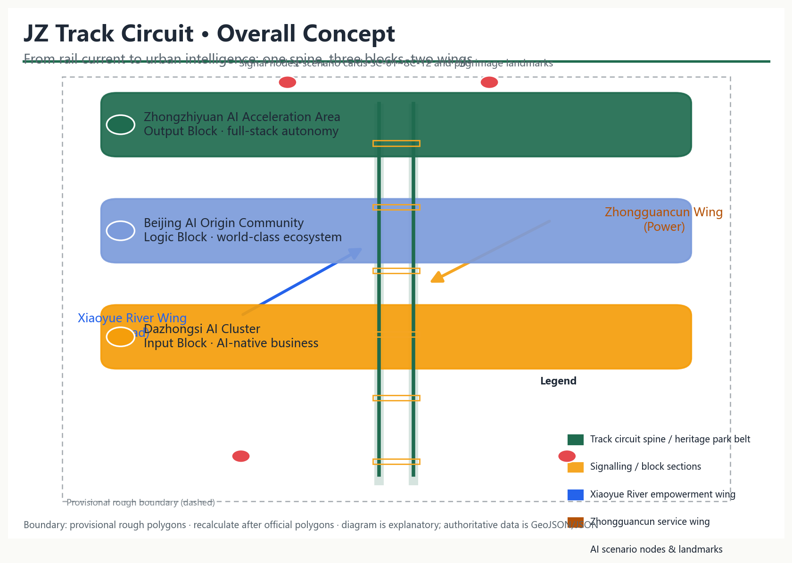
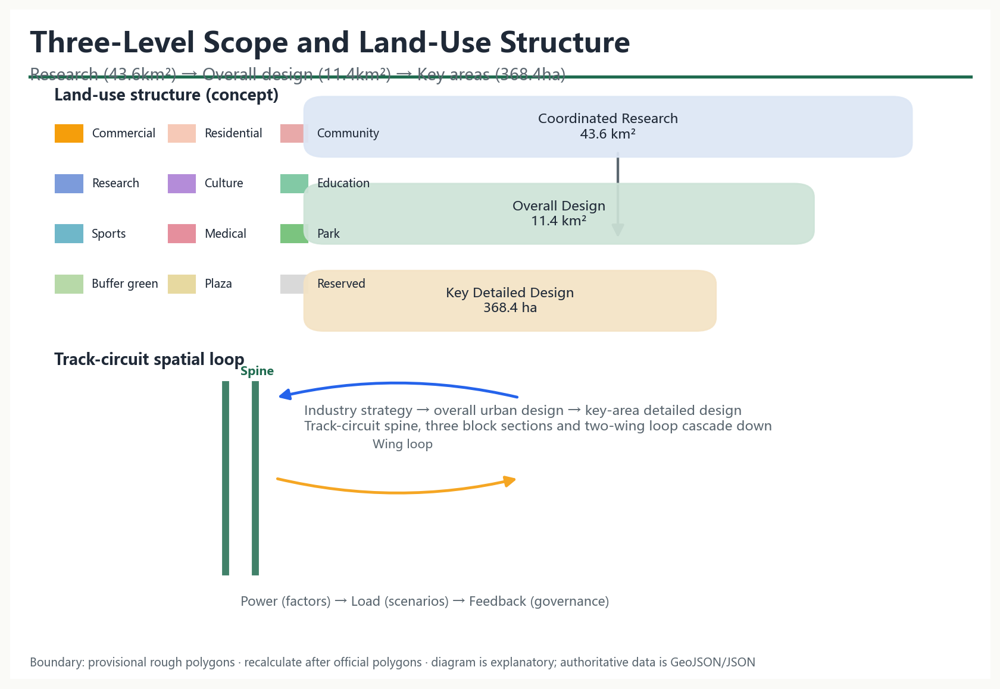
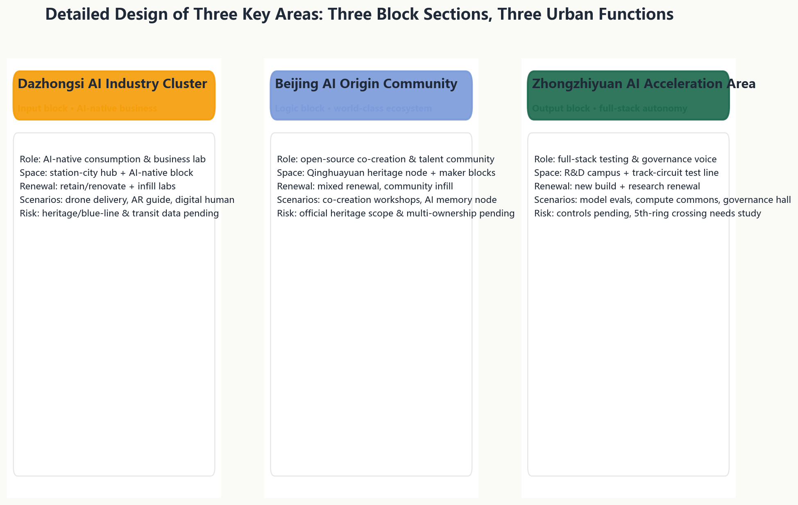
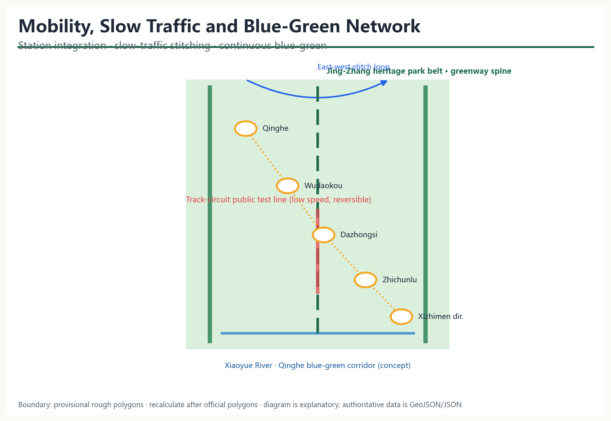
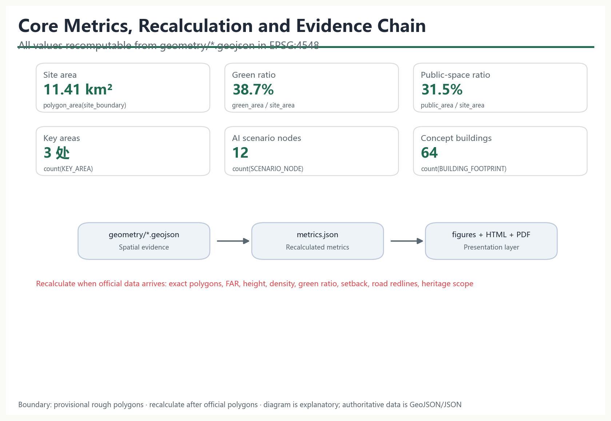

# Jing-Zhang Track Circuit: From Rail Current to Urban Intelligence

## Design Basis and Source List

This proposal takes the Prequalification Announcement for the International Urban Design Open Call for the Centennial Jing-Zhang AI Innovation Belt (Haidian Branch, Beijing Municipal Commission of Planning and Natural Resources, 2026-05-09) as the governing project basis, covering the three scope levels, three key areas, announced areas, design tasks and deliverable depth [source:OFFICIAL-ANNOUNCEMENT]; the open-call taskbook excerpt for global AI agents adds the three positionings, five functions, three areas and two wings, six agent tasks and the unified boundary clause [source:AGENT-TASKBOOK]. Industrial context draws on the "three areas and two wings" layout of the Beijing Science and Technology Commission and Zhongguancun Administrative Committee [source:THREE-AREAS-WINGS] and Haidian's "1+X+1" modern industrial system [source:HAIDIAN-1X1].

Source status follows the public source registry: the official announcement, taskbook and professional-standard snapshots support formal claims; the maintainer-derived provisional boundary is used only for generation, visualisation and intake self-checks [source:BOUNDARY-SOURCE]; Jing-Zhang railway history is background material for narrative only and supports no spatial-control claim [source:JZ-RAILWAY-HISTORY]. Complete machine indexes of sources, metrics, standards, design depth and task coverage are held in `sources.json`, `metrics.json`, `compliance_matrix.json`, `standard_matrix.json` and `design_depth_matrix.json`.

## Three-Level Scope Framework

The three levels cascade from industry strategy to overall urban design to key-area detailed design: the coordinated research area (~43.6 km²) addresses a world-class AI innovation ecosystem and future-city form; the overall design area (~11.4 km²) reaches regulatory-plan-level urban design depth; the key detailed-design area (~368.4 ha) covers, from north to south, the Zhongzhiyuan AI Acceleration Area, the Beijing AI Origin Community and the Dazhongsi AI Industry Cluster [source:OFFICIAL-ANNOUNCEMENT] [depth:three_level_scope_framework].

No official precise polygons are yet available in the site package; this proposal uses the maintainer-derived provisional rough boundary, checked against the announced areas in EPSG:4548 [data:geometry/site_boundary.geojson#SITE-001] [metric:site_area_sqm]. The provisional boundary is for concept generation, visualisation and intake self-checks only — not an official redline, approval basis or precise-area basis [source:BOUNDARY-SOURCE]; when official polygons are published, all layer areas, metrics, drawings and visuals will be recalculated [depth:metrics_recalculation].

## Coordinated Research Area: Industry and Future City Research

### Overall concept, naming system and logo direction

Primary name: **Jing-Zhang Track Circuit (JZ-TC)**. The track circuit was the railway's first sensing-signalling-interlocking-dispatching technology: rails are divided into block sections, current senses occupancy, signals communicate state, interlocking constrains conflict, and a control centre coordinates. A century later, the proposal reads this heritage main line as a city-scale track circuit: rails sense location, current carries state, signals express public meaning, interlocking sets boundaries, and dispatching becomes human-in-the-loop co-governance [standard:PROJECT-AGENT-OPEN-CALL-TASKBOOK].

The naming system forms a stable "one belt, three blocks, two wings, nodes" language: the belt is the track-circuit main line (Jing-Zhang heritage park belt); the three blocks are the input block (Dazhongsi AI Industry Cluster), logic block (Beijing AI Origin Community) and output block (Zhongzhiyuan AI Acceleration Area); the two wings are the Zhongguancun technology-service (power) wing and the Xiaoyue River scenario-empowerment (load) wing; nodes are numbered JZ-TC-01… and map to scenario cards and pilgrimage landmarks [depth:overall_spatial_structure].

Logo direction: two parallel rails form a "ren" (人) glyph and loop symbol with a signal-current curve at the centre, expressing autonomy, loop, signal and collaboration; visual identity uses railway signal semantics — signal green (open), amber (testing), red (human review required) — with rail grey and heritage brown; open geometric sans-serif typefaces are recommended. All identity, signage and event visuals are original concepts of this proposal with no third-party trademarks, fonts or images [source:AGENT-TASKBOOK].

### Three positionings, five functions and the three-area-two-wing loop

The proposal answers the three positionings (centennial Jing-Zhang cultural belt, urban AI lifestyle experience belt, AI convergence innovation belt) and five functions (full-stack autonomous innovation, world-class AI ecosystem, AI+ scenario empowerment paradigm, smart vibrant AI city, global voice in AI governance). The three areas and two wings form a functional loop: the Zhongguancun wing supplies factors, capital and IP; Dazhongsi receives scenario demand; the Origin Community incubates the ecosystem; Zhongzhiyuan delivers full-stack testing and governance output; the Xiaoyue River wing returns outcomes to daily, perceptible city life [source:THREE-AREAS-WINGS] [source:AGENT-TASKBOOK].

### Global AI ecosystem cases and transferable mechanisms

Seven publicly documented AI ecosystem cases are used to derive spatial, operational and scenario mechanisms; no unverified company lists, investment amounts or output figures are cited:

| Case | Transferable mechanism | Application in this belt |
| --- | --- | --- |
| Zhongguancun Software Park (Beijing) | Gradient ecosystem of anchors + SMEs + public platforms | Origin Community co-creation workshops; Zhongguancun wing liaison hall |
| Stanford Research Park (US) | Spatial adjacency of university, industry and venture capital | College Road talent station; research-incubation mixed blocks |
| King's Cross (London) | Transport-hub renewal growing a knowledge community | Dazhongsi station-city hub and AI-native blocks |
| one-north (Singapore) | Park-public-space-testbed integration | Track-circuit public test line; heritage park belt |
| Kashiwa-no-ha (Japan) | Social experiments and operator-led scenario iteration | Xiaoyue River low-speed trials and operation mechanism |
| Helsinki Smart District (Finland) | Open data and public scenario procurement | Scenario-card applications; public review in the governance hall |
| Yunqi Town (Hangzhou) | Annual events accumulating developer community and brand | Four-season event system; JZ-TC brand IP |

The evidence is that a durable AI innovation belt is built on public space that carries testing, open mechanisms that attract talent, and brand events that accumulate community — not on park-stacking alone [source:AGENT-TASKBOOK] [depth:land_use_layout].

## Overall Design Area: Urban Renewal and Regulatory-Plan-Level Urban Design

### Spatial structure: one spine, three blocks, two wings, twelve nodes

The overall structure takes the Jing-Zhang heritage park belt as the track-circuit main line linking the three block sections, with the two wings forming a power-load loop and twelve AI scenario nodes distributed along the spine: "one spine, three blocks, two wings, twelve nodes" [metric:scenario_node_count] [depth:overall_spatial_structure].

### Land use and renewal framework

Land use is organised around the public spine with research-commercial-residential-service gradients: Zhongzhiyuan is research-led (0802), Dazhongsi is commercial (05) and cultural (0803), the Origin Community mixes research, education, housing and community services, and continuous parks (1401) and plazas (1403) line the heritage park [data:geometry/land_use.geojson#LU-001] [standard:MNR-LAND-USE-CLASSIFICATION-GUIDE]. Buffer green (1402) runs along the boundary and reserved land (16) is kept for future AI services [data:geometry/land_use.geojson#LU-008].

The renewal framework follows a conceptual logic of retaining urban fabric, renovating underused space, infilling AI functions and reserving future expansion; existing-building data, ownership and demolish/renovate conclusions await official data and are directional only [depth:retain_renovate_demolish] [standard:MOHURD-CONTROL-DETAILED-PLANNING]. FAR, height, density and other regulatory controls are missing and recorded as pending [metric:floor_area_ratio].

### Jing-Zhang heritage park belt

The spine overlays the park as green base with a low-speed, reversible, human-auditable track-circuit public test line and a signal-language wayfinding system, forming a composite belt of culture, public life, AI testing and governance review [data:geometry/constraints.geojson#CON-001] [depth:blue_green_public_space]. Its alignment is inferred from the announcement text; the precise route follows official drawings and the built park design.

## Detailed Design of Key Areas

Each key area is developed through positioning, spatial structure, building renewal, mobility, public space, AI scenarios and implementation risk, on the provisional polygons [data:geometry/key_areas.geojson#KEY-001] [depth:three_key_area_detailed_design].

### Zhongzhiyuan AI Acceleration Area (output block)

Positioned as the output block for full-stack autonomous innovation and global voice in AI governance: research campuses with a track-circuit test and validation field and the 5th-Ring AI governance hall along the spine; spatial structure combines research blocks, a public test line and governance nodes; buildings are conceptual R&D, lab and incubator volumes with both new build and research-led renewal [data:geometry/buildings.geojson#BLD-001]; mobility studies the 5th-ring crossing node and Qinghe-direction rail integration; risks include missing regulatory controls and the need for a dedicated crossing study.

### Beijing AI Origin Community (logic block)

Positioned as the logic block for a world-class AI innovation ecosystem: drawing on Wudaokou, College Road and the Qinghuayuan station heritage, the community combines open-source co-creation workshops, an AI memory node and a talent station; mixed renewal and community infill preserve street fabric while inserting shared labs and talent housing [data:geometry/buildings.geojson#BLD-020]; station integration and slow-traffic stitching are strengthened; risks include the pending official heritage scope and multi-ownership coordination [data:geometry/constraints.geojson#CON-002].

### Dazhongsi AI Industry Cluster (input block)

Positioned as the input block for AI-native business: a station-city hub organising an AI-native consumption living room and a future-consumption lab; space is primarily retained and renovated with infill lab buildings, and cultural land carries AI culture display [data:geometry/land_use.geojson#LU-005]; Dazhongsi station integration and walkability are strengthened; risks include heritage, blue-line and traffic-safety constraints pending verification and the need for an operator to deepen the commercial mix.

## AI Innovation Ecosystem, Personas, and AI+ Scenarios

### User personas (6)

| Persona | Needs | Matching scenarios and spaces |
| --- | --- | --- |
| AI startup founder | Low-cost space, compute, testing, funding links | Co-creation workshop, full-stack test field, liaison hall |
| University researcher / visiting scholar | Open data, cross-disciplinary exchange | Memory node, research blocks, international forum |
| Local resident (incl. elderly and children) | Accessibility, slow traffic, community services | Heritage park, community facilities, health navigation |
| Commuter | Rail transfer, dining, night vitality | Dazhongsi station living room, on-time transfer info |
| International developer / visitor | Multilingual guidance, verifiable experience, pilgrimage | Guide signals, signal tower, cultural timeline |
| City manager / community worker | Public participation, risk alerts, human review | AI governance hall, scenario review mechanism |

### AI scenario cards (12; 4 are industry test/validation scenarios)

| ID | Scenario card | Location | Users | Data & privacy boundary | Human review | Operator | Layer/Node |
| --- | --- | --- | --- | --- | --- | --- | --- |
| SC-01 | Dazhongsi AI-native consumption living room | Around Dazhongsi station | Residents, commuters, visitors | Public/authorised footfall and feedback only | Recommendations can be turned off | Commercial joint operator | NODE-001 |
| SC-02 | **Track-circuit public test line (test scenario 1)** | Southern spine | Firms, developers, public | Low-speed, reversible, de-identified data | Approval and public notice per trial | Scenario operation platform | NODE-002, SVC-004 |
| SC-03 | Heritage park AI guide signals | Park belt | Visitors, residents | No biometrics; public POI only | Guide content human-reviewed | Culture operator | NODE-003 |
| SC-04 | **Xiaoyue River low-speed shuttle test (test scenario 2)** | Xiaoyue River wing | Elderly, children, reduced mobility | Booking-based; no in-vehicle recording retained | Attended shuttle | Community + operator | NODE-004 |
| SC-05 | Origin Community open-source co-creation workshop | Origin Community | Developers, startups | Code/data per open-source terms | Reviewed by community board | Developer community | NODE-005 |
| SC-06 | Qinghuayuan heritage AI memory node | Origin Community | Public, scholars | Public archival digital display | History expert review | Culture operator | NODE-006 |
| SC-07 | College Road talent station | College Road | Students, overseas talent | Minimal personal data | Human service fallback | Talent service centre | NODE-007 |
| SC-08 | Zhongguancun wing liaison hall | Zhongguancun direction | Firms, capital, institutes | Public project information only | Human confirmation of matches | Tech-service alliance | NODE-008 |
| SC-09 | **Zhongzhiyuan full-stack test and validation field (test scenario 3)** | Zhongzhiyuan | Model/embodied firms | Sandbox; graded evaluation data | Expert review of results | Public testing body | NODE-009 |
| SC-10 | **5th-Ring AI governance hall (test scenario 4)** | Northern Zhongzhiyuan | Public, managers | Anonymous opinion; open process | Human-moderated review | Governance committee | NODE-010 |
| SC-11 | Track-circuit signal tower · public signal centre | Mid-spine | All | Aggregate operational status only | Human confirmation before release | Public operation centre | NODE-011 |
| SC-12 | Jing-Zhang cultural timeline gallery | Heritage park | Public, students | Public archives | Content review | Culture operator | NODE-012 |

All four test/validation scenarios state explicitly: low-speed trial, reversible, de-identified data, human review, and no conversion to operation without approval; immature technology is not presented as deployable at scale [source:AGENT-TASKBOOK] [standard:GENERATIVE-AI-INTERIM-MEASURES].

## Land Use, Building Scale, and Retain-Renovate-Demolish Strategy

The conceptual land-use partition fully covers the submitted boundary without gaps or overlaps, with all areas recomputable in EPSG:4548 [data:geometry/land_use.geojson#LU-001] [depth:land_use_layout]. Core ratios: research (0802) and commercial (05) form the innovation base, parks (1401) and plazas (1403) line the spine, buffer green (1402) frames the boundary, and reserved land (16) allows future expansion [metric:land_use_1401_sqm].

Building footprints are conceptual volumes (64) inside buildable land, expressing massing and function mix rather than existing building data [data:geometry/buildings.geojson#BLD-001] [metric:building_count]. Total floor area, FAR, height, density, green ratio and setbacks are all pending official regulatory conditions [metric:floor_area_ratio] [metric:building_height_control_m]. The retain/renovate/demolish/new-build logic is directional only — retaining fabric, renovating underused space, infilling AI uses and reserving land — and forms no parcel-level conclusion [depth:retain_renovate_demolish].

## Transport, Rail, Municipal Infrastructure, and Public Services

Mobility strategy covers station integration, slow-traffic stitching, gap repair and parking/transfer organisation: a fine-grid road network serves parcels beside the spine, and a greenway and walking-priority slow loop stitch the east and west sides of the heritage park [data:geometry/roads.geojson#RD-001] [depth:traffic_rail_slow_parking]; Qinghe, Wudaokou, Dazhongsi, Zhichunlu and the Xizhimen direction are conceptual transfer nodes with last-mile AI mobility services (on-time information, accessible navigation, low-speed shuttles) [metric:road_centerline_length_m].

Municipal and new infrastructure follows "edge compute, distributed energy, sensing poles integrated with utilities" as a direction: public-space components reserve edge-computing and sensing interfaces while conventional utilities keep normal capacity; no pipeline, load or engineering-feasibility conclusions are made [depth:municipal_new_infrastructure]. Public services follow conceptual layouts of community service (0702), education (0804), sports (0805) and medical (0806) land, pending facility baseline data [data:geometry/land_use.geojson#LU-020].

## Blue-Green Network, Public Space, and Urban Character

The blue-green system uses the Jing-Zhang heritage park belt as the spine and the Xiaoyue River/Qinghe directions as corridors, forming a continuous network [data:geometry/green_space.geojson#GRN-001] [depth:blue_green_public_space]. Public space is organised as a "signal semantics" system — green (open), amber (testing), red (human review) — with a shared component library (seating, wayfinding, shade, accessible ramps, sensing poles, emergency call) at every node [data:geometry/public_space.geojson#PUB-001].

### AI pilgrimage landmarks and honour-display system (4)

| Landmark | Location | Narrative | Display and operation |
| --- | --- | --- | --- |
| "AI Origin · First Station" Qinghuayuan heritage node | Origin Community | From century-old station to AI origin | Archive display, badge collection, human tours |
| "City Signal Centre" heritage park signal tower | Mid-spine | Public signal language of the track circuit | Light states, honour board, open days |
| "AI Test Line" Zhongzhiyuan full-stack field | Zhongzhiyuan | Verifiable, reversible testing culture | Test open days, results board |
| "Future-Consumption Lab" Dazhongsi AI-native living room | Dazhongsi | AI-native business experience | Scenario pop-ups, resident review |

Landmarks are conceptual and not approved construction; heritage scope, engineering conditions and ownership await official data and professional teams [source:AGENT-TASKBOOK] [depth:risk_missing_data].

### Urban character

Directional controls on height, massing, style and colour follow the Measures for Urban Design Administration: a gradient skyline of low public edges, mid-rise mixed areas and landmark nodes along the spine, in rail grey, signal green and heritage brown, avoiding fragmented decoration [standard:MOHURD-URBAN-DESIGN-MEASURES]; precise height and massing follow regulatory conditions [metric:building_height_control_m].

## Renewal Projects, Implementation Policy, and Phasing

### Conceptual renewal project list

| Project type | Location | Dependencies | Suggested phase |
| --- | --- | --- | --- |
| Heritage park belt spine connection | Along the spine | Official boundary, park design | Near term |
| Dazhongsi station-city hub and AI-native blocks | Dazhongsi | Station-area study, commercial operator | Near term |
| Origin Community co-creation workshop and talent station | Origin Community | Ownership coordination, heritage confirmation | Mid term |
| Zhongzhiyuan full-stack test and validation field | Zhongzhiyuan | Regulatory conditions, test safety standards | Long term |
| Signal tower and public signal centre | Mid-spine | Planning permission, public operation mechanism | Mid term |
| Xiaoyue River wing trials | Xiaoyue River direction | Low-speed shuttle regulatory pilot | Near term |

The project list is conceptual; implementation entities, policies and funding imply no government commitment or confirmed arrangement [depth:renewal_project_list] [depth:phasing_implementation].

### Phasing

Implementation proceeds as near-term start belt (Dazhongsi and southern spine), mid-term community belt (Origin Community and mid-section) and long-term innovation belt (Zhongzhiyuan and north), corresponding to the three phases in `geometry/phasing.geojson` [data:geometry/phasing.geojson#PH-001] [metric:phase_1_area_sqm].

### Global AI event system and long-term operation

- **Annual event system (concept)**: Spring open-source co-creation season (hackathons, shared roadmap), summer scenario-testing season (test-line open days), autumn international forum season (global agent collaboration week, multilingual outreach), winter outcome season (annual rankings, contributor memorials) [source:AGENT-TASKBOOK].
- **Event brand and visual system**: a unified visual system based on JZ-TC signal semantics, station badge collection and "signal language" public art as durable brand assets [depth:overall_spatial_structure].
- **Developer community operation**: open task lists, quarterly roadmaps, points and badges, monthly demo days and developer evenings, forming an "event–incubation–acceleration–landing" conversion path.
- **Scenario open operation**: scenario-card applications, sandboxes, data-use agreements, a human review committee, periodic disclosure and exit mechanisms.
- **Public experience and landmark operation**: guide app, signal-tower light language, pilgrimage routes and memorial-node maintenance.
- **International outreach and conversion**: multilingual content, open-source licence statements, global developer participation windows, and conversion of event participants into incubator and test-field pipelines.

All events, attraction, policy, funding and operation arrangements are stated as concepts or directions for deepening, not confirmed government arrangements [depth:risk_missing_data].

## Metrics, Area Recalculation, and Compliance Matrix

The indicator system follows "recomputable, explainable, pending-completion": all area and ratio metrics are recalculated from `geometry/*.geojson` in EPSG:4548, with formulas and sources in `metrics.json` [metric:site_area_sqm] [depth:metrics_recalculation]. Core indicators and their design meaning:

| Indicator | Current value (provisional) | Design meaning |
| --- | --- | --- |
| Overall design area | ~11.41 km² | Base of the overall design level |
| Green ratio | ~38.7% | Green base supporting talent life and blue-green continuity |
| Public-space ratio | ~31.5% | Open space supporting innovation exchange and public testing |
| Key areas | 3 | Core carriers of the three-area-two-wing structure |
| AI scenario nodes | 12 | Spatial locations of the scenario cards |
| Conceptual building volumes | 64 | Massing indication of industry and housing space |

Regulatory indicators — FAR, height, density, official green ratio, setback and road redlines — are missing and recorded as `unknown` with reasons [metric:floor_area_ratio] [metric:green_ratio_control]. All announcement tasks (1.3/1.4/1.5) and agent tasks 1–6 are covered in `compliance_matrix.json`; six professional standards in `standard_matrix.json`; and all fifteen design-depth items are `complete` in `design_depth_matrix.json` [standard:PROJECT-OFFICIAL-ANNOUNCEMENT] [standard:PROJECT-AGENT-OPEN-CALL-TASKBOOK].

## Risk, Copyright, and Compliance

- **Data boundary**: official precise boundaries, regulatory conditions, road redlines, ownership, municipal and engineering data are missing and listed in `assumptions.json` and the missing-data checklist [source:SITE-PACKAGE]; the proposal generates no pseudo-official data, and all spatial suggestions are "conceptual suggestions, reference schemes, material for professional teams to deepen".
- **Provisional boundary risk**: the provisional boundary is not an official redline or precise-area basis; when official polygons are published, all areas, ratios and drawings must be recalculated [source:BOUNDARY-SOURCE].
- **Copyright and authorisation**: the logo, identity, wayfinding and all drawings are original to this proposal; no third-party trademarks, fonts, images or portraits are used; professional standards and the official announcement are cited from public sources; details are in `report/copyright_statement.md`.
- **AI generation disclosure**: this proposal was generated by an AI agent and passed structured self-checks; generation method, authorisation and limits are disclosed in `sources.json` and `agent.json`; final judgement rests with humans and professional teams [source:AGENT-TASKBOOK].
- **Prohibited statements**: the proposal contains no regulatory-plan adjustments, FAR, height, parcel-level demolish/renovate, engineering alignments, investment calculations, development timing or approval judgements, and no confirmed government commitments [standard:PROJECT-AGENT-OPEN-CALL-TASKBOOK] [depth:risk_missing_data].

## References

The following public materials directly inform the design judgements and evidence chain of this proposal [source:OFFICIAL-ANNOUNCEMENT] [source:AGENT-TASKBOOK].

1. Beijing Municipal Commission of Planning and Natural Resources, Haidian Branch: Prequalification Announcement for the International Urban Design Open Call for the Centennial Jing-Zhang AI Innovation Belt, 2026-05-09.
2. Open-call taskbook excerpt for global AI agents (user-provided cleared document), 2026-05-18.
3. Beijing Municipal Science and Technology Commission & Zhongguancun Administrative Committee: "Three Areas and Two Wings" towards a World-Class AI Hub, 2026-04-03.
4. Haidian District People's Government: "1+X+1" Modern Industrial System, 2026-03-02.
5. Ministry of Housing and Urban-Rural Development: Measures for Urban Design Administration, 2017.
6. Ministry of Housing and Urban-Rural Development: Measures for the Compilation and Approval of Regulatory Detailed Plans.
7. Ministry of Natural Resources: Guidelines for Land and Sea Use Classification, 2023-11.
8. Repository maintainers: Provisional rough boundaries for the Jing-Zhang AI Belt and three key areas, with derivation notes, 2026-06-05.
9. Public historical sources on the Jing-Zhang Railway and the Qinghuayuan station heritage site (background, narrative only).
