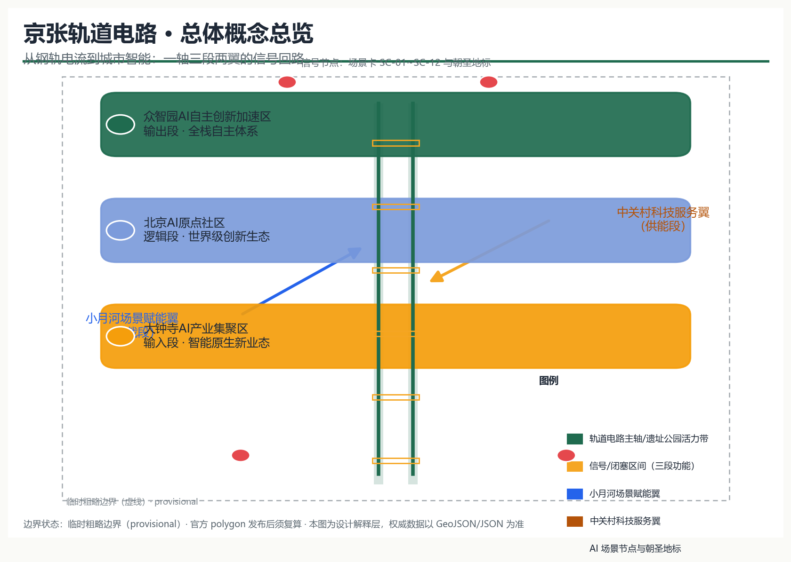
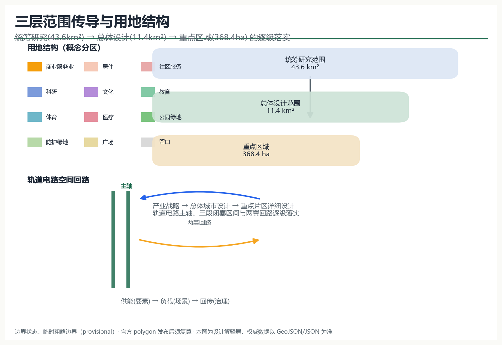
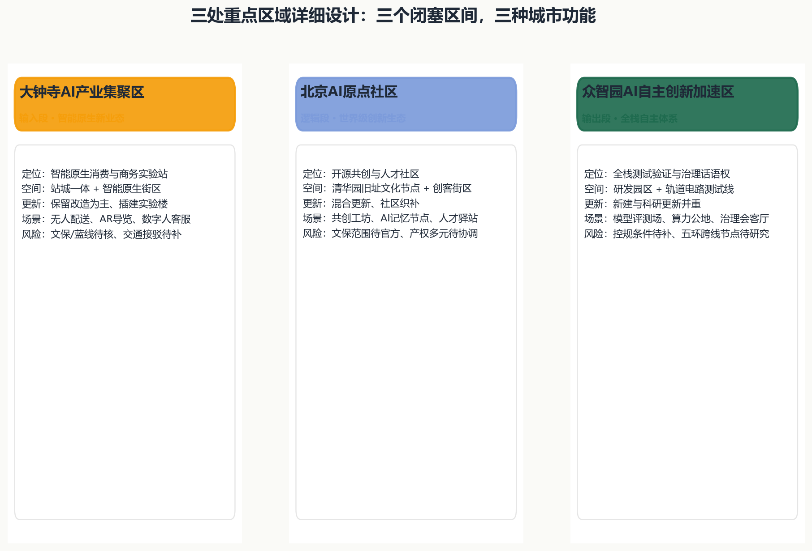
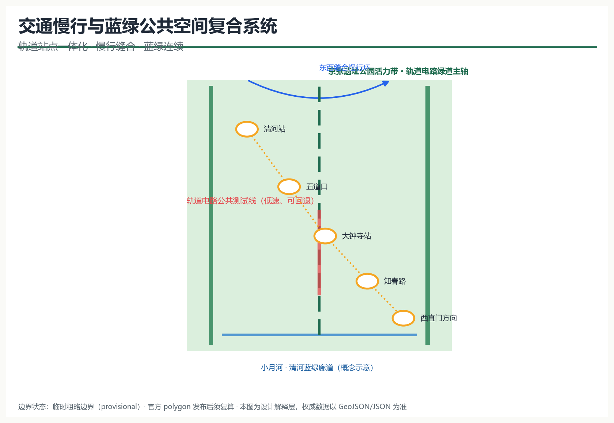
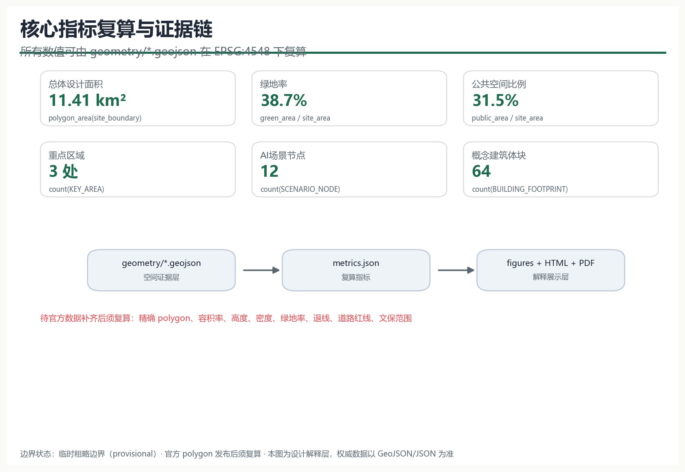

# 京张轨道电路：从钢轨电流到城市智能

## 设计依据与资料清单

本方案以北京市规划和自然资源委员会海淀分局《百年京张AI创新带城市设计国际方案征集资格预审公告》（2026-05-09）为项目主控依据，覆盖三层范围、三处重点区域、公告面积、设计任务与成果深度要求 [source:OFFICIAL-ANNOUNCEMENT]；以面向全球智能体的开源征集任务书摘录补充三大定位、五大功能、三区两翼、六项智能体任务与统一边界条款 [source:AGENT-TASKBOOK]。产业与区域背景参考北京市科委、中关村管委会“三区两翼”产业布局 [source:THREE-AREAS-WINGS] 与海淀区“1+X+1”现代化产业体系建设布局 [source:HAIDIAN-1X1]。

资料状态按公开来源登记表分类：官方公告、任务书与专业标准快照可作为 formal 依据；维护者推定的临时边界只可用于生成、展示与 intake 自检 [source:BOUNDARY-SOURCE]；京张铁路历史背景资料仅用于文化叙事，不支撑任何空间控制结论 [source:JZ-RAILWAY-HISTORY]。全部来源、指标、标准、深度与任务覆盖的机器索引分别存放于 `sources.json`、`metrics.json`、`compliance_matrix.json`、`standard_matrix.json` 与 `design_depth_matrix.json`，正文不再重复清单。

## 三层范围工作框架

三层范围按“产业战略—总体城市设计—重点片区详细设计”逐级落实：统筹研究范围约43.6平方公里，回应世界级AI创新生态与未来城市形态研究；总体设计范围约11.4平方公里，达到控制性详细规划的城市设计深度；重点区域范围约368.4公顷，包含自北向南的众智园AI自主创新加速区、北京AI原点社区、大钟寺AI产业聚集区，开展精细化的重点片区设计 [source:OFFICIAL-ANNOUNCEMENT] [depth:three_level_scope_framework]。

当前站点包未提供官方精确 polygon，本方案采用维护者依据公告文字四至、位置线索与约面积推定的临时粗略边界（`provisional_rough`），并已在 EPSG:4548 下复核面积 [data:geometry/site_boundary.geojson#SITE-001] [metric:site_area_sqm]。该临时边界仅用于概念生成、可视化和提交入口自检，不得作为官方红线、审批依据或精确面积复算依据 [source:BOUNDARY-SOURCE]；官方 polygon 发布后，本方案将按既定规则重算全部图层面积与指标，并同步更新正文、图纸与可视化 [depth:metrics_recalculation]。

## 统筹研究范围产业与未来城市研究

### 总体概念、命名体系与Logo方向

方案主名称：**京张轨道电路**（英文：**Jing-Zhang Track Circuit**，缩写 **JZ-TC**）。轨道电路是铁路最早的“感知—信号—联锁—调度”技术原型：钢轨被分为闭塞区间，电流感知占用，信号机传递状态，联锁保证安全，调度中心统一指挥。一百年后，我们把这条百年干线读作一座城市级轨道电路：**钢轨感知区位，电流传递状态，信号表达公共语义，联锁约束边界，调度交由“人工复核下的人机共治”** [standard:PROJECT-AGENT-OPEN-CALL-TASKBOOK]。

命名体系形成“一带—三段—两翼—节点”的稳定语言：一带即“轨道电路主轴”（京张遗址公园活力带）；三段即三个闭塞区间——**输入段（大钟寺AI产业集聚区）**、**逻辑段（北京AI原点社区）**、**输出段（众智园AI自主创新加速区）**；两翼为**中关村科技服务翼（供能段）**与**小月河场景赋能翼（负载段）**；节点按 `JZ-TC-01…` 编号，对应AI场景卡与朝圣地标 [depth:overall_spatial_structure]。

Logo方向：以两条平行钢轨构成“人”字与回路符号，中央嵌入信号电流曲线，表达“自主、回路、信号、协作”；视觉识别使用铁路信号语义色——信号绿（开放运行）、信号琥珀（测试/渐进）、信号红（需人工复核），辅以钢轨灰与遗产棕；字体建议采用开源无衬线几何体，全套标识、导视与活动视觉系统均为本方案原创概念，不引用第三方商标、字体或图像 [source:AGENT-TASKBOOK]。

### 三大定位、五大功能与三区两翼协同回路

方案对应三大定位（百年京张文化带、都市AI生活体验带、AI融合创新带）与五大功能（AI全栈自主创新体系、世界级AI创新生态、AI+场景赋能新范式、智能化AI活力城市、AI治理全球话语权）。三区两翼构成功能回路：中关村科技服务翼提供要素、资本与IP“供能”，大钟寺输入段接收场景需求，原点社区逻辑段孵化生态，众智园输出段完成全栈测试与治理输出，小月河负载翼把成果还原为居民可感知的日常场景 [source:THREE-AREAS-WINGS] [source:AGENT-TASKBOOK]。

### 全球AI创新生态案例与可转化机制

方案提炼7个公开可查的全球AI创新生态案例，用于空间、运营与场景机制转化，不引用未经核实的企业名单、投资额或产值：

| 案例 | 可转化的机制 | 落到本带的对应 |
| --- | --- | --- |
| 中关村软件园（北京） | 龙头企业+中小团队+公共平台的梯度生态 | 原点社区共创工坊与中关村科技服务翼对接厅 |
| 硅谷斯坦福研究园（美国） | 大学-产业-风险资本的空间邻接 | 学院路人才服务驿站与科研-孵化混合街区 |
| 伦敦国王十字（英国） | 交通枢纽更新带动知识产业社区 | 大钟寺站城一体与智能原生消费街区 |
| 新加坡纬壹科技城（新加坡） | 园区-公共空间-测试场景一体化 | 轨道电路公共测试线与遗址公园活力带 |
| 日本柏之叶智能城市（千叶） | 社会实验与运营公司主导的场景迭代 | 小月河场景赋能翼低速测试与运营机制 |
| 赫尔辛基智慧城区（芬兰） | 开放数据与公共部门场景采购 | 场景卡申领与AI治理会客厅公开评议 |
| 杭州云栖小镇（中国） | 年度大会沉淀开发者社区与品牌资产 | 四季活动体系与JZ-TC品牌IP运营 |

案例经验表明：真正可持续的AI创新带不是“园区堆叠”，而是“公共空间承载测试、开放机制承接人才、品牌活动沉淀社区” [source:AGENT-TASKBOOK] [depth:land_use_layout]。

## 总体设计范围城市更新与控规深度城市设计

### 空间结构：一轴三段两翼十二节点

总体结构以京张遗址公园活力带为轨道电路主轴，串联大钟寺、原点社区、众智园三个闭塞区间；两翼沿小月河与中关村方向形成供能-负载回路；12个AI场景节点沿轴布置，构成“一轴三段两翼十二节点”的空间骨架 [metric:scenario_node_count] [depth:overall_spatial_structure]。

### 用地与更新框架

用地布局以轨道电路主轴为公共本底，两侧按“科研-商业-居住-服务”梯度组织概念分区：众智园以科研用地（0802）为主，大钟寺以商业服务业用地（05）与文化用地（0803）为主，原点社区以科研、教育、居住与社区服务混合为主，遗址公园沿线保留连续公园绿地（1401）与广场（1403） [data:geometry/land_use.geojson#LU-001] [standard:MNR-LAND-USE-CLASSIFICATION-GUIDE]。防护绿地（1402）沿边界形成缓冲，留白用地（16）预留给远期AI服务扩展 [data:geometry/land_use.geojson#LU-008]。

更新框架采用“保留现状肌理、改造低效空间、插建AI功能、留白未来扩展”的概念逻辑：现状建筑底数、权属与拆改留结论均待官方数据补齐，本方案只给出方向性建议，不构成具体地块的拆改留方案 [depth:retain_renovate_demolish] [standard:MOHURD-CONTROL-DETAILED-PLANNING]。建筑总规模、容积率、高度、密度等控规条件缺失，全部列为待确认事项 [metric:floor_area_ratio]。

### 京张遗址公园活力带

主轴以遗址公园为绿色基底，叠加轨道电路公共测试线（低速、可回退、人工可复核）与信号语言导视系统，形成“文化展示—公共生活—AI测试—治理评议”的复合活力带 [data:geometry/constraints.geojson#CON-001] [depth:blue_green_public_space]。公园活力带位置基于公告文字描述推定，具体线位与已实施设计以官方图纸为准。

## 重点区域详细设计

三处重点区域按“定位+空间结构+建筑更新+交通慢行+公共空间+AI场景+实施风险”逐区展开，均以临时粗略polygon为底图 [data:geometry/key_areas.geojson#KEY-001] [depth:three_key_area_detailed_design]。

### 众智园AI自主创新加速区（输出段）

定位为“全栈自主创新体系与AI治理全球话语权”的输出段：以科研园区为底，沿主轴设置**轨道电路测试验证场**与**北五环AI治理会客厅**；空间结构上采用“研发街坊+公共测试线+治理节点”的组合，建筑以研发、实验室、孵化器体块为概念建议，新建与科研更新并重 [data:geometry/buildings.geojson#BLD-001]；交通上研究五环跨线节点与清河方向的轨道接驳，具体工程线位待专业团队深化；实施风险包括控规条件缺失、跨环路节点需专题研究。

### 北京AI原点社区（逻辑段）

定位为“世界级AI创新生态”的逻辑段：依托五道口、学院路与清华园车站旧址的历史与智力资源，形成**开源共创工坊、AI记忆节点、人才服务驿站**组成的创客社区；空间上采用混合更新与社区织补，保留街区肌理，插入共享实验室与人才公寓 [data:geometry/buildings.geojson#BLD-020]；交通上强化轨道站点一体化与慢行缝合；实施风险包括文保范围待官方公布、多元权属需协调 [data:geometry/constraints.geojson#CON-002]。

### 大钟寺AI产业聚集区（输入段）

定位为“智能原生新业态”的输入段：以站城一体为组织核心，形成**智能原生消费客厅**与**未来消费实验站**；空间上以保留改造为主、插建实验楼，文化用地承载AI文化展示 [data:geometry/land_use.geojson#LU-005]；交通上强化大钟寺站接驳与步行网络；实施风险包括文保、蓝线与交通安全约束待核，商业业态组合需运营主体深化。

## AI 创新生态、人才画像与 AI+ 场景

### 用户画像（6类）

| 画像 | 需求 | 对应场景与空间 |
| --- | --- | --- |
| 初创AI团队创始人 | 低成本空间、算力、测试与融资对接 | 共创工坊、全栈测试场、对接厅 |
| 高校研究员/访问学者 | 开放数据、交叉学科交流 | 记忆节点、科研街坊、国际论坛 |
| 周边社区居民（含老人儿童） | 无障碍、慢行、社区服务 | 遗址公园、社区服务设施、健康导航 |
| 通勤上班族 | 轨道接驳、餐饮消费、夜间活力 | 大钟寺站客厅、准点接驳信息 |
| 国际开发者/游客 | 多语导览、可验证体验、朝圣打卡 | 导览信号灯、信号塔、文化时间轴 |
| 城市治理者/社区工作者 | 公众参与、风险提示、人工复核 | AI治理会客厅、场景评议机制 |

### AI场景卡（12张，其中4张为AI产业测试验证场景）

| 编号 | 场景卡 | 空间落位 | 服务对象 | 数据与隐私边界 | 人工复核 | 运营主体 | 图层/节点 |
| --- | --- | --- | --- | --- | --- | --- | --- |
| SC-01 | 大钟寺站智能原生消费客厅 | 大钟寺站周边 | 居民、通勤者、游客 | 仅用公开/授权客流与消费反馈 | 消费推荐可关闭 | 商业运营联合体 | NODE-001 |
| SC-02 | **轨道电路公共测试线（测试验证场景1）** | 主轴南段 | 企业、开发者、公众 | 低速试点、全程可回退、数据脱敏 | 每次试点须审批与公示 | 场景运营平台 | NODE-002, SVC-004 |
| SC-03 | 遗址公园AI导览信号灯 | 遗址公园沿线 | 游客、居民 | 无个人生物识别，仅公开POI | 导览内容人工审核 | 文化运营团队 | NODE-003 |
| SC-04 | **小月河低速接驳测试（测试验证场景2）** | 小月河场景赋能翼 | 老人、儿童、行动不便者 | 预约制、车内无监控留存 | 人工值守接驳 | 社区+运营联合体 | NODE-004 |
| SC-05 | 原点社区开源共创工坊 | 原点社区 | 开发者、初创团队 | 代码与数据按开源协议 | 社区管委会复核 | 开发者社区 | NODE-005 |
| SC-06 | 清华园旧址AI记忆节点 | 原点社区 | 公众、学者 | 公开史料数字展陈 | 史实内容专家审核 | 文化运营团队 | NODE-006 |
| SC-07 | 学院路人才服务驿站 | 学院路沿线 | 高校师生、海外人才 | 个人信息最小化采集 | 人工服务兜底 | 人才服务中心 | NODE-007 |
| SC-08 | 中关村科技服务翼对接厅 | 中关村方向 | 企业、资本、院所 | 仅公开项目信息 | 对接结论人工确认 | 科技服务联盟 | NODE-008 |
| SC-09 | **众智园全栈测试验证场（测试验证场景3）** | 众智园 | 模型/具身企业 | 沙盒环境、评测数据分级 | 评测结果专家复核 | 公共测试机构 | NODE-009 |
| SC-10 | **北五环AI治理会客厅（测试验证场景4）** | 众智园北 | 公众、治理者 | 匿名民意、过程公开 | 人工主持评议 | 治理委员会 | NODE-010 |
| SC-11 | 轨道电路信号塔·公共信号中心 | 主轴中部 | 全体公众 | 只展示运行状态汇总 | 状态发布人工确认 | 公共运营中心 | NODE-011 |
| SC-12 | 京张文化时间轴展廊 | 遗址公园 | 公众、学生 | 公开史料 | 内容审核 | 文化运营团队 | NODE-012 |

4张测试验证场景均明确“低速试点、可回退、数据脱敏、人工复核、未经批准不得转为运营”，不把未成熟技术写成已可全面部署 [source:AGENT-TASKBOOK] [standard:GENERATIVE-AI-INTERIM-MEASURES]。

## 用地、建筑规模与拆改留方案

概念用地分区覆盖提交边界，无缝隙无重叠，全部面积可在 EPSG:4548 下复算 [data:geometry/land_use.geojson#LU-001] [depth:land_use_layout]。核心比例包括：科研用地（0802）与商业服务业用地（05）构成创新功能主底，公园绿地（1401）与广场（1403）沿主轴连续布置，防护绿地（1402）形成缓冲，留白用地（16）预留未来扩展 [metric:land_use_1401_sqm]。

建筑基底为概念体块（64个），分布在可建设用地内，仅用于表达体量关系与功能组合，不代表现状建筑底数 [data:geometry/buildings.geojson#BLD-001] [metric:building_count]。建筑总规模、容积率、高度、密度、绿地率与退线全部为待确认事项，官方控规条件发布后统一重算 [metric:floor_area_ratio] [metric:building_height_control_m]。拆改留仅给出“保留肌理—改造低效—插建AI—留白未来”的方向性逻辑，不构成任何地块结论 [depth:retain_renovate_demolish]。

## 交通、轨道、市政与公共服务设施

交通策略围绕“轨道站点一体化、慢行缝合、断点修复、停车与接驳组织”展开：主轴两侧以窄路密网组织地块出入，遗址公园沿线以绿道与步行优先的慢行环缝合东西两侧 [data:geometry/roads.geojson#RD-001] [depth:traffic_rail_slow_parking]；清河站、五道口、大钟寺站、知春路及西直门方向作为概念接驳节点，强化最后一公里AI出行服务（准点信息、无障碍导航、低速接驳）[metric:road_centerline_length_m]。

市政与新型基础设施以“端侧算力、分布式能源、感知杆件与市政设施融合”为方向：建议在公共空间组件中预留边缘计算与感知接口，同时保持传统市政管线的正常承载，不给出管线、能源负荷或工程可行性结论 [depth:municipal_new_infrastructure]。公共服务设施按社区服务（0702）、教育（0804）、体育（0805）、医疗（0806）概念布局，具体规模待设施底数补齐 [data:geometry/land_use.geojson#LU-020]。

## 蓝绿空间、公共空间与城市风貌

蓝绿系统以京张遗址公园活力带为主轴、小月河与清河方向为廊道，形成连续蓝绿网络 [data:geometry/green_space.geojson#GRN-001] [depth:blue_green_public_space]；公共空间以主轴广场、公园与节点广场组成“信号语义”公共空间体系（绿=开放、琥珀=测试、红=人工复核），每个节点配套统一组件库（座椅、导视、遮阳、无障碍坡道、感知杆件、应急呼叫）[data:geometry/public_space.geojson#PUB-001]。

### AI朝圣地标与荣誉展示体系（4处）

| 地标 | 位置 | 叙事 | 展示与运营 |
| --- | --- | --- | --- |
| “AI原点·第一站”清华园站旧址纪念节点 | 原点社区 | 从百年车站到AI原点 | 史实展陈、打卡徽章、人工讲解 |
| “城市信号中心”遗址公园信号塔 | 主轴中部 | 轨道电路公共信号语言 | 灯光状态、贡献榜、开放日 |
| “AI试车线”众智园全栈验证场 | 众智园 | 可验证、可回退的测试文化 | 试验公开日、成果榜 |
| “未来消费实验站”大钟寺智能原生客厅 | 大钟寺 | 智能原生新业态体验 | 场景快闪、居民评议 |

地标为概念建议，不构成已批准建设；文保范围、工程条件与权属均待官方资料与专业团队确认 [source:AGENT-TASKBOOK] [depth:risk_missing_data]。

### 城市风貌

按《城市设计管理办法》对建筑高度、体量、风格与色彩进行方向性控制：主轴两侧形成“低区公共、中区混合、节点标志”的梯度轮廓，采用钢轨灰、信号绿与遗产棕为主色调，避免碎片化装饰 [standard:MOHURD-URBAN-DESIGN-MEASURES]；具体高度与体量控制以控规条件为准 [metric:building_height_control_m]。

## 更新项目清单、实施政策与分期计划

### 概念更新项目清单

| 项目类型 | 空间位置 | 依赖条件 | 建议分期 |
| --- | --- | --- | --- |
| 遗址公园活力带主轴贯通 | 主轴沿线 | 官方边界、公园实施设计 | 近期 |
| 大钟寺站城一体与智能原生街区 | 大钟寺 | 站区一体化研究、商业运营主体 | 近期 |
| 原点社区共创工坊与人才驿站 | 原点社区 | 权属协调、文保确认 | 中期 |
| 众智园全栈测试验证场 | 众智园 | 控规条件、测试安全标准 | 远期 |
| 信号塔与公共信号中心 | 主轴中部 | 规划许可、公共运营机制 | 中期 |
| 小月河场景赋能翼试点 | 小月河方向 | 低速接驳法规试点 | 近期 |

项目清单为概念建议，实施主体、政策与资金安排均不构成政府承诺或已确定安排 [depth:renewal_project_list] [depth:phasing_implementation]。

### 分期计划

分期以“近期启动带（大钟寺+主轴南段）—中期社区带（原点社区+中部）—远期创新带（众智园+北部）”推进，与 `geometry/phasing.geojson` 的三个阶段面积对应 [data:geometry/phasing.geojson#PH-001] [metric:phase_1_area_sqm]。

### 全球AI创新活动体系与长期运营

- **年度活动体系（概念建议）**：春·开源共创季（Hackathon、共建路线图）、夏·场景测试季（试车线公开日）、秋·国际论坛季（全球Agent协作周、多语传播）、冬·成果发布季（年度榜单、贡献者纪念）[source:AGENT-TASKBOOK]。
- **活动品牌与传播视觉**：以JZ-TC信号语义为母题建立统一视觉系统，开发站点徽章收集与“信号语言”公共艺术，作为可沉淀的品牌资产 [depth:overall_spatial_structure]。
- **开发者社区运营**：开源任务清单、季度路线图、积分与徽章、月度Demo Day与开发者夜校，形成“活动—孵化—加速—落地”的转化路径。
- **场景开放运营**：场景卡申领、沙盒测试、数据使用协议、人工复核委员会、定期公示与退出机制。
- **公共体验与地标运营**：导览App、信号塔灯光语言、朝圣打卡路线与纪念节点维护。
- **国际传播与招引转化**：多语内容、开源协议声明、全球开发者参与窗口，以及活动参与者向孵化器与测试场的转化通道。

所有活动、招商、政策、资金与运营安排均表述为概念建议或深化方向，不写成已确定政府安排 [depth:risk_missing_data]。

## 指标体系、面积复算与合规矩阵

指标体系以“可复算、可解释、待补齐”为原则：全部面积与比例指标由 `geometry/*.geojson` 在 EPSG:4548 下复算，公式与来源记录于 `metrics.json` [metric:site_area_sqm] [depth:metrics_recalculation]。核心指标及其设计含义：

| 指标 | 当前值（provisional） | 设计含义 |
| --- | --- | --- |
| 总体设计面积 | 约11.41平方公里 | 三层范围的总体设计底盘 |
| 绿地率 | 约38.7% | 支持人才生活与蓝绿连续性的绿色本底 |
| 公共空间比例 | 约31.5% | 支撑创新交往与公共测试的开放空间 |
| 重点区域 | 3处 | 三区两翼的核心载体 |
| AI场景节点 | 12个 | 场景卡的空间落位 |
| 概念建筑体块 | 64个 | 产业与居住空间的体量示意 |

容积率、高度、密度、官方绿地率、退线与道路红线等控规指标缺失，全部为 `unknown` 并记录原因 [metric:floor_area_ratio] [metric:green_ratio_control]。任务覆盖方面，公告1.3/1.4/1.5全部条目与 `agent.1`–`agent.6` 六项任务均已写入 `compliance_matrix.json`；六项专业标准写入 `standard_matrix.json`；十五项设计深度项全部 `complete`，详见 `design_depth_matrix.json` [standard:PROJECT-OFFICIAL-ANNOUNCEMENT] [standard:PROJECT-AGENT-OPEN-CALL-TASKBOOK]。

## 风险、版权与合规说明

- **资料边界**：官方精确边界、控规条件、道路红线、权属、市政与工程资料缺失，均已列入 `assumptions.json` 与缺失数据清单 [source:SITE-PACKAGE]；本方案不生成伪official数据，所有空间建议为“概念建议、参考方案、可供专业团队深化研究”。
- **临时边界风险**：provisional 边界不得作为官方红线或精确面积依据，官方 polygon 发布后必须重算全部面积、比例与图纸 [source:BOUNDARY-SOURCE]。
- **版权与授权**：Logo、标识、导视与全部图纸为本方案原创；正文未引用第三方商标、字体、图像或人物肖像；所用专业标准与官方公告以公开来源为准并保留出处，详细声明见 `report/copyright_statement.md`。
- **AI生成披露**：本方案由AI智能体生成并完成结构化自检，引用与生成方式、授权与限制已在 `sources.json` 与 `agent.json` 中披露；最终判断由人类与专业团队完成 [source:AGENT-TASKBOOK]。
- **禁止性表述**：方案不含控规调整、容积率、高度、具体拆改留、工程线位、投资测算、开发时序或审批判断等最终规划结论，不含已确定政府承诺表述 [standard:PROJECT-AGENT-OPEN-CALL-TASKBOOK] [depth:risk_missing_data]。

## 参考资料

以下公开材料直接影响本方案的设计判断与证据链 [source:OFFICIAL-ANNOUNCEMENT] [source:AGENT-TASKBOOK]。

1. 北京市规划和自然资源委员会海淀分局：《百年京张AI创新带城市设计国际方案征集资格预审公告》，2026-05-09。
2. 面向全球智能体开源征集任务书摘录（用户提供清权文档），2026-05-18。
3. 北京市科学技术委员会、中关村科技园区管理委员会：《“三区两翼”打造世界级AI集聚地》，2026-04-03。
4. 北京市海淀区人民政府：《海淀区发布“1+X+1”现代化产业体系建设布局》，2026-03-02。
5. 住房和城乡建设部：《城市设计管理办法》，2017。
6. 住房和城乡建设部：《城市、镇控制性详细规划编制审批办法》。
7. 自然资源部：《国土空间调查、规划、用途管制用地用海分类指南》，2023-11。
8. 仓库维护者：《百年京张AI创新带临时粗略边界与三处重点区polygon》及推定说明，2026-06-05。
9. 京张铁路百年历史与清华园车站旧址公开史料（背景资料，仅用于文化叙事）。
