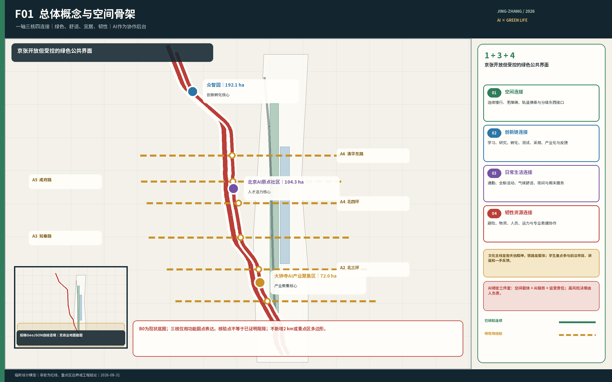
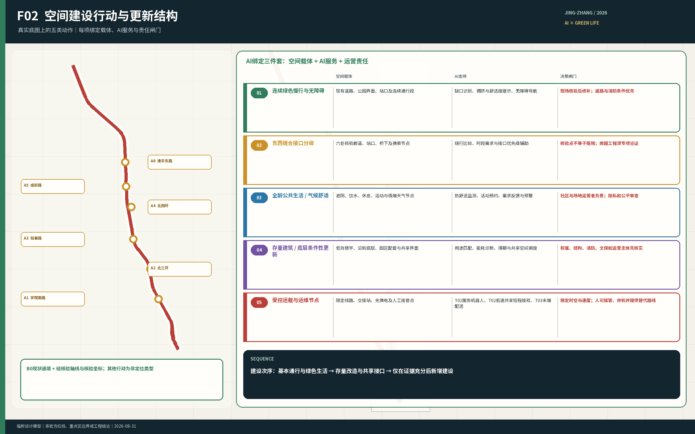
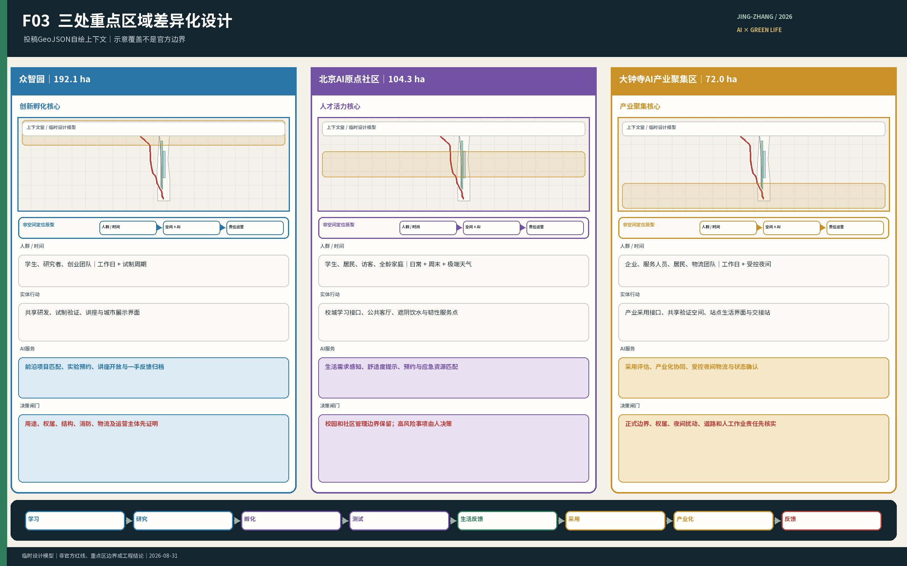
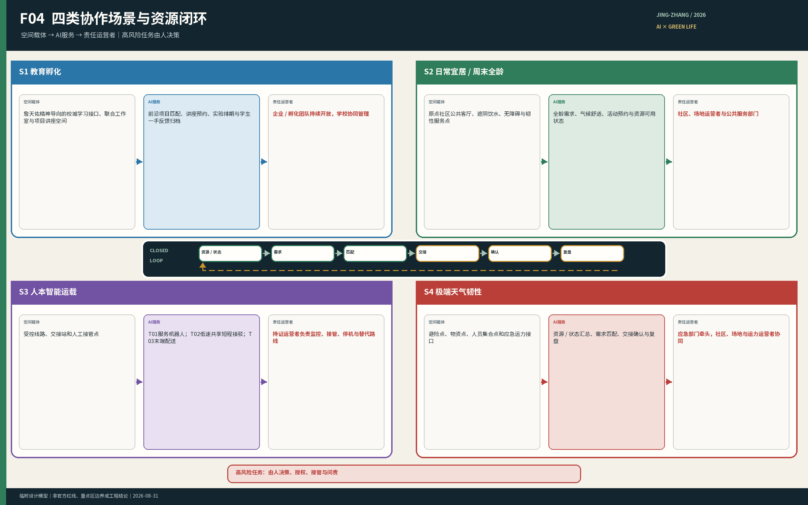

# 京张共生创新带

## 品牌与视觉识别

“百年京张AI创新带”作为长期主品牌，“京张共生创新带”作为本方案概念名。标志以“生活庭院”为母体：开放的城市界面围绕人的日常生活，绿色生长与智能连接嵌入其中，京张不被画成铁轨或列车，而转译为可靠、连续、面向未来的工程结构。深蓝、绿色与工程金分别承担公共可信、生态宜居与人的生活核心；该标志可延展到导视、公共设施、年度活动和线上服务界面，但不替代詹天佑文化专题标识。

标志的基本应用规则如下：安全空间取图形中金色圆点直径为 `1x`，四周至少保留 `1x`；数字界面最小显示宽度32像素，印刷最小宽度10毫米；深色底使用白色或单色反白版，不改变比例、不添加阴影、不替换主色。主色为公共可信深蓝 `#142933`、生态生活绿 `#287A5A`、工程与人本金 `#C58B26`。导视、家具和数字终端先使用上述色彩与圆角开口语汇，不将Logo重复铺满公共空间。

## 设计依据与资料清单

本方案首先回应主办方公告、场地包和面向智能体任务书，继承三层工作范围、三个重点区域及七项任务要求。现有公开资料能够支持总体定位、需求判断、空间关系和概念性更新策略，但不能证明精确地块边界、权属、法定用地、道路红线、建筑安全、机构开放承诺或专业测试许可。上述事项均留待正式资料或实施深化阶段确认。[source:OFFICIAL-ANNOUNCEMENT] [source:SITE-PACKAGE] [source:AGENT-TASKBOOK]

方案同时使用本项目已形成的京张轴线地图、沿线设施清单、线上证据登记、五类人群—时间—场景研究、人才成长链和南段设计作为设计推导材料。这些材料用于说明问题和比较方案，不升级为法定依据；资料范围、用途和不能证明的事项登记在 `report/narrative.md` 中。[source:PARTICIPANT-DESIGN-BASIS] [depth:existing_conditions_diagnosis]

当前场地和三处重点区图层采用临时约束范围。图件与指标必须持续标明 `official_boundary=false`，不得称为官方红线、精确面积边界或审批依据；取得官方多边形后，用地、道路、绿地、公共空间、建筑、分期和指标应整体复算。本项目以 B0 作为总体制图底图，以已校准的高细节地图作为局部现状证据；M0 仅用于自定 2 公里设施盘点范围参照，不采用其中的重点区划分。2 公里范围和三处重点区图形均为工作模型，不是主办方法定边界或官方红线。[data:geometry/site_boundary.geojson#SITE-001] [data:geometry/key_areas.geojson#PROV-KEY-001] [depth:risk_missing_data]

## 三层范围工作框架

三层范围承担不同问题，不能以京张铁路两侧2公里的设施盘点范围替代正式工作边界：

| 层级 | 官方规模 | 主要任务 | 本方案的成果形式 |
| --- | ---: | --- | --- |
| 统筹研究范围 | 43.6平方公里 | 判断AI产业生态、未来城市形态和三区两翼关系 | 产业与人才链、总体理念、案例比较和运营机制 |
| 总体设计范围 | 11.4平方公里 | 形成城市更新、空间结构、交通市政、蓝绿系统和风貌策略 | 总体城市设计、更新项目和指标体系 |
| 三处重点区域 | 合计368.4公顷 | 验证具体片区的功能、空间、建筑、交通、公共空间和实施逻辑 | 三个重点区详细设计及节点放大 |

统筹研究决定方向，总体设计把方向转化为空间网络和更新项目，重点区设计验证这些动作如何进入街区、建筑界面和日常运营。现阶段只有官方文字范围和面积，精确多边形仍待补齐；因此本文确认任务和结构，不用临时图形推导法定控制值。[standard:PROJECT-OFFICIAL-ANNOUNCEMENT] [depth:three_level_scope_framework] [metric:key_area_count]

### 任务书人读对照

| 官方框架 | 本方案响应 | 可核验载体 |
| --- | --- | --- |
| 百年京张文化带 | 京张绿色公共轴与詹天佑工程精神解释 | 文化节点、年度成果展示和P07 |
| 都市AI生活体验带 | 全龄日常、慢行、韧性和可选择的AI服务 | S01—S05、P02—P04 |
| AI融合创新带 | 学习—项目—验证—孵化—采用链 | S06—S07、T01—T03、P05和P09 |
| 五大功能 | 全栈自主创新、世界级创新生态、AI+场景赋能、智能活力城市、AI治理话语权 | 三核分工、八要素流、十张场景卡、人工闸门与退出规则 |
| 三区两翼 | AI原点社区、众智园、大钟寺；中关村科技服务翼和小月河场景赋能翼 | 三处重点区详设、专业服务接口和公共体验路径 |

| Agent任务 | 交付结果 | 主要证据 |
| --- | --- | --- |
| agent.1 总体概念 | 一轴三核、四类连接、绿色为底 | F01—F03与总体结构 |
| agent.2 创新生态 | 人才成长链、八要素流、三核专业分工 | 案例比较、生态流程与区域协同接口 |
| agent.3 AI+场景 | S01—S07与T01—T03 | 十张场景卡和人工责任边界 |
| agent.4 公共空间与新业态 | 三类标志节点、六类组件、测试与生活分区 | 公共空间组件库与P02—P05 |
| agent.5 文化与国际表达 | 詹天佑精神主线、中英文成果和品牌规则 | Logo、中英文正文与P07 |
| agent.6 长期运营 | 年度计划、开发者社区、场景开放和成果转化 | 九项项目及长期运营台账 |

## 统筹研究范围产业与未来城市研究

海淀已有高校、科研、企业、社区、轨道交通和公共绿地等高密度资源。规划的核心问题不是再造一个孤立的AI园区，也不是用AI补齐所有设施，而是把分散资源变成可进入、可协作、可反馈的关系，使AI产业发展同时改善通勤、学习、交往、休闲和极端天气下的生活保障。

总体结构采用“一轴三核，绿色为底”。京张铁路遗址公园承担连续绿色公共轴；众智园、北京AI原点社区和大钟寺分别承担创新孵化、人才活力和产业聚集。京张是开放但受控的公共界面，而非要求所有项目都经过的单一线性通道；三个重点区也不按地理顺序强制串联项目，而是共同支撑“前沿学习—项目实践—工程验证—孵化转化—产业应用”的成长链。[source:AGENT-TASKBOOK] [depth:overall_spatial_structure]

方案形成四类连接：

1. **空间连接**：改善南北慢行连续性、东西入口、轨道换乘、过街、无障碍和等候条件，缝合京张铁路造成或延续的空间分隔。
2. **创新链连接**：用公开讲座、联合课题、跨校工作室、共享试制、专业验证和产业服务，把高校、园区、企业与社区需求接起来；不要求机构取消管理边界。
3. **生活服务连接**：连接居民、学生、职工、家庭、老人、儿童、夜班与户外服务人员所需的基本设施、公共客厅和分时服务。
4. **韧性资源连接**：在高温、暴雨、冰雪和大风等情况下，连接避险空间、物资、设施、人员、交通能力和专业救援接口；AI辅助发现与匹配，由责任主体确认和执行。

四类连接共同回应七项任务：海淀适配的发展理念、AI创新生态、新型城市形态、交通与公共服务设施、京张遗址公园活力带、詹天佑精神与中关村/AI文化融合，以及AI+交通、医疗、教育、机器人、自动驾驶、无人配送等应用场景。[standard:PROJECT-AGENT-OPEN-CALL-TASKBOOK] [source:OFFICIAL-ANNOUNCEMENT]

五个国际案例用于校验“空间如何支撑创新链”，而非复制其建筑形态或规模：

| 案例 | 可转化机制 | 京张落点 | 不可照搬条件 |
| --- | --- | --- | --- |
| 新加坡 one-north / LaunchPad | 灵活孵化、共享设备、分级测试和首层展示 | 众智园建立“孵化—试制—受控实测—展示—采用”阶梯 | 不假设多权属机构的设施和数据天然共享 [source:CASE-ONE-NORTH] |
| 法国 Paris-Saclay | 全阶段创新教育、概念验证、临时激活和长期运营 | 三核共同组成“学习—研究—验证—孵化—采用”链条 | 不复制大尺度增量新区或未经落实的跨校合作 [source:CASE-PARIS-SACLAY] |
| 多伦多 MaRS / Vector Institute | 研究、人才、商业化与产业采用由专业平台连接，公开活动与受控研发分层 | 京张公共界面承担讲座、展示、体验和社会反馈 | 不把开放度等同于数据、知识产权和试验空间无边界 [source:CASE-MARS-VECTOR] |
| 赫尔辛基 Maria 01 | 旧建筑先确定运营主体、入驻规则和社区收益，再渐进改善街道公园 | 存量空间改造与城市问题题库、高校辅导和企业验证联动 | 不将“看似闲置”当作权属、用途、结构和消防已具备 [source:CASE-MARIA-01] |
| 匹兹堡 Hazelwood Green / CMU | 工业遗产、受控机器人测试、公众教育和绿地分层并置 | 高风险测试留在专业场地，绿廊只承担低风险示范与反馈 | 不复制大尺度棕地测试场，也不认定技术进驻自动产生社区收益 [source:CASE-HAZELWOOD-CMU] |

案例比较得出的共同机制是：三个重点区承担专业分工，京张绿色公共轴承担开放但受控的公共界面，长期运营平台将高校、企业、社区和城市部门组织成可反馈、可问责的闭环。

对外协同以“接口”而非“已签约合作”表达：建议与AI北纬社区交换青年课题和社区反馈，与未来科学城交换科研人才和验证需求，与怀柔科学城交换科研转化与专业评测经验，与北京经开区交换智能制造、机器人和车辆产业采用反馈，并经中关村科技服务翼连接京津冀人才、制造和市场资源。所有接口均为待协商建议，不构成设施开放、资金、招商或区域协议的承诺。

对外协同以“接口”而非“已签约合作”表达：建议与AI北纬社区交换青年课题和社区反馈，与未来科学城交换科研人才和验证需求，与怀柔科学城交换科研转化与专业评测经验，与北京经开区交换智能制造、机器人和车辆产业采用反馈，并经中关村科技服务翼连接京津冀人才、制造和市场资源。所有接口均为待协商建议，不构成设施开放、资金、招商或区域协议的承诺。

## 总体设计范围城市更新与控规深度城市设计

总体空间由四层叠合：绿色空间层保证步行、骑行、无障碍、生态、遮阴、排水和休息；三核创新层承接人才与成果成长链；日常生活层按通勤、午间、晚间、周末和极端天气五类场景校核；AI资源协作层连接资源状态、需求和责任主体，不形成第四个封闭园区。

北京市人民政府门户网站2026年8月12日转载的公开报道提到，京张沿线街区控规获得批复，并介绍大钟寺、五道口两处中心、慢行连通、存量更新和公共服务等方向。该网页尚未进入仓库正式来源登记，本方案仅将其作为背景信息，不据此确定法定边界、地块控制或实施承诺。因此，空间建设收敛为五类动作：维护并补齐连续绿色慢行网络、建设东西接口与转换节点、设置全龄公共生活节点、更新既有空间并提供共享接口、配置专业验证与后勤节点。运营内容包括分时开放规则、詹天佑精神公共叙事、全龄活动课程和城市资源协作系统。建设顺序是先核验并修补现有连续性、安全、生态和基本生活服务，再更新存量空间和专业接口，最后依据用地、权属与需求证据决定新增建筑及规模。[source:OFFICIAL-JZ-CONTROL-PLAN-20260812] [depth:land_use_layout] [depth:overall_spatial_structure]

“城市资源协作系统”共用资源台账、状态核验、需求受理、资源匹配、任务转交、结果确认和复盘七项能力。AI可辅助检索、分析、提示、翻译和匹配；场地开放、人员准入、交通接管、应急处置、公共服务上线与恢复由有权限的人员决定。系统失效时，基本通行、固定导向、人工咨询和安全流程继续运行。

## 重点区域详细设计

三处重点区是同一创新链上的不同城市环境，不应复制同一种“AI园区”形态。以下名称、定位和面积来自官方文字。当前临时重点区多边形不能作为详细设计边界，其中大钟寺临时多边形不包含大钟寺站，已停止用于空间推导。[source:OFFICIAL-ANNOUNCEMENT] [source:KEY-AREA-SOURCE]

### 众智园AI自主创新加速区——创新孵化核心，192.1公顷

众智园承担工程开发、共享试制、专业验证和创业预孵化，是创新孵化核心。空间重点是低碳研发环境、专业工场、受控测试、园区后勤和面向城市的公共界面。企业与孵化团队持续向学生开放前沿讲座、真实项目、测试机会和一手反馈；专业测试留在权属、用途、安全和运营责任明确的空间，公园界面用于公开学习、成果解释和用户反馈，不把普通游园者当作默认测试对象。

### 北京AI原点社区——人才活力核心，104.3公顷

原点社区承担前沿学习、问题发现、跨校项目和全龄日常创新交往，是人才活力核心。规划通过校城学习接口、企业与孵化团队轮值讲座、跨校联合工作室、公共客厅和分时共享服务，让学生更早接触真实技术方向、工程失败和用户反馈；同时按老人、儿童、行动不便者、夜班与户外服务人员的不同需求，在极端天气中提供避险、补水、物资、降级路线和人工服务点。校园、园区与社区保留必要管理边界，合作通过公开界面、预约规则和责任协议发生。

### 大钟寺AI产业聚集区——产业聚集核心，72.0公顷

大钟寺承担产品集成、市场验证、企业服务、成熟成果应用与产业化，是产业聚集核心；受控夜间物流只进入明确后勤线路、装卸和交接节点，不挤占居民夜间安静与基本通行。官方边界取得前，设计采用边界无关型骨架：京张绿色公共轴作为生活与生态基底；大钟寺站作为轨道和产业服务调查锚点，该判断仅用于概念结构，不认定站内空间能够承担城市公共跨越；[source:OFFICIAL-DZ-INTERCHANGE-20241213] 学院南路生活服务接口与北三环交通产业接口同等重要。公开网页介绍顺馨园位于大钟寺东路与北三环交汇处，本方案将其作为待现场核验的公共空间背景，不据此认定其与京张公共轴连续连通。[source:OFFICIAL-SHUNXIN-20260602] 候选东西向通道用于连接铁路两侧社区、高校和公共服务。2026年7月30日的公开报道介绍了北三环门户的退台、无障碍坡道等改造，但当时仍称二期“即将完工”；本方案据此将其作为待核验的南北衔接背景，不认定为东西跨越13号线。[source:OFFICIAL-JZ-PHASE2-20260730] 2024年海淀区园林绿化局公开答复称受13号线阻隔，公园与社区联系不便；本方案据此把跨线便民联系列为待专业核验的问题，不认定已有获批或完工的跨线工程。[source:OFFICIAL-LINE13-BARRIER-20241029] 现阶段可确定结构关系、节点类型和建设动作，不能确定用地比例、建筑规模或地块级拆改留。取得官方边界后，再完成用地闭合、指标复算和完整详细设计。[depth:three_key_area_detailed_design]

## AI 创新生态、人才画像与 AI+ 场景

方案至少服务五类人群：高校学生与青年科研人员、创业团队与企业职工、既有社区居民与家庭、老人儿童及行动不便者、夜班配送维护等城市服务人员。国际访客、开发者和企业合作伙伴作为跨类用户纳入活动与产业服务，但不取代既有居民的生活改善目标。

生态系统不只列机构，而是规定八类要素如何进入项目、被使用并返回结果：

| 要素 | 进入门槛 | 在三核中的作用 | 反馈与问责 |
| --- | --- | --- | --- |
| 土地 | 正式边界、用途、权属和审批 | 支撑经审查的更新项目 | 任一条件缺失即不进入建设清单 |
| 空间 | 自愿协议、时段、容量、安全与无障碍 | 课程、项目、验证与公共服务 | 使用记录、故障和投诉复盘 |
| 产业 | 真实问题、保密边界和责任人 | 前沿课程、原型、验证与采用 | 记录结果、失败原因和采用反馈 |
| 资本 | 预算、利益冲突和绩效审查 | 支持经评审的公共或创新项目 | 记录支出、里程碑和停止条件 |
| 人才 | 自愿、适岗、权益和时间规则 | 讲座、课题、验证与共创 | 学习成果、贡献确认和退出权 |
| 算力 | 账户、成本、能耗、安全和用途限制 | 支持获准的研发、教育和服务 | 用量、成本、故障与服务等级复盘 |
| 数据 | 合法来源、目的限定、最小化和访问控制 | 仅支持最小必要的AI服务 | 日志、人工复核、纠错和删除 |
| 场景与专业服务 | 风险分级、许可、保险、接管和替代服务 | 受控体验、测试、公共服务和产业采用 | 事件报告、停止、恢复和公众反馈 |

共同流程是“需求／事件提出→资源状态核验→准入与责任确认→AI辅助匹配→有权限主体执行→结果确认→问题复盘”。未形成协议的资源保持不可调度状态。

| 场景 | 主要人群与时间 | 空间与服务动作 | AI作用及人工边界 |
| --- | --- | --- | --- |
| S01 高峰通勤 | 工作日早晚，居民、学生、职工、骑行者 | 连续慢行、过街、换乘、停放和无障碍 | 告知状态与替代路径；交通管理和现场处置由人负责 |
| S02 午间创新交往 | 工作日午间，学生、科研人员、创业团队、居民 | 公共客厅、会面点、分时共享窗口 | 检索开放资源、辅助预约和翻译；机构决定是否开放 |
| S03 晚间生活与安静 | 工作日晚间，居民、青年、夜班人员 | 安静归家、基本服务、分时活动区 | 告知开放与故障状态；保留人工值守和固定导向 |
| S04 周末全龄活动 | 周末，家庭、儿童、老人、访客 | 全龄路线、休息点、自然教育和课程 | 用户主动选择分龄讲解；不建立儿童跨场景画像 |
| S05 极端天气韧性 | 风险事件前中后，重点照顾行动困难与户外人群 | 避险、补水、物资、降级路线和人工服务点 | 匹配资源并跟踪结果；不替代预警、救援和医疗判断 |
| S06 前沿认知 | 学期内，高校学生与青年研究者 | 企业轮值讲座、产品演示、失败案例复盘 | 整理问题与反馈；课程和内容由教师、企业人员审定 |
| S07 项目实践 | 学期内，学生、导师、企业和社区问题方 | 联合工作室、真实课题和低风险原型 | 辅助组队、资料检索与记录；导师和问题方共同把关 |
| T01 服务机器人验证 | 预约测试期，研发团队与专业人员 | 室内、建筑界面和封闭模块测试 | 记录性能和事件；可人工接管、立即停机并恢复场地 |
| T02 自动驾驶共享短程接驳验证 | 受控时段，特定接驳需求人群 | 北端优先受控验证，南端条件成熟后应用，中段慢行优先 | 载具不限于汽车；许可、接管、停机和替代服务由人工体系保障 |
| T03 无人配送末端物流验证 | 园区后勤时段，运营人员与配送对象 | 受控后勤线路、装卸和交接节点 | 调度与状态提示；人工可随时接管，普通通行优先 |

上述场景共享同一资源协作后台，但具有不同开放规则、数据权限、人工复核和退出条件。AI的价值在于把分散的人、空间、物资、设施和交通能力组织起来，缩短资源发现与跨主体协作时间，而不是替代实体空间、公共机构或专业人员。[standard:PROJECT-AGENT-OPEN-CALL-TASKBOOK] [data:geometry/public_space.geojson#PUBLIC-001]

### 十个场景的完整运行卡

- **S01 高峰通勤：**工作日早晚由居民、学生、职工和骑行者使用；拥堵、故障或无障碍中断触发。AI读取经核验的开放状态、客流区间、天气和报修，输出可解释的替代路径；交通和场地运营者确认，固定导向、人工引导和常规公交兜底。信息过期、冲突或应急接管即停止推荐，记录断点数、绕行时间和闭环时间。
- **S02 午间创新交往：**学生、科研人员、创业团队和居民主动提出会面、咨询或空间需求。AI只根据公开活动、可预约时段、无障碍条件和语言偏好给出候选、翻译和预约草案；机构决定是否开放，电话、前台和公开日历兜底。拒绝、容量满或用户撤回即退出，记录有效匹配率、到场率和取消原因。
- **S03 晚间生活与安静：**晚间照明、开放或设备故障触发安静归家路线和基本服务提示。AI汇总开放状态、故障工单、公共交通和噪声投诉；社区、物业和公共服务运营者处理，固定夜间导向、人工值守和电话兜底。高风险事件转人工，记录替代服务启动、恢复时间和重复投诉。
- **S04 周末全龄活动：**家庭、儿童、老人和访客主动选择全龄路线、自然教育或詹天佑精神展示。AI根据容量、无障碍、天气和自愿年龄段选择提供分龄讲解、低拥挤路线和休息建议；组织者审定内容并现场负责，纸质导览和人工讲解兜底。用户可随时退出，不建立儿童跨场景画像；记录人群覆盖、休息可达性和退出原因。
- **S05 极端天气韧性：**权威预警或现场人工报告触发避险、补水、物资、人员集合、降级路线和应急运力协作。AI只基于权威预警和已核验资源，输出缺口、匹配建议、交接清单和结果追踪；应急责任部门决定调度，广播、人工巡查、固定标识和电话链兜底。转入应急指挥、数据冲突或资源失效即停止自动匹配，记录响应时间、交接完成率和重点人群反馈闭环。
- **S06 前沿认知：**学期内的企业轮值讲座、产品演示和失败案例复盘由公开活动或课程需求触发。AI仅使用经审定的讲者、主题、容量和材料，输出问题聚类、背景检索和匿名反馈；教师、企业讲者和场地方审定。权利不清、讲者撤回或审核未通过即取消，记录学生覆盖、问题回应和后续项目转化。
- **S07 项目实践：**经企业或社区问题方确认的真实课题触发联合工作室和低风险原型。AI根据公开问题、技能标签、时间和空间条件提供组队建议、资料索引和反馈清单；导师和问题方共同把关，人工组队和线下评审兜底。问题方撤回、风险升级或团队不同意即退出，记录完成率、问题方反馈和学生贡献确认。
- **T01 服务机器人验证：**完成风险分级、运营者和接管方案后，在室内、建筑界面或封闭模块由研发团队、专业人员和自愿测试者使用。AI记录设备状态、测试脚本、障碍事件和接管；具备能力的测试运营者负责，人工服务兜底。越界、通信异常、人员侵入或接管失败立即停机，记录接管次数、恢复时间和事件率。
- **T02 低速共享短程接驳验证：**只在已确认补充接驳需求、许可、安全案例、保险和替代服务齐备后启动，北端优先受控验证、南端条件成熟后应用、中段慢行优先。AI辅助调度、到达状态和异常告警；获准运营者监控和接管，步行、无障碍、常规公交和人工接驳不得取消。越界、超速、感知冲突、天气阈值或人工要求时停运，记录接管率、准点率、替代启动和投诉。
- **T03 无人配送末端物流验证：**在权属、消防、路线和人工责任确认后，于受控后勤时段使用后勤线路、装卸和交接节点。AI仅使用订单最小信息、设备状态、路线开放和交接确认，输出调度、状态和异常工单；物流与场地运营者共同负责，人工配送兜底。占用唯一无障碍通道、人员冲突、货物异常或设备故障即停止，记录交接率、接管和通行干扰。

## 用地、建筑规模与拆改留方案

用地与建筑策略遵循“保留有效使用—改造可复用空间—补建确有缺口的公共与专业设施”的顺序。优先核验临街底层、园区配套、存量研发办公、低效交通边角和可分时使用空间；没有现状用途、权属、结构安全和运营意愿证据时，不称其为闲置厂房，也不作确定拆除或改造结论。[standard:MNR-LAND-USE-CLASSIFICATION-GUIDE] [depth:retain_renovate_demolish]

当前总建筑规模、容积率、建筑密度、高度、退线和具体住房建设量待正式控规与现状资料补齐。人才生活保障优先从既有住房、租赁资源、通勤、托育、医疗、夜间服务和公共空间改善入手；只有需求规模、用地条件和公共服务承载得到证明后，才讨论新增人才住房。[metric:floor_area_ratio] [depth:development_intensity_controls]

## 交通、轨道、市政与公共服务设施

交通策略以步行、骑行、无障碍和轨道接驳为基础。规划先核验并修补南北连续路径和东西跨线接口，再组织地铁—公园—校园—园区—社区转换节点。智能运载不等同于汽车：T01服务机器人、T02低速共享短接驳、T03末端配送各有受控空间、运营责任和人工接管；自动驾驶短程接驳只服务无法由慢行和常规公交充分解决的南北特定需求，不建设贯穿公园的汽车测试走廊，不以砍树、压缩绿地或占用唯一无障碍通道换取测试条件。[data:geometry/roads.geojson#ROAD-001] [depth:traffic_rail_slow_parking]

公共服务节点根据人群和时段组合座椅、遮阴、饮水、厕所、护理、急救、充电、停放和人工咨询，不复制统一造型的“智慧驿站”。新型基础设施包括经需求证明的端侧算力、低侵入感知、通信、能源与数据接口，并与排水、照明、消防和既有市政系统同步深化。[depth:municipal_new_infrastructure]

## 蓝绿空间、公共空间与城市风貌

京张铁路遗址公园首先是面向所有人的绿色公共空间，其次才承载创新展示和技术测试。规划通过连续步行骑行、东西入口、遮阴排水、安静休息、全龄活动和生态修复形成日常可用的绿色轴；任何专业测试、临时活动和新增设施不得减少有效绿地、损害成熟乔木或阻断基本通行。[data:geometry/green_space.geojson#GREEN-001] [data:geometry/public_space.geojson#PUBLIC-001] [depth:blue_green_public_space]

文化叙事突出詹天佑精神，而非反复陈列一般铁路符号。真实遗存和工程史料用于说明自主创新、因地制宜、工程可靠、责任担当和服务公共，并连接AI自主研发、安全评测、绿色韧性与青年工程责任。学生教育以AI前沿和产业实践为主，詹天佑精神作为持续的工程价值线索；面向家庭和公园访客设置更完整的公共讲解。

三个标志节点原型分别为南端“AI产业生活门户”、中段“校城共创客厅”和北端“工程孵化共创工场”。它们承担产业—生活、学校—城市、研发—验证的公共接口，并可结合贡献展示、年度成果和詹天佑精神形成面向公众的成果展示与工程精神学习节点；具体选址和建设形式仍待边界、文保、权属与运营条件核验。[standard:PROJECT-AGENT-OPEN-CALL-TASKBOOK]

公共空间采用六类可组合组件，以便“小步建设、运营验证、按需迭代”：①绿荫慢行模块（树荫、透水、休息与无障碍）；②东西接口模块（可见入口、过街、方向与夜间安全）；③全龄生活模块（饮水、座椅、厕所、护理、急救和人工咨询）；④校城共创模块（讲座、工作台、展示和预约接口）；⑤专业验证模块（隔离、监控、接管、停机和恢复）；⑥韧性服务模块（补水、物资、避险、通信和人工交接）。每个模块必须同时写明日常用途、AI增强、非AI兜底、责任主体和停止条件；不将“智能设备”本身当作城市设计成果。

## 更新项目清单、实施政策与分期计划

首批项目按九项成果组织：城市资源协作系统；全天候慢行与无障碍网络；轨道—公园—校园—园区转换节点；全龄基本服务网络；机构分时共享与专业服务窗口；日夜分时运营规则；詹天佑精神与新时代创新叙事；全龄活动与课程；机器人、自动驾驶和无人配送受控验证。项目分期以近期可逆修补、中期存量适配、远期正式边界与控规深化为序；治理把R1—R7七项任务逐项对应到项目责任、证据和复盘。每项只设一个主要任务响应，并记录人群、时段、空间动作、AI作用、非AI保障、责任主体、指标和前置条件。[data:geometry/phasing.geojson#PHASE-001] [depth:renewal_project_list]

| 项目 | 建议牵头／协作角色 | 首个可验证输出 | 启停门槛 | 核心指标 |
| --- | --- | --- | --- | --- |
| P01 资源协作系统 | 公共服务数字运营／场地与专业部门 | 需求—资源—交接—确认—复盘原型 | 状态不可核验即不匹配 | 匹配和闭环时间 |
| P02 全天候慢行与无障碍 | 道路与公园／社区和交通专业 | 接口核验和可逆修补 | 不得占唯一无障碍通道 | 断点数和绕行时间 |
| P03 轨道—公园—校园—园区转换 | 交通与场地／高校和园区 | 服务清单和替代路径 | 权属或安全不清不施工 | 换乘时间与连续性 |
| P04 全龄基本服务网 | 社区与公共服务／公园和物业 | 遮阴、饮水、休息、厕所、护理和人工咨询目录 | 基本服务不能兜底即不上AI | 覆盖和故障恢复 |
| P05 分时共享与专业窗口 | 机构／高校、园区和科技服务翼 | 开放、预约和责任模板 | 无自愿协议即不开放 | 预约兑现率 |
| P06 日夜分时运营 | 公园、社区和园区／交通与物业 | 时段分区、安静和降级表 | 投诉或安全阈值触发降级 | 投诉闭环和替代启动 |
| P07 詹天佑精神与创新叙事 | 文化教育／高校、企业和公众 | 史料—工程选择—新时代责任框架 | 史料或权利不清即撤下 | 理解度反馈 |
| P08 全龄活动与课程 | 教育和活动／社区、企业和孵化团队 | 轮值讲座、自然教育和项目公开日 | 容量、安全或内容审核失败即取消 | 覆盖、复访和转项目率 |
| P09 T01—T03受控验证 | 获准测试运营／场地、交通、消防和保险 | 风险闸门、接管、停止、替代和恢复模板 | 任一许可或接管条件失败即停 | 事件率、接管率和恢复时间 |

近期优先实施可逆、低风险的慢行修补、基本服务、公开接口和资源台账；中期推进存量空间更新、重点区公共界面和受控验证；长期根据正式边界、控规、需求数据和运行评估决定新增建筑、复杂交通与重大公共空间工程。年度活动由前沿讲座、开放课题、成果展示、开发者共创、公众体验和国际交流组成，活动成果反向进入课程、测试、孵化、产业服务和空间改进。[depth:phasing_implementation]

长期运营设六条持续工作线：年度AI与城市生活计划记录活动兑现、覆盖人群和问题转项目；开发者社区记录活跃项目、导师响应和成果复盘；场景开放记录准入周期、事件和恢复；公共体验记录可达性、理解度、退出和投诉闭环；国际传播记录双语一致、引用准确和纠错；招引转化记录验证—孵化—采用阶段及失败原因。六条线均提供申诉、停止和退出通道。

包容性绩效先建立六项可采集基线，不填虚构目标：无障碍连续缺口数、每周人工服务可达时段、遮阴／饮水／休息可用节点覆盖、夜间故障到替代服务启动时间、重点人群反馈闭环时间、极端天气从权威触发到资源交接的时间。采集使用巡查、值班表、故障单、匿名工单和经人工确认的演练／事件记录，不建立儿童跨场景画像。

## 指标体系、面积复算与合规矩阵

官方文字规模包括统筹研究范围43.6平方公里、总体设计范围11.4平方公里，以及众智园192.1公顷、北京AI原点社区104.3公顷、大钟寺72.0公顷。总体范围临时几何只用于建包、展示和总体设计模型复算；三处重点区临时多边形不用于重点区面积、用地或建设指标，其中大钟寺临时多边形已因空间错位停止使用。临时设计模型计算的绿地率、公共空间率和建筑基底面积仅用于检验图层、公式和方案关系，不作为法定控制值或官方现状统计。[metric:site_area_sqm] [metric:green_ratio] [metric:public_space_ratio]

指标分为三类：可由最终几何复算的空间指标；依赖正式控规、市政和权属资料的管控指标；需要运营数据持续校准的绩效指标。下一轮在正式设计图层完成后复算场地面积、绿地率、公共空间率、建筑基底、慢行连续性、项目数量和场景节点；人才密度、产业绩效、资源响应时间和用户满意度先定义公式与采集方式，不填写无依据目标值。[depth:metrics_recalculation]

## 风险、版权与合规说明

当前主要风险是官方精确边界和控规资料缺失、在线证据时效与粒度有限、机构开放和运营主体未经确认、专业测试涉及许可与安全、生成图件和第三方素材需要清权。每项风险在 `assumptions.json`、`sources.json`、`report/copyright_statement.md` 和三个矩阵中保留对应记录。[depth:risk_missing_data] [source:SOURCE-REGISTRY]

本方案中的空间落位、建筑更新、运营活动、产业合作和AI场景均为概念建议或供专业团队深化的参考方案，不构成政府审定、法定规划、投资承诺或工程可行性结论。AI不作封闭、疏散、医疗分级、交通接管和恢复开放等最终决定；个人数据最小化采集，用户可以退出，关键服务保留人工复核与非AI替代。

中文与英文正文保持章节、结论、面积、场景编号和证据位置一致；图件、离线HTML、A3文册和A0展板采用对应语言版本。最终提交状态以官方 `finalize_submission.py`、四门自检与参与者预检的实际结果为准。

## 参考资料

1. 百年京张AI创新带城市设计国际方案征集资格预审公告。
2. 百年京张AI创新带场地包 `brief/site-package/`。
3. 百年京张AI创新带面向智能体任务书。
4. 百年京张AI创新带来源登记表。
5. 京张轴线与沿线设施公开资料整理。
6. 京张五类人群—时间—场景研究与城市资源协作系统。
7. 京张AI人才成长与成果转化链及T01—T03测试验证规则。
8. 京张总体空间框架与南段设计成果。
9. JTC one-north / LaunchPad 与 Punggol Digital District 官方资料。
10. Université Paris-Saclay 与 EPA Paris-Saclay 官方资料。
11. MaRS Discovery District 与 Vector Institute 官方资料。
12. City of Helsinki 关于 Maria 01 与 Urban Tech Helsinki 的官方资料。
13. Hazelwood Green、Carnegie Mellon University 与 City of Pittsburgh 官方资料。

完整来源、许可、局限和用途以 `sources.json` 为准。[source:SITE-PACKAGE] [source:AGENT-TASKBOOK]
