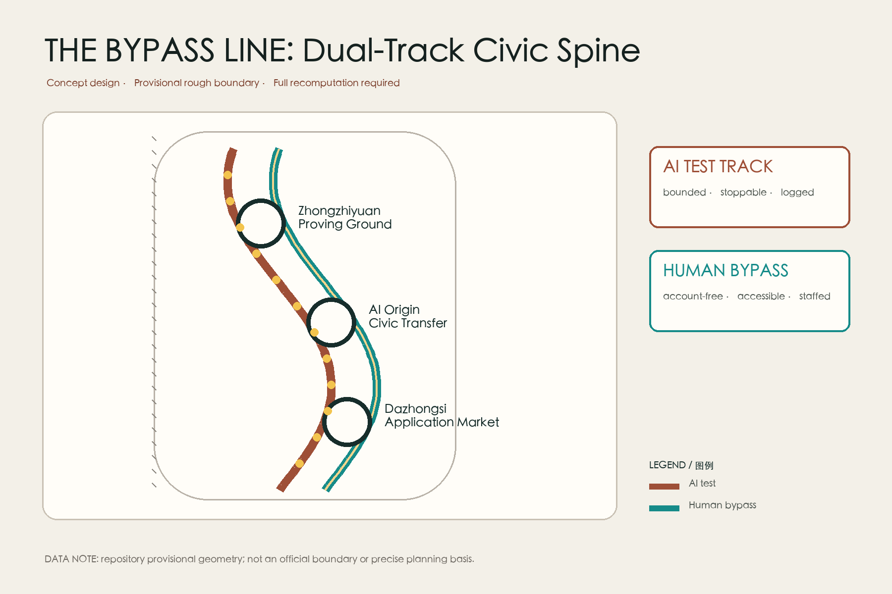
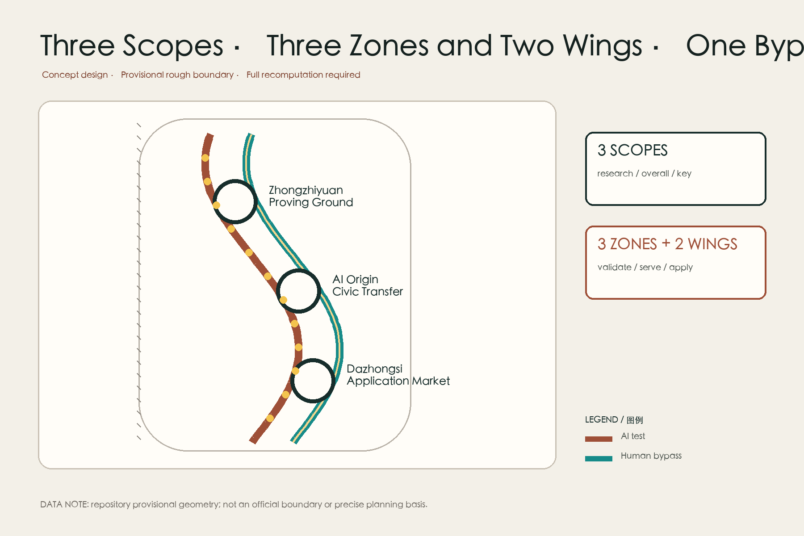
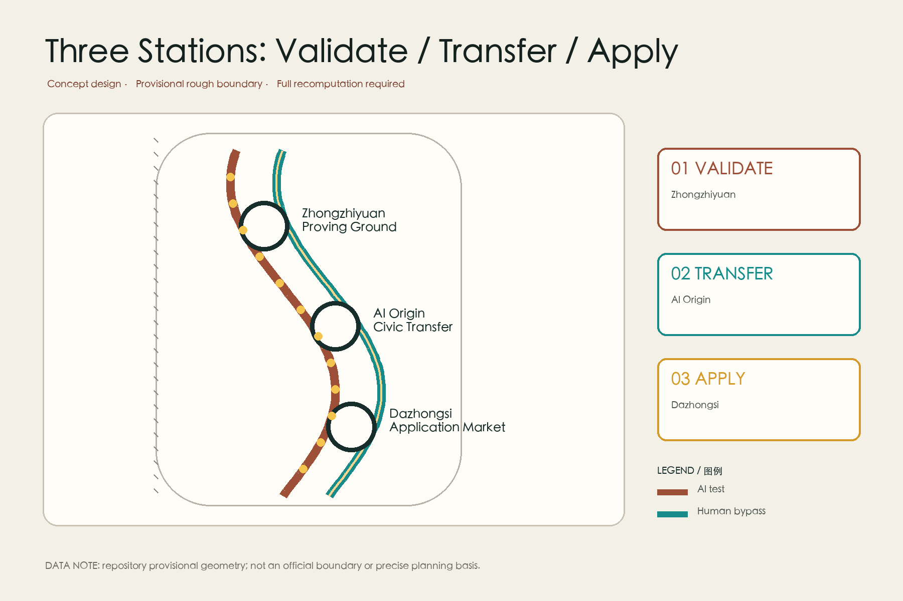
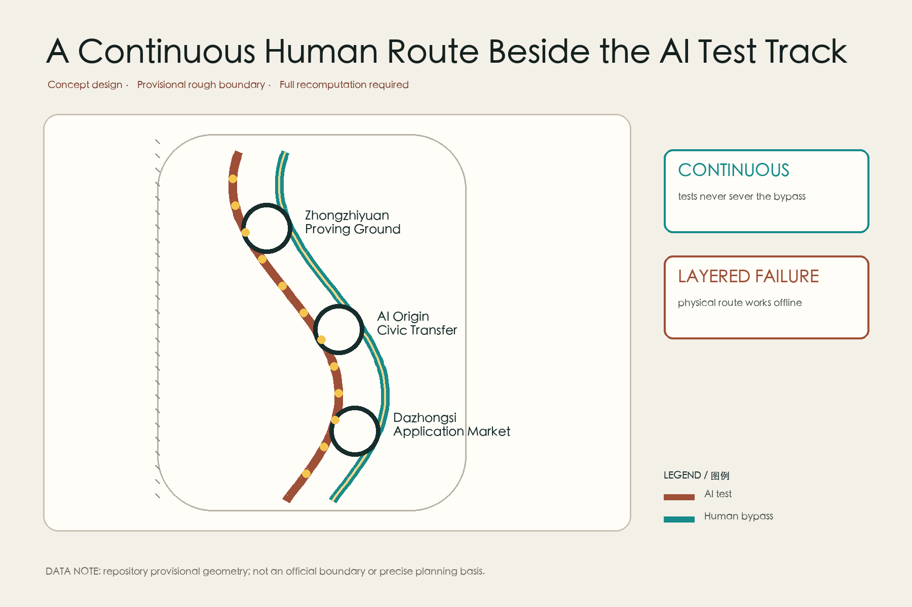
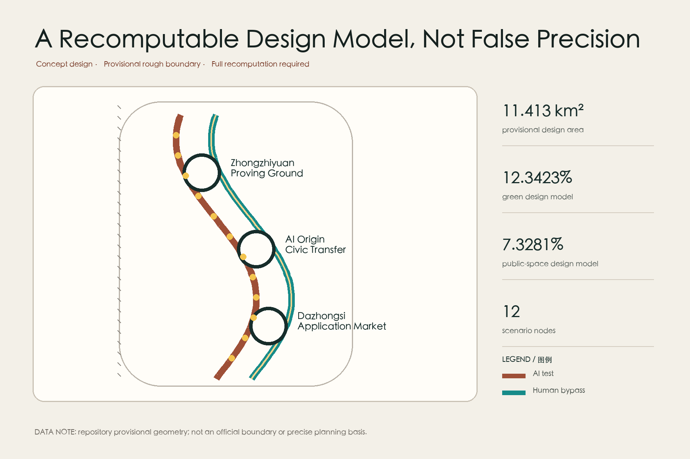

# THE BYPASS LINE / 京张旁路

> This proposal does not reject AI. It keeps the city complete when AI fails, goes offline, or is not wanted. All spatial moves are conceptual recommendations. The site and key areas use repository-provided provisional rough boundaries, not official planning boundaries, and must be recomputed when official geometry arrives.

## Design Basis and Source List

The proposal relies on the official open-call announcement, the Agent taskbook, the repository source registry, and rights-cleared local snapshots of professional standards. The announcement establishes the 43.6 sq km Coordinated Research Area, the approximately 11.4 sq km Overall Design Area, 368.4 hectares of key areas, and the three named detailed-design zones. The taskbook requires the three positionings, five functions, Three Zones and Two Wings, and six Agent tasks to appear in readable form.[source:OFFICIAL-ANNOUNCEMENT] [source:AGENT-TASKBOOK]

No trusted official polygons, road redlines, building survey, ownership records, utility capacities, or statutory development-intensity controls are present. The provisional polygons are therefore used only for concept generation, geometry recomputation, and intake checks. They cannot support statutory boundaries, demolition decisions, engineering feasibility, or investment commitments.[source:BOUNDARY-SOURCE] [standard:MOHURD-URBAN-DESIGN-MEASURES]

The core judgment is simple: a high-quality AI city does not force everyone through one digital entrance. Every service receives an AI test track and a human bypass. The AI track can be tested, audited, and stopped; the bypass requires no account or smartphone, remains accessible, and is taken over by a named human role.[standard:BARRIER-FREE-ENVIRONMENT-LAW] [depth:risk_missing_data]

## Three-Level Scope Framework

The Coordinated Research Area frames how universities, research, industry, capital, and public services can form an AI ecosystem without inventing project parcels across 43.6 sq km. The Overall Design Area carries the dual-track spine, three transfer stations, and two service wings. The three key areas deepen validation, civic services, and industry application into testable spatial modules.[source:SITE-PACKAGE] [depth:three_level_scope_framework]

The submitted provisional polygon recomputes to 11,412,825.386 sqm, close to the announced approximate 11.4 sq km, but the confidence remains low. It is a temporary constraint derived from textual extents and area calibration, not a precise official boundary.[data:geometry/site_boundary.geojson#SITE-001] [metric:site_area_sqm]

The handoff rule is: upper levels define questions without false precision; lower levels define testable modules without crossing approval authority. Official polygons must trigger replacement of boundaries, topology, metrics, figures, PDFs, and HTML. FAR, height, and existing-building decisions still require statutory and field data.

## Coordinated Research Area: Industry and Future City Research

The name is THE BYPASS LINE. Its identity uses two parallel tracks that exchange positions at human-review nodes: oxidized rail red for controlled AI tests and cyan-green for the permanently available human and accessible route. The round transfer mark denotes human review. This is an original conceptual identity and uses no government, corporate, or railway trademark.[standard:PROJECT-AGENT-OPEN-CALL-TASKBOOK] [depth:overall_spatial_structure]

The three positionings become operating spatial rules. The Centennial Jing-Zhang Cultural Belt preserves engineering explainability. The Metropolitan AI Life Experience Belt requires equivalent task routes and human takeover. The AI Integrated Innovation Belt connects research to city use through bounded scenarios, evaluation gates, and exit rules. Zhongzhiyuan hosts full-stack validation and governance; Beijing AI Origin Community hosts ecosystem exchange and civic services; Dazhongsi hosts AI-native commercial application. The Zhongguancun wing supplies legal, capital, IP, and computing interfaces; the Xiaoyue River wing supplies controlled daily-life scenarios and blue-green public space.

Seven international examples are mechanism references, not claims of local performance: Kendall Square, Toronto MaRS, Station F, Barcelona 22@, Helsinki Jätkäsaari, Singapore one-north, and Montreal's AI community. The transferable mechanisms are short walking links, shared services, bounded testing, public evaluation, and durable operations. Formal comparison would require primary sources and harmonized metrics.[source:SOURCE-REGISTRY] [depth:industry_ecosystem_strategy]

## Overall Design Area: Urban Renewal and Regulatory-Plan-Level Urban Design

The structure is one dual-track civic spine, three human-AI transfer stations, two service interfaces, and twelve scenario stops. Railway heritage direction informs the narrative and public realm, but no existing rail alignment, heritage-control line, or road redline is claimed as known geometry. The land-use layer remains a complete topology and assigns conceptual roles for validation, civic service, community life, industry application, and open space using only permitted public classification codes.[data:geometry/land_use.geojson#LU-001] [standard:MNR-LAND-USE-CLASSIFICATION-GUIDE]

Renewal follows small, reversible interventions: keep usable buildings and mature trees; first insert human counters, review rooms, offline wayfinding, shade, and rest points into ground floors, courtyards, station connections, and park edges. Demolition can only be judged after structural, ownership, heritage, and public procedures. The concept footprint is a module placeholder, not a building inventory.[data:geometry/buildings.geojson#BLDG-001] [depth:retain_renovate_demolish]

FAR, building height, total floor area, and actual building coverage remain pending official data. Concept massing does not produce statutory FAR. Green and public-space values are low-confidence design-model outputs recomputed from the submitted geometry.[metric:floor_area_ratio] [depth:development_intensity_controls]

## Detailed Design of Key Areas

**Zhongzhiyuan AI Independent Innovation Acceleration Area - Bypass Proving Ground.** A controlled test yard, human takeover room, and public failure archive support robots, edge models, and facility controls. Projects pass risk tiers before limited public operation; each shows a non-AI equivalent. Existing research spaces, open ground floors, and reversible equipment pods come before new massing.[data:geometry/key_areas.geojson#PROV-KEY-001] [depth:three_key_area_detailed_design]

**Beijing AI Origin Community - Civic Transfer Hall.** Health, education, legal, administrative, and accessible mobility services share a civic foyer. Every screen entrance is paired with a human counter, tactile and paper wayfinding, quiet waiting, and a private consultation room. AI supports navigation and low-risk information work but never makes final diagnoses, approvals, or legal decisions.[data:geometry/key_areas.geojson#PROV-KEY-002] [standard:GENERATIVE-AI-INTERIM-MEASURES]

**Dazhongsi AI Industry Cluster - Dual-Track Application Market.** Demountable stalls, shared prototype rooms, and closable test interfaces host AI commerce, culture, and daily services. Visitors can choose AI recommendation or ordinary browsing and payment; price, data use, responsible party, and complaints share one visible interface. Walkability and small-business affordability constrain any future renewal.[data:geometry/key_areas.geojson#PROV-KEY-003] [depth:key_area_implementation_plan]

## AI Innovation Ecosystem, Personas, and AI+ Scenarios

Five principal personas guide the design: researchers who need fast tests and audit responsibility; residents and carers who need low-friction civic services; older people, disabled people, and people with low digital literacy; small businesses needing compliant tools and affordable space; and professionals retaining final judgment in health, education, law, transport, and operations. Visitors and international developers are event users, not an excuse to design for an average person.[standard:ELDERLY-SMART-TECH-PLAN-2020-45] [depth:public_service_facilities]

The twelve scenario cards share four fields: AI route, human bypass, takeover role, and stop condition.

1. **Low-speed delivery proving (industry test):** bounded Zhongzhiyuan loop; handcart bypass; safety officer takes over; localization or braking anomaly stops the test.
2. **Accessible route companion (industry test):** voice and tactile wayfinding in the Xiaoyue River wing; physical signs remain; accessibility assessor takes over.
3. **Public-space crowd indication (industry test):** only congestion bands; on-site manager bypass; no facial recognition; missing sensors display unknown.
4. **Community health navigation:** care-process explanation; general consultation desk bypass; no diagnosis or prescription.
5. **Learning resource matching:** public-course suggestions; librarian bypass; teacher review; no commercial profiling of minors.
6. **Legal-service triage:** issue classification; duty legal worker bypass; high-risk cases transfer immediately.
7. **Administrative material pre-check:** missing-item reminders; staffed ticket desk bypass; AI cannot reject an application.
8. **Small-shop assistant:** scheduling and inventory help; shared business adviser bypass; data export and deletion rights.
9. **Bilingual heritage guide:** personalized routes; fixed panels and volunteer guides; disputed history shows sources.
10. **Stormwater and heat-comfort notice:** design-model display; physical shade and open route remain; no substitution for official warnings.
11. **Night safety companion:** lighting, help points, and staffed route only; no identity inference; physical route works offline.
12. **Open-source contribution wall:** traceable merged work; printed annual record bypass; corrections allowed; submissions are not marked implemented.

The nodes are recorded as SCENARIO_NODE points in `constraints.geojson`. Scenarios 1-3 are industry tests; 4-12 are service and operating scenarios. Field, privacy, safety, sector, and human professional review remain prerequisites.[data:geometry/constraints.geojson#SCN-01] [standard:PROJECT-AGENT-OPEN-CALL-TASKBOOK]

## Land Use, Building Scale, and Retain-Renovate-Demolish Strategy

The complete land-use topology combines research, civic service, community life, commerce, and open space rather than proposing a mono-functional AI park. LU-001 through LU-004 carry conceptual roles for northern validation, the central origin community, southern application, and the continuous civic interface. Areas remain geometry-derived and codes stay within the public subset.[data:geometry/land_use.geojson#LU-002] [depth:land_use_layout]

The building layer represents one reversible Bypass Station prototype: a human counter, accessible toilet, quiet room, paper process for power loss, and closable equipment pod at ground level, with research, training, or co-creation space above. Its footprint metric is conceptual geometry, not an existing-building count. Retain, renovate, demolish, and build decisions require surveys, structural tests, ownership checks, heritage assessment, and public engagement.[metric:building_footprint_area_sqm] [standard:MOHURD-CONTROL-DETAILED-PLANNING]

Character guidance is legible old rail material, demountable new components, and interfaces that can turn off: durable dark metal, warm timber or recycled material, shade canopies, and high-contrast signs independent of luminous screens. Height, roof, skyline, and facade controls are directions for professional development only.[depth:height_massing_character]

## Transport, Rail, Municipal Infrastructure, and Public Services

Two parallel but non-substituting routes organize mobility. The AI track hosts booked shuttles, robots, and dynamic information; the bypass carries ordinary walking, wheelchair travel, walking bicycles, and staffed service. They meet at three stations, but test closures cannot break the bypass. The road centerline is a conceptual connection, not an existing road or rail redline.[data:geometry/roads.geojson#ROAD-001] [depth:traffic_rail_slow_parking]

“A human encounter within ten minutes” is a directional operating objective, not a computed service radius. Main stations host named staff roles, while smaller nodes show clear transfer instructions. Parking, transit interchange, fire access, logistics, and cycle quantities remain pending network and facility data.

Infrastructure uses layered failure: devices degrade locally, stations keep offline procedures, basic power supports critical lighting and help points, data storage is minimized, and network or model failures never close the physical route. Power, communications, drainage, and computing capacity require professional verification.[depth:municipal_new_infrastructure]

## Blue-Green Network, Public Space, and Urban Character

The design-model green-space area is 1,408,600.768 sqm, or 12.3423% of the provisional site; public space is 836,345.643 sqm, or 7.3281%. Both are low-confidence geometry-derived concept values and not official planning indicators.[data:geometry/green_space.geojson#GREEN-001] [metric:green_ratio] [metric:public_space_ratio]

Blue-green space is bypass infrastructure: continuous shade, rain gardens, drinking water, seating, accessible slopes, basic night lighting, and readable signs keep the route functional when screens are off. The rough boundary is shown only as a quiet dashed constraint; design emphasis stays on dual tracks, stations, scenarios, and delivery.[depth:blue_green_public_space]

Three AI pilgrimage landmarks become accountability facilities. Zhongzhiyuan's Failure Archive shows faults and repairs. AI Origin's Human Takeover Desk shows who is responsible. Dazhongsi's Open-Source Contribution Wall displays only linked, licensed, correctable work. They are conceptual nodes, not approved monuments or permanent recognition promises.

## Renewal Projects, Implementation Policy, and Phasing

Near-term concepts are P1 dual-track pilot, P2 Zhongzhiyuan proving ground, P3 AI Origin civic transfer hall, and P4 Dazhongsi application market. Medium-term concepts are P5 Xiaoyue River accessible stormwater bypass, P6 Zhongguancun professional-service interface, and P7 shared failure registry. Long-term concepts are P8 corridor operating protocol, annual review, and retractable expansion. Every item requires field conditions, responsible parties, funding, professional review, and engagement before implementation.[data:geometry/phasing.geojson#PHASE-001] [depth:renewal_project_list]

A proposed “right to a bypass” makes equivalent access a condition of scenario access. Public services cannot require an app, facial recognition, or unnecessary data consent as the only entrance. High-risk scenarios need a named human decision maker, logs, appeal, and shutdown. Expired pilots are reviewed for public benefits and burdens before expansion, revision, or removal.

**BYPASS WEEK** is an annual operating concept: public failure exhibitions, accessibility walks, model-retirement ceremonies, scenario-card reviews, an international developer challenge, and a community screen-free day. Quarterly tests and an online-plus-print knowledge base continue through the year. Brand, budget, partners, and international agreements remain unconfirmed.[depth:phasing_delivery]

## Metrics, Area Recalculation, and Compliance Matrix

The three formal core visual metrics are known and recomputable from submitted geometry: provisional design area 11,412,825.386 sqm, green ratio 0.123423, and public-space ratio 0.073281. Matching `data-value` attributes appear in `visual/index.html`. Official polygons must trigger EPSG:4548 reprojection, recomputation, and regeneration of all derived files.[metric:site_area_sqm] [metric:green_ratio] [metric:public_space_ratio]

The package also records three key areas, twelve scenario nodes, one conceptual building prototype, and one conceptual walking spine. FAR remains pending statutory data. Green ratio supports comfort and dwelling; public-space ratio supports non-commercial exchange; node count describes manageable pilots, not a belief that more AI is always better.[metric:key_area_count] [depth:metrics_recalculation]

The compliance matrix maps announcement tasks and agent.1-agent.6. The standards matrix keeps source, standard, and assumption namespaces separate. Fifteen design-depth items link narrative, geometry, drawings, and self-checks. Passing means review-ready packaging, not approval, completed scoring, or construction authority.[depth:compliance_traceability]

## Risk, Copyright, and Compliance

The largest risk is mistaking provisional boundaries, concept massing, or synthetic imagery for official work. Provisional status appears in the narrative, sources, assumptions, visual dashboard, and figures; official data triggers full recomputation. A second risk is digital exclusion or an accountability gap, so every scenario requires a non-AI bypass, human review, stop condition, complaint, and correction. A third risk is test interference with public space, so pilots remain bounded and time-limited while the bypass remains continuous.[source:BOUNDARY-SOURCE] [depth:risk_missing_data]

Five core figures are redrawn locally from submitted geometry, metrics, and matrices. The cover is a non-site-specific synthetic concept image generated with an OpenAI image tool. It is not a site photograph, measured evidence, or official rendering. No third-party photos, trademarks, portraits, or remote fonts enter the package. Methods and rights limits are in `report/copyright_statement.md`.

The proposal makes no promise of government policy, investment, tenant recruitment, engineering feasibility, or resident support. Qualified or named human roles retain health, legal, education, transport, and governance judgments. Any implementation requires statutory procedure, professional design, data-protection assessment, accessibility review, and public participation.[standard:GENERATIVE-AI-INTERIM-MEASURES] [standard:BARRIER-FREE-ENVIRONMENT-LAW]

## References

1. Haidian Branch of the Beijing Municipal Commission of Planning and Natural Resources, official open-call announcement, 2026-05-09.[source:OFFICIAL-ANNOUNCEMENT]
2. Project repository, Agent open-call taskbook excerpt, 2026-05-18.[source:AGENT-TASKBOOK]
3. Project repository, public Source Registry and use boundaries, accessed 2026-08-27.[source:SOURCE-REGISTRY]
4. MOHURD, local public snapshot of the Urban Design Management Measures.[standard:MOHURD-URBAN-DESIGN-MEASURES]
5. MNR, local public snapshot of the land and sea use classification guide.[standard:MNR-LAND-USE-CLASSIFICATION-GUIDE]
6. Law of the PRC on Building Accessible Environments, local public snapshot.[standard:BARRIER-FREE-ENVIRONMENT-LAW]
7. Repository provisional polygons for the three scopes and key areas, temporary generation and recomputation only.[source:BOUNDARY-SOURCE]
