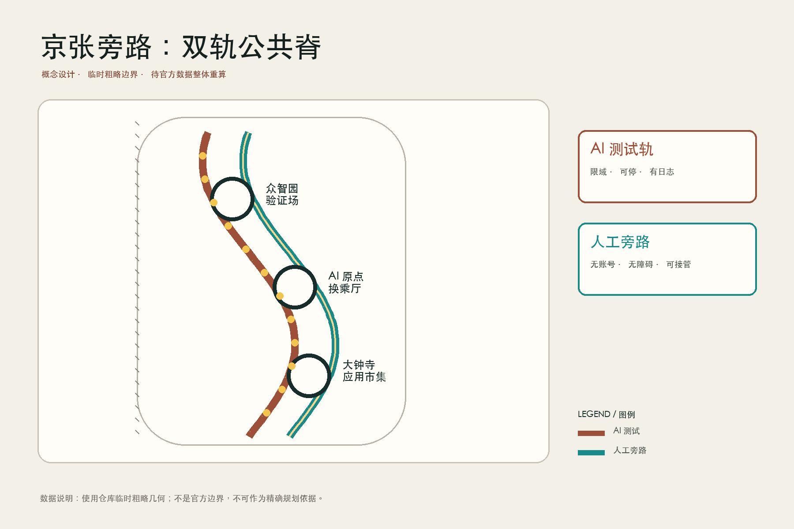
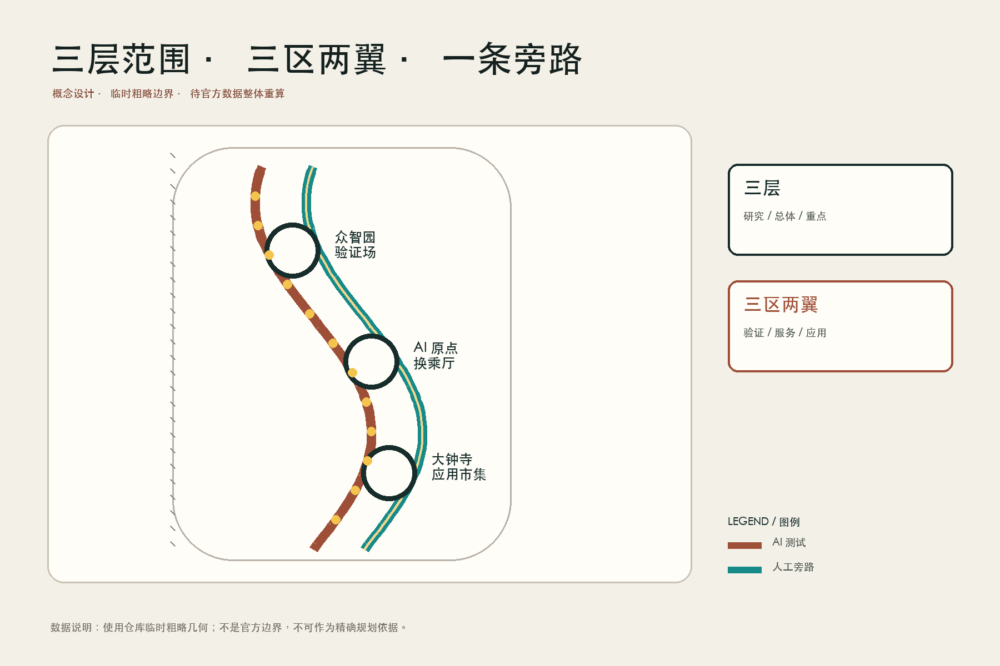
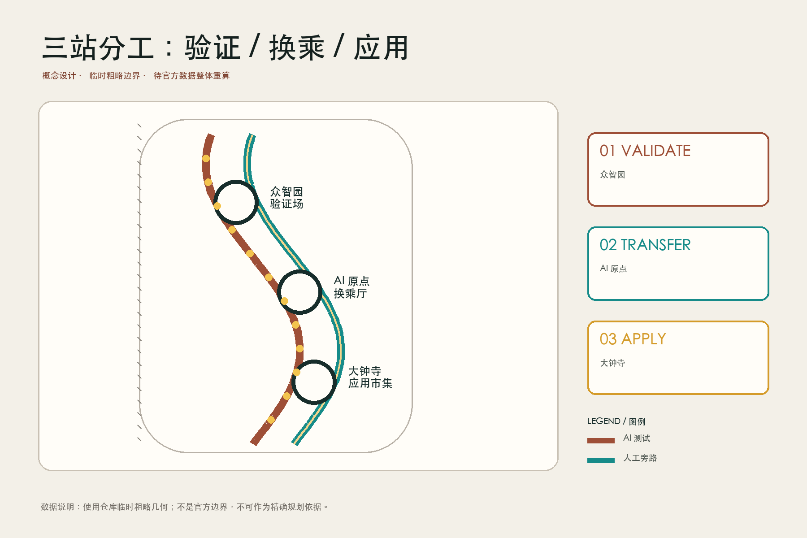
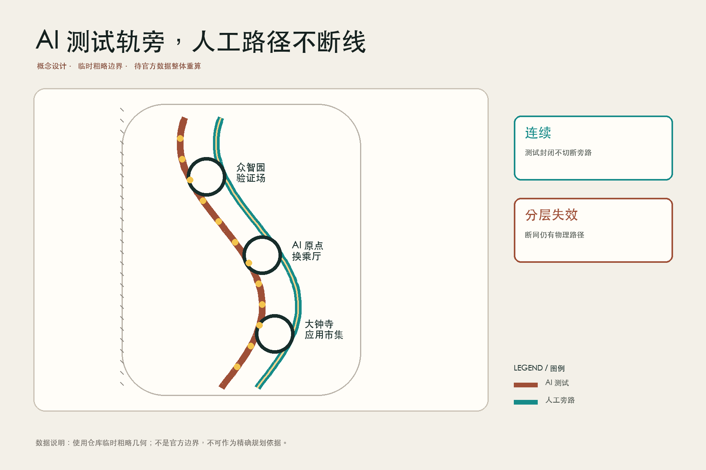
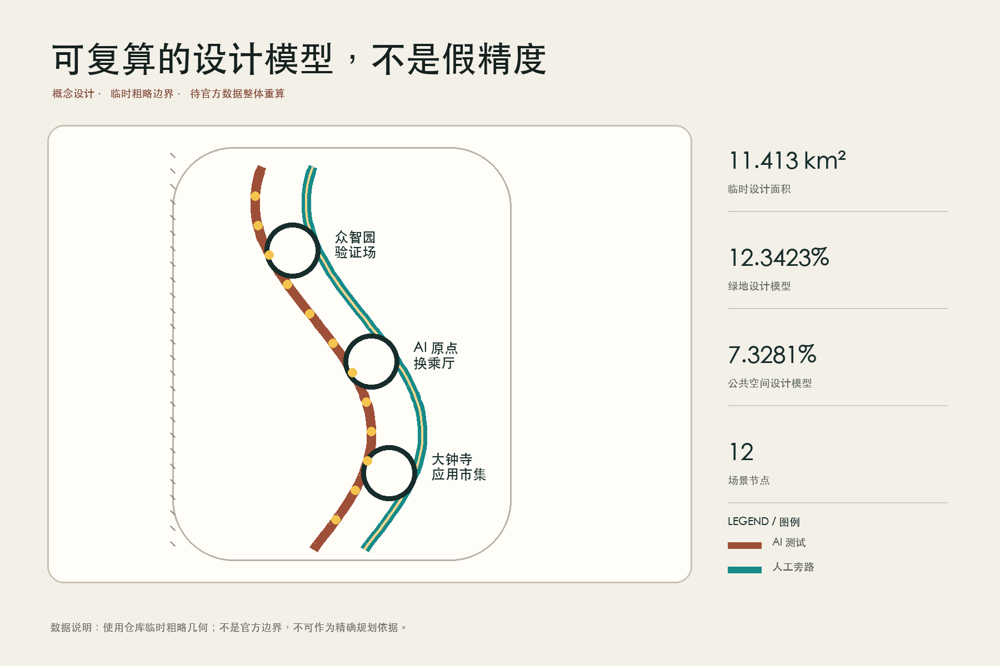

# 京张旁路 / THE BYPASS LINE

> 不是拒绝 AI，而是让城市在 AI 出错、离线、无人愿意使用时仍然完整。本文所有空间落位均为概念建议；总体范围与三处重点区采用仓库临时粗略边界，不是官方红线，正式数据到位后必须整体重算。

## 设计依据与资料清单

本方案以公开征集公告、面向智能体任务书、仓库资料登记表及其中已清权的专业标准快照为依据。公告提供 43.6 平方公里统筹研究范围、约 11.4 平方公里总体设计范围、368.4 公顷重点区域总量和三处重点区任务；任务书要求三大定位、五大功能、三区两翼以及六类 Agent 任务进入可读方案。[source:OFFICIAL-ANNOUNCEMENT] [source:AGENT-TASKBOOK]

仓库尚未提供可信的官方范围 polygon、道路红线、现状建筑、权属、市政容量和控规强度条件。因此本包只把临时粗略 polygon 用于概念生成、几何复算和投稿自检；它不能支撑法定边界、拆迁结论、工程可行性或投资承诺。法定用地分类、城市设计、控规衔接、无障碍和生成式 AI 治理分别由本地标准快照约束，缺失的建筑专业官方文件保留为资料缺口。[source:BOUNDARY-SOURCE] [standard:MOHURD-URBAN-DESIGN-MEASURES]

“京张旁路”由一个判断出发：高品质 AI 城市不是把所有人推入同一数字入口，而是给每项服务同时设计“AI 测试轨”和“人工旁路”。AI 轨可试验、可审计、可停运；旁路无需账号、无需智能手机、连续无障碍，并由具名岗位接管。这个判断贯彻到空间、场景卡、运营门槛和分期，不把无 AI 路径留作一句合规注脚。[standard:BARRIER-FREE-ENVIRONMENT-LAW] [depth:risk_missing_data]

## 三层范围工作框架

统筹研究范围用于判断海淀高校、科研、产业、资本和公共服务如何形成世界级 AI 创新生态，不在 43.6 平方公里范围内画出未经证实的项目地块。总体设计范围承担“双轨一带、三座换乘站、两翼接口”的城市设计结构；三处重点区则分别把验证、公共服务和产业应用深化到可讨论的空间模块。[source:SITE-PACKAGE] [depth:three_level_scope_framework]

总体设计 polygon 的几何复算值为 11,412,825.386 平方米，与公告约 11.4 平方公里口径接近，但其置信度仍为低：这是根据文字四至和面积校核形成的临时约束，不是精确红线。[data:geometry/site_boundary.geojson#SITE-001] [metric:site_area_sqm]

三层工作的交接规则是“上层给问题，不给假精度；下层给可检验模块，不越过审批”。官方 polygon 到位时，首先替换 site boundary 和 key areas，再重做用地拓扑、绿地/公共空间面积、图件、PDF 和 HTML；容积率、高度、现状拆改留仍须等待控规、测绘、权属和工程调查。

## 统筹研究范围产业与未来城市研究

总体命名为“京张旁路 / THE BYPASS LINE”，识别符号由两条平行但在节点互换位置的轨线构成：锈红线代表可控的 AI 测试轨，青绿色代表持续开放的人工与无障碍旁路，圆形换乘标记代表人类复核。Logo 只作为本次概念方案自创图形方向，不使用政府、企业或铁路商标。[standard:PROJECT-AGENT-OPEN-CALL-TASKBOOK] [depth:overall_spatial_structure]

三大定位被转译为三条制度化空间规则：百年京张文化带保存“工程可解释性”，让系统构造、责任与失败记录可见；都市 AI 生活体验带要求同任务双路径与人工接管；AI 融合创新带用限定场景、评估门和退出机制连接研发与城市应用。五大功能落在三区两翼：众智园承担全栈验证与治理规则，北京 AI 原点社区承担生态交换和公共服务，大钟寺承担智能原生商业应用；中关村科技服务翼提供法律、资本、知识产权与算力接口，小月河场景赋能翼提供可控的生活场景和蓝绿公共空间。

七个公开可核查的生态案例只作机制参照，不作本地绩效事实：Boston Kendall Square 的高校-企业邻近、Toronto MaRS 的创新服务平台、Station F 的集中孵化、Barcelona 22@ 的存量更新、Helsinki Jätkäsaari 的城市试验、Singapore one-north 的研究产业混合、Montreal AI 社群的研究与公共讨论。提案吸收的是“短步行联系、共享服务、限定测试、公开评估和可持续运营”五类机制；任何案例数字若要进入正式比较，须另补原始来源和同口径核验。[source:SOURCE-REGISTRY] [depth:industry_ecosystem_strategy]

## 总体设计范围城市更新与控规深度城市设计

总体结构为“一条双轨公共脊、三座人机换乘站、两翼服务接口、十二个场景停靠点”。现有铁路遗产方向被作为叙事和公共空间主脊，但本包没有把轨道中心线、遗产保护线或道路红线当作已知几何。用地层保持完整无缝分区，并在属性中赋予旁路公共服务、科研验证、社区生活和产业应用的概念功能；其用地 code 只遵循公开分类子集，不替代法定规划。[data:geometry/land_use.geojson#LU-001] [standard:MNR-LAND-USE-CLASSIFICATION-GUIDE]

城市更新优先采用“小切口、可逆、先运营后固化”：保留可用建筑与成熟树木，先在首层、院落、站点通道和遗址公园界面插入旁路柜台、人工复核室、离线导视和遮阴休息点；拆除仅能在后续结构、权属、历史价值和公众程序完成后由专业团队判断。概念建筑基底仅用于表达模块占位，不代表真实建筑盘点。[data:geometry/buildings.geojson#BLDG-001] [depth:retain_renovate_demolish]

开发强度、建筑高度、总建筑面积和真实建筑密度均待正式数据补齐。方案拒绝用概念体块反推法定 FAR；绿地和公共空间则从提交几何复算并明确低置信度，用于比较设计模型而非申报指标。[metric:floor_area_ratio] [depth:development_intensity_controls]

## 重点区域详细设计

**众智园 AI 自主创新加速区 - 旁路验证场。** 北部重点区建议设置“停机坪式”受控测试院、人工接管室和公开故障档案廊。机器人、边缘模型和公共设施控制先在封闭或半封闭场地完成风险分级，再以限时、限速、限域方式进入公共路径；每个项目同时展示无 AI 等价流程。建筑策略以既有科研空间适配、首层开放和可逆设备舱为先，具体体量待勘测。[data:geometry/key_areas.geojson#PROV-KEY-001] [depth:three_key_area_detailed_design]

**北京 AI 原点社区 - 公共服务换乘厅。** 中部重点区把医疗、教育、法律、政务和无障碍出行组织为共享前厅：屏幕入口旁总有人工柜台、纸质/触觉导视、安静等候和隐私咨询室。AI 只做导航、信息整理和低风险辅助，不做最终诊断、审批或法律决定。公共空间通过连续雨棚、座椅、饮水、卫生间和无障碍路径连接社区与慢行主脊。[data:geometry/key_areas.geojson#PROV-KEY-002] [standard:GENERATIVE-AI-INTERIM-MEASURES]

**大钟寺 AI 产业聚集区 - 双轨应用市集。** 南部重点区建议以可拆装摊位、共享样机间和夜间可关闭的测试界面承载 AI 商业、文创和生活服务。消费者可选择 AI 推荐或普通浏览结账；价格、数据使用、责任主体和投诉渠道在同一界面可见。存量商业更新以步行渗透、首层混合和小商户可负担为约束，不把招商和租金结果写成承诺。[data:geometry/key_areas.geojson#PROV-KEY-003] [depth:key_area_implementation_plan]

## AI 创新生态、人才画像与 AI+ 场景

五类核心画像是：需要快速试验并承担审计责任的研发者；需要低门槛公共服务的居民与照护者；可能面临数字门槛的老年人、残障人士和低数字素养者；需要合规工具与可负担空间的小微企业；负责医疗、教育、法律、交通和城市运维最终判断的专业人员。另把访客和国际开发者作为活动用户，而不是用“平均用户”覆盖差异。[standard:ELDERLY-SMART-TECH-PLAN-2020-45] [depth:public_service_facilities]

十二张场景卡都采用“AI 路径 / 人工旁路 / 接管人 / 停止条件”四栏：

1. **低速配送验证（产业测试）**：众智园限域环线测试，旁路为人工推车；安全员接管，定位或制动异常即停。
2. **无障碍路线伴行（产业测试）**：小月河翼测试语音与触觉导航，旁路为连续实体导视；无障碍评估员接管，路径中断即退回静态地图。
3. **公共空间客流提示（产业测试）**：遗址公园只输出拥挤级别，旁路为现场管理员；禁止人脸识别，传感器缺失即显示“未知”。
4. **社区健康导航**：AI 解释就诊流程，旁路为全科咨询台；医务人员复核，不输出诊断与处方。
5. **学习资源匹配**：AI 推荐公开课程，旁路为图书馆员选书；教师复核，未成年人数据不作商业画像。
6. **法律服务分流**：AI 整理问题类型，旁路为值班法律工作者；不代替法律意见，冲突或高风险案件立即转人工。
7. **政务材料预检**：AI 提醒缺项，旁路为人工取号窗口；审批人员决定，模型不可拒绝申请。
8. **小店经营助手**：AI 帮助排班和库存，旁路为共享商务顾问；商户拥有数据导出与删除权。
9. **遗产双语导览**：AI 生成个性化路线，旁路为固定展板和志愿讲解；史实争议标注来源并转人工策展。
10. **雨洪与热舒适提示**：公共屏显示设计模型，旁路为实体遮阴与开放通道；不得替代气象预警。
11. **夜间安全陪行**：只提供照明、求助点和人工值守路线，不做人群身份推断；设备离线时旁路仍可通行。
12. **开源贡献墙**：展示已合并、可追溯贡献，旁路为纸本年鉴；当事人可申请纠错，概念投稿不标成已实施。

每张卡的空间节点记录在 `constraints.geojson` 的 SCENARIO_NODE 点中；场景 1-3 是产业测试验证，4-12 是公共服务和运营场景。真实运行前仍需现场、隐私、安全、行业主管和人类专业复核。[data:geometry/constraints.geojson#SCN-01] [standard:PROJECT-AGENT-OPEN-CALL-TASKBOOK]

## 用地、建筑规模与拆改留方案

用地分区保留完整拓扑，以科研、公共服务、社区生活、商业和开放空间的兼容组合支撑三处重点区，而不是以单一 AI 园区大拆大建。LU-001 至 LU-004 的属性分别对应北部验证、中部原点社区、南部应用和贯通公共界面；用地面积应由几何逐项计算，分类名称只在公开分类表允许范围内使用。[data:geometry/land_use.geojson#LU-002] [depth:land_use_layout]

建筑层只表达一个可逆“旁路站”原型：首层包含人工柜台、无障碍卫生间、安静室、设备断电后的纸质流程和可关闭设备舱；楼上可供研发、培训或社区共创。`building_footprint_area_sqm` 是这个概念几何的总量，不是现状建筑统计。真实保留、改造、拆除和新建必须在建筑普查、结构检测、权属核查、历史价值评估和公众沟通后重新分类。[metric:building_footprint_area_sqm] [standard:MOHURD-CONTROL-DETAILED-PLANNING]

风貌建议采用“旧轨材料可辨、新增构件可拆、信息界面可关”：耐久深色金属、暖色木或再生材料、遮阴雨棚和不依赖发光屏的高对比导视。高度、屋顶、天际线和立面控制仅为专业深化方向，不能从本包推导审批条件。[depth:height_massing_character]

## 交通、轨道、市政与公共服务设施

交通核心是两条并行但不互相替代的慢行线路：AI 轨容纳预约接驳、机器人和动态信息，旁路承载普通步行、轮椅、自行车推行和人工服务。两线在三座换乘站和若干小节点相交，但旁路不得因测试封闭而被切断。道路中心线是概念连接，不代表现状道路、轨道线位或工程红线。[data:geometry/roads.geojson#ROAD-001] [depth:traffic_rail_slow_parking]

公共服务设施以“10 分钟可遇见人工”为方向性运营指标：三处主站配置具名值班岗位，普通节点提供清晰转接方式；精确服务半径需结合人口、街道网络和设施现状再算。停车、轨道接驳、消防、物流和非机动车位不在缺少现状资料时给出伪精确数量。

市政与新型基础设施采取分层失效设计：设备端可本地降级、站点有断网流程、关键照明与求助设施保留基础电力、数据最小化存储、网络与模型故障不得封死物理通路。具体电力、通信、排水和算力容量需由市政专业团队核验。[depth:municipal_new_infrastructure]

## 蓝绿空间、公共空间与城市风貌

绿地设计模型面积为 1,408,600.768 平方米，约占临时总体边界的 12.3423%；公共空间设计模型面积为 836,345.643 平方米，约占 7.3281%。两者来自提交几何复算，均为低置信度概念值，不能替代官方绿地率或公共空间指标。[data:geometry/green_space.geojson#GREEN-001] [metric:green_ratio] [metric:public_space_ratio]

蓝绿系统不是景观背景，而是人工旁路的基础设施：连续树荫、雨水花园、可饮水点、座椅、无障碍坡道、夜间基础照明和可读导视共同保证在屏幕关闭时空间仍能工作。临时边界只以淡色虚线出现，图面重点放在双轨网络、三站、场景节点和实施序列。[depth:blue_green_public_space]

三处“AI 朝圣地标”被重新定义为可问责的公共设施：众智园“故障档案库”展示失败和修复；AI 原点“人工接管台”让市民看到谁负责；大钟寺“开源贡献墙”只展示有链接、有许可、可纠错的贡献。它们是概念节点，不是已批准建设或永久纪念承诺。

## 更新项目清单、实施政策与分期计划

近期建议包括 P1 双轨样段、P2 众智园旁路验证场、P3 AI 原点公共服务换乘厅、P4 大钟寺双轨应用市集；中期包括 P5 小月河无障碍与雨洪旁路、P6 中关村专业服务接口、P7 三站共享故障登记；长期包括 P8 全线运营协议、年度复核和可撤回扩展。每项均须经过现场条件、责任主体、资金、专业审查和公众沟通后才能转入实施。[data:geometry/phasing.geojson#PHASE-001] [depth:renewal_project_list]

政策建议采用“旁路权”作为场景开放条件：公共服务不得以安装 App、刷脸或同意非必要数据处理为唯一入口；高风险场景必须有具名人类决策者、日志、申诉和停用机制；试点到期先复核公共收益与负担，再决定扩大、修改或撤除。这只是供专业和管理团队深化的机制草案。

年度运营名为 **BYPASS WEEK / 京张旁路周**：包含公开故障展、无障碍走查、模型退役仪式、场景卡复盘、国际开发者挑战和社区“无屏日”。季度开展小型开放测试，全年维护线上与纸本双版本知识库。活动品牌、预算、招商和国际合作均未获确定，须由未来运营主体评估。[depth:phasing_delivery]

## 指标体系、面积复算与合规矩阵

三项 formal 核心视觉指标均为 known 且可由本包几何复算：临时设计边界面积 11,412,825.386 平方米、绿地比例 0.123423、公共空间比例 0.073281。它们在 `visual/index.html` 使用相同 `data-value`；正式 polygon 到位后必须触发重新投影至 EPSG:4548、重算和全部派生文件刷新。[metric:site_area_sqm] [metric:green_ratio] [metric:public_space_ratio]

另记录 3 个重点区、12 个场景节点、1 个概念建筑原型和 1 条概念慢行骨架。FAR 因缺少法定条件保持待正式数据补齐，不能用项目愿景或效果图补值。指标的价值不只在通过校验：绿地比例对应热舒适与停留，公共空间比例对应不消费也可进入的交流界面，场景节点数量对应可管理的试点单元，而不是“AI 越多越好”。[metric:key_area_count] [depth:metrics_recalculation]

任务覆盖矩阵逐项映射公告 1.3、1.4、1.5 和 agent.1-agent.6；专业标准矩阵保持来源、标准与假设命名空间分离；15 项设计深度都链接正文、几何、图纸和自检。通过只说明包可进入内容审阅，不等于方案已批准、专业评分完成或可以施工。[depth:compliance_traceability]

## 风险、版权与合规说明

最大风险是把临时边界、概念体块或生成图误读为官方成果。本包在 proposal、sources、assumptions、visual 和图件中重复揭示 provisional 状态；正式数据到位后需整体重算。第二类风险是 AI 服务制造数字排斥或责任真空，因此每个场景必须提供无 AI 旁路、人工复核、停止条件、投诉与纠错。第三类风险是测试干扰公共空间，故试点必须限域限时并保持旁路连续。[source:BOUNDARY-SOURCE] [depth:risk_missing_data]

五张核心图由本地脚本依据提交几何、指标和矩阵重绘；封面由 OpenAI 图像生成工具制作，是非场地特定的合成概念表现，不是现场照片、实测证据或官方效果图。无第三方照片、商标、人物肖像或远程字体进入提交包。详细生成方法与权利边界见 `report/copyright_statement.md`。

本方案不承诺政府政策、投资、招商、工程可行性或居民支持；医疗、法律、教育、交通与公共治理判断始终由有资质或具名的人类岗位负责。任何后续实施必须完成法定程序、专业设计、数据保护评估、无障碍审查和公众参与。[standard:GENERATIVE-AI-INTERIM-MEASURES] [standard:BARRIER-FREE-ENVIRONMENT-LAW]

## 参考资料

1. 北京市规划和自然资源委员会海淀分局，《百年京张 AI 创新带城市设计国际方案征集资格预审公告》，2026-05-09。[source:OFFICIAL-ANNOUNCEMENT]
2. 项目仓库，《面向全球智能体开展百年京张 AI 创新带城市设计开源征集任务书摘录》，2026-05-18。[source:AGENT-TASKBOOK]
3. 项目仓库，《公开来源登记表》及资料使用边界，读取于 2026-08-27。[source:SOURCE-REGISTRY]
4. 住房和城乡建设部，《城市设计管理办法》本地公开快照。[standard:MOHURD-URBAN-DESIGN-MEASURES]
5. 自然资源部，《国土空间调查、规划、用途管制用地用海分类指南》本地公开快照。[standard:MNR-LAND-USE-CLASSIFICATION-GUIDE]
6. 《中华人民共和国无障碍环境建设法》本地公开快照。[standard:BARRIER-FREE-ENVIRONMENT-LAW]
7. 项目仓库，《三层范围与三处重点区临时粗略 polygon》，仅供临时生成与复算。[source:BOUNDARY-SOURCE]
