# Jing-Zhang Open Ground

> JING-ZHANG OPEN GROUND · V4 urban-design reconstruction · Conceptual / provisional · Not a statutory plan

## Executive Summary and Jury Reading Route

Jing-Zhang Open Ground advances the completed railway heritage park into a public intelligence spine that supports learning, experience, controlled validation and long-term operation. Its spatial structure is “one spine, two wings, three grounds, multiple stitches.” The heritage park becomes the nine-kilometre spine. The western Zhongguancun technology-service wing links capital, transfer, intellectual property and global services. The eastern Xiaoyue River scenario-enablement wing supports embodied intelligence, AI+health and AI+media. Zhongzhiyuan, AI Origin and Dazhongsi become verification, co-creation and living open grounds. Five priority east-west interfaces repair walking, cycling, accessibility and station-city connections.

This is not a rebranding of a governance mechanism. V4 compresses the mature agent, participation, evidence and risk system into a background operating system. The foreground answers the questions an urban-design jury can see: where AI industry occurs; how research reaches the city; how the railway sides are stitched together; what form, section and public realm each key area has; and how people encounter AI through mobility, education, health, consumption and culture.

The jury can follow four routes. A3 pages 01–09 establish the proposition, contents, task matrix and masterplan. Pages 10–20 cover land, industry, mobility, blue-green systems and new infrastructure. Pages 21–32 detail each key area through plan, structure, section, scene and phase. Pages 33–40 present twelve scenarios, the cultural kit, the agent operating system, delivery, metrics and the final city vision. Each major claim is tied to a figure, geometry, metric or source; facts and conceptual projections remain visibly separate.

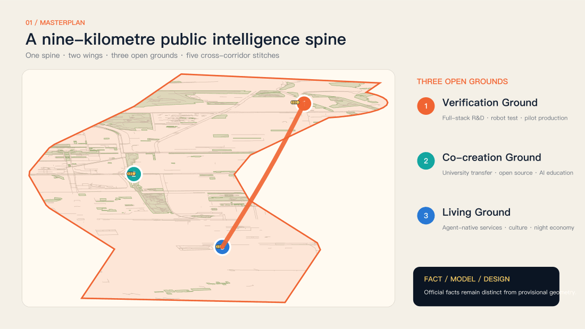

### Core Spatial Structure

| Layer | Urban-design move | Spatial and operating result |
|---|---|---|
| One spine | Upgrade the heritage park into a civic learning, experience and controlled-validation spine | Continuous everyday access, cultural narrative, low-carbon maintenance and accessibility services |
| Two wings | Professional services west; scenario enablement east | Extend the industry chain from research to pilot production, procurement, application and global links |
| Three grounds | Verify at Zhongzhiyuan, co-create at AI Origin, live at Dazhongsi | Three distinct districts share talent, data, evidence and maintenance networks |
| Multiple stitches | Wudaokou, Qinghuayuan station, Dazhongsi quadrants, Zhongzhiyuan–Xuezhiyuan and others | Repair ground-level legibility and accessibility before testing the need for large civil works |

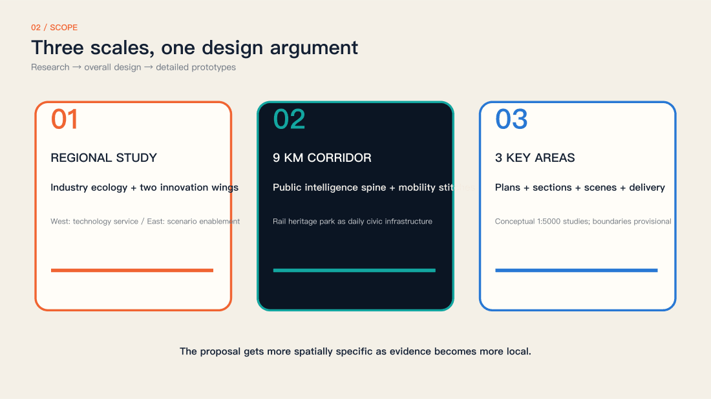

## Design Basis and Source List

### The park exists. Participation must keep growing.

Phase II opened in August 2026. The nine-kilometre corridor is an existing condition.

We do not treat the park as vacant land or claim existing paths, locomotives and event spaces as our invention. The addition is an accessible question interface, reversible testing, public review and an evolving archive. Spatial changes respond to specific needs; technology deployment follows risk review. [source:V3-PARK-OPEN] [source:V3-PARK-OFFICIAL]

Design judgment: completed park works provide a spatial foundation, but collaboration needs a continuing service. Start with authorized forecourts and rooms. Publish a task owner, receiving officer and response date so residents can follow outcomes after an event and operators can reuse evidence and permissions.

### From real places to public results

Four evidence layers organize the forty-page proposal.

First, establish existing conditions through official sources, statutory planning, open maps and dated photographs. Second, identify what is already solved and what interfaces remain missing. Third, specify spatial components, operating rules and agent roles. Fourth, verify through pilots, human gates, failure criteria and exit routes. Grey denotes context; colour denotes proposals; dashed lines denote provisional relationships.

Reading route: pages 1–10 establish evidence and questions; 11–14 explain the overall system; 15–24 develop the three areas; 25–32 specify scenarios, technology and rights; 33–40 cover precedents, operations, evaluation and implementation. Sources and spatial data accompany the same evidence chain.

### Make completed work a design premise

Build on the completed mobility and landscape system.

Recent reporting confirms that the extensions connect with Phase I and include heritage, under-bridge uses, recreation and active-mobility facilities. The earlier claim that a continuous corridor still needs to be created is withdrawn. Added value is measured by access to collaboration during everyday journeys and by visible responses to public contributions, not by the number of structures installed.

A site reading needs a date. This 2024 view identifies buildings, rail paving and trees, not 2026 opening hours, accessibility or maintenance. Before delivery on site, repeat the photograph, measure the route and interview the operator to turn historical evidence into a current action checklist.

Evidence is separated into official background, open maps, dated photographs and original modeling. Maps provide context, not ownership or redlines. Sources, transformations, rights and limits are listed below. [source:OSM-20260830] [source:V3-GEO-MODEL]

## Three-Level Scope Framework

### Three competition scopes; a separate statutory context

The 43.6 km² research, 11.4 km² overall and 368.4 ha key-area scopes differ from the 16.7 km² statutory-plan area.

The announcement gives three scope areas and broad extents, but precise official vector boundaries remain unavailable in the repository. The August 2026 statutory plan covers nine neighbourhood units and informs constraints; it is not the competition boundary. Our calculation domain and map viewports are explicitly provisional, supporting discussion and reproducibility rather than ownership, development scale or approval. [source:V3-PLAN-2026] [data:geometry/site_boundary.geojson#V3-PROV-SITE] [depth:three_level_scope_framework]

Mapping method: streets, buildings and parks come from open data; real stations and roads anchor the study windows. The calculation domain uses provisional buffers; service circles imply neither land acquisition nor construction footprints. Do not divide mismatched scopes to claim compliance. Official boundaries must trigger complete recalculation.

## Coordinated Research Area: Industry and Future City Research

### Dense innovation needs accessible entry points

Proximity does not automatically produce collaboration.

Residents know everyday obstacles but may not formulate design tasks. Developers can prototype quickly but may lack real users. Institutions can host events while losing their lessons afterwards. The proposal links issue framing, capability matching, site permission, professional review and response. Paper cards, human assistance and digital terminals coexist so technical confidence is never an admission requirement. [source:AGENT-TASKBOOK] [depth:overall_spatial_structure]

Spatial response: locate staffed question points where people already pass and can pause without obstruction. Short tasks suit commuters; appointments support deeper discussion. Shared IDs let people check progress elsewhere. The objective is a usable handover between existing services and innovation resources, not another registration system.

### Test—Create—Perform—Remember is a production chain

The three areas have distinct responsibilities; every site retains the full loop.

Zhongzhiyuan supports standards, safety and validation. AI Origin connects resident questions with universities and open teams. Dazhongsi brings prototypes into public presentation and review. The corridor archive preserves versions and follow-up. A project may move between areas or complete a local loop, but evidence, risk and rights must travel with it.

A handover carries six fields: question, site evidence, prototype version, risk record, material licence and next owner. The three areas are not a mandatory visitor itinerary. Residents may complete feedback locally while research teams test across sites. Specialization increases capability; local loops reduce participation cost.

### Tasks connect the innovation ecosystem

Space, talent, compute, data, funding and scenarios meet through explicit interfaces.

Universities contribute mentors and research methods; companies and open teams contribute prototypes; communities contribute questions and experience; operators provide sites and safety; professionals review decisions. Sponsorship does not purchase issue priority, and no vendor controls the platform. Land and funding mechanisms remain proposals, with procurement, investment and long-term operators requiring separate approval.

Provide three routes: service improvements to authorized operators; open tools to maintained repositories; commercial products to independent compliance and procurement. Participation is not free training-data supply. Disclose sponsorship and interests; reviewers with conflicts must recuse themselves.

### Global precedents offer methods, not templates

Compare collaboration, physical testing, culture and accountability.

MIT City Science informs discussable urban models; AMS living labs emphasize co-testing in real settings; Decidim supports participation and progress tracking; Ars Electronica connects art and public debate; the Paris SmartCity Living Lab emphasizes in-situ testing; Fab Lab Barcelona informs open making and local knowledge. These are methodological precedents, not Jing-Zhang performance evidence; institutions, funding and site conditions must be reassessed.

Transfer methods: models support debate, living labs accept failure, participation tools expose progress, art makes disagreement visible, and open workshops build maintenance capacity. Do not transplant legal authority, budgets or cultural conditions. Each precedent must answer who runs it in Jing-Zhang, where, and how it stops.

The three positions are the Centennial Jing-Zhang Cultural Belt, Urban AI Life Experience Belt and AI Integrated Innovation Belt. Five functions cover the autonomous AI stack, global ecosystem, AI+ scenarios, lively city and governance dialogue. Zhongguancun supports IP, capital and international-service referrals; Xiaoyuehe supports everyday experience. Open questions and review protocols may connect Beiwei, Future Science City, Huairou Science City, the Economic-Technological Development Area and the wider region without claiming existing partnerships or investment.

### AI Industry Chain: From Laboratory to City Application

Industrial urban design is not a company directory; it spatialises the route from research to application. University laboratories create research outputs. AI Origin open-source workshops develop cross-team prototypes. Zhongzhiyuan validation gardens generate safety, performance and user evidence. Combinable pilot-production boxes connect supply chains, standards and export services. Dazhongsi and the corridor provide real but controlled application interfaces. Every transfer carries its version, evidence, rights status, maintenance owner and exit condition, preventing “successful demonstration, missing maintenance.”

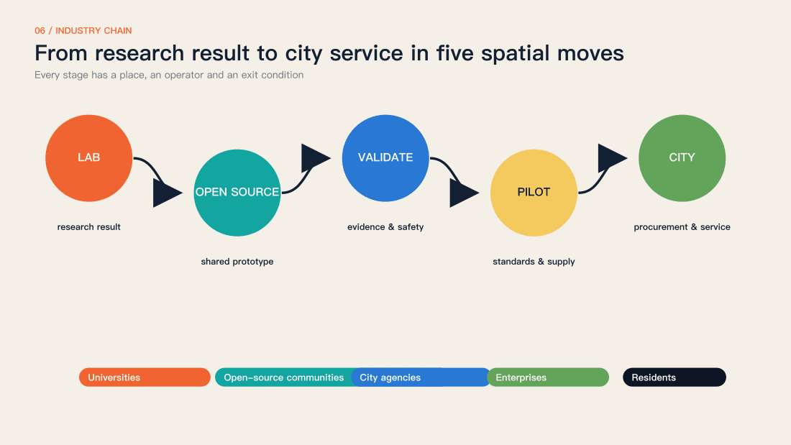

### Three Grounds and Two Wings

Zhongzhiyuan focuses on the autonomous AI stack, embodied intelligence, robot testing, pilot production and export services. AI Origin focuses on university transfer, models and tools, open-source collaboration, AI education and youth talent. Dazhongsi focuses on personal agents, smart terminals, generated content, agent-native commerce and cultural consumption. The western Zhongguancun technology-service wing provides capital, legal, IP, transfer and global networks. The eastern Xiaoyue River scenario-enablement wing provides real settings for robotics, health, media and public services. The three districts are not interchangeable parks; they are three capabilities in one industry chain.

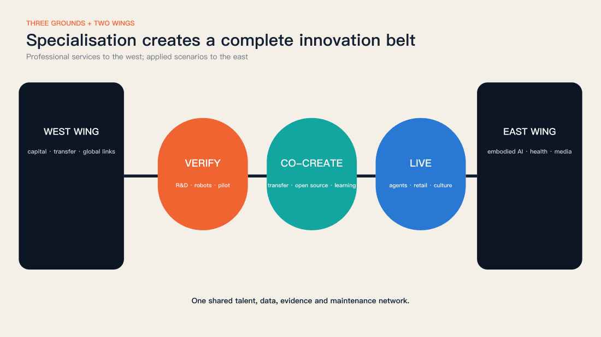

### Five Industry-Space Prototypes and the 24-Hour Talent Chain

The five prototypes are shared laboratories, street-facing open-source workshops, observable validation gardens, divisible pilot-production boxes and accessible application ground floors. They combine as modules rather than letting one landmark building substitute for an ecosystem. Morning mobility and low-carbon operations, daytime research and classes, midday testing and exchange, evening demonstration and consumption, and night-time culture and learning form a 24-hour chain. Quiet hours, residential rights and night logistics remain protected by operating rules.

Each prototype answers four questions: who enters, what happens, who maintains it and how failure is restored. Building quantities, floors and structures remain conceptual until ownership, capacity and engineering data are available; the proposal does not invent precise FAR to imply certainty.

Method reference: MIT City Science — MIT Media Lab [source:V3-CASE-MIT]

Method reference: Urban Living Lab way of working — AMS Institute [source:V3-CASE-AMS]

Method reference: Accountability component — Decidim [source:V3-CASE-DECIDIM]

Method reference: Futurelab — Ars Electronica [source:V3-CASE-ARS]

Method reference: SmartCity Living Lab — European Network of Living Labs [source:V3-CASE-PARIS]

Method reference: Fab Lab Barcelona — Fab Lab Barcelona [source:V3-CASE-FAB]

## Overall Design Area: Urban Renewal and Regulatory-Plan-Level Urban Design

### Five rules precede technology choices

Public benefit, factual clarity, human judgment, reversibility and rights form the protocol.

A project first explains whom it serves and whom it might exclude, then chooses models and devices. Existing conditions, proposals and synthetic imagery remain distinct. AI offers alternatives and evidence without making public decisions. Reversible low-risk prototypes precede long-term construction. Contributions, failures, disagreements, licence changes and exits enter the archive alongside successes. [data:geometry/land_use.geojson#LU-003] [depth:land_use_layout] [standard:MOHURD-CONTROL-DETAILED-PLANNING]

Translate the five rules into an acceptance list: an equivalent offline route, provenance and dates, a named reviewer, stop and restoration plans, and editable permission. Missing any item keeps a project at discussion or model stage. Readiness checks never replace approval, testing or site permission.

### The greenway is the spine; interfaces are the addition

Existing service points, forecourts, underpasses and authorized rooms host additions first.

The proposal assumes no automatic right to occupy green space, heritage, rail infrastructure or private property. Each interface checks movement, fire access, maintenance and neighbour impacts before programming. East-west connection includes routes as well as shared opening hours, tasks and services between communities, parks and campuses. Mapping these conditions is more useful than a continuous coloured ribbon alone.

Avoid distributing new devices uniformly. Staffed service points form primary nodes; temporarily authorized forecourts host events; corridor signs provide direction and progress lookup. Existing active-mobility routes connect them. Road crossings and campus edges remain verification points, and unconfirmed spaces stay outside public itineraries.

### Responsibilities define components, not shapes

Five components adapt to local conditions.

Question stations offer voice, paper and screen. Co-creation tables provide maps, version labels and a facilitator. Validation courts separate risks and provide emergency stops and service access. Performance signs disclose material rights and synthetic status. Archive markers combine QR access with physical identifiers. Components are removable and repairable rather than dependent on expensive proprietary hardware.

Separate essentials from options. Essentials are a table, seating, readable signs, paper cards and storage. Screens, projection and sensors require a specific purpose. Remove temporary cables and restore furniture and surfaces after use. Every device needs an owner, fallback and retirement date to avoid abandoned smart infrastructure.

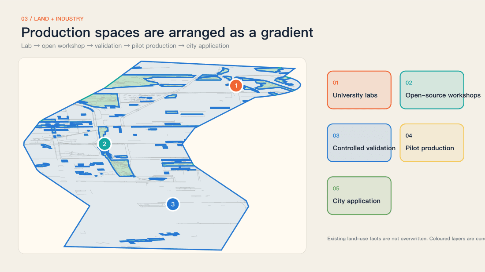

## Detailed Design of Key Areas

### Zhongzhiyuan: Verification Open Ground

The approximately 192.1-hectare brief area supports full-stack AI R&D, robot validation, pilot production and export services. The conceptual plan places a validation garden at its civic core: R&D and pilot spaces occupy a controlled inner ring; observation, courses and demonstration form a public outer ring; Xuezhiyuan station and east-west neighbourhood interfaces provide access. Test paths never occupy the accessible primary route. Boundaries and streets are conceptual and require ownership, road-redline and capacity verification.

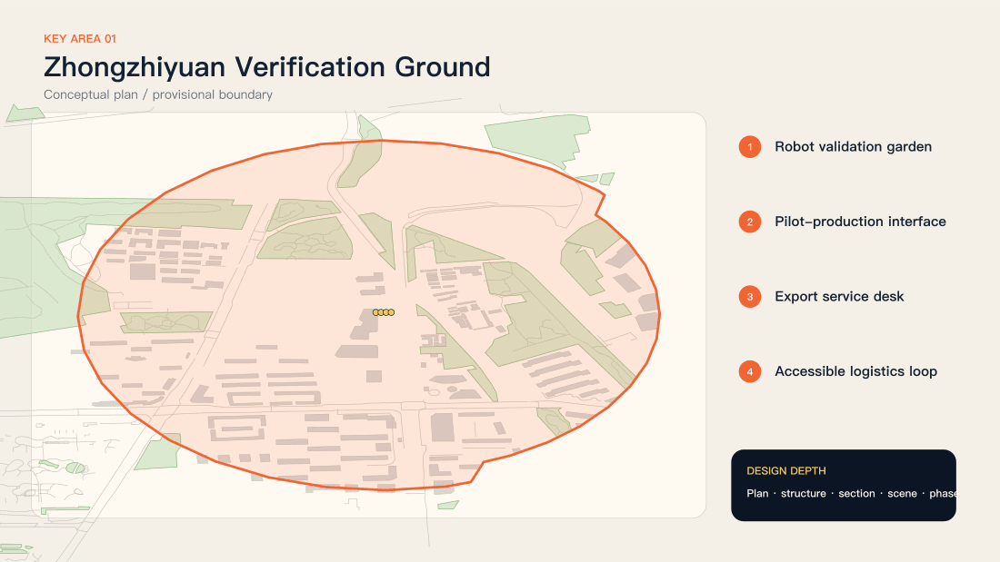

Xuebei Park, Xueqing Road, Yuequan Road and Qinghe provide location context.

Official sources position Zhongzhiyuan around the AI stack, standards and governance. The study viewport shows mapped streets and building fabric; coloured nodes are interfaces requiring review. Verify publicly accessible forecourts and rooms before organizing observation or testing. Where a recent reusable photograph is unavailable, use a map and provenance record instead of inventing a site photograph. [data:geometry/key_areas.geojson] [depth:three_key_area_detailed_design]

Do not begin with construction. Select a candidate forecourt with clear management boundaries, then check entry, fire access, servicing, power and daily supervision. The Xuebei anchor is an approximate public-source location requiring confirmation. Static demonstrations and human assistance are the lowest-risk first opening.

### The Validation Garden separates visibility from exposure

People may observe experiments without becoming involuntary subjects.

Green zones host demonstrations without personal data. Amber zones allow short, consented trials. Red zones are controlled professional environments. An observation edge, buffer and service area make the section legible. Children and disabled users receive specific review, and every model or terminal can fall back to human service.

The section progresses from movement to observation, controlled testing and servicing. The buffer prevents accidental entry and clarifies responsibility; it is not decoration. Professionals determine dimensions, barriers, evacuation and electrical conditions from actual risks. This relational drawing neither invents measurements nor authorizes robots among pedestrians.

### A test begins with a question

State beneficiaries, failure conditions and exits before selecting devices.

The question station removes sensitive identifiers. The evidence agent traces site conditions and relevant standards. Professionals determine risk; teams operate within a limited window; the on-site facilitator can stop the test. Results and dissent are archived together. Passing a trial confers neither procurement status nor permission for full deployment.

Example question: can a first-time visitor find human assistance? Record signs and wrong turns, then compare printed guidance, staff assistance and on-device voice. An AI solution need not win. If a simple sign performs better, adopt it and publish the comparison.

### A low-impact section with clear restoration duties

Continuous movement, observation, buffering and controlled testing form the sequence.

Temporary components avoid major foundations, heritage attachment and obstruction of emergency, utility or tree access. Lighting points inward; noise and hours respect neighbours. The section communicates relationships and maintenance rather than construction details. Dimensions, loading, fire safety and drainage require survey and professional approval.

Restoration belongs to the design. Record surfaces, furniture and routes before setup and check each item afterwards. Do not attach equipment to trees or historic fabric; use permitted power, barriers and storage. Sections show responsibilities; physical dimensions require measurement and professional review.

### An Accessibility Validation Week starts the programme

Real users evaluate route information, prompts and human assistance.

Participants may use paper cards and voluntarily report obstacles without continuous facial or route tracking. AI groups duplicates and suggests routes; disabled people, older residents, operators and mobility professionals set priorities together. Outputs include a question list, three reversible prototypes and unresolved issues, not an unmeasured claim of smart-city completion.

Collect three evidence types: voluntary task completion, permitted written feedback and facilitator context notes. Route times support pilot evaluation without public personal traces. Separate repaired, referred and deferred issues. If targets are missed, narrow the pilot rather than expanding surveillance.

### AI Origin: Co-creation Open Ground

The approximately 104.3-hectare brief area organises university transfer, open-source collaboration, AI education and youth life as a one-kilometre learning circle. The plan uses the Wudaokou campus-street interface, Qinghuayuan old station and an open-source workshop as public anchors. Classes, work, making, rest and evening exchange share space without treating campus boundaries or residential quiet as obstacles to ignore.

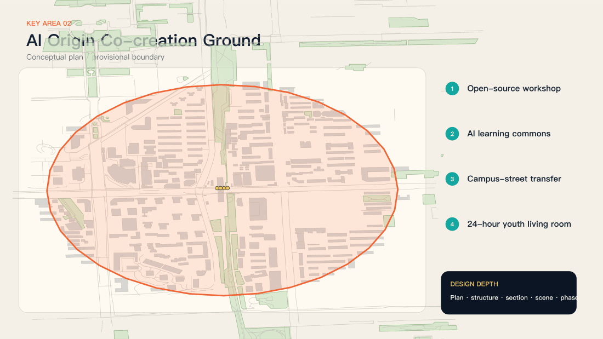

Wudaokou, Heqing Road and Qinghua East Road West Exit anchor the interface.

Rail, retail, universities and communities overlap here. The design begins with walkability, opening hours and public tasks rather than a closed entrepreneurial enclave. The viewport is not an official key-area boundary. Indoor workshops and campus access points require operator and property authorization.

AI Origin uses a gradient from short stop to discussion, making and review. Street edges display tasks and appointments; rooms support longer making; clinics handle higher-risk questions. Campus and corporate interiors open only under permission and schedules. Public participation never requires entry into controlled research space.

### An open workshop matches needs with capabilities

Open briefs, licensed materials, mentoring and version control define the workshop.

Each task states the question, site evidence, risk, capabilities and status. Community classes build understanding; short workshops create cross-disciplinary teams; clinics provide planning, rights and safety guidance. Contributions include code and models but also observation, translation, facilitation, care and maintenance.

An open workshop proposes a question wall, shared table, material cabinet and review corner around one task version. Train equipment users and check rights before publication. Mentors do not define residents’ needs for them, and residents do not carry technical safety responsibility. Facilitators translate feedback into inspectable requirements.

### A one-kilometre learning circle connects daily life and research

One kilometre is an organizing scale, not a measured accessibility result.

The proposed route links Wudaokou station, AI Origin facilities, open space and authorized campus collaboration points. Weekly question clinics, open-source maintenance evenings and prototype reviews combine online tasks with facilitation. Confirm routes through site walks, accessibility trials and opening-hour checks.

A learning circle depends on predictable weekly service, not a one-off festival. Propose one question clinic, one interdisciplinary workshop and one maintenance session. Do not advertise an activity without its site, mentor and accessibility provision. Measure accepted and maintained tasks, not the number of lectures.

### The station and viaduct test participation equity

Noise, crowding, interchange and evening use shape the design.

Co-creation points must be visible without obstructing movement and offer rest, shade, light and human support. Large type, voice and bilingual information support access. Events avoid peak commuter periods. For station changes, the proposal specifies public-experience needs and evaluation criteria rather than rail alignments or structures.

The Wudaokou view shows a visually complex relationship between station, viaduct and retail forecourt, not proof of a current defect. Observe peak and off-peak conditions and check stopping and bicycle arrangements. Reduce information competition before adding large screens, sound or lighting.

### A fourteen-day cycle produces a reviewable prototype

Rapid making and public review share one schedule.

Days 1–3 frame questions and evidence; day 4 forms teams; days 5–9 produce prototypes; day 10 reviews safety and rights; days 11–13 test on site; day 14 publishes the version and next action. Rejected projects also document why they stopped, preserving lessons rather than repeating avoidable failures.

The fourteen-day cycle suits low-risk content and service prototypes, not structural or rail works. Preserve inputs, alternatives, test conditions and conclusions each round. Delay with a public reason when staff or evidence are insufficient. A proposed service rhythm never justifies compressing safety review.

### Dazhongsi: Living Open Ground

The approximately 72-hectare brief area makes the four Dazhongsi station quadrants one urban foyer for personal agents, smart terminals, content consumption, agent-native commerce and night culture. The first priority is not an icon building, but unified ground guidance, continuous tactile routes, safe cycle crossings, interchange waiting and active ground floors. Industry and culture reinforce each other only when the quadrants become legible on foot.

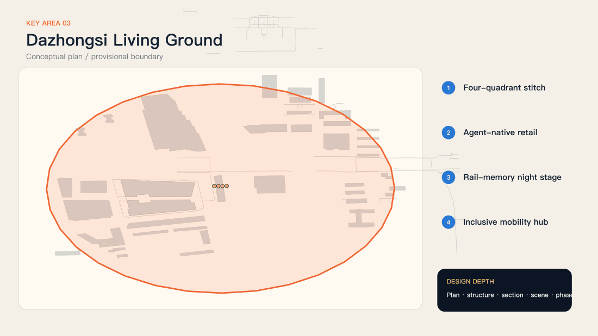

Interchange, public life and content production must coexist.

The brief highlights four-quadrant pedestrian links and bicycle organization. First examine ground-level routes, stopping points and bicycle order, then programme performances and studios. Cross-road, under-bridge and station works require specialist transport, rail and ownership review. This iteration proposes reversible ground-level activities and guidance only.

Assign quadrant roles from observed use and movement, not four new buildings. The busiest edge carries guidance; an edge with stopping space hosts short narration; authorized rooms support production; quiet edges retain everyday use. Verify the actual quadrant mapping before design; blank map space is not developable land.

### The Civic Stage displays human choices

The programme shows questions, versions, disagreements and reasons.

Mobile caption stands, low-brightness projection, physical models and narration create a small public-review setting. Daytime supports trials and clinics; short evening sessions support performance. Content identifies tools, sources and synthetic status. Activities must not obstruct transport signs, shops or homes, and hours remain subject to operator and neighbour constraints.

Use small, short, low-dependency formats. Prefer daytime models and captions; separately review night lighting, noise and residential impacts. Equivalent transcripts remain available off-site. Weather, crowding or complaints trigger relocation or cancellation rather than an assumption that a performance must continue.

### The Open Studio makes works correctable

Rights, capture boundaries and version records travel with the work.

Check licences before using urban sound, imagery and data. Identifiable portraits require separate consent, and AI imagery must not impersonate documentary evidence. Works include captions, transcripts, sources and versions. Corporate promotion stays distinct from public questions, while withdrawal governs subsequent reuse.

The Open Studio starts with rights and collaboration, not a new soundstage. Provide reusable material catalogues, bookings, portrait permissions and caption templates. Do not capture passers-by by default. Keep provenance and mark synthesis. Withdrawal records should identify distribution stops, replacement versions and affected recipients.

### Test ground-level legibility before major works

Guidance, movable bicycle boundaries and short narration points can be trialled first.

A four-quadrant task route connects real junctions and public spaces. Evaluate detour time, navigation errors, accessibility and impacts on existing movement, with a baseline before testing. Check restoration after activities stop. Permanent connections, underground development and bridge or tunnel proposals are outside this iteration’s commitments.

Trials stay within existing lawful routes and never lead into traffic or closed areas. Movable signs must not obscure existing guidance. Accessibility reviewers can veto a prototype. If a shortcut helps some users but disadvantages wheelchair users or blind people, redesign it.

### One evening of performance; a year of traceability

Each event should feed the next cycle of urban learning.

Show reviewed evidence, prototype versions and unresolved choices. Visitors use paper or terminals; clustering retains minority views. Proposed service targets are a response within seven days, a status update after three months, and a continue, modify or stop review after one year. These are operating proposals, not confirmed government schedules.

The archive’s smallest unit is an actionable question, not an event poster. Each record states what changed and what remains unresolved. Operator exit requires open-format records, permission logs and maintenance instructions. Interactive functions that cannot be maintained should degrade to readable, downloadable static archives.

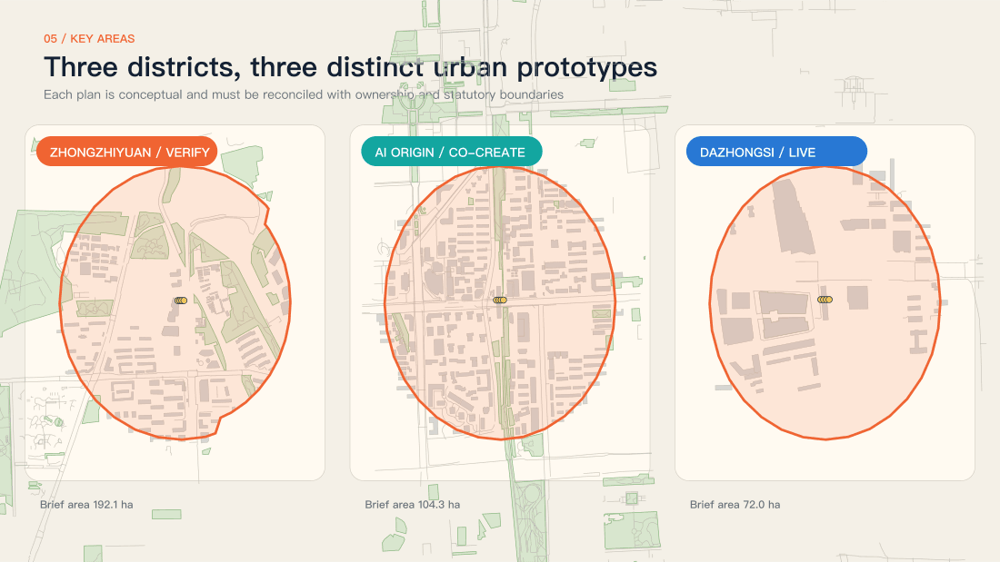

## AI Innovation Ecosystem, Personas, and AI+ Scenarios

### Six user groups require different access conditions

Universal participation requires spatial responses to different abilities and schedules.

Older residents need human assistance and unhurried explanations. Commuters need tasks that fit a short stop. Children and carers need understandable, low-risk activities. Disabled people should help review prototypes. Students and developers need clear briefs and licensed materials. Institutions need responsibility, stop conditions and routes to further work. These are design hypotheses, not fabricated survey findings. [standard:PROJECT-AGENT-OPEN-CALL-TASKBOOK] [data:geometry/public_space.geojson]

Evaluate access conditions rather than collecting sensitive identities: can a paper task be completed, is assistance understandable, is information readable while seated, and can a non-smartphone user follow outcomes? Resource inclusive participation explicitly. Recruitment, sample size and compensation remain to be agreed; no invented sample proves inclusion.

### Four question families enter one public task system

Mobility, daily life, innovation and memory share a status system.

The task system displays received, verified, prototyping, review, completed or closed states and explains changes. Mobility addresses detours and accessibility; daily life addresses rest, care and evening use; innovation addresses genuine needs and low-risk validation; memory addresses provenance, attribution and correction. AI clustering must retain minority views. Emergencies go directly to established public-service channels.

Use two record layers. The public layer holds the question, approximate location, status and rationale; a restricted layer holds necessary contact details and consent. Link duplicates without deleting them. For issues outside project authority, publish a referral and closure reason so receipt does not become indefinite waiting.

### Deepen four flagships; connect twelve scenarios

The question desk, validation garden, civic stage and living archive form the core experience.

The four flagships handle entry, testing, discussion and follow-up using shared project IDs, risks and rights. People avoid repeated registration, and professionals can inspect the full evidence chain. Supporting scenes provide education, service, maintenance and translation without creating disconnected platforms.

Organize scenarios by service: the desk receives questions; workshops and classes build capability; validation produces evidence; performances and studios support debate; archives preserve continuity. Share staff and essentials rather than twelve separate systems. Deepen four flagships first and open supporting scenes as resources allow.

### Every scenario card needs a stop condition

A name alone is not a scenario.

Twelve cards cover a safety sandbox, accessibility validation, low-carbon edge computing, standards clinic, question desk, open workshop, community class, prototype clinic, civic stage, open studio, smart-service trial and international peer table. Each specifies triggers, space, data minimization, roles, success measures and stop conditions. The archive spans them all.

Each deployed card needs an address, opening hours and responsible person, not “the platform” as an owner. Start with paper and staffing; the digital interface is equivalent access. The desk image is a concept edit of a real photograph, illustrating scale and retained relationships; placement still requires operator and heritage checks.

### Public space is never an unconditional test bed

Edge assistance, robotic devices and content agents require different protocols.

Edge assistance prioritizes offline operation without continuous facial capture. Robots use bounded speed, time and space with a human emergency stop. Content agents check provenance, rights and misleading outputs and provide complaints channels. Records retain failures and repair status. Passing only supports further professional assessment, not deployment permission.

Give each validation class separate criteria. Edge assistance checks offline use and error prompts; mobile devices check isolation, emergency stops and takeover; generated content checks sources, synthesis labels and correction. One accuracy score cannot represent safety, rights and usability, and a pilot cannot establish district-wide performance.

### Six agents; four human gates

Agents organize information and alternatives; named people retain responsibility.

Issue agents structure questions; evidence agents trace sources; matching agents suggest collaborators; simulation agents compare versions; risk agents flag limits; archive agents track contributions and withdrawal. Community operators, professionals, rights reviewers and contributors respectively review publication, testing, performance and archiving.

Named roles confirm human gates and record reasons. Agent outputs include inputs, limits and alternatives without hiding failures. Sensitive issues stay out of external models. Paper receipt and human response continue through outages. Audit authority to modify, reject and withdraw, not only output correctness.

### Contribution rights travel with project status

Anonymity, attribution, correction, withdrawal and limited licensing are normal options.

Contribution receipts retain only necessary information. Display and model-training permissions are separate. Withdrawal does not erase the fact of a past public decision but stops subsequent public use of personal material. Version records explain changes instead of silently overwriting history. External models receive no automatic rights to citizen materials.

Proposed fields are project ID, approximate location, version, sources, contribution role, permitted uses, review and next check date. Keep contacts separate. License original public materials explicitly and retain third-party terms. Entry into this project never automatically grants training, commercial or perpetual rights.

### SCN-01｜Safety sandbox

- Users / problem：Developers and public: understand without exposure
- Candidate space：Permitted controlled room in Zhongzhiyuan
- Trigger：Submit a test brief before demonstration
- AI role：Organize risks and failure samples
- Human responsibility：Professionals classify risk; facilitator can stop
- Physical equipment：Isolation, signs, emergency stop, human service
- Data boundary：Synthetic tests; no passer-by faces
- Proposed operator：Authorized operator and test team
- Evaluation：Review completion and incident response time
- Stop condition：Stop if isolation, stop control or supervision fails

The model records a candidate interface; actual footprint and access remain unconfirmed. [data:geometry/public_space.geojson#SCENARIO-001]

### SCN-02｜Accessibility validation week

- Users / problem：Disabled and older users: usable service information
- Candidate space：Permitted forecourt and existing lawful routes
- Trigger：Voluntary paper task selection
- AI role：Group obstacles and compare prompts
- Human responsibility：Users review; transport professionals assess changes
- Physical equipment：Paper, seating, large signs, staff
- Data boundary：Voluntary feedback; no continuous personal traces
- Proposed operator：Community, operator and accessibility reviewers
- Evaluation：Completion and wrong turns against baseline
- Stop condition：Stop for added barriers, danger or requested exit

The model records a candidate interface; actual footprint and access remain unconfirmed. [data:geometry/public_space.geojson#SCENARIO-002]

### SCN-03｜Low-carbon edge trial

- Users / problem：Developers and maintainers: justify deployment
- Candidate space：Managed room in Zhongzhiyuan
- Trigger：Submit offline-use and energy test goals
- AI role：Run simple local service with error prompts
- Human responsibility：Maintainers verify power and results
- Physical equipment：Metered terminal, compliant power, paper fallback
- Data boundary：Public or synthetic inputs; no personal uploads
- Proposed operator：Technical maintenance and operator
- Evaluation：Energy per task and offline completion
- Stop condition：Stop for heat, electrical fault or data leakage

The model records a candidate interface; actual footprint and access remain unconfirmed. [data:geometry/public_space.geojson#SCENARIO-003]

### SCN-04｜Standards and rights clinic

- Users / problem：Small teams: recognize professional referral needs
- Candidate space：Booked Zhongzhiyuan meeting room
- Trigger：Bring prototype and source inventory
- AI role：Retrieve public standards with applicability limits
- Human responsibility：Professional advisers explain; no approval service
- Physical equipment：Table, document display and printed checklist
- Data boundary：Public materials only; no external-model secrets
- Proposed operator：Professional advisers and operator
- Evaluation：Evidence-gap closure, not approval rate
- Stop condition：Stop without professionals or for restricted material

The model records a candidate interface; actual footprint and access remain unconfirmed. [data:geometry/public_space.geojson#SCENARIO-004]

### SCN-05｜Civic question desk

- Users / problem：Residents and commuters: obtain a response
- Candidate space：Permitted AI Origin / old-station park forecourt
- Trigger：Paper, spoken or terminal question
- AI role：Summarize and link duplicates
- Human responsibility：Community facilitator reviews and responds
- Physical equipment：Table, seats, paper, large signs, optional terminal
- Data boundary：Separate public summary and contacts; training separately permitted
- Proposed operator：Community facilitator and operator
- Evaluation：Answered / accepted issues, offline and online
- Stop condition：Stop if unstaffed, privacy is lost or routes blocked

The model records a candidate interface; actual footprint and access remain unconfirmed. [data:geometry/public_space.geojson#SCENARIO-005]

### SCN-06｜Open co-creation workshop

- Users / problem：Students and residents: match skills with needs
- Candidate space：Permitted near-campus AI Origin workshop
- Trigger：Join a verified task
- AI role：Suggest skills and prototype alternatives
- Human responsibility：Mentors, safety staff and residents review
- Physical equipment：Shared table, materials, compliant tools, storage
- Data boundary：Licensed maps and voluntary work; check publication rights
- Proposed operator：Campus collaborators and open maintainers
- Evaluation：Prototype completion and continued maintenance
- Stop condition：Stop for untrained tools, unclear rights or higher risk

The model records a candidate interface; actual footprint and access remain unconfirmed. [data:geometry/public_space.geojson#SCENARIO-006]

### SCN-07｜Community class

- Users / problem：Non-technical participants: understand AI and rights
- Candidate space：Open AI Origin classroom
- Trigger：Book or register offline
- AI role：Suggest explanations; no high-stakes advice
- Human responsibility：Teacher facilitates and supports challenge
- Physical equipment：Projection, captions, large print and paper exercise
- Data boundary：No faces, real accounts or sensitive inputs needed
- Proposed operator：Community educators
- Evaluation：Complete paper task and explain exit route
- Stop condition：Stop for misleading content or insufficient child safeguards

The model records a candidate interface; actual footprint and access remain unconfirmed. [data:geometry/public_space.geojson#SCENARIO-007]

### SCN-08｜Prototype and maintenance clinic

- Users / problem：Teams: sustain work after exhibition
- Candidate space：Permitted AI Origin civic room
- Trigger：Request review with version record
- AI role：Compare feedback and organize defects
- Human responsibility：Professionals choose repair, referral or stop
- Physical equipment：Review table, samples and maintenance log
- Data boundary：Minimal feedback; no restricted publication
- Proposed operator：Professional reviewers and maintainers
- Evaluation：Three-month status and completed repairs
- Stop condition：Stop without an owner or for rights violations

The model records a candidate interface; actual footprint and access remain unconfirmed. [data:geometry/public_space.geojson#SCENARIO-008]

### SCN-09｜Generative Civic Stage

- Users / problem：Residents and visitors: understand decisions
- Candidate space：Permitted Dazhongsi stopping space clear of routes
- Trigger：Present a reviewed project
- AI role：Assist captions, versions and translation
- Human responsibility：Facilitator explains disagreement; rights review
- Physical equipment：Removable caption stand, models, low-brightness equipment
- Data boundary：Licensed content; separate consent for identifiable portraits
- Proposed operator：Cultural operator and site safety staff
- Evaluation：Feedback response and neighbour-impact log
- Stop condition：Stop for crowding, noise, weather or content risk

The model records a candidate interface; actual footprint and access remain unconfirmed. [data:geometry/public_space.geojson#SCENARIO-009]

### SCN-10｜Urban Open Studio

- Users / problem：Creators and residents: licensed, truthful stories
- Candidate space：Permitted Dazhongsi room and booked outdoor site
- Trigger：Choose licensed material or volunteer a story
- AI role：Assist editing, captions and alternatives
- Human responsibility：Creators and rights reviewers verify sources and labels
- Physical equipment：Editing terminal, material cabinet, booked recording area
- Data boundary：No default passer-by capture; display and training separate
- Proposed operator：Cultural operator and rights maintainer
- Evaluation：Complete provenance and correction handling
- Stop condition：Stop for unlicensed portraits, false site claims or withdrawal

The model records a candidate interface; actual footprint and access remain unconfirmed. [data:geometry/public_space.geojson#SCENARIO-010]

### SCN-11｜Smart everyday-service trial

- Users / problem：Customers and traders: avoid digital exclusion
- Candidate space：Voluntary permitted Dazhongsi trader forecourt
- Trigger：Try assistance without disrupting regular service
- AI role：Offline multilingual and large-print explanation
- Human responsibility：Staff provide equivalent human service
- Physical equipment：Removable terminal, printed menu, staffed counter
- Data boundary：No payment, health or financial sensitive records
- Proposed operator：Voluntary traders and coordinator
- Evaluation：Equivalent manual access and task completion
- Stop condition：Stop for refused manual service, misleading prices or leakage

The model records a candidate interface; actual footprint and access remain unconfirmed. [data:geometry/public_space.geojson#SCENARIO-011]

### SCN-12｜International peer table

- Users / problem：Visitors and local teams: retain exchange lessons
- Candidate space：Permitted Dazhongsi room and corridor archive
- Trigger：Book a public review of a completed pilot
- AI role：Translate, cross-check sources and organize questions
- Human responsibility：Bilingual facilitator checks context and rights
- Physical equipment：Table, captions and public evidence booklet
- Data boundary：Permitted public outputs; no investment promises
- Proposed operator：Bilingual operator and maintainers
- Evaluation：Actionable questions and follow-up records
- Stop condition：Stop for misleading translation, conflicts or unclear rights

The model records a candidate interface; actual footprint and access remain unconfirmed. [data:geometry/public_space.geojson#SCENARIO-012]

## Land Use, Building Scale, and Retain-Renovate-Demolish Strategy

V3 withdraws the six invented building footprints and uniform five-part zoning of V2 in favour of real open-map footprints. The476 records represent mapped existing buildings, not proposed construction. Height, floor area, FAR, structure, ownership and occupancy are unverified. Retain existing buildings and life by default; no demolition targets are assigned. The model partition contains retained mapped green, candidate service envelopes and a residual awaiting evidence, solely for topology and computation. Residual code16 does not mean real vacant land. Permanent changes require parcels, surveys, consultation and professional design. [data:geometry/buildings.geojson] [depth:retain_renovate_demolish] [standard:MNR-LAND-USE-CLASSIFICATION-GUIDE]

## Transport, Rail, Municipal Infrastructure, and Public Services

The active-mobility layer uses mapped OSM footways, cycleways and paths rather than hand-drawn engineering lines. Approximately117.04km is the sum of segments inside the provisional model; it may include branches and repeated routes. It is neither park length nor new construction and does not prove public access. Priorities are Dazhongsi ground-level legibility, Wudaokou stopping and campus edges, and Zhongzhiyuan entry and controlled service areas. Utilities remain requirements for compliant power, cable management, emergency stops, storage and wet-weather fallback; no rail, utility, energy or fire capacity is certified. Retain human service during digital failure and review physical and information access together. [data:geometry/roads.geojson] [depth:traffic_rail_slow_parking] [standard:BARRIER-FREE-ENVIRONMENT-LAW]

## Blue-Green Network, Public Space, and Urban Character

### Railway memory becomes a civic method

People, railway lines and shared intelligence form the identity.

The material vocabulary draws from rails, ballast, platform markings and brick without imitating historic forms. The overall identity signals open collaboration; cultural wayfinding records place, time, version and contribution. Heritage remains legible and intact. New components do not attach to protected fabric, obstruct recognition or reduce history to technological decoration. [data:geometry/green_space.geojson] [depth:blue_green_public_space] [standard:MOHURD-URBAN-DESIGN-MEASURES]

Use a rail-line grid, deep green, rust-red emphasis and paper tones. Physical signs should be low-glare and readable without relying solely on colour or QR codes. Separate historic place names from proposal branding; never make a new component look like an authentic relic or use institutional marks without permission.

Retain blue-green space first; trials have no automatic access to green, river, heritage or rail land. Mapped green is an incomplete open-data subset, and service circles are discussion symbols. Three proposed honour/cultural nodes are a Public Validation Ledger in Zhongzhiyuan, an Open Contribution Weave in AI Origin, and an Unfinished City Archive Window in Dazhongsi. They recognize reviewed methods, failures, code, observation, translation, care, maintenance, dissent and follow-up. These are reversible information components, not approved monuments. Sponsorship buys no ranking; anonymity and withdrawal remain normal. Overall identity expresses collaboration while cultural wayfinding records actual place, date, source and version.

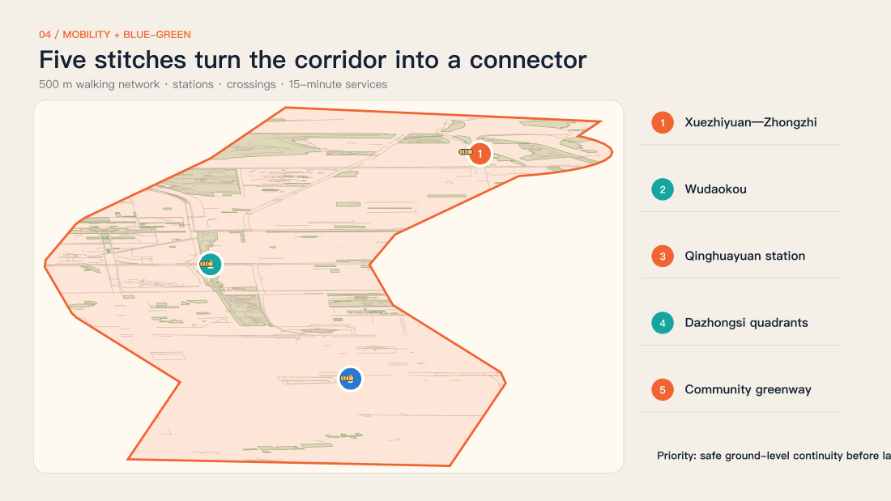

## Renewal Projects, Implementation Policy, and Phasing

### Maintain space, events, technology and archives separately

The working group is a proposed role structure, not a confirmed consortium.

An authorized public operator handles questions and sites; community groups support equitable access; universities and professionals provide methods and review; companies and open teams prototype; independent rights advisers handle complaints; archivists publish status. Budget categories include staff, site, equipment, accessibility, insurance and maintenance, with quotations after scope definition. [data:geometry/phasing.geojson] [depth:renewal_project_list] [depth:phasing_implementation]

Propose monthly operating reviews and quarterly public reviews. Track space, events, technology and rights separately so equipment does not consume staffing resources. Do not invent a total budget: specify staff-hours, site conditions, insurance and accessibility support, then obtain traceable quotations before promising activities.

### Complete one small civic loop in ninety days

Use existing service points or open spaces with reversible arrangements.

Days 1–15 review questions, sites and rights. Days 16–35 gather at least twenty questions and evidence packs. Days 36–60 match ten teams and make three low-risk prototypes. Days 61–80 run trials and accessibility reviews. Days 81–90 present, respond and publish the first archive. All quantities are proposed targets requiring baselines and resources.

The pilot delivers four items: permitted sites, inspectable issue evidence, records for three low-risk prototypes, and an archive including failures and open questions. The three nodes need not start together. Test the best-resourced site first; the ninety-day clock starts only after site and operations are secured.

Eight conceptual work packages are JZ-01 corridor participation interfaces, JZ-02 Zhongzhiyuan validation, JZ-03 AI Origin workshops, JZ-04 Dazhongsi ground guidance, JZ-05 question desks, JZ-06 stage and studio, JZ-07 archive and contributions, and JZ-08 bilingual accessible service. Each needs permission, staffing, maintenance, risks and stop rules. A proposed annual rhythm frames questions in spring, tests in summer, reviews publicly in autumn and audits archives in winter. International peer tables centre on projects rather than recruitment slogans. Budgets separate staff, sites, equipment, accessibility, insurance and maintenance; no quotation or precise investment claim is invented.

## Metrics, Area Recalculation, and Compliance Matrix

### Measure access and response

Footfall, publicity and device counts cannot substitute for civic value.

Equity measures offline, language and accessibility outcomes; collaboration measures evidence and cross-role teams; safety measures stop mechanisms and incident handling; response measures public reasons for rejection; continuity measures three-month updates and maintenance. Spatial metrics are recomputed from submitted geometry, but provisional ratios are neither statutory green ratios nor measured built outcomes. [metric:site_area_sqm] [metric:green_ratio] [depth:metrics_recalculation]

Use explicit denominators: answered over accepted issues, reviewed over initiated prototypes, and outputs with complete attribution and permission over published outputs. Publish baselines and periods; targets are not results. Open-map areas describe the submitted data model, not a field survey.

The model covers13,333,242.063m². Mapped green is1,176,249.669m², approximately8.8219%; candidate service envelopes are8,427.902m², approximately0.0632%. These low-confidence values describe a participant provisional model, not an official measurement of the announced11.4km², statutory green ratio or public-space compliance. Computation usesEPSG:4548 and exchange geometry usesWGS84. Building footprint area is also a mapped subset. Four checks assess deterministic, spatial, visual and professional-evidence packaging, not approval or human design judgment. The current self_check.json records the final check state.

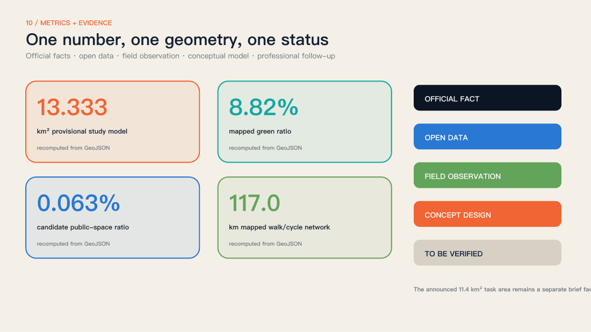

## Risk, Copyright, and Compliance

### Renderings cannot conceal unknown conditions

Boundaries, ownership, structures, mobility, utilities and heritage require further professional evidence.

Without official competition vectors, make no precise area conclusion. Without ownership and structural surveys, make no parcel-level demolition decision. Without capacity and engineering evidence, make no bridge, rail or utility design. Photographs retain author, date and licence; official news images are referenced, not copied. Components, events, costs and timing require professional and public review. [source:V3-GEO-MODEL] [source:V3-CONCEPT-EDIT] [depth:risk_missing_data]

Classify risks as evidence gaps, specialist decisions or unavailable commitments. Opening hours and photographs can be updated; heritage, fire, structure and traffic require professional decisions; unapproved investment, land-use changes and permanent works cannot be promised. Assign an owner and trigger to each risk instead of a blanket disclaimer.

Original text, code and graphics follow the project’s open contribution terms; third-party materials retain their own licences. Six N509FZ photographs and the AI-edited station-entry derivative retain CC BY-SA4.0 and attribution; maps retain OSM contributor and ODbL notices; fonts use SIL OFL. Official plan graphics are researched and linked, not redistributed. Synthetic imagery is labelled conceptual and proves no actual event, public consent or permission. Qualified professional and operating teams must assess any applicable filing, evaluation or other public AI-service procedures; the proposal claims no compliant deployment.

## References

### Turn nine kilometres of space into public learning

The next step is a pilot with real questions, places, responsibilities and public results.

Start with accessibility and youth interaction, selecting one authorized, low-impact interface at each real anchor. After ninety days, use the public archive to continue, modify or stop. Sources include the open-call website and taskbook, the 2026 statutory plan, Beijing’s gardening authority, CNR, OpenStreetMap and Wikimedia Commons. Full provenance, licences and assumptions accompany the package. [source:SOURCE-REGISTRY] [source:OFFICIAL-ANNOUNCEMENT]

After submission, ask residents, disabled users, operators and professional reviewers to test three things: are the questions real, is access usable, and are responses credible? The value is not generating every urban answer once, but leaving a public foundation that the next participant can understand, revise and continue.

The inventory includes current evidence and retained version-history sources. Claim-adjacent citations identify operative evidence; earlier references are not V3 implementation evidence.

- Centennial Jing-Zhang AI Innovation Belt site package · brief/site-package/ · open-city-ai/haidian maintainers [source:SITE-PACKAGE]

- Haidian public source registry · data/source_registry.json · open-city-ai/haidian maintainers [source:SOURCE-REGISTRY]

- Agent fact pack and processed task tables · data/processed/ · open-city-ai/haidian maintainers [source:PROCESSED-FACT-PACK]

- [百年京张AI创新带城市设计国际方案征集资格预审公告](https://ghzrzyw.beijing.gov.cn/zhengwuxinxi/tzgg/hd/202605/t20260509_4643047.html) · 北京市规划和自然资源委员会海淀分局 [source:OFFICIAL-ANNOUNCEMENT]

- 面向全球智能体开展百年京张AI创新带城市设计开源征集任务书摘录 · brief/site-package/standards/references/agent-open-call-taskbook-0518.md · User-provided cleared document [source:AGENT-TASKBOOK]

- V3 participant provisional model; supersedes V2 template geometry · geometry/site_boundary.geojson · open-city-ai/haidian maintainers [source:BOUNDARY-SOURCE]

- V3 participant provisional model; supersedes V2 template geometry · geometry/key_areas.geojson · open-city-ai/haidian maintainers [source:KEY-AREA-SOURCE]

- Publicly documented innovation-district and co-creation precedents · repository evidence · Multiple public institutions; conceptual comparative synthesis [source:CASE-STUDIES]

- Locally generated submission assets and build toolchain · report/copyright_statement.md · Codex × 拾迹创游 [source:ASSET-TOOLCHAIN]

- [京张铁路遗址公园：何以京张](https://www.beijing.gov.cn/fuwu/lqfw/gggs/202603/t20260330_4569001.html) · 北京市人民政府 [source:PARK-USE-2026]

- [原点爆发：北京AI原点社区](https://www.beijing.gov.cn/fuwu/lqfw/gggs/202604/t20260401_4571735.html) · 北京市人民政府 [source:AI-ORIGIN-2026]

- [京张铁路遗址公园二期建设](https://www.bjhd.gov.cn/ztzx/2025/ysxtj/ttdkj/gzgxfn/202503/t20250314_4760993.shtml) · 北京市海淀区人民政府 [source:PHASE2-HD-2025]

- [京张铁路遗址公园一期](https://yllhj.beijing.gov.cn/zwgk/zwxx/202306/t20230626_3145467.shtml) · 北京市园林绿化局 [source:PARK-PHASE1-2023]

- [清华园车站旧址保护范围和建设控制地带](https://wwj.beijing.gov.cn/bjww/362771/362782/743928533/743928745/index.html) · 北京市文物局 [source:QINGHUAYUAN-HERITAGE]

- [京张铁路遗址公园二期全线贯通开放（2026-08-06）](https://www.cnr.cn/bj/sijh/20260806/t20260806_527751136.shtml) · 央广网 [source:V3-PARK-OPEN]

- [京张铁路遗址公园二期配套工程完工](https://yllhj.beijing.gov.cn/zwgk/zwxx/202607/t20260714_4761226.shtml) · 北京市园林绿化局 [source:V3-PARK-OFFICIAL]

- [京张铁路遗址公园及周边地区街区控制性详细规划公开文件](https://zyk.bjhd.gov.cn/zwdt/xxgk/tzgg/202608/t20260821_4826113_hd.shtml) · 北京市海淀区 [source:V3-PLAN-2026]

- [OpenStreetMap street, building and green-space extract](https://www.openstreetmap.org/copyright) · OpenStreetMap contributors [source:OSM-20260830]

- [Participant-authored provisional model aligned to real anchors](https://haidian.open-city.ai/) · mumu-bird × Codex [source:V3-GEO-MODEL]

- [MIT City Science](https://www.media.mit.edu/groups/city-science/overview/) · MIT Media Lab [source:V3-CASE-MIT]

- [Urban Living Lab way of working](https://www.ams-institute.org/how-we-work/ull/the-ams-urban-living-lab-way-of-working/) · AMS Institute [source:V3-CASE-AMS]

- [Accountability component](https://docs.decidim.org/en/develop/admin/components/accountability.html) · Decidim [source:V3-CASE-DECIDIM]

- [Futurelab](https://ars.electronica.art/futurelab/en/about/) · Ars Electronica [source:V3-CASE-ARS]

- [SmartCity Living Lab](https://enoll.org/member/smartcity-living-lab/) · European Network of Living Labs [source:V3-CASE-PARIS]

- [Fab Lab Barcelona](https://fablabbcn.org/) · Fab Lab Barcelona [source:V3-CASE-FAB]

- [Exit B of Dazhongsi Station (20210409120947)](https://commons.wikimedia.org/wiki/File:Exit_B_of_Dazhongsi_Station_(20210409120947).jpg) · N509FZ [source:V3-PHOTO-DAZHONGSI-ENTRY]

- [North entrance of Old Chinghuayuan Station Park (20240331103037)](https://commons.wikimedia.org/wiki/File:North_entrance_of_Old_Chinghuayuan_Station_Park_(20240331103037).jpg) · N509FZ [source:V3-PHOTO-HERITAGE-ENTRY]

- [IPKR Chinghuayuan Station after renovation (20240331102606)](https://commons.wikimedia.org/wiki/File:IPKR_Chinghuayuan_Station_after_renovation_(20240331102606).jpg) · N509FZ [source:V3-PHOTO-HERITAGE-STATION]

- [DFH2 0023 at Qinghuayuan Station, Jingzhang Railway Park (20230206141918)](https://commons.wikimedia.org/wiki/File:DFH2_0023_at_Qinghuayuan_Station,_Jingzhang_Railway_Park_(20230206141918).jpg) · N509FZ [source:V3-PHOTO-PARK-LOCOMOTIVE]

- [13 001 entering Wudaokou (20250308101844)](https://commons.wikimedia.org/wiki/File:13_001_entering_Wudaokou_(20250308101844).jpg) · N509FZ [source:V3-PHOTO-WUDAOKOU-RAIL]

- [U-Center, Wudaokou (20250212155708)](https://commons.wikimedia.org/wiki/File:U-Center,_Wudaokou_(20250212155708).jpg) · N509FZ [source:V3-PHOTO-WUDAOKOU-STREET]

- [Question desk concept edit of the old Qinghuayuan station park entrance](https://commons.wikimedia.org/wiki/File:North_entrance_of_Old_Chinghuayuan_Station_Park_(20240331103037).jpg) · mumu-bird × Codex; original photograph N509FZ [source:V3-CONCEPT-EDIT]

- [Folio print layout and QA runtime](https://github.com/abhirajsingh101/folio) · abhirajsingh101 [source:V3-FOLIO]
