# 京张·开路场

> JING-ZHANG OPEN GROUND · V4城市设计重构版 · 概念性 / provisional · 非法定规划

## 方案总述与评审阅读路线

京张·开路场把百年铁路从一条已经建成的遗址公园，继续推进为一条可学习、可体验、可验证、可持续运营的公共智能脊柱。空间结构是“一脊、两翼、三场、多接口”：京张遗址公园构成九公里公共智能脊柱；西侧中关村科技服务翼连接资本、技术转移、知识产权和全球服务；东侧小月河场景赋能翼承接具身智能、AI+医疗、AI+影视等应用；众智园、AI原点和大钟寺分别成为验证、共创和生活开路场；五个优先东西接口修补铁路两侧步行、骑行、无障碍与站城联系。

核心思想只有一句：**不是在公园里摆放AI，而是让“研发—验证—应用”沿铁路真实发生，并让普通人可进入、可理解、可退出。** 铁路提供连续的公共空间，东西接口把高校、社区、轨道站和产业园织入脊柱，三个开路场把产业链从技术生产接到城市生活，Agent系统只在后台负责证据、权利、安全和停止恢复。

这不是把治理机制换一个名字。新版把原方案成熟的智能体、公众参与、证据和风险系统压缩为后台操作系统，前台首先回答城市设计竞赛最直接的问题：AI产业在哪里发生，科研成果如何进入城市，铁路两侧如何重新缝合，三个重点区呈现怎样的建筑与公共空间，普通人如何在日常交通、教育、医疗、消费和文化活动中感知AI城市生活。

评审可沿五章阅读：第01—04页定义核心命题和任务覆盖；第05—14页从场地资产与断点推导九公里空间骨架；第15—20页解释产业链、两翼分工、资源网络、空间原型和24小时运营；第21—32页分别深化三个重点区的总平、结构、剖面和真实场景；第33—40页把十二场景接入智能体后台、分期路径、指标与未来图景。A3每页新增“空间判断—设计动作—与下一页的关系”，让章节之间形成因果链，而不是图件清单。

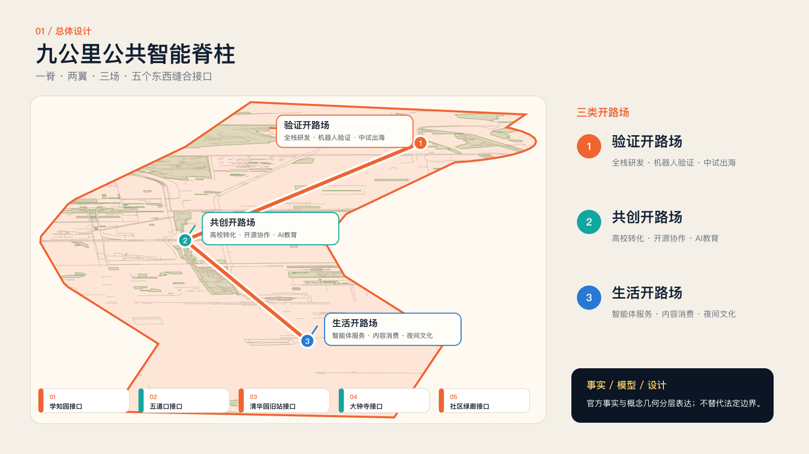

### 核心空间结构

| 层级 | 城市设计动作 | 空间与运营结果 |
|---|---|---|
| 一脊 | 将遗址公园升级为公共学习、城市体验和受控验证脊柱 | 形成连续的日常入口、文化叙事、低碳运维和可达性服务 |
| 两翼 | 西侧专业服务、东侧场景赋能 | 将产业链从高校成果延伸到中试、采购、应用与全球连接 |
| 三场 | 众智园验证、AI原点共创、大钟寺生活 | 三片区各有辨识度，又共享人才、数据、证据和维护网络 |
| 多接口 | 五道口、清华园旧站、大钟寺四象限、众智园—学知园等 | 先修复地面可读性和无障碍连续，再评估大工程必要性 |

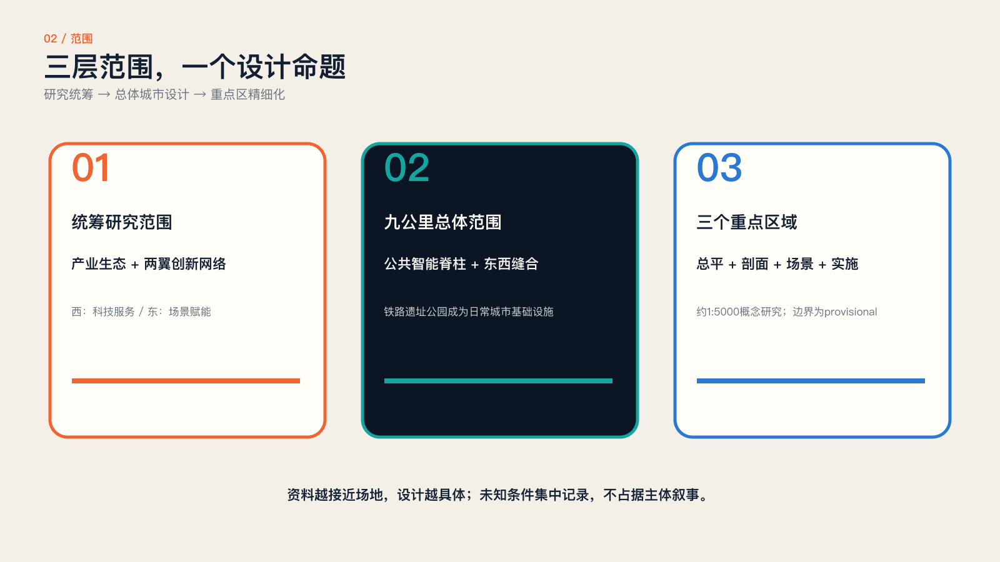

## 设计依据与资料清单

### 公园已建成，参与需要继续生长

2026年8月，二期开放；九公里绿廊成为本方案必须尊重的现实条件。

本方案不再把公园当作等待开发的空地，也不把步道、机车和活动场地重新包装成原创。新增内容是可进入的议题入口、可逆的测试接口、公开的评议时段和持续更新的档案。空间改造由实际问题触发，技术部署先经过风险审查。 [source:V3-PARK-OPEN] [source:V3-PARK-OFFICIAL]

设计判断：公园建设解决了空间连续性的主要基础，公众协作仍需要持续服务。首期优先借用现有开放前场和室内驿站；每次任务公开发起人、受理人和回应时间。这样，居民离开一次活动后仍能追踪结果，运营方也可以复用已经完成的证据和授权。

### 从真实地点到公开结果

四层证据链组织40页方案，不用氛围图代替场地设计。

第一层是现状：官方资料、街区控规、开放地图和带日期的现场照片。第二层是判断：哪些问题已经解决，哪些接口仍然缺失。第三层是设计：空间组件、运营规则和智能体协作。第四层是验证：试点目标、人工闸门、失败条件和退出机制。灰色表达现状，彩色表达建议，虚线表达暂定或关系。

阅读路径：01—04页定义命题；05—14页建立空间骨架；15—20页解释产业如何运行；21—32页深化三个开路场；33—40页形成AI生活与实施闭环。完整来源与空间数据另附，正文中的建议可追溯到同一套证据。

### 把已有建设转成设计前提

接续“三道一绿”，聚焦运营接口和东西向可达性。

近期公开报道确认南北延展与一期衔接，已有铁路遗存展示、桥下利用、休憩运动与慢行设施。旧版“未来形成连续绿廊”的表述因此被撤回。新的增量不以新增构筑物数量衡量，而看公众能否在通勤、散步和休息中进入协作，是否能看到自己的意见被回应。

现场判断必须带日期。图中旧站公园入口记录的是2024年环境，可用于辨认建筑、铁路铺装和树木关系，不能证明2026年的开放时间、无障碍状态或设施完好程度。首次落地前安排同角度复拍、步行测量和运营访谈，把照片证据更新为可以执行的现场清单。

所有资料分成官方背景、开放地图、带日期照片和原创模型四类。真实地图只提供现状线索，不能确定权属和红线。完整来源、处理方法、许可与限制见文末清单。 [source:OSM-20260830] [source:V3-GEO-MODEL]

## 三层范围工作框架

### 三个竞赛范围，一套法定背景

43.6平方公里研究、11.4平方公里总体、368.4公顷重点区，不能与新公布的16.7平方公里控规范围混用。

征集公告给出三层面积和方向性四至，但仓库尚无精确官方矢量边界。2026年8月公开的街区控规覆盖九个街区，可作为强约束背景，却不是竞赛红线。本方案的计算模型与地理研究视窗均明确标为临时；它们只用于讨论与复算，不能推导产权、建设规模或审批结论。 [source:V3-PLAN-2026] [data:geometry/site_boundary.geojson#V3-PROV-SITE] [depth:three_level_scope_framework]

制图方法：道路、建筑和公园来自开放地图；三个研究窗以真实站点和道路为定位。计算域沿走廊设置暂定缓冲，服务圈不代表征地或施工占地。面积不同的图层不得相除生成“达标率”；取得正式红线后，应替换几何并重新生成全部指标。

## 统筹研究范围产业与未来城市研究

### 高密度创新需要低门槛入口

邻近不等于协作，活动频繁也不等于公共学习。

居民熟悉日常障碍，却未必能形成设计任务；开发者善于试作，却可能缺少真实使用者；机构能组织活动，但经验容易停留在宣传材料里。本方案把问题整理、能力匹配、场地授权、专业复核和结果回应连接起来。入口必须同时支持纸卡、人工讲述与数字终端，避免技术能力成为参与门槛。 [source:AGENT-TASKBOOK] [depth:overall_spatial_structure]

空间回应：在高频经过、可以停留而不阻塞的位置设置人工问题入口；短任务适合通勤，预约门诊适合深度讨论。每个入口共享任务编号，居民可以在另一处查看进展。重点不是建立新的注册系统，而是让已有公共服务和创新资源之间形成可用的交接。

### 试—创—演—记是一条生产链

三个重点区各有主责，全线保留完整闭环。

众智园承担标准、安全与验证；AI原点连接居民问题、高校能力与开源团队；大钟寺让原型进入公共展示和评议；全线档案保留版本与后续状态。项目可以沿线流转，也可以在一个节点完成小闭环。每次转移必须连同证据、风险与权利状态一起交接。

交接单包含六项：问题摘要、场地证据、原型版本、风险记录、材料许可和下一责任人。三处重点区不是必须依次访问的旅游线路；老年居民可以在社区完成反馈，研究团队可以跨区验证。分工提高专业性，本地小闭环降低参与成本。

### 创新生态通过任务连接

空间、人才、算力、数据、资金和场景以可检查的接口协同。

高校提供导师与研究方法，企业和开源团队提供原型能力，社区提供问题与体验，运营方提供场地和安全，专业团队负责复核。赞助不换取议题优先，单一供应商不垄断平台。土地与资金机制只作为建议，任何采购、投资或长期运营主体均需独立批准。

成果转化设三条出口：公共服务改进交给授权运营方；开源工具进入维护仓库；商业产品进入独立合规和采购流程。公共空间参与不意味着居民为企业提供免费训练数据。赞助与利益关系公开，评审人员遇到利益冲突应回避。

### 全球案例提供方法，不提供复制模板

比较开放协作、实体试验、公共文化和问责机制，明确哪些经验不能移植。

MIT City Science启发可讨论的城市模型；AMS生活实验室强调真实环境中的共同试验；Decidim提供参与和进度追踪机制；Ars Electronica连接艺术与公共讨论；巴黎SmartCity Living Lab强调现场试验；Barcelona Fab Lab启发开放制作与地方知识。案例不是京张绩效证据，资金、制度与场地条件均需重新检验。

可借鉴的是方法组合：模型帮助讨论但不替代决策；生活实验室接受失败；参与平台公开进展；艺术活动让分歧可见；开放工坊积累维护能力。不能直接移植的是法定权限、投资规模与文化语境。每个借鉴都须解释“在京张由谁运行、在何处运行、如何停止”。

三大定位是百年京张文化带、都市AI生活体验带、AI融合创新带；五大功能分别对应全栈自主创新、世界级生态、AI+场景、活力城市和全球治理对话。中关村科技服务翼提供知识产权、资本与国际服务转介，小月河场景赋能翼承接日常公共体验。区域协同可通过公开问题和复核协议联系北纬社区、未来科学城、怀柔科学城、经开区及京津冀，不虚构合作关系或投资承诺。

### AI产业链：从实验室到城市应用

产业城市设计不是企业名录，而是成果转化路径的空间化。高校实验室形成科研成果；AI原点的开源工坊完成跨团队原型；众智园验证花园形成安全、性能和用户证据；可组合中试盒子连接供应链、标准和出海服务；大钟寺及整条绿廊提供真实但受控的城市应用界面。每一次跨区流转都带着版本、证据、权利状态、维护责任和退出条件，避免“展示成功、维护失踪”。

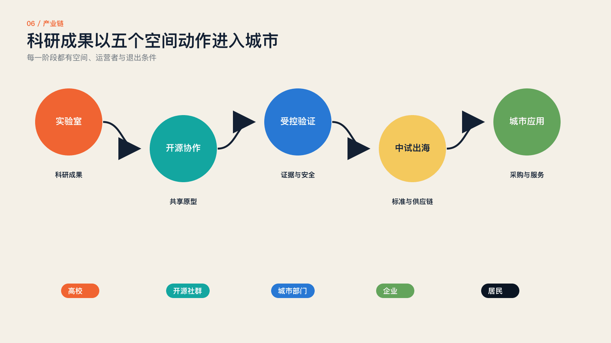

### 三区两翼产业分工

众智园聚焦自主可控AI全栈、具身智能、机器人测试、中试和出海服务；AI原点聚焦高校成果转化、基础模型与工具、开源协作、AI教育和青年人才服务；大钟寺聚焦个人智能体、智能终端、内容生成、智能商业和文化消费。西侧中关村科技服务翼提供资本、法务、知识产权、技术转移和全球网络；东侧小月河场景赋能翼为机器人、医疗、影视及公共服务提供真实场景。三片区不是同质园区，而是同一产业链上的三种城市能力。

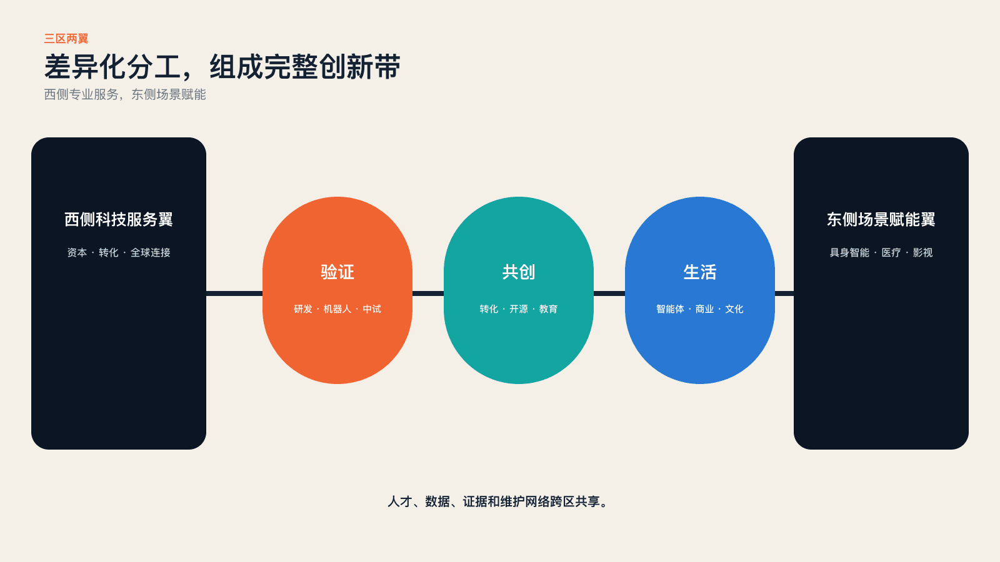

### 五类产业空间原型与24小时人才链

五类原型分别是可共享实验室、临街开源工坊、可观察验证花园、可拆分中试盒子和可进入的城市应用首层。它们以模块组合，避免以单一地标建筑代替产业生态。早晨的慢行和低碳运维、白天的研发与课程、中午的测试和交流、傍晚的展示消费、夜间的共演与学习形成24小时使用链；安静时段、居住权益和夜间物流边界由运营规则保障。

每类原型都回答四个问题：谁能进入、何种活动发生、谁维护、失败后如何恢复。建筑规模、具体层数和结构体系在正式权属、容量和工程资料公开前保持概念性；本方案不以虚构容积率制造精确感。

方法参考：MIT City Science — MIT Media Lab [source:V3-CASE-MIT]

方法参考：Urban Living Lab way of working — AMS Institute [source:V3-CASE-AMS]

方法参考：Accountability component — Decidim [source:V3-CASE-DECIDIM]

方法参考：Futurelab — Ars Electronica [source:V3-CASE-ARS]

方法参考：SmartCity Living Lab — European Network of Living Labs [source:V3-CASE-PARIS]

方法参考：Fab Lab Barcelona — Fab Lab Barcelona [source:V3-CASE-FAB]

## 总体设计范围城市更新与控规深度城市设计

### 五条规则先于技术选择

公共利益、事实分层、人工判断、可逆试验和可追溯权利构成底层协议。

项目先回答服务谁、是否排除某些人，再选择模型和设备。所有现状、建议与合成影像分层展示；AI提供备选和证据，不自动作出公共决策。先做可逆低风险原型，再讨论长期建设。贡献、失败、争议、许可变更和退出原因都进入档案，不能只留下成功故事。 [data:geometry/land_use.geojson#LU-003] [depth:land_use_layout] [standard:MOHURD-CONTROL-DETAILED-PLANNING]

五条规则转成验收清单：有线下等效入口、有来源与时间、有明确复核人、有停止和恢复方案、有可修改的授权。任一项缺失，项目停留在室内讨论或模型阶段。通过清单只说明准备充分，并不替代审批、检测或现场许可。

### 绿廊是骨架，接口是增量

现有驿站、开放前场、桥下和可授权室内空间优先承载新增功能。

设计不默认占用绿地、文保空间、轨道设施或企业产权。每个接口先核对通行、消防、维护和邻里影响，再安排活动。东西连接既包括物理路线，也包括社区、园区与高校之间的开放时段、任务与服务。将这些条件画进地图，比画一条连续彩带更能说明实施路径。

总体空间不采用均匀铺设新装置的办法。可长期值守的服务点成为主节点，短时授权前场成为活动节点，沿线导视只承担导向与进度查询。节点之间依靠既有慢行网络联系，跨路和校园边界处保留核验点；未确认开放的空间不进入公众路线。

### 组件由责任定义，不由造型定义

问题站、共创桌、验证庭、共演标和档案标可以随场地调整。

问题站保留语音、纸卡和屏幕；共创桌提供底图、版本标签与主持人；验证庭具有风险分区、急停与运维后场；共演标公开素材许可和生成状态；档案标以二维码和实体编号共同工作。组件可拆卸、可维修，避免昂贵专用硬件成为长期运营负担。

组件配置分为基本件与选配件。基本件是桌、座椅、可读标牌、纸卡和储物；屏幕、投影和传感器只有在解决具体问题时才配置。收场后撤除临时线缆、复位家具并检查通行面。每件设备应有维护人、备用方案和停用日期，减少废弃“智慧设施”。

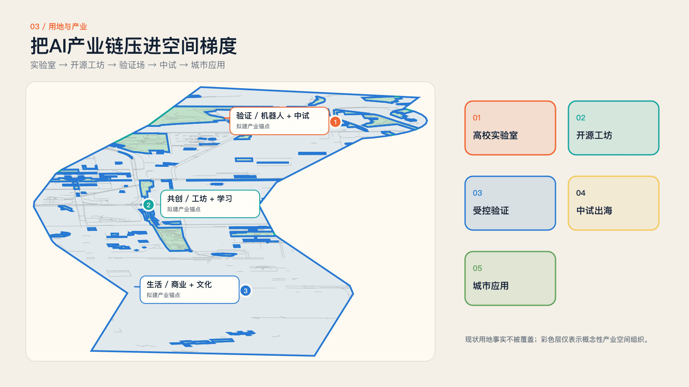

## 重点区域详细设计

### 众智园：验证开路场

约192.1公顷任务书范围承担AI全栈研发、机器人验证、中试与出海服务。概念总平以验证花园为公共核心：研发与中试位于可控内圈，观察、课程和成果展示布置在公共外圈，学知园站及东西社区接口提供到达；测试路线不侵占无障碍主通道。图示边界与路网为概念研究，正式权属、道路红线和容量必须在下一阶段校核。

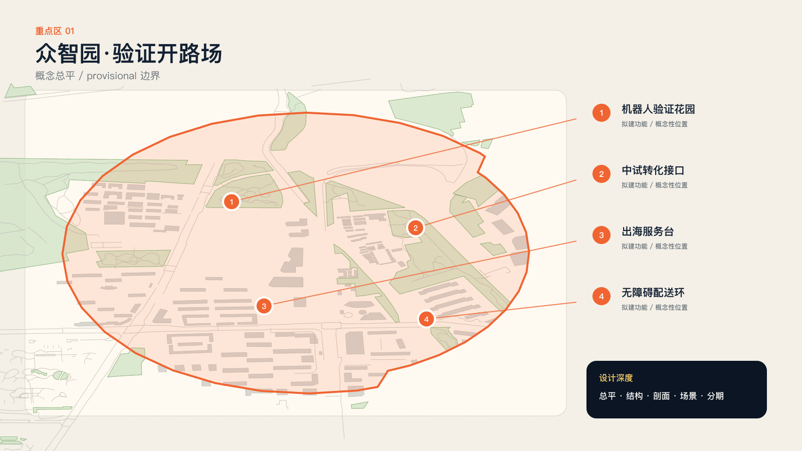

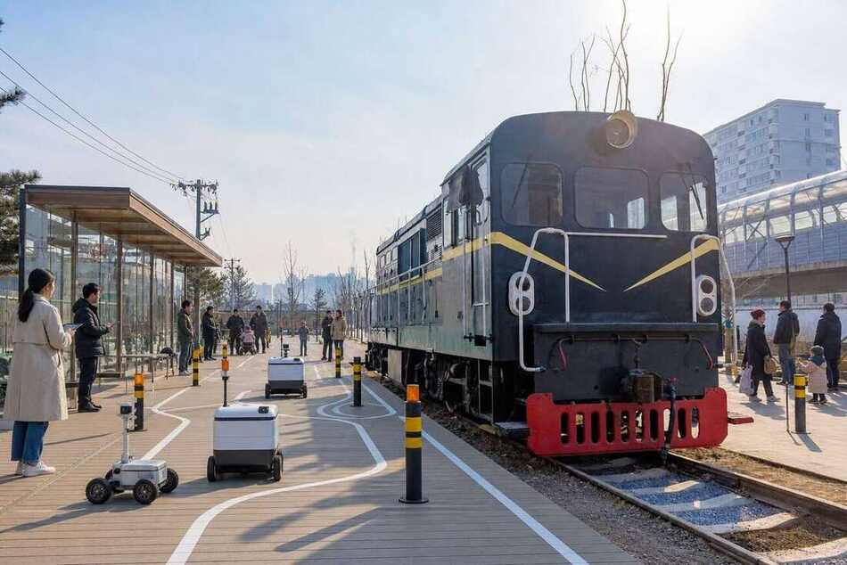

学北园、学清路、月泉路和清河提供空间定位线索，不提供自动建设许可。

官方资料将众智园定位于AI全栈自主创新、标准和治理。研究视窗展示现状路网与建筑肌理；彩色节点只是待复核的参与接口。首先核验可公开进入的前场和室内场地，再组织观察与测试。未获得最新可再利用照片的点位不生成“现场照片”，以真实地图和来源记录表达。 [data:geometry/key_areas.geojson] [depth:three_key_area_detailed_design]

第一步不是建“验证花园”，而是选择具备管理边界的候选前场。尽调核对入口、消防通道、装卸动线、供电和日常管理。地图中的学北园锚点是公开资料定位的近似位置，设计需要现场确认。建议以无移动设备的展示和人工问答作为最先开放的部分。

### 验证花园将可见与暴露分开

公众可以理解试验，但不应被动成为试验对象。

绿色区用于无个人数据的演示；黄色区用于经过知情同意的短时试用；红色区只允许专业团队在受控环境运行。观察廊、缓冲带和运维后场形成清晰剖面。儿童和无障碍使用者拥有单独复核环节，任何模型或终端失效都能切换到人工服务。

关系剖面从通行到观察、再到受控试验和维护后场逐级深入。缓冲不是装饰绿带，而是避免误入和区分责任的空间。其宽度、围护、疏散和电气条件由专业人员依据实际风险确定；本图不标假精确尺寸，不提供机器人在人流中自由运行的授权。

### 测试从一个问题开始

先写受益对象、失败条件和退出方式，再讨论设备。

问题站去除敏感个人信息；证据智能体追踪现场条件和适用标准；专业团队判定风险等级；原型团队在限定时段运行；现场主持人拥有停机权；结果与异议同步归档。通过测试不等于获得采购资格，也不等于批准全面部署。

示例任务是“第一次来到这里的人能否找到人工服务”。先记录现有标识和错误转向，再比较纸质导向、人工引导与端侧语音三种备选。测试不以AI方案胜出为目标；如果简单标牌更有效，应采用简单标牌，并公开比较依据。

### 少扰动的剖面，清楚的恢复责任

连续通行、公众观察、缓冲和受控试验依次展开。

临时构件不挖大规模基础，不附着文物，不遮挡消防、市政和树木维护。设备照明向内收敛，噪声与开放时间接受邻里约束。剖面表达关系与维护，不冒充施工图；尺寸、荷载、防火和排水必须在正式测绘与审查后确定。

恢复是设计的一部分：布置前拍照记录地面、家具与通道，结束后逐项复位。试验设备不附着树木或历史构件；用电、围护和储物使用经许可的接口。关系剖面表达责任分区，实体尺寸需要实际测量与专业复核后才能确定。

### 无障碍验证周作为首个旗舰试点

让真实使用者参与评价路线信息、提示方式和人工服务。

参与者可以领取纸卡，选择性提交障碍点，不进行连续人脸或轨迹采集。AI只归类重复问题和提出路线备选；残障人士、老年人、运营和交通专业人员共同决定优先级。成果包含问题清单、三个可逆原型与未解决事项，而不是未经测量的“智能化完成率”。

建议记录三类证据：自愿参与者的任务完成情况、经本人许可的文字反馈、主持人的环境记录。路线时间仅作试点评估，不公布个人轨迹。测试后把已修复、转介和暂不处理的问题分开列示；没有达到目标时应缩小试点，而不是增加采集范围。

### AI原点：共创开路场

约104.3公顷任务书范围把高校成果转化、开源协作、AI教育和青年生活组织为一公里学习圈。总平以五道口高校—街区接口、清华园旧站和开源工坊为三个公共锚点；课程、工作、试作、休息与夜间交流共享空间，但不把校园边界和居住安宁视为可以忽略的障碍。

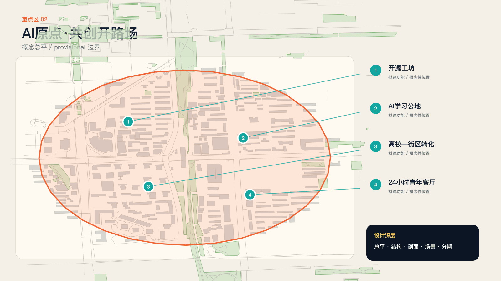

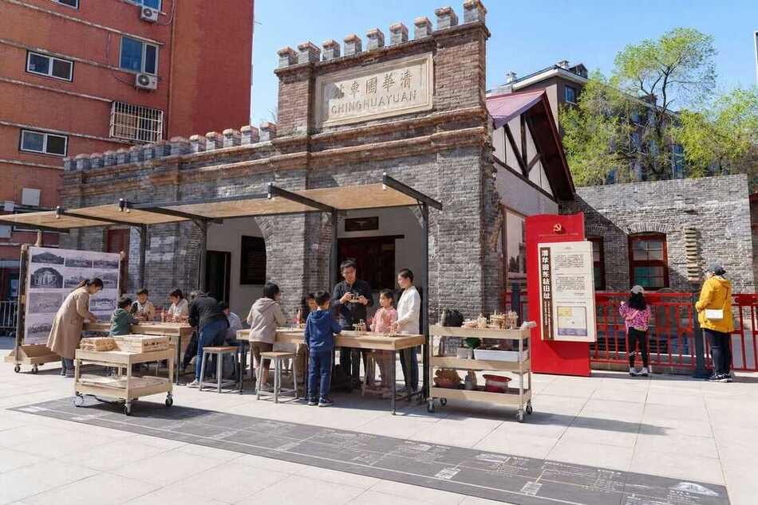

五道口、荷清路与清华东路西口形成真实的换乘与创新界面。

高架、商业、高校和社区在这里叠加。设计以步行可达、开放时段和公共任务为起点，而不是继续强化封闭创业圈层。研究视窗不代表官方重点区边界，所有室内工坊和校园开放点位必须取得运营与产权授权。

AI原点的公共界面采用“短停—讨论—制作—复核”的深度梯度。街角负责看见任务和预约，室内工坊承担长时间制作，专业门诊承担高风险问题。校园与企业内部空间只在获得许可的时间开放；公共活动不要求公众进入受控科研场所。

### 开源工坊让需求和能力彼此找到

公开任务、素材许可、导师门诊和版本管理共同构成转化空间。

每个任务包含问题陈述、现场证据、风险等级、所需能力和当前状态。社区夜校帮助居民理解议题，短工坊帮助跨专业组队，专业门诊提供规划、权利和安全指导。贡献既可以是代码和模型，也可以是观察、翻译、主持、照护和维护。

开源工坊建议设置问题墙、共创桌、材料柜和评审角，围绕同一个任务版本工作。设备使用需培训，成果先检查许可再公开。导师不替代居民定义问题，居民也不承担技术安全责任；主持人负责把意见转成可检查的设计要求。

### 一公里学习圈连接日常和研究

“一公里”是组织服务的概念尺度，不是已测定步行覆盖率。

概念路径连接五道口站、原点载体、开放空间和可授权高校协作点。每周安排居民问题门诊、开源维护夜和原型评审桌，线上任务与线下主持同步。具体路线应通过现场步行、无障碍体验和开放时间核查后确定。

学习圈的核心是每周可预期的服务节奏，而不是一次性节庆。建议固定一个居民问题时段、一个跨专业工坊和一个维护时段。场地、导师和无障碍服务缺一时，相应活动不发布。评价看任务是否被接住和持续更新，不以讲座场次代替协作。

### 站口和高架检验参与是否平等

嘈杂、拥挤、换乘和夜间使用是设计条件。

共创点应可见但不阻塞通行，提供休息、遮阴、照明和人工值守。信息以大字、语音和双语表达，不在通勤高峰组织围观活动。对于站点改造，仅提出公共体验需求与评价指标，不设计轨道线位或工程结构。

五道口照片提示站口、高架与商业前场之间存在复杂视觉信息，但不能据此断定现有设施缺陷。下一步用峰时和非峰时观察建立基线，核对停留位置与自行车组织。界面设计优先减少信息竞争，不增加大面积屏幕或强声光。

### 十四天完成一次可复核的原型循环

快速试作与公共复核必须共享同一个节奏。

第1—3天整理问题和证据，第4天公开组队，第5—9天工坊试作，第10天安全与权利审查，第11—13天现场测试，第14天发布版本和下一步。未通过的项目同样归档停止原因，避免让失败经验被重复浪费。

十四天循环适用于低风险内容和服务原型，不适用于结构改造或轨道工程。每一轮固定保存输入、比较方案、测试条件和结论。人员不足或证据不全时延期，并公开原因；节奏是服务承诺的建议，不是压缩安全审查的理由。

### 大钟寺：生活开路场

约72公顷任务书范围以大钟寺站四象限为共同城市门厅，承载个人智能体、智能终端、内容消费、智能商业与夜间文化。第一优先不是建造地标，而是统一地面导向、连续盲道、骑行过街、换乘等候和首层公共界面；当四象限在步行层面真正可读，产业与文化节目才形成相互增益。

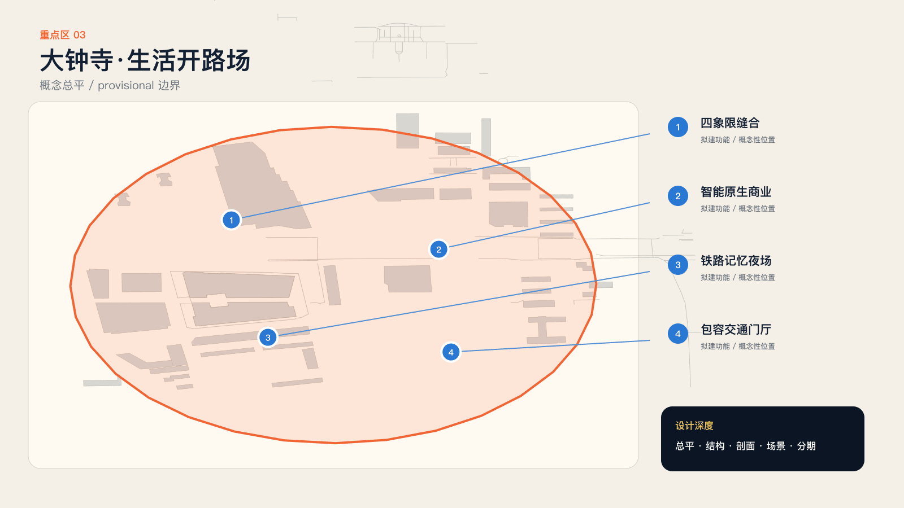

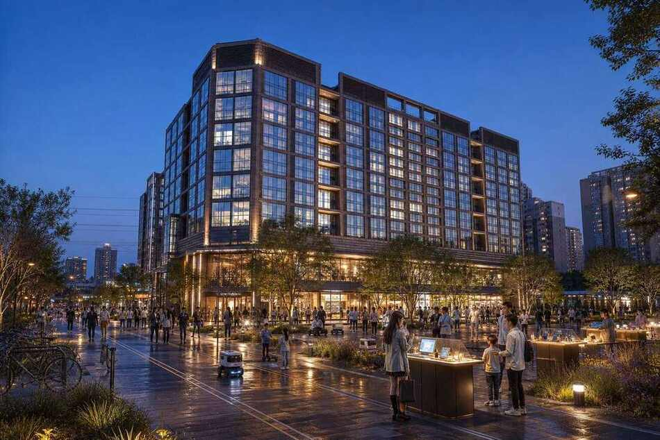

站口换乘、公共生活与内容生产叠合，而不是互相挤占。

征集任务关注大钟寺站四象限步行联系和非机动车组织。设计首先核对地面路线、停留点和自行车秩序，再安排共演与片场。任何跨路、桥下或站城工程都需要交通、轨道和权属专项论证；本轮只提出可逆地面活动和导向策略。

四象限分工先以现状功能和实际通行决定，不预设四座新建筑。通行最强的一侧只做导向；具备停留条件的一侧进行短讲述；具备室内许可的一侧承担制作；安静界面保留日常生活。具体象限对应须经现场核验后落图，避免地图上看似空白即视作可开发。

### 城市共演展示人的选择

被展示的是问题、版本、争议和理由，而不是AI奇观。

移动字幕架、低亮度投影、实体模型和现场讲述形成小尺度公共评议场。白天用于原型试用和成果门诊，夜间用于短时展演；内容标注生成工具、素材来源与合成状态。场地不得遮挡交通导向、商铺和住宅正常使用，活动时段接受运营与邻里约束。

共演采用小规模、短时段、低技术依赖的运营方式。优先白天实体模型和字幕说明，夜间活动单独核对灯光、噪声和住宅影响。参与者可在场外获取等效文字稿。因天气、拥挤或投诉暂停时，内容转入室内或线上，不把继续演出作为默认选项。

### 开放片场让作品可以被纠错

素材权利、现场采集边界和版本记录一起进入作品。

城市声音、影像与数据进入片场前核对许可；可识别人像取得单独同意；AI影像不冒充现场记录。作品同时发布字幕、文字稿、来源清单和版本号。企业宣传与公共议题分栏呈现，避免商业传播挤占公共空间；撤回机制对后续再利用有效。

开放片场的基础设施首先是许可和协作，不是摄影棚建设。提供可再利用素材目录、拍摄预约、肖像授权和字幕模板；禁止默认采集路人。制作成果保留来源链，合成内容显著标注。对撤回素材，维护者应记录停止分发、替换版本与通知范围。

### 先验证地面可读性，再讨论大工程

颜色与触觉并行导向、可移动停车边界和十分钟讲述点可先试。

四象限行动用任务卡串联真实路口与公共空间，评价绕行时间、错误率、无障碍体验和对既有通行的影响。测量前先记录基线；活动暂停后检查场地恢复。永久连接、地下空间或桥隧方案不在本轮承诺范围。

试验以现有合法步行路径为边界，不引导穿越车流或非开放区域。导向原型采用可移动标牌和地面外侧提示，不能遮挡既有标识。无障碍复核人员拥有否决权；如果导向减少了普通用户绕行，却增加轮椅或视障用户困难，应重新设计。

### 一晚共演，一年可追溯

每次活动都应成为下一轮城市学习的输入。

现场只展示通过审查的证据图、原型版本和仍有分歧的选择。观众可以纸卡或终端反馈，智能体聚类时保留原始少数意见。建议七日内发布回应，三个月后更新项目状态，一年后检查是否继续、修改或停止。时间是运营目标，不是已确定政府安排。

档案的最小单元不是一张活动海报，而是一个能继续处理的问题。每条记录同时显示“做了什么”和“没有解决什么”。运营退出时移交开放格式数据、授权台账和维护说明；不能维护的交互功能应降级为可下载、可阅读的静态档案。

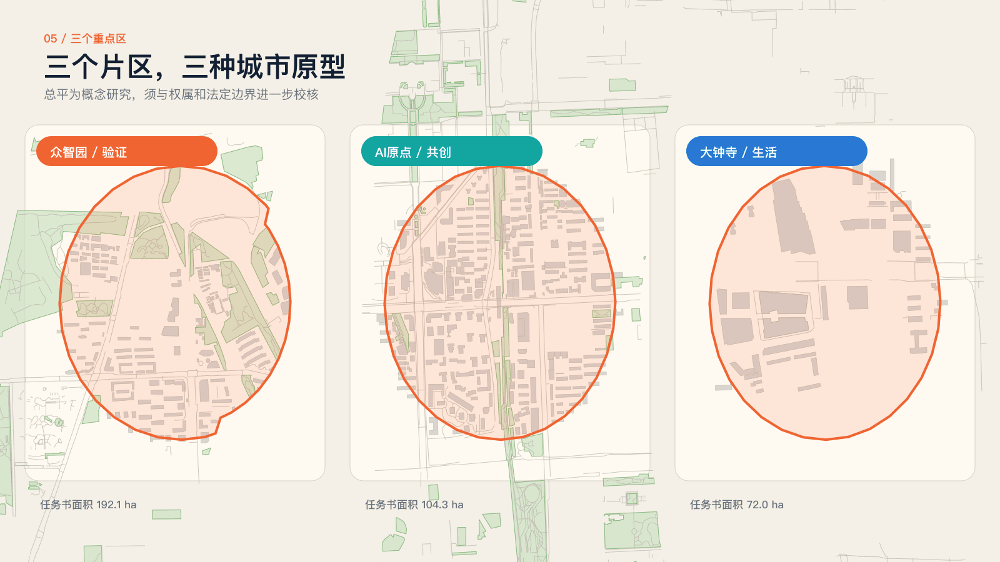

## AI 创新生态、人才画像与 AI+ 场景

### 六类使用者，六种进入条件

全员参与需要对时间、语言、身体与数字能力的差异作出空间回应。

老年人需要人工服务和慢节奏说明；通勤者需要十分钟内完成的小任务；儿童与家长需要低风险和可理解的体验；残障人士应参与原型复核；学生与开发者需要明确任务和素材许可；企业与公共机构需要清晰责任、停止条件和转化路径。画像是设计假设，不冒充已完成的居民调研。 [standard:PROJECT-AGENT-OPEN-CALL-TASKBOOK] [data:geometry/public_space.geojson]

评价应按进入条件分组，而不是记录敏感身份。建议测试纸卡能否独立完成、人工解释是否清楚、坐姿是否可读、非智能手机用户能否追踪结果。邀请不同使用者参与共创并支付合理支持成本；正式招募、样本量与报酬另行确定，不以虚构人数证明普惠性。

### 四类问题进入同一任务台

通行、日常、创新与记忆共享状态规则，但不被强行合并。

任务台公开显示受理、核验、试作、评议、完成或关闭，并解释每次变化。通行问题关注绕行与连续无障碍；日常问题关注休憩、照护与夜间使用；创新问题关注真实需求和低风险验证；记忆问题关注故事来源、署名与纠错。少数意见不因AI聚类而消失，紧急安全事件直接转交既有公共服务渠道。

任务受理采用双层记录：公开层只保留问题、位置范围、状态和理由；受限层保存必要联系信息及许可。重复问题可以关联但不能直接删除。对于不属于项目权限的事项，明确转介渠道和关闭原因，避免让“已受理”成为无限等待。

### 四个旗舰场景做深，十二个场景成网

问题台、验证花园、城市共演和生长档案形成核心体验。

四大旗舰分别负责进入、试验、讨论和追踪，共享项目编号、风险等级和权利状态。公众不必反复注册，专业团队可以看到完整证据链。其他场景围绕它们提供教育、服务、维护与转化，不另建互不相通的平台。

场景网络按服务关系组织：任务台收集问题，工坊和夜校扩大能力，验证场景形成证据，共演和片场促进讨论，档案维持连续性。场景之间共享人力与基本设施，避免十二个独立系统。优先做深四个旗舰，其他节点按需求和资源逐步开放。

### 场景卡必须写出停止条件

名字不足以构成场景；对象、空间、AI、人、数据、运营和评价缺一不可。

十二张卡覆盖安全沙盒、无障碍验证、端侧低碳、标准诊所、问题任务台、开源工坊、社区夜校、成果门诊、城市共演、开放片场、智能消费试验和国际同行桌。每张卡写明触发方式、实体需求、数据最小化、责任角色、成功指标和停止条件；生长档案贯穿全部场景。

卡片落地时必须填写具体地址、开放时段和责任人，不能用“平台负责”替代个人职责。首期以纸卡和人工值守验证流程，数字界面只是等效入口。图中问题台是基于真实照片的概念改造，用于说明尺度与保留关系，实际摆放仍需运营和文保核验。

### 公共空间不是无条件试验场

端侧辅助、机器人终端与内容智能体采用不同验证协议。

端侧辅助优先离线运行，不采集连续人脸；机器人限定速度、时段和围护，配置人工急停；内容智能体检查来源、版权和误导风险，公开投诉通道。验证记录同时保存失败样本与修复状态。通过只是进入下一轮专业评估，不代表取得部署许可。

三类验证分别使用独立通过条件。端侧辅助检查离线可用与错误提示；移动终端检查隔离、急停和人工接管；生成内容检查来源、合成标识和纠错。不能用同一个“准确率”覆盖安全、权利和可用性，也不能把试点样本外推为全区部署效果。

### 六类智能体，四道人类闸门

智能体整理信息与提出备选，人的责任不能被系统名称隐藏。

议题智能体去重，证据智能体追踪来源，匹配智能体建议协作者，推演智能体比较版本，风险智能体提示边界，档案智能体记录贡献与撤回。公开前、测试前、展演前和归档前分别由社区运营、专业团队、权利审查人与贡献者复核。

人类闸门由具名角色确认并留下理由。智能体输出包括使用材料、置信限制和备选项，不隐藏失败输出。敏感问题不进入外部模型；系统故障时纸卡受理与人工回应继续。审计不仅看输出正确与否，还看谁有权修改、拒绝和撤回。

### 贡献权利与项目状态一起保存

匿名、署名、更正、撤回与有限许可都是正常选择。

贡献凭证只保留必要信息，展示用途与模型训练用途分开授权。撤回不抹去已经发生的公共决策事实，但停止个人内容的后续公开使用。档案用版本记录说明变化，不在后台静默覆盖。任何外部模型不得自动取得市民素材。

建议档案字段为项目编号、地点范围、版本、来源、贡献角色、许可用途、复核记录和下一检查日。联系信息与公开档案分开保存。公开素材采用明确许可，第三方素材按原许可保留；不能因进入本项目就统一改为可训练、可商用或永久授权。

### SCN-01｜安全治理沙盒

- 服务对象与问题：开发团队与公众：看懂风险而不暴露于风险
- 候选空间：众智园经授权受控室内场地
- 触发方式：申请公开演示前提交测试单
- AI职责：整理风险与失败样本
- 人工职责：专业团队判定风险，主持人可停机
- 实体设施：隔离区、说明牌、急停、人工服务
- 数据边界：合成测试材料；不接入路人人像
- 建议运营角色：授权运营方＋专业测试团队
- 评价指标：复核完成率与故障处置时长
- 停止条件：隔离、急停或监督失效即停

此场景在模型中登记为候选参与点，实际占地与开放条件待确认。 [data:geometry/public_space.geojson#SCENARIO-001]

### SCN-02｜无障碍验证周

- 服务对象与问题：残障人士与老年人：服务信息是否可用
- 候选空间：众智园授权前场及既有合法步行路段
- 触发方式：自愿领取纸卡并选择任务
- AI职责：归类障碍与比较提示备选
- 人工职责：使用者复核，交通专业人员决定调整
- 实体设施：纸卡、座椅、大字导向、人工值守
- 数据边界：自愿任务反馈；不保留个人连续轨迹
- 建议运营角色：社区组织＋运营与无障碍复核组
- 评价指标：任务完成率与误导次数，对照基线
- 停止条件：增加障碍、发生险情或参与者要求退出

此场景在模型中登记为候选参与点，实际占地与开放条件待确认。 [data:geometry/public_space.geojson#SCENARIO-002]

### SCN-03｜端侧低碳试验

- 服务对象与问题：开发者与设施维护者：技术是否值得部署
- 候选空间：众智园可管理室内空间
- 触发方式：提交离线服务与能耗测试目标
- AI职责：端侧执行简单服务，输出错误提示
- 人工职责：维护人员核验用电与结果
- 实体设施：可计量终端、合规电源、备用纸质服务
- 数据边界：公开或合成输入；不上传个人数据
- 建议运营角色：技术维护团队＋场地运营
- 评价指标：每项任务能耗与离线完成情况
- 停止条件：过热、电气异常或数据越界

此场景在模型中登记为候选参与点，实际占地与开放条件待确认。 [data:geometry/public_space.geojson#SCENARIO-003]

### SCN-04｜标准与权利诊所

- 服务对象与问题：小团队：不知道何时应交专业机构
- 候选空间：众智园预约会议室
- 触发方式：带原型和来源清单参加门诊
- AI职责：检索公开标准并标明适用不确定性
- 人工职责：专业顾问解释边界，不代办审批
- 实体设施：讨论桌、文档屏幕、纸质清单
- 数据边界：仅公开材料；商业秘密不进入外部模型
- 建议运营角色：专业顾问＋联合运营
- 评价指标：补证清单完成情况，不以获批率评价
- 停止条件：缺少专业人员或涉及受限材料

此场景在模型中登记为候选参与点，实际占地与开放条件待确认。 [data:geometry/public_space.geojson#SCENARIO-004]

### SCN-05｜城市问题任务台

- 服务对象与问题：居民与通勤者：意见缺少回应
- 候选空间：AI原点及旧站公园候选授权前场
- 触发方式：纸卡、口述或终端提出日常问题
- AI职责：整理摘要、关联重复问题
- 人工职责：社区主持人复核并发布回应
- 实体设施：桌椅、纸卡、大字标牌、可选终端
- 数据边界：公开摘要与联系信息分离；训练另行授权
- 建议运营角色：社区主持人＋授权运营方
- 评价指标：已回应/已受理，按线下与线上分别看
- 停止条件：无人值守、隐私泄露或通行受阻

此场景在模型中登记为候选参与点，实际占地与开放条件待确认。 [data:geometry/public_space.geojson#SCENARIO-005]

### SCN-06｜开源共创工坊

- 服务对象与问题：学生与居民：能力和问题彼此找不到
- 候选空间：AI原点经许可的近校工坊
- 触发方式：从已核验任务选择组队
- AI职责：建议能力组合与原型备选
- 人工职责：导师、安全员与居民共同复核
- 实体设施：共创桌、材料柜、合规工具、储物
- 数据边界：清权底图和自愿贡献；发布前核查许可
- 建议运营角色：高校协作角色＋开源维护者
- 评价指标：原型完成与后续维护情况
- 停止条件：设备无培训、许可不清或风险升级

此场景在模型中登记为候选参与点，实际占地与开放条件待确认。 [data:geometry/public_space.geojson#SCENARIO-006]

### SCN-07｜社区夜校

- 服务对象与问题：非技术参与者：难理解AI和数据权利
- 候选空间：AI原点开放教室
- 触发方式：预约或线下报名无门槛体验
- AI职责：生成解释备选但不提供高风险专业建议
- 人工职责：教师主持，允许质疑和人工解释
- 实体设施：投影、字幕、大字讲义、纸质练习
- 数据边界：无需人脸、真实账号或敏感数据
- 建议运营角色：社区教育组织＋教师
- 评价指标：能否完成纸质任务并解释退出方式
- 停止条件：内容误导、未成年人保护不足

此场景在模型中登记为候选参与点，实际占地与开放条件待确认。 [data:geometry/public_space.geojson#SCENARIO-007]

### SCN-08｜成果与维护门诊

- 服务对象与问题：原型团队：展出后无人继续维护
- 候选空间：AI原点授权公共客厅
- 触发方式：带版本记录申请复盘
- AI职责：比较反馈、整理缺陷和文档
- 人工职责：专业人员决定修复、转介或停止
- 实体设施：评审桌、版本样件、维护记录
- 数据边界：最小化反馈；不传播受限材料
- 建议运营角色：专业团队＋维护者
- 评价指标：三个月状态更新与修复完成情况
- 停止条件：缺少维护主体或公开材料侵权

此场景在模型中登记为候选参与点，实际占地与开放条件待确认。 [data:geometry/public_space.geojson#SCENARIO-008]

### SCN-09｜生成式城市共演

- 服务对象与问题：居民与访客：看不到选择的理由
- 候选空间：大钟寺经许可且不阻塞的停留空间
- 触发方式：通过内容审查的项目公开展示
- AI职责：协助字幕、版本比较与多语解释
- 人工职责：主持人说明分歧，权利人员复核
- 实体设施：可撤收字幕架、实体模型、低亮度设备
- 数据边界：清权内容；可识别人像单独同意
- 建议运营角色：公共文化运营＋现场安全角色
- 评价指标：反馈回应率与邻里影响记录
- 停止条件：拥挤、噪声投诉、天气或内容风险

此场景在模型中登记为候选参与点，实际占地与开放条件待确认。 [data:geometry/public_space.geojson#SCENARIO-009]

### SCN-10｜城市开放片场

- 服务对象与问题：创作者与居民：素材授权和叙事易失真
- 候选空间：大钟寺授权室内空间及预约外景
- 触发方式：选择清权素材或自愿提供故事
- AI职责：辅助剪辑、字幕与表达备选
- 人工职责：作者和权利审核人确认来源与合成标识
- 实体设施：编辑终端、素材柜、录音预约区
- 数据边界：不默认拍摄路人；公开与训练用途分开
- 建议运营角色：文化运营＋权利维护者
- 评价指标：完整来源署名与纠错处理情况
- 停止条件：无许可肖像、虚构现场或撤回请求

此场景在模型中登记为候选参与点，实际占地与开放条件待确认。 [data:geometry/public_space.geojson#SCENARIO-010]

### SCN-11｜智能生活服务试验

- 服务对象与问题：消费者与商户：数字服务排斥部分人
- 候选空间：大钟寺自愿参与且授权的商户前场
- 触发方式：在不影响正常服务时试用辅助界面
- AI职责：离线多语说明与大字模式
- 人工职责：店员提供等效人工服务和纠错
- 实体设施：可撤收终端、纸质菜单、人工柜台
- 数据边界：不接入支付、医疗或金融敏感记录
- 建议运营角色：自愿商户＋运营协调者
- 评价指标：人工等效可用性与任务完成情况
- 停止条件：拒绝人工服务、价格误导或数据越界

此场景在模型中登记为候选参与点，实际占地与开放条件待确认。 [data:geometry/public_space.geojson#SCENARIO-011]

### SCN-12｜国际同行桌

- 服务对象与问题：国际访客与本地团队：交流难以沉淀
- 候选空间：大钟寺授权会议空间＋全线档案
- 触发方式：围绕已完成试点预约公开复盘
- AI职责：多语翻译、来源对照和问题整理
- 人工职责：双语主持人核对语境与权利
- 实体设施：讨论桌、字幕、公开资料册
- 数据边界：仅经许可公开成果；不承诺投资招商
- 建议运营角色：双语运营＋项目维护者
- 评价指标：形成可跟进的问题与合作记录
- 停止条件：翻译误导、利益冲突或权利不清

此场景在模型中登记为候选参与点，实际占地与开放条件待确认。 [data:geometry/public_space.geojson#SCENARIO-012]

## 用地、建筑规模与拆改留方案

V3撤回旧版六个虚构建筑基底和五类均匀概念分区，改用真实开放地图轮廓。476个建筑记录是现状映射对象，不是拟新建数量；高度、总建筑面积、容积率、结构、权属和占用情况均未确认。默认保留现有建筑与生活，不提出具体拆除对象。用地层仅将临时模型分成映射绿地保留、候选参与服务圈与待补证剩余部分，用于无缝拓扑和复算；剩余部分代码16不表示现实土地为空地。永久改造需要正式地块、结构调查、公众协商和专业设计后另行决定。 [data:geometry/buildings.geojson] [depth:retain_renovate_demolish] [standard:MNR-LAND-USE-CLASSIFICATION-GUIDE]

## 交通、轨道、市政与公共服务设施

慢行网采用OSM中已映射的步行、骑行和路径要素，不再把手画连接线当作道路。约117.04公里是临时模型内图层线段长度合计，可能包含支路与重复路线，不是公园长度或新建里程，也不证明公众均可通行。大钟寺以四象限地面可读性、五道口以站外停留与校园边界、众智园以入口与受控后场为核验重点。市政仅提出合规电源、临时线缆管理、现场急停、储物和雨天替代方案；不推算轨道、市政、能源或消防容量。数字服务失效时保留人工服务，空间连续无障碍与信息等效必须一起复核。 [data:geometry/roads.geojson] [depth:traffic_rail_slow_parking] [standard:BARRIER-FREE-ENVIRONMENT-LAW]

## 蓝绿空间、公共空间与城市风貌

### 铁路记忆是一种公共方法

“众”回应人字轨线，“智”连接人机，“新织”允许未来被继续修改。

材料语言来自钢轨、道砟、站台刻度与红砖，而不是复制历史造型。整体Logo与文化导视分别工作：Logo表示开放协作，导视记录地点、时间、版本和贡献。铁路遗存保持清晰完整，新装置不附着文物，不遮挡识别，不把历史压缩成科技装饰。 [data:geometry/green_space.geojson] [depth:blue_green_public_space] [standard:MOHURD-URBAN-DESIGN-MEASURES]

识别系统建议采用轨线式网格、深绿底色、铁锈红重点和自然纸色。实体标牌保持低反光和可读对比，关键信息不只依赖颜色或二维码。历史站名与方案品牌分级呈现，避免将原创装置误认为铁路历史遗物，也避免使用未经许可的机构标志。

蓝绿空间采取保留优先，试验不默认进入绿地、河道、文保或轨道用地。映射绿地是开放地图中的不完整子集；候选服务圈只是讨论符号。建议三处荣誉与文化节点：众智园“公共验证簿”展示经复核的方法与失败；AI原点“开放贡献织谱”记录代码、观察、翻译、照护和维护；大钟寺“未完之城档案窗”展示版本、异议与后续状态。它们是可逆信息组件，不是已批准的纪念建筑；贡献不按赞助额度排名，匿名和撤回是正常选择。整体Logo与文化导视分开：前者表达开放协作，后者记录真实地点、时间、来源和版本。

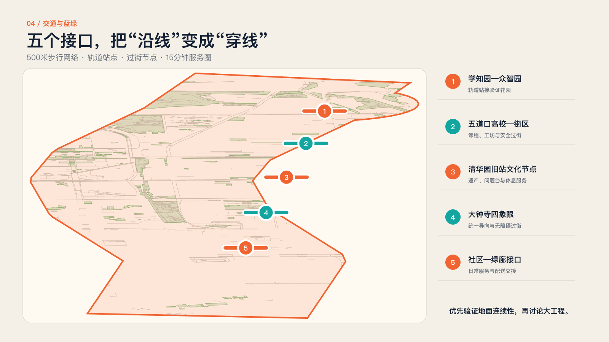

## 更新项目清单、实施政策与分期计划

### 分开维护空间、活动、技术和档案

联合工作组是建议角色结构，不是已签约的机构名单。

公共部门或授权运营方承担议题和场地责任，社区组织保障进入公平，高校与专业机构负责方法和复核，企业和开源团队提供原型，独立权利顾问处理申诉，档案维护者发布状态。预算按人力、场地、设备、无障碍服务、保险与维护分类，待明确试点范围后询价。 [data:geometry/phasing.geojson] [depth:renewal_project_list] [depth:phasing_implementation]

建议采用每月运营复盘和季度公共复核。空间维护、活动组织、技术支持与权利审核分别建账，避免预算只购买设备而无人服务。费用暂不填总价：先明确值守时数、场地条件、保险和无障碍支持，再取得可追溯报价；未落实资源的活动不对外承诺。

### 90天先完成一个小闭环

已有驿站或开放场地优先，可逆布置，不以永久建设为前提。

第1—15天完成议题、场地与权利审查；第16—35天收集20个以上问题，形成证据包；第36—60天匹配10组协作者，制作三个低风险原型；第61—80天开展试用和无障碍复核；第81—90天共演、回应并发布第一期档案。所有数量均为建议目标，开始前确认基线与资源。

首期项目包包含四项交付：经许可的场地清单、可检查的议题证据包、三组低风险原型记录、包含失败和未决事项的档案。三处节点不必同时启动；先选资源最完整的一处验证，再扩展。若场地或运营未落实，90天计时不开始。

八项更新项目作为概念工作包管理：JZ-01既有绿廊参与接口，JZ-02众智园验证花园，JZ-03 AI原点开源工坊，JZ-04大钟寺地面导向试验，JZ-05城市问题任务台，JZ-06公共共演与片场，JZ-07生长档案与贡献织谱，JZ-08双语无障碍服务。每项分别明确场地许可、值守人员、维护责任、风险条件和停止规则。年度建议以春季问题开题、夏季受控验证、秋季公共共演、冬季档案复盘循环运行；国际同行桌围绕具体项目而非招商口号组织。预算分人力、场地、设备、无障碍、保险和维护六类，尚未询价，不提供伪精确投资额。

## 指标体系、面积复算与合规矩阵

### 衡量能否参与，能否得到回应

人流、曝光和技术数量不能代替公共价值。

进入公平看线下参与、语言与无障碍完成情况；协作质量看证据包和跨角色组队；安全看停止机制与事件处置；回应看未采纳理由是否公开；持续性看三个月状态更新与维护贡献。空间指标从提交几何复算，但临时边界的比例不能解释为法定绿地率或建成绩效。 [metric:site_area_sqm] [metric:green_ratio] [depth:metrics_recalculation]

建议用分母明确的服务指标：已回应问题数/已受理问题数，完成复核原型数/进入试作原型数，保留完整署名与许可的成果数/公开成果数。先公布基线和评价周期，拒绝以目标冒充结果。开放地图面积仅描述本次数据模型覆盖，不能代替现场调查。

本轮模型面积13,333,242.063平方米；映射绿地1,176,249.669平方米，比例约8.8219%；候选服务圈8,427.902平方米，比例约0.0632%。这些低置信度值只描述参与者临时模型，不是公告11.4平方公里的官方测量值、法定绿地率或公共空间达标率。计算坐标系为EPSG:4548，交换数据为WGS84。建筑基底面积同样仅为映射子集。四类自检检查格式、空间、可视化和专业证据的包装完整性，不替代人工评审或审批；最终结果以self_check.json的当前记录为准。

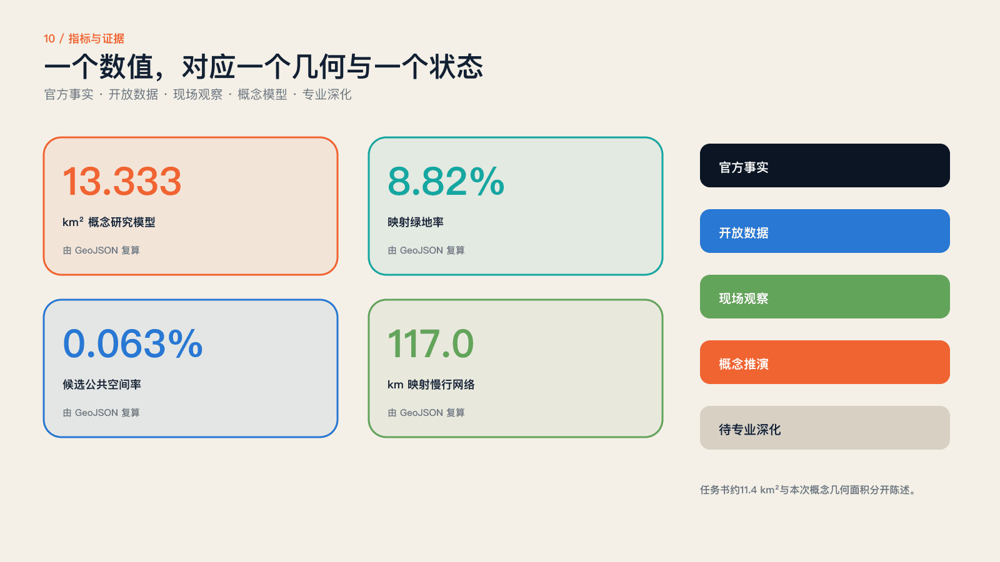

## 风险、版权与合规说明

### 不知道的条件，不能被效果图覆盖

边界、权属、结构、交通、市政和文保信息仍有专业补充要求。

无官方竞赛矢量边界，不作精确面积结论；无权属和结构调查，不作具体地块拆改留；无容量与工程资料，不作桥隧、轨道或管线方案。照片保留作者、年份和许可，官方报道图片仅作研究引用不复制。所有概念构件、活动、成本与时序都需在专业和公众复核后才能实施。 [source:V3-GEO-MODEL] [source:V3-CONCEPT-EDIT] [depth:risk_missing_data]

风险按“可补证、需专业决定、不可承诺”分级。可补证项包括开放时段和现状照片；专业决定包括文保、消防、结构和交通组织；不可承诺项包括未经批准的投资、用地调整和永久建设。每项风险对应补证责任与触发条件，不用一段笼统免责声明代替处理。

原始文本、代码和图形按项目开放许可贡献；第三方素材保留各自许可，不因打包而改变。N509FZ的六张照片及基于旧站入口照片的AI改造图保留CC BY-SA4.0和作者署名，地图数据保留OSM贡献者及ODbL说明，字体按SIL OFL使用。官方规划图仅用于背景研究和链接引用，未复制进成果。生成图清楚标注为概念，不证明现场活动、公众同意或实施许可。生成式AI公开服务是否需要备案、评估及其他程序，由具有资质的专业和运营团队核验，方案不能宣称已经合规部署。

## 参考资料

### 把九公里空间变成九公里公共学习

下一步是有真实问题、真实地点、真实责任和公开结果的一次试点。

建议以无障碍通行和青年交往为首期主线，在三个真实锚点各选择一个经授权、低扰动的参与接口。90天后依据公开档案决定继续、修改或停止。主要来源包括征集官网与任务书、2026年街区控规、北京市园林绿化局、央广网、OpenStreetMap及Wikimedia Commons；完整出处、许可和假设随包提交。 [source:SOURCE-REGISTRY] [source:OFFICIAL-ANNOUNCEMENT]

提交后优先邀请沿线居民、无障碍使用者、运营团队和专业评审检验三件事：问题是否真实、入口是否可用、回应是否可信。方案的价值不在一次生成全部城市答案，而在留下下一位参与者能够理解、修订并继续工作的公共基础。

以下包括本轮使用和为版本追踪保留的既有来源。用于现状结论的来源以正文相邻引用为准；旧版来源不构成V3实施证据。

- Centennial Jing-Zhang AI Innovation Belt site package · brief/site-package/ · open-city-ai/haidian maintainers [source:SITE-PACKAGE]

- Haidian public source registry · data/source_registry.json · open-city-ai/haidian maintainers [source:SOURCE-REGISTRY]

- Agent fact pack and processed task tables · data/processed/ · open-city-ai/haidian maintainers [source:PROCESSED-FACT-PACK]

- [百年京张AI创新带城市设计国际方案征集资格预审公告](https://ghzrzyw.beijing.gov.cn/zhengwuxinxi/tzgg/hd/202605/t20260509_4643047.html) · 北京市规划和自然资源委员会海淀分局 [source:OFFICIAL-ANNOUNCEMENT]

- 面向全球智能体开展百年京张AI创新带城市设计开源征集任务书摘录 · brief/site-package/standards/references/agent-open-call-taskbook-0518.md · User-provided cleared document [source:AGENT-TASKBOOK]

- V3 participant provisional model; supersedes V2 template geometry · geometry/site_boundary.geojson · open-city-ai/haidian maintainers [source:BOUNDARY-SOURCE]

- V3 participant provisional model; supersedes V2 template geometry · geometry/key_areas.geojson · open-city-ai/haidian maintainers [source:KEY-AREA-SOURCE]

- Publicly documented innovation-district and co-creation precedents · repository evidence · Multiple public institutions; conceptual comparative synthesis [source:CASE-STUDIES]

- Locally generated submission assets and build toolchain · report/copyright_statement.md · Codex × 拾迹创游 [source:ASSET-TOOLCHAIN]

- [京张铁路遗址公园：何以京张](https://www.beijing.gov.cn/fuwu/lqfw/gggs/202603/t20260330_4569001.html) · 北京市人民政府 [source:PARK-USE-2026]

- [原点爆发：北京AI原点社区](https://www.beijing.gov.cn/fuwu/lqfw/gggs/202604/t20260401_4571735.html) · 北京市人民政府 [source:AI-ORIGIN-2026]

- [京张铁路遗址公园二期建设](https://www.bjhd.gov.cn/ztzx/2025/ysxtj/ttdkj/gzgxfn/202503/t20250314_4760993.shtml) · 北京市海淀区人民政府 [source:PHASE2-HD-2025]

- [京张铁路遗址公园一期](https://yllhj.beijing.gov.cn/zwgk/zwxx/202306/t20230626_3145467.shtml) · 北京市园林绿化局 [source:PARK-PHASE1-2023]

- [清华园车站旧址保护范围和建设控制地带](https://wwj.beijing.gov.cn/bjww/362771/362782/743928533/743928745/index.html) · 北京市文物局 [source:QINGHUAYUAN-HERITAGE]

- [京张铁路遗址公园二期全线贯通开放（2026-08-06）](https://www.cnr.cn/bj/sijh/20260806/t20260806_527751136.shtml) · 央广网 [source:V3-PARK-OPEN]

- [京张铁路遗址公园二期配套工程完工](https://yllhj.beijing.gov.cn/zwgk/zwxx/202607/t20260714_4761226.shtml) · 北京市园林绿化局 [source:V3-PARK-OFFICIAL]

- [京张铁路遗址公园及周边地区街区控制性详细规划公开文件](https://zyk.bjhd.gov.cn/zwdt/xxgk/tzgg/202608/t20260821_4826113_hd.shtml) · 北京市海淀区 [source:V3-PLAN-2026]

- [OpenStreetMap street, building and green-space extract](https://www.openstreetmap.org/copyright) · OpenStreetMap contributors [source:OSM-20260830]

- [Participant-authored provisional model aligned to real anchors](https://haidian.open-city.ai/) · mumu-bird × Codex [source:V3-GEO-MODEL]

- [MIT City Science](https://www.media.mit.edu/groups/city-science/overview/) · MIT Media Lab [source:V3-CASE-MIT]

- [Urban Living Lab way of working](https://www.ams-institute.org/how-we-work/ull/the-ams-urban-living-lab-way-of-working/) · AMS Institute [source:V3-CASE-AMS]

- [Accountability component](https://docs.decidim.org/en/develop/admin/components/accountability.html) · Decidim [source:V3-CASE-DECIDIM]

- [Futurelab](https://ars.electronica.art/futurelab/en/about/) · Ars Electronica [source:V3-CASE-ARS]

- [SmartCity Living Lab](https://enoll.org/member/smartcity-living-lab/) · European Network of Living Labs [source:V3-CASE-PARIS]

- [Fab Lab Barcelona](https://fablabbcn.org/) · Fab Lab Barcelona [source:V3-CASE-FAB]

- [Exit B of Dazhongsi Station (20210409120947)](https://commons.wikimedia.org/wiki/File:Exit_B_of_Dazhongsi_Station_(20210409120947).jpg) · N509FZ [source:V3-PHOTO-DAZHONGSI-ENTRY]

- [North entrance of Old Chinghuayuan Station Park (20240331103037)](https://commons.wikimedia.org/wiki/File:North_entrance_of_Old_Chinghuayuan_Station_Park_(20240331103037).jpg) · N509FZ [source:V3-PHOTO-HERITAGE-ENTRY]

- [IPKR Chinghuayuan Station after renovation (20240331102606)](https://commons.wikimedia.org/wiki/File:IPKR_Chinghuayuan_Station_after_renovation_(20240331102606).jpg) · N509FZ [source:V3-PHOTO-HERITAGE-STATION]

- [DFH2 0023 at Qinghuayuan Station, Jingzhang Railway Park (20230206141918)](https://commons.wikimedia.org/wiki/File:DFH2_0023_at_Qinghuayuan_Station,_Jingzhang_Railway_Park_(20230206141918).jpg) · N509FZ [source:V3-PHOTO-PARK-LOCOMOTIVE]

- [13 001 entering Wudaokou (20250308101844)](https://commons.wikimedia.org/wiki/File:13_001_entering_Wudaokou_(20250308101844).jpg) · N509FZ [source:V3-PHOTO-WUDAOKOU-RAIL]

- [U-Center, Wudaokou (20250212155708)](https://commons.wikimedia.org/wiki/File:U-Center,_Wudaokou_(20250212155708).jpg) · N509FZ [source:V3-PHOTO-WUDAOKOU-STREET]

- [Question desk concept edit of the old Qinghuayuan station park entrance](https://commons.wikimedia.org/wiki/File:North_entrance_of_Old_Chinghuayuan_Station_Park_(20240331103037).jpg) · mumu-bird × Codex; original photograph N509FZ [source:V3-CONCEPT-EDIT]

- [Folio print layout and QA runtime](https://github.com/abhirajsingh101/folio) · abhirajsingh101 [source:V3-FOLIO]
