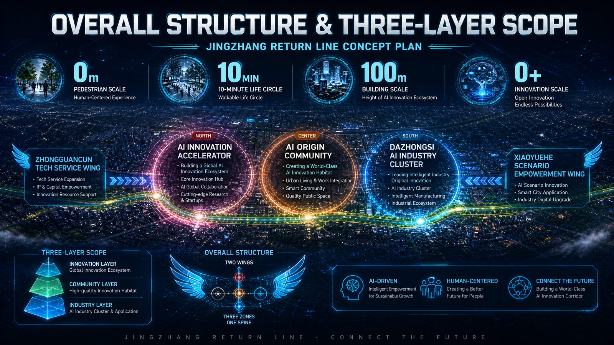
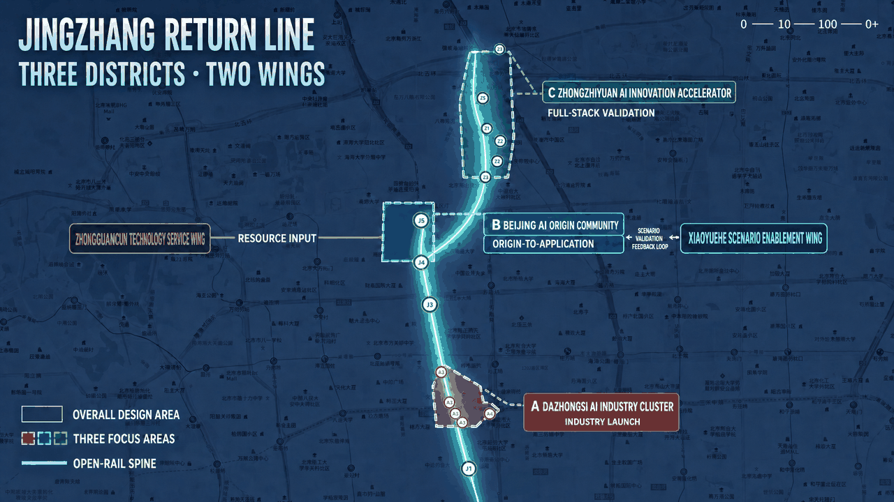
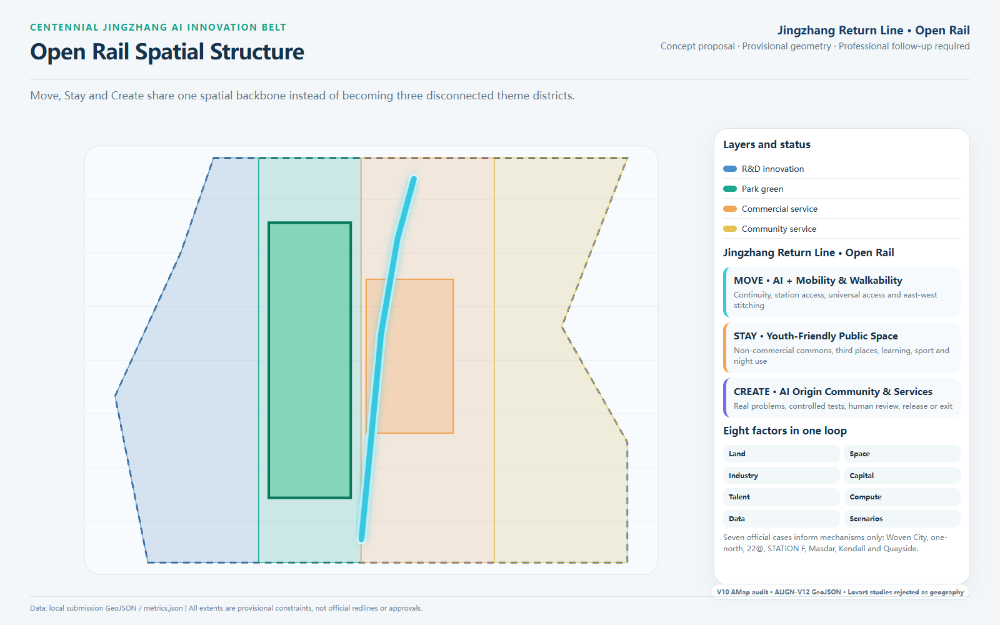
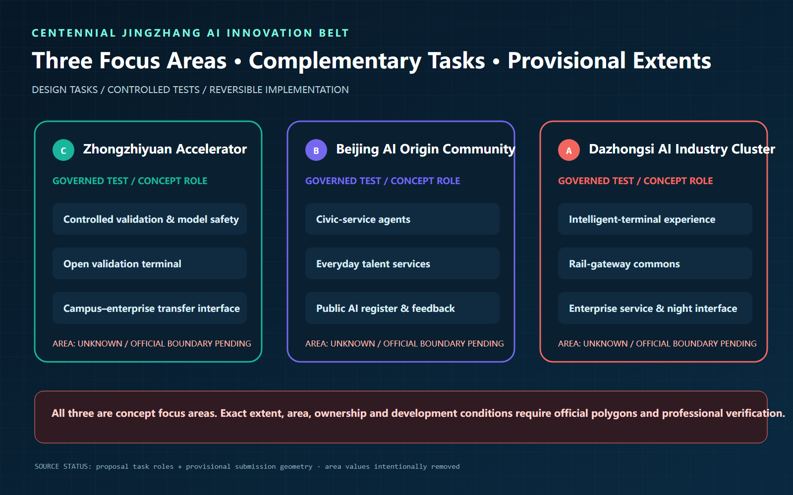
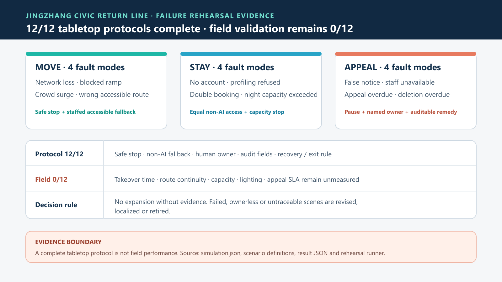
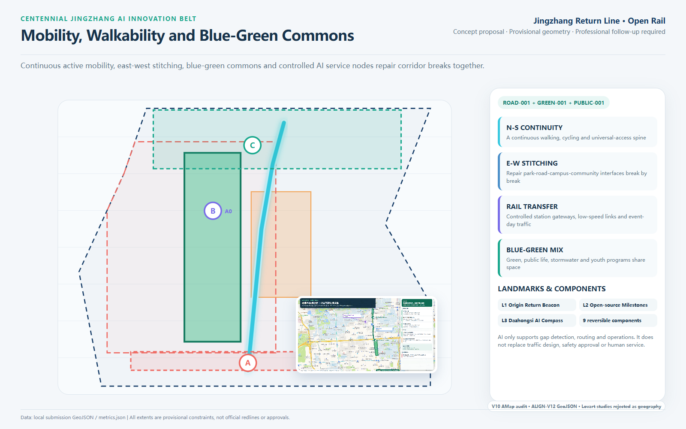
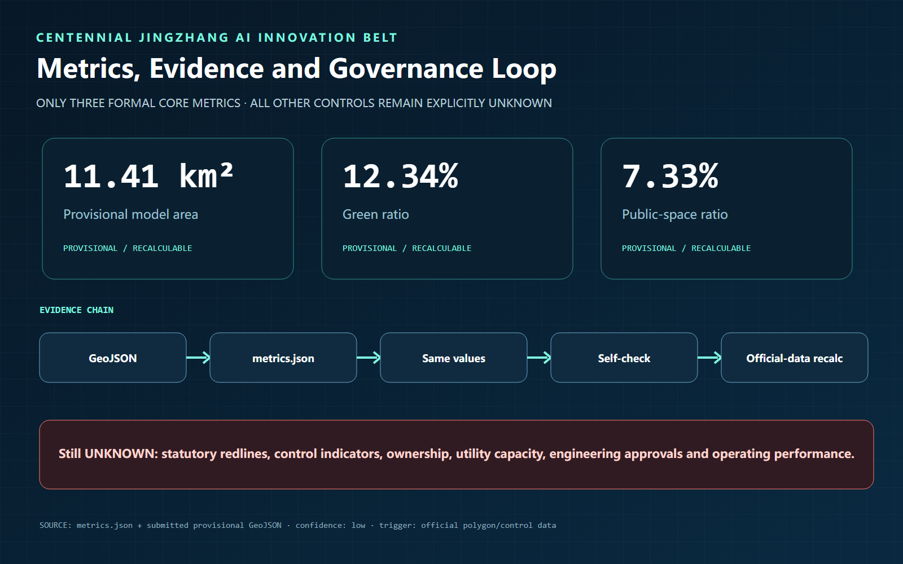

# Centennial Jing-Zhang AI Innovation Belt: Jing-Zhang Return Line

- Main concept: Jing-Zhang Return Line
- Spatial strategy: Open Rail
- Submission identity: GitHub `muuttaa`; project co-design Agent "Cen Zhou"

This proposal treats the Jing-Zhang Railway as more than a historical artifact and AI as more than a district label. It proposes a civic innovation line that returns innovation from closed campuses to streets, young people from spectators to co-builders, and technology from demonstrations to accountable everyday services.

*The cover provides the first visual statement for “0–10–100–0+” and the Three Areas–Two Wings loop. It is not map, boundary, scale, official naming or engineering evidence; spatial claims remain controlled by the position maps, GeoJSON and structured data below [source:GEN-COVER-20260901].*

## Design Basis and Source List

The open-call announcement and Agent Taskbook define the assignment [source:OFFICIAL-ANNOUNCEMENT] [source:AGENT-TASKBOOK], while the Source Registry constrains the use of public, background and provisional material [source:SOURCE-REGISTRY]. Every spatial claim is represented in GeoJSON, every calculable value in `metrics.json`, and unconfirmed statutory planning, ownership, infrastructure and heritage conditions remain `unknown`.

The current Overall Design Area uses a Provisional Boundary [data:geometry/site_boundary.geojson#SITE-001] and recalculates to approximately 11.41 square kilometres [metric:site_area_sqm]. It supports conceptual design, recalculation and discussion only; it is not an Official Planning Boundary or approval. When official polygons are released, all nine GeoJSON layers, metrics, figures and drawings must be recalculated together.

*The overall-structure figure overlays the Open-Rail spine, Three Districts–Two Wings and the “0—10—100—0+” return mechanism on an AMap context. It supports relationship checking, not statutory boundaries, precise areas, ownership or engineering conditions [source:GEN-STRUCTURE-20260902].*

*This control map retains the attributed AMap GCJ-02 context and checks relative positions only. Study extents, community boundaries, ownership, statutory controls and engineering conditions remain provisional or unknown [source:AMAP-CONTEXT-BASEMAP] [source:DETERMINISTIC-MAP-SET-20260825]. Chinese labels are retained from the verified control figure to avoid introducing geographic changes during translation.*

## Three-Level Scope Framework

The three levels form one evidence chain from strategy to delivery, not three disconnected drawing sets [depth:three_level_scope_framework] [standard:PROJECT-OFFICIAL-ANNOUNCEMENT]:

| Level | Key question | Proposal deliverable |
| --- | --- | --- |
| Coordinated Research Area: `unknown`, pending an official extent file | How do Haidian's AI industry, talent and future city reinforce one another? | An innovation chain linking university origination, open-source collaboration, enterprise transfer, civic experience and international communication |
| Provisional master-design model: approximately 11.41 km2 | How do Urban Renewal, mobility, Blue-Green Space and services become spatial? | One Open Rail spine, east-west stitching interfaces and recalculable spatial layers |
| Three concept focus areas: area and statutory boundary both `unknown` | How do individual districts become deliverable projects? | Three kinds of innovation commons, ten scenario cards and near-, mid- and long-term project packages |

Key-area evidence is read from an independent layer [data:geometry/key_areas.geojson#PROV-KEY-001]. The rejected Beijing AI Origin rectangle has been deleted. The provisional study envelope used for machine validation now serves only file-structure and relative-position checks [data:geometry/key_areas.geojson#PROV-KEY-002]. Its area is no longer displayed, and it must not be interpreted as a community boundary, official limit or approved extent.

## Regional Collaboration Interfaces

The matrix separates officially documented existing capabilities from interfaces proposed by this design. Capability descriptions follow official public sources. Connections, role divisions and exchanged outputs are concept proposals; they do not claim signed, approved or established partnerships.

| Node | Officially documented capability base | Proposed Jingzhang output | Concept interface | Uncertainty |
| --- | --- | --- | --- | --- |
| ZGC AI North-Latitude Community [source:SRC-NORTH-LATITUDE] | AI-native firms and lightweight-team ecosystem | Problems, teams and early products enter bounded urban tests | Problem register—compliance screen—bounded pilot—public evaluation | No partnership confirmed; place and operations follow official records |
| Future Science City [source:SRC-FUTURE-SCIENCE] | Technology-innovation and transfer ecosystem | Specialist test demand and transferable results enter the open-validation chain | Topic list—proof of concept—two-way referral | No project agreement; specific capabilities require item-level verification |
| Huairou Science City [source:SRC-HUAIROU-SCIENCE] | Major science facilities and original-innovation platforms | Scientific questions, instrument demand and cross-disciplinary results become civic topics | Public facility capability—demand match—human review | Facility access conditions and data licences remain unknown |
| Beijing E-Town [source:SRC-BDA-INNOVATION] | Engineering validation, open scenarios and industrialisation | Mature test results connect to pilot-scale production, manufacturing and demonstrations | Test record—engineering assessment—scenario/industry referral | No existing cooperation claimed; admission, safety and commercial terms pending |
| Beijing–Tianjin–Hebei [source:SRC-JJJ-INNOVATION] | Cross-regional transfer, supply-demand matching and industrial-chain coordination | Replicable public-AI rules, test records and service components | Standard evidence pack—regional demand list—off-site retest | No delivery project claimed; cross-region compliance and accountable owner pending |

The matrix is not a partnership commitment. Implementation at any node requires a named accountable owner, written authorisation, data licence, pilot site, safety boundary and exit condition.

## Coordinated Research Area: Industry and Future City Research

The Jing-Zhang Return Line uses Open Rail as an organizing mechanism. A heritage and active-mobility spine connects three innovation anchors, while multiple AI-Enabled Scenarios enter campuses, enterprises, communities and transit gateways. MOVE, STAY and CREATE share the same backbone: MOVE delivers continuity, interchange and universal access; STAY supplies non-commercial youth commons; CREATE turns real urban problems into bounded tests, Human Review and public feedback.

This structure extends the industrial chain from office supply into an R&D, validation, service and communication network [depth:overall_spatial_structure]. Research and innovation, community service, commercial service and park green space are represented in the Land-Use Plan [data:geometry/land_use.geojson#LU-001], while everyday civic interfaces are represented in the Public Space layer [data:geometry/public_space.geojson#PUBLIC-001]. Global events, pilgrimage routes and branding remain Conceptual Recommendations, not confirmed government programs.

## Identity, Three Positions, and the Three-Areas-Two-Wings Loop

“Jingzhang Civic Return Line” is not a transport service name but a civic-value loop. Its short mark is **JZ·RETURN**, with the line “Return AI Capacity to Civic Life.” The naming family uses “Return + function”: Return Commons, Return Testbed, Return Marker, Return Week and Return Archive. The logo direction folds two parallel rail lines into an open letter J; the gap represents civic entry. No corporate mark, portrait or unlicensed typeface is used.

| Coordination layer | Definition | Verifiable output |
| --- | --- | --- |
| Three positions | Centennial Jingzhang cultural belt; urban AI life-experience belt; AI convergence-innovation belt | Heritage, civic experience and industry lines shown together |
| Five functions | Full-stack autonomy; world-class ecosystem; AI+ scenario enablement; intelligent active city; global AI-governance voice | A five-stage loop from R&D to public validation and rule-making |
| Three areas | Zhongzhiyuan validates the stack; AI Origin supports university-adjacent transfer and talent life; Dazhongsi supports AI-native business and international pitching | Each area has space, scenario, operator and stop conditions |
| Two wings | Zhongguancun Technology Services supplies IP, legal, capital and standards; Xiaoyuehe Scenario Enablement supplies real problems, experience and feedback | Eight inputs enter; evidence and public feedback return |

The loop is: university/R&D capability → Zhongzhiyuan stack validation → AI Origin team and service formation → Dazhongsi market and international interface → resource and scenario support from the two wings → public evaluation returned to R&D. Spatially this becomes one Open Rail, three innovation commons, two service wings and multiple reversible pilots. Operational protocols and scenario gates supplement land-use planning; they do not replace statutory planning.

## Overall Design Area: Urban Renewal and Regulatory-Plan-Level Urban Design

The overall structure combines one spine, three anchors, east-west stitching and multiple service points. The Open Rail spine provides north-south continuity; Zhongzhiyuan, Beijing AI Origin Community and Dazhongsi act as distinct anchors; gaps between roads, parks, campuses and communities are repaired one by one; enterprise, talent, public-AI registration and event services are distributed along the line.

Its differentiation does not depend on another closed landmark, but on a reversible civic-innovation mechanism. The spatial network supplies continuous interfaces, a service platform registers real scenarios, communities, universities and enterprises publish problems together, and the governance system uses Human Review to release, adjust or retire each intervention.

Reviewable objects include land use, Building Footprints, roads, green space, Public Space and phasing [standard:MOHURD-CONTROL-DETAILED-PLANNING]. Building footprints [data:geometry/buildings.geojson#BLDG-001], the walking and cycling spine [data:geometry/roads.geojson#ROAD-001], and footprint area [metric:building_footprint_area_sqm] are recalculable. Floor Area Ratio, Building Height, road redlines, setbacks and facility standards remain `unknown` without official controls.

## Detailed Design of Key Areas

The three key areas provide three complementary civic innovation interfaces [depth:three_key_area_detailed_design]:

| Key area | Positioning | Three priority spatial moves | Reversible 100-day pilot |
| --- | --- | --- | --- |
| Zhongzhiyuan AI Independent Innovation Acceleration Area | Garden-based full-stack innovation district | Open validation terminal, open-source test yard, campus-enterprise transfer interface | Public test days and standards-governance display |
| Beijing AI Origin Community | University-adjacent transfer and talent community | Civic innovation living room, everyday talent services, public-AI register and feedback | Operate a service prototype; locate it only after the official polygon arrives |
| Dazhongsi AI Industry Cluster | Transit-gateway intelligent-economy district | Rail-gateway commons, enterprise-service stage, night public-life interface | Four-quadrant walkability audit and pitch commons |

Zhongzhiyuan uses a provisional extent [data:geometry/key_areas.geojson#PROV-KEY-001]; AI Origin uses a non-displayed area-equivalent study envelope [data:geometry/key_areas.geojson#PROV-KEY-002]; Dazhongsi uses a provisional extent [data:geometry/key_areas.geojson#PROV-KEY-003]. All three require professional development after boundaries, ownership, transport and engineering conditions are confirmed.

The following three controlled maps move each Key Area from a task table to a reviewable spatial proposition. Chinese map labels are retained from the verified originals; the English keys are Zhongzhiyuan AI Independent Innovation Acceleration Area, Beijing AI Origin Community, and Dazhongsi AI Industry Cluster. Study lines, extents and strategies do not replace official polygons, ownership, road redlines or engineering design [source:DETERMINISTIC-MAP-SET-20260825].

## AI Innovation Ecosystem, Personas, and AI+ Scenarios

### Global Innovation Cases and the Eight-Factor Ecosystem

The comparison extracts only published mechanisms; it neither copies form nor transfers case-scale promises:

| Global case | Transferable mechanism | Jingzhang translation | Risk to avoid |
| --- | --- | --- | --- |
| Toyota Woven City, Japan | Weavers and Inventors conduct phased tests in real life | A problem–bounded test–feedback–exit protocol | Turning a public district into a closed corporate test city [source:CASE-WOVEN-CITY] |
| one-north / LaunchPad, Singapore | Work, life, learning, accelerators and capital are co-located | A one-stop professional-service wing plus weak-tie public space | Presenting recruitment outcomes as committed [source:CASE-ONE-NORTH] |
| 22@ Barcelona, Spain | Productive renewal advances with transit, green and culture | Rail-industrial space becomes a production-life-culture interface | Office monoculture and displacement [source:CASE-22BARCELONA] |
| STATION F, France | Multiple partner programs share one startup infrastructure | Tiered entry from public experience to acceleration | An elite club with no civic threshold [source:CASE-STATION-F] |
| Masdar City, UAE | Free zone, R&D, firms and sustainable urban testing form a cluster | Full-stack validation displayed with low-carbon performance | Hiding operating cost behind technology display [source:CASE-MASDAR] |
| Kendall Square, USA | Innovation is paired with connected public space and community facilities | Bring invention from buildings into public life | Industry value eroding civic access [source:CASE-KENDALL] |
| Quayside, Toronto | Digital governance, privacy and independent review were publicly debated | Public-interest, minimization and exit review before data collection | Using “smart city” language to bypass governance [source:CASE-QUAYSIDE] |

Eight inputs feed three auditable outputs. Land uses temporary, shared and reversible-use proposals; space offers labs, commons, streets and parks; industry links foundation models, agents, terminals and professional services; capital is suggested as milestone-based competition without fiscal commitment; talent connects students, developers, founders, professionals and residents; compute uses authorized edge–campus–cloud tiers; data requires a catalogue, consent, purpose limits, audit and deletion; scenarios enter through a public problem register. Outputs must include reproducible technical evidence, a service the public can understand, and a standard or contract template that professionals can develop further.

Zhongzhiyuan performs full-stack and safety validation; AI Origin supports team formation, talent life and civic service; Xiaoyuehe supplies problems and feedback; Zhongguancun Technology Services supplies IP, legal, capital, standards and international interfaces; Dazhongsi supports product display, market contact and international conversion. All allocations remain proposals subject to future responsible-party approval.

### Five Personas, Three Validation Scenes, and Ten Scenario Cards

| Persona | Core task | Essential spatial need | Harm to prevent |
| --- | --- | --- | --- |
| Open-source developer | Find problems, collaborators, compute and visibility | Short-use workspace, test interface and safe night access | Uncredited work or forced behaviour tracking |
| Start-up team | Move from prototype to compliant validation and a first user | IP/legal/finance clinic and bookable test space | Marketing a pilot as public procurement |
| University community | Learning, research, transfer and civic practice | Continuous campus–park–Origin route | Unclear rights and ownership of outcomes |
| Resident and local youth | Rest, learn, exercise and publish real problems | Non-commercial stay, accessibility, feedback and exit | Surveillance or events displacing daily park life |
| Enterprise/international visitor | See credible capability and find a partner | Auditable cases, bilingual guidance and professional matching | Stage effects without an evidence chain |

Three industry-validation scenes use limited scope, fixed time, a named owner, Human Review and a one-step stop. T1, Zhongzhiyuan Full-Stack and Model Safety, outputs red-team records, limits and an exit report. T2, AI Origin Civic-Service Agent, uses authorized problem tickets only and outputs correction, appeal and service-improvement records. T3, Dazhongsi Intelligent Terminal Experience, tests accessibility, misuse and public safety; it cannot become routine operation without professional review.

| Scenario card | User–space–operation | Data and Human Review boundary |
| --- | --- | --- |
| 01 Open-source release hall | Developers; Origin Building civic floor; community desk | Voluntary submissions only; contributors may withdraw |
| 02 Full-stack safety sandbox T1 | R&D teams; controlled Zhongzhiyuan room; third-party evaluator | Isolated data, red-team audit trail, safety-owner release |
| 03 Civic-service agent T2 | Residents/youth; AI Origin service station; human desk | No automated medical, legal or welfare decisions |
| 04 AI walkability and accessibility | Everyone; park–Wudaokou route; park/transport partners | Anonymous issue points; no face tracking |
| 05 Intelligent-terminal experience T3 | Visitors/firms; Dazhongsi commons; device owner | Test status visible; anomaly stops operation |
| 06 Qinghe low-carbon corridor | Students/residents; Qinghe interface; ecology operator | Aggregated environmental data only |
| 07 University-adjacent transfer clinic | University teams; AI Origin; professional alliance | IP, legal and finance records separately authorized |
| 08 Data-governance meeting room | Firms/researchers; Dazhongsi; neutral auditor | Authorized, auditable and deletable flows only |
| 09 Youth night commons | Youth/residents; heritage-park node; community co-management | No purchase threshold; protect quiet hours |
| 10 Global AI Return Week | Global visitors; three areas and Open Rail; temporary committee | Separate event, capacity and safety approval |

The Urban Agent supports gap detection, routing, facility maintenance and service organization only. It does not replace planning approval, transport design, safety responsibility or person-to-person Public Services. Public Space [data:geometry/public_space.geojson#PUBLIC-001], mobility [data:geometry/roads.geojson#ROAD-001] and Blue-Green Space [data:geometry/green_space.geojson#GREEN-001] carry service, movement and environmental scenarios, checked against the Public Space ratio [metric:public_space_ratio] and green-space ratio [metric:green_ratio].

### 100-Day Public-Value Decision Contract and Everyday Journeys

The 100-day pilot is not accepted by counting deployed AI. Six public-value measures decide whether a scene continues, is revised or exits. All six field-performance measures remain `not_run`; no measured performance is claimed. Days 0–14 establish staffed-service baselines, responsible roles and measurement methods. Days 15–45 open minimum reversible units. Days 46–90 conduct public review. Days 91–100 complete return acceptance and the continue/revise/exit decision [data:simulation.json#PUBLIC-VALUE-CONTRACT] [depth:phasing_implementation].

| Decision measure | Provisional target | Immediate stop condition | Recovery or exit requirement |
| --- | --- | --- | --- |
| Public-notice completeness | 100% of scenes disclose purpose, data, owner, staffed channel and exit date | Any active scene has incomplete notice | Stay off until disclosure and Human Review are complete |
| Non-AI equivalent service retention | 100% of scenes retain a no-login, no-smart-device completion path | Any basic civic task can be completed only through AI | Restore the staffed path or exit |
| Priority accessible-route completion | 100% completion on field-audited routes | A critical tactile, ramp or clear-width obstruction | Restore continuous access before restart is discussed |
| Human-takeover P95 | Provisional target at or below 5 minutes, calibrated after baseline | Above 10 minutes or no named staff owner | Rehearse and pass takeover review before restart |
| First appeal response | Provisional target at or below 24 hours | Safety or rights appeal unanswered for more than 48 hours | Publish disposition; repeated failure triggers exit |
| Site-return acceptance | Ordinary use restored within 72 hours after pilot closure | Equipment, accounts or data overstay the public-space licence | Remove, delete and obtain staffed return acceptance |

Three everyday journeys test the contract instead of demonstrating only successful AI use. A visually impaired commuter must complete the interchange without an account or smart device. A young user may book non-commercial space while refusing profiling and recommendations. A resident who sees a false notice must find a staffed desk, submit an appeal, see the scene pause and continue using the same public space after removal. Every failed journey must retain cause, responsibility, remedy and retest evidence. `self_check.json` proves package compliance only; it is not future field evidence.

On 2026-08-27, the three journeys completed twelve offline tabletop failure rehearsals: network loss, blocked ramp, crowd surge, wrong accessible route, no account, profiling refusal, double booking, night-capacity exceedance, false public notice, staff absence, overdue appeal and overdue data deletion. All 12/12 scenarios specify a safe stop, non-AI fallback, human owner, audit fields and recovery/exit condition. Operational or field validation remains 0/12: takeover time, appeal response, accessible routes and site return have not been measured and must not be presented as achieved [data:simulation.json].

The real baseline uses three transects: Zhongzhiyuan–Xuezhiyuan Station–Qinghe interface; Wudaokou–Chengfu Road–AI Origin Building D interface; and Dazhongsi Station–Jimen parking area–Jing-Zhang Park interface. Weekday and weekend observations are planned for morning, noon, evening and night, using one continuous 20-minute sample per slot, for 24 planned samples. Every row remains `field_not_collected` until original photographs, WGS84 coordinates, time, observer and file SHA-256 can be traced [data:simulation.json].

The team also holds 499 WeChat-transferred field photographs, reduced by hash to 495 unique images and assembled into the three contact sheets below. They evidence that a field visit occurred and record campus interiors, the AI Origin surroundings, crossings, barriers, park conditions and day–night visual context. The transferred files have no readable EXIF time or GPS, so they remain “field visual evidence,” do not count toward the 24 structured samples, and leave `field_collected_count` at 0 [source:FIELD-PHOTO-AUDIT-20260831].

## Land Use, Building Scale, and Retain-Renovate-Demolish Strategy

The Land-Use Plan follows the public classification standard [standard:MNR-LAND-USE-CLASSIFICATION-GUIDE] and currently represents directional units for R&D innovation, park green, commercial service and community service [data:geometry/land_use.geojson#LU-001]. The building layer contains provisional footprints only [data:geometry/buildings.geojson#BLDG-001]; it does not invent Demolish-Renovate-Retain decisions without survey, ownership and statutory-plan evidence.

Professional development follows a value, safety, carbon and operation test. Assets with heritage or use value and safe access are retained first; structurally useful assets with weak interfaces or energy performance are renovated; demolition or new construction requires ownership, structural, carbon and Public Interest review [depth:retain_renovate_demolish]. Scale, Floor Area Ratio, Building Height and Building Coverage Ratio remain `unknown` until official controls arrive.

## Transport, Rail, Municipal Infrastructure, and Public Services

The mobility strategy repairs everyday links first. A continuous north-south walking, cycling and universal-access spine is paired with east-west stitching between parks, roads, campuses and communities. Transit gateways organize walking transfers, bicycle parking and controlled event-day traffic [depth:traffic_rail_slow_parking] [data:geometry/roads.geojson#ROAD-001]. Routes and Public Space nodes are checked together [data:geometry/public_space.geojson#PUBLIC-001].

Municipal and New Infrastructure includes edge computing, distributed energy, low-intrusion sensing and talent-service interfaces, conditional on energy, drainage, fire, network and safety requirements [data:geometry/constraints.geojson#CONSTRAINTS]. Without official utilities and road redlines, the proposal defines service logic and candidate nodes rather than engineering locations.

## Blue-Green Network, Public Space, and Urban Character

Jing-Zhang Railway Heritage Park is the civic-life spine, not a project backside. Green space, stormwater, walking and cycling, youth activity, innovation display and everyday rest are organized as a shared system [depth:blue_green_public_space] [data:geometry/green_space.geojson#GREEN-001] [data:geometry/public_space.geojson#PUBLIC-001], prioritizing ring-road crossings, park ends and east-west interfaces.

Urban Character combines the restraint, clarity and legibility of railway-industrial heritage with Zhongguancun's open, collaborative and iterative innovation culture. Wayfinding, contribution walls and public art use rights-cleared material only. Any intervention near protected assets such as Qinghuayuan Station waits for official conservation requirements [standard:MOHURD-URBAN-DESIGN-MEASURES].

## Three Pilgrimage Landmarks, an Honor System, and a Component Kit

“Pilgrimage” means respect for verifiable contribution, not giant social-media objects. L1, Origin Return Beacon, uses a removable light band at the Origin Building civic interface to show Problem / Testing / Human Review / Closed. L2, Open-Source Milestones, places low, foundation-free contribution markers along the heritage park. L3, Dazhongsi AI Compass, explains evidence, partnership routes and risk status in two languages. All are candidate, reversible installations subject to ownership, heritage, green-space and safety approval.

The honor system records open-source code, civic problems, validation evidence and long-term maintenance—not corporate advertising. Each record carries an authorized contributor name, version, source, review state and exit date. The online archive is primary; physical space shows authorized summaries only. The component kit includes bilingual markers, accessible information posts, moveable seating, time-shared shade, low-level power/network boxes, test-state lights, privacy notices, bookable micro-stages and quiet interfaces. Components are repairable and removable and assume no utility capacity.

## Four-Act Cultural Route and Bilingual Wayfinding

Act I, “The railway brought distant places to Beijing,” explains Jingzhang engineering and connection. Act II, “Zhongguancun turned knowledge into industry,” explains openness and iteration. Act III, “AI returns capability to everyday life,” interprets ten governed scenarios. Act IV, “Everyone leaves a traceable contribution,” frames the future as shared maintenance rather than tech decoration. Heritage facts rely on public sources; protected locations and exhibition content require specialist verification.

Wayfinding separates the overall JZ·RETURN brand, the RAIL/CODE/CIVIC cultural-route layer and the IDEA/TEST/REVIEW/OPEN/STOP scenario-state layer. Chinese carries local narrative; English uses short action phrases. International copy: **A century-old railway becomes a civic test line for accountable AI—where invention returns to everyday life, and every experiment remains open to human review.**

## Annual Events, Developer Community, and Conversion Pathway

| Rhythm | Event brand | Required output | Exit/review |
| --- | --- | --- | --- |
| Monthly | Return Clinic | Public problem tickets, service bookings, scenario candidates | No owner, no test |
| Quarterly | Open Track Sprint | One to three bounded prototypes, risks and public-use records | Failed safety/privacy review stops the test |
| Semi-annual | Civic Model Review | Red-team report, accessibility audit and response to residents | Publish unresolved issues and corrections |
| Annual | Jingzhang Return Week | Three-area open days, open-source release, international pitch and rail-culture route | No claim of investment or policy delivery; publish an evidence archive |

The developer loop is public problem register → maintainer matching → test booking → Human Review → version archive. Scenario opening uses six gates: application, ethics/privacy, spatial safety, bounded test, public feedback, then continue/modify/exit. Conversion proceeds visitor → problem contributor → sprint participant → maintainer or start-up → governed pilot → professional procurement/investment due diligence → long-term operator. Each step has a next owner and stop condition; event attention is not counted as implementation.

## Renewal Projects, Implementation Policy, and Phasing

Delivery begins with reversible, measurable projects that build working relationships, not wholesale demolition [depth:renewal_project_list] [depth:phasing_implementation] [data:geometry/phasing.geojson#PHASE-001].

| Phase | Project package | Responsible collaboration | Release gate |
| --- | --- | --- | --- |
| Near term, 100-day pilots | Mobility-gap register, civic innovation living room, youth co-creation rights, public-AI register prototype | Subdistrict or park, universities, communities and professional teams | Safety review complete, public feedback available, installations reversible |
| Mid term, key-area interfaces | Zhongzhiyuan validation terminal, AI Origin daily services, Dazhongsi rail-gateway commons | Planning and transport departments, rightsholders and operators | Official boundaries, ownership, transport and infrastructure confirmed |
| Long term, civic innovation commons | Member alliance, neutral operator, annual global program, public evaluation and exit | Shared governance among government, enterprises, universities and communities | Annual metrics disclosed; weak or high-risk scenarios retired |

Core projects are JZ-01 mobility-gap stitching, JZ-02 Qinghe innovation interface, JZ-03 university-adjacent transfer street, JZ-04 Dazhongsi four-quadrant walking links, JZ-05 civic service and edge-compute nodes, and JZ-06 global AI event route. One hundred days is a pilot cycle, not a construction promise.

## Metrics, Area Recalculation, and Compliance Matrix

Metrics are managed in three groups [depth:metrics_recalculation]: geometry-derived metrics are recalculated directly; statutory controls wait for official material; operational performance is measured through real pilots. Formal visuals retain only three recalculable core values: a provisional master-design model of approximately 11.41 km2 [metric:site_area_sqm], a green ratio of approximately 12.34% [metric:green_ratio], and a public-space ratio of approximately 7.33% [metric:public_space_ratio]. They are low-confidence design quantities derived from provisional geometry, not approved controls. Other areas, population, investment, schedules, line lengths and engineering conclusions are not presented as proposal facts.

Each key claim connects source, narrative, layer, metric, figure and self-check. `compliance_matrix.json` covers the announcement and Agent tasks, `standard_matrix.json` records the limits of applicable standards, and `design_depth_matrix.json` manages professional depth so reviewers can recalculate, trace and request changes.

## Risk, Copyright, and Compliance

Principal risks are misreading provisional boundaries, missing statutory plans and ownership, cross-disciplinary delivery complexity, technology maturity, privacy and public acceptance. The constraints layer and missing-data register manage them together [depth:risk_missing_data] [data:geometry/constraints.geojson#CONSTRAINTS] [source:SITE-PACKAGE]. Claims involving official polygons, plans, road redlines, utilities, fire safety, heritage or delivery bodies remain pending.

AI output is not represented as site photography, public opinion, an Official Boundary or a government commitment. Personal data follows minimization principles, and public-AI scenarios retain Human Review, appeal and exit. Figures derive from local GeoJSON and project text; they load no remote maps, fonts, scripts, iframes, forms or external APIs. Asset provenance, licensing and authorization are recorded in `sources.json` and `report/copyright_statement.md`.

## References

- `brief/public-brief.md`
- `brief/site-package/design_brief.json`
- `brief/site-package/allowed_design_space.json`
- `data/processed/agent_fact_pack.md`
- `data/processed/project_scope_summary.csv`
- `data/processed/agent_task_requirements.csv`
- `data/processed/source_use_matrix.csv`
- `data/processed/missing_data_checklist.csv`
- Full provenance, licensing and use boundaries are recorded in the structured Source Registry [source:SITE-PACKAGE]
