# 百年京张AI创新带：京张回程线

- 主概念：京张回程线
- 空间策略：开放轨道
- 投稿身份：GitHub `muuttaa`；项目协作 Agent“岑舟”

本方案不把京张铁路只当作一条历史遗迹，也不把 AI 只当作园区标签。我们提出一条能“返回”城市日常的公共创新线路：让创新从封闭园区返回街道，让青年从旁观者返回共同建设者，让技术从演示返回可监督的真实服务。

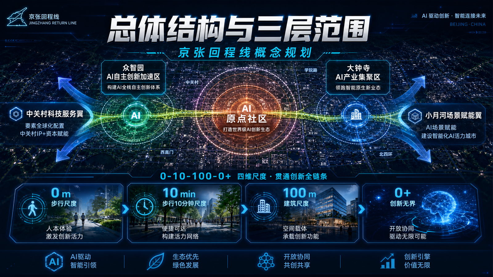

*封面用于表达“0—10—100—0+、三区两翼”的总体叙事与第一视觉，不作为地图、边界、比例尺、正式名称或工程证据；空间判断仍以下方位置控制图、GeoJSON 与结构化数据为准 [source:GEN-COVER-20260901]。*

## 设计依据与资料清单

方案以公开征集公告和面向智能体任务书为任务依据 [source:OFFICIAL-ANNOUNCEMENT] [source:AGENT-TASKBOOK]，以来源登记表约束公开、背景和临时资料的用途 [source:SOURCE-REGISTRY]。所有空间结论落到 GeoJSON，所有可计算数值落到 `metrics.json`，所有无法确认的控规、权属、市政和文保条件保持 `unknown`。

当前总体设计范围来自临时边界 [data:geometry/site_boundary.geojson#SITE-001]，复算面积约 11.41 平方公里 [metric:site_area_sqm]。它只支持概念设计、复算和讨论，不代表官方红线或审批结论；正式 polygon 发布后，九层 GeoJSON、指标、图件和图纸应整体重算。

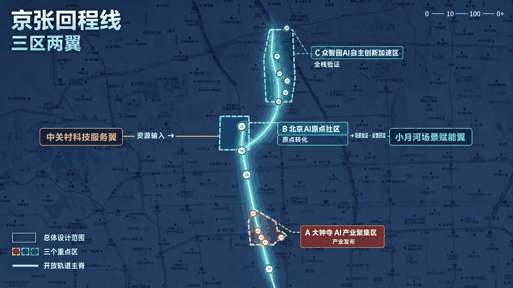

*总体结构图在高德地图语境上叠加开放轨道主脊、三区两翼和“0—10—100—0+”回程机制；它用于核对结构关系，不替代法定边界、精确面积、权属或工程条件 [source:GEN-STRUCTURE-20260902]。*

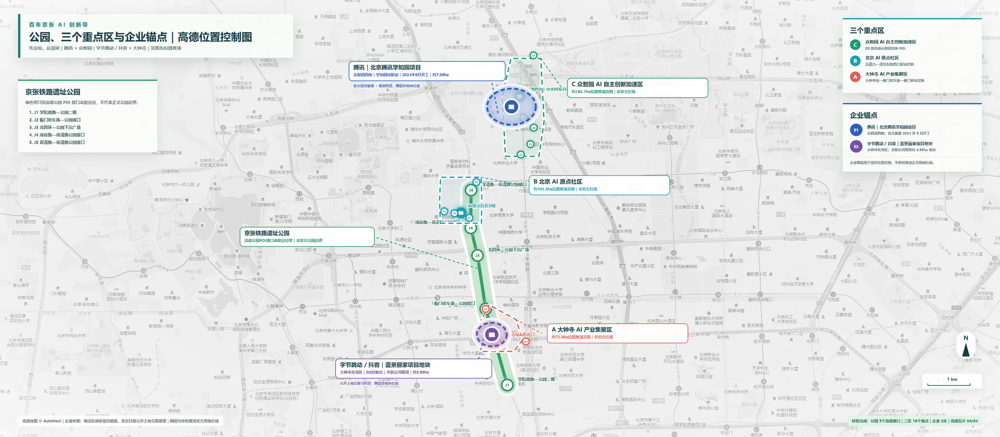

*位置控制图保留高德底图署名与 GCJ-02 语境，只核验公园、三处重点区和企业锚点的相对位置；研究范围、社区边界、权属、控规和工程条件仍为临时或未知 [source:AMAP-CONTEXT-BASEMAP] [source:DETERMINISTIC-MAP-SET-20260825]。*

## 三层范围工作框架

三层范围不是三套互不相干的图纸，而是一条从战略到实施的证据链 [depth:three_level_scope_framework] [standard:PROJECT-OFFICIAL-ANNOUNCEMENT]：

| 层级 | 关键问题 | 本方案交付 |
| --- | --- | --- |
| 统筹研究范围：`unknown`，待官方范围文件 | 海淀 AI 产业、人才和未来城市如何协同 | “高校策源—开源协作—企业转化—公共体验—国际传播”创新链 |
| 临时总体设计模型：约11.41平方公里 | 城市更新、交通、蓝绿和服务如何落图 | 一条开放轨道主脊、东西缝合接口和可复算空间图层 |
| 三处概念重点区域：面积和法定边界均为 `unknown` | 具体片区如何形成可实施项目 | 三类创新客厅、十个场景卡和近期—中期—长期项目包 |

重点区证据从独立图层读取 [data:geometry/key_areas.geojson#PROV-KEY-001]。北京 AI 原点社区旧临时矩形已删除；机器校验使用的临时研究包络只维持文件结构和相对位置检查 [data:geometry/key_areas.geojson#PROV-KEY-002]。图纸不再显示其面积，也不得把它解释为社区边界、官方四至或审定范围。

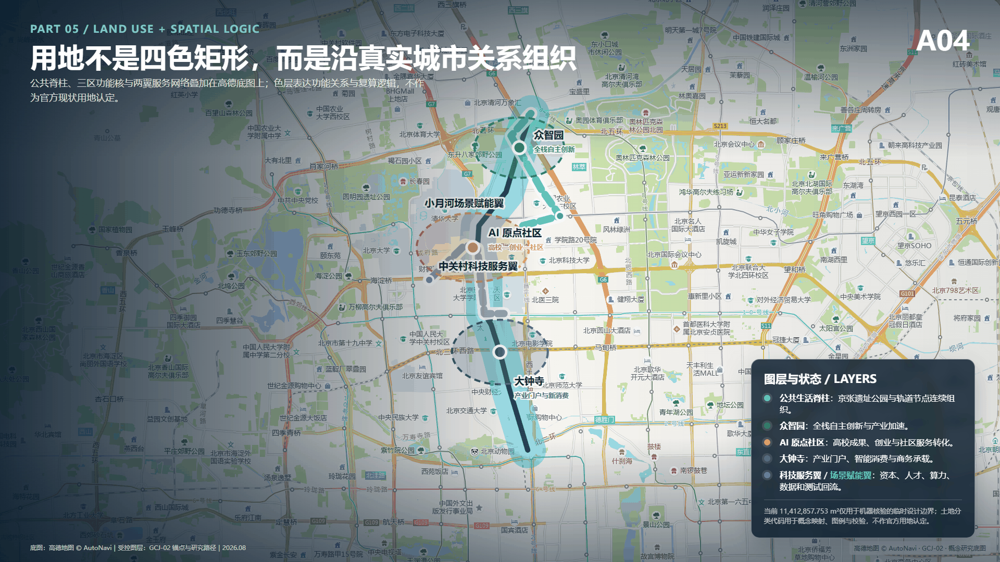

## 区域协同接口

下表把“公开可核验的既有能力”与“本方案提出的协同接口”分开。能力描述来自官方公开资料；连接方式、任务分工和输出交换均为概念建议，不表示已经签约、获批或建立合作。

| 节点 | 官方公开能力底座 | 本方案拟议输出 | 概念协同接口 | 不确定性 |
| --- | --- | --- | --- | --- |
| 中关村 AI 北纬社区 [source:SRC-NORTH-LATITUDE] | AI 原生企业与轻量团队生态 | 需求、团队与早期产品进入受控街区测试 | 问题登记—合规筛选—限定试点—公共评价 | 合作关系未确认；空间与运营以官方资料为准 |
| 未来科学城 [source:SRC-FUTURE-SCIENCE] | 技术创新与成果转化生态 | 专业测试需求与可转化成果进入开放验证链 | 课题清单—概念验证—双向转介 | 无项目级协议；具体技术能力需逐项核验 |
| 怀柔科学城 [source:SRC-HUAIROU-SCIENCE] | 重大科技基础设施与原始创新平台 | 科学问题、仪器需求与交叉研究成果形成城市议题 | 公开设施能力—需求匹配—人工评审 | 设施开放条件与数据许可未知 |
| 北京经开区 [source:SRC-BDA-INNOVATION] | 工程化验证、场景开放与成果产业化 | 成熟试验结果衔接中试、制造和示范应用 | 验证记录—工程评估—场景/产业转介 | 不主张现有合作；准入、安全与商业条件待定 |
| 京津冀 [source:SRC-JJJ-INNOVATION] | 跨区域成果转化、供需对接与产业链协同 | 可复制的公共 AI 规范、测试记录与服务组件 | 标准化证据包—区域需求清单—异地复验 | 不主张落地项目；跨域合规与责任主体待定 |

该矩阵不是合作承诺。任何节点进入实施前，都必须补齐具名责任主体、书面授权、数据许可、试点场地、安全边界与退出条件。

## 统筹研究范围产业与未来城市研究

“京张回程线”以开放轨道为组织机制：一条遗产与慢行主脊连接三处创新锚点，多处 AI+ 场景嵌入校园、企业、社区和轨道门户。“行—留—创”共享同一空间骨架：行，解决连续慢行、接驳和无障碍；留，提供非消费型青年公共空间；创，把真实城市问题转成受控测试、人工复核和公开反馈。

这套结构把产业链从单一办公载体扩展为“研发—验证—服务—传播”网络 [depth:overall_spatial_structure]。科研创新、社区服务、商业服务和公园绿地在用地层表达 [data:geometry/land_use.geojson#LU-001]，日常公共接口在公共空间层表达 [data:geometry/public_space.geojson#PUBLIC-001]。全球活动、朝圣路线和品牌传播均为概念建议，不声称政府已经确定实施。

## 品牌识别、三大定位与三区两翼协同

主名称“京张回程线”不是交通线路名称，而是一套公共价值回路；英文名为 **Jingzhang Civic Return Line**，短标识为 **JZ·RETURN**，口号为“让产业能力回到公共生活 / Return AI Capacity to Civic Life”。命名体系统一使用“回程 + 功能”：回程客厅、回程试场、回程路标、回程周和回程档案。Logo 方向以两条平行轨迹折返形成开放的字母 J，缺口代表公众入口；不使用企业商标、人物形象或未授权字体。

| 统筹层 | 本方案定义 | 可验证输出 |
| --- | --- | --- |
| 三大定位 | 百年京张文化带、都市 AI 生活体验带、AI 融合创新带 | 遗产叙事线、公共体验线、产业协同线三线同图 |
| 五大功能 | 全栈自主创新、世界级创新生态、AI+场景赋能、智能活力城市、AI治理话语权 | 从研发到公共验证、再到规则沉淀的五段闭环 |
| 三区 | 众智园做全栈验证；原点社区做近校转化与人才生活；大钟寺做智能原生商务和国际路演 | 三处重点区各有空间、场景、运营和退出条件 |
| 两翼 | 中关村科技服务翼提供知识产权、法务、资本和标准接口；小月河场景赋能翼提供真实问题、公共体验和反馈 | 八要素资源进入，场景证据和公共反馈返回 |

协同回路为：“高校/研发提出能力 → 众智园验证底座 → 原点社区形成团队与服务 → 大钟寺接入市场和国际合作 → 两翼补充要素与真实场景 → 公开评估返回研发端”。空间上形成“一条开放轨道、三处创新客厅、两翼服务接口、多个可逆试点”；规划上以运营协议和场景准入补充传统用地分区，不替代法定规划。

## 总体设计范围城市更新与控规深度城市设计

总体设计采用“一脊、三核、横向缝合、多点服务”的结构：开放轨道主脊贯通南北；众智园、北京 AI 原点社区和大钟寺形成差异化锚点；道路、公园、校园和社区之间的横向断点逐项修复；企业服务、人才服务、公共 AI 登记和活动节点沿线布置。

差异化不依赖再造一个封闭地标，而在于一套可退出的公共创新机制：空间网络提供连续界面，服务平台登记真实场景，社区、高校和企业共同提出问题，治理体系通过人工复核决定放行、调整或退出。

可审查对象包括用地、建筑基底、道路、绿地、公共空间和分期 [standard:MOHURD-CONTROL-DETAILED-PLANNING]。建筑基底 [data:geometry/buildings.geojson#BLDG-001]、慢行主脊 [data:geometry/roads.geojson#ROAD-001] 与建筑基底面积 [metric:building_footprint_area_sqm] 可复算；容积率、建筑高度、道路红线、退线和设施标准缺少正式依据，保持 `unknown`，不以推测值制造精确感。

## 重点区域详细设计

三处重点区域对应三种互补的公共创新接口 [depth:three_key_area_detailed_design]：

| 重点区域 | 定位 | 三个优先空间动作 | 100天可逆试点 |
| --- | --- | --- | --- |
| 众智园 AI 自主创新加速区 | 花园型全栈自主创新街区 | 开放验证终端、开源测试场、高校—企业转化接口 | 公开测试日与标准治理展示 |
| 北京 AI 原点社区 | 近校型成果转化与人才社区 | 公共创新客厅、人才日常服务、公共 AI 登记与反馈 | 先做运营原型；位置待官方 polygon |
| 大钟寺 AI 产业聚集区 | 轨道门户型智能经济街区 | 轨道门户客厅、企业服务舞台、夜间公共生活接口 | 四象限步行审计与路演客厅 |

众智园采用临时范围 [data:geometry/key_areas.geojson#PROV-KEY-001]；原点社区采用不出图的等面积研究包络 [data:geometry/key_areas.geojson#PROV-KEY-002]；大钟寺采用临时范围 [data:geometry/key_areas.geojson#PROV-KEY-003]。三者均需在正式边界、权属、交通和工程条件到位后深化。

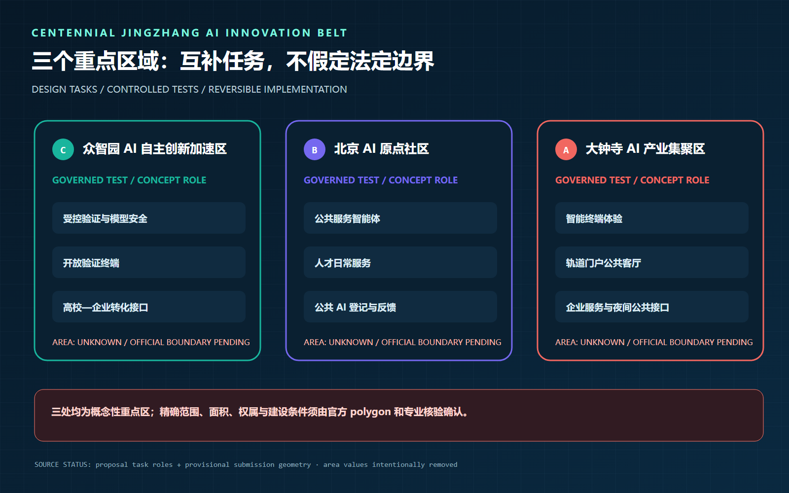

下列三张位置控制图把“重点区域”从任务表推进到可审查的空间落位；图上的研究线位、范围和策略均为方案表达，不替代官方 polygon、权属红线、道路红线或工程设计 [source:DETERMINISTIC-MAP-SET-20260825]。

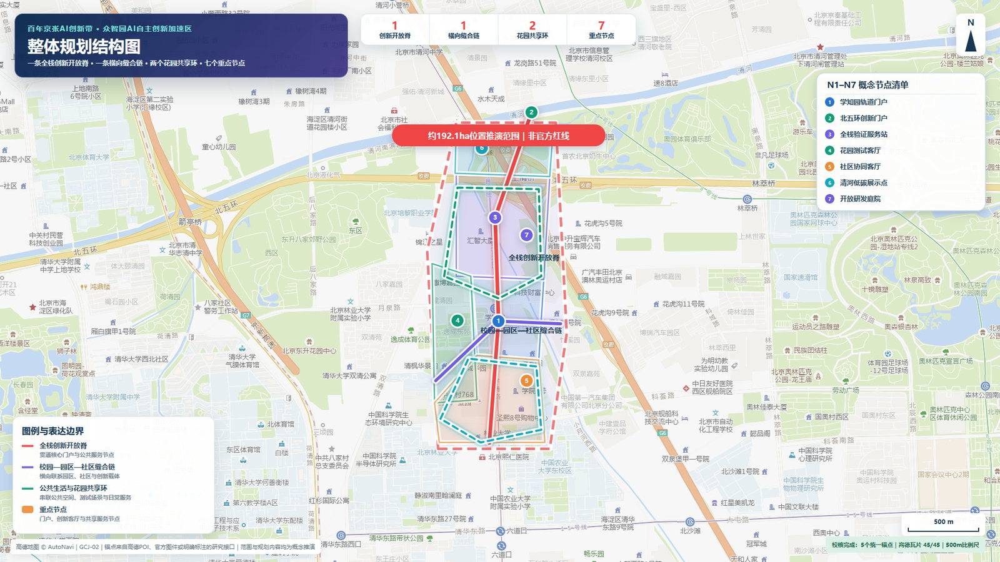

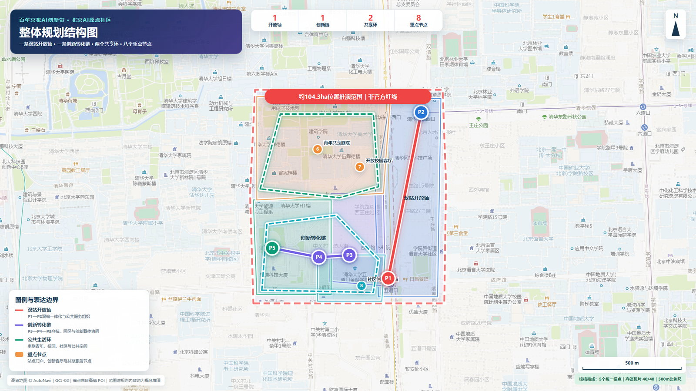

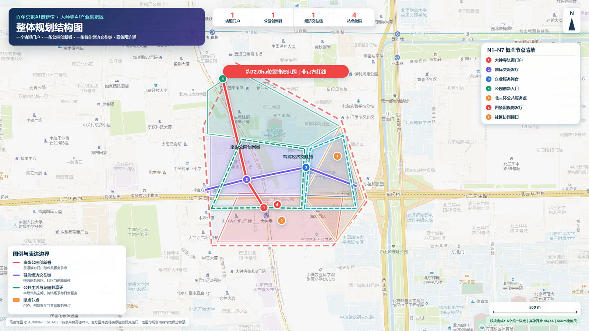

## AI 创新生态、人才画像与 AI+ 场景

### 世界级创新生态案例与八要素机制

案例比较只提取已公开机制，不复制造型，也不把案例方的规模或承诺移植到本项目：

| 全球案例 | 可迁移机制 | 对京张的转译 | 需避免 |
| --- | --- | --- | --- |
| Toyota Woven City，日本 | 居民作为 Weavers、企业/高校作为 Inventors，在真实生活中分阶段验证 | 建立“场景提出—小范围测试—公众反馈—退出”协议 | 把企业封闭试验城照搬成公共城区 [source:CASE-WOVEN-CITY] |
| one-north / LaunchPad，新加坡 | 工作、生活、学习与资本/加速器邻近组织 | 中关村科技服务翼提供一站式专业服务，公共空间承担弱连接 | 把招商结果写成既定事实 [source:CASE-ONE-NORTH] |
| 22@ Barcelona，西班牙 | 产业更新与交通、绿地、文化设施同步推进 | 旧工业/铁路空间成为生产、生活和文化混合接口 | 单一办公化和对原社区的排斥 [source:CASE-22BARCELONA] |
| STATION F，法国 | 多类项目、伙伴和开放入门课程共享一座创业基础设施 | 原点社区设置从公开体验到加速服务的分级入口 | 只做高门槛精英会所 [source:CASE-STATION-F] |
| Masdar City，阿联酋 | 自由区、研发机构、企业和可持续城市试验形成集群 | 众智园将全栈技术验证与低碳空间绩效共同展示 | 用技术展示掩盖运营成本 [source:CASE-MASDAR] |
| Kendall Square，美国 | 创新区同时建设连续公共空间、社区设施和小企业入口 | 把“创新发生在楼内”转成“创新可进入公共生活” | 高价值产业挤压公共性 [source:CASE-KENDALL] |
| Quayside，多伦多 | 公开讨论数字治理、隐私和独立监督；后续方案强调公共空间与低碳 | 数据采集先过公共利益、最小化和退出审查 | 以“智慧城市”绕过数据治理 [source:CASE-QUAYSIDE] |

生态图谱以八要素为输入，以三类可核验产出为出口。土地采用临时使用、分时共享和可逆设施建议；空间提供实验室、公共客厅、街道/公园测试界面；产业按基础模型—智能体—终端—专业服务组织；资金采用按里程碑竞争性支持的建议，不预设财政承诺；人才连接高校师生、开发者、创业者、专业服务者和居民；算力采用端—园区—合规云分级授权；数据建立目录、同意、用途限制、审计和销毁规则；场景由公开问题库进入。产出必须至少形成“可复现技术证据、可被公众理解的服务、可继续深化的标准/合同模板”。

众智园承担全栈与安全验证，原点社区承担团队形成、人才生活和公共服务，小月河场景赋能翼提供城市问题与反馈，中关村科技服务翼提供知识产权、法务、资本、标准和国际合作，大钟寺完成产品展示、市场连接和国际转化。任何资源配置均为机制建议，需由未来责任主体审批。

### 五类用户画像、三类验证场景与十张场景卡

| 用户画像 | 核心任务 | 最重要的空间需求 | 必须避免的伤害 |
| --- | --- | --- | --- |
| 开源开发者 | 找问题、协作者、算力和公开展示机会 | 可短时使用的工位、测试接口、夜间安全到达 | 贡献无署名、强制采集行为数据 |
| 初创团队 | 从原型走向合规验证和首个用户 | 法务/IP/融资门诊、可预约测试场 | 把试点宣传成政府采购承诺 |
| 高校师生 | 课程、研究、成果转化与社会实践 | 从校园到公园和原点社区的连续公共路径 | 权属不清、成果归属模糊 |
| 周边居民与青年 | 日常休憩、学习、运动和表达真实问题 | 非消费停留、无障碍、可反馈、可退出 | 过度监控、活动挤占日常公园 |
| 企业/国际访客 | 看见可信能力并找到合作入口 | 可验证案例、双语导视、专业对接 | 只看舞台效果而无证据链 |

三类产业测试验证场景均采用“小范围、限定时段、明确责任人、人工复核、可一键停止”：T1 众智园“模型与全栈安全验证”，输出红队记录、性能边界和退出报告；T2 原点社区“公共服务智能体验证”，只用授权问题单，输出人工纠错率、申诉和服务改进；T3 大钟寺“智能终端与城市体验验证”，检查可达性、误操作和公共安全，未经专业审查不进入常态运营。

| 场景卡 | 用户—空间—运营 | 数据/人工复核边界 |
| --- | --- | --- |
| 01 开源发布厅 | 开发者；原点大厦公共层；社区运营台 | 只展示主动提交成果，贡献者可撤回 |
| 02 全栈安全治理沙盒 T1 | 研发团队；众智园受控测试间；第三方评测 | 隔离数据，红队留痕，安全负责人放行 |
| 03 公共服务智能体 T2 | 居民/青年；原点社区服务站；人工坐席 | 不自动作出医疗、法律、福利决定 |
| 04 AI 慢行与无障碍导航 | 所有人；公园—五道口路径；公园/交通协作 | 使用匿名问题点，不做人脸追踪 |
| 05 智能终端体验 T3 | 访客/企业；大钟寺公共客厅；设备责任方 | 明示测试状态，异常立即停机 |
| 06 清河低碳创新廊 | 学生/居民；众智园清河界面；生态运营方 | 环境数据聚合公开，不推断个人活动 |
| 07 近校成果转化门诊 | 高校团队；原点社区；专业服务联盟 | IP、法务、融资分别授权，不共享底稿 |
| 08 数据要素会客厅 | 企业/研究者；大钟寺；中立审计方 | 只演示可授权、可审计、可删除的数据流程 |
| 09 青年夜间公共客厅 | 青年/居民；遗址公园节点；社区共管 | 不以消费为准入，不挤占安静时段 |
| 10 全球 AI 回程周 | 全球访客；三片区与开放轨道；临时组委会 | 活动许可、容量和安保另行审批 |

城市智能体只辅助断点识别、路径优化、设施维护和服务组织，不替代规划审批、交通设计、安全责任或人与人之间的公共服务。公共空间 [data:geometry/public_space.geojson#PUBLIC-001]、慢行交通 [data:geometry/roads.geojson#ROAD-001]、蓝绿空间 [data:geometry/green_space.geojson#GREEN-001] 分别承载服务、移动和环境场景，并用公共空间比例 [metric:public_space_ratio] 与绿地比例 [metric:green_ratio] 复核。

### 100天公共价值决策契约与普通人旅程

100天试点不以“上线了多少 AI”验收，而以六项公共价值指标决定继续、修订或退出。六项现场性能指标仍为 `not_run`，没有实测成绩；第 0—14 天只建立人工服务基线、责任名单和测量方法，第 15—45 天开放最小可逆单元，第 46—90 天进行公开复核，第 91—100 天完成回归验收与去留决定 [data:simulation.json#PUBLIC-VALUE-CONTRACT] [depth:phasing_implementation]。

| 决策指标 | 暂定目标 | 一票停止条件 | 恢复/退出要求 |
| --- | --- | --- | --- |
| 公共告知完整率 | 100% 场景公开目的、数据、责任人、人工渠道和退出日期 | 任一场景告知不完整 | 补齐并经人工复核前保持关闭 |
| 非 AI 等价服务保留率 | 100% 场景保留无需登录、无需智能设备的完成路径 | 任一基本公共任务只能由 AI 完成 | 恢复人工路径，否则退出 |
| 重点无障碍路线完成率 | 现场审计路线 100% 可完成 | 盲道、坡道或净线出现关键阻断 | 先恢复连续通行，再讨论重启 |
| 人工接管 P95 | 暂定不超过 5 分钟，基线完成后校准 | 超过 10 分钟或没有具名值守人 | 完成接管演练与复验后重启 |
| 申诉首次响应 | 暂定不超过 24 小时 | 安全、权利类申诉超过 48 小时未响应 | 公开处置记录；重复发生则退出 |
| 场地回归验收 | 试点结束后 72 小时内恢复普通使用 | 设施、账号或数据超期占用公共空间 | 完成拆除、删除与人工验收 |

三个普通人旅程共同验证这份契约，而不是只演示“顺利使用 AI”：视障通勤者必须在无账号、无智能设备时仍能沿连续路线完成换乘；青年使用者可以申请非消费空间，也可以拒绝画像与推荐；居民发现错误提示后能够找到人工窗口、提出申诉、看到场景暂停，并在设施撤除后继续使用同一公共空间。任何一条旅程失败，都必须留下原因、责任、修复和复验记录；`self_check.json` 只证明文件合规，不替代这些未来现场证据。

2026-08-27 已对上述三条旅程完成 12 项离线桌面失败演练：网络中断、坡道阻断、拥挤、错误无障碍路线、无账号、拒绝画像、重复预约、夜间超容量、错误公告、人工空岗、申诉超时和数据删除超期。12/12 场景均具备安全停止、非 AI 备选、人工责任、审计字段和恢复/退出条件；但现场/运营性能验证仍为 0/12，人工接管时间、申诉响应、无障碍路线和场地回归均未实测，不得写成已达标 [data:simulation.json]。

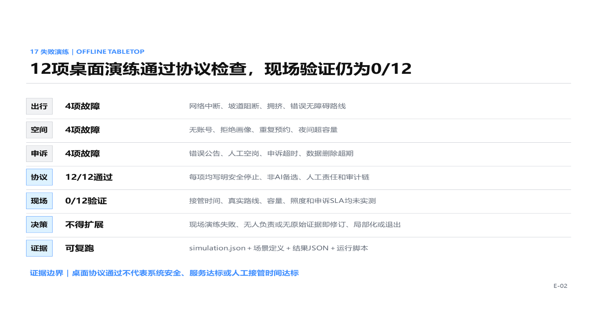

真实基线采用三条样带：众智园—学知园站—清河接口、五道口—成府路—AI 原点 D 座界面、大钟寺站—蓟门停车场—京张公园接口；工作日与周末分别在早、午、晚、夜做 20 分钟样本，共 24 个计划样本。当前全部标为 `field_not_collected`，只有原始照片、WGS84 坐标、时间、观察者和 SHA-256 可回查后，才可改为现场事实 [data:simulation.json]。

本团队另有 499 张微信转存现场照片，经哈希去重得到 495 张唯一图像，并整理为下列三张联系表。它们能够证明团队曾开展现场踏勘，并记录园区内部、原点周边、道路过街、阻隔、公园及昼夜视觉条件；但转存照片均缺少可读 EXIF 时间与 GPS，因此只作为“现场视觉证据”，不计入 24 个结构化样本，`field_collected_count` 继续保持 0 [source:FIELD-PHOTO-AUDIT-20260831]。

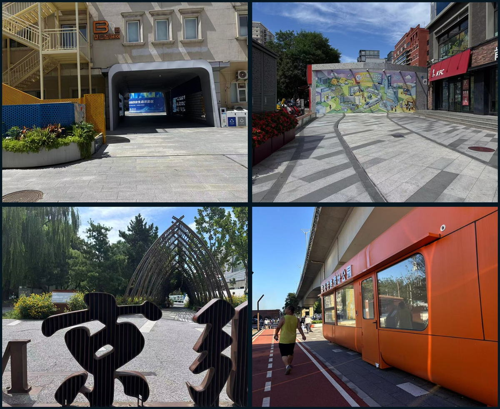

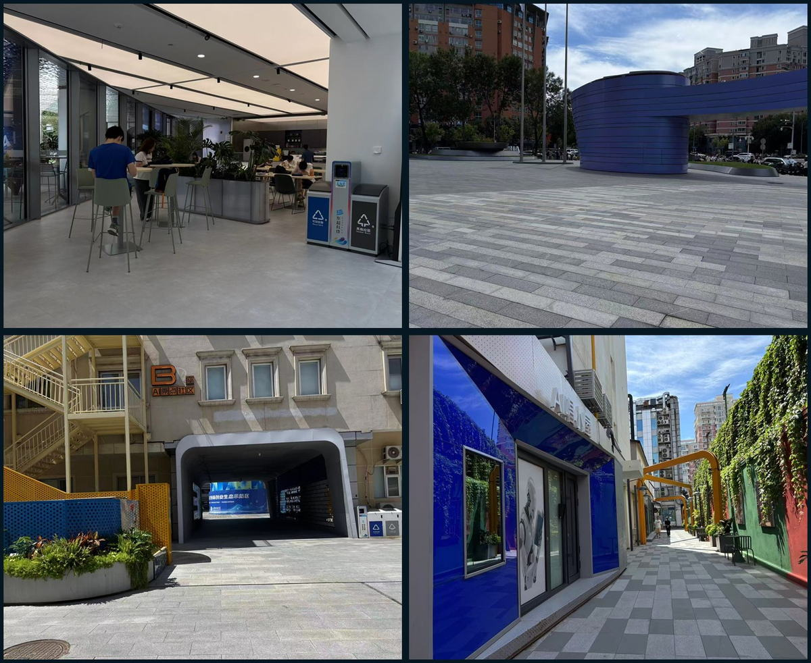

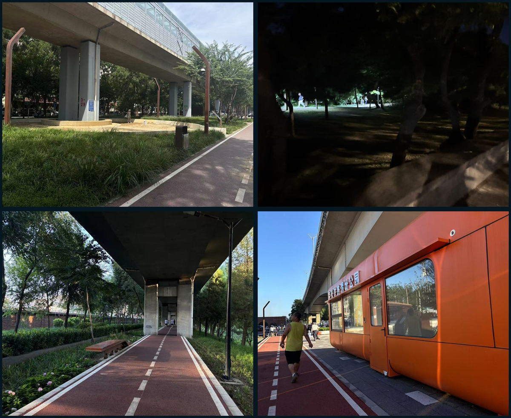

## 用地、建筑规模与拆改留方案

用地结构按公开分类标准组织 [standard:MNR-LAND-USE-CLASSIFICATION-GUIDE]；现阶段表达科研创新、公园绿地、商业服务和社区服务四类方向性单元 [data:geometry/land_use.geojson#LU-001]。建筑层只表达临时建筑基底 [data:geometry/buildings.geojson#BLDG-001]，不在缺少现状测绘、权属和控规时编造拆改留结论。

正式深化采用“价值—安全—碳—运营”四步判断：有遗产或使用价值且安全可达的优先保留；结构可用但界面和能耗不足的优先改造；确需拆除或新建的对象须经过权属、结构、碳排和公共利益复核 [depth:retain_renovate_demolish]。建筑规模、容积率、高度和密度在官方条件到位前保持 `unknown`。

## 交通、轨道、市政与公共服务设施

交通策略先修复最日常的连接：南北形成连续步行、骑行与无障碍主脊，东西逐项缝合公园—道路—校园—社区接口，轨道门户组织步行接驳、非机动车停放和活动日受控交通 [depth:traffic_rail_slow_parking] [data:geometry/roads.geojson#ROAD-001]。公共空间节点与路线共同校核 [data:geometry/public_space.geojson#PUBLIC-001]。

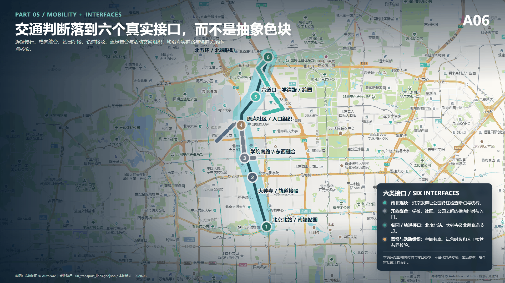

市政与新型基础设施包括端侧算力、分布式能源、低侵入感知和人才服务接口，但其部署以能源、排水、消防、网络和安全条件为前置 [data:geometry/constraints.geojson#CONSTRAINTS]。在缺少正式管线与道路红线时，本方案只给出服务逻辑和候选节点，不给出工程定位。

## 蓝绿空间、公共空间与城市风貌

京张铁路遗址公园是公共生活主轴，不是项目背面。方案把绿地、雨洪、步行骑行、青年活动、创新展示和日常休憩复合组织 [depth:blue_green_public_space] [data:geometry/green_space.geojson#GREEN-001] [data:geometry/public_space.geojson#PUBLIC-001]，优先处理跨环路、公园端点和横向接口。

城市风貌以铁路工业遗产的克制、清晰和可读性为底，以中关村创新文化的开放、协作和持续迭代为新层。导视、贡献墙和公共艺术只使用已清权素材；对清华园火车站等文保资源的介入等待正式保护要求 [standard:MOHURD-URBAN-DESIGN-MEASURES]。

## 三个朝圣地标、荣誉体系与公共空间组件库

“朝圣”被定义为对可验证贡献的尊重，而不是造巨型网红物：L1 原点回程灯塔位于原点大厦公共服务界面，以可撤换灯带显示“问题登记—测试中—人工复核—已关闭”；L2 开源里程碑沿遗址公园设置低矮、无基础或利用既有设施的贡献标识；L3 大钟寺 AI 罗盘以双语交互呈现技术证据、合作入口和风险状态。三者都是候选位置与可逆装置，须经权属、文保、绿地和安全审批。

荣誉体系不做企业广告榜，而记录四类贡献：开源代码、公共问题、验证证据、长期维护。每条记录包含贡献者授权名称、版本、来源、复核状态和退出日期；线上档案是主记录，线下只展示已授权摘要。组件库包括：双语路标、无障碍信息柱、可移动座椅、分时遮棚、低位电源/网络箱、测试状态灯、隐私告知牌、可预约小展台和静音活动界面。所有组件优先无基础、可维修、可撤回，不预设市政容量。

## 四幕文化线路与双语导视

空间叙事分四幕：第一幕“铁路把远方带到北京”，讲京张工程与城市连接；第二幕“中关村把知识变成产业”，讲开放协作与持续试验；第三幕“AI 把能力带回日常”，通过十个受控场景解释公共价值；第四幕“每个人留下可追溯贡献”，把未来文化落在共同维护而非科技装饰上。历史事实仅使用公开、可核来源；文保点位和展陈内容待专项核验。

导视分为整体品牌层 JZ·RETURN、文化线路层 RAIL/CODE/CIVIC、场景状态层 IDEA/TEST/REVIEW/OPEN/STOP，避免把整体 Logo 与文化标识混为一套。中文承担在地叙事，英文采用短句和动作词。国际传播主文案为：**A century-old railway becomes a civic test line for accountable AI—where invention returns to everyday life, and every experiment remains open to human review.**

## 年度活动、开发者社区与转化路径

| 节奏 | 活动品牌 | 核心产出 | 退出/复盘 |
| --- | --- | --- | --- |
| 每月 | Return Clinic 回程门诊 | 公开问题单、专业服务预约、场景候选清单 | 无责任主体的问题不进入测试 |
| 每季度 | Open Track Sprint 开放轨道冲刺 | 1—3 个小范围原型、风险清单、公众试用记录 | 未通过安全/隐私复核即停止 |
| 半年 | Civic Model Review 公共模型复核会 | 红队报告、无障碍审计、居民反馈回应 | 公布未解决问题和下期修正 |
| 每年 | Jingzhang Return Week 京张回程周 | 三片区开放日、开源发布、国际路演、铁路文化线路 | 不宣称招商和政策兑现，发布年度证据档案 |

开发者社区采用“公开问题库—维护者配对—测试预约—人工复核—版本归档”的运营循环；场景开放采用申请、伦理/隐私筛查、空间安全审查、限定测试、公开反馈、继续/修改/退出六道门。转化路径为“参观者 → 问题贡献者 → 冲刺参与者 → 维护者/创业团队 → 受控试点 → 专业采购或投资尽调 → 长期运营伙伴”；每一步都有下一责任人和可停止条件，不把活动热度等同于落地成效。

## 更新项目清单、实施政策与分期计划

实施不从大拆大建开始，而从可逆、可测量、能形成协作关系的项目开始 [depth:renewal_project_list] [depth:phasing_implementation] [data:geometry/phasing.geojson#PHASE-001]。

| 阶段 | 项目包 | 责任协作 | 通过条件 |
| --- | --- | --- | --- |
| 近期，100天试点 | 慢行断点清单、公共创新客厅、青年共创权、公共 AI 登记样板 | 街道/园区、高校、社区、专业团队 | 安全复核完成，公众可反馈，设施可撤回 |
| 中期，重点区更新接口 | 众智园验证终端、原点社区日常服务、大钟寺轨道门户客厅 | 规划交通部门、权利人、运营方 | 正式边界、权属、交通与市政条件确认 |
| 长期，公共创新共同体 | 会员联盟、中立运营平台、年度全球活动、公开评估与退出 | 政府、企业、高校、社区共同治理 | 年度指标公开，低效或高风险场景退出 |

核心项目编号为 JZ-01 慢行断点缝合、JZ-02 清河创新界面、JZ-03 近校成果转化街、JZ-04 大钟寺四象限步行连通、JZ-05 公共服务与端侧算力节点、JZ-06 全球 AI 活动路线。100天是试点周期，不是工程建设承诺。

## 指标体系、面积复算与合规矩阵

指标分三类管理 [depth:metrics_recalculation]：几何指标可直接复算；法定控制指标等待官方材料；运营绩效通过真实试点监测。当前只在正式视觉中保留三项可复算核心值：临时总体设计模型约 11.41 平方公里 [metric:site_area_sqm]、绿地比例约 12.34% [metric:green_ratio]、公共空间比例约 7.33% [metric:public_space_ratio]。这些是临时几何的低置信度设计量，不是审定控制值；其余面积、人口、投资、周期、线长和工程结论均不作为方案事实展示。

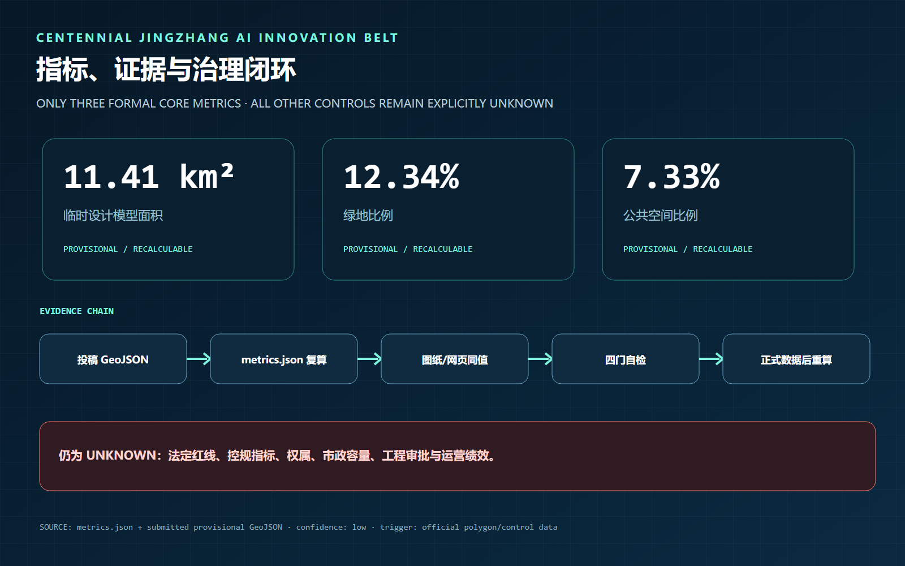

每个关键主张均由“来源—正文—图层—指标—图件—自检”串联。`compliance_matrix.json` 覆盖公告与 agent 任务，`standard_matrix.json` 管理标准适用边界，`design_depth_matrix.json` 管理专业深度，确保评审者能够复算、追踪和提出修改意见。

## 风险、版权与合规说明

主要风险是临时边界误读、控规与权属缺失、跨专业实施复杂度、技术成熟度、隐私与公共接受度。风险记录由约束图层和缺资料清单共同管理 [depth:risk_missing_data] [data:geometry/constraints.geojson#CONSTRAINTS] [source:SITE-PACKAGE]。涉及正式 polygon、控规、道路红线、管线、消防、文保或实施主体的结论均保持待确认。

AI 输出不冒充现场照片、公众意见、官方边界或政府承诺；个人数据遵循最小化原则，公共 AI 场景保留人工复核、申诉和退出。图件由本地 GeoJSON 和本项目文字生成，不加载远程地图、字体、脚本、iframe、表单或外部 API；资产来源、许可与授权见 `sources.json` 和 `report/copyright_statement.md`。

## 参考资料

- `brief/public-brief.md`
- `brief/site-package/design_brief.json`
- `brief/site-package/allowed_design_space.json`
- `data/processed/agent_fact_pack.md`
- `data/processed/project_scope_summary.csv`
- `data/processed/agent_task_requirements.csv`
- `data/processed/source_use_matrix.csv`
- `data/processed/missing_data_checklist.csv`
- 完整出处、许可和使用边界见结构化来源清单 [source:SITE-PACKAGE]
