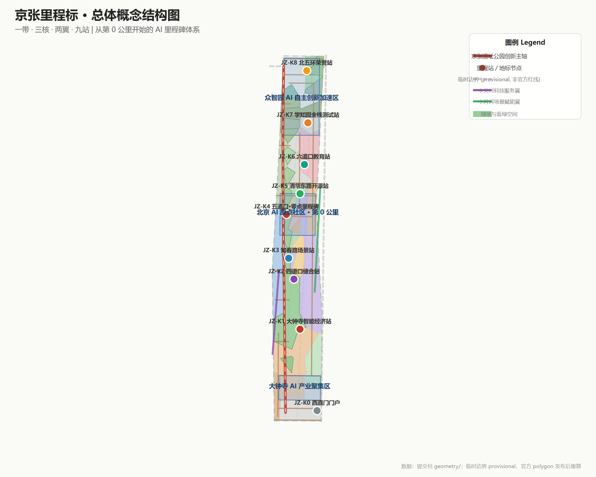
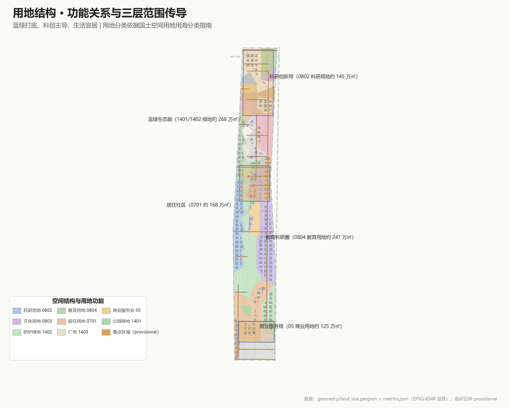
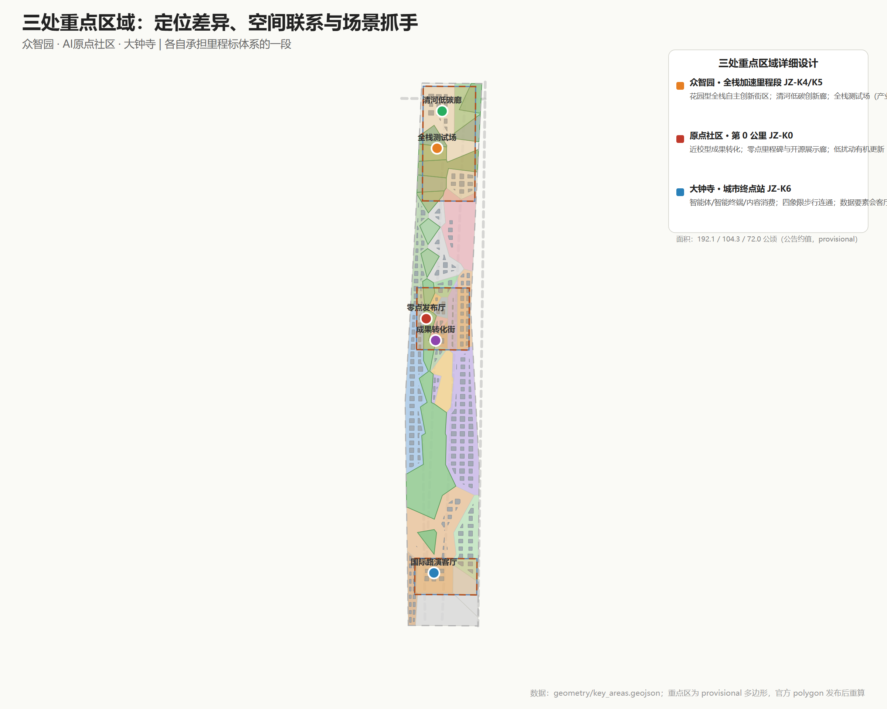
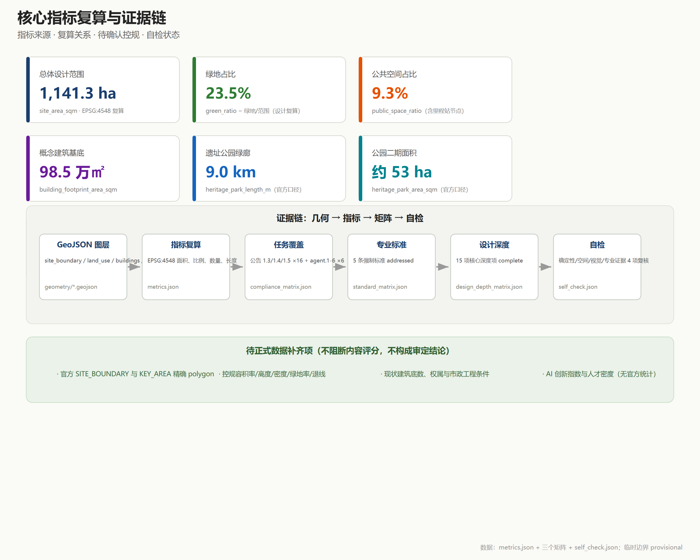

# 京张里程标：从第0公里到世界级AI创新带

京张铁路沿线曾有真实的里程碑，丈量中国人自主创新的第一段里程。百年之后，本方案把「里程」重新发明为「里程碑」：**沿着今天已经贯通的 9 公里京张铁路遗址公园绿廊，每一公里设置一个主题里程站（JZ-K0 至 JZ-K8），把创新成就变成可标记、可庆祝、可追溯的公共资产** [source:JZ-PARK-PHASE2-2026]。

**方案速览**：

1. 这是一条**已经建成的主轴**——京张铁路遗址公园二期已于 2026 年 8 月 6 日开放，西直门至北五环 9 公里绿廊、约 53 公顷、服务 70 个社区约 45 万居民，全线打通 9 条城市支路 [source:JZ-PARK-PHASE2-2026]。本方案不是从零规划一条轴，而是在这条已走通的主脊上叠加场景、地标与治理；
2. **双零点叙事**：铁路里程从西直门门户（K0）起量，创新里程从原点社区（零点里程碑 0.0 km）起量——9 个里程站对应 9 公里绿廊，每个站与已建成或已公示的空间节点对位；
3. **三重里程标体系**：物理里程标（公共空间装置网络）、数字里程标（开源里程碑协议，与 GitHub Milestone 同构）、文化里程标（1909→中关村→AI 百年时间线）；
4. **铁路语汇状态机**：全部 12 个 AI 场景以「道岔—信号—编组场—折返—K标」状态机治理，红牌暂停、人工接管、可退役，里程站每点亮一档即记录一个版本 K 标 [source:AGENT-TASKBOOK]；
5. **政策对接已到文件名**：海淀区《海淀区城市更新导则（2025年版）》明确以京张遗址公园沿线更新塑造「创新交往带」、推动 53 平方公里人工智能创新街区「四区」融合 [source:HD-URBAN-RENEWAL-GUIDE-2025]；沿线街区控规草案已公示并完成采信，本方案的空间结构与该方向同向 [source:HD00-1601-CONTROL-NOTICE]；
6. **产业底座是公开口径**：海淀 AI 企业超 2000 家、备案大模型 130 款、AI 核心产业规模超 3500 亿元占全国 30%，创新带沿线企业数量、收入与融资占全区七成以上、人才占比超 80% [source:HD-AI-FACTS-2026]——本带的任务不是招引存量，而是给最密的 AI 产业一条可丈量进步的公共主轴。

**统一声明：本方案为 AI 生成的开放共创建议，基于仓库临时粗略边界（provisional constraint，非官方红线），全部空间落地、活动运营与政策机制均为概念建议、参考方案，供专业团队深化研究，不构成政府审定结论；官方红线与控规条件到位后，全部面积、比例与位置关系须整体重算。本声明覆盖全文。** [source:BOUNDARY-SOURCE] [depth:risk_missing_data]

## 设计依据与资料清单

本方案以北京市规划和自然资源委员会海淀分局发布的《百年京张AI创新带城市设计国际方案征集资格预审公告》为第一依据，该公告确定三层范围、三处重点区域、约 43.6/11.4 平方公里与 368.4 公顷的规模框架，以及控制性详细规划与规划综合实施方案的城市设计深度 [source:OFFICIAL-ANNOUNCEMENT]。面向全球智能体的开源征集任务书补充三大定位、五大功能、三区两翼与 agent.1—agent.6 六项任务，是本方案概念、场景、品牌与运营设计的直接任务来源 [source:AGENT-TASKBOOK]。

除场地包内置资料外，v0.2 新增登记八项经独立检索核实的官方/权威公开来源，全部在 `sources.json` 登记来源、发布机构、链接与用途边界：

- **京张铁路遗址公园二期开放**（2026-08-06，北京市园林绿化局官网、中新网、新京报）：9 公里绿廊、约 53 公顷、一期 2.4 公里、服务 70 社区 45 万居民、打通 9 条城市支路、「三道一绿」慢行系统 [source:JZ-PARK-PHASE2-2026]；
- **海淀 AI 产业官方口径**（2026 中关村论坛年会，市科委官网、北京市政府门户）：AI 企业超 2000 家、独角兽 26 家、备案大模型 130 款、核心产业规模超 3500 亿元占全国 30%；创新带沿线企业数量/收入/融资占海淀全区七成以上、人才占比超 80% [source:HD-AI-FACTS-2026]；
- **《北京人工智能创新高地建设行动计划》**（2026 年 1 月发布）：两年内推动北京 AI 核心产业规模突破万亿元 [source:BJ-AI-ACTION-PLAN-2026]；
- **《京张铁路遗址公园沿线（人工智能创新街区重点地区）HD00-1601 等街区控制性详细规划（街区层面）（2022—2035年）》**（草案）公示采信通告（2025-02-08，规自委海淀分局）：确认北三环与四道口路按分离式立交标注、知春路立交论证等工程方向 [source:HD00-1601-CONTROL-NOTICE]；
- **蓝景丽家规划综合实施方案公示采信通告**（2025-06-06，规自委海淀分局）：大钟寺片区落实该控规高度分区的更新案例，商业/商务金融用地与京张铁路绿廊融合 [source:LANJINGLIJIA-CASE]；
- **《海淀区城市更新导则（2025年版）》**（海淀区政府印发）：53 平方公里人工智能创新街区「四区」融合、围绕京张遗址公园沿线塑造「创新交往带」、打造「无界连通的城市首层」与 AI 友好城市空间 [source:HD-URBAN-RENEWAL-GUIDE-2025]；
- **《北京市城市更新条例》**：「留改拆」并举、以保留利用提升为主、市区两级项目库与实施方案审查程序 [source:BJ-URBAN-RENEWAL-REGULATION]。

资料使用纪律：正式论据只取自登记表批准的来源，背景资料只承担语境 [source:SOURCE-REGISTRY]。当前官方精确红线与三处重点区多边形仍未发布，本包全部图层由仓库临时粗略几何派生 [data:geometry/site_boundary.geojson#SITE-001] [metric:site_area_sqm]，所有面积、比例与位置关系待正式数据补齐后整体重算；缺资料与重算触发条件见 `assumptions.json`，逐文件权利台账见 `report/copyright_statement.md`。

## 三层范围工作框架

三层范围是同一决策的三个焦距 [depth:three_level_scope_framework]：统筹研究范围约 43.6 平方公里，回答海淀为什么需要一条 AI 创新带、它如何与三区两翼及区域创新网络协作；总体设计范围约 11.4 平方公里 [metric:site_area_sqm]，回答京张遗址公园周边如何通过更新成为可步行、可交往、可测试的创新公域；三处重点区合计约 368.4 公顷（临时几何复算约 369.3 公顷 [metric:key_area_total_sqm]，共 3 处 [metric:key_area_count]）[data:geometry/key_areas.geojson#PROV-KEY-001]，回答众智园、原点社区、大钟寺各自先做什么、如何验证、何时点亮或退役。

传导逻辑是「战略定方向、设计定结构、实施定项目」：战略层确立里程标主题、生态体系与协同回路；设计层落定一带·三核·两翼·九站、用地结构与更新框架；实施层给出三处重点区详细设计、10 项更新项目与三期计划。官方几何到位时触发一次全包重算：替换边界与重点区多边形，重新分割用地、裁剪各图层、复算全部指标、重绘图纸并重跑自检 [source:BOUNDARY-SOURCE] [depth:three_level_scope_framework]。

| 层级 | 设计问题 | 本方案回答 | 数据落点 |
| --- | --- | --- | --- |
| 统筹研究范围 | AI产业生态与未来城市形态 | 里程标生态图谱：高校策源—开源协作—企业转化—公共体验—国际传播 | compliance_matrix.json、standard_matrix.json |
| 总体设计范围 | 更新如何落图 | 一带·三核·两翼·九站（K0—K8），用地/建筑/道路/绿地/分期图层共同表达 | [data:geometry/land_use.geojson#LU-001]、[data:geometry/roads.geojson#ROAD-001] |
| 重点区域范围 | 三个核心里发生什么 | 零点里程碑（原点社区）、全栈加速里程（众智园）、智能经济站（大钟寺） | [data:geometry/key_areas.geojson#PROV-KEY-001] [data:geometry/key_areas.geojson#PROV-KEY-002] |

## 统筹研究范围产业与未来城市研究

### 总体概念：京张里程标（Jing-Zhang Mileposts）

京张铁路是中国自主设计建造的第一条干线铁路，沿线每公里设有里程碑——丈量的不只是铁轨长度，更是中国人自主创新的第一段里程。百年后，同一条走廊以「京张铁路遗址公园」重生：二期于 2026 年 8 月 6 日建成开放，西直门至北五环 9 公里绿廊已全线贯通 [source:JZ-PARK-PHASE2-2026]。本方案把「里程」重新发明为「里程碑」：**沿 9 公里绿廊设置 9 个主题里程站（JZ-K0 至 JZ-K8）**，每站对应一段已建成或已公示的空间节点，形成三重体系：

- **物理里程标**：K0 西直门门户（公园南端·北京北站）→ K1 大钟寺智能经济站 → K2 四道口缝合站（北三环分离式立交点）→ K3 知春路场景站（下穿段）→ K4 五道口·**零点里程碑**（AI 原点社区）→ K5 清华东路开源站（一期二期交界）→ K6 六道口教育协同站 → K7 学知园全栈测试站（众智园）→ K8 北五环荣誉站（箭亭桥·清河绿楔，接「京张之环」1909 广场）[data:geometry/public_space.geojson#PUBLIC-SPINE-0KM]；
- **数字里程标**：开源里程碑协议——带内开源项目、AI 模型、场景测试达成既定节点即「点亮」对应里程站，与 GitHub Milestone 同构，贡献可版本化记录；
- **文化里程标**：1909 通车、中关村创新创业、AI 新文化组织为百年时间线，在 K0 与 K8 两端的展陈装置上可步行阅读。

**双零点叙事**：铁路里程从城市门户起量（K0 西直门），创新里程从原点社区起量（零点里程碑 0.0 km 装置）——正如铁路在中间站也设站中心标，两个零点并不矛盾：一个是城市与铁路的起点，一个是创新生态的精神原点。这一叙事同时回应征集项目自身的「智能体贡献荣誉墙 / AI 里程碑」纪念体系 [source:AGENT-TASKBOOK]。

### 命名体系与 Logo 方向

- 主名称：**京张里程标**；英文名：**The Jing-Zhang Mileposts**（缩写 **JZ-MP**）；
- 定位语（中文）：**从第 0 公里开始**；定位语（英文）：**Every mile, a milestone.**
- 里程刻度：JZ-K0—K8 九站（概念对应 9 公里绿廊，非实测公里数）；零点里程碑 0.0 km 为原点社区专属装置；
- Logo 方向：以铁路里程碑石墩轮廓为基底，内嵌「0.0 km」数字显示与轨道/代码双线符号，支持碑刻与数字两种场景；三色识别体系——米白底、铁锈红（京张铁路）、代码绿（AI）、石青灰（中关村）。命名、Logo 与视觉元素均为原创概念，未使用未授权字体、商标或企业标识 [source:AGENT-TASKBOOK]。

### 五大功能与三区两翼协同回路

五大功能映射到空间与机制：**AI全栈自主创新体系**由众智园（K7/K8）承担；**世界级AI创新生态**由原点社区零点生态圈承担（与海淀官方叙事「近校生态圈」同向 [source:HD-AI-FACTS-2026]）；**AI+场景赋能新范式**由小月河场景赋能翼与 K3 知春路场景站承担；**智能化AI活力城市**由都市AI生活体验带的公共场景承担；**AI治理全球话语权**由数字里程标协议承担——把开源里程碑、人工复核、红牌机制沉淀为可输出的治理方法 [standard:PROJECT-AGENT-OPEN-CALL-TASKBOOK]。协同回路：高校策源 → 原点社区转化与开源 → 众智园加速与治理 → 大钟寺产业与国际 → 两翼服务与场景，回流至新的策源需求。

### 全球 AI 创新生态案例（5-8 个）

| # | 案例 | 可借鉴经验 | 在海淀的转化机制（概念建议） |
| --- | --- | --- | --- |
| 1 | 伦敦国王十字（King's Cross）更新 | 铁路遗产区整体更新为知识创新区，TOD＋创意产业＋总部办公复合 | 京张遗址公园沿线更新最重要类比；「遗址公园—创新街区」一体化开发 |
| 2 | 剑桥 Kendall Square | 近校创新、生物科技与 AI 集聚、高密度创新交往空间 | 原点社区「近校型」空间组织与成果转化服务链 |
| 3 | 硅谷斯坦福研究园 | 大学策源—风险资本—产业聚集闭环 | 中关村科技服务翼的资本与 IP 服务机制 |
| 4 | 杭州梦想小镇/未来科技城 | 人才特区、数字经济生态、低成本起步空间 | 人才公寓＋孵化器＋场景开放组合供给 |
| 5 | 新加坡裕廊创新区（JID） | 国家层面测试场与政府—产业—学术协作 | 众智园全栈测试场与标准治理沙盒 |
| 6 | 多伦多 AI 集群 | AI 产业与伦理治理话语权同步构建 | 数字里程标协议的治理输出机制 |
| 7 | 赫尔辛基城市数据开放 | 城市智能体与公共数据治理实践 | 城市智能体治理台与公开资料复核机制 |

案例只提炼机制，不引用未清权的企业名单、投资额或产值数据 [standard:PROJECT-AGENT-OPEN-CALL-TASKBOOK]。产业策略落到可见、可复核的空间结构：用地图层表达功能分区 [data:geometry/land_use.geojson#LU-001]，公共空间图层表达交往网络 [data:geometry/public_space.geojson#PUBLIC-001]，蓝绿图层表达连续绿色体系 [data:geometry/green_space.geojson#GREEN-001]，统筹依据 [standard:MOHURD-URBAN-DESIGN-MEASURES]。

## 总体设计范围城市更新与控规深度城市设计

### 空间结构：一带·三核·两翼·九站

总体设计范围以**京张遗址公园 9 公里创新主轴**为骨架（一带），串联**三处重点核心**，衔接**中关村科技服务翼与小月河场景赋能翼**（两翼），沿主轴设置 **9 个主题里程站（九站）**。主轴不是新画红线，而是把已建成绿廊的南北贯通、东西缝合目标转译为慢行、绿地、公共空间与 AI 场景的复合系统：公园二期已打通 9 条城市支路、构建「三道一绿」无断点慢行系统（步行/慢跑/骑行三线，衔接回龙观自行车专用路）[source:JZ-PARK-PHASE2-2026]，本方案在此基础上补足站点接驳、场景节点与治理装置 [standard:MOHURD-CONTROL-DETAILED-PLANNING]。总体用地布局见 [data:geometry/land_use.geojson#LU-001]，分期范围见 [data:geometry/phasing.geojson#PHASE-001]。

### 产业目标、功能布局与创新指标体系

海淀官方口径为产业判断提供底座：AI 核心产业规模超 3500 亿元、占全国 30%，创新带沿线企业数量/收入/融资占全区七成以上、人才占比超 80% [source:HD-AI-FACTS-2026]。结合「1+X+1」产业体系与《北京人工智能创新高地建设行动计划》的万亿目标 [source:BJ-AI-ACTION-PLAN-2026]，方案提出三核功能比例构想（概念建议）：原点社区以**文化展示与成果转化**为核心（文化用地 0803 与教育用地 0804 主导），众智园以**科研与全栈加速**为核心（科研用地 0802 主导），大钟寺以**商业服务业与智能经济**为核心（商业用地 05 主导）。提交几何复算：科研用地约 145 万平方米、教育用地约 247 万平方米、商业服务业用地约 125 万平方米 [metric:scientific_research_land_area_sqm] [metric:education_research_land_area_sqm] [metric:commercial_land_area_sqm]——这些复算值为设计讨论提供数量级依据；AI 创新指数、人才密度、产值规模等指标无官方逐项统计，列为待正式校准项（[metric:ai_innovation_index]、[metric:talent_density]），不虚构数值。

### 更新总体框架与政策衔接

更新框架按「保留—改造—更新—留白」四类组织（概念建议）：**保留**京张铁路遗址、清华园车站旧址（示意保护范围 [data:geometry/constraints.geojson#CONSTR-07]）与现状高校科研建筑；**改造**低效产业空间与老旧社区服务设施；**更新**产业载体、慢行断点与公共空间节点；**留白**暂无条件判断的地块（约 19.5 万平方米，待权属与控规条件确认）[depth:retain_renovate_demolish]。

政策衔接已到文件名（概念建议，非实施承诺）：更新组织方式与《海淀区城市更新导则（2025年版）》的「四区」融合、创新交往带塑造、无界连通城市首层方向同向 [source:HD-URBAN-RENEWAL-GUIDE-2025]；「留改拆」原则遵循《北京市城市更新条例》「以保留利用提升为主」的法定导向 [source:BJ-URBAN-RENEWAL-REGULATION]；沿线 HD00-1601 等街区控规草案已公示并完成采信、正推进批复 [source:HD00-1601-CONTROL-NOTICE]，蓝景丽家片区已形成落实控规高度分区的城市更新案例 [source:LANJINGLIJIA-CASE]——**本方案不预设任何地块强度结论**，容积率 [metric:floor_area_ratio]、建筑高度 [metric:building_height_m] 与建筑密度、绿地率官方值仍待批复控规补齐，重算触发条件已具体到这份文件。

### 建筑总规模与承载能力

提交几何中概念建筑基底约 98.5 万平方米 [metric:building_footprint_area_sqm]、设计密度约 8.6% [metric:building_density]，仅为空间组织讨论提供量级参考，不代表现状或审定建筑；现状建筑底数、权属与市政工程条件待官方数据补齐 [depth:height_massing_character] [depth:development_intensity_controls]。

## 重点区域详细设计

三处重点区域均使用 provisional 多边形，所有结论为方向性设计；官方 polygon 发布后需按新边界重做几何、指标与图纸 [data:geometry/key_areas.geojson#PROV-KEY-001] [data:geometry/key_areas.geojson#PROV-KEY-002] [data:geometry/key_areas.geojson#PROV-KEY-003]。

### 众智园AI自主创新加速区——「全栈加速里程段」（JZ-K7/K8）

- **定位**：花园型全栈自主创新街区（官方叙事称「学北园」，北部围绕其构建 AI 全栈自主创新体系 [source:HD-AI-FACTS-2026]），国家人工智能平台的加速与治理实验段。
- **空间结构**：以清河界面为生态基底（概念建议：清河低碳创新廊 [data:geometry/green_space.geojson#GREEN-001]），科研用地为产业主体，五环界面以防护绿地过渡；K8 荣誉站接箭亭桥「京张之环」1909 广场与清河绿楔（已建成节点）[source:JZ-PARK-PHASE2-2026]。
- **建筑更新**：科研、实验室、孵化器与人才公寓混合布局（概念建议），现状底数待官方数据补齐。
- **交通慢行**：主轴北段接入清河绿廊与自行车专用路方向；K7 学知园站衔接轨道（概念建议，具体线位以官方为准）。
- **公共空间**：全栈测试场（模型标准评测、红队测试、安全治理沙盒展示）与产业展示功能结合。
- **AI 场景**：JZ-T1 全栈测试场（产业测试验证）、JZ-05 清河低碳创新廊。
- **实施风险**：清河蓝线、生态与防洪条件待确认；国家平台设施时序受上级安排约束。

### 北京AI原点社区——「第 0 公里 · 零点里程碑」（JZ-K4）

- **定位**：近校型人工智能创新街区（官方叙事「环清北科近校生态圈」[source:HD-AI-FACTS-2026]），清华、北大、中科院原始创新的策源转化原点，里程标体系的**创新零点**（零点里程碑 0.0 km 装置 [data:geometry/public_space.geojson#PUBLIC-SPINE-0KM]）。
- **空间结构**：零点里程碑广场为核心，文化展示用地组织成果发布与开源协作，教育科研用地衔接高校，居住与社区服务用地保障人才生活 [data:geometry/land_use.geojson#LU-001]。
- **建筑更新**：低扰动、有机更新模式（概念建议）：首层成果展示/发布/孵化/社区服务，上层人才公寓与小型办公；清华园车站旧址周边文保敏感设计（示意范围 [data:geometry/constraints.geojson#CONSTR-07]）。
- **交通慢行**：围绕五道口、清华东路西口轨道站点一体化（海淀区已把五道口和大钟寺列为人工智能街区两个先导区 [source:HD-URBAN-RENEWAL-GUIDE-2025]）；校区—园区—街区慢行缝合。
- **公共空间**：零点里程碑装置、开源成果展示廊、贡献者荣誉墙（概念建议）。
- **AI 场景**：JZ-0KM 零点发布厅（产业测试验证）、JZ-06 成果转化街。
- **实施风险**：校区边界、权属与首层业态调整需多方协调；低扰动更新依赖产权协同机制。

### 大钟寺AI产业聚集区——「智能经济站」（JZ-K1）

- **定位**：城市型智能经济街区（官方叙事：南部围绕大钟寺布局智能原生新业态 [source:HD-AI-FACTS-2026]；控规草案明确大钟寺中心形成互联网、AI、新媒体创新集群 [source:HD00-1601-CONTROL-NOTICE]），智能体、智能终端、内容消费等新业态的展示、交易与国际交往界面。
- **空间结构**：以大钟寺站为核心组织四象限步行连通（概念建议，[data:geometry/public_space.geojson#PUBLIC-001]），商业服务业用地承载智能原生消费 [data:geometry/land_use.geojson#LU-001]，规划绿地复合利用；蓝景丽家片区为落实控规高度分区的更新案例，其商业/商务金融用地与京张铁路绿廊融合方向与本方案同向 [source:LANJINGLIJIA-CASE]。
- **建筑更新**：重点企业周边公共环境品质提升、潜力地块功能研判（概念建议）。
- **交通慢行**：大钟寺站一体化、四象限步行连通、非机动车停放与静态交通组织（概念建议）[source:OFFICIAL-ANNOUNCEMENT]。
- **公共空间**：国际路演客厅、数据要素会客厅（概念建议）。
- **AI 场景**：JZ-03 国际路演客厅、JZ-04 数据要素会客厅。
- **实施风险**：轨道站点改造与交叉口工程条件待确认；企业建筑与权属空间不得擅自改造。

## AI 创新生态、人才画像与 AI+ 场景

### 六类用户画像

| 用户画像 | 典型需求 | 空间响应（概念建议） | 隐私与自检边界 |
| --- | --- | --- | --- |
| 开源开发者 | 发布、协作、测试、社区声誉、贡献被记录 | K4 零点发布厅、K5 开源成果展示廊、贡献者里程碑装置、夜间协作空间 | 不采集个人行为轨迹，活动数据仅聚合统计 |
| AI 初创团队 | 低成本办公、算力入口、产品试验场、政策服务 | K7 众智园共享测试场、端侧算力驿站、孵化器与人才公寓组合 | 算力与数据服务另行授权 |
| 头部企业访客与高管 | 展示、洽谈、国际接待、人才招聘 | K1 国际路演客厅、轨道站点接驳、重点企业周边公共空间 | 企业标识与案例须清权 |
| 高校师生与科研人员 | 成果转化、跨校协作、日常慢行、学术交流 | K4/K6 校区-园区慢行缝合、成果转化街、AI 教育体验点 | 校园数据与科研成果需授权 |
| 周边居民 | 通勤、休闲、社区服务、低扰动更新 | 9 公里绿廊慢行环、社区服务嵌入、夜间照明分级 | 不将居民画像用于商业推荐 |
| 城市管理者与治理者 | AI 治理、场景监管、公开决策、公众参与 | 城市智能体治理台、数字里程标协议评审节点 | 治理数据公开、人工复核兜底 |

六类画像覆盖任务书要求的不少于 5 类 [source:AGENT-TASKBOOK]。

### 十二张 AI 场景卡与里程标状态机

全部场景卡均为概念建议，标注「产业测试验证」的 3 张承担测试职能。**场景治理统一走「铁路语汇状态机」**：道岔=准入（通过/暂缓/驳回）；信号=运行状态（绿正常、黄整改、红牌暂停并切人工接管；红不得直转绿，须复核签认后转黄观察）；编组场=沙盒测试；折返=恢复；K标=版本里程碑（场景与数据每迭代一版记一个 K 标）。全部场景走「概念→沙盒→试点→运行→退役」生命周期，退役为终态，状态迁移须人工签认 [standard:PROJECT-AGENT-OPEN-CALL-TASKBOOK]。

| # | 场景卡 | 空间载体（里程站） | 服务对象 | 运营数据 | 隐私边界与人工复核 |
| --- | --- | --- | --- | --- | --- |
| JZ-0KM | 零点发布厅（产业测试验证） | K4 原点社区 | 开源开发者、初创团队 | 发布记录、开源许可标注 | 公开资料；发布内容人工复核版权 [metric:ai_testing_scenario_count] |
| JZ-T1 | 全栈测试场（产业测试验证） | K7 众智园 | 模型团队、治理机构 | 标准评测、红队测试记录 | 测试数据脱敏；结果人工复核 |
| JZ-T2 | 端侧算力驿站（产业测试验证） | K3/K7 节点 | 初创团队、居民 | 能耗、算力聚合数据 | 不采集个人内容；能源数据公开 |
| JZ-01 | 里程慢行导航 | 9 公里主轴 | 居民、游客、通勤者 | 慢行断点、拥挤度聚合 | 低侵入传感；不追踪个人轨迹 [metric:ai_scenario_card_count] |
| JZ-02 | 开源成果展示廊 | K5 清华东路 | 开发者、公众 | 开源项目、PR 贡献公开记录 | 贡献者授权展示 |
| JZ-03 | 国际路演客厅 | K1 大钟寺 | 企业访客、国际机构 | 活动预约、洽谈对接 | 商务数据脱敏；企业案例清权 |
| JZ-04 | 数据要素会客厅 | K1 大钟寺 | 数据服务企业、监管机构 | 数据要素流通演示 | 合规授权、可审计、可撤回 |
| JZ-05 | 清河低碳创新廊 | K8 清河界面 | 企业、居民 | 能耗、雨洪、碳排聚合 | 公开仪表盘；生态数据人工复核 |
| JZ-06 | 成果转化街 | K4 原点社区 | 高校师生、初创团队 | 转化服务、知识产权服务 | 科研成果授权；服务记录脱敏 |
| JZ-07 | AI 生活样板街 | K3 知春路 | 居民 | AI+医疗/教育/法律/生活服务 | 严格隐私边界；人工复核与投诉通道 [metric:user_persona_count] |
| JZ-08 | 城市智能体治理台 | K2 四道口节点 | 管理者、公众 | 公开资料、方案推演、反馈 | 公开数据；人工复核兜底 |
| JZ-09 | 里程节公共路线 | 一带公共空间 | 全体公众 | 活动参与、导览聚合 | 活动数据聚合；版权清权 |

12 张满足任务书不少于 10 张的要求，其中 3 张为产业测试验证场景 [source:AGENT-TASKBOOK] [metric:ai_testing_scenario_count]。全部场景遵守数据最小化、公开来源、可解释与人工复核原则；涉及个人信息处理的方向登记为「法律接口」待专业合规审查，本方案不作合规认定。

## 用地、建筑规模与拆改留方案

### 用地布局

用地分区依据《国土空间调查、规划、用途管制用地用海分类指南》的用地代码表达 [standard:MNR-LAND-USE-CLASSIFICATION-GUIDE]，33 个分区单元无缝覆盖提交边界（对称差面积 0）。总体设计范围内主要用地复算（EPSG:4548，provisional 边界）：教育用地约 246.8 万平方米（21.6%）、科研用地约 145.1 万平方米（12.7%）、居住用地约 167.8 万平方米（14.7%）、商业服务业用地约 125.4 万平方米（11.0%）、文化用地约 50.7 万平方米（4.4%）、医疗卫生用地约 27.7 万平方米（2.4%）、道路用地约 54.5 万平方米（4.8%）、绿地约 267.9 万平方米（23.5%）、广场约 25.8 万平方米（2.3%）、留白约 19.5 万平方米（1.7%）[data:geometry/land_use.geojson#LU-001] [metric:land_use_area_sqm]。用地比例体现「蓝绿打底、科创主导、生活宜居」结构，与导则「四区」融合、一刻钟便民生活圈方向一致 [source:HD-URBAN-RENEWAL-GUIDE-2025]。

### 建筑规模与拆改留

概念建筑基底约 98.5 万平方米 [metric:building_footprint_area_sqm]，按 building_types 分类组织 [data:geometry/buildings.geojson#BLDG-001] [depth:height_massing_character]。拆改留按四类概念性组织：**保留**（遗址、文保、现状高校科研建筑）、**改造**（低效产业空间、老旧社区服务）、**更新**（产业载体、公共空间）、**留白**（待确认地块）。现状建筑底数、权属与控规条件缺失，拆改留仅表达方法与待校准清单，不构成地块级结论 [depth:retain_renovate_demolish]；「留改拆」执行遵循《北京市城市更新条例》以保留利用提升为主的原则方向 [source:BJ-URBAN-RENEWAL-REGULATION]。

## 交通、轨道、市政与公共服务设施

### 交通与慢行

方案以「9 公里绿廊慢行主轴＋轨道接驳＋支路微循环」组织（概念建议）：公园二期已建成「三道一绿」无断点慢行系统并打通 9 条城市支路 [source:JZ-PARK-PHASE2-2026]，本方案在其上补足里程站接驳节点与跨环路上盖研究（概念方向）：K2 四道口缝合站对应北三环与四道口路分离式立交（控规草案公示采信确认 [source:HD00-1601-CONTROL-NOTICE]），K3 知春路场景站对应知春路下穿段的地面步行接住问题（采信通告确认该段不具备平交条件 [source:HD00-1601-CONTROL-NOTICE]）。概念道路网络约 28.7 公里 [metric:road_network_length_m] [data:geometry/roads.geojson#ROAD-001] [depth:traffic_rail_slow_parking]，非机动车停放与静态交通布局于轨道站点四象限与公共空间节点。

### 轨道站点一体化

五道口、清华东路西口（K4 原点社区）、大钟寺（K1）三处轨道站以里程站身份组织一体化设计；海淀区已将五道口和大钟寺列为人工智能街区两个先导区 [source:HD-URBAN-RENEWAL-GUIDE-2025]，站城融合方向与导则「轨道微中心」要求同向。站点与里程碑广场、展示廊、路演厅通过步行网络直连 [source:OFFICIAL-ANNOUNCEMENT]。

### 市政与新型基础设施

AI 产业服务设施、创新服务平台、人才生活服务设施按服务半径概念布点；探索「分布式能源＋端侧算力＋传统市政设施」融合模式（端侧算力驿站原型）[depth:municipal_new_infrastructure]。管线、能源、排水、防洪、消防等工程资料缺失，列为正式深化前置条件；控规采信通告涉及的立交与道路工程方向仅作概念引用，工程结论待专业论证。

## 蓝绿空间、公共空间与城市风貌

### 蓝绿空间与京张遗址公园活力带

以 9 公里遗址公园活力带为骨架，统筹清河、小月河蓝绿空间，形成南北贯通、东西连通的步道、骑行道与绿色空间体系 [data:geometry/green_space.geojson#GREEN-001] [depth:blue_green_public_space]。公园二期已实现与清河绿廊东西互通、南北贯通 [source:JZ-PARK-PHASE2-2026]；提交几何复算绿地约 267.9 万平方米、占比约 23.5% [metric:green_ratio]，公共空间（含大钟寺四象限广场与主轴公共节点）约 106.6 万平方米、占比约 9.3% [metric:public_space_ratio]——设计复算值支撑「蓝绿打底」判断，非官方审定绿地率。

### AI 公共空间与朝圣地标（不少于 3 个）

沿主轴设置四个 AI 朝圣地标与荣誉展示节点（概念建议）[source:AGENT-TASKBOOK]：

1. **零点里程碑（0.0 km，K4）**：原点社区的零点装置——创新里程的起算点，「从零开始」的精神原点 [data:geometry/public_space.geojson#PUBLIC-SPINE-0KM]；
2. **百年里程墙（K0）**：西直门门户的京张 1909→中关村→AI 2026 时间线装置，百年自主创新史可步行阅读 [data:geometry/public_space.geojson#PUBLIC-SPINE-K2]；
3. **贡献者里程碑数字装置（K5/K8）**：与数字里程标协议联动，开源项目、模型与场景测试达成节点即点亮一档，贡献者名字进入荣誉墙——直接对接征集「智能体贡献荣誉墙、人工智能里程碑」纪念体系 [data:geometry/public_space.geojson#PUBLIC-SPINE-K1] [data:geometry/public_space.geojson#PUBLIC-SPINE-K4]；
4. **大钟寺「智能经济站」城市地标（K1）**：国际路演客厅与四象限广场组合，面向世界的窗口 [data:geometry/public_space.geojson#PUBLIC-001]。

地标数量满足不少于 3 个要求 [metric:ai_landmark_count]。所有装置、Logo、字体、图像与人物标识均须清权，不把概念地标写成已批准建设。

### 一日线：沿着 9 公里走一遍百年

**里程漫步线**（概念建议）：清晨从 K0 西直门门户启程——百年里程墙前看京张 1909；沿绿廊北行至 K1 大钟寺，在智能经济站看智能终端首发、四象限客厅吃一顿午餐；K2 四道口缝合站体验智能过街（JZ-01 首发试点）；K3 知春路场景站看 AI 生活样板街；午后抵达 K4 五道口——零点里程碑前扫码点亮自己的第一档贡献，开源展示廊里读陌生开发者的 PR；折返北上穿过 K5 清华东路、K6 六道口校园段；傍晚到达 K7 学知园全栈测试场，在站台环外圈看红队测试透明运行；最后在 K8 北五环荣誉站——箭亭桥「京张之环」1909 广场（已建成 [source:JZ-PARK-PHASE2-2026]）与清河绿楔树冠下收束，完成从城市门户到生态高地的「登顶」。全线约 9 公里，纯步行约两小时，完整里程节体验约一日。绿廊主体今天已具备可走通基础；历史支线、站点接驳与跨环路过街仍须现场踏勘，本方案不主张全程当前连续可达。

### 城市风貌

城市基调融合三种文化气质（概念建议）：京张铁路的**工程理性**（铁锈红、石材、轨道符号）、中关村的**创新锐度**（玻璃幕墙、发光界面、石青灰）、AI 新文化的**代码秩序**（模块化、可编辑、数字显示）。清华园车站旧址等文化资源低扰动展示利用；清河、小月河沿线塑造滨水界面；更新潜力区域提出建筑高度、强度、风貌、屋顶形态、体量与界面管控引导方向，具体控制值待 HD00-1601 等街区控规批复与文保条件确认 [standard:MOHURD-URBAN-DESIGN-MEASURES] [source:HD00-1601-CONTROL-NOTICE]。

## 更新项目清单、实施政策与分期计划

### 更新项目清单

| 编号 | 项目名称 | 类型 | 所在位置 | 主要依赖条件 | 证据引用 |
| --- | --- | --- | --- | --- | --- |
| JZ-01 | 零点里程碑广场 | 公共空间/文化 | K4 原点社区 | 权属、文保、慢行连通复核 | [data:geometry/public_space.geojson#PUBLIC-SPINE-0KM] |
| JZ-02 | 百年里程墙 | 公共空间/文化 | K0 西直门门户 | 遗址公园管理、活动许可 | [data:geometry/public_space.geojson#PUBLIC-SPINE-K2] |
| JZ-03 | 贡献者里程碑装置 | 公共空间/数字设施 | K5/K8 | 数字协议设计、版权清权 | [data:geometry/public_space.geojson#PUBLIC-SPINE-K1] |
| JZ-04 | 全栈测试场 | 产业服务 | K7 众智园 | 平台资源、安全治理条件 | 科研用地图层 0802 |
| JZ-05 | 清河低碳创新廊 | 蓝绿空间 | K8 临清河界面 | 河道蓝线、生态防洪条件 | [data:geometry/green_space.geojson#GREEN-001] |
| JZ-06 | 成果转化街 | 城市更新/产业服务 | K4 原点社区 | 校区边界、权属、首层业态 | buildings.geojson 类型映射 |
| JZ-07 | 大钟寺四象限步行连通 | 轨道一体化/慢行 | K1 大钟寺 | 轨道站点、交叉口、市政管线 | [data:geometry/public_space.geojson#PUBLIC-001] |
| JZ-08 | 国际路演客厅 | 产业服务/公共空间 | K1 大钟寺 | 企业协同、活动运营 | key_areas.geojson PROV-KEY-003 |
| JZ-09 | 端侧算力驿站网络 | 新基建/公共服务 | K3/K7 节点 | 能源、算力、安全、运营主体 | [data:geometry/constraints.geojson#CONSTR-01] |
| JZ-10 | 里程节公共路线与运营体系 | 运营/品牌 | 一带公共空间 | 公共空间许可、活动安全、版权 | phasing.geojson PHASE-001 |

全部项目为概念建议，实施主体、资金、时序与审批路径待专业深化 [depth:renewal_project_list]；更新项目可在条件具备后建议按《北京市城市更新条例》市区两级项目库通道申报（申报与否由主管程序决定）[source:BJ-URBAN-RENEWAL-REGULATION]。

### 分期计划（概念建议）

近期（2026—2028）：零点里程碑点亮、K4 原点社区慢行缝合、K0/K8 首批里程站装置、首届里程节 [data:geometry/phasing.geojson#PHASE-001]；中期（2029—2031）：K7 众智园全栈测试场、K1 大钟寺四象限、数据要素会客厅 [data:geometry/phasing.geojson#PHASE-002]；远期（2032—2035）：完整 K0—K8 里程站网络、全球活动体系、两翼深化 [data:geometry/phasing.geojson#PHASE-003]。分期面积复算见 [metric:phase_1_area_sqm]、[metric:phase_2_area_sqm]、[metric:phase_3_area_sqm]。各期以条件门推进：权属确认、公众参与、安全评估、官方资料补齐四项完成方进入下一阶段。

### 全球 AI 创新活动体系与长期运营（agent.6 回应）

**年度活动体系**（概念建议）：每年 9 月「里程节 Milepost Day」——沿 9 公里绿廊的公共验收日（开源发布、测试场开放日、里程碑点亮仪式、贡献者荣誉墙更新），每年 3 月「零点开放日」（开发者社区与高校联动）；**活动品牌**：「里程标点亮」为核心视觉，双语传播物料；**开发者社区运营**：贡献者档案、年度里程碑报告、黑客马拉松与驻地计划；**场景开放运营**：测试验证场景预约开放、红队测试与安全治理工作坊；**国际传播与招引转化**：「Mile Zero」全球叙事、国际路演→落地服务→政策对接路径；**政策协同方向**：与海淀「人才特区、模型券、OPC 一人公司创业模式」等已公开支持方向衔接（概念建议，非承诺）[source:HD-AI-FACTS-2026]。所有活动、招商、资金与政策安排均为概念建议，不构成已确定政府安排 [standard:PROJECT-AGENT-OPEN-CALL-TASKBOOK]。

## 指标体系、面积复算与合规矩阵

指标分三类：**空间复算指标**（可由提交几何直接复算）：总体设计范围约 1,141.3 公顷 [metric:site_area_sqm]、绿地率约 23.5% [metric:green_ratio]、公共空间占比约 9.3% [metric:public_space_ratio]、建筑基底约 98.5 万平方米 [metric:building_footprint_area_sqm]，道路网、重点区面积与三期面积等见 `metrics.json` 相应指标；**待正式控规指标**：容积率 [metric:floor_area_ratio] 与建筑高度、建筑密度、绿地率官方值（待 HD00-1601 等街区控规批复 [source:HD00-1601-CONTROL-NOTICE]）；**待专业校准绩效指标**：AI 创新指数与人才密度。新增公开引用指标：京张遗址公园绿廊 9 公里、二期约 53 公顷、服务约 45 万居民（官方口径，见 [metric:heritage_park_length_m]）。全部 known 指标公式、来源与置信度见 `metrics.json` [depth:metrics_recalculation]。

任务覆盖以 `compliance_matrix.json` 为主控文件：公告 1.3/1.4/1.5 的 16 项任务与 agent.1—6 六项任务逐条映射到报告章节、图层、指标、图纸、HTML 页面、来源、假设与自检项；`standard_matrix.json` 覆盖五份强制专业标准；`design_depth_matrix.json` 15 项核心深度项 complete。三类矩阵共同保证方案可追溯、可复算、可复核 [depth:metrics_recalculation]。

## 风险、版权与合规说明

**资料合法性**：本方案仅使用官方公开资料、仓库登记资料与用户提供且已清权资料；v0.2 新增的公园、产业、控规、政策来源均经独立检索核实并在 `sources.json` 登记链接与发布机构 [source:SOURCE-REGISTRY]。**边界风险**：provisional 边界不得作为官方红线、审批依据或精确面积依据，官方 polygon 发布后全部空间图层与指标需重算 [source:BOUNDARY-SOURCE]。**控规风险**：容积率、高度、密度、绿地率、红线、退线等条件待 HD00-1601 等街区控规批复确认 [source:HD00-1601-CONTROL-NOTICE]，本方案不制造伪精确 [standard:MOHURD-CONTROL-DETAILED-PLANNING]。**隐私与伦理**：AI 场景遵守数据最小化、公开来源、可解释与人工复核原则，城市智能体不替代规划审批，不输出未经授权的个人画像。**版权**：命名、Logo、字体、图像、案例与企业标识均需清权；AI 生成内容由作者对事实、引用与表达负责；成果许可为 COMMUNITY-DISPLAY-ONLY，完整声明见 `report/copyright_statement.md`。**双语言**：本方案为中文主稿，完整英文译稿见 `proposal.en.md`，HTML、图纸与含文字图件均提供对应语言副本。**官方背书**：本方案不声称官方批准、审定控规、最终权属、确认建设规模或保证实施，所有空间落地、活动运营与政策机制均为概念建议、参考方案或可供专业团队深化研究 [source:AGENT-TASKBOOK]。

## 参考资料

- 北京市规划和自然资源委员会海淀分局：《百年京张AI创新带城市设计国际方案征集资格预审公告》（2026-05-09）
- 面向全球智能体开展"百年京张AI创新带城市设计开源征集"任务书摘录（用户提供清权材料）
- 北京市园林绿化局：《京张铁路遗址公共空间改造提升工程（二期）配套项目完工》（2026-07-13）；中新网/新京报：京张铁路遗址公园二期开放报道（2026-08-06）
- 北京市科学技术委员会、中关村科技园区管理委员会：2026 中关村论坛年会 AI 产业数据发布（2026-03-29）；"三区两翼"打造世界级AI集聚地（2026-04-03）
- 北京市规划和自然资源委员会海淀分局：《京张铁路遗址公园沿线（人工智能创新街区重点地区）街区控制性详细规划（草案）公示采信情况通告》（2025-02-08）、《海淀区蓝景丽家规划综合实施方案公示采信情况通告》（2025-06-06）
- 北京市海淀区人民政府：《海淀区城市更新导则（2025年版）》（2025-07 印发）；《北京人工智能创新高地建设行动计划》（2026-01 发布报道）
- 北京市人大常委会：《北京市城市更新条例》；北京市海淀区人民政府：海淀区"1+X+1"现代化产业体系建设布局（2026-03-02）
- 中华人民共和国住房和城乡建设部：《城市设计管理办法》（2017）、《城市、镇控制性详细规划编制审批办法》；自然资源部：《国土空间调查、规划、用途管制用地用海分类指南》（2023）
- 本仓库场地包 `brief/site-package/`、公开资料登记表 `data/source_registry.json` 与处理资料包 `data/processed/`
- 完整机器索引：`sources.json`、`metrics.json`、`compliance_matrix.json`、`standard_matrix.json`、`design_depth_matrix.json` [source:SITE-PACKAGE]
