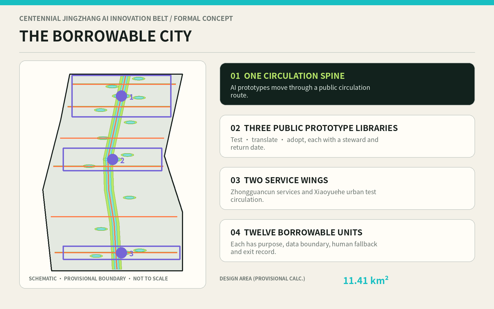
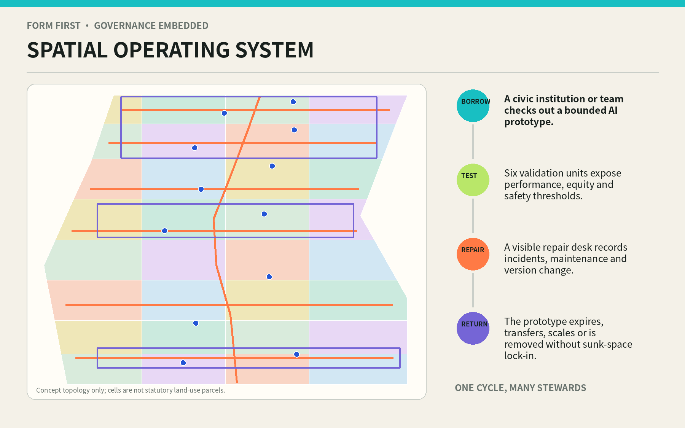
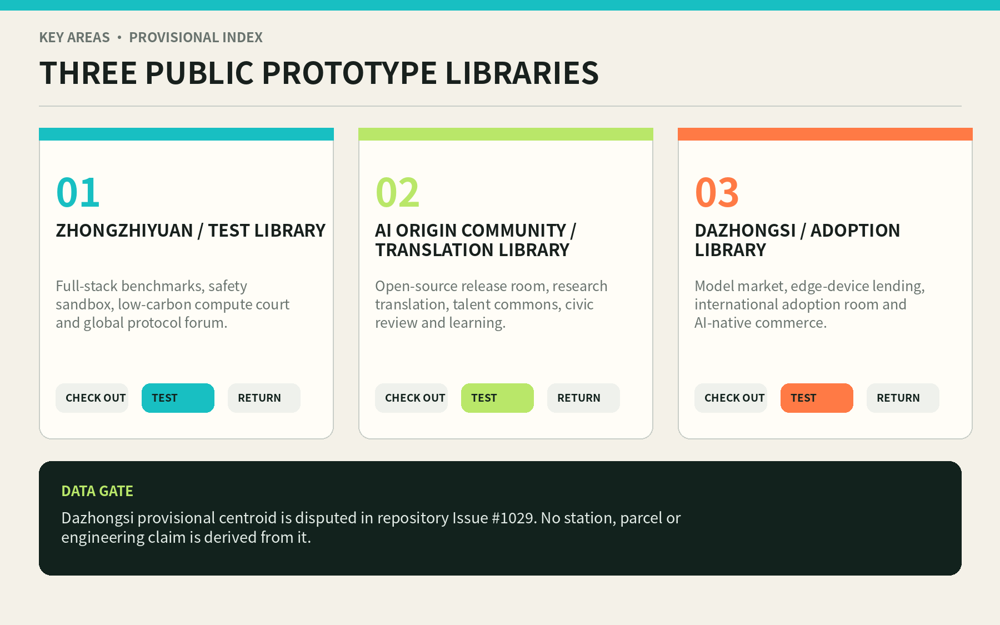
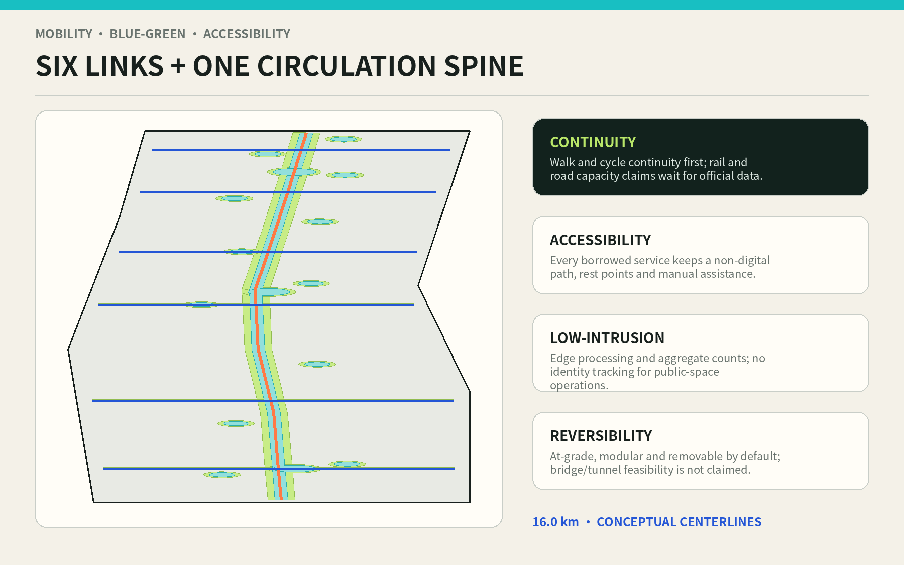
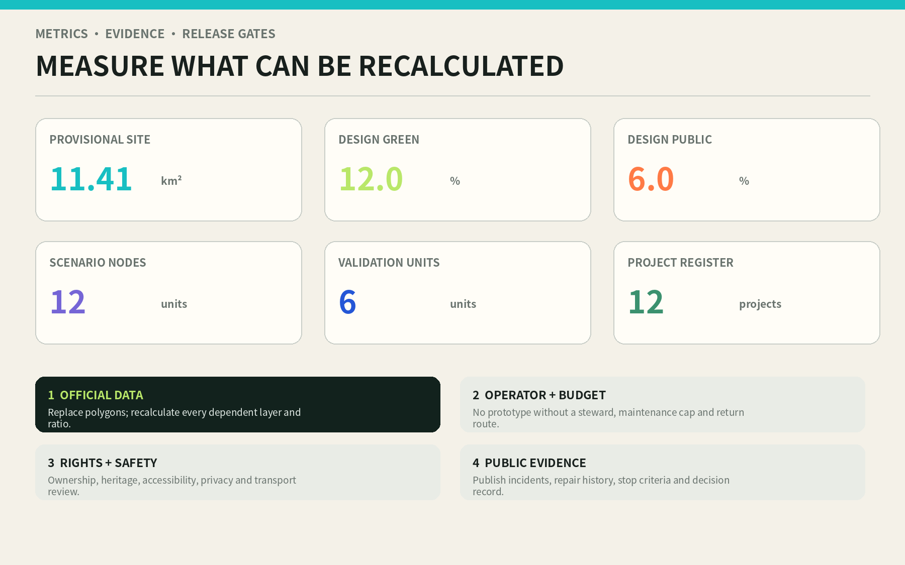

# THE BORROWABLE CITY / 京张可借城

**Turn AI prototypes into public infrastructure that can be checked out, tested, repaired, and returned.**

## Design Basis and Source List

This proposal separates two questions that are often collapsed: whether the design content can be reviewed, and whether its spatial precision can be adopted. The official announcement supplies the tasks, the approximate three-level areas, and the names of the three key areas. The agent taskbook supplies the six open-call tasks, minimum numbers of cases, personas, and scenarios, and the branding and operational requirements. The evidence snapshot is locked to 11 August 2026. Neither document means that a reusable official CAD/GIS redline is already present in the repository [source:OFFICIAL-ANNOUNCEMENT] [source:AGENT-TASKBOOK].

The package still lacks official precise polygons, road redlines, parcels and ownership, a complete building survey, heritage-control vectors, blue-green controls, utility capacity, FAR, height, density, and setbacks. The submitted site and key-area files therefore preserve the maintainer-defined provisional geometries. They may support clipping, composition, self-checking, and debate, but not approval or engineering. Recalculation in EPSG:4548 produces approximately **11.41 km²** for the temporary site: a known computation on a low-confidence spatial basis, not an official area confirmation [data:geometry/site_boundary.geojson#PROV-SITE-001] [metric:site_area_sqm].

Repository Issue #846 records no intersection and an approximately 412.5 m nearest distance between one OSM representation of Jingzhang Heritage Park and the provisional site. Issue #1029 records a likely mislocation of the provisional Dazhongsi centroid. Neither uncertain geometry is promoted to statutory truth. The proposal does not move maintainer constraints, replace them with OSM, or derive station, parcel, or engineering claims from provisional centroids. It registers the disputes as assumptions and waits for official data to trigger a full-package rebuild [source:ISSUE-SPATIAL-MISMATCH-846] [source:ISSUE-DAZHONGSI-1029].

Evidence is organised in four levels: official tasks and standards; repository-cleared or provisional inputs; primary-source international mechanisms; and proposal-generated designs, metrics, and assumptions. An international case cannot prove local conditions. A conceptual polygon cannot prove a planning control. A calculated design ratio cannot become an approved ratio. `sources.json` records usage boundaries, `assumptions.json` records replacement triggers, and the three matrices connect the reading layer to machine-auditable evidence [source:SOURCE-REGISTRY] [depth:existing_conditions_diagnosis].

## Three-Level Scope Framework

The three scales form a single chain from mechanism to space to operation. The approximately 43.6 km² coordinated research area asks how AI innovation can circulate across the wider ecosystem: research, open source, enterprise, professional services, public scenarios, and everyday life. The approximately 11.4 km² overall design area asks how circulation can become urban form: a north-south public spine organises R&D, learning, adoption, green space, and civic support. The three key areas ask who is responsible for testing, translating, and adopting prototypes: Zhongzhiyuan Test Library, AI Origin Community Translation Library, and Dazhongsi Adoption Library [depth:three_level_scope_framework] [standard:PROJECT-OFFICIAL-ANNOUNCEMENT].

The spatial formula is **one spine, three libraries, two wings, twelve units**. The spine is a continuous walking, cycling, exhibition, and repair route. The libraries are public institutions for test, translation, and adoption. The Zhongguancun Technology Service Wing supplies legal, IP, standards, capital, talent, data, and compute “librarian services.” The Xiaoyuehe Scenario Wing circulates bounded prototypes through community, mobility, education, care, and environment settings. Twelve units hold spatially located borrowing contracts. These are relations that can be reprojected inside future official boundaries, not newly invented redlines [data:geometry/roads.geojson#ROAD-001] [data:geometry/constraints.geojson#SCN-01].

Every scale uses the same borrowing card: purpose, borrower, space, minimum-data boundary, model and version, steward, human alternative, term, success threshold, stop threshold, maintenance cap, and return route. At the ecosystem scale the card tests whether circulation is coherent. At the overall scale it tests whether the network is continuous, public, and reversible. At the key-area scale it tests whether a prototype can be operated safely. This forces an industrial slogan to answer spatial and accountability questions, while every attractive local object must explain which innovation loop it serves.

When official geometry arrives, the package follows one replacement sequence: register source, version, CRS, and conversion; replace site and key-area polygons; reclip land use, buildings, green and public spaces, and phases; recalculate every known metric; rerender both languages and both drawing formats; rerun all checks. A bottom-map replacement that leaves old metrics intact is a failed update [depth:metrics_recalculation] [data:geometry/phasing.geojson#PHASE-001].

## Coordinated Research Area: Industry and Future City Research

“Borrowable” addresses a recurring innovation gap. Research remains inside laboratories; enterprise prototypes lack lawful real-world settings; public institutions cannot accept the risk of permanent procurement; residents become passive audiences at product launches. The proposal rewrites the chain as a civic circulation: catalogue, publish a problem, check out, test in a bounded setting, review with the public, repair and document, then return, transfer, expand, or retire. Land and buildings provide replaceable spatial sockets. Time limits prevent permanent capture. Public evidence makes scaling decisions contestable.

Six primary-source cases contribute mechanisms rather than transplanted sizes or performance claims [source:CASE-HELSINKI]:

| Case | Verifiable mechanism | Transferable move for Jingzhang | Explicit non-transfer |
| --- | --- | --- | --- |
| Testbed Helsinki | Companies, RDI actors, city staff, and end users test in authentic urban settings | A published, time-bounded catalogue of city resources and feedback routes | Finnish procurement rules and outcomes |
| Singapore IMDA OIP | Problem owners issue challenges; solvers create POCs or prototypes that may enter validation and adoption | A chain of problem brief, borrowing card, validation report, and adoption decision [source:CASE-SINGAPORE-OIP] | Platform scale and prize structure |
| Paris-Saclay | Buildings, public spaces, events, and large demonstrators operate through a network of innovation places | The three libraries share circulation records rather than act as isolated landmarks [source:CASE-PARIS-SACLAY] | French planning and development governance |
| Mila, Montréal | Research, training, open science, startups, and industry partners share an AI community | AI Origin Community translates research into public language and responsible use [source:CASE-MILA] | Institutional scale and partner counts |
| MaRS, Toronto | Startup support, adoption, convening, and innovation real estate reinforce one another | Dazhongsi adds first-user, maintenance, and exit services to exhibition [source:CASE-MARS] | Self-reported economic impact as a local forecast |
| Hetao Shenzhen-Hong Kong | A centre-and-two-wings structure supports rule experimentation and pilot translation | Separate a professional-service wing from a real-world scenario circulation wing [source:CASE-HETAO] | Cross-border law, statutory metrics, and spatial scale |

The resulting ecosystem has eight borrowable resources: land sockets, shared rooms, expert time, compute quotas, cleared data, test settings, professional services, and first-user opportunities. Zhongzhiyuan turns models, devices, and systems into catalogued items. AI Origin Community turns papers and code into understandable instructions and thresholds. Dazhongsi finds accountable adopters and maintenance routes. The two wings keep legal, capital, standards, and civic scenarios circulating. Every resource has a cap and return condition, preventing “openness” from becoming unlimited extraction or hidden subsidy.

The identity uses an unfinished **B / 回 loop**. The opening means checkout; the returning hook means accountability; three points mark the libraries; an orange stroke recalls route and time. The main names are 京张可借城 and THE BORROWABLE CITY, with Test Library, Translation Library, Adoption Library, and Borrowing Spine as the shared naming family. The visual direction uses original geometry and system/open-font practice, never enterprise marks, celebrity imagery, or uncleared historical photographs [depth:overall_spatial_structure] [standard:MOHURD-URBAN-DESIGN-MEASURES].

## Overall Design Area: Urban Renewal and Regulatory-Plan-Level Urban Design

The urban design does not turn a “library” metaphor into a monumental building. It creates an updateable urban organisation. `land_use.geojson` partitions the provisional site with a full-coverage, no-overlap four-by-eight shared-edge grid. Its sides hold R&D, learning, living, culture, and adoption services; the middle alternates green, square, and civic space along the spine. The grid is conceptual topology, not statutory land use or parcels. Its purpose is to demonstrate adjacency, sharing, and incremental replacement, and to be automatically reclipped when official geometry arrives [data:geometry/land_use.geojson#LU-001] [depth:land_use_layout].

The form principle is “thick edge, open heart, replaceable sockets.” Active edges face public rooms. Service, equipment maintenance, short tests, and logistics occupy manageable courts. Ground floors expose checkout desks, public worktables, learning, and exhibitions. Upper envelopes may support R&D, office, education, or talent services, but the proposal assigns no statutory height or capacity. Twenty-two conceptual footprints act as capacity probes, totalling about **5.74 ha**. They are neither a survey of existing buildings nor an approved construction or demolition quantity [data:geometry/buildings.geojson#BLDG-001] [metric:building_footprint_area_sqm].

The access gradient runs from public to controlled. The spine and squares remain ordinary civic ground that requires no technological identity. Prototype-library foyers expose catalogues, human help, and incident histories. Controlled courts open only within risk-rated time windows. Data, model weights, device maintenance, and safety operations remain in back-of-house zones. Every digital service retains a non-digital route. Every changing component can be removed and the public room restored. This protects long-term urban adaptability better than a promise of ubiquitous “smartness.”

The regulatory-plan boundary is explicit. The proposal can provide functional relations, public-space structure, conceptual footprints, renewal projects, mobility priorities, and recalculable design metrics. It cannot provide FAR, height, density, road redlines, setbacks, parking ratios, or building-by-building retain/renovate/demolish decisions. Those values remain `unknown` until approved controls, surveys, heritage, transport, and utility evidence are present [standard:MOHURD-CONTROL-DETAILED-PLANNING] [depth:development_intensity_controls].

## Detailed Design of Key Areas

The three key areas share one borrowing protocol but handle different maturity and risk stages. **Zhongzhiyuan Test Library** serves prototypes not ready for the city. An Open Benchmark Hall, Model Safety Sandbox, Low-carbon Compute Court, Full-stack Prototype Shop, Timed Autonomous Logistics Shed, and Repair and Retirement Depot form public and controlled rings. Visitors can observe and learn in the outer ring. Risk-rated work remains isolated inside. Every automated system has physical stop, human takeover, and incident logging. References to Qinghe or green interfaces remain low-intrusion tasks pending official blue-line and engineering evidence.

**AI Origin Community Translation Library** serves research that has value but lacks common language. The Open-source Release Room connects university and developer communities. The Research Translation Lab turns papers into problem briefs, instructions, and verifiable thresholds. The Data Contract Clinic explains purpose, term, sharing, and deletion. Talent Commons and the Learning Commons support short collaboration and everyday life. A Civic Review House allows non-technical users to shape stop conditions. Walking, cycling, and public activity are prioritised without assuming that campus or private property will open.

**Dazhongsi Adoption Library** serves prototypes that have passed tests but lack a reliable adoption relationship. The Model Market displays competing responses to public problems rather than brands. The Edge Device Lending Arcade offers short trials and repairs. The International Adoption Room connects first users, maintainers, and professional services. AI-native consumption opens only where price, recommendation logic, human appeal, and exit rights are visible. Because the provisional key-area location is disputed, station/TOD, quadrant, and parcel moves remain official-data tasks rather than fake precision in this drawing [data:geometry/key_areas.geojson#PROV-KEY-003] [depth:three_key_area_detailed_design].

| Library | Core rooms | Primary output | Checkout gate | Return decision |
| --- | --- | --- | --- | --- |
| Zhongzhiyuan Test Library | Benchmark, sandbox, compute court, repair depot | Test report, risk boundary, version record | Safety owner, licensed test data, physical stop | Translate if passed; repair or retire if failed |
| AI Origin Translation Library | Release room, translation lab, contract clinic, civic review | Instructions, scenario language, public conditions | Clear research rights and target-user participation | Produce an understandable prototype or return to research |
| Dazhongsi Adoption Library | Model market, device arcade, adoption room | First-use agreement, maintenance and exit plan | Transparent price and responsibility, support and appeal | Accountable transfer, limited scale, or withdrawal |

Each library uses the same five-part kit: public foyer, controlled test room, repair backroom, green buffer, and walking connection. The kit can be dispersed through retained or renovated buildings after survey instead of driving one-time demolition. There are **three** submitted provisional key-area features, but their geometry and precision await official replacement [metric:key_area_count] [data:geometry/public_space.geojson#PUBLIC-003].

## AI Innovation Ecosystem, Personas, and AI+ Scenarios

Six personas are accountability checks, not marketing segments. Open-source developers need release, collaboration, and credit records. Researchers need reproducibility and rights protection. Startups need affordable tests, first users, and a dignified failure route. Mature enterprises and public institutions need pre-procurement evidence, maintenance responsibility, and human fallback. Residents and service workers need low disturbance, accessibility, appeals, and non-digital alternatives. International visitors and interdisciplinary talent need bilingual navigation, short collaboration, everyday support, and legible governance. Personal movement cannot be converted into commercial recommendations [metric:persona_count] [standard:PROJECT-AGENT-OPEN-CALL-TASKBOOK].

Twelve scenario cards are located as `SCENARIO_NODE` features; six are testing-and-validation scenarios. “Known” means the card and node exist in this submission, never that operation has been approved [data:geometry/constraints.geojson#SCN-01] [metric:scenario_node_count].

| # | Borrowable scenario / users | Space and operation | Data, human fallback, and return condition |
| --- | --- | --- | --- |
| 01 | Model Commons Market / residents and adopters | Competing prototypes answer public problems at the Adoption Library | No personal profile; staffed desk; remove items with opaque price or responsibility |
| 02 TVS | Edge Device Lending Arcade / founders and residents | Time-limited devices return to an onsite repair desk | Local processing first; human fault intake; recall on energy or safety threshold |
| 03 TVS | Accessible Loop Trial / disabled people and carers | Continuous travel tests on the east-west links | Consented task data; onsite help; do not scale while barriers remain |
| 04 | Community Care Copilot Stop / older people and carers | Explain, book, and withdraw assistance at a staffed service point | Never replaces professional judgement; hotline; retire on harmful dependency |
| 05 TVS | Open-source Release Room / researchers and developers | Reproduction, red-team work, and version release | Cleared data only; peer and civic review; unreproducible work returns to research |
| 06 | Data Contract Clinic / communities and firms | Plain-language purpose, term, sharing, and deletion contracts | Human legal review; no checkout without withdrawal and deletion routes |
| 07 | AI Learning Commons / students, teachers, residents | Courses, workshops, and non-digital tools together | No punitive individual analytics; teacher accountable; stop inexplicable bias |
| 08 | Jingzhang Memory Station / visitors and residents | Light-touch audio, oral history, and route narratives | Sources visible; human curator; correct or withdraw false narratives |
| 09 TVS | Model Safety Sandbox / teams, researchers, reviewers | Isolated tests of attack, misuse, and takeover | Minimum dataset; safety officer can stop physically; failed items stay inside |
| 10 TVS | Low-carbon Compute Court / compute and energy operators | Aggregate load, carbon intensity, and interruptible queues | Aggregates only; human dispatch; no connection before capacity evidence |
| 11 TVS | Timed Autonomous Logistics Test / workers and pedestrians | Low-speed, time-boxed, segregated route | No face recognition; safety marshal; recall after near-miss threshold |
| 12 | Global Prototype Protocol Forum / cities, institutions, communities | Publish borrowing rules, failure records, and mutual recognition | Bilingual human chair; disclose conflicts; do not renew without maintainer |

The **6** TVS units report function, inclusion, safety, energy, maintenance, and public acceptance rather than accuracy alone [metric:testing_validation_scenario_count] [depth:municipal_new_infrastructure]. Success is not the greatest deployment count. It is enough evidence to continue, modify, or stop responsibly.

Four pilgrimage and honour nodes create a route not dominated by screens. A Failure Archive Tower at Zhongzhiyuan shows repaired and retired prototypes. Open-source Growth Rings at AI Origin record reproducible contributions. Centennial Problem Stations along Jingzhang translate railway engineering values into public challenges. An Adoption Echo Hall at Dazhongsi records who uses and maintains each item, and under what conditions. Honour goes to teams, communities, and maintainers, with source, version, and revocation records [metric:pilgrimage_landmark_count] [depth:height_massing_character].

## Land Use, Building Scale, and Retain-Renovate-Demolish Strategy

The land-use layer is a full-coverage, no-overlap conceptual topology with four columns and eight segments. R&D, education, culture, community service, talent living, commerce, green space, and squares form a continuous section around the Borrowing Spine rather than closed campuses. Every cell carries `official_land_use=false` and `concept_only_pending_official_controls`. Reviewers can discuss relationships, but no cell can authorise a land-use change [data:geometry/land_use.geojson#LU-016] [standard:MNR-LAND-USE-CLASSIFICATION-GUIDE].

The building layer contains twenty-two public prototype envelopes for testing, release, learning, repair, adoption, culture, and community support. They indicate possible capacity in retained buildings, light renovation, temporary structures, or future approved additions. Every feature says `survey_required_no_demolition_conclusion`. No real building is labelled for demolition, and the proposal infers no vacancy, condition, ownership, or corporate intention [data:geometry/buildings.geojson#BLDG-009] [depth:retain_renovate_demolish].

Future RRD decisions use four gates, not an AI-generated colour map. First protect heritage and irreplaceable value. Second test structure and embodied carbon. Third understand occupants, rights, and ownership. Fourth ask whether a public prototype can enter by light adaptation. Retain safe and valuable stock first. Renovate through ground-floor access, equipment, accessibility, and fire improvements where possible. Add only for a demonstrated civic gap. Demolition is a last resort requiring formal authority, relocation, and carbon accounting. Present data support the method, not building-by-building results [depth:risk_missing_data] [source:BOUNDARY-SOURCE].

Total floor area, FAR, height, and density remain unknown. Conceptual footprints total approximately **5.74 ha**, solely to check relations to public space. They cannot be used to infer development volume. Official parcels and surveys must later map each prototype to retained insertion, renovated insertion, temporary insertion, or approved addition, and regenerate the building and project registers [metric:building_footprint_area_sqm] [depth:development_intensity_controls].

## Transport, Rail, Municipal Infrastructure, and Public Services

Mobility begins with the question: can the city still work without AI? One Borrowing Spine runs north-south, and six east-west links connect living, research, and civic services. Their conceptual centrelines total about **16.0 km**. The spine supports walking, cycling, prototype carts, orientation, and maintenance access. Links prioritise at-grade continuity, short crossings, visibility, shade, rest, and accessibility. These are not road redlines, and six relational links do not assert six bridges or tunnels [data:geometry/roads.geojson#ROAD-001] [metric:east_west_link_count].

Rail integration remains a task until official stations, entrances, passenger flow, bus, junction, fire, ownership, and level data are available. Only then can the design select interchange nodes, quadrant connections, and walking times. Dazhongsi is especially constrained by the registered location dispute. Parking is not replaced by an “AI optimisation” claim. Shared loading windows, short checkout stops, accessible parking, safe bicycle parking, and off-peak logistics come first; a verified transport model determines later quantities [depth:traffic_rail_slow_parking] [source:ISSUE-DAZHONGSI-1029].

Municipal technology is modular, metered, and interruptible. Edge compute cabinets, environmental sensors, e-paper guidance, device charging, and repair desks begin at the libraries and twelve nodes. Each connection records power cap, network segment, retention period, outage mode, fire condition, and maintainer. Regional compute, energy plants, or underground space are not inferred. Expansion waits for utility capacity, carbon, thermal, and cybersecurity evidence [data:geometry/constraints.geojson#SCN-10] [depth:municipal_new_infrastructure].

Public service follows “human base, digital gain.” A library-style desk handles the scenario catalogue, complaints, checkout, return, and repair. Community points provide human help for older people, children, and disabled people. The Zhongguancun wing supports legal, IP, standards, and data work. Sport, rest, drinking water, toilets, childcare support, and night safety precede any AI showcase. When the intelligent service fails, the place continues to function.

## Blue-Green Network, Public Space, and Urban Character

The blue-green network is everyday civic ground and a safety buffer for tests, not a ratio-filling colour. The concept combines the spine greenway, twelve sponge pocket gardens, three library gardens, and six rain-garden links. Their union recalculates to about **136.9 ha**, or **12.0%** of the provisional site. This is a design-layer ratio, not an approved green ratio. Statutory green, blue-line, tree, and ecological data must later reclip it [data:geometry/green_space.geojson#GREEN-001] [metric:green_ratio].

Public space combines an all-season borrowing promenade, returnable scenario courts, three library living rooms, and six links. Their union is approximately **68.4 ha**, or **6.0%**. This expresses an intent for continuous public use; access rights, opening hours, ownership, safety, and maintenance remain to be confirmed. Blankness is a design feature: after an AI prototype is returned, the place remains an ordinary room with shade, seats, power, shelter, and human help, not obsolete proprietary equipment [data:geometry/public_space.geojson#PUBLIC-001] [metric:public_space_ratio].

Urban character draws from the engineering rationality of centennial Jingzhang rather than historicist styling: legible structure, restrained material, durable repair, visible time layers, and infrastructure facing the public. New components use low-glare metal, reused brick, timber shade, e-paper, and replaceable joints. Night lighting serves routes, entrances, and work surfaces rather than a media façade. The B / 回 mark can become a ground insert, plate, canopy joint, or label instead of a giant social-media object.

The cultural narrative moves from “railways circulate knowledge, people, and city life” to “AI prototypes must circulate safely and return to public responsibility.” Historical content requires cleared records, professional curation, and community oral history. Generated interpretation labels the model, sources, editor, and version. Unverified stories do not enter permanent display. Any physical intervention near heritage waits for authority review [standard:MOHURD-URBAN-DESIGN-MEASURES] [depth:blue_green_public_space].

## Renewal Projects, Implementation Policy, and Phasing

Twelve projects follow “protocol first, nodes second, network last.” The count is auditable design content, not government initiation or funding [metric:renewal_project_count] [data:geometry/phasing.geojson#PHASE-001].

| # | Project | Phase | Accountable combination and output | Gate to proceed |
| --- | --- | --- | --- | --- |
| 01 | Public Prototype Borrowing Protocol and catalogue | Near | City coordinator + library operators; public templates and versions | Legal, privacy, maintenance, and exit review |
| 02 | Zhongzhiyuan Model Safety Sandbox launch | Near | Test Library + research + safety owner; benchmark and incident log | Physical stop, isolation, and liability available |
| 03 | AI Origin Open-source Release Room launch | Near | Translation Library + universities; reproduction and civic review | Rights clear and accessible entry |
| 04 | Mobile Dazhongsi Model Market | Near | Adoption team + community; removable display and staffed desk | Official location, ownership, and footfall confirmed |
| 05 | First Borrowing Spine segment and identity | Near | Public-space operator; continuous walking and repair access | Transport, heritage, landscape, and night-safety review |
| 06 | Six TVS validation programme | Near | Scenario owners + independent review; thresholds and stop reports | Data impact assessment and human alternative complete |
| 07 | Network the three semi-permanent/permanent libraries | Middle | Owners + operating alliance; five-part spatial kit | Official parcels, building survey, and full budget |
| 08 | Six east-west links | Middle | Transport + subdistricts + owners; accessible at-grade first | Feasibility, fire, and maintenance responsibility |
| 09 | Zhongguancun Librarian Service Wing | Middle | Legal, IP, standards, capital, and talent alliance | Transparent fees, conflicts, and inclusive quota |
| 10 | Xiaoyuehe Scenario Circulation Wing | Middle | Community and city-service operators; mobile test network | Blue-green, heritage, privacy, and resident conditions |
| 11 | Cross-library records and honour system | Long | Independent trust/alliance; mutual records and revocation | Audit, minimum data, and public oversight mature |
| 12 | Reversible insertion into existing buildings | Long | Professional team + owners; building-level RRD decisions | Controls, rights, structure, and carbon evidence complete |

The launch phase (2026-2028) tests institutional capacity through protocol, mobile prototypes, and three first nodes. The network phase (2029-2032) forms the libraries, six links, and two wings only after geometry and operations close. The circulation phase (2033+) considers mutual records, systematic reuse, and regional growth. These dates are a design sequence, not a government programme, construction schedule, or fiscal promise [depth:phasing_implementation] [standard:PROJECT-AGENT-OPEN-CALL-TASKBOOK].

Long-term operations combine a public base, multi-party checkout fees, and an open maintenance ledger. The public base protects ordinary space, staffed help, and inclusion. High-risk tests pay bounded venue, evaluation, and repair costs. Adoption revenue supports free public periods. Universities, communities, and open-source contributors may contribute time or knowledge. Annual reporting covers checkouts, failure, incidents, repair time, retirement, appeals, and inclusion. No supplier may lock the space, data format, or identity system.

## Metrics, Area Recalculation, and Compliance Matrix

Metrics fall into geometry-derived values, document counts, and unknown controls. Geometry-derived values use EPSG:4548. Document counts enumerate explicit cards and projects. Unknowns wait for statutory or survey evidence. Every numeric visual matches `metrics.json`; ratios inherit the low confidence of the provisional denominator. Once the site changes, every drawing that retains an old ratio becomes invalid [depth:metrics_recalculation] [standard:MOHURD-ARCH-DESIGN-DEPTH-2016].

| Metric | Current value | Status and meaning |
| --- | --- | --- |
| Provisional site polygon | 11.413 km² [metric:site_area_sqm] | Known calculation / low-confidence basis; not official redline |
| Design green union and ratio | 136.92 ha; 12.00% [metric:green_space_area_sqm] | Concept geometry; not approved green ratio |
| Design public-space union and ratio | 68.44 ha; 6.00% [metric:public_space_area_sqm] | Public-access intent; rights pending |
| Concept prototype footprints | 5.74 ha [metric:building_footprint_area_sqm] | Neither existing nor approved building volume |
| Concept route centrelines | 15.98 km [metric:conceptual_route_length_m] | Not road redline or engineering length |
| Libraries / nodes / validation units | 3 / 12 / 6 [metric:prototype_library_count] | Auditable design objects, not approved operations |
| FAR, height, density, approved green ratio | unknown | Approved controls, surveys, and specialist evidence absent |

The recalculation rule is explicit: GeoJSON exchange in EPSG:4326; areas and lengths in EPSG:4548; union before measurement to avoid double counting; full and non-overlapping land-use coverage; exact consistency between known metrics and visual `data-value`; provisional and not-to-scale warnings on every display. `metrics.json`, the two professional matrices, and the compliance matrix hold the audit layer [data:geometry/land_use.geojson#LU-001] [depth:land_use_layout].

Standards are not a substitute for design. The announcement and taskbook set tasks; urban-design measures frame space, character, and public value; regulatory-planning practice separates proposal from approval; the land-use guide gives code semantics; the missing full architecture-depth text is left as a downstream professional interface. Every response connects narrative, geometry, metric, drawing, source, assumption, and self-check [standard:PROJECT-AGENT-OPEN-CALL-TASKBOOK] [standard:MOHURD-CONTROL-DETAILED-PLANNING].

## Risk, Copyright, and Compliance

The first risk is spatial dispute. Provisional site and key-area geometry may be displaced, so all precise location claims can mislead. The mitigation is prominent warning, no participant-authored movement of maintainer constraints, no engineering inference, and a hard official-data gate. The second is governance drift: borrowing may become permanent occupation or vendor lock-in. Every card therefore has a term, maintenance cap, open format, and return path. The third is privacy and surveillance: public settings default to edge processing, aggregation, minimum data, no face recognition or individual commercial profile, and retain human and non-digital paths [depth:risk_missing_data] [standard:PROJECT-GENERATIVE-AI-INTERIM-MEASURES].

The fourth risk is equity and accessibility. Technically fluent groups may capture test capacity while older or disabled users bear failures. Staffed desks, free public periods, compensated participation, co-testing, and appeals are mandatory. The fifth is technology and maintenance: models change faster than buildings and devices become e-waste. Replaceable sockets, version labels, repair desks, recall, and retirement records respond. The sixth is delivery and funding: three libraries could become expensive monuments. Mobile prototypes, existing-building priority, named operators, and whole-life budgets come first [standard:PRC-BARRIER-FREE-ENVIRONMENT-LAW] [standard:MIIT-ELDERLY-SMART-TECH-PLAN].

The package contains no third-party photographs, proprietary basemap, trademarks, portrait, personal data, or uncleared corporate material. Text, original diagrams, conceptual layers, and layout are contributed as `COMMUNITY-DISPLAY-ONLY` for this open call. Official facts and case sources retain their rights and attribution in `sources.json`. Software calculates and renders but cannot upgrade the authority of input data. Planning, architecture, transport, heritage, legal, privacy, accessibility, and operational professionals must still review generated content.

Stop conditions include: pressure for precise siting without official or cleared geometry; no human takeover; personal data outside declared purpose; an incident threshold exceeded; maintainer withdrawal; cost above the public cap; unresolved appeals; or prototype occupation of a basic public service. On any trigger, stop checkout, preserve records, restore the space, notify affected users, and choose repair, downgrade, or retirement.

## References

This is the human reading index; machine fields, access dates, uses, and limitations are in `sources.json`. Task and data sources are the official Haidian announcement [source:OFFICIAL-ANNOUNCEMENT], the global-agent taskbook [source:AGENT-TASKBOOK], and the repository site package, registry, and fact pack [source:SITE-PACKAGE]. Provisional boundaries come only from the maintainer package, not a participant-searched basemap [source:BOUNDARY-SOURCE].

Mechanism cases are Testbed Helsinki; Singapore IMDA Open Innovation Platform; EPA Paris-Saclay; Mila; MaRS Discovery District; and the official Hetao statutory-plan text. They remain background-only and do not prove local facts, controls, or performance [source:CASE-PARIS-SACLAY] [source:CASE-HETAO].

Professional references include urban-design measures, regulatory-planning practice, land-use classification, generative-AI governance, accessibility law, and ageing-related technology guidance, each addressed in `standard_matrix.json`. The full official architecture design-depth text remains registered as missing in the repository, so the proposal declares a downstream interface rather than claiming full engineering depth [standard:MOHURD-ARCH-DESIGN-DEPTH-2016] [depth:risk_missing_data].

Public spatial-anomaly discussions are Issues #846 and #1029; they document problems rather than supply an authoritative map. The toolchain is Python, Shapely, PROJ/pyproj, Pillow, ReportLab, and repository validators. No remote media or external basemap is embedded [source:TOOLCHAIN]. Every source must be rechecked when official geometry arrives, a professional team assumes control, or an implementation decision is considered.
