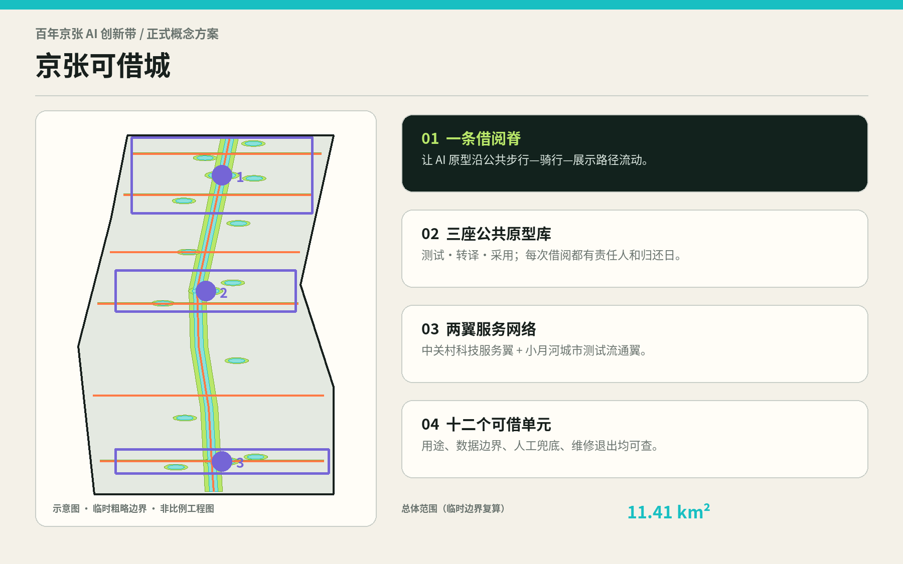
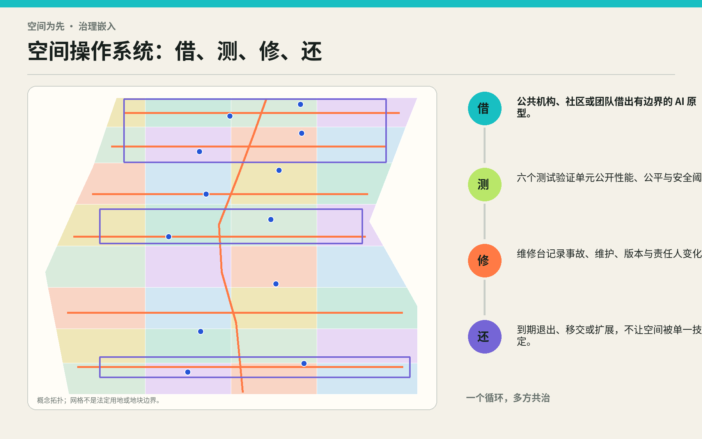
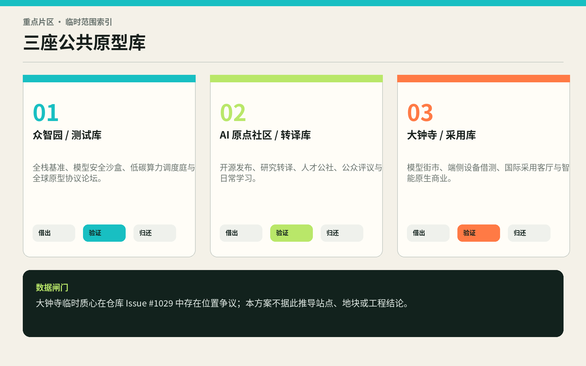
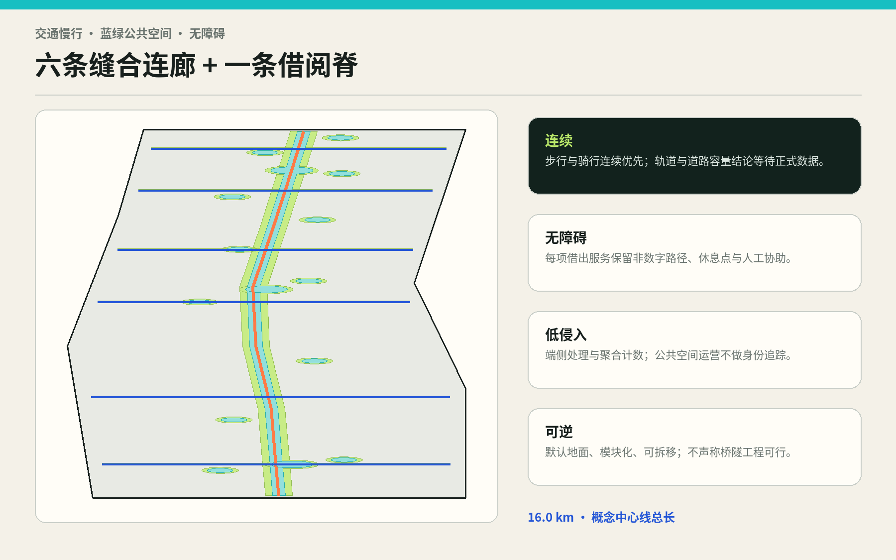
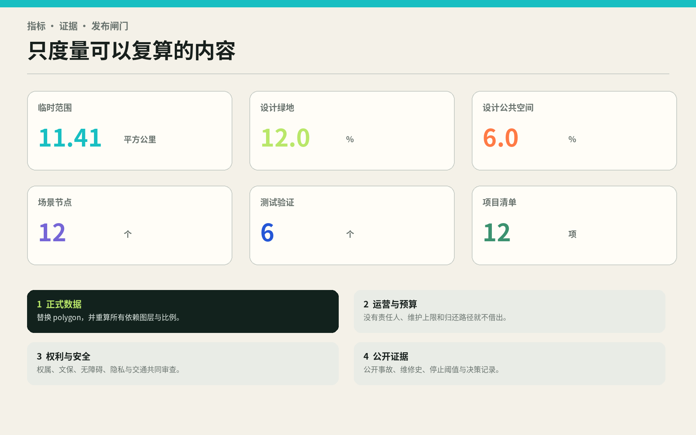

# 京张可借城 / THE BORROWABLE CITY

**把 AI 原型变成可借、可测、可归还的公共基础设施。**

## 设计依据与资料清单

本方案把“内容可评分”与“空间精度可采用”严格分开。设计任务、三层范围的约面积和三处重点片区来自官方公告；面向智能体的六项任务、案例数、场景数、画像数、品牌与运营要求来自仓库任务书。结构化设计只使用当前仓库允许的输入，日期锁定为 2026-08-11。公告是任务依据，不等于仓库已经拥有可复用的官方 CAD/GIS 红线 [source:OFFICIAL-ANNOUNCEMENT]；任务书是共创要求，不等于批准的控规或政府实施承诺 [source:AGENT-TASKBOOK]。

截至仓库最后一次公开源检查，官方精确范围 polygon、道路红线、地块权属、完整建筑现状、文保控制线、蓝绿专项控制、市政容量、容积率、建筑高度和建筑密度仍未齐备。因此 `geometry/site_boundary.geojson` 与 `geometry/key_areas.geojson` 原样承接维护者定义的 provisional geometry，只用于裁切、构图、自检和讨论。以 EPSG:4548 对临时总体 polygon 复算得到约 **11.41 平方公里**，这是“已知的计算结果、低置信度的空间依据”，不是官方面积确认 [data:geometry/site_boundary.geojson#PROV-SITE-001] [metric:site_area_sqm]。

仓库 Issue #846 记录：一个 OSM 京张遗址公园对象与临时总体 polygon 不相交，最近约 412.5 米；Issue #1029 记录：大钟寺临时重点片区质心可能落在北京北站附近。两边 geometry 都不足以升级为法定事实，所以本方案不移动维护者边界、不把 OSM 作为替代红线，也不从临时质心推断站城、地块或工程关系；只把争议写入 `assumptions.json` 和场景约束层，等待正式底图触发全包重算 [source:ISSUE-SPATIAL-MISMATCH-846] [source:ISSUE-DAZHONGSI-1029]。

证据采用四级结构：第一层是公告与正式标准；第二层是仓库登记的 cleared / provisional 输入；第三层是国际案例的机制参照；第四层是本方案生成的设计、指标和假设。国际案例不能证明京张现状，概念 geometry 不能证明法定控制，设计比例也不能写成审定指标。完整用途边界在 `sources.json`，缺口与替换条件在 `assumptions.json`，专业响应在三张矩阵中 [source:SOURCE-REGISTRY] [depth:existing_conditions_diagnosis]。

## 三层范围工作框架

三层范围不是三套彼此独立的图，而是一条从机制到空间再到运营的推理链。约 43.6 平方公里统筹研究范围回答“AI 创新如何被全城借用”：梳理科研、开源、企业、科技服务、公共场景与生活支持之间的流通关系。约 11.4 平方公里总体设计范围回答“借阅系统怎样成为城市形态”：以一条南北公共循环脊组织研发、学习、采用、绿地与公共服务的概念拓扑。三处重点片区回答“谁负责测试、转译和采用”：分别形成众智园测试库、AI 原点社区转译库、大钟寺采用库 [depth:three_level_scope_framework] [standard:PROJECT-OFFICIAL-ANNOUNCEMENT]。

总体结构概括为 **“一脊三库、两翼十二单元”**。一脊是连续的步行—骑行—展示—维修循环；三库是公共原型的测试、转译和采用机构；中关村科技服务翼提供法律、知识产权、标准、资本、人才与算力的“图书管理员服务”；小月河场景赋能翼让原型进入社区、交通、教育、照护和环境等真实但可控的日常场景；十二单元是带借阅期限和退出记录的空间节点。它们不是新红线，而是可在正式边界内重新投影的关系结构 [data:geometry/roads.geojson#ROAD-001] [data:geometry/constraints.geojson#SCN-01]。

每一层都使用同一张“借阅证”：写明用途、借方、空间、数据最小化边界、模型与版本、责任人、人工替代、借期、成功阈值、停止阈值、维护预算和归还去向。统筹层评价生态循环是否成立；总体层评价网络是否连续、公共且可逆；重点片区评价原型能否被安全运营。这样，宏观产业口号会被迫回答空间和责任问题，局部漂亮节点也必须说明它服务哪条创新链。

正式数据到达后，三层范围执行同一替换顺序：先锁定来源、版本和坐标系；再替换 site/key-area polygons；随后重裁用地、建筑、绿地、公共空间与分期；再重算全部已知指标；最后重渲染中英图件、HTML 与 PDF，并重新自检。任何只换底图、不换指标的操作都被视为失败 [depth:metrics_recalculation] [data:geometry/phasing.geojson#PHASE-001]。

## 统筹研究范围产业与未来城市研究

“可借”针对的是 AI 创新带常见的断裂：研究成果停在实验室，企业原型缺少合规的真实场景，公共部门难以承担永久采购风险，居民只在产品发布时被动体验。京张可借城把创新链重写为公共循环：**馆藏登记—问题发布—限时借出—真实测试—公众评议—维修复盘—归还/移交/扩展/退役**。土地与建筑提供可替换的空间插槽，运营协议提供时间边界，公开证据让扩展决定可被质询。

六个全球案例只提炼机制，不复制规模、制度或绩效 [source:CASE-HELSINKI]：

| 案例 | 可核实的主要机制 | 对京张的可迁移设计 | 不迁移的内容 |
| --- | --- | --- | --- |
| Testbed Helsinki | 在真实城市环境中让企业、研发机构、城市人员和终端用户共同测试 | 把城市资源组织成可申请、有限期、有反馈的场景目录 | 芬兰采购制度与项目成效不作北京类比 |
| Singapore IMDA OIP | 问题方发布挑战，方案方形成 POC/Prototype，并可能进入验证与采用 | 建立“问题单—借阅证—验证报告—采用决定”链条 [source:CASE-SINGAPORE-OIP] | 数字平台规模和奖金机制不直接移植 |
| Paris-Saclay | 将建筑、公共空间、活动与大尺度示范嵌入开放创新网络 | 三库不是孤立地标，而是互认借阅记录的节点网络 [source:CASE-PARIS-SACLAY] | 法国规划治理和开发机制不移植 |
| Mila / Montréal | 研究、训练、开放科学、创业与产业伙伴共享社区 | AI 原点社区承担研究成果的公共语言转译和人才共同体 [source:CASE-MILA] | 机构规模与伙伴数量不作为本地目标 |
| MaRS / Toronto | 创业支持、技术采用、召集功能与创新空间协同 | 大钟寺采用库把展示变成首用客户、维护与退出服务 [source:CASE-MARS] | 自报经济绩效不作为京张收益预测 |
| 河套深港科技创新合作区 | 一心两翼、规则试验、中试转化和跨边界要素协同 | 用“服务翼+场景翼”区分规则服务与测试流通 [source:CASE-HETAO] | 跨境制度、法定指标和空间尺度不移植 |

产业生态因此由八类可借资源组成：土地插槽、共享空间、人才时间、算力额度、清权数据、测试场景、专业服务和首用机会。众智园负责把模型、终端和系统做成“可出借的馆藏”；AI 原点社区负责把论文、代码和能力转成公众、创业者与治理者能理解的使用说明；大钟寺负责寻找真实采用方并建立维护、售后和退出路径；两翼让法律、资本、标准与社区场景持续循环。每项资源必须有上限和归还机制，避免“开放”演变为无限采集或隐性补贴。

品牌以一个未闭合的 **B / 回形环** 为基本图形：开口代表借出，回勾代表归还，三处节点代表三库，橙色短横代表京张轨迹与时间。中文主名“京张可借城”，英文名“THE BORROWABLE CITY”，子系统命名统一采用“测试库 / Test Library、转译库 / Translation Library、采用库 / Adoption Library、借阅脊 / Borrowing Spine”。视觉只用原创几何与开源系统字体方向，不使用企业标识、人物肖像或未经授权历史图像 [depth:overall_spatial_structure] [standard:MOHURD-URBAN-DESIGN-MEASURES]。

## 总体设计范围城市更新与控规深度城市设计

总体设计不是把“图书馆”做成建筑造型，而是建立可更新的城市组织。`land_use.geojson` 用四列八段的共享边界网格完整覆盖临时总体 polygon：两侧容纳研发、教育、生活、文化与采用服务，中部形成绿地—广场—公共服务交替的借阅脊。网格只是概念拓扑，不是法定用地或地块；它的价值是证明不同功能可以在同一条公共循环上相邻、共享和逐步替换，并能在正式 polygon 到达后自动重裁 [data:geometry/land_use.geojson#LU-001] [depth:land_use_layout]。

城市形态采用“厚边、空心、可插拔”的原型街区：沿公共空间形成有主动界面的连续边缘，把货运、设备维护、短时测试和后勤放在可管理的内院；底层提供可见的借还柜台、公共工作台、学习与展示；上部空间只表达可转换研发、办公、教育或人才服务的 envelope，不给出法定高度和规模。二十二个概念建筑 footprint 是空间容量探针，合计约 **5.74 公顷**，不代表现状建筑、批准新建量或拆除对象 [data:geometry/buildings.geojson#BLDG-001] [metric:building_footprint_area_sqm]。

空间层级从公共到受控依次为：借阅脊与广场是无需技术身份即可进入的城市底盘；公共原型库前厅可浏览目录、预约人工帮助和查看事故记录；受控测试庭按时间窗和风险等级开放；数据、模型权重、设备维护和安全操作进入后台。所有数字体验必须保留等价的非数字路径，所有可变组件必须可拆卸复位。这比“全域智慧化”更能保护城市的长期适应性。

控规深度的边界同样明确：本方案能提交功能关系、公共空间结构、概念建筑基底、更新项目、交通优先级和指标复算；不能提交容积率、建筑高度、建筑密度、道路红线、退线、停车配建或具体拆改留结论。上述五类指标在 `metrics.json` 保持 `unknown`，正式团队必须在批准控规、现状测绘、文保、交通与市政条件齐备后补齐 [standard:MOHURD-CONTROL-DETAILED-PLANNING] [depth:development_intensity_controls]。

## 重点区域详细设计

三处重点片区共享借阅协议，但承担不同风险阶段。**众智园测试库**面向“尚未准备进入城市”的原型：以开放基准大厅、模型安全沙盒、低碳算力调度庭、全栈原型工场、自主物流限时测试棚和维修退出登记站构成内外两圈。外圈可参观、可学习、可人工解释；内圈按风险等级隔离，任何自动系统都有物理停止、人工接管和事故记录。清河与绿地关系仅写为待核的低侵入界面，不触碰未取得的蓝线或工程条件。

**AI 原点社区转译库**面向“有研究价值但缺少共同语言”的成果：开源发布馆连接高校与开发者，研究转译实验室把论文转成问题单、使用说明与可验证阈值，数据契约诊所帮助社区和企业说明数据边界，人才共享屋与学习公社提供短时协作和日常生活支持，公众评议屋让非技术使用者参与停止条件的设定。空间优先缝合步行、骑行和公共活动，不预设校园或权属空间开放。

**大钟寺采用库**面向“完成验证但尚未形成可靠采用关系”的原型：模型街市按问题而不是品牌陈列，端侧设备借测廊提供短期、可退回的硬件体验，国际采用客厅连接首用单位、维护伙伴和专业服务，智能原生消费只在价格、推荐逻辑、人工申诉和退出权透明时开放。临时片区位置有已登记争议，所以所有 station/TOD、四象限连通和地块动作都只保留为待正式 geometry 触发的任务，不在本图中伪落位 [data:geometry/key_areas.geojson#PROV-KEY-003] [depth:three_key_area_detailed_design]。

| 公共原型库 | 核心空间 | 首要产出 | 借出门槛 | 归还判定 |
| --- | --- | --- | --- | --- |
| 众智园测试库 | 基准大厅、安全沙盒、算力庭、维修站 | 测试报告、风险边界、版本档案 | 安全负责人、测试数据许可、人工停止 | 达标转译；失败维修或退役 |
| AI 原点社区转译库 | 发布馆、转译实验室、契约诊所、公众评议屋 | 使用说明、场景语言、公众条件 | 研究权利清晰、目标使用者参与 | 形成可理解原型或返回研究 |
| 大钟寺采用库 | 模型街市、设备借测廊、采用客厅 | 首用协议、维护计划、退出安排 | 价格与责任透明、售后与人工申诉 | 有责移交、限量扩展或撤回 |

三库的详细设计均以“公共前厅—受控测试—维修后台—绿地缓冲—步行连接”五件套表达，可在真实地块调查后分散植入既有建筑，而非追求一次性拆建。三处临时 polygon 数量为 **3**，但边界和面积精度仍待官方文件替换 [metric:key_area_count] [data:geometry/public_space.geojson#PUBLIC-003]。

## AI 创新生态、人才画像与 AI+ 场景

六类画像不是营销分群，而是检查谁能借、谁承担风险、谁可能被排除。开源开发者需要发布、协作与声誉记录；科研人员需要可复现实验与成果权利保护；初创团队需要低成本测试、首用客户和失败后退出；成熟企业与公共机构需要采购前证据、维护责任和人工兜底；周边居民与服务人员需要低扰动、无障碍、申诉和非数字替代；国际访客与跨学科人才需要双语导航、短时协作、生活服务和可理解的治理说明。六类画像均禁止用个人轨迹做商业推荐 [metric:persona_count] [standard:PROJECT-AGENT-OPEN-CALL-TASKBOOK]。

十二张场景卡全部落在 `SCENARIO_NODE`，其中六张标为产业测试验证。这里的“已知”只指卡片和节点确实存在于提交包，不代表它们已经获批运营 [data:geometry/constraints.geojson#SCN-01] [metric:scenario_node_count]。

| # | 可借场景 / 主要使用者 | 空间与运营 | 数据、人工兜底与归还条件 |
| --- | --- | --- | --- |
| 01 | 模型街市 / 居民、采用方 | 大钟寺采用库按公共问题陈列多个可替代原型 | 不做个人画像；人工柜台；价格或责任不透明即下架 |
| 02 TVS | 端侧设备借测廊 / 创业者、居民 | 限时借用终端，在采用库维修台归还 | 本地处理优先；人工故障受理；能耗或安全越阈即召回 |
| 03 TVS | 无障碍回路借测 / 障碍者、照护者 | 六条缝合连廊中的连续出行测试 | 经同意的任务数据；现场协助；不可达点未修复则停止扩展 |
| 04 | 社区照护助手驿站 / 老人、照护者 | 社区服务点预约、解释和撤回助手 | 不代替专业判断；人工热线；误导或依赖风险触发退役 |
| 05 TVS | 开源发布馆 / 研究者、开发者 | AI 原点社区公开复现、红队与版本发布 | 只用清权数据；同行与公众双审；不可复现则退回研究 |
| 06 | 数据契约诊所 / 社区、企业 | 用可读模板声明目的、期限、共享与删除 | 人工法律复核；缺撤回和删除机制不予借出 |
| 07 | AI 学习公社 / 学生、教师、居民 | 课程、工作坊与非数字工具并置 | 不以学习分析惩罚个人；教师负责；偏差无法解释即停用 |
| 08 | 京张记忆讲述站 / 访客、居民 | 轻触式音频、口述史和路径叙事 | 史料来源可见；人工策展；错误叙事公开修订或撤回 |
| 09 TVS | 模型安全沙盒 / 团队、监管与研究者 | 众智园隔离环境测试攻击、滥用和人工接管 | 最小测试集；安全官可物理停止；未过阈值不得出库 |
| 10 TVS | 低碳算力调度庭 / 算力与能源运营者 | 显示负荷、碳强度与可中断任务排序 | 只显示聚合负荷；人工调度；能源容量未核即不接入 |
| 11 TVS | 自主物流限时测试场 / 物流人员、行人 | 低速、分时、围定路线，与普通步行分离 | 不做人脸识别；现场安全员；近失事件越阈立即召回 |
| 12 | 全球原型协议论坛 / 城市、机构、社区 | 发布借阅协议、失败档案与互认规则 | 双语人工主持；利益冲突公开；无维护方的协议不续期 |

六个 TVS 对应 **6 个**可数节点；每个测试至少报告功能、包容、安全、能耗、维护和公众接受六类结果，而非只报告准确率 [metric:testing_validation_scenario_count] [depth:municipal_new_infrastructure]。成功不是“部署越多越好”，而是证据足以决定继续、修改或停止。

四个 AI 朝圣与荣誉节点形成一条不以屏幕为中心的公共叙事：众智园“失败档案塔”展示被修复或退役的原型；AI 原点“开源年轮”记录可复现贡献；京张沿线“百年问题站”把铁路工程精神转译为当代公共问题；大钟寺“采用回声厅”展示谁在何种条件下负责使用与维护。荣誉授予团队、社区和维护者，而非只给模型或资本；每项荣誉带来源、版本和撤销机制 [metric:pilgrimage_landmark_count] [depth:height_massing_character]。

## 用地、建筑规模与拆改留方案

用地层采用四列八段、共享边界、全覆盖、无重叠的概念拓扑。科研、教育、文化、社区服务、人才生活、商业服务、绿地和广场不是各自封闭的园区，而是围绕借阅脊形成“前厅—工作—生活—绿地—后勤”连续截面。每个格网都带 `official_land_use=false` 和 `concept_only_pending_official_controls`，所以可以评议功能关系，却不能作为土地用途变更或用地审批依据 [data:geometry/land_use.geojson#LU-016] [standard:MNR-LAND-USE-CLASSIFICATION-GUIDE]。

建筑层只提交二十二个公共原型 envelope：测试、发布、学习、维修、采用、文化与社区服务等类型均有明确面向公共空间的入口。它们是“可在既有建筑更新、临时构筑或新增空间中实现”的容量探针；属性统一写明 `survey_required_no_demolition_conclusion`。设计不把任何现实建筑标为拆除，也不推定空置、质量、权属或企业意愿 [data:geometry/buildings.geojson#BLDG-009] [depth:retain_renovate_demolish]。

未来拆改留采用四道筛选而非图上着色：先核文保与不可替代价值，再核结构安全与碳成本，再核现有使用者和产权，再核公共原型是否能通过轻改造进入。满足安全和价值条件的建筑优先保留；能以首层开放、设备更新、无障碍和消防改善适配的优先改造；新增只用于无法由既有存量承担的公共缺口；拆除必须是最后选项，并须有正式依据、安置与碳核算。当前数据只能形成方法，不能形成逐栋结果 [depth:risk_missing_data] [source:BOUNDARY-SOURCE]。

总建筑规模、容积率、建筑高度与密度保持未知。概念 footprint 的复算面积约 **5.74 公顷**，只用于检查图层与公共空间关系；不得用它倒推开发量。取得正式地块和现状建筑后，应把每个原型映射到“保留嵌入、改造嵌入、临时插入、经批准新增”四类，并重新生成建筑、项目和投资边界 [metric:building_footprint_area_sqm] [depth:development_intensity_controls]。

## 交通、轨道、市政与公共服务设施

交通策略先解决“能否不用 AI 也走通”。一条借阅脊贯通南北，六条东西缝合连廊连接两侧生活、研发与公共服务，概念中心线合计约 **16.0 公里**。借阅脊同时承担步行、骑行、原型推车、导览与维修到达；连廊优先地面连续、短过街、清晰视距、遮荫、休息与无障碍。所有 centerline 都不是道路红线，六条横向关系也不等于六项桥隧工程 [data:geometry/roads.geojson#ROAD-001] [metric:east_west_link_count]。

轨道站点一体化只保留工作任务：正式站点、出入口、客流、公交、道路渠化、消防、产权和高差数据齐备后，才能选择接驳节点、四象限关系和步行时间；大钟寺尤其受临时位置争议约束。停车不以“AI 自动调度”替代供需调查，先通过共享装卸时窗、短停借还、无障碍停车、非机动车安全停放和物流错峰减少冲突，再由正式交通模型决定规模 [depth:traffic_rail_slow_parking] [source:ISSUE-DAZHONGSI-1029]。

市政新基建采用可插拔、可计量、可中断的“小负荷先行”。端侧算力柜、环境传感器、电子墨水导视、设备充电与维修台先进入三库和十二节点；每个接入点记录功率上限、网络分区、数据保存期、停电和断网模式、消防与运维责任。区域算力、能源站或地下空间不在本方案中推定。只有市政容量、碳强度、热环境和网络安全条件确认后，才允许从节点扩展为网络 [data:geometry/constraints.geojson#SCN-10] [depth:municipal_new_infrastructure]。

公共服务遵循“人工底座、数字增益”：图书馆式柜台提供场景目录、投诉、借还与维修；社区服务点提供老年人、儿童和障碍者的人工协助；法律、知识产权、标准和数据服务由中关村翼支撑；运动、休息、饮水、卫生间、母婴与夜间安全属于任何 AI 展示之前的基础供给。智能服务失效时，空间仍应工作。

## 蓝绿空间、公共空间与城市风貌

蓝绿系统不是指标填色，而是原型测试的安全缓冲和日常公共底盘。概念绿地由借阅脊连续绿廊、十二个海绵口袋园、三库花园和六条雨水花园构成，联合复算约 **136.9 公顷**、占临时总体 polygon 约 **12.0%**。这是设计图层比值，不是批准绿地率；法定绿地、河道蓝线、树木和生态基底到达后必须重裁 [data:geometry/green_space.geojson#GREEN-001] [metric:green_ratio]。

公共空间由全天候借阅步廊、可归还场景庭、三库公共客厅和六条连廊组成，联合复算约 **68.4 公顷**、约 **6.0%**。它表达连续公共使用的设计意图，但通行权、开放时间、产权、安全和维护仍待核。节点采用“空白优先”原则：当一个 AI 原型归还，场地回到有树荫、座椅、电源、雨棚和人工服务的普通公共空间，而不是留下废弃专用设施 [data:geometry/public_space.geojson#PUBLIC-001] [metric:public_space_ratio]。

城市风貌以百年京张的工程理性而非复古造型为线索：可读的结构、节制的材料、耐久维修、明确时间层次和面向公共的基础设施。新组件使用低反光金属、再生砖、木构遮荫、电子墨水和可替换连接；夜间照明只照路径、入口与操作面，避免媒体立面主导历史空间。B/回形标识作为尺度可变的借还记号，可成为地面嵌件、门牌、雨棚接头或展签，不制造巨型网红物。

文化叙事由“铁路把知识、人与城市连接起来”转向“AI 原型也必须安全地流通并回到公共责任”。历史内容须由清权史料、专业策展与社区口述共同构成；生成式内容在展签上标注模型、来源、编辑人与版本。无法核实的故事不进入永久展陈，涉及遗址本体的任何设施必须先通过文保审查 [standard:MOHURD-URBAN-DESIGN-MEASURES] [depth:blue_green_public_space]。

## 更新项目清单、实施政策与分期计划

十二项更新项目按“先协议、再节点、后网络”推进，数量是提交包中可核的设计清单，不是政府项目立项 [metric:renewal_project_count] [data:geometry/phasing.geojson#PHASE-001]。

| # | 项目 | 阶段 | 责任组合与交付物 | 进入下一阶段的门槛 |
| --- | --- | --- | --- | --- |
| 01 | 公共原型借阅协议与开放目录 | 近 | 城市协调方+三库运营方；公开模板和版本库 | 法律、隐私、维护与退出审查 |
| 02 | 众智园模型安全沙盒首发 | 近 | 测试库+研究机构+安全负责人；基准和事故记录 | 人工停止、隔离环境、责任保险可用 |
| 03 | AI 原点开源发布馆首发 | 近 | 转译库+高校社区；复现、说明书和公众评议 | 代码/数据权利清晰、无障碍可达 |
| 04 | 大钟寺模型街市移动原型 | 近 | 采用库筹备方+社区；可移动展架和人工柜台 | 正式位置、权属与客流核准 |
| 05 | 借阅脊首段与统一导视 | 近 | 公共空间运营方；连续步行、维修到达和 B/回标识 | 交通、文保、绿化与夜间安全审查 |
| 06 | 六场景 TVS 验证计划 | 近 | 场景方+第三方评估；公开阈值与停止报告 | 数据影响评估和人工替代完成 |
| 07 | 三库永久/半永久空间成网 | 中 | 业主+运营联盟；前厅、测试、维修、绿地五件套 | 正式地块、建筑调查和资金闭合 |
| 08 | 六条东西缝合连廊 | 中 | 交通+街道+业主；地面优先的无障碍连接 | 工程可行性、消防与维护责任明确 |
| 09 | 中关村“图书管理员”服务翼 | 中 | 法律、IP、标准、资本与人才服务联盟 | 收费透明、利益冲突披露、普惠配额 |
| 10 | 小月河场景流通翼 | 中 | 社区和城市服务运营方；移动测试与反馈网络 | 蓝绿、文保、隐私和居民同意边界 |
| 11 | 跨库借阅记录与荣誉系统 | 远 | 独立公共信托/联盟；互认记录与撤销机制 | 审计、数据最小化和公共监督成熟 |
| 12 | 存量建筑可逆嵌入计划 | 远 | 专业设计团队+业主；逐栋保改新增决策 | 正式控规、权属、结构和碳评估齐备 |

近期开启期（2026—2028）以协议、移动原型和三个首发节点验证机构能力；中期成网期（2029—2032）在正式数据与运营闭合后建设三库、六连廊和两翼服务；远期循环期（2033+）才讨论跨库互认、存量建筑系统更新和区域扩展。年份是顺序假设，不是工期或财政承诺 [depth:phasing_implementation] [standard:PROJECT-AGENT-OPEN-CALL-TASKBOOK]。

长期运营采用“公共底盘+多方借阅费+开放维护账”。公共底盘保障基础空间、人工柜台与包容性；高风险测试按成本收取场地、评估与维修费用；企业采用产生的服务收入反哺免费公众时段；高校、社区与开源贡献可用时间或成果抵扣。年度报告公开借出量、失败率、事故、维修时间、退出数量、公众申诉和包容性结果。任何单一供应商不得锁定空间、数据格式或导视系统。

## 指标体系、面积复算与合规矩阵

指标分为三类：**geometry-derived** 从提交图层在 EPSG:4548 下计算；**document-count** 从正文或结构化清单计数；**unknown** 等待法定或现状数据。所有 numeric visual 都与 `metrics.json` 完全一致；临时 site 面积作为分母时，比例置信度随之降低。正式 polygon 一旦改变，任何沿用旧比例的图纸都必须作废 [depth:metrics_recalculation] [standard:MOHURD-ARCH-DESIGN-DEPTH-2016]。

| 指标 | 当前值 | 状态与解释 |
| --- | --- | --- |
| 临时总体 polygon 面积 | 11.413 km² [metric:site_area_sqm] | known calculation / low-confidence basis；非 official redline |
| 设计绿地联合面积与比值 | 136.92 ha；12.00% [metric:green_space_area_sqm] | concept geometry；不是批准绿地率 |
| 设计公共空间联合面积与比值 | 68.44 ha；6.00% [metric:public_space_area_sqm] | public-access intent；权属与开放待核 |
| 概念原型建筑基底 | 5.74 ha [metric:building_footprint_area_sqm] | 不是现状或批准建筑规模 |
| 概念交通中心线 | 15.98 km [metric:conceptual_route_length_m] | 不是道路红线或工程长度 |
| 三库 / 十二节点 / 六验证 | 3 / 12 / 6 [metric:prototype_library_count] | 可核的设计对象，不是批准运营数量 |
| 容积率、高度、密度、批准绿地率 | unknown | 缺批准控规、现状测绘和专项控制 |

面积复算遵循：GeoJSON 交换坐标系 EPSG:4326；面积与长度统一投影 EPSG:4548；同层多要素先 `union` 后计算，避免重叠重复；用地必须完整覆盖且彼此无重叠；已知指标与 visual 的 `data-value` 一致；所有图件标注 provisional 与非比例。机器审计分别落在 `metrics.json`、`standard_matrix.json`、`design_depth_matrix.json` 和 `compliance_matrix.json` [data:geometry/land_use.geojson#LU-001] [depth:land_use_layout]。

标准响应不靠一串编号充当设计：公告与任务书确定任务，城市设计管理要求用于空间、风貌和公共性，控规要求用于区分建议和审定条件，用地分类指南用于代码语义，建筑设计深度缺口被明确留给后续专业阶段。每条标准均在矩阵中连接正文、图层、指标、图纸、来源、假设和自检 [standard:PROJECT-AGENT-OPEN-CALL-TASKBOOK] [standard:MOHURD-CONTROL-DETAILED-PLANNING]。

## 风险、版权与合规说明

首要风险是**空间争议**：临时总体和重点片区可能偏移，所有位置结论都有误读风险。缓解方式是突出 provisional 警示、不移动维护者约束、不作工程判断，并把 official geometry 设为硬闸门。第二是**治理漂移**：借阅可能变成长期占用或供应商锁定；因此每张借阅证必须有期限、维护上限、开放格式与退出路线。第三是**隐私与监控**：公共空间默认端侧、聚合、最少数据，不做人脸识别或个体商业画像，并保留人工和非数字路径 [depth:risk_missing_data] [standard:PROJECT-GENERATIVE-AI-INTERIM-MEASURES]。

第四是**公平与无障碍**：技术熟练者可能垄断测试机会，障碍者和老人可能承担失败成本；因此设置人工柜台、免费公众时段、参与补偿、无障碍共同测试和申诉。第五是**技术与运维**：模型迭代快于建筑，设备易形成电子废物；因此使用可拆卸插槽、版本标签、维修台、召回和退役记录。第六是**实施与资金**：三库可能成为昂贵地标；因此移动原型先行、既有建筑优先、每期必须先确认运营方和全生命周期预算 [standard:PRC-BARRIER-FREE-ENVIRONMENT-LAW] [standard:MIIT-ELDERLY-SMART-TECH-PLAN]。

本成果不含第三方照片、专有底图、商标、人物肖像、个人信息或未清权企业材料。文字、原创图解、概念图层和版式以 `COMMUNITY-DISPLAY-ONLY` 提交本次开源征集展示；官方资料和案例事实保留各自权利并在 `sources.json` 署名。软件只帮助计算与渲染，不改变输入资料的权威等级。生成式内容经过结构化校验，但仍需规划、建筑、交通、文保、法律、隐私、无障碍和运营专业人员审查。

停止条件包括：无法提供官方/清权空间依据却要求精确落位；无法提供人工接管；使用目的外个人数据；事故或近失越过公开阈值；维护方退出；成本超过公开上限；公众申诉无法处理；原型侵占基础公共服务。触发任一条件时先停止借出，再保全记录、恢复场地、通知受影响者并决定维修、降级或退役。

## 参考资料

以下清单是人类阅读索引；机器字段、访问日期、用途和限制见 `sources.json`。第一组为任务与数据依据：北京市规划和自然资源委员会海淀分局征集公告 [source:OFFICIAL-ANNOUNCEMENT]；面向全球智能体任务书 [source:AGENT-TASKBOOK]；仓库 site package、来源注册表和 processed fact pack [source:SITE-PACKAGE]。临时范围只来自维护者 provisional boundary，不来自本方案自行搜索的地图 [source:BOUNDARY-SOURCE]。

第二组为机制案例：City of Helsinki 的 Testbed Helsinki；Singapore IMDA 的 Open Innovation Platform；EPA Paris-Saclay 的开放创新与大尺度示范；Mila 的研究—训练—开放科学—产业伙伴社区；MaRS Discovery District 的创业支持、采用与创新空间；深圳河套法定图则的一心两翼和规则试验定位。它们均按 background-only 使用，不承担本地事实或指标证明 [source:CASE-PARIS-SACLAY] [source:CASE-HETAO]。

第三组为风险与专业依据：城市设计管理、控规、国土空间用途分类、生成式人工智能、无障碍环境与适老化文件由 `standard_matrix.json` 逐条响应。官方建筑设计深度标准正文在仓库中仍登记为缺失，因此本方案只声明后续深度接口，不声称已经满足完整施工图或工程设计要求 [standard:MOHURD-ARCH-DESIGN-DEPTH-2016] [depth:risk_missing_data]。

空间异常的公开讨论见 Issue #846 与 #1029；这些 Issue 是问题记录，不是权威底图。工具链包括 Python、Shapely、PROJ/pyproj、Pillow、ReportLab 和仓库校验脚本，图件没有外部底图或远程资源 [source:TOOLCHAIN]。所有来源均应在 official geometry 发布、专业团队接管或实施决策前重新核查最新状态。
