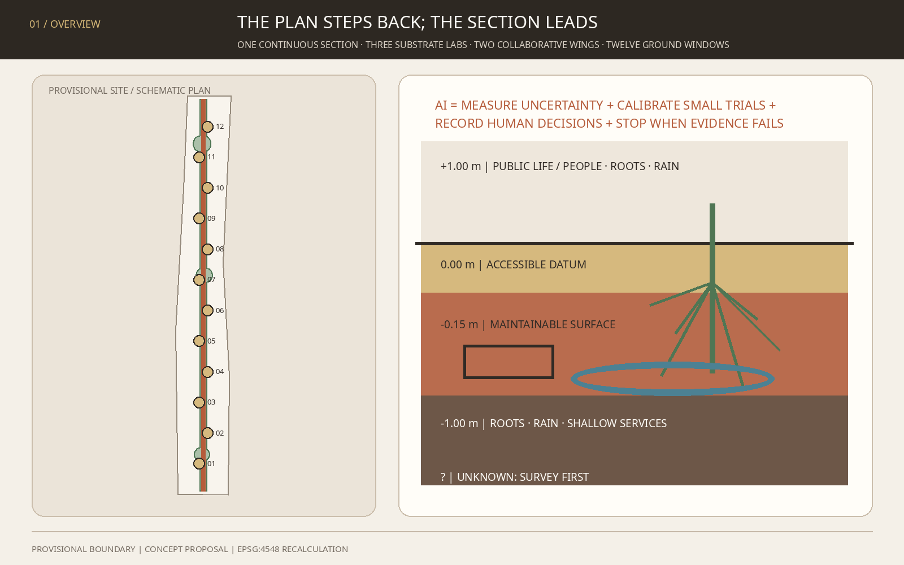
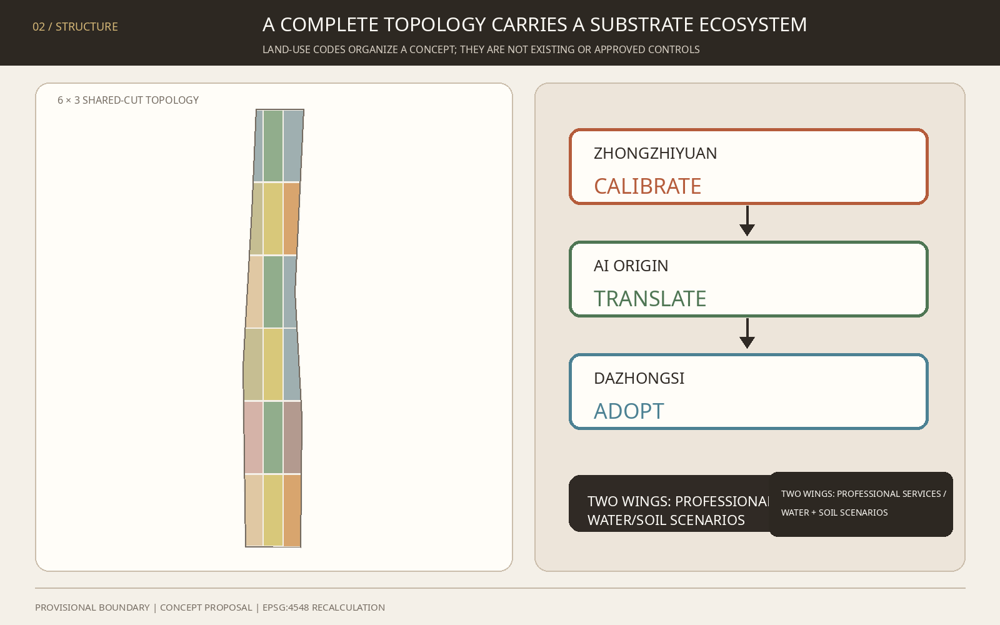
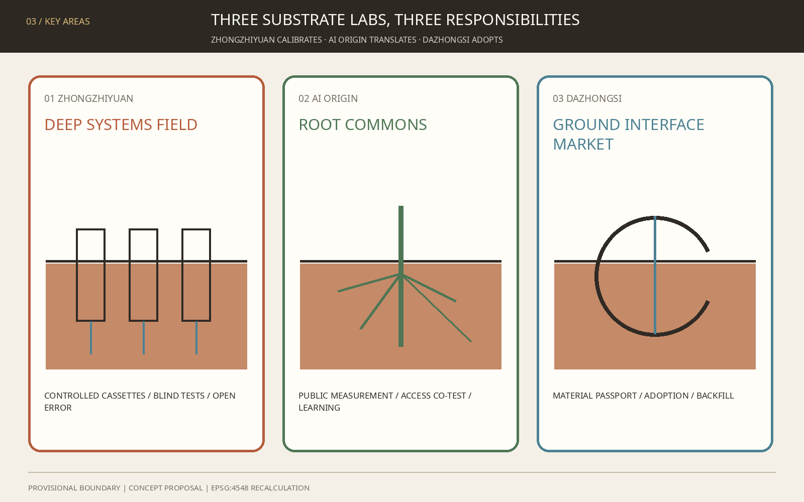
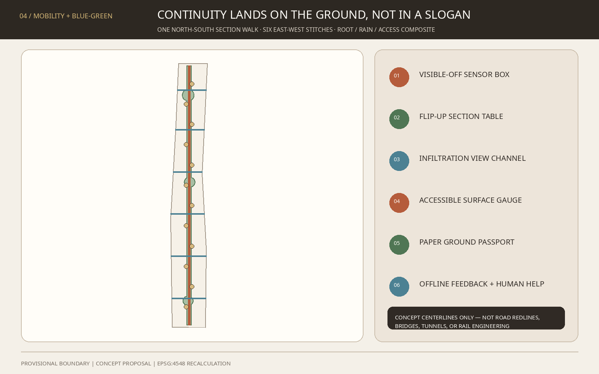
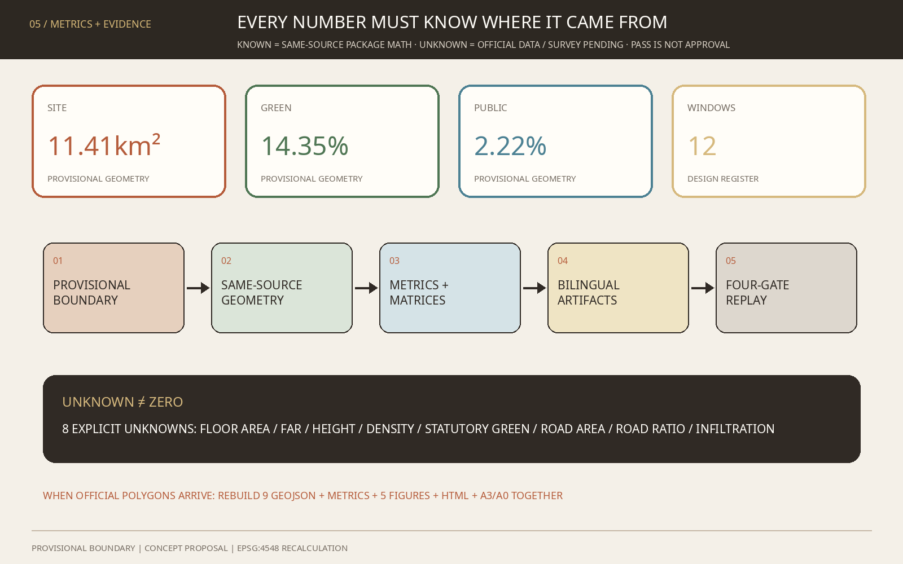

# THE FIRST METRE / 京张第一米

> Draw the AI innovation belt as a section. Know what is underfoot before deciding what to place above it.

This proposal does not turn the railway into another data spine, protocol line, or shared ledger. It lowers the starting point of urban design to the first metre above and below the surface: how paving drains, roots breathe, wheelchairs travel smoothly, shallow services become legible, and heritage-adjacent ground remains undisturbed. AI does not replace engineering judgement. It measures uncertainty, calibrates small trials, records human decisions, and stops when evidence is insufficient.

The framework is **one continuous section, three substrate laboratories, two collaborative wings, and twelve ground windows**. A horizontal datum crossing a soil dot forms the identity: public life above; a sensitive urban substrate below. Iron-oxide red, root green, groundwater blue, and paper beige establish a material visual language wholly distinct from the existing Borrowable City proposal.

## Design Basis and Source List

Evidence is separated into three levels. The announcement and cleared taskbook establish tasks, scope names, and approximate areas. Maintainer-supplied provisional polygons support clipping, visualization, and intake review only. Proposed land use, nodes, and routes are concept suggestions for professional development. Authority descends from GeoJSON to metrics, matrices, prose, figures, and web presentation.[source:SITE-PACKAGE] [source:SOURCE-REGISTRY] [depth:existing_conditions_diagnosis]

The official announcement confirms the 43.6 km² coordinated research area, the 11.4 km² overall design area, three key areas, and design tasks, but no official polygons with a verifiable CRS are present in the repository. `SITE-001` and the three `PROV-KEY` features therefore retain `official_boundary=false` and `provisional_constraint`; they are not redlines, ownership boundaries, road limits, or engineering limits.[source:OFFICIAL-ANNOUNCEMENT] [source:BOUNDARY-SOURCE] [standard:PROJECT-OFFICIAL-ANNOUNCEMENT]

The missing evidence is especially material because this proposal concerns the first metre. No cleared soil-contamination, compaction, root, groundwater, drainage, utility, or buried-heritage dataset is available. Every shallow-ground move therefore passes through “survey first—test second—decide last”; excavation, remediation, utility relocation, and infiltration performance remain professional follow-ups.[source:PROCESSED-FACT-PACK] [source:KEY-AREA-SOURCE] [depth:risk_missing_data]

Repository Issues #846 and #1029 document, respectively, the non-intersection between the provisional site and an OSM park object and a possible Dazhongsi location error. This package discloses them without upgrading OSM or issue findings to official fact. When official geometry arrives, all nine GeoJSON files, metrics, five figure families, and bilingual drawings must be regenerated together.[source:ISSUE-SPATIAL-MISMATCH-846] [source:ISSUE-DAZHONGSI-1029]

## Three-Level Scope Framework

| Level | Known task | First Metre method | Current precision |
| --- | --- | --- | --- |
| Coordinated research area | Approx. 43.6 km²; global AI ecosystem and future-city form | Build a research–test–public review–department adoption ecosystem across the Three Areas and Two Wings | Text description and approximate area only |
| Overall design area | Approx. 11.4 km²; regulatory-plan-level urban design | Use a complete land-use topology to carry one continuous section, a root-zone green spine, six east-west stitches, and twelve windows | Rough provisional polygon |
| Key areas | Zhongzhiyuan, AI Origin, and Dazhongsi; approx. 368.4 ha combined | Three substrate laboratories for calibration, public translation, and adoption | Three provisional rectangular polygons |

Strategy, overall urban design, and key-area prototypes transmit decisions down the three levels. The coordinated level determines who frames the problem; the overall level locates it in land use, slow mobility, public space, and phasing; the key-area level validates only reversible prototypes. [depth:three_level_scope_framework] and [depth:overall_spatial_structure] govern this logic, provisionally carried by [data:geometry/site_boundary.geojson#SITE-001] and [data:geometry/key_areas.geojson#PROV-KEY-001].

The “continuous section” is not a new underground corridor. It is a decision order. Each project first shows above-ground use, surface material, root/rain zone, shallow services, and unknowns in a five-cell section. Without survey authority, an operator, and a backfill plan, it does not advance. The twelve ground windows are reversible surface spaces; they do not presume excavation. Six east-west stitches are concept slow-mobility centerlines, not road redlines or bridge/tunnel schemes.[data:geometry/roads.geojson#ROAD-001] [metric:east_west_link_count]

## Coordinated Research Area: Industry and Future City Research

### 1. Name, logo, and three positionings

“The First Metre” converts an AI-industry question into an urban interface everyone can perceive. The `—●—` datum-and-soil-dot logo extends across wayfinding, ground marks, report folios, and test-status plates. It uses no corporate mark, portrait, external image, or uncleared typeface; all formal assets are generated within this package.[source:AGENT-TASKBOOK] [standard:PROJECT-AGENT-OPEN-CALL-TASKBOOK]

| Three positionings | First-metre translation of the five functions | Three Areas and Two Wings |
| --- | --- | --- |
| Centennial Jing-Zhang Cultural Belt | Translate grade, datum, formation, and maintenance into a non-invasive ground narrative | The heritage park is a continuous reading interface, not a presumed worksite |
| Metropolitan AI Life Experience Belt | Let people experience rain, roots, accessibility, and maintenance rather than watch more screens | AI Origin translates for the public; Xiaoyuehe hosts low-risk environmental scenarios |
| AI Convergence Innovation Belt | Link sensing hardware, environmental models, inspection robots, materials, maintenance software, and professional services | Zhongzhiyuan calibrates; Dazhongsi supports adoption; Zhongguancun supplies legal, standards, finance, and design services |

The five functions form one loop. Zhongzhiyuan researches and calibrates interpretable environmental sensing and robotics. AI Origin translates technology into sections, curricula, and services. Dazhongsi confronts materials, devices, and maintenance software with adoption questions. The Zhongguancun Technology Service Wing supplies standards, IP, compliance, design, and finance. The Xiaoyuehe Scenario Empowerment Wing hosts authorized seasonal water-and-soil trials. Results return to public review and professional sign-off; no model jumps directly to construction.

### 2. Seven global cases and bounded transfers

| Case | Mechanism visible in a primary source | Bounded Jing-Zhang translation |
| --- | --- | --- |
| Cooling Singapore 2.0 / DUCT | Couples environmental models to compare heat-management options | Require simulation, small trial, then adoption; do not import climate parameters [source:CASE-SINGAPORE-DUCT] |
| Amsterdam Responsible Sensing Lab | City, researchers, and practitioners co-design and test responsible public sensing | Show what every sensor measures, who uses it, and when it turns off [source:CASE-AMSTERDAM-RSL] |
| Chicago Array of Things | Modular environmental sensing, open data, edge processing, and oversight | Use replaceable sensor cassettes and public calibration records; do not copy scale or current status [source:CASE-CHICAGO-AOT] |
| UK NBIF | Controlled research on buried infrastructure–ground interaction, detection, and trenchless technology | Build authorized controlled test sections before any street trial [source:CASE-UK-NBIF] |
| UK NUAR | Governed access to underground-asset information from many owners | Propose tiered access and conflict rehearsal; do not expose sensitive utility data or transplant law [source:CASE-UK-NUAR] |
| Testbed Helsinki | Companies, RDI actors, residents, and city departments test in authentic environments | Require a city problem owner, eventual operator, and exit path for every trial [source:CASE-HELSINKI-TESTBED] |
| Boston MONUM | Civic teams prototype with communities and transfer mature work to responsible departments | Ask “who ultimately owns this?” before a trial begins [source:CASE-BOSTON-MONUM] |

These are background mechanisms, not proof of existing Jing-Zhang facilities and not statutory, fiscal, or performance evidence. Current status, licenses, governance differences, and comparability require review before use.[depth:municipal_new_infrastructure]

### 3. Innovation ecosystem and regional collaboration

The industry map has six families: environmental and geophysical sensing; inspection robotics; permeable and maintainable materials; urban environmental models; accessibility and public-space assessment; and underground-asset/maintenance software. Four small facility types replace a closed mega-campus: controlled test field, public calibration table, neighbourhood use window, and adoption service hall. Collaboration with Future Science City, Huairou Science City, Beijing E-Town, Zhangjiakou, or other regions is framed only as open benchmarks, joint curricula, and reproducible data formats—not as an existing agreement, project, or funding commitment.

## Overall Design Area: Urban Renewal and Regulatory-Plan-Level Urban Design

The overall design starts with a vertical section rather than a rendered masterplan. Five decision layers are `+1.00 m public life`, `0.00 m accessible datum`, `-0.15 m maintainable surface`, `-1.00 m root/rain/shallow-service zone`, and `unknown below`. These are diagram coordinates, not excavation controls; strata, groundwater, heritage, and utilities await survey.

A 6×3 shared-cut topology partitions the full provisional site into R&D calibration, public learning, community service, talent living, culture, commercial service, park green, and square concept units. Their union equals `SITE-001` without overlap. Codes come from the national classification subset but do not imply approved parcel uses.[data:geometry/land_use.geojson#LU-001] [standard:MNR-LAND-USE-CLASSIFICATION-GUIDE] [depth:land_use_layout]

Urban renewal follows “diagnose first, classify later.” Without existing-building, title, or safety data, twelve light-touch pavilion footprints express spatial demand only and label no real building retain, renovate, or demolish. Future professionals should classify each building through public value, structural safety, title-holder intent, carbon, heritage, and operating capacity.[data:geometry/buildings.geojson#BLDG-001] [depth:retain_renovate_demolish]

FAR, building height, density, statutory green ratio, and setbacks remain pending official data. This package reports geometric readings from concept layers, never regulatory targets. Massing guidance is limited to low disturbance, reversibility, continuous ground, and view protection pending evidence; numerical controls belong to approved planning and professional review.[standard:MOHURD-CONTROL-DETAILED-PLANNING] [depth:development_intensity_controls] [depth:height_massing_character]

## Detailed Design of Key Areas

All three key areas use provisional polygons. The following “mechanism + spatial prototype” packages are material for professional development, not ownership, demolition, station engineering, or implementation conclusions.[data:geometry/key_areas.geojson#PROV-KEY-001] [data:geometry/key_areas.geojson#PROV-KEY-002] [depth:three_key_area_detailed_design]

### Zhongzhiyuan: DEEP SYSTEMS FIELD

- **Position:** controlled source for full-stack AI calibration and governance standards.
- **Structure:** an above-ground 1:1 Datum Section Hall, three replaceable test cassettes, and a no-dig observation path that does not infer actual river or utility positions.
- **Industry:** geophysical sensing, robotic inspection, edge inference, material ageing, and root–service conflict simulation.
- **Movement and public realm:** a concept slow link to the First Metre walk; Fifth Ring access remains a specialist study.
- **Gate:** site authority, soil/utility/heritage survey, experiment safety, data classification, and an accountable operator.

### Beijing AI Origin Community: ROOT COMMONS

- **Position:** translate professional models into public evidence for residents, students, and innovation workers.
- **Structure:** Root Library, public measurement table, accessible ground loop, and post-rain replay court; no unapproved campus, neighbourhood, or corporate incursion.
- **Industry and life:** environmental-data curricula, accessibility co-measurement, neighbourhood maintenance, and near-campus translation.
- **Transit:** Wudaokou and Qinghua Donglu Xikou are treated as walking and interchange questions, not engineering alignments.
- **Governance:** open data dictionary, visible sensor state, human explanation desk, and paper alternative.

### Dazhongsi: GROUND INTERFACE MARKET

- **Position:** move detection, materials, robotics, and maintenance software from display to accountable adoption.
- **Structure:** Backfill Bell Hall, four-quadrant ground-experience tables, bicycle-ordering modules, and demountable sample racks.
- **AI-native uses:** ground-health reports, accessibility review, material passports, maintenance training, and small procurement rehearsals.
- **Station relation:** because the provisional polygon may be misplaced, no drawing is presented as the actual Dazhongsi station quadrants; no crossing, underground, or station-city engineering conclusion is made.
- **Adoption rule:** only prototypes with reviewed risk, maintenance, data, human responsibility, and exit plans enter time-limited adoption discussion.

## AI Innovation Ecosystem, Personas, and AI+ Scenarios

### Six personas

| User | Critical daily question | Space and human guarantee |
| --- | --- | --- |
| Geophysics / urban-environment researcher | Under which soil and device conditions does an algorithm fail? | Controlled benchmark section, versioned truth, published failures |
| Small sensing / robotics team | Where can a comparable, low-risk real-world test happen? | Bookable cassette, common interface, explicit liability and backfill |
| Frontline maintenance crew | Why do drawing, field condition, and work order disagree? | Ground Passport, conflict rehearsal, human sign-off, paper fallback |
| Wheelchair, cane, or low-vision user | Are smoothness, slope, ponding, and guidance actually usable? | Co-measurement loop, tactile/visual channels, on-site help |
| Student, teacher, or family | How can an invisible urban substrate be learned? | Soil classroom, Root Library, tactile section model |
| Resident or small shop | How will works and sensing affect everyday life? | Advance notice, non-digital feedback, stop/appeal channel, backfill promise |

Co-creation follows principles for connected accessible facilities, legible signs, and user consultation. Article 39 human-service provisions are used only for the listed medical, social-security, financial, and utility-payment contexts, not generalized as a legal conclusion for every space.[source:BARRIER-FREE-LAW] [standard:BARRIER-FREE-ENVIRONMENT-LAW] [metric:persona_count]

### Twelve scenario cards

| # | Scenario / space | Data boundary | Human review and stop condition |
| ---: | --- | --- | --- |
| 01 ★ | Blind Subsurface Mapping / controlled Zhongzhiyuan cassette | Synthetic or authorized targets, instrument logs | Professional reveal; stop on excess error, unknown object, or safety risk |
| 02 ★ | Root-Zone Moisture Calibration / Zhongzhiyuan | Non-personal soil and weather readings | Arborist/soil lead decides; stop on drift or plant risk |
| 03 ★ | Post-Rain Permeable Surface Replay / Xiaoyuehe concept setting | Rain, ponding, material sample; no faces | Drainage lead reviews; stop on warning or contamination concern |
| 04 ★ | Accessible Surface Defect Review / AI Origin | Edge-processed surface image and defect boxes; no retained source image | Users and access specialist confirm; stop on false alarm or route risk |
| 05 ★ | Synthetic Utility Conflict Rehearsal / Zhongzhiyuan | Synthetic utilities, redaction rules, versions | Asset owner reviews; unauthorized real data cannot enter |
| 06 | Tree-Root Care Window / heritage-park concept node | Soil moisture and manual tree notes | Arborist decides; no automatic watering or excavation |
| 07 | Rain-Path Interpretation Stop / section walk | Environmental readings and public observation | Drainage staff judge anomalies; no safe-passage guarantee |
| 08 | Multisensory Ground Navigation / AI Origin | Identity-free route status | Human help and paper map remain; unsafe route goes offline |
| 09 | Heritage No-Dig Memory Window / culture node | Cleared historical text and non-contact readings | Heritage review; stop on uncertain source or protection limit |
| 10 | Ground Passport for Maintenance Crews / belt-wide | Work order, material, authorized asset summary | Crew lead signs; paper process takes over on outage |
| 11 | Public Soil Classroom / Root Library | Teaching samples and anonymous feedback | Educator/curator reviews; samples are not site-contamination evidence |
| 12 | Ground Interface Market / Dazhongsi | Product test record and disclosed limits | Procurement, legal, operations, and users review; no exit plan means no adoption |

The first five are industry test/validation scenarios, verified by [data:geometry/constraints.geojson#SCN-01] and [metric:testing_validation_scenario_count]. All twelve prohibit facial recognition, unbounded tracking, and model-triggered construction. Any public generative-AI service falling within the Interim Measures requires a case-specific compliance assessment; this proposal infers neither filing nor security-assessment status.[source:GENERATIVE-AI-MEASURES] [standard:GENERATIVE-AI-INTERIM-MEASURES]

Four gates govern every scenario: a problem owner defines a testable question; a data steward confirms provenance and minimization; a professional sets error and safety thresholds; public representatives test intelligibility, accessibility, and exit. The Xiaoyuehe Wing prioritizes low-risk, seasonal, backfillable water/soil and public-space trials. High-risk underground, traffic, and critical-infrastructure tests do not occur in open streets.

## Land Use, Building Scale, and Retain-Renovate-Demolish Strategy

Statutory classification language carries concept functions while each feature declares `official_land_use=false`. R&D and education support the three labs; park and square cells carry the living-substrate continuum and twelve windows; community, residential, cultural, and commercial-service cells support work–life–social–learning. Shared-cut geometry recalculates every code area and cannot be read as existing or approved proportions.[data:geometry/land_use.geojson#LU-010] [metric:land_use_0802_area_sqm]

Twelve footprints are demand placeholders for reversible pavilions. Storeys, heights, structure, fire, energy, and actual sites remain professional follow-up. No real building is marked for demolition. A future retain/renovate/demolish decision should first document existing-condition confidence, public value, safety, carbon, ownership, heritage, and operating capacity.[metric:building_footprint_area_sqm]

Total floor area, FAR, height, density, statutory green ratio, road area, and road ratio remain pending official data. Unknowns are explicit guardrails preventing provisional geometry and concept massing from being misread as controls.[standard:MOHURD-ARCH-DESIGN-DEPTH-2016]

## Transport, Rail, Municipal Infrastructure, and Public Services

One north-south continuous section walk and six east-west ground stitches form the mobility concept. They express priority for walking, cycling, accessibility, and connected public space only. Road redlines, junction geometry, bridges/tunnels, station entrances, fire access, and bicycle organization await transport and field studies.[data:geometry/roads.geojson#ROAD-002] [metric:conceptual_route_length_m] [depth:traffic_rail_slow_parking]

Municipal strategy borrows NUAR's concern with multiple asset owners and governed access without collecting or publishing sensitive real utility data. Each project first creates a Ground Passport: source version, detection method, coordinate confidence, conflict list, responsible organization, human signature, expiry, and backfill record. Authorized roles see only their level; the public sees risk state and work explanation, not sensitive asset detail.[source:CASE-UK-NUAR] [depth:municipal_new_infrastructure]

Shallow-ground work follows avoid first—assess trenchless options—use reversible surfaces—review necessary engineering separately. No water, power, communications, heating, gas, fire, flood, or sponge-city capacity is promised. Public services begin with on-site human help, paper routes, reachable counters, and a continuous accessible surface; AI supplies diagnosis and explanation only.[standard:MOHURD-URBAN-DESIGN-MEASURES]

## Blue-Green Network, Public Space, and Urban Character

The blue-green system is a maintenance system, not a decorative eco-belt. A living root-and-infiltration continuum combines a diagrammatically 152 m-wide central band with three enlarged rooms; its width is concept geometry, not a green line or engineering section. Twelve windows can overlap the green system in use, while their public-space area is calculated separately as a union.[data:geometry/green_space.geojson#GREEN-001] [data:geometry/public_space.geojson#PUBLIC-001] [depth:blue_green_public_space]

### Three AI pilgrimage and honor-display nodes

1. **Datum Section Hall:** a full-scale section aligns sensor error, material layers, and failed samples; honor goes to the most honest failure record.
2. **Root Library:** tactile models, paper cards, and open courses explain roots, rain, accessibility, and maintenance; reusable dictionaries and teaching assets record contribution.
3. **Backfill Bell Hall:** an adoption and exit-review room in the Dazhongsi concept area; every retired prototype leaves a bell plate stating why it stopped and how the ground was restored.

All three are conceptual above-ground/light-touch public nodes. They do not disturb an unverified heritage fabric and use no external trademark or portrait.[metric:pilgrimage_landmark_count]

The component library contains visible-off switch sensor boxes, flip-up section tables, infiltration observation channels, accessible-surface gauges, paper Ground Passport cabinets, backfill racks, low explanation signs, and offline feedback boxes. Character is materially honest, constructively legible, low-glare, repairable, and non-pastiche. Iron red means measured; root green means living substrate; water blue means flow; dashed lines mean pending official data.

The cultural narrative moves from the railway making grade and datum engineerable to an AI city making uncertainty and maintenance publicly legible. Technology does not decorate history: Jing-Zhang engineering reason, Zhongguancun experimental culture, and calibratable AI become one civic language.

## Renewal Projects, Implementation Policy, and Phasing

| # | Concept project | Primary setting | Dependency gate | Exit / backfill |
| ---: | --- | --- | --- | --- |
| 01 | First Metre open baseline | Belt-wide | Official geometry and joint-survey protocol | Freeze and label stale data |
| 02 | Blind Subsurface Benchmark | Zhongzhiyuan | Authorized test field and safety plan | Restore cassette |
| 03 | Root-Zone Calibration Court | Zhongzhiyuan | Soil/arboricultural advice | Remove sensors and restore surface |
| 04 | Datum Section Hall | Zhongzhiyuan | Heritage, fire, and operator review | Demount and recover materials |
| 05 | Root Library | AI Origin | Site and community co-design | Withdraw exhibit and restore space |
| 06 | Accessible Co-Measurement Loop | AI Origin | User trials and traffic safety | Close any failed segment immediately |
| 07 | Public Soil Classroom | AI Origin | Education operator and cleared samples | Archive or dispose lawfully |
| 08 | Ground Interface Market | Dazhongsi | Location verification and operator | Remove racks and terminate contract |
| 09 | Backfill Bell Hall | Dazhongsi | Heritage/public-space review | Fully demount and recover |
| 10 | Six Ground Stitches | Overall area | Road, access, fire, ownership | Retain only reviewed segments |
| 11 | Xiaoyuehe Post-Rain Replay | Scenario wing | Water, contamination, safety review | Close before extreme weather |
| 12 | Ground Truth Week | Three Areas and Two Wings | Operator, budget, permission confirmed annually | Continue, change, or cancel after review |

The register indexes questions and dependencies, not a construction schedule or investment commitment.[metric:renewal_project_count] [depth:renewal_project_list]

Phasing is evidence-gated rather than geographic. **Measure first** uses open baselines, synthetic data, and reversible surfaces. **Calibrate second** runs jointly reviewed prototypes in the three key areas. **Adopt last** discusses expansion only after official geometry, controls, operations, budget, and approvals exist. Phase polygons are drawing indexes, not years, funding, or government schedules.[data:geometry/phasing.geojson#PHASE-01] [depth:phasing_implementation]

An annual `GROUND TRUTH WEEK` is proposed: publish failures on day one; run blind benchmarks on day two; let maintenance crews and disabled users review on day three; host an international methods workshop on day four; publish continue, shrink, stop, and backfill decisions on day five. A developer community maintains open benchmarks and components quarterly. Scenario licenses last no more than one year and renew only with evidence of public value, maintainability, and exit readiness. This is a concept proposal, not a confirmed event.

## Metrics, Area Recalculation, and Compliance Matrix

Known values come from package geometry or document registers. Areas and ratios tied to provisional geometry have low confidence; design-node counts have high confidence. Values are neither official areas nor approved controls. Their purpose is arithmetic consistency across text, figures, HTML, and matrices.[depth:metrics_recalculation] [source:TOOLCHAIN]

| Metric | Package value | Interpretation |
| --- | ---: | --- |
| Recalculated provisional site area | 11,412,825 m² | Same-source reading from provisional or concept geometry; not an approved control [metric:site_area_sqm] |
| Conceptual living-substrate green area | 1,638,154 m² | Same-source reading from provisional or concept geometry; not an approved control [metric:green_space_area_sqm] |
| Conceptual green ratio | 14.35% | Same-source reading from provisional or concept geometry; not an approved control [metric:green_ratio] |
| Twelve-window public-space area | 253,082 m² | Same-source reading from provisional or concept geometry; not an approved control [metric:public_space_area_sqm] |
| Conceptual public-space ratio | 2.22% | Same-source reading from provisional or concept geometry; not an approved control [metric:public_space_ratio] |
| Reversible pavilion footprint area | 8,640 m² | Same-source reading from provisional or concept geometry; not an approved control [metric:building_footprint_area_sqm] |
| Conceptual slow-route length | 16,599 m | Same-source reading from provisional or concept geometry; not an approved control [metric:conceptual_route_length_m] |
| Key-area count | 3 | Same-source reading from provisional or concept geometry; not an approved control [metric:key_area_count] |
| Scenario nodes | 12 | Same-source reading from provisional or concept geometry; not an approved control [metric:scenario_node_count] |
| Industry test/validation scenarios | 5 | Same-source reading from provisional or concept geometry; not an approved control [metric:testing_validation_scenario_count] |
| Personas | 6 | Same-source reading from provisional or concept geometry; not an approved control [metric:persona_count] |
| East-west ground stitches | 6 | Same-source reading from provisional or concept geometry; not an approved control [metric:east_west_link_count] |
| Pilgrimage/honor nodes | 3 | Same-source reading from provisional or concept geometry; not an approved control [metric:pilgrimage_landmark_count] |
| Concept project register | 12 | Same-source reading from provisional or concept geometry; not an approved control [metric:renewal_project_count] |
| Code 05 commercial-service concept | 1,185,590 m² | Same-source reading from provisional or concept geometry; not an approved control [metric:land_use_05_area_sqm] |
| Code 0701 urban-residential concept | 706,523 m² | Same-source reading from provisional or concept geometry; not an approved control [metric:land_use_0701_area_sqm] |
| Code 0702 community-service concept | 1,255,053 m² | Same-source reading from provisional or concept geometry; not an approved control [metric:land_use_0702_area_sqm] |
| Code 0802 research concept | 2,004,252 m² | Same-source reading from provisional or concept geometry; not an approved control [metric:land_use_0802_area_sqm] |
| Code 0803 cultural concept | 652,992 m² | Same-source reading from provisional or concept geometry; not an approved control [metric:land_use_0803_area_sqm] |
| Code 0804 education concept | 1,158,408 m² | Same-source reading from provisional or concept geometry; not an approved control [metric:land_use_0804_area_sqm] |
| Code 1401 park-green concept | 2,225,385 m² | Same-source reading from provisional or concept geometry; not an approved control [metric:land_use_1401_area_sqm] |
| Code 1403 square concept | 2,224,622 m² | Same-source reading from provisional or concept geometry; not an approved control [metric:land_use_1403_area_sqm] |
| Zhongzhiyuan provisional-polygon area | 1,929,202 m² | Same-source reading from provisional or concept geometry; not an approved control [metric:key_area_zhongzhiyuan_ai_acceleration_area_area_sqm] |
| AI Origin provisional-polygon area | 1,043,237 m² | Same-source reading from provisional or concept geometry; not an approved control [metric:key_area_beijing_ai_origin_community_area_sqm] |
| Dazhongsi provisional-polygon area | 720,454 m² | Same-source reading from provisional or concept geometry; not an approved control [metric:key_area_dazhongsi_ai_industry_cluster_area_sqm] |
| Phase-one concept coverage | 4,145,971 m² | Same-source reading from provisional or concept geometry; not an approved control [metric:phase_1_area_sqm] |
| Phase-two concept coverage | 3,801,721 m² | Same-source reading from provisional or concept geometry; not an approved control [metric:phase_2_area_sqm] |
| Phase-three concept coverage | 3,465,134 m² | Same-source reading from provisional or concept geometry; not an approved control [metric:phase_3_area_sqm] |

`total_floor_area_sqm`, `floor_area_ratio`, `building_height_m`, `building_density`, `approved_green_ratio`, `road_area_sqm`, `road_ratio`, and `verified_infiltration_capacity` remain pending official data. A close match between an announced approximate area and a provisional-polygon calculation does not upgrade boundary authority.

`compliance_matrix.json` covers 23 mandatory items across announcement sections 1.3, 1.4, 1.5, and agent.1–agent.6. `standard_matrix.json` maps five mandatory professional references plus accessibility and generative-AI boundaries. All 15 formal items in `design_depth_matrix.json` connect prose, drawings, geometry, metrics, sources, assumptions, and self-checks. Matrices are the machine-audit layer; the design argument remains readable above.

## Risk, Copyright, and Compliance

| Risk | Current control | Rebuild trigger |
| --- | --- | --- |
| Misplaced provisional site or key area | Dashed display, low confidence, no engineering conclusion | Official polygons arrive |
| Unknown soil, groundwater, utility, or buried heritage | Survey first; no high-risk open-street trial | Cleared joint survey completes |
| Sensing harms privacy | Non-personal environmental data, edge processing, visible off switch, no facial recognition | Purpose or sensor changes |
| AI error triggers maintenance | Human sign-off; no direct work order | Error threshold or accountable person missing |
| Temporary work blocks accessibility | Preserve continuous passage, alternative route, on-site help | User trial fails |
| Heritage or character conflict | Light-touch, reversible, no-dig, pending protection limits | Heritage opinion or map arrives |
| Events without operations | Name eventual department, budget, and backfill before launch | No operator means cancellation |

OpenAI Codex (GPT-5) generated this proposal in a participant workspace from public/cleared text, maintainer provisional geometry, and self-generated vector/raster assets. It uses no commercial-map screenshot, uncleared photograph, corporate logo, portrait, or non-public data. Shapely/pyproj recalculate EPSG:4548 geometry; Pillow and ReportLab generate same-source bilingual figures and PDFs. Presentation artifacts never replace GeoJSON or metrics.[source:TOOLCHAIN]

Every spatial, policy, event, funding, and operational move is a concept suggestion, reference scheme, or material for professional development. Nothing replaces statutory planning or constitutes government approval, investment, procurement, engineering feasibility, or implementation commitment. `report/copyright_statement.md` records asset and tool boundaries. Final judgement belongs to humans and qualified professionals.

## References

The entries below remain machine-traceable through `sources.json`, the professional-reference matrix, and inline anchors; cleared repository material remains this package's fact baseline.[source:SITE-PACKAGE] [standard:PROJECT-OFFICIAL-ANNOUNCEMENT]

1. Beijing Municipal Commission of Planning and Natural Resources, Haidian Branch, *Prequalification Announcement for the Centennial Jing-Zhang AI Innovation Belt Urban Design International Call*, 2026.
2. Structured excerpt of the Agent Open Call Taskbook, 2026.
3. MOHURD, *Measures for the Administration of Urban Design*.
4. MOHURD, *Measures for Preparation and Approval of Regulatory Detailed Plans*.
5. Ministry of Natural Resources, *Guide to Land and Sea Use Classification*.
6. Standing Committee of the National People's Congress, *Barrier-Free Environment Construction Law*.
7. Singapore URA, *Shaping a Heat Resilient City*.
8. AMS Institute, *Responsible Sensing Lab*.
9. University of Chicago / Argonne, *Array of Things*.
10. University of Birmingham / UKCRIC, *National Buried Infrastructure Facility*.
11. UK Government, *National Underground Asset Register*.
12. City of Helsinki, *Testbed Helsinki*; City of Boston, *New Urban Mechanics*.
