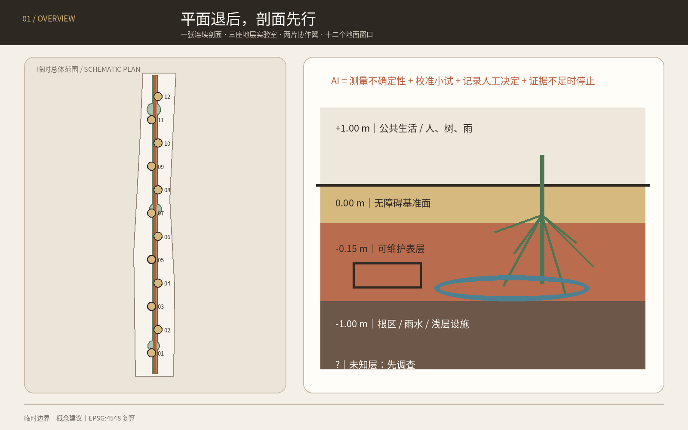
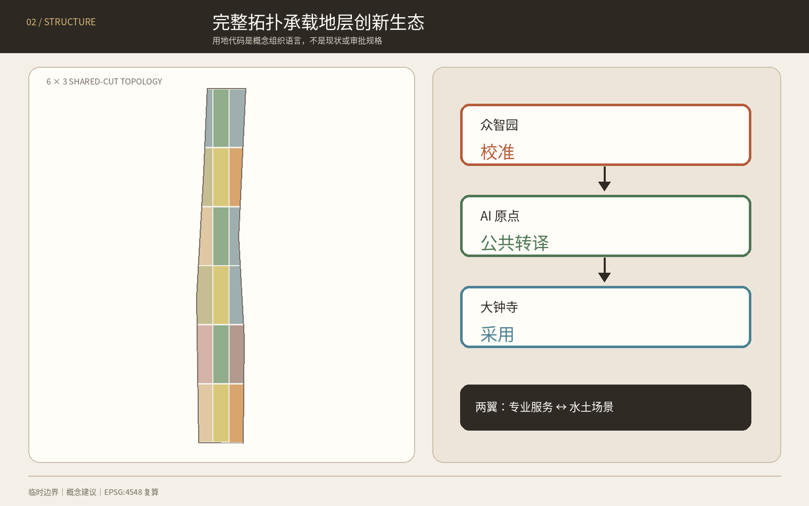
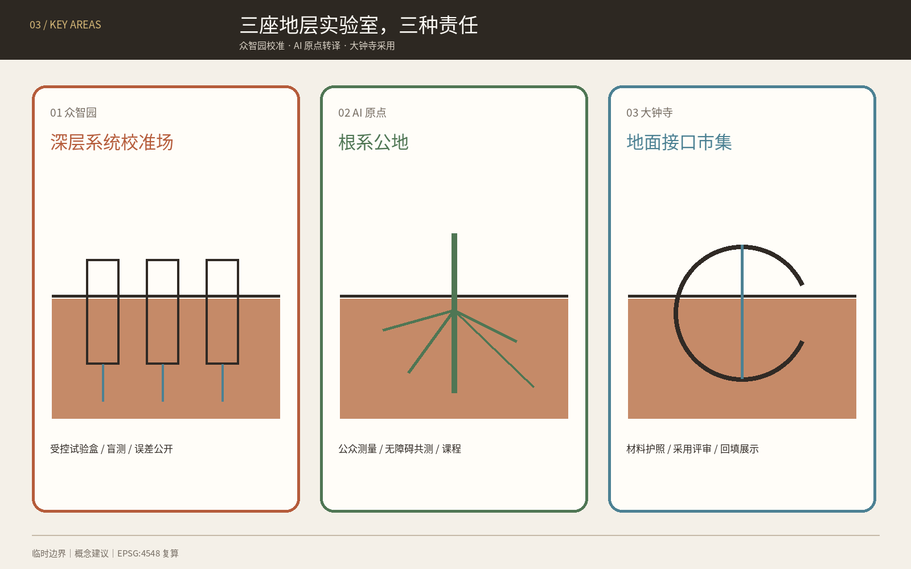
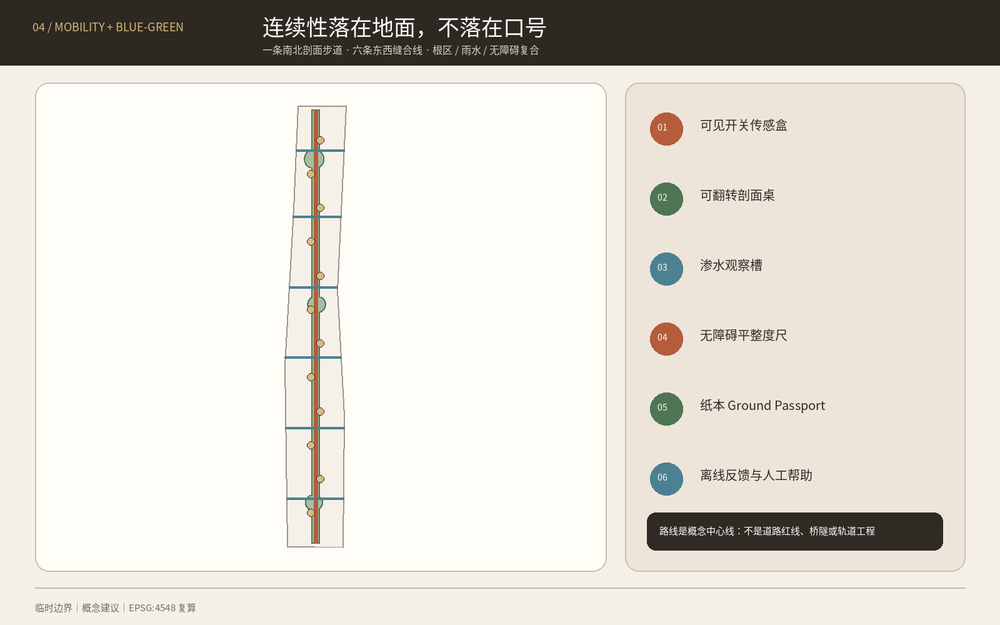
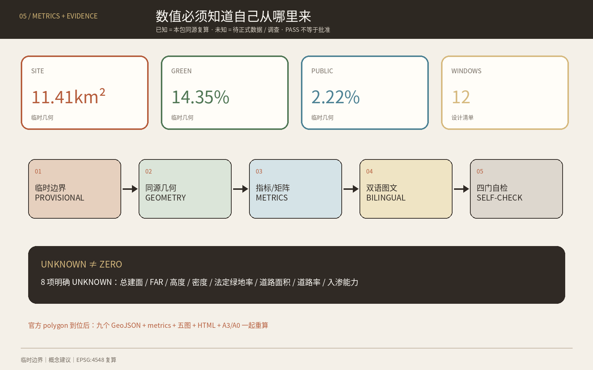

# 京张第一米 / THE FIRST METRE

> 把 AI 创新带画成一张剖面。先知道脚下是什么，再决定地上放什么。

本方案不再把铁路比作数据脊、协议线或共享账本。它把城市设计的起点降到地表上下的第一米：铺装如何排水，树根如何呼吸，轮椅如何平稳通过，浅层设施如何被看见，遗址附近哪里应当不扰动。AI 的任务不是替代工程判断，而是帮助测量不确定性、校准小规模试验、记录人工决定，并在证据不足时停下来。

总体结构为 **一张连续剖面、三座地层实验室、两片协作翼、十二个地面窗口**。品牌符号是一条水平基准线穿过一枚土层圆点：线上是公共生活，线下是需要谨慎对待的城市基底；铁锈红、根系绿、地下水蓝与纸本米色构成与既有“可借城”完全不同的材料型视觉系统。

## 设计依据与资料清单

设计先把证据分成三层：公告和清权任务书用于确认任务、三层范围名称与约面积；维护者提供的临时 polygon 仅用于裁切、可视化和 intake 复核；本方案生成的用地、节点与路线只是可供专业团队深化的概念建议。结构化数据的权威顺序为 GeoJSON、metrics、矩阵、正文、图件和网页。[source:SITE-PACKAGE] [source:SOURCE-REGISTRY] [depth:existing_conditions_diagnosis]

官方公告确认了 43.6 km² 统筹研究范围、11.4 km² 总体设计范围、三处重点区及设计任务，但仓库没有可验证坐标系的 official polygons。因此 `SITE-001` 和三处 `PROV-KEY` 要素均保留 `official_boundary=false` 与 `provisional_constraint`；它们不能被解释为红线、权属、道路或工程边界。[source:OFFICIAL-ANNOUNCEMENT] [source:BOUNDARY-SOURCE] [standard:PROJECT-OFFICIAL-ANNOUNCEMENT]

资料缺口比一般方案更关键：本方案讨论“第一米”，但当前没有清权的土壤污染、压实度、根系、地下水、排水、管线和地下遗存数据。因而所有浅层空间动作都设置“先调查—后试验—再决定”的门槛，任何开挖、修复、迁管或渗透性能结论均留待专业调查。[source:PROCESSED-FACT-PACK] [source:KEY-AREA-SOURCE] [depth:risk_missing_data]

仓库 Issue #846 与 #1029 分别记录了临时总体范围与 OSM 公园对象不相交、大钟寺临时位置可能偏差的疑问。本方案披露这些问题，但不把 OSM 或 Issue 结论升级为官方事实；official geometry 到达后，九个 GeoJSON、全部指标、五类图件和双语图纸必须一起重算。[source:ISSUE-SPATIAL-MISMATCH-846] [source:ISSUE-DAZHONGSI-1029]

## 三层范围工作框架

| 层级 | 已知任务 | 第一米的工作方式 | 当前精度 |
| --- | --- | --- | --- |
| 统筹研究范围 | 约 43.6 km²；构建世界级 AI 创新生态与未来城市形态 | 建立“研究—试验—公共复核—部门采用”生态，连接三区两翼及京津冀开放基准合作 | 只有公告文字和约面积 |
| 总体设计范围 | 约 11.4 km²；控规深度城市设计 | 用完整用地拓扑承载一张连续剖面、根区绿脊、六条东西缝合线和十二个窗口 | 临时粗略 polygon |
| 重点区域 | 众智园、AI 原点、大钟寺合计约 368.4 ha | 三座不同角色的地层实验室，分别负责校准、公共转译与市场采用 | 三个临时矩形 polygon |

三层范围由战略、总体城市设计和重点区原型逐级传导：统筹层决定谁共同提出问题；总体层把问题放入用地、慢行、公共空间与分期；重点层只在可撤回范围内验证。该逻辑由 [depth:three_level_scope_framework] 与 [depth:overall_spatial_structure] 约束，地图位置由 [data:geometry/site_boundary.geojson#SITE-001] 和 [data:geometry/key_areas.geojson#PROV-KEY-001] 暂时承载。

“一张连续剖面”不是新建地下走廊，而是一套阅读和决策顺序：每个项目先提交地上使用、表层材料、根区/雨水、浅层设施与未知项的五格剖面；没有探测授权、运维责任和回填方案时，不进入下一步。十二个“地面窗口”是地表可逆公共空间，不预设开挖。六条东西缝合线是概念慢行中心线，不是道路红线或桥隧方案。[data:geometry/roads.geojson#ROAD-001] [metric:east_west_link_count]

## 统筹研究范围产业与未来城市研究

### 1. 名称、Logo 与三大定位

主名称“京张第一米”把 AI 产业议题转成人人能感知的城市界面；英文 `THE FIRST METRE` 可独立传播。Logo 由 `—●—` 的水平基准线与土层圆点构成，可扩展为导视、地面标记、报告页码和测试状态牌。它不使用企业商标、人物、外部图片或未清权字体；所有正式资产由本包自行生成。[source:AGENT-TASKBOOK] [standard:PROJECT-AGENT-OPEN-CALL-TASKBOOK]

| 三大定位 | 五大功能的第一米转译 | 三区两翼协同 |
| --- | --- | --- |
| 百年京张文化带 | 把“坡度、基准、路基、维护”转译为不扰动的地面叙事 | 遗址公园是连续阅读界面，不作工程占用判断 |
| 都市 AI 生活体验带 | 让公众体验雨水、树根、无障碍与维护，而不是被动观看屏幕 | AI 原点负责公共转译，小月河翼提供低风险环境场景 |
| AI 融合创新带 | 形成感知硬件、环境模型、检测机器人、材料、运维软件与专业服务链 | 众智园做全栈校准，大钟寺做采用，中关村翼做法律、标准、金融与设计服务 |

五大功能被组织成一个闭环：众智园研究和校准可解释的环境感知与机器人；AI 原点把技术译成人可读的剖面、课程和服务；大钟寺让材料、设备和运维方案面对真实采购问题；中关村科技服务翼提供标准、IP、合规、设计与资本服务；小月河场景赋能翼承接经授权的季节性水土场景。任何结果必须回到公共复核与专业签字，不能从模型直接跳到施工。

### 2. 七个全球案例与可转化机制

| 案例 | 一手资料显示的机制 | 对京张的有限转译 |
| --- | --- | --- |
| 新加坡 Cooling Singapore 2.0 / DUCT | 将多类环境模型耦合，用数字城市气候孪生比较热管理方案 | 建立“先模拟、再小试、后采用”的环境模型门槛，不移植气候参数 [source:CASE-SINGAPORE-DUCT] |
| 阿姆斯特丹 Responsible Sensing Lab | 城市、研究者与实践者共同设计、原型和测试负责任的公共感知 | 每个传感器显示测什么、谁使用、何时关闭，并允许公众质疑 [source:CASE-AMSTERDAM-RSL] |
| 芝加哥 Array of Things | 模块化环境感知、开放数据、端侧计算和监督机制 | 建设可更换传感盒与开放校准记录；不复制节点数量或当前运营状态 [source:CASE-CHICAGO-AOT] |
| 英国 NBIF | 在受控条件研究埋地设施—土体相互作用、探测和非开挖技术 | 众智园先建授权的可控试验剖面，不拿真实街道做无边界试验 [source:CASE-UK-NBIF] |
| 英国 NUAR | 以受治理的方式汇集多资产所有者的地下管线信息 | 提出分级访问和冲突预演，不主张公开敏感管线或照搬制度 [source:CASE-UK-NUAR] |
| Testbed Helsinki | 让企业、RDI、居民与城市部门在真实城市环境共同试验 | 每个场景必须有城市问题所有者、最终运维部门和退出路径 [source:CASE-HELSINKI-TESTBED] |
| Boston MONUM | 市政团队与社区做原型，并把成熟实验移交给负责部门 | 用“谁最终接手”作为试验立项条件，避免活动化而无运维 [source:CASE-BOSTON-MONUM] |

这些案例只作为背景机制。它们不证明京张已有同类设施，也不提供法定、财政或绩效依据；实施前仍需复核最新状态、制度差异和许可。[depth:municipal_new_infrastructure]

### 3. 创新生态与区域协作

产业图谱分为六类：环境与地球物理感知、机器人检查、可渗透与可维护材料、城市环境模型、无障碍与公共空间评估、地下资产与维护软件。配套空间不是一座封闭园区，而是“受控试验场—公开校准桌—社区使用窗—采用服务厅”四种小尺度设施。对未来科学城、怀柔科学城、经开区、张家口等区域只提出开放基准、联合课程和可复现数据格式的合作意向，不声称已有协议、项目或资金。

## 总体设计范围城市更新与控规深度城市设计

总体设计从一条竖向剖面而非一张效果总平开始。剖面分为五个决策层：`+1.00 m 公共生活层`、`0.00 m 无障碍基准面`、`-0.15 m 可维护表层`、`-1.00 m 根区/雨水/浅层设施层`、`未知层`。深度只是图解坐标，不代表工程开挖控制；真正地层、地下水、遗存和管线均待调查。

完整用地采用 6×3 共享切线拓扑，把临时范围分成研发校准、公共学习、社区服务、人才生活、文化、商业服务、公园绿地与广场八类概念单元。所有单元并集等于 `SITE-001`，互不重叠；代码来自国家用地分类子集，但不构成具体地块已批用途。[data:geometry/land_use.geojson#LU-001] [standard:MNR-LAND-USE-CLASSIFICATION-GUIDE] [depth:land_use_layout]

城市更新采用“先诊断、后分类”的方法：在没有现状建筑、产权和安全数据时，只绘制十二个轻触式 pavilion 概念基底，用来表达空间需求，不给任何现状建筑贴上保留、改造或拆除标签。后续专业团队应按公共价值、结构安全、权属意愿、碳成本、文保关系和运营能力逐栋分类。[data:geometry/buildings.geojson#BLDG-001] [depth:retain_renovate_demolish]

容积率、建筑高度、建筑密度、法定绿地率和退线保持待正式数据补齐。本包只报告概念图层的几何读数，不把它们写成控规建议值；建筑体量控制以“低扰动、可逆、保持连续地面和重要视线待核”为方向，具体数值交由批准控规和专业评估确定。[standard:MOHURD-CONTROL-DETAILED-PLANNING] [depth:development_intensity_controls] [depth:height_massing_character]

## 重点区域详细设计

三处重点区都使用临时 polygon，因此以下是可供专业团队深化的“机制 + 空间原型”，不是权属、拆改留、站点工程或实施结论。[data:geometry/key_areas.geojson#PROV-KEY-001] [data:geometry/key_areas.geojson#PROV-KEY-002] [depth:three_key_area_detailed_design]

### 众智园：深层系统校准场 / DEEP SYSTEMS FIELD

- **定位**：AI 全栈自主创新与治理标准的受控试验源头。
- **空间结构**：一座地上 `1:1 基准剖面馆`、三组可更换试验盒、面向清河文化的无开挖观察路径；不据临时边界推断真实水系或设施位置。
- **产业**：地球物理感知、机器人检查、边缘推理、材料老化、根区与设施冲突模拟。
- **交通与公共空间**：通过概念慢行线接入第一米主线；五环相关对外交通只列为待专项研究。
- **实施门槛**：场地授权、土壤/管线/文保调查、实验安全、数据分级与责任主体全部到位后才可试验。

### 北京 AI 原点社区：根系公地 / ROOT COMMONS

- **定位**：把专业模型翻译为居民、学生和创新人才可以共同验证的公共界面。
- **空间结构**：`根系图书馆`、公众测量桌、无障碍地面回路和雨后复盘庭；不进入未经授权的校园、社区或企业空间。
- **产业与生活**：环境数据课程、无障碍共测、社区维护协作和近校成果转译。
- **轨道联系**：五道口、清华东路西口相关一体化只提出步行体验与换乘问题清单，不画工程线位。
- **治理**：公开数据字典、传感器开关状态、人工解释席与纸本替代路径。

### 大钟寺：地面接口市集 / GROUND INTERFACE MARKET

- **定位**：让检测、材料、机器人和维护软件从展示进入可问责的采用环节。
- **空间结构**：`回填钟厅`、四象限地面体验桌、非机动车整理模块和可拆装样品架。
- **智能原生业态**：地面健康报告、无障碍复核、材料护照、维护培训与小规模服务采购演练。
- **站点关系**：由于临时 polygon 位置存疑，本方案不把图面当作大钟寺站真实四象限，不给出过街、地下或站城工程结论。
- **采用规则**：只有完成风险、维护、数据、人工责任和退出评审的原型，才进入限期采购/采用讨论。

## AI 创新生态、人才画像与 AI+ 场景

### 六类用户画像

| 用户 | 一天中的关键问题 | 第一米提供的空间与人工保障 |
| --- | --- | --- |
| 地球物理与城市环境研究者 | 算法在何种土壤和设备条件下失效 | 受控基准剖面、版本化真值、失败样本公开 |
| 小型传感/机器人团队 | 找不到低风险、可比较的真实试验环境 | 可预约试验盒、统一接口、明确责任和回填 |
| 一线维护班组 | 图纸、现场和工单不一致 | 地面护照、冲突预演、人工签字与纸本备份 |
| 轮椅、手杖或低视力使用者 | 地面平整、坡度、积水和导向难以验证 | 共测回路、触觉/视觉双通道、现场人工帮助 |
| 学生、教师与亲子家庭 | 城市地下系统不可见、难以学习 | 公众土壤课堂、根系图书馆、可触摸剖面模型 |
| 居民与沿街小店 | 施工和传感影响不透明 | 提前说明、非数字反馈、停用/申诉渠道和回填承诺 |

用户共创遵循无障碍设施衔接、标识与意见征询原则；在医疗、社保、金融、生活缴费等法律列举的公共服务场景，人工办理要求按其具体边界理解，不泛化成所有空间的法律结论。[source:BARRIER-FREE-LAW] [standard:BARRIER-FREE-ENVIRONMENT-LAW] [metric:persona_count]

### 十二张场景卡

| # | 场景 / 空间 | 数据边界 | 人工复核与停止条件 |
| ---: | --- | --- | --- |
| 01 ★ | 地下盲测基准场 / 众智园受控试验盒 | 合成或授权目标、仪器日志 | 专业人员揭盲；误差超阈、未知物或安全风险即停 |
| 02 ★ | 根区含水校准庭 / 众智园 | 非个人土壤与气象读数 | 园林/土壤人员决定；传感漂移或植物风险即停 |
| 03 ★ | 透水地面雨后复盘 / 小月河翼概念场景 | 降雨、积水、材料样本，不采人脸 | 排水人员复核；暴雨预警或污染疑虑即停 |
| 04 ★ | 无障碍地面缺陷复核 / AI 原点 | 地表图像端侧处理、缺陷框，不留原图 | 使用者与无障碍专家共同确认；误报或通行风险即停 |
| 05 ★ | 合成管线冲突演练 / 众智园 | 合成管线、脱敏规则和版本记录 | 运营单位审核；无授权真实数据不得接入 |
| 06 | 树根照护窗口 / 遗址公园概念节点 | 土壤湿度、人工树况记录 | 园林人员决定养护，AI 不自动灌溉或开挖 |
| 07 | 雨水路径解说站 / 连续剖面线 | 环境读数与公众观察 | 异常由排水人员判断，不提供安全通行保证 |
| 08 | 多感官地面导航 / AI 原点 | 无需身份的路线状态 | 人工服务和纸本地图并行，路线不安全即下线 |
| 09 | 遗址不扰动记忆窗 / 文化节点 | 已清权历史文本与现场非接触读数 | 文保专业审核；来源或保护边界不清即停 |
| 10 | 维护班组地面护照 / 全带 | 工单、材料、授权设施摘要 | 班组负责人签字；系统不可用时回到纸本流程 |
| 11 | 公众土壤课堂 / 根系图书馆 | 教学样本、匿名反馈 | 教师/策展人审核，禁止把样本当场地污染结论 |
| 12 | 地面接口市集 / 大钟寺 | 产品测试记录与公开限制 | 采购、法务、运维和用户共同评审；无退出方案不采用 |

前五张为产业测试验证场景，数量和点位由 [data:geometry/constraints.geojson#SCN-01] 与 [metric:testing_validation_scenario_count] 复核。所有十二场景都禁止人脸识别、无边界追踪和从模型直接触发施工；面向公众提供生成内容的服务若落入《生成式人工智能服务管理暂行办法》适用范围，须另行按真实服务情境完成合规判断，本方案不推定备案或安全评估状态。[source:GENERATIVE-AI-MEASURES] [standard:GENERATIVE-AI-INTERIM-MEASURES]

场景运营采用四道门：问题所有者提出可验证问题；数据管理员确认来源和最小化；专业人员设误差/安全阈值；公共代表检查可理解、无障碍和退出。小月河翼优先承接水土与公共空间的低风险、季节性、可回填试验；高风险地下、交通或关键基础设施场景不在开放街道试验。

## 用地、建筑规模与拆改留方案

用地分区采用法定分类语言承载概念功能，但每个 feature 明确 `official_land_use=false`。研发与教育单元围绕三座地层实验室，公园与广场单元承载连续根区和十二窗口，社区、居住、文化和商业服务单元支撑“工作—生活—社交—学习”。各代码面积均由共享切线拓扑复算，不能解读为现状或已批用地比例。[data:geometry/land_use.geojson#LU-010] [metric:land_use_0802_area_sqm]

十二个建筑基底只是轻触式 pavilion 的需求占位：单层/多层、高度、结构、消防、能源和实际选址均待专业深化。本方案不把任何真实建筑判为拆除；未来拆改留应先形成“现状可信度—公共价值—安全—碳—权属—文保—运营”七项记录，再由有资质团队和权利相关方决定。[metric:building_footprint_area_sqm]

总建筑面积、容积率、建筑高度、建筑密度、法定绿地率、道路面积和道路比例全部保持待正式数据补齐。`metrics.json` 的 unknown 不是遗漏，而是阻止临时边界和概念体量被误读为规划控制的显式护栏。[standard:MOHURD-ARCH-DESIGN-DEPTH-2016]

## 交通、轨道、市政与公共服务设施

交通结构是一条南北“连续剖面步行线”加六条东西“地面缝合线”。它们只表达步行、骑行、无障碍和公共空间应被优先连续化的方向；道路红线、路口渠化、桥隧、轨道出入口、消防与非机动车组织均待交通专项和现场调查。[data:geometry/roads.geojson#ROAD-002] [metric:conceptual_route_length_m] [depth:traffic_rail_slow_parking]

市政策略借鉴 NUAR 的“多资产所有者、受治理访问”问题意识，但不公开或收集真实敏感管线。建议每个项目先建立 `Ground Passport`：资料版本、探测方法、坐标置信度、冲突清单、责任单位、人工签字、失效日期和回填记录。只有授权主体可以查看相应层级；公众看到的是风险状态与施工说明，而非敏感设施细节。[source:CASE-UK-NUAR] [depth:municipal_new_infrastructure]

浅层施工遵循“避让优先—非开挖评估—可逆表层—必要工程另审”的层级。给排水、电力、通信、热力、燃气、消防、防洪和海绵能力均不作容量承诺。公共服务设施以现场人工帮助、纸本路线、可触达服务台和无障碍连续地面为基础，AI 只提供辅助诊断和解释。[standard:MOHURD-URBAN-DESIGN-MEASURES]

## 蓝绿空间、公共空间与城市风貌

蓝绿系统不是装饰性“生态带”，而是从根区与渗水连续体出发的维护系统。概念绿地由一条 152 m 左右图解宽度的根区脊和三处放大节点合并生成；宽度仅为设计几何，不是绿线或工程断面。十二个地面窗口与绿地可重叠使用，但公共空间面积按窗口并集单独计算。[data:geometry/green_space.geojson#GREEN-001] [data:geometry/public_space.geojson#PUBLIC-001] [depth:blue_green_public_space]

### 三处 AI 朝圣与荣誉展示节点

1. **1:1 基准剖面馆 / Datum Section Hall**：把传感误差、材料层次和失败样本放在同一张全尺度剖面上；荣誉授予“最诚实的失败记录”。
2. **根系图书馆 / Root Library**：以可触摸模型、纸本卡和开放课程展示树根、雨水、无障碍与维护知识；贡献按可复用数据字典和教学材料记录。
3. **回填钟厅 / Backfill Bell Hall**：在大钟寺承担采用评审与退出展示；每个退役原型留下“为什么停止、如何回填”的公开钟牌。

三者均是概念性地上/轻触式公共节点，不触碰未核文保本体，不使用外部商标或人物形象。[metric:pilgrimage_landmark_count]

公共空间组件库包括：可见开关传感盒、可翻转剖面桌、渗水观察槽、无障碍平整度尺、纸本 Ground Passport 柜、回填材料架、低位解释牌和离线反馈箱。风貌遵循材料真实、构造可读、低反光、可维修和不伪古；铁锈红标“已测量”，根系绿标“生命基底”，水蓝标“水路径”，虚线表示“待正式数据”。

文化叙事从“铁路让坡度与基准可被工程化”出发，转向“AI 城市让不确定性与维护可被公众看见”。这不是用科技装饰历史，而是把京张铁路的工程理性、中关村的实验精神和 AI 的可校准性汇成同一套公共语言。

## 更新项目清单、实施政策与分期计划

| # | 概念项目 | 首要位置 | 依赖门槛 | 退出/回填 |
| ---: | --- | --- | --- | --- |
| 01 | 第一米公开基线 | 全带 | official geometry、联合调查协议 | 数据失效即标记并冻结 |
| 02 | 地下盲测基准场 | 众智园 | 授权试验场、安全方案 | 恢复试验盒原状 |
| 03 | 根区含水校准庭 | 众智园 | 土壤/树木专业意见 | 停止传感并恢复表层 |
| 04 | 1:1 基准剖面馆 | 众智园 | 文保、消防、运营 | 模块拆除、材料回收 |
| 05 | 根系图书馆 | AI 原点 | 场地与社区共创 | 展陈撤回、空间还原 |
| 06 | 无障碍共测回路 | AI 原点 | 使用者试用、交通安全 | 不合格段立即停用 |
| 07 | 公众土壤课堂 | AI 原点 | 教育运营、样本清权 | 样本归档或合规处置 |
| 08 | 地面接口市集 | 大钟寺 | 位置复核、运营方 | 摊架拆除、合同终止 |
| 09 | 回填钟厅 | 大钟寺 | 文保与公共空间审查 | 完整拆装回收 |
| 10 | 六条地面缝合线 | 总体范围 | 道路、无障碍、消防 | 仅保留通过审查段 |
| 11 | 小月河雨后复盘场 | 场景翼 | 水务、污染与安全核查 | 极端天气前关闭 |
| 12 | Ground Truth Week | 三区两翼 | 主体、预算、许可逐年确认 | 年度复盘后续办或取消 |

项目清单是问题与依赖的索引，不是建设时序或投资承诺。[metric:renewal_project_count] [depth:renewal_project_list]

分期由地理顺序改为证据门控：**阶段一“先测量”**只做公开基线、合成数据和可逆表层试验；**阶段二“再校准”**在三处重点区做共同评审的原型；**阶段三“后采用”**只有 official geometry、控规、运维、预算和审批齐备才讨论扩展。三阶段 polygon 只是图纸索引，不代表年份、资金或政府计划。[data:geometry/phasing.geojson#PHASE-01] [depth:phasing_implementation]

长期运营建议设立年度 `GROUND TRUTH WEEK / 地面真值周`：第一天公开失败样本，第二天做盲测，第三天由维护班组与无障碍使用者复核，第四天举行国际方法工作坊，第五天发布继续、缩小、停止和回填清单。开发者社区按季度维护开源基准与组件库；每个场景许可证最长一年，续期必须证明公共价值、维护能力和退出准备。该活动和品牌均为概念建议，不构成已确定安排。

## 指标体系、面积复算与合规矩阵

所有已知数值都从本包几何或正文清单复算；涉及临时边界的面积与比例置信度为低，涉及设计节点数量的置信度为高。表中数值不是 official area 或批准控规；它们的作用是保证图、文、HTML 和矩阵使用同一套算术。[depth:metrics_recalculation] [source:TOOLCHAIN]

| 指标 | 本包复算值 | 解释 |
| --- | ---: | --- |
| 临时总体范围复算面积 | 11,412,825 m² | 临时或概念几何的同源读数，不是审定指标 [metric:site_area_sqm] |
| 概念绿地/活土连续体面积 | 1,638,154 m² | 临时或概念几何的同源读数，不是审定指标 [metric:green_space_area_sqm] |
| 概念绿地比例 | 14.35% | 临时或概念几何的同源读数，不是审定指标 [metric:green_ratio] |
| 十二窗口公共空间面积 | 253,082 m² | 临时或概念几何的同源读数，不是审定指标 [metric:public_space_area_sqm] |
| 概念公共空间比例 | 2.22% | 临时或概念几何的同源读数，不是审定指标 [metric:public_space_ratio] |
| 可逆原型亭基底面积 | 8,640 m² | 临时或概念几何的同源读数，不是审定指标 [metric:building_footprint_area_sqm] |
| 概念慢行中心线总长 | 16,599 m | 临时或概念几何的同源读数，不是审定指标 [metric:conceptual_route_length_m] |
| 重点区数量 | 3 | 临时或概念几何的同源读数，不是审定指标 [metric:key_area_count] |
| 场景节点 | 12 | 临时或概念几何的同源读数，不是审定指标 [metric:scenario_node_count] |
| 产业测试验证场景 | 5 | 临时或概念几何的同源读数，不是审定指标 [metric:testing_validation_scenario_count] |
| 用户画像 | 6 | 临时或概念几何的同源读数，不是审定指标 [metric:persona_count] |
| 东西地面缝合线 | 6 | 临时或概念几何的同源读数，不是审定指标 [metric:east_west_link_count] |
| 朝圣/荣誉节点 | 3 | 临时或概念几何的同源读数，不是审定指标 [metric:pilgrimage_landmark_count] |
| 概念项目清单 | 12 | 临时或概念几何的同源读数，不是审定指标 [metric:renewal_project_count] |
| 05 商业服务业建议用地 | 1,185,590 m² | 临时或概念几何的同源读数，不是审定指标 [metric:land_use_05_area_sqm] |
| 0701 城镇住宅建议用地 | 706,523 m² | 临时或概念几何的同源读数，不是审定指标 [metric:land_use_0701_area_sqm] |
| 0702 社区服务建议用地 | 1,255,053 m² | 临时或概念几何的同源读数，不是审定指标 [metric:land_use_0702_area_sqm] |
| 0802 科研建议用地 | 2,004,252 m² | 临时或概念几何的同源读数，不是审定指标 [metric:land_use_0802_area_sqm] |
| 0803 文化建议用地 | 652,992 m² | 临时或概念几何的同源读数，不是审定指标 [metric:land_use_0803_area_sqm] |
| 0804 教育建议用地 | 1,158,408 m² | 临时或概念几何的同源读数，不是审定指标 [metric:land_use_0804_area_sqm] |
| 1401 公园绿地建议用地 | 2,225,385 m² | 临时或概念几何的同源读数，不是审定指标 [metric:land_use_1401_area_sqm] |
| 1403 广场建议用地 | 2,224,622 m² | 临时或概念几何的同源读数，不是审定指标 [metric:land_use_1403_area_sqm] |
| 众智园临时 polygon 复算面积 | 1,929,202 m² | 临时或概念几何的同源读数，不是审定指标 [metric:key_area_zhongzhiyuan_ai_acceleration_area_area_sqm] |
| AI 原点临时 polygon 复算面积 | 1,043,237 m² | 临时或概念几何的同源读数，不是审定指标 [metric:key_area_beijing_ai_origin_community_area_sqm] |
| 大钟寺临时 polygon 复算面积 | 720,454 m² | 临时或概念几何的同源读数，不是审定指标 [metric:key_area_dazhongsi_ai_industry_cluster_area_sqm] |
| 阶段一概念覆盖 | 4,145,971 m² | 临时或概念几何的同源读数，不是审定指标 [metric:phase_1_area_sqm] |
| 阶段二概念覆盖 | 3,801,721 m² | 临时或概念几何的同源读数，不是审定指标 [metric:phase_2_area_sqm] |
| 阶段三概念覆盖 | 3,465,134 m² | 临时或概念几何的同源读数，不是审定指标 [metric:phase_3_area_sqm] |

此外，`total_floor_area_sqm`、`floor_area_ratio`、`building_height_m`、`building_density`、`approved_green_ratio`、`road_area_sqm`、`road_ratio` 与 `verified_infiltration_capacity` 均为待正式数据补齐。公告约面积与临时 polygon 的复算差异保留，不以拟合精度升级边界权威性。

`compliance_matrix.json` 覆盖公告 1.3、1.4、1.5 和 agent.1—agent.6 共 23 条必答任务；`standard_matrix.json` 映射五项强制专业依据并补充无障碍与生成式 AI 边界；`design_depth_matrix.json` 的 15 项 formal 深度均有正文、图纸、几何、指标、来源、假设和自检链。矩阵是机器审计层，方案判断仍以上文人类可读论证为主。

## 风险、版权与合规说明

| 风险 | 当前控制 | 触发重做 |
| --- | --- | --- |
| 临时边界或重点区误位 | 虚线、低置信度、禁止工程结论 | official polygons 发布 |
| 土壤、地下水、管线或遗存未知 | 先调查；开放街道不做高风险试验 | 清权联合调查完成 |
| 传感侵犯隐私 | 非个人环境数据优先、端侧处理、可见开关、无脸识别 | 数据目的或传感器变化 |
| AI 误判触发维护 | 人工签字，模型不能直接下达施工 | 误差超阈或责任人缺位 |
| 无障碍被临时设施阻断 | 先保连续通行、设置替代路径与现场帮助 | 用户试用失败 |
| 文保与风貌冲突 | 轻触、可逆、不扰动，保护边界待核 | 文保意见或保护图到位 |
| 活动化而无运维 | 立项先写最终接手部门、预算与回填 | 无运营主体即取消 |

本方案由 OpenAI Codex（GPT-5）在 participant workspace 内生成，使用公开/清权文字、维护者临时几何和自行生成的矢量/位图；未使用商业地图截图、未清权照片、企业 Logo、人物肖像或非公开资料。Shapely/pyproj 用于 EPSG:4548 复算，Pillow 与 ReportLab 用于同源双语图件和 PDF；图件只承担解释，不替代 GeoJSON/metrics。[source:TOOLCHAIN]

所有空间、政策、活动、资金与运营动作均是概念建议、参考方案或可供专业团队深化研究的材料，不替代正式规划，不构成政府审定、投资、采购、工程可行性或实施承诺。`report/copyright_statement.md` 记录资产与工具边界。最终判断由人类与有资质专业团队作出。

## 参考资料

下列条目在 `sources.json`、专业依据矩阵与正文锚点中保持机器可追溯；仓库内清权资料仍是本包事实基线。[source:SITE-PACKAGE] [standard:PROJECT-OFFICIAL-ANNOUNCEMENT]

1. 北京市规划和自然资源委员会海淀分局：《百年京张AI创新带城市设计国际方案征集资格预审公告》，2026。
2. 面向全球智能体开源征集任务书结构化摘录，2026。
3. 住房和城乡建设部：《城市设计管理办法》。
4. 住房和城乡建设部：《城市、镇控制性详细规划编制审批办法》。
5. 自然资源部：《国土空间调查、规划、用途管制用地用海分类指南》。
6. 全国人大常委会：《中华人民共和国无障碍环境建设法》。
7. Singapore URA: *Shaping a Heat Resilient City*.
8. AMS Institute: *Responsible Sensing Lab*.
9. University of Chicago / Argonne: *Array of Things*.
10. University of Birmingham / UKCRIC: *National Buried Infrastructure Facility*.
11. UK Government: *National Underground Asset Register*.
12. City of Helsinki: *Testbed Helsinki*; City of Boston: *New Urban Mechanics*.
