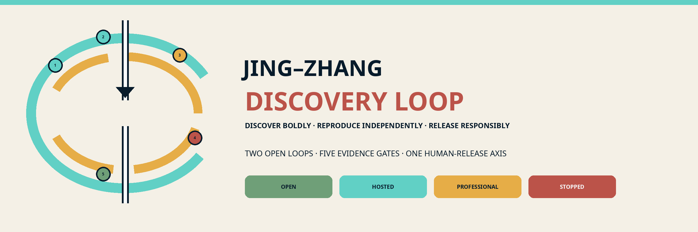
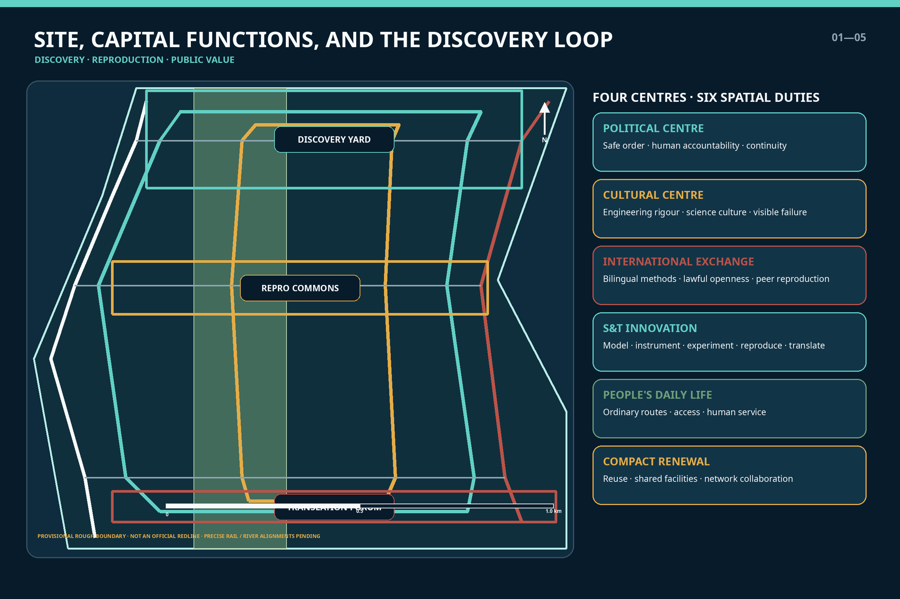
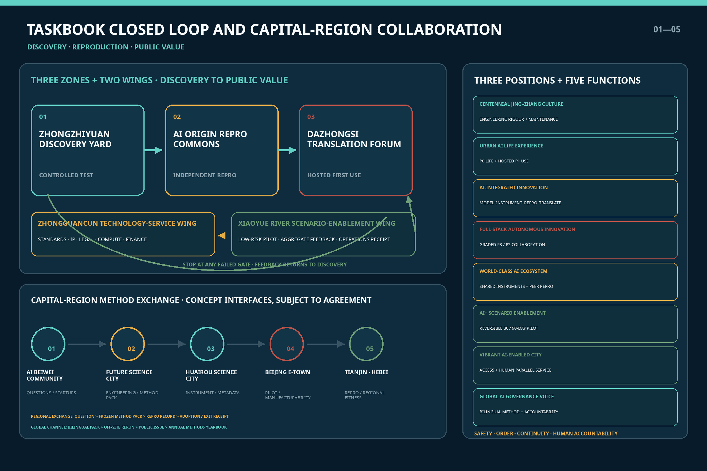
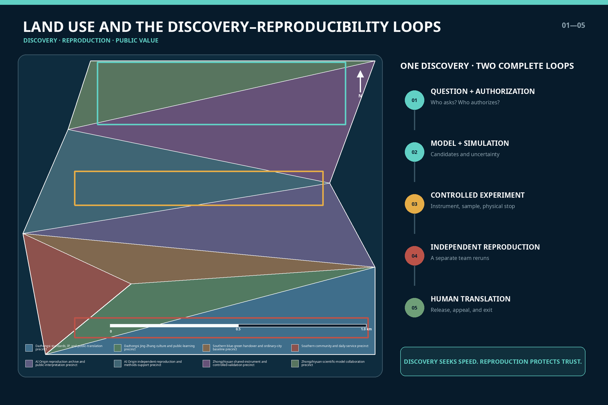
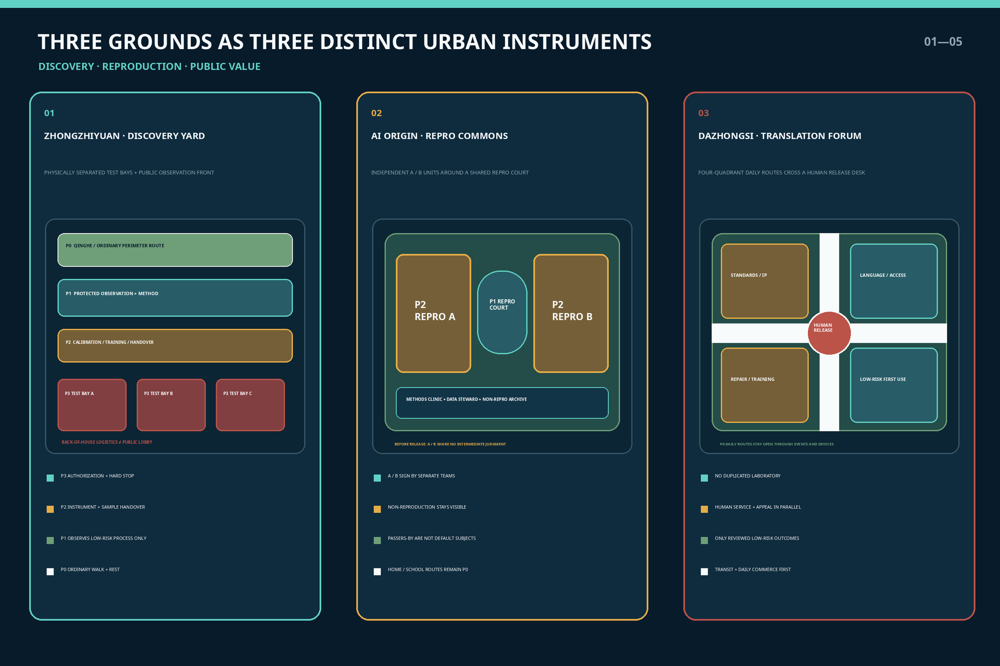
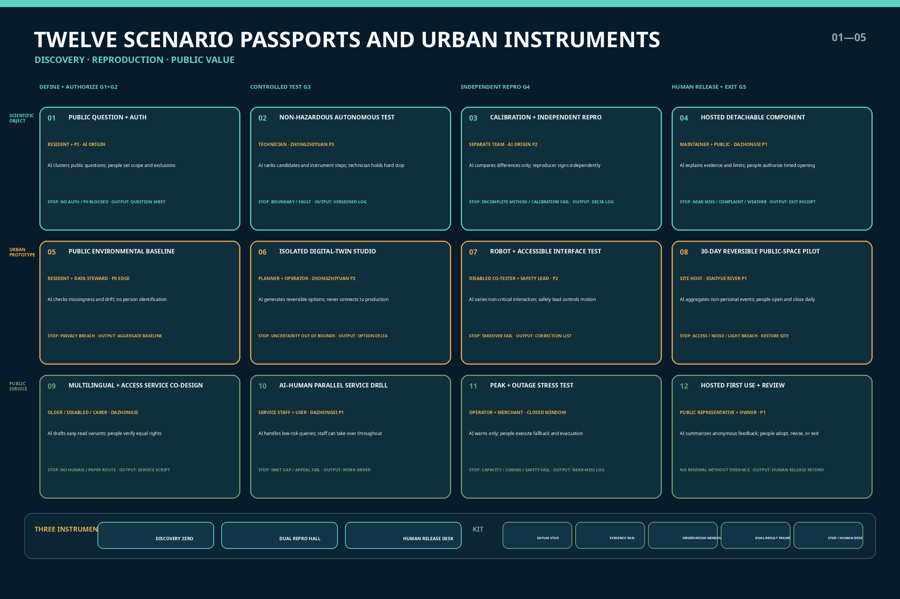
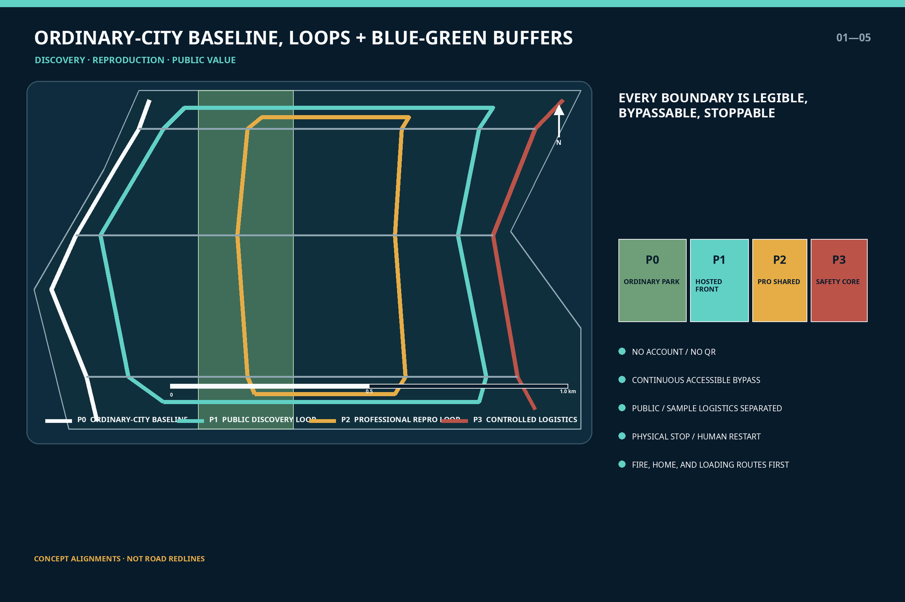
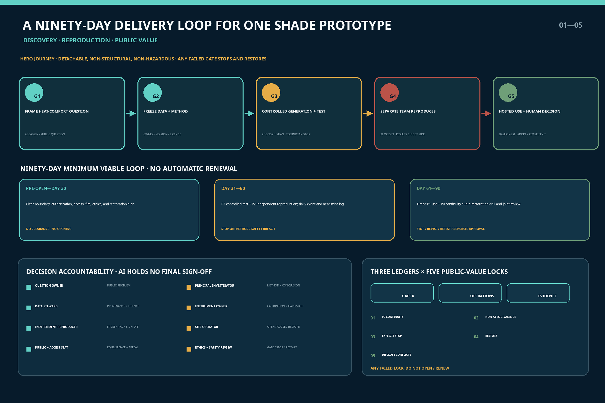
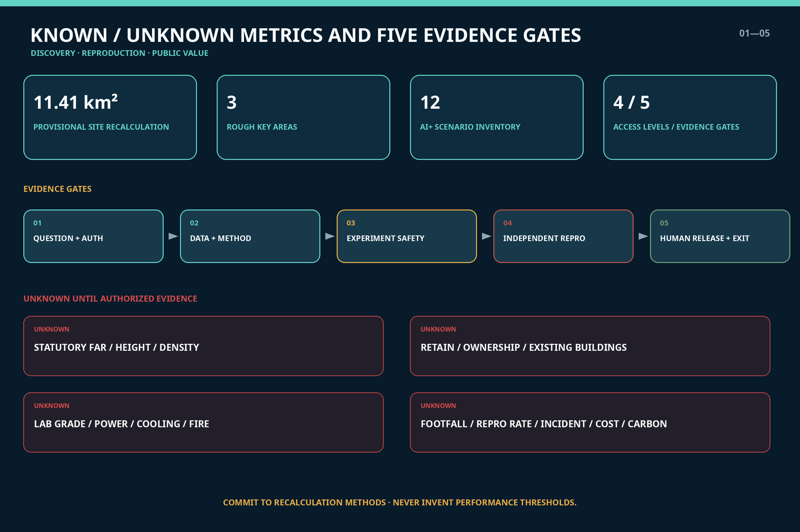

# JING–ZHANG DISCOVERY LOOP

**An AI-for-Science discovery, reproduction, and public-translation network serving the capital's functions**

> From hypothesis to public value, every step leaves traceable evidence. Every intelligent system entering the city must be reviewable, stoppable, and ultimately answerable to people.

**International line: Discover boldly. Reproduce independently. Release responsibly.**

The Discovery Loop treats AI for Science as a new mode of research production that requires urban support, rather than as a collection of isolated laboratories. Models propose candidates, instruments produce measurements, experiments test hypotheses, a separate team reproduces the work, and qualified people decide whether translation should proceed. Failure and uncertainty remain part of the record. A **Discovery Loop** and a parallel **Reproducibility Loop** organize the proposal; public space is their understandable front-of-house, while ordinary urban life remains an uninterrupted baseline.

As China's political capital, Beijing must place safety, order, service continuity, and accountable authority before technological novelty. This proposal creates no central-government facility, accesses no non-public government data, infers no sensitive spatial information, and claims no national authorization. Its capital-city character appears through graded risk, human release, stop conditions, priority for ordinary routes, and information classification—not through symbolic form. The science-and-technology innovation centre, cultural centre, international exchange centre, and the political centre's demand for safe and orderly operations are translated into a reviewable urban-design system.[source:BEIJING-MASTER-PLAN] [source:BEIJING-AI-SCIENCE-2026]

## Design Basis and Source List

The official call announcement and the repository's agent taskbook are the primary project sources. Together they establish the three scope levels, three key areas, mandatory tasks, formal deliverables, and the common boundary clause.[source:OFFICIAL-ANNOUNCEMENT] [source:AGENT-TASKBOOK] The package also reads `brief/site-package/`, `data/source_registry.json`, and the processed fact pack, but processed files are navigation aids rather than substitutes for primary authority.[source:SOURCE-REGISTRY]

Policy context comes from public Beijing documents. The Beijing Master Plan defines the Four Centres and Four Services and directs Haidian toward stronger science-and-technology innovation, service assurance, and compact renewal. Beijing's 2026–2028 plan for AI-enabled scientific research links models, scientific data, instruments, agents, and computing through a chain of hypothesis, planning, data acquisition, simulation, experimental verification, and discovery.[source:BEIJING-MASTER-PLAN] [source:BEIJING-AI-SCIENCE-2026] These sources support direction; they do not prove that this proposal has project approval, committed institutions, funding, or engineering authorization.

The repository still lacks an official precise redline, exact key-area boundaries, statutory controls, road redlines, ownership, surveyed buildings, utilities, fire provisions, heritage controls, and traffic counts. This package therefore uses the organizer's public provisional geometry: an overall area of approximately 11.4 square kilometres and three announced key-area areas totalling approximately 368.4 hectares. Every submitted boundary is marked `official_boundary=false` and `provisional_constraint`.[source:BOUNDARY-SOURCE] [source:KEY-AREA-SOURCE] These figures support concept generation, layer recalculation, and discussion only; they are not approval or setting-out data.

Evidence has three classes: official public material for project direction and task response; public institutional material for case mechanisms only; and provisional geometry for temporary drawings only. Values directly derived from submitted geometry are labelled `known` but retain the boundary caveat. Values requiring official controls, professional testing, or operational baselines remain `unknown`. Full provenance, use limits, and access dates are in `sources.json`; gaps and effects are in `assumptions.json`.

## Three-Level Scope Framework

The three scopes carry different evidentiary duties. The approximately 43.6 km² coordinated research area asks how universities, institutes, enterprises, shared instruments, standards services, Beijing–Tianjin–Hebei collaboration, and international exchange form a network. The approximately 11.4 km² overall design area asks how discovery and reproduction become land use, buildings, public space, movement, and operations. The approximately 368.4 ha across three key areas asks how access is graded, risk isolated, and operations handed over.[standard:PROJECT-OFFICIAL-ANNOUNCEMENT] [depth:three_level_scope_framework]

The structure is **two loops, three grounds, and four access levels**:

- Discovery Loop: question, model, simulation, controlled experiment, discovery;
- Reproducibility Loop: provenance, method, instrument calibration, independent rerun, uncertainty and negative results;
- Three grounds: Controlled Discovery Yard at Zhongzhiyuan, Reproducibility Commons at AI Origin, and Translation Forum at Dazhongsi;
- Four levels: P0 ordinary-city baseline, P1 hosted public-understanding zone, P2 professional shared/reproducibility zone, and P3 enclosed safety-controlled laboratory zone.

| Scope | Primary question | Spatial answer | Claim deliberately withheld |
| --- | --- | --- | --- |
| Coordinated research | How can discovery capacity work across institutions? | Distributed models, instruments, reproduction, standards, translation, and regional collaboration | No invented contracts, data-sharing commitments, or compute capacity |
| Overall design | How does the research loop become urban structure? | Two parallel knowledge/movement paths, three facility families, everyday baseline, blue-green buffer | No statutory redline and no new large closed campus |
| Key areas | How do risk and openness become sections? | Safety core—professional shared ring—public front—ordinary-city baseline | No fixed lab grade, height, capacity, or demolition area |

### Closing the Loop: Three Positionings, Five Functions, Three Areas, and Two Wings

Rather than inventing a separate task system, the proposal uses discovery—reproduction—translation to connect each of the taskbook's three positionings, five functions, and three areas with two wings.[source:AGENT-TASKBOOK] [depth:overall_spatial_structure]

| Taskbook positioning / function | Spatial and operating response | Primary location |
| --- | --- | --- |
| Centennial Jing–Zhang Cultural Belt | Make measurement, collaboration, maintenance, and review legible as engineering culture; give equal visibility to reproduced, unreproduced, and stopped work | Discovery Loop in the Jing–Zhang heritage park, Discovery Zero, and the Reproducibility Hall |
| Metropolitan AI Life Experience Belt | Keep the P0 ordinary city uninterrupted; allow only low-risk, hosted, bypassable public understanding and first use at P1 | Jing–Zhang heritage park, Xiaoyuehe Scenario Empowerment Wing, and Dazhongsi front |
| AI Integrated Innovation Belt | Complete the chain of scientific question—model—instrument—experiment—independent reproduction—standards/IP—public translation | The three grounds and Zhongguancun Technology Services Wing |
| Full-stack autonomous AI innovation system | Coordinate models, data, instruments, robots, anomaly detection, and physical human stops across P3/P2 | Controlled Discovery Yard in the Zhongzhiyuan AI Autonomous Innovation Acceleration Area |
| World-class AI innovation ecosystem | Connect shared instruments, independent reproduction, scientific-data stewards, talent, and international peers through method packages | Reproducibility Commons in Beijing AI Origin Community |
| New paradigm empowered by AI+ scenarios | Pressure-test twelve scenarios in enclosure before any 30/90-day reversible move into a low-risk public interface | Xiaoyuehe Scenario Empowerment Wing and the three handover halls |
| Intelligent, AI-vibrant city | Combine multilingual and accessible service, AI–human parallel operation, repair, and everyday commerce in a useful rather than theatrical urban front | Translation Forum in the Dazhongsi AI Industry Cluster |
| Global discourse capacity for AI governance | Make a reviewable governance product from bilingual method cards, versions, negative results, human release, appeal, and exit | Standards/safety interface at Zhongzhiyuan and Zhongguancun Technology Services Wing |

The three areas and two wings form a feedback-bearing chain of responsibility: **Zhongzhiyuan proposes and tests under control → another team reproduces at AI Origin → Zhongguancun Technology Services Wing adapts standards, IP, legal support, computing, and funding → Dazhongsi undertakes low-risk translation and operating handover → Xiaoyuehe Scenario Empowerment Wing records real but non-personal urban feedback → the evidence returns to the Controlled Discovery Yard for revision**. Failure at any evidence gate stops the chain; administrative rank or market attention never substitutes for evidence.

Five evidence gates regulate movement from idea to public interface: **question and authorization; data and method; experimental safety; independent reproduction; human release and exit**. AI may support search, candidate generation, simulation, and anomaly alerts. It cannot approve experiments, determine a scientific conclusion, or decide access to public service. Each gate names responsible people, required evidence, stop conditions, and exit actions.[standard:AI-SAFETY-GOVERNANCE-2] [depth:overall_spatial_structure]

## Coordinated Research Area: Industry and Future City Research

The value chain is not the short sequence of model, pitch, and finance. It is **scientific question—scientific model—data and instrument—experimental automation—independent reproduction—standards/IP—pilot and public translation—operational feedback**. Corresponding spaces include computation and collaboration rooms, shared instruments, controlled experiments, independent reproduction, translation services, and staffed public-science fronts. Reproduction sits between a research claim and adoption, turning rapid failure into learnable failure and successful work into supported evidence.[source:BEIJING-AI-SCIENCE-2026] [source:NIST-RDAF]

The Four Centres and Four Services are translated functionally rather than matched mechanically:

| Capital-city requirement | Urban-design translation | Operating boundary |
| --- | --- | --- |
| Political centre and service assurance | Traceable provenance, reviewable process, graded risk, human accountability, continuous ordinary service | No sensitive sites, non-public government data, or autonomous high-risk administrative decisions |
| Cultural centre | Jing–Zhang engineering discipline, Zhongguancun scientific culture, and equal display of positive and negative results | Heritage value and controls await specialist review; no commercial pastiche |
| International exchange centre | Bilingual method cards, reproducible protocols, lawful open data, international peer reproduction | No assumed diplomatic event or international endorsement; cross-border data reviewed separately |
| Science and technology innovation centre | A complete model–instrument–experiment–reproduction–translation chain | High-risk facilities only in authorized professional settings; AI output still requires peer review |
| Better lives for residents | Accessible science communication, human service, public question entry, low-risk translation | Basic service never depends on an account, QR code, or research participation |
| Relief of non-capital functions | Reuse, shared instruments, network collaboration, high knowledge density with lower resource burden | No warehouse, mass manufacturing, mega-event, or new hyperscale compute campus as the theme |

Regional collaboration exchanges four auditable objects rather than relying on abstract lines: **a question brief, a frozen method package, a reproduction record, and a translation/exit receipt**. Every interface below remains subject to agreement; none implies that an institution has joined, data have been opened, or a project has been approved:

| Collaborative node | Potential complementary interface | Evidence the Discovery Loop must return |
| --- | --- | --- |
| Zhongguancun AI Beiwei Community | Young founders, small teams, and application needs may enter the question-brief–methods-clinic process | Limits of use, reproduction status, adoption cost, and causes of failure |
| Future Science City | Research questions from centrally administered enterprises, energy systems, and engineering may enter professional reproduction or IP service | Frozen version, transfer conditions, and conditions under which the result does not apply |
| Huairou Science City | AI-for-Science and major research-facility experience may inform instrument interfaces and scientific-data governance | Only authorized methods and metadata are exchanged; facility data are not assumed available |
| Beijing Economic-Technological Development Area | Pilot production, intelligent terminals, embodied intelligence, and manufacturing settings may receive engineering validation | Safety limits, maintenance needs, manufacturability, and exit cost |
| Tianjin and Hebei nodes | Engineering translation, manufacturing collaboration, and differentiated settings may test cross-regional applicability | Differences found through independent reproduction, regional conditions, and non-transferable elements |

Haidian's Fifteenth Five-Year Plan groups AI Origin Community, AI Beiwei Community, and the Centennial Jing–Zhang AI Innovation Belt as “two districts and one belt.” The Modern Capital Metropolitan Area Spatial Coordination Plan calls for capital functions, innovation coordination, and safety and resilience to be optimized at the larger metropolitan scale. The proposal therefore positions Jing–Zhang as a **method and reproducibility interface** rather than reconcentrating all production, facilities, or visitor flows in the central city.[source:HAIDIAN-FIFTEENTH-FIVE-YEAR] [source:CAPITAL-METRO-PLAN-2026] The interfaces with Future Science City, Huairou Science City, and the Beijing Economic-Technological Development Area are respectively anchored in public directions concerning IP and central-enterprise innovation, AI for Science and major research facilities, and engineering pilots and full-scenario applications; every collaboration detail remains to be negotiated.[source:FUTURE-SCIENCE-CITY-2026] [source:HUAIRROU-AI-SCIENCE-2026] [source:BEIJING-ETOWN-AI-2026]

International collaboration likewise uses a shared problem, standardized metadata, a method package, and independent reproduction as its minimum unit; it does not pursue unconditional release of all data. External releases include a bilingual abstract, a machine-readable method inventory, limitations, and an accountable contact card. Cross-border data, export controls, IP, and research ethics are reviewed before exchange.[source:GLOBAL-AI-GOVERNANCE]

### Implementable Configuration of Eight Enabling Factors

| Factor | Space / mechanism | Accountable evidence for the next gate | Commitment deliberately withheld |
| --- | --- | --- | --- |
| Land | Existing-space suitability register, temporary permission, and a P0 continuity base map | Ownership, planning, heritage, and fire-safety verification | No land supply, regulatory-plan change, or demolition commitment |
| Space | P0–P3 graded section, separate logistics, and detachable 30/90-day units | Site-operator signature, accessibility test, and restoration plan | No fixed height, capacity, or location |
| Industry | Public question brief—controlled experiment—reproduction—standards/IP—adoption | Separate signatures from the demand owner, scientific lead, and reproducing team | No invented company list, output value, or order |
| Funding | Separate capital, operating, and reproduction accounts; budget ceiling approved gate by gate | Quotations, lifecycle cost, exit cost, and conflict-of-interest disclosure | No fiscal funding, subsidy, or investment commitment |
| People | Scientists, technicians, data stewards, reproducers, translators, and community hosts work as one team | Qualifications, training, shifts, working time, and responsibility register | Talent is not reduced to senior researchers |
| Computing | Lawful booking and workload grading for existing resources | Provider, energy use, version, service degradation, and exit clauses | No new supercomputer or unlimited computing commitment |
| Data | Register source, licence, version, and retention; separate discoverability from public release | Data-steward and legal/ethics review | No presumption that government, personal, enterprise, or cross-border data are available |
| Scenarios | Enclosed test—stress test—hosted first use—post-adoption review | Site host, affected-person review, human takeover, and exit receipt | Display is not approval, procurement, or deployment at scale |

[depth:ai_ecosystem_scenarios] [depth:phasing_implementation]

Seven global cases contribute mechanisms, not copied scale or targets:

| Case | Transferable mechanism | Discovery Loop translation |
| --- | --- | --- |
| Berkeley Lab A-Lab | Feedback among computational prediction, robotic synthesis, and measurement | A controlled P3 prototype for non-hazardous materials and instrument interfaces; no copied capacity claim |
| Liverpool Materials Innovation Factory | Integrated computation/experiment, open equipment, and academic–industry collaboration | Booking, training, technical staff, and industry access in the professional shared ring |
| MIT.nano | Centrally shared campus resource, qualified external users, and staff support | Graded sharing of costly equipment, with onboarding and safety training before access |
| NIST PDR / RDaF | FAIR metadata, preservation, provenance, and usage restrictions | A scientific-data catalogue in which discoverable does not automatically mean public |
| Singapore one-north | A network of distinct research/industry precincts integrated with daily life | Differentiated grounds whose public realm and daily services are not displaced by experimentation |
| Paris-Saclay Urban Campus | Research cluster, public life, green edge, and mixed amenities | Blue-green buffers and everyday services soften the closed-campus condition |
| RIKEN TRIP / AI for Science | A computing platform connecting disciplines for discovery | Distributed access to models and computing rather than an assumed new supercomputing centre |

## Overall Design Area: Urban Renewal and Regulatory-Plan-Level Urban Design

The overall design does not draw a new “technology boulevard.” It places two loops with different speeds side by side: a walkable, legible, low-risk public Discovery Loop along the Jing–Zhang heritage park and an appointment-based, traceable, isolatable professional Reproducibility Loop at adjacent research and industry interfaces. They connect only at three handover halls, where every crossing makes the shift from P0/P1 to P2/P3 explicit.[data:geometry/roads.geojson#ROAD-DISCOVERY] [depth:overall_spatial_structure]

Land-use geometry uses official classification codes for a conceptual program: research land for shared instruments and controlled experiments; cultural/public-service land for reproducibility display and science education; park land for the continuous ordinary route; business-service land for IP, standards, technology transfer, and translation; and community-service land for residents' and workers' daily needs. These are design recommendations, not changes to statutory use.[standard:MNR-LAND-USE-CLASSIFICATION-GUIDE] [data:geometry/land_use.geojson#LU-001]

Renewal follows four priorities: inventory before design; reuse before addition; ordinary-city baseline before experimental interface; and reversible work before permanence. The first step permits only detachable wayfinding, reproduction tables, public method cards, a shared-booking front, and non-hazardous dry-lab prototypes. Wet laboratories, hazardous materials, high-energy equipment, biological samples, medical research, drones, and autonomous vehicles do not enter the conceptual first phase. Without official transport, utility, fire, and ownership evidence, the proposal gives no road realignment, bridge/tunnel, underground, or fixed-capacity conclusion.[source:MISSING-DATA] [depth:development_intensity_controls]

Public spaces show four visible states: `OPEN`, `HOSTED`, `PROFESSIONAL`, and `STOPPED / UNDER REVIEW`. Colour communicates status but cannot replace enclosure, authorization, or staff. Every entry shows purpose, data fields, accountable operator, non-AI route, stop condition, opening time, and date for restoration.

## Detailed Design of Key Areas

All three areas use the section of safety core—professional shared ring—public observation front—ordinary-city baseline, but each plays a different role. Locations rely on provisional rough areas; rectangular edges are not parcels or road redlines.[data:geometry/key_areas.geojson#PROV-KEY-001] [data:geometry/key_areas.geojson#PROV-KEY-002] [data:geometry/key_areas.geojson#PROV-KEY-003]

**Zhongzhiyuan: Controlled Discovery Yard.** The P3 safety core contains enclosed testing for scientific models, embodied instrument interfaces, non-hazardous materials, and robotic workstations. P2 adds calibration, sample/data handover, technical staff, and safety training. P1 uses protected viewing, process visualization, and method cards to distinguish machine action from human judgement. P0 maintains continuous walking and ordinary rest along the Qinghe edge and campus perimeter. Research logistics and public circulation have separate entries; robots do not cross without physical segregation. Laboratory grade, hazardous storage, power, and fire provisions remain unknown pending professional evidence.

**Beijing AI Origin Community: Reproducibility Commons.** Two independent reproduction units enclose a shared courtyard. Unit A preserves the original method and instrument configuration; Unit B reruns the package under a different team, without sharing interim judgement before publication. The ground floor includes a methods clinic, scientific-data steward, open-notebook room, accessible explanation desk, and an archive of work that did not reproduce. Universities, community members, and enterprises enter P1 through hosted groups; passers-by are never treated as default research subjects. Housing, food, school, and routes home stay P0.

**Dazhongsi: Translation Forum.** This area does not duplicate laboratories. It receives low-risk work that has completed professional review and combines multilingual public explanation, IP and standards services, technology transfer, operating training, repair, and human service. Metro integration and four-quadrant connectivity are principles of continuous walking and clear interchange only; exact entrances, flows, and construction await official evidence. Health, education, legal, and urban-operation systems may provide navigation, assistance, or parallel service, but AI may not diagnose, admit, adjudicate, allocate welfare, or command an emergency alone.

Three landmarks double as operating infrastructure: **Discovery Zero** publishes questions, measurement definitions, and missing data; the **Reproducibility Hall** gives equal space to reproduced, unreproduced, and stopped work; the **Human Release Desk** shows accountable people, appeal, takeover, and exit records. An annual Discovery and Reproducibility Week would publish only authorized methods and processes, rank no failed participant, and remains a proposal rather than a government commitment.[source:AGENT-TASKBOOK] [depth:three_key_area_detailed_design]

### Identity, Landmarks, and Public-Space Components

The mark combines two loops that do not fully overlap, five evidence nodes, and a human-release axis. The solid cyan loop represents discovery; the segmented amber loop represents reproduction by another team; and the white central axis means that people retain final judgement. No version may add a national emblem, flag, government-office wording, or imitation official seal. The master name is fixed as `京张发现环` / JING–ZHANG DISCOVERY LOOP. Subsystems pair an action with an evidence state: `METHOD PASS 方法护照`, `REPRODUCED 已复现`, `HUMAN RELEASE 人工放行`, and `STOP & LEARN 停止复盘`. State colour always supplements text and shape; it is never the sole information channel.

| Landmark / component | Work it actually performs | Public and stop boundary |
| --- | --- | --- |
| Discovery Zero / `发现零点` | Registers the question, purpose, provenance, provisional boundary, and accountable person; issues the first question brief | Paper entry without an account; no question is initiated if evidence or responsibility is unclear |
| Reproduction Hall / `复现厅` | Displays versions, reproduction method, differences, non-reproduction, and disputed status side by side | No team leaderboard; restricted data expose metadata and permission conditions only |
| Human Release Table / `人工放行台` | Shows who signed, scope of use, human route, appeal, stop, and restoration | AI has no signature authority; public first use stops if the human channel is unavailable |
| Method Passport Rack | Holds easy-read, bilingual, and machine-readable method and rights cards | Readable without scanning; expired versions are removed and archived |
| Five-Gate Evidence Rail | Uses five tactile nodes to show the gate a project has reached | Braille, high contrast, and audio alternatives operate together; colour does not decide access |
| Stop Placard and Physical Emergency Stop | Makes stop conditions, the operator on duty, and the physical stop location visible | Restart only by a named human operator; no automatic reset |
| Non-AI Parallel Counter | Provides equivalent paper, staffed, cash, or offline service | Temporary equipment, queues, and branded events may not displace it |
| Quiet Maintenance Seat | Brings maintenance, cleaning, and fault records into the public interface | Protects quiet periods, carers' stays, and workers' rest; never used as advertising space |

## AI Innovation Ecosystem, Personas, and AI+ Scenarios

Seven user groups define the city together; “AI talent” does not stand in for everyone:

| Persona | Primary need | Spatial response | Rights boundary |
| --- | --- | --- | --- |
| Basic scientist | Questions, simulation, instruments, uncertainty discussion | Model room, shared instrument, quiet review room | AI advice does not replace scholarly judgement |
| Instrument engineer / technician | Calibration, maintenance, handover, safety training | Equipment vestibule, repair back-of-house, sample window | Maintenance labour is visible and costed |
| Independent reproduction team | Version freeze, blinded rerun, negative record | Independent units, reproduction repository, dispute room | Original team cannot control reproduction conclusions |
| Startup / translation team | IP, standards, prototyping, procurement | Translation hall, legal/standards service, detachable demonstrator | Public display does not replace approval or compliance |
| Resident / ordinary visitor | Quiet passage, comprehension, exit, human help | Continuous P0 route, easy-read explanation, staffed desk | Equal public space without scanning or registration |
| Older person, child, disabled person, or carer | Multisensory comprehension, low stimulation, access, accompaniment | Continuous accessibility, captions/tactile alternatives, quiet periods | No profiling or ranking; research requires separate ethics and consent |
| International researcher | Bilingual methods, lawful collaboration, short-term access | Bilingual reproduction desk, visitor training, shared booking | Data, export-control, and cross-border rules reviewed case by case |

Twelve scenarios form a matrix of three subjects by four evidence gates. Scenarios 02, 03, 06, 07, 10, and 11 are industrial testing and validation settings, exceeding the minimum of three. Counts describe the design inventory, not implemented projects.[source:AGENT-TASKBOOK] [depth:ai_ecosystem_scenarios]

| No. | Scenario and space | AI role | Human / data boundary |
| --- | --- | --- | --- |
| 01 Public question and authorization desk | Origin P1; environment, health, education, and daily-life questions | Cluster public questions and flag evidence gaps | Zero personal data by default; professionals decide whether to initiate work |
| 02 Non-hazardous autonomous materials experiment | Zhongzhiyuan P3 | Propose candidates, schedule robots, flag anomalies | Approved materials only; physical stop; professional release |
| 03 Instrument calibration and independent reproduction | Origin P2 | Compare versions, conditions, and bias | Independent team signs results; failures retained |
| 04 Detachable material component display | Dazhongsi P1 | Explain performance ranges and maintenance | Low-risk sample only; timed removal; not an engineering certification |
| 05 Public environmental baseline station | River/park P1 | Aggregate public or specifically authorized non-personal environmental data | No face, voice, device ID, or trajectory; sensors visible |
| 06 Isolated digital-twin studio | Zhongzhiyuan P2 | Simulate transport, energy, stormwater, and human–machine conflict | No production government or critical-infrastructure network; specialist check |
| 07 Robot and accessible-interface testing | Zhongzhiyuan P3 | Generate edge cases and record anonymous faults | Enclosed field, host, physical stop; no direct public-road operation |
| 08 Thirty-day reversible public-space pilot | Park P1 | Compare non-critical layout options | Implemented only after approval; non-AI path open; restoration required |
| 09 Multilingual and accessible service co-definition | Dazhongsi P1 | Translate and generate easy-read alternatives | Human edit; service rights never reduced by language, age, or disability |
| 10 AI–human parallel service drill | Dazhongsi P2 | Assist health navigation, education information, legal and enterprise search | No diagnosis/adjudication; equivalent human route and appeal |
| 11 Peak, outage, and anomaly stress test | Controlled areas at all three grounds | Inject faults and test graceful degradation | No effect on real essential service; humans stop and restart |
| 12 Hosted first use and review | Dazhongsi P1 | Aggregate anonymous faults and draft review | Voluntary and withdrawable; no personal scoring; operator signs |

Each scenario has a Discovery Passport: public question, authorization, input data, model/instrument version, risk level, reproduction team, unresolved difference, accountable person, human path, stop condition, retention period, and receiving party at exit. Face, voiceprint, gait, emotion, and eye-tracking recognition are prohibited by default, as are passive Wi-Fi/Bluetooth tracking, persistent identifiers, cross-session profiles, and vendor secondary training. Structured research involving children requires child assent, guardian consent, and a qualified ethics process.[standard:PRC-GENERATIVE-AI-MEASURES] [standard:PRC-BARRIER-FREE-ENVIRONMENT-LAW]

A **detachable, non-load-bearing, non-hazardous shade sample** shows that the three grounds are one evidence journey rather than three isolated campuses:

| Evidence gate | Place and action | Visible output | Response to failure |
| --- | --- | --- | --- |
| G1 Question and authorization | At park P0/P1, register a heat-exposure problem affecting a type of resting place without recording individual movement | Question brief, non-participation route, and evidence gaps | Do not initiate the question without site and public authorization |
| G2 Data and method | At Zhongzhiyuan P2, compare material/form candidates using public weather data and synthetic conditions | Data card, model version, uncertainty, and prohibited uses | Freeze the work if provenance is unclear or the method cannot be explained |
| G3 Controlled experiment | At Zhongzhiyuan P3, test approved non-hazardous samples for weathering, temperature rise, and maintenance | Experimental log, anomalies, and physical-stop record | Stop on damage, overheating, or an unaffordable maintenance burden |
| G4 Independent reproduction | At AI Origin P2, another team reruns the frozen method package | Reproduction difference, non-reproduction record, and limits of use | No public first use if the result is not reproduced; return to G2/G3 |
| G5 Human release and exit | At Dazhongsi/park P1, professional and site leads dual-sign a reversible 30-day sample | Release card, human contact, complaints route, and removal date | Remove it if passage, accessibility, noise/light, or complaint response deteriorates |

This “hero journey” makes no claim about material performance. It demonstrates that urban space can take an AI-generated candidate through reproduction by another team, a public-rights check, and human release before limited use. Future contributors may replace the question, material, or site, but may not skip an evidence gate.

## Land Use, Building Scale, and Retain-Renovate-Demolish Strategy

`land_use.geojson` is a seamless conceptual partition inside the provisional boundary, using allowed codes including `0802` research, `0803` cultural, `1401` park, `05` business service, and `0702` community service. Functional names explain the AI-for-Science chain without replacing land classification.[standard:MNR-LAND-USE-CLASSIFICATION-GUIDE] [data:geometry/land_use.geojson#LU-001]

The building layer represents **conceptual program footprints**, not surveyed existing buildings or approved construction. Twelve small carriers accommodate model collaboration, shared instruments, non-hazardous experiments, independent reproduction, data stewardship, public explanation, standards/IP, repair back-of-house, and human service. Courtyards, shallow floor plates, separable ground floors, and independent logistics avoid combining research, risk, and everyday life in one megastructure.[data:geometry/buildings.geojson#BLDG-001] [depth:height_massing_character]

Retain–renovate–demolish decisions follow four gates:

1. **Retain by default:** no demolition finding before survey, structural safety, ownership, heritage, and use studies;
2. **Adaptive reuse first:** add environmental control, fire safety, accessibility, vibration isolation, and independent logistics to suitable existing space;
3. **Reversible insertions:** P1 fronts and early shared facilities use 30/90-day detachable modules, extended only after review;
4. **Addition or removal by separate project:** new construction or demolition requires official controls, urban diagnosis, professional assessment, engagement, and an identified implementation party.

FAR, total floor area, height, density, setbacks, retention ratio, demolition quantity, laboratory grade, and equipment load are `unknown`. Drawn massing tests adjacency and access gradients only; it cannot be used to infer approved controls.[source:MISSING-DATA] [depth:retain_renovate_demolish]

## Transport, Rail, Municipal Infrastructure, and Public Services

The ordinary-city baseline has first priority. P0 serves residents, commuters, and park users without accounts, devices, or research participation. P1 is the low-speed accessible Discovery Loop with hosted nodes. P2 is the professional Reproducibility Loop. P3 closes research logistics behind buildings; samples, waste, and equipment never pass through public lobbies. The three grounds rely first on existing public transport, walking, and cycling, without assuming a new rail station or autonomous-vehicle line.[data:geometry/roads.geojson#ROAD-BASELINE] [depth:traffic_rail_slow_parking]

At Dazhongsi, Wudaokou, Qinghuadongluxikou, and crossings of the Fifth Ring Road, the proposal states goals of continuous walking, legible interchange, accessibility, and emergency access only. Exact exits, signals, rights-of-way, bridges/tunnels, and passenger organization require official transport evidence. No activity may occupy fire and ambulance access, routes home, shop loading, or worker rest access.

Municipal strategy is to share, meter, stop safely, and avoid unnecessary new capacity. Shared instruments log booking, training, energy, maintenance, and downtime. Computing should use lawful existing resources and scheduling services first; the proposal commits no new large data centre. Wet labs, hazardous chemicals, biosafety, medical samples, high-energy equipment, waste, backup power, cooling, and vibration all require specialist authorization. Phase 1 includes only non-hazardous dry experimentation and isolated digital simulation.[source:BEIJING-AI-SCIENCE-2026] [depth:municipal_new_infrastructure]

Every public-service interface has an equivalent human and non-AI route: paper and offline information, staffed advice, visible complaints, captions and audio/visual alternatives, guide-dog routes, wheelchair turning, low-stimulation hours, and accessible sanitation precede intelligent functions. Health, social security, education, legal advice, emergency response, passage, and toilets never require tasks, points, scanning, or purchase.

## Blue-Green Network, Public Space, and Urban Character

The Jing–Zhang heritage park is not leftover green space for experiments. It is the P0 ordinary-city baseline and ethical boundary of the whole system. Continuous shade, rain gardens, sitting edges, accessible movement, and quiet periods come first. Where environmental or equipment sensing is justified, its purpose, fields, retention, and switch-off are visibly posted.[data:geometry/green_space.geojson#GREEN-001] [metric:green_ratio]

The blue-green network provides three buffers: an ecology/flood buffer along Qinghe and Xiaoyue River pending formal evidence; a safety buffer between laboratory back-of-house and public fronts; and an acoustic/light buffer between research campuses and everyday residential life. Without formal blue lines, flood data, soil, and ecology evidence, the proposal offers no precise shoreline, storage volume, or sponge-city target.[source:MISSING-DATA] [depth:blue_green_public_space]

Urban character uses a limited palette of engineering blue, evidence white, brick red, natural green, safety amber, and stop red. Calibration marks, version dates, uncertainty ranges, visible emergency stops, method cards, and repair labels carry real information rather than theme-park decoration. A century of Jing–Zhang engineering culture is inherited through measurement, collaboration, maintenance, and iteration—not copied locomotive, ticket, or platform imagery.

Public spaces have quiet hours and limits for noise, light, queues, and waste, plus opening and closing checks. Failure and stoppage are legitimate parts of the public realm: the Reproducibility Hall gives equal space to unreproduced and stopped work. Annual recognition rewards open methods, maintenance labour, shared negative results, accessibility improvements, and public value—not traffic, financing, or personal ability.

## Renewal Projects, Implementation Policy, and Phasing

Projects advance by evidence gates rather than promised dates. Time windows are conceptual; actual starts, funding, and owners remain to be confirmed.[data:geometry/phasing.geojson#PHASE-001] [depth:phasing_implementation]

| Project | First spatial action | Evidence required for next gate | Exit condition |
| --- | --- | --- | --- |
| D01 Discovery Zero and evidence room | Detachable question desk, gap map, paper/bilingual entry | Site permit, accessibility review, content owner | Obstructed passage, inaccurate information, or no staff |
| D02 Shared-instrument booking/training front | Technician and training seats in reused ground floor | Equipment list, safety procedure, fees, equitable access | Inadequate maintenance or safety event |
| D03 Non-hazardous autonomous experiment prototype | Enclosed Zhongzhiyuan P3 module | Professional risk, fire/equipment approval, physical stop | Boundary breach, unexplained anomaly, or unclear accountability |
| D04 Blinded reproduction pair | Two independent, separable Origin units | Method package, version freeze, separate team, dispute mechanism | No independence or expired data authorization |
| D05 Scientific-data steward and repository | Metadata catalogue, licence labels, preservation plan | Rights, classification, retention/deletion rule | Unknown provenance or use beyond purpose |
| D06 Public-science front | Protected viewing, easy-read explanation, staffed questions | Scientific edit, privacy/child protection, quiet periods | Misleading content, crowding, or overdue complaints |
| D07 Human release and appeal desk | Accountability card, stop log, non-AI route | Named operator, service level, incident/compensation process | Human channel unavailable or AI exceeds authority |
| D08 Dazhongsi translation and repair hall | Standards, IP, repair, and training together | Compliance, procurement exit, lifecycle cost | Lock-in or marketing displaces basic service |
| D09 Blue-green ordinary-route continuity | Shade, seating, accessibility, modest wayfinding | Official boundary, transport/heritage/utility review | Fire, home, or loading route obstructed |

### Ninety-Day Minimum Viable Discovery Loop

The first round does not build a district. After formal site permission, it tests three withdrawable operating contracts. Day counts start from the authorized opening date and are not a government delivery commitment.

| Work window | Minimum package and site type | Required delivery | Acceptance / stop rule |
| --- | --- | --- | --- |
| Before opening–day 30 | P0/P1 “question brief + Method Passport Rack”; a reused indoor front or detachable location that does not obstruct passage | Site/accessibility baseline, accountability card, paper entry, zero-data-collection list, and complaint/exit drill | Do not open if P0 is blocked, no human is on duty, or content responsibility is unclear |
| Days 31–60 | P2/P3 “frozen method + non-hazardous controlled test”; two physically independent professional units | Training record, equipment/material list, method version, physical stop, and reproduction signature by an independent team | Stop and seal the work if safety conditions are insufficient, reproduction is not independent, or data exceed authorization |
| Days 61–90 | P1 “hosted first use + restoration”; only a low-risk sample or service that has passed the first four gates | Human-release card, equivalent non-AI route, incident/near-miss log, cleaning and maintenance hours, and exit receipt | Remove the installation the same day after injury/near miss, accessibility interruption, overdue complaint, or loss of maintenance control |

At day 90 only four decisions are available: `stop and publish the reason`, `revise and retest`, `run one more time-limited use`, or `enter a separately approved study of a permanent facility`. Nothing renews automatically; the loop closes only when the sample has been removed and the site restored.

### Decision Responsibility, Three Accounts, and the Public-Value Lock

| Decision | Accountable signatory type | Required reviewers / people entitled to call a stop | Public receipt |
| --- | --- | --- | --- |
| Whether to open a question | Scientific lead + site operator | Affected residents/users, data steward, and ethics role | Question, purpose, exclusions, and evidence gaps |
| Whether to experiment | Laboratory safety lead | Instrument owner, fire/specialist adviser, and operators | Material/equipment list, risk grade, emergency stop, and training |
| Whether to reproduce | Lead of the independent reproduction team | Original team may answer questions but cannot control the conclusion | Frozen package, differences, non-reproduction, and dispute record |
| Whether to begin public first use | Site operator + relevant domain professional | Accessibility representative, resident/shop/worker representatives, and data and safety roles | Limited scope, human route, stop threshold, and exit date |
| Whether to restart or make permanent | Incident-review group + site operator | Affected people, maintainers, and procurement/legal/insurance roles | Incident cause, remedy, reason for restart, or permanent stop |

The three accounts may not conceal one another. The **construction account** records detachable components, adaptive work, and site restoration. The **operating account** records staffing, technicians, accessible service, energy, cleaning, maintenance, insurance, and complaint handling. The **evidence account** records data preparation, instrument calibration, independent reproduction, long-term preservation, and publication of failure. Before the corresponding gate, each account obtains quotations and identifies the proposed funding source. Sponsors may not purchase access, veto negative findings, or acquire exclusive data rights; participants may not be charged for P0 ordinary public space or basic services. Potential channels for discussion include authorized research or public-science programmes, shared-facility fees, professional-service fees, non-exclusive sponsorship, and translation revenue, but this proposal promises no public funding, investment, or return.

The **public-value lock** has five opening conditions: P0 does not deteriorate because of the pilot; non-AI/no-account paths are equivalent to intelligent paths; accessibility precedes new functions; maintenance and care labour are costed; and affected people receive explanation, complaint, stop, and restoration receipts. If any condition is absent, the project does not enter the public-release gate.

**Phase 0—evidence clearance:** inventory official boundaries, existing conditions, ownership, transport, utilities, heritage, ecology, population, institutions, and risk facilities; build a joint ethics, data, fire, accessibility, and research-integrity review before construction. **Phase 1—low-risk reversible start:** question desks, method explanation, shared booking, non-hazardous dry experiments, and enclosed simulation; all components are removable in 30/90 days. **Phase 2—professional sharing and independent reproduction:** only after specialist conditions are met. **Phase 3—public translation:** low-risk outcomes reach hosted first use only after all five gates; permanence, scaling, and high-risk use require separate authorization.

Operations use a “science and city dual signature.” A scientific lead signs the method and uncertainty; a site operator signs safety, passage, access, staffing, and restoration; a domain professional additionally signs any public-service use. AI has no signature authority. Procurement evaluates outcomes, interoperability, portability, exit cost, and lifecycle maintenance. Vendors may not reuse data or create exclusive lock-in.[standard:AI-SAFETY-GOVERNANCE-2] [depth:renewal_project_list]

### Annual Programme and Long-Term Operating Flywheel

Events produce evidence and convert talent into durable capacity; they are not one-off festivals. Any future operator must separately confirm the operating calendar:

| Frequency | Event / community mechanism | Durable asset produced | Follow-on translation |
| --- | --- | --- | --- |
| Permanent | Public question ledger, methods clinic, technician open hours, and developer issue repository | Question briefs, method packages, maintenance records, and bilingual glossary | Match a scientific lead, reproduction team, and site host |
| Monthly | Calibration day, accessibility co-review, and failure review | Instrument/interface baseline, negative results, and repair list | Advance to the next gate or stop; no ranking of people or institutions |
| Quarterly | Independent reproduction sprint and regional method exchange | Frozen versions, cross-node reproduction differences, and transfer conditions | Connect the interfaces with Beiwei, Future, Huairou, the Development Area, Tianjin, and Hebei, all subject to agreement |
| Annual | Discovery and Reproducibility Week + public class on human release | Authorized bilingual methods yearbook, stop archive, and public-value report | Standards/IP/training/adoption entry only for work that has passed the evidence gates |

The developer community uses public issues, version tags, peer reproduction, maintenance rotations, and a code of conduct. Residents, disabled people, children and guardians, older people, shops, workers, and site maintainers hold standing seats in reviews. International participation begins with bilingual questions and methods; no branded event bypasses data, ethics, immigration, or export-control review. Durable brand assets are reusable Method Passports, component specifications, glossaries, failure archives, and responsibility networks—not traffic figures.[source:AGENT-TASKBOOK] [source:GLOBAL-AI-GOVERNANCE]

International communication follows a **reproducible protocol**, not a one-off event or slogan-led alliance. The roles below are open invitee types, not confirmed partners; each exchange is limited to authorized data, methods, and receipts:

| Invitee role | External channel | Mandatory bilingual evidence package | Metric to establish before another round |
| --- | --- | --- | --- |
| Overseas public research institution or AI-for-Science laboratory | Frozen method pack + invitation for an off-site independent rerun | Version, licence, environment dependencies, uncertainty, differences, and failure record | Method-package completeness; off-site independent-reproduction completion rate |
| Standards, research-data, or open-science organization | Review of metadata and governance protocol | Provenance, fields, retention, non-public exclusions, appeal, and exit clauses | Protocol-review closure rate; unresolved risk count |
| Science museum, urban lab, or accessibility network | Hosted interpretation and public-value co-review | Easy-read bilingual card, non-AI equivalent route, host script, and restoration receipt | Bilingual/access coverage; non-participant obstruction and complaint response |
| International developer and maintainer community | Public issues, version labels, reproduction sprint, and annual methods yearbook | Minimum runnable pack, repair record, maintenance ownership, and stop archive | External rerun time; repair closure time; continuing maintenance burden |

Cross-site reproduction and protocol-review metrics remain `unknown` until an operator, sample, denominator, measurement window, and compliance conditions are approved.[metric:cross_site_reproduction_completion_rate] [metric:protocol_review_closure_rate]

Bilingual-access coverage and external-rerun time likewise receive no advance value. All four families measure whether a method can be responsibly reproduced and maintained; they do not rank countries, institutions, individuals, or media traffic.[metric:bilingual_access_package_coverage] [metric:external_rerun_time]

## Metrics, Area Recalculation, and Compliance Matrix

Numbers appear only when evidence is mature. `site_area_sqm`, conceptual building footprint, green/public-space ratios, road length, and key-area count are recalculated from submitted GeoJSON in EPSG:4548. They are known for the design layer but not at official precision. Statutory intensity, existing-condition findings, and operational outcomes remain unknown.[metric:site_area_sqm] [depth:metrics_recalculation]

| Metric family | Current status | Purpose | Prerequisite for formalization |
| --- | --- | --- | --- |
| Overall area, conceptual green/public space, conceptual footprint, route length | known / medium | Test closure, proportion, and spatial relationship | Replace official polygons and recalculate all layers |
| 3 key areas, 12 scenarios, 4 access levels, 5 evidence gates | known / design count | Test task and operating completeness | Not built counts or performance promises |
| FAR, height, density, floor area, retain/renovate/demolish, road redline | unknown | Statutory and engineering control | Formal regulatory plan, survey, ownership, urban diagnosis |
| Lab grade, loads, power, cooling, fire, hazardous waste, biosafety | unknown | Professional facility feasibility | Process, fire, municipal, and ethics review |
| Footfall, access, reproduction rate, incidents, satisfaction, cost, carbon | unknown | Operational evaluation | Approved pilot baseline and anonymous aggregate measurement |

Success is not judged by footfall, dwell time, model calls, or financing alone. Post-occupancy measures should include the proportion of packages independently runnable, completeness of methods and uncertainty, human-takeover availability, continuity of non-AI routes, accessibility breaks, incidents and near misses, complaint response, equipment downtime, staffing hours, maintenance and cleaning cost, restoration time, and impacts on residents, shops, and workers. Thresholds are agreed with specialists and affected people before a pilot, never invented without a baseline.

| Decision question | Metric to be established | First measurement method | Decision-maker using the result |
| --- | --- | --- | --- |
| Has the pilot displaced the ordinary city? | Obstruction rate among non-participants, P0 continuity, and added detour | Professional accessibility and passage audits before, during, and after opening, without face or device tracking | Site operator; stop if any critical route is blocked |
| Is the intelligent service genuinely equivalent? | Availability of staffed/paper routes, waiting-time difference, and appeal closure | Host spot checks, paper incident logs, and co-review by accessibility representatives | Public-service professional and operator |
| Can the scientific result be reviewed? | Method-package completeness, independent reproduction completion, and status of unresolved differences | Frozen-package checklist + signature by another team | Scientific lead and independent reproducer |
| Can the city operate it? | Staffing hours, maintenance/cleaning cost, fault downtime, and time to restore the site | Work orders, time and cost ledger, and exit drill | Operations, procurement, and maintenance teams |
| Are costs and burdens fair? | Free P0 availability, participation compensation, and impacts on residents/shops/workers | Voluntary anonymous feedback, stakeholder review, and complaint records | Public-value seats and project signatories |

Results concerning different groups are published only as anonymous aggregates when the sample is sufficient and no individual can be reidentified. A low completion rate is never used to label older people, children, disabled people, or a community. Thresholds, sampling windows, denominators, missing-value treatment, and stop rules are preregistered before the pilot and may not be changed later to manufacture a claim of success.

`compliance_matrix.json` connects all 17 announcement tasks and agent.1–agent.6 to sections, geometry, metrics, drawings, sources, assumptions, and checks. `standard_matrix.json` records governing references; `design_depth_matrix.json` records planning, urban design, transport, municipal, landscape, operations, and risk depth. Machine files retain full indexing while the narrative places only a few direct references beside each judgement.

## Risk, Copyright, and Compliance

**Political and capital security.** No experimentation in sensitive political, military, security, or critical-infrastructure settings; no collection, inference, or publication of sensitive locations, topologies, protective arrangements, or non-public government data. Cybersecurity tests remain isolated from production government and critical-infrastructure networks. The proposal represents no government decision, national authorization, or central-agency arrangement. The constraints layer expresses only three design rules—ordinary-service continuity; separation of public, professional, and logistics movement; and the prohibition on treating a provisional boundary as engineering evidence. It draws no real security perimeter.[source:BEIJING-MASTER-PLAN] [standard:AI-SAFETY-GOVERNANCE-2] [data:geometry/constraints.geojson#CONSTRAINT-CAPITAL]

**Scientific and experimental safety.** AI does not guarantee correctness. Researchers remain responsible for hypotheses, permits, interpretation, and conclusions. Chemical, biological, medical, dual-use, high-energy, and high-autonomy work stays outside the first public interface. Injury or near miss, boundary breach, data failure, model uncertainty, equipment failure, crowding, complaint, or severe weather triggers a human stop; only human review can restart.

**Data and public rights.** Zero personal data by default; participation, exit, withdrawal, and bypass are equivalent. No face, voiceprint, gait, emotion, eye tracking, passive device tracking, persistent ID, profile, ability leaderboard, or risk score. AI does not decide policing, justice, welfare, medicine, admission, or emergencies. Rules, provenance, metadata, error, and accountability are public—not every raw dataset.[standard:PRC-GENERATIVE-AI-MEASURES] [standard:PRC-BARRIER-FREE-ENVIRONMENT-LAW]

**International cooperation.** Bilingual and open does not mean unconditional cross-border transfer. Data classification, personal information, IP, export controls, research ethics, and partner due diligence are reviewed case by case. No international certification, diplomatic event, or foreign institutional tenancy is assumed.[source:GLOBAL-AI-GOVERNANCE]

**Planning and engineering.** Every precise location, area, and mass is constrained by provisional geometry. Official redlines, statutory controls, existing conditions, ownership, transport, utilities, fire, heritage, and ecology trigger full replacement, recalculation, and review. GeoJSON does not draw real sensitive facilities or security systems.[source:MISSING-DATA] [depth:risk_missing_data]

**Copyright and generated media.** The narrative, translation, programmatic figures, offline webpages, and PDFs were generated locally for this submission. The cover was created by OpenAI's built-in image-generation tool from a project-specific prompt. It explains a concept only and is not site evidence, survey material, or a commitment to built form. It contains no brand, portrait, official emblem, or copied identifiable landmark. System Noto Sans CJK and DejaVu Sans fonts are used for embedded graphic output; font files are not redistributed. See `report/copyright_statement.md` and `sources.json`.

## References

- Beijing Master Plan (2016–2035), Beijing Municipal Government.[source:BEIJING-MASTER-PLAN]
- Beijing Action Plan for Accelerating AI-enabled Scientific Research (2026–2028), Beijing Municipal Government.[source:BEIJING-AI-SCIENCE-2026]
- Artificial Intelligence Safety Governance Framework 2.0, release page of the Cyberspace Administration of China.[source:AI-SAFETY-GOVERNANCE-2]
- Global AI Governance Action Plan, Ministry of Foreign Affairs of the People's Republic of China.[source:GLOBAL-AI-GOVERNANCE]
- Official Centennial Jing–Zhang AI Innovation Belt announcement, agent taskbook, site package, and source registry.[source:OFFICIAL-ANNOUNCEMENT] [source:AGENT-TASKBOOK]
- Official institutional material for Berkeley Lab A-Lab, Liverpool Materials Innovation Factory, MIT.nano, NIST PDR/RDaF, Singapore one-north, Paris-Saclay Urban Campus, and RIKEN TRIP; mechanism reference only.[source:BERKELEY-A-LAB] [source:LIVERPOOL-MIF] [source:MIT-NANO]
- Full URLs, dates, access dates, uses, and limits are in `sources.json`; metrics are in `metrics.json`; standards, depth, and task coverage are in the three matrices.
