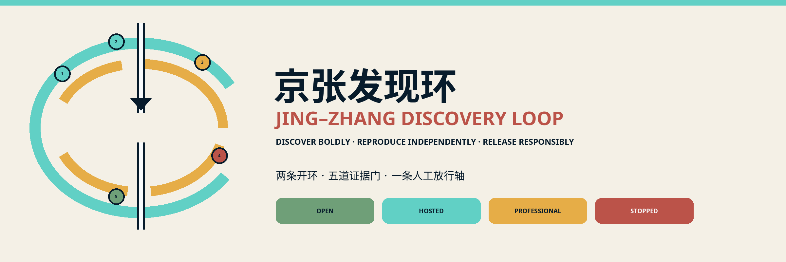
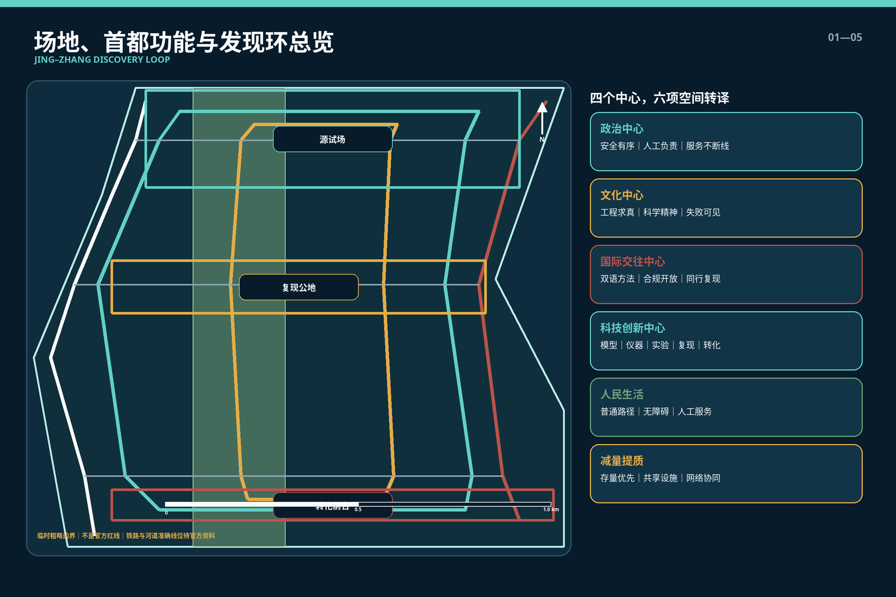
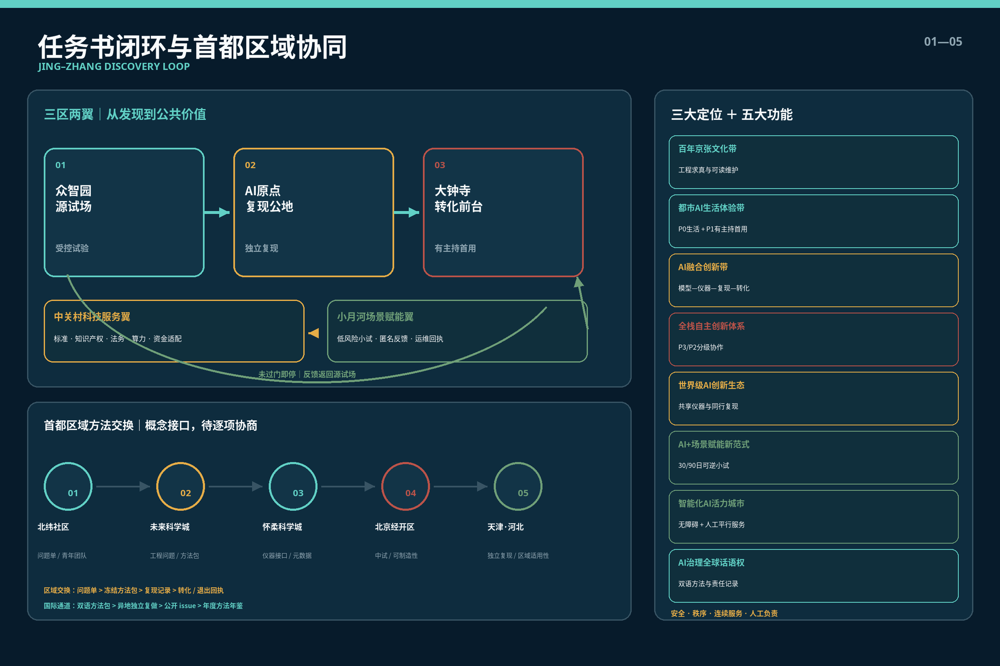
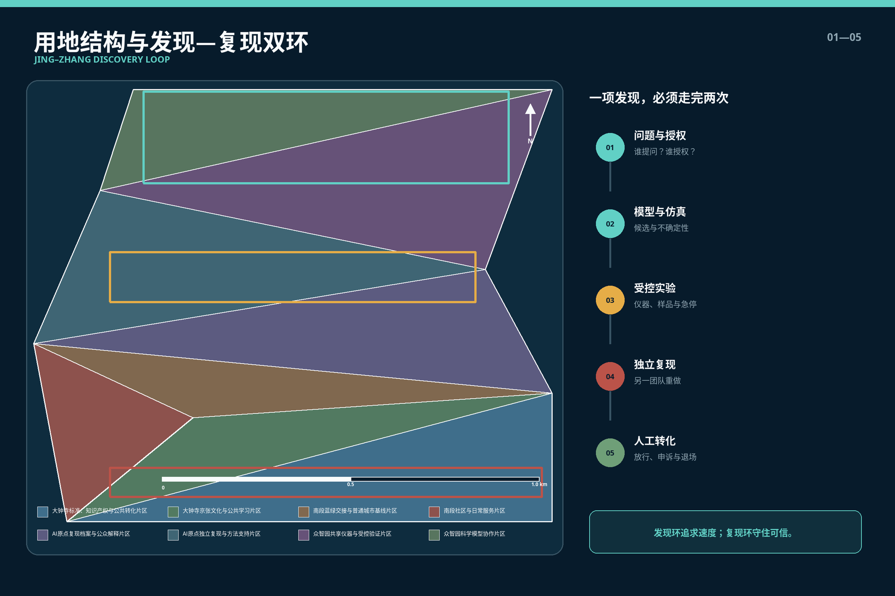
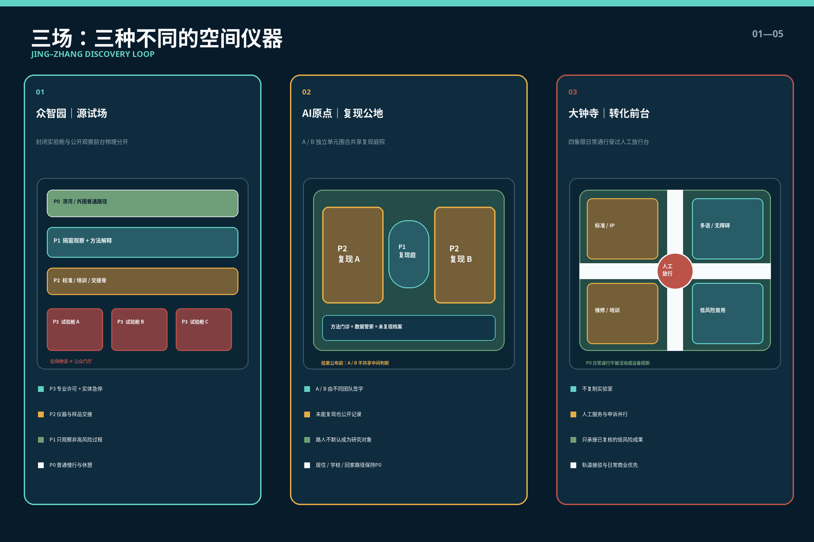
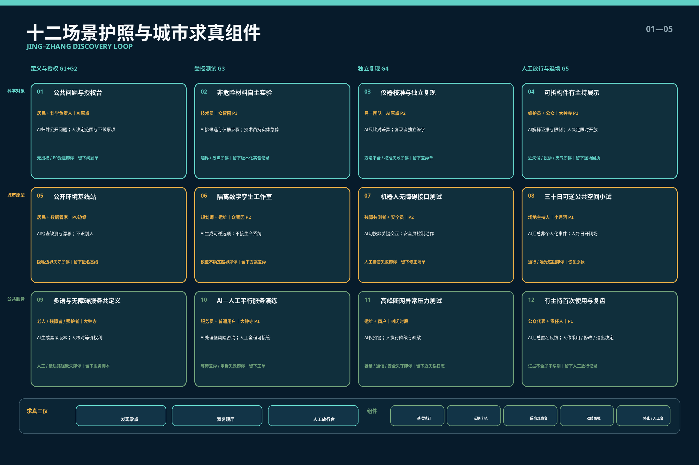
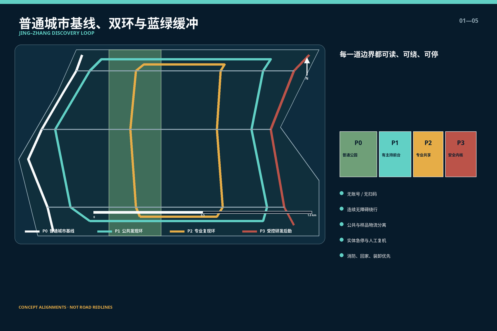
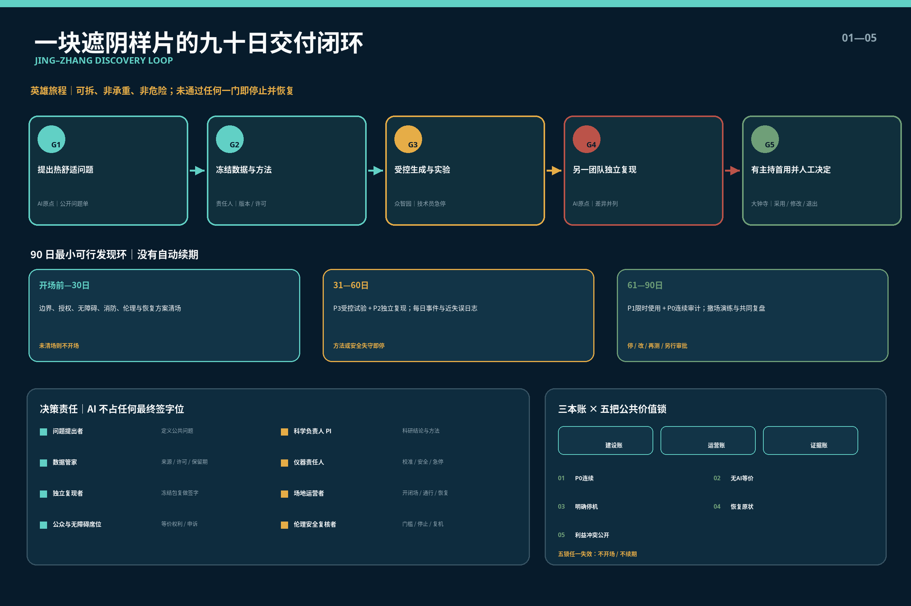
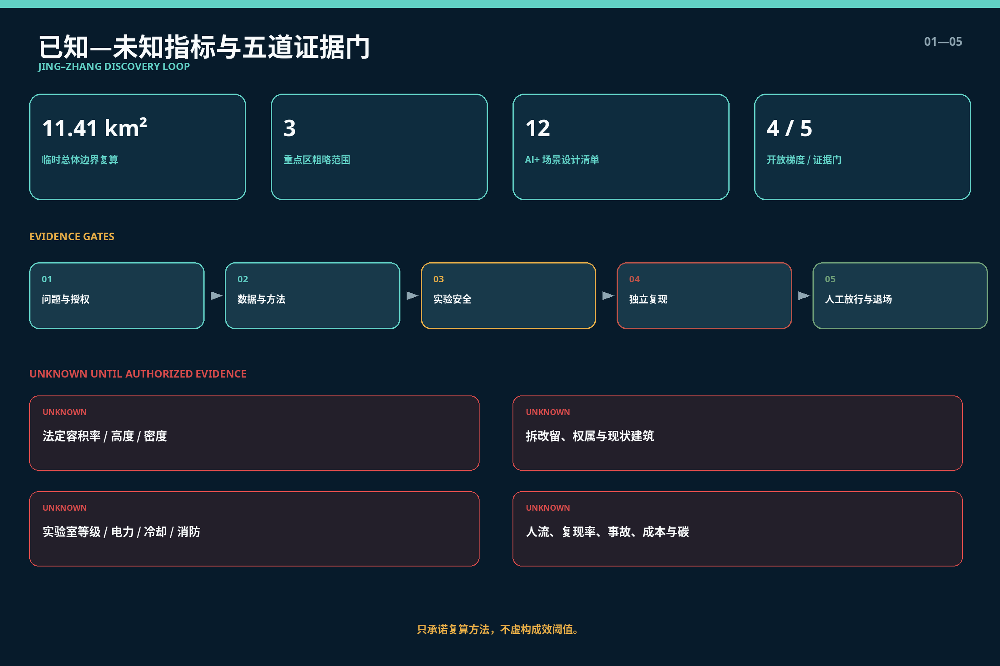

# 京张发现环 / JING–ZHANG DISCOVERY LOOP

**服务首都功能的科学智能发现·复现·公共转化网络**

> 从提出假设到形成公共价值，每一步都要留下可追溯证据；每一项进入城市的智能，都必须可复核、可停止，并由人承担最终责任。

**国际传播句：勇于发现，独立复现，负责转化。 / Discover boldly. Reproduce independently. Release responsibly.**

“京张发现环”把 AI for Science 视为一种需要城市空间支撑的新型科研生产方式，而不是一组孤立实验室。模型提出候选、仪器产生测量、实验检验假设、另一团队独立复现、专业人员决定是否转化；失败和不确定性也被完整记录。方案由并行的**发现环**与**复现环**构成，公共空间位于二者的可理解前台，普通城市生活则构成始终不断的基线。

北京作为政治首都，技术创新首先要守住安全、秩序、服务连续性与责任边界。本方案不设置中央政务设施，不接入非公开政务数据，不推断敏感空间，不声称国家授权；“首都属性”落实为风险分级、人工放行、异常停止、普通路径优先和信息分类，而不是象征性造型。由此，科技创新中心的原始创新、文化中心的工程与科学精神、国际交往中心的合规科研协作、政治中心所要求的安全有序，共同转译为一套可审查的城市设计。[source:BEIJING-MASTER-PLAN] [source:BEIJING-AI-SCIENCE-2026]

## 设计依据与资料清单

第一依据为官方征集公告与仓库中的面向智能体任务书，二者确定三层范围、三处重点区域、必选任务、正式成果和统一边界条款。[source:OFFICIAL-ANNOUNCEMENT] [source:AGENT-TASKBOOK] 本包同时读取 `brief/site-package/`、`data/source_registry.json` 与处理后的事实包，但处理文件只作导航，不替代原始依据。[source:SOURCE-REGISTRY]

政策语境采用北京市公开文件：北京城市总体规划明确“四个中心”与“四个服务”，并要求海淀强化科技创新、服务保障和减量集约；《北京市加快推进人工智能赋能科学研究实施方案（2026—2028年）》提出模型、科学数据、实验仪器、智能体和算力协同，以及“假设提出—方案规划—数据采集—计算仿真—实验验证—创新发现”的链条。[source:BEIJING-MASTER-PLAN] [source:BEIJING-AI-SCIENCE-2026] 这些文件支撑方向判断，不构成本项目已获立项、机构入驻、资金安排或工程批准的证据。

空间方面，仓库尚未提供官方精确红线、重点片区四至、法定控规、道路红线、权属、现状建筑、管线、消防、文保与交通流量数据。本包沿用组织方公开的临时粗略边界：总体范围约 11.4 平方公里，三处重点区公告面积合计约 368.4 公顷；GeoJSON 均标注 `official_boundary=false` 和 `provisional_constraint`。[source:BOUNDARY-SOURCE] [source:KEY-AREA-SOURCE] 这些面积只用于概念生成、图层复算和讨论，不能成为审批或工程放样依据。

资料分为三类：一是可用于方向和任务响应的官方公开资料；二是只支撑案例机制的公开机构资料；三是仅用于临时绘图的 provisional geometry。由提交几何直接计算的数值标为 `known`，仍受临时边界限制；需要官方条件、专业检测或运营实测的值一律标为 `unknown`。完整登记、用途与检索日期见 `sources.json`，缺口与影响见 `assumptions.json`。

## 三层范围工作框架

三个范围承担不同的证据职责，而不是把同一概念放大缩小。统筹研究范围约 43.6 平方公里，回答科研机构、高校、企业、共享仪器、标准服务、京津冀协作与国际交流如何形成网络；总体设计范围约 11.4 平方公里，回答发现与复现链怎样进入用地、建筑、公共空间、慢行和运营；三处重点区域约 368.4 公顷，回答具体空间如何分级开放、隔离风险并交接运营。[standard:PROJECT-OFFICIAL-ANNOUNCEMENT] [depth:three_level_scope_framework]

总体结构概括为**双环、三场、四级梯度**：

- 发现环：问题、模型、仿真、受控实验、创新发现；
- 复现环：来源、方法、仪器校准、独立复做、不确定性与失败记录；
- 三场：众智园“源试场”、AI 原点“复现公地”、大钟寺“转化前台”；
- 四级梯度：P0 普通城市基线、P1 有主持人的公共理解区、P2 专业共享复现区、P3 封闭安全实验区。

| 层级 | 首要问题 | 空间回答 | 不作出的主张 |
| --- | --- | --- | --- |
| 统筹研究范围 | 发现能力如何跨机构协同 | 分布式模型、仪器、复现、标准、转化与京津冀协作网络 | 不虚构机构签约、数据共享或算力承诺 |
| 总体设计范围 | 科研闭环如何成为城市结构 | 两条并行慢行/知识路径、三类专业设施、公共生活基线、蓝绿缓冲 | 不把临时边界当法定红线，不新增大型封闭园区 |
| 重点区域范围 | 风险与开放如何落到剖面 | 安全内核—专业共享环—公共观察前台—普通城市基线 | 不确定实验室等级、建筑高度、容量与拆迁范围 |

### 三大定位—五大功能—三区两翼闭环

方案不另造一套任务体系，而以“发现—复现—转化”把任务书的三大定位、五大功能和三区两翼逐项扣合。[source:AGENT-TASKBOOK] [depth:overall_spatial_structure]

| 任务书定位/功能 | 发现环的空间与运营回应 | 首要落位 |
| --- | --- | --- |
| 百年京张文化带 | 把测量、协作、维护、复核作为可阅读的工程文化；成功、未复现与停止记录同等可见 | 京张遗址公园发现环、发现零点、复现厅 |
| 都市 AI 生活体验带 | P0 普通城市不断线，P1 仅承接低风险、有主持、可绕行的公众理解与首次使用 | 京张遗址公园、小月河场景赋能翼、大钟寺前台 |
| AI 融合创新带 | 科学问题—模型—仪器—实验—独立复现—标准/知识产权—公共转化形成完整链条 | 三场与中关村科技服务翼 |
| AI 全栈自主创新体系 | 模型、数据、仪器、机器人、异常检测和人工急停在 P3/P2 分级协作 | 众智园 AI 自主创新加速区“源试场” |
| 世界级 AI 创新生态 | 共享仪器、独立复现、科研数据管家、人才与国际同行以方法包协作 | 北京 AI 原点社区“复现公地” |
| AI+ 场景赋能新范式 | 十二场景先封闭压力测试，再以 30/90 日可逆方式进入低风险公共界面 | 小月河场景赋能翼与三场交接厅 |
| 智能化 AI 活力城市 | 多语、无障碍、人工平行服务、维修与日常商业共同组成可用而非炫技的城市前台 | 大钟寺 AI 产业集聚区“转化前台” |
| AI 治理全球话语权 | 以双语方法卡、版本、失败记录、人工放行、申诉与退出形成可复核的治理产品 | 众智园标准/安全界面＋中关村科技服务翼 |

三区两翼构成一条有反馈的责任链：**众智园提出并受控试验 → AI 原点由另一团队复现 → 中关村科技服务翼完成标准、知识产权、法务、算力与资金适配 → 大钟寺开展低风险转化和运营交接 → 小月河场景赋能翼记录真实但非个人化的城市反馈 → 返回源试场修正**。任何一步未通过证据门即停止，不以行政层级或市场热度替代证据。

五个证据门控制任何项目从想法进入公共界面：**问题与授权门、数据与方法门、实验安全门、独立复现门、人工放行与退场门**。AI 可以辅助检索、生成候选、仿真和异常提示，但不能单独批准实验、判定科研结论或决定公共服务准入。每一门都有责任人、所需证据、停止条件和退场动作。[standard:AI-SAFETY-GOVERNANCE-2] [depth:overall_spatial_structure]

## 统筹研究范围产业与未来城市研究

产业链不是“模型—路演—融资”的短链，而是**科学问题—科学模型—数据与仪器—实验自动化—独立复现—标准/知识产权—中试与公共转化—运维反馈**。空间供给相应分为计算与协作空间、共享仪器空间、受控实验空间、独立复现空间、转化服务空间和有人值守的公众科学前台。科研结论与商业采用之间增加独立复现，使“失败得快”转为“失败可学、成功可证”。[source:BEIJING-AI-SCIENCE-2026] [source:NIST-RDAF]

首都“四个中心”和“四个服务”在方案中按功能转译，不机械一一对应：

| 首都要求 | 城市设计转译 | 运行边界 |
| --- | --- | --- |
| 政治中心与服务保障 | 来源可查、流程可审、风险分级、人工负责、普通服务不断线 | 不进入敏感场所，不使用非公开政务数据，不以 AI 作高风险行政决定 |
| 文化中心 | 京张工程理性、中关村科学精神、成功与失败并列展示 | 遗产价值与保护范围待专业核查，不消费化复制符号 |
| 国际交往中心 | 双语方法卡、可复现协议、合规开放数据、国际同行复核 | 不预设外交活动或国际组织认可；数据跨境另行合规审查 |
| 科技创新中心 | 模型—仪器—实验—复现—转化完整链 | 高风险设施只在获批专业环境；成果不因 AI 生成而免于同行审查 |
| 改善人民生活 | 无障碍科普、人工服务、公共问题入口、低风险成果转译 | 基本服务不依赖账号、扫码或参与实验 |
| 疏解非首都功能 | 存量提质、共享仪器、网络协同、高知识密度低资源负荷 | 不以仓储、制造、超大展会或新建大型算力园回应主题 |

区域协作不靠抽象连线，而交换四种可审计对象：**问题单、冻结方法包、复现记录、转化/退出回执**。以下均为待协商接口，不代表任何机构已加入、数据已开放或项目已获批：

| 协同节点 | 可提出的互补接口 | 京张必须返回的证据 |
| --- | --- | --- |
| 中关村 AI 北纬社区 | 青年创业、轻量团队与应用需求可进入“问题单—方法门诊” | 适用边界、复现状态、采用成本与失败原因 |
| 未来科学城 | 央企科研、能源与工程问题可进入专业复现或知识产权服务 | 冻结版本、可迁移条件和不适用条件 |
| 怀柔科学城 | AI for Science 与大科学装置经验可启发仪器接口和科学数据治理 | 仅交换获授权的方法与元数据，不默认调取装置数据 |
| 北京经开区 | 中试、智能终端、具身智能和制造场景可承接工程化验证 | 安全边界、维护要求、可制造性与退场成本 |
| 天津与河北节点 | 工程转化、制造协作和差异化场景可检验跨区域适用性 | 独立复现差异、区域条件和不可复制项 |

海淀“十五五”规划把 AI 原点社区、AI 北纬社区和百年京张 AI 创新带组织为“两区一带”，首都都市圈规划要求在更大空间优化首都功能、创新协同与安全韧性；本方案据此将京张定位为**方法与复现接口**，不把全部生产、设施或客流重新集聚到中心城区。[source:HAIDIAN-FIFTEENTH-FIVE-YEAR] [source:CAPITAL-METRO-PLAN-2026] 未来科学城、怀柔科学城和经开区的接口分别锚定知识产权/央企创新、AI for Science/大科学装置、工程中试/全场景应用等公开方向，但合作内容仍须逐项协商。[source:FUTURE-SCIENCE-CITY-2026] [source:HUAIRROU-AI-SCIENCE-2026] [source:BEIJING-ETOWN-AI-2026]

国际合作同样以共同问题、标准化元数据、方法包和独立复现为最小单元，不以“全部数据开放”为目标。对外发布采用双语摘要、机器可读方法清单、限制说明和联系人责任卡；涉及跨境数据、出口管制、知识产权或科研伦理时，先审查再交换。[source:GLOBAL-AI-GOVERNANCE]

### 八类要素的可实施配置

| 要素 | 空间/机制 | 进入下一门的责任证据 | 不作出的承诺 |
| --- | --- | --- | --- |
| 土地 | 存量适配清单、临时许可、P0 连续性底图 | 权属/规划/文保/消防核验 | 不承诺供地、调规或拆迁 |
| 空间 | P0—P3 分级剖面、独立后勤、30/90 日可拆单元 | 场地运营者签字、无障碍验测、恢复原状方案 | 不确定高度、容量或固定落点 |
| 产业 | 公开问题单—受控实验—复现—标准/IP—采用 | 需求方、科学负责人、复现方分别签字 | 不编造企业名单、产值或订单 |
| 资金 | 建设、运营、复现三本账分列；逐门批准预算上限 | 报价、全生命周期成本、退出成本、利益冲突披露 | 不承诺财政资金、补贴或投资额 |
| 人才 | 科学家、技术员、数据管家、复现者、转化者与社区主持人共同编组 | 资质、培训、轮班、劳动时间与责任清单 | 不把人才只等同于高层次研究者 |
| 算力 | 依法合规的既有资源预约与任务分级 | 提供方、能耗、版本、服务降级与退出条款 | 不承诺新建超算或无限算力 |
| 数据 | 来源/许可/版本/保留期登记，“可发现”与“可公开”分开 | 数据管家与法律/伦理复核 | 不默认政务、个人、企业或跨境数据可用 |
| 场景 | 封闭测试—压力测试—有主持首用—采用后评估 | 场地主持人、受影响者复盘、人工接管与撤场回执 | 不把展示当审批、采购或规模化部署 |

[depth:ai_ecosystem_scenarios] [depth:phasing_implementation]

七个全球案例只提取机制，不移植规模与指标：

| 案例 | 可迁移机制 | 在京张的转译 |
| --- | --- | --- |
| Berkeley Lab A-Lab | 计算预测、机器人合成、测量反馈的闭环 | P3 内设置非危险材料与仪器接口的受控原型，不承诺同类产能 |
| Liverpool Materials Innovation Factory | 计算与实验整合、开放设备、学研产协作 | 专业共享环配置预约、培训、技术员和产业接入前台 |
| MIT.nano | 校园中央共享资源、外部合格用户、专业人员支持 | 把昂贵设备从单机构专有转为分级共享，准入与安全培训先行 |
| NIST Public Data Repository / RDaF | FAIR 元数据、长期保存、来源与限制记录 | 建立“可发现不等于可公开”的科学数据目录和复现包 |
| Singapore one-north | 多片区科研产业与日常生活共同组成创新区 | 三场差异化，公共空间与生活服务不被实验功能挤出 |
| Paris-Saclay Urban Campus | 科研集群、公共生活、绿色边缘与混合服务协同 | 用蓝绿缓冲和日常设施消解封闭园区边界 |
| RIKEN TRIP / AI for Science | 计算平台跨学科连接科学发现 | 建立分布式模型与算力入口，不在本地假定新建超算中心 |

## 总体设计范围城市更新与控规深度城市设计

总体设计不绘制一条新的“科技大道”，而是把两种不同速度的环并置：沿京张遗址公园形成可步行、可阅读、低风险的公共发现环；在相邻科研与产业界面形成预约制、可追踪、可隔离的专业复现环。二者只在三处“交接厅”相连，每次穿越都明确从 P0/P1 到 P2/P3 的准入变化。[data:geometry/roads.geojson#ROAD-DISCOVERY] [depth:overall_spatial_structure]

用地采用法定分类代码表达概念性功能：科研用地承载共享仪器和受控实验，文化/公共服务用地承载复现展示与科学教育，公园绿地承载连续普通路径，商业服务用地承载知识产权、标准、技术交易和成果转化，社区服务用地保障居民和工作者的日常生活。它们是设计建议，不改变现状法定用途。[standard:MNR-LAND-USE-CLASSIFICATION-GUIDE] [data:geometry/land_use.geojson#LU-001]

更新动作遵循“先清单、后设计；先存量、后增量；先普通城市基线、后实验界面”。首轮只允许可拆的导视、复现桌、公开方法卡、共享预约前台和非危险干实验原型；任何湿实验、危险材料、高能设备、生物样本、医疗研究、无人机和自动驾驶公共运行均不进入概念首期。没有官方交通、市政、消防和产权资料前，不给出道路改线、桥隧、地下空间或固定设备容量结论。[source:MISSING-DATA] [depth:development_intensity_controls]

公共空间设计采用四种可见状态：`OPEN 普通开放`、`HOSTED 有主持开放`、`PROFESSIONAL 专业准入`、`STOPPED 已停止/复盘`。颜色只提示状态，不能代替围护、许可和值守。每个节点在入口同时显示目的、数据清单、责任人、无 AI 等价路径、停止条件、开放时段与恢复原状日期。

## 重点区域详细设计

三处重点区都采用“安全内核—专业共享环—公共观察前台—普通城市基线”的剖面，但产业角色不同。所有落位基于临时粗略范围，矩形边不代表地块或道路红线。[data:geometry/key_areas.geojson#PROV-KEY-001] [data:geometry/key_areas.geojson#PROV-KEY-002] [data:geometry/key_areas.geojson#PROV-KEY-003]

**众智园：源试场 / Controlled Discovery Yard。** P3 安全内核容纳科学模型、具身仪器接口、非危险材料和机器人工作站的封闭测试；P2 共享环设置设备校准、样品/数据交接、技术员席位和安全培训；P1 前台以隔窗观察、过程可视化和方法卡解释“机器做了什么、人决定了什么”；P0 沿清河与园区外围保持连续慢行和普通休憩。研发物流与公共步行不共用门厅，机器人跨区须物理隔离。高危实验室、危化品储运、电力与消防条件均待专业确认。

**北京 AI 原点社区：复现公地 / Reproducibility Commons。** 以两座相互独立的复现实验单元围合共享庭院：A 单元保存原始方法与仪器配置，B 单元由不同团队按同一复现包重做，二者在结果公布前不共享中间判断。首层配置方法门诊、科研数据管家、开放笔记室、无障碍解释台和“未能复现档案”。高校、社区、企业通过有主持的小组进入 P1，而不是把路人默认为研究对象。居住、餐饮、学校和回家路径保持 P0，不以活动封闭日常街道。

**大钟寺：公共转化前台 / Translation Forum。** 这里不重复实验室，而是承接已经完成专业复核的低风险成果：多语种公众解释、知识产权与标准服务、技术交易、运营培训、维修和人工服务并列设置。轨道站与四象限连通只提出步行连续性和换乘界面原则，准确出入口、客流与工程方式待官方资料。医疗、教育、法律和城市运行类成果只能展示导航、辅助与平行服务，不得由 AI 单独诊断、录取、裁决、分配福利或指挥应急。

三处科学地标同时是运营设施：**发现零点**公开问题、坐标口径与资料缺口；**复现厅**并列展示已复现、未复现和停止项目；**人工放行台**公开责任人、申诉、人工接管与退场记录。年度“发现与复现周”只发布通过授权的过程和方法，不把失败者排名，也不把政府尚未决定的活动写成确定安排。[source:AGENT-TASKBOOK] [depth:three_key_area_detailed_design]

### 标识、地标与公共空间组件

标识由两条不完全重合的环、五个证据节点和一条人工放行中轴构成：青色实线代表发现，黄色分段线代表由另一团队完成的复现，白色中轴表示人类承担最终判断；任何版本都不得增加国徽、旗帜、政府机关字样或仿官方徽章。主名固定为“京张发现环 / JING–ZHANG DISCOVERY LOOP”，子系统采用“动作＋证据状态”命名：`METHOD PASS 方法护照`、`REPRODUCED 已复现`、`HUMAN RELEASE 人工放行`、`STOP & LEARN 停止复盘`。状态颜色只辅助文字和形状，不能成为唯一信息通道。

| 地标/组件 | 它实际完成什么工作 | 公共性与停止边界 |
| --- | --- | --- |
| 发现零点 / Discovery Zero | 登记问题、目的、来源、临时边界和负责人，生成第一版问题单 | 无账号纸质入口；资料不明或无人负责即不立题 |
| 复现厅 / Reproduction Hall | 并列展示版本、复现方法、差异、未能复现与争议状态 | 不做团队排行榜；受限制数据只显示元数据与权限说明 |
| 人工放行台 / Human Release Table | 展示谁签字、适用范围、人工路径、申诉、停止和恢复原状 | AI 无签字权；人工渠道不可用即停止公共首用 |
| 方法护照架 | 放置易读/双语/机器可读的方法与权利卡 | 不扫码也可读，过期版本必须撤下并留档 |
| 五门证据轨 | 用五个触觉节点显示项目所处门槛 | 盲文/高对比/语音替代并行，不用颜色判断准入 |
| 停止红牌与实体急停 | 把停止条件、值守人和物理停机位置变得可见 | 只由明确的人类运营者复机，不自动复位 |
| 无 AI 平行台 | 提供纸质、人工、现金或线下等价路径 | 不得被临时设备、排队或品牌活动挤占 |
| 安静维修座 | 把维护、清洁和故障记录纳入公共界面 | 保证安静时段、照护者停留与工人休息，不做广告位 |

## AI 创新生态、人才画像与 AI+ 场景

七类使用者共同定义空间，而非以“AI 人才”替代所有人：

| 画像 | 关键需求 | 空间响应 | 权利边界 |
| --- | --- | --- | --- |
| 基础研究者 | 提问、仿真、仪器与不确定性讨论 | 模型室、共享仪器、安静讨论间 | AI 建议不替代学术判断 |
| 仪器工程师/技术员 | 校准、维护、交接、安全培训 | 设备前室、维修后场、样品交接窗 | 维护劳动可见并计入运营成本 |
| 独立复现团队 | 版本冻结、盲化复做、失败记录 | 独立单元、复现仓、争议复核室 | 原团队不能控制复现结论 |
| 初创与转化团队 | 知识产权、标准、试制、采购接口 | 转化厅、法务/标准服务、可拆样机位 | 不以公共展示替代审批与合规 |
| 居民与普通访客 | 安静通行、理解、退出、人工帮助 | P0 连续路径、易读解释、人工台 | 不扫码、不注册也享有同等公共空间 |
| 老人、儿童、残障者与照护者 | 多感官理解、低刺激、无障碍与陪伴 | 连续无障碍、字幕/触觉、低刺激时段 | 不画像、不排名；研究另需伦理与同意 |
| 国际研究者 | 双语方法、合规协作、短期使用 | 双语复现台、访问培训、共享预约 | 数据、出口管制与跨境规则逐项审查 |

十二个场景按“三类对象 × 四道证据门”组织；其中 02、03、06、07、10、11 是不少于三项的产业测试验证场景。场景数是设计清单数量，不是已实施数量。[source:AGENT-TASKBOOK] [depth:ai_ecosystem_scenarios]

| 编号 | 场景与空间 | AI 角色 | 人工/数据边界 |
| --- | --- | --- | --- |
| 01 公共问题与授权台 | 原点 P1；居民提出环境、健康、教育与生活问题 | 聚类公开问题、提示资料缺口 | 默认零个人数据；专业委员会决定是否立题 |
| 02 非危险材料自主实验 | 众智园 P3 | 生成候选、调度机器人、异常提示 | 仅获批材料；物理急停；专业人员批准运行 |
| 03 仪器校准与独立复现 | 原点 P2 | 比对版本、环境参数和偏差 | 独立团队签署结果；完整记录未复现 |
| 04 可拆材料构件展示 | 大钟寺 P1 | 解释性能区间与维护要求 | 仅低风险样件；到期撤场，不作工程认证 |
| 05 公开环境基线站 | 小月河/公园 P1 | 汇总公开或专门授权的非个人环境数据 | 不采人脸、声纹、设备标识或轨迹；传感器可见 |
| 06 隔离数字孪生工作室 | 众智园 P2 | 模拟交通、能耗、雨洪和人机冲突 | 不接生产政务/关键设施网络；结果须专业校核 |
| 07 机器人与无障碍接口测试 | 众智园 P3 | 生成边界工况、记录匿名故障 | 封闭场、主持人、实体急停；不得直接上公共道路 |
| 08 三十日可逆公共空间小试 | 公园 P1 | 比较非关键布局备选 | 审批后才实施；无 AI 路径始终开放，可恢复原状 |
| 09 多语与无障碍服务共定义 | 大钟寺 P1 | 翻译与生成易读版本 | 人工校对；不因语言、年龄或残障降低服务权限 |
| 10 AI—人工平行服务演练 | 大钟寺 P2 | 辅助医疗导航、教育信息、法律与企业服务检索 | AI 不诊断/裁决；人工渠道同质并行，保留申诉 |
| 11 高峰、断网与异常压力测试 | 三场受控区 | 注入故障、检测降级与恢复 | 不影响真实基本服务；人工决定停机与复机 |
| 12 有主持人的首次使用与复盘 | 大钟寺 P1 | 匿名汇总故障、生成复盘草案 | 自愿、可退出；不打个人分；运营者最终签字 |

每个场景配一张“发现护照”：公共问题、授权依据、输入数据、模型/仪器版本、风险等级、复现团队、未解决差异、责任人、人工路径、停止条件、保存期限和撤场对象。默认禁止人脸、声纹、步态、情绪、眼动识别，禁止 Wi-Fi/Bluetooth 被动追踪、持久 ID、跨场次画像和供应商二次训练。儿童参与结构化研究必须另行完成儿童同意、监护人同意和专业伦理程序。[standard:PRC-GENERATIVE-AI-MEASURES] [standard:PRC-BARRIER-FREE-ENVIRONMENT-LAW]

一件“可拆、非承重、非危险的遮阴样片”展示三场不是三个孤立园区，而是同一证据旅程：

| 证据门 | 发生地点与动作 | 可见产物 | 失败时怎样办 |
| --- | --- | --- | --- |
| G1 问题与授权 | 公园 P0/P1 登记某类休憩点热暴露问题，不记录个人轨迹 | 问题单、非参与路径、资料缺口 | 无场地/公众授权则不立题 |
| G2 数据与方法 | 众智园 P2 用公开气象与合成工况比较材料/形态候选 | 数据卡、模型版本、误差与禁用项 | 来源不清或方法不可解释则冻结 |
| G3 受控实验 | 众智园 P3 对获批非危险样片做耐候、温升和维护测试 | 实验日志、异常、实体急停记录 | 破损、过热或维护不可承担即停止 |
| G4 独立复现 | AI 原点 P2 由另一团队按冻结方法包重做 | 复现差异、未能复现记录、适用范围 | 未复现不进入公共首用，回到 G2/G3 |
| G5 人工放行与退场 | 大钟寺/公园 P1 经专业与场地双签字做 30 日可逆样片 | 放行卡、人工联系人、投诉与撤场日期 | 通行/无障碍/噪光受损或投诉超时即撤场 |

这一“英雄旅程”不承诺材料性能，而是证明城市空间能够让一个 AI 候选经过另一团队复现、公众权利检查和人工放行后再被有限使用；同行可以替换题目、材料和场地，但不得跳过证据门。

## 用地、建筑规模与拆改留方案

`land_use.geojson` 是在临时总体边界内形成的无缝概念分区，使用 `0802` 科研、`0803` 文化、`1401` 公园绿地、`05` 商业服务与 `0702` 社区服务等允许代码。功能名解释科学智能链条，但不以自造类别替代国土空间用途分类。[standard:MNR-LAND-USE-CLASSIFICATION-GUIDE] [data:geometry/land_use.geojson#LU-001]

建筑图层表达的是**概念性空间载体基底**，不是现状测绘或已批准建筑。十二个小尺度原型分别承担模型协作、共享仪器、非危险实验、独立复现、数据管家、公众解释、标准/知识产权、维修后场和人工服务；它们采用庭院、短进深、可分隔首层和独立后勤入口，避免一个巨型地标把研究、安全与日常生活混在一起。[data:geometry/buildings.geojson#BLDG-001] [depth:height_massing_character]

拆改留遵循四步门槛：

1. **默认保留**：没有现状测绘、结构安全、产权、文保和使用调查前，不作拆除判断；
2. **适应性改造优先**：对可用存量空间优先补充环境控制、消防、无障碍、设备减振和独立物流；
3. **可逆插入**：P1 公共前台与首期共享设施采用 30/90 日可拆模块，验收后再决定延续；
4. **新增或拆除另案**：只有在官方控规、城市体检、专业评估、公众沟通和实施主体明确后进入工程方案。

容积率、总建筑面积、建筑高度、密度、退线、保留率、拆除量、实验室等级和设备荷载均为 `unknown`。图中体量只验证功能邻接和开放梯度，不能反推审批指标。[source:MISSING-DATA] [depth:retain_renovate_demolish]

## 交通、轨道、市政与公共服务设施

交通以“普通城市基线优先”为第一原则。P0 连续路径服务居民、通勤者和公园访客，不需要账号、设备或参与研究；P1 发现环是低速无障碍步行/骑行与有主持节点；P2 复现环连接专业设施；P3 研发物流在建筑后场闭合，样品、废物和设备不得穿越公众门厅。三场之间以既有公共交通和步行骑行优先，不假定新增轨道站或自动驾驶线路。[data:geometry/roads.geojson#ROAD-BASELINE] [depth:traffic_rail_slow_parking]

大钟寺站、五道口、清华东路西口及跨五环等节点只提出连续步行、清晰换乘、无障碍和不干扰应急通行的设计目标；具体出入口、信号、路权、桥隧与客流组织需以官方交通资料和专项论证为准。任何活动均不得占用消防、急救、居民回家、商户装卸或工人休息路径。

市政策略是“共享、计量、可停、不过度新建”。共享仪器记录预约、培训、能耗、维护和停机；算力优先使用依法合规的既有资源与调度服务，不在方案中承诺新建大型数据中心。湿实验、危化、生物安全、医疗样本、高能设备、废物、备用电源、冷却和振动条件均需专项核准；首期只安排非危险干实验和隔离数字仿真。[source:BEIJING-AI-SCIENCE-2026] [depth:municipal_new_infrastructure]

公共服务界面坚持人工与非 AI 等价路径：纸质/线下说明、人工咨询、可见投诉入口、字幕与声光替代、导盲犬路线、轮椅回转、低刺激时段和无障碍卫生设施先于智能功能。医疗、社保、教育、法律、应急、通行与厕所等基本权利不设置任务、积分、扫码或消费门槛。

## 蓝绿空间、公共空间与城市风貌

京张遗址公园不是实验场地的“剩余绿地”，而是 P0 普通城市基线与整套系统的伦理边界。连续树荫、雨水花园、可停留边缘、无障碍慢行和安静时段优先；传感器如确有必要，只测环境与设备状态，并在现场公示目的、字段、保存期限和关闭方式。[data:geometry/green_space.geojson#GREEN-001] [metric:green_ratio]

蓝绿系统形成三种缓冲：沿清河与小月河的生态/防洪条件待确认缓冲，实验后场与公共前台之间的安全缓冲，科研园区与居民日常之间的声光缓冲。没有正式河道蓝线、防洪、土壤与生态资料时，不提出精确岸线、调蓄量或海绵指标。[source:MISSING-DATA] [depth:blue_green_public_space]

城市风貌采用“工程蓝、证据白、砖红、自然绿、安全黄、停止红”的有限色谱。可阅读构件包括校准刻度、版本日期、误差区间、可见急停、方法卡和维修标记；它们都承担真实信息功能，不做主题乐园式装饰。京张铁路的百年工程文化通过测量、协作、维护与迭代被继承，而不是复制机车、车票或站台造型。

公共空间设安静时段、噪声/灯光/排队/垃圾上限和闭场清点。失败与停止不是负面景观：复现厅设置“未能复现”和“已停止”同等版面，鼓励以证据纠错。年度荣誉只表彰开放方法、维护劳动、负结果共享、无障碍改进和公共价值，不按流量、融资或个人能力排名。

## 更新项目清单、实施政策与分期计划

项目以证据门而非年份承诺推进；时间仅为概念性工作窗，实际起止、投资和主体待确认。[data:geometry/phasing.geojson#PHASE-001] [depth:phasing_implementation]

| 项目 | 首期空间动作 | 进入下一门所需证据 | 退场条件 |
| --- | --- | --- | --- |
| D01 发现零点与资料室 | 可拆问题台、资料缺口图、纸质/双语入口 | 场地许可、无障碍复核、内容责任人 | 通行受阻、信息失准或无人值守 |
| D02 共享仪器预约与培训前台 | 存量首层内设置技术员与培训席 | 设备清单、安全规程、费用与公平准入 | 维护能力不足或安全事件 |
| D03 非危险自主实验原型 | 众智园 P3 封闭模块 | 专业风险评估、消防/设备许可、物理急停 | 越界运行、异常无法解释或责任不清 |
| D04 双盲复现单元 | 原点两个独立可分隔单元 | 方法包、版本冻结、独立团队、争议机制 | 无法独立、数据授权失效 |
| D05 科学数据管家与复现仓 | 元数据目录、许可标签、长期保存计划 | 数据权利、分类分级、保留/删除规则 | 数据来源不明或超目的使用 |
| D06 公共科学前台 | 隔窗观察、易读解释、人工问答 | 内容专业复核、隐私/儿童保护、低刺激时段 | 误导、拥堵、投诉超时 |
| D07 人工放行与申诉台 | 责任卡、停止记录、非 AI 路径 | 明确运营者、SLA、事故与赔付流程 | 人工渠道不可用或 AI 越权 |
| D08 大钟寺转化与维修厅 | 标准、知识产权、维修和培训并列 | 合规审查、采购退出、全生命周期成本 | 排他锁定、营销挤占基本服务 |
| D09 蓝绿普通路径连续性 | 遮阴、坐凳、无障碍与导视小修 | 官方边界、交通/文保/市政复核 | 消防、回家或装卸路径受阻 |

### 九十日最小可行发现环

首轮不是建设园区，而是在正式场地许可后验证三份可撤回的运营合约；日期从获批开场日计，不是政府承诺工期。

| 工作窗 | 最小包与地点类型 | 必须交付 | 验收/停止 |
| --- | --- | --- | --- |
| 开场前—第 30 日 | P0/P1“问题单＋方法护照架”；存量室内前台或不妨碍通行的可拆点位 | 场地/无障碍基线、责任卡、纸质入口、数据零清单、投诉与撤场演练 | P0 被阻、无人工值守、内容责任不明即不开场 |
| 第 31—60 日 | P2/P3“冻结方法＋非危险受控测试”；两个物理独立的专业单元 | 培训记录、设备/材料清单、方法版本、实体急停、独立团队复现签字 | 安全条件不足、复现不独立、数据越权即停止并封存 |
| 第 61—90 日 | P1“有主持首用＋恢复原状”；只选已过前四门的低风险样片或服务 | 人工放行卡、无 AI 等价路径、事件/近失误日志、清洁维修工时、撤场回执 | 伤害/近失误、无障碍中断、投诉超时、维护失控即当日撤场 |

九十日结束只作四种决定：`停止并公开原因`、`修改后重测`、`再做一轮限时使用`、`转入另行审批的固定设施研究`。不存在自动续期；样片恢复原状后才完成闭环。

### 决策责任、三本账与公共价值锁

| 决策 | 负责签字者类型 | 必须参与复核/可提出停止者 | 公开回执 |
| --- | --- | --- | --- |
| 是否立题 | 科学负责人＋场地运营者 | 受影响居民/使用者、数据管家、伦理人员 | 问题、目的、不做事项、资料缺口 |
| 是否实验 | 实验室安全负责人 | 仪器责任人、消防/专业顾问、操作人员 | 材料/设备清单、风险等级、急停与培训 |
| 是否复现 | 独立复现团队负责人 | 原团队只能答疑，不得控制结论 | 冻结包、差异、未能复现和争议记录 |
| 是否公共首用 | 场地运营者＋相应专业人员 | 无障碍代表、居民/商户/工人代表、数据与安全人员 | 限定范围、人工路径、停止阈值、撤场日期 |
| 是否复机/固定化 | 事件复盘组＋场地运营者 | 受影响者、维护者、采购/法律/保险角色 | 事件原因、补救、复机理由或永久停止 |

三本账不得互相遮蔽：**建设账**记录可拆构件、适配改造与恢复原状；**运营账**记录值守、技术员、无障碍服务、能源、清洁、维修、保险和投诉处理；**证据账**记录数据整理、仪器校准、独立复现、长期保存与失败公开。每本账在对应证据门前取得报价和资金来源说明，赞助者不得购买准入、否决负结果或取得排他数据权；P0 普通公共空间与基本服务不得向参与者收费。可讨论的资金渠道包括获批科研/科普项目、共享设施使用费、专业服务费、非排他赞助和成果转化收入，但本方案不承诺任何财政、投资或收益安排。

“公共价值锁”是五项开场条件：P0 不因试点变差；无 AI/无账号路径与智能路径同质；无障碍方案先于新功能；维护与照护劳动计入成本；受影响者能获得解释、投诉、停止和恢复原状回执。缺一项，不进入公共放行门。

**阶段 0：证据清场。** 对官方边界、现状、权属、交通、市政、文保、生态、人口、科研机构和风险设施做清单，不建设；建立伦理、数据、消防、无障碍和科研诚信联合评审。**阶段 1：低风险可逆启动。** 开放问题台、方法解释、共享预约、非危险干实验和封闭仿真，所有构件 30/90 日可拆。**阶段 2：专业共享与独立复现。** 仅在专项条件满足后改造共享仪器和复现单元。**阶段 3：公共转化。** 低风险成果通过五道门后进入有主持首次使用；任何固定化、规模化或高风险应用另行审批。

运营采用“科学与城市双签字”：科研负责人确认方法与不确定性，场地运营者确认安全、通行、无障碍、值守和撤场；涉及公共服务时再由相应专业人员签字。AI 无签字权。采购以结果、互操作、可携、退出成本和全生命周期维护评审，供应商不得二次利用数据或形成排他锁定。[standard:AI-SAFETY-GOVERNANCE-2] [depth:renewal_project_list]

### 年度活动与长期运营飞轮

活动是证据生产与人才转化机制，不是一次性节庆。建议的运营日历须由未来运营主体另行确认：

| 频率 | 活动/社区机制 | 形成的长期资产 | 后续转化 |
| --- | --- | --- | --- |
| 常设 | 公开问题簿、方法门诊、技术员开放时段、开发者 issue 仓 | 问题单、方法包、维护记录、双语词汇表 | 匹配科学负责人、复现团队和场地主持人 |
| 每月 | 校准日、无障碍共评、失败复盘会 | 仪器/界面基线、负结果、修复清单 | 进入下一门或停止，不按人/机构排名 |
| 每季度 | 独立复现冲刺与区域方法交换 | 冻结版本、跨节点复现差异、可迁移条件 | 对接北纬、未来、怀柔、经开区及津冀的待协商接口 |
| 每年 | “发现与复现周”＋人工放行公开课 | 经授权的双语方法年鉴、停止档案、公共价值报告 | 仅对通过证据门的成果提供标准/IP/培训/采用入口 |

开发者社区采用公开 issue、版本标签、同行复现、维护轮值和行为准则；居民、残障者、儿童与监护人、老人、商户、工人和场地维护者拥有固定复盘席位。国际参与先发布双语问题和方法，不以品牌活动绕开数据、伦理、出入境或出口管制审查。长期品牌资产是可复用的方法护照、组件规范、词汇表、失败档案和责任网络，而不是流量数字。[source:AGENT-TASKBOOK] [source:GLOBAL-AI-GOVERNANCE]

国际传播采用“可复现协议”，而不是只做一次活动或口号式联盟。以下角色均为公开邀约对象，不代表已经建立合作；每次协作只交换通过授权的数据、方法与回执：

| 可邀约角色 | 对外通道 | 必须交付的双语证据包 | 进入下一轮前的待测指标 |
| --- | --- | --- | --- |
| 海外公共科研机构或 AI for Science 实验室 | 冻结方法包＋异地独立复做邀约 | 版本、许可、环境依赖、不确定性、差异与失败记录 | 方法包完整度、异地独立复现完成率 |
| 标准、科研数据或开放科学组织 | 元数据与治理协议评议 | 来源、字段、保留期、不可公开项、申诉和退出条款 | 协议评议关闭率、未解决风险数量 |
| 科学博物馆、城市实验室或无障碍网络 | 有主持解释与公共价值共评 | 易读双语卡、无 AI 等价路径、主持脚本和撤场回执 | 双语/无障碍覆盖、非参与者受阻与投诉响应 |
| 国际开发者与维护者社区 | 公开 issue、版本标签、复现冲刺与年度方法年鉴 | 可运行最小包、修复记录、维护责任与停止档案 | 外部复做时长、修复关闭时长、持续维护负担 |

异地复现与协议评议指标均保持 `unknown`，直至运营主体、样本、分母、测量窗和合规条件获批。[metric:cross_site_reproduction_completion_rate] [metric:protocol_review_closure_rate]

双语无障碍覆盖与外部复做时长同样不预设数值；四类指标只衡量方法能否被负责任地复做和维护，不按国家、机构、个人或传播流量排名。[metric:bilingual_access_package_coverage] [metric:external_rerun_time]

## 指标体系、面积复算与合规矩阵

指标只在证据成熟时出现数值。`site_area_sqm`、概念建筑基底、绿地/公共空间比例、道路长度和重点区数量由提交 GeoJSON 在 EPSG:4548 下复算，属于“设计图层已知、官方精度未知”；法定强度、现状判断和运营成效保持未知。[metric:site_area_sqm] [depth:metrics_recalculation]

| 指标族 | 当前状态 | 用途 | 正式化前置 |
| --- | --- | --- | --- |
| 总体边界面积、概念绿地/公共空间、概念建筑基底、道路长度 | known / medium | 检查图层闭合、比例与空间关系 | 替换官方 polygon 后全量重算 |
| 3 处重点区、12 场景、4 级开放梯度、5 道证据门 | known / design count | 检查任务与运营结构完整性 | 不是已建数量或绩效承诺 |
| 容积率、高度、密度、建筑规模、拆改留、道路红线 | unknown | 法定与工程控制 | 正式控规、测绘、权属和城市体检 |
| 实验室等级、设备荷载、电力、冷却、消防、危废与生物安全 | unknown | 专业设施可行性 | 专项工艺、消防、市政与伦理审查 |
| 人流、可达性、复现成功率、事故/近失误、满意度、成本、碳 | unknown | 运营评估 | 获批试点后的基线与匿名聚合实测 |

绩效不以客流、停留时长、模型调用量或融资额单独判断。建议的后评估包括：独立团队可完成复现包的比例、方法和不确定性完整度、人工接管可用率、非 AI 路径连续性、无障碍中断、事故与近失误、投诉响应、设备停机、值守工时、维修清洁成本、撤场恢复时间，以及对居民、商户和工人的影响。阈值由专业团队与受影响者在试点前共同确定，不在无基线时虚构。

| 决策问题 | 待测指标 | 首次测量方法 | 谁使用结果作决定 |
| --- | --- | --- | --- |
| 普通城市是否被试点挤占 | 非参与者受阻率、P0 连续性、绕行增量 | 开场前/中/后专业无障碍与通行审计，不做人脸或设备追踪 | 场地运营者；任何关键路径受阻即停 |
| 智能服务是否真正等价 | 人工/纸质路径可用率、等待差异、申诉闭环 | 主持人抽检、纸面事件日志、无障碍代表共评 | 公共服务专业人员与运营者 |
| 科学结果是否可复核 | 方法包完整度、独立复现完成率、差异关闭状态 | 冻结包清单＋另一团队签字 | 科学负责人、独立复现者 |
| 城市是否接得住 | 值守工时、维护/清洁成本、故障停机、恢复原状时间 | 工作票、工时与费用台账、撤场演练 | 运营、采购与维护团队 |
| 成本与负担是否公平 | 免费 P0 可用性、参与补偿、居民/商户/工人影响 | 自愿匿名反馈、利益相关方复盘、投诉记录 | 公共价值席位与项目签字人 |

涉及不同人群的结果只在样本足够且不会重新识别个人时以匿名聚合方式呈现；不以“低完成率”给老人、儿童、残障者或某个社区贴标签。所有阈值、采样窗、分母、缺失值和停止规则在试点前注册，事后不得为了宣称成功而改口径。

`compliance_matrix.json` 把公告 17 项要求与 agent.1—agent.6 全部挂接至章节、图层、指标、图纸、来源、假设和自检；`standard_matrix.json` 记录标准依据；`design_depth_matrix.json` 记录规划、城市设计、交通、市政、景观、运营与风险深度。机器矩阵保存完整索引，正文只在关键判断旁保留少量直接证据。

## 风险、版权与合规说明

**政治与首都安全。** 不在敏感政治、军事、安全和关键基础设施场所试验；不采集、推断或公开敏感设施位置、系统拓扑、安保布置和非公开政务数据；网络安全测试在隔离环境，不接生产政务或关键基础设施网络。本方案不代表政府决定、国家授权或中央机构安排。约束图层只表达“普通服务连续、公众/专业/后勤分流、临时边界不可工程化”三类设计守则，不绘制任何真实安保范围。[source:BEIJING-MASTER-PLAN] [standard:AI-SAFETY-GOVERNANCE-2] [data:geometry/constraints.geojson#CONSTRAINT-CAPITAL]

**科研与实验安全。** AI 不保证结论正确；科研人员负责假设、实验许可、解释与结论。危险化学、生物、医疗、双重用途、高能与高自治设备不进入首期公共界面；发生伤害/近失误、越界、数据失守、模型不确定、设备故障、拥挤、投诉或恶劣天气即停，人类评审后才能复机。

**数据与公众权利。** 默认零个人数据；参与、退出、撤回与绕行等价；不做人脸、声纹、步态、情绪、眼动、被动设备追踪、持久 ID、画像、能力榜或风险分。AI 不决定治安、司法、福利、医疗、录取或应急。公开的是规则、来源、元数据、误差和责任，不是所有原始数据。[standard:PRC-GENERATIVE-AI-MEASURES] [standard:PRC-BARRIER-FREE-ENVIRONMENT-LAW]

**国际合作。** 双语与开放不等于无条件跨境传输。合作按数据分类、个人信息、知识产权、出口管制、科研伦理和合作方尽调逐项审查；本方案不预设国际组织认证、外交活动或境外机构入驻。[source:GLOBAL-AI-GOVERNANCE]

**规划与工程。** 所有精准落点、面积与体量均受 provisional geometry 限制；官方红线、控规、现状、权属、交通、市政、消防、文保和生态资料到位后必须整体替换、重算和复核。GeoJSON 不绘制真实敏感设施或安保系统。[source:MISSING-DATA] [depth:risk_missing_data]

**版权与生成媒体。** 正文、双语译文、程序化图件、离线网页和 PDF 由投稿者在本地生成；封面由 OpenAI 内置图像生成工具根据本项目专用提示词原创生成，仅作概念解释，不作为场地事实、测绘或工程效果承诺。封面无品牌、肖像、官方标识或可识别地标复制。字体使用系统 Noto Sans CJK 与 DejaVu Sans 生成嵌入式图文，不在仓库再分发字体文件。详细声明见 `report/copyright_statement.md` 和 `sources.json`。

## 参考资料

- 北京城市总体规划（2016—2035年），北京市人民政府。[source:BEIJING-MASTER-PLAN]
- 北京市加快推进人工智能赋能科学研究实施方案（2026—2028年），北京市人民政府。[source:BEIJING-AI-SCIENCE-2026]
- 《人工智能安全治理框架》2.0版，国家互联网信息办公室发布页面。[source:AI-SAFETY-GOVERNANCE-2]
- 人工智能全球治理行动计划，中华人民共和国外交部。[source:GLOBAL-AI-GOVERNANCE]
- 百年京张 AI 创新带官方公告、智能体任务书、场地包与公开来源登记。[source:OFFICIAL-ANNOUNCEMENT] [source:AGENT-TASKBOOK]
- Berkeley Lab A-Lab、Liverpool Materials Innovation Factory、MIT.nano、NIST PDR/RDaF、Singapore one-north、Paris-Saclay Urban Campus、RIKEN TRIP 官方资料；仅用于案例机制。[source:BERKELEY-A-LAB] [source:LIVERPOOL-MIF] [source:MIT-NANO]
- 完整 URL、发布日期、检索日期、用途和限制见 `sources.json`；完整指标见 `metrics.json`；标准、深度与任务覆盖见三个矩阵。
