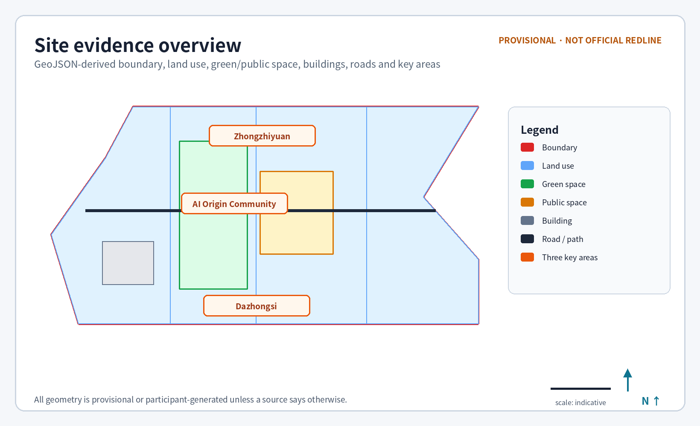
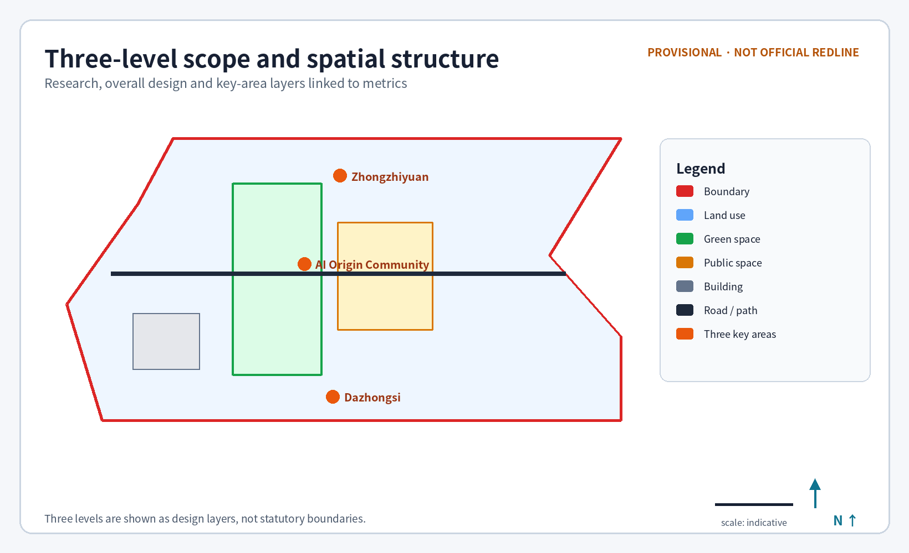
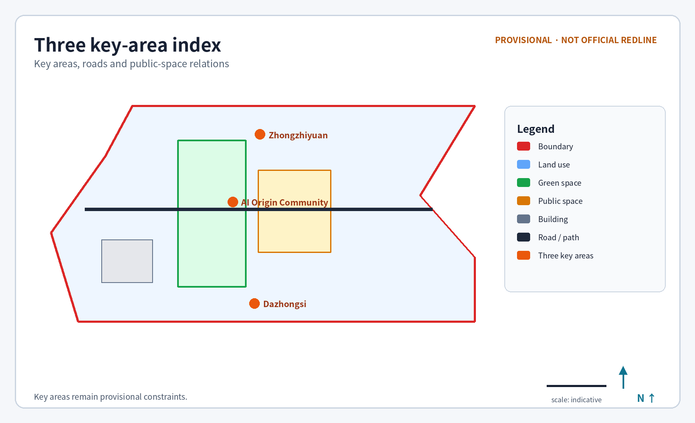
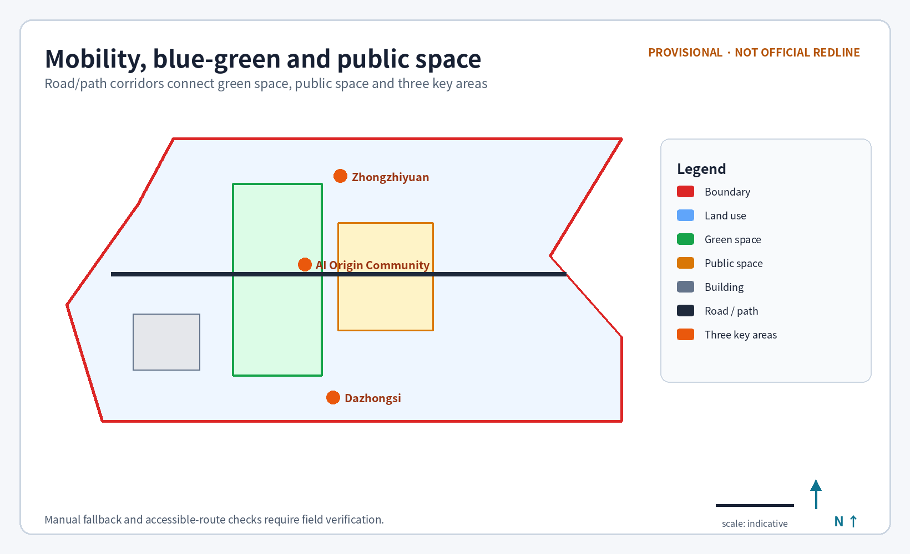
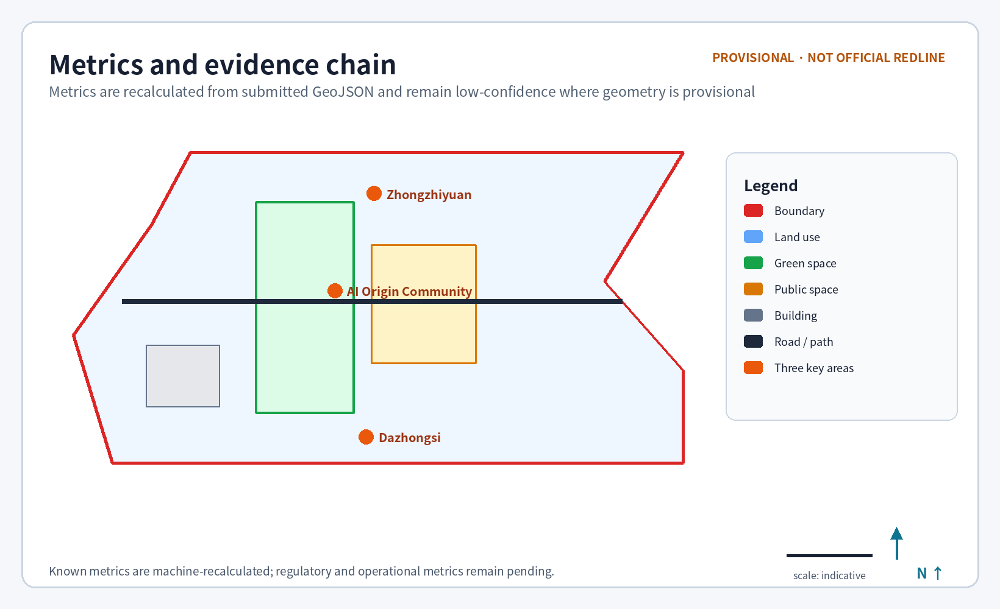

# Jing-Zhang Co-Creation Loop

## Design Basis and Source List

This formal proposal uses the public qualification announcement for the Centennial Jing-Zhang AI Innovation Belt as its primary brief, together with the maintained site package, taskbook, source registry, enumerations, ranges, schemas, and processed fact pack. The package separates source-backed facts, recalculable metrics, design layers, and professional-confirmation assumptions. Text alone does not replace GeoJSON, metric tables, A3/A0 drawings, or the offline HTML exhibit.

The source boundary is explicit [source:OFFICIAL-ANNOUNCEMENT] [source:AGENT-TASKBOOK] [depth:existing_conditions_diagnosis]. The complete machine-readable relationships remain in `sources.json`, `standard_matrix.json`, and `design_depth_matrix.json`.

The source registry distinguishes formal-ready, background-only, provisional-only, and needs-review material [source:SOURCE-REGISTRY]. The processed fact pack is a navigation layer, not a new authority source [source:PROCESSED-FACT-PACK].

The submitted `geometry/site_boundary.geojson` and `geometry/key_areas.geojson` are marked `provisional_constraint` and `official_boundary=false`. They support generation, self-check, visualization, and design discussion only. They are not official redlines, approval bases, statutory areas, or final control conclusions. The current package supports intake review only; it does not pre-judge professional scoring or maintainer acceptance. Once official polygons are supplied, all dependent layers and metrics must be regenerated.

The current status is **provisional boundary, with precision warnings and required recalculation after official data release; intake review only**. All spatial structure, scenarios, projects, and metrics are therefore presented as discussable and replaceable design hypotheses.

Boundary evidence is linked to [data:geometry/site_boundary.geojson#SITE-001] [metric:site_area_sqm]. The three key areas are linked separately [data:geometry/key_areas.geojson#PROV-KEY-001] [metric:key_area_count].

## Three-Level Scope Framework

The proposal follows the three announced levels: coordinated research area, overall design area, and detailed key-area range. The research level addresses the AI industry ecosystem and future urban form; the overall level addresses renewal, land use, mobility, municipal support, and urban character; the detailed level addresses three key areas, functions, building renewal, public-space continuity, and traffic organization.

The levels form one evidence chain. Research determines the industry and city-form hypothesis; the overall design translates it into spatial structure, projects, and capacity; detailed areas test concrete functions, buildings, mobility, public space, AI scenarios, and implementation dependencies. No area, ratio, or scale is stated as a statutory conclusion unless it can be recalculated from submitted geometry or supported by an authoritative source.

| Level | Design question | Proposal response | Evidence |
| --- | --- | --- | --- |
| Coordinated research | How should AI industry and future urban form be organized? | University-originated innovation, open collaboration, enterprise transfer, public experience, and international communication. | compliance_matrix.json, standard_matrix.json |
| Overall design | How should renewal, land use, mobility, municipal support, and character be mapped? | Land-use, building, road, green-space, public-space, and phasing layers. | [data:geometry/land_use.geojson#LU-001], [data:geometry/roads.geojson#ROAD-001] |
| Detailed key areas | How can three areas reach design depth? | Separate positioning, spatial actions, AI scenarios, public value, and implementation dependencies. | [data:geometry/key_areas.geojson#PROV-KEY-001], [depth:three_key_area_detailed_design] |

The concept is “Jing-Zhang Intelligent Symbiotic Belt”: the historic railway and Jing-Zhang heritage park form the public-memory axis; Zhongzhiyuan, Beijing AI Origin Community, and Dazhongsi are innovation anchors; universities, enterprises, communities, and rail stations form the daily network; blue-green and walking routes form a connected public-space loop. This is a design method, not a new statutory boundary.

## Coordinated Research Area: Industry and Future City Research

The research area proposes an AI innovation ecosystem connecting universities, institutes, enterprises, compute, algorithms, data governance, incubators, enterprise services, talent services, and public experience. The naming and identity system should connect Jing-Zhang railway heritage, urban AI life, and the innovation belt rather than becoming an unsupported slogan.

The proposal uses [source:AGENT-TASKBOOK] and [standard:PROJECT-AGENT-OPEN-CALL-TASKBOOK] for agent-task requirements, not as statutory planning controls. Spatial strategy returns to [standard:MOHURD-URBAN-DESIGN-MEASURES], [data:geometry/land_use.geojson#LU-001], [data:geometry/public_space.geojson#PUBLIC-001], and [depth:overall_spatial_structure].

Future-city research considers work, living, learning, mobility, public services, and social interaction under AI. AI traffic, continuous green space, innovation services, and international living-working conditions are represented as locations, nodes, corridors, and scenarios. Claims about global activities, developer communities, or pilgrimage routes remain concept recommendations requiring professional, operational, safety, and rights confirmation.

## Overall Design Area: Urban Renewal and Regulatory-Plan-Level Urban Design

The overall design area is represented by land-use, building, road, green-space, public-space, constraint, and phasing layers. `geometry/land_use.geojson` is a conceptual design partition; `geometry/buildings.geojson` represents proposed building-footprint evidence; `geometry/roads.geojson` represents mobility and walking relationships. These are design proposals, not official controls.

The proposal addresses renewal projects, low-efficiency space, industry services, public facilities, talent services, distributed energy, edge-compute prototypes, rail integration, walking, cycling, parking, and municipal dependencies. Building height, FAR, density, setbacks, road redlines, utilities, fire safety, drainage, and engineering conditions remain unknown or pending where official evidence is absent.

The land-use and building evidence is linked to [standard:MOHURD-CONTROL-DETAILED-PLANNING] [data:geometry/land_use.geojson#LU-001] [data:geometry/buildings.geojson#BLDG-001] [metric:building_footprint_area_sqm] [depth:land_use_layout] [depth:development_intensity_controls].

## Detailed Design of Key Areas

The three key areas are provisional polygons. Their names, locations, approximate announced areas, and design dependencies are retained; their exact boundaries and statutory controls are not claimed.

| Key area | Positioning | Spatial actions | AI and operation scenarios | Evidence |
| --- | --- | --- | --- | --- |
| Zhongzhiyuan AI Autonomous Innovation Accelerator | Garden-like full-stack innovation district | Strengthen the Qinghe interface, innovation display, low-carbon exchange, and external mobility. | Model testing, standards workshops, safety-governance display, low-carbon compute experience. | [data:geometry/key_areas.geojson#PROV-KEY-001], [depth:three_key_area_detailed_design] |
| Beijing AI Origin Community | University-adjacent transfer and talent community | Stitch campus, park, and neighborhood walking; add release, talent, living, and open-source spaces. | Open-source community, results release, talent services, near-campus incubation. | [data:geometry/key_areas.geojson#PROV-KEY-002], [source:AGENT-TASKBOOK] |
| Dazhongsi AI Industry Cluster | Urban intelligent-economy and international interface | Integrate Dazhongsi station, four-quadrant walking, commercial services, and enterprise public realm. | Agent and device display, content consumption, data governance, international roadshow. | [data:geometry/key_areas.geojson#PROV-KEY-003], [metric:key_area_count] |

Each key area must be refined against official polygons, ownership, existing buildings, traffic, public-space, municipal, safety, heritage, and implementation evidence before any statutory or professional decision.

## AI Innovation Ecosystem, Personas, and AI+ Scenarios

The proposal contains ten scenario cards: open-source publishing hall, safety-governance sandbox, edge-compute station, accessible walking navigation, Dazhongsi international roadshow lounge, Qinghe low-carbon innovation corridor, near-campus transfer street, data-governance reception hall, AI daily-service model street, and a global AI activity route.

Three industry tests are proposed: enterprise API and data-system integration; Agent evaluation and observability; and robot delivery with public-space coordination. Each requires authorization, data minimization, human review, failure exit, privacy boundaries, and a named operating party.

Five user groups are used for spatial scenarios rather than individual profiling: developers, startups, enterprise visitors, residents, and university communities. The system must not use unauthorized tracking or commercial recommendation. Public-interest evaluation should observe accessible-route continuity, rest-point coverage, human-service availability, complaint closure, nighttime safety perception, and participation by user group. Older adults, children, caregivers, disabled people, people with low digital skills, and night-shift workers must retain paper wayfinding, phone/window service, and staff takeover when AI or networks fail.

AI scenarios connect to [data:geometry/public_space.geojson#PUBLIC-001], [data:geometry/roads.geojson#ROAD-001], [data:geometry/green_space.geojson#GREEN-001], [metric:public_space_ratio], and [metric:green_ratio].

## Land Use, Building Scale, and Retain-Renovate-Demolish Strategy

The submitted land-use layer expresses a conceptual partition. Buildings are represented as design evidence and do not establish ownership, demolition, retention, height, FAR, or construction rights. Retain-renovate-demolish decisions require official existing-building data, ownership, heritage, safety, and engineering confirmation.

The package therefore marks missing controls as assumptions rather than filling them with invented values. A3/A0 and HTML outputs should be regenerated after official controls arrive.

## Transport, Rail, Municipal Infrastructure, and Public Services

The mobility proposal prioritizes rail integration, walking, cycling, accessible routes, low-speed connections, public-service access, and low-intrusion pilots. It identifies the Jing-Zhang heritage park, Wudaokou, Qinghua East Road West Exit, Dazhongsi Station, and enterprise interfaces as design discussion points.

The road and public-space evidence is linked to [depth:traffic_rail_slow_parking] [depth:municipal_new_infrastructure] [data:geometry/roads.geojson#ROAD-001] [data:geometry/public_space.geojson#PUBLIC-001] [data:geometry/constraints.geojson#CONSTRAINTS]. Road redlines, station interfaces, utilities, drainage, fire safety, parking, and engineering conditions remain pending.

Public services include enterprise services, talent services, public information, edge-compute prototypes, distributed-energy concepts, and traditional municipal support. No concept is a government implementation commitment.

## Blue-Green Network, Public Space, and Urban Character

The blue-green strategy uses Jing-Zhang heritage park, Qinghe, Xiaoyue River, campuses, enterprises, and communities as a public-space narrative. It proposes walking and cycling continuity, accessible routes, green public rooms, low-carbon innovation interfaces, and public-service nodes.

The evidence is linked to [depth:blue_green_public_space] [data:geometry/green_space.geojson#GREEN-001] [data:geometry/public_space.geojson#PUBLIC-001] [standard:MOHURD-URBAN-DESIGN-MEASURES]. Urban character combines railway history, Zhongguancun innovation culture, and AI culture. Signage, public art, enterprise identities, portraits, fonts, and trademarks require rights review.

## Renewal Projects, Implementation Policy, and Phasing

The project list includes walking-breakpoint repair, Qinghe innovation interface, near-campus transfer street, Dazhongsi four-quadrant walking, AI public service and edge-compute nodes, and a public AI activity route. Each project requires an owner, approvals, rights, safety, budget, technical dependencies, and evaluation measures before implementation.

The phases are near-term prototypes, medium-term key-area coordination, and long-term operation and professional deepening. They are not construction commitments. Each project should follow a pilot-review-scale loop: confirm site, data, safety, accessibility, and rights boundaries before a pilot; publish aggregated evaluation and complaint handling after the pilot; and expand only after the agreed thresholds are met. The current package proposes this mechanism but does not claim confirmed operators, budgets, permits, or dates. The phase evidence is [depth:renewal_project_list] [depth:phasing_implementation] [data:geometry/phasing.geojson#PHASE-001].

Participants include the design agent, maintainer, professional reviewers, source-data providers, public-space operators, accessibility representatives, community representatives, and future implementing authorities. Approval roles and acceptance conditions must be confirmed by the maintainer and relevant professionals; this submission does not assign official authority.

## Metrics, Area Recalculation, and Compliance Matrix

Known spatial metrics are recalculated from submitted GeoJSON. They are low-confidence where they depend on provisional geometry. Regulatory metrics such as FAR, height, density, setbacks, road redlines, utilities, and facility standards are unknown or pending. Operational metrics such as usage frequency, accessibility satisfaction, walking continuity, service response time, and public participation require later baseline collection.

The compliance matrix maps announcement tasks 1.3–1.5 and agent.1–agent.6 to sections, layers, metrics, drawings, HTML, sources, assumptions, and checks. A matrix reference is not proof that an external fact exists; each task still requires evidence or an explicit pending/data-gap status.

## Public Interest, Accessibility, and Human Fallbacks

The design must serve older adults, children, disabled people, caregivers, people with low digital skills, and night-shift workers. Proposed measures include step-free walking connections, readable wayfinding, rest points, lighting with low disturbance, voice and large-text access, offline and human service channels, staff-assisted alternatives, privacy-preserving service counters, and graceful degradation when AI or network services fail.

Public-interest KPIs should include accessible-route continuity, average distance to a rest point, service response time, human-fallback availability, complaint closure, nighttime safety perception, participation coverage, and satisfaction by user group. These are proposed evaluation measures, not measured results.

## Risk, Copyright, and Compliance

The package does not claim official approval, final land rights, statutory planning controls, final construction scale, government implementation, or guaranteed operation. Provisional geometry is disclosed throughout.

All text, English translation, structured data, GeoJSON, diagrams, PDFs, and HTML must be traceable to `sources.json` and `report/copyright_statement.md`. Fonts, maps, images, icons, trademarks, portraits, and code require author, license, public-domain, or authorization evidence. Unverified third-party assets must be removed or replaced before public display.

Offline HTML must not load remote scripts, tiles, fonts, iframes, forms, or external APIs.

## References

- `brief/public-brief.md`
- `brief/site-package/design_brief.json`
- `brief/site-package/allowed_design_space.json`
- `brief/site-package/enums/`
- `brief/site-package/ranges/planning_limits.json`
- `data/processed/agent_fact_pack.md`
- `data/processed/project_scope_summary.csv`
- `data/processed/agent_task_requirements.csv`
- `data/processed/source_use_matrix.csv`
- `data/processed/missing_data_checklist.csv`
- Full machine indexes: `sources.json`, `metrics.json`, `compliance_matrix.json`, `standard_matrix.json`, and `design_depth_matrix.json`

## Implementation Narrative: Jing-Zhang Co-Creation Loop

The proposal translates the connective spirit of the Jing-Zhang Railway into public AI infrastructure. Memory is carried by heritage; innovation is anchored in three provisional key areas; walking, blue-green space, and public services provide daily connection; scenario testing turns technology into reviewable public value.

### Six agent-task responses

- **agent.1 Overall concept and functional coordination:** a main loop, three anchors, two wings, and scenario nodes organize the three levels; boundaries remain provisional constraints.
- **agent.2 Full-stack AI innovation system:** model evaluation, data sandbox, open-source collaboration, and safety governance are proposed with authorization and auditability.
- **agent.3 AI-enabled urban scenarios:** ten scenario cards address mobility, community, education, health, industry display, and culture; pilots require evaluation before expansion.
- **agent.4 AI public space and native intelligent programs:** low-threshold experience points, public-service nodes, and industry display spaces retain human service and exit mechanisms.
- **agent.5 Three-culture narrative:** railway history, Zhongguancun innovation, and AI culture shape wayfinding, contribution walls, public programs, and exhibits.
- **agent.6 Global activities and long-term operation:** developer open days, results release, public routes, and international exchange are concept operations requiring permits, safety, rights, and operators.

### User value and implementation horizon

Near-term work focuses on wayfinding, open publishing, walking-breakpoint diagnosis, and public-service prototypes. Medium-term work coordinates the three key areas and blue-green public space. Long-term work develops communities, open scenarios, international communication, and professional refinement. Official planning, investment, ownership, approval, and municipal conditions remain pending.

### Global references, ecosystem map and transfer limits

The following cases are comparative references only. They do not mean that the local proposal has adopted the same programmes or has official approval: [source:GLOBAL-SINGAPORE-AI] [source:GLOBAL-BARCELONA-DECIDIM] [source:GLOBAL-HELSINKI-KALASATAMA] [source:GLOBAL-SEOUL-DIGITAL-TWIN] [source:GLOBAL-DUBAI-SMART-CITY]

| Case | Transferable mechanism | Limit for this proposal |
| --- | --- | --- |
| Singapore National AI Strategy / Smart Nation | Government AI adoption, service delivery and AI literacy | Referenced as a service-and-capability model only; no equivalent national platform is claimed here |
| Barcelona Decidim | Open-source participatory governance and proposal workflows | Translated into scenario open days and community feedback, not approval voting |
| Helsinki Smart Kalasatama | Living lab, agile pilots and resident co-creation | Translated into a pilot-review-scale loop in public space |
| Seoul Digital Twin Lab / S-Map | Spatial data, simulation and secure data zones | Translated into an authorized data sandbox and professional review, not access to non-public spatial data |
| Dubai smart sustainable city services | Cross-department digital services and infrastructure applications | Translated into a service-integration checklist, not a promised government platform |

The ecosystem map is organized around six interfaces: land and space, industry actors, funding and operations, talent communities, compute/data, and open scenarios. Zhongzhiyuan anchors model evaluation, open-source collaboration and safety governance. AI Origin Community anchors university transfer, talent life and near-campus services. Dazhongsi anchors international display, commercial services and data-governance salons. The two wings follow the taskbook definitions: the **Zhongguancun Technology Services Wing** supports global factor allocation, Zhongguancun IP and capital enablement through industry services, knowledge transfer and resource coordination; the **Xiaoyue River Scenario Enablement Wing** supports AI-enabled scenarios and an intelligent active city through blue-green space, public services, walking experiences and scenario access. Future Science City, Huairou, Jingkai, Beiwei Community and Jing-Jin-Ji are treated only as directions for future verification, not as confirmed entities, agreements or policy arrangements.

### AI public-space landmarks and component library

The following are conceptual recommendations, not approved construction projects. The three landmarks cover public space, developer community and industry display:

| Landmark | Spatial type | Users | Cultural and design basis | Constraints and next checks |
| --- | --- | --- | --- | --- |
| Jing-Zhang Contribution Loop | Heritage-park public-space node | Residents, developers, visitors | Railway connection narrative; displays authorized Agent contributions and project iterations | Heritage, public safety, rights clearance and operations require confirmation |
| Origin Open-Source Promenade | AI Origin Community public display edge | Students, startups, residents | Open collaboration, results release and near-campus transfer | Campus boundary, ownership, accessibility and operator require confirmation |
| Dazhongsi Intelligent Living Lounge | Industry-district public-service node | Enterprise visitors, residents, night users | Explainable display of intelligent devices, data governance and public services | Transit integration, commercial interface, traffic safety and permits require confirmation |

The component library uses reusable conceptual elements without binding to a brand: authorized contribution wall, replaceable wayfinding sign, accessible information sign, staffed service desk, scenario booking sign, data-authorization notice and low-disturbance night lighting. Detailed dimensions, materials, fire safety, heritage, maintenance and accessibility acceptance conditions remain pending.

### Annual events and long-term operation framework

The agent.6 annual system follows an open-review-transfer loop and does not represent a confirmed event schedule:

| Period | Activity type | Operating mechanism | Follow-up transfer | Prerequisites |
| --- | --- | --- | --- | --- |
| Spring | Developer open day and scenario call | Public topics, authorized registration and human screening | Build a reviewable scenario pool | Venue permit, privacy and safety plan |
| Summer | Public-space AI experience week | Zonal booking, staffed service and accessibility feedback | Produce issue and improvement tasks | Event permit, traffic plan and volunteers |
| Autumn | Results release and industry-test review | Release authorized results, record metrics and close complaints | Connect universities, enterprises and professional teams | Rights clearance, data authorization and review process |
| Winter | Annual contribution display and next-year agenda | Archive contributions, publish review and update scenario catalogue | Create the next open-call tasks | Organizer/operator and long-term maintenance resources |

The developer community uses public topics, contribution records, human review, authorized publication and annual archiving. Scenario access uses application, risk pre-review, bounded pilot, review and exit. Enterprise or talent conversion records only authorized cooperation leads and does not promise investment, policy, funding or recruitment outcomes.

### Concept identity and wayfinding limits

This package does not submit an official logo or trademark. The concept identity only defines constraints for later professional work: Jing-Zhang rail orange `#c2410c`, Haidian civic-tech teal `#0f766e`, warning color for provisional boundaries, system Noto Sans CJK / sans-serif fonts, and symbols based on loop, three anchors, two wings and open nodes. It uses no third-party enterprise logos, portraits, base maps or unauthorized imagery. Any public release must go through rights clearance and maintainer or organizer confirmation.

### Ten AI scenario cards: responsibility and KPIs

| Scenario | Place | Data input | Human review | Responsibility boundary | KPI |
| --- | --- | --- | --- | --- | --- |
| Open-source hall | Zhongzhiyuan | Event agenda, model evaluation outputs | Host and technical reviewers | Only authorized materials are published | Event count, developer participation |
| Safety-governance sandbox | Zhongzhiyuan | Authorized test data, risk list | Safety and compliance roles | Unauthorized data is excluded | Issue closure, false-positive review |
| Edge-compute stop | AI Origin Community | Device status, aggregated energy data | Operators | No personal content collection | Uptime, energy anomaly response |
| AI walking navigation | Jing-Zhang path | Public roads, manual survey, accessibility feedback | Field inspectors | Advice does not replace traffic management | Fewer gaps, accessibility complaint closure |
| Dazhongsi roadshow lounge | Dazhongsi | Bookings and enterprise needs | Operator | No investment outcome is promised | Roadshows, leads |
| Qinghe low-carbon corridor | Green/public space | Aggregated environment and flow indicators | Community representatives | No individual tracking | Satisfaction, thermal-comfort feedback |
| Near-campus transfer street | AI Origin Community | University-enterprise needs, space bookings | University/enterprise contacts | Does not replace agreements | Matches, space utilization |
| Data-governance salon | Dazhongsi | Authorized data catalogue, compliance tags | Data steward | No non-authorized data is opened | Compliant datasets |
| AI daily-service street | Community service zone | Aggregated service requests | Human service window | Offline service remains | Fallback response time |
| Global AI activity route | Three-anchor route | Event permits, safety plan | Event owner | No implementation without permits | Zero safety incident, participant coverage |

### Boundary statement

SITE_BOUNDARY and KEY_AREA are provisional constraints. Their areas are machine-recalculated values from submitted geometry, not official redlines, statutory areas, or approval bases. When official polygons, controls, ownership, municipal, safety, heritage, and engineering data arrive, the agent must regenerate GeoJSON, metrics, drawings, HTML, translations, and manifest hashes.
