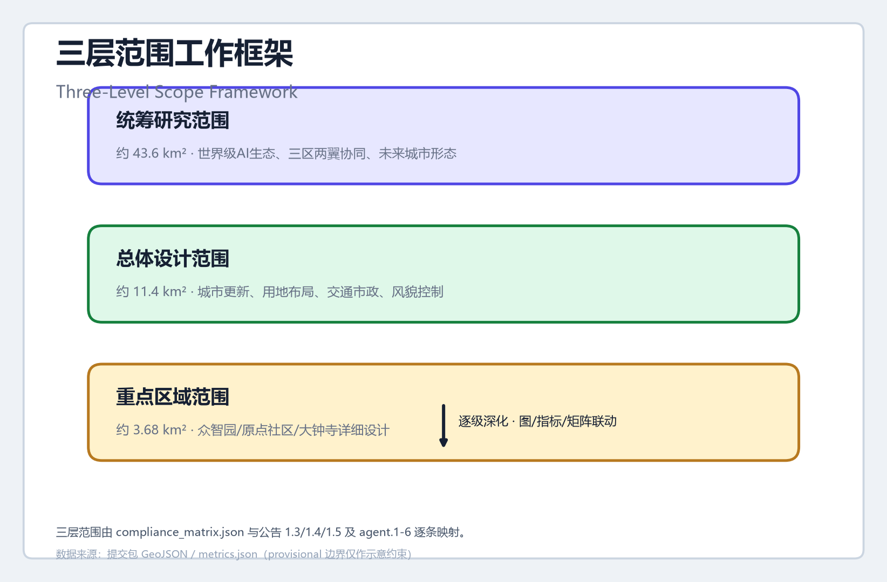
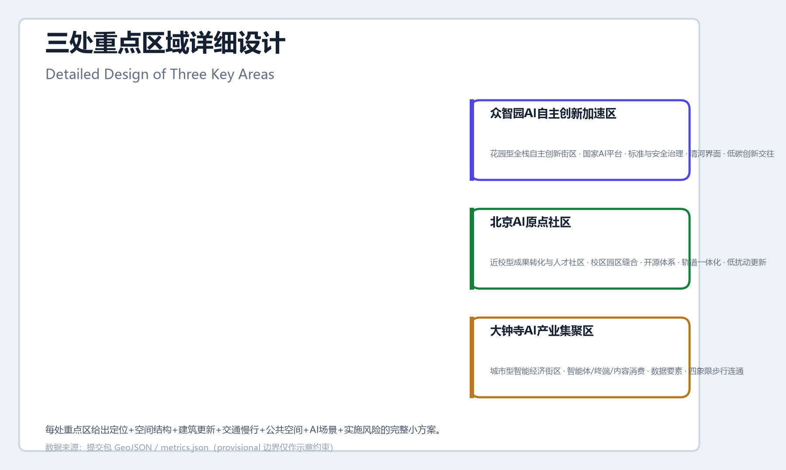
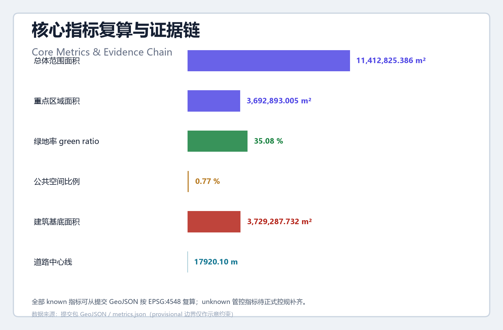

# JINGZHANG RENZI LOOP

## Design Basis and Source List

This proposal takes the Pre-qualification Announcement for the International Urban Design Call for the Centennial Jing-Zhang AI Innovation Belt, issued by the Haidian Branch of the Beijing Municipal Commission of Planning and Natural Resources, as its primary design basis [source:OFFICIAL-ANNOUNCEMENT] [standard:PROJECT-OFFICIAL-ANNOUNCEMENT], and the Agent-Facing Open Call Taskbook as its secondary basis [source:AGENT-TASKBOOK] [standard:PROJECT-AGENT-OPEN-CALL-TASKBOOK]. The proposal reads `design_brief.json`, `allowed_design_space.json`, the enum definitions, planning limits and the source registry of the site package, and follows the source-use boundaries defined in `data/source_registry.json` [source:SOURCE-REGISTRY]: formal evidence relies only on the official announcement, the cleared taskbook and professional standards; the provisional boundary is used only for generation, visualization and discussion [source:BOUNDARY-SOURCE] [source:KEY-AREA-SOURCE].

The areas, boundary descriptions and key-area composition of the three scope levels rely on the official announcement as formal evidence: the coordinated research area is about 43.6 km², the overall design area about 11.4 km², and the key detailed-design area about 368.4 hectares, of which the Zhongzhiyuan area is about 192.1 ha, the Beijing AI Origin Community about 104.3 ha, and Dazhongsi about 72.0 ha [metric:coordinated_research_area_sqm] [metric:overall_design_area_sqm] [metric:key_detailed_design_area_sqm]. Because the official precise polygons are not yet public, this package uses the maintainer-registered provisional rough polygons as `provisional_constraint`, which do not replace an official redline; the whole package must be recalculated when official files are released [metric:site_area_sqm].

The spatial evidence of the proposal is jointly supported by submitted geometry and metrics: the overall design area is 11,412,825.386 m² [metric:site_area_sqm], the land-use partition has 10 parcels seamlessly covering the submitted boundary [metric:land_use_parcel_count] [data:geometry/land_use.geojson#LU-001], and the green and public-space ratios are recomputed from submitted geometry [metric:green_ratio] [metric:public_space_ratio]. The complete sources, metrics, standards, design-depth and task coverage are kept in `sources.json`, `metrics.json`, `standard_matrix.json`, `design_depth_matrix.json` and `compliance_matrix.json`; the narrative only carries evidence markers directly related to each judgment.

## Three-Level Scope Framework

The proposal organizes work by the three levels defined in the announcement: the coordinated research area (about 43.6 km²) answers how the AI industry ecosystem and future urban form should be organized, focusing on three-district-two-wing industrial synergy and a world-class innovation ecosystem [metric:coordinated_research_area_sqm]; the overall design area (about 11.4 km²) answers how urban renewal and regulatory-plan-depth urban design should be mapped, targeting the urban districts and industrial areas within 1-2 km of the Jing-Zhang Heritage Park [metric:overall_design_area_sqm] [depth:three_level_scope_framework]; the key detailed-design area (about 368.4 ha) answers how the three districts should reach detailed-design depth, covering Zhongzhiyuan, the Beijing AI Origin Community and Dazhongsi [metric:key_detailed_design_area_sqm] [depth:three_key_area_detailed_design].

The three levels progressively implement the RENZI LOOP spatial structure of "one belt, two wings, three districts": the Jing-Zhang Heritage Park vitality belt forms the vertical stroke of the herringbone ("人"), linking the three districts from north to south; the Zhongguancun Technology Service Wing and the Xiaoyuehe Scenario Empowerment Wing form the two slanting strokes, extending innovation and service networks to the east and west [depth:overall_spatial_structure]. The three levels are mapped task-by-task in `compliance_matrix.json` to announcements 1.3, 1.4, 1.5 and agent.1-agent.6, so that every task has chapter, layer, metric, drawing and HTML evidence.

Because this submission uses the provisional boundary, all area conclusions at the three levels are labeled provisional: `geometry/site_boundary.geojson` and `geometry/key_areas.geojson` both declare `official_boundary=false` and `geometry_role=provisional_constraint`, and are not used for official redline, precise area recalculation or statutory control [data:geometry/site_boundary.geojson#SITE-001] [data:geometry/key_areas.geojson#PROV-KEY-001]. The organizer data gap does not by itself block content scoring; after official polygons are supplied, the site boundary, key areas, land use, buildings, roads, green space, public space, phasing and all metrics must be recalculated [assumption:A-BOUNDARY-001].

## Coordinated Research Area: Industry and Future City Research

The coordinated research area aims to build a world-class AI innovation ecosystem. Around Haidian's universities, leading enterprises, computing-power/algorithm/data factors, incubation platforms and technology-service resources, the proposal develops an innovation chain of "university origination—open-source collaboration—enterprise conversion—public experience—international communication", and reinforces the three-district-two-wing industrial synergy loop [source:AGENT-TASKBOOK] [standard:PROJECT-AGENT-OPEN-CALL-TASKBOOK]. The naming system and visual identity serve the three positionings — the Centennial Jing-Zhang Culture Belt, the Urban AI Life Experience Belt and the AI Fusion Innovation Belt — rather than standing as isolated slogans [depth:overall_spatial_structure].

**Overall naming and visual-identity direction (agent.1)**: The recommended primary name is 「京张人字回路」, in English **RENZI LOOP** (Jing-Zhang Renzi Loop). The name derives from the "renzi" (herringbone) switchback at Qinglongqiao on the Jing-Zhang Railway — the most famous engineering symbol of China's self-reliant railway innovation. The switchback achieves climbing by reversal, an original innovation that "trades space for height"; the proposal translates this historical prototype into an AI-era "innovation loop" in which data, computing, models, scenarios and talent circulate upward along the loop, echoing the human-in-the-loop principle of AI governance [source:OFFICIAL-ANNOUNCEMENT]. The Logo direction is a composite symbol of "herringbone track + loop arrow": a reversing track turns at its apex into a circular arrow, implying that self-reliant innovation departs from the "renzi", circulates along the loop and opens to the world. This direction is a concept suggestion only; typography, graphic and color specifications require professional deepening under cleared licensing [depth:height_massing_character].

**Global AI innovation ecosystem cases (agent.2)**: The proposal reviews six transferable global cases. First, Silicon Valley's Sand Hill Road investment ecosystem validates "capital arranged along the innovation chain"; second, London King's Cross knowledge-district renewal validates "rail heritage + knowledge economy" urban renewal; third, Korea's Pangyo Techno Valley validates "government platform + enterprise clustering" industrial spatial organization; fourth, Boston's Kendall Square dual-engine ecosystem validates "university origination + industrial conversion" adjacency; fifth, Shanghai Zhangjiang Science City's platform operation validates "big-science facility + industrial service" public-service networks; sixth, Singapore's one-north validates the integrated "work-live-learn-play" district. These cases map to the belt's origination (Origin Community), conversion (Zhongzhiyuan), service (Zhongguancun Wing), scenario (Xiaoyuehe Wing) and experience (Heritage Park belt) links, serving as reference material for spatial and operational mechanisms [depth:overall_spatial_structure].

**Future urban form research**: The proposal holds that AI will reshape work, life, sociality, learning, transport and public services. The coordinated research proposes an "adaptive block" concept: with flexible land use, shared infrastructure, distributed energy and on-device computing, urban space can reorganize as industrial demand changes. Facing the needs of AI talent and enterprises, it plans a perceptible, interactive "AI+" transport system and a continuous, boundary-free green-space system [standard:MOHURD-URBAN-DESIGN-MEASURES]. Industrial strategy metrics (AI innovation index, talent density, output scale) enter `metrics.json` and the operation mechanism as performance indicators requiring continuous calibration, and are not presented as approved planning conditions [metric:road_centerline_length_m].

## Overall Design Area: Urban Renewal and Regulatory-Plan-Level Urban Design

The overall design area uses urban renewal as its lever to reach regulatory-plan-depth urban design. Based on the land-use partition in `geometry/land_use.geojson`, the proposal puts forward an industry-space integrated layout [data:geometry/land_use.geojson#LU-001] [depth:land_use_layout]: about 4.119 million m² of research land (0802) hosts AI R&D and innovation platforms [metric:land_use_parcel_count]; about 3.208 million m² of commercial/business land (05) hosts industrial services and international exchange; about 0.932 million m² of residential land (0702) hosts talent-living support; about 3.154 million m² of park/green land (1401) forms the blue-green skeleton [data:geometry/land_use.geojson#LU-010]. Land-use classification follows the national territorial land-use classification guide [standard:MNR-LAND-USE-CLASSIFICATION-GUIDE].

The urban renewal framework distinguishes retain, renovate and new-build logic. `geometry/buildings.geojson` expresses renewal intention through conceptual building footprints [data:geometry/buildings.geojson#BLDG-001] [depth:retain_renovate_demolish]: low-efficiency spaces near universities and the heritage park rely mainly on organic renewal, potential industrial parcels mainly on new innovation carriers, and historical resource points on retained revitalization. Regulatory indicators — total building scale, FAR, height, density, green ratio and setback — are all listed as pending confirmation because official regulatory-plan conditions are not yet public [metric:floor_area_ratio] [metric:building_height_m] [assumption:A-CONTROLS-001]; the proposal only offers directional design suggestions and does not pass agent-inferred values off as approved indicators.

Industrial targets and functional layout follow Haidian's "1+X+1" industrial system [source:OFFICIAL-ANNOUNCEMENT]: with AI as the core industry, it proposes "AI+" vertical integration directions in software & information services, healthcare, education, legal services and life services, and clarifies functional ratios and spatial organization modes. The overall design expresses the road microcirculation and rail-station integration through `geometry/roads.geojson` [data:geometry/roads.geojson#ROAD-001] [depth:traffic_rail_slow_parking], and the blue-green public-space system through `geometry/green_space.geojson` and `geometry/public_space.geojson` [data:geometry/green_space.geojson#GREEN-001] [depth:blue_green_public_space]. Content lacking official road redlines, pipelines, fire and municipal conditions is recorded in `assumptions.json` as a precondition for formal deepening [assumption:A-CONTROLS-001].

## Detailed Design of Key Areas

The three key areas each present a readable mini-scheme of "positioning + spatial structure + building renewal + transport/walking + public space + AI scenarios + implementation risks", reaching the depth of an integrated implementation scheme [depth:three_key_area_detailed_design].

**Zhongzhiyuan AI Self-Reliance Acceleration Area (about 192.1 ha)** [metric:zhongzhiyuan_area_sqm] [data:geometry/key_areas.geojson#PROV-KEY-001]: positioned as a "garden-type full-stack self-reliance innovation block". Relying on the national AI platform opportunity, it advances industrial functions and building form around the full-stack self-reliance system, standards-setting and safety governance; it strengthens the Qinghe interface, industrial display, low-carbon innovation-exchange environment and external transport organization; and it uses green space to carry AI scenarios such as open testing, standards workshops and safety-governance display [source:OFFICIAL-ANNOUNCEMENT]. Implementation depends on the Qinghe blue line, ecological and flood-control conditions and the integrated planning of the Fifth Ring Road area; related engineering conclusions await professional confirmation [assumption:A-CONTROLS-001].

**Beijing AI Origin Community (about 104.3 ha)** [metric:beijing_ai_origin_area_sqm] [data:geometry/key_areas.geojson#PROV-KEY-002]: positioned as a "near-university results-conversion and talent community". Around the original innovation outputs of Tsinghua, Peking University and the Chinese Academy of Sciences, it organizes campus-park-street walking suturing, and supplements results-release, talent-zone service, residential living support and open-source collaboration space [source:AGENT-TASKBOOK]; it carries out integrated design around the Wudaokou and East Qinghuadong Road stations [depth:traffic_rail_slow_parking], exploring a low-disruption, organic renewal model. Campus boundaries, ownership and ground-floor uses require professional deepening.

**Dazhongsi AI Industry Cluster (about 72.0 ha)** [metric:dazhongsi_area_sqm] [data:geometry/key_areas.geojson#PROV-KEY-003]: positioned as an "urban-type intelligent economy and international-exchange block". Leveraging the leading enterprises' pull, it explores data-element and digital-asset circulation mechanisms around AI-native formats such as agents, intelligent terminals and content consumption [source:OFFICIAL-ANNOUNCEMENT]; it carries out composite use of planned green land and four-quadrant walking connectivity at the Dazhongsi station, improving static transport organization such as non-motorized vehicle parking [data:geometry/public_space.geojson#PUBLIC-001] [depth:traffic_rail_slow_parking]. Station integration, road intersection and municipal pipeline conditions are listed as pending confirmation.

## AI Innovation Ecosystem, Personas, and AI+ Scenarios

The proposal builds five user-persona categories for AI talent and enterprises (agent.3): open-source developers (release, collaboration, testing, community reputation), startup teams (low-cost offices, computing access, product testbeds), leading-enterprise visitors (display, business, international reception, recruitment), surrounding residents (commuting, leisure, community services, low-disruption renewal), and university faculty and students (results conversion, cross-campus collaboration, daily walking). Each persona maps to explicit spatial responses and self-check boundaries [source:AGENT-TASKBOOK].

The proposal presents 10 AI scenario cards, all mapped to concrete layers and spatial nodes [source:AGENT-TASKBOOK] [depth:overall_spatial_structure]:

| No. | Scenario card | Spatial carrier | Description |
| --- | --- | --- | --- |
| 01 | Open-source release hall | Beijing AI Origin Community | Results release, code-contribution display and small roadshows for universities, open-source communities and startups |
| 02 | Safety-governance sandbox (industry test/validation) | Zhongzhiyuan | Translates standards-setting, safety evaluation and model red-teaming into visitable, bookable, supervised display and collaboration nodes |
| 03 | On-device computing hub | Nodes in the overall design area | A new-infrastructure prototype combined with public services, enterprise services and low-carbon energy |
| 04 | AI walking navigation | Jing-Zhang Heritage Park vitality belt | Explainable wayfinding and low-intrusion sensing to identify walking gaps, congestion nodes and accessibility needs |
| 05 | Dazhongsi international roadshow lounge | Dazhongsi AI Industry Cluster | Display, negotiation, media release and international exchange for agents, intelligent terminals and content-consumption enterprises |
| 06 | Qinghe low-carbon innovation corridor (industry test/validation) | Zhongzhiyuan along Qinghe | Combines green space, stormwater, walking/cycling and AI display as the campus public living room |
| 07 | Near-university results-conversion street | Beijing AI Origin Community | Incubation, display, legal, IP and financing services for university results conversion |
| 08 | Data-element lounge | Dazhongsi | A city-service interface displaying data-element and digital-asset circulation under compliance, authorization and auditability |
| 09 | AI life-service model street | Community–commerce junctions | AI+ scenarios in healthcare, education, legal and life services delivered in operable small-scale blocks |
| 10 | Global AI week route (industry test/validation) | Belt-wide public-space system | A walkable, shareable experience route from heritage culture, open-source community and industrial display to international roadshows |

All AI scenarios follow the principles of data minimization, public sources, explainability and human review [standard:GENERATIVE-AI-INTERIM-MEASURES]: no personal behavior trajectories are collected, activity data is aggregated only, computing and data services require separate authorization, and enterprise logos and cases must be cleared [standard:BARRIER-FREE-ENVIRONMENT-LAW]. AI scenario nodes enter structured layers and the compliance matrix so reviewers can see the relationship between scenarios, industry, space and public interest [data:geometry/public_space.geojson#PUBLIC-002].

## Land Use, Building Scale, and Retain-Renovate-Demolish Strategy

The land-use plan follows the national territorial land-use classification to form a complete, closed, seamless partition [standard:MNR-LAND-USE-CLASSIFICATION-GUIDE]: about 4.119 million m² of research land (0802), about 3.208 million m² of commercial/business land (05), about 0.932 million m² of residential land (0702), and about 3.154 million m² of park/green land (1401) [data:geometry/land_use.geojson#LU-001] [data:geometry/land_use.geojson#LU-010]. The union of the land-use parcels exactly equals the submitted boundary, with no gaps or overlaps [metric:land_use_parcel_count].

The building plan expresses renewal intention through 14 conceptual footprints in `geometry/buildings.geojson` [data:geometry/buildings.geojson#BLDG-001] [depth:retain_renovate_demolish], with a total footprint area of about 3.729 million m² [metric:building_footprint_area_sqm], covering AI R&D, labs, incubators, offices, mixed use, talent apartments, culture and retail types [depth:height_massing_character]. The retain-renovate-demolish scheme distinguishes concept_new_build, concept_renovate and retained objects; it is a design direction only and, lacking current-building, ownership, regulatory and engineering conditions, does not form parcel-level demolition/renovation conclusions [assumption:A-CONTROLS-001].

Building scale and intensity indicators are consistent with `metrics.json` and the layers: total building scale, FAR, building height, density, green ratio and setback are all listed as unknown or pending_control because official regulatory-plan conditions are missing [metric:floor_area_ratio] [metric:building_height_m], without fabricating precision. The A3 booklet gives the renewal project list and indicator review table, the A0 boards express the key spatial structure and key districts, and the HTML provides linked viewing of indicators and layers [depth:metrics_recalculation].

## Transport, Rail, Municipal Infrastructure, and Public Services

The transport plan addresses rail-station integration, road microcirculation, walking gaps, external transport, parking and non-motorized vehicle organization [depth:traffic_rail_slow_parking]. `geometry/roads.geojson` expresses one north-south walking spine and seven east-west connectors, with a total centerline length of about 17,920 m [data:geometry/roads.geojson#ROAD-001] [metric:road_centerline_length_m], covering the Heritage Park walking spine, North Third Ring, Xueyuan Road, East Qinghuadong Road, Wudaokou, Chengfu Road, Qinghe and the South of North Fifth Ring connectors. Content missing road redlines, pipelines, fire and municipal conditions is documented in `assumptions.json` as pending [assumption:A-CONTROLS-001].

Rail-station integration focuses on three key nodes — Wudaokou, East Qinghuadong Road and Dazhongsi stations [source:OFFICIAL-ANNOUNCEMENT] [data:geometry/public_space.geojson#PUBLIC-001]: Wudaokou serves talent flows in the Origin Community, East Qinghuadong Road serves campus-park walking suturing, and Dazhongsi carries four-quadrant walking connectivity and non-motorized parking organization. Municipal and public-service facilities cover AI industry-service facilities, innovation-platform facilities, talent-living services, new infrastructure, distributed energy, on-device computing and their integration with conventional municipal facilities [depth:municipal_new_infrastructure]; facility standards, spatial layout, service radius and operation modes require confirmation with official municipal data during formal deepening.

## Blue-Green Network, Public Space, and Urban Character

The blue-green plan uses the Jing-Zhang Heritage Park vitality belt as its skeleton, coordinating Qinghe, Xiaoyuehe and the travel needs of surrounding universities, enterprises and communities [standard:MOHURD-URBAN-DESIGN-MEASURES]. `geometry/green_space.geojson` expresses the park belt and blue-green ecological fingers, with a green area of about 4.004 million m² and a green ratio of about 35.1% [data:geometry/green_space.geojson#GREEN-001] [metric:green_ratio]; `geometry/public_space.geojson` expresses six plaza nodes, with a public-space area of about 87,630 m² and a ratio of about 0.8% [data:geometry/public_space.geojson#PUBLIC-001] [metric:public_space_ratio], covering the Dazhongsi station plaza, the AI Origin Community release plaza, the Wudaokou maker plaza, the East Qinghuadong Road talent plaza, the Zhongzhiyuan Qinghe innovation living room and the North Fifth Ring gateway node [depth:blue_green_public_space].

**AI public space and pilgrimage landmarks (agent.4)**: The proposal proposes three AI pilgrimage landmarks or honor-display nodes. First, the "Renzi Origin" — introducing the Qinglongqiao herringbone symbol to the northern segment of the Heritage Park as a commemorative node where century-old self-reliant innovation meets AI innovation; second, the "Open-Source Contribution Wall" — an honor-display system in the AI Origin Community recording open-source contributions and community milestones; third, the "Global AI Governance Corridor" — in Zhongzhiyuan, combined with standards and safety-governance functions, forming a public narrative space displaying AI-governance consensus [source:AGENT-TASKBOOK]. Landmarks, wayfinding, logos, typography, images, portraits and enterprise marks all require clearance; conceptual landmarks must not be described as approved construction [standard:MOHURD-URBAN-DESIGN-MEASURES].

Urban character fuses Jing-Zhang railway heritage culture, Zhongguancun innovation culture and AI innovation culture, using cultural resources such as the Qinghuayuan Railway Station and artistic resources such as the Beijing Film Academy [source:OFFICIAL-ANNOUNCEMENT]. Character control distinguishes official controls, design suggestions and pending conditions; pseudo-precise control lines are strictly forbidden without heritage or regulatory-plan basis. Building height, massing, style and color guidance serve as directional suggestions to be deepened after official regulatory-plan conditions are confirmed [metric:building_height_m].

## Renewal Projects, Implementation Policy, and Phasing

The renewal project list and phasing plan are expressed by `geometry/phasing.geojson` in three stages — near-term pilot, mid-term renewal and long-term framework [data:geometry/phasing.geojson#PHASE-001] [depth:phasing_implementation]:

| No. | Project | Type | Phase | Main dependencies |
| --- | --- | --- | --- | --- |
| JZ-01 | Heritage Park walking-gap suturing | Public space/transport | Near-term | Road redlines, under-bridge space, traffic organization review |
| JZ-02 | Zhongzhiyuan Qinghe innovation interface | Blue-green/industrial display | Near-term | River blue line, ecological and flood-control conditions |
| JZ-03 | Origin Community near-university conversion street | Urban renewal/industrial services | Mid-term | Campus boundaries, ownership, ground-floor uses |
| JZ-04 | Dazhongsi station four-quadrant walking connectivity | Station integration/walking | Mid-term | Rail station, road intersections, municipal pipelines |
| JZ-05 | AI public services and on-device computing nodes | New infrastructure/public services | Mid-term | Energy, computing, safety and operators |
| JZ-06 | Global AI week public route | Operation/brand | Long-term | Public-space permits, event safety, copyright clearance |

Implementation policy covers coordinated urban-renewal implementation, spatial supply, operation mechanisms, industrial services, public participation, data governance and property-rights coordination [depth:renewal_project_list]. The call design period (about 100 days) is clearly distinguished from implementation phasing: the former is the submission timeline, the latter the renewal and construction path. Because ownership, funding, implementation entities and approval paths are absent, phasing conclusions are presented as implementation risks and deepening directions, not commitments [assumption:A-CONTROLS-001].

**Global AI event system and long-term operation (agent.6)**: The proposal proposes an annual event system — with the "Global AI Week" as the annual flagship, supported by developer conferences, open-source contribution days, scenario open days, international roadshow seasons and talent fairs to form a year-round rhythm [source:AGENT-TASKBOOK]. The developer-community operation mechanism uses the open-source release hall, contribution wall and talent-service hub as spatial carriers, establishing a "event—scenario—talent—enterprise" conversion path; scenario-open operation pilots the safety-governance sandbox and on-device computing hub under a "visitable—bookable—supervised" tiered opening [standard:GENERATIVE-AI-INTERIM-MEASURES]. All events, investment attraction, funding, policy and operation arrangements are expressed as concept suggestions or deepening directions, not confirmed government arrangements [depth:risk_missing_data].

## Metrics, Area Recalculation, and Compliance Matrix

The indicator system is divided into three categories [depth:metrics_recalculation].

The first category comprises spatial indicators directly recomputable from submitted geometry. The overall design area is 11,412,825.386 m² [metric:site_area_sqm], the key detailed-design area 3,692,893.005 m² [metric:key_detailed_design_area_sqm], the green ratio 35.08% [metric:green_ratio], and the public-space ratio 0.77% [metric:public_space_ratio].

The building footprint area is 3,729,287.732 m² [metric:building_footprint_area_sqm] and the road centerline length 17,920.097 m [metric:road_centerline_length_m]. The land-use parcel count is 10 [metric:land_use_parcel_count], the key-area count 3 [metric:key_area_count], and the phase count 3 [metric:phase_count].

The second category comprises control indicators requiring official regulatory-plan support — FAR [metric:floor_area_ratio], building height [metric:building_height_m], density, setback and road redlines — all listed as pending official data.

The third category comprises performance indicators requiring continuous calibration by industrial and operational data — AI innovation index, talent density, output scale, walking accessibility, event participation and scenario usage frequency — entering the operation mechanism for continuous calibration.

The three categories enter `metrics.json`, `assumptions.json` and `compliance_matrix.json` respectively, avoiding the presentation of operational visions as approved planning conditions. The compliance matrix covers all tasks in announcements 1.3, 1.4, 1.5 and agent.1-agent.6 [depth:metrics_recalculation]; the standard matrix covers six registered standards [standard:PROJECT-OFFICIAL-ANNOUNCEMENT] [standard:MOHURD-URBAN-DESIGN-MEASURES]; the design-depth matrix covers 15 required depth items, all declared complete. Each core indicator is explained in the narrative: the green ratio supports talent life and innovation exchange, the public-space ratio supports daily and international interaction, building footprints respond to industrial space supply, and road centerlines express walking and transport organization [depth:overall_spatial_structure].

## Risk, Copyright, and Compliance

This proposal is an open-source co-creation suggestion generated by an AI agent; it does not replace formal planning and does not constitute a government-approved conclusion [source:AGENT-TASKBOOK]. All spatial landing suggestions are concept suggestions, reference schemes or material for professional teams to deepen, and are in no way presented as approved construction, confirmed policy or implemented works [depth:risk_missing_data]. The provisional boundary must not be used as an official redline, precise-area recalculation or approval basis [data:geometry/site_boundary.geojson#SITE-001] [assumption:A-BOUNDARY-001].

Copyright and compliance: all cited materials are public or user-cleared; sources and use boundaries are recorded in `sources.json` and `report/copyright_statement.md`; the base maps and data used declare their sources and license status and contain no non-public planning drawings, unauthorized materials or personal data [source:SOURCE-REGISTRY]. AI scenarios follow data minimization, explainability and human review, consistent with the interim measures for generative AI services [standard:GENERATIVE-AI-INTERIM-MEASURES]; public space and digital services follow accessibility and elderly-inclusion principles in parallel [standard:BARRIER-FREE-ENVIRONMENT-LAW] [standard:ELDERLY-SMART-TECH-PLAN-2020-45].

Pending data: official precise boundary and key-area polygons, formal regulatory-plan conditions (FAR, height, density, green ratio, setback), road redlines, ownership, municipal pipelines, fire, flood-control and heritage conditions, and current-building and land data. After these are supplied, the package must recalculate all geometry, metrics and drawings and rerun self-checks [assumption:A-CONTROLS-001].

## References

1. Pre-qualification Announcement for the International Urban Design Call for the Centennial Jing-Zhang AI Innovation Belt, Haidian Branch, Beijing Municipal Commission of Planning and Natural Resources, 2026-05-09, https://ghzrzyw.beijing.gov.cn/zhengwuxinxi/tzgg/hd/202605/t20260509_4643047.html
2. Agent-Facing Open Call Taskbook for the Centennial Jing-Zhang AI Innovation Belt Urban Design, user-provided cleared document, 2026-05-18
3. Provisional rough boundary and three key-area polygons of the Centennial Jing-Zhang AI Innovation Belt, repository maintainers, 2026-06-05
4. "Three Districts, Two Wings" to Build a World-Class AI Agglomeration, Beijing Municipal Science & Technology Commission and Zhongguancun Administrative Committee, 2026-04-03
5. Haidian's "1+X+1" Modern Industrial System Layout, People's Government of Haidian District, 2026-03-02
6. Measures for the Administration of Urban Design, Ministry of Housing and Urban-Rural Development, 2017-03-14
7. Measures for the Compilation, Approval and Implementation of Regulatory Detailed Plans for Cities and Towns, Ministry of Housing and Urban-Rural Development
8. Guide to Land and Sea Use Classification for Territorial Spatial Surveys, Planning and Use Control, Ministry of Natural Resources, 2023-11-22
9. Interim Measures for the Administration of Generative AI Services, Cyberspace Administration of China and six other departments, 2023-07-13
10. Law of the People's Republic of China on the Construction of Barrier-Free Environments, Standing Committee of the National People's Congress, 2023-06-28
11. Implementation Plan for Solving the Difficulties of the Elderly in Using Smart Technology (Guobanfa [2020] No. 45), General Office of the State Council, 2020-11-24
12. Complete machine-readable index: see `sources.json`, `metrics.json`, `compliance_matrix.json`, `standard_matrix.json` and `design_depth_matrix.json` [source:SITE-PACKAGE]
