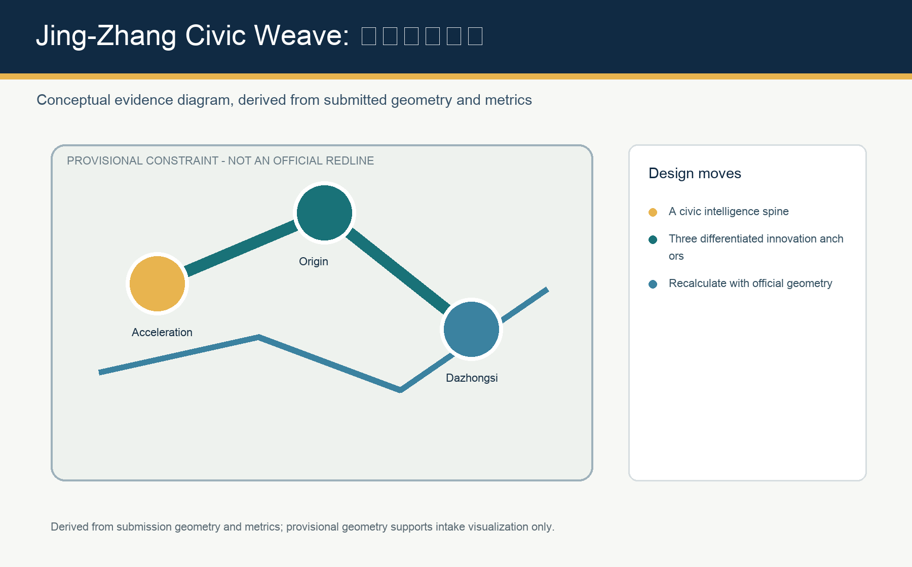
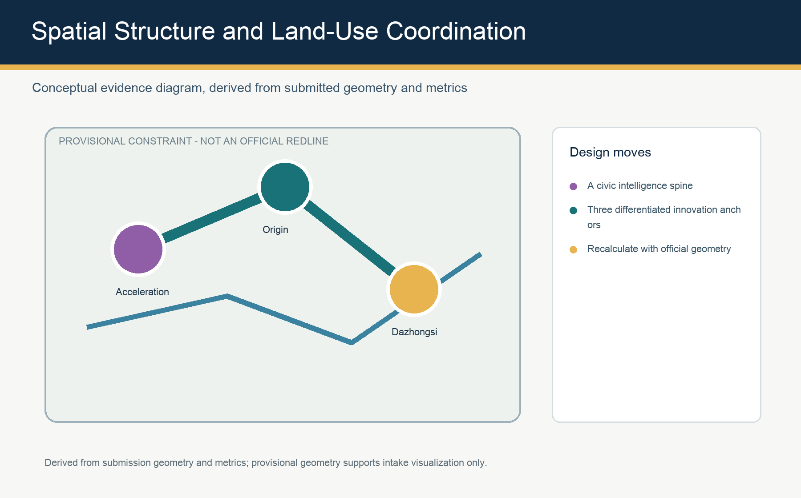
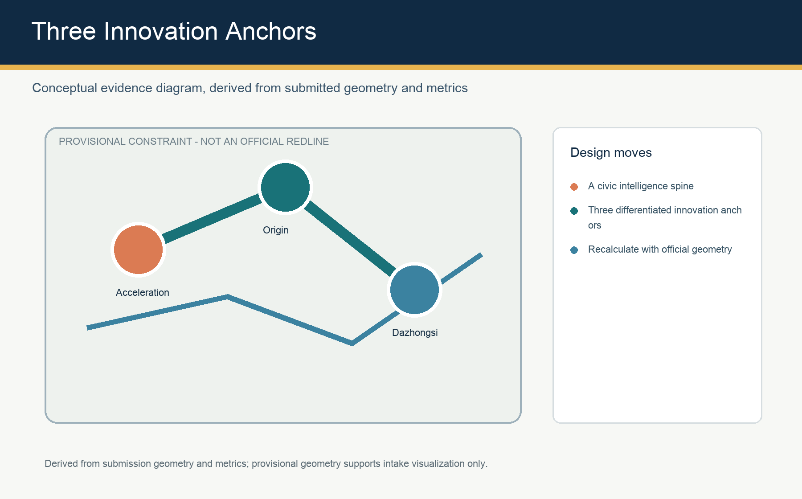
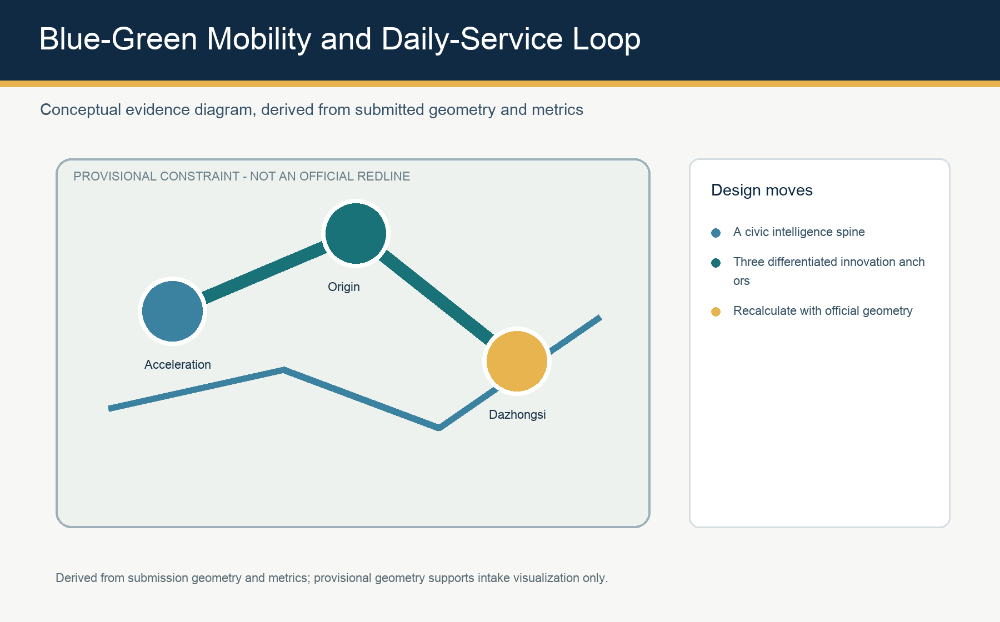
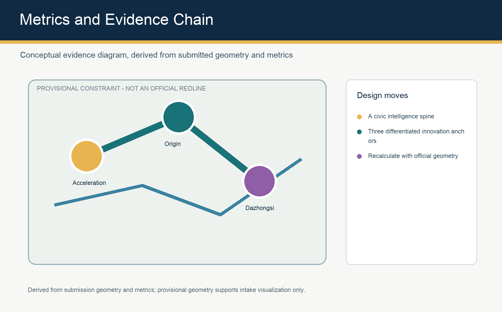

# Jing-Zhang Civic Weave

## Design Basis and Source List

This concept uses the official public announcement, the cleared agent taskbook, and the repository source registry. The current site and key-area polygons are provisional constraints, useful for visualization and intake review only; they are not an official redline or a basis for precise statutory controls. [source:OFFICIAL-ANNOUNCEMENT] [source:AGENT-TASKBOOK]

## Three-Level Scope Framework

Jing-Zhang Civic Weave works across the 43.6 km2 coordinated research area, the 11.4 km2 overall design area, and three detailed-design areas. Strategy, spatial structure, and local projects are deliberately separated so each can be recalculated when official geometry arrives. [metric:site_area_sqm] [data:geometry/site_boundary.geojson#SITE-001]

## Coordinated Research Area: Industry and Future City Research

The proposal links university research, open-source collaboration, enterprise conversion, public experience, and international exchange through the Jing-Zhang intelligence spine. It is a conceptual operating framework, not an approved planning control. [depth:overall_spatial_structure]

## Overall Design Area: Urban Renewal and Regulatory-Plan-Level Urban Design

A heritage-led public-space spine, three innovation anchors, and a blue-green slow-mobility loop organize land use, renewal, daily services, and scenario nodes. Development intensity, height, ownership, and road controls remain pending official files. [standard:MOHURD-CONTROL-DETAILED-PLANNING] [data:geometry/land_use.geojson#LU-001]

## Detailed Design of Key Areas

Zhongzhiyuan hosts full-stack testing and governance exchange; the AI Origin Community supports near-campus conversion and open-source life; Dazhongsi provides transit-oriented enterprise showcase and international exchange. All three are conceptual reference schemes for professional teams to deepen. [data:geometry/key_areas.geojson#PROV-KEY-001]

## AI Innovation Ecosystem, Personas, and AI+ Scenarios

Ten scenario cards connect developers, startup teams, enterprise visitors, residents, and students with places for publishing, testing, mobility, care, learning, and public service. Every public-facing AI scenario retains consent, minimization, human review, and non-digital access. [source:AGENT-TASKBOOK]

## Land Use, Building Scale, and Retain-Renovate-Demolish Strategy

The land-use partition is a complete conceptual spatial layer. Building footprints describe demonstration intensity only; floor-area ratio, height, density, retention decisions, and demolition decisions await statutory conditions and site surveys. [depth:land_use_layout]

## Transport, Rail, Municipal Infrastructure, and Public Services

The slow-mobility loop ties rail access, park entrances, campuses, workplaces, and service nodes. Municipal, fire, parking, and utility strategies are coordination topics rather than confirmed engineering plans. [data:geometry/roads.geojson#ROAD-001]

## Blue-Green Network, Public Space, and Urban Character

The proposal treats the heritage park as a daily civic room: shade, sport, conversation, applied-AI demonstration, and accessibility are joined through a resilient public-space network. [metric:green_ratio] [metric:public_space_ratio]

## Renewal Projects, Implementation Policy, and Phasing

A reversible first phase tests community-facing services and public-space operations; later phases require official boundaries, regulatory controls, funding, ownership, and engineering review. [data:geometry/phasing.geojson#PHASE-001]

## Metrics, Area Recalculation, and Compliance Matrix

Geometry, metrics, and matrices are the auditable evidence layer. Known figures are recalculated from submitted geometries; unavailable statutory controls remain explicitly pending. [depth:metrics_recalculation]

## Risk, Copyright, and Compliance

No claim in this entry represents approval, statutory planning, final ownership, confirmed construction, or implementation commitment. All graphics are original derived diagrams; the local visualization has no remote resources or tracking. [depth:risk_missing_data]

## References

See sources.json, assumptions.json, metrics.json, compliance_matrix.json, standard_matrix.json, and design_depth_matrix.json for the full traceable evidence layer.
