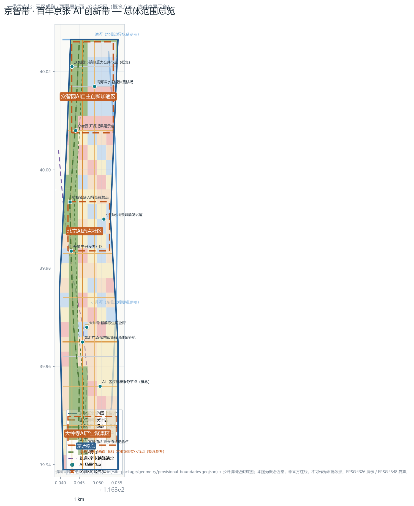
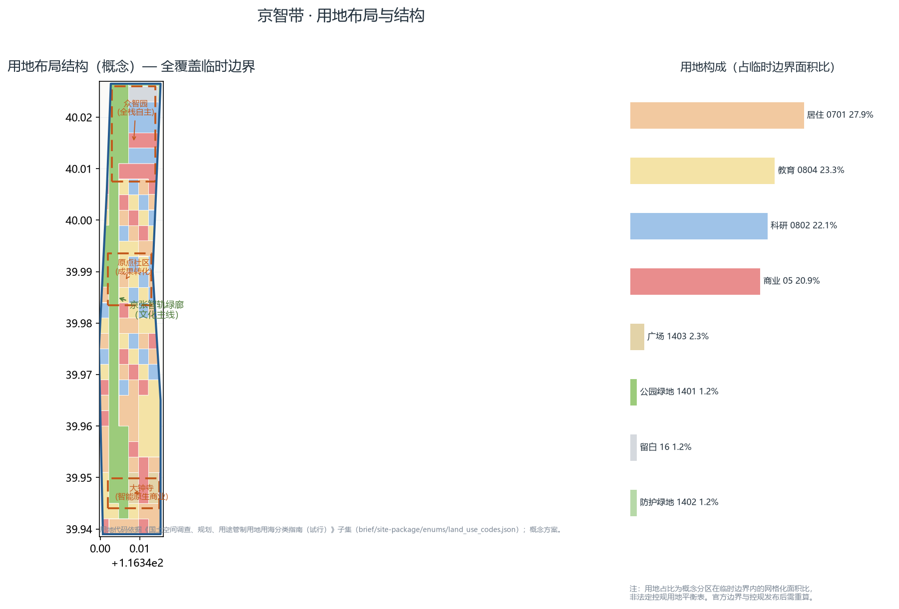
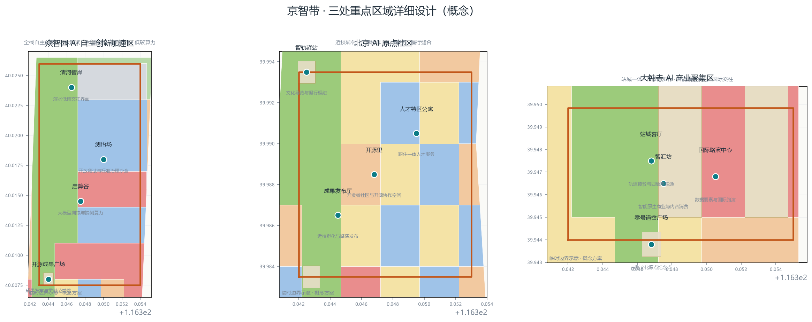
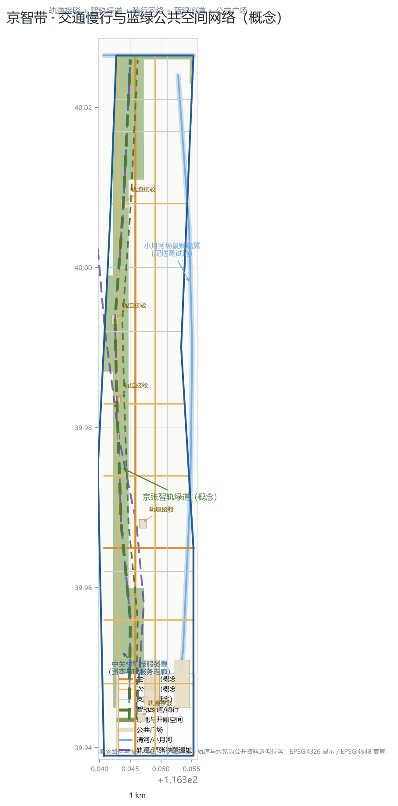
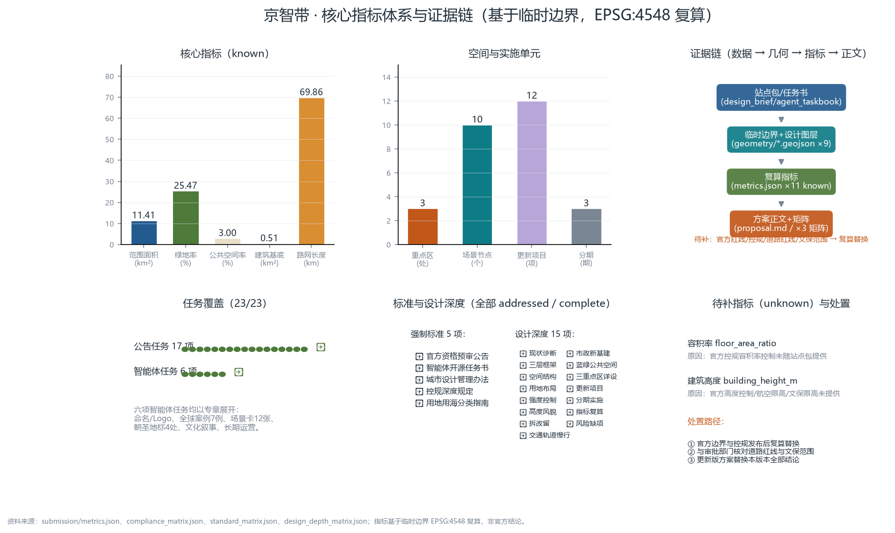

# 京智带：百年京张AI创新带城市设计概念方案

本方案为 AI agent 依据「面向全球智能体开展百年京张AI创新带城市设计开源征集」任务书与组织方站点包生成的正式投稿包（formal），覆盖统筹研究范围、总体设计范围与三处重点区域三个层级。方案以 **「智轨新生」（Rail-to-Code）** 为总概念：一百年前詹天佑以人字形铁路让列车翻越关沟，一百年后这条钢轨线将转化为承载代码、算力与智能体协作的城市创新干线。命名体系、Logo方向、生态案例、场景卡、朝圣地标、文化叙事与长期运营六项智能体任务均在正文中实际展开，并全部落位到可复算的几何、指标与合规矩阵 [source:AGENT-TASKBOOK] [standard:PROJECT-AGENT-OPEN-CALL-TASKBOOK]。

## 设计依据与资料清单

本方案只使用公开或已清权资料，全部依据登记于 `sources.json` 与 `data/source_registry.json`，使用边界遵循 `allowed_design_space.json` 的数据政策 [source:SITE-PACKAGE] [source:SOURCE-REGISTRY]。

**主控依据：** 《百年京张AI创新带城市设计国际方案征集资格预审公告》规定三层范围、三处重点区域、设计任务与成果深度 [source:OFFICIAL-ANNOUNCEMENT] [standard:PROJECT-OFFICIAL-ANNOUNCEMENT]；面向智能体开源征集任务书摘录规定定位、五大功能、三区两翼与六项任务 [source:AGENT-TASKBOOK]；`data/processed/agent_fact_pack.md` 提供任务与范围导航 [source:PROCESSED-FACT-PACK]。

**空间依据：** 组织方维护的临时几何 `brief/site-package/geometry/provisional_boundaries.geojson` 提供总体范围与三处重点区 provisional polygon [source:PROVISIONAL-BOUNDARIES-2026] [source:BOUNDARY-SOURCE] [source:KEY-AREA-SOURCE]。本方案所有空间图层均在此临时边界内派生 [data:geometry/site_boundary.geojson#SITE-001]，并明确标注 `provisional_constraint`、`official_boundary=false`；官方红线发布后必须全量重算 [depth:existing_conditions_diagnosis]。

**专业依据：** 《城市设计管理办法》要求落实总体设计意图与公共空间导则 [standard:MOHURD-URBAN-DESIGN-MEASURES] [source:MOHURD-URBAN-DESIGN-MEASURES]；控规深度城市设计要求地块、强度、高度与配套 [standard:MOHURD-CONTROL-DETAILED-PLANNING] [source:MOHURD-CONTROL-DETAILED-PLANNING]；用地分类遵循《国土空间调查、规划、用途管制用地用海分类指南》代码体系 [standard:MNR-LAND-USE-CLASSIFICATION-GUIDE] [source:MNR-LAND-USE-CLASSIFICATION]。

**资料缺口（详见风险章节）：** 官方红线、经批准控规容积率/高度、道路红线、文保保护范围、市政管线等尚未随公开资料包提供，均登记为待补项 [depth:risk_missing_data]，对应 `metrics.json` 中 `floor_area_ratio`、`building_height_m` 为 unknown 状态。

## 三层范围工作框架

方案按公告组织三层范围 [standard:PROJECT-OFFICIAL-ANNOUNCEMENT] [depth:three_level_scope_framework]：

**第一层 统筹研究范围（约43.6平方公里）：** 北至北五环路、东至京藏高速、南至西直门外大街、西至万泉河路，承接「百年京张文化带、都市AI生活体验带、AI融合创新带」三条主题带，开展产业与未来城市研究 [source:OFFICIAL-ANNOUNCEMENT]。

**第二层 总体设计范围（约11.4平方公里，临时边界复算 [metric:site_area_sqm]）：** 以京张遗址公园周边1-2公里城市地区与产业区为对象 [data:geometry/site_boundary.geojson#SITE-001]，完成城市更新与控规深度城市设计。

**第三层 重点详细设计区域（三处 [metric:key_area_count]）：** 众智园AI自主创新加速区 [data:geometry/key_areas.geojson#KA-001]、北京AI原点社区 [data:geometry/key_areas.geojson#KA-002]、大钟寺AI产业聚集区 [data:geometry/key_areas.geojson#KA-003]，各自承担不同功能角色。

**总体空间结构（一带三区两翼多点）** [depth:overall_spatial_structure]：一带为京张智轨绿廊，串联三处重点区；两翼为中关村科技服务翼与小月河场景赋能翼，分别向西侧中关村创新极核与东侧小月河蓝绿廊道延展；多点即十个AI场景节点织网成片 [data:geometry/constraints.geojson#SCEN-001] [metric:scenario_node_count]。

## 统筹研究范围产业与未来城市研究

**产业定位：** 统筹研究范围叠加「AI全栈自主创新体系、世界级AI创新生态、AI+场景赋能新范式、智能化AI活力城市、AI治理全球话语权」五大功能 [source:AGENT-TASKBOOK]，形成「三个核心区 + 两翼」的产业空间框架：众智园承担全栈自主与治理话语权，原点社区承担世界级创新生态，大钟寺承担智能原生新业态，中关村翼承担要素全球化配置与IP资本赋能，小月河翼承担场景赋能与活力城市 [source:AGENT-TASKBOOK]。

**全球AI创新生态案例（任务 agent.2，7例）：** 案例仅作为公开背景研究，不构成对任何主体的承诺或照搬：

1. **伦敦国王十字（King's Cross）**：铁路遗产区整体更新为科创与创意混合街区，站城一体与历史建筑活化并重，是本方案「铁路遗产+创新街区」最贴切的国际参照。
2. **波士顿肯德尔广场（Kendall Square）**：依托高校与科研机构形成生命科学+AI集聚，验证「近校转化」模式的有效性。
3. **硅谷斯坦福研究园与Sand Hill Road**：校地协同、风险资本与研发空间混合的经典原型。
4. **新加坡纬壹科技城（one-north）**：政府主导、面向测试与实验的城市创新区治理框架。
5. **杭州未来科技城与深圳南山科技园**：国内以平台企业、硬件生态与人才政策驱动的创新集聚样本。
6. **赫尔辛基/阿姆斯特丹智慧城市测试区**：城市智能体、公共数据与场景开放的治理实验范式。
7. **日本筑波科学城**：国立研究机构与都市生活功能融合的经验与教训。

**未来城市研究：** 面向「智能化AI活力城市」，统筹研究提出四项未来命题：城市智能体治理框架、AI原生公共服务的公平供给、端侧算力与低碳能源耦合、以及数据要素与空间资产的协同运营 [depth:existing_conditions_diagnosis] [depth:overall_spatial_structure]。这些命题在总体设计范围中转化为具体空间载体（测试道、沙盒、公共算力节点）与运营机制（见长期运营章节）。

## 总体设计范围城市更新与控规深度城市设计

**更新原则（拆改留）：** 遵循「以留为主、改辅之、拆极少」的概念原则 [depth:retain_renovate_demolish]：保留高校、科研院所、现状社区与京张铁路文化遗存；改造低效园区、市场与沿路界面；极少量拆除仅针对影响公共空间连通与安全的老旧建筑。拆改留方案见「用地、建筑规模与拆改留方案」章节。

**用地布局：** 在临时边界内以网格化方式生成全覆盖的用地分区 [depth:land_use_layout] [data:geometry/land_use.geojson#LU-001]：沿京张智轨绿廊布局公园绿地，众智园以科研用地为主并配置商业与留白，原点社区混合教育、科研与居住，大钟寺以商业与文化用地为主，其余片区布局居住、教育（北航、北邮、北交大方向）、医疗与体育设施 [standard:MNR-LAND-USE-CLASSIFICATION-GUIDE] [source:MNR-LAND-USE-CLASSIFICATION]。

**开发强度控制：** 采用「TOD核心高、绿廊两侧中、校园周边低」的概念强度分区 [depth:development_intensity_controls]：轨道站点周边为高密度混合开发核心，绿廊两侧以中强度街区过渡，校园与文保周边保持低强度。法定容积率与建筑密度控制未随站点包提供，`floor_area_ratio` 为 unknown，待经批准控规发布后复算 [metric:floor_area_ratio]。

**高度体量与风貌：** 概念高度分区与风貌导则 [depth:height_massing_character]：大钟寺站城客厅与大钟寺站周边形成地标节点，众智园沿清河形成滨水天际线，原点社区以校园缝合尺度为主；风貌上强调「铁路记忆、学院红砖、创新玻璃幕墙」三种语汇的转译，禁止大尺度封闭围墙，鼓励沿街开放界面。官方高度控制待补，`building_height_m` 为 unknown [metric:building_height_m]。

**城市设计导则方向：** 依据《城市设计管理办法》对公共空间、街道与景观提出导则方向 [standard:MOHURD-URBAN-DESIGN-MEASURES]：街道高宽比、底层商业连续界面、绿廊断面、无障碍与适老化、第五立面（屋顶光伏与无人机起降点预留）。

## 重点区域详细设计

三处重点区以「一区一主题、一区一场景群」方式组织 [depth:three_key_area_detailed_design] [data:geometry/key_areas.geojson#KA-001] [source:AGENT-TASKBOOK]。

**众智园AI自主创新加速区（花园型全栈自主创新街区）：** 强化清河界面、产业展示、低碳创新交往与对外交通组织；以绿色空间承载开放测试与标准治理展示 [standard:PROJECT-OFFICIAL-ANNOUNCEMENT]。功能分区：启算谷（大模型训练与端侧算力）、测悟场（开放测试与标准治理沙盒）、清河智岸（滨水低碳交往界面）、开源成果广场（成果发布与贡献荣誉墙）[data:geometry/public_space.geojson#PUBLIC-SQ-005]。

**北京AI原点社区（近校型成果转化与人才社区）：** 组织校区、园区、街区慢行缝合；补足成果发布、人才服务、居住生活和开源协作空间 [standard:PROJECT-OFFICIAL-ANNOUNCEMENT]。功能分区：开源里（开发者社区与开源协作空间）、成果发布厅（近校孵化与路演发布）、人才特区公寓（职住一体人才服务）、智轨驿站（文化导览与慢行枢纽）[data:geometry/public_space.geojson#PUBLIC-SQ-004]。

**大钟寺AI产业聚集区（城市型智能经济与国际交往街区）：** 围绕大钟寺站一体化、四象限步行连通、商业服务和重点企业公共环境更新 [standard:PROJECT-OFFICIAL-ANNOUNCEMENT]。功能分区：智汇坊（智能原生商业与内容消费）、站城客厅（轨道接驳与四象限连通）、国际路演中心（数据要素与国际路演）、零号道岔广场（京张文化原点纪念点）[data:geometry/public_space.geojson#PUBLIC-SQ-002]。

## AI 创新生态、人才画像与 AI+ 场景

**创新生态机制：** 以「开源里-测悟场-智汇坊」构成从开源协作、测试验证到商业化的完整链条 [source:AGENT-TASKBOOK] [standard:PROJECT-AGENT-OPEN-CALL-TASKBOOK]，对应「世界级AI创新生态、AI全栈自主创新体系、AI+场景赋能新范式」三大功能 [source:AGENT-TASKBOOK]。

**人才画像（六类）：** ①AI工程师与开发者；②创业团队与孵化项目；③高校师生与科研人员；④周边居民与家庭；⑤国际访客与商务人士；⑥城市治理者与公共服务者。方案为每类人群配置专属空间与场景：开发者对应开源里与测悟场，创业团队对应孵化器与路演中心，居民对应绿廊与社区服务，访客对应朝圣地标与导览，治理者对应城市智能体体验舱。

**AI原生场景卡（任务 agent.3，12张）：** 每张场景卡含功能、空间落位与运营主体建议，空间节点见 [data:geometry/constraints.geojson#SCEN-001]：

1. 智轨导览机器人：沿京张智轨绿廊提供文化讲解与路线规划（智轨驿站）。
2. 开源成果展示廊：AR叠加展示开源项目与贡献者荣誉（开源成果广场）。
3. 开发者散步道：绿廊内的户外办公、hackathon与代码评审空间。
4. AI+医疗健康服务节点：远程会诊与健康筛查的社区化服务（概念）[data:geometry/constraints.geojson#SCEN-009]。
5. AI+教育沉浸教室：面向高校与中小学的AI通识教育空间。
6. 自动驾驶接驳环：原点社区-大钟寺之间的无人接驳示范环。
7. 配送机器人开放测试道：小月河场景赋能翼的机器人与无人机配送测试 [data:geometry/constraints.geojson#SCEN-007]。
8. 城市智能体治理体验舱：市民可体验的治理驾驶舱公共节点（智汇广场）[data:geometry/constraints.geojson#SCEN-008]。
9. 智能体贡献荣誉墙：记录AI贡献者GitHub ID与方案贡献的永久纪念墙（众智园）。
10. 端侧算力公共节点：面向公众的低碳算力与隐私计算体验（概念）[data:geometry/constraints.geojson#SCEN-010]。
11. AI原生商业街：智能推荐、无人零售与内容消费融合的商业场景（智汇坊）。
12. 智能体测试场：清河滨水开放测试场，承载机器人、无人机与智能交通验证 [data:geometry/constraints.geojson#SCEN-006]。

**测试验证场景（4个）：** 配送机器人开放测试道、城市智能体治理沙盒（测悟场）、自动驾驶接驳示范环、端侧算力与隐私计算节点。测试场景均标注为概念设想，落地需专项审批 [depth:municipal_new_infrastructure]。

## 用地、建筑规模与拆改留方案

**用地平衡（概念）：** 基于临时边界复算的用地构成以网格化面积比表达：居住、科研、教育、商业、绿地与开敞空间、道路等类别全覆盖 [data:geometry/land_use.geojson#LU-001] [standard:MNR-LAND-USE-CLASSIFICATION-GUIDE]。概念绿地率 [metric:green_ratio]（绿地与开敞空间面积 [metric:green_space_area_sqm] 与总体范围面积 [metric:site_area_sqm] 之比）体现「公园城市」导向；公共空间率 [metric:public_space_ratio]（公共空间面积 [metric:public_space_area_sqm] 占比）支撑活力城市目标。上述占比为概念分区结果，非法定控规用地平衡表，官方边界发布后必须重算 [depth:metrics_recalculation]。

**建筑规模（概念）：** 方案给出建筑基底概念布局 [data:geometry/buildings.geojson#BLDG-001]（建筑基底总面积 [metric:building_footprint_area_sqm]），建筑类型涵盖AI研发、实验室、孵化器、办公、混合功能、教育、居住、人才公寓、社区服务、商业与文化展示 [source:SITE-PACKAGE]。基底为设计概念，不构成现状或审批建筑规模 [depth:development_intensity_controls]。

**拆改留方案：** 保留类：京张铁路文化遗存、高校院所、质量良好的现状社区与公共设施；改造类：低效园区与沿街界面、老旧市场、闲置楼宇，改造为开源协作、孵化与人才服务空间；拆除类：仅针对影响绿廊连通与安全的老旧建筑（极小量、逐栋论证）[depth:retain_renovate_demolish]。

## 交通、轨道、市政与公共服务设施

**道路系统：** 概念路网骨架含主干路、次干路与支路，中心线总长 [metric:road_centerline_length_m] [data:geometry/roads.geojson#ROAD-001]；路网为空间结构讨论用，非道路红线 [depth:traffic_rail_slow_parking]。

**轨道与接驳：** 以地铁13号线及沿线车站为骨干 [data:geometry/constraints.geojson#RAIL-001]，在站城客厅（大钟寺）、智轨驿站（原点社区）、众智园站前设置P+R与慢行接驳环，实现轨道站点800米步行圈全覆盖概念 [depth:traffic_rail_slow_parking]。

**慢行系统：** 京张智轨绿道（greenway）串联三区 [data:geometry/roads.geojson#ROAD-GW-001]，并行骑行道 [data:geometry/roads.geojson#ROAD-CY-001]；小月河与清河滨水步道构成蓝绿慢行环；全部慢行通道考虑无障碍与适老化。

**市政与新型基础设施：** 市政管线资料待补（登记于 assumptions.json）[depth:municipal_new_infrastructure]；新型基础设施以概念设施表达：端侧算力公共节点、无人机配送廊道、智能路灯杆、地下物流接口预留、屋顶光伏与绿电直供。

**公共服务设施：** 教育（北航、北邮、北交大方向及中小学）、医疗卫生 [data:geometry/constraints.geojson#SCEN-009]、体育设施 [depth:land_use_layout]、社区服务与人才公寓，形成15分钟生活圈概念布局。

## 蓝绿空间、公共空间与城市风貌

**蓝绿网络：** 以京张智轨绿廊为主脊 [data:geometry/green_space.geojson#GREEN-SEG-001]（概念绿地率 [metric:green_ratio]），清河 [data:geometry/constraints.geojson#WATER-001] 与小月河 [data:geometry/constraints.geojson#WATER-002] 为东西蓝绿界面，防护绿地与社区公园为补充，形成「一廊两河多园」的蓝绿空间网络 [depth:blue_green_public_space] [standard:MOHURD-URBAN-DESIGN-MEASURES]。

**公共空间：** 七个公共广场/站点广场 [data:geometry/public_space.geojson#PUBLIC-SQ-001]（公共空间率 [metric:public_space_ratio]），包括零号道岔广场、智汇广场、开源广场、智轨驿站广场与开源成果广场，承载文化纪念、发布路演与日常交往 [depth:blue_green_public_space]。

**文化叙事与命名体系（任务 agent.5）：** 文化叙事分三章：「百年钢轨」讲述詹天佑与京张铁路的自立创新；「中关村电子的记忆」接续改革开放以来的创新脉络；「智能新生」展望AI时代人机协作的城市未来。命名体系以「京智带」为总名（JingZhi AI Belt），三区保留官方名称并赋予主题专名：众智园内「启算谷」「测悟场」，原点社区内「开源里」，大钟寺内「智汇坊」；场景与广场节点采用「智轨」系列命名（智轨驿站、智轨绿道），形成「一带一名、三区专名、多点智轨」的命名体系 [source:AGENT-TASKBOOK]。

**朝圣地标体系（任务 agent.4，4处）：** ①零号道岔广场（大钟寺/北京北站方向，京张铁路文化原点纪念点）[data:geometry/public_space.geojson#PUBLIC-SQ-001]；②智轨驿站·京张遗址公园记忆点（原点社区）[data:geometry/public_space.geojson#PUBLIC-SQ-004]；③开源成果广场·智能体贡献荣誉墙（众智园）[data:geometry/public_space.geojson#PUBLIC-SQ-005]；④清华园车站旧址联动节点（位于临时边界西侧约200m，属统筹研究范围，正式文保范围待官方确认）[data:geometry/constraints.geojson#HERITAGE-001]。四处以「钢轨-代码」主题串联为朝圣径 [depth:blue_green_public_space]。

**城市风貌：** 沿绿廊控制「记忆界面」（保留铁路与红砖语汇）、「创新界面」（玻璃与参数化立面）、「生活界面」（宜人尺度与底层商业）三类风貌分区。

## 更新项目清单、实施政策与分期计划

**更新项目清单（12项概念项目，[metric:renewal_project_count]）：** 与分期图层对应 [data:geometry/phasing.geojson#PHASE-001] [depth:renewal_project_list]：

1. 京张智轨绿廊示范段（启动区） 2. 开源里开发者社区 3. 启算谷算力园区 4. 测悟场开放测试与治理沙盒 5. 清河智岸滨水更新 6. 开源成果广场与贡献荣誉墙 7. 智轨驿站文化导览中心 8. 站城客厅与大钟寺站一体化 9. 智汇坊智能原生商业街 10. 国际路演中心 11. 小月河场景赋能测试道 12. 端侧算力公共节点与智能路灯网

**分期计划（概念）[depth:phasing_implementation] [metric:phase_count]：** 近期启动区（2026-2028）以三处重点区与绿廊示范段先行 [data:geometry/phasing.geojson#PHASE-001]；中期联动区（2028-2031）推进中部校区-园区联动与中关村科技服务翼延伸 [data:geometry/phasing.geojson#PHASE-002]；远期提质区（2031-2035）完成南部站城融合与全域AI场景提升 [data:geometry/phasing.geojson#PHASE-003]。

**实施政策建议：** 建议以「单元式更新+场景特许经营」双轨推进：重点区按城市更新单元编制实施方案，AI场景设施采用公开特许经营与开放测试备案制；设立开源贡献荣誉体系与年度评审机制 [source:AGENT-TASKBOOK]。

**全球AI创新活动体系与长期运营（任务 agent.6）：** 提出「一会一节四季」活动体系：每年4月举办「京张AI创新周」（JingZhi AI Innovation Week），汇集开源马拉松、标准工作坊与成果发布；每季度举办「开源里开发者日」与「测悟场开放测试日」；每月举办「智轨夜谈」系列讲座；全年运行「AI朝圣马拉松」（沿朝圣径的打卡与贡献挑战）。运营机制包括：城市智能体运营平台（统一场景调度与数据治理）、贡献者荣誉体系（贡献墙年度更新、GitHub ID永久纪念）、以及多元资金结构（政府引导+开源基金+场景特许经营）[source:AGENT-TASKBOOK] [depth:renewal_project_list]。

## 指标体系、面积复算与合规矩阵

**指标体系：** 全部指标写入 `metrics.json` [depth:metrics_recalculation]：面积类（总体范围面积 [metric:site_area_sqm]、绿地面积 [metric:green_space_area_sqm]、公共空间面积 [metric:public_space_area_sqm]、建筑基底面积 [metric:building_footprint_area_sqm]）、比率类（绿地率 [metric:green_ratio]、公共空间率 [metric:public_space_ratio]）、设施类（路网长度 [metric:road_centerline_length_m]）、单元类（重点区数 [metric:key_area_count]、场景节点数 [metric:scenario_node_count]、更新项目数 [metric:renewal_project_count]、分期数 [metric:phase_count]）。

**面积复算：** 几何交换使用 EPSG:4326，面积与长度复算使用 EPSG:4548（CGCS2000 / 3-degree Gauss-Kruger CM 117E），与站点包坐标政策一致 [source:SITE-PACKAGE]。指标由几何直接复算得到，空间复核确认用地全覆盖、要素互不重叠且均在边界内。

**合规矩阵：** `compliance_matrix.json` 覆盖公告任务17项与智能体任务6项（23/23）[standard:PROJECT-OFFICIAL-ANNOUNCEMENT] [standard:PROJECT-AGENT-OPEN-CALL-TASKBOOK]；`standard_matrix.json` 覆盖5项强制标准；`design_depth_matrix.json` 覆盖15项设计深度；`self_check.json` 记录自检结果 [source:SITE-PACKAGE]。

## 风险、版权与合规说明

**风险清单 [depth:risk_missing_data]：** ①边界风险：临时边界非官方红线，official 发布后面积与指标必须重算 [source:BOUNDARY-SOURCE]；②控规风险：容积率、高度等法定控制缺失 [metric:floor_area_ratio] [metric:building_height_m]；③红线与市政风险：道路红线、市政管线待补；④文保风险：清华园车站旧址等保护范围待官方确认 [data:geometry/constraints.geojson#HERITAGE-001]；⑤现状精度风险：现状要素为公开资料近似表达，非测绘成果；⑥实施风险：分期、投资与特许经营为概念建议。全部假设登记于 `assumptions.json`（ASM-001~ASM-010）[source:SOURCE-REGISTRY]。

**版权与许可：** 本方案包采用 COMMUNITY-DISPLAY-ONLY 许可，仅用于本次开源征集展示与评审；作者保留署名权。方案使用组织方站点包、官方公告与公开资料，未使用非公开规划资料、个人隐私数据或未授权第三方数据 [source:SOURCE-REGISTRY] [standard:PROJECT-AGENT-OPEN-CALL-TASKBOOK]。

**AI生成披露：** 本方案由 AI agent 生成，全部设计判断可由几何、指标与矩阵复核；不替代执业规划师签章成果，不构成对任何政府部门承诺的表述 [depth:risk_missing_data]。

## 参考资料

1. 《百年京张AI创新带城市设计国际方案征集资格预审公告》，北京市规划和自然资源委员会海淀分局 [source:OFFICIAL-ANNOUNCEMENT] [standard:PROJECT-OFFICIAL-ANNOUNCEMENT]
2. 《面向全球智能体开展百年京张AI创新带城市设计开源征集任务书摘录》（用户提供已清权）[source:AGENT-TASKBOOK] [standard:PROJECT-AGENT-OPEN-CALL-TASKBOOK]
3. 《城市设计管理办法》，住房和城乡建设部 [source:MOHURD-URBAN-DESIGN-MEASURES] [standard:MOHURD-URBAN-DESIGN-MEASURES]
4. 控制性详细规划相关技术规定 [source:MOHURD-CONTROL-DETAILED-PLANNING] [standard:MOHURD-CONTROL-DETAILED-PLANNING]
5. 《国土空间调查、规划、用途管制用地用海分类指南（试行）》，自然资源部 [source:MNR-LAND-USE-CLASSIFICATION] [standard:MNR-LAND-USE-CLASSIFICATION-GUIDE]
6. 组织方站点包 `brief/site-package/`（design_brief、agent_taskbook、allowed_design_space、enums、ranges、standards、schemas、geometry）[source:SITE-PACKAGE]
7. `data/source_registry.json` 资料可用性登记 [source:SOURCE-REGISTRY]
8. `data/processed/agent_fact_pack.md` 与配套CSV导航 [source:PROCESSED-FACT-PACK]
9. 临时几何 `brief/site-package/geometry/provisional_boundaries.geojson` [source:PROVISIONAL-BOUNDARIES-2026] [source:BOUNDARY-SOURCE] [source:KEY-AREA-SOURCE]
10. 国际与国内公开案例背景：伦敦国王十字、波士顿肯德尔广场、斯坦福研究园、新加坡纬壹科技城、杭州未来科技城、深圳南山科技园、赫尔辛基/阿姆斯特丹智慧城市测试区、筑波科学城（公开资料综述）
