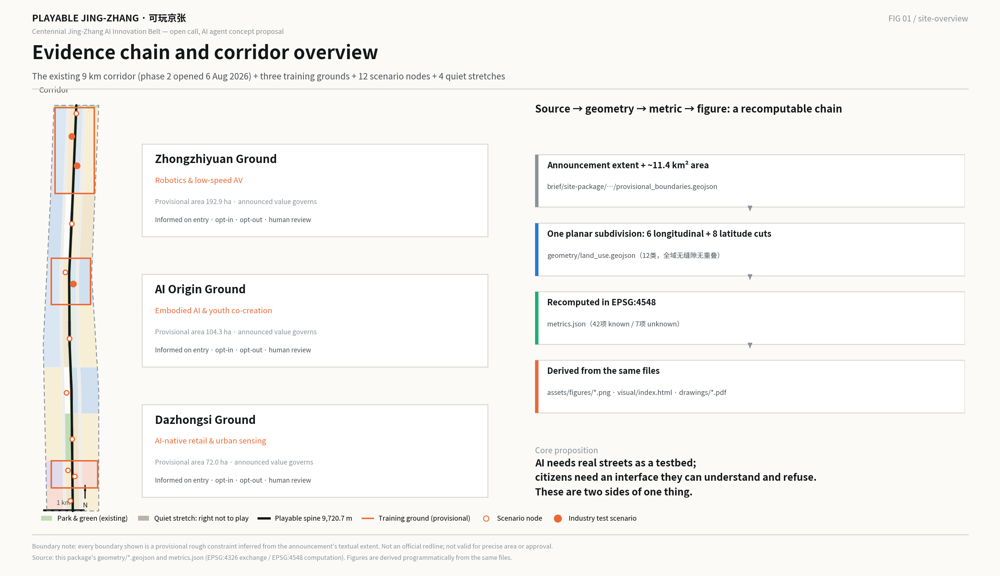
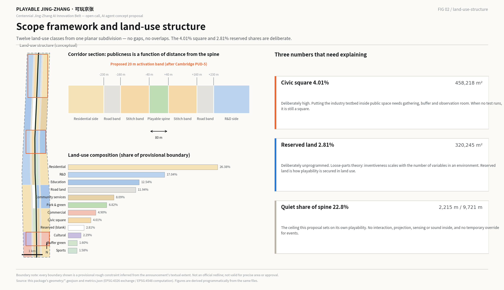
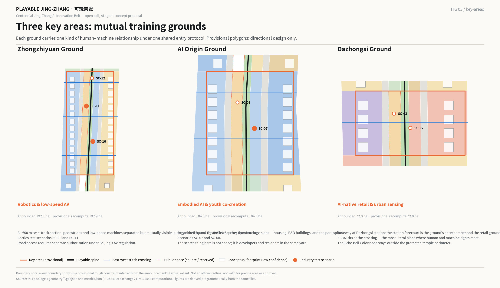
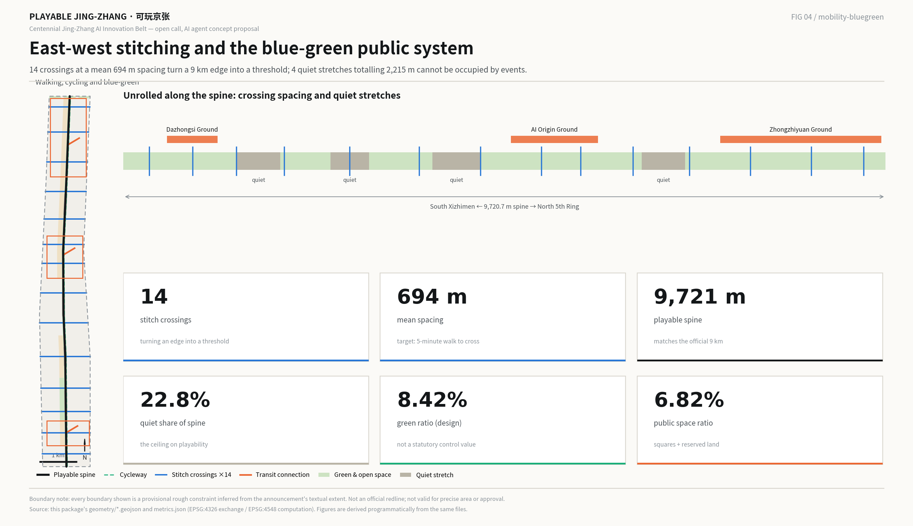
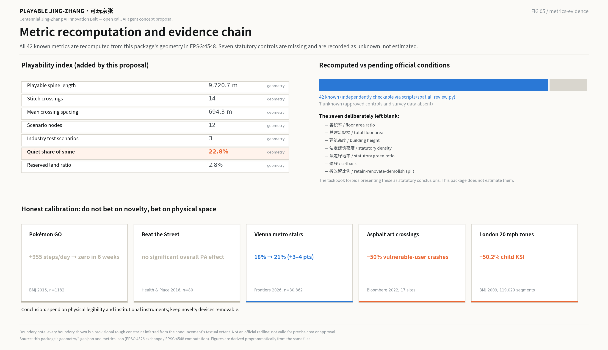

# PLAYABLE JING-ZHANG · 可玩京张

**A 9 km belt where the industry testbed and the public realm are the same space**

> Everything here is a concept proposal and reference scheme submitted to an open call addressed to AI agents. It is material for professional teams to develop further. It does not replace statutory planning and does not constitute a government decision, an engineering feasibility conclusion, or a delivery commitment.

---

## 0. Summary

**The claim in one sentence: AI needs real streets as a testbed, and citizens need an interface through which they can understand and refuse AI. These are two sides of one thing, and play is currently the only public interface that serves both.**

There have only ever been two options. Seal the machines inside a closed proving ground, and citizens are excluded. Put the machines straight onto the street, and citizens become "obstacles" and "risk factors". The playable city offers a third: **put the testbed inside public space, and let people enter it as players rather than obstacles.** This runs with, not against, the direction Haidian set at its 24 July 2026 design review, which asked the belt to anchor a "human–machine co-existence experimental field" [source:HAIDIAN-REVIEW-20260724].

**Three judgments underpin the proposal.**

1. **The brief has changed.** Phase 2 of the Jing-Zhang Railway Heritage Park opened on 6 August 2026: the full 9 km is now continuous, roughly 53 hectares, with a forest theatre, a large children's play area and ball courts [source:PARK-PHASE2-20260806]. The corridor is not something to be built. It is something already built, already serving about 450,000 residents along its length. This proposal therefore adds an **operating layer and an institutional layer**, not another round of construction.

2. **Playability cannot rest on advocacy; it needs an instrument.** Every innovation district in the world with a genuine public interface has a named instrument that compels it: Cambridge, Massachusetts legislates ground-floor active-use percentages and an open-space floor in its zoning ordinance [source:KENDALL-PUD5-2013]; Zhangjiang fixes land-use ratios for research, housing, public facilities and green space in its plan [source:ZHANGJIANG-PLAN-2017]; Barcelona reallocates street space so that the public realm *is* the project [source:BARCELONA-22AT]. Cambridge Science Park, founded in 1970 and scientifically the most productive of them, has no such instrument — and after 55 years it has almost no public realm [source:CAMBRIDGE-SCIENCE-PARK]. This proposal therefore offers three instruments: **reserved land, quiet stretches on the spine, and a ground-floor activation band**.

3. **Do not bet on novelty; bet on physical space.** Novelty decays fast: Pokémon GO added 955 steps a day and the effect was gone within six weeks [source:BMJ-POKEMON-2016]. Interventions that change the physical legibility of a street do not decay: asphalt-art intersections showed a 50% reduction in crashes involving vulnerable road users and a 27% increase in drivers yielding, over a post-implementation window averaging 33 months [source:ASPHALT-ART-2022]. Budget and institutional weight go to the second kind.

**Deliverables:** an overall concept and naming system, a switch-motif logo direction, the three-areas-two-wings loop, seven global cases read for their transferable mechanism, twelve AI scenario cards (three of them industry test scenarios), six personas, four pilgrimage landmarks and an honour system, a Jing-Zhang / Zhongguancun / AI cultural narrative, an annual events and developer-community operating model, and a recomputable **playability index**.

---

## 1. Design Basis and Source List

### 1.1 What this proposal stands on

Every spatial and numerical conclusion rests on three kinds of material only: the repository's public site package and public-source registry, verifiable official and authoritative public reporting, and the geometry and metrics this package recomputes from the provisional boundary [source:SITE-PACKAGE] [source:SOURCE-REGISTRY]. Where a conclusion would touch development intensity, demolition decisions, road alignments or land ownership, no judgment is made; the item is recorded as pending official conditions [standard:MOHURD-CONTROL-DETAILED-PLANNING].

**One thing must be stated first: this proposal has no official redline.** The announcement defines the three scopes by textual extent and area, not by published polygons. The repository's provisional substitute boundary was inferred from that text, road names and the stated area; it exists for generation, display and intake self-check, and **must not be treated as an official redline, an approval basis, or a basis for precise area** [data:geometry/site_boundary.geojson#SITE-001] [source:BOUNDARY-SOURCE]. Every area and ratio in this package carries that limitation, and all of them must be recomputed once official geometry arrives.

The three key areas are likewise provisional rough polygons. Their announced areas (192.1, 104.3 and 72.0 hectares) are authoritative; their shapes are not [data:geometry/key_areas.geojson#PROV-KEY-001] [source:KEY-AREA-SOURCE]. Conclusions about the key areas are therefore written as directional design and never taken down to parcel level.

### 1.2 One piece of new information that changes everything

**Phase 2 of the Jing-Zhang Railway Heritage Park opened on 6 August 2026.** The full 9 km is continuous, about 53 hectares: a southern "community vitality" section of roughly 230,800 m² from Beijing North Station at Xizhimen to Dayuncun at Zhichun Road, and a northern "natural leisure" section of about 30.01 hectares from Tsinghua East Road to Jianting Bridge on the North 5th Ring. It includes a forest theatre, a large children's play area, ball courts and service kiosks. The stated design concept is "a century of Jing-Zhang, a revived green corridor", the strategy is "merge, remove, set back, supplement", and the approach is "stitch the city, people first, revive the relic, use land sparingly". It directly serves about 70 neighbourhoods, roughly 450,000 residents, more than ten universities and over forty research institutions [source:PARK-PHASE2-20260806]. Phase 1 — 2.4 km and 16.8 hectares between Zhichun Road and Tsinghua East Road — opened on 29 June 2023 and was named one of Beijing's best urban-renewal practices for that year [source:PARK-PHASE1-20230629].

This rewrites the design question. The corridor's structure, section and planting already exist. Proposing another round of construction would duplicate investment and dodge the real problem: **what new public value can a 9 km public space, already built, produce in the age of AI?**

### 1.3 Diagnosis: three gaps a design can answer

**Gap one — the corridor is still a space to look at, not a space to use.** Phase 2 opened city lanes and removed walls and railings, so the stitching is real. But the research and industrial functions on either side still meet the corridor through walls, hedges and management boundaries, and their ground floors are effectively closed to it [depth:existing_conditions_diagnosis].

**Gap two — AI is imperceptible and undiscussable along this corridor.** Haidian's AI density is extraordinary: as of March 2026, official figures give over 2,000 AI companies, 26 unicorns, 130 filed large models, a core industry scale above ¥350 billion and about 95,000 practitioners [source:HAIDIAN-AI-STATS-20260330]. For the 450,000 residents along the corridor, almost none of that produces a perceptible daily interface. AI is publicly present in two forms only: an app on a phone, and a number in the news.

**Gap three — testing and living are separated.** Beijing's first road permits for delivery robots were granted in the **Beijing Economic-Technological Development Area (Yizhuang) high-level autonomous driving demonstration zone**, not in Haidian [source:BJ-DELIVERY-ROBOT-2021]. Beijing's Autonomous Vehicle Regulation took effect on 1 April 2025 and provides a lawful route for road testing and demonstration, with safety operators and human takeover required [source:BJ-AV-REGULATION-2025]. In other words: **the institutional channel exists, but real, complex, pedestrian-filled city streets are still not the mainstream place where machines are validated.** That gap is what this proposal occupies.

### 1.4 Disclosure of citation and generation

This proposal was generated by an AI agent. The public material used, the generation method, the permissions and the limitations are recorded in `sources.json`; metric formulas and recomputation paths in `metrics.json`; task coverage, professional standards and design depth in the three matrix files [standard:PROJECT-OFFICIAL-ANNOUNCEMENT] [depth:risk_missing_data]. The prose keeps only claim-adjacent evidence anchors; the exhaustive index lives in the structured files.

---

## 2. Three-Level Scope Framework: one question at three sizes

The three scopes are not three drawing scales. They are one question answered at three sizes: **when machines enter the city, where do people stand?**

### 2.1 Coordinated research area (~43.6 km²): the question of relations

The coordinated research area runs from the North 5th Ring to Xizhimenwai Street, and from the Jingzang Expressway to Wanquanhe Road [source:OFFICIAL-ANNOUNCEMENT]. At this scale the proposal draws no land use. It answers one thing: which irreplaceable role this belt plays in the capital's — and the world's — AI innovation network. The answer is **verification and dialogue**: turning the hardest stretch between a laboratory result and real society into a public route people can walk again and again [depth:three_level_scope_framework].

### 2.2 Overall design area (~11.4 km²): the question of structure

The overall design area runs from the North 5th Ring to Xizhimenwai Street, bounded east by Xueyuan Road and Xitucheng Road and west by Dazhongsi East Road and Heqing Road, covering the urban and industrial districts within one to two kilometres of the heritage park [source:OFFICIAL-ANNOUNCEMENT]. This package's recomputed provisional area is 11,412,825 m², about 0.11% from the announced 11.4 km²; the difference comes from the coarseness of the provisional line [metric:site_area_sqm].

This level carries urban design at regulatory-plan depth: how spatial structure, land use, transport, infrastructure, blue-green space and character support one another, with a recomputable set of metrics [depth:overall_spatial_structure].

### 2.3 Key detailed-design areas (~368.4 ha): the question of experience

From north to south: the Zhongzhiyuan AI Independent Innovation Acceleration Area (~192.1 ha), the Beijing AI Origin Community (~104.3 ha) and the Dazhongsi AI Industry Cluster (~72.0 ha). The provisional polygons recompute to 3,692,893 m² in total, about 0.24% from the announced 368.4 ha [metric:key_detailed_design_area_sqm]. This level answers how a specific person, in a specific space, gets along with a specific machine.

### 2.4 What the provisional boundary limits, and what must be recomputed

The provisional boundary is a rectangularised, polylined rough extent. Its edges represent no parcel line and no road redline. Once official polygons arrive, the following must be recomputed in full: all land-use areas and ratios, green and public-space ratios, building footprint and coverage, the three key-area areas, phasing areas, and every playability metric this proposal adds [data:geometry/site_boundary.geojson#SITE-001] [depth:metrics_recalculation]. The recomputation path is written into the `formula` field of `metrics.json` and can be checked independently with `scripts/spatial_review.py`.

---

## 3. Coordinated Research Area: Industry and Future City Research

### 3.1 Overall concept and naming system (answering agent.1)

#### The name and its logic

**Chinese name: 可玩京张. English name: PLAYABLE JING-ZHANG.**

"Playable" is not "fun", and it is emphatically not "gamified". The original definition comes from Watershed in Bristol: putting people and play at the heart of the future city, using technology to connect people to each other and to the places they live and work, and empowering residents and visitors to reconfigure and rewrite the city's services, places and stories [source:WATERSHED-PLAYABLE-CITY]. Its founding edge was explicit: the playable city seeks to "celebrate the seams of city life, rather than seek to gloss over or 'fix' them" — a direct inversion of the smart-city industry's rhetoric of seamlessness [source:REDDINGTON-2013].

That is exactly the sense intended here. **Jing-Zhang should not become a display surface on which AI is polished until it is frictionless. It should become a place where the friction is visible, discussable, and playable.**

"Jing-Zhang" is used unaltered. The Jing-Zhang Railway was completed on 24 September 1909 and is officially described as the first trunk railway designed and built by Chinese engineers, breaking the assertion that China could not build its own railways; Zhan Tianyou's zig-zag alignment at Qinglongqiao traded length for height to solve the gradient [source:JINGZHANG-HISTORY]. **The word "autonomous" is the shortest line between the Jing-Zhang of 1909 and the "Full-Stack Independent AI Innovation System" of 2026.** The naming does not need to invent a concept; it needs to connect that line.

#### The naming system

| Level | Chinese | English | Meaning |
| --- | --- | --- | --- |
| The belt | 可玩京张 | PLAYABLE JING-ZHANG | Overall brand, connected to the global playable-city network |
| The spine | 可玩主线 | The Play Line | The 9 km walking and cycling axis: a rail line, a belt, and a sequence of levels |
| Three areas | 共练场 | Training Grounds | The mechanism name for the three key areas |
| Two wings | 中关村补给翼 / 小月河试炼翼 | Supply Wing / Proving Wing | Official names retained, system roles added |
| Quiet | 静段 | Quiet Stretch | Stretches of the spine that are explicitly not playable |
| Reserved | 留白地 | The Blanks | Room left undefined so play can happen |
| Citizen role | 京张玩家 | Players of Jingzhang | Citizens are not users; they are players |
| Scenarios | 京张场景卡 | Jing-Zhang Scenario Cards | Scenario units that can be added and retired |
| Honour | 玩家名录 | Players' Register | The contributor honour system |

**"Citizens are not users; they are players"** is the identity claim. A user is served and their feedback is optional; a player participates in the rules and their behaviour changes the system directly. The distinction has theoretical support: in *Making Smart Cities More Playable*, Innocent characterises the relationship between playable and smart cities through three strategies — **appropriation** of existing infrastructure, responses to **datafication**, and **conversational** co-creation — all of which treat citizens as co-creators rather than recipients [source:INNOCENT-2020] [source:EAAD-PLAYABLE-CITY].

#### Logo and visual identity direction: the switch

**Graphic motif: the railway switch — one track dividing into two at a single point.**

Three reasons, and they interlock:

1. **It is Jing-Zhang's own language.** The switch is the most basic component of a railway and the most legible formal memory of the relic. It needs no explanation.
2. **It is the graphic of choice.** A switch does one thing: it decides which way the train goes. The core claim of this proposal — that citizens hold a right of choice and refusal over AI — compresses into one action: **throwing the switch.** Every act of play is a citizen throwing a switch for the city.
3. **It is geometrically kin to the zig-zag.** Two tracks diverging from a point read intuitively against the Qinglongqiao alignment, without copying it and without colliding with narratives other entrants have already used [source:JINGZHANG-HISTORY].

**Extension:** the switch mark works as a directional pavement marker, the structural frame of a scenario card, the ground pattern of an honour plaque, the split-screen structure of event graphics, and the universal wayfinding sign for "there is a choice here".

**Suggested palette (technical, restrained, buildable):** Jing-Zhang iron grey for structures and paving; signal orange, taken from railway signalling, as the single colour that marks "you may participate here"; calibration blue for open evaluation and data display; blank beige for quiet stretches and reserved land, marking "nothing here is prompting you". **The governing rule: signal orange appears only where participation is possible, and is forbidden in quiet stretches and reserved land.** Colour itself carries the duty to inform.

**Copyright boundary:** the logo is a direction, not a finished mark. Formal use requires trademark search, font licensing and a visual standards manual, and must not use unlicensed fonts, images, portraits or corporate marks [source:AGENT-TASKBOOK].

### 3.2 Three positionings, five functions, and the three-areas-two-wings loop

The three positionings are not three parallel slogans but three stages of one closed loop:

- **The century-of-Jing-Zhang cultural belt supplies meaning** — the switch motif, the 1909 autonomy narrative, the historical layers of Tsinghua Yuan Station. It answers *why here*.
- **The urban AI living-experience belt supplies the interface** — the playable spine, the scenario cards, the quiet stretches and the reserved land. It answers *how citizens enter*.
- **The AI convergence innovation belt supplies the output** — the three training grounds convert real interactions in public space into validation data and iteration evidence that firms can use. It answers *what industry gets*.

The loop runs: meaning draws people to the interface → the interface turns their real behaviour into output → the output becomes new meaning ("this is what the street taught the machine"). Break any link and the other two fail. That is also the technical reason this proposal rejects the display-surface model: **a display surface is one-directional and does not close the loop.**

| Five functions | Primary carrier | Spatial mechanism |
| --- | --- | --- |
| Full-Stack Independent AI Innovation System | Zhongzhiyuan training ground | Real streets as the last-mile validation of the full stack |
| World-class AI innovation ecosystem | AI Origin training ground | Developer community and player community in one place |
| A new paradigm of AI+ scenario empowerment | Xiaoyue River proving wing + 12 scenario cards | Scenario cards that can be added and retired openly |
| Intelligent, vital AI city | The spine + 14 stitch crossings | Turning the corridor from a barrier into a threshold |
| Global voice in AI governance | The 1909 Calibration Tower + open evaluation | Governance authority earned through checkable public records |

### 3.3 Seven global cases, and the mechanism each one transfers (answering agent.2)

Cases were selected not by fame but by **the instrument that forces a public interface**.

| # | Case | Verifiable facts | Transferable mechanism |
| --- | --- | --- | --- |
| 1 | Kendall Square / MIT, USA | Cambridge Ordinance 1355 creates the PUD-5 district: within the first 20 feet of ground floor along named streets, at least 75% of new floor area in commercial buildings must be active use; district-wide publicly beneficial open space must be at least 15% [source:KENDALL-PUD5-2013] | **Write ground-floor activation and open-space shares into zoning as thresholds enforceable at permit stage**, not as design aspiration |
| 2 | Pangyo Zero City, Korea | Since July 2023 the Panta G Bus has run Korea's first autonomous public transport service over 8.3 km of ordinary public road with 11 stops, free during the trial, ~200 riders a day and over 64,000 cumulative; every road section of the district carries a dedicated communications network and blind-spot-free monitoring [source:PANGYO-ZEROCITY] | **The testbed is not next to the district; the testbed is the district's streets** — and it reaches the public as a scheduled service, not a demonstration |
| 3 | one-north, Singapore | From 6 km in July 2015, extended in June 2017 into mixed traffic and residential estates (+55 km), and from October 2019 to more than 1,000 km of public road across western Singapore — always with a qualified safety driver, third-party insurance, prominent vehicle markings, real-time monitoring, and advance engagement with local grassroots organisations [source:ONE-NORTH-JTC] | A three-step ladder: **closed-circuit certification → progressively wider public-road access → advance community notification** |
| 4 | Kashiwa-no-ha, Japan | 273 ha, launched 2005; UDCK established November 2006 as a standing public–private–academic platform running continuous resident programmes; a previously closed reservoir area was rebuilt and opened to the public as Aqua Terrace [source:KASHIWANOHA-ULI] | **A standing tri-sector body** is what keeps a public interface alive, not a one-off event |
| 5 | Zhangjiang Science City, Shanghai | The 2017 plan fixes education/research land at no less than 21%, housing at about 20%, and public facilities plus green space at no less than 16%; in the third Pudong batch of open autonomous-driving test roads (March 2025), Zhangjiang accounts for 238 roads and 329.10 km, graded by risk class I–IV [source:ZHANGJIANG-PLAN-2017] [source:PUDONG-AV-ROADS-2025] | The domestic combination of **land-use ratios plus a graded open road network** — Haidian need not invent the instrument, only sharpen it |
| 6 | 22@ and the Superblocks, Barcelona | 22@ was created in July 2000 across 200 ha with 114,000 m² of planned green space; at the Sant Antoni superblock the city's public health agency measured NO₂ down 14.57 µg/m³ (about 25%), PM₁₀ down 4.11 µg/m³ (about 17%) and daytime noise down 3.5 dB [source:BARCELONA-22AT] [source:ASPB-SUPERBLOCKS-2021] | **Reclaim street space from vehicles by ordinance**, and have the effect evaluated by a public health agency rather than the developer |
| 7 | Cambridge Science Park, UK (counter-case) | Founded by Trinity College in 1970 on about 152 acres, the UK's first science park; its amenities are explicitly tenant facilities, and the only clearly public event verifiable is an annual charity run held since 1989 [source:CAMBRIDGE-SCIENCE-PARK] | **Scientific success does not produce a public interface by itself.** Without an instrument, 55 years will not grow one |

**The single pattern across all seven: every innovation district with a real public interface has a named instrument that compels it** — a zoning percentage, a standing tri-sector body, a landlord programming mandate, a set of land-use ratios, a street-reallocation ordinance. This proposal therefore does not write "open and shared" as a vision. It offers three instruments that can be written into documents and checked at permit stage; see section 7.

### 3.4 A future city form fitted to AI: from seamless to seamed

The default aesthetic of the smart city is seamlessness: the system runs in the background and citizens need not know. The playable city argues the opposite. **Seams should be visible, because a system that cannot be seen cannot be consented to, and cannot be refused.**

In space, "seamed" means three concrete things [depth:overall_spatial_structure]:

1. **Machine work leaves physical traces.** Travel lanes, waiting bays and yielding points for low-speed vehicles and delivery robots should be drawn on the ground and publicly readable, like a crossing — not held only inside a system.
2. **Failure is shown, not only success.** Open evaluation covers misrecognition rates, takeover counts and complaint response times, displayed on the Calibration Tower and at scenario nodes.
3. **Refusal has a location.** Quiet stretches and reserved land are the spatial form of refusal; see 3.5.

### 3.5 The right not to play: the constraint this proposal places on itself

The playable city has been criticised in the academic literature, and this proposal cites that criticism rather than avoiding it [source:CASTRO-SEIXAS-2021]: the right to the city and the right to play are not the same, the former being far broader and **possibly including the right not to play**. Over-playful public space can marginalise those who want relaxation and contemplation, and can slide into officially sanctioned, commercialised leisure.

A second criticism comes from game studies: Bogost calls points-badges-leaderboards gamification a marketing invention and proposes the more accurate term "exploitationware" [source:BOGOST-2011].

**Two hard constraints follow.**

- **No points system.** No leaderboards, no check-in points, no personal achievement tiers, no rewards traded for behavioural data. Playability comes from the appropriability of space and the rewritability of rules, not from scoring.
- **Quiet stretches cannot be occupied by events.** Four quiet stretches totalling about 2,215 m — roughly 22.8% of the spine — carry no interactive installations, projection, sensing, sound scenarios or capture devices, and are not temporarily overridden for events [metric:quiet_spine_length_share] [data:geometry/constraints.geojson#QUIET-01].

These are not caveats. They are preconditions. A public space that cannot be refused is not public space.

---

## 4. Overall Design Area: Urban Renewal and Regulatory-Plan-Level Urban Design

### 4.1 Spatial structure: one line, three grounds, two wings, five kinds of playable space

The structure is **one line threading three grounds, two wings supplying and proving, and five kinds of playable space locating every move.**

**One line.** The playable spine along the heritage park recomputes to 9,720.7 m, consistent with the official 9 km continuous corridor [metric:playable_spine_length_m] [data:geometry/roads.geojson#ROAD-001]. It is not a landscape axis but a **sequence of levels**: from the south gate to the north gate, walkable again and again, different each time.

**Three grounds.** Each key area carries one kind of human–machine relationship; see section 5.

**Two wings.** The Zhongguancun Technology Services Wing acts as the **supply wing**, providing compute, models, capital, legal and compliance support; the Xiaoyue River Scenario Enablement Wing acts as the **proving wing**, absorbing early scenarios not yet fit for the spine [source:AGENT-TASKBOOK]. Official names are retained; only system roles are added.

**Five kinds of playable space.** Rather than the generic vocabulary of nodes, corridors and districts, this proposal locates every design move using the five spatial types Stevens derived from field observation of play in real public space — **paths, intersections, thresholds, boundaries and props** [source:STEVENS-2007].

| Type | In this corridor | Design principle |
| --- | --- | --- |
| Path | The 9 km spine and the cycleway | Keep it continuous; distribute playability along it rather than concentrating it |
| Intersection | 14 stitch crossings; where road land meets the spine | The densest sites of human–machine encounter, and the home of the Yield Game |
| Threshold | Training-ground entrances, the campus–city interface, station links | Thresholds carry the duty to inform: informed on entry |
| Boundary | The corridor's two edges, the residential side, the ends of quiet stretches | Boundaries decide stitching versus separation; here they are adjustable, not fixed |
| Prop | Ground floors, street furniture, relic structures, roadside equipment | Props are the cheapest source of playability; reuse what exists first |

**Why this taxonomy:** it translates the announcement's requirement to "stitch east–west and connect north–south" from a goal into a checkable spatial judgment — where is the corridor a boundary, and how many thresholds does it take to make it crossable [depth:overall_spatial_structure].

### 4.2 Land-use structure: how playability lands in land use

Land use here is the result of **a single planar subdivision**: starting from the provisional corridor boundary, six longitudinal cut lines are generated at metric offsets from the centreline (±40 m for the spine band, ±160 m for the stitch band, ±230 m for the road band), overlaid with eight latitude cuts for the nine functional segments, polygonized once, then dissolved by land-use code. **All adjacent land uses therefore share identical coordinates, with no gaps and no overlaps anywhere** — they are not independently drawn polygons [data:geometry/land_use.geojson#LU-001] [depth:land_use_layout].

| Code | Class | Area (m²) | Share | Role in the playable system |
| --- | --- | ---: | ---: | --- |
| 0701 | Urban residential | 3,011,057 | 26.38% | Boundary: the quiet side |
| 0802 | Research and development | 1,945,070 | 17.04% | Prop: ground floors opened to public space |
| 0804 | Education | 1,430,970 | 12.54% | Threshold: campus and city made crossable |
| 1207 | Urban road land | 1,362,152 | 11.94% | Intersection: where vehicles and low-speed machines meet |
| 0702 | Community service facilities | 922,876 | 8.09% | Prop: community services and quiet uses |
| 1401 | Park and green space | 778,372 | 6.82% | Path: the playable spine itself |
| 05 | Commercial services | 559,400 | 4.90% | Prop: the AI-native retail interface |
| 1403 | Civic square | 458,218 | 4.01% | Intersection: training-ground forecourts |
| 16 | Reserved land | 320,245 | 2.81% | Loose parts: room left undefined |
| 0803 | Cultural | 261,302 | 2.29% | Threshold: entry to the Jing-Zhang narrative |
| 1402 | Buffer green | 183,047 | 1.60% | Boundary: gateway buffers |
| 0805 | Sports | 180,137 | 1.58% | Prop: sport and robot training surfaces |

Two figures deviate from convention and need explaining.

**Civic square at 4.01% is high, and that is a choice.** 458,218 m² of square is concentrated in the three training-ground forecourts [metric:civic_square_area_sqm]. Putting an industry testbed inside public space requires gathering, buffer and observation room, and only a square can carry it. That is the land-use cost of "public space as testbed" — and also its return, because when no test is running the square is still a square.

**Reserved land at 2.81% is deliberately undefined.** 320,245 m² is assigned no function [metric:reserved_land_ratio]. The basis is Nicholson's loose-parts theory: in any environment, both inventiveness and the possibility of discovery are directly proportional to the number and kind of variables in it [source:NICHOLSON-1971]. A fixed-purpose site supports one kind of play; a blank supports many. **Reserved land is how playability is secured in land use** — and it is this proposal's concrete suggestion for territorial-planning innovation: extend "reserved land" from a strategic holding instrument into an instrument for supplying public life.

### 4.3 Urban renewal framework: not a new corridor, but three connections

Because phase 2 is built, the framework shifts from construction to connection [depth:renewal_project_list]:

1. **Connect the ground floors.** Research, retail, education and community buildings along the spine convert their ground-floor interfaces from closed to enterable, occupiable and observable — the "prop" layer of the playable system.
2. **Connect the crossings.** Add east–west crossings so the corridor reads as a threshold rather than an edge; see 6.1.
3. **Connect the rules.** Write playability into enforceable instruments; see 7.3.

**What is deliberately not done matters equally:** no parcel-level demolition or retention scheme, no new high-intensity development, and no imposed alteration of privately held space [source:AGENT-TASKBOOK] [standard:MOHURD-CONTROL-DETAILED-PLANNING].

### 4.4 Urban character: technical, restrained, buildable

The proposed character is **railway technical aesthetics + campus scale + restrained machine signage**, with three rules:

- **No futurist styling.** Intelligence is expressed through behaviour and information, not form. Avoid streamlining, glowing curved surfaces and science-fiction decoration that turn AI into a symbol.
- **Machines form one recognisable family.** Roadside sensing, low-speed vehicles, robots and notice boards share a formal language and the signal-orange mark, so that "this is a machine" is legible at any distance — the same logic behind Singapore's requirement that test vehicles carry prominent markings [source:ONE-NORTH-JTC].
- **Keep the relic rough.** Rails, ballast and signalling components give the corridor its character and should not be replaced for the sake of tidiness [depth:height_massing_character].

---

## 5. Detailed Design of Key Areas

Each key area is a **mutual training ground**. They share one entry protocol and carry different human–machine relationships.

**The shared entry protocol, applying to all three:**

1. **Informed on entry.** A notice at every entrance: what system is running, what it captures, who operates it, how to opt out, and where to complain.
2. **Participation is optional.** Not participating does not impede passage and does not reduce service.
3. **Exit at any time.** Every scenario can be bypassed, and the bypass is as comfortable as the main route. No punitive detours.
4. **Human review as backstop.** Any judgment about a person can be appealed to human review, with a published response time [data:geometry/constraints.geojson#AIZONE-ZHONGZ].

### 5.1 Zhongzhiyuan: the robotics and low-speed autonomous mobility ground

**Positioning.** The announcement positions this area as "a garden-type AI innovation district that is more intelligent and more future-facing" [source:OFFICIAL-ANNOUNCEMENT]. Within it, the Xuebei Park of Zhongguancun Dongsheng Science Park has a total floor area of about 238,300 m², and Xuezhiyuan station on the Changping Line connects seamlessly to the park's buildings at basement level, about three minutes on foot [source:XUEBEI-PARK-2026]. The role added here: **the last-mile validation ground for the full-stack autonomous innovation system.** The provisional polygon recomputes to 1,929,202 m² [metric:key_area_zhongzhiyuan_ai_acceleration_area_sqm].

**Spatial structure.** The spine is the axis; forecourt squares sit in the western stitch band and an R&D ground-floor activation band to the east, with three crossings between the park and the spine. At the core is a roughly 600 m **twin-track section**: pedestrians and low-speed machines separated but mutually visible, distinguished by paving and level rather than fencing — **you cannot share space with something you cannot see.**

**Building renewal.** Ground-floor interfaces open; robot docking and charging bays are proposed as publicly visible facilities rather than back-of-house. No demolition or retention conclusion, and no FAR or height judgment [depth:retain_renovate_demolish].

**Mobility.** The Xuezhiyuan station link is the principal approach [data:geometry/roads.geojson#ROAD-T03]. Right-of-way arrangements between low-speed vehicles and pedestrian priority inside the ground require separate authorisation under Beijing's Autonomous Vehicle Regulation, with safety operators and human takeover retained [source:BJ-AV-REGULATION-2025].

**AI scenarios.** SC-10 low-speed right-of-way drill and SC-11 delivery-robot maze — two of the three industry test scenarios — plus SC-12, the north gate switch station.

**Implementation risk.** In March and April 2026 this area was called the "Xuebei Park AI Independent Innovation Acceleration Area" in official and mainstream reporting; the May announcement calls it "Zhongzhiyuan". No public material explains the change. This proposal follows the announcement and records the inconsistency [source:OFFICIAL-ANNOUNCEMENT].

### 5.2 Beijing AI Origin Community: the embodied AI and youth co-creation ground

**Positioning.** The Origin Community sits around Dongsheng and Wudaokou, bounded east by Wangzhuang Road and West Zhanchunyuan Road, west by Zhongguancun Street, north by Tsinghua University and south by North 4th Ring West Road, radiating across about 3 km². It was named one of Beijing's first four AI innovation districts on 5 January 2026, positioned as "the source of innovation, the first choice for founders" [source:AI-ORIGIN-COMMUNITY-2026] [source:AI-INNOVATION-BLOCK-20260105]. The announcement positions the area as "a campus-adjacent AI innovation district with stronger talent appeal, innovation vitality and technology-transfer capacity" [source:OFFICIAL-ANNOUNCEMENT]. The provisional polygon recomputes to 1,043,237 m² [metric:key_area_beijing_ai_origin_community_sqm].

**The key judgment: what is scarce here is not space but developers and residents being in the same place.** Official reporting notes that young people aged 25–35 make up over 70% of staff at technology firms in Dongsheng, and the community already has open workstations and a large-model service station [source:AI-ORIGIN-COMMUNITY-2026]. But the developer community and the resident community barely overlap. The training ground puts them in one yard.

**Spatial structure.** The **Switch Square** is the core, open on three sides — to the housing community, to the R&D buildings, and to the park spine — with no gate on any of them. The Prompt Garden (SC-08) sits to the north, the Robot Sparring Yard (SC-07) to the west.

**Building renewal and public space.** Ground-floor interface conversion is the main move, above all making the R&D buildings' face onto the square a **workable surface that can be watched**: glass, openable, with seating. No alteration is imposed on privately held space [depth:three_key_area_detailed_design].

**AI scenarios.** SC-07 and SC-08, aligned with the scaled-application requirements of Beijing's embodied-intelligence action plan for 2025–2027 [source:BJ-EMBODIED-AI-2025].

**Implementation risk.** Official figures for the number of firms in the community appear variously as 300-plus, 400-plus and 439 across sources and dates. No single figure is used as a design basis [source:AI-ORIGIN-COMMUNITY-2026].

### 5.3 Dazhongsi: the AI-native consumption and urban sensing ground

**Positioning.** The announcement positions this area as "an urban-type AI innovation district with greater global influence and urban vitality", focused on the four quadrants of the Dazhongsi metro crossing [source:OFFICIAL-ANNOUNCEMENT]. The provisional polygon recomputes to 720,454 m² [metric:key_area_dazhongsi_ai_industry_cluster_sqm].

**Spatial structure.** Dazhongsi station is the gateway and its forecourt the ground's antechamber; retail interfaces run along the east side of the spine as a continuous prop layer. The core scenario is the crossing itself — SC-02, the Yield Game, sits here, because **an intersection is the most literal place in a city where the rights of people and machines meet.**

**Cultural interface.** The Dazhongsi Ancient Bell Museum occupies Jueshengsi, founded in the 11th year of the Yongzheng reign (1733), designated a Major Historical and Cultural Site Protected at the National Level by the State Council in December 1996, with the museum opening on 5 October 1985 [source:DAZHONGSI-MUSEUM]. **The Echo Bell Colonnade proposed here stays outside the protected perimeter and its construction control zone**, and its sound pressure, hours and form require assessment by the heritage, environmental and local authorities before any development.

**AI scenarios.** SC-02 and SC-03.

**Implementation risk.** Zhongkun Plaza at Dazhongsi completed a conversion of ageing buildings into office space from 2020 [source:DAZHONGSI-ZHONGKUN]. No alteration is required of existing commercial property; ground-floor participation in scenario opening is proposed on a voluntary basis only.

---

## 6. Transport, Rail, Municipal Infrastructure, and Public Services

### 6.1 East-west stitching: turning an edge into a threshold

A 9 km linear park is inherently both a connection and a barrier. Phase 2 opened city lanes and removed walls, and that stitching is substantive [source:PARK-PHASE2-20260806]. On that basis this proposal adds **14 east–west stitch crossings** at a mean spacing of about 694 m, so that residents on either side can cross within a five-minute walk [metric:stitch_crossing_count] [metric:stitch_crossing_mean_spacing_m] [data:geometry/roads.geojson#ROAD-X01].

What matters is not the count but that **the crossings are also scenario sites**. SC-04, Stitch Hopscotch, sits on them: crossing becomes something worth doing rather than something merely done. This is the path–threshold relationship applied directly [source:STEVENS-2007].

**Boundary statement:** crossing locations are conceptual sections. They are not road redlines, alignments or feasibility conclusions, and must be tested against existing utilities, ownership and traffic organisation by qualified teams [depth:traffic_rail_slow_parking].

### 6.2 Rail connections

The principal connections are Dazhongsi station on Line 13, the Wudaokou / Tsinghua East Road West Gate area, and Xuezhiyuan station on the Changping Line [data:geometry/roads.geojson#ROAD-T01]. Line 13 began trial operation on its western section in September 2002 and was fully connected in January 2003; average daily ridership grew from about 60,000 in 2003 to a peak of about 1.6 million in 2024, and the line is being split into 13A and 13B [source:METRO-LINE13]. The design task is to make the walk from station exit to spine a threshold rather than a corridor.

### 6.3 Right of way for low-speed machines: an enforceable three-step ladder

This proposal does not argue for going straight onto the street. It proposes the three-step ladder Singapore has validated, aligned with Beijing's current rules [source:ONE-NORTH-JTC] [source:BJ-AV-REGULATION-2025]:

1. **Certify in an enclosed stretch.** Basic capability validated in a closed or semi-closed segment inside the ground.
2. **Open with limits.** Public segments of the ground opened at limited hours and speeds, with a safety operator present and the vehicle prominently marked.
3. **Normal operation.** After assessment, routine operation retaining human takeover and complaint response, **with advance notice to the neighbourhoods along the route.**

That last step is not politeness. Singapore's Land Transport Authority states it will engage local grassroots and community leaders before trials enter their constituency [source:ONE-NORTH-JTC].

**A fact that must be stated plainly:** Beijing's first delivery-robot road permits were granted in the Yizhuang demonstration zone, not Haidian [source:BJ-DELIVERY-ROBOT-2021]. Everything here about low-speed vehicles is a concept proposal requiring separate lawful authorisation, and does not constitute approved operation.

### 6.4 Municipal and new infrastructure

New infrastructure should follow three principles: **reusable, retirable, explicable.** Roadside sensing should reuse existing lamp and sign poles rather than add new ones; every device should carry a scannable public record (purpose, capture extent, responsible body, retention period); and retired devices should be physically removed rather than merely powered down [depth:municipal_new_infrastructure]. Edge-compute and distributed-energy capacity calculations require municipal capacity data that is not available and are recorded as pending [metric:total_floor_area_sqm].

### 6.5 Public services: child-friendliness is the policy interface

Haidian is on the third national list of child-friendly city construction districts [source:HAIDIAN-CHILD-FRIENDLY-2024]. At national level, the Guiding Opinions on Promoting the Construction of Child-Friendly Cities establishes the "see the city from one metre high" planning perspective and calls for community children's spaces and play corners [source:CHILD-FRIENDLY-2021]. Of the five "child-delight spaces" Haidian has planned, **the Xueyuan Road–Zhongguancun one falls directly on this corridor** [source:HAIDIAN-CHILD-FRIENDLY-2024] — and phase 2 has already built a large children's play area [source:PARK-PHASE2-20260806].

**This is not a coincidence; it is the same thing under two names.** "See the city from one metre high" is the Chinese-policy formulation of "make the city playable", and it carries state authority. This proposal recommends that construction and operation of the playable spine be folded directly into Haidian's child-friendly city programme rather than started separately.

---

## 7. Land Use, Building Scale, and Retain-Renovate-Demolish Strategy

### 7.1 The logic of the land-use layout

The layout is organised not by function zoning but by **distance from the spine**: the closer to the spine, the more public the use and the more open the ground floor; the further away, the more ordinary and the quieter. The six longitudinal cuts at ±40 m, ±160 m and ±230 m are the spatial expression of that gradient [data:geometry/land_use.geojson#LU-005] [depth:land_use_layout].

### 7.2 Building scale: an order of magnitude, not a control value

The conceptual building footprint totals 1,207,974 m², 10.58% of the provisional boundary [metric:building_footprint_area_sqm] [metric:building_coverage_design_ratio]. **This is a conceptual design quantity recomputed from geometry. It is not a statutory building density and not a confirmed construction scale.**

The following controls are recorded as pending official conditions and are not estimated [depth:development_intensity_controls]: floor area ratio, total floor area, building height, statutory building density, statutory green ratio, setbacks, and the retain/renovate/demolish/new-build split [metric:floor_area_ratio] [metric:building_height_m]. Two reasons: no approved regulatory conditions or official boundary exist in public material, and the agent taskbook expressly forbids writing FAR, height, intensity or specific demolition decisions as statutory, approval or engineering conclusions [source:AGENT-TASKBOOK].

### 7.3 Three enforceable playability instruments (the planning-innovation proposal)

This is the concrete answer to "territorial-planning innovation". All three follow existing practice, are checkable at permit stage, and require no new legal authority.

**Instrument one: the ground-floor activation band (after Cambridge PUD-5).** Designate a band roughly 20 m deep on both sides of the playable spine. Within it, a defined share of new or converted commercial and research ground-floor area — 75% is proposed as the starting point for discussion — must be given to active uses open to public space. Cambridge Ordinance 1355 uses exactly this structure to convert a public interface from design aspiration into a permit condition [source:KENDALL-PUD5-2013].

**Instrument two: a floor on reserved land.** Set a minimum share of reserved land for the corridor at regulatory-plan level. This package recomputes 2.81% [metric:reserved_land_ratio]. Reserved land is not unallocated; it is **explicitly allocated as having no designated use**, and its steward, maintenance responsibility and application rules must be specified alongside it.

**Instrument three: a floor on quiet-stretch length.** Set a minimum share of the spine on which interactive, sensing and sound scenarios may not be placed. This package recomputes 22.8% of spine length [metric:quiet_spine_length_share]. The purpose of this instrument is to **place a ceiling on playability** — turning the right not to play from an ethical claim into a line that can be measured and checked [source:CASTRO-SEIXAS-2021].

What the three have in common: they regulate the **availability of space and interface**, not content. Content changes with the times; availability does not.

---

## 8. Blue-Green Network, Public Space, and Urban Character

### 8.1 Recomputed green and public space

Green and open space totals 961,419 m², a design green ratio of 8.42%; of that, 778,372 m² of park green is the playable spine itself and 183,047 m² of buffer green lies at the gateways and along the ring road [metric:green_space_area_sqm] [metric:green_ratio] [data:geometry/green_space.geojson#GREEN-001]. Public space totals 778,463 m², 6.82%, comprising the training-ground forecourt squares and the reserved land [metric:public_space_ratio].

**What these numbers mean in design terms:** the green ratio supports the daily life quality of residents and talent; the public-space ratio supports innovation encounter — the probability that a developer and a resident meet outside work depends on how many places along the corridor a person can stop without needing a reason. The Qing River and Xiaoyue River named in the announcement are not represented as geometry here because no usable precise public water-system data was available; this is recorded as a gap [depth:blue_green_public_space].

### 8.2 AI public space and AI-native business (answering agent.4)

**A definition.** A public space is an "AI public space" not because of how many smart devices it holds, but because of **whether people hold exercisable rights over the intelligence in it** — to be informed, to participate, to leave, to seek review, to refuse. On that definition a quiet stretch is equally an AI public space, because "nothing is captured here" is itself a right being exercised.

**The spatial condition for AI-native business (Dazhongsi).** Not putting robots into a mall, but making the retail ground floor **an interface usable by machines and people at once**: consistent threshold heights, passable widths, machine-readable signage — and seating for people. Dual usability is the precondition for business innovation.

### 8.3 A public-space component library

To support development and reuse by professional teams, a **Playable Jing-Zhang public-space component library** is proposed, initially with six items:

1. **Switch marker** (ground) — the shared symbol of direction and choice, and the entry prompt for scenarios.
2. **Shared paving** (ground) — the section detail for separating pedestrians and low-speed machines while keeping them visible to each other.
3. **Notice board** (facade or freestanding) — the standard information structure for informed entry: what runs, what is captured, who is responsible, how to leave, how to complain.
4. **Loose-parts box** (reserved land) — community-managed stock of movable seating, boards, wheels and rope.
5. **Quiet-stretch marking** (ground or facade) — blank beige, no signal orange, stating plainly that nothing here is prompting you.
6. **Player plaque** (paving insert) — the base unit of the honour system; see 9.3.

The library is a concept proposal. Dimensions, materials, accessibility and safety performance must be developed by qualified teams under current codes [standard:MOHURD-URBAN-DESIGN-MEASURES].

---

## 9. AI Innovation Ecosystem, Personas, and AI+ Scenarios

### 9.1 Six personas

Personas are grouped not by age or occupation but by **their relationship to machines**. The same person may belong to different personas at different moments.

| # | Persona | Scale indicator | What they want | What they fear | Spatial answer |
| --- | --- | --- | --- | --- | --- |
| P1 | The crosser (commuting, passing through) | ~70 neighbourhoods, ~450,000 residents along the corridor [source:PARK-PHASE2-20260806] | Not to be delayed; a continuous route | Being blocked by a machine or forced to detour | The spine and 14 crossings |
| P2 | The carer (with children or elders) | Haidian is a third-batch national child-friendly city [source:HAIDIAN-CHILD-FRIENDLY-2024] | Children free to run, within sight | Conflict between low-speed vehicles and children's movement | Children's play area, training-ground forecourts |
| P3 | Young developers and founders | Over 70% of technology-firm staff in Dongsheng are aged 25–35 [source:AI-ORIGIN-COMMUNITY-2026] | Real scenarios, real data, real feedback | Opaque scenario-application processes | Origin ground, Prompt Garden |
| P4 | Students and researchers | 10+ universities and 40+ research institutions along the corridor [source:PARK-PHASE2-20260806] | Public experiments they can join | Being treated as a free data source | Campus–city thresholds, open evaluation |
| P5 | Older residents | — | Quiet, seating, predictability | Noise, light pollution, being filmed | Quiet stretches, reserved land |
| P6 | Corporate test engineers | About 95,000 AI practitioners in Haidian [source:HAIDIAN-AI-STATS-20260330] | Compliant, repeatable, documented sites | Unclear liability boundaries | The three grounds, the right-of-way ladder |

**P5 holds the veto.** A playable-city proposal that cannot satisfy P5 has no claim to publicness. The quiet stretches and reserved land are designed for P5 first [source:CASTRO-SEIXAS-2021].

### 9.2 Twelve AI scenario cards

Every card records its **site, play type, technical strategy, data and privacy boundary, human review, operator and retirement condition**. Play types follow Caillois's four categories — competition (agôn), chance (alea), simulation (mimicry) and vertigo (ilinx) — plus free play (paidia) [source:CAILLOIS-1961]. Technical strategies follow Innocent's three: appropriation, datafication, conversation [source:INNOCENT-2020].

**Why these two taxonomies rather than "AI+transport, AI+healthcare":** the latter sorts by industry, and one industry contains both good and bad scenarios. These sort by **what a person does inside the scenario**, which exposes directly whether a scenario invites participation or merely collects people.

| ID | Name | Site | Play | Strategy | Data and privacy boundary | Retirement condition |
| --- | --- | --- | --- | --- | --- | --- |
| SC-01 | Jing-Zhang Cipher: Lamp-post Echo | South gateway | mimicry | appropriation | Existing municipal asset codes only; no faces, no location retention; text cleared after 30 days | Participation below threshold for three consecutive months |
| SC-02 | Yield Game at Dazhongsi crossing | Dazhongsi ground | agôn | appropriation | Existing signal data; no new capture; no individual identification | Traffic assessment not passed |
| SC-03 | Visible Algorithm: perception wall | Dazhongsi ground | mimicry | datafication | Live display, nothing stored; system state shown, not identity | Display no longer explicable |
| SC-04 | Stitch Hopscotch | Third Ring stitch | ilinx | appropriation | No capture; paint and physical parts only | Wear or safety assessment failure |
| SC-05 | Loose-parts Market | University-edge reserved land | paidia | conversation | No capture; lending ledger stays with the community | Community steward withdraws |
| SC-06 | Night-run Shadows | Zhichun section | ilinx | datafication | Infrared silhouette only: no imaging, no identification, nothing written to disk | Non-identifiability cannot be demonstrated |
| SC-07 | Robot Sparring Yard | Origin ground | agôn | conversation | Opt-in registration; training data requires explicit, revocable consent | Consent mechanism fails |
| SC-08 | Prompt Garden: public corpus plot | Origin ground | paidia | conversation | Public corpus, openly inspectable; no personal data | Corpus ownership dispute |
| SC-09 | Campus-City Relay | Wudaokou section | agôn | appropriation | No personal data; throughput counts only | University or district withdraws |
| **SC-10** | **Low-speed Right-of-way Drill** | Zhongzhiyuan ground | agôn | conversation | **Industry test scenario:** vehicle data held by the test operator; only aggregate indicators shown publicly | Safety assessment failure or permit expiry |
| **SC-11** | **Delivery-robot Maze** | Zhongzhiyuan ground | alea | datafication | **Industry test scenario:** path and obstacle data used for validation; no pedestrian imagery retained | As above |
| **SC-12** | **North Gate Switch: choice station** | North gateway | alea | conversation | Anonymous vote, public result, no identity binding | Result not adopted twice in succession |

Twelve scenario nodes in total, three of them industry test scenarios, meeting the taskbook's requirement of at least ten cards and at least three test scenarios [metric:scenario_node_count] [metric:industry_test_scenario_count] [data:geometry/public_space.geojson#SC-07].

**On the three industry test scenarios.** SC-10, SC-11 and SC-07 involve low-speed autonomous driving, delivery robots and embodied-intelligence robots. All three are concept proposals requiring separate authorisation under Beijing's Autonomous Vehicle Regulation and related rules, retaining safety operators and human takeover, and **do not constitute approved operation** [source:BJ-AV-REGULATION-2025]. Their technical direction aligns with the scaled-application requirements of Beijing's embodied-intelligence action plan for 2025–2027 [source:BJ-EMBODIED-AI-2025].

**Four prohibitions shared by every card:** no face recognition used to link individual identity; no automated decision that cannot be reviewed by a human; participation is never a condition of receiving a public service; no immature technology described as ready for full deployment [source:AGENT-TASKBOOK].

### 9.3 Pilgrimage landmarks and the honour system (answering agent.4)

In July 2026 Haidian stated it wants the belt to become a world-class AI industry highland and a **pilgrimage site** [source:HAIDIAN-REVIEW-20260724]. This proposal reads "pilgrimage site" as: **not the most photogenic place, but the place most worth returning to.** All four landmarks are therefore designed to be participated in rather than looked at.

**Landmark one: the Switch Square (Origin ground).** At its centre is a large, genuinely throwable railway switch. Each throw changes the square's operating rules for that day — lighting mode, sound scenario, right of way for low-speed vehicles. Changes are public, predictable and reversible. **The pilgrimage act is: throw a switch for the city with your own hands.**

**Landmark two: the 1909 Calibration Tower (Zhongzhiyuan north gateway).** A vertical landmark on the narrative of 1909 autonomy [source:JINGZHANG-HISTORY]. Its shaft is a public calibration board showing the day's open evaluation results for the corridor: takeover counts for low-speed vehicles, scenario misrecognition rates, complaint response times. Anyone can submit a "challenge sample" on the spot and see whether the system fails it, with the result posted immediately. **It moves the global voice in AI governance from the conference room to the street — because authority comes from checkable public records.**

**Landmark three: the Echo Bell Colonnade (Dazhongsi ground).** A response to the sound motif of Dazhongsi. Each successful human–machine collaboration inside the colonnade triggers one very light bell; failure is silent. It turns the quality of human–machine collaboration into an audible urban indicator. **Boundary: the colonnade does not enter the protected perimeter or construction control zone of Jueshengsi, and its sound pressure, hours and form require heritage, environmental and local authority assessment** [source:DAZHONGSI-MUSEUM].

**Landmark four (the honour system): the Players' Register (corridor-wide).** Contributor plaques set into the spine paving — individuals, community teams, open-source projects and participating agents can all be named, added to and searched. The precedent is Luchtsingel in Rotterdam: a 400 m pedestrian bridge crowdfunded by citizens sponsoring individual planks from about €25 each, 17,000 planks in total, each carrying a personal message [source:LUCHTSINGEL]. **The value of an honour system is not recognition but making "we built this street together" a physically verifiable fact.**

### 9.4 Element support for the AI innovation ecosystem (answering agent.2)

Rather than restating industrial policy, this proposal identifies **three interfaces between the playable system and existing element mechanisms**:

- **Compute and model interface.** Haidian has launched a model-voucher programme of over ¥100 million, with two platforms holding ¥50 million each, up to 50% of model invocation cost offset and up to ¥2 million per firm, embedded in the transaction and offset automatically without item-by-item filing [source:HAIDIAN-MODEL-VOUCHER-2026]. Completing one open scenario validation in a training ground should become a bonus or fast-track for those vouchers — making public validation a rational choice for firms rather than a charitable burden.
- **Scenario-opening interface.** Zhongguancun Science City's AI full-spectrum empowerment action plan already designates innovation districts as the main arena [source:ZGC-AI-ACTION-2024]. The grounds should become the **standard application gateway** for scenario opening: one application form, one assessment checklist, one publication process, one retirement rule.
- **Data interface.** Public-side data generated in the grounds — aggregated throughput, participation, complaints, collaboration success rates — should be published in full, while firm-side data stays with the test operator. **The public/private line is drawn at whether an individual is identifiable, not at who did the collecting.**

---

## 10. Renewal Projects, Implementation Policy, and Phasing

### 10.1 Renewal project list (concept proposal)

| ID | Project | Type | Location | Dependency | Proposed lead |
| --- | --- | --- | --- | --- | --- |
| R-01 | Forecourt squares at the three grounds | Public space | Three key areas | District and owner consent | District government + park operators |
| R-02 | Complete the 14 east-west crossings | Slow mobility | Along the spine | Utilities and traffic assessment | Transport and landscape authorities |
| R-03 | Ground-floor activation band pilot | Building interface | 20 m each side of the spine | Owner participation + instrument adopted | Owners + planning authority |
| R-04 | Define and sign four quiet stretches | Public space | Four spine sections | Consultation with residents | District government |
| R-05 | Establish reserved land under community stewardship | Public space | University-edge and Wudaokou sections | Steward identified | Community organisations |
| R-06 | Release 12 scenario cards in batches | Scenario operation | 12 nodes | Item-by-item compliance review | Scenario operators + authorities |
| R-07 | Develop the four pilgrimage landmarks | Landmark | Three grounds + corridor | Professional development, heritage assessment | Design institutes |
| R-08 | Establish open evaluation and calibration | Governance | Calibration Tower | Consensus on evaluation standards | Third-party evaluators |
| R-09 | Publish the component library open-source | Standard tool | — | Copyright and code review | Design institutes + open-source community |

All items are concept proposals and constitute no investment, approval, investment-attraction or delivery commitment [depth:renewal_project_list].

### 10.2 Phasing

| Phase | Extent | Recomputed area | Content |
| --- | --- | ---: | --- |
| Near term | Segments containing the three grounds | 4,247,277 m² | Training grounds run as prototypes; all installations reversible and removable [metric:phase_area_phase_1_sqm] |
| Mid term | Stitch and reserved segments | 4,965,606 m² | Crossings completed; reserved land brought into community stewardship [metric:phase_area_phase_2_sqm] |
| Long term | Gateways and the university edge | 2,199,963 m² | Gateway landmarks and the campus interface joined to the full line [metric:phase_area_phase_3_sqm] |

**The binding constraint on the near term is reversibility.** Every scenario installation in the first year must be fully removable within a week with the site restored. The reason is this proposal's own evidence: novelty decays, and what a decayed novelty leaves behind is litter [source:BMJ-POKEMON-2016]. **Prove that people use it, then consider making it permanent.**

### 10.3 Global events and long-term operation (answering agent.6)

**An annual events system in three layers.**

1. **SWITCH DAY (annual, one day).** The rules of the corridor's main scenarios are decided by public vote that day and take effect immediately. It is the annual ritual of the switch brand and the amplified version of SC-12.
2. **SPARRING WEEK (annual, one week).** Firms bring their newest low-speed machines, robots and embodied systems to the grounds to be tested by citizens rather than judges; open evaluation results are posted that week.
3. **PLAYABLE CITY DIALOGUE (annual, two days).** Staggered against or folded into the Zhongguancun Forum. The 2026 forum ran from 25 to 29 March with participants from over 100 countries and regions, more than a thousand guests and 60 parallel sessions [source:ZGC-FORUM-2026]; rather than starting a competing event, this should be one public-space-facing parallel track.

**Developer community operation.** The model is UN-Habitat's Block by Block with Mojang: a game used as a participatory design tool, with 135 public-space interventions in 87 cities, 30,000 citizens in digital workshops, 1.8 million residents affected, and over US$6 million committed by the foundation [source:BLOCK-BY-BLOCK-2021]. Its three-phase method — preparation, a two-to-three-day co-design workshop, and consolidation and construction by professional teams — transfers directly to scenario co-creation in the grounds. **The third phase is the critical one: part of what citizens design must actually get built, or participation dries up fast.**

**Scenario-opening operation.** Cards follow five steps: application, publication, trial, assessment, then routine operation or retirement. Every card states its retirement condition (the last column in 9.2). **Only a scenario that can be retired is safe to launch.**

**International communication and conversion.** The playable city is an existing global network covering Bristol, Tokyo, Seoul, Melbourne, Lagos, Osaka and others [source:WATERSHED-PLAYABLE-CITY]. The recommendation is to join that conversation as "the world's first human–machine training belt" rather than coin a new term. The conversion path: the global dialogue attracts teams → sparring week supplies a real validation site → model vouchers and scenario opening lower the cost of trying → the Origin Community receives what lands [source:HAIDIAN-MODEL-VOUCHER-2026].

**All events, funding, policy and operating arrangements are concept proposals and do not constitute confirmed government arrangements or investment commitments** [source:AGENT-TASKBOOK].

---

## 11. Jing-Zhang, Zhongguancun and AI culture: one narrative (answering agent.5)

### 11.1 One thread through three cultures: autonomy and choice

**Jing-Zhang railway culture.** Completed in 1909, officially described as the first trunk railway designed and built by Chinese engineers; the Qinglongqiao zig-zag traded length for height [source:JINGZHANG-HISTORY]. Tsinghua Yuan Station, built in 1910, was the Jing-Zhang station closest to the city, its name written by Zhan Tianyou; on 25 March 1949 Mao Zedong and the Central Committee alighted here on the "journey to the examination" into Beiping; the site was conserved and reopened on 25 March 2023 [source:TSINGHUA-STATION]. The old line stopped carrying passengers on 1 November 2016 and the surface track was removed as the high-speed line went underground — which is where the corridor comes from [source:JINGZHANG-LINE-CLOSURE].

**Zhongguancun innovation culture.** Its core is not technical leadership but **permission to fail**.

**AI's new culture.** Not yet settled. This proposal argues its core should be **that a person may say no to a machine.**

The common thread is **autonomy and choice**: 1909 was a nation choosing technical autonomy, Zhongguancun is individuals choosing the freedom to try, and the AI era is citizens choosing the right to refuse. The switch motif compresses all three into one graphic.

### 11.2 Spatial cultural system and its carriers

The narrative is carried not by interpretive panels but by **four things the body can experience**:

- **Switch paving** (corridor-wide) — the shared marking at every point of choice, encountered by walking.
- **The 1909 Calibration Tower** (Zhongzhiyuan) — turning "autonomy" from a historical word into public data checkable every day.
- **The Tsinghua Yuan Station interface** (south of the Origin Community) — an existing anchor of historical narrative; the proposal alters no protected fabric and only recommends a directional relationship in the spine's wayfinding [source:TSINGHUA-STATION].
- **The Echo Bell Colonnade** (Dazhongsi) — collaboration quality made audible.

### 11.3 Wayfinding, signage and symbols

The wayfinding system has one governing rule: **colour carries the duty to inform.** Signal orange means a system is running here and you may take part. Blank beige means nothing here is prompting you and nothing is being captured. A person does not need to read text to know what kind of space they have entered. The rule is simultaneously a wayfinding standard and a privacy-notification mechanism.

**A clear separation:** the cultural signage system (Jing-Zhang heritage interpretation) and the belt's overall logo system (the switch) are two systems — the first serves historical interpretation, the second identity — and must not be conflated [source:AGENT-TASKBOOK].

### 11.4 International narrative

One line for external communication: **"The world's first belt where citizens train the machines that will share their streets."**

The emphasis is on **relationship** rather than technology: not comparing parameters, but showing how a city decides to live with machines. All external material must distinguish submitted, reviewed, selected and delivered work, and must never describe a concept proposal as approved or built [source:AGENT-TASKBOOK].

---

## 12. Metrics, Area Recalculation, and Compliance Matrix

### 12.1 The playability index: the metric family this proposal adds

Conventional urban design metrics answer "how much was built". This set answers **what people can do, and what may not be done to them** [depth:metrics_recalculation].

| Metric | Recomputed | Design meaning |
| --- | ---: | --- |
| Playable spine length | 9,720.7 m | Consistent with the official 9 km; the proposal adds an operating layer, not a rebuild [metric:playable_spine_length_m] |
| Stitch crossings | 14 | The denser the crossings, the more the corridor reads as threshold rather than barrier [metric:stitch_crossing_count] |
| Mean crossing spacing | 694.3 m | Target: residents on either side can cross within five minutes on foot [metric:stitch_crossing_mean_spacing_m] |
| AI scenario nodes | 12 | Meets the taskbook's requirement of at least ten cards [metric:scenario_node_count] |
| Industry test scenarios | 3 | Meets the requirement of at least three [metric:industry_test_scenario_count] |
| Training-ground area | 3,692,893 m² | Scenario-opening zones coincident with the three key areas [metric:ai_service_zone_area_sqm] |
| Quiet spine length | 2,215.3 m | The spatial delivery of the right not to play [metric:quiet_spine_length_m] |
| **Quiet share of spine length** | **22.8%** | **This proposal writes the ceiling on playability into its own metrics** [metric:quiet_spine_length_share] |
| Reserved land ratio | 2.81% | The land-use form of loose-parts theory [metric:reserved_land_ratio] |
| Civic square area | 458,218 m² | The land-use cost and return of "public space as testbed" [metric:civic_square_area_sqm] |

**The quiet share is the most important entry here.** Most proposals set only a floor on playability — how many events, how many nodes. This one also sets a ceiling: **roughly a quarter of the spine is explicitly not playable and cannot be temporarily occupied by events.** A public-space proposal with a floor and no ceiling eventually gets eaten by programming.

### 12.2 Conventional metrics

| Metric | Recomputed | Share | Status |
| --- | ---: | ---: | --- |
| Overall design area | 11,412,825 m² | — | known, provisional boundary [metric:site_area_sqm] |
| Green and open space | 961,419 m² | 8.42% | known [metric:green_space_area_sqm] |
| Public space | 778,463 m² | 6.82% | known [metric:public_space_area_sqm] |
| Building footprint (conceptual) | 1,207,974 m² | 10.58% | known, low-confidence design quantity [metric:building_footprint_area_sqm] |
| Urban road land | 1,362,152 m² | 11.94% | known, conceptual subdivision [metric:road_land_area_sqm] |
| Key areas total | 3,692,893 m² | 32.36% | known, provisional polygons [metric:key_detailed_design_area_sqm] |
| FAR / height / statutory density / statutory green ratio / setback / demolition split | — | — | **pending official conditions** [metric:floor_area_ratio] |

Every known metric is recomputed from this package's `geometry/*.geojson` in EPSG:4548, with the formula written into `metrics.json` and independently checkable with `scripts/spatial_review.py` [standard:MNR-LAND-USE-CLASSIFICATION-GUIDE].

### 12.3 Honest calibration of expected effects

Expectations are calibrated against published evidence, without inflation [depth:risk_missing_data]:

- **No promise of durable behaviour change.** The Pokémon GO difference-in-differences study (n=1,182, ages 18–35) found +955 steps a day in week one, attenuating over the following five weeks and returning to baseline by week six [source:BMJ-POKEMON-2016]. The peer-reviewed Beat the Street pilot (80 children aged 8–10, 20 weeks) found no significant difference in overall physical activity [source:BEAT-THE-STREET-2016].
- **No advertising figures.** The widely quoted claim that a piano staircase moved 66% of people onto the stairs comes from a 2009 advertising campaign with no independent measurement. The citable peer-reviewed result is the Vienna metro study (30,862 passengers observed): stair use rose from 18% to 21% overall, with a maximum of about four percentage points at a single station [source:VIENNA-STAIRS-2026].
- **Higher expectations are warranted for physical interventions.** The asphalt-art study (17 sites, mean pre- and post-periods of 48.2 and 32.9 months) found a 50% reduction in crashes involving vulnerable road users, a 37% reduction in injury crashes, and a 27% increase in drivers yielding [source:ASPHALT-ART-2022]. The London 20 mph zone study (119,029 road segments over 20 years) found casualties down 41.9% and children aged 0–15 killed or seriously injured down 50.2% [source:BMJ-20MPH-2009].
- **The spatial expectation has support.** A study of 6,822 adults across 14 cities found residential density, number of street intersections, number of transit stops and number of parks within walking distance all significantly associated with physical activity [source:SALLIS-LANCET-2016]. **Intersection count and park access are precisely what the 14 crossings and the 9 km spine deliver.**

**Conclusion: spend on physical legibility and institutional instruments; keep novelty devices inside a removable near-term envelope.**

### 12.4 Compliance coverage

Every task in announcement sections 1.3, 1.4 and 1.5, and all six agent tasks from agent.1 to agent.6, are mapped item by item in the compliance matrix to sections of this proposal, geometry layers, metrics and drawings [standard:PROJECT-AGENT-OPEN-CALL-TASKBOOK]. Responses to the six professional standards are recorded in the standard matrix, and the completion state of the fifteen design-depth requirements in the design-depth matrix [standard:MOHURD-URBAN-DESIGN-MEASURES] [depth:metrics_recalculation].

---

## 13. Risk, Copyright, and Compliance

### 13.1 Legality of data and material

Only public or cleared material is used. Publisher, link, date, collection method, licence and known limitations for every source are recorded in `sources.json`. **No unpublished planning drawings, no unpublished spatial data, no control indicators the organiser has not released, and no personal data are used** [source:SOURCE-REGISTRY].

### 13.2 Principal risks and how they are handled

| Risk | Description | Handling |
| --- | --- | --- |
| **Boundary** | No official redline; all areas rest on a provisional rough line | Stated throughout; formulas published; full recomputation once official data arrives [data:geometry/site_boundary.geojson#SITE-001] |
| **Name inconsistency** | The northern area was "Xuebei Park" in March–April, "Zhongzhiyuan" in the May announcement | Announcement followed; inconsistency recorded, not hidden |
| **Right-of-way misstatement** | Beijing's first delivery-robot permits were in Yizhuang, not Haidian | Stated explicitly; no borrowing of another district's achievement [source:BJ-DELIVERY-ROBOT-2021] |
| **Statistical basis** | Haidian AI firm and model counts differ markedly across sources and dates | Always cited with date and source; never averaged or cherry-picked [source:HAIDIAN-AI-STATS-20260330] |
| **Heritage** | The Echo Bell Colonnade is near a nationally protected site | Explicitly outside the protected perimeter and control zone; heritage assessment required [source:DAZHONGSI-MUSEUM] |
| **Privacy** | Scenarios involve people in public space | Four prohibitions + no capture in quiet stretches + human review backstop + retirement conditions [source:AGENT-TASKBOOK] |
| **Over-gamification** | Playability can slide into exploitative gamification | No points, badges or leaderboards [source:BOGOST-2011] |
| **Exclusion** | Crowd-seeded and data-driven play reproduces existing bias | Scenarios do not depend on a phone or an account; physical participation first |
| **Novelty decay** | Installations lose appeal within weeks | Near-term installations all reversible; prove use before making anything permanent [source:BMJ-POKEMON-2016] |
| **Statutory overreach** | A concept read as an approved decision | Uniformly worded as concept proposal, reference scheme, material for professional development |

### 13.3 Copyright and generation

This proposal was generated by an AI agent; drawings and visualisations are derived programmatically from this package's geometry and metrics. Logo, wayfinding and landmarks are conceptual directions and contain no construction-ready artwork; formal use requires trademark search, font licensing and asset clearance. International cases, research literature and policy documents are cited with sources, and no unlicensed fonts, images, portraits, paper figures or corporate marks are used. See `report/copyright_statement.md`.

### 13.4 Matters requiring professional confirmation

Beyond this proposal's competence, and requiring appropriately qualified teams: verification of regulatory conditions and land-use designations; road alignments, sections and engineering feasibility; existing-building survey, structural safety and ownership; any construction within or adjacent to heritage protection; municipal capacity and energy load calculations; safety assessment and permitting for low-speed autonomous vehicles and robots; and compliance assessment where scenarios process personal information [standard:MOHURD-ARCH-DESIGN-DEPTH-2016] [depth:risk_missing_data].

---

## 14. References

The principal material that actually shaped this proposal. The complete machine index is `sources.json` and the three matrix files [source:SOURCE-REGISTRY] [standard:PROJECT-OFFICIAL-ANNOUNCEMENT]. Items 2 and 3 are the two pieces of new information on which the proposal rests: one gives the client's latest direction, the other turned a 9 km corridor from "to be built" into "built".

1. Beijing Municipal Commission of Planning and Natural Resources, *Prequalification Announcement for the International Solicitation of Urban Design Proposals for the Centennial Jing-Zhang AI Innovation Belt*, 9 May 2026.
2. Beijing Daily, "Latest progress on the Centennial Jing-Zhang AI Innovation Belt", 27 July 2026 (the "human–machine co-existence experimental field" direction).
3. Qianlong / Beijing Business Today, "Phase 2 of the Jing-Zhang Railway Heritage Park completed: a 9 km composite urban heritage green corridor", 6 August 2026.
4. Xinhua, "A century of Jing-Zhang: witness to the rise of China's railways", 13 November 2024.
5. Watershed (Bristol), Playable City programme and commission archive, playablecity.com.
6. Clare Reddington, "The Playable City is Here: It's Time to Start Having Fun With the City's Infrastructure", HuffPost UK, 23 January 2013.
7. Quentin Stevens, *The Ludic City: Exploring the Potential of Public Spaces*, Routledge, 2007.
8. Roger Caillois, *Les jeux et les hommes*, Gallimard, 1958 (English: *Man, Play and Games*, Free Press, 1961).
9. Troy Innocent, "Citizens of Play: Revisiting the Relationship Between Playable and Smart Cities", in Anton Nijholt (ed.), *Making Smart Cities More Playable*, Springer, 2020, pp. 25–49.
10. Simon Nicholson, "How NOT to Cheat Children: The Theory of Loose Parts", *Landscape Architecture* 62(1), 1971.
11. Ian Bogost, "Gamification is Bullshit", 2011.
12. Eunice Castro Seixas, "Urban (Digital) Play and Right to the City: A Critical Perspective", *Frontiers in Psychology* 12:636111, 2021.
13. Howe KB et al., "Pokémon GO and physical activity among young adults: difference in differences study", *BMJ* 2016;355:i6270.
14. Bloomberg Philanthropies, *Asphalt Art Safety Study*, April 2022.
15. City of Cambridge, Ordinance 1355 (MIT Kendall Square PUD-5 zoning), 2013.
16. UN-Habitat, *The Block by Block Playbook*, 2021.
17. National Development and Reform Commission and 22 other departments, *Guiding Opinions on Promoting the Construction of Child-Friendly Cities*, issued 15 October 2021.
18. Standing Committee of the Beijing Municipal People's Congress, *Beijing Autonomous Vehicle Regulation*, in force 1 April 2025.
19. EAaD Research, "When the smart city meets the spirit of play: decoding the Playable City", Spatial Gamification series no. 004.
