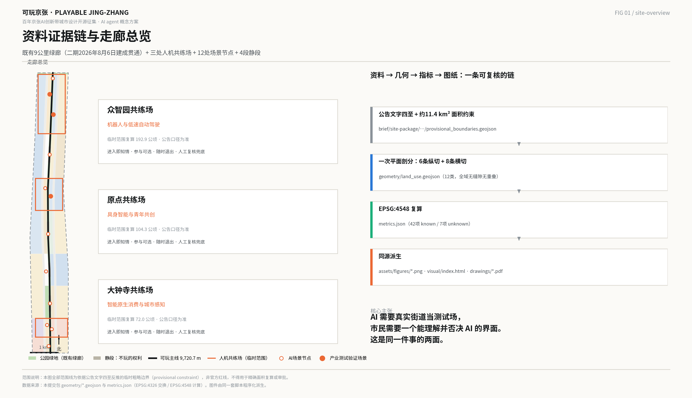
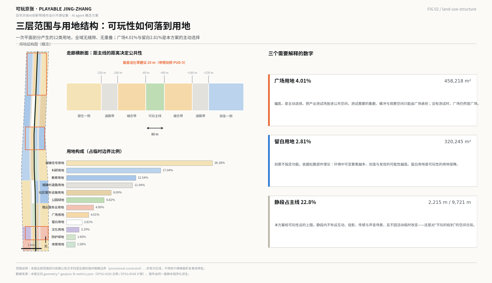
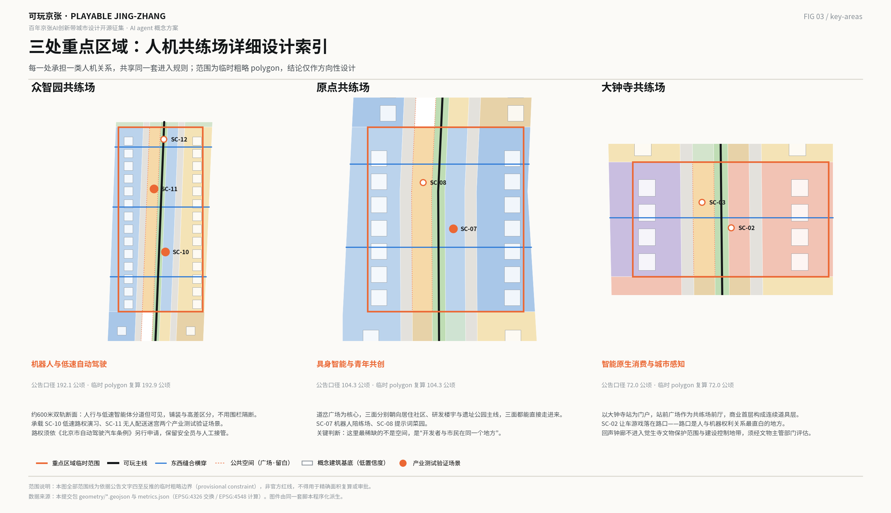
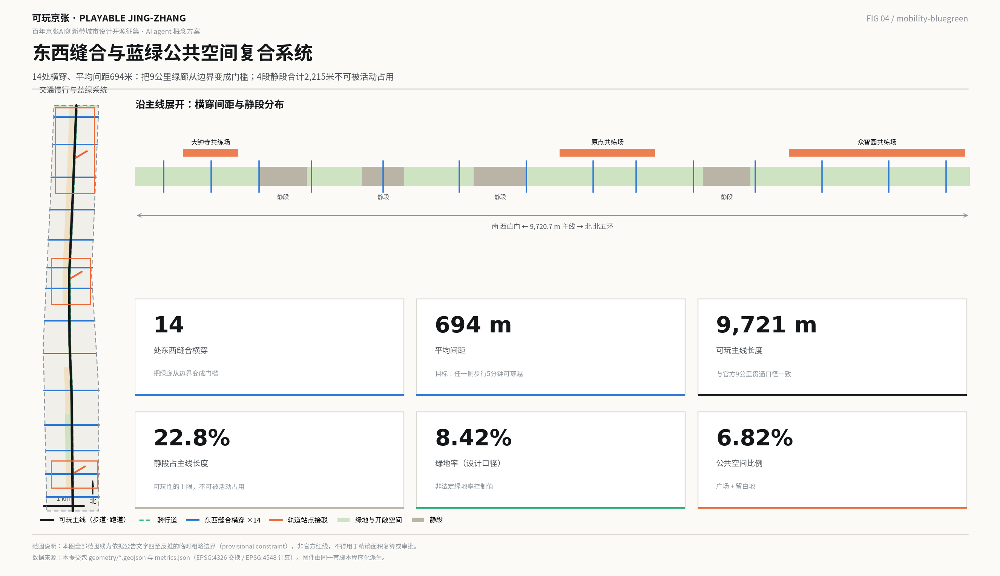
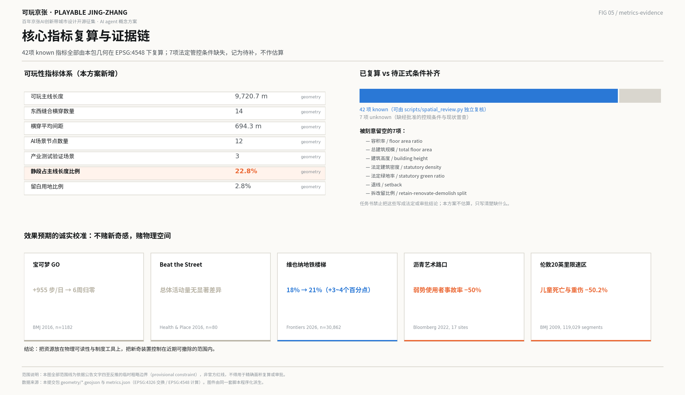

# 可玩京张 · PLAYABLE JING-ZHANG

**一条把产业测试场与公共空间合为一体的9公里人机共练带**

> 本方案全部内容为面向智能体开源征集的概念建议与参考方案，可供专业团队深化研究，不替代正式规划，不构成政府审定结论、工程可行性判断或实施承诺。

---

## 零、方案摘要

**一句话主张：AI 需要真实街道当测试场，市民需要一个能理解并否决 AI 的界面——这是同一件事的两面，而"玩"是目前唯一能同时满足两者的公共接口。**

传统只有两条路：把智能体关进封闭测试场，市民被排除在外；或者让智能体直接上路，市民被当成"障碍物"和"风险源"。可玩城市提供第三条：**把测试场放进公共空间，让市民以玩家而非障碍物的身份进入。** 这与海淀在 2026 年 7 月 24 日方案审查会上提出的"锚定人机共融实验场"方向同向 [source:HAIDIAN-REVIEW-20260724]。

**本方案的三个基本判断：**

1. **题目已经变了。** 京张铁路遗址公园二期于 2026 年 8 月 6 日建成开放，全线 9 公里贯通、约 53 公顷，配套林下剧场、大型儿童游乐区与球类运动场 [source:PARK-PHASE2-20260806]。绿廊不再是"要建的东西"，而是"已经建成、每天服务沿线约 45 万居民的界面"。因此本方案不再提出一轮新的土建，而是提出这条绿廊的**运营层与制度层**。

2. **可玩性不能靠倡议，必须靠工具。** 全球有真实公共界面的创新区，无一例外都有一个强制它的制度工具：剑桥市用分区条例规定首层活化比例与开敞空间下限 [source:KENDALL-PUD5-2013]；张江用规划把教育科研、居住、公共设施与绿地的用地比例写死 [source:ZHANGJIANG-PLAN-2017]；巴塞罗那用街道再分配把公共空间变成项目本身 [source:BARCELONA-22AT]。而创办于 1970 年、科研成果最丰厚的剑桥科技园没有这样的工具，55 年后也几乎没有公共界面 [source:CAMBRIDGE-SCIENCE-PARK]。本方案因此提出三个可执行工具：**留白用地、主线静段、首层活化带**。

3. **不赌新奇感，赌物理空间。** 一次性的新奇干预会迅速衰减：宝可梦 GO 让玩家日均多走 955 步，六周后回到基线 [source:BMJ-POKEMON-2016]；而改变街道物理可读性的干预是耐久的——沥青艺术路口在平均 33 个月的后评估期内，涉行人等弱势道路使用者的事故率下降 50%，司机主动让行提升 27% [source:ASPHALT-ART-2022]。本方案把预算与制度重心放在后者。

**核心成果：** 一带总体概念与命名体系、道岔 Logo 方向、三区两翼协同回路、7 个全球案例的可转化机制、12 张 AI 场景卡（含 3 个产业测试验证场景）、6 类用户画像、4 处 AI 朝圣地标与荣誉展示体系、京张—中关村—AI 三重文化叙事、年度活动与开发者社区长期运营机制，以及一套可复算的**可玩性指标体系**。

---

## 一、设计依据与资料清单

### 1.1 本方案站在什么材料上

本方案的空间与指标结论，只建立在三类材料上：仓库提供的公开资料包与公共来源登记表、可核验的官方与权威公开报道、以及本包自己从 provisional 边界复算出的几何与指标 [source:SITE-PACKAGE] [source:SOURCE-REGISTRY]。凡涉及具体建设强度、拆改留、道路线位与土地权属的结论，一律不作判断，只标注为待正式条件补齐 [standard:MOHURD-CONTROL-DETAILED-PLANNING]。

**必须先说清楚的一件事：本方案没有官方红线。** 征集公告以文字四至和面积描述界定三层范围，未公开精确 polygon；仓库提供的临时替代边界是依据公告文字四至、道路名称与面积约束反推的粗略走廊，用于生成、展示与自检，**不得作为官方红线、审批依据或精确面积复算依据** [data:geometry/site_boundary.geojson#SITE-001] [source:BOUNDARY-SOURCE]。本包所有面积与比例都带着这一限制，正式边界补齐后需按本包公式整体重算。

三处重点区域同样是临时粗略 polygon。它们的公告面积（192.1、104.3、72.0 公顷）是权威的，几何形状不是 [data:geometry/key_areas.geojson#PROV-KEY-001] [source:KEY-AREA-SOURCE]。因此本方案对重点区域的结论都写成"方向性设计"，不落到地块。

### 1.2 一条影响全局的新信息

**京张铁路遗址公园二期已于 2026 年 8 月 6 日建成开放。** 全线 9 公里贯通，约 53 公顷；南段"社区活力段"约 23.08 万平方米（西直门北京北站至知春路大运村），北段"自然休闲段"约 30.01 公顷（清华东路至北五环箭亭桥）；配套林下剧场、大型儿童游乐区、球类运动场与便民驿站。设计核心理念为"百年京张，焕活绿廊"，策略为"融、拆、退、补"，思路为"缝合城市、民生优先、遗址新生、生态集约"；直接服务沿线约 70 个社区、约 45 万居民、10 余所高校与 40 余家科研机构 [source:PARK-PHASE2-20260806]。一期（知春路至清华东路，约 2.4 公里、16.8 公顷）已于 2023 年 6 月 29 日全线开放，并入选 2023 年北京城市更新最佳实践 [source:PARK-PHASE1-20230629]。

这条信息把设计问题重写了。既有绿廊的骨架、断面与绿量已经落地，本方案若再提一轮"打造活力带"的土建方案，既重复投资，也回避了真正的难题：**一条已经建成的 9 公里公共空间，如何在 AI 时代产生新的公共价值。**

### 1.3 现状诊断：三个可被设计回应的缺口

**缺口一，绿廊仍然是一条"看的"空间，不是一条"用的"空间。** 二期已修通城市支路、拆除围墙护栏，缝合动作是真实的；但绿廊两侧的产业与研发功能与绿廊之间，目前仍以围墙、绿篱和管理边界为主，首层界面对公共空间基本封闭 [depth:existing_conditions_diagnosis]。

**缺口二，AI 在这条走廊上是不可感、不可议的。** 海淀 AI 要素密度极高——2026 年 3 月官方口径为人工智能企业超 2000 家、独角兽 26 家、备案大模型 130 款、核心产业规模超 3500 亿元、从业人员 9.5 万人 [source:HAIDIAN-AI-STATS-20260330]。但对沿线 45 万居民而言，这些密度几乎不产生任何可感知的日常界面。AI 的公共存在方式目前只有两种：手机里的应用，和新闻里的数字。

**缺口三，测试与生活是分离的。** 北京首批无人配送车路权是在**北京经开区（亦庄）高级别自动驾驶示范区**取得的，不在海淀 [source:BJ-DELIVERY-ROBOT-2021]；《北京市自动驾驶汽车条例》自 2025 年 4 月 1 日起施行，为道路测试与示范应用提供了法定通道，但要求安全员与人工接管兜底 [source:BJ-AV-REGULATION-2025]。也就是说：**制度通道已经存在，但真实、复杂、有行人的城市街道，仍然不是主流的验证场。** 这正是本方案要填的位置。

### 1.4 引用与生成方式披露

本方案由 AI agent 生成，使用的公开资料、生成方法、授权与限制记录在 `sources.json`；指标公式与复算路径记录在 `metrics.json`；任务覆盖、专业标准与设计深度分别记录在任务覆盖矩阵、专业标准矩阵与设计深度矩阵中 [standard:PROJECT-OFFICIAL-ANNOUNCEMENT] [depth:risk_missing_data]。正文只保留与判断直接相关的证据锚点，完整索引以结构化文件为准。

---

## 二、三层范围工作框架：三个尺度上的同一个问题

三层范围不是三张图纸的比例差别，而是同一个问题在三个尺度上的不同回答：**智能体进入城市时，人在什么位置？**

### 2.1 统筹研究范围（约 43.6 平方公里）：回答"关系"

统筹研究范围北至北五环路、东至京藏高速、南至西直门外大街、西至万泉河路 [source:OFFICIAL-ANNOUNCEMENT]。在这个尺度上，本方案不画用地，只回答一件事：京张这条带在首都乃至全球 AI 创新网络中，承担哪一段不可替代的职能。答案是**验证与对话**——把实验室成果与真实社会之间那一段最难的距离，变成一条可以反复走的公共通道 [depth:three_level_scope_framework]。

这一层的成果表达为产业与未来城市研究、创新生态图谱与协同关系，不涉及具体地块。

### 2.2 总体设计范围（约 11.4 平方公里）：回答"结构"

总体设计范围北至北五环路、东至学院路与西土城路等、南至西直门外大街、西至大钟寺东路与荷清路等，以京张遗址公园周边 1—2 公里的城市地区和产业区为界 [source:OFFICIAL-ANNOUNCEMENT]。本包复算的临时边界面积为 11,412,825 平方米，与公告约 11.4 平方公里口径相差约 0.11%，差值来自临时边界的粗略化 [metric:site_area_sqm]。

这一层达到控规深度的城市设计，回答空间结构、用地、交通、市政、蓝绿与风貌如何相互支撑，并给出可复算的指标体系 [depth:overall_spatial_structure]。

### 2.3 重点区域范围（约 368.4 公顷）：回答"体验"

三处重点区域自北向南为众智园 AI 自主创新加速区（约 192.1 公顷）、北京 AI 原点社区（约 104.3 公顷）、大钟寺 AI 产业集聚区（约 72.0 公顷），本包临时 polygon 复算合计 3,692,893 平方米，与公告 368.4 公顷相差约 0.24% [metric:key_detailed_design_area_sqm]。这一层回答具体的人在具体的空间里，怎样与具体的智能体相处。

### 2.4 provisional 边界的限制，以及补齐后要重算什么

临时边界是矩形化、折线化的粗略范围，其边不代表任何地块界线或道路红线。一旦官方 polygon 到位，以下内容必须整体重算：全部用地面积与比例、绿地率与公共空间比例、建筑基底与覆盖率、三处重点区面积、分期范围面积，以及本方案新增的全部可玩性指标 [data:geometry/site_boundary.geojson#SITE-001] [depth:metrics_recalculation]。重算路径已写入 `metrics.json` 的 `formula` 字段，可由 `scripts/spatial_review.py` 独立复核。

---

## 三、统筹研究范围产业与未来城市研究

### 3.1 一带总体概念与命名体系（回应 agent.1）

#### 主名与命名逻辑

**中文主名：可玩京张。英文主名：PLAYABLE JING-ZHANG。**

"可玩"（playable）不是"好玩"，更不是"游戏化"。可玩城市的原始定义来自英国布里斯托的 Watershed：把人与玩放在未来城市的核心，用技术把人与人、人与他们生活和工作的地方连接起来，让居民与访客能够重新配置和改写城市的服务、场所与故事 [source:WATERSHED-PLAYABLE-CITY]。它诞生时的锋芒是明确的：可玩城市的提出者主张要"庆祝城市生活的接缝，而不是抹平或修好它们"，这是对智慧城市"无缝"话术的直接反转 [source:REDDINGTON-2013]。

本方案取"可玩"，正是取这层含义：**京张不该被做成一个把 AI 打磨得毫无摩擦的展示面，而应该成为一个让摩擦被看见、被讨论、被玩的地方。**

"京张"取本名，不改造、不谐音。1909 年 9 月 24 日京张铁路建成，官方定性为"中国人自主设计和建造的第一条干线铁路，打破了'中国人不能自建铁路'的断言"；詹天佑用青龙桥的"人"字形展线，以长度换高度，破解爬坡难题 [source:JINGZHANG-HISTORY]。**"自主"这两个字，是 1909 年的京张与 2026 年的"AI 全栈自主创新体系"之间最短的一条线。** 命名不需要再发明一个概念，只需要把这条线接上。

#### 命名体系（可延展的完整层级）

| 层级 | 中文名 | 英文名 | 含义 |
| --- | --- | --- | --- |
| 一带 | 可玩京张 | PLAYABLE JING-ZHANG | 总体品牌，对接全球可玩城市网络 |
| 主线 | 可玩主线 | The Play Line | 9 公里遗址公园慢行脊，既是铁路线、也是关卡线 |
| 三区 | 众智园共练场 / 原点共练场 / 大钟寺共练场 | Training Grounds | 三处重点区域的机制名 |
| 两翼 | 中关村补给翼 / 小月河试炼翼 | Supply Wing / Proving Wing | 官方名称保留，叠加可玩系统角色 |
| 静段 | 静段 | Quiet Stretch | 主线上明确不可玩的段落 |
| 留白 | 留白地 | The Blanks | 不被功能定义的可玩余地 |
| 市民身份 | 京张玩家 | Players of Jingzhang | 市民不是用户，是玩家 |
| 场景 | 京张场景卡 | Jing-Zhang Scenario Cards | 可增补、可退役的场景单元 |
| 荣誉 | 玩家名录 | Players' Register | 贡献者荣誉展示体系 |

**"市民不是用户，是玩家"** 是本方案的身份主张。用户是被服务的对象，其反馈是可选的；玩家是规则的参与者，其行为直接改变系统。这一区分有理论支撑：Innocent 在《让智慧城市更可玩》中把可玩城市与智慧城市的关系概括为三种策略——对既有设施的**重新利用**（appropriation）、对**数据化**的回应（datafication）、以及**对话共创**（conversation），三者都以市民作为共同创造者而非服务对象 [source:INNOCENT-2020] [source:EAAD-PLAYABLE-CITY]。

#### Logo 与视觉识别方向：道岔

**图形母题：铁路道岔（The Switch）——一条主轨在一个点上分出两条去向。**

选择理由有三层，且三层互相咬合：

1. **它是京张自己的语言。** 道岔是铁路最基本的构件，也是京张遗址最直白的形式记忆，不需要向任何人解释来源。
2. **它是"选择"的图形。** 道岔的全部功能就是决定列车走哪一边。本方案的核心主张——市民对 AI 拥有选择权与否决权——可以被压缩成一个动作：**扳道**。每一次"玩"，都是市民在给这座城市扳一次道岔。
3. **它与"人"字形同构。** 两条轨迹从一点分开的形态，与青龙桥人字形展线的几何亲缘是直觉可读的；但道岔不是对人字形的复制，避免了与既有叙事的重复 [source:JINGZHANG-HISTORY]。

**延展系统：** 道岔符号可作为地面铺装的方向标记、场景卡的卡面骨架、荣誉名牌的底纹、活动视觉的分屏结构，以及导视系统中"此处有选择"的统一提示符。

**建议色板（技术、克制、可施工）：** 京张铁灰（构筑与铺装基色）、信号橙（铁路信号来源，用于"此处可参与"的唯一提示色）、校准蓝（用于公开评测与数据展示）、留白米（用于静段与留白地，明确"此处无提示"）。**关键规则：信号橙只用于可参与的地方，静段与留白地严禁出现信号橙。** 颜色本身承担告知义务。

**版权边界：** Logo 方向为概念建议，不含最终图形文件；正式落地须完成商标检索、字体授权与视觉规范编制，不得使用未清权的字体、图片、人物肖像或企业标识 [source:AGENT-TASKBOOK]。

### 3.2 三大定位、五大功能与三区两翼的协同回路

三大定位在本方案中不是三句并列的口号，而是一条闭合回路上的三个环节：

- **百年京张文化带**提供**意义**——道岔母题、1909 自主叙事、清华园车站的历史层积，回答"为什么是这里"。
- **都市 AI 生活体验带**提供**接口**——可玩主线、场景卡、静段与留白地，回答"市民怎么进入"。
- **AI 融合创新带**提供**产出**——三处共练场把公共空间里发生的真实交互，变成企业可用的验证数据与迭代依据，回答"产业得到什么"。

回路的方向是：意义把人吸引到接口上 → 接口把人的真实行为变成产出 → 产出反过来成为新的意义（"这条街教会了机器什么"）。任何一环断裂，另外两环都失效。这也是本方案反对把 AI 做成展示面的技术理由：**展示面只有单向输出，不构成回路。**

五大功能与三区两翼的对应关系如下 [source:AGENT-TASKBOOK]：

| 五大功能 | 主承载 | 空间机制 |
| --- | --- | --- |
| AI 全栈自主创新体系 | 众智园共练场 | 真实街道作为全栈自主体系的验证末端 |
| 世界级 AI 创新生态 | AI 原点社区共练场 | 开发者社区与玩家社区在同一空间合一 |
| AI+ 场景赋能新范式 | 小月河试炼翼 + 12 张场景卡 | 场景卡可增补、可退役的开放机制 |
| 智能化 AI 活力城市 | 可玩主线 + 14 处东西缝合横穿 | 让绿廊从屏障变成门槛 |
| AI 治理全球话语权 | 1909 校准塔 + 公开评测 | 用可复核的公共评测输出治理话语 |

### 3.3 七个全球案例，以及每个案例可转化的机制（回应 agent.2）

本方案挑选案例的标准不是名气，而是**公共界面的制度工具**：这个创新区靠什么强制自己对公众开放？

| # | 案例 | 关键可核验事实 | 可转化机制 |
| --- | --- | --- | --- |
| 1 | 剑桥肯德尔广场 / MIT（美国） | 剑桥市 1355 号条例设立 PUD-5 区：沿指定街道建筑首层前 20 英尺为"活化空间"，其中商业建筑活化空间新增建筑面积的至少 75% 须用于主动使用；全区公共可达开敞空间不低于 15% [source:KENDALL-PUD5-2013] | **用分区条例把首层活化与开敞空间比例写成可在许可阶段执行的硬指标**，而不是设计倡议 |
| 2 | 韩国板桥 Zero City | 판타G버스 自 2023 年 7 月起在 8.3 公里公共道路、11 个站点提供韩国首个自动驾驶公共交通服务，试运行期免费，日均约 200 人次、累计超 6.4 万人次；园区全部路段已完成专用通信网与无盲区监控 [source:PANGYO-ZEROCITY] | **测试场不在园区旁边，测试场就是园区的街道**；且以载客服务而非演示的形式面向公众 |
| 3 | 新加坡 one-north | 自 2015 年 7 月 6 公里起步，2017 年 6 月扩展至混合交通与住宅区（新增约 55 公里），2019 年 10 月扩至新加坡西部超 1000 公里公共道路；全程强制安全驾驶员、第三方责任险、车辆显著标识与实时监管，并须提前与所在社区基层组织沟通 [source:ONE-NORTH-JTC] | **封闭场地认证 → 逐级开放公共道路 → 社区提前告知**的三段式路权阶梯 |
| 4 | 日本柏之叶智慧城市 | 273 公顷，2005 年启动；2006 年 11 月成立柏之叶都市设计中心（UDCK）作为常设的公民—产业—学界平台，持续举办面向居民的"造町学校"等公共项目；原本封闭的蓄水区改造为向公众开放的 Aqua Terrace [source:KASHIWANOHA-ULI] | **常设三方治理机构**是公共界面得以长期存在的组织保障，而非一次性活动 |
| 5 | 上海张江科学城 | 2017 年建设规划设定教育科研用地不小于 21%、居住用地约 20%、公共设施与绿地不少于 16%；2025 年 3 月浦东第三批自动驾驶开放测试道路中，张江区域达 238 条、329.10 公里，按风险等级 Ⅰ—Ⅳ 分级 [source:ZHANGJIANG-PLAN-2017] [source:PUDONG-AV-ROADS-2025] | **用地比例 + 分级开放路网**的国内成熟组合，海淀不需要发明制度，只需要把它做得更细 |
| 6 | 巴塞罗那 22@ 与超级街区 | 22@ 于 2000 年 7 月设立，200 公顷，规划绿地 11.4 万平方米；超级街区 Sant Antoni 段经巴塞罗那公共卫生局前后对比评估，二氧化氮下降 14.57 µg/m³（约 25%）、PM10 下降 4.11 µg/m³（约 17%）、日间噪声下降 3.5 分贝 [source:BARCELONA-22AT] [source:ASPB-SUPERBLOCKS-2021] | **把街道空间从车辆手中依法收回**，并由公共卫生机构而非开发主体做效果评估 |
| 7 | 剑桥科技园（英国，反面参照） | 1970 年由三一学院创办，约 152 英亩，是英国最早的科技园；但其配套被明确定位为租户设施，可核验的面向公众活动仅有自 1989 年起的年度慈善跑 [source:CAMBRIDGE-SCIENCE-PARK] | **科研成功不会自动产生公共界面**。没有制度工具，55 年也长不出来 |

**从七个案例中读出的唯一规律：有真实公共界面的创新区，全都有一个强制它的具名工具**——一条分区百分比、一个常设三方机构、一份运营任务书、一组用地比例、一部街道再分配条例。本方案因此不把"开放共享"写成愿景，而是提出三件可以被写进文件、在许可阶段被检查的工具，见第七章。

### 3.4 适配 AI 的未来城市形态：从"无缝"到"有缝"

智慧城市的默认美学是无缝：系统在后台运行，市民无需知晓。可玩城市的主张相反：**接缝应当被看见，因为看不见的系统无法被同意，也无法被拒绝。**

落到空间上，"有缝"意味着三件具体的事 [depth:overall_spatial_structure]：

1. **智能体的工作要有物理痕迹。** 低速自动驾驶与配送机器人的行进带、等待区、避让点，应当在铺装上被明确画出来，像人行横道一样是公共可读的，而不是只存在于系统内部。
2. **失败要被展示，不只展示成功。** 公开评测的对象包括误识率、接管次数、投诉响应时长，展示在 1909 校准塔与场景节点上。
3. **拒绝要有具体位置。** 静段与留白地是"拒绝"的空间形式，见 3.5。

### 3.5 不玩的权利：本方案的自我约束

可玩城市在国际学术界受到过明确批评，本方案主动引用而不是回避 [source:CASTRO-SEIXAS-2021]：城市权与游戏权含义不同，前者远比后者宽广，**可能同时包含"不玩的权利"**；把公共空间过度游戏化，可能边缘化那些只想在城市里放松与沉思的人，也可能滑向被官方许可与控制的商业化休闲。

与之配套的另一条批评来自游戏研究者 Bogost：他把积分、徽章、排行榜式的"游戏化"称为营销话术，并提议用"剥削软件"（exploitationware）这一更准确的名称 [source:BOGOST-2011]。

**本方案据此设立两条硬约束：**

- **不做积分制。** 本方案不设排行榜、不设打卡积分、不设个人成就等级，不以行为数据换取奖励。可玩性来自空间的可占用性与规则的可改写性，不来自计分。
- **静段不可被活动占用。** 主线上划定 4 段静段，合计约 2,215 米，占主线长度约 22.8%；静段内不布设互动装置、投影、传感、声音场景与任何采集设备，且不因活动临时改变 [metric:quiet_spine_length_share] [data:geometry/constraints.geojson#QUIET-01]。

这两条不是补充说明，是方案成立的前提。一个不能被拒绝的公共空间，不是公共空间。

---

## 四、总体设计范围城市更新与控规深度城市设计

### 4.1 空间结构：一线、三场、两翼、五类可玩空间

总体空间结构为 **"一线串三场、两翼供给与试炼、五类可玩空间定落点"**。

**一线**：京张铁路遗址公园可玩主线，本包复算长度 9,720.7 米，与官方 9 公里全线贯通口径一致 [metric:playable_spine_length_m] [data:geometry/roads.geojson#ROAD-001]。主线不是景观轴，是**关卡序列**：从南门户到北门户，人可以反复走、每次遇到不同的东西。

**三场**：三处重点区域各自承担一类人机关系，见第五章。

**两翼**：中关村科技服务翼作为**补给翼**，提供算力、模型、资金、法务与合规的要素供给；小月河场景赋能翼作为**试炼翼**，承接尚不适合放在主线上的早期场景 [source:AGENT-TASKBOOK]。两翼的官方名称保留不改，只叠加系统角色。

**五类可玩空间**：本方案的空间定位不用"节点、廊道、片区"这类通用词，而采用 Stevens 在《游戏之城》中基于公共空间实地观察建立的五类可玩空间类型——**路径、交叉、门槛、边界、道具**，并据此判断每一处设计动作应当落在哪一类空间上 [source:STEVENS-2007]。

| 类型 | 在本走廊中的对应物 | 设计原则 |
| --- | --- | --- |
| 路径 Path | 9 公里主线、骑行道 | 保证连续、不打断；可玩性沿路径分布而非集中 |
| 交叉 Intersection | 14 处东西缝合横穿、道路用地与主线的相交处 | 交叉处是人机相遇最密集的地方，也是"让车游戏"等场景的落点 |
| 门槛 Threshold | 共练场入口、校城之间的界面、地铁接驳口 | 门槛承担告知义务：进入即知情 |
| 边界 Boundary | 绿廊东西两侧、居住段一侧、静段两端 | 边界决定"缝合"还是"阻隔"；本方案把边界当作可调节而非固定的东西 |
| 道具 Prop | 首层界面、城市家具、遗址构筑物、路侧设备 | 道具是最便宜的可玩性来源，优先重新利用既有物 |

**为什么用这套类型学：** 它把"东西缝合、南北连通"这个公告要求，从一句目标翻译成了可检查的空间判断——绿廊在哪些位置是边界（阻隔），需要用多少门槛（横穿）把它变成可穿越的东西 [depth:overall_spatial_structure]。

### 4.2 用地结构：可玩性如何落到用地

本包用地为**一次平面剖分**的结果：以临时走廊边界为底，沿中心线按米制偏移生成 6 条纵向切线（±40 米主线带、±160 米缝合带、±230 米道路带），叠加 8 条纬向切线（对应 9 个功能段），一次性 polygonize 后按用地代码归并。因此**所有相邻用地共享同一组坐标，全域无缝隙、无重叠**，不是各自独立勾画的多边形 [data:geometry/land_use.geojson#LU-001] [depth:land_use_layout]。

复算结果（临时边界口径）：

| 用地代码 | 用地名称 | 面积（m²） | 占比 | 在可玩系统中的角色 |
| --- | --- | ---: | ---: | --- |
| 0701 | 城镇住宅用地 | 3,011,057 | 26.38% | 边界：安静的一侧 |
| 0802 | 科研用地 | 1,945,070 | 17.04% | 道具：首层向公共空间开放 |
| 0804 | 教育用地 | 1,430,970 | 12.54% | 门槛：校城之间可穿越 |
| 1207 | 城镇村道路用地 | 1,362,152 | 11.94% | 交叉：机动车与低速智能体的交界面 |
| 0702 | 城镇社区服务设施用地 | 922,876 | 8.09% | 道具：社区服务与静区载体 |
| 1401 | 公园绿地 | 778,372 | 6.82% | 路径：可玩主线本身 |
| 05 | 商业服务业用地 | 559,400 | 4.90% | 道具：智能原生消费界面 |
| 1403 | 广场用地 | 458,218 | 4.01% | 交叉：共练场前厅 |
| 16 | 留白用地 | 320,245 | 2.81% | 松散部件：不被定义的余地 |
| 0803 | 文化用地 | 261,302 | 2.29% | 门槛：京张文化叙事入口 |
| 1402 | 防护绿地 | 183,047 | 1.60% | 边界：门户缓冲 |
| 0805 | 体育用地 | 180,137 | 1.58% | 道具：运动与机器人共练场地 |

两个数字需要主动解释，因为它们偏离常规：

**广场用地 4.01% 偏高，这是主动选择。** 458,218 平方米的广场集中在三处共练场前厅 [metric:civic_square_area_sqm]。原因是本方案把产业测试场放进了公共空间，测试需要的集散、缓冲与观察空间只能由广场承担。这是"公共空间即测试场"的用地代价，也是它的收益——广场在没有测试时仍然是广场。

**留白用地 2.81% 是刻意保留的。** 320,245 平方米不指定功能 [metric:reserved_land_ratio]。依据是 Nicholson 的松散部件理论：在任何环境中，创造性与发现的可能性，与环境中可变要素的数量和种类成正比 [source:NICHOLSON-1971]。固定用途的场地只支持一种玩法，留白支持无数种。**留白用地是可玩性的用地保障**，也是本方案对国土空间规划创新的具体建议：把"留白"从战略储备工具，扩展为公共生活的供给工具。

### 4.3 城市更新总体框架：不新建一条绿廊，只做三件事

既然二期已经建成，更新框架的重点从"建设"转向"接入"[depth:renewal_project_list]：

1. **接入首层。** 主线两侧的科研、商业、教育与社区服务建筑，首层界面由封闭改为可进入、可停留、可观看，成为可玩系统的"道具"层。
2. **接入横穿。** 补足东西向的穿越点，把绿廊从边界变成门槛，见 6.1。
3. **接入规则。** 把可玩性写进可执行的管控工具，见 7.3。

**不做的事同样重要：** 不提出拆改留的具体地块方案，不提出新的高强度开发，不对既有权属空间提出改造要求 [source:AGENT-TASKBOOK] [standard:MOHURD-CONTROL-DETAILED-PLANNING]。

### 4.4 城市风貌：技术性的、克制的、可施工的

风貌基调建议为**"铁路技术美学 + 校园尺度 + 克制的智能标识"**。三条具体原则：

- **不做未来主义外观。** 智能不通过造型表达，通过行为与信息表达。避免流线型、发光曲面、科幻装饰这类把 AI 符号化的手法。
- **智能设备统一为可识别的家族。** 路侧感知、低速车辆、机器人、告示牌采用统一的形式语言与信号橙标识，让"这是一台机器"在任何距离上都可读——这与新加坡要求测试车辆显著标识的做法同源 [source:ONE-NORTH-JTC]。
- **遗址构件优先保留其粗粝质感。** 铁轨、道砟、信号构件是走廊的性格来源，不做美化性替换 [depth:height_massing_character]。

---

## 五、重点区域详细设计

三处重点区域在本方案中各自是一个**人机共练场（Mutual Training Ground）**。三者共享同一套进入规则，承担不同的人机关系。

**共享的进入规则（四条，适用于全部三场）：**

1. **进入即知情。** 入口设告示：此处有什么系统在运行、采集什么、由谁运营、如何退出、向谁投诉。
2. **参与是可选的。** 不参与不影响通行，不参与不减少服务。
3. **随时可退出。** 场景可绕行，绕行路径与主路径同等舒适，不设"惩罚性绕行"。
4. **人工复核兜底。** 任何涉及人的判断都可申请人工复核，复核时限公开 [data:geometry/constraints.geojson#AIZONE-ZHONGZ]。

### 5.1 众智园 AI 自主创新加速区：机器人与低速自动驾驶共练场

**定位。** 官方对该片区的定位是"更具智慧型与未来感的花园型人工智能创新街区"[source:OFFICIAL-ANNOUNCEMENT]；片区内中关村东升科技园学北园总建筑面积约 23.83 万平方米，地铁昌平线学知园站与园区楼宇地下一层无缝连通，步行约 3 分钟 [source:XUEBEI-PARK-2026]。本方案在此叠加的角色是：**全栈自主创新体系的最后一公里验证场。** 本包临时 polygon 面积 1,929,202 平方米 [metric:key_area_zhongzhiyuan_ai_acceleration_area_sqm]。

**空间结构。** 以主线为轴，西侧缝合带布设共练场前厅广场，东侧为科研首层活化带；园区与主线之间设 3 处横穿。共练场核心是一条约 600 米的**双轨断面**：人行与低速智能体分道但可见，中间用铺装与高差区分而不用围栏隔断——**看得见彼此，才谈得上共处。**

**建筑更新。** 首层界面由封闭改为可进入；建议底层设"机器人停靠与充电位"作为公共可见设施而非后勤设施。不提出拆改留结论，不给出容积率与建筑高度判断 [depth:retain_renovate_demolish]。

**交通慢行。** 学知园站接驳线为主要进入路径 [data:geometry/roads.geojson#ROAD-T03]；低速车辆在共练场内的路权与人行优先关系，须依《北京市自动驾驶汽车条例》另行申请，并保留安全员与人工接管 [source:BJ-AV-REGULATION-2025]。

**AI 场景。** 承载 SC-10 低速路权演习、SC-11 无人配送迷宫两个产业测试验证场景，以及 SC-12 北门户扳道站。

**实施风险。** 该片区在 2026 年 3—4 月官方与主流媒体报道中称为"学北园 AI 自主创新加速区"，5 月正式征集公告称"众智园 AI 自主创新加速区"，未见解释更名原因的公开材料。本方案以征集公告为准，同时记录这一不一致 [source:OFFICIAL-ANNOUNCEMENT]。

### 5.2 北京 AI 原点社区：具身智能与青年共创共练场

**定位。** 原点社区位于东升镇与五道口一带，东至王庄路及展春园西路，西至中关村大街，北临清华大学，南抵北四环西路，辐射周边约 3 平方公里；2026 年 1 月 5 日入选北京首批人工智能创新街区，定位"创新策源、创业首选"[source:AI-ORIGIN-COMMUNITY-2026] [source:AI-INNOVATION-BLOCK-20260105]。官方对该片区的整体定位是"更具人才吸引力、创新活力、科技成果转化能力的近校型人工智能创新街区"[source:OFFICIAL-ANNOUNCEMENT]。本包临时 polygon 面积 1,043,237 平方米 [metric:key_area_beijing_ai_origin_community_sqm]。

**本方案的关键判断：原点社区最稀缺的不是空间，是"开发者与市民在同一个地方"。** 官方报道显示东升镇科创企业中 25—35 岁青年占比超过 70%，社区内已有原点学堂等开放式工位与大模型生态服务站 [source:AI-ORIGIN-COMMUNITY-2026]。但开发者社区与居民社区目前基本不重叠。共练场的作用是把两者放进同一个院子。

**空间结构。** 以**道岔广场**为核心（见 9.2），广场三面分别朝向：居住社区、研发楼宇、遗址公园主线。三面都能直接走进来，没有门禁。广场北侧设提示词菜园（SC-08），西侧设机器人陪练场（SC-07）。

**建筑更新与公共空间。** 建议以首层界面改造为主，重点是把研发楼宇朝向广场的一面做成"可观看的工作面"——玻璃、可开启、有座位。不涉及权属空间的改造要求 [depth:three_key_area_detailed_design]。

**AI 场景。** SC-07 机器人陪练场（产业测试验证场景之一的候选深化对象）、SC-08 提示词菜园；对接《北京具身智能科技创新与产业培育行动计划（2025—2027 年）》提出的规模化应用场景需求 [source:BJ-EMBODIED-AI-2025]。

**实施风险。** 官方口径中该社区的企业数量在不同来源与时点分别为 300 多家、400 多家、439 家，统计口径不一致；本方案不使用单一数字作为设计依据 [source:AI-ORIGIN-COMMUNITY-2026]。

### 5.3 大钟寺 AI 产业集聚区：智能原生消费与城市感知共练场

**定位。** 官方定位为"更具世界影响力、城市发展活力的城市型人工智能创新街区"，范围指向大钟寺地铁站所在路口四象限 [source:OFFICIAL-ANNOUNCEMENT]。本包临时 polygon 面积 720,454 平方米 [metric:key_area_dazhongsi_ai_industry_cluster_sqm]。

**空间结构。** 以大钟寺站为门户，站前广场作为共练场前厅；商业界面沿主线东侧展开，形成"智能原生消费"的连续道具层。核心场景是路口本身——SC-02 让车游戏落在这里，因为**路口是城市里人与机器权利关系最直白的地方。**

**文化接口。** 大钟寺古钟博物馆（觉生寺）始建于清雍正十一年（1733 年），1996 年 12 月被国务院公布为全国重点文物保护单位，博物馆于 1985 年 10 月 5 日成立开放 [source:DAZHONGSI-MUSEUM]。**本方案的回声钟廊（见 9.2）不进入文物保护范围与建设控制地带**，其声压、时段与形式须经文物、环保与属地主管部门评估后方可深化。

**AI 场景。** SC-02 让车游戏、SC-03 感知可视墙。

**实施风险。** 大钟寺中坤广场自 2020 年起完成老旧楼宇改造并引入企业办公 [source:DAZHONGSI-ZHONGKUN]，本方案不对既有商业物业提出改造要求，仅建议首层界面在业主自愿前提下参与场景开放。

---

## 六、交通、轨道、市政与公共服务设施

### 6.1 东西缝合：把绿廊从边界变成门槛

一条 9 公里的线性公园，天然既是连接也是阻隔。二期已修通城市支路、拆除围墙护栏，缝合工作有实质进展 [source:PARK-PHASE2-20260806]。本方案在此基础上提出**14 处东西缝合横穿**，平均间距约 694 米，目标是让绿廊任一侧的居民步行 5 分钟内可以穿越到另一侧 [metric:stitch_crossing_count] [metric:stitch_crossing_mean_spacing_m] [data:geometry/roads.geojson#ROAD-X01]。

横穿的设计要点不是数量，是**它们同时是场景落点**。SC-04 缝合跳格就落在横穿上：穿越本身被做成一件值得做的事，而不只是通过。这是"路径—门槛"关系的直接应用 [source:STEVENS-2007]。

**边界声明：** 横穿位置为概念建议断面，不构成道路红线、线位或工程可行性结论；实际可行性须由专业团队结合现状管线、权属与交通组织另行论证 [depth:traffic_rail_slow_parking]。

### 6.2 轨道接驳

主线沿线主要接驳关系为大钟寺站（13 号线）、五道口与清华东路西口一带、学知园站（昌平线）[data:geometry/roads.geojson#ROAD-T01]。13 号线自 2002 年 9 月西段试运营，2003 年 1 月全线贯通，日均客流由 2003 年约 6 万人次增长至 2024 年最高约 160 万人次，目前正拆分为 13A、13B [source:METRO-LINE13]。接驳设计的重点是把出站口到主线的这段路，做成共练场的门槛而不是通道。

### 6.3 低速智能体的路权：一条可执行的三段式阶梯

本方案不主张"直接上路"，而是建议采用新加坡验证过的三段式路权阶梯，并与北京现行制度对接 [source:ONE-NORTH-JTC] [source:BJ-AV-REGULATION-2025]：

1. **封闭段认证。** 在共练场内划定封闭或半封闭段落完成基础能力验证。
2. **限时开放。** 在共练场公共段落限定时段、限定速度开放，全程安全员在场，车辆显著标识。
3. **常态运行。** 经评估后进入常态，但保留人工接管与投诉响应，并**提前向沿线社区告知**。

第三步的"提前告知"不是礼貌，是新加坡把它写进制度的做法：陆路交通管理局明确会在测试进入某选区前，提前与当地基层组织沟通 [source:ONE-NORTH-JTC]。

**必须明确的事实：** 北京首批无人配送车路权在经开区示范区取得，海淀不在其列 [source:BJ-DELIVERY-ROBOT-2021]。本方案关于低速车辆的全部内容均为概念建议，须依法另行申请，不构成已批准运营。

### 6.4 市政与新型基础设施

新型基础设施建议以**"可复用、可退役、可解释"**为原则：路侧感知设备优先复用既有灯杆与标识杆，避免新增杆件；每一处设备设可扫码查询的公开档案（用途、采集范围、责任主体、保留期限）；退役设备须物理移除而非仅断电 [depth:municipal_new_infrastructure]。端侧算力与分布式能源的具体容量测算，缺市政承载条件资料，记为待确认 [metric:total_floor_area_sqm]。

### 6.5 公共服务：儿童友好是本方案的政策接口

海淀区已入选第三批国家儿童友好城市名单 [source:HAIDIAN-CHILD-FRIENDLY-2024]；国家层面《关于推进儿童友好城市建设的指导意见》确立了"1 米高度看城市"的规划视角，要求建设社区儿童之家等公共空间与儿童游戏角落 [source:CHILD-FRIENDLY-2021]。海淀区规划的五处"童悦空间"中，**"学院路—中关村"一处正落在本走廊上** [source:HAIDIAN-CHILD-FRIENDLY-2024]；而二期已建成大型儿童游乐区 [source:PARK-PHASE2-20260806]。

**这不是巧合，是同一件事的两个说法。**"1 米高度看城市"就是中文语境里的"让城市可玩"，且带国家政策背书。本方案建议将可玩主线的建设与运营，直接纳入海淀儿童友好城市建设的工作口径，避免另起炉灶。

---

## 七、用地、建筑规模与拆改留方案

### 7.1 用地布局逻辑

用地布局的组织逻辑不是功能分区，而是**距主线的距离**：越靠近主线，公共性越强、首层越开放；越远离主线，越回归常规城市功能与安静。六条纵向切线（±40 米、±160 米、±230 米）就是这条梯度的空间表达 [data:geometry/land_use.geojson#LU-005] [depth:land_use_layout]。

### 7.2 建筑规模：只给概念量级，不给管控结论

本包概念建筑基底面积 1,207,974 平方米，占临时边界的 10.58% [metric:building_footprint_area_sqm] [metric:building_coverage_design_ratio]。**这是从几何复算出的概念设计量，不是法定建筑密度，也不是已确定的建设规模。**

以下管控指标在本包中一律记为待正式条件补齐，不作估算 [depth:development_intensity_controls]：容积率、总建筑规模、建筑高度、法定建筑密度、法定绿地率、退线，以及现状建筑的保留/改造/拆除/新建比例 [metric:floor_area_ratio] [metric:building_height_m]。原因有二：一是公开资料中不存在经批准的控规条件与官方边界；二是面向智能体的任务书明确禁止把容积率、建筑高度、建筑强度或具体拆改留写成法定规划、审批或工程实施结论 [source:AGENT-TASKBOOK]。

### 7.3 三个可执行的可玩性管控工具（本方案的规划创新建议）

这是本方案对"国土空间规划创新"的具体回答。三个工具都参照已有实践，均可在许可阶段被检查，且都不需要新的法律授权：

**工具一：首层活化带（参照剑桥 PUD-5）。** 建议在可玩主线两侧划定深度约 20 米的"活化带"，带内新建或改造商业与科研建筑的首层，其活化带内建筑面积的一定比例（建议以 75% 为讨论起点）用于向公共空间开放的主动使用。剑桥市 1355 号条例正是以这一结构，把公共界面从设计倡议变成了许可条件 [source:KENDALL-PUD5-2013]。

**工具二：留白用地下限。** 建议在控规层面为走廊设定留白用地比例下限。本包复算值为 2.81% [metric:reserved_land_ratio]。留白不是未安排，而是**明确安排为不指定用途**，其管理主体、维护责任与使用申请规则需一并规定。

**工具三：静段长度下限。** 建议规定主线中不可布设互动、感知与声音场景的段落长度不低于某一比例。本包复算值为主线长度的 22.8% [metric:quiet_spine_length_share]。这条工具的作用是**给可玩性设上限**——把"不玩的权利"从伦理主张变成一条可以被丈量、被检查的线 [source:CASTRO-SEIXAS-2021]。

三个工具的共同点：它们规定的是**空间与界面的可用性**，不规定内容。内容随时代变化，可用性不变。

---

## 八、蓝绿空间、公共空间与城市风貌

### 8.1 绿地与公共空间复算

本包复算绿地与开敞空间面积 961,419 平方米，绿地率（设计口径）8.42%；其中公园绿地 778,372 平方米即可玩主线本身，防护绿地 183,047 平方米分布于南北门户与三环沿线 [metric:green_space_area_sqm] [metric:green_ratio] [data:geometry/green_space.geojson#GREEN-001]。公共空间面积 778,463 平方米，占比 6.82%，由共练场前厅广场与可玩留白地两部分构成 [metric:public_space_ratio]。

**这些数字的设计含义：** 绿地率支撑的是人才与居民的日常生活质量；公共空间比例支撑的是创新交往——一个开发者和一个居民有多大概率在非工作场合相遇，取决于走廊上有多少不需要理由就能停留的地方。公告提到的清河、小月河等蓝绿资源，因缺少可用的公开精确水系数据，本包未纳入几何图层，记为待补 [depth:blue_green_public_space]。

### 8.2 AI 公共空间与智能原生新业态（回应 agent.4）

**AI 公共空间的定义（本方案）：** 一处公共空间之所以是"AI 公共空间"，不在于它部署了多少智能设备，而在于**它是否让人对智能拥有可行使的权利**——知情、参与、退出、复核、拒绝。据此，静段同样是 AI 公共空间，因为"此处无采集"本身就是一项被明确行使的权利。

**智能原生新业态的空间条件（以大钟寺为例）：** 不是把机器人放进商场，而是把商业首层做成**可被机器人和人同时使用的界面**——统一的门槛高度、可通行的宽度、可被机器读取的标识、以及给人的座位。业态创新的前提是空间的双可用性。

### 8.3 公共空间组件库

为便于专业团队深化与后续复用，本方案建议建立**可玩京张公共空间组件库**，先期包含六类：

1. **道岔标记**（地面）——方向与选择的统一符号，也是场景入口提示。
2. **共处铺装**（地面）——人行与低速智能体分道但可见的断面做法。
3. **告知牌**（立面/独立）——进入即知情的标准信息结构：运行什么、采集什么、谁负责、如何退出、如何投诉。
4. **松散部件箱**（留白地）——可移动坐具、板材、轮子、绳索的社区共管储备。
5. **静段标识**（地面/立面）——留白米色系，无信号橙，明确"此处无提示"。
6. **玩家名牌**（铺装嵌件）——荣誉展示体系的基本单元，见 9.3。

组件库为概念建议，尺寸、材料、无障碍与安全性能须由专业团队按现行规范深化 [standard:MOHURD-URBAN-DESIGN-MEASURES]。

---

## 九、AI 创新生态、人才画像与 AI+ 场景

### 9.1 六类用户画像

画像不按年龄或职业分，按**他们与智能体的关系**分。这是本方案的分类依据：同一个人在不同时刻可能属于不同画像。

| # | 画像 | 规模线索 | 他们要什么 | 他们怕什么 | 空间对应 |
| --- | --- | --- | --- | --- | --- |
| P1 | 穿越者（通勤与路过） | 沿线约 70 个社区、约 45 万居民 [source:PARK-PHASE2-20260806] | 不被耽误，路径连续 | 被机器挡路、被迫绕行 | 主线、14 处横穿 |
| P2 | 照护者（带娃与陪老） | 海淀为第三批国家儿童友好城市 [source:HAIDIAN-CHILD-FRIENDLY-2024] | 孩子能自由跑、视线可及 | 低速车辆与儿童动线冲突 | 儿童游乐区、共练场前厅 |
| P3 | 青年开发者与创业者 | 东升镇科创企业 25—35 岁占比超七成 [source:AI-ORIGIN-COMMUNITY-2026] | 真实场景、真实数据、真实反馈 | 场景申请流程不透明 | 原点共练场、提示词菜园 |
| P4 | 高校学生与研究者 | 沿线 10 余所高校、40 余家科研机构 [source:PARK-PHASE2-20260806] | 可参与的公开实验 | 被当作免费数据来源 | 校城门槛、公开评测 |
| P5 | 银发居民 | —— | 安静、可坐、可预期 | 噪声、光污染、被拍摄 | 静段、留白地 |
| P6 | 企业测试工程师 | 海淀 AI 从业人员约 9.5 万人 [source:HAIDIAN-AI-STATS-20260330] | 合规、可重复、可记录的场地 | 责任边界不清 | 三处共练场、路权阶梯 |

**P5 是本方案的否决者。** 一个可玩城市方案如果不能让 P5 满意，它就没有资格谈公共性。静段与留白地首先是为 P5 设计的 [source:CASTRO-SEIXAS-2021]。

### 9.2 十二张 AI 场景卡

每张场景卡都标注：**落点 · 玩法类型 · 技术策略 · 数据与隐私边界 · 人工复核 · 运营主体 · 退役条件**。玩法类型采用 Caillois 的四类划分——竞争（agôn）、机遇（alea）、扮演（mimicry）、眩晕（ilinx）——以及自由玩（paidia）一端 [source:CAILLOIS-1961]；技术策略采用 Innocent 的三分——重新利用、数据转化、对话共创 [source:INNOCENT-2020]。

**为什么用这两套分类而不是"AI+交通、AI+医疗"：** 后者是按行业分的，同一行业里可以既有好场景也有坏场景；前者是按**人在其中做什么**分的，直接暴露一个场景是在邀请人参与，还是在采集人。

| 卡号 | 名称 | 落点 | 玩法 | 策略 | 数据与隐私边界 | 退役条件 |
| --- | --- | --- | --- | --- | --- | --- |
| SC-01 | 京张暗号·路灯回声 | 南门户段 | 扮演 | 重新利用 | 仅用既有市政编号，无人脸、无位置留存；文本内容 30 天自动清除 | 参与量连续 3 月低于阈值 |
| SC-02 | 让车游戏·大钟寺路口 | 大钟寺共练场 | 竞争 | 重新利用 | 路口既有信号数据，不新增采集；不识别个人 | 交通组织评估不通过即停 |
| SC-03 | 看得见的算法·感知可视墙 | 大钟寺共练场 | 扮演 | 数据转化 | 实时展示但不留存；展示对象为系统状态而非行人身份 | 展示内容失去可解释性即停 |
| SC-04 | 缝合跳格·东西横穿 | 三环缝合段 | 眩晕 | 重新利用 | 无采集，纯物理涂装与构件 | 铺装磨损或安全评估不通过 |
| SC-05 | 留白市集·松散部件库 | 高校界面段留白地 | 自由玩 | 对话共创 | 无采集；借还记录仅保留在社区自管台账 | 社区自治主体退出 |
| SC-06 | 夜跑影子·遗址步道 | 知春路段 | 眩晕 | 数据转化 | 红外轮廓不成像、不识别身份、不落盘 | 无法证明不可识别即停 |
| SC-07 | 机器人陪练场·原点社区 | 原点共练场 | 竞争 | 对话共创 | 参与者自愿登记；训练数据须获明示同意并可撤回 | 同意机制失效即停 |
| SC-08 | 提示词菜园·公共语料园 | 原点共练场 | 自由玩 | 对话共创 | 公共语料公开可查；不收录个人信息 | 语料出现权属争议 |
| SC-09 | 校城接力·清华东路门槛 | 五道口段 | 竞争 | 重新利用 | 无个人数据；仅统计通过量 | 校方或属地不再共办 |
| **SC-10** | **低速路权演习·众智园** | 众智园共练场 | 竞争 | 对话共创 | **产业测试验证场景**：车辆数据由测试主体保管，公共侧仅展示聚合指标 | 安全评估不通过或许可到期 |
| **SC-11** | **无人配送迷宫·测试验证** | 众智园共练场 | 机遇 | 数据转化 | **产业测试验证场景**：路径与避障数据用于验证，行人影像不留存 | 同上 |
| **SC-12** | **北门户扳道·选择投票站** | 北门户段 | 机遇 | 对话共创 | 投票匿名、结果公开、不绑定身份 | 结果不被采纳达两次即重新设计 |

场景节点合计 12 处，其中产业测试验证场景 3 处，满足任务书不少于 10 张场景卡与不少于 3 个测试验证场景的要求 [metric:scenario_node_count] [metric:industry_test_scenario_count] [data:geometry/public_space.geojson#SC-07]。

**三个产业测试验证场景的额外说明。** SC-10、SC-11、SC-07 涉及低速自动驾驶、无人配送与具身智能机器人。三者均为概念建议，须依《北京市自动驾驶汽车条例》及相关规定另行申请许可，保留安全员与人工接管，**不构成已批准运营** [source:BJ-AV-REGULATION-2025]。其技术方向可对接《北京具身智能科技创新与产业培育行动计划（2025—2027 年）》提出的规模化应用要求 [source:BJ-EMBODIED-AI-2025]。

**所有场景卡共同遵守的四条禁止：** 不做人脸识别用于个人身份关联；不做无法人工复核的自动判定；不以参与为获得公共服务的条件；不把未成熟技术描述为已可全面部署 [source:AGENT-TASKBOOK]。

### 9.3 AI 朝圣地标与荣誉展示体系（回应 agent.4）

海淀在 2026 年 7 月的最新表述中，明确希望这条带成为世界级人工智能产业高地及**朝圣地** [source:HAIDIAN-REVIEW-20260724]。本方案对"朝圣地"的理解是：**朝圣地不是最好看的地方，是最值得反复来的地方。** 因此四处地标都以"可参与"而非"可观看"为设计前提。

**地标一：道岔广场 The Switch Square（原点共练场）。** 广场中央为一具真实可扳动的大尺度道岔装置。每一次扳动改变广场当日的运行规则——照明模式、声音场景、低速车辆的通行权。规则变化公开、可预期、可回滚。**朝圣的动作是：亲手给城市扳一次道岔。**

**地标二：1909 校准塔 The Calibration Tower（众智园北门户）。** 以 1909 年京张自主建成为叙事母题的垂直地标 [source:JINGZHANG-HISTORY]。塔身是一块公共校准板，展示当日走廊内公开评测的结果：低速车辆接管次数、场景误识率、投诉响应时长。市民可现场提交一个"挑战样本"，看系统是否被难倒，结果当场上板。**它把"AI 治理话语权"从会议室搬到街上——话语权来自可复核的公开记录。**

**地标三：回声钟廊 The Echo Bell Colonnade（大钟寺共练场）。** 呼应大钟寺的声音母题。廊内每一次人与机器的成功协作触发一次极轻的钟声，未完成则静默。它把"人机协作质量"变成一个可听的城市指标。**明确边界：钟廊不进入觉生寺文物保护范围与建设控制地带，声压、时段与形式须经文物、环保与属地主管部门评估** [source:DAZHONGSI-MUSEUM]。

**地标四（荣誉展示体系）：玩家名录 Players' Register（贯穿全线）。** 沿主线铺装嵌入贡献者名牌——个人、社区团队、开源项目、参与共创的智能体，均可留名，可增补、可查询。做法参照鹿特丹 Luchtsingel：一座 400 米人行桥由市民以每块约 25 欧元认捐木板的方式众筹建成，共 17,000 块木板，每块可刻上认捐者的话 [source:LUCHTSINGEL]。**荣誉体系的价值不在表彰，在于让"这条街是我们一起做的"成为一件物理上可验证的事。**

### 9.4 AI 创新生态的要素支撑（回应 agent.2）

本方案不重复罗列产业政策，只指出**可玩系统与既有要素机制的三个接口**：

- **算力与模型接口。** 海淀已落地亿元级模型券，两个平台各 5000 万元额度，模型调用费用最高抵扣 50%，单家企业最高可省 200 万元，且补贴嵌入交易环节自动抵扣、免于逐笔申报 [source:HAIDIAN-MODEL-VOUCHER-2026]。建议将"在共练场完成一次公开场景验证"作为模型券、算力券的加分或加速通道，把公共验证变成企业的理性选择而非公益负担。
- **场景开放接口。** 中关村科学城已提出人工智能全景赋能行动计划，明确以创新街区为主阵地 [source:ZGC-AI-ACTION-2024]。建议共练场作为场景开放的**标准化申请入口**：一套申请表、一套评估清单、一套公示流程、一套退役规则。
- **数据接口。** 共练场产生的公共侧数据（聚合的通行、参与、投诉、协作成功率）建议全部公开，企业侧数据由测试主体自持。**公私分界线画在"是否可识别个人"上，而不是画在"是谁采集的"上。**

---

## 十、更新项目清单、实施政策与分期计划

### 10.1 更新项目清单（概念建议）

| 编号 | 项目 | 类型 | 空间位置 | 依赖条件 | 建议实施主体 |
| --- | --- | --- | --- | --- | --- |
| R-01 | 三处共练场前厅广场改造 | 公共空间 | 三处重点区域 | 属地与权属同意 | 属地政府 + 园区运营方 |
| R-02 | 14 处东西缝合横穿补足 | 交通慢行 | 主线全段 | 现状管线与交通组织论证 | 交通与园林主管部门 |
| R-03 | 主线两侧首层活化带试点 | 建筑界面 | 主线两侧 20 米 | 业主自愿 + 管控工具落地 | 业主 + 规划主管部门 |
| R-04 | 4 段静段划定与标识 | 公共空间 | 主线 4 段 | 沿线居民意见征询 | 属地政府 |
| R-05 | 留白地设立与社区共管 | 公共空间 | 高校界面段、五道口段 | 管理主体明确 | 社区自治组织 |
| R-06 | 12 张场景卡分批上线 | 场景运营 | 12 处节点 | 逐项合规审查 | 场景运营方 + 主管部门 |
| R-07 | 4 处朝圣地标概念深化 | 地标 | 三处共练场 + 全线 | 专业团队深化、文物评估 | 设计单位 |
| R-08 | 公开评测与校准机制建立 | 治理机制 | 1909 校准塔 | 评测标准共识 | 第三方评测机构 |
| R-09 | 组件库编制与开源发布 | 标准工具 | —— | 版权与规范审查 | 设计单位 + 开源社区 |

全部项目为概念建议，不构成投资、审批、招商或实施承诺 [depth:renewal_project_list]。

### 10.2 分期计划

| 分期 | 范围 | 复算面积 | 内容 |
| --- | --- | ---: | --- |
| 近期 | 三处共练场所在段 | 4,247,277 m² | 共练场原型试运行，全部装置可逆、可撤除 [metric:phase_area_phase_1_sqm] |
| 中期 | 缝合段与留白段 | 4,965,606 m² | 横穿补足、留白地投入社区共管 [metric:phase_area_phase_2_sqm] |
| 远期 | 南北门户与高校界面段 | 2,199,963 m² | 门户地标与校城界面接入全线 [metric:phase_area_phase_3_sqm] |

**近期分期的关键约束是"可逆"。** 第一年内的所有场景装置必须能在一周内完全撤除并恢复原状。理由是本方案自己引用的证据：新奇效应会衰减，而衰减后留下的固定装置就是垃圾 [source:BMJ-POKEMON-2016]。**先证明有人用，再考虑做成永久的。**

### 10.3 全球活动体系与长期运营（回应 agent.6）

**年度活动体系（三层，建议）：**

1. **扳道日 SWITCH DAY（年度，1 天）。** 全线主要场景的规则在这一天由公众投票决定并即时生效。它是道岔品牌的年度仪式，也是 SC-12 的年度放大版。
2. **共练周 SPARRING WEEK（年度，1 周）。** 企业把最新的低速智能体、机器人与具身智能带到共练场，接受市民而非评委的检验；公开评测结果当周上板。
3. **可玩城市全球对话 PLAYABLE CITY DIALOGUE（年度，2 天）。** 与中关村论坛错峰或并轨。2026 年中关村论坛年会于 3 月 25 日至 29 日举办，有 100 多个国家和地区、上千名嘉宾、60 场平行论坛 [source:ZGC-FORUM-2026]，建议不另起炉灶，而作为其中一个面向公共空间的平行板块。

**开发者社区运营机制。** 借鉴 UN-Habitat 与 Mojang 的 Block by Block：以游戏为参与式设计工具，已在 87 个城市完成 135 个公共空间干预项目，3 万名市民参与数字化工作坊，影响 180 万居民，基金会已向 UN-Habitat 投入超过 600 万美元 [source:BLOCK-BY-BLOCK-2021]。其三阶段方法（筹备 → 2—3 天共创工作坊 → 专业团队整合并落地建设）可直接移植为共练场的场景共创流程。**关键是第三阶段：市民的方案必须真的被建出来一部分，否则参与会迅速枯竭。**

**场景开放运营机制。** 场景卡采用"申请—公示—试运行—评估—常态或退役"五步。每张卡都写明退役条件（见 9.2 表格最后一列）。**能退役的场景才敢上线。**

**国际传播与招引转化。** 可玩城市是一个已经存在的全球网络，覆盖布里斯托、东京、首尔、墨尔本、拉各斯、大阪等城市 [source:WATERSHED-PLAYABLE-CITY]。建议以"世界上第一条人机共练带"为传播定位加入对话，而非另创概念。转化路径建议为：全球对话吸引团队 → 共练周提供真实验证场 → 模型券与场景开放降低试错成本 → 原点社区承接落地 [source:HAIDIAN-MODEL-VOUCHER-2026]。

**所有活动、资金、政策与运营安排均为概念建议，不构成已确定的政府安排或投资承诺** [source:AGENT-TASKBOOK]。

---

## 十一、京张文化、中关村文化与 AI 新文化融合叙事（回应 agent.5）

### 11.1 三重文化的一条共同线索：自主与选择

**京张铁路文化。** 1909 年建成，中国人自主设计和建造的第一条干线铁路；青龙桥"人"字形展线以长度换高度 [source:JINGZHANG-HISTORY]。清华园车站旧址建于 1910 年，是京张铁路距京城最近的一座车站，站名由詹天佑题写；1949 年 3 月 25 日毛泽东与中共中央领导人在此下车，是"进京赶考之路"的重要一站；旧址按文物保护原则修缮后于 2023 年 3 月 25 日开放 [source:TSINGHUA-STATION]。老线于 2016 年 11 月 1 日起停办客运，地面轨道随京张高铁入地而拆除，绿廊由此而来 [source:JINGZHANG-LINE-CLOSURE]。

**中关村创新文化。** 其核心不是"技术领先"，而是**试错被允许**。

**AI 新文化。** 目前尚未定型。本方案主张它的核心应当是**"人可以对机器说不"**。

三者的共同线索是**自主与选择**：1909 年是一个国家争取技术自主的选择，中关村是个体争取试错自由的选择，AI 时代是市民争取拒绝权的选择。道岔母题把这三重含义压缩进同一个图形。

### 11.2 空间文化系统与叙事载体

叙事不靠说明牌，靠**四种可被身体经验的载体**：

- **道岔铺装**（全线）——每一处选择点的统一标记，走过就会遇到。
- **1909 校准塔**（众智园）——把"自主"从历史词变成当下每天可查的公开数据。
- **清华园车站界面**（原点社区南侧）——历史叙事的既有锚点，本方案不改动文物本体，仅建议主线导视与之建立方向关联 [source:TSINGHUA-STATION]。
- **回声钟廊**（大钟寺）——把协作质量变成声音。

### 11.3 导视、标识与符号系统

导视系统的核心规则只有一条：**颜色承担告知义务。** 信号橙 = 此处有系统在运行、可参与；留白米 = 此处无提示、无采集。市民不需要读文字就能知道自己进入了什么样的空间。这条规则同时是导视规范和隐私告知机制。

**明确区分：** 文化标识系统（京张遗产叙事）与一带整体 Logo 系统（道岔）是两套系统，前者服务历史阐释，后者服务身份识别，不得混用 [source:AGENT-TASKBOOK]。

### 11.4 国际传播叙事

对外一句话：**"The world's first belt where citizens train the machines that will share their streets."**（世界上第一条由市民亲自训练即将与自己共享街道的机器的城市带。）

叙事重心放在**关系**而非**技术**：不比参数，比"这座城市如何决定与机器相处"。所有对外表述必须区分已投稿、已评审、已入选与已落地，不得把概念方案描述为已获批准或已经建成 [source:AGENT-TASKBOOK]。

---

## 十二、指标体系、面积复算与合规矩阵

### 12.1 可玩性指标体系：本方案新增的一组指标

常规城市设计指标回答"建了多少"，本方案增加一组指标回答"人能做什么、以及不能被做什么"[depth:metrics_recalculation]：

| 指标 | 复算值 | 设计含义 |
| --- | ---: | --- |
| 可玩主线长度 | 9,720.7 m | 与官方 9 公里贯通口径一致；本方案叠加运营层而非重建 [metric:playable_spine_length_m] |
| 东西缝合横穿数量 | 14 处 | 横穿越密，绿廊越像门槛而非屏障 [metric:stitch_crossing_count] |
| 横穿平均间距 | 694.3 m | 目标：任一侧居民步行 5 分钟内可穿越 [metric:stitch_crossing_mean_spacing_m] |
| AI 场景节点数量 | 12 处 | 满足任务书不少于 10 张场景卡 [metric:scenario_node_count] |
| 产业测试验证场景 | 3 处 | 满足任务书不少于 3 个 [metric:industry_test_scenario_count] |
| 人机共练场面积 | 3,692,893 m² | 与三处重点区域同形的场景开放分区 [metric:ai_service_zone_area_sqm] |
| 主线静段总长度 | 2,215.3 m | 不玩的权利的空间兑现 [metric:quiet_spine_length_m] |
| **静段占主线长度比例** | **22.8%** | **本方案把可玩性的上限写进指标** [metric:quiet_spine_length_share] |
| 留白用地比例 | 2.81% | 松散部件理论的用地对应物 [metric:reserved_land_ratio] |
| 广场用地面积 | 458,218 m² | "公共空间即测试场"的用地代价与收益 [metric:civic_square_area_sqm] |

**静段比例是本指标体系中最重要的一条。** 一般方案只给可玩性设下限（至少要有多少活动、多少节点），本方案同时给出上限：**主线约四分之一的长度明确不可玩，且不可被活动临时占用。** 一个只有下限没有上限的公共空间方案，最终会被活动吃掉。

### 12.2 常规指标复算

| 指标 | 复算值 | 占比 | 状态 |
| --- | ---: | ---: | --- |
| 总体设计范围面积 | 11,412,825 m² | —— | known，临时边界口径 [metric:site_area_sqm] |
| 绿地与开敞空间面积 | 961,419 m² | 8.42% | known [metric:green_space_area_sqm] |
| 公共空间面积 | 778,463 m² | 6.82% | known [metric:public_space_area_sqm] |
| 建筑基底面积（概念） | 1,207,974 m² | 10.58% | known，低置信度概念设计量 [metric:building_footprint_area_sqm] |
| 城镇村道路用地面积 | 1,362,152 m² | 11.94% | known，概念性划分 [metric:road_land_area_sqm] |
| 重点区域合计面积 | 3,692,893 m² | 32.36% | known，临时 polygon [metric:key_detailed_design_area_sqm] |
| 容积率 / 建筑高度 / 法定建筑密度 / 法定绿地率 / 退线 / 拆改留比例 | —— | —— | **待正式控制条件补齐** [metric:floor_area_ratio] |

全部 known 指标均由本包 `geometry/*.geojson` 在 EPSG:4548 下复算得到，公式写入 `metrics.json`，可由 `scripts/spatial_review.py` 独立复核 [standard:MNR-LAND-USE-CLASSIFICATION-GUIDE]。

### 12.3 效果预期的诚实校准

本方案对自身效果的预期，以已发表证据为准，不做夸大 [depth:risk_missing_data]：

- **不承诺行为改变的持久性。** 宝可梦 GO 的差异中差异研究（n=1182，18—35 岁）显示首周日均增加 955 步，随后五周逐渐衰减，第六周回到安装前水平 [source:BMJ-POKEMON-2016]。英国 Beat the Street 的同行评议试点（80 名 8—10 岁儿童，20 周）未发现总体身体活动量的显著差异 [source:BEAT-THE-STREET-2016]。
- **不引用广告数据。** 常被引用的"钢琴楼梯让 66% 的人改走楼梯"来自 2009 年广告活动，无独立测量。可引用的同行评议结果是维也纳地铁站的干预研究（观测 30,862 人次）：楼梯使用率总体从 18% 升至 21%，单站最大提升约 4 个百分点 [source:VIENNA-STAIRS-2026]。
- **对物理干预的预期可以更高。** 沥青艺术路口研究（17 个点位，前后对比期均值分别为 48.2 个月与 32.9 个月）显示涉弱势道路使用者事故率下降 50%、伤害事故率下降 37%、司机主动让行提升 27% [source:ASPHALT-ART-2022]。伦敦 20 英里限速区研究（119,029 个路段、20 年）显示全部伤亡下降 41.9%，0—15 岁儿童死亡与重伤下降 50.2% [source:BMJ-20MPH-2009]。
- **对空间形态的预期有依据。** 14 个城市 6,822 名成年人的研究显示，居住密度、路口数量、公交站点数量、步行可达公园数量四项与身体活动显著相关 [source:SALLIS-LANCET-2016]。**路口数量与公园可达性正是本方案 14 处横穿与 9 公里主线的直接对应物。**

**结论：把资源放在物理可读性与制度工具上，把新奇装置控制在可撤除的范围内。**

### 12.4 合规矩阵覆盖

公告 1.3、1.4、1.5 的全部任务，以及面向智能体任务书 agent.1—agent.6 的全部六项任务，均在任务覆盖矩阵中逐条对应到本文章节、几何图层、指标与图纸 [standard:PROJECT-AGENT-OPEN-CALL-TASKBOOK]。六项专业标准的响应记录在专业标准矩阵，十五项设计深度要求的完成状态记录在设计深度矩阵 [standard:MOHURD-URBAN-DESIGN-MEASURES] [depth:metrics_recalculation]。

---

## 十三、风险、版权与合规说明

### 13.1 数据与资料合法性

本方案仅使用公开或已清权资料。全部来源的发布者、链接、时间、采集方式、许可与已知限制记录在 `sources.json`。**未使用任何未经公开的规划图件、未经公开的空间数据、组织方未发布的控制指标或个人隐私信息** [source:SOURCE-REGISTRY]。

### 13.2 主要风险与本方案的处理

| 风险 | 说明 | 处理 |
| --- | --- | --- |
| **边界风险** | 无官方红线，全部面积基于临时粗略边界 | 全文标注，复算公式公开，官方数据到位后整体重算 [data:geometry/site_boundary.geojson#SITE-001] |
| **名称不一致** | 北部片区在 3—4 月称"学北园"，5 月公告称"众智园" | 以公告为准，同时记录不一致，不掩盖 |
| **路权误述风险** | 北京首批无人配送车路权在经开区，不在海淀 | 明确写出，不借用他区成果 [source:BJ-DELIVERY-ROBOT-2021] |
| **统计口径风险** | 海淀 AI 企业数与备案大模型数在不同来源、不同时点差异显著 | 引用时带日期与来源，不平均、不择优 [source:HAIDIAN-AI-STATS-20260330] |
| **文物风险** | 回声钟廊邻近全国重点文物保护单位 | 明确不进入保护范围与建控地带，须经文物主管部门评估 [source:DAZHONGSI-MUSEUM] |
| **隐私风险** | 场景涉及公共空间中的人 | 四条禁止 + 静段无采集 + 人工复核兜底 + 场景退役条件 [source:AGENT-TASKBOOK] |
| **过度游戏化风险** | 可玩可能滑向剥削性游戏化 | 不设积分、徽章与排行榜 [source:BOGOST-2011] |
| **排他风险** | 众包与数据驱动的玩法会复制既有人群偏差 | 场景不依赖手机、不依赖账号，物理参与优先 |
| **新奇衰减风险** | 装置在数周内失去吸引力 | 近期全部装置可逆、可撤除；先证明使用再永久化 [source:BMJ-POKEMON-2016] |
| **法定越界风险** | 概念被误读为审定结论 | 全文统一表述为概念建议、参考方案、可供专业团队深化研究 |

### 13.3 版权与生成方式

本方案由 AI agent 生成，图纸与可视化由本包几何与指标程序化派生。Logo、导视、地标均为概念方向，不含可直接施工的最终图形文件，正式使用前须完成商标检索、字体授权与素材清权。引用的国际案例、研究文献与政策文件均标注出处，不使用未经授权的字体、图片、人物肖像、论文图像或企业标识。详见 `report/copyright_statement.md`。

### 13.4 需要专业复核的事项

以下事项超出本方案的判断范围，须由具备相应资质的专业团队完成：控规条件核定与用地性质确认；道路线位、断面与工程可行性；现状建筑普查、结构安全与权属核查；文物保护范围内外的一切建设行为；市政承载力与能源负荷测算；低速自动驾驶与机器人上路的安全评估与许可申请；场景涉及个人信息处理的合规评估 [standard:MOHURD-ARCH-DESIGN-DEPTH-2016] [depth:risk_missing_data]。

---

## 十四、参考资料

以下为真正影响本方案判断的主要材料。完整机器索引以 `sources.json` 与三个矩阵文件为准 [source:SOURCE-REGISTRY] [standard:PROJECT-OFFICIAL-ANNOUNCEMENT]。其中第 2、3 条是本方案得以成立的两条新信息：一条给出了甲方最新的方向，另一条把 9 公里绿廊从"待建"变成了"已建成"。

1. 北京市规划和自然资源委员会：《百年京张AI创新带城市设计国际方案征集资格预审公告》，2026年5月9日。
2. 北京日报：《为顶尖人才配社交圈，为居民布设AI场景……百年京张AI创新带最新进展》，2026年7月27日。（"人机共融实验场"的最新官方方向）
3. 千龙网 / 北京商报：《京张铁路遗址公园二期建成 打造9公里复合型城市遗址绿廊》，2026年8月6日。
4. 新华网：《百年京张 见证铁路发展国力飞跃》，2024年11月13日。
5. Watershed（Bristol）：Playable City 项目说明与历年委托作品档案，playablecity.com。
6. Clare Reddington, "The Playable City is Here: It's Time to Start Having Fun With the City's Infrastructure", HuffPost UK, 23 January 2013.
7. Quentin Stevens, *The Ludic City: Exploring the Potential of Public Spaces*, Routledge, 2007.
8. Roger Caillois, *Les jeux et les hommes*, Gallimard, 1958（英译 *Man, Play and Games*, Free Press, 1961）。
9. Troy Innocent, "Citizens of Play: Revisiting the Relationship Between Playable and Smart Cities", in Anton Nijholt (ed.), *Making Smart Cities More Playable*, Springer, 2020, pp. 25–49.
10. Simon Nicholson, "How NOT to Cheat Children: The Theory of Loose Parts", *Landscape Architecture* 62(1), 1971.
11. Ian Bogost, "Gamification is Bullshit", 2011.
12. Eunice Castro Seixas, "Urban (Digital) Play and Right to the City: A Critical Perspective", *Frontiers in Psychology* 12:636111, 2021.
13. Howe KB et al., "Pokémon GO and physical activity among young adults: difference in differences study", *BMJ* 2016;355:i6270.
14. Bloomberg Philanthropies, *Asphalt Art Safety Study*, April 2022.
15. City of Cambridge, Ordinance 1355（MIT Kendall Square PUD-5 分区条例），2013.
16. UN-Habitat, *The Block by Block Playbook: Using Minecraft as a participatory design tool in urban design and governance*, 2021.
17. 国家发展改革委等23部门：《关于推进儿童友好城市建设的指导意见》（发改社会〔2021〕1380号），2021年10月15日发布。
18. 北京市人民代表大会常务委员会：《北京市自动驾驶汽车条例》，2025年4月1日施行。
19. 艾科研（EAaD Research）：《当"智慧城市"遇见"游戏精神"——解码"可玩城市"（Playable City）》，城市空间游戏化系列第004期。
