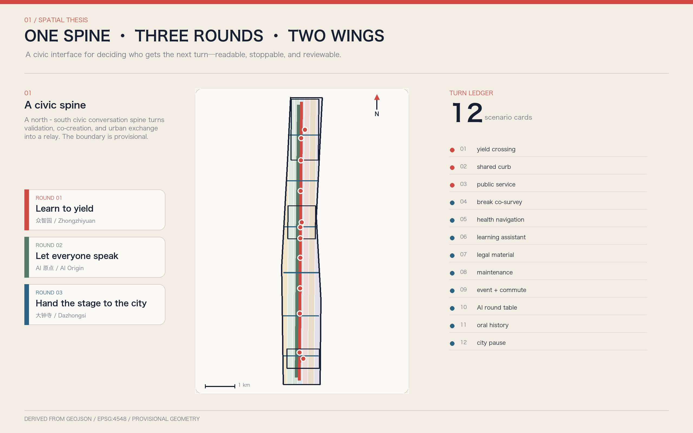
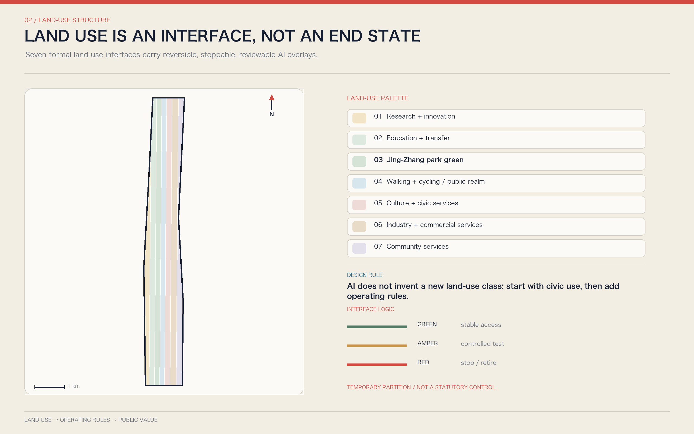
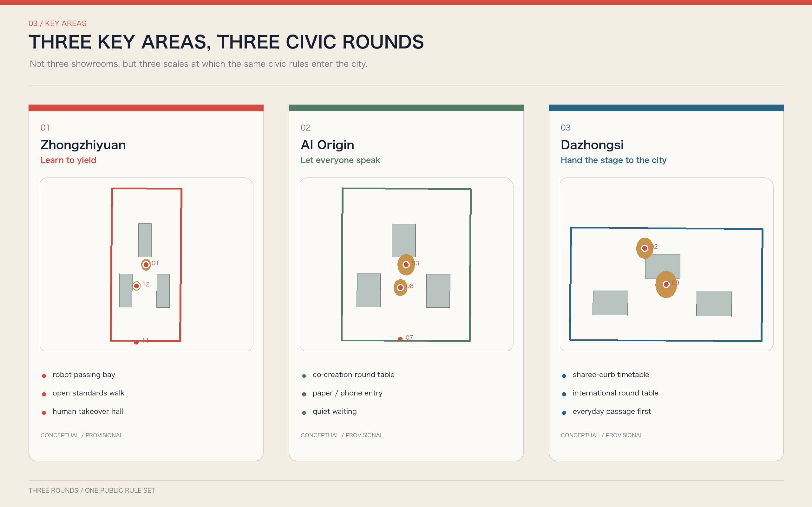
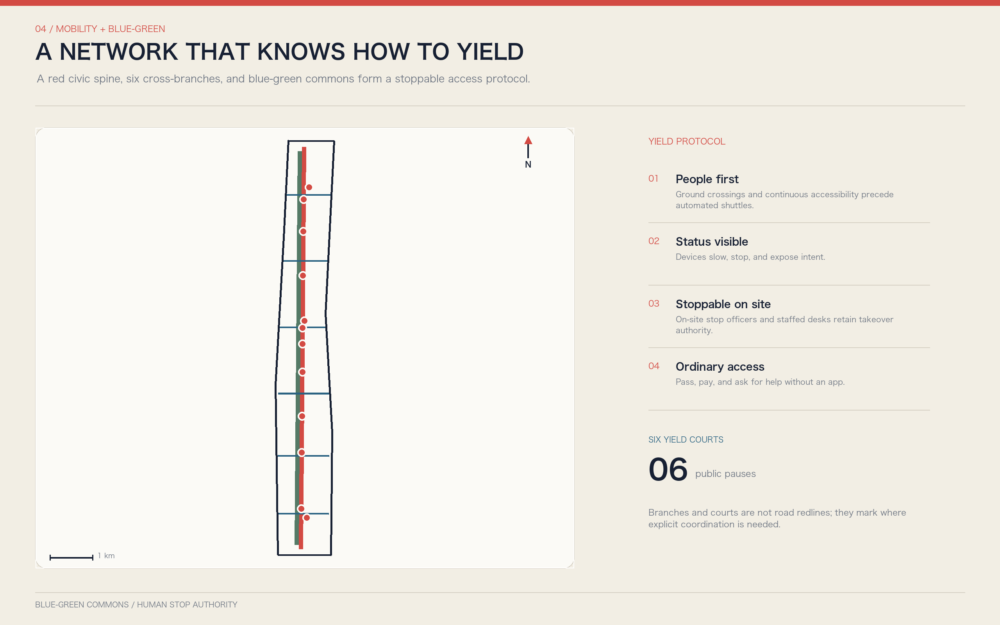
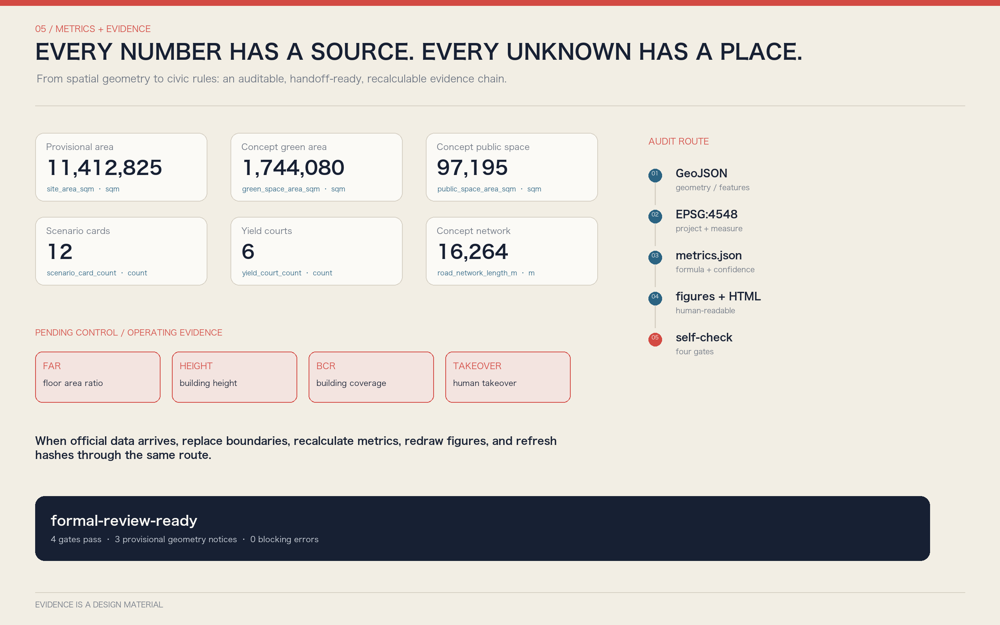

# YOUR TURN JING-ZHANG

**Turning human-AI turn-taking into civic space**

A future city needs more than smarter models. It needs a better answer to "whose turn is it?" A pedestrian meets a delivery robot at a crossing; residents and businesses compete for curb space; a citizen asks a public-service agent for help; a developer requests an urban test site; a professional must take over a high-impact decision. These conflicts appear to belong to transport, services, or governance, but they share one underlying question: **who acts first, who explains first, who must stop, and when the next turn must be handed back to a person.**

This proposal introduces **YOUR TURN JING-ZHANG**. It does not turn the corridor into a landscape of talking screens. Instead, it translates the railway's basic civic intelligence - block signaling, visible signals, yielding, handover, and timetables - into spatial rules for an AI city. The overall structure is **one spine, three rounds, two wings, six yield courts, and twelve turns**. The Jing-Zhang Railway Heritage Park is the civic conversation spine; Zhongzhiyuan, Beijing AI Origin Community, and Dazhongsi are the validation, co-creation, and urban-exchange rounds; the Zhongguancun technology-service wing and Xiaoyue River scenario-enablement wing provide knowledge and field feedback; six yield courts manage conflicts; and twelve scenario cards connect the rules to walking, robots, public services, industrial tests, and long-term operation.

The proposition is simple: **AI does not interrupt; the city yields first; everyone gets a next turn.**

## Design Basis and Source List

The proposal uses the public open-call announcement and Agent Taskbook as its task basis, and the repository site package, source registry, and local professional-standard snapshots as its audit layer. The announcement defines the three scope levels, three key areas, and required urban-design deliverables. The Agent Taskbook adds naming and visual identity, global cases, scenario cards, personas, test scenarios, pilgrimage landmarks, cultural narrative, and annual operation. These requirements are converted into prose, GeoJSON, metrics, three matrices, bilingual figures, A3/A0 PDFs, and offline webpages rather than being claimed through a single concept diagram.[source:OFFICIAL-ANNOUNCEMENT] [source:AGENT-TASKBOOK] [depth:existing_conditions_diagnosis]

The public site package does not contain an approval-ready overall boundary, exact polygons for the three key areas, full regulatory plans, road redlines, building-by-building surveys, ownership, municipal infrastructure, heritage controls, or a transport model. Therefore [data:geometry/site_boundary.geojson#SITE-001] and [data:geometry/key_areas.geojson#PROV-KEY-001] continue to use the repository's provisional rough geometry with `official_boundary=false`. They may support concept comparison, topology checks, and the generation workflow, but they are not parcel boundaries, road redlines, approval conclusions, or precise-area evidence. When official material becomes available, geometry, metrics, figures, and manifest hashes must be recalculated as one chain.[source:BOUNDARY-SOURCE] [source:KEY-AREA-SOURCE]

Sources are used in three categories. The first contains formal public materials that support task and principle statements, such as the announcement, taskbook, and available professional standards. The second contains background cases that only demonstrate possible mechanisms for testing, registration, deliberation, or open platforms; they do not replace project planning evidence. The third is provisional geometry, which supports only this intake package and design discussion. Complete source uses, dates, and limitations are recorded in `sources.json`, with status governed by `data/source_registry.json`.[source:SOURCE-REGISTRY] [source:PROCESSED-FACT-PACK]

The professional boundary is explicit. Complete land-use coverage, public-space networks, transport centerlines, capacity-test blocks, scenario nodes, and phasing can be machine-reviewed. Floor Area Ratio (FAR), building height, Building Coverage Ratio (BCR), setbacks, demolition quantities, and investment remain pending until formal conditions are available. "Complete design depth" means that the question, evidence, method, spatial carrier, and professional follow-up interface are complete; it does not mean an AI agent has replaced statutory planning or engineering approval.

## Three-Level Scope Framework

The three scope levels follow a progression of **regional turns, corridor turns, and site turns**. The 43.6-square-kilometer coordinated research area asks how research, enterprise, community, events, and public governance can form a relay ecosystem across Haidian. The approximately 11.4-square-kilometer overall design area asks how industry and public value translate into land use, renewal, walking, blue-green systems, service facilities, and operating rules. The three key areas ask what spatial and accountability gates an AI scenario must pass from controlled validation through community co-creation to urban exchange.[standard:PROJECT-OFFICIAL-ANNOUNCEMENT] [depth:three_level_scope_framework]

The current provisional overall area is recorded in [metric:site_area_sqm], and the number of key areas is verified by [metric:key_area_count]. The boundary is the computational envelope of this concept package, not a statement of statutory ownership. At the overall-design level, [data:geometry/land_use.geojson#LU-001], [data:geometry/roads.geojson#ROAD-SPINE-001], and [data:geometry/public_space.geojson#PUBLIC-TURN-001] jointly express the spatial structure: land uses provide containers for different activities; the civic conversation spine connects north and south; six yield courts turn conflicts among cross-corridor movement, robots, events, and services into situations that can be observed, paused, and reviewed.

The structure is a working grammar, not a new administrative boundary:

| Element | Urban-design meaning | Machine evidence |
| --- | --- | --- |
| One spine | The heritage park provides a continuous baseline for memory, walking and cycling, blue-green space, and human-machine coexistence | [data:geometry/roads.geojson#ROAD-SPINE-001] |
| Three rounds | Zhongzhiyuan validates, AI Origin co-creates, and Dazhongsi stages urban exchange, forming a relay from research to public adoption | [data:geometry/key_areas.geojson#PROV-KEY-001] |
| Two wings | Zhongguancun provides research, legal, standards, and industry services; Xiaoyue River provides community and real-world feedback | [depth:overall_spatial_structure] |
| Six yield courts | Cross-corridor connections, station interfaces, and key-area entrances become human-priority conflict-resolution spaces | [metric:yield_court_count] |
| Twelve turns | Scenario cards define triggers, priority users, pause conditions, human takeover, and review evidence | [metric:scenario_card_count] |

Every scope follows the same rule: the public must see the rules before automation begins. If a deployment cannot state who has priority, how to refuse, who can stop it, and how to transfer control to a human, it remains in a controlled test round and does not enter the everyday public round.

## Coordinated Research Area: Industry and Future City Research

The proposal defines a world-class AI innovation ecosystem as an **adoption chain with visible turns**, not an accumulation of firms and screens. Upstream universities, institutes, and platforms advance models, chips, data, robotics, and open-source tools. Midstream evaluation, safety, standards, legal services, intellectual property, procurement, and scenario operation form shared support. Downstream applications are tested in transport, health navigation, educational assistance, legal-document support, business services, cultural interpretation, and urban maintenance. Before technology enters the city, it must answer four questions: can it be retested, can it yield to people, can a human take over, and who closes the loop after withdrawal?

Six global mechanisms are used as background comparisons. Helsinki's urban experimentation and shared city-data layers suggest that innovation districts need a common fact base; Amsterdam's algorithm register suggests that public algorithms should be inspectable; Barcelona Decidim suggests that proposals, responses, and decisions need a traceable public process.[source:HELSINKI-KALASATAMA] [source:AMSTERDAM-ALGORITHM-REGISTER] [source:BARCELONA-DECIDIM]

Punggol Digital District suggests that cross-system testing needs an interface layer; Singapore AI Verify suggests repeatable tests for high-impact systems; and Seoul Smart City Center suggests that demonstration, validation, and public communication can share one venue.[source:PUNGGOL-OPEN-DIGITAL-PLATFORM] [source:SINGAPORE-AI-VERIFY] [source:SEOUL-SMART-CITY-CENTER]

These cases contribute mechanisms only. They are not copied as spatial forms and do not imply organizer adoption. Other background sources appear in `sources.json`; limitations appear in assumption A-CASES-001. The adaptation for the Jing-Zhang context is a five-turn functional system:

1. **Independent Innovation Turn:** models, chips, robots, and edge systems are retested under controlled conditions.
2. **Scenario Validation Turn:** pedestrians, accessibility, noise, night conditions, extreme weather, and human stop authority enter testing.
3. **Public Service Turn:** services must provide staffed desks, ordinary payment, non-app entry, and appeal channels.
4. **Cultural Communication Turn:** railway heritage, Zhongguancun innovation culture, and new AI culture become a walkable and participatory narrative.
5. **Global Collaboration Turn:** developers, firms, residents, and international visitors work under explicit agendas and responsibility boundaries.

The name is **YOUR TURN JING-ZHANG**. The logo direction uses two opposing railway-signal brackets around an open dot: the left bracket represents listening, the dot represents the current speaker, and the right bracket represents handing the next turn onward. It is a public symbol for paving, wayfinding, scenario cards, and event agendas rather than a closed corporate mark. Signal Red means stop and confirm; Listening Blue means speak and seek help; Platform Cream means the ordinary civic baseline. Final logo geometry, typography, and materials remain subject to professional visual design and copyright review.[standard:PROJECT-AGENT-OPEN-CALL-TASKBOOK]

## Overall Design Area: Urban Renewal and Regulatory-Plan-Level Urban Design

The overall design favors **small units, reversible facilities, and public space before construction** rather than wholesale redevelopment. The concept zones from [data:geometry/land_use.geojson#LU-001] to LU-007 cover the provisional overall boundary without overlaps and provide interfaces for research and innovation, education and transfer, cultural/public service, community service, industry and commerce, park space, and walking/cycling/road/plaza uses. They are relationship and capacity tests, not changes to current land use or ownership. Formal development must overlay official parcels, existing-condition surveys, and regulatory plans.[standard:MNR-LAND-USE-CLASSIFICATION-GUIDE] [standard:MOHURD-URBAN-DESIGN-MEASURES] [depth:land_use_layout]

The building layer does not issue building-by-building retain-renovate-demolish decisions. Capacity-test blocks beginning at [data:geometry/buildings.geojson#BLDG-001] test public-space relationships, ground-floor interfaces, walking continuity, and service capacity. Their combined footprint and count are reported by [metric:building_footprint_area_sqm] and [metric:building_capacity_block_count]. Each object has `intervention_status=capacity_test_only` and `demolition_decision=false`. Formal decisions require ownership and existing-condition surveys, structural and fire review, heritage and public-value review, life-cycle carbon comparison, statutory procedures, and public communication.[depth:retain_renovate_demolish] [standard:MOHURD-ARCH-DESIGN-DEPTH-2016]

Urban renewal first secures three spatial rights: continuous pedestrian and accessible passage cannot be occupied by tests; residents and frontline workers retain rest and service space that events cannot displace; and high-impact AI operating in crowds, streets, or public services must have an on-site stop authority. Six yield courts, public ground-floor interfaces in the three key areas, the north-south conversation spine, and east-west branches form the spatial framework. Total concept-network length is recorded in [metric:road_network_length_m].

Floor Area Ratio (FAR), height, Building Coverage Ratio (BCR), setbacks, and total floor area remain pending formal data. The proposal supplies design judgments and review interfaces rather than false precision. Actions involving stations, under-bridge space, waterways, utilities, or fire access are concept suggestions pending formal professional studies.[standard:MOHURD-CONTROL-DETAILED-PLANNING] [depth:development_intensity_controls]

## Detailed Design of Key Areas

The three key areas are not isolated AI showrooms. They are successive rounds through which one scenario enters city life.[depth:three_key_area_detailed_design]

**Zhongzhiyuan AI Independent Innovation Acceleration Area: Round One - learn to yield.** The proposed Human-Machine Yielding Test Yard validates stopping, looking, yielding, and human takeover for low-speed robots, intelligent terminals, multi-agent scheduling, and public-service interfaces. The Qinghe side prioritizes blue-green space, walking, and ordinary passage; test devices stay within controlled inner areas. Entrances show test times, device boundaries, on-site stop officers, and bypass routes. Prototypes include robot passing bays, blind-spot retest courts, model red-team rooms, a public standards gallery, and a human-takeover hall.[data:geometry/key_areas.geojson#PROV-KEY-001] [data:geometry/constraints.geojson#SCENE-01]

**Beijing AI Origin Community: Round Two - let everyone speak.** The proposed Urban Co-creation Round Table connects universities, innovation campuses, residents, and startups. Public-service agents, technology-transfer assistants, community deliberation, and multimodal interfaces are first tested in small conversation rooms. Older adults, children, disabled people, international visitors, and frontline workers are not observation subjects; they co-author acceptance conditions. Ground floors provide paper and phone access, staffed seats, quiet waiting, accessible information, and a public question wall so participation does not require installing an app.[data:geometry/key_areas.geojson#PROV-KEY-002] [data:geometry/public_space.geojson#PUBLIC-TURN-003]

**Dazhongsi AI Industry Cluster: Round Three - hand the stage to the city.** The proposed Urban Exchange and Adoption Yard coordinates rail access, four-quadrant walking, enterprise demonstration, commerce, and international events while testing how crowds, delivery, roadshows, night activity, and ordinary consumption share the same ground. Roadshows and AI-product displays use removable facilities in scheduled windows; ordinary commuting, non-digital guidance, staffed ticketing, and small-business operation remain continuous. Prototypes include a shared-curb timetable, an international round table, transparent smart-terminal displays, a quiet night window, and a Centennial Signal House.[data:geometry/key_areas.geojson#PROV-KEY-003] [data:geometry/constraints.geojson#SCENE-09]

Each detailed design answers eight questions: users, program, public space, building interface, walking/cycling and transport, data/model boundary, human takeover, and implementation dependency. The lack of official planning boundaries does not block concept scoring, but all rectangular provisional ranges and derived areas remain visibly qualified and cannot be read as project siting.

## AI Innovation Ecosystem, Personas, and AI+ Scenarios

The proposal uses six need-based personas. They do not describe identifiable people and are not used for commercial profiling.[metric:persona_count]

| Persona | The "next turn" they need | Spatial and service response |
| --- | --- | --- |
| Research engineers and open-source developers | Retest, discussion, publication, and failure review | Controlled test yards, open round tables, night collaboration without neighborhood disturbance |
| Startups and small firms | Affordable compliance, a first urban client, and human experts | Scenario clinic and a joint legal/standards/procurement desk |
| Nearby residents and older adults | Equivalent services without installing an app | Staffed counters, ordinary payment, paper/phone entry, legible waiting |
| Children, caregivers, and school communities | Safe experimentation, understandable explanations, and optional exit | Child-priority windows, family round courts, non-capture activity areas |
| Disabled people and multilingual visitors | Multimodal expression, continuous accessibility, and staffed help | Voice/text/sign/tactile interfaces plus human guidance |
| Delivery, cleaning, security, and maintenance workers | Stoppable devices, explainable work orders, and protected rest space | Robot yield bays, human stop authority, maintenance handover tables |

Twelve scenario cards are located in [data:geometry/constraints.geojson#SCENE-01] through SCENE-12. Each uses the same fields: trigger, priority holder, yielding method, pause condition, human takeover, and review evidence.

1. **Human-Machine Yield Crossing (industry test):** robots slow, stop, and display intent before the pedestrian-priority line.
2. **Shared Curb Turns (industry test):** transit, ride-hail, delivery, accessible boarding, and loading use public time windows.
3. **Multimodal Public Service Round Table (industry test):** voice, text, sign-language, and staffed services are compared on the same task.
4. **Slow-Mobility Break Co-survey:** AI identifies possible barriers; residents and accessibility users confirm or reject them.
5. **Community Health Navigation:** information and staffed transfer only; no automated diagnosis.
6. **Education and Learning Assistant:** students and teachers confirm content together; individual profiles do not determine opportunity.
7. **Legal and IP Document Assistant:** models help organize material; professionals make final judgments.
8. **Urban Maintenance Work-Order Dialogue:** device alerts, field-worker notes, and resident feedback share one timeline; humans decide action.
9. **Dazhongsi Event and Everyday Commuting:** events use removable facilities and preserve continuous passage.
10. **International AI Round Table:** multilingual assistance supports but does not replace facilitation; participant groups receive fixed speaking and response turns.
11. **Jing-Zhang Oral-History Station:** railway history, community memory, and AI culture are layered; contributors may withdraw authorization.
12. **Annual One-Second City Pause:** nonessential automation is shut down to test staffed, ordinary-wayfinding, and emergency continuity.

The first three constitute the required industrial test and validation scenarios [metric:industry_test_scenario_count]. Tests measure more than model accuracy: human-priority rate, visible stopping, human-takeover time, service parity, and complaint closure. Without operating samples, these remain unknown rather than being filled with simulated performance.

Three AI pilgrimage landmarks hold public memory without relying on oversized new construction.[metric:pilgrimage_landmark_count]

- **Centennial Signal House:** translates railway signals, block systems, and engineering verification into a public state language for AI scenarios.
- **Your Turn Square:** movable round tables, speaking lights, and accessible seats support public rounds among residents, developers, and professionals.
- **Open Round Table:** displays reproducible contributions, failure records, repairs, and the next maintainer rather than only celebrity firms.

## Land Use, Building Scale, and Retain-Renovate-Demolish Strategy

Land use follows formal classification interfaces. AI functions are overlaid as operating rules within research, cultural, community-service, commercial, green, road, and plaza uses rather than being invented as a new "AI land-use" category. The [metric:land_use_zone_count] concept zones cover the provisional boundary. Green space and plazas are civic infrastructure for turns, pauses, and review rather than residual development land.[standard:MNR-LAND-USE-CLASSIFICATION-GUIDE]

Building capacity blocks are organized around public ground floors, maintainable equipment, and removable events. Research and industry spaces need separable test units, observation galleries, and manual-stop rooms; community and cultural spaces need staffed counters, quiet waiting, and multimodal information; commercial and roadshow spaces need removable facilities that do not obstruct tactile paving, fire access, or ordinary commuting. Exact height, floors, massing, spacing, and program ratios await official regulatory, sunlight, fire, transport, heritage, and ownership conditions.[depth:height_massing_character]

Retain-renovate-demolish decisions are not triggered by a generic "inefficiency" label. Formal development first creates an evidence card for each building: current use, ownership, structure, fire safety, heritage value, community dependency, life-cycle carbon, ground-floor public value, and adaptability. Only then can it propose retention, light renovation, adaptive reuse, comprehensive renewal, or pending status. Any demolition proposal requires professional review and statutory procedure. This package's building GeoJSON is a capacity test, not an existing-condition survey or approved development scale.

## Transport, Rail, Municipal Infrastructure, and Public Services

The transport system is a **network that knows how to yield**, not merely a faster network. The north-south civic conversation spine appears in [data:geometry/roads.geojson#ROAD-SPINE-001]; six east-west yield branches are ROAD-YIELD-001 through ROAD-YIELD-006; their total length is calculated in [metric:road_network_length_m]. They do not represent road redlines. They identify where walking, cycling, station access, robots, and event flows require explicit coordination.

Six yield courts are prioritized at key-area entrances, station connections, cross-corridor links, and activity transitions. Ground-level crossing and continuous accessibility come before automated shuttles; robots receive visible stopping lines before human paths; cycling, delivery, and event devices do not occupy tactile paving or fire access; event operations retain staff as fallback; shared curbs use public schedules and on-site stewards. Road widths, capacity, parking requirements, and station exits require formal specialist data.[depth:traffic_rail_slow_parking]

Municipal and new infrastructure follow **local safety, visible status, and human stop authority**. Lighting, stormwater, energy, charging, edge computing, and facility inspection retain manual modes and named maintainers. Sensors collect the minimum data needed for the task. Public services must provide phone, paper, ordinary payment, and staffed entry. Models do not independently decide high-impact health, legal, public-safety, education, or accessibility outcomes.[depth:municipal_new_infrastructure] [standard:PROJECT-AGENT-OPEN-CALL-TASKBOOK]

## Blue-Green Network, Public Space, and Urban Character

The blue-green network is the physical space in which the city **listens before answering**. Combined concept green-space area and ratio are recorded in [metric:green_space_area_sqm] and [metric:green_ratio], calculated from [data:geometry/green_space.geojson#GREEN-001] and related features. These are not approved green-space ratios. The Qinghe interface supports low-disturbance validation and rain gardens; the AI Origin segment supports co-creation lawns and quiet waiting; the Dazhongsi segment supports reversible transitions between events and ordinary commuting.

Combined public-space area and ratio are recorded in [metric:public_space_area_sqm] and [metric:public_space_ratio]. The six yield courts and three landmarks display the current turn, next turn, stop authority, and staffed-help location through paving and physical signs, but they remain usable without electronic screens. Each provides shade, seating, drinking-water and toilet guidance, accessible information, ordinary lighting, and human help. With devices off, it remains complete civic space.[data:geometry/public_space.geojson#PUBLIC-TURN-001] [depth:blue_green_public_space]

The visual language comes from railway engineering rather than generic futurism. Mileposts show evidence sources; signal colors show scenario states; switches show choice; timetables show shared-resource turns; riveted scales and low-saturation mineral colors define material character. Signal Red is reserved for stop and confirmation, Listening Blue for expression and help, Platform Cream for the ordinary baseline, and Park Green for blue-green systems. Dynamic graphics, sound, or lighting must not create glare, noise, or accessibility barriers.

The cultural narrative uses a three-act design analogy. In the railway era, signals and operating rules organized safe passage. In the Zhongguancun era, open collaboration organized the relay of knowledge. In the AI era, the city must organize how people and intelligent systems avoid taking the same turn. The railway remembers public history; the city hands the next turn to future participants. This connects railway heritage, Zhongguancun innovation culture, and new AI culture without inventing heritage facts or official designation.

## Renewal Projects, Implementation Policy, and Phasing

The proposal defines nine concept work packages that can start independently and pause for review.[depth:renewal_project_list]

| ID | Work package | Near-term action | Dependency |
| --- | --- | --- | --- |
| YT-01 | Civic conversation spine wayfinding and ordinary baseline | Audit walking, accessibility, staffed help, and state signage | Existing-condition survey and management coordination |
| YT-02 | Six yield courts | Test movable markings, seating, and staffed posts | Traffic, fire, and utility review |
| YT-03 | Zhongzhiyuan human-machine yield test yard | Test stopping lines, passing bays, and on-site stop officers | Site authorization and safety evaluation |
| YT-04 | AI Origin co-creation round table | Establish public agendas for residents, developers, and professionals | Community participation and venue authorization |
| YT-05 | Dazhongsi shared-curb timetable | Compare commuting, delivery, event, and accessible boarding needs | Passenger-flow, curb, and enforcement coordination |
| YT-06 | Multimodal public-service test | Compare voice, text, sign, and staffed entry on one task | Accessibility specialist review |
| YT-07 | Three pilgrimage landmarks | Begin with exhibitions, archives, and events, not oversized new construction | Heritage, landscape, and copyright review |
| YT-08 | Public scenario ledger | Record versions, responsibility, complaints, pause, recovery, and retirement | Data governance and operator |
| YT-09 | Annual Your Turn Assembly | Urban red teams, resident questions, developer challenges, and public review | Event approval, safety, and rights clearance for communications assets |

Phasing is expressed by [data:geometry/phasing.geojson#PHASE-001] through PHASE-003, with the count recorded in [metric:phase_count]. The near term establishes the ordinary baseline, field surveys, movable facilities, and three industry tests. The medium term advances public ground-floor interfaces, walking and cycling breaks, blue-green systems, and industry services in the three key areas. The long term establishes scenario admission, public ledgers, annual review, and spatial adaptation. Official boundaries, regulatory plans, ownership, transport, utilities, fire, and heritage information are entry conditions for each phase, not implied government commitments.[depth:phasing_implementation]

Long-term operation uses **twelve months, twelve turns**. Each month selects one public problem. Residents, researchers, firms, frontline workers, and professional departments take successive turns to present the problem, evidence, prototype, counterexample, and revision. Each quarter reviews the three industrial tests. Each year holds a Your Turn Assembly and a One-Second City Pause exercise. Developer communities maintain open tools and reproducible experiments; scenario operators manage field safety and ordinary services; professionals retain planning and engineering judgment; a public committee has a visible route to request pause and review.

## Metrics, Area Recalculation, and Compliance Matrix

Metrics are divided into three groups. The first is spatially calculable from current GeoJSON: provisional area, green space, public space, capacity-test footprints, network length, and conversation-spine length. The second counts structured deliverables: zones, capacity blocks, scenario cards, industrial tests, personas, landmarks, yield courts, and phases. The third requires operating or official data: Floor Area Ratio (FAR), height, Building Coverage Ratio (BCR), setbacks, approved demolition, human-yield rate, human-takeover latency, service-parity gap, and public trust.

The scope and blue-green baseline are recalculated through [metric:site_area_sqm], [metric:green_space_area_sqm], and [metric:green_ratio]. Public space is recalculated through [metric:public_space_area_sqm] and [metric:public_space_ratio]. Capacity testing and the mobility network are recalculated through [metric:building_footprint_area_sqm], [metric:road_network_length_m], and [metric:dialogue_spine_length_m].

Structured deliverable counts are checked through [metric:key_area_count], [metric:scenario_card_count], and [metric:phase_count]. Every known value records source files, formula, confidence, and assumptions; every unknown records a reason and a path to completion.

The recalculation sequence follows [depth:metrics_recalculation]: verify source roles for the site and key areas; project to EPSG:4548; check complete land-use coverage and overlaps; calculate unioned areas for green, public, and building polygons; calculate centerline lengths; then synchronize metrics, figures, HTML, and manifest hashes. Values derived from provisional boundaries show internal package consistency only and do not become official statistics.

`compliance_matrix.json` covers twenty-three announcement and agent tasks; `standard_matrix.json` covers six professional references; `design_depth_matrix.json` covers fifteen formal depth items. Reviewers can travel from a prose judgment to geometry, metrics, sources, assumptions, self-check, A3 booklet, A0 boards, and offline webpage, avoiding a package that can only be viewed but not verified.

## Risk, Copyright, and Compliance

There are seven main risks. First, provisional boundaries can mislead location and area, so every figure retains the provisional qualification. Second, missing regulatory and building-level data can mislead implementation, so statutory controls remain unknown. Third, turn-taking rules may fail in complex field conditions, so high-impact scenarios retain on-site stop officers and human takeover. Fourth, voice, image, and trajectory data can create privacy risk, so data use follows necessity, explicit purpose, short retention, and withdrawal. Fifth, ordinary services may erode over time, so outcome, time, price, and accessibility parity must be audited. Sixth, events and tests can displace residents, frontline workers, and ordinary commuting, so the ordinary civic baseline holds the priority turn. Seventh, visual, case-study, and cultural material can create copyright risk, so core figures are generated from structured project data and external cases are used only as textual mechanism research.[depth:risk_missing_data]

Assumptions and gaps are recorded as A-BOUNDARY-001, A-CONTROLS-001, A-BUILDING-001, A-MOBILITY-001, A-OPERATIONS-001, and A-CASES-001. The proposal does not claim approval, ownership, construction scale, funding, or implementation commitment. Every spatial action is a concept suggestion, reference scheme, or material for professional development. Models do not independently decide high-impact health, legal, public-safety, education, or accessibility outcomes.

The text, GeoJSON, diagrams, offline HTML, and PDFs were generated by the declared AI agent for this open call and are licensed CC-BY-4.0. Rights in source facts and professional standards remain with their publishers. The webpages load no external scripts, map tiles, fonts, APIs, forms, or trackers. Detailed asset declarations appear in `report/copyright_statement.md`.

## References

The project task basis is [source:OFFICIAL-ANNOUNCEMENT], [source:AGENT-TASKBOOK], and [source:SITE-PACKAGE]. Source-status checks use [source:SOURCE-REGISTRY] and [source:PROCESSED-FACT-PACK]. Provisional geometry comes from [source:BOUNDARY-SOURCE] and [source:KEY-AREA-SOURCE].

Background cases cover public experimentation and registration through [source:HELSINKI-KALASATAMA], [source:AMSTERDAM-ALGORITHM-REGISTER], and [source:BARCELONA-DECIDIM], plus open platforms, testing, and public communication through [source:PUNGGOL-OPEN-DIGITAL-PLATFORM], [source:SINGAPORE-AI-VERIFY], and [source:SEOUL-SMART-CITY-CENTER].

The task and urban-design basis is [standard:PROJECT-OFFICIAL-ANNOUNCEMENT], [standard:PROJECT-AGENT-OPEN-CALL-TASKBOOK], and [standard:MOHURD-URBAN-DESIGN-MEASURES]. Regulatory planning, land use, and design-depth interfaces use [standard:MOHURD-CONTROL-DETAILED-PLANNING], [standard:MNR-LAND-USE-CLASSIFICATION-GUIDE], and [standard:MOHURD-ARCH-DESIGN-DEPTH-2016].

The complete machine index is contained in `geometry/`, `metrics.json`, `sources.json`, `assumptions.json`, `compliance_matrix.json`, `standard_matrix.json`, and `design_depth_matrix.json`.
