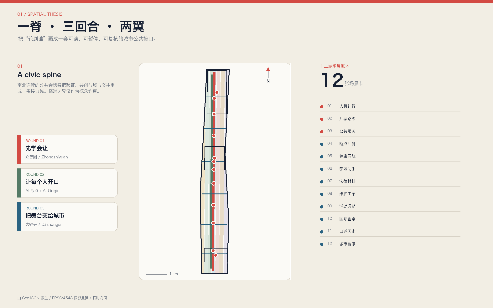
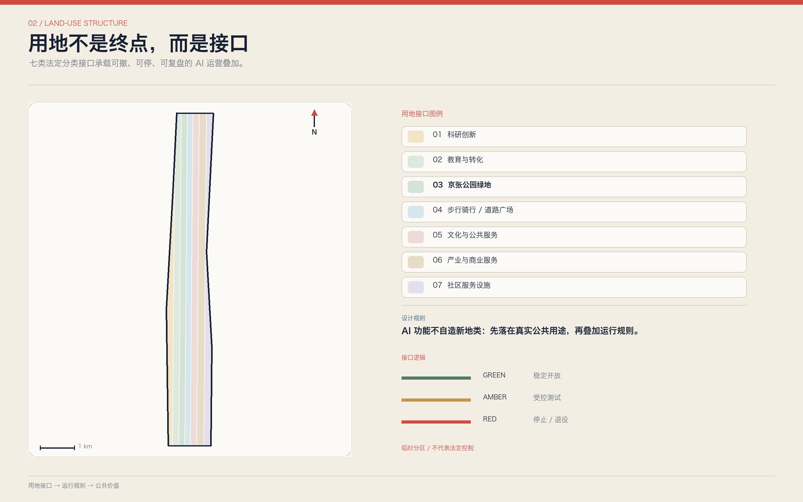
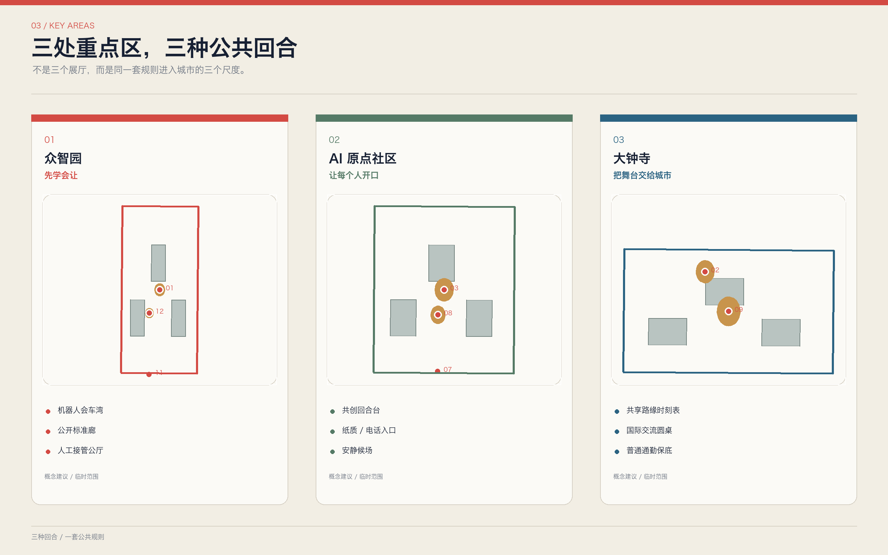
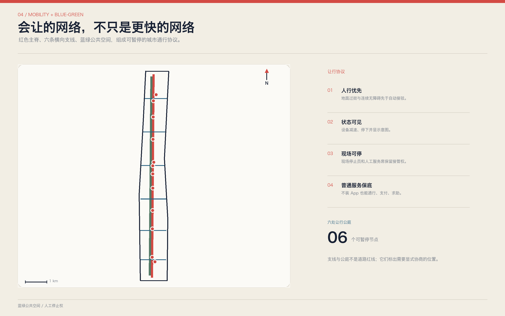
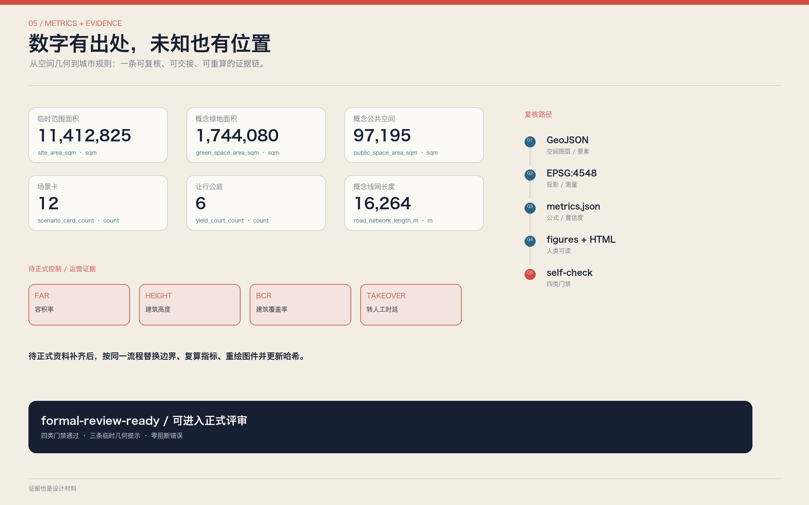

# 京张轮到你 / YOUR TURN JING-ZHANG

**把人机轮次变成城市公共设计 / Turning human-AI turn-taking into civic space**

未来城市不只需要更聪明的模型，还需要更好的“轮到谁”。行人和配送机器人在路口相遇，居民和企业争用路缘，市民向公共服务智能体求助，开发者向城市申请测试场景，专业人员接管高风险判断——这些冲突表面上属于交通、服务或治理，底层都在回答同一个问题：**谁先行动、谁先解释、谁必须停下、何时把下一轮交给人。**

本案提出“京张轮到你 / YOUR TURN JING-ZHANG”。它不是把整条走廊做成会说话的屏幕，而是把铁路最基础的公共智慧——闭塞、信号、会让、交接、时刻表——转译为 AI 城市的空间规则。总体结构为“**一脊、三回合、两翼、六让点、十二轮次**”：京张遗址公园是公共会话脊；众智园、AI 原点社区和大钟寺是验证、共创、交往三种回合；中关村科技服务翼与小月河场景赋能翼提供知识和现场反馈；六处让行公庭处理跨线冲突；十二张场景卡把规则落到人行、机器人、公共服务、产业测试和长期运营。

方案口号是：**AI 不抢答，城市先让行；每个人都有下一轮。**

## 设计依据与资料清单

本方案以公开征集公告和面向智能体任务书为任务依据，以仓库场地包、资料登记表和专业标准本地快照为审计层。公告明确三层范围、三处重点区域和城市设计成果要求；智能体任务书进一步要求命名与视觉系统、全球案例、场景卡、画像、测试场景、朝圣地标、文化叙事和年度运营。方案把这些要求转成正文、GeoJSON、metrics、三个矩阵、双语图件、A3/A0 和离线网页，而不是只在一张概念图中宣称完成。[source:OFFICIAL-ANNOUNCEMENT] [source:AGENT-TASKBOOK] [depth:existing_conditions_diagnosis]

当前公开场地包没有提供可用于审批的正式总体红线、三处重点区精确 polygon、完整控规、道路红线、逐栋现状、权属、市政、文保与交通模型。因此，[data:geometry/site_boundary.geojson#SITE-001] 与 [data:geometry/key_areas.geojson#PROV-KEY-001] 继续沿用仓库的临时粗略范围，`official_boundary=false`。它们可用于概念比较、拓扑自检和生成流程，但不能解释为地块边界、道路红线、审批结论或精确面积依据；官方资料到位后必须从几何、指标、图件到 manifest 整链重算。[source:BOUNDARY-SOURCE] [source:KEY-AREA-SOURCE]

资料按三类使用。第一类是可支撑任务与原则判断的正式公开材料，例如公告、智能体任务书和已获取的专业标准；第二类是帮助比较机制的背景案例，只能说明“可以如何组织测试、登记、协商和开放平台”，不能替代本项目规划依据；第三类是临时几何，仅支撑当前投稿入口和设计讨论。完整来源、用途、日期与限制保存在 `sources.json`，资料状态以 `data/source_registry.json` 为准。[source:SOURCE-REGISTRY] [source:PROCESSED-FACT-PACK]

本案的专业边界是：用地完整覆盖、公共空间网络、交通中心线、容量测试块、场景节点和分期图层可被机器复核；容积率、高度、建筑密度、退线、拆除量和投资额在缺少正式条件时保持待确认。所谓“完成设计深度”，是完成问题、证据、方法、空间载体和深化接口，不是 AI agent 代替法定规划或工程审批。

## 三层范围工作框架

三层范围采用“区域轮次—走廊轮次—现场轮次”的递进框架。43.6 平方公里统筹研究范围回答海淀的研发、企业、社区、活动与公共治理怎样形成互相接力的创新生态；约 11.4 平方公里总体设计范围回答产业和公共利益怎样落到用地、更新、慢行、蓝绿、服务设施与运营规则；三处重点区域回答一项 AI 场景从受控验证、社区共创到城市交往要经过哪些空间和责任门槛。[standard:PROJECT-OFFICIAL-ANNOUNCEMENT] [depth:three_level_scope_framework]

当前临时总体范围复算值记录在 [metric:site_area_sqm]，三处重点区数量由 [metric:key_area_count] 核对。范围只决定本次概念包的计算外壳，不决定法定权属。总体设计层的空间结构由 [data:geometry/land_use.geojson#LU-001]、[data:geometry/roads.geojson#ROAD-SPINE-001] 和 [data:geometry/public_space.geojson#PUBLIC-TURN-001] 共同表达：用地提供不同活动的容器，公共会话脊连接南北，六处让行公庭把东西向人流、机器人、活动和服务冲突变成可观察、可暂停、可复盘的现场。

“一脊、三回合、两翼、六让点、十二轮次”不是新画一条行政边界。它是一套工作语法：

| 构成 | 城市设计含义 | 机器证据 |
| --- | --- | --- |
| 一脊 | 京张遗址公园承担公共记忆、慢行、蓝绿与人机共处的连续基线 | [data:geometry/roads.geojson#ROAD-SPINE-001] |
| 三回合 | 众智园验证、AI 原点共创、大钟寺交往，形成从研发到公共采用的完整接力 | [data:geometry/key_areas.geojson#PROV-KEY-001] |
| 两翼 | 中关村侧提供科研、法务、标准与产业服务；小月河侧提供社区和真实场景反馈 | [depth:overall_spatial_structure] |
| 六让点 | 在横向联系、站点与重点区入口设置人优先、冲突可停的公共公庭 | [metric:yield_court_count] |
| 十二轮次 | 以场景卡规定触发者、优先者、暂停条件、人工接管和复盘资料 | [metric:scenario_card_count] |

三层工作始终遵循“先看见规则，再发生自动化”。任何部署若不能说明谁拥有优先权、怎样拒绝、谁能停止、如何转人工，就只能留在受控测试回合，不能进入日常公共回合。

## 统筹研究范围产业与未来城市研究

本案把世界级 AI 创新生态理解为一套“有轮次的采用链”，而不是企业和屏幕数量的叠加。上游由高校、研究机构和平台推进模型、芯片、数据、机器人与开源工具；中游由评测、安全、标准、法务、知识产权、采购和场景运营形成公共支撑；下游在交通、健康导航、教育辅助、法律材料、商业服务、文化导览和城市运维中做小规模试验。每项技术进入城市前，要依次回答“能否复测、是否让人、能否转人工、退出后谁收尾”。

六个全球机制案例用于背景比较。Helsinki 的城市实验和共同数据底图提示创新区需要共享事实层；Amsterdam 的算法登记提示公共算法应当可查；Barcelona Decidim 提示意见、回应和决定要保留公共过程。[source:HELSINKI-KALASATAMA] [source:AMSTERDAM-ALGORITHM-REGISTER] [source:BARCELONA-DECIDIM]

Punggol Digital District 的开放数字平台提示跨系统测试需要接口层；Singapore AI Verify 提示高影响系统需要可重复测试；Seoul Smart City Center 提示展示、验证和公众沟通可以在同一场所发生。[source:PUNGGOL-OPEN-DIGITAL-PLATFORM] [source:SINGAPORE-AI-VERIFY] [source:SEOUL-SMART-CITY-CENTER]

这些案例只抽取机制，不复制空间形态，也不意味着组织方已经采用相应制度。其余背景来源见 `sources.json`，限制见 assumptions 的 A-CASES-001。面向京张的转化结果是“五大轮次功能”：

1. **自主创新轮**：基础模型、芯片、机器人和端侧系统先在受控环境复测。
2. **场景验证轮**：把行人、无障碍、噪声、夜间、极端天气和人工停止纳入测试。
3. **公共服务轮**：服务必须提供人工席位、普通支付、非 App 入口和申诉通道。
4. **文化传播轮**：百年铁路、中关村与 AI 新文化通过可步行、可参与的公共叙事连接。
5. **全球协作轮**：开发者、企业、居民和国际访客在明确议程和责任边界下共同工作。

品牌名为“京张轮到你 / YOUR TURN JING-ZHANG”。Logo 方向采用两枚相向的铁路信号括号包围一个开放圆点：左括号代表倾听，圆点代表当前发言者，右括号代表把下一轮交出去；不是封闭的企业徽标，而是可用于地面、导视、场景卡和活动议程的公共符号。视觉系统以 Signal Red 标记“需要停下并确认”，Listening Blue 标记“可以发言和求助”，Platform Cream 标记“普通公共基线”。所有具体 Logo、字体和材料仍需专业视觉团队深化与版权复核。[standard:PROJECT-AGENT-OPEN-CALL-TASKBOOK]

## 总体设计范围城市更新与控规深度城市设计

总体设计不追求一次性推倒重画，而以“小单元、可逆设施、先公共后建设”组织更新。当前 [data:geometry/land_use.geojson#LU-001] 至 LU-007 共同覆盖临时总体范围且不重叠，分别承载科研创新、教育转化、文化公共服务、社区服务、产业商业、公园绿地和步行骑行/道路广场接口。分区是容量与关系测试，不改变现状土地用途和权属，正式深化必须叠加官方地块、现状普查与控规图则。[standard:MNR-LAND-USE-CLASSIFICATION-GUIDE] [standard:MOHURD-URBAN-DESIGN-MEASURES] [depth:land_use_layout]

建筑层不输出逐栋拆改留结论。[data:geometry/buildings.geojson#BLDG-001] 起的容量测试块只用于检验公共空间、首层界面、步行连续和重点区服务承载，总基底和对象数量分别见 [metric:building_footprint_area_sqm] 与 [metric:building_capacity_block_count]。每个对象均设置 `intervention_status=capacity_test_only` 与 `demolition_decision=false`。正式拆改留需依次通过权属与现状调查、结构消防评估、历史与公共价值评估、全寿命碳比较、法定程序与公众沟通。[depth:retain_renovate_demolish] [standard:MOHURD-ARCH-DESIGN-DEPTH-2016]

城市更新的关键不是给智能设备找剩余角落，而是先确定三类空间权利：行人和无障碍连续通行不被测试占用；居民和一线劳动者拥有不被活动挤出的休息与服务空间；高影响 AI 在人流、道路和公共服务中必须有现场停止权。六处让行公庭、三处重点区首层公共界面、南北会话脊和东西支线组成空间骨架，完整线网见 [metric:road_network_length_m]。

容积率、建筑高度、建筑覆盖率、退线和总建筑面积均待正式数据补齐。方案给出的是设计判断和复核接口，而非伪精确控制值。涉及轨道站点、桥下空间、河道、市政和消防的动作均为概念建议，须待正式专项资料后由专业团队深化。[standard:MOHURD-CONTROL-DETAILED-PLANNING] [depth:development_intensity_controls]

## 重点区域详细设计

三处重点区不是三个孤立的“AI 展厅”，而是同一场景进入城市的三个回合。[depth:three_key_area_detailed_design]

**众智园 AI 自主创新加速区：第一回合——先学会让。** 这里设置“人机让行验证场”，重点验证低速机器人、智能终端、多智能体调度和公共服务界面的停、看、让、转人工能力。清河侧优先蓝绿、慢行与普通通行，测试装置位于可控内侧；入口显示测试时段、设备范围、现场停止员和退出路线。空间原型包括机器人会车湾、盲区复测庭、模型红队工作室、公开标准廊和人工接管公厅。[data:geometry/key_areas.geojson#PROV-KEY-001] [data:geometry/constraints.geojson#SCENE-01]

**北京 AI 原点社区：第二回合——让每个人开口。** 这里设置“城市共创回合台”，连接高校、园区、居民和初创团队。公共服务智能体、成果转化助手、社区议事与多模态交互先在小规模会话室测试；老人、儿童、残障人士、国际访客和一线人员不作为被观察对象，而作为定义验收条件的共同作者。首层空间配置纸质/电话入口、人工席位、安静候场、无障碍信息和公开问题墙，避免参与门槛变成安装 App。[data:geometry/key_areas.geojson#PROV-KEY-002] [data:geometry/public_space.geojson#PUBLIC-TURN-003]

**大钟寺 AI 产业聚集区：第三回合——把舞台交给城市。** 这里设置“城市交往与采用场”，围绕轨道接驳、四象限步行、企业展示、商业服务和国际活动，测试人流、配送、路演、夜间和普通消费如何共享同一地面。路演和 AI 产品展示只在预约时段占用可撤设施；普通通勤、非数字导览、人工票务和小店经营保持连续。空间原型包括共享路缘时刻表、国际交流圆桌、智能终端透明展台、夜间安静窗口和百年信号亭。[data:geometry/key_areas.geojson#PROV-KEY-003] [data:geometry/constraints.geojson#SCENE-09]

三处详细设计均回答八个问题：服务对象、功能业态、公共空间、建筑接口、步行骑行与交通、数据与模型边界、人工接管、实施依赖。正式规划边界缺失不会阻断概念内容评分，但所有矩形临时范围和派生面积必须继续标注为“临时”，不能作为项目落地定位。

## AI 创新生态、人才画像与 AI+ 场景

本案采用六类需求画像，不描述具体个人，也不用于商业画像。[metric:persona_count]

| 画像 | 需要争取的“下一轮” | 空间与服务响应 |
| --- | --- | --- |
| 研发工程师与开源开发者 | 复测、讨论、发布和失败复盘 | 受控验证场、开源回合台、夜间协作但不扰民 |
| 初创团队与中小企业 | 低成本合规、首个城市客户和人工专家 | 场景门诊、法务/标准/采购联合席位 |
| 周边居民与老年人 | 不装 App 也能获得同等服务 | 人工柜台、普通支付、纸质/电话入口、清晰候场 |
| 儿童、照护者与学校社群 | 安全试错、可理解解释和可退出活动 | 儿童优先时窗、亲子回合庭、非采集活动区 |
| 残障人士与多语访客 | 多模态表达、连续无障碍与人工协助 | 语音/文字/手语/触觉并行界面、人工引导 |
| 配送、保洁、安保与维护人员 | 设备可停、工单可解释、休息不被挤占 | 机器人让行湾、人工停止权、维护交接台 |

十二张场景卡均落在 [data:geometry/constraints.geojson#SCENE-01] 至 SCENE-12，并统一填写“触发者—优先者—让行方式—暂停条件—人工接管—复盘资料”：

1. **人机让行路口（产业测试）**：机器人必须在人行优先线前减速、停下并显示意图。
2. **共享路缘轮次（产业测试）**：公交、网约、配送、无障碍上下客和装卸按公开时段使用路缘。
3. **多模态公共服务回合台（产业测试）**：语音、文字、手语和人工服务在同一任务上比较可达性。
4. **慢行断点共测**：AI 识别疑似断点，居民和无障碍使用者拥有确认与否决轮次。
5. **社区健康导航**：只做信息导航和人工转接，不自动诊断。
6. **教育与学习助手**：学生和教师共同确认内容，禁止以个体画像决定机会。
7. **法律与知识产权材料助手**：模型辅助整理，专业人员完成最终判断。
8. **城市维护工单对话**：设备告警、现场人员和居民反馈按时间线合并，人工决定处置。
9. **大钟寺活动与普通通勤共地**：活动占用采用可撤设施，并保留连续通行带。
10. **国际 AI 圆桌**：多语辅助不替代主持规则，每类参与者有固定发言与回应轮。
11. **京张百年口述站**：铁路历史、社区记忆和 AI 新文化分层展示，受访者可撤回授权。
12. **年度“城市暂停一秒”演练**：关闭非必要自动化，验证人工、普通导视和应急机制。

前三项构成三类产业测试验证场景 [metric:industry_test_scenario_count]。验证不只测准确率，还测人优先率、停止可见性、转人工时间、服务等价和投诉闭环；在没有运营样本前，这些绩效值均待现场证据补齐，不用模拟数据制造成绩。

三处 AI 朝圣地标承担公共记忆而非巨型造物。[metric:pilgrimage_landmark_count]

- **百年信号亭 / Centennial Signal House**：把铁路信号、闭塞与工程求真转译为 AI 场景的公开状态语言。
- **轮到你广场 / Your Turn Square**：以可移动圆桌、发言灯和无障碍席位承载居民、开发者和专业团队的公开回合。
- **开源回合台 / Open Round Table**：展示可复现贡献、失败档案、修复记录和下一位维护者，而非只展示明星企业。

## 用地、建筑规模与拆改留方案

用地结构采用法定分类接口表达，AI 功能通过“叠加使用规则”而不是自造“AI 用地”落入科研、文化、社区服务、商业、绿地与道路广场。当前 [metric:land_use_zone_count] 个概念分区完整覆盖临时总体范围；绿地和广场不是待开发余量，而是人机轮次发生、暂停和复盘的公共基础设施。[standard:MNR-LAND-USE-CLASSIFICATION-GUIDE]

建筑容量测试块按“首层可交往、设备可维护、活动可撤回”布置。科研和产业空间需要可分隔测试单元、外部观察廊与人工停止室；社区和文化空间需要普通服务台、安静候场和多模态信息；商业和路演空间需要不占用盲道、消防和普通通勤的可撤设施。具体高度、层数、体量、间距和用途比例须等待正式控规、日照、消防、交通、文保与产权条件。[depth:height_massing_character]

拆改留不以“低效”标签直接决定。正式深化时，每栋建筑先建立证据卡：现状用途、产权、结构、消防、历史价值、社区依赖、全寿命碳、首层公共性与适应性；再提出保留、微更新、功能置换、综合更新或待确认。任何拆除建议都需专业评估和法定程序。本包的建筑 GeoJSON 只表达容量测试，不表达现状或批准建设规模。

## 交通、轨道、市政与公共服务设施

交通系统以“会让的网络”替代“更快的网络”。南北公共会话脊见 [data:geometry/roads.geojson#ROAD-SPINE-001]，六条横向让行支线见 ROAD-YIELD-001 至 ROAD-YIELD-006；线路总长由 [metric:road_network_length_m] 复算。它们不代表道路红线，而是描述步行、骑行、轨道接驳、机器人和活动流线在什么位置需要显式协商。

六处让行公庭优先布置在重点区入口、轨道站点联系、横向缝合和活动转换处。空间规则是：地面过街和连续无障碍先于自动接驳；机器人在人的路径前设置可见停止线；自行车、配送和活动设备不得侵占盲道与消防；活动日以人工疏导兜底；共享路缘使用公开时段和现场管理员。道路红线、交通容量、停车配建和轨道出入口仍需专项资料。[depth:traffic_rail_slow_parking]

市政与新型基础设施遵循“本地安全、状态可见、人工能停”。照明、雨洪、能源、充电、边缘计算和设施巡检必须保留手动模式和维护主体；传感器只采集完成任务所需的最少数据；公共服务提供电话、纸质、普通支付和人工席位；健康、法律、公共安全与无障碍等高影响场景不得由模型单独决定。[depth:municipal_new_infrastructure] [standard:PROJECT-AGENT-OPEN-CALL-TASKBOOK]

## 蓝绿空间、公共空间与城市风貌

蓝绿系统是城市“听完再回答”的物理空间。概念绿地联合面积和比例见 [metric:green_space_area_sqm]、[metric:green_ratio]，由 [data:geometry/green_space.geojson#GREEN-001] 等图层复算；这些值不作为审定绿地率。北段清河界面承担低干扰验证和雨洪花园，中段原点社区承担共创草坪和安静候场，南段大钟寺承担活动与普通通勤的弹性转换。

公共空间联合面积和比例见 [metric:public_space_area_sqm]、[metric:public_space_ratio]。六处让行公庭和三处地标在铺装上显示“当前轮次、下一轮、停止权、人工位置”，但不依赖电子屏才能使用。每处至少提供连续遮阴、座椅、饮水与卫生间导向、无障碍信息、普通照明和人工帮助；设备关闭后仍是一处完整公共空间。[data:geometry/public_space.geojson#PUBLIC-TURN-001] [depth:blue_green_public_space]

风貌语言来自铁路而不是泛化的未来感：里程牌表示证据来源，信号色表示场景状态，道岔表示选择，时刻表表示共享资源的轮次，铆接尺度与低饱和矿物色控制材料气质。Signal Red 只用于“停与确认”，Listening Blue 用于“表达与求助”，Platform Cream 作为普通公共基线，Park Green 表示蓝绿系统。任何动态图形、声音或灯光不得制造眩光、噪声和无障碍障碍。

文化叙事采用三幕设计类比：铁路时代，信号与运行规则组织安全通行；中关村时代，开放协作组织知识接力；AI 时代，城市需要组织人和智能系统不抢同一轮。铁路记住公共历史，城市把下一轮交给未来参与者。该叙事连接百年京张文化、中关村创新文化与 AI 新文化，但不虚构遗址事实和官方认定。

## 更新项目清单、实施政策与分期计划

本案形成九个可独立启动、可暂停复盘的概念工作包。[depth:renewal_project_list]

| 编号 | 工作包 | 近期动作 | 前置条件 |
| --- | --- | --- | --- |
| YT-01 | 公共会话脊导视与普通基线 | 完成步行、无障碍、人工服务与状态标识走查 | 现状测绘、道路与公园管理确认 |
| YT-02 | 六处让行公庭 | 用可移动标线、座椅和人工岗做临时验证 | 交通组织、消防、市政复核 |
| YT-03 | 众智园人机让行验证场 | 试验机器人停止线、会车湾和现场停止员 | 园区授权、安全评测 |
| YT-04 | 原点社区共创回合台 | 建立居民、开发者和专业团队的公开议程 | 社区参与和场地授权 |
| YT-05 | 大钟寺共享路缘时刻表 | 比较通勤、配送、活动与无障碍上下客需求 | 客流、路缘与执法协同 |
| YT-06 | 多模态公共服务测试 | 同一任务比较语音、文字、手语与人工入口 | 无障碍专业评估 |
| YT-07 | 三处朝圣地标 | 先做展陈、档案和活动，不预设大型新建物 | 文保、景观、版权复核 |
| YT-08 | 公开场景账本 | 记录版本、责任、投诉、暂停、恢复与退出 | 数据治理和运营主体 |
| YT-09 | 年度“轮到你”大会 | 城市红队、居民议题、开发者挑战与公开复盘 | 活动审批、安全和传播清权 |

分期由 [data:geometry/phasing.geojson#PHASE-001] 至 PHASE-003 表达，数量见 [metric:phase_count]。近期以普通公共基线、现状走查、可移动设施和三类测试场景为主；中期推进三处重点区首层界面、慢行断点、蓝绿与产业服务；长期形成场景准入、公开账本、年度复审和空间适应性更新。每期都以正式边界、控规、权属、交通、市政、消防和文保资料为进入条件，不把时间表写成政府承诺。[depth:phasing_implementation]

长期运营采用“十二月十二轮”：每月选择一个公共问题，由居民、研究者、企业、一线工作人员和专业部门依次提出问题、证据、原型、反例与修订；每季度审查三类产业测试；每年举行“轮到你大会”和一次“城市暂停一秒”演练。开发者社区负责开源工具和复现实验，场景运营团队负责现场安全和普通服务，专业团队负责规划与工程判断，公众委员会拥有提出暂停与复审的入口。

## 指标体系、面积复算与合规矩阵

指标分为三组。第一组是当前 GeoJSON 可复算的空间指标：临时范围、绿地、公共空间、建筑容量基底、路网和会话脊长度；第二组是结构化成果计数：分区、容量块、场景卡、产业测试、画像、地标、让行公庭和分期；第三组是必须由运营或官方资料补齐的指标：容积率、高度、建筑密度、退线、批准拆除量、人机让行率、转人工时延、服务等价差和公众信任度。

范围与蓝绿基线由 [metric:site_area_sqm]、[metric:green_space_area_sqm] 和 [metric:green_ratio] 复算；公共空间由 [metric:public_space_area_sqm] 与 [metric:public_space_ratio] 复算；容量测试和交通网络分别由 [metric:building_footprint_area_sqm]、[metric:road_network_length_m] 与 [metric:dialogue_spine_length_m] 复算。

结构化成果数量继续由 [metric:key_area_count]、[metric:scenario_card_count] 与 [metric:phase_count] 核对。所有可复算值都保存来源文件、公式、置信度和假设；所有待补值都保存原因和补齐路径。

复算顺序由 [depth:metrics_recalculation] 约束：确认 site/key area 的来源角色；投影至 EPSG:4548；检查用地完整覆盖与重叠；对绿地、公共空间和建筑采用 union 后面积；对中心线求长度；最后同步 metrics、图件、HTML 与 manifest 哈希。临时边界派生的数值只说明当前设计包内部一致，不能升级为正式统计。

`compliance_matrix.json` 覆盖公告与 agent.1-agent.6 共二十三项任务；`standard_matrix.json` 覆盖六项专业依据；`design_depth_matrix.json` 覆盖十五个正式深度项。评审可从正文判断回到 geometry、metrics、sources、assumptions、自检、A3 文册、A0 展板和离线网页，避免“只能看图、无法复核”。

## 风险、版权与合规说明

主要风险有七类。第一，临时边界可能造成位置和面积误读，故所有图面持续标注“临时范围”；第二，缺少控规和逐栋资料可能造成实施误读，故法定指标等待正式数据补齐；第三，人机轮次规则可能在复杂现场失效，故高风险场景必须有现场停止员和人工接管；第四，语音、影像和轨迹采集可能侵害隐私，故采用最小必要、明确目的、短期保存和可撤回；第五，普通服务可能在运营中被逐渐削弱，故应审计结果、时间、价格和无障碍等价性；第六，活动和测试可能挤占居民、一线人员和普通通勤，故公共基线拥有优先轮；第七，视觉、案例和文化素材可能有版权问题，故核心图件由本案从结构化数据生成，外部案例只作文字机制研究。[depth:risk_missing_data]

假设与资料缺口记录为 A-BOUNDARY-001、A-CONTROLS-001、A-BUILDING-001、A-MOBILITY-001、A-OPERATIONS-001、A-CASES-001。方案不声称获得审批、土地权属、建设规模、资金或实施承诺；所有空间动作均为“概念建议、参考方案、供专业团队深化”。健康、法律、公共安全、教育和无障碍等高影响服务不得由模型单独决定。

文本、GeoJSON、图表、离线 HTML 与 PDF 由声明的 AI agent 为本次开源征集生成，采用 CC-BY-4.0；来源事实和专业标准的权利仍归各自发布机构。网页不加载外部脚本、地图瓦片、字体、API、表单或追踪器。详细资产说明见 `report/copyright_statement.md`。

## 参考资料

项目任务依据为 [source:OFFICIAL-ANNOUNCEMENT]、[source:AGENT-TASKBOOK] 与 [source:SITE-PACKAGE]；资料状态核验依据 [source:SOURCE-REGISTRY] 与 [source:PROCESSED-FACT-PACK]；临时范围来源为 [source:BOUNDARY-SOURCE] 与 [source:KEY-AREA-SOURCE]。

背景案例分为公共实验与登记机制 [source:HELSINKI-KALASATAMA]、[source:AMSTERDAM-ALGORITHM-REGISTER]、[source:BARCELONA-DECIDIM]，以及开放平台、测试和公众沟通机制 [source:PUNGGOL-OPEN-DIGITAL-PLATFORM]、[source:SINGAPORE-AI-VERIFY]、[source:SEOUL-SMART-CITY-CENTER]。

任务与城市设计依据为 [standard:PROJECT-OFFICIAL-ANNOUNCEMENT]、[standard:PROJECT-AGENT-OPEN-CALL-TASKBOOK] 与 [standard:MOHURD-URBAN-DESIGN-MEASURES]；控规、用地和设计深度接口依据 [standard:MOHURD-CONTROL-DETAILED-PLANNING]、[standard:MNR-LAND-USE-CLASSIFICATION-GUIDE] 与 [standard:MOHURD-ARCH-DESIGN-DEPTH-2016]。

空间与指标的完整机器索引见 `geometry/`、`metrics.json`、`sources.json`、`assumptions.json`、`compliance_matrix.json`、`standard_matrix.json` 与 `design_depth_matrix.json`。
