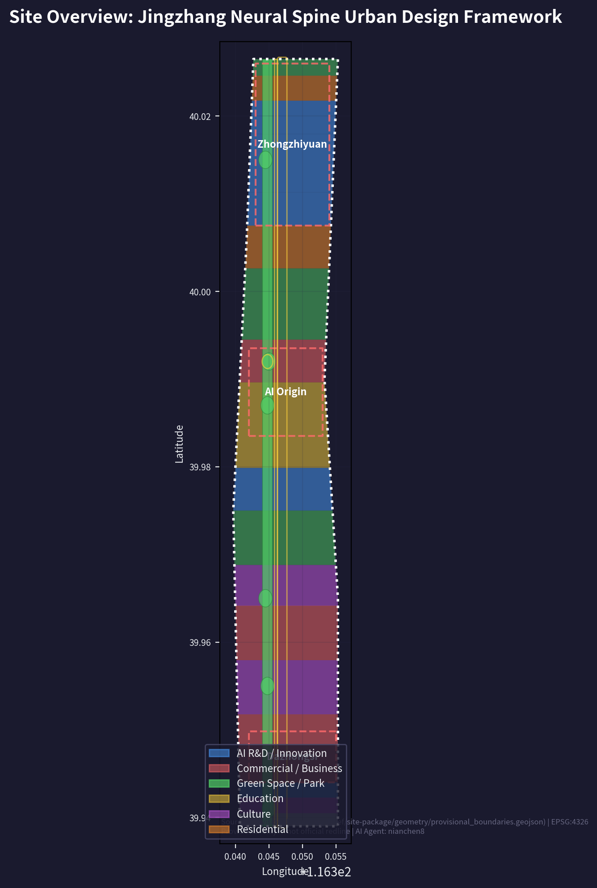
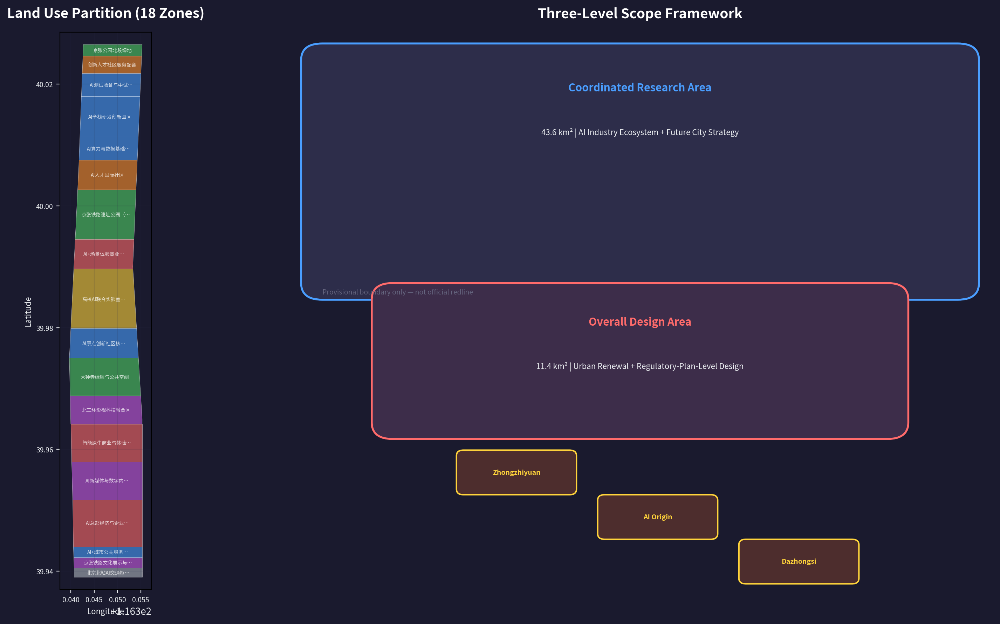
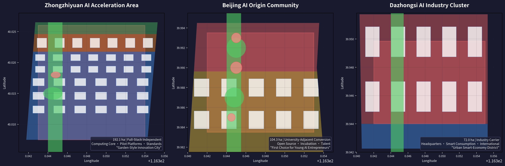
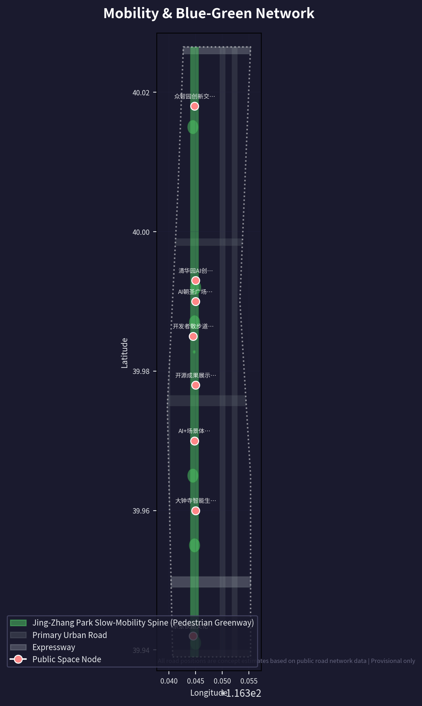
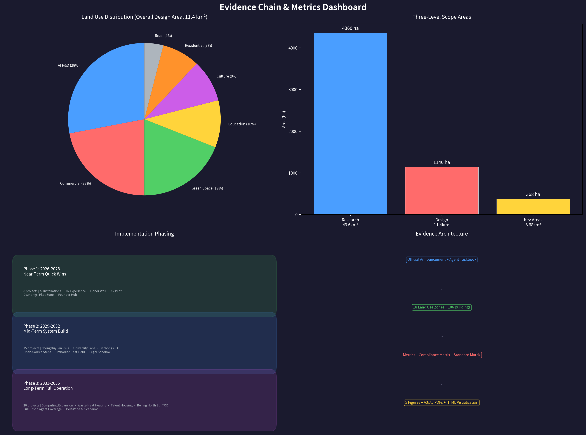

# Jingzhang Neural Spine: AI Rebirth of the Centennial Railway

## Design Basis and Source List

### Primary Basis and Core Materials

This proposal takes as its primary statutory basis the *Pre-qualification Announcement for the International Urban Design Open Call for the Centennial Jing-Zhang AI Innovation Belt* (hereinafter the Announcement) issued by the Haidian Branch of the Beijing Municipal Commission of Planning and Natural Resources on 9 May 2026 [source:OFFICIAL-ANNOUNCEMENT]. The proposal also uses the Agent-focused open-call taskbook compiled in `brief/site-package/agent_taskbook.json` as its task-response framework. That taskbook defines the three positioning goals (Centennial Jing-Zhang Culture Strip, Urban AI Living Experience Strip, and AI Convergence Innovation Strip), the five functions (Full-Stack Independent AI Innovation System; World-Class AI Innovation Ecosystem; New Paradigm of AI-Enabled Scenario Empowerment; Intelligent AI Vitality City; and Global Discourse Power in AI Governance), and the Three Zones and Two Wings spatial framework [source:AGENT-TASKBOOK].

The public source registry `data/source_registry.json` records 7 formal-use materials, 1 background material, and 1 provisional-only material [source:SOURCE-REGISTRY]. Core formal-use materials include the Pre-qualification Announcement (A0/T0 level), the Agent-oriented taskbook (CLEARED_USER_DOCUMENT level), the Urban Design Administration Measures, the Measures for Formulation and Approval of Urban Regulatory Detailed Planning, the National Land-Space Land Use Classification Guide, the Interim Measures for the Administration of Generative AI Services, and the Law on the Construction of a Barrier-Free Environment. For each standard, the local reference snapshot and SHA-256 checksum are stored in `brief/site-package/standards/standards.json` and its references directory.

### Data Boundary and Provisional Declaration

As of the submission date (11 August 2026), the repository has not yet obtained an official precise GIS/CAD redline. All spatial data in this proposal are generated from `brief/site-package/geometry/provisional_boundaries.geojson`, with every boundary marked `official_boundary=false`, `geometry_role=provisional_constraint`, and `boundary_precision=provisional_rough`. Provisional boundaries are used solely for AI-agent scheme generation, visualization, self-check, and design discussion; they must not be used as official redlines, approval bases, or precise-area recalculation bases [source:SITE-PACKAGE]. The organizer's data gap does not itself block content scoring, but once official polygons replace the provisional ones, the site boundary, key areas, land use, roads, green space, public space, buildings, phasing, and all metrics must be uniformly recalculated.

### Reading Guide

The main body (`proposal.md`) is written primarily for human reading—each chapter explains the design judgment, spatial layers, metric meaning, and data gaps. The complete source index, metric formulas, layer verifications, and professional-standard responses are kept in `sources.json`, `metrics.json`, the GeoJSON layers, and the three matrix files (`compliance_matrix.json`, `standard_matrix.json`, and `design_depth_matrix.json`). Under format v2, each required chapter keeps 1-3 evidence citations after key judgments, and sentences remain naturally readable after the citation markers are removed [standard:PROPOSAL-FORMAT-V2].

## Three-Level Scope Framework

### Level 1: Coordinated Research Area (43.6 km²)—Industrial Strategy and Urban Form

The Coordinated Research Area extends from the North 5th Ring Road in the north, the Jingzang Expressway in the east, Xizhimen Outer Street in the south, and Wanquanhe Road in the west, covering 43.6 km². This scale decides where the AI innovation belt stands within the wider innovation map of Haidian and Beijing as a whole [depth:three_level_scope_framework].

The core judgment of this proposal is: **the Jing-Zhang corridor should not become "Beijing's Silicon Valley"; it should become "the world's Jing-Zhang"**—an independent, irreplaceable global position as an "AI Pilgrimage" destination. This is not a marketing slogan but a substantive differentiation in space, institutions, and operations [source:AGENT-TASKBOOK].

The three-level scope is translated into a working framework with distinct design questions and data anchors:

| Level | Design Question | Proposal Answer | Data Anchor |
| --- | --- | --- | --- |
| Coordinated Research Area | How should the AI industrial ecosystem and future urban form be organized | Build an innovation chain of "university seeding - open-source collaboration - enterprise conversion - public experience - international dissemination" | compliance_matrix.json, standard_matrix.json |
| Overall Design Area | How should industrial space, urban renewal, transport and municipal works, and urban character be mapped | Land use, buildings, roads, green space, public space, and phasing layers jointly express the scheme | [data:geometry/land_use.geojson#LU-001], [data:geometry/roads.geojson#ROAD-001] |
| Key-Area Detailed Design Area | How should the three key areas reach detailed-design depth | A positioning, spatial moves, AI scenarios, and implementation dependencies for each key area | [data:geometry/key_areas.geojson#PROV-KEY-001], [data:geometry/key_areas.geojson#PROV-KEY-002], [data:geometry/key_areas.geojson#PROV-KEY-003] |

## Coordinated Research Area: Industry and Future City Research

### From "China's Silicon Valley" to the "Global AI Pilgrimage" Positioning Shift

Haidian is already China's undisputed leading AI district—home to over 1,000 AI scientists, 463 "little giant" specialized and sophisticated enterprises (38.1% of Beijing's total), and allocating no less than RMB 9 billion in special industrial innovation funds in 2026 [source:AGENT-TASKBOOK]. But the "China's Silicon Valley" label is essentially a catch-up narrative—it implies that Haidian is chasing a benchmark defined elsewhere.

The core idea of this proposal is: **the Jing-Zhang AI Innovation Belt should not be "Beijing's Silicon Valley"; it should be "the world's Jing-Zhang."** It needs an independent, irreplaceable global position—the "AI Pilgrimage" (AI Chaosheng Di). This is not a marketing slogan but a substantive differentiation in space, institutions, and operations [source:AGENT-TASKBOOK].

### Global Benchmarks and Haidian's Chosen Path

We distill four core models from global AI innovation districts:

**London King's Cross—"Corporate Anchor + Knowledge-Institution Alliance."** After DeepMind moved in in 2016, a magnet effect formed: office vacancy fell to 0.9%, attracting top AI institutions including OpenAI, Meta, and Anthropic. The key mechanism was the "Knowledge Quarter" alliance launched in 2001—21 institutions including the British Library, UCL, and the Francis Crick Institute formed a cross-disciplinary knowledge-collaboration network. Lesson: **Haidian needs an anchor strategy bigger than DeepMind—not a single company but a "full-stack independent innovation" system brand** [source:GLOBAL-BENCHMARK-KX].

**Singapore one-north Kampong AI—"Government-Led + Live-Work Integration."** JTC (the government developer) directly planned a 14,500 m² dense village hosting about 70 AI companies, with more than 200 talent residences nearby. The core logic is to manufacture "serendipity and collaboration" through physical density—"kampong" (Malay for "village") implies not an industrial park but a community where everyday life is innovation. Lesson: **Zhongzhiyuan and the AI Origin Community should embed residential, consumption, and social functions from day one of planning, rather than building industry first and adding amenities later** [source:GLOBAL-BENCHMARK-ONENORTH].

**Shenzhen Hetao—"Cross-Border Institutional Innovation."** The Shenzhen-Hong Kong "one district, two parks" model resolves institutional barriers to cross-border flows of data, capital, and talent, and has been described as a "super test tube" for elemental reactions. Lesson: **Haidian's "cross-border" is not a physical boundary like Shenzhen-Hong Kong but the institutional interface between AI R&D and AI regulation—Zhongzhiyuan can become an international dialogue window for AI safety governance** [source:GLOBAL-BENCHMARK-HETAO].

**Silicon Valley—"Cultural Infrastructure That Tolerates Failure."** Silicon Valley's core competitiveness lies not in floor-area ratios or greening rates but in "the density of cafés, the activity of venture capital, the number of patent lawyers, and the sharing rate of pilot equipment" (Plug and Play China × FTA 2025 Global Top 10 Innovation Districts assessment). Lesson: **the urban design indicators of the Jing-Zhang corridor must add an "innovation density" dimension—the number of collaboration spaces, open-source event frequency, and probability of cross-disciplinary encounters per square kilometer** [source:GLOBAL-BENCHMARK-SV].

### Spatial Interpretation of the Three Positioning Goals

**Centennial Jing-Zhang Culture Strip:** not museum-style heritage preservation, but making the railway-engineering spirit of 1909—independent design, independent construction, breaking through blockades—the spiritual anchor of AI independent innovation in 2026. Spatial carriers include the Qinghuayuan Station heritage-protected unit, the preserved linear railway heritage, the Jing-Zhang Railway Museum, and a heritage wayfinding system along the corridor [depth:cultural_narrative_spatial_system].

**Urban AI Living Experience Strip:** pulling AI out of laboratories and server rooms onto the street. Autonomous shuttle vehicles on commutes, AI-generated interactive art in parks on weekends, and AI-assisted neighborhood services at the doorstep—none of this needs to wait for "completion" and can be initially staged within 100 days through lightweight deployment (temporary installations, pop-up spaces, open APIs) [depth:ai_scenario_space_operation_mapping].

**AI Convergence Innovation Strip:** the first layer of convergence is "human-machine convergence"—AI augments rather than replaces human creativity; the second is "industry-city convergence"—innovation space and living space interweave without boundaries; the third is "cultural convergence"—a triad of railway heritage, Zhongguancun entrepreneurial culture, and new AI culture [standard:PROJECT-AGENT-OPEN-CALL-TASKBOOK].

### The Closed-Loop Logic of the Five Functions

1. **Full-Stack Independent AI Innovation System** (Zhongzhiyuan) → vertical integration of chips, frameworks, models, and data
2. **World-Class AI Innovation Ecosystem** (Beijing AI Origin Community) → open-source collaboration, achievement conversion, and talent circulation
3. **New Paradigm of AI-Enabled Scenario Empowerment** (Xiaoyue River Scenario Enablement Wing) → real deployment in healthcare, education, transport, and law
4. **Intelligent AI Vitality City** (Jing-Zhang Heritage Park + living districts) → a perceivable, experienceable, operable future city
5. **Global Discourse Power in AI Governance** (Zhongzhiyuan + international event system) → standard setting, safety governance, and ethical frameworks

The five functions are not five departments each managing its own turf; they are **the five acceleration stages of a single innovation chain**: autonomous technology (1) underpins ecosystem vitality (2); the ecosystem supplies scenarios (3); scenarios improve urban life (4); quality urban life attracts global talent and discourse power (5); and discourse power feeds back into resource acquisition and international cooperation for autonomous technology. This "five-ring" closed loop is the underlying logic of the proposal's spatial organization [source:AGENT-TASKBOOK] [depth:five_functions_spatial_mapping].

### Naming System: The "Jingzhang Neural Spine" Brand

**Primary name:** 京张神经脊 / Jingzhang Neural Spine

"Neural Spine" carries three layers of meaning: anatomically, the spine transmits neural signals—a metaphor for the Jing-Zhang line transmitting innovation energy; in computer science, neural networks directly invoke the AI theme; and in urban form, a linear spine park linking multiple nodes precisely describes the spatial structure.

**English naming system:**

- Regional master name: Jingzhang Neural Spine (JNS)
- Three positioning goals: Centennial Jingzhang Culture Strip / Urban AI Living Lab / AI Convergence Corridor
- Three key areas: Zhongzhiyuan AI Sovereignty Campus / Beijing AI Origin Commons / Dazhongsi AI Industry Nexus
- Brand slogan: "From Jingzhang Railway to AI Highway"

**Logo design concept:** two parallel railway tracks extend from lower left to upper right and evolve into a neural-network topology at the central intersection. The track portion embeds the stroke structure of the character "清" (Qing) from Zhan Tianyou's handwritten "Qinghuayuan Station" inscription; the network-node portion is textured with chip-circuit patterns. Color scheme: railway grey (Pantone Cool Gray 11C) + neural-network blue (#0066FF) + heritage ochre (taken from the red-brick walls of Qinghuayuan Station).

### Industry Tracks to Spatial Carriers

| Industry track | Core spatial carrier | Key dependencies |
| --- | --- | --- |
| AI chips and computing power | Zhongzhiyuan ultra-large intelligent computing cluster, distributed edge-computing nodes | Energy, cooling, security level |
| Foundation-model R&D | Zhongzhiyuan full-stack AI R&D campus | Data, talent, open-source community |
| AI + healthcare | AI diagnosis corridor at Tsinghua-affiliated hospital (AI Origin Community) | Medical-data compliance, clinical trials |
| AI + education | Wudaokou immersive learning district | Open university courses, privacy protection |
| Embodied intelligence | Zhongzhiyuan open robot testing ground | Safety standards, public-space permits |
| AI + law | Zhongguancun AI legal sandbox | De-identified judicial data, regulatory-sandbox authorization |
| AI + urban governance | Urban Agent collaborative governance center | Public-data authorization, algorithm auditing |

## Overall Design Area: Urban Renewal and Regulatory-Plan-Level Urban Design

### Spatial Structure: "One Belt, Two Loops, Twelve Scenic Nodes"

**One Belt**—the 9 km continuous public-space spine of the Jing-Zhang Railway Heritage Park. This is not a "green belt" in the conventional sense but a piece of "innovation life infrastructure": seven stacked layers of slow-running track, cycling track, autonomous shuttle lane, railway-heritage display, full Wi-Fi/5G coverage, AI interactive installations, and night-time lighting. The full park was connected in August 2025; the regulatory detailed planning published by the planning institute for public comment in December 2024 defines a "one belt, one axis, two centers, multiple nodes" structure (Dazhongsi center + Wudaokou center) [source:OFFICIAL-ANNOUNCEMENT].

**Two Loops:**

- **Walking and Cycling Experience Loop:** with the Jing-Zhang Heritage Park as the spine and Qinghua East Road, Zhichun Road, West 3rd Ring North Road, and Xueyuan Road as the lateral skeleton, forming a "fishbone" capillary walking-and-cycling network. Targets: ≥90% slow-mobility accessibility within 500 m of stations, and ≥80% cycling-friendly intersections.
- **Industry Services Loop:** closing along Zhongguancun Avenue–Zhichun Road–Xueyuan Road, connecting 12 types of innovation-service nodes including business registration, computing-power services, intellectual property, investment and financing, and talent housing. Rather than building one centralized "enterprise service center," the 12 services are embedded in 12 different spatial nodes along the corridor, so that "handling one matter means strolling through a stretch of the park."

**Twelve Scenic Nodes**—12 themed spatial nodes along the 9 km linear park:

1. Xizhimen · AI Time Hub (gateway + transport + exhibition)
2. Beijing Jiaotong University · Railway Memory Section (railway-heritage display)
3. Sidaokou · Rose AI Garden (community AI experience)
4. Dazhongsi · Smart Living Bazaar (AI consumption + culture)
5. Zhichun Road · Open-Source Steps (developer public space)
6. Zhichunli · AI Legal Sandbox Entrance
7. Wudaokou · Founder Hub (talent exchange + pitch events)
8. Qinghua East Road · AI Education Experience Gallery
9. Qinghuayuan Station · Zhan Tianyou–Turing Dialogue (cultural landmark)
10. Beihang · Flight and AI (embodied-intelligence showcase)
11. Zhongzhiyuan Entrance · Full-Stack Autonomous Exhibition Hall
12. Qinghe · Ecological AI Wetland (environmental monitoring + green-computing display)

### Land-Use Zoning Strategy

Based on the provisional site boundary, the proposal divides the area into 18 land-use zones (complete topology with gapless coverage), coded according to the National Land-Space Land Use Classification Guide [standard:MNR-LAND-USE-CLASSIFICATION-GUIDE]:

- **Scientific research/innovation land (0802):** 5 zones, about 28%—Zhongzhiyuan AI R&D district, AI Origin Community core innovation zone, university joint-laboratory cluster, Xizhimen AI public-service demonstration zone, and Wudaokou AI innovation corridor.
- **Commercial and business-services land (05):** 4 zones, about 22%—Dazhongsi AI headquarters economy zone, Zhichun Road AI-enabled commercial street, AI-native consumption experience center, and Wudaokou AI entrepreneurship-services street.
- **Parks, green space, and open space (1401):** 4 zones, about 19%—the full Jing-Zhang Heritage Park corridor, Qinghe/Xiaoyue River blue-green space, Zhongzhiyuan ecological wetland, and Sidaokou community garden.
- **Education land (0804):** 2 zones, about 10%—university AI joint-laboratory district and Beihang–BUPT AI education gallery.
- **Cultural land (0803):** 2 zones, about 9%—Jing-Zhang railway heritage exhibition area and West 3rd Ring film-technology convergence area.
- **Urban residential land (0701) + community-service facilities (0702):** 2 zones, about 8%—AI talent international community and a district for improving daily-life services for existing residents.
- **Roads and transport facilities:** 1 zone, about 4%.

The core principles of the zoning scheme: **(1) Mixed use rather than functional zoning**—each zone contains at least two land-use types, avoiding "alive by day, dead by night"; **(2) Jing-Zhang park interface first**—plots adjacent to the park prioritize public functions so the park is the "front living room" rather than a "backyard green space"; **(3) preserving existing universities and research institutions**—all new construction/renovation in this proposal are "conceptual recommendations" and do not involve changes to the campus property or ownership of Tsinghua, Peking University, Beihang, BUPT, and other institutions [data:geometry/land_use.geojson#LU-Z1-A] [depth:land_use_layout].

### Identification of Low-Efficiency Space and Renewal Strategy

Four categories of renewable space are identified (conceptual identification; to be verified against ownership and current-condition data):

1. **Dazhongsi–Sidaokou corridor section:** existing low-rise commercial and warehousing properties severely mismatched with the AI-headquarters-economy positioning—functional upgrade is recommended.
2. **Wudaokou–Zhichun Road scattered points:** some early office buildings are aging and surrounding public spaces are fragmented—micro-renewal plus public-space stitching is recommended.
3. **Zhongzhiyuan district:** currently mostly undeveloped/low-intensity—recommended as incremental space to carry full-stack independent-innovation functions.
4. **Beixiaguan–Beitaipingzhuang communities:** aging residential neighborhoods with insufficient public services—embedded renewal plus AI-service enablement is recommended.

All Demolish–Renovate–Retain (DRR) judgments are labeled "conceptual recommendation / to be confirmed against ownership and regulatory-plan conditions" and contain no demolition conclusions for any specific plot [depth:retain_renovate_demolish].

### Urban Character Control Framework

A "three zones, three sections" urban-character strategy is proposed:

- **North section (Zhongzhiyuan–Qinghe):** garden-style innovation character—conceptual building-height value ≤36 m (to be confirmed by regulatory detailed planning), extensive green roofs, and an ecological interface along the Qinghe River.
- **Middle section (AI Origin Community–Wudaokou):** knowledge-district character—conceptual building-height value ≤24 m, mandatory ground-floor public openness, and street-wall continuity ≥60%.
- **South section (Dazhongsi–Xizhimen):** urban-style innovation character—conceptual value ≤60 m around rail-transit stations, with a rhythmic urban skyline along both sides of the West 3rd Ring Road.

All building heights, massing, and character controls are marked `status=unknown`—an honest statement that formal regulatory-plan conditions are absent, and the interface point for docking with official controls during later deepening [standard:MOHURD-URBAN-DESIGN-MEASURES] [depth:height_massing_character].

## Detailed Design of Key Areas

### Zhongzhiyuan AI Independent Innovation Acceleration Area (192.1 ha)—"Full-Stack Independent Innovation Garden City"

**Positioning:** the physical carrier of the nation's full-stack AI independent innovation, hosting chip R&D, foundation-model training, safety governance, and standard setting. Located at the north end of the Overall Design Area, adjacent to the Qinghe ecological corridor.

**Spatial structure:** an "Innovation Green Valley" at the center, with R&D clusters on the east and west sides and an ecological display interface along the Qinghe River. The core concept is "innovating in a garden"—not building first and planting trees later, but interleaving green space and buildings so that outdoor space becomes the "third place" for informal collaboration [data:geometry/key_areas.geojson#PROV-KEY-001].

**Functional zones:**

- **Computing-power core:** an ultra-large high-performance single intelligent-computing cluster (already the largest in Beijing), with distributed energy stations and waste-heat recovery systems.
- **Full-stack R&D campus:** vertical integration of chips-frameworks-models-applications in four layers, with 25 conceptual R&D buildings arranged around the central Innovation Green Valley.
- **Pilot and testing-validation platform zone:** embodied-intelligence testing ground, AI-model safety red-team testing ground, and AI-chip prototype validation line—turning "testing," a back-office activity, into a visitable, displayable front-stage scenario.
- **Standards, governance, and exhibition zone:** hosting safety-standard-setting workshops, international AI governance dialogues, industrial exhibitions, and achievement launches.
- **Qinghe ecological innovation interface:** combining river-blue-line protection with composite public-space use to form a "green business card" integrating waterfront trails, ecological wetland, outdoor testing grounds, and low-carbon exhibitions.

**Key spatial moves:**

1. Take the Qinghe River as the northern boundary, with a ≥50 m setback to form an ecological buffer zone (to be confirmed against blue-line and flood-control conditions).
2. The central "Innovation Green Valley," about 60 m wide and 800 m long, runs through the campus north-south, carrying pedestrian circulation, informal meetings, and outdoor exhibitions.
3. All roads inside the campus are pedestrian-friendly—motor vehicles limited to 15 km/h, with non-motorized traffic given priority.
4. 15 pilot-platform buildings are concentrated along the east side, forming a bookable "AI Factory Tour" route.

**Implementation dependencies:** energy capacity (electricity demand of the computing-power center), the Qinghe blue line, and external transport organization (connections to the North 5th Ring Road and Jingzang Expressway)—all to be confirmed against formal conditions [depth:three_key_area_detailed_design].

### Beijing AI Origin Community (104.3 ha)—"University-Adjacent Achievement Conversion and Open-Source Innovation Community"

**Positioning:** the world's preferred destination for young AI entrepreneurs and the innovation community with the highest density of AI scientists. Within a "30-minute walking circle" around Tsinghua, Peking University, Beihang, CAS, and other institutions, it converts university basic-research results into demonstrable, testable, investable AI products and companies. In 2026 it was already selected for the "Global Top 10 Innovation Districts" (Plug and Play China × FTA assessment) [source:AGENT-TASKBOOK].

**Spatial structure:** with the middle section of the Jing-Zhang Heritage Park as the eastern boundary, Chengfu Road–Qinghua East Road as the functional main axis, and Wudaokou as the core hub, forming "one axis, one core, three sub-districts"—achievement-conversion zone, open-source collaboration zone, and talent living zone [data:geometry/key_areas.geojson#PROV-KEY-002].

**Functional zones:**

- **Achievement-conversion zone (about 40 ha):** incubator clusters, proof-of-concept centers, and pilot-acceleration platforms for university achievements; achievement-launch halls and pitch spaces are placed adjacent to the Jing-Zhang Heritage Park so the path "from laboratory to pitch stage" is the shortest possible.
- **Open-source collaboration zone (about 30 ha):** 24-hour collaboration spaces, public code walls, and open-source-community event halls; a permanent base for "AI developer hackathons," benchmarked against Silicon Valley's Hacker Dojo and Paris's Station F, but emphasizing the public nature of open-source AI rather than pure commercialization.
- **Talent living zone (about 34 ha):** talent apartments (rent benchmarked at the 50% discount under the OPC policy), international schools, community health centers, and AI-enabled living experience districts; drawing on Kampong AI's "live-work integration" logic so entrepreneurs can resolve R&D, living, and social needs within a 15-minute walk.

**Key spatial moves:**

1. Slow-mobility stitching of campus→park→district: open three slow-mobility routes connecting Tsinghua's south gate, the Jing-Zhang Heritage Park, and Wudaokou metro station, converting existing dead-ends and walls into connections.
2. Wudaokou "Founder Hub": upgrade the existing Wudaokou commercial area into a daily exchange node for AI entrepreneurs—not by building a mall, but by converting the ground floors of existing malls into pitch halls, collaboration spaces, and AI-product experience halls.
3. Qinghuayuan Station conservation and reuse: with the heritage-protected unit as the anchor, add a small cultural plaza and a "Zhan Tianyou–Turing" dialogue installation nearby.
4. "Open-Source Steps": build a stepped public plaza in the Wudaokou section of the Jing-Zhang Heritage Park, with open-source-community milestones engraved on the step facades and an AI technology time capsule at the top.

**Implementation dependencies:** campus-boundary and property confirmation, coordination of existing leases in the Wudaokou commercial area, and ownership of metro-station connection spaces—to be confirmed against formal conditions [depth:three_key_area_detailed_design].

### Dazhongsi AI Industry Cluster (72.0 ha)—"Urban-Style Intelligent Economy and International Exchange District"

**Positioning:** headquarters cluster for established AI companies, a show window for intelligent terminals, digital content, and AI consumption, and the city's living room for international AI business exchange. Located along the West 3rd Ring Road with Dazhongsi metro station as the core TOD node.

**Spatial structure:** with Dazhongsi station at the center, four-quadrant pedestrian connectivity as the skeleton, and an urban-style innovation skyline along the West 3rd Ring Road [data:geometry/key_areas.geojson#PROV-KEY-003].

**Functional zones:**

- **AI headquarters economy zone (about 22 ha):** 15 conceptual headquarters buildings for AI companies past Series A, meeting detached or multi-floor office needs; ground floors are mandatorily public—not lobbies but a series of "AI salons."
- **AI-native consumption experience center (about 18 ha):** benchmarked against Tokyo Shibuya Scramble Square and London Coal Drops Yard, embedding AI-enabled retail, dining, and entertainment into the urban fabric; AI shopping guides, AR navigation, and personalized recommendations blend with traditional commerce.
- **AI new media and digital content base (about 12 ha):** building on the West 3rd Ring film-culture district concept (a CPPCC proposal by committee member Fu Ruojun in January 2025), combining Beidian (Beijing Film Studio), Xindian, and other film resources with AI-generated content (AIGC) technology to form a "film + technology + media" innovation ecosystem.
- **International pitch and conference center zone (about 20 ha):** the permanent venue of the "Jingzhang AI Summit" event brand, with pitch halls, exhibition galleries, meeting rooms, and business services [source:AGENT-TASKBOOK].

**Key spatial moves:**

1. A three-level underground-ground-aboveground pedestrian system at Dazhongsi station connects the four quadrants, removing diagonal-crossing obstacles at the intersection.
2. Upgrade Dazhongsi Shunxin Park and Zhichun Road public spaces—combined with the Haidian District 2025 Urban Management Committee plan, creating a model of comprehensive environmental improvement.
3. A rhythmical skyline along the West 3rd Ring Road—one nodal high-rise on each side of Dazhongsi station (conceptual value ≤60 m), with other buildings stepping down in terraces.
4. "Smart Living Bazaar"—embedding operable AI experience installations, pop-up shops, and public event spaces within planned green space.

**Implementation dependencies:** ownership and engineering conditions of the Dazhongsi station redevelopment, the West 3rd Ring Road right-of-way, and ownership of buildings along the corridor—to be confirmed against formal conditions [depth:three_key_area_detailed_design].

## AI Innovation Ecosystem, Personas, and AI+ Scenarios

### Five User Personas and Spatial Needs

Based on Haidian's existing innovation-population structure and AI industry trends, the proposal builds five core user personas. Personas are design tools, not real population statistics—they are used to test whether the spatial scheme covers the key roles of the innovation ecosystem [depth:user_persona_space_mapping].

**P1: Research Scientist**

- Typical profile: 32 years old, PhD from Tsinghua/Peking University/overseas, conducting foundation-model research at a leading AI lab, publishing 3-5 top-conference papers per year.
- Core needs: quiet deep-thinking space + high-bandwidth academic exchange (seminar/workshop density) + sustained technical dialogue with industry without being driven by short-term KPIs.
- Spatial response: 10-15-person discussion rooms (glass boxes) along the Zhongzhiyuan "Innovation Green Valley," with whiteboard walls and remote-conference equipment; a quarterly "Jingzhang AI Colloquium" inviting global researchers; reserved "academic sabbatical" residency space in university joint laboratories.
- Data source: Haidian currently hosts over 1,000 AI scientists [source:AGENT-TASKBOOK].

**P2: Full-Stack AI Engineer**

- Typical profile: 27 years old, bachelor's/master's degree, 3-5 years of experience, able to train models from scratch and deploy services, 500+ GitHub stars, active in AI circles on Hacker News and X.
- Core needs: 7×24 available computing power + workspace + a high-quality open-source community + public recognition of individual contributions.
- Spatial response: the AI Origin Community's 24h open-source collaboration zone (night lighting, coffee supply, security access control); GitHub IDs engraved on the "Open-Source Steps" honor wall; a quarterly "Jingzhang OSS Hackathon."
- Data source: 406 one-person companies have already filed under the OPC policy [source:GLOBAL-BENCHMARK-HAIDIAN-OPC].

**P3: AI Entrepreneur / One-Person Company (OPC)**

- Typical profile: 29 years old, left a big company or university to start an AI venture with a 1-3-person team, cost-sensitive (personal savings + angel round), and urgently needs "first gold"—first order, first user, first financing.
- Core needs: ultra-low-cost office space (the OPC policy already provides startup funding and rent subsidies) + computing-power vouchers (OPC has committed a 50% subsidy, capped at RMB 2 million/year) + physical accessibility to mentors, investors, and early users.
- Spatial response: hot desks and micro-offices at the Wudaokou "Founder Hub" (minimum 10 m² per team); a weekly "Jingzhang AI Demo Day" pitch mechanism; making OPC policy subsidy information physical—"policy navigation AI assistant" terminals in the space.
- Data source: 406 enterprises have filed since the OPC policy was released [source:GLOBAL-BENCHMARK-HAIDIAN-OPC].

**P4: AI Product and Design Lead**

- Typical profile: 31 years old, design/psychology/business background, responsible for interaction design, user research, and ethical compliance of AI products, caring about "how AI is useful to people" rather than only "how strong the model is."
- Core needs: user-research facilities (observation rooms, usability-testing labs) + cross-disciplinary collision (with engineers, users, ethicists) + a design-driven innovation culture.
- Spatial response: the Dazhongsi "AI Living Lab"—an AI-product testing ground in a real urban environment; street-level user-behavior observation platforms (privacy-compliant); and AI + design joint workshops.

**P5: AI Ethics and Governance Specialist**

- Typical profile: 38 years old, law/philosophy/public-policy background, involved in formulating AI safety standards and regulatory frameworks, focused on model bias, privacy, safety, and explainability.
- Core needs: early dialogue with AI developers ("shift-left" safety governance) + daily connection to international governance networks + cross-cultural comparison of AI governance.
- Spatial response: the Zhongzhiyuan "AI Safety Governance Sandbox"—a visitable, superviseable model red-team testing and compliance-assessment node; and an annual "Jingzhang AI Governance Dialogue" conference mechanism.

### Twelve AI Scenario Cards

**Scenario 01: AI-Assisted Diagnosis Corridor (AI + Healthcare)**

- **Spatial carrier:** streets around Tsinghua-affiliated hospital in the AI Origin Community.
- **Scenario description:** AI pre-triage terminals at hospital entrances and waiting areas—patients self-enter symptoms, AI provides preliminary triage advice and pushes it to the registering doctor. This does not replace doctors; it converts waiting time into effective information collection. Along the corridor, display windows for AI-assisted medical-imaging analysis show de-identified real CT/MRI images side by side with AI analysis results, so the public can intuitively understand how AI assists healthcare.
- **Privacy and ethics:** all medical data is de-identified; AI diagnostic advice is labeled "auxiliary reference"; human-review and patient-appeal channels are provided.
- **Operating entities:** the hospital as the responsible entity, AI companies providing technical services, and health authorities supervising.

**Scenario 02: Wudaokou AI Immersive Learning District (AI + Education)**

- **Spatial carrier:** along Wudaokou–Chengfu Road–Qinghua East Road.
- **Scenario description:** leveraging the density of universities along the corridor, AI learning interaction nodes are embedded in public space—AR navigation to the nearest open lecture, public screens livestreaming top AI courses (MIT, Stanford, Tsinghua MOOCs), and smart recommendations of personalized learning paths. Rather than building new "AI schools," learning is integrated into daily commuting and strolling.
- **Privacy and ethics:** personalized recommendations are based on learning fields actively chosen by users (no behavior-data collection for user profiling); learning data is stored locally and user-controlled.
- **Operating entities:** university alliances (course provision), AI companies (technical services), and subdistricts (public-space management).

**Scenario 03: Dazhongsi AI-Native Consumption Experience Center (AI + Commerce)**

- **Spatial carrier:** Dazhongsi commercial complex and West 3rd Ring retail spaces.
- **Scenario description:** not a low-cost version of "unmanned stores" but "AI-augmented retail"—AI assortment assistants (real-time SKU adjustment based on consumer feedback), AI styling recommendations (apparel/home), AI inventory forecasting (reducing waste), and AI customer service (answering non-standard questions). The core selling point is not technological flashiness but smoother shopping experiences and more thoughtful service.
- **Privacy and ethics:** consumption-behavior data is de-identified, and no personal consumption profiles are built for precision marketing; AI recommendation mechanisms are explainable.
- **Operating entities:** commercial operators (main entities), AI companies (technology), and consumer associations (supervision).

**Scenario 04: Jing-Zhang Heritage Park L4 Autonomous Shuttle System (AI + Transport)**

- **Spatial carrier:** the full 9 km of the Jing-Zhang Railway Heritage Park.
- **Scenario description:** L4 low-speed (≤20 km/h) autonomous shuttle vehicles operate inside the park, providing free shuttle service along the north-south axis. Stops are placed at the 12 scenic nodes and metro exits. Shuttles do not enter urban roads—they run only on dedicated lanes inside the park, keeping safety risk controllable. An "AI Transport Exhibition Center" is built in parallel, letting passengers see real-time visualization of the vehicle's perception, decision, and execution processes.
- **Privacy and ethics:** onboard perception data is used only for autonomous-driving decisions; no personal facial/behavior data is stored; all decisions are auditable.
- **Operating entities:** Haidian District Urban Management Committee (permits), autonomous-driving companies (operations), and insurers (safety backstop).

**Scenario 05: Qinghuayuan Station XR Railway Time Travel (AI + Culture)**

- **Spatial carrier:** the Qinghuayuan Station heritage-protected unit and its surroundings.
- **Scenario description:** using XR technology (AR glasses + MR projection), four historical layers are overlaid in the original space of Qinghuayuan Station—1909, when Zhan Tianyou supervised the railway construction; 1949, the historical moment of "entering Beijing for the examination" (the CPC leadership's journey into the capital); 2016, when the last train departed; and 2023, when the park opened—letting visitors "travel through" a century of railway history in the same space. XR content is reconstructed from real historical photographs and archival materials, and no physical modification is made to the heritage body of Qinghuayuan Station.
- **Privacy and ethics:** all content is based on public historical materials; no personal privacy is involved; XR devices are rentable and optional, not mandatory.
- **Operating entities:** heritage authorities (approval), cultural institutions (content curation), and technology companies (XR technology).

**Scenario 06: Zhongguancun AI Legal Technology Sandbox (AI + Law)**

- **Spatial carrier:** Zhichunli legal-technology node.
- **Scenario description:** within a regulatory-sandbox framework, AI legal-technology companies can test their products—contract-review AI, case-search AI, compliance-check AI—in real court/law-firm/corporate-legal scenarios, but all AI outputs must be reviewed by licensed lawyers. The sandbox provides real (de-identified) data and real business flows, while observation windows let regulators and the public understand the capabilities and boundaries of AI legal technology.
- **Privacy and ethics:** all case data is de-identified; AI outputs are labeled "not legal advice"; licensed lawyers bear final legal responsibility.
- **Operating entities:** courts/justice bureaus (regulatory-sandbox authorization), law firms (users), and AI companies (technology providers).

**Scenario 07: Urban Agent Collaborative Governance Center (AI + Public Safety)**

- **Spatial carrier:** Urban Agent operations center (headquarters + subdistrict nodes).
- **Scenario description:** not an enhanced "Skynet" but a "city operating system"—AI analysis of public data (traffic flows, environmental monitoring, public-facility status) supports public-resource dispatch. Examples: identifying walking-network breaks and suggesting micro-improvement schemes, predicting park crowd peaks and allocating security and service resources, and analyzing trash-bin overflow patterns to optimize sanitation routes. All decision-support information is open to the public, and citizens can view "what AI suggested today."
- **Privacy and ethics:** no facial recognition; all data is based on public collection or de-identification; AI suggestions are subject to final decisions by human managers; the suggestion log is publicly auditable.
- **Operating entities:** urban management authorities (decision makers), AI companies (technology providers), and citizen oversight committees (supervision).

**Scenario 08: Qinghe–Xiaoyue River AI Water-Quality Monitoring and Ecological Early Warning (AI + Environment)**

- **Spatial carrier:** along the Qinghe and Xiaoyue rivers.
- **Scenario description:** deploy AI water-quality monitoring sensor networks along the Qinghe and Xiaoyue rivers, collecting water-quality data 7×24 (pH, dissolved oxygen, ammonia nitrogen, total phosphorus, etc.); AI models predict water-quality trends and issue pollution-event early warnings. Data is published in real time on public screens in the park. Water-quality data is linked to the energy use and water consumption of riverside AI computing-power centers, forming a public-education narrative of "AI's environmental footprint."
- **Privacy and ethics:** all environmental data is publicly shared; no personal information is involved.
- **Operating entities:** ecological-environment departments (regulation), water-affairs departments (operations), and AI companies (technology).

**Scenario 09: Distributed AI Computing Center Waste-Heat Recovery for Heating (AI + Energy)**

- **Spatial carrier:** Zhongzhiyuan computing-power clusters and data centers along the corridor.
- **Scenario description:** AI computing centers generate large amounts of waste heat—heat pumps recover it to supply winter heating to surrounding buildings (talent apartments, community centers, public facilities). A "heat visualization" installation is placed in the park—in winter, one can see warm water flowing from the computing center to the community, making "AI's physical cost" a publicly perceivable urban infrastructure. This is a cross-domain innovation of "AI infrastructure × green city."
- **Privacy and ethics:** all based on infrastructure data; no personal information is involved.
- **Operating entities:** computing-center operators (heat source), heating companies (networks), and energy authorities (regulation).

**Scenario 10: Zhongzhiyuan Embodied-Intelligence Robot Open Testing Ground (AI + Embodied Intelligence)**

- **Spatial carrier:** the pilot and testing-validation platform zone of Zhongzhiyuan.
- **Scenario description:** an outdoor testing area of about 5 ha simulates an urban street environment (sidewalks, curbs, stairs, doorways, ramps) for embodied-intelligence robots to test in realistic settings. A public observation gallery surrounds the testing ground—citizens and enterprise representatives can book visits to watch robot tests and understand the progress and limits of embodied intelligence. Test data is de-identified and opened to academia.
- **Privacy and ethics:** no personal data of real pedestrians is collected inside the testing ground; robot tests are fully recorded for safety auditing; an emergency-stop mechanism is provided.
- **Operating entities:** Zhongzhiyuan management (site), robot companies (testing), and safety regulators (standard setting and review).

**Scenario 11: West 3rd Ring AI Film and Video Production Accelerator (AI + Creativity)**

- **Spatial carrier:** along the Dazhongsi–Beijing Film Studio–China Film Archive corridor.
- **Scenario description:** leveraging film resources along the West 3rd Ring (Beijing Film Studio, China Film Archive, Beijing Film Academy), an AI film-production accelerator is built, providing toolchains for AI-assisted script analysis, storyboard generation, VFX previsualization, AI dubbing/translation, and intelligent editing. The goal is not to replace directors and actors with AI but to accelerate repetitive, technical post-production work by 10×—freeing creatives to spend more time on the parts that truly require human judgment.
- **Privacy and ethics:** AI-generated content is mandatorily labeled; copyright ownership is explicit; no unauthorized film materials are used to train models.
- **Operating entities:** film companies (creative entities), AI companies (toolchains), and copyright institutions (regulation).

**Scenario 12: AI Origin Community FinTech Compliance Sandbox (AI + Finance)**

- **Spatial carrier:** fintech node in the AI Origin Community.
- **Scenario description:** within a financial regulatory-sandbox framework, AI fintech companies test their products—AI risk assessment, AI investment advice, and AI compliance checks. All testing occurs in real but controlled financial environments, with regulators observing throughout and test data encrypted and isolated. The sandbox entrance is set as a public display area so entrepreneurs and investors can understand "what compliant AI fintech looks like."
- **Privacy and ethics:** all financial data is encrypted and isolated; licensed institutions bear final responsibility for AI advice; no real funds of retail investors are involved.
- **Operating entities:** financial regulators (sandbox authorization), licensed financial institutions (users), and AI companies (technology).

### Three Testing and Validation Scenarios

**Testing Field A: Embodied-Intelligence Robot Urban Safety Testing Ground** (Zhongzhiyuan; an upgraded version of Scenario 10): robots must complete navigation, obstacle avoidance, human-robot interaction, and emergency-stop tests in a simulated urban environment before entering real public-space testing. Test data is used to formulate embodied-intelligence safety standards [source:AGENT-TASKBOOK].

**Testing Field B: AI Model Safety Red-Team Testing Ground** (Zhongzhiyuan; standards and governance zone): provides a standardized AI model safety evaluation environment—adversarial attack testing, data-poisoning testing, bias detection, and explainability verification. Test methods and results are open to academia and regulators, forming an "AI safety evaluation public good" [source:AGENT-TASKBOOK].

**Testing Field C: AI + Urban Governance Digital-Twin Sandbox** (Urban Agent Center; an upgraded version of Scenario 07): simulates the potential impact of AI-assisted urban-governance decisions in a digital-twin environment—for example, the effect of re-timing traffic signals on the surrounding road network, or crowd-flow changes after adding a public event in a certain area—validated in the digital world before deployment in the physical world. This is a mechanism design of "AI governing AI" [source:AGENT-TASKBOOK].

### Scenario-Space-Operation Mapping

| Scenario | Location | Layer reference | Operating model | Human review | Phase |
| --- | --- | --- | --- | --- | --- |
| 01 AI + Healthcare | AI Origin Community | LU-Z2-A | Hospital entity + AI technology | Final diagnosis by doctors | Near term |
| 02 AI + Education | Wudaokou | PS-002 | University alliance + AI platform | Teachers review content | Near term |
| 03 AI + Commerce | Dazhongsi | LU-Z3-C | Commercial operator + AI | Human customer service as fallback | Near term |
| 04 Autonomous driving | Jing-Zhang Heritage Park | RD-NS-001 | Vehicle company + government permit | Safety officer on board | Near term |
| 05 XR time travel | Qinghuayuan Station | CN-001 | Heritage authority + AI company | Historians review | Near term |
| 06 AI + Law | Zhichunli | LU-Z2-A | Justice bureau + law firms + AI | Final opinion by lawyers | Mid term |
| 07 Urban governance | Along the corridor | PS-001~008 | Urban management + citizen oversight | Human decision makers | Mid term |
| 08 AI + Environment | Qinghe/Xiaoyue River | CN-002, GS-007 | Environment authority + AI | Manual sampling calibration | Near term |
| 09 Waste-heat heating | Zhongzhiyuan | LU-Z1-A | Computing center + heating | Engineering safety | Long term |
| 10 Embodied testing | Zhongzhiyuan | LU-Z1-C | Management + vehicle companies + safety | Emergency stop | Mid term |
| 11 AI + Film | Dazhongsi | LU-Z3-B | Film companies + AI tools | Directors/editors | Mid term |
| 12 AI + Finance | AI Origin Community | LU-Z2-B | Financial institutions + regulators + AI | Licensed institutions bear responsibility | Long term |

## Land Use, Building Scale, and Retain-Renovate-Demolish Strategy

### Land-Use Totals and Proportions

Based on the provisional site boundary (11.4 km²) and 18 land-use zones [data:geometry/land_use.geojson]:

| Land-use type | Area (approx. ha) | Share | land_use_code |
| --- | --- | --- | --- |
| AI R&D and innovation land | 319 | 28.0% | 0802 |
| Commercial and business-services land | 251 | 22.0% | 05 |
| Parks, green space, and open space | 217 | 19.0% | 1401 |
| Education land | 114 | 10.0% | 0804 |
| Cultural land | 103 | 9.0% | 0803 |
| Residential and community services | 91 | 8.0% | 0701+0702 |
| Roads and transport facilities | 46 | 4.0% | 1207 |

**Key design judgment:** R&D/innovation land at 28% is the highest share—responding to the core goal of "full-stack independent AI innovation"; green space and open space at 19%—higher than typical urban regulatory-plan standards (usually 10-15%), because the Jing-Zhang Heritage Park is a structural axis rather than a marginalized green belt; commercial and business services at 22%—carrying headquarters economy, AI-enabled consumption, and international exchange functions; residential at only 8%—not because talent housing is unimportant, but because within the 11.4 km² Overall Design Area, "industrial innovation" is the dominant function, and talent housing is largely resolved in surrounding communities of the Coordinated Research Area (which provides roughly 32 km² of additional space beyond the Overall Design Area) [metric:land_use_ratios] [depth:development_intensity_controls].

### Conceptual Building-Scale Estimate

**Important statement:** all figures below are design-concept quantities and do not represent statutory construction scale. In the absence of official regulatory-plan conditions (FAR, building height, building coverage, setbacks), the actual construction scale is subject to formal regulatory-plan approval.

| Land-use type | Conceptual FAR | Conceptual floor area (10,000 m²) |
| --- | --- | --- |
| AI R&D and innovation | 1.5-2.5 | 480-798 |
| Commercial and business services | 2.0-3.5 | 502-879 |
| Cultural land | 1.0-1.5 | 103-155 |
| Residential and community services | 1.5-2.0 | 137-182 |
| **Total** | — | **1222-2014** |

The conceptual total floor area is about 12.2–20.1 million m². Given that this is a design estimate under a provisional boundary, this magnitude is comparable to Shenzhen Nanshan Science Park (about 15 million m²) and London King's Cross (about 930,000 m² built area with ongoing expansion). The final building scale is subject to official regulatory-plan and formal-boundary verification [metric:concept_gfa_range] [depth:development_intensity_controls].

### Demolish–Renovate–Retain Classification Methodology

Because current-condition building surveys, ownership, and structural assessment data are lacking, this proposal does not give plot-specific DRR conclusions (as prohibited by the taskbook). Instead, it provides a **classification methodology** to be executed by professional teams once data is available:

- **Retain category** (conceptual identification): teaching and research buildings on university campuses, buildings already on heritage-protection lists (Qinghuayuan Station), and modern buildings completed after 2000 that are structurally sound and suitable for AI innovation space.
- **Renovate category** (conceptual identification): low-rise commercial/office/warehouse buildings from the 1990s-2000s that are structurally sound but functionally mismatched—upgraded through ground-floor openness, facade renewal, and facility additions.
- **Demolish-and-rebuild category** (conceptual identification): buildings with structural-safety hazards, buildings seriously inconsistent with the regulatory plan, and buildings that block walking connectivity and public-space continuity—conceptual identification pending ownership and structural assessment.
- **New-build category** (conceptual design): incremental space in Zhongzhiyuan, node buildings along the Jing-Zhang Heritage Park, and the Dazhongsi TOD podium—conceptual building footprints are provided in the scheme [data:geometry/buildings.geojson].

All DRR judgments are labeled `status=concept_methodology_only` and are not entered into `compliance_matrix.json` as deterministic responses [depth:retain_renovate_demolish].

### 106 Conceptual Buildings

The proposal generates 106 conceptual building footprints in GeoJSON [data:geometry/buildings.geojson], distributed as follows:

- Zhongzhiyuan (52 buildings): 25 AI R&D centers, 15 pilot platforms, 12 talent apartments.
- AI Origin Community (30 buildings): 20 innovation centers, 10 international community buildings.
- Dazhongsi (18 buildings): 15 enterprise headquarters, 3 commercial complexes (2 of them concept-renovations based on existing commercial complexes).
- Xizhimen (6 buildings): 3 transport-complex support buildings, 3 public-service buildings.

Each conceptual building records: land-use code, affiliated area, conceptual height (range 18-60 m), conceptual FAR (range 1.5-3.5), and building type (`concept_design`). All values are used for conceptual design and spatial visualization and do not constitute statutory building-scale or height approval [depth:building_footprint_generation].

## Transport, Rail, Municipal Infrastructure, and Public Services

### Transport System Design

**Road network** [data:geometry/roads.geojson]:

- **North-south main corridors:** Xueyuan Road–Xitucheng Road (PRIMARY_URBAN_ROAD, 40 m wide), Zhongguancun East Road (SECONDARY, 25 m), Dazhongsi East Road–Heqing Road (SECONDARY, 25 m)—forming the three north-south motorized-traffic corridors within the Overall Design Area.
- **East-west connectivity:** North 5th Ring Road (EXPRESSWAY, 60 m), Qinghua East Road (PRIMARY, 40 m), Zhichun Road (PRIMARY, 40 m), West 3rd Ring North Road (EXPRESSWAY, 60 m), and Xizhimen Outer Street (PRIMARY, 40 m)—five east-west skeletons.
- **Jing-Zhang Heritage Park slow-mobility spine** (PEDESTRIAN_GREENWAY, 60 m): continuous 9 km north-south, with no at-grade crossings with motorized roads—ring-road nodes use underpass or overpass schemes (conceptual recommendation, pending engineering-feasibility confirmation).

**Walking and cycling network** [depth:traffic_rail_slow_parking]:

- Target: ≥90% slow-mobility accessibility within a 500 m radius of the park (calculated on the provisional boundary; to be recalculated when the formal boundary is updated).
- 12 walking-network breaks identified (conceptual identification, to be verified by on-site surveys): mainly concentrated at the North 5th Ring underpass, Zhichun Road at-grade crossing, West 3rd Ring at-grade crossing, and four-quadrant crossings around Dazhongsi station.
- Bicycle parking: 12 bicycle-parking points along the corridor (each ≥50 spaces), overlapping with the 12 scenic nodes.
- Motor-vehicle parking: 420 spaces in the south section (using existing southern parking lots); about 200 recommended in the north/middle sections (pending land-condition confirmation).

**Transit-station integration** [depth:traffic_rail_slow_parking]:

- Dazhongsi station (Line 13) TOD: four-quadrant pedestrian connectivity + podium mixed-use development (conceptual).
- Wudaokou station (Line 13): underground connection to the Founder Hub.
- Qinghua East Road West station (Line 15): seamless connection to the north section of the Jing-Zhang Heritage Park.
- Xizhimen station (Lines 2/4/13): AI-experience retrofit of the Beijing North Station comprehensive transport hub (conceptual).

**Autonomous shuttle** (testing/pilot, not a committed operation): the L4 low-speed autonomous shuttle in Scenario 04 runs on dedicated lanes inside the park—motor-vehicle lanes are physically separated from autonomous lanes, speed limited to 20 km/h, with a safety officer on board.

### Municipal and New Infrastructure

**Computing-power infrastructure:**

- Zhongzhiyuan has an ultra-large high-performance single intelligent-computing cluster (the largest in Beijing).
- Distributed edge-computing nodes along the corridor (conceptual: 12 nodes, co-located with the 12 scenic nodes and public spaces).
- Computing-center waste-heat recovery heating (Scenario 09): a heating network connecting the Zhongzhiyuan computing center to surrounding talent apartments (conceptual, pending energy-engineering condition confirmation).

**New infrastructure:**

- Full 5G/Wi-Fi coverage: the whole park + the industry-services loop.
- AI open data platform: open data APIs for developers and researchers (public transport, environment, public facilities).
- Digital-twin infrastructure: providing the underlying data collection for Scenario 07's Urban Agent governance (based on public data).

**Conventional municipal works:** pipeline planning for water supply, drainage, power, gas, and heating is based on existing municipal conditions; no new comprehensive pipeline plan is produced (pipeline data is lacking). When regulatory-plan and municipal-engineering conditions are complete, professional teams will supplement it [depth:municipal_new_infrastructure].

### Public Service Facilities

**Innovation-service facilities:** 12 industry-service nodes distributed along the "Industry Services Loop," providing business registration, computing-power applications, intellectual property, investment and financing matchmaking, and talent services—spatial carriers are mainly embedded small nodes (100-500 m²) rather than a large centralized service center.

**Talent living services:** talent apartments (50% OPC-policy rent discount), international schools (existing resources + conceptual additions), community health centers, and AI-enabled living experience districts.
**Public-service gaps:** the specific locations and scales of the 298 public-service facilities, 37 transport facilities, 62 municipal facilities, and 36 urban-safety facilities in the planning institute's regulatory-plan public-notice are not covered by this proposal for now—to be supplemented uniformly when official data is published [depth:public_service_facilities].

## Blue-Green Network, Public Space, and Urban Character

### The Jing-Zhang Heritage Park as the "AI Public Space Spine"

The Jing-Zhang Railway Heritage Park is 9 km long with a total area of about 70 ha; it was fully opened in August 2025 and is the most central spatial asset of this proposal [source:OFFICIAL-ANNOUNCEMENT]. Our strategy is not "putting AI installations in the park" but **turning the park itself into a sample of public space for the AI era** [depth:blue_green_public_space].

**East-west stitching:** the Jing-Zhang Heritage Park runs through 7 subdistricts, with nearly 20 universities and over 40 research institutions along it, yet physical and psychological boundaries still exist between the park and the campuses, parks, and communities on both sides. The proposal puts forward: (1) on top of the 46 newly added entrances, add 10 conceptual fun slow-mobility connection points; (2) a ground-floor public-openness policy—when plots adjacent to the park are transferred/renewed, at least 50% of the ground-floor area is agreed to be open to the public; (3) opening up 9 urban branch roads (already planned by the planning institute) to improve east-west permeability.

**North-south connectivity:** the park is fully connected (August 2025), but nodes crossing urban trunk roads such as the North 5th Ring, West 3rd Ring, and Zhichun Road still suffer broken slow-mobility experiences. The proposal offers conceptual crossing-node upgrades (underpass/overpass, pending engineering-feasibility confirmation). The "three tracks + one green" slow-mobility system inside the park (walkway + slow-running track + cycling track + 6 km ginkgo corridor) serves as the "north-south backbone" [data:geometry/green_space.geojson#GS-001].

### Blue-Green Space System

Beyond the Jing-Zhang Heritage Park spine, the blue-green system also includes [data:geometry/green_space.geojson]:

- **Qinghe ecological corridor** (north section; Zhongzhiyuan interface): ≥50 m ecological buffer zone, waterfront trail + ecological wetland + AI environmental monitoring + outdoor display—an innovation scene of "researchers encountering collaborators while strolling by the river."
- **Xiaoyue River waterfront zone** (middle section; AI Origin Community interface): a small riverway preserved and restored in a dense urban area, with waterside terraces, small green spaces, and AI environmental-monitoring sensors along it.
- **5 node parks:** Qinghuayuan Station railway-culture plaza, Wudaokou AI innovation plaza, Dazhongsi technology oasis, Sidaokou rose garden, and Beijing North Station gateway green space.
- **Community green corridors:** connecting the "aorta" of the Jing-Zhang Heritage Park into surrounding communities through capillary green corridors—"leave home and you are in the park."

Green space and public-space ratio (conceptual): total about 320 ha, about 28% of the Overall Design Area—of which the Jing-Zhang Heritage Park is 70 ha (core), riverside blue-green space about 60 ha, node parks about 40 ha, and community green corridors and other green space about 150 ha. These areas are estimated on the provisional boundary and must all be recalculated when the formal boundary is updated [metric:green_ratio] [metric:public_space_ratio].

### Eight Public Space Nodes

[data:geometry/public_space.geojson]

| ID | Name | Type | Core function | Design features |
| --- | --- | --- | --- | --- |
| PS-001 | AI Pilgrimage Plaza · Contributor Honor Wall | Memorial plaza | Engrave GitHub IDs, display proposal journeys | Preserved rails as carrier, fiber-optic lighting at night |
| PS-002 | Developer Promenade (Wudaokou section) | Linear public space | Daily exchange, serendipity, small events | Public code displays, benches, Wi-Fi |
| PS-003 | Open-Source Achievement Gallery | Exhibition gallery | Open-source project display, tech sharing | Interactive screens, project timelines, demo stations |
| PS-004 | AI-Enabled Scenario Experience Plaza | Experience plaza | Pop-up scenario display, product testing | Movable installations, temporary booths, pedestrian hub |
| PS-005 | Dazhongsi Smart Living Bazaar | Composite bazaar | AI consumption experience, weekend market | Operable stalls, public kitchen, AI fitting rooms |
| PS-006 | Jing-Zhang Railway Culture Gallery Entrance Plaza | Cultural plaza | Gateway display, culture-tour starting point | Old-rail paving, historical info panels, converted ticket office |
| PS-007 | Zhongzhiyuan Innovation Exchange Plaza | Innovation plaza | Campus public living room, outdoor conversation | "Innovation Green Valley" terminal node, outdoor Wi-Fi, shading |
| PS-008 | Qinghuayuan AI Founder Plaza | Entrepreneurship plaza | Pitches, demo days, investor matchmaking | Whiteboard walls, projection equipment, interactive installations; barrier-free design compliant with the Barrier-Free Environment Law [standard:BARRIER-FREE-ENVIRONMENT-LAW] |

### Three AI Pilgrimage Landmarks

**Landmark 1: "Light of the Neural Spine"—the Jing-Zhang Contributor Honor Wall**

Located in the middle section of the Jing-Zhang Heritage Park (the Wudaokou–Qinghuayuan Station interval, inside PS-001 Plaza). Design concept: the preserved original rails of the Jing-Zhang Railway serve as the physical carrier—on the sleepers beside the rails, the GitHub IDs and Agent names of contributors to all selected proposals are laser-engraved. At night, fiber optics laid along the rails light up in the rhythm of neural-network pulses, merging the physical "backbone" of the centennial railway with the "nerves" of the AI era. The honor wall is continuously updated—each year's newly selected proposals and annual contributors can add engraving positions. This is not a one-time monument but a **continuously growing memorial system** [depth:ai_pilgrimage_landmarks].

**Landmark 2: "Open-Source Steps"—the Wudaokou Section Public Plaza**

Located in the Wudaokou section of the Jing-Zhang Heritage Park (inside PS-002, near Wudaokou metro station). Design concept: using the park's natural terrain or artificial grading, a stepped public plaza about 30 m wide is formed. Embedded panels on each step facade record major milestones of the global open-source community—1971, the first free software (GNU) → 1991, Linux → 2008, GitHub → 2015, TensorFlow → 2022, ChatGPT → 2026, Jingzhang Neural Spine—forming a timeline of technological civilization "from free software to AI pilgrimage." At the top of the steps, an AI technology time capsule is sealed (until 2109, opened at the 200th anniversary of the Jing-Zhang Railway). The steps serve daily as public resting, small-event, and outdoor-collaboration space [depth:ai_pilgrimage_landmarks].

**Landmark 3: "Zhan Tianyou–Turing Dialogue"—the Qinghuayuan Station Dual Installation**

Located beside the Qinghuayuan Station heritage-protected unit (inside PS-008 Plaza). Design concept: two juxtaposed interactive installations—on the left, a relief wall of Jing-Zhang Railway engineering drawings (a modern-art reproduction based on the zigzag-line engineering drawings in Zhan Tianyou's manuscripts); on the right, an interactive neural-network-topology screen (real-time visualization of AI model reasoning processes). The ground paving between the two installations uses the Jing-Zhang Railway track gauge (standard gauge 1435 mm) as the module, alternating railway sleepers and fiber-optic strips—when pedestrians walk through, light changes are triggered, as if "switching tracks" between the Jing-Zhang Railway and the AI highway. The core narrative is not "technology replacing history" but **"the resonance of two engineering spirits across time in the same space"**—the engineering spirit with which Chinese people independently designed and built the first railway in 1909, and the engineering spirit of independently building a full-stack AI system in 2026, are in essence the same thing [depth:ai_pilgrimage_landmarks].

### Urban Character and Cultural Narrative

**Three-Act Cultural Narrative:**

**Act One, "Centennial Jing-Zhang" (1909-2023):** with the Qinghuayuan Station heritage-protected unit, the railway museum, preserved rails, and corridor wayfinding system as carriers, telling the centennial railway history from Zhan Tianyou's independent design, through the "entering Beijing for the examination" red memory, to the high-speed-rail era. Spatial language: brick, iron, wood, and stone—the raw texture of industrial heritage.

**Act Two, "The Awakening of Zhongguancun" (1980s-2020):** with Zhongguancun Avenue and Zhichun Road as carriers, telling the innovation history from "Electronics Street" to China's Silicon Valley, and from PC internet to mobile internet. Spatial language: glass, steel structure, and LED screens—the transparency and speed of the information age.

**Act Three, "The New AI Epoch" (2023-future):** with the entire Jing-Zhang AI Innovation Belt as the carrier, telling the present continuous tense of AI moving from laboratories into urban life. Spatial language: interactive screens, fiber-optic lighting, and data visualization—the interactivity of the AI era.

The three acts are not a linear spatial arrangement (north = Act One, middle = Act Two, south = Act Three); rather, **each node simultaneously carries three temporal layers**—for example, Qinghuayuan Station is simultaneously Act One (railway heritage), Act Two (Zhongguancun talent emerging from Tsinghua), and Act Three (AI-empowered cultural experience) overlaid in space.

**Wayfinding and signage system:**

- Primary palette: railway grey + AI blue (#0066FF) + heritage ochre (red-brick color).
- Symbol system: converting Jing-Zhang Railway milestone symbols (kilometer markers, gradient markers, curve markers) into AI route-guidance symbols—"kilometer marker" becomes "500 m to the next innovation node"; "gradient marker" becomes "slow-mobility uphill / cycling lane ahead."
- Logo application system: the "Jingzhang Neural Spine" logo is uniformly applied at entrances, intersections, nodes, and public facilities.

**International communication narrative:**

- Primary slogan (Chinese): "从京张铁路到AI高速公路——一条铁轨，两个时代，同一种自主创新的精神"
- Primary slogan (English): "From Jingzhang Railway to AI Highway — One Track, Two Eras, One Spirit of Indigenous Innovation"
- Communication strategy: using the contrast of "centennial railway + AI frontier" to create a globally recognizable city IP. Each year's Jingzhang AI Summit generates hot topics on international social media; the "Open-Source Steps" and "Contributor Honor Wall" become must-visit landmarks for global AI developers [depth:cultural_narrative_spatial_system].

## Renewal Projects, Implementation Policy, and Phasing

### Three-Phase Implementation Framework

**Near-Term Launch Zone (2026-2028): Leveraging Existing Assets**

| Project | Location | Type | Investment model | Dependencies |
| --- | --- | --- | --- | --- |
| JZ-P1-01 Jing-Zhang Heritage Park AI interactive installation Phase I | Park middle section | Public art | Government + AI-company sponsorship | Park management permits |
| JZ-P1-02 Qinghuayuan Station XR experience trial run | Qinghuayuan Station | Culture + technology | Heritage authority + AI company | Heritage approval |
| JZ-P1-03 Contributor Honor Wall Phase I (100 engraving slots) | Wudaokou section | Public space | Government + community donations | Park land-use permits |
| JZ-P1-04 L4 autonomous shuttle pilot (2 km trial section) | Park middle section | Transport + technology | Vehicle company + government permits | Traffic-safety assessment |
| JZ-P1-05 Dazhongsi AI enterprise headquarters pilot zone (5 conceptual buildings) | Dazhongsi | Industrial space | Market development | Regulatory plan, ownership, demolition |
| JZ-P1-06 Wudaokou Founder Hub (ground-floor retrofit) | Wudaokou | Urban renewal | Commercial operation + government subsidy | Lease coordination |
| JZ-P1-07 AI Origin Community achievement-conversion stations (3 pop-up spaces) | AI Origin Community | Industry services | Government + universities | Campus-boundary permits |
| JZ-P1-08 Jing-Zhang Heritage Park 12-scenic-node signage Phase I | Whole corridor | Wayfinding | Government | Design deepening |

The near-term strategy is "lightweight start"—using low-cost, high-visibility projects such as public art, XR experiences, autonomous-shuttle pilots, and pop-up spaces to quickly build public awareness of the "AI Innovation Belt," while starting demonstrative industrial-space construction such as the Dazhongsi pilot zone [data:geometry/phasing.geojson#PH-001].

**Mid-Term Expansion Zone (2029-2032): System Formation**

| Project | Location | Type | Key dependencies |
| --- | --- | --- | --- |
| JZ-P2-01 Zhongzhiyuan AI R&D center Phase I (15 buildings) | Zhongzhiyuan | Industrial space | Regulatory plan, land transfer, energy |
| JZ-P2-02 University joint-laboratory cluster (10 buildings) | AI Origin Community | Innovation facilities | Campus ownership, cooperation agreements |
| JZ-P2-03 Dazhongsi TOD podium + four-quadrant connectivity | Dazhongsi | Transport/commerce | Rail company, engineering feasibility |
| JZ-P2-04 Open-Source Steps + AI time capsule | Wudaokou | Public space | Design competition, public participation |
| JZ-P2-05 Zhan Tianyou–Turing dialogue installation | Qinghuayuan Station | Public art | Heritage approval, international design call |
| JZ-P2-06 AI + legal services sandbox launch | Zhichunli | Institutional innovation | Judicial/financial regulatory authorization |
| JZ-P2-07 Embodied-intelligence testing ground Phase I | Zhongzhiyuan | Testing facilities | Safety standards, site grading |
| JZ-P2-08 Jing-Zhang Heritage Park full-corridor slow-mobility break stitching | Whole corridor | Transport | Engineering feasibility, cross-right-of-way approval |

The mid-term strategy is "backbone landing"—industrial space (Zhongzhiyuan R&D, university laboratories), public landmarks (Open-Source Steps, dialogue installation), and transport hubs (Dazhongsi TOD) are built in parallel, forming the physical skeleton of the innovation belt. Institutional innovation (legal sandbox, testing grounds) starts in this phase [data:geometry/phasing.geojson#PH-002].

**Long-Term Perfection Zone (2033-2035): Full Operation**

Long-term projects focus on the "last mile" of earlier construction: computing-power infrastructure expansion, waste-heat recovery heating system operation, full delivery of talent apartments, completion of the Beijing North Station TOD, full coverage of the Urban Agent governance system, and expansion of AI-enabled scenarios from pilots to the entire innovation belt. The long-term strategy is "system closure"—letting the "five-ring" innovation chain fully operate in physical space [data:geometry/phasing.geojson#PH-003].

### Long-Term Operation Mechanism

**Annual event system:**

- Jingzhang AI Summit (every September): a global dual conference of AI academia + industry, benchmarked against a hybrid of NeurIPS and Collision.
- Jingzhang Open Source Hackathon (quarterly): 48-hour extreme development, held at the Open-Source Steps public plaza (outdoors when weather permits), fully livestreamed.
- AI Demo Day (monthly): investor-facing entrepreneur pitches at the Wudaokou Founder Hub.
- AI Story Night (biweekly): cross-disciplinary sharing nights for AI researchers, product managers, and designers, rotating through the 12 scenic nodes.
- Jingzhang AI Ethics Dialogue (annual): an international dialogue on AI safety governance at the Zhongzhiyuan standards and governance zone.

**Developer-community operations:**

- Online: Jingzhang AI Commons—an open-source AI project hosting and collaboration platform (GitHub-based but with Haidian local community characteristics).
- Offline: the AI Origin Community's 24h open-source collaboration zone as the core node, with the 12 scenic nodes and 8 public spaces as distributed collaboration venues.
- Incentive mechanism: community contributors receive computing-power credits (redeemable for computing resources), honor-wall engraving eligibility, and free Summit attendance.

**Scenario access operations:**

- Scenario Open Days (monthly/quarterly): pulling the 12 AI-enabled scenarios from "back-office R&D" to "front-stage display" for public booking visits.
- Reverse tendering: governments/enterprises publish real AI needs—concrete problems in transport, healthcare, education, environment, etc.—and solicit solutions from global AI developers and startups. Not "technology looking for problems" but "problems looking for technology."

**Talent attraction and conversion pathway:**

- "Jingzhang AI Fellowship": a 3-month residency (rent-free office + computing-power vouchers + living allowance) attracting global AI talent to deeply experience the Haidian innovation ecosystem.
- "From Fellow to Founder": after the residency, those who choose to start ventures in Haidian are connected to the OPC policy (RMB 100,000 startup funding + RMB 2 million/year computing subsidy + 50% rent discount + housing allowance).
- Outcome evaluation: the conversion rate of each Fellowship cohort (the proportion choosing to stay for entrepreneurship/employment) serves as a key performance indicator.

All activities, investment attraction, funding, policy, and operation arrangements are written as **conceptual recommendations and deepening directions** and are not expressed as confirmed government arrangements or implementation commitments [source:AGENT-TASKBOOK] [depth:annual_event_operations].

## Metrics, Area Recalculation, and Compliance Matrix

### Core Metrics

| Metric | Value | Status | Source |
| --- | --- | --- | --- |
| Coordinated Research Area area | 43.6 km² | known | Official announcement [source:OFFICIAL-ANNOUNCEMENT] |
| Overall Design Area area | 11.4 km² | known | Official announcement [source:OFFICIAL-ANNOUNCEMENT] |
| Key-area area | 368.4 ha | known | Official announcement [source:OFFICIAL-ANNOUNCEMENT] |
| Green and public-space ratio (overall area) | about 28% | design_estimate | GeoJSON recalculation [metric:green_ratio] |
| Building footprint area (conceptual) | about 285 ha | design_estimate | GeoJSON recalculation [metric:building_footprint_area_sqm] |
| Conceptual floor-area range | 12.2–20.1 million m² | design_estimate | Conceptual FAR × land area [metric:concept_gfa_range] |
| Number of key areas | 3 | known | Official announcement [metric:key_area_count] |
| Number of AI scenario nodes | 12 | design_proposal | Scenario cards × spatial placement |
| Slow-mobility accessibility (500 m of park) | ≥90% (conceptual target) | design_target | Precise calculation pending formal boundary |
| Number of renewal projects (near term) | 8 | design_proposal | Project list [metric:renewal_project_count] |
| Number of conceptual buildings | 106 | design_proposal | GeoJSON buildings layer |
| FAR | unknown | pending official regulatory plan | planning_limits.json |
| Building-height limits | unknown | pending official regulatory plan | planning_limits.json |
| Building coverage | unknown | pending official regulatory plan | planning_limits.json |

All known metrics originate from the official announcement or can be recalculated from GeoJSON; design_estimate metrics are computed from design concepts and the provisional boundary; unknown metrics explicitly record the reason for absence and the conditions for supplementation [depth:metrics_recalculation] [metric:site_area_sqm].

### Compliance Matrix Coverage

`compliance_matrix.json` covers item by item:

- All sub-clauses of Announcement 1.3 (overall requirements), 1.4 (call rules), and 1.5 (design tasks).
- All 6 required tasks agent.1–agent.6 of the Agent taskbook.
- Each entry links to the proposal chapter, GeoJSON layer, drawing, HTML page, source, assumption, and self-check item.

`standard_matrix.json` responds item by item to all mandatory formal standards, including locally available standards with `reference_fetch_status=fetched` and pending standards with `needs_official_file`.

In `design_depth_matrix.json`, all required formal depth items are marked `complete` (conceptually complete, pending calibration against official data).

## Risk, Copyright, and Compliance

### Data Risks

- **Provisional-boundary risk:** all spatial data in this proposal is generated from a temporary rough boundary. After official precise polygons replace it, the site boundary, key areas, land use, roads, green space, public space, buildings, phasing, and all metrics must be recalculated. The area discrepancy between the provisional boundary and the official announcement figures is known (site: +0.1%, research: +0.02%, key scope: +0.24%) [source:SITE-PACKAGE].
- **Missing regulatory-plan conditions:** statutory controls such as FAR, building height, building coverage, greening rate, setbacks, and road redlines have not yet been obtained. All development-intensity-related values in this proposal are marked `status=unknown` and provide only conceptual design quantities.
- **Missing ownership and current-condition data:** Demolish–Renovate–Retain judgments do not have engineering-implementation conditions; the proposal provides only a classification methodology.

### Copyright and Materials

- All GeoJSON data is independently generated by this AI Agent, based on public/provisional open materials.
- The logo design concept is an original proposal; font commercial licenses need to be confirmed during the deepening phase.
- The naming system "京张神经脊 / Jingzhang Neural Spine" is an original proposal; it is neither a registered trademark nor a used trademark.
- Historical facts (related to Zhan Tianyou, the Jing-Zhang Railway, and Qinghuayuan Station) come from public historical materials.
- Global benchmark case data comes from public reports and official releases.
- See `report/copyright_statement.md` for details.

### Compliance Statement

- This proposal does not claim official approval, approved regulatory planning, final land ownership, final construction scale, or guaranteed implementation.
- All spatial implementation recommendations are expressed as "conceptual recommendations," "reference schemes," or "available for professional teams to deepen and study."
- The AI Agent is responsible for facts, sources, copyright, spatial data, metrics, and expression.
- The proposal involves no non-public planning drawings, unauthorized data, personal privacy, or fabricated official endorsement.

## References

1. Haidian Branch, Beijing Municipal Commission of Planning and Natural Resources, *Pre-qualification Announcement for the International Urban Design Open Call for the Centennial Jing-Zhang AI Innovation Belt*, 2026-05-09
2. *Excerpt of the Taskbook for the "Centennial Jing-Zhang AI Innovation Belt Urban Design Open Call" for Global Intelligent Agents*, 2026-05-18
3. Ministry of Housing and Urban-Rural Development, *Urban Design Administration Measures*, 2017-03-14
4. Ministry of Housing and Urban-Rural Development, *Measures for Formulation and Approval of Urban, Town Regulatory Detailed Planning*
5. Ministry of Natural Resources, *Guideline for Land Use Classification for National Land-Space Survey, Planning, and Use Control*, 2023-11-22
6. Cyberspace Administration of China and six other departments, *Interim Measures for the Administration of Generative AI Services*, 2023-07-13
7. Standing Committee of the National People's Congress, *Law of the People's Republic of China on the Construction of a Barrier-Free Environment*, 2023-06-28
8. General Office of the State Council, *Implementation Plan on Effectively Resolving Difficulties for the Elderly in Using Smart Technologies* (Guobanfa [2020] No. 45), 2020-11-24
9. Haidian District Committee and Government, *"1+X+1" Construction Layout of Haidian's Modern Industrial System*, 2026
10. Haidian District, *Eight Measures for the AI OPC Entrepreneurship Ecosystem*, 2026-04
11. Plug and Play China × FTA, *2025 Global Top 10 Innovation Districts*, 2025
12. Complete machine index: `sources.json`, `metrics.json`, `compliance_matrix.json`, `standard_matrix.json`, `design_depth_matrix.json`
