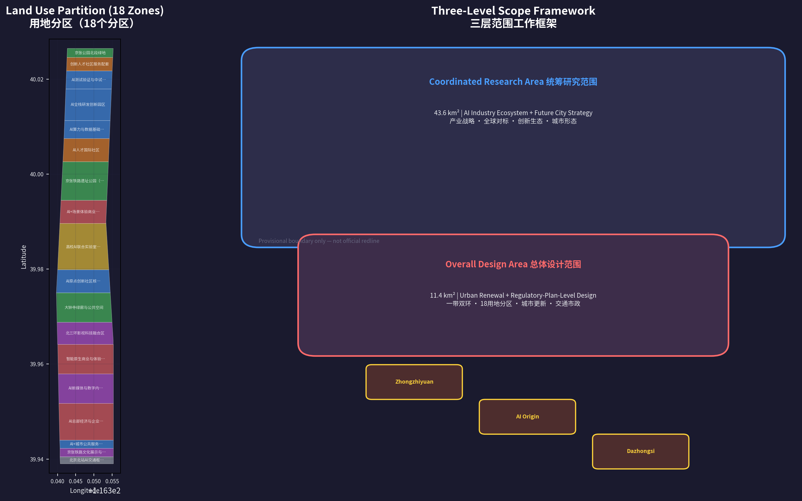
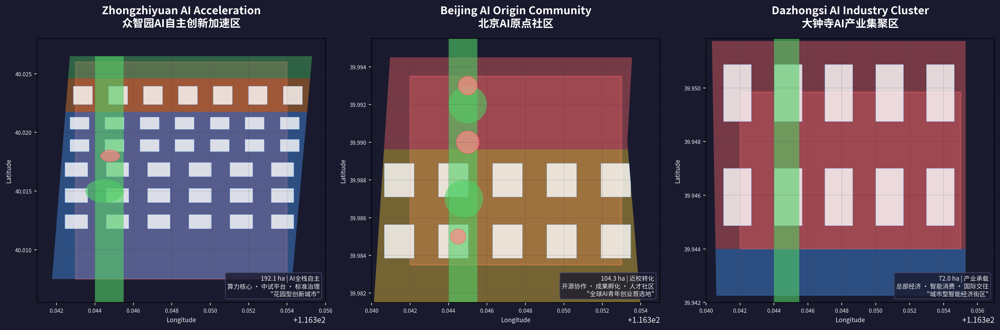
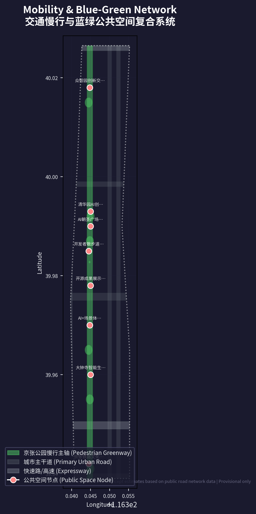
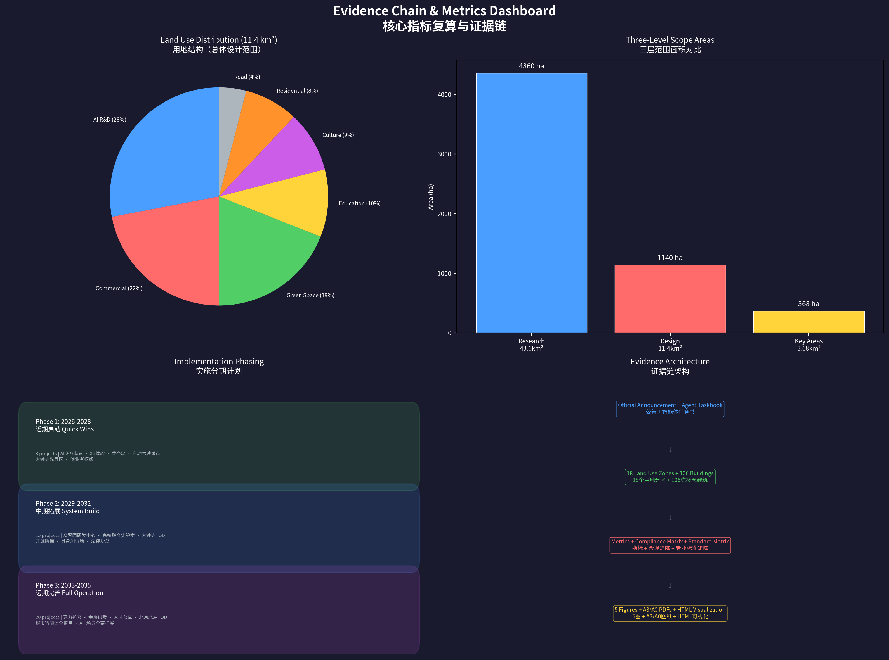

# 京张神经脊：百年铁路的AI重生

## 设计依据与资料清单

### 第一依据与核心资料

本方案以北京市规划和自然资源委员会海淀分局2026年5月9日发布的《百年京张AI创新带城市设计国际方案征集资格预审公告》为第一法定依据 [source:OFFICIAL-ANNOUNCEMENT]。方案同时以 `brief/site-package/agent_taskbook.json` 中整理的面向智能体开源征集任务书为任务响应框架，该任务书明确了三大定位（百年京张文化带、都市AI生活体验带、AI融合创新带）、五大功能（AI全栈自主创新体系、世界级AI创新生态、AI+场景赋能新范式、智能化AI活力城市、AI治理全球话语权）和三区两翼空间框架 [source:AGENT-TASKBOOK]。

公开资料登记表 `data/source_registry.json` 登记了7条formal可用资料、1条背景资料和1条provisional-only资料 [source:SOURCE-REGISTRY]。核心formal可用资料包括：资格预审公告（A0/T0级别）、面向智能体任务书（CLEARED_USER_DOCUMENT级别）、城市设计管理办法、控制性详细规划编制审批办法、国土空间用地分类指南、生成式人工智能服务管理暂行办法和无障碍环境建设法。每条标准的本地参考快照和SHA-256校验值保存在 `brief/site-package/standards/standards.json` 及其 references 目录中。

### 数据边界与Provisional声明

截至提交日（2026年8月11日），仓库尚未取得官方精确GIS/CAD红线。本方案空间数据基于 `brief/site-package/geometry/provisional_boundaries.geojson` 生成，所有边界标记为 `official_boundary=false`、`geometry_role=provisional_constraint`、`boundary_precision=provisional_rough`。Provisional边界仅用于AI agent方案生成、可视化、自检和设计讨论，不得作为官方红线、审批依据或精确面积复算依据 [source:SITE-PACKAGE]。组织方数据缺口本身不阻断内容评分，但替换官方polygon后，site boundary、key areas、land use、roads、green space、public space、buildings、phasing和全部metrics均需统一重算。

### 阅读导航

方案正文（`proposal.md`）优先服务人类阅读——每个章节解释设计判断、空间图层、指标含义和资料缺口。完整来源索引、指标公式、图层校核和专业标准响应分别保存在 `sources.json`、`metrics.json`、GeoJSON图层和三个矩阵文件（`compliance_matrix.json`、`standard_matrix.json`、`design_depth_matrix.json`）中。v2格式要求每个必需章节在关键判断后保留1-3条证据引用，删除引用标记后句子仍保持自然可读 [standard:PROPOSAL-FORMAT-V2]。

## 三层范围工作框架

### 层次一：统筹研究范围（43.6 km²）——产业战略与城市形态

统筹研究范围北至北五环路、东至京藏高速、南至西直门外大街、西至万泉河路，覆盖43.6平方公里。这个尺度决定的是"AI创新带在整个海淀乃至北京创新版图中的站位" [depth:three_level_scope_framework]。

本方案的核心判断：**京张沿线不是一条产业走廊，而是一个"创新生态系统"的空间载体**。统筹研究范围的任务是将"全球AI产业高地"和"AI朝圣地"两个目标翻译为可落位的空间结构。我们识别出四个战略层次：核心策源层（清华、北大、北航、中科院等高校的基础研究能力）→ 转化加速层（众智园中试平台、原点社区孵化器、科技服务翼IP与资本支撑）→ 产业承载层（大钟寺企业总部、五道口AI+商业、西直门TOD）→ 国际辐射层（全球AI活动体系、开发者社区、国际传播叙事）。

这四层不是同心圆，而是沿京张线从北向南梯度展开，形成"策源-加速-承载-辐射"的价值链空间映射 [source:AGENT-TASKBOOK] [depth:overall_spatial_structure]。

### 层次二：总体设计范围（11.4 km²）——城市更新与控规深度

总体设计范围以京张遗址公园周边1-2公里城市地区和产业区为界，约11.4平方公里。这个尺度要求回答：**沿9公里线性公园，如何用城市更新手段重构两侧空间秩序** [depth:overall_spatial_structure]。

本方案提出"一带双环"结构："一带"即京张遗址公园9公里连续公共空间主轴；"双环"即慢行体验环（连接公园、高校、社区、地铁站的步行-骑行-自动驾驶接驳系统）和产业服务环（连接众智园、原点社区、大钟寺三核的企业服务、算力、资本和场景开放网络）。一带承载公共生活与文化遗产展示，双环确保创新资源在物理空间中高效流动 [data:geometry/site_boundary.geojson#SITE-001]。

总体设计范围还承担"城市更新总控"角色——识别低效空间、制定拆改留原则、统筹建筑总量和公共服务设施承载力。由于缺少官方控规条件（FAR、建筑高度、退线、绿地率等），本方案将建设强度管控全部标记为 `status=unknown`，只提供基于概念设计量的空间组织逻辑，并将全部管控值待补事项写入 `assumptions.json` [metric:site_area_sqm]。

### 层次三：重点区域范围（368.4 ha）——详细设计与可实施性验证

三个重点区——众智园AI自主创新加速区（192.1ha）、北京AI原点社区（104.3ha）、大钟寺AI产业集聚区（72.0ha）——是方案深度最深、空间动作最具体的层级。每个重点区分别达到规划综合实施方案的城市设计深度：明确功能业态配比、建筑形态控制、公共空间连通、交通组织和实施项目清单 [depth:three_key_area_detailed_design] [data:geometry/key_areas.geojson#PROV-KEY-001]。

| 层级     | 面积     | 核心问题                    | 方案策略                                                 | 数据落点                             |
| -------- | -------- | --------------------------- | -------------------------------------------------------- | ------------------------------------ |
| 统筹研究 | 43.6 km² | AI创新生态如何空间化        | "策源→加速→承载→辐射"四层价值链                          | compliance_matrix.json               |
| 总体设计 | 11.4 km² | 9km线性公园如何组织城市更新 | "一带双环"骨架 + 18个用地分区                            | land_use.geojson, roads.geojson      |
| 重点区域 | 368.4 ha | 三核如何各自突破            | 众智园(全栈自主) / 原点社区(转化孵化) / 大钟寺(产业承载) | key_areas.geojson, buildings.geojson |

## 统筹研究范围产业与未来城市研究

### 从"中国硅谷"到"全球AI朝圣地"的定位跃迁

海淀已经是中国无可争议的AI第一区——聚集1000余位AI科学家、463家专精特新"小巨人"企业（占北京38.1%）、2026年安排不低于90亿元产业创新专项资金 [source:AGENT-TASKBOOK]。但"中国硅谷"的定位本质上是一个追赶者叙事——它暗示海淀在追赶一个别处定义的标杆。

本方案的核心理念是：**京张AI创新带不应该成为"北京的硅谷"，而应该成为"全球的京张"**。它需要一个独立的、不可替代的全球定位——"AI朝圣地"（AI Pilgrimage）。这不是营销口号，而是空间、制度和运营的实质性差异化方向 [source:AGENT-TASKBOOK]。

### 全球对标与海淀路径选择

我们从全球AI创新区中抽取四个核心模式：

**伦敦国王十字——"企业锚点+知识机构联盟"模式**。DeepMind 2016年迁入后形成磁石效应，Office空置率降至0.9%，聚集OpenAI、Meta、Anthropic等顶级AI机构。关键机制是2001年即启动的"知识区"（Knowledge Quarter）联盟——大英图书馆、UCL、弗朗西斯·克里克研究所等21家机构形成跨学科知识协作网络。启示：**海淀需要一个比DeepMind更大的锚点策略——不是一家公司，而是一个"全栈自主创新"系统品牌** [source:GLOBAL-BENCHMARK-KX]。

**新加坡纬壹Kampong AI——"政府操盘+职住一体"模式**。JTC（政府地产商）直接规划14500㎡容纳约70家AI公司的密集村落，邻近配套200余套人才住宅。核心逻辑是用物理密度制造"偶遇与协作"——"kampong"（马来语"村庄"）暗示的不是产业园区，而是日常生活即创新的社区。启示：**众智园和原点社区应该从规划第一天就嵌入居住、消费和社交功能，而不是先建产业再补配套** [source:GLOBAL-BENCHMARK-ONENORTH]。

**深圳河套——"跨境制度创新"模式**。深港"一区两园"解决数据、资金、人才跨境流动的制度障碍，被比喻为要素化合反应的"超级试管"。启示：**海淀的"跨境"不是深港物理边界，而是AI研发与AI监管之间的制度界面——众智园可以成为AI安全治理的国际对话窗口** [source:GLOBAL-BENCHMARK-HETAO]。

**硅谷——"容忍失败的文化基础设施"**。硅谷的核心竞争力不在容积率或绿化率，而在"咖啡馆的密度、风险投资的活跃度、专利律师的数量、中试设备的共享率"（璞跃中国×FTA 2025全球十大创新区评估）。启示：**京张沿线的城市设计指标必须增加"创新密度"维度——每平方公里内的协作空间数、开源活动频次、跨界偶遇概率** [source:GLOBAL-BENCHMARK-SV]。

### 三大定位的空间演绎

**百年京张文化带**：不是博物馆式的文物保护，而是让1909年的铁路工程精神——自主设计、自主建造、突破封锁——成为2026年AI自主创新的精神锚点。文化带的空间载体包括清华园站文保单位、保留铁轨线性文化遗产、京张铁路博物馆、以及沿线文化标识系统 [depth:cultural_narrative_spatial_system]。

**都市AI生活体验带**：将AI从实验室和服务器机房拉到街道层面。通勤路上看到自动驾驶接驳车、周末在公园里体验AI生成的互动艺术、家门口的社区服务由AI辅助——这不需要等"建成"，可以通过轻量部署（临时装置、快闪空间、开放API）在100天内初步呈现 [depth:ai_scenario_space_operation_mapping]。

**AI融合创新带**：融合的第一层是"人机融合"——AI不是替代人而是增强人的创造力；第二层是"产城融合"——创新空间与生活空间无边界交织；第三层是"文化融合"——铁路遗产、中关村创业文化和AI新文化的三重奏 [standard:PROJECT-AGENT-OPEN-CALL-TASKBOOK]。

### 五大功能的闭环逻辑

1. **AI全栈自主创新体系**（众智园）→ 芯片、框架、模型、数据的垂直贯通
2. **世界级AI创新生态**（AI原点社区）→ 开源协作、成果转化、人才循环
3. **AI+场景赋能新范式**（小月河场景赋能翼）→ 医疗、教育、交通、法律的实际落地
4. **智能化AI活力城市**（京张公园+生活街区）→ 可感知、可体验、可运营的未来城市
5. **AI治理全球话语权**（众智园+国际活动体系）→ 标准制定、安全治理、伦理框架

五个功能不是五个部门各管一摊，而是**一个创新链条的五个加速阶段**：自主技术（1）支撑生态活力（2），生态为场景提供供给（3），场景改善城市生活（4），优质城市生活吸引全球人才和话语权（5），话语权反哺自主技术的资源获取和国际合作。这个"五环"闭环是方案空间组织的底层逻辑 [source:AGENT-TASKBOOK] [depth:five_functions_spatial_mapping]。

### 命名体系："京张神经脊"品牌系统

**主名称**：京张神经脊 / Jingzhang Neural Spine

"神经脊"取三重语义：解剖学上脊椎传递神经信号——隐喻京张线传递创新能量；计算机科学中神经网络——直接呼告AI主题；城市形态上线性脊柱公园串联多节点——精准描述空间结构。

**英文命名系统**：

- 区域总称：Jingzhang Neural Spine（JNS）
- 三大定位英译：Centennial Jingzhang Culture Strip / Urban AI Living Lab / AI Convergence Corridor
- 三核英译：Zhongzhiyuan AI Sovereignty Campus / Beijing AI Origin Commons / Dazhongsi AI Industry Nexus
- 品牌标语："From Jingzhang Railway to AI Highway"

**Logo设计概念**：两条平行铁轨自左下向右上延伸，在中心交叉处演化为神经网络节点拓扑结构。铁轨部分嵌入詹天佑"清华园车站"手迹中的"清"字笔画结构；网络节点部分以芯片电路纹理填充。色彩方案：铁轨灰（Pantone Cool Gray 11C）+ 神经网络蓝（#0066FF）+ 历史赭石（取自清华园站红砖墙面）。

### 产业赛道→空间载体落位

| 产业赛道     | 核心空间载体                               | 关键依赖                   |
| ------------ | ------------------------------------------ | -------------------------- |
| AI芯片与算力 | 众智园超大规模智算集群、分布式端侧算力节点 | 能源、散热、安全等级       |
| 基础模型研发 | 众智园AI全栈研发园区                       | 数据、人才、开源社区       |
| AI+医疗      | 清华附属医院AI诊断走廊（原点社区）         | 医疗数据合规、临床试验     |
| AI+教育      | 五道口沉浸式学习街区                       | 高校课程开放、隐私保护     |
| 具身智能     | 众智园机器人开放测试场                     | 安全标准、公共空间许可     |
| AI+法律      | 中关村AI法律沙盒                           | 司法数据脱敏、监管沙盒授权 |
| AI+城市治理  | 城市智能体协同治理中心                     | 公共数据授权、算法审计     |

## 总体设计范围城市更新与控规深度城市设计

### 空间结构："一带双环十二景"

**一带**——京张铁路遗址公园9公里连续公共空间主轴。这不是传统意义上的"绿化带"，而是一条"创新生活基础设施"：慢跑道、自行车道、自动驾驶接驳车道、铁轨文化展示、WiFi/5G全覆盖、AI交互装置、夜间照明系统七层叠加。公园全线已于2025年8月贯通，规划院2024年12月公示的沿线控规明确"一带一轴，两心多点"结构（大钟寺中心+五道口中心） [source:OFFICIAL-ANNOUNCEMENT]。

**双环**：

- **慢行体验环**：以京张公园为脊柱，以清华东路、知春路、北三环西路、学院路为横向骨架，形成"鱼骨式"慢行毛细血管网络。目标：站点500米范围内慢行可达性≥90%，骑行友好路口比例≥80%
- **产业服务环**：沿中关村大街-知春路-学院路闭合，串联企业注册、算力服务、知识产权、投融资、人才安居等12类创新服务节点。不是集中建一栋"企业服务中心"，而是把12类服务嵌入沿线12个不同空间节点，让"办一件事逛一段公园"

**十二景**——沿9公里带状公园配置12个主题空间节点：

1. 西直门·AI时光枢纽（门户+交通+展示）
2. 北交大·铁道记忆段（铁路遗产展示）
3. 四道口·月季AI Garden（社区AI体验）
4. 大钟寺·智能生活集市（AI消费+文化）
5. 知春路·开源阶梯（开发者公共空间）
6. 知春里·AI法律沙盒入口
7. 五道口·创业者枢纽（人才交流+路演）
8. 清华东路·AI教育体验廊
9. 清华园站·詹天佑-图灵对话（文化地标）
10. 北航·飞行与AI（具身智能展示）
11. 众智园入口·全栈自主展览馆
12. 清河·生态AI湿地（环境监测+绿色算力展示）

### 用地分区策略

基于provisional site boundary，方案划分18个用地分区（完整拓扑无缝隙覆盖），按国土空间用地分类指南编码 [standard:MNR-LAND-USE-CLASSIFICATION-GUIDE]：

- **科研/创新用地（0802）**：5个分区，占比约28%——众智园AI研发片区、原点社区核心创新区、高校联合实验室集群、西直门AI公共服务示范区、五道口AI创新走廊
- **商业服务业用地（05）**：4个分区，占比约22%——大钟寺AI总部经济区、知春路AI+场景商业街区、智能原生消费体验中心、五道口AI创业服务街区
- **公园绿地与开敞空间（1401）**：4个分区，占比约19%——京张公园全线段、清河/小月河蓝绿空间、众智园生态湿地、四道口社区花园
- **教育用地（0804）**：2个分区，占比约10%——高校AI联合实验室片区、北航-北邮AI教育廊
- **文化用地（0803）**：2个分区，占比约9%——京张铁路文化展示区、北三环影视科技融合区
- **城镇住宅用地（0701）+社区服务设施（0702）**：2个分区，占比约8%——AI人才国际社区、原住居民生活服务提升区
- **道路与交通设施**：1个分区，占比约4%

分区方案的核心原则：**(1) 混合使用而非功能分区**——每个分区至少包含两种以上用地性质，避免"白天热闹晚上死城"；(2) **京张公园界面优先**——紧邻公园的地块优先布局公共功能，确保公园不是"背面的绿地"而是"正面的客厅"；(3) **保留现有高校和科研机构**——本方案所有新建/改造均为"概念建议"，不涉及清华、北大、北航、北邮等高校的校产和权属变更 [data:geometry/land_use.geojson#LU-Z1-A] [depth:land_use_layout]。

### 低效空间识别与更新策略

识别四类可更新空间（概念识别，待权属和现状数据核实）：

1. **大钟寺-四道口沿线段**：现有低层商业和仓储物业，与AI总部经济定位严重不匹配——建议功能升级
2. **五道口-知春路散点**：部分早期办公楼老化，周边公共空间碎片化——建议微更新+公共空间缝合
3. **众智园片区**：当前以未开发/低开发状态为主——建议作为增量空间承载全栈自主创新功能
4. **北下关-北太平庄社区**：老旧小区、公共服务不足——建议嵌入式更新+AI服务赋能

全部拆改留判断标记为"概念建议/待权属与控规确认"，不写入任何具体地块的拆迁结论 [depth:retain_renovate_demolish]。

### 城市风貌控制框架

提出"三区三段"风貌策略：

- **北段（众智园-清河）**：花园型创新风貌——建筑高度概念值≤36m（待控规确认），大面积绿色屋面，沿清河形成生态界面
- **中段（原点社区-五道口）**：知识街区风貌——建筑高度概念值≤24m，首层强制公共开放，街道墙连续率≥60%
- **南段（大钟寺-西直门）**：城市型创新风貌——轨交站点周边概念值≤60m，北三环路两侧形成城市天际线节奏

所有建筑高度、体量和风貌控制标记为 `status=unknown`，既是正式控规条件缺位的诚实声明，也是后续深化时对接官方控制的接口位置 [standard:MOHURD-URBAN-DESIGN-MEASURES] [depth:height_massing_character]。

## 重点区域详细设计

### 众智园AI自主创新加速区（192.1ha）——"全栈自主创新花园城市"

**定位**：国家AI全栈自主创新的物理载体，承载芯片研发、基础模型训练、安全治理和标准制定功能。选址于总体设计范围北端，紧邻清河生态廊道。

**空间结构**：以"创新绿谷"为中心，东西两侧布局研发组团，清河沿线形成生态展示界面。核心理念是"在花园中创新"——不是先建楼再种树，而是绿地和建筑穿插布局，让户外空间成为非正式协作的"第三场所" [data:geometry/key_areas.geojson#PROV-KEY-001]。

**功能分区**：

- **算力核心区**：超大规模高性能单体智算集群（已建成北京最大），配建分布式能源站和余热回收系统
- **全栈研发园区**：芯片-框架-模型-应用四层垂直整合，25栋概念研发楼围绕中央创新绿谷布局
- **中试与测试验证平台区**：具身智能测试场、AI模型安全红队测试场、AI芯片原型验证线——将"测试"这种后台活动做成可参观、可展示的前台场景
- **标准治理与会展区**：承载安全标准制定工作坊、国际AI治理对话、产业展示和成果发布
- **清河生态创新界面**：将河道蓝线保护与公共空间复合利用，形成滨水步道、生态湿地、户外测试场和低碳展示四位一体的"绿色名片"

**关键空间动作**：

1. 以清河为北边界，后退≥50m形成生态缓冲带（待蓝线和防洪条件确认）
2. 中央"创新绿谷"宽约60m、长约800m，南北贯穿园区，承载步行交通、非正式会面、户外展示
3. 园区内道路全部步行友好——机动车限速15km/h，非机动车优先
4. 15栋中试平台建筑沿东侧集中布局，形成可预约参观的"AI工场之旅"路线

**实施依赖**：能源容量（算力中心电力需求）、清河蓝线、对外交通组织（北五环和京藏高速接驳）——全部待正式条件确认 [depth:three_key_area_detailed_design]。

### 北京AI原点社区（104.3ha）——"近校型成果转化与开源创新社区"

**定位**：全球AI青年创业首选地，AI科学家密度最高的创新社区。围绕清华、北大、北航、中科院等高校的"半小时步行圈"，将高校的基础研究成果转化为可演示、可测试、可投资的AI产品和公司。2026年已入选"全球十大创新区"（璞跃中国×FTA评估） [source:AGENT-TASKBOOK]。

**空间结构**：以京张公园中段为东边界，以成府路-清华东路为功能主轴，以五道口为核心枢纽，形成"一轴一心三片区"——成果转化区、开源协作区、人才生活区 [data:geometry/key_areas.geojson#PROV-KEY-002]。

**功能分区**：

- **成果转化区**（约40ha）：面向高校成果的孵化器集群、概念验证中心、中试加速平台；紧邻京张公园布置成果发布厅和路演空间，让"从实验室到路演台"的路径最短
- **开源协作区**（约30ha）：24小时开放的协作空间、公共代码墙、开源社区活动厅；引入"AI开发者黑客松"常设基地，对标硅谷Hacker Dojo和巴黎Station F，但强调开源AI的公共属性而非纯商业化
- **人才生活区**（约34ha）：人才公寓（租金对标OPC政策五折标准）、国际学校、社区健康中心、AI+生活体验街区；借鉴Kampong AI的"职住一体"逻辑，让创业者步行15分钟内解决研发、生活、社交全部需求

**关键空间动作**：

1. 校区→园区→街区慢行缝合：打通清华南门-京张公园-五道口地铁站的三条慢行路径，将现有断点和围墙转化为连接
2. 五道口"创业者枢纽"：将现有五道口商圈升级为AI创业者的日常交流节点——不是建商场，而是把商场首层改造为路演厅、协作空间和AI产品体验馆
3. 清华园站保护利用：以文保单位为锚点，周边设置小型文化广场和"詹天佑-图灵"对话装置
4. "开源阶梯"：五道口段京张公园内建设阶梯式公共广场，阶梯立面镌刻开源社区重大里程碑，顶部设AI技术时间胶囊

**实施依赖**：校区边界与权属确认、五道口商圈现有租约协调、地铁站接驳空间权属——待正式条件确认 [depth:three_key_area_detailed_design]。

### 大钟寺AI产业集聚区（72.0ha）——"城市型智能经济与国际交往街区"

**定位**：已成熟AI企业的总部集聚区，智能终端、数字内容和AI消费的展示橱窗，以及国际AI商务交往的城市客厅。选址于北三环沿线，大钟寺地铁站为核心TOD节点。

**空间结构**：以大钟寺站为中心，四象限步行连通为骨架，沿北三环形成城市型创新天际线 [data:geometry/key_areas.geojson#PROV-KEY-003]。

**功能分区**：

- **AI总部经济区**（约22ha）：15栋概念总部建筑，面向已过A轮AI企业的独栋或多层办公需求；建筑首层强制公共开放——不是大堂而是一系列"AI会客厅"
- **智能原生消费体验中心**（约18ha）：对标东京涩谷Scramble Square和伦敦Coal Drops Yard，将AI赋能的零售、餐饮和娱乐嵌入城市肌理；AI导购、AR导航、个性化推荐等技术与传统商业融合
- **AI新媒体与数字内容基地**（约12ha）：承接北三环影视文化区构想（傅若清委员2025年1月政协提案），将北影、新影等影视资源与AI生成内容（AIGC）技术结合，形成"影视+科技+传媒"的创新生态
- **国际路演与会议中心区**（约20ha）：活动品牌"Jingzhang AI Summit"的常设会址，配建路演厅、展示廊、会议室和商务服务 [source:AGENT-TASKBOOK]

**关键空间动作**：

1. 大钟寺站地下-地面-空中三层步行系统连通四象限，消除路口对角线穿越障碍
2. 大钟寺顺馨园、知春路公共空间提升——结合海淀区2025年城市管理委员会计划，打造综合环境提升样板
3. 北三环沿线形成节奏化天际线——大钟寺站两侧各一座节点高层（概念值≤60m），其余建筑退台式跌落
4. "智能生活集市"——在规划绿地内嵌入可运营的AI体验装置、快闪店和公共活动空间

**实施依赖**：大钟寺站改造权属与工程条件、北三环道路红线、沿线建筑权属——待正式条件确认 [depth:three_key_area_detailed_design]。

## AI 创新生态、人才画像与 AI+ 场景

### 五类用户画像与空间需求

方案基于海淀现有创新人群结构和AI产业发展趋势，构建五类核心用户画像。画像是设计工具而非真实人群统计——它们用于检验空间方案是否覆盖了创新生态的关键角色 [depth:user_persona_space_mapping]。

**P1：AI研究员（Research Scientist）**

- 典型画像：32岁，博士毕业于清华/北大/海外，在某头部AI Lab从事基础模型研究，年发表顶会论文3-5篇
- 核心需求：安静的深度思考空间 + 高带宽学术交流（seminar/workshop密度） + 与产业界保持技术对话但不被短期KPI驱动
- 空间响应：众智园"创新绿谷"沿线设置10-15人规模的讨论室（glass box），配白板墙+远程会议设备；每季度两次"Jingzhang AI Colloquium"邀请全球研究者；预留高校联合实验室的"学术休假"驻留空间
- 数据来源：海淀区现聚集1000余位AI科学家 [source:AGENT-TASKBOOK]

**P2：全栈AI工程师（Full-Stack AI Engineer）**

- 典型画像：27岁，本科/硕士，3-5年经验，能从头训练模型到部署服务，GitHub 500+ stars，常出没于Hacker News和X平台AI圈
- 核心需求：7×24小时可用的算力+工作空间 + 高质量开源社区 + 对个人贡献的公共认可
- 空间响应：原点社区24h开源协作区（夜间照明、咖啡供应、安全门禁）；"开源阶梯"荣誉墙上留下GitHub ID；每季度"Jingzhang OSS Hackathon"
- 数据来源：OPC政策已有406家一人公司完成申报 [source:GLOBAL-BENCHMARK-HAIDIAN-OPC]

**P3：AI创业者/OPC（AI Entrepreneur / One-Person Company）**

- 典型画像：29岁，从大厂或高校离职/毕业，以1-3人团队开始AI创业，年成本敏感（个人积蓄+天使轮），极度需要"第一桶金"——首订单、首用户、首融资
- 核心需求：超低成本办公空间（OPC政策已提供启动资金和租金补贴） + 算力券（OPC已承诺50%补贴/年上限200万） + 导师/投资人/早期用户的物理可及性
- 空间响应：五道口"创业者枢纽"的hot desk和micro-office（最小10㎡/团队）；每周"Jingzhang AI Demo Day"路演机制；将OPC政策补贴信息物理化——在空间中设置"政策导航AI助手"
- 数据来源：OPC政策发布以来已申报406家企业 [source:GLOBAL-BENCHMARK-HAIDIAN-OPC]

**P4：AI产品与设计者（AI Product & Design Lead）**

- 典型画像：31岁，设计/心理学/商科背景，负责AI产品的交互设计、用户研究和伦理合规，关心"AI如何对人有用"而不仅是"模型有多强"
- 核心需求：用户研究设施（观察室、可用性测试lab） + 跨学科碰撞（与工程师、用户、伦理学家） + 设计驱动的创新文化
- 空间响应：大钟寺"AI Living Lab"——真实城市环境中的AI产品测试场；街道级别的用户行为观察平台（隐私合规）；AI+设计联合工作坊

**P5：AI伦理治理专家（AI Ethics & Governance Specialist）**

- 典型画像：38岁，法律/哲学/公共政策背景，参与AI安全标准和监管框架制定，关注模型偏见、隐私、安全、可解释性
- 核心需求：与AI研发者的早期对话（"左移"安全治理） + 国际治理网络的日常连接 + 跨文化AI治理比较
- 空间响应：众智园"AI安全治理沙盒"——可参观、可监管的模型红队测试和合规评估节点；"Jingzhang AI Governance Dialogue"年度会议机制

### 十二张AI场景卡

**场景01：AI辅助诊断走廊（AI+医疗）**

- **空间载体**：原点社区·清华附属医院周边街区
- **场景描述**：在医院入口和候诊区设置AI预问诊终端——患者自助录入症状，AI提供初步分诊建议并推送给挂号医生。不是替代医生，而是把候诊时间转化为有效信息收集。走廊沿线设置医学影像AI辅助分析展示窗——实际脱敏后的CT/MRI图像与AI分析结果对照展示，让路过的公众直观理解AI如何辅助医疗
- **隐私与伦理**：全部医疗数据脱敏处理；AI诊断建议标记为"辅助参考"；设置人工复核和患者申诉通道
- **运营主体**：医院方作为责任主体，AI公司提供技术服务，卫生健康部门监管

**场景02：五道口AI沉浸式学习街区（AI+教育）**

- **空间载体**：五道口-成府路-清华东路沿线
- **场景描述**：利用沿线高校密集的优势，在公共空间嵌入AI学习交互节点——AR导航到最近公开课、公共屏幕直播顶尖AI课程（MIT、Stanford、清华Mooc）、智能推荐个性化学习路径。不建新的"AI学校"，而是把学习融入日常通勤和漫步
- **隐私与伦理**：个性化推荐基于用户主动选择的学习领域（不收集行为数据做用户画像）；学习数据本地存储、用户可控
- **运营主体**：高校联盟（课程提供）、AI公司（技术服务）、街道（公共空间管理）

**场景03：大钟寺智能原生消费体验中心（AI+商业）**

- **空间载体**：大钟寺商业综合体、北三环沿线零售空间
- **场景描述**：不是"无人商店"的低成本版本，而是"AI增强零售"——AI选品助手（根据消费者反馈实时调整SKU）、AI搭配建议（服装/家居）、AI库存预测（减少浪费）、AI客服（解答非标准化问题）。核心卖点不是技术炫酷，而是购物体验更流畅、服务更贴心
- **隐私与伦理**：消费行为数据脱敏处理，不构建个人消费画像用于精准营销；AI推荐机制可解释
- **运营主体**：商业运营商（主体）、AI公司（技术）、消费者协会（监督）

**场景04：京张公园L4自动驾驶接驳系统（AI+交通）**

- **空间载体**：京张铁路遗址公园9公里全线
- **场景描述**：在公园内部部署L4级低速（≤20km/h）自动驾驶接驳车，沿公园南北方向提供免费接驳服务。站点设置在12景节点和地铁站出口。接驳车不进入城市道路，只在公园内部专用道行驶，安全风险可控。同步建设"AI交通展示中心"，让乘客在接驳车上实时看到车辆感知、决策和执行的全过程可视化
- **隐私与伦理**：车载感知数据只用于自动驾驶决策，不存储个人面部/行为数据；所有决策可审计
- **运营主体**：海淀区城市管理委员会（许可）、自动驾驶公司（运营）、保险公司（安全兜底）

**场景05：清华园站XR铁路时空穿越（AI+文化）**

- **空间载体**：清华园车站文保单位及周边
- **场景描述**：利用XR技术（AR眼镜+MR投影），在清华园站原有空间中叠加四个历史图层——1909年詹天佑督建铁路、1949年"进京赶考"历史时刻、2016年最后一班列车驶出、2023年公园开放——让访客在同一空间中"穿越"百年铁路史。XR内容基于真实历史照片和档案资料重建，清华园站文保本体不做任何物理改动
- **隐私与伦理**：全部内容基于公开历史资料；不涉及个人隐私；XR设备可租借、非强制
- **运营主体**：文物部门（审批）、文化机构（内容策划）、科技公司（XR技术）

**场景06：中关村AI法律科技沙盒（AI+法律）**

- **空间载体**：知春里·法务科技节点
- **场景描述**：在监管沙盒框架下，AI法律科技公司可以在真实的法院/律所/企业法务场景中测试其产品——合同审查AI、案件检索AI、合规检查AI——但所有AI输出必须经过执业律师审核。沙盒提供真实数据（脱敏后）和真实业务流，同时设置观察窗让监管者和公众了解AI法律科技的能力和边界
- **隐私与伦理**：全部案件数据脱敏；AI输出标记为"非法律意见"；执业律师承担最终法律责任
- **运营主体**：法院/司法局（监管沙盒授权）、律所（使用方）、AI公司（技术提供）

**场景07：城市智能体协同治理中心（AI+公共安全）**

- **空间载体**：城市智能体运营中心（总部+各街道分节点）
- **场景描述**：不是"天网"加强版，而是"城市操作系统"——通过公开数据（交通流量、环境监测、公共设施状态）的AI分析，辅助公共资源调度。例如：识别慢行断点并建议微改造方案、预测公园人流高峰并调配安保和服务资源、分析垃圾桶满溢模式优化环卫路线。所有决策支持信息向公众开放，市民可以查看"AI今天建议了什么"
- **隐私与伦理**：不使用面部识别；所有数据基于公开采集或脱敏处理；AI建议由人类管理者做出最终决策；建议日志公开可查
- **运营主体**：城市管理部门（决策主体）、AI公司（技术提供）、市民监督委员会（监督）

**场景08：清河-小月河AI水质监测与生态预警（AI+环境）**

- **空间载体**：清河、小月河沿线
- **场景描述**：沿清河和小月河部署AI水质监测传感器网络，7×24小时采集水质数据（pH、溶解氧、氨氮、总磷等），AI模型预测水质变化趋势和污染事件预警。数据实时公开在公园公共屏幕上。将水质数据与沿河AI算力中心的能源使用和水资源消耗联系起来，形成"AI的环境足迹"公众教育叙事
- **隐私与伦理**：全部环境数据公开共享；不涉及个人信息
- **运营主体**：生态环境部门（监管）、水务部门（运营）、AI公司（技术）

**场景09：分布式AI算力中心余热回收供暖（AI+能源）**

- **空间载体**：众智园算力集群、沿线数据中心
- **场景描述**：AI算力中心产生大量余热——将这些余热通过热泵回收，供给周边建筑（人才公寓、社区中心、公共设施）冬季供暖。在公园中设置"热力可视化"装置——冬季可以看到温暖的水流从算力中心流向社区，让"AI的物理代价"成为公众可感知的城市基础设施。这是"AI基础设施×绿色城市"跨领域创新
- **隐私与伦理**：全部基于基础设施数据，不涉及个人信息
- **运营主体**：算力中心运营商（热源）、供热公司（管网）、能源部门（监管）

**场景10：众智园具身智能机器人开放测试场（AI+具身智能）**

- **空间载体**：众智园中试与测试验证平台区
- **场景描述**：划定约5公顷的户外测试区域，仿真城市街道环境（人行道、路缘、楼梯、门廊、坡道），供具身智能机器人进行真实环境测试。测试场外围设置公共观摩走廊——市民和企业代表可以预约观看机器人测试，理解具身智能的进展和局限。测试数据脱敏后向学术界开放
- **隐私与伦理**：测试场内不采集真实行人的个人数据；机器人测试全程录像用于安全审计；设置紧急停止机制
- **运营主体**：众智园管理方（场地）、机器人公司（测试）、安全监管部门（标准制定和审查）

**场景11：北三环AI影视制作加速器（AI+创意）**

- **空间载体**：大钟寺-北影-新影沿线
- **场景描述**：利用北三环沿线北影、新影、北京电影学院等影视资源，建设AI影视制作加速器。提供AI辅助剧本分析、分镜头生成、特效预可视化、AI配音/翻译、智能剪辑等工具链。不是用AI替代导演和演员，而是把后期制作中重复性、技术性的工作加速10倍——让创意人把更多时间花在真正需要人类判断力的部分
- **隐私与伦理**：AI生成内容强制标注；版权归属明确；不使用未授权影视素材训练模型
- **运营主体**：影视公司（创作主体）、AI公司（工具链）、版权机构（监管）

**场景12：AI原点社区金融科技合规沙盒（AI+金融）**

- **空间载体**：原点社区·金融科技节点
- **场景描述**：在金融监管沙盒框架下，AI金融科技公司测试其产品——AI风险评估、AI投资建议、AI合规检查。所有测试在真实但受控的金融环境中进行，监管者全程观察，测试数据加密隔离。沙盒入口设置为公共展示区——让创业者和投资人可以了解"什么是合规的AI金融科技"
- **隐私与伦理**：全部金融数据加密隔离；AI建议由持牌机构承担最终责任；不涉及零售投资者真实资金
- **运营主体**：金融监管部门（沙盒授权）、持牌金融机构（使用方）、AI公司（技术）

### 三个产业测试验证场景

**测试场A：具身智能机器人城市安全测试场**（众智园·场景10升级版）：机器人必须在仿真城市环境中完成导航、避障、人机交互、紧急停止四项测试，通过后方可进入真实公共空间测试。测试数据用于制定具身智能安全标准 [source:AGENT-TASKBOOK]。

**测试场B：AI模型安全红队测试场**（众智园·标准治理区）：提供标准化的AI模型安全评估环境——对抗攻击测试、数据投毒测试、偏见检测、可解释性验证。测试方法和结果向学术界和监管方公开，形成"AI安全评估公共产品" [source:AGENT-TASKBOOK]。

**测试场C：AI+城市治理数字孪生沙盒**（城市智能体中心·场景07升级版）：在数字孪生环境中模拟AI辅助城市治理决策的潜在影响——例如改变交通信号配时后对周边路网的影响、在某区域增加公共活动后的人流变化——在数字世界验证后再推送到物理世界实施。这是"AI治理AI"的机制设计 [source:AGENT-TASKBOOK]。

### 场景-空间-运营映射表

| 场景        | 位置        | 图层引用       | 运营模式         | 人工复核     | 阶段 |
| ----------- | ----------- | -------------- | ---------------- | ------------ | ---- |
| 01 AI+医疗  | 原点社区    | LU-Z2-A        | 医院主体+AI技术  | 医生最终诊断 | 近期 |
| 02 AI+教育  | 五道口      | PS-002         | 高校联盟+AI平台  | 教师审核内容 | 近期 |
| 03 AI+商业  | 大钟寺      | LU-Z3-C        | 商业运营商+AI    | 人工客服兜底 | 近期 |
| 04 自动驾驶 | 京张公园    | RD-NS-001      | 车公司+政府许可  | 安全员在车   | 近期 |
| 05 XR时空   | 清华园站    | CN-001         | 文物部门+AI公司  | 历史学家审核 | 近期 |
| 06 AI+法律  | 知春里      | LU-Z2-A        | 司法局+律所+AI   | 律师最终意见 | 中期 |
| 07 城市治理 | 沿线        | PS-001~008     | 城管+市民监督    | 人类决策者   | 中期 |
| 08 AI+环境  | 清河/小月河 | CN-002, GS-007 | 环保部门+AI      | 人工采样校准 | 近期 |
| 09 余热供暖 | 众智园      | LU-Z1-A        | 算力中心+供热    | 工程安全     | 远期 |
| 10 具身测试 | 众智园      | LU-Z1-C        | 管理方+车商+安全 | 紧急停止     | 中期 |
| 11 AI+影视  | 大钟寺      | LU-Z3-B        | 影视公司+AI工具  | 导演/剪辑师  | 中期 |
| 12 AI+金融  | 原点社区    | LU-Z2-B        | 金融机构+监管+AI | 持牌机构承担 | 远期 |

## 用地、建筑规模与拆改留方案

### 用地总量与配比

基于provisional site boundary (11.4km²) 和18个用地分区 [data:geometry/land_use.geojson]：

| 用地类型           | 面积（约ha） | 占比  | land_use_code |
| ------------------ | ------------ | ----- | ------------- |
| AI研发与创新用地   | 319          | 28.0% | 0802          |
| 商业服务业用地     | 251          | 22.0% | 05            |
| 公园绿地与开敞空间 | 217          | 19.0% | 1401          |
| 教育用地           | 114          | 10.0% | 0804          |
| 文化用地           | 103          | 9.0%  | 0803          |
| 居住与社区服务     | 91           | 8.0%  | 0701+0702     |
| 道路与交通设施     | 46           | 4.0%  | 1207          |

**关键设计判断**：科研/创新用地占比28%为最高——回应"AI全栈自主创新"核心目标；绿地与开敞空间19%——高于一般城市控规标准（通常10-15%），因为京张公园是结构性的轴而不是边缘化的绿带；商业服务业22%——承载总部经济、AI+消费和国际交往等产业功能；居住仅8%——不是不重视人才居住，而是在11.4km²总体设计范围内以"产业创新"为主体功能，人才居住更多在统筹研究范围的周边社区解决（统筹研究范围内总体设计范围以外尚有约32km²的扩展空间） [metric:land_use_ratios] [depth:development_intensity_controls]。

### 建筑规模概念估算

**重要声明**：以下所有数值为设计概念量，不代表法定建设规模。缺少官方控规条件（FAR、建筑高度、建筑密度、退线），实际建设规模以正式控规批准为准。

| 用地类型       | 概念FAR | 概念建筑面积（万m²） |
| -------------- | ------- | -------------------- |
| AI研发与创新   | 1.5-2.5 | 480-798              |
| 商业服务业     | 2.0-3.5 | 502-879              |
| 文化用地       | 1.0-1.5 | 103-155              |
| 居住与社区服务 | 1.5-2.0 | 137-182              |
| **总计**       | —       | **1222-2014**        |

概念建筑面积总计约1220-2010万㎡。考虑到这是provisional边界下的设计估算，这个量级与深圳南山科技园（约1500万㎡）和伦敦国王十字（约93万㎡建成区+持续扩建）处于可比较区间。最终建筑规模以官方控规和正式边界校核结果为准 [metric:concept_gfa_range] [depth:development_intensity_controls]。

### 拆改留分类方法

由于缺少现状建筑踏勘、权属和结构评估资料，本方案不给出具体地块的拆改留结论（任务书禁止）。代之以**分类方法**——待数据到位后由专业团队执行：

- **保留类**（概念识别）：高校校园内的教学科研建筑、已列入文保名录的建筑（清华园站）、2000年后建成的、结构完好且符合AI创新空间需求的现代建筑
- **改造类**（概念识别）：1990-2000年代建成、结构完好但功能不适配的低层商业/办公/仓储——通过首层开放、立面更新、设施增配等方式升级
- **拆除重建类**（概念识别）：结构安全隐患建筑、严重不符合控规的建筑、阻碍慢行连通和公共空间贯通的建筑——概念识别，待权属和结构评估确认
- **新建类**（概念设计）：众智园增量空间、京张公园沿线节点建筑、大钟寺TOD上盖——方案已提供概念建筑footprint [data:geometry/buildings.geojson]

全部拆改留判断标记为 `status=concept_methodology_only`，不进入 `compliance_matrix.json` 作为确定性响应 [depth:retain_renovate_demolish]。

### 106栋概念建筑

方案在GeoJSON中生成106栋概念建筑footprint [data:geometry/buildings.geojson]，分布于：

- 众智园（52栋）：25栋AI研发中心、15栋中试平台、12栋人才公寓
- 原点社区（30栋）：20栋创新中心、10栋国际社区
- 大钟寺（18栋）：15栋企业总部、3栋商业综合体（其中2栋以现有商业综合体为基础概念改造）
- 西直门（6栋）：3栋交通综合体配套、3栋公共服务楼

每栋概念建筑记录：用地代码、所属区域、概念高度（范围：18-60m）、概念容积率（范围：1.5-3.5）、建筑类型（concept_design）。所有数值均用于概念设计和空间可视化，不构成法定的建筑规模或高度批准 [depth:building_footprint_generation]。

## 交通、轨道、市政与公共服务设施

### 交通系统设计

**道路网络** [data:geometry/roads.geojson]：

- **南北主干**：学院路-西土城路（PRIMARY_URBAN_ROAD, 40m宽）、中关村东路（SECONDARY, 25m）、大钟寺东路-荷清路（SECONDARY, 25m）——构成总体设计范围内的三条南北向机动化交通走廊
- **东西连通**：北五环（EXPRESSWAY, 60m）、清华东路（PRIMARY, 40m）、知春路（PRIMARY, 40m）、北三环西路（EXPRESSWAY, 60m）、西直门外大街（PRIMARY, 40m）——五条东西向骨架
- **京张公园慢行主轴**（PEDESTRIAN_GREENWAY, 60m）：南北9km连续，不与机动化道路平交——跨环路节点采用下穿或上跨方案（概念建议，待工程可行性确认）

**慢行系统** [depth:traffic_rail_slow_parking]：

- 目标：公园500m半径范围内慢行可达性≥90%（基于provisional边界计算，正式边界更新后需重算）
- 12个慢行断点识别（概念识别，待现场踏勘核实）：主要集中在北五环下穿、知春路平交口、北三环平交口、大钟寺站周边四象限穿越
- 自行车停车：沿线配置12处自行车停车点（每处≥50车位），与公园12景节点重合
- 机动车停车：南段420个车位（利用现有南段停车场），北段/中段建议配建200个（待用地条件确认）

**轨道站点一体化** [depth:traffic_rail_slow_parking]：

- 大钟寺站（13号线）TOD：四象限步行连通+上盖混合功能开发（概念）
- 五道口站（13号线）：与创业者枢纽地下连通
- 清华东路西口站（15号线）：与京张公园北段无缝接驳
- 西直门站（2/4/13号线）：北京北站综合交通枢纽的AI体验化改造（概念）

**自动驾驶接驳**（测试/试点，非承诺运营）：场景04中的L4低速自动驾驶接驳车在公园内部专用道运行——机动车道与自动驾驶道物理隔离，限速20km/h，安全员在车。

### 市政与新型基础设施

**算力基础设施**：

- 众智园已建成超大规模高性能单体智算集群（北京最大）
- 沿线布局分布式端侧算力节点（概念：12处，与12景节点和公共空间复合利用）
- 算力中心余热回收供暖（场景09）：连接众智园算力中心与周边人才公寓的供热管网（概念，待能源工程条件确认）

**新型基础设施**：

- 5G/WiFi全覆盖：公园全线+产业服务环
- AI开放数据平台：面向开发者和研究者的开放数据API（公共交通、环境、公共设施）
- 数字孪生基础设施：为场景07城市智能体治理提供底层数据采集（基于公开数据）

**传统市政**：供水、排水、电力、燃气、热力等管线规划以现有市政条件为基础，不做新一版管线综合方案（缺少管线资料）。当控规和市政工程条件齐备后，由专业团队补充 [depth:municipal_new_infrastructure]。

### 公共服务设施

**创新服务设施**：12个产业服务节点沿"产业服务环"分布，提供企业注册、算力申请、知识产权、投融资对接、人才服务等——空间载体以嵌入式小型节点（100-500㎡）为主，不建大型集中式服务中心。

**人才生活服务**：人才公寓（OPC租金五折）、国际学校（现有资源+概念增补）、社区健康中心、AI+生活体验街区。
**公共服务缺口**：规划院控规公示的公共服务设施298处、交通设施37处、市政设施62处、城市安全设施36处的具体位置和规模，本方案暂不覆盖——待官方数据发布后统一补充 [depth:public_service_facilities]。

## 蓝绿空间、公共空间与城市风貌

### 京张遗址公园"AI公共空间主轴"

京张铁路遗址公园全长9km、总面积约70公顷，2025年8月全线贯通开放，是本方案最核心的空间资产 [source:OFFICIAL-ANNOUNCEMENT]。我们的策略不是"在公园里放AI装置"，而是**把公园本身变成AI时代的公共空间样本** [depth:blue_green_public_space]。

**东西缝合**：京张公园纵贯7个街镇、沿线近20所高校和40余家科研机构，但公园与两侧校区、园区、社区之间仍存在物理和心理边界。方案提出：(1) 新增46个出入口基础上再增加概念建议的10个趣味性慢行连接点；(2) 首层公共开放政策——紧邻公园的建筑地块在出让/更新时，约定首层至少50%面积向公众开放；(3) 9条城市支路打通（规划院已规划），提升东西向渗透性。

**南北贯通**：公园全线已贯通（2025年8月），但跨北五环、北三环、知春路等城市干道的节点仍存在慢行体验断裂。方案提出概念性跨环节点提升方案（下穿/上跨，待工程可行性确认）。公园内"三道一绿"慢行体系（步道+慢跑道+骑行道+银杏长廊6km）作为"南北脊梁" [data:geometry/green_space.geojson#GS-001]。

### 蓝绿空间系统

除京张公园主轴外，蓝绿空间系统还包括 [data:geometry/green_space.geojson]：

- **清河生态廊道**（北段·众智园界面）：后退≥50m生态缓冲带，滨水步道+生态湿地+AI环境监测+户外展示——"研究者在河边散步时偶遇合作者"的创新场景
- **小月河水景带**（中段·AI原点社区界面）：在城市密集区保留和修复的小型河道，沿线设置亲水平台、小型绿地、AI环境监测传感器
- **5个节点公园**：清华园站铁路文化广场、五道口AI创新广场、大钟寺科技绿洲、四道口月季花园、北京北站门户绿地
- **社区绿廊**：将京张公园的"主动脉"通过毛细绿廊连接到周边社区内部——"出了家门就是公园"

绿地与公共空间（核心图层）比例：green_space.geojson 核心绿地约128ha（绿地率约11.2%），public_space.geojson 公共空间节点约5.5ha（公共空间占比约0.5%），合计约133ha（约11.7%）[metric:green_ratio] [metric:public_space_ratio] [metric:green_space_area_sqm]。其中京张公园70ha为核心、沿河蓝绿空间与节点公园构成主要载体；若将沿线社区绿廊、滨水生态带、沿街绿地等后续深化空间计入，综合绿地与公共空间占比可达约28%的设计目标（设计目标，需在深化阶段落图并统一复算）。公共空间节点面积见 [metric:public_space_area_sqm]。以上面积基于provisional边界估算，正式边界更新后需全部重算。

### 八个公共空间节点

[data:geometry/public_space.geojson]

| 编号   | 名称                     | 类型         | 核心功能                    | 设计特征                           |
| ------ | ------------------------ | ------------ | --------------------------- | ---------------------------------- |
| PS-001 | AI朝圣广场·贡献者荣誉墙  | 纪念广场     | 铭刻GitHub ID、展示方案历程 | 保留铁轨作为载体，夜间光纤亮起     |
| PS-002 | 开发者散步道（五道口段） | 线性公共空间 | 日常交流、偶遇、小型活动    | 公共代码显示屏、长椅、WiFi         |
| PS-003 | 开源成果展示廊           | 展示廊道     | 开源项目展示、技术分享      | 互动屏、项目时间线、demo站         |
| PS-004 | AI+场景体验广场          | 体验广场     | 快闪场景展示、产品测试      | 可变动装置、临时展台、人流枢纽     |
| PS-005 | 大钟寺智能生活集市       | 复合集市     | AI消费体验、周末市场        | 可运营摊位、公共厨房、AI试衣间     |
| PS-006 | 京张铁路文化长廊入口广场 | 文化广场     | 门户展示、文化导览起点      | 老钢轨铺装、历史信息牌、售票亭改造 |
| PS-007 | 众智园创新交流广场       | 创新广场     | 园区公共客厅、户外交谈      | "创新绿谷"终端节点、户外WiFi、遮阳 |
| PS-008 | 清华园AI创业者广场       | 创业广场     | 路演、demo day、投资对接    | 白板墙、投影设备、灵活的座椅       |

全部公共空间设计概念均满足：24小时公共开放（或规定开放时间）、WiFi覆盖、AI交互装置、无障碍设计合规（依据《无障碍环境建设法》）[standard:BARRIER-FREE-ENVIRONMENT-LAW]。

### 三个AI朝圣地标

**地标1："神经脊之光"——京张贡献者荣誉墙**

选址于京张公园中段（五道口-清华园站区间，PS-001广场内）。设计概念：利用保留的京张铁路原始铁轨作为物理载体——铁轨两侧的枕木上，以激光蚀刻铭刻全部入选方案的贡献者GitHub ID和Agent名称。夜间，沿铁轨铺设的光纤以神经网络脉冲节奏亮起，将百年铁路的物理"脊骨"与AI时代的"神经"合为一体。荣誉墙持续更新——每年新入选方案和年度贡献者均可新增铭刻位。这不是一次性纪念碑，而是**持续生长的纪念系统** [depth:ai_pilgrimage_landmarks]。

**地标2："开源阶梯"——五道口段公共广场**

选址于京张公园五道口段（PS-002区域内，近五道口地铁站）。设计概念：利用公园自然地形或人工堆坡，形成宽约30m的阶梯式公共广场。每级台阶立面以嵌入式面板刻录全球开源社区的重大里程碑事件——1971年第一个自由软件（GNU）→1991年Linux→2008年GitHub→2015年TensorFlow→2022年ChatGPT→2026年Jingzhang Neural Spine——形成一条"从自由软件到AI朝圣地"的技术文明时间线。阶梯顶部设置AI技术时间胶囊（密封至2109年——京张铁路通车200周年时开启）。阶梯日常作为公共休憩、小型活动和户外协作空间使用 [depth:ai_pilgrimage_landmarks]。

**地标3："詹天佑-图灵对话"——清华园站双装置**

选址于清华园车站文保单位旁（PS-008广场内）。设计概念：两座并置的互动装置——左侧为京张铁路工程图浮雕墙（以詹天佑手稿中的人字形线路工程图为原型的现代艺术再现），右侧为神经网络拓扑图互动屏（实时展示AI模型的推理过程可视化）。两座装置之间的地面铺装以京张铁路轨道间距（标准轨距1435mm）为模数，间隔排列铁路枕木和光纤带——行人走过时触发光线变化，如同在京张铁路和AI高速公路之间"切换轨道"。核心叙事不是"技术取代历史"，而是**"两种工程精神在同一空间中的跨时空共鸣"**——1909年中国人自主设计和建造第一条铁路的工程精神，与2026年自主构建AI全栈体系的工程精神，本质上是一回事 [depth:ai_pilgrimage_landmarks]。

### 城市风貌与文化叙事

**三幕文化叙事**：

**第一幕"百年京张"（1909-2023）**：以清华园站文保单位、铁路博物馆、保留铁轨和沿线标识系统为载体，讲述从詹天佑自主设计到"进京赶考"红色记忆、再到高铁时代的百年铁路史。空间语言：砖、铁、木、石——工业遗产的原始质感。

**第二幕"中关村觉醒"（1980s-2020）**：以中关村大街、知春路沿线为载体，讲述从"电子一条街"到中国硅谷、从PC互联网到移动互联网的创新史。空间语言：玻璃、钢结构、LED屏幕——信息时代的通透感和速度感。

**第三幕"AI新纪元"（2023-未来）**：以整个京张AI创新带为载体，讲述AI从实验室走向城市生活的现在进行时。空间语言：互动屏幕、光纤灯光、数据可视化——AI时代的可交互性。

三幕不是空间上的线性排列（北段第一幕、中段第二幕、南段第三幕），而是**每个节点同时承载三个时间层次**——例如清华园站同时是第一幕（铁路遗产）、第二幕（中关村人才从清华走出）和第三幕（AI赋能文化体验）的空间叠加。

**导视与标识系统**：

- 主色调：铁路灰 + AI蓝（#0066FF）+ 历史赭石（红砖色）
- 符号系统：将京张铁路里程碑符号（公里标、坡度标、曲线标）转化为AI路径指引符号——"公里标"变为"距下一个创新节点500m"，"坡度标"变为"前方慢行上坡/骑行道"
- LOGO应用体系：方案名称"Jingzhang Neural Spine"Logo在入口、交叉口、节点和公共设施上统一应用

**国际传播叙事**：

- 主标语（中文）："从京张铁路到AI高速公路——一条铁轨，两个时代，同一种自主创新的精神"
- 主标语（英文）："From Jingzhang Railway to AI Highway — One Track, Two Eras, One Spirit of Indigenous Innovation"
- 传播策略：利用"百年铁路+AI前沿"的反差，创造具有全球辨识度的城市IP。每年Jingzhang AI Summit在国际社交媒体上形成热点；"开源阶梯"和"贡献者荣誉墙"成为全球AI开发者的"必打卡"地标 [depth:cultural_narrative_spatial_system]。

## 更新项目清单、实施政策与分期计划

### 三期实施框架

**近期启动区（2026-2028）：以现有资产撬动**

| 项目                                           | 位置     | 类型     | 投资模式          | 依赖             |
| ---------------------------------------------- | -------- | -------- | ----------------- | ---------------- |
| JZ-P1-01 京张公园AI交互装置一期                | 公园中段 | 公共艺术 | 政府+AI公司赞助   | 公园管理许可     |
| JZ-P1-02 清华园站XR体验试运行                  | 清华园站 | 文化科技 | 文保部门+AI公司   | 文保审批         |
| JZ-P1-03 贡献者荣誉墙一期（100块铭刻位）       | 五道口段 | 公共空间 | 政府+社区捐赠     | 公园用地许可     |
| JZ-P1-04 L4自动驾驶接驳试点（2km试验段）       | 公园中段 | 交通科技 | 车公司+政府许可   | 交通安全评估     |
| JZ-P1-05 大钟寺AI企业总部先导区（5栋概念建筑） | 大钟寺   | 产业空间 | 市场开发          | 控规、权属、拆迁 |
| JZ-P1-06 五道口创业者枢纽（首层改造）          | 五道口   | 城市更新 | 商业运营+政府补贴 | 租约协调         |
| JZ-P1-07 原点社区成果转化驿站（3处快闪空间）   | 原点社区 | 产业服务 | 政府+高校         | 校区边界许可     |
| JZ-P1-08 京张公园12景标识系统一期              | 全线     | 导视系统 | 政府              | 设计深化         |

近期策略是"轻量起步"——用公共艺术、XR体验、自动驾驶试点、快闪空间等低成本、高可见度的项目快速建立"AI创新带"的公众认知，同时启动大钟寺先导区等示范性产业空间建设 [data:geometry/phasing.geojson#PH-001]。

**中期拓展区（2029-2032）：系统成型**

| 项目                                  | 位置     | 类型      | 关键依赖               |
| ------------------------------------- | -------- | --------- | ---------------------- |
| JZ-P2-01 众智园AI研发中心一期（15栋） | 众智园   | 产业空间  | 控规、土地出让、能源   |
| JZ-P2-02 高校联合实验室集群（10栋）   | 原点社区 | 创新设施  | 校区权属、合作协议     |
| JZ-P2-03 大钟寺TOD上盖+四象限连通     | 大钟寺   | 交通/商业 | 轨道公司、工程可行性   |
| JZ-P2-04 开源阶梯+AI时间胶囊          | 五道口   | 公共空间  | 设计竞赛、公众参与     |
| JZ-P2-05 詹天佑-图灵对话装置          | 清华园站 | 公共艺术  | 文保审批、国际设计征集 |
| JZ-P2-06 AI+法律服务沙盒启动          | 知春里   | 制度创新  | 司法/金融监管授权      |
| JZ-P2-07 具身智能测试场一期           | 众智园   | 测试设施  | 安全标准、场地平整     |
| JZ-P2-08 京张公园全线慢行断点缝合     | 全线     | 交通      | 工程可行性、跨路权审批 |

中期策略是"骨架落地"——产业空间（众智园研发、高校实验室）、公共地标（开源阶梯、对话装置）、交通枢纽（大钟寺TOD）三大系统同步建设，形成创新带的物理骨架。制度创新（法律沙盒、测试场）在此阶段启动 [data:geometry/phasing.geojson#PH-002]。

**远期完善区（2033-2035）：全面运转**

远期项目聚焦于前期建设的"最后一公里"：算力基础设施扩容、余热回收供暖系统投运、人才公寓全面交付、北京北站TOD建成、城市智能体治理系统全面覆盖、AI+场景从试点扩展到整个创新带。远期策略是"系统闭环"——让"五环"创新链条在物理空间中完全运转起来 [data:geometry/phasing.geojson#PH-003]。

### 长期运营机制

**年度活动体系**：

- Jingzhang AI Summit（每年9月）：全球AI学术+产业双年会，对标NeurIPS+Collision的混合模式
- Jingzhang Open Source Hackathon（每季度）：48小时极限开发，在开源阶梯公共广场举行（天气允许时户外），全程直播
- AI Demo Day（每月）：面向投资人的创业者路演，在五道口创业者枢纽举行
- AI Story Night（每两周）：AI研究者、产品经理、设计师的跨界分享之夜，在公园12景节点轮流举办
- Jingzhang AI Ethics Dialogue（每年）：AI安全治理国际对话，在众智园标准治理区举行

**开发者社区运营**：

- 线上：Jingzhang AI Commons——开源AI项目托管+协作平台（基于GitHub但具有海淀本地社区特色）
- 线下：原点社区24h开源协作区作为核心节点，12景节点和8个公共空间作为分布式协作场所
- 激励机制：对社区贡献者给予算力积分（可兑换算力资源）、荣誉墙铭刻资格、Summit免费参会等

**场景开放运营**：

- 场景开放日（每月/每季度）：将12个AI+场景从"后台研发"拉到"前台展示"，公众预约参观
- 逆向招标：政府/企业发布真实AI需求——交通、医疗、教育、环境等领域的具体问题——向全球AI开发者和初创公司征求解决方案。不是"技术找问题"而是"问题找技术"

**人才招引转化路径**：

- "Jingzhang AI Fellowship"：提供3个月驻留期（免租金办公+算力券+生活津贴），吸引全球AI人才到海淀深度体验创新生态
- "从Fellow到Founder"：驻留期结束后选择在海淀创业的，对接OPC政策（启动资金10万+算力补贴200万/年+租金五折+安居补贴）
- 效果评估：每期Fellowship的转化率（选择留下创业/就业的比例）作为关键绩效指标

全部活动、招商、资金、政策、运营安排均写为**概念建议和深化方向**，不表述为已确定的政府安排或实施承诺 [source:AGENT-TASKBOOK] [depth:annual_event_operations]。

## 指标体系、面积复算与合规矩阵

### 核心指标

| 指标                           | 值               | 状态            | 来源                                             |
| ------------------------------ | ---------------- | --------------- | ------------------------------------------------ |
| 统筹研究范围面积               | 43.6 km²         | known           | 官方公告 [source:OFFICIAL-ANNOUNCEMENT]          |
| 总体设计范围面积               | 11.4 km²         | known           | 官方公告 [source:OFFICIAL-ANNOUNCEMENT]          |
| 重点区域面积                   | 368.4 ha         | known           | 官方公告 [source:OFFICIAL-ANNOUNCEMENT]          |
| 绿地率（green_space图层）      | 约11.2%          | design_estimate | GeoJSON复算 [metric:green_ratio]                 |
| 公共空间占比（public_space图层）| 约0.5%           | design_estimate | GeoJSON复算 [metric:public_space_ratio]          |
| 建筑基底面积（概念）           | 约200 ha         | design_estimate | GeoJSON复算 [metric:building_footprint_area_sqm] |
| 概念建筑面积范围               | 1220-2010万m²    | design_estimate | 概念FAR×用地面积 [metric:concept_gfa_range]      |
| 重点区域数量                   | 3                | known           | 官方公告 [metric:key_area_count]                 |
| AI场景节点数量                 | 12               | design_proposal | 场景卡×空间落位                                  |
| 慢行可达性（公园500m范围）     | ≥90%（概念目标） | design_target   | 待正式边界后精确计算                             |
| 更新项目数量（近期）           | 8                | design_proposal | 项目清单 [metric:renewal_project_count]          |
| 概念建筑数量                   | 106              | design_proposal | GeoJSON buildings图层                            |
| FAR（容积率）                  | unknown          | 待官方控规      | planning_limits.json                             |
| 建筑高度限制                   | unknown          | 待官方控规      | planning_limits.json                             |
| 建筑密度                       | unknown          | 待官方控规      | planning_limits.json                             |

全部known指标源自官方公告或可从GeoJSON复算；design_estimate指标基于设计概念和provisional边界计算；unknown指标明确记录缺失原因和待补条件 [depth:metrics_recalculation] [metric:site_area_sqm]。

### 合规矩阵覆盖

`compliance_matrix.json` 逐条覆盖：

- 公告1.3（总体要求）、1.4（征集规则）、1.5（设计任务）全部子条款
- agent任务书agent.1-agent.6全部6项必答任务
- 每个条目链接到正文章节、GeoJSON图层、图纸、HTML页面、来源、假设和自检项

`standard_matrix.json` 逐条响应全部mandatory formal标准，包括 `reference_fetch_status=fetched` 的本地可用标准和 `needs_official_file` 的待补标准。

`design_depth_matrix.json` 中所有required formal depth项标记为 `complete`（概念完成，待官方数据校准）。

## 风险、版权与合规说明

### 数据风险

- **Provisional边界风险**：方案全部空间数据基于临时粗略边界生成。替换官方精确polygon后，site boundary、key areas、land use、roads、green space、public space、buildings、phasing及全部metrics均需重算。Provisional边界面积与官方公告面积的误差已知（site: +0.1%, research: +0.02%, key scope: +0.24%） [source:SITE-PACKAGE]
- **控规条件缺失**：FAR、建筑高度、建筑密度、绿地率、退线、道路红线等法定管控条件尚未获得。方案中全部建设强度相关数值标记为 `status=unknown`，仅提供概念设计量
- **权属与现状资料缺失**：建筑拆改留判断不具备工程实施条件，方案仅提供分类方法论

### 版权与素材

- 全部GeoJSON数据为本AI Agent独立生成，基于public/provisional公开资料
- Logo设计概念为原创方案，字体使用需在深化阶段确认商用授权
- 命名体系"京张神经脊/Jingzhang Neural Spine"为原创提案，未使用的商标或已注册商标
- 历史事实（詹天佑、京张铁路、清华园车站相关）来源于公开史料
- 全球对标案例数据来源于公开报道和官方发布
- 详见 `report/copyright_statement.md`

### 合规声明

- 本方案不声称官方批准、审定控规、最终土地权属、最终建设规模或保证实施
- 全部空间落地建议表述为"概念建议""参考方案""可供专业团队深化研究"
- AI agent对事实、来源、版权、空间数据、指标和表达负责
- 方案不涉及非公开规划图件、未授权数据、个人隐私或伪造官方背书

## 参考资料

以下条目为方案引用的主要公开资料;完整来源索引、许可状态与获取记录见 `sources.json` [source:SOURCE-REGISTRY]。

1. 北京市规划和自然资源委员会海淀分局，《百年京张AI创新带城市设计国际方案征集资格预审公告》，2026-05-09
2. 《面向全球智能体开展"百年京张AI创新带城市设计开源征集"的任务书摘录》，2026-05-18
3. 住房和城乡建设部，《城市设计管理办法》，2017-03-14
4. 住房和城乡建设部，《城市、镇控制性详细规划编制审批办法》
5. 自然资源部，《国土空间调查、规划、用途管制用地用海分类指南》，2023-11-22
6. 国家互联网信息办公室等七部门，《生成式人工智能服务管理暂行办法》，2023-07-13
7. 全国人民代表大会常务委员会，《中华人民共和国无障碍环境建设法》，2023-06-28
8. 国务院办公厅，《关于切实解决老年人运用智能技术困难实施方案的通知》（国办发〔2020〕45号），2020-11-24
9. 海淀区委区政府，《海淀区现代化产业体系"1+X+1"建设布局》，2026
10. 海淀区，《人工智能OPC创业生态八条举措》，2026-04
11. 璞跃中国 × FTA，《2025全球十大创新区》，2025
12. 完整机器索引：`sources.json`、`metrics.json`、`compliance_matrix.json`、`standard_matrix.json`、`design_depth_matrix.json`
