# Jing-Zhang · Discovery Line

> The city sets the questions; AI takes the test.

> After the public says no, the proposal still has a complete path: stop at once, restore the prior state, and hand the next decision to people.

**Read This Page First**

**Where is this?** This Conceptual Recommendation concerns the part of Haidian around Jing-Zhang Railway Heritage Park. An area of about 43.6 square kilometres is used to study regional coordination. About 11.4 square kilometres is used for overall design. Three key areas, totalling about 368.4 hectares, are left for professional teams to develop in greater detail.

**What is it like now?** The existing-condition materials are incomplete. The formal boundary, parcel-level formal planning conditions, land rights, surveying, transport and public-service baselines, funding, and operating responsibility have not been established by the current material. The spatial outline in this draft is only a provisional working surface: a temporary base for drawing and recalculation. It can support conceptual discussion and recalculation of the current design model, but nothing more.

**What do we propose?** Use Jing-Zhang Railway Heritage Park as the main line connecting public spaces—called the public spine in this proposal—send the urban problems of ordinary people for validation, then return findings that withstand retesting—together with responsibility—to public decision-making.

Here are the project's recurring terms in plain language:
- **AI Origin:** the “Problem and Validation Foyer,” where a person first clarifies a question through paper and pen, telephone, an accompanied site walk, or human translation before controlled validation begins. Controlled validation means comparison and retesting against conditions written in advance.
- **Discovery Passport:** one record that keeps the question, options, responsibility, retesting, stopping, and restoration under the same ID. It is not a pass or an automatic switch.
- **Six Gates:** six sets of conditions that must be met one by one before a project moves forward: data and boundaries, problem value, scientific protocol, limited urban first use after authorization, projects and funding, and construction and operations.
- **Five Ledgers:** five separate work records for planning and design, public infrastructure, scenario validation, operations and maintenance, and social coordination.
- **Kerbside:** here, this means the roadside space that delivery stops, short shop stops, and resident movement contest at the same time in the desktop scenario.
- **Three options:** three ways to compare the same kerbside problem. A uses fixed loading windows, static parking spaces, and human guidance. B uses lightweight, reversible, anonymous scheduling without tracking or evaluating individual couriers. C hands professional kerbside development to duly empowered actors and professional teams.
- **Two tracks and three stations:** two lines of work and three responsibility points. The Public Task Track asks whose difficulty is addressed. The Scientific Discovery Track asks how it is tested. Zhongzhiyuan retests; AI Origin clarifies the question; Dazhongsi may host limited first use only after authorization.
- **M01:** the Discovery Passport ID used for the delivery-kerb task, which has the most fully developed responsibility chain in this proposal.

**What exactly does AI do here?**

Start with the kerbside task without AI. In the package's synthetic scenario, couriers replenishing goods, shopkeepers making short stops, and residents moving through the area contest the same piece of kerb. Without AI, the fallback uses fixed loading windows, static parking spaces, and human guidance.

AI has one job: **turn the same kerbside problem into three comparable options, compare how each option affects hazards, waiting, accessibility, and noise, then hand the choice back to people.** Under the same M01 record, it places A—fixed windows and human guidance, B—anonymous and withdrawable scheduling, and C—professional kerbside development into a three-option table with a determination record for each option. Duly empowered actors and affected people inspect that output. **AI does not decide, and it does not track or evaluate individual couriers.**

**Why impose so many constraints?** This is not an ordinary error message: if hazards rise, accessibility is obstructed, or the slowest group becomes worse off, an everyday task is affected. AI is therefore limited to aggregated data—group totals that do not identify individuals—not personal data; comparison, not ranking; and conclusions for people to inspect, not control of any switch.

**Why keep a route that uses no AI at all?** A street is not a laboratory. It has to work every day. This project has no approval or authorization and has not been implemented; it may stop at any time. **If it stops, loading, crossing the street, seeing a doctor, and going to school cannot stop with it.** The order is therefore reversed: first make the everyday route work without AI, and only then allow AI to sit on top of it. If AI goes dark, people return to the route that has been there all along.

**What counts as success, and what counts as failure?** Success is not keeping AI switched on. It is completing the same task without a smart device, using fixed loading windows, static parking spaces, and human guidance, while people use the comparison to decide whether to continue, modify, not adopt, or remove an option. Incomplete authorization, resources, or operations; a missing non-AI route; failed withdrawal or restoration; or unassigned responsibility all count as failure. On failure, stop, restore the prior state and non-AI timetable, and let people decide what happens next.

**Where are we now?** What can currently be confirmed is limited to a conceptual manuscript, desktop records, and a provisional working surface. There has been no field operation. The responsible person, stop authority, retest date, and restoration cost remain unconfirmed.

## 90-Second Opening

Start with one concrete problem. At a Dazhongsi kerb, a synthetic persona sees couriers replenishing goods, shopkeepers making short stops, and residents trying to pass through the same contested space. This is not a field finding. It is a desktop scenario used to explain the problem.

Why is that a problem? A kerbside option must compare hazards, waiting, accessibility, and noise together. Looking at only one of them cannot show how different people are affected. AI must therefore neither set priorities directly nor make the decision for people.

First, the question enters AI Origin. A person can clarify it through paper and pen, telephone, an accompanied site walk, or human translation before controlled validation begins.

Second, anything that needs instruments or protocol review goes to Zhongzhiyuan for calibration and independent retesting. Failures and limits are made public because, without a failure record, the next round cannot retest from the same record.

Third, an option may be tried on a limited basis at Dazhongsi or another duly empowered setting only after the authorization conditions have been met. Duly empowered actors and affected people decide through human judgment whether to continue, modify, not adopt, or remove it.

Throughout the process, the M01 ID keeps the question, three comparison options, responsibility, retesting, stopping, and restoration in one record. AI compares how A—fixed windows and human guidance, B—anonymous and withdrawable scheduling, and C—professional kerbside development affect different groups. M01 is not a pass or an automatic switch.

What does success look like? A person without a smart device can still complete the same task. People can inspect AI's comparison, and the final choice and correction remain in human hands.

How do we retreat on failure? If human takeover is missing, the option does not advance. If hazards rise, the slowest group is worse off, or withdrawal or restoration fails, stop the trial, restore the prior state and non-AI timetable, and let everyday tasks continue.

Responsible person: UNKNOWN. Stop authority: UNKNOWN | pending confirmation of the formal responsible entity. Retest date: UNKNOWN. Restoration cost: UNKNOWN. Current status: Not approved · Not authorized · Not implemented.

Label: synthetic persona. These personas are not interview findings. The persona is not presented as the author’s or any real person’s lived experience. Desktop simulation | Not a field test | Does not represent a real project event.

## Minimum Public Commitments

Not approved · Not authorized · Not implemented

These are not commandments written for AI. They are safeguards for ordinary people. When materials, authorization, or technology are not ready, coordination, crossing the street, deliveries, medical inquiry, school trips, and community activities still have to continue.
- When coordination and ordering are needed, paper and pen, telephone, human coding, and joint meetings remain in use. AI does not set priorities automatically because people must authorize, choose, and correct.
- Water-quality or safety conclusions use real data from manual instruments and fixed observation points only. Without real data, no conclusion is published because a model prompt cannot stand in for field evidence.
- Users and accessibility professionals audit public wayfinding and facilities. Static wayfinding remains available because people without an app must be able to complete the same task.
- Deliveries retain fixed loading windows, static parking spaces, and human guidance. Courier locations are not tracked because the kerbside comparison uses aggregated data and may not become individual labour evaluation.
- Medical consultation uses telephone, printed directories, and human inquiry only. It does not diagnose, allocate queues, or promise appointment availability because this proposal does not decide medical matters for duly empowered actors.
- Teachers lead students outside with paper maps and manual instruments, without student tracking or automated grading. Community activities retain human inquiry, static wayfinding, a fixed activity schedule, and a no-activity control day because everyday service may not depend on using AI.

## Public Summary: The One-Minute Guide to the Six Gates and Five Ledgers

For reviewers and residents: this proposal has not been approved or authorized for implementation, and nothing described here has happened on site. Current status: Not approved · Not authorized · Not implemented. Desktop simulation | Not a field test | Does not represent a real project event.

The current problem is that the formal boundary, existing-condition baselines, responsibility, funding, and operating conditions are incomplete. This draft therefore states three boundaries plainly: provisional geometry is not an official boundary; model prompts are not field evidence; and unconfirmed responsibility is not assigned responsibility.

We therefore propose this sequence: first clarify an ordinary person's question; then compare options on the same basis; and only after calibration and independent retesting discuss possible limited first use. Duly empowered actors and affected people still make the final decision through human judgment.

Why use Six Gates and Five Ledgers? The Six Gates hold data and boundaries, problem value, scientific protocol, urban first use, projects and funding, and construction and operations one by one, because a project may not advance automatically while any set of conditions is incomplete. The Five Ledgers separately record planning and design, public foundations, scenario validation, operations and maintenance, and social coordination, so that responsibility, materials, and review records can be found.

The three places have different jobs. At AI Origin, a person first clarifies the question. Zhongzhiyuan calibrates and independently retests it. Dazhongsi may host limited first use only after authorization and must retain an exit route.

M01 is the candidate with the most fully developed responsibility chain. Under the same ID, it compares fixed windows and human guidance, anonymous and withdrawable scheduling, and professional kerbside development. AI provides the comparison only. Duly empowered actors and affected people decide whether to continue, modify, not adopt, or remove an option.

Responsible person: UNKNOWN. Stop authority: UNKNOWN | pending confirmation of the formal responsible entity. Retest date: UNKNOWN. Restoration cost: UNKNOWN.

The other scenarios also retain human baselines. H02—a human tabletop simulation while hospital authorization is absent—uses no real patient data. C01—shopfront inventory and human interviews only—does not use consumer profiling or behavioural manipulation.

If conditions are incomplete or a trial fails, stop the AI layer and restore the prior state and non-AI timetable. Fixed loading windows, static parking spaces, and human guidance continue. Individual couriers are not tracked or evaluated, and everyday tasks do not stop with AI.

## Original Master Introduction (Retained)

“Jing-Zhang · Discovery Line” is not a street for displaying AI, but a Conceptual Recommendation: it sends the urban problems of ordinary people for validation, then returns findings that withstand retesting to everyday life. Ordinary people must be able to understand what is being changed, while reviewers must be able to trace where each judgment came from; what is unknown must be stated as unknown. The line starts when residents raise a question, passes through calibration, retesting, and limited first use, and ultimately returns both the conclusion and the responsibility attached to it to public decision-making.

## Key Conclusions

*Translated from the Chinese source of truth; where the two versions differ, the Chinese text prevails.*

1. **What exists now:** a coordinated research area of about 43.6 square kilometres, an overall design area of about 11.4 square kilometres, and three key areas totalling about 368.4 hectares. The current geometry is only a provisional working surface, not a precise official boundary.
2. **Why this is a problem:** an urban problem may affect movement, loading, accessibility, and everyday services at the same time. A single answer can hide the cost carried by different people.
3. **What we propose:** use Jing-Zhang Railway Heritage Park's main line of connected public spaces to connect two lines of work and three responsibility points. One line receives public questions and the other validates them. AI Origin clarifies the question, Zhongzhiyuan retests it, and Dazhongsi discusses limited first use only after authorization.
4. **What AI does, and only does:** it uses aggregated data to compare several options and presents the gains and losses for different groups in a form people can inspect. It does not authorize, set priorities, or decide for people.
5. **Why there are so many constraints:** a wrong calculation affects real movement, safety, waiting, and everyday services. The proposal therefore uses minimal data and aggregated results and connects AI to no switch.
6. **Why retain a non-AI route:** if AI stops, deliveries, crossing the street, medical inquiry, and school trips cannot stop. Paper and pen, telephone, static wayfinding, fixed windows, and human services remain available throughout.
7. **What counts as success:** the same task can be completed without a smart device; the effects of options can be compared; and duly empowered actors and affected people can use the record to decide whether to continue, modify, not adopt, or remove an option.
8. **What counts as failure, and how to retreat:** stop when authorization, resources, or operations are incomplete; human takeover fails; the slowest group becomes worse off; or the prior state is not restored. After withdrawal, restore the prior state and non-AI timetable, then hand control to people.
9. **Where we are now:** the current material remains a Conceptual Recommendation and desktop record. The responsible person, stop authority, retest date, restoration cost, and precise boundary remain recorded honestly as UNKNOWN rather than filled by model inference.
10. **How to verify it:** Figure 1 shows what may and may not change. Figure 5 and the package source records show where the figures come from. Areas and ratios can be recalculated from package geometry, but recalculable provisional geometry does not become an official boundary.

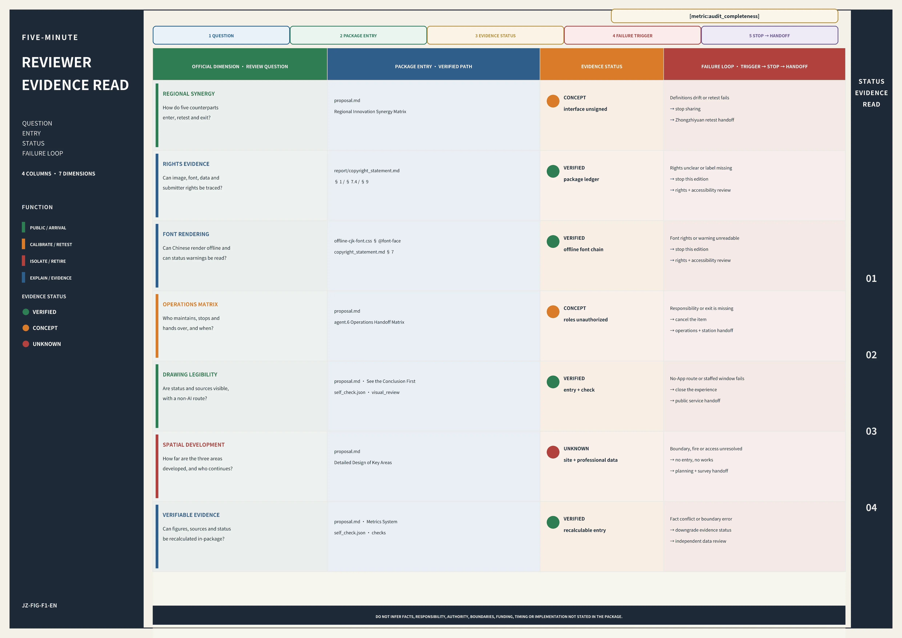

## Design Basis and Source List

This section first separates the material we can rely on from what is missing or temporary. This keeps later figures, numbers, and judgments from being mistaken for formal boundaries or authorized conclusions.

Before designing anything, we sort the evidence into four piles. First come the Open Call announcement, the agent-oriented taskbook, and the review rules: they define the three-level scope, the three key areas, and the six mandatory tasks every entry must answer. Second come the registered public policies of the national government, Beijing, and Haidian. They point toward directions such as Urban Renewal, Scenario Access, and AI-enabled scientific research, but they do not replace this proposal’s own spatial evidence. Third come completed primary-source case studies, which explain the mechanisms that may be adapted and the boundaries that must not be copied. Fourth come our ten scenario cards, nine geometry layers, metrics, and matrices, which turn the Conceptual Recommendation into a traceable working draft that can be checked again. [source:SRC-2026-BJ-GH-QUAL-PREANNOUNCEMENT] [standard:PROJECT-OFFICIAL-ANNOUNCEMENT]

The existing-conditions diagnosis still has explicit gaps. The formal boundary, parcel-level Regulatory Detailed Planning, land rights, surveying, existing buildings, transport and public-service baselines, municipal capacity, ecological and heritage inventories, funding, and operating responsibility are consistently marked **UNKNOWN / pending confirmation from formal materials** wherever the current materials cannot establish them. These gaps are not replaced with zeros or blanks, nor are they filled by conceptual drawings, synthetic personas, or model inference. [depth:existing_conditions_diagnosis]

The provisional boundary used in this draft is a rough, temporary working surface. It is not an Official Planning Boundary and cannot serve as a basis for authorization, precise area calculation, statutory control lines, land-rights boundaries, or engineering limits. It is used only to organize informal design discussion, locate layers, and recalculate the current design model; once formal polygons become available, all nine geometry layers and all three metrics must be recalculated. The current `constraints` layer is empty because formal control materials have not yet been obtained, not because the site has no constraints. [data:geometry/site_boundary.geojson] [data:geometry/constraints.geojson]

The naming and Logo required by the taskbook, eight ecosystem cases, ten scenario cards, three AI pilgrimage landmarks, cultural narrative, and long-term operations are each developed in the body of the proposal. Complete source identities, licenses, formulas, task coverage, responses to standards, and design-depth coverage remain in machine-readable files; the body places only evidence pointers adjacent to the relevant judgments and remains independently readable when those pointers are removed. [source:SRC-2026-0518-AGENT-OPEN-CALL-TASKBOOK] [standard:PROJECT-AGENT-OPEN-CALL-TASKBOOK]

One set of judgment boundaries applies throughout the proposal and is stated here once: related policies indicate direction but do not automatically become commitments of this project; conceptual drawings organize relationships but do not fill data gaps; AI only organizes, compares, and flags, while people authorize, choose, and correct. Anything that does not qualify is stopped, withdrawn, or restored to its prior state. On this basis, each chapter retains only the conditions directly adjacent to its judgments and hands the next step to the corresponding planning, transport, municipal, architectural, or operations team.

## Three-Level Scope Framework

This section sets out the order of work from the wider area to more detailed design in the three key places. It shows what each level must answer and prevents a temporary study area from being read as a precise boundary.

The three levels answer different questions and call for different depths of work. The first, the Coordinated Research Area of about 43.6 square kilometres, looks at how regional industry, universities, research institutions, public services, and the future city can work together. The second, the Overall Design Area of about 11.4 square kilometres, organizes the renewal structure, Land-Use Plan, transport, municipal systems, Blue-Green Space, and Public Space. The third comprises the three Key-Area Detailed Design Areas, totalling about 368.4 hectares, where professional teams can carry the design further. These area figures come from announcement-level materials. The current geometry is for concept discussion and checking only; it does not turn rough key-area envelopes into precise control boundaries. The three-level drawing shows both what each level must answer and how later teams can move from regional research to parcel-level work. [standard:PROJECT-OFFICIAL-ANNOUNCEMENT] [depth:three_level_scope_framework]

The overall structure is one spine, two tracks, and three stations. The spine relies on Jing-Zhang Railway Heritage Park and its Public Space network rather than drawing a fictitious additional railway. The “Public Task Track” asks whose difficulties are addressed, repaired, or exited; the “Scientific Discovery Track” asks how the same difficulty becomes a hypothesis, protocol, calibration, and independent retest. The three stations are Zhongzhiyuan’s “Retest Workshop,” AI Origin’s “Problem and Validation Foyer,” and Dazhongsi’s “First-Use and Exit Street Room.” They are not three exhibition halls, but three responsibilities that cannot substitute for one another. Following the sequence “question intake—protocol calibration—limited first use,” professional teams can progressively develop the spatial, staffing, and maintenance interfaces at each station. [depth:overall_spatial_structure]

Questions may enter at AI Origin through paper and pen, telephone, an accompanied site walk, or human translation. The parts requiring instruments and protocol review proceed to Zhongzhiyuan for calibration, where failures and limits of applicability are disclosed. Only an approach that meets the authorization conditions may proceed to limited first use at Dazhongsi or another duly empowered setting. Results return both to public decisions and to the next round of hypotheses, sampling protocols, or tool versions. If the slowest group does not improve, or responsibility for restoration cannot be explained, the process stops instead of escalating. Each round writes four fields—question, protocol, responsibility, and version—back to the same record so that the next round can retest directly from it.

The three positionings are the “Centennial Jing-Zhang Cultural Belt,” the “Metropolitan AI Life Experience Belt,” and the “AI Integrated Innovation Belt.” The five functions are the “Full-Stack Independent AI Innovation System,” “World-Class AI Innovation Ecosystem,” “New Paradigm of AI-Enabled Scenario Enablement,” “Vibrant Intelligent AI City,” and “Global Voice in AI Governance.” The three zones are Zhongzhiyuan AI Independent Innovation Acceleration Area, Beijing AI Origin Community, and Dazhongsi AI Industry Cluster; the two wings are Zhongguancun Technology Services Wing and Xiaoyue River Scenario Enablement Wing. Together they form one stoppable chain of work, not thirteen unrelated slogans. All subsequent spatial and operational proposals assign objects, responsibilities, and review nodes along this chain. [data:geometry/key_areas.geojson]

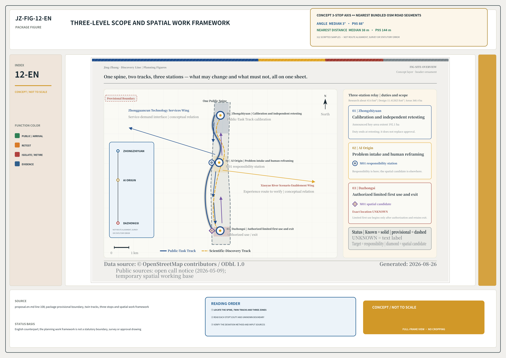

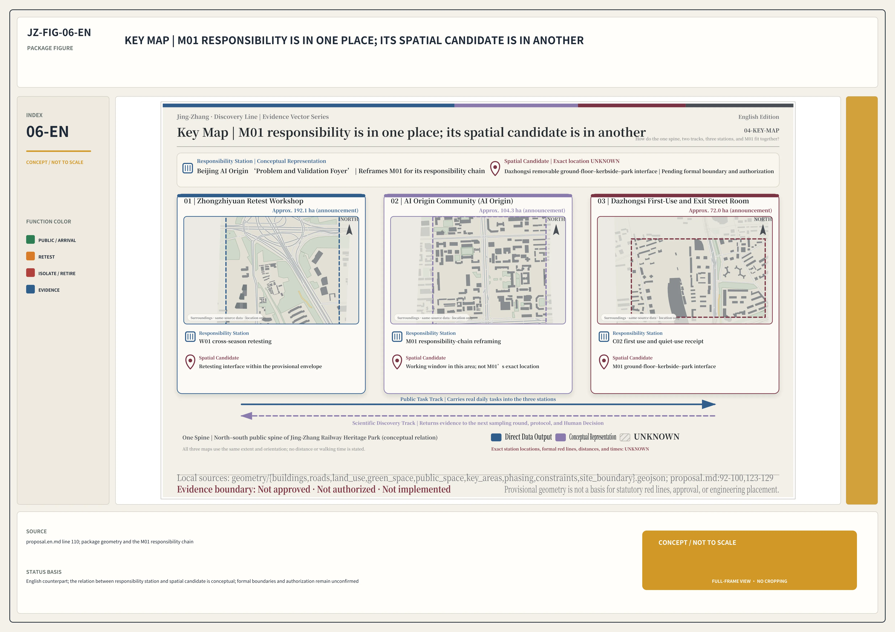

## Coordinated Research Area: Industry and Future City Research

This section shows how the proposal connects lessons from other places, regional counterparts, and three local places into a process that can stop or turn back. The cases supply methods only; they are not proof of existing partnerships or ready-made answers.

The proposal is called ‘Jing-Zhang · Discovery Line.’ ‘Jing-Zhang’ points to the century-old railway and the public spaces along it. ‘Discovery’ is the method: find a problem, form a hypothesis, check it again, then ask people to decide. ‘Line’ means both the main public route through the heritage park and the traceable record left by every step. In one sentence: bring urban questions into science, and return validated discoveries to everyday life. There is no second name beneath it. The ten scenario cards, three spatial prototypes, and annual operations all belong to the same line and use the same identity and story.

The user-approved Near-Mountain primary mark uses staggered nearby mountains to form its outer silhouette. Inside the opening, the upper portion evokes the Hall of Prayer for Good Harvests at the Temple of Heaven, while an abstract golden line extends from the mountains toward the single vermilion dot at the centre of the wordmark; “Jing-Zhang” and “Discovery Line” form the identity on either side of that dot. This is the proposal’s conceptual identity. It does not present the mountains, the Temple of Heaven, or the golden line as built landmarks, and it does not replace a survey of actual cultural resources, a trademark clearance search, or font licensing. Once the asset team receives the cultural survey, trademark, and font materials, it can check the existing silhouette, graphic, and wordmark layers one by one. [standard:GENERATIVE-AI-INTERIM-MEASURES]

The eight cases first answer “what to borrow and where to place it”; their limits of applicability are then checked together in the compliance chapter:

| Case | Transferable mechanism | Jing-Zhang connection | Adaptation for Jing-Zhang |
|---|---|---|---|
| Punggol Digital District | Coordination among a university, businesses, Public Space, and digital operations | The three stations and the school–community, research, and first-use spatial chain | Divide the coordinating relationship into spatial, curriculum, and operational interfaces at the three stations [source:PUNGGOL-SRC-01] |
| Seoul AI Hub / Yangjae | Education, incubation, R&D, and international networks organized by stage of growth | Zhongzhiyuan and Zhongguancun Technology Services Wing | Match retesting, services, and conversion support to each stage of growth [source:SEOUL-SRC-01] |
| Toyota Woven City | Limited first use, user feedback receipts, and adjustment in the next round | Test future life through resident feedback | Use resident feedback to decide whether to continue, modify, or exit [source:WOVEN-SRC-01] |
| Detroit–Ann Arbor (Michigan Central + Mcity) | Heritage, Public Space, community questions, and “controlled retesting before limited first use” | The public spine, AI Origin, Zhongzhiyuan, and M01 | Connect the public nature of heritage and controlled retesting to the same chain of responsibility [source:DETROIT-SRC-MC-01] [source:DETROIT-SRC-MCITY-01] |
| Curiosity Lab at Peachtree Corners | A bounded first-use interface in real kerbside and everyday settings | Dazhongsi M01 | Enter real kerbside conditions in the M01 admission form first [source:CURIOSITY-SRC-01] |
| Testbed Helsinki | Open calls, case-by-case admission, allocation of responsibility, and separation from procurement | Annual cycle and entry conditions for W01, M01, and C02 | Separate solicitation, admission, responsibility, and procurement into four steps [source:HELSINKI-SRC-01] |
| Berkeley A-Lab | Hypotheses, protocols, measurement, failure classification, the next round, and disclosure of uncertainty | Zhongzhiyuan’s Discovery Passport and W01 cross-season retesting | Record hypotheses, protocols, errors, and failures in the Discovery Passport [source:ALAB-SRC-01] |
| Chicago Array of Things | Minimum data collection, calibration, and retesting, with separate privacy, scientific, and public-governance review | Zhongzhiyuan and W01; M01 borrows only the governance boundaries | Organize W01 retesting around minimum data collection and separate review [source:AOT-SRC-02] |

The conceptual Jing-Zhang ecosystem is therefore not “a list of companies plus computing-power terms.” Zhongzhiyuan is responsible for calibration, protocol comparison, independent reproduction, public explanation, and equipment retirement. AI Origin connects resident questions, university research, controlled validation, ethical rights, and open learning. Dazhongsi places technologies that pass the thresholds into limited first use amid dense everyday life. Zhongguancun Technology Services Wing only translates Discovery Passports with stated evidence status into eight types of service needs—land, space, industry, funding, talent, computing power, data, and scenarios—while duly empowered actors still conduct human due diligence and sign-off. Adoption, further evidence gathering, suspension, retirement, or return to research are all acceptable outcomes. [source:BJ-2026-CONCEPT-VALIDATION]

“1+X+1” integration is expressed only as a direction-level concept: the Discovery Passport connects public questions, validation conditions, and exit responsibilities shared by AI and other leading industries within the same chain of work. The specific industry combination, functional proportions, spatial organization, and implementing actor are all UNKNOWN.

### Regional Innovation Synergy Matrix | How Five Counterparts Enter and Exit Through Two Tracks and Three Stations

The eight international cases show transferable mechanisms; they cannot replace interfaces with local and regional counterparts. This section uses the two tracks and three stations as external interfaces: the Public Task Track receives problems, rights, and service needs, while the Scientific Discovery Track returns protocols, retests, and versioned findings; each counterpart must define inputs, responsibility, and exit conditions before a duly empowered actor decides whether it may enter. The entries below are proposed interfaces only and do not mean that any collaboration has occurred.

| Synergy counterpart | Exchangeable elements | Jing-Zhang interface | Entry conditions | Exit conditions | Evidence status |
|---|---|---|---|---|---|
| Beiwei Community | Resident problem briefs, an accessible joint-walk protocol, W01 / M01 / C02 scenario cards, anonymized receipts, and public-knowledge summaries | AI Origin + Public Task Track receives problem briefs; Zhongzhiyuan + Scientific Discovery Track retests; handoffs D02 / D06 | Problem scope, affected people, human-service window, minimum data, and proposed responsible roles are stated; the first two of the six gates pass | Stop and record D06 if consent is withdrawn, the slowest group worsens, human takeover fails, or restoration responsibility remains UNKNOWN | Listed by the official taskbook as a synergy counterpart; public material is background only; specific interface, entity, and authorization UNKNOWN |
| Future Science City | Cross-disciplinary research questions, protocol templates, researcher retest places, a W01 cross-season data dictionary, and reproducible reports | AI Origin + Public Task Track translates city problems into protocols; Zhongzhiyuan + Scientific Discovery Track independently retests; handoffs D04 / D06 | One hypothesis, protocol, version, data rights, calibration baseline, and proposed responsible roles are entered in the Discovery Passport | Return to research and record D04 / D06 if protocol versions diverge, data rights are unclear, independent retesting fails, or the public problem is not answered | Listed by the official taskbook as a synergy counterpart; public material is background only; specific interface, entity, and authorization UNKNOWN |
| Huairou Science City | Instrument-retest requests, calibration samples, cross-device retest protocols, error logs, and public method notes | Zhongzhiyuan + Scientific Discovery Track handles calibration and error review; AI Origin + Public Task Track handles public explanation; handoffs D04 / D06 | Instrument scope, sample safety, data permission, calibration baseline, and failure classes are checkable | Stop and return the result to the retest ledger if scheduling or sample conditions fail, error exceeds the protocol boundary, results cannot be reproduced, or responsibility is not accepted | Listed by the official taskbook as a synergy counterpart; public material is background only; specific interface, entity, and authorization UNKNOWN |
| Beijing Economic-Technological Development Area | Candidate product test notes, maintainable supply lists, M01 / C02 scenario cards, spare-and-removal steps, and industry-service requests | Dazhongsi + Public Task Track receives authorized limited first use; Zhongzhiyuan + Scientific Discovery Track retests; handoffs D03 / D05 / D06 | Road-use, fire-safety, accessibility, site, data, maintenance, and restoration responsibility pass the relevant six gates | Remove the trial and close D05 if hazards rise, the slowest group worsens, maintenance or restoration has no recipient, or responsibility remains UNKNOWN | Listed by the official taskbook as a synergy counterpart; public material is background only; specific interface, entity, and authorization UNKNOWN |
| Beijing-Tianjin-Hebei | Cross-city problem catalogue, shared field dictionary, retest-protocol versions, open talent-course materials, and public-outcome summaries | AI Origin + Public Task Track gathers questions; Zhongzhiyuan + Scientific Discovery Track retests under stable object IDs; handoffs D01 / D06 | Local definitions, object IDs, data rights, retest protocols, and proposed responsible roles align | Stop sharing and retain version differences if definitions drift, geographic extrapolation lacks evidence, any party withdraws, or the retest cannot be reproduced | Listed by the official taskbook as a synergy counterpart; public material is background only; specific interface, entity, and authorization UNKNOWN |

Note: this table defines proposed interfaces only. Nothing is signed or authorized; adoption is for duly empowered actors to decide. All cadence, responsibility, funding, sites, and implementation arrangements remain UNKNOWN and cannot be read as evidence that real-world collaboration has occurred.

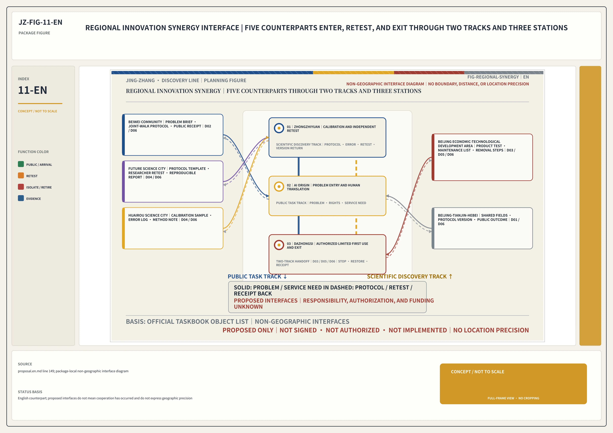

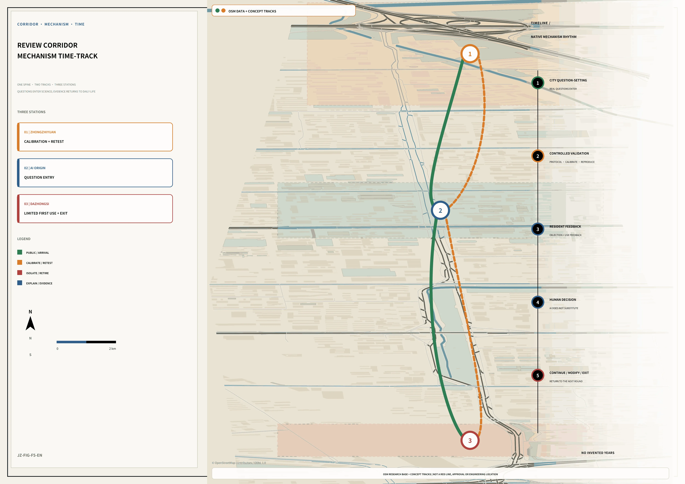

## Overall Design Area: Urban Renewal and Regulatory-Plan-Level Urban Design

This section starts with the city that already exists, lays out how the park, transport, services, and industry connect, and marks the formal material still missing. That gives later teams a clear place to continue without treating a discussion map as a plan fixed by law.

The Overall Design Area starts with the city that is already here; it does not assume clearing everything away and rebuilding. One base map brings together the park’s main route, the three stations, east–west links, walking, cycling and rail transfers, green and drainage resilience, public services, New Infrastructure, and industrial space. Joining industry to space does not mean stamping ‘AI’ on every parcel. It means giving research, testing, first use, daily service, and maintenance the right places, while ordinary life continues after the technology leaves. Later teams can add professional evidence to the same map without changing the spatial relationships or object IDs. [standard:MOHURD-URBAN-DESIGN-MEASURES] [depth:land_use_layout]

Regulatory-plan-level Urban Design must answer ten categories of content. This draft delivers them in two groups: for matters that can be supported by the current provisional working surface and conservative OSM base material, it provides structural relationships and an order of judgment. “Must answer” does not mean filling the gaps with invented figures: Floor Area Ratio, height, Building Coverage Ratio, setbacks, building capacity, and engineering alignments are marked **UNKNOWN / pending confirmation from formal materials**, with the formal material required to close each item identified individually. Professional teams receiving this draft can continue directly from this gap table. [standard:MOHURD-CONTROL-DETAILED-PLANNING]

The Conceptual Recommendation for territorial spatial planning attaches an evidence status to every spatial object: known, provisional, UNKNOWN, reversible trial, or subject to statutory procedure. `land_use` expresses only functional relationships within the current design model and cannot establish land rights or statutory land use. `buildings` is a conservative subset of OSM Building Footprints and cannot establish use, height, ownership, or a Demolish–Renovate–Retain conclusion. Once formal materials replace them, the layers, metrics, and explanations should be updated under the same object IDs, without using a new slogan to obscure old evidence. Stable object IDs allow professional teams to replace only the layers that change and track which conclusions must be recalculated in parallel. [data:geometry/land_use.geojson] [data:geometry/buildings.geojson]

The order of judgment for the overall design remains simple: first verify the actual boundary, existing conditions, and responsibility; then determine whether the public tasks are continuous; next decide whether a spatial action is necessary, reversible, and maintainable; and only then discuss professional development. After each layer of review is completed, the passed items, gaps, and responsible party are written back to the same object so the next profession can continue the judgment.

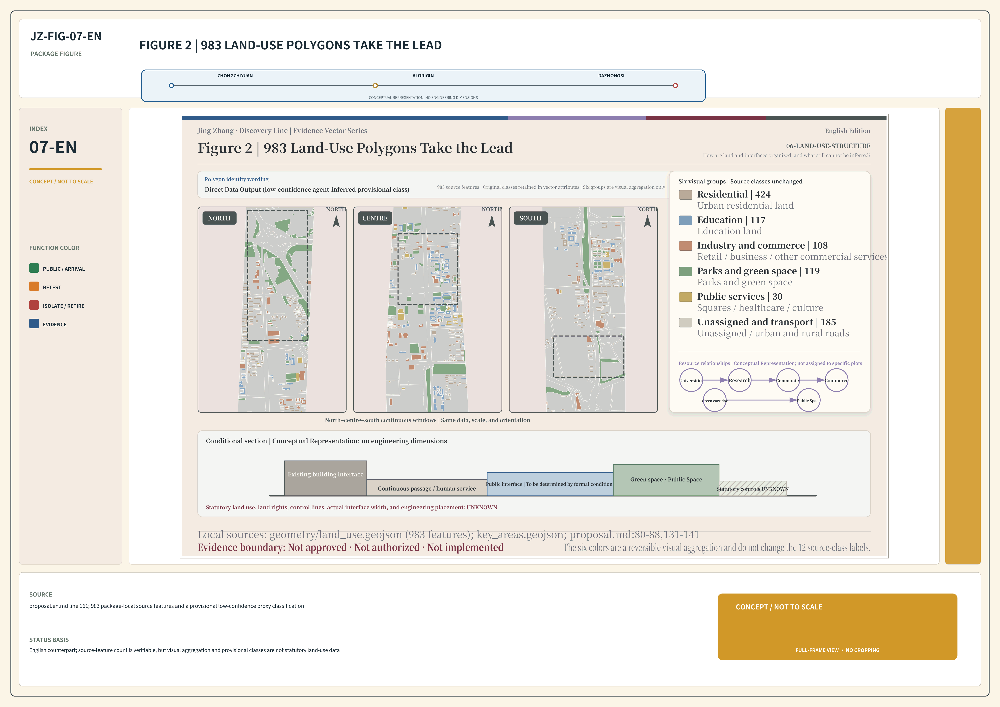

## Detailed Design of Key Areas

This section explains the problem each key area is meant to handle and what later design teams still need to check. Because boundaries and field conditions are not confirmed, it gives direction only and does not present idea drawings as construction drawings.

The three key areas are still rough, temporary envelopes, so they support direction, not precise placement. Their announcement-level areas are approximately 192.1 hectares for Zhongzhiyuan, 104.3 hectares for AI Origin, and 72.0 hectares for Dazhongsi. Precise boundaries, internal parcels, property rights, fire safety, accessibility, municipal systems, ecology, and heritage conditions remain **UNKNOWN / pending confirmation from formal materials**. These temporary envelopes will be replaced when the formal boundary map arrives; they are not statutory controls or a basis for construction. The three areas, their internal objects, and their interface tables can then be updated in the same order and in the same place. [data:geometry/key_areas.geojson] [depth:three_key_area_detailed_design]

The conceptual positioning of **Zhongzhiyuan’s “Retest Workshop”** is to turn observations arriving from settings such as the Xiaoyue River into reviewable evidence. Spatially, it is recommended to accommodate reservable calibration benches, version and error explanations, a public explanation window, equipment isolation, and retirement interfaces. In transport terms, priority should be given to checking whether people, instruments, and public visitors can move without interfering with one another. After AI is taken offline, standard protocols, manual instruments, public results, and a space for retesting remain. Whether buildings are retained, repaired, or renovated must await a formal survey and professional assessment. The architectural team can begin by preparing a survey checklist for the four types of need: calibration, explanation, isolation, and retirement.

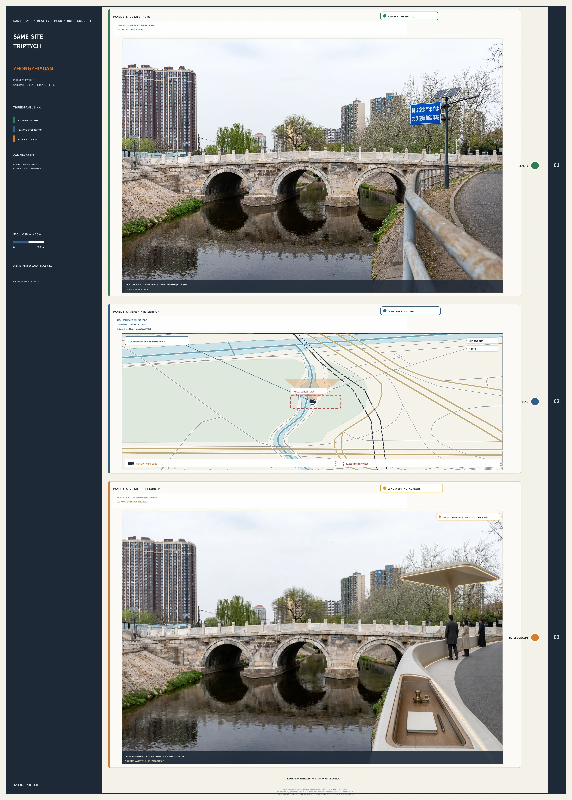

The conceptual positioning of **AI Origin’s “Problem and Validation Foyer”** is to make the question clear before validating it. Spatially, it is recommended to retain paper and pen, telephone, accompanied site walks, a human question-translation desk, and manual sampling classes. AI only classifies, flags conflicts, and explains errors; it does not automatically set priorities or collect students’ faces, voiceprints, or household trajectories. Public Space must accommodate people without apps, carers, and wheelchair users. Building volume, materials, interfaces, and specific locations remain pending confirmation from professional materials. The spatial team can begin by organizing the plan around five question-intake methods and three types of users. [standard:BARRIER-FREE-ENVIRONMENT-LAW]

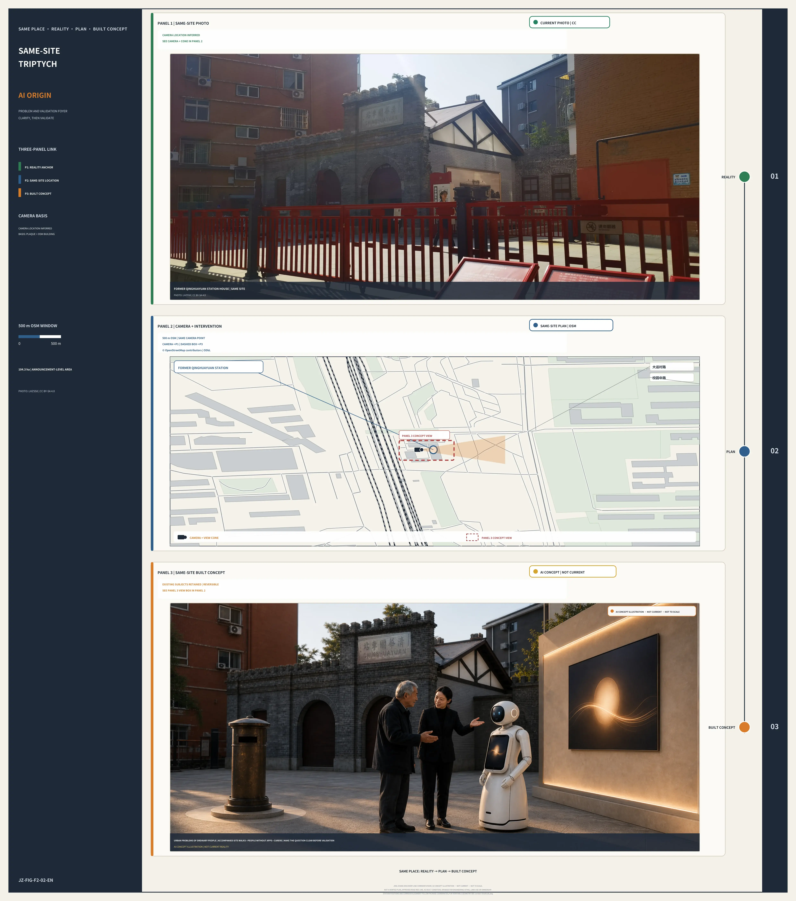

The conceptual positioning of **Dazhongsi’s “First-Use and Exit Street Room”** is to compare gains and losses in real life. A candidate unit brings together ground floors, kerbsides, park interfaces, and quiet community boundaries. It first compares fixed time windows, static parking spaces, and human guidance, and only then determines whether anonymous counting or withdrawable scheduling is needed. Limited first use becomes possible only after road-use authority, fire safety, accessibility, loading and unloading, the site, data, and operational responsibility have all been resolved; if responsibility has not been connected, the unit does not enter a trial. Professional teams can begin field checks with these seven conditions and write feasible time windows, restoration actions, and maintenance responsibility back to the candidate unit. [standard:MOHURD-ARCH-DESIGN-DEPTH-2016] [depth:height_massing_character]

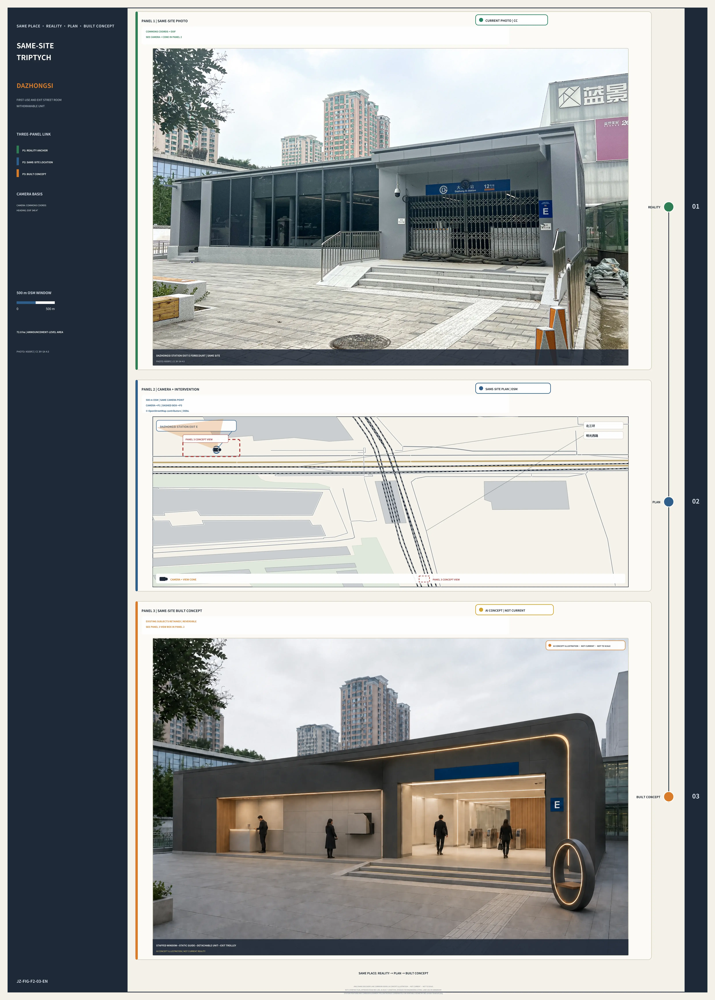

At Dazhongsi’s “First-Use and Exit Street Room,” the AI agent plaque wall, staffed window, and quickly removable intelligent terminals may be presented only as concepts; the responsible person, version, retirement date, terminal locations, authorization, and operating status are all UNKNOWN. This interface does not expand C02’s responsibilities: AI still only aggregates and compares the quiet, balanced, and vibrant options, while human inquiry, static wayfinding, a fixed activity schedule, and a no-activity control day remain in place.

Four-quadrant walking at Dazhongsi Station is expressed only as a concept through the continuity judgment in Figure 3 and roads, together with M01’s kerbside discipline. The station-area integration plan, precise interface in each quadrant, bicycle-parking locations, and implementation responsibility are all UNKNOWN and must be continued by rail, transport, and municipal professionals.

All three places continue their development through the same seven questions: What is the positioning? How is the space organized? How are buildings treated? How do transport and the Walking and Cycling Network remain continuous? How does Public Space preserve a non-AI path? Who maintains the AI-Enabled Scenario? How is it stopped and restored after failure? The current draft answers responsibilities and methods of judgment without presenting conceptual sections as detailed construction plans. These seven questions also form the shared development brief for the architectural, transport, landscape, and operations teams.

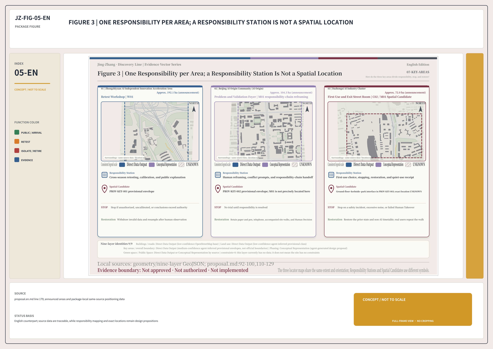

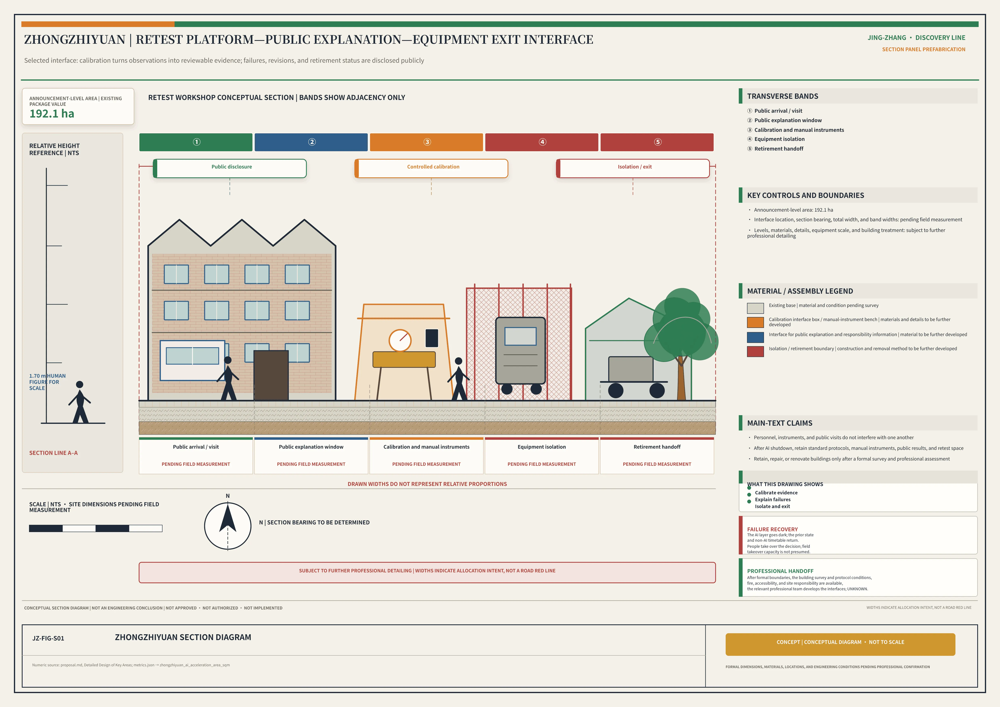

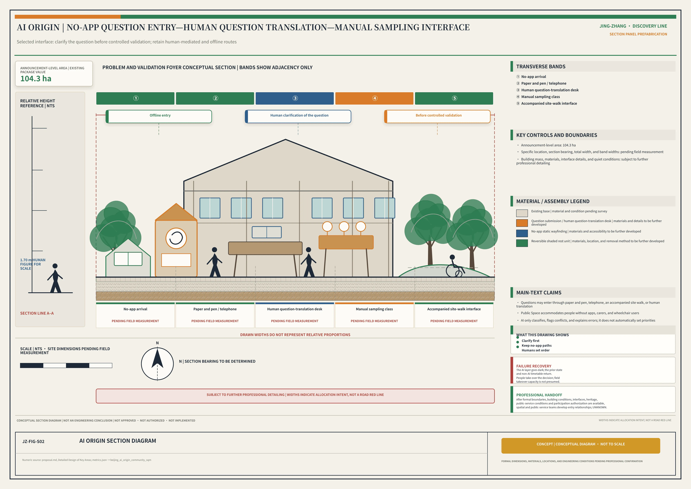

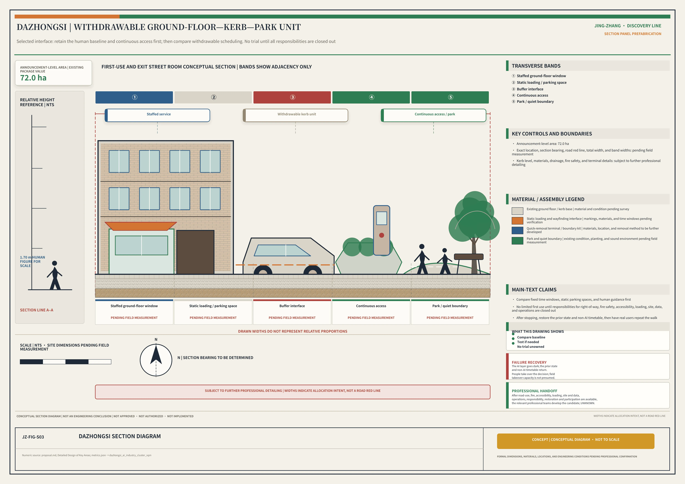

## AI Innovation Ecosystem, Personas, and AI+ Scenarios

This section uses a list of people and ten concrete situations to check who might be left behind and what AI is allowed to compare. It keeps a human way to complete the task in every situation and says when the trial must stop and the previous setup must be restored because conditions are missing or outcomes worsen.

These personas are not marketing labels. They are a way to ask who the proposal might leave behind. For now, the list covers at least ten types that still need checking: older people who do not use smartphones, wheelchair users, carers and parents, night-shift couriers, street-front shopkeepers, out-of-town patients and accompanying carers, students and teachers, researchers, community or neighbourhood coordinators, and maintenance and operations staff. For each, we must show the day’s tasks, the burden of waiting or noise, the rights that cannot be traded away, and how the same task works without AI. These personas are not interview findings. Later interviews can add real tasks, differences, and groups we missed. **One person’s day:** [Synthetic disclosure] This is a synthetic account from a desktop simulation. The person is a synthetic persona. These personas are not interview findings. It does not come from any real interview or field event. M01 is not a physical card, ticket, sensor zone, automatic credential, or operating system. Desktop simulation | Not a field test | Does not represent a real project event. In the morning, the synthetic persona walks past a kerb contested by courier restocking, shopkeeper short stops, and resident movement. M01 records the question under one ID. At noon, M01 places options A, B, and C under that same ID, and AI compares only aggregated data: A is fixed loading windows, static parking spaces, and human guidance; B is lightweight, reversible, anonymous scheduling that does not track or evaluate individual couriers; C is professional kerbside development handed to duly empowered actors and professional teams. In the afternoon, M01 records the human decision by duly empowered actors and affected people to continue, modify, not adopt, or remove the option; the responsible entity remains unconfirmed. In the evening, the desktop simulation removes Human Takeover and returns NO-GO. The AI layer goes dark, the prior state and non-AI timetable return, and everyday tasks continue. M01 records the stop, restoration, and next retest. Responsible person: UNKNOWN. Stop authority: UNKNOWN | pending confirmation of the formal responsible entity. Retest date: UNKNOWN. Restoration cost: UNKNOWN. Current status: Not approved · Not authorized · Not implemented. [standard:ELDERLY-SMART-TECH-PLAN-2020-45]

All ten scenario cards are retained, and every one preserves a human route, authorization, Human Review, stopping, and restoration:

| ID | Scenario | What AI does—and only this | Non-AI baseline and boundary |
|---|---|---|---|
| G01 | Dual-entry question-translation desk for stated and unstated needs | Classify, deduplicate, and flag conflicts and sample gaps | Paper and pen, telephone, human coding, and joint meetings; AI does not set priorities |
| W01 | Xiaoyue River cross-season heat–water–access retest window | Quality prompts, preliminary anomaly screening, and model comparison | Manual instruments and fixed observation points; without real data, no water-quality or safety conclusions are published |
| R01 | Evidence Chain for breaks in road responsibility | Compare public materials and flag conflicts among responsibility fields | Formal inquiries, ledger checks, and joint field inspection; AI does not determine property rights |
| R02 | All-ages access work order–repeat walk | Compare the digital network with records from real accompanied walks | Human audit by users and accessibility professionals, with static wayfinding retained |
| M01 | Person–vehicle–machine kerbside timetable | Use aggregated data to compare the human baseline with withdrawable scheduling | Fixed loading windows, static parking spaces, and human guidance; couriers are not tracked |
| H01 | Pre-visit public-service chain for “one less trip” | Organize verified directories, accessible routes, and human handoffs | Telephone, printed directories, and human consultation; no diagnosis, queue allocation, or promises of appointment availability |
| H02 | Hospital micro-city process sandbox | Compare synthetic, non-clinical processes | Human tabletop simulation; no real patient data without hospital authorization |
| E01 | AI Origin one-kilometre urban science class | Prompt sampling quality and explain differences between manual and AI methods | Teacher-led activity, paper maps, and manual instruments; no student tracking or automated grading |
| C01 | Dazhongsi everyday-supply reconnaissance | Organize places, prices, time windows, and conflicting needs | Shopfront inventory and human interviews; no consumer profiling or behavioural manipulation |
| C02 | Four-period AI first-use pilot and quiet-use feedback | Aggregate and compare quiet, balanced, and vibrant options | Human inquiry, static wayfinding, a fixed activity schedule, and a no-activity control day. The ten cards then proceed into field evidence gathering and responsibility allocation under the same fields. |

W01, M01, and C02 are the three priority Testing and Validation Scenario candidates; “priority” does not mean authorized or validated. W01 compares manual instruments and fixed-point observation, AI quality prompts, and cross-season retesting. It stops—and non-qualifying data are withdrawn—if authorization is absent, calibration has not occurred, missing observations cannot be explained, or conclusions are published beyond the granted scope. C02 compares quiet, balanced, and vibrant options with a no-activity control day. AI only aggregates the gains and losses reported by shopkeepers, residents, night workers, and visitors; people make the final decision. [source:BJ-2025-AI4S-ACTION]

M01 is the only candidate whose chain of responsibility is developed in greatest depth. R02 first checks fire safety, accessibility, and responsibility; asset and operating responsibility then accept the case; a non-AI baseline is established; and three options are compared before people decide whether to enter a recommended, withdrawable trial lasting 30 to 90 days. Condition window: Within the 30-to-90-day withdrawable trial period, retesting must cover at least 1 retest in rainy weather, at least 1 during the morning peak, and at least 1 during the evening peak. The hypothesis to be confirmed or refuted by field measurements is that “kerbside conflicts intensify in rainy weather and during peak periods.” There is currently no field baseline; the corresponding values are UNKNOWN. A rejected request, unconfirmed responsibility, a cancelled trial, rising hazardous incidents, worse outcomes for the slowest group, failed human takeover, failure to restore the prior condition, or displacement of the problem to an adjacent segment all enter the failure denominator. After stopping, the prior condition and non-AI timetable are restored first, and real users repeat the walk. If responsibility cannot be explained, there is no trial. The repeat-walk result is written back to R02 and M01 as direct evidence for whether the next round should continue. [standard:GENERATIVE-AI-INTERIM-MEASURES]

The Discovery Passport ID is **M01** across every file: responsible person **UNKNOWN**; stop authority **UNKNOWN / pending confirmation of the formal responsible entity**; retest date **UNKNOWN**; equivalent non-AI path fixed loading windows, static parking spaces, and human guidance; restoration action stop the trial, restore the prior condition and non-AI timetable, then have real users repeat the walk, with restoration cost **UNKNOWN**; applicability a withdrawable ground-floor–kerb–park interface unit in Dazhongsi to be confirmed by the client, while the precise location and any authorized time, segment, and user-group scope remain **UNKNOWN** and may not expand automatically; scientific return three-option comparison, risk-transfer, and restoration-clock evidence used to update the next sampling round, protocol, or tool version; public return a human decision by duly empowered actors and affected people to continue, modify, not adopt, or remove, with protocols, work orders, suspension records, and restoration receipts retained.

Each card should ultimately leave one of the following: a protocol, work order, repair record, open data dictionary, service standard, or explicit “do not adopt” conclusion. It must state the maintainer, version, scope of application, review date, and retirement method. Attendance, webpage displays, or demonstration videos alone do not count as completed validation. The scenario operator, location, baseline value, and retest time remain **UNKNOWN / pending confirmation from formal materials**. Once formal information is available, the operations team can complete each item by card ID and schedule its review.

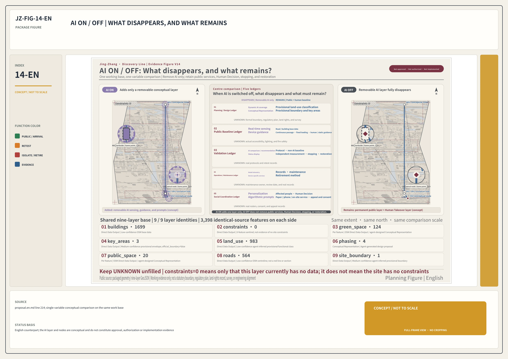

## Land Use, Building Scale, and Retain-Renovate-Demolish Strategy

This section checks existing land and buildings before deciding what to retain, repair, renovate, renew, or demolish. Because formal measurements, ownership, and the rules governing the site are not confirmed, it gives an order of judgment instead of invented scale or engineering dimensions.

For land use, the order is simple: check what exists, then discuss mixed use, and only then decide what to retain, alter, or remove. Zhongzhiyuan must make room for equipment checks, research, shared instruments, and public explanation. AI Origin needs education, community service, staffed inquiry, and a quiet interface for controlled testing. Dazhongsi needs ground-floor shops, kerbs, Public Space, and community life to share time as well as space. Zhongguancun Technology Services Wing and Xiaoyue River Scenario Enablement Wing are links between services and scenarios, not new statutory land-use categories. When formal land-use materials arrive, the planning team can test each parcel against the needs of the three stations and two wings. [standard:MNR-LAND-USE-CLASSIFICATION-GUIDE] [depth:land_use_layout]

Building scale cannot be used in the current draft to derive Floor Area Ratio, height, Building Coverage Ratio, setbacks, or additional building volume. The existing `buildings` layer provides only a conservative subset of OSM Building Footprints. The formal task materials do not yet contain enough data to resolve parcel-level Regulatory Detailed Planning, land rights, surveying, legal status, or existing use. Professional teams should inspect each building for structural safety, historical and cultural value, the necessity of public service, fitness for adaptation, and residents’ wishes, and then formulate Conceptual Recommendations to retain, repair, renovate, renew, or demolish it. [data:geometry/buildings.geojson] [depth:development_intensity_controls]

The Demolish–Renovate–Retain Strategy does not exist to manufacture a futuristic appearance. Buildings able to accommodate human services, static wayfinding, calibration, or withdrawable trials through light-touch renewal should be considered first for retention and reuse. Breaks that impede fire safety, accessibility, or basic public services should first undergo a responsibility check and minimum repair. Major renovation or demolition is discussed only when supported by formal assessment and statutory procedures. Historic buildings, heritage sites, and protection areas follow formal inventories; this draft does not invent dates, grades of significance, or protection lines. On this basis, professional teams first complete building-by-building checks, then write recommendations to retain, repair, renovate, renew, or demolish back to the object list. [depth:retain_renovate_demolish]

The `land_use`, `buildings`, and `constraints` layers must be read together. The first contains provisional functional relationships; the second cannot establish use or land rights; the third is empty because formal control conditions are still missing. Parcel-level sources for existing conditions, area algorithms, treatment recommendations, responsible actors, statutory conditions, and uncertainty must still be completed item by item in the structured data. The current draft provides rules for judgment and does not present Conceptual Recommendations as control metrics or engineering cross-sections. Once the three layers are aligned through the same object IDs, new materials can directly trigger a review of treatment and metrics for the corresponding parcel. [data:geometry/land_use.geojson] [data:geometry/constraints.geojson]

Building massing and Urban Character first uphold three principles: clear public interfaces, maintainability, and limited intrusion. New components are recommended to be restrained, durable, and removable, avoiding intense light, noise, and large screens. Engineering dimensions, materials, details, and actual placement are all **UNKNOWN / pending confirmation from formal materials**. Architectural and landscape teams can use these three principles to screen options first and add dimensions, materials, and details when engineering materials become available. [depth:height_massing_character]

## Transport, Rail, Municipal Infrastructure, and Public Services

This section checks whether walking, transfers, and public-service tasks break midway, then lists what roads, drainage, power and communications, and staffed services still need to verify. That way, when technology fails, basic tasks can still be handled by telephone, paper information, fixed signs, and staffed windows.

The transport question is whether a person can finish the day’s tasks without the route breaking. Along the Jing-Zhang Railway Heritage Park route, we check walking, cycling, wheelchair movement, rail transfers, and use across four times of day. East–west links connect universities, communities, businesses, and both sides of the park. Each interface is marked for checking—where it is, what it connects, and who must confirm it—without assuming a wall will be removed, a bridge or tunnel built, or a road widened. The current road geometry comes from the temporary working map (the provisional working surface) and conservative OSM public-map material; it organizes transfers and continuity judgments only. Once formal materials for an interface arrive, the segment can be replaced in place and only its continuity conclusion needs to be recalculated. [data:geometry/roads.geojson] [depth:traffic_rail_slow_parking]

R02 replaces “a single point looks compliant” with a repeat walk through a complete task. Older people, wheelchair users, carers, and everyday users travel from origin to destination and record whether ramps, surfaces, seats, signs, kerbs, transfers, and human inquiry remain continuous. M01’s kerbside unit first resolves road-use authority, fire safety, accessibility, loading and unloading, and maintenance responsibility, then compares fixed loading windows, static parking spaces, and human guidance. Individual trajectories must not be used to evaluate couriers. Once the repeat-walk form and kerbside conditions form are combined, the transport team can directly locate breaks that need repair, further evidence, or retention of the human option.

In the R02 all-ages access work order, the level difference at the crossing between the heritage track and park path, together with a removable crossing mat, may be treated as a conceptual break pending verification; the precise location, level difference, safety dimensions, authorization, and field measurements are all UNKNOWN.

Xiaoyue River Scenario Enablement Wing is a public experience route pending formal confirmation, not a showcase corridor filled with sensors. Under conditions such as high temperatures, after rainfall, and ordinary days, W01 conducts human observation, fixed-point sampling, and manual/AI comparison before calibration at Zhongzhiyuan. In E01, teachers may lead students in an urban science class, but faces, voiceprints, household trajectories, and identifiable continuous routes are not collected. Water, meteorological, and education teams can continue through the three respective interfaces of sampling protocol, calibration arrangement, and curriculum organization.

At this stage, municipal systems and New Infrastructure begin with data conditions: drainage districts and waterlogging records, raw water and meteorological data, ownership of utility lines and maintenance access, electricity and communications capacity, fire-safety conditions, sanitation, and responsibility for equipment maintenance. Without real water or meteorological data, no heat map is drawn and no water-quality or safety conclusion is published. Without a capacity check, the proposal does not commit to computing power, charging or battery-swap facilities, equipment quantities, or connection timing. Once materials are available, the municipal team can determine the proposal item by item across six groups: drainage, water and meteorology, utility lines, electricity and communications, fire safety, and operations and maintenance. [depth:municipal_new_infrastructure]

The integration of edge computing with traditional facilities is expressed only as a concept through the cable trench, utility corridor, and removable-terminal logic in the V08 section. Capacity, locations, ownership, connection conditions, and the implementation path are all UNKNOWN and must be continued by municipal, energy, and information-and-communications professionals.

Public-service facilities retain staffed windows, telephones, printed directories, static wayfinding, seating, and accessible routes at the same time. H01 provides only pre-visit public information and a handoff to a person, without promising appointment availability. H02 remains a synthetic, non-clinical tabletop sandbox until the hospital gives formal authorization. When technology fails, the first question is whether human takeover can restore the basic task, rather than simply whether the system is online again. The public-services team can therefore check the digital process and human route together and use both “one less trip” and “someone can take over” as shared acceptance criteria.

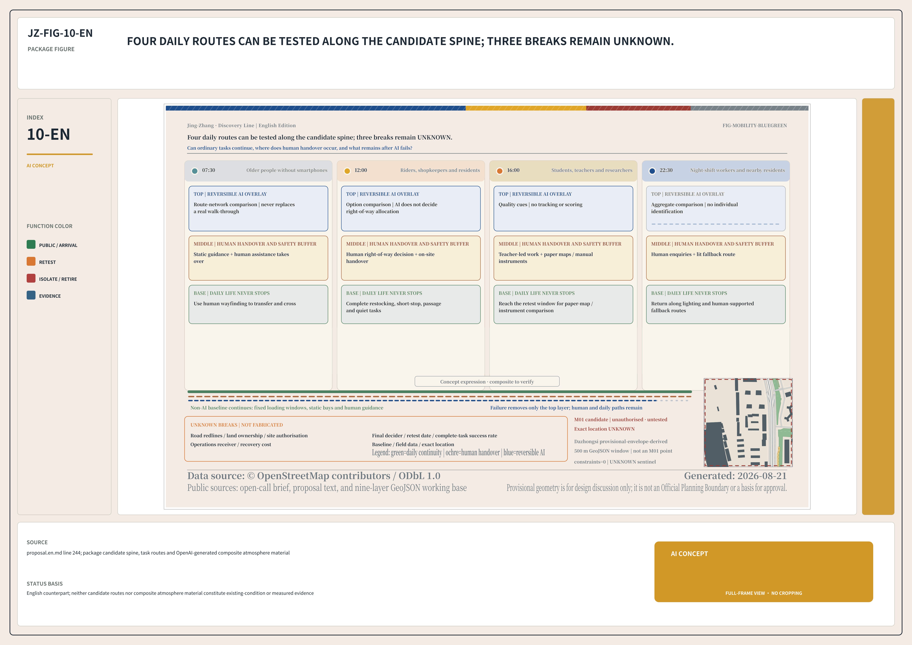

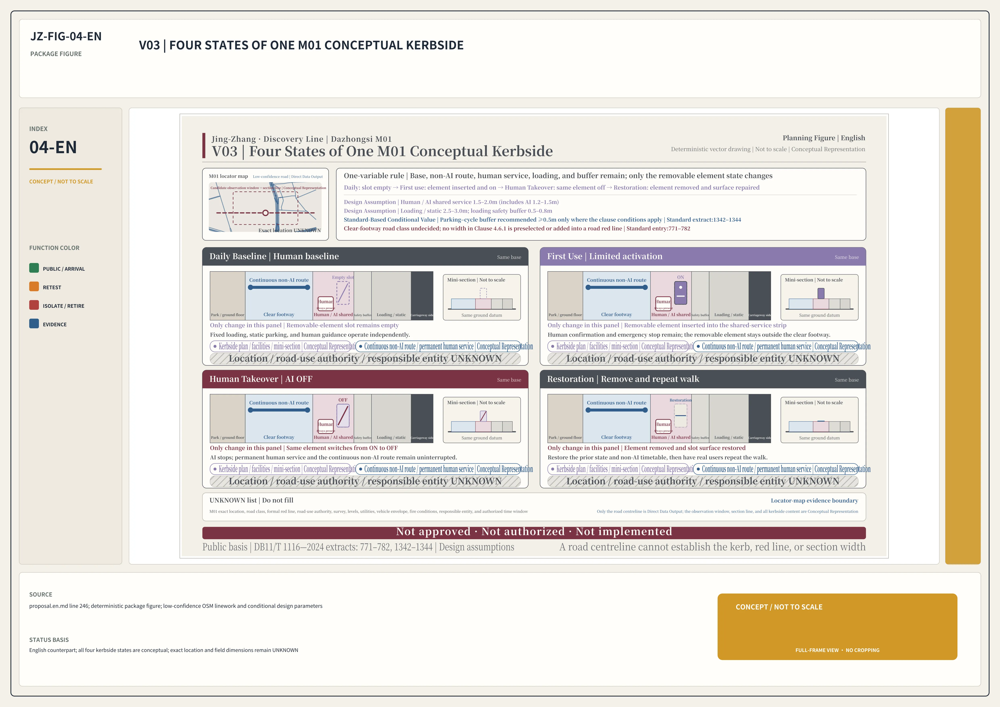

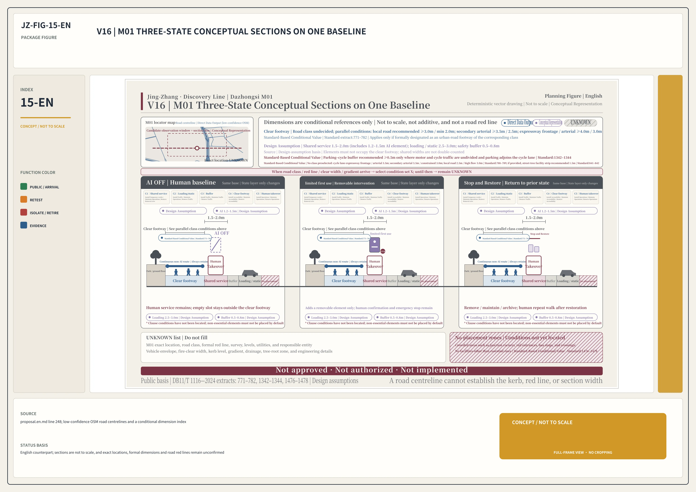

## Blue-Green Network, Public Space, and Urban Character

This section asks whether the park and surrounding public space remain connected across weather, time of day, and ways of use, and whether the three public facilities show who is responsible, when they are reviewed, and how they are switched off. It keeps these spaces focused on everyday use and makes responsibility findable when something goes wrong, rather than creating only a futuristic appearance.

Jing-Zhang Railway Heritage Park and the Public Space around it form the main north–south route and the everyday base shared by two public tasks: coping with heat, rain, and movement, and keeping daily use continuous for people of all ages. North–south checks ask whether walking and cycling remain continuous, whether all four times of day work, and where extreme weather creates a break. East–west links begin with interfaces that still need confirmation on the university, community, business, and park sides; ‘linking’ does not promise that a wall will be removed or a bridge built. If AI goes offline, fixed facilities, human help, and basic public services must still work. [depth:blue_green_public_space]

V09 is only a conceptual representation of “future park × century-old heritage” from the same viewpoint: the heritage-track axis, photovoltaic shade, low-level sensor lighting, maintenance robots, an AR historical viewfinder, a resurvey information post, and an accessible crossing do not represent built works. The location, quantity, responsible actor, operating data, and implementation status of every facility are UNKNOWN.

The landmark nodes respond conceptually through three types of location—the south end, the north end, and the area crossing the ring road—with V15 serving only as an image of the southern node. The formal location, scale, engineering conditions, and implementation status of each node are UNKNOWN.

Sports and innovation exchange are expressed only as a conceptual facility program through the fitness corner and long table under the gallery in V09. Their locations, quantities, operator, and results of use are UNKNOWN.

The current green space and Public Space derive from deduplicated unions of a conservative subset of OSM-mapped existing features and the B area-wide framework conceptual intervention; C first-phase nodes enter only the phasing layer and are not added again to B. These two layers are suitable for explaining continuity and intervention relationships within the current design model. They do not represent a complete inventory of actual existing conditions, a formal green line, Public Space land rights, or a scheme endorsed through statutory procedures. Once formal layers are available, the landscape team can replace the base figures while retaining the existing division of roles between the B framework and C nodes, then recalculate continuity and area relationships. [data:geometry/green_space.geojson] [data:geometry/public_space.geojson]

The three AI pilgrimage landmarks are public interfaces of responsibility that can be used in daily life. AI Origin’s “Problem Stele” discloses the question, affected people, evidence gaps, and reasons for acceptance or return. Zhongzhiyuan’s “Retest Platform” discloses calibration, independent reproduction, failure, revision, and retirement status. Dazhongsi’s “First-Use Milestone” discloses the scope of application, non-AI choice, maintainer, review date, and method of deactivation. The three stations carry the three landmarks; a fourth is not created. Their value comes from traceable responsibility, not mass, lighting, or spectacular form. During design development, the spaces and information interfaces of the three landmarks are organized around the everyday actions of submission, retesting, and first use, respectively.

The cultural narrative has three layers: **the Jing-Zhang engineering spirit means doing things precisely**, expressed through measurement, calibration, standards, review, and maintenance; **Zhongguancun’s open innovation means allowing trial and error and enabling open collaboration**, expressed through questions, experiments, failures, and conversion; **AI public responsibility means making technology answerable to people**, expressed through evidence, rights, transparency, appeal, correction, and exit. The three layers connect through “raise a question—form a hypothesis—retest independently—conduct urban first use—return evidence to the next round of science and public decision-making,” rather than through a collage of nostalgic decoration and science-fiction surfaces. Exhibitions, wayfinding, and public activities can all allocate content along this chain of actions. [source:HD-2024-JZ-CORRIDOR-PROJECT]

Tsinghuayuan Railway Station is expressed only as a conceptual cultural program linking the historic station building, public questions, and retest archives; this does not represent authorization to use the site or its content. Beijing Film Academy resources are expressed only as a conceptual cultural program linking image collection, urban memory, and public review; this does not represent authorization from any institution or for any work or material.

The honours display is not a permanent awards wall that records only successes. It shows contribution, reproduction, maintenance, correction, failure, retirement, evidence status, responsible person, and expiry date together. Public Space components retain only six conceptual directions: a question-submission desk, evidence-responsibility sign, no-app wayfinding, calibration interface box, low-speed trial boundary kit, and reversible shaded rest unit. Each must provide accessibility and an offline fallback, a maintainer, an inspection cycle, stopping conditions, and a removal method.

## Renewal Projects, Implementation Policy, and Phasing

This section makes clear what each candidate project still needs, who should check it, and when it may move forward. Here, the order means only which conditions must be met first, not a claimed construction schedule, funding plan, or implementation arrangement.

Before discussing a construction date, every item goes into five ledgers and through six gates. The five ledgers cover planning and design, public foundations, scenario validation, operations and maintenance, and social coordination. The six gates cover data and boundaries, problem value, scientific protocol, urban first use, projects and funding, and construction and operations. A project moves only after all six gates are satisfied, and every transition leaves a named responsibility, the supporting materials, and a review record. **Plain-language gate phrases:** Gate One accepts only two things: formal materials and a responsible person. Gate Two asks first: Does this serve the public? Where is the boundary? Who is affected? Who is responsible? At Gate Three, turn the proposal into a protocol, check it on the desktop, then retest it independently. Gate Four: only an authorized proposal may enter a limited trial. No authorization means no trial. Gate Five: if the site, funding, or construction commitment is unresolved, stop there. Gate Six: formal location, operations and maintenance, rights clearance, and legal conditions first; construction comes after. [source:HD-2025-URBAN-RENEWAL]

| Item | Independent verification | Sign-off format |
|---|---|---|
| Gate One — Data and Boundaries | Proposed roles: a planning, surveying, or data-review function that did not prepare the base map, enter the data, or draw the boundary should independently verify source, scope, version, and UNKNOWN fields; this line does not mean that any role has been assigned. | Proposed sign-off format: verifier surname + employee ID + date; an organization name, chat confirmation, or blank signature field does not constitute passage. |
| Gate Two — Problem Value | Proposed roles: a public-value, affected-party participation, or social-impact review function that did not frame the question should independently verify public value, affected groups, and boundaries; this line does not mean that any role has been assigned. | Proposed sign-off format: verifier surname + employee ID + date; keep the gate closed if affected groups and an objection route are not recorded. |
| Gate Three — Scientific Protocol | Proposed roles: a scientific-method, instrument-calibration, or independent-reproduction function that neither wrote the protocol nor ran the test should review the hypothesis, protocol, tool version, failure denominator, and reproduction conditions; this line does not mean that any role has been assigned. | Proposed sign-off format: verifier surname + employee ID + date; self-testing with self-sign-off, or a missing protocol version, does not constitute passage. |
| Gate Four — Urban First Use | Proposed roles: an authorization, ethics, safety, accessibility, or affected-party participation review function that did not propose the first-use candidate should independently verify site permission, Human Takeover, the non-AI path, stopping, and restoration; this line does not mean that any role has been assigned. | Proposed sign-off format: verifier surname + employee ID + date; keep the status UNKNOWN / not passed if the authorizing actor is unconfirmed or authorization material is missing. |
| Gate Five — Projects and Funding | Proposed roles: a budget, procurement, legal, land, or conflict-of-interest review function that did not prepare the project proposal should independently verify funding source, procurement authority, site conditions, and exit cost; this line does not mean that any role has been assigned. | Proposed sign-off format: verifier surname + employee ID + date; interest, verbal support, or another project’s funding cannot replace formal sign-off. |
| Gate Six — Construction and Operations | Proposed roles: a planning-and-construction, fire-safety, accessibility, operations-and-maintenance, rights-clearance, or legal review function that did not prepare the construction or operating proposal should independently verify formal location, maintenance, shutdown, restoration, and statutory conditions; this line does not mean that any role has been assigned. | Proposed sign-off format: verifier surname + employee ID + date; keep the gate closed if any responsibility, rights, or maintenance condition is missing. |
| M01 — Discovery Passport | Proposed roles: a protocol, accessibility, transport, data-rights, or operations-review function that neither generated the M01 candidates nor adjudicated that round should independently verify the three options, non-AI baseline, failure denominator, stop, restoration, and return under the same ID; this line does not mean that any role has been assigned. | Proposed sign-off format: verifier surname + employee ID + date; responsible person, stop authority, retest date, and restoration cost remain UNKNOWN until duly empowered material and sign-off are both available. |

The project list is organized by conditions rather than presenting Conceptual Recommendations as scheduled works:

| Project cluster | Conceptual object | Prerequisite | Acceptable outcome |
|---|---|---|---|
| Public-spine continuity task | R02 repeat walk, static wayfinding, and minimum repair | Real access baseline, responsibility, and site confirmation | Repair, gather further evidence, stop, or retain the non-AI option |
| Xiaoyue River retesting | W01 observation points, sampling protocol, and Zhongzhiyuan retest interface | Water and meteorological materials, calibration, site, and participation authorization | Retest, withdraw non-qualifying data, or do not adopt |
| Dazhongsi kerbside | R02→M01 withdrawable kerbside unit | Road-use authority, fire safety, accessibility, loading and unloading, and restoration responsibility | Adopt, modify, stop, or restore the prior condition |
| Four-period activities | Three C02 options and a no-activity control day | Human choice by shopkeepers, residents, night workers, and visitors | Select, reduce, suspend, or do not hold |
| Responsibility interfaces at the three stations | Problem Stele, Retest Platform, and First-Use Milestone | Formal locations, operations and maintenance, rights clearance, and statutory conditions | Install in phases, adjust, or do not install. These five project clusters then enter management through the five ledgers. |

Phasing expresses only the sequence of conditions. Step one obtains formal materials and responsibility and completes the field baseline and non-AI options. Step two develops protocols, tabletop checks, and independent retesting. Step three may enter limited first use only after authorization conditions are met. Step four has people decide whether to adopt, modify, stop, or restore the prior condition. M01’s 30-to-90-day period is only a recommended window for a withdrawable trial, not an authorization, construction, or building schedule. The project team can use the four steps to prepare material packages, responsible parties, and transition records. [data:geometry/phasing.geojson] [depth:phasing_implementation]

Long-term operations use one four-season cycle: **Urban Question Season—Calibration and Retesting Season—First-Use and Access Season—Evidence Return Season**. The Question Season receives real problems and preliminarily screens public value, boundaries, affected people, and responsibility. The Retesting Season discloses protocols, calibration, and independent reproduction. The First-Use Season admits only projects for which safety, privacy, accessibility, human fallback, an equivalent non-AI path, and site authorization have all been resolved. The Return Season reviews success, failure, complaints, maintenance, removal, and retirement, then decides whether to continue research, enter procurement, reduce scope, stop, or retire.

The developer community is recommended to be operated by a later-selected operator in collaboration with university and campus partners; the current responsible entity is **UNKNOWN / pending confirmation from formal materials**. Admission checks intellectual property, data rights, safety, and the public interest together. Repair or reproduction activities must leave protocols, tools, repair records, contributor lists, maintenance responsibility, and exit responsibility. The public experience route allows people without apps to submit questions, understand status, find human services, and locate exit methods. International communication explains only the question, validation status, public rights, and limits of applicability. Once the operator is identified, it can configure teams directly around five task groups: admission, repair, reproduction, public experience, and communication. [depth:renewal_project_list]

### agent.6 | Long-Term Operations Handover Matrix

agent.6 uses the existing four-season cycle as its operating clock: City Questions Season receives problems; Calibration and Retest Season checks protocols; First-Use Open Season admits only candidates that meet the conditions; and Evidence Return Season writes success, failure, complaints, maintenance, removal, and retirement back into the record. Each activity keeps the same Discovery Passport ID, enters the five ledgers, passes the relevant six gates, and records failure in the retest ledger; activity scale is not success by itself. Every role and cadence below is proposed and unauthorized; none constitutes a staffing, procurement, funding, or scheduling arrangement.

| Item | Proposed role | Cadence | Input | Output | Admission conditions | Exit and stop | Success / failure measures |
|---|---|---|---|---|---|---|---|
| Annual activity system | Proposed, unauthorized: operations coordination role + three-station duty roles | One cycle per season; one year-end retest-ledger review | Five-ledger candidate list, Discovery Passports, prior-cycle failures | Draft annual activity calendar, three-station duty sheet, four-season receipt pack | The candidate passes the first three of the six gates; a draft public calendar and human fallback are ready | Cancel the item and retain a “not adopt” record if responsibility, authorization, or an exit method is missing | Success: every season has inputs, outputs, and receipts; failure: an item advances without a receipt or its gap misses the next cycle |
| Activity brand and communication visuals | Proposed, unauthorized: brand editor role + rights and accessibility review roles | One annual base system; update each season when status changes | Proposal name, current-season evidence status, rights list, bilingual terminology | Bilingual visual-use pack, captions and alt text, version-difference list | Trademark, font, image rights, and status warnings are checkable; candidates are not presented as implemented | Stop using the version if rights are unclear, status labels are missing, or translation changes responsibility boundaries | Success: every candidate asset has version, rights, and status; failure: a wrong version circulates or warnings are unreadable |
| Developer community | Proposed, unauthorized: community operations role + code / data maintenance roles | One protocol clinic per month; one reproduction session per season | Public problem briefs, protocols, sandbox data, tool versions, failure list | Issue list, reproducible steps, contributor and retirement lists, retest records | Intellectual property, data rights, safety, and public-interest checks pass; a maintenance role is reachable | Freeze the contribution if rights are unclear, a safety issue appears, maintenance is absent, or reproduction fails | Success: every contribution has a maintainer, version, and reproduction result; failure: orphaned assets or unlogged changes |
| Scenario access | Proposed, unauthorized: scenario-interface role + safety / accessibility / data review roles | One candidate window per season; case-by-case review | Scenario card, non-AI baseline, site authorization, human-takeover and restoration plans | Admission / rejection receipt and D03 / D04 / D05 / D06 handoff pack | The first four of the six gates pass; authorization, affected-person participation, human fallback, and restoration responsibility are ready | Stop if hazards rise, the slowest group worsens, data exceeds scope, or human takeover or restoration fails | Success: every admitted item has stop and restoration receipts; failure: unauthorized expansion or incomplete restoration |
| Public experience and landmark operations | Proposed, unauthorized: public-service role + accessibility review role + facility-maintenance role | Weekly human inspection during a candidate open period; one no-app repeat walk per month | Static wayfinding, paper / phone entry, three-station status, complaints and repair tickets | Experience-route checklist, repair work order, complaint closure or “not adopt” record | Fire safety, accessibility, human service, and an equivalent non-AI path work; facility status is readable | Close the affected experience if any route breaks, the human window is absent, or facility responsibility has no recipient | Success: a no-app task can be completed and complaints have receipts; failure: the slowest group's task is interrupted |
| International communication | Proposed, unauthorized: bilingual editor role + scientific and compliance review roles | One status brief per season; update when evidence status changes | Public Discovery Passport fields, failure boundaries, rights-cleared figures, bilingual terminology | Bilingual case brief, version-difference list, human contact entry | No personal data; evidence status, rights, and applicability boundaries align across languages | Withdraw the candidate draft if responsibility is mistranslated, status drifts, rights are unclear, or a proposal becomes a commitment | Success: bilingual status and boundaries align; failure: an old version circulates or a key warning is missing |
| Attraction and conversion | Proposed, unauthorized: industry-service role + human due-diligence / empowered-decision roles | Route each case after D06; one pipeline review per season | D04 / D06, five-ledger service needs, legal and funding material (UNKNOWN until provided) | Routing receipt for continued research / procurement preparation / not adopt / return for evidence | The fifth of the six gates passes; budget, procurement authority, conflicts of interest, and public results are checkable | Stop conversion and return for evidence if funding, procurement, site, responsibility, or public results are unclear | Success: every candidate has a route, responsible role, and next evidence step; failure: interest is treated as a signed deal or a decision lacks authority |

| Item | Maintenance-responsibility status | Funding-line status |
|---|---|---|
| Annual activity system | UNKNOWN — pending confirmation of operations coordination and three-station duty responsibility | UNKNOWN — pending five-ledger lines for activities, sites, safety, and review |
| Activity brand and communication visuals | UNKNOWN — pending responsibility for brand versions, rights review, and withdrawal | UNKNOWN — pending lines for design, translation, accessibility, and rights clearance |
| Developer community | UNKNOWN — pending community operations, repository maintenance, and security response | UNKNOWN — pending lines for sites, tools, reproduction, and maintenance |
| Scenario access | UNKNOWN — pending scenario intake, stop, removal, and restoration responsibility | UNKNOWN — pending lines for testing, insurance, maintenance, removal, and restoration |
| Public experience and landmark operations | UNKNOWN — pending human service, inspection, repair, and accessible repeat-walk responsibility | UNKNOWN — pending lines for service, wayfinding, inspection, repair, and restoration |
| International communication | UNKNOWN — pending bilingual editing, scientific review, rights, and withdrawal responsibility | UNKNOWN — pending lines for translation, design, rights clearance, and version maintenance |
| Attraction and conversion | UNKNOWN — pending industry service, due diligence, procurement interface, and exit responsibility | UNKNOWN — budget and funding source not provided; it cannot be written as an attraction or investment commitment |

Note: both tables define proposed agent.6 interfaces only; nothing is signed, authorized, or scheduled. Duly empowered actors must confirm maintenance responsibility and funding lines within the five ledgers and six gates; every unconfirmed item remains UNKNOWN.

## Metrics, Area Recalculation, and Compliance Matrix

This section separates numbers that readers can calculate again from the supplied files from values that come only from a temporary map or a computer exercise, and lists the formal material still missing. Readers can inspect the numbers without mistaking them for results from the site, approval, or implementation.

The three known values describe only the current provisional design model. Confidence is low, and they are not statutory or existing-condition metrics. For example, the Overall Design Area working surface measures **11,412,825.386 square metres**, using the formula `area(union(site_boundary))` in EPSG:4548, with the provisional base surface `PROV-SITE-001` as its source. This is not an Official Planning Boundary and must be recalculated when a formal boundary replaces it; using the same formula and coordinate reference system for that recalculation makes the difference between the two results directly traceable. [metric:site_area_sqm] [data:geometry/site_boundary.geojson]

The desktop record is introduced through four cells below. The full facts and their verification limits are in “Appendix: Desktop Run Ledger.” Minimal package records are available at `visual/assets/run-record-three-state.json`, `visual/assets/run-record-negative-tests.json`, `visual/assets/run-record-model-round.json`, and `visual/assets/run-record-downgrade.json`. They support only the desktop entries and recorded determinations, not field outcomes, approval, authorization, or implementation.

| Everyday task | Failure condition | Stop action | Restoration / human takeover |
|---|---|---|---|
| Complete the delivery-kerb task without a smart device, using fixed loading windows, static parking spaces, and human guidance. | Authorization, resources, or operations are incomplete; the non-AI route is missing; withdrawal or restoration fails; responsibility is unassigned; or the M01 record drifts. | Refuse advancement and switch off the AI layer. If any card fails retesting, downgrade the whole line by one level rather than patching only the weakest card. | Restore the prior state and non-AI timetable, then let people decide what happens next. The responsible person, stop authority, retest date, and restoration cost remain UNKNOWN. |

Alongside—but separately named from and never combined with—the three-state record, the package includes a second offline task-exercise ledger. Its method is a deterministic protocol walkthrough: the readings for 24 tasks come directly from the task table and can be recomputed from the same fields; the task total is the array length at `simulation.json#/tasks`, cross-checked against `simulation.json#/task_count`. [metric:simulation_task_count] The ledger records 20 values in `simulation.json#/tasks/*/outcome` that are `success` or end in `_success`—including 6 refusal-class tasks correctly stopped by the rules—and 4 that do not, using `simulation.json#/tasks` as the denominator, for 20/24. [metric:simulation_success_rate] Dispatch-instruction format was valid for 23/24: the numerator is the `true` count at `simulation.json#/tasks/*/dispatch_schema_valid`, and the denominator is `simulation.json#/tasks`; the remaining illegal instruction was correctly stopped by the data-and-boundary gate. [metric:tool_schema_pass_rate] Three tasks exceeded their energy budgets, counted where `simulation.json#/tasks/*/energy_used_kwh` is greater than `simulation.json#/tasks/*/energy_budget_kwh`. [metric:energy_budget_violations] Audit completeness was 21/24: the numerator is the `true` count at `simulation.json#/tasks/*/audit_complete`, and the denominator is `simulation.json#/tasks`. [metric:audit_completeness] Its six gates map in order to the proposal's data and boundaries, problem value, scientific protocol, urban first use, projects and funding, and construction and operations gates. These readings come from an offline desktop walkthrough, never entered field operation, and do not demonstrate real project outcomes. The package copy of the three-state record allows the entries and determinations to be inspected, but the executable program is not included, so the run cannot be independently repeated from the package. The exercise ledger can instead be recomputed field by field from `simulation.json`; it is neither counted in the three-state total nor added to it.

| Key metric entry | Value | availability |
|---|---:|---|
| Announced coordinated research area | 43,600,000 sqm | external_public |
| Announced overall design area | 11,400,000 sqm | external_public |
| Announced combined area of the three key detailed-design zones | 3,684,000 sqm | external_public |
| Provisional working-surface area | 11,412,825.386 sqm | bundled |
| Green-space ratio | 0.074603 | bundled |
| Public Space ratio | 0.004293 | bundled |
| Offline exercise task total | 24 | bundled |
| Offline exercise success rate | 20/24 | bundled |
| Offline exercise dispatch-schema validity | 23/24 | bundled |
| Offline exercise audit completeness | 21/24 | bundled |
| Offline exercise energy-budget violations | 3 | bundled |

See `report/narrative.md` for the runtime evidence index. Four minimal run records are included in the package; the remaining sources are represented only by fingerprints kept in the project archive and cannot be independently verified from the package.

The green-space ratio is **0.074603**, using `area(union(green_space)) / area(union(site_boundary))`. The Public Space ratio is **0.004293**, using `area(union(public_space)) / area(union(site_boundary))`. For both numerators, the conservative subset of OSM-mapped existing features and the B area-wide framework conceptual intervention are first deduplicated and then unioned; C first-phase nodes are not counted again. If any formal green-space, Public Space, or boundary polygon replaces the current one, both ratios must be recalculated. [metric:green_ratio] [data:geometry/green_space.geojson] [metric:public_space_ratio]

The green-space ratio is used to check the relationship between Blue-Green continuity and support for talent’s everyday life in the current model. The Public Space ratio is used to check spatial provision for innovative interaction, no-app services, and the three responsibility interfaces. Together, the two values point to spatial breaks requiring further measurement; when formal materials arrive, judgments can be updated through the same layers and formulas. [data:geometry/public_space.geojson]

Scenario metrics begin with real denominators. Access measures success across a complete task, time taken by the slowest group, and breaks that remain after the repeat walk. The kerbside compares hazardous incidents, waiting, accessibility, and noise through aggregated data. Public services measure avoided steps, whether human takeover succeeds, and whether complaints are resolved. Environmental work measures the completeness of sampling protocols, instrument calibration, missing observations, and cross-season reproduction. Every metric includes refusals, cancellations, failed human takeover, failure to restore after removal, and displacement of problems to adjacent segments in its denominator.

| What is measured (current status) | Where | How (tool / sample / authorization) | Criterion and threshold basis | Retest cycle | If it fails |
|---|---|---|---|---|---|
| `[No authorization required]` Whether a complete R02 task encounters an access break; current status: **UNMEASURED** | Existing walking routes that are normally open to the public and require no entry into a controlled area; formal start and end points are UNKNOWN | Paper task sheet, handheld timing tool, and human observation; record route conditions only, with no images of people and no personal trajectories; stop if the area is closed and reclassify the item as authorization-dependent | The criterion is whether the same complete task can be completed without a break along the non-AI path; statutory width, slope, and time thresholds are UNKNOWN, so no pass is recorded before professional criteria are provided | After each complete walk under public-open conditions; repeat after route or repair status changes | Keep the item not passed; mark the break, retain static wayfinding and human enquiries, and do not enter a withdrawable trial |
| `[No authorization required]` Whether lighting and static wayfinding remain continuous along a publicly open route at night; current status: **UNMEASURED** | The same publicly open R02 route, without entering a station interior, worksite, compound, or other controlled space | Handheld illuminance tool and paper break sheet; install no equipment, obstruct no movement, take no images, and recruit, identify, or record no real person | The criterion is no dark break that makes static wayfinding unreadable or interrupts a no-app task on the public route; illuminance and readability thresholds are UNKNOWN, so no pass is recorded without professional criteria | Recheck after a change in night-time opening, lighting, or wayfinding status | Withdraw any “continuous at night” wording; retain human enquiries and mark breaks requiring lighting and accessibility review |
| `[No authorization required]` Waiting, loading conflict, and accessibility continuity at a visible public kerb; current status: **UNMEASURED** | An observation point outside a kerb that is publicly visible, normally open, and requires neither road occupation nor entry into a managed area | Paper observation sheet and handheld timing tool; record aggregated event categories only, with no images, plates, or tracking of couriers or pedestrians | The criterion is no increase in hazardous incidents, waiting, or accessibility breaks; event definitions, observation window, and thresholds are UNKNOWN, and zero observations cannot be presented as zero risk | Recheck after the kerb state changes; before formal authorization, retain only the unmeasured status and make no operating conclusion | Stop candidate progression; retain fixed windows, static parking, and human guidance, and add authorization-dependent observation to the dependency list |
| `[No authorization required]` Whether a publicly open route has ponding or a detour break after rain; current status: **UNMEASURED** | The surface of an existing route that remains normally open to the public after rain and has no safety cordon | Paper location sketch, handheld ruler, and time record; no water sample, entry into water, crossing of barriers, or personal record | The criterion is whether ponding or a detour interrupts the complete access task; depth, duration, and safety thresholds are UNKNOWN, and no water-quality or safety conclusion is published without water or professional criteria | After rainfall when observation is safe; after drainage or repair status changes | Keep the result UNKNOWN; mark the visible break and refer it for formal water, drainage, and accessibility review; publish no water-quality or safety judgment |
| `[No authorization required]` Whether static wayfinding and a staffed route work without an app; current status: **UNMEASURED** | Existing public interfaces that are normally open, without entering behind a counter or any registration-controlled area | Paper task card, static-wayfinding checklist, and handheld timing tool; no interviews with real service users and no collection of voice, image, or identity information | The criterion is whether a person without an app can reach human service from the question entry and complete exit; text, distance, waiting, and service thresholds are UNKNOWN | Repeat after wayfinding, opening status, or the human entry changes | Mark the break, withdraw any “task can be completed” wording, and retain paper, telephone, static wayfinding, and human enquiries as the baseline pending review |

The Discovery Passport records at least the person responsible for the question, spatial object, evidence level, source scale, non-AI baseline, falsifiable hypothesis, protocol and tool version, data rights and quality, independent reproduction, scientific return, public decision, trade-off feedback, responsibility lookup, and exit. The evidence ladder contains only L0–L5: from policy agenda, city/district priors, and district-level signals to corridor evidence, field supplementation, reversible trials, and retesting. A directional judgment is upgraded to an object-level validation conclusion only after reaching the corresponding evidence level; professional teams can begin further sampling from the next evidence level stated in the passport. [depth:metrics_recalculation]

| Dependency | Prerequisite | What remains blocked | Who can provide it (institution / function type only) | Depth available after completion |
|---|---|---|---|---|
| D01 | UNKNOWN: formal overall boundary, formal polygons for the three areas, existing-condition survey, statutory controls, and land-rights material | Replacement of provisional geometry, recalculation of areas and ratios, and object-level statutory judgment | Planning-management, survey-record custody, natural-resource, or asset-rights management functions | Provisional layers can be replaced and recalculated under the same object IDs; this does not automatically enter approval or construction |
| D02 | UNKNOWN: formal R02 start and end points plus fire-safety, accessibility, transport, and accompanied-walk conditions | Location of access breaks, minimum-repair judgment, human route, and NO-GO conditions | Transport, fire-safety, accessibility professional-service, or public-participation organization functions | A field-walk protocol, break register, and professional review can be prepared; a recommendation cannot be presented as repaired |
| D03 | UNKNOWN: road class, redline, kerb, clear width, loading, and bicycle conditions from an existing-condition survey | Applicability of the M01 options, review of conceptual sections, and withdrawable timing | Transport-management, municipal-road, surveying, or site-operations functions | The conceptual kerbside can be developed into candidate drawings and a conditions table; first use still requires authorization |
| D04 | UNKNOWN: non-AI baseline, aggregate-data definition, protocol version, and tool and model versions | Like-for-like A/B/C comparison, failure denominator, and independent reproduction | Data-governance, operating-data custody, scientific-method, or AI-tool maintenance functions | A reproducible desktop / protocol comparison can be run; it cannot replace field outcomes |
| D05 | UNKNOWN: asset responsibility, operating acceptance, maintenance and removal crew, restoration action, and funding source | Installation, stopping, removal, restoration, and maintenance work orders | Asset-management, operations-and-maintenance, budget, or procurement functions | Responsibility and restoration drafts can be prepared; responsibility and cost remain UNKNOWN before sign-off |
| D06 | UNKNOWN: affected-party participation, objection and appeal route, risk trade-offs, repeat walk, and empowered decision | The public decision to continue, modify, not adopt, or remove | Public-participation, accessibility-audit, social-impact-review, or empowered-decision functions | A human decision receipt with objections can be prepared; it is not approval, procurement, or implementation |
| M01-1 | UNKNOWN: formal overall boundary and three-area polygons | M01 unit scope, layer replacement, and package recalculation | Planning-management or survey-record custody functions | Temporary geometry can be replaced and related objects recalculated; scope does not expand automatically |
| M01-2 | UNKNOWN: road redline, road class, kerb, and existing-condition survey | V16 conditions, common-baseline sections, and location of a withdrawable kerbside | Transport-management, municipal-road, or surveying functions | Candidate sections can be redrawn with conditions; they are not engineering lines |
| M01-3 | UNKNOWN: fire clear width, accessibility slope, and continuous-access professional conditions | Whether R02 passes and whether M01 remains NO-GO | Fire-safety or accessibility professional-review functions | A professional pass / fail judgment can be made; no trial proceeds without passage |
| M01-4 | UNKNOWN: land rights, site permission, and asset responsibility | Whether a duly empowered actor can accept the candidate unit | Asset-rights, legal, or site-management functions | Responsibility interfaces and authorization boundaries can be confirmed; this is not authorization to implement |
| M01-5 | UNKNOWN: formal existing baseline for fixed loading windows, static parking spaces, and human guidance | Non-AI baseline A and like-for-like comparison of the three options | Transport-operations, commercial-district operations, or public-service management functions | The non-AI baseline can be locked and protocol comparison can begin; individual couriers are not tracked or evaluated |
| M01-6 | UNKNOWN: operator, removal crew, maintenance responsibility, and restoration funding source | Whether stopping, removal, restoration, and repeat walk can be executed | Operations-and-maintenance, asset-management, budget, or procurement functions | An executable stop-and-restoration work-order draft can be prepared; no people or dates are assigned before sign-off |
| M01-7 | UNKNOWN: aggregate-data definition, protocol version, tool version, and model version | A/B/C comparability, failure denominator, reproduction, and audit | Data-governance, scientific-method, or AI-tool maintenance functions | Like-for-like comparison and independent review can be performed; no real-world effect is claimed without a field baseline |

#### Zhongzhiyuan Retest Workshop

1. What can be done now: use the existing proposal only to prepare a four-part survey checklist and missing-material register for calibration, explanation, isolation, and retirement; do not enter the site, measure, collect personal data, occupy land, obtain or imply authorization, or construct. The output is only a revisable and withdrawable document draft.
2. What is awaited: formal boundary, building survey, instrument and protocol conditions, fire and accessibility conditions, and site responsibility, provided by planning, surveying, architecture, fire-safety, accessibility, or site-management function types.
3. Proposed consolidation after completion: a professional team with the relevant responsibilities may consolidate spatial interfaces for calibration, explanation, isolation, and retirement into a professional proposal pending review and arrange separate independent review; this card does not mean that a team has been selected, the project authorized, or facilities built.

#### AI Origin Problem and Validation Foyer

1. What can be done now: use the existing proposal only to prepare a relationship checklist for paper and pen, telephone, accompanied site walks, human question translation, and manual-sampling classes, plus a missing-needs list for people without apps, carers, and wheelchair users; do not enter the site, recruit, collect real-participant data, occupy land, obtain or imply authorization, or construct. The output is only a revisable and withdrawable document draft.
2. What is awaited: formal boundary, existing building conditions, materials and interfaces, heritage conditions, public-service conditions, and participation authorization, provided by planning, surveying, architecture, heritage, public-service, or public-participation function types.
3. Proposed consolidation after completion: spatial and public-service professional teams with the relevant responsibilities may consolidate the plan relationship among five question-entry methods and three user types into a professional proposal pending review; this card does not mean that a team has been selected, an entry is operating, or participation has occurred.

#### Dazhongsi First-Use and Exit Street Room

1. What can be done now: use the existing M01 ID only to prepare an A/B/C comparison shell and blank dependency table; site, road, clear width, baseline, responsibility, cost, and date all remain UNKNOWN. Do not enter the site, measure, collect personal data, occupy land, obtain or imply authorization, or construct. The output is only a revisable and withdrawable document draft.
2. What is awaited: road-use, fire-safety, accessibility, loading, site, aggregate-data, operations, asset-responsibility, restoration, and affected-party participation conditions, provided by transport, fire-safety, accessibility, data-governance, operations, asset, or public-participation function types.
3. Proposed consolidation after completion: transport, planning, accessibility, and operations professional teams with the relevant responsibilities may consolidate a candidate plan, common-baseline three-state sections, and a withdrawable sequence into a professional proposal pending review. Limited first use can be discussed only after authorization conditions are closed; this card does not mean approval, scheduling, or implementation.

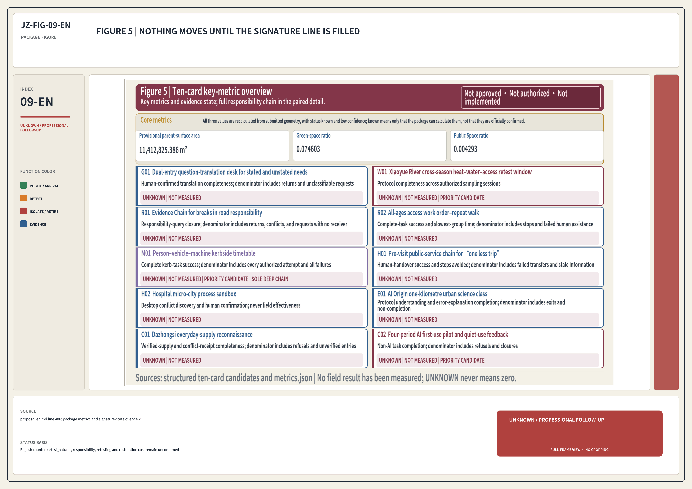

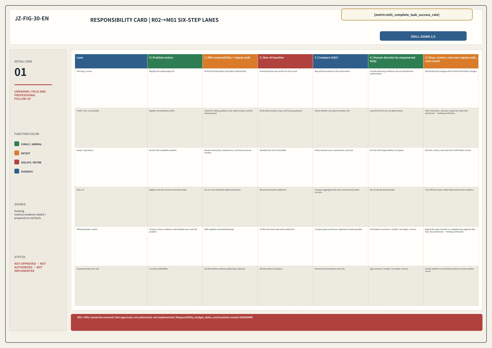

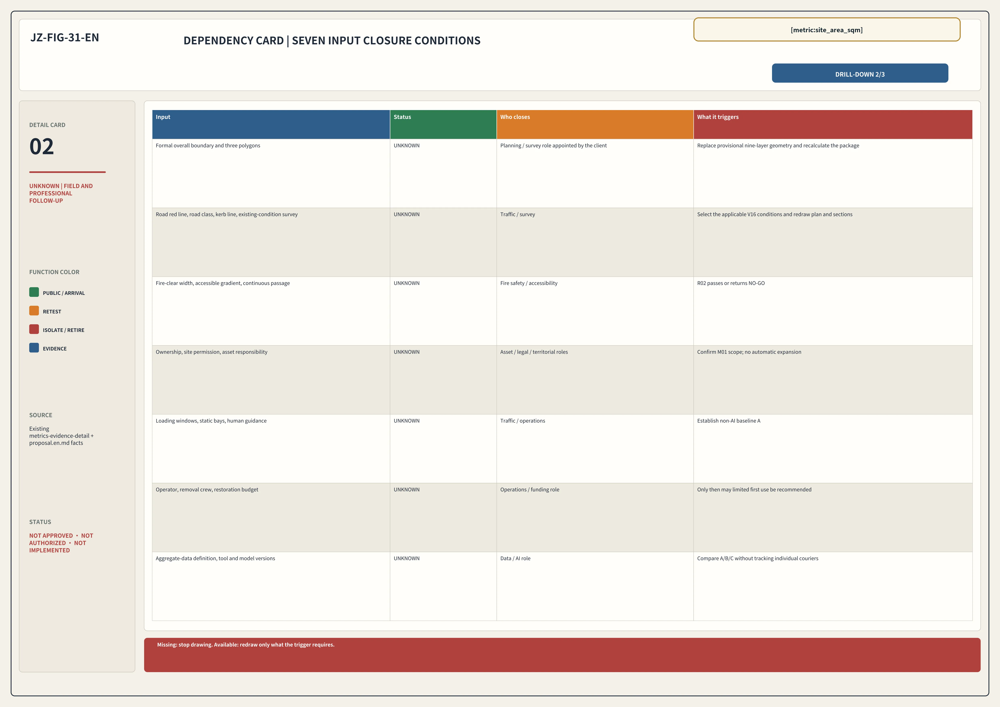

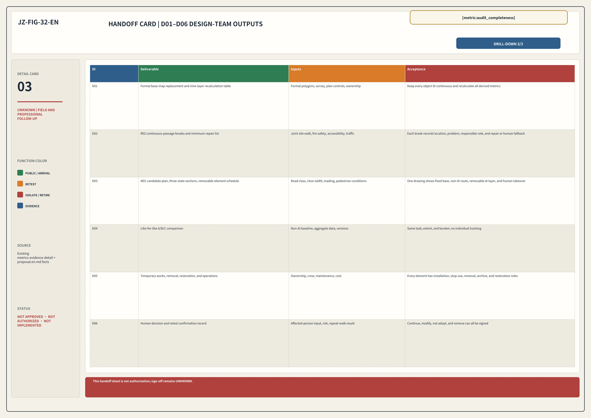

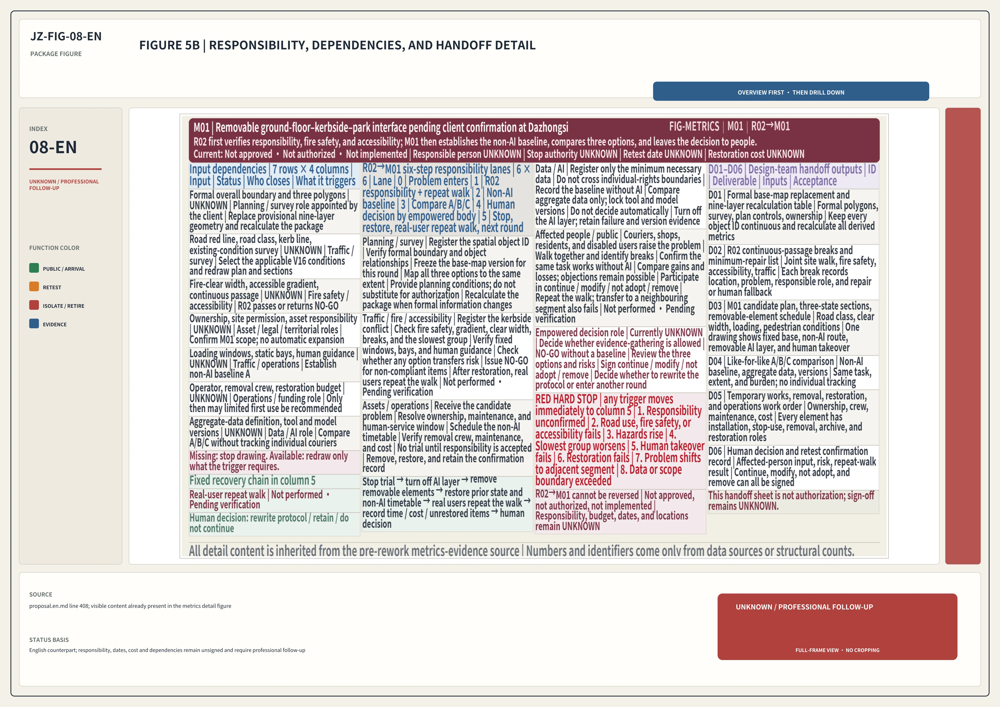

## Risk, Copyright, and Compliance

This section gathers the places most likely to be misread, including temporary boundaries, people invented for the exercise, computer-generated images, budgets, authorization, and project status. It keeps the proposal’s ideas from being presented as an official plan approved under planning law, a real interview, or an implemented project.

We have to prevent a few factual errors: treating a temporary boundary as an Official Planning Boundary; turning an aggregated request into evidence for one street; counting another project’s or department’s money as this proposal’s budget; presenting a recommended entity as an authorized operator; presenting a synthetic persona as an interviewee; presenting a generated image as a site image or formal planning drawing; or presenting an activity or pilot candidate as scheduled work. If any of these happens, the text, figures, and machine-readable files return to a more conservative evidence status and are labelled again. [depth:risk_missing_data] We must also avoid reading “complete” at the machine gate as if professional design development were finished—the former only means that the evidence chain satisfies the current gate; professional spatial development still awaits continuation by a qualified team.

The general limits of applicability for the preceding cases are consolidated here. The eight cases answer only “what to borrow, where to place it, and what must not be copied”; they do not endorse Jing-Zhang. For Punggol Digital District, a mature urban area does not copy the area-wide sensing and centralized backend of a newly built district. For Seoul AI Hub / Yangjae, an industrial ecosystem cannot replace validation of residents’ lives and does not imply that capital or institutions have already joined. For Toyota Woven City, a corporate-led, closed, newly built prototype city cannot represent public governance in a mature urban area. For Detroit–Ann Arbor, autonomous driving or corporate development does not become Jing-Zhang’s main line, and the two projects are not written as the same entity. For Curiosity Lab at Peachtree Corners, large-scale sensing, a control room, road length, awards, and the autonomous-driving main line are not transferred. For Testbed Helsinki, another city’s procurement, data, and organizational systems cannot be copied, and a short trial cannot establish scientific validity. For Berkeley A-Lab, a closed laboratory does not contain residents’ rights, public authorization, or urban responsibility. For Chicago Array of Things, a large sensing network is not replicated, avoiding the surveillance of Public Space and mission drift. These limits correspond one-to-one with the eight positive adaptation actions in the preceding table and can be checked by case name.

The general qualifications for overall design, transport, and implementation are also stated together once in this chapter. No related project, policy direction, or departmental funding automatically becomes a site, budget, or construction commitment for this proposal. Road geometry comes from provisional and conservative OSM base material and cannot be treated as a precise control line. Implementation does not begin by assigning construction dates; it first places objects into the five ledgers and through the six gates. If any gate is unmet, the project does not advance automatically. This working method also does not replace statutory planning, construction, procurement, ethics, or data procedures. The corresponding chapters now explain how professional teams can continue the work; this chapter preserves the complete conditions and limits.

The limits on metric use are consolidated as follows. The design meanings of these figures are also limited: the green-space ratio only helps check the relationship between Blue-Green continuity and support for talent’s everyday life in the current model, while the Public Space ratio only helps check spatial provision for innovative interaction, no-app services, and the three responsibility interfaces. OSM existing features are a conservative subset, so neither metric directly describes complete existing conditions. Without formal land-rights and statutory-control materials, neither ratio can be used to infer buildable area. Scenario metrics do not fill in attractive numerators. Kerbside metrics consider hazardous incidents, waiting, accessibility, and noise without tracking individual couriers. A directional judgment is not presented as an object-level validation conclusion until it reaches the corresponding evidence level. On this basis, the metrics team retains the original formulas, denominators, and evidence levels and completes a traceable recalculation when formal materials arrive.

All spatial, operational, branding, and policy statements remain Conceptual Recommendations. The current proposal does not decide planning, healthcare, education, procurement, financing, investment attraction, or public trade-offs in place of duly empowered actors. Responsibilities, funding, land rights, dimensions, capacity, procedures, and operational matters unsupported by formal materials are all marked **UNKNOWN / pending confirmation from formal materials**. The provisional boundary, three rough key areas, OSM base material, and conceptual interventions remain identified by status throughout the text and figures.

Privacy and rights are jointly governed by minimum data collection, Human Review, informed participation and appeal, an equivalent non-AI path, and deletion or retirement at expiry. If a trial increases hazardous incidents, obstructs fire safety or accessibility, worsens waiting, crosses night-time noise limits, requires personal trajectories, is used for platform labour evaluation, or lacks maintenance responsibility, it stops immediately or returns to the non-AI option. People make the final decision; AI cannot turn aggregated results into an automatic decision. [standard:GENERATIVE-AI-INTERIM-MEASURES] [standard:BARRIER-FREE-ENVIRONMENT-LAW]

The twelve scene images, the historical-engineering concept image, and the atmospheric underlay in the mobility/blue-green figures were produced by the submission team with OpenAI's built-in image-generation tool.

Consistent with proposal text: the cover retains the blue-hour concept of one public spine linking three stations. It is a derivative cover from `slot-v15`, not a photograph of existing conditions, formal planning drawing, approval, or construction evidence.

Each package path, generation batch or confirmable time window, derivative relationship, and SHA-256 is registered in `sources.json`. Under the OpenAI Terms of Use effective 1 January 2026, the submitter owns the Output as between the submitter and OpenAI. Public display also follows the Sharing & Publication Policy updated 14 November 2022, with per-image human review, AI-generation disclosure, and final responsibility retained by the submitter. The project logo has been replaced with a project-authored vector that contains no Lovart-converted paths. The HTML, figures, and four PDFs use Source Han Serif SC 2.003R (`SourceHanSerifSC-Regular.otf`, `SourceHanSerifSC-Bold.otf`) and Source Han Sans SC 2.005R (`SourceHanSansSC-Regular.otf`, `SourceHanSansSC-Bold.otf`) obtained from official adobe-fonts releases and used, embedded, and redistributed under the SIL Open Font License 1.1, with the full licence included in the package. These grounds do not establish uniqueness, automatic copyright protection, or freedom from third-party claims. Independent legal review remains required before formal brand adoption, registration, or commercial promotion.

“Referenced” in the professional standards matrix and design-depth matrix means only that the body provides an entry point for the response. It does not mean that professional materials are complete or that the design depth has been achieved. In particular, formal documents on architectural design depth, formal control conditions, ecology and heritage, existing buildings, land rights, funding, and operating responsibility must still be closed through later formal materials. [standard:MOHURD-ARCH-DESIGN-DEPTH-2016]

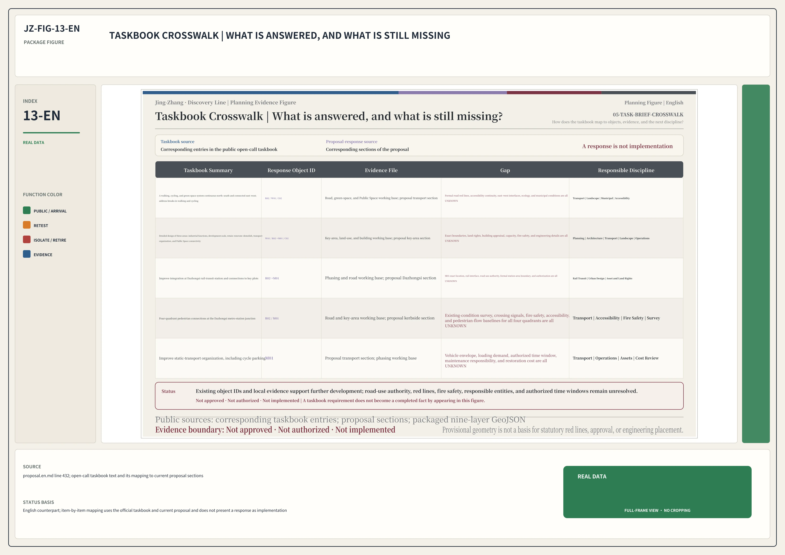

## Official Open Call Task-by-Task Response Index

This section links every requirement listed by the organizers back to the relevant text, figure, or concrete situation, with the remaining gap beside it. Readers can quickly find the response and see what is still only an initial idea.

This table is only an index of responses and an explicit account of gaps. It does not use a concept-level answer to replace formal planning, professional materials, authorization, or field measurement. The announcement scale refers to extracted.txt lines 55–65 and 71–75. The status column uses only “Answered,” “Concept-level answer,” and “UNKNOWN + continuation condition.”

| Official item (extracted.txt line) | Our response location (chapter / figure / card) | Status |
|---|---|---|
| Industry–space integration, project list, implementation policy, and regulatory-plan depth (55) | “Overall Design Area: Urban Renewal and Regulatory-Plan-Level Urban Design” and “Renewal Projects, Implementation Policy, and Phasing”; continuation: planning, industry, and implementation professionals | UNKNOWN + continuation condition |
| AI industry goals, indicators, innovation network, “1+X+1,” functional proportions, and spatial organization (57) | “Coordinated Research Area: Industry and Future City Research” and the “1+X+1” direction statement; continuation: industrial-economics and planning professionals | UNKNOWN + continuation condition |
| Renewal framework, jobs–housing–commerce–services balance, industrial and building scale, low-efficiency spaces on both sides, and implementation drawings (59) | “Overall Design Area,” “Land Use, Building Scale, and Retain-Renovate-Demolish Strategy,” and “Renewal Projects, Implementation Policy, and Phasing”; continuation: planning, architecture, and implementation professionals | UNKNOWN + continuation condition |
| Transport, rail, municipal and supporting facilities, facility standards, energy, and edge-computing integration (61) | “Transport, Rail, Municipal Infrastructure, and Public Services” and the V08 conceptual logic; continuation: transport, municipal, energy, and information-and-communications professionals | UNKNOWN + continuation condition |
| Heritage-park vitality belt, walking-and-cycling breaks, sports and innovation exchange, testing and display, and three types of landmark node (63) | “Transport, Rail, Municipal Infrastructure, and Public Services,” “Blue-Green Network, Public Space, and Urban Character,” R02, V05, V09, and V15 | Concept-level answer |
| AI-era urban character, Tsinghuayuan Railway Station, Beijing Film Academy resources, blue-green space, and building controls (65) | “Blue-Green Network, Public Space, and Urban Character” and the two cultural programs; continuation: architecture, landscape, and cultural-heritage professionals | UNKNOWN + continuation condition |
| Zhongzhiyuan: full-stack independent innovation, standards, and safety governance (71) | Zhongzhiyuan “Retest Workshop,” W01, and the Discovery Passport | Concept-level answer |
| Zhongzhiyuan: potential-land functions, building scale and form, and industrial display (71) | “Detailed Design of Key Areas” and “Land Use, Building Scale, and Retain-Renovate-Demolish Strategy”; continuation: planning, architecture, and industry professionals | UNKNOWN + continuation condition |
| Zhongzhiyuan: external transport, Fifth Ring Road connection, and integrated buildings, green space, and water systems (71) | Figure 3, the roads continuity judgment, and the blue-green chapter; continuation: transport, municipal, architecture, and landscape professionals | UNKNOWN + continuation condition |
| Zhongzhiyuan: Qinghe culture, low-carbon international exchange, and green space serving AI (71) | The three-layer cultural narrative and blue-green chapter; continuation: cultural, landscape, and operations professionals | UNKNOWN + continuation condition |
| AI Origin: incubation and conversion, talent, open-source systems, and brand activities (73) | AI Origin “Problem and Validation Foyer,” the eight cases, and annual operations | Concept-level answer |
| AI Origin: Demolish–Renovate–Retain, display and release, residential support, and land-use layout (73) | “Detailed Design of Key Areas” and “Land Use, Building Scale, and Retain-Renovate-Demolish Strategy”; continuation: planning, architecture, and public-service professionals | UNKNOWN + continuation condition |
| AI Origin: external transport and walking-and-cycling links between campuses and parks (73) | Figures 3 and 4, the roads continuity judgment, and R02 | Concept-level answer |
| AI Origin: integrated design at Wudaokou and Qinghuadongluxikou stations and low-disturbance renewal (73) | Only rail interfaces and low-disturbance principles are present; continuation: rail, transport, planning, and architecture professionals | UNKNOWN + continuation condition |
| Dazhongsi: AI agents, intelligent terminals, content consumption, data elements, and digital assets (75) | Dazhongsi “First-Use and Exit Street Room,” V07, C01, and C02 | Concept-level answer |
| Dazhongsi: potential land, university renewal, and industrial carriers (75) | “Detailed Design of Key Areas” and “Land Use, Building Scale, and Retain-Renovate-Demolish Strategy”; continuation: planning, architecture, industry, and university interfaces | UNKNOWN + continuation condition |
| Dazhongsi: environment around key enterprises, commercial services, and composite use of green space (75) | M01, C01, C02, and the blue-green chapter | Concept-level answer |
| Dazhongsi: station-area integration, four-quadrant walking, and bicycle parking (75) | Figure 3, the roads continuity judgment, and M01 kerbside discipline; continuation: rail, transport, and municipal professionals | Concept-level answer |
| Agent-oriented taskbook: naming | The Near-Mountain primary mark and proposal name in “Coordinated Research Area: Industry and Future City Research” | Answered |
| Agent-oriented taskbook: cases | The eight-case comparison table and limits of applicability in the compliance chapter | Answered |
| Agent-oriented taskbook: scenarios | The ten scenario cards and the developed W01, M01, and C02 candidates | Answered |
| Agent-oriented taskbook: landmarks | The three responsibility landmarks and V15 node image | Concept-level answer |
| Agent-oriented taskbook: culture | The three-layer cultural narrative in “Blue-Green Network, Public Space, and Urban Character” | Concept-level answer |
| Agent-oriented taskbook: operations | The whole-life-cycle operation in “Renewal Projects, Implementation Policy, and Phasing” | Concept-level answer |

## Implementability Item-by-Item Response Index

This section answers practical questions such as what comes first, who would act, how stopping works, and how costs are calculated, then tells readers where the answer appears in the supplied material. It prevents an index from being mistaken for finished work and keeps missing authorization, a responsible person’s signature, and field measurements visible.

This table is only an index of implementability response locations and gaps and does not use a directory entry, concept-level answer, or UNKNOWN registration to replace formal materials, authorization, sign-off, field measurement, or a review conclusion; the status column uses only “Answered,” “Concept-level answer,” and “UNKNOWN + continuation condition.”

| Implementability question | Package location (chapter / figure / card / machine field) | Current status |
|---|---|---|
| Where is phasing addressed? | “Renewal Projects, Implementation Policy, and Phasing,” lines 365–367; `geometry/phasing.geojson`; the four steps express only a sequence of conditions, and M01's 30-to-90-day period is not an approval, construction, or building schedule. | Concept-level answer |
| Where are the implementing entity and division of work addressed? | “Renewal Projects, Implementation Policy, and Phasing,” line 369, and `agent.6 \| Long-Term Operations Handover Matrix`, lines 371–395; the current entity is UNKNOWN, and the listed roles and cadences are proposed and unauthorized; the continuation condition is in `UNKNOWN-IMPLEMENTATION-ENTITY-TIME`. | UNKNOWN + continuation condition |
| Where are the six gates? | “Renewal Projects, Implementation Policy, and Phasing,” lines 343–353, gives all six gates, independent-verification roles, and sign-off formats; the web six-gate table is at `visual/index.en.html:3815`. | Answered |
| Where are stopping and restoration addressed? | The four-cell entry in the metrics chapter, lines 405–407, records failure conditions, stop action, and restoration / human takeover; the risk chapter, line 503, records conditions for immediate stopping or return to the non-AI option; M01 restoration cost remains UNKNOWN. | Concept-level answer |
| Where are trigger conditions recorded? | The 12 `required_stage=implementation_start` entries in `assumptions.json` each record `blocks` and a `recalculation_trigger`; the D01–D06 and M01-1–M01-7 dependency table records prerequisites and the depth available after completion. | Answered |
| Where are the budget formula and verification arrangement? | `project_budget` records the UNKNOWN formula “project-level scope × traceable unit rates × lifecycle and recovery costs”; Gate Five records independent budget, procurement, legal, land, or conflict-of-interest review roles and the sign-off format “verifier surname + employee ID + date”; D05 and M01-6 retain continuation conditions for assets, operations, removal, restoration, and funding source. | UNKNOWN + continuation condition |

## Appendix: Desktop Run Ledger

This section lists the numbers and calculations from an exercise carried out only on paper and a computer, together with the limit of what can be checked. Readers can inspect the record itself without mistaking the exercise for a field test or real operation.

This appendix retains the complete facts moved out of the four-cell entry. Every result comes from a desktop simulation, not a field test, and does not represent a real project event. The status remains Not approved · Not authorized · Not implemented.

| Audit item | Value | Calculation | Source-field pointer | Limitation |
|---|---:|---|---|---|
| Task total | 24 | `length(tasks) = task_count = 24` | `simulation.json#/tasks`; `simulation.json#/task_count` | offline · synthetic · non-field |
| Success | 20/24 | `count(outcome == "success" or ends_with("_success")) / length(tasks) = 20/24` | `simulation.json#/tasks/*/outcome`; `simulation.json#/tasks` | offline · synthetic · non-field |
| Dispatch valid | 23/24 | `count(dispatch_schema_valid == true) / length(tasks) = 23/24` | `simulation.json#/tasks/*/dispatch_schema_valid`; `simulation.json#/tasks` | offline · synthetic · non-field |
| Audit complete | 21/24 | `count(audit_complete == true) / length(tasks) = 21/24` | `simulation.json#/tasks/*/audit_complete`; `simulation.json#/tasks` | offline · synthetic · non-field |
| Energy over budget | 3 | `count(energy_used_kwh > energy_budget_kwh) = 3` | `simulation.json#/tasks/*/energy_used_kwh`; `simulation.json#/tasks/*/energy_budget_kwh` | offline · synthetic · non-field |

| Item | Full fact | Package evidence entry | Verification limit |
|---|---|---|---|
| Three-state record | Each of the ten mechanism cards has a human-baseline, protocol-comparison, and over-boundary-advancement entry, for 30/30 entries. The ten human-baseline and ten protocol-comparison entries were each held because conditions were incomplete; all 10/10 over-boundary advancement entries were refused. | `visual/assets/run-record-three-state.json` | The package exposes all 30 summaries, six-part determinations, and desktop/non-field flags. It does not include the executable program, so the run cannot be repeated independently. |
| Negative checks | Fourteen deliberately invalid inputs cover AI replacing human decisions, a missing non-AI route, unauthorized sampling, conclusions from one observation, missing responsibility, failure to restore after stopping, automatic scope expansion, advancement with unknown funding, and record drift. Every expected rejection point appears in the observed rejection set; missed rejections: 0. | `visual/assets/run-record-negative-tests.json` | Expected and observed rejection points can be inspected item by item. This does not prove field safety or real outcomes, and the checks cannot be rerun from the package. |
| M01 model round | The package preserves one set of prompt conditions, three spatial candidates, and three six-part determinations. Authorization, resource, and operating conditions remain unmet for all three; field count: 0. The exact service identity and seed are unavailable. | `visual/assets/run-record-model-round.json` | The archived source labels this as one preregistered round without outcome-based selection. The package can verify only this prompt and these three candidates; it cannot independently prove that no other run was omitted. |
| Whole-line downgrade | The desktop rule says that if any card fails retesting, the passport level for the whole line drops by one level; the weakest card cannot be patched in isolation. | `visual/assets/run-record-downgrade.json` | This is a rule calculation, not a real retest. |
| Authority and responsibility | Zhongzhiyuan handles retesting; AI Origin clarifies the question before validation; Dazhongsi may conduct limited first use only after authorization and may exit. M01 is the only candidate with the deepest responsibility chain. Responsible person, stop authority, retest date, and restoration cost are all UNKNOWN. | “90-Second Opening” and “Public Summary” in this proposal | These are proposed interfaces. They do not mean an actor has been appointed or authorization obtained. |
| Non-AI route and restoration | Fixed loading windows, static parking spaces, and human guidance remain available; individual couriers are not tracked or evaluated. On failure, the AI layer goes dark, the prior state and non-AI timetable return, and people take over the decision. | `visual/assets/run-record-model-round.json`, `visual/assets/run-record-downgrade.json` | This shows that the desktop candidates carry these limits; it does not prove that field takeover or restoration capacity already exists. |
| Double count | Desktop entries: 30/30. Real retests: 0. Field runs: 0. | `visual/assets/run-record-three-state.json` | The three counts are not combined. |

## References

This section lists the announcement, open-call requirements, policies, cases, and internal source drafts used by the proposal, and states what each source can support. Sources remain traceable without being used as a substitute for formal authorization or facts from the project site.

The sources below show where the traceable scope, rules, methods, and case boundaries come from. They do not replace formal authorization. *(Translated from the Chinese source of truth.)*

1. Haidian Branch of the Beijing Municipal Commission of Planning and Natural Resources / Open Call organizer, *Prequalification Announcement for the Centennial Jing-Zhang AI Innovation Belt International Urban Design Open Call and Structured Area Extract*. It provides the three-level scope, three key areas, and task context, but not precise boundaries ready for direct use. [source:SRC-2026-BJ-GH-QUAL-PREANNOUNCEMENT]
2. open-city-ai/haidian, *Agent-Oriented Open Call Taskbook*. It defines the three positionings, five functions, Three Zones and Two Wings, and the six tasks of naming, cases, scenarios, landmarks, culture, and operations. [source:SRC-2026-0518-AGENT-OPEN-CALL-TASKBOOK]
3. The project’s requirements-crosswalk baseline, *63 Official Requirements–Deliverables Matrix*. It supports item-by-item traceability and does not replace the original announcement or taskbook. [source:PROJECT-REQUIREMENTS-MATRIX-20260812]
4. The project’s frozen master manuscript, *Jing-Zhang · Discovery Line Formal Chinese Master Manuscript V1*. It is the frozen master for this round’s narrative, scenarios, stop-and-restore rules, and UNKNOWN wording. [source:PROJECT-FROZEN-MANUSCRIPT-20260812]
5. Maintainers of open-city-ai/haidian, *Provisional Rough Boundary for the Jing-Zhang AI Innovation Belt*. It is used only for the map viewport, the public-data discovery area, and informal design discussion. [source:DATA-SRC-PROVISIONAL-BOUNDARIES-20260605]
6. General Office of the State Council, *Implementation Opinions on Accelerating Scenario Development and Access to Promote the Large-Scale Application of New Scenarios*. It supports the direction of Scenario Access and does not replace local authorization, procurement, or public choice. [source:NAT-2025-SCENARIO-OPENING]
7. Beijing Municipal Science and Technology Commission, Zhongguancun Science Park Administrative Committee, and others, *Beijing Action Plan for Accelerating High-Quality Development of AI-Enabled Scientific Research (2025–2027)*. It supports the AI4S direction and Testing and Validation Scenario candidates such as W01. [source:BJ-2025-AI4S-ACTION]
8. People’s Government of Haidian District, Beijing, *The Area around Jing-Zhang Railway Heritage Park Will Be Renewed*. It provides district-level public background for the Jing-Zhang public spine and cultural narrative, but does not support a statutory boundary. [source:HD-2024-JZ-CORRIDOR-PROJECT]
9. People’s Government of Haidian District, Beijing, *Haidian District Urban Renewal Guidelines and Implementation Guide (2025 Edition)*. It supports the method of renewal judgment and does not mean that a specific project, funding, or schedule has been determined. [source:HD-2025-URBAN-RENEWAL]
10. Beijing Municipal Science and Technology Commission and Zhongguancun Science Park Administrative Committee, *Measures to Further Enhance Proof-of-Concept Services and Promote the Conversion of Scientific and Technological Achievements*. It supports the direction of proof-of-concept and service conversion without replacing human sign-off by duly empowered actors. [source:BJ-2026-CONCEPT-VALIDATION] Professional teams can use it to check how proof-of-concept services connect to local human sign-off.

The eight cases now have 23 registered primary sources, and all 8/8 cases meet the minimum of two primary sources per case. This closure supports only case identity, factual paraphrase, and mechanism comparison; it does not clear third-party images, maps, Logos, or full-page content for reuse, and it does not show that Jing-Zhang already has equivalent facilities, authorization, or outcomes. Access records, short extracts, and licensing boundaries are archived in the project workspace and are not distributed with this package; all 23 source IDs are registered in the package `sources.json`. If the body, matrices, and formal materials conflict, the formal materials govern and the reason for revision is recorded.
