# 京张·发现线

> 城市出题，AI 来应考。

> 公众否决之后，方案仍有完整去路：立即停止、恢复原状，并由人接手决定下一步。

**读之前先看这一页**

**这是哪儿。** 这份概念建议讨论的是海淀京张遗址公园周边这一段。约 43.6 平方公里的范围用来看区域协同，约 11.4 平方公里的范围用来做总体设计，三处重点区域合计约 368.4 公顷，留给后续专业团队继续深化。

**现在什么样。** 现状资料还不完整。正式边界、地块层面的正式规划条件、权属、测绘、交通与公共服务基线、资金和运营责任都还没有被当前材料确认。本稿的空间图形只是 provisional（临时）工作面，也就是暂时用来画图和复算的底面。它只能用来讨论概念和复算当前设计模型。

**我们提议做什么。** 以京张遗址公园这条串联公共空间的主线（文中简称“公共脊”），把普通人的城市问题送去验证，再把经得起复测的发现和责任一起送回公共决定。

先把文中反复出现的几个词翻成大白话：
- **AI 原点**：人先通过纸笔、电话、现场共走或人工翻译把问题说清，再进入受控验证的“问题与验证前厅”。受控验证，就是按事先写明的条件比较和复测。
- **发现护照**：用同一个 ID 把问题、备选方案、责任、复测、停止和恢复记在一起的记录，不是通行卡或自动开关。
- **六道门**：项目往前走之前要逐一满足的六组条件，分别是数据与边界、问题价值、科学协议、获得授权后的城市小范围首用、项目与资金、建设运营。
- **五本账**：把规划设计、公共基础设施、场景验证、运营维护和社会协同分开记清的五类工作账。
- **路缘**：这里指送货停靠、商户短停和居民通行在桌面情景里同时争用的那段路边空间。
- **三案**：同一个路缘问题的三种对照办法。A 是固定时段、静态车位和人工引导；B 是轻量、可逆、匿名调度，不追踪或考核个人骑手；C 是由有权主体和专业团队接手的专业路缘深化。
- **双轨三站**：两条工作线和三个责任节点。公共任务轨看谁的困难被接住，科学发现轨看怎么验证；众智园复测，AI 原点把问题说清，大钟寺只在获得授权后才可能有限首用。
- **M01**：这次把送货路缘任务展开得最深的发现护照编号。

**AI 在这里到底干什么**

先说不开 AI 的时候。在包内的设定情景里，骑手补货、商户短停和居民通行同时争用一段路缘。不用 AI 时，保底办法是固定装卸时段、静态车位和人工引导。

AI 干的是这件事：**把同一个路缘问题变成可以比较的三个方案，比较每个方案对险情、等待、无障碍和噪声的影响，然后把选择权交回给人。** 它把 A 固定时段与人工引导、B 匿名可撤调度、C 专业路缘深化放在同一个 M01 记录里，产出三案对照表和各案判定记录，给有权主体和受影响者看。**它不做决定，也不追踪或考核个人骑手。**

**为什么要给它套这么多约束。** 因为这不是一次普通报错：如果险情上升、无障碍受阻或最慢的人变得更难，日常任务就会受影响。所以它被限制成只碰聚合数据（只看群体合计，不认个人），不碰个人；只做比较、不做排序；只出结论供人看、不接任何开关。

**为什么必须留一条完全不用 AI 的路。** 因为这条街不是实验室，它每天都得正常运转。这个项目现在没批、没授权、没实施——它随时可能停。**停了的时候，卸货、过街、看病、上学不能跟着停。** 所以顺序是反的：先把不用 AI 也能走通的日常路径修好，AI 才被允许加在上面；哪天它熄火，就是回到那条一直在那儿的路。

**什么算成，什么算败。** 做成不是 AI 一直开着，而是不用智能设备也能按固定装卸时段、静态车位和人工引导完成同一件事，人能根据对照结果决定继续、修改、不采用或撤除。授权、资源或运营条件没齐，不用 AI 的路缺失，撤回或恢复失败，或者没人接责任，都算失败。失败就停，恢复原状和不用 AI 的时刻表，再由人决定下一步。

**现在到哪一步。** 目前能确认的只有概念文稿、桌面记录和临时工作面。没有现场运行，责任人、叫停人、复测日和恢复费用仍未确认。

## 90秒开场

先看一个具体问题。一位设定人物在大钟寺路缘看到，骑手补货、商户短停和居民通行同时在争用一段空间。这不是现场调查结论，而是用来说明问题的桌面情景。

为什么这是个问题？因为路缘方案要同时比较险情、等待、无障碍和噪声。只看其中一项，就不能回答不同人受什么影响。所以不能让 AI 直接排优先级，更不能让它替人下决定。

第一步，问题进入 AI 原点。人可以用纸笔、电话、现场共走或人工翻译把问题说清，再进入受控验证。

第二步，需要仪器和协议复核的部分到众智园校准和独立复测。失败和适用边界也要公开，因为不记失败，下一轮就无法用同一条记录复测。

第三步，只有授权条件已经满足，方案才可能在大钟寺或其他有权场景小范围试用。继续、修改、不采用还是撤除，由有权主体和受影响者人工决定。

整个过程用 M01 这一个 ID 记下问题、三种对照方案、责任、复测、停止和恢复。AI 只比较 A 固定时段与人工引导、B 匿名可撤调度、C 专业路缘深化对各类人的影响。它不是通行卡，也不是自动开关。

做成了是什么样？不用智能设备的人仍能完成同一件事；AI 的对照结果能被人查看；最后的取舍和纠错留在人手里。

失败了怎么退？人工接手缺失就不往下走。如果险情上升、最慢的人变得更难、撤回或恢复失败，就停止试用，恢复原状和不用 AI 的时刻表，日常任务继续。

当前责任状态：责任人：UNKNOWN；叫停人：UNKNOWN／待正式责任主体确认；复测日：UNKNOWN；恢复费用：UNKNOWN。当前仍是：未批准 · 未授权 · 未实施。

边界声明：人物标注“设定人物·非访谈”；设定人物不是发布者或任何真实个人的亲历；所有责任信息以 UNKNOWN 标注，不代表存在已知责任方；当前状态为未批准 · 未授权 · 未实施；本材料为桌面模拟｜非现场测试｜不代表真实项目发生过。

## 最低公共承诺

未批准 · 未授权 · 未实施

这些不是给 AI 的戒律，而是给普通人的保底。因为资料、授权或技术没准备好时，协调、过街、送货、问诊、上学和社区活动仍然要继续。
- 需要协调和排顺序时，仍然用纸笔、电话、人工编码和联席会。AI 不自动定优先级，因为授权、取舍和纠错要由人完成。
- 要发布水质或安全结论，只认人工仪器和固定观察点的真实数据。没有真实数据就不发布结论，因为模型提示不能冒充现场证据。
- 公共导视和设施由使用者和无障碍专业人员人工审计。静态导视一直保留，因为不用应用程序的人也要能完成同一个任务。
- 送货上门一直有固定装卸时段、静态车位和人工引导。不追踪骑手位置，因为路缘比较只用聚合数据，不能变成个人劳动考核。
- 医疗咨询只通过电话、纸质目录和人工问询完成。不诊断、不分号、不承诺号源，因为这份方案不替有权主体决定医疗事项。
- 学生外出由教师带队，使用纸图和人工仪器，不跟踪学生，也不自动评分。社区活动保留人工问询、静态导视、固定活动表和无活动对照日，因为日常服务不能以使用 AI 为前提。

## 公众版摘要：给你一分钟看懂六道门与五本账

评委／市民朋友：这份方案还没有被批准，也没有授权实施，更没有在现场发生过，当前状态：未批准 · 未授权 · 未实施；只是桌面模拟｜非现场测试｜不代表真实项目发生过。

现在的问题是，正式边界、现状基线、责任、资金和运营条件还没有齐。所以这份稿子把三条边界写清：临时图形不能当官方边界，模型提示不能当现场证据，责任未确认不能当责任已经落实。

所以我们提议：先把普通人的问题说清，再把备选方案放到同一标准下比较，经校准和独立复测后，才可能讨论有限首用。最后的决定仍由有权主体和受影响者人工做出。

为什么要有六道门和五本账？六道门把数据与边界、问题价值、科学协议、城市首用、项目与资金、建设运营六组条件逐一扣住，因为任何一组没齐都不能自动前进。五本账分别记规划设计、公共基础、场景验证、运营维护和社会协同，因为责任、资料和复核记录要找得到。

三个地方分工不同。AI 原点先由人把问题说清；众智园校准和独立复测；大钟寺只有在得到授权后，才可能小范围试用，并保留退出路径。

M01 是责任链展开得最深的候选。它把固定时段与人工引导、匿名可撤调度、专业路缘深化放在同一个 ID 下比较。AI 只出比较，有权主体和受影响者决定继续、修改、不采用或撤除。

目前还不确定：责任人：UNKNOWN；叫停人：UNKNOWN／待正式责任主体确认；复测日：UNKNOWN；恢复费用：UNKNOWN。

其他场景也保留人工底线。H02（医院没有授权时只做人工桌面推演）不接真实患者数据。C01（只盘点门面和做人工访谈）不做消费画像或行为操控。

如果条件不齐或者试用失败，就停止 AI 层，恢复原状和不用 AI 的时刻表。固定装卸时段、静态车位和人工引导继续，个人骑手不被追踪或考核，日常任务不跟着停。

## 原主稿引言（保留）

“京张·发现线”不是展示 AI 的街，而是一套概念建议：把普通人的城市问题送去验证，再把经得起复测的发现送回生活。普通人要能看懂改什么，审查者要能查到判断从哪里来；不知道的就写明不知道。这条线从居民出题开始，经校准、复测和有限首用，最后把结论与责任一起送回公共决定。

## 先看结论

*英文稿为本稿译文；两稿不一致时，以中文稿为准。*

1. **现在有什么：** 约 43.6 平方公里统筹研究范围、约 11.4 平方公里总体设计范围和三处合计约 368.4 公顷的重点区域。当前图形只是临时工作面，不是官方精确边界。
2. **为什么是问题：** 城市问题会同时影响通行、装卸、无障碍和日常服务。只给一个答案，会看不见不同人承担的代价。
3. **我们要做什么：** 用京张遗址公园这条串联公共空间的主线串起两条工作线和三个责任节点。一条线接住公众问题，一条线负责验证；AI 原点把问题说清，众智园复测，大钟寺只讨论获得授权后的有限首用。
4. **AI 只做什么：** 它用聚合数据把几个备选方案放在一起比较，把各类人的得失做成人能看的对照。它不授权、不排优先级、不替人决定。
5. **为什么约束这么多：** 因为算错影响的是真实的通行、安全、等待和日常服务。所以只用最小取数和聚合结果，也不让 AI 接任何开关。
6. **为什么留不用 AI 的路：** 因为 AI 停了，送货、过街、问诊和上学不能停。纸笔、电话、静态导视、固定时段和人工服务全程保留。
7. **什么算成：** 不用智能设备也能完成同一件事；方案的影响可以比较；有权主体和受影响者能根据记录决定继续、修改、不采用或撤除。
8. **什么算败，失败怎么退：** 授权、资源或运营条件不齐，人工接手失败，最慢的人变得更难，或者没有恢复原状，都停止。撤回后恢复原状和不用 AI 的时刻表，由人接手。
9. **现在到哪一步：** 现阶段还是概念建议和桌面记录。责任人、叫停人、复测日、恢复费用和精确边界继续照实记为 UNKNOWN，不用模型推断补齐。
10. **怎么核：** 图 1 说明能动与不能动的范围，图 5 与包内来源记录说明数字从哪里来。面积和比例可用包内几何重算，但临时几何不因为可重算就变成官方边界。

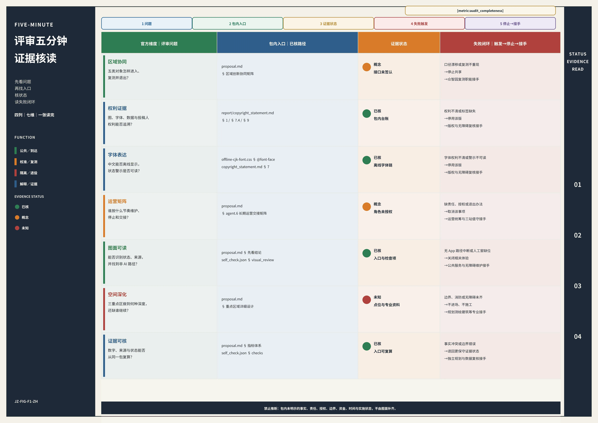

## 设计依据与资料清单

这节先把能依靠的资料、还缺的资料和只能临时使用的资料分开说清楚。这样后面的图、数字和判断就不会被误当成正式边界或已经授权的结论。

动手设计之前，我们先把资料分成四类。第一类是这次征集公开的公告、面向智能体的任务书和评审规则，它们规定了三层工作范围、三处重点地段和六项必须回答的任务。第二类是国家、北京市和海淀区已经公开发布的政策，它们只用来支持城市更新、场景开放和用人工智能帮助科学研究这些方向，不会代替我们自己对空间依据的判断。第三类是已经完成的一手实地案例研究，用来说明哪些机制可以借鉴、哪些边界不能照搬。第四类是我们自己整理的十张场景卡片、九层空间关系图、指标对照表和矩阵，让概念建议能一步步变成可以回头检查的工作稿。[source:SRC-2026-BJ-GH-QUAL-PREANNOUNCEMENT] [standard:PROJECT-OFFICIAL-ANNOUNCEMENT]

现状诊断仍有明确缺口。正式边界、地块级控规、权属、测绘、现状建筑、交通与公共服务基线、市政容量、生态与文保清单、资金和运营责任，只要当前材料不能确认，就统一写成 **UNKNOWN／待正式资料确认**。这些缺口不是用 0 或空白代替，也不由概念图、合成人物或模型推断补齐。[depth:existing_conditions_diagnosis]

本稿使用的临时边界是粗略的 provisional（临时）工作面，不是官方红线，不能作为审批依据、精确面积依据、法定控制线、权属边界或工程边界。它只用于组织非正式设计讨论、定位图层和复算当前设计模型；正式多边形到位后，九层几何与三项指标都要重算。当前 `constraints` 图层为空，表示正式控制资料尚未取得，不表示场地没有约束。[data:geometry/site_boundary.geojson] [data:geometry/constraints.geojson]

任务书要求的命名与 Logo、八个生态案例、十张场景卡、三座 AI 朝圣地标、文化叙事和长期运营，均在正文逐项展开。完整来源身份、许可、公式、任务覆盖、标准回应和设计深度仍由机器文件保存；正文只放与判断相邻的证据指针，删去指针后仍可独立阅读。[source:SRC-2026-0518-AGENT-OPEN-CALL-TASKBOOK] [standard:PROJECT-AGENT-OPEN-CALL-TASKBOOK]

全稿共用的判断边界在这里集中说明一次：关联政策只说明方向，不自动成为本项目承诺；概念图只组织关系，不补齐数据；AI 只整理、比较和提示，人负责授权、取舍与纠错。不合格就停止、撤回或恢复原样。各章据此只保留与本章判断直接相邻的条件，并把下一步交给对应的规划、交通、市政、建筑或运营团队。

## 三层范围工作框架

这节把从大区域研究到三个重点地段做更细设计的先后顺序摆明。这样读者能知道每一层回答什么，也不会把临时范围当成精确边界。

三层范围对应三组不同的问题，也对应三种不同的工作深度。大约43.6平方公里的第一层是统筹研究范围，主要看区域里的产业、大学、科研机构、公共服务和未来城市之间怎么协同；大约11.4平方公里的第二层是总体设计范围，用来安排更新结构、用地、交通、市政、蓝绿和公共空间；大约368.4公顷的第三层是三处重点区域的详细设计范围，留给专业团队继续做更细的设计。这些面积数字来自征集公告级别的资料，目前的空间图形只用来讨论概念和做复核，不会把粗略的重点区范围说成精确控制边界。三层图既能说明每一层回答什么问题，也为后续团队标出了从大区域研究走向地块深化的先后顺序。[standard:PROJECT-OFFICIAL-ANNOUNCEMENT] [depth:three_level_scope_framework]

总体结构是一脊、双轨、三站。一脊依托京张遗址公园及其公共空间网络，不另画一条假铁路；“公共任务轨”回答谁的困难被接住、修复或退出，“科学发现轨”回答同一困难怎样变成假设、协议、校准和独立复测。三站分别是众智园“复测工场”、AI 原点“问题与验证前厅”、大钟寺“首用与退出街室”。三站不是三个展厅，而是三种不能相互替代的责任。专业团队可以按“问题进入—协议校准—有限首用”的顺序，把空间、人员和维护接口逐站深化。[depth:overall_spatial_structure]

问题可以在 AI 原点通过纸笔、电话、现场共走或人工翻译进入；需要仪器和协议复核的部分到众智园校准，并公开失败与适用边界；达到授权条件的方案，才可能在大钟寺或其他有权场景有限首用。结果既回到公共决定，也改变下一轮假设、采样协议或工具版本。若没有改善最慢群体，或恢复责任说不清，就停止而不是升级。每轮结果都回填问题、协议、责任和版本四个字段，下一轮可从原记录直接复测。

三大定位是“百年京张文化带、都市 AI 生活体验带、AI 融合创新带”；五大功能是“AI 全栈自主创新体系、世界级 AI 创新生态、AI+ 场景赋能新范式、智能化 AI 活力城市、AI 治理全球话语权”；三区为众智园 AI 自主创新加速区、AI 原点社区和大钟寺 AI 产业聚集区，两翼为中关村科技服务翼和小月河场景赋能翼。它们是一条可停止的工作链，不是十三条互不相干的口号。后续空间与运营方案都沿这条链分配对象、责任和复核节点。[data:geometry/key_areas.geojson]

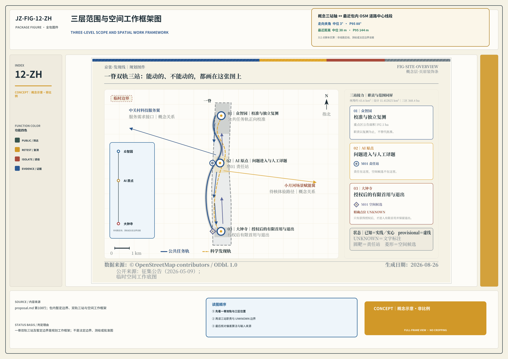

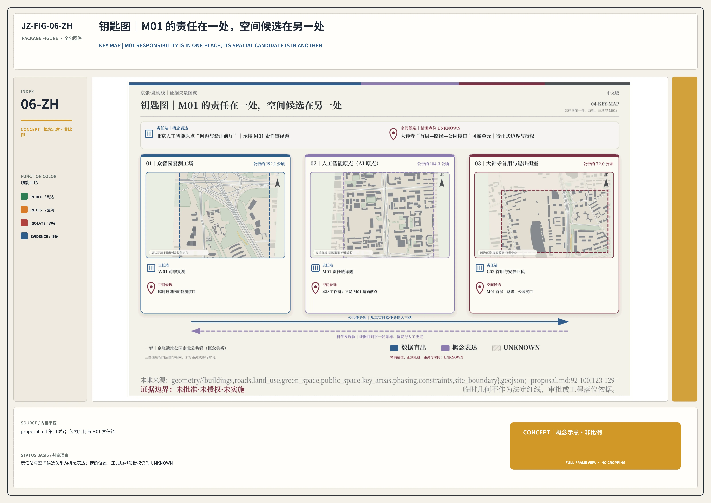

## 统筹研究范围产业与未来城市研究

这节说明整套方案怎样把外地案例、周边地区的合作对象和三处本地空间接成一条能停、能退的工作链。这样案例只用来借方法，不会被写成已经发生的合作或现成答案。

这个方案名叫“京张·发现线”。“京张”指的是那条有百年历史的铁路和它沿线的公共空间；“发现”指的是我们先找问题、再提出假设、反复核对，最后请大家一起做决定的工作方法；“线”既指遗址公园里那条主要的公共通道，也指每一步都能查证的记录线索。整套方案用一句话说明自己：让城市里的问题进入科学流程，把验证过的发现带回日常生活。我们不再另设第二个名称，十张场景卡、三处空间样板和年度运营都归在这条线上，名称、场景、空间和运营因此使用同一套标识和讲述顺序。

投稿人已确认的近山版主标以错落近山形成外轮廓，洞中上方为天坛祈年殿意象，抽象金色线从山间延伸到字行中部的唯一朱红点；“京张”与“发现线”在红点两侧组成识别。它是本方案的概念识别，不把山、天坛或金线写成已建地标，也不替代真实文化资源普查、商标清查和字体授权。资产团队拿到文化普查、商标与字体资料后，可以沿现有轮廓、图形和字标三层逐项校核。[standard:GENERATIVE-AI-INTERIM-MEASURES]

八个案例先回答“借什么、放到哪里”，再把适用边界集中放到合规章核对：

| 案例 | 可迁移的机制 | 京张接点 | 京张转译动作 |
|---|---|---|---|
| Punggol Digital District | 大学、企业、公共空间与数字化运营的协同关系 | 三站与校社、科研、首用空间链 | 把协同关系拆成三站的空间、课程与运营接口 [source:PUNGGOL-SRC-01] |
| Seoul AI Hub / Yangjae | 按成长阶段组织教育、孵化、研发和国际网络 | 众智园与中关村科技服务翼 | 按成长阶段匹配复测、服务与转化支持 [source:SEOUL-SRC-01] |
| Toyota Woven City | 有限首用、使用回执与下一轮调整 | 以居民回执检验未来生活 | 用居民回执决定继续、修改或退出 [source:WOVEN-SRC-01] |
| Detroit–Ann Arbor（Michigan Central＋Mcity） | 遗产、公共空间、社区问题与“受控复测先于有限首用” | 公共脊、AI 原点、众智园和 M01 | 把遗产公共性与受控复测接入同一责任链 [source:DETROIT-SRC-MC-01] [source:DETROIT-SRC-MCITY-01] |
| Curiosity Lab at Peachtree Corners | 真实路缘与生活场景的有界首用接口 | 大钟寺 M01 | 先把真实路缘条件写进 M01 准入表 [source:CURIOSITY-SRC-01] |
| Testbed Helsinki | 开放征集、逐案准入、责任配置与采购分离 | 年度循环和 W01、M01、C02 的进入条件 | 把征集、准入、责任与采购分成四个步骤 [source:HELSINKI-SRC-01] |
| Berkeley A-Lab | 假设、协议、测量、失败分类、下一轮与公开不确定性 | 众智园发现护照和 W01 跨季复测 | 把假设、协议、误差和失败写进发现护照 [source:ALAB-SRC-01] |
| Chicago Array of Things | 最小取数、校准、复测及隐私、科学、公共治理分审 | 众智园与 W01，M01 只借治理边界 | 以最小取数和分审机制组织 W01 复测 [source:AOT-SRC-02] |

京张的概念生态因此不是“企业名单加算力名词”。众智园负责校准、协议对照、独立复现、公众解释和设备退役；AI 原点把居民问题、高校科研、受控验证、伦理权利和开放学习接起来；大钟寺把通过门槛的技术放进高密度生活中有限首用。中关村科技服务翼只把已说明证据状态的发现护照拆成土地、空间、产业、资金、人才、算力、数据、场景八类服务需求，仍由有权主体人工尽调和签认。采用、补证、暂停、退役或退回科研，都是可接受的结果。[source:BJ-2026-CONCEPT-VALIDATION]

“1+X+1”融合只作方向级概念表达：以发现护照把 AI 与其他主导产业的公共问题、验证条件和退出责任接入同一工作链；具体产业组合、功能比例、空间组织和实施主体均为 UNKNOWN。

### 区域创新协同矩阵｜五对象怎样经双轨三站进出

八个国际案例只说明可迁移机制，不能代替本地与区域对象之间的接口。本节把双轨三站作为对外接口：公共任务轨接收问题、权利和服务需求，科学发现轨交付协议、复测和版本回返；任何对象都须先明确输入、责任和退出条件，再由有权主体决定是否进入。以下只列建议接口，不表示任何合作已经发生。

| 协同对象 | 可交换要素 | 京张接点 | 进入条件 | 退出条件 | 证据状态 |
|---|---|---|---|---|---|
| 北纬社区 | 居民问题单、无障碍共走协议、W01／M01／C02 场景卡、匿名回执和公共知识摘要 | AI 原点＋公共任务轨接问题单；众智园＋科学发现轨复测；交接物 D02／D06 | 问题范围、受影响者、人工窗口、最小取数和建议责任角色齐；六道门前两门通过 | 撤回同意、最慢群体变差、人工接管失败，或恢复责任仍为 UNKNOWN，即停止并记录 D06 | 官方任务书列为协同对象；公开资料仅作背景；具体接口、主体和授权 UNKNOWN |
| 未来科学城 | 跨领域科研问题单、协议模板、研究者复测席位、W01 跨季数据字典和可复现报告 | AI 原点＋公共任务轨把城市问题译成协议；众智园＋科学发现轨做独立复测；交接物 D04／D06 | 同一假设、协议、版本、数据权利、校准基准和建议责任角色写入发现护照 | 协议版本不一致、数据权利不清、独立复测失败，或公共问题未回应，即退回科研并记录 D04／D06 | 官方任务书列为协同对象；公开资料仅作背景；具体接口、主体和授权 UNKNOWN |
| 怀柔科学城 | 仪器复测需求单、校准样本、跨设备复测协议、误差日志和公众版方法说明 | 众智园＋科学发现轨接校准与误差复核；AI 原点＋公共任务轨接公众解释；交接物 D04／D06 | 仪器适用边界、样本安全、数据权限、校准基准和失败分类可核 | 排期或样本条件不满足、误差越过协议边界、结果不可复现，或责任未接，即停止并回填复测账 | 官方任务书列为协同对象；公开资料仅作背景；具体接口、主体和授权 UNKNOWN |
| 经开区 | 候选产品测试说明、供应链可维护清单、M01／C02 场景卡、备件与撤除步骤、产业服务需求单 | 大钟寺＋公共任务轨接授权后的有限首用；众智园＋科学发现轨复测；交接物 D03／D05／D06 | 路权、消防、无障碍、场地、数据、维护和恢复责任通过相应六道门 | 险情上升、最慢群体变差、维护或恢复无人接收，或责任仍为 UNKNOWN，即撤除并关闭 D05 | 官方任务书列为协同对象；公开资料仅作背景；具体接口、主体和授权 UNKNOWN |
| 京津冀 | 跨城问题目录、共用字段字典、复测协议版本、人才公开课件和公共成果摘要 | AI 原点＋公共任务轨汇题；众智园＋科学发现轨按同一对象 ID 复测；交接物 D01／D06 | 各地口径、对象 ID、数据权利、复测协议和建议责任角色一致 | 口径漂移、地域外推无证据、任一方撤回，或复测不能重现，即停止共享并保留版本差异 | 官方任务书列为协同对象；公开资料仅作背景；具体接口、主体和授权 UNKNOWN |

尾注：本表为建议接口，未签约、未授权；采纳与否由有权主体决定。所有频次、责任、资金、场地和实施安排均为 UNKNOWN，不能据此认定现实合作已经发生。

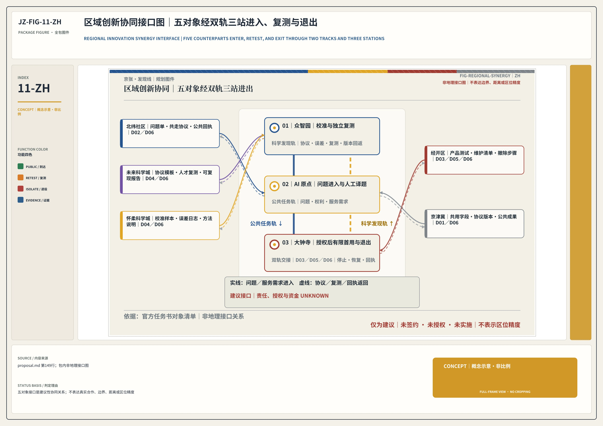

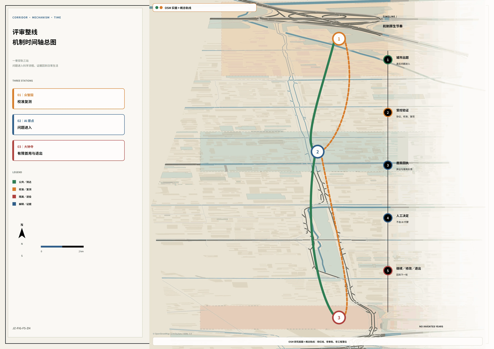

## 总体设计范围城市更新与控规深度城市设计

这节先在现有城市里安排公园、交通、服务和产业之间怎么连接，再把还缺的正式资料逐项留出来。这样后续团队知道从哪里继续，也不会把暂时用来讨论的地图当成依法确定的方案。

总体设计范围先处理现有城市，不以清空重建为前提。我们在一张底图上同时安排公园主通道、三个车站、东西方向连接、步行骑行和轨道换乘、绿化与排水韧性、公共服务、新基础设施和产业用地。把产业和空间结合，不是给每块地贴一个“人工智能”标签，而是让研究、试验、首次使用、日常服务和维护各自有合适的空间，并且技术撤走后，普通生活照常进行。后续设计团队可以在同一张底图上不断叠加专业资料，保持空间关系和编号不变。[standard:MOHURD-URBAN-DESIGN-MEASURES] [depth:land_use_layout]

控规深度城市设计要回答十项内容。本稿把它们分成两组交付：能由现有 provisional 工作面与 OSM 保守底料支撑的，给出结构关系和判断顺序；“需要回答”不等于现在填假数，容积率、高度、密度、退界、建筑容量与工程线位六项标为 **UNKNOWN／待正式资料确认**，并逐项写明需要哪一份正式资料才能关闭。专业团队拿到本稿，可以直接从这张缺口表接着做。[standard:MOHURD-CONTROL-DETAILED-PLANNING]

国土空间规划的概念建议，是给每个空间对象附上证据状态：已知、临时、UNKNOWN、可逆试验或需法定程序。`land_use` 只表达当前设计模型中的功能关系，不能据此判定权属或法定用地；`buildings` 是 OSM 建筑基底的保守子集，不能证明用途、高度、产权或拆改留结论。正式资料替换后，应按同一对象 ID 更新图层、指标和说明，不用新口号掩盖旧证据。对象 ID 保持稳定，专业团队就能只替换变化图层，并追踪哪些结论需要同步复算。[data:geometry/land_use.geojson] [data:geometry/buildings.geojson]

总体设计的判断顺序保持简单：先核真实边界、现状和责任，再看公共任务是否连续；再决定空间动作是否必要、可逆、可维护；最后才讨论专业深化。每完成一层核对，就把通过项、缺口和责任人写回同一对象，下一专业可据此接续判断。

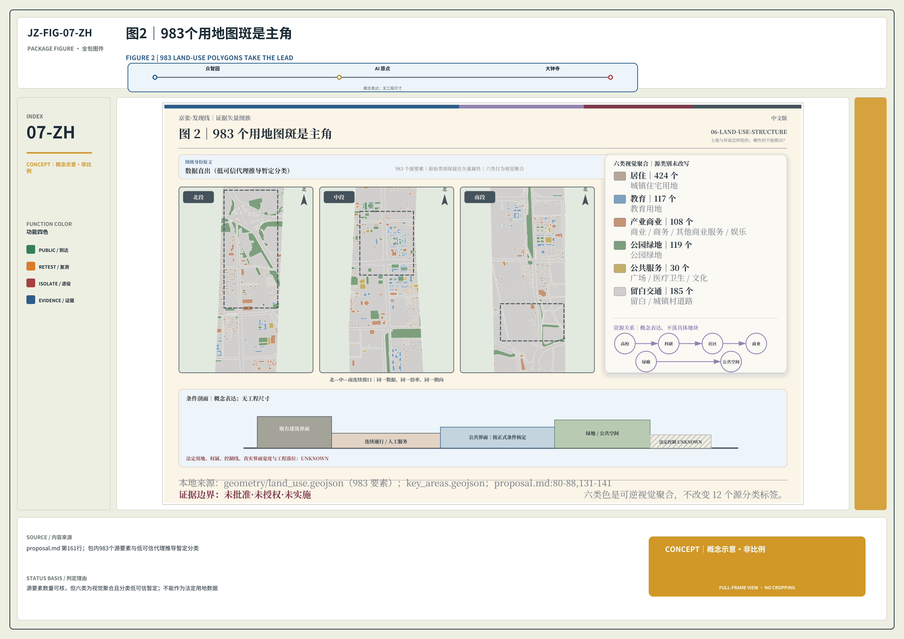

## 重点区域详细设计

这节分别说明三处重点地段各自要解决什么问题，以及后续设计人员还要核对什么。因为边界和现场条件还没确认，这里只给方向，不把设想图当施工图。

三个重点地段目前只是大概的临时范围，只能提出方向性的想法。公告级面积分别为众智园约192.1公顷、AI原点约104.3公顷、大钟寺约72.0公顷；精确边界、内部地块、产权、消防、无障碍、市政、生态和文物保护条件仍为 **UNKNOWN／待正式资料确认**。这些临时范围会随着正式边界图更新，不能当作法定控制或施工依据。等正式边界图拿到后，三处面积、内部对象和对接表都会按同样顺序原位更新。[data:geometry/key_areas.geojson] [depth:three_key_area_detailed_design]

**众智园“复测工场”**的概念定位是把小月河等场景送来的观察变成可复核证据。空间上建议容纳可预约校准台、版本与误差说明、公众解释窗、设备隔离与退役界面；交通上优先检查人员、仪器与公共参观能否互不干扰；AI 下线后仍留下标准协议、人工仪器、公开结果和复测空间。建筑是否保留、修缮或改造，须等正式普查与专业鉴定。建筑团队可先按校准、解释、隔离和退役四类需求准备普查清单。

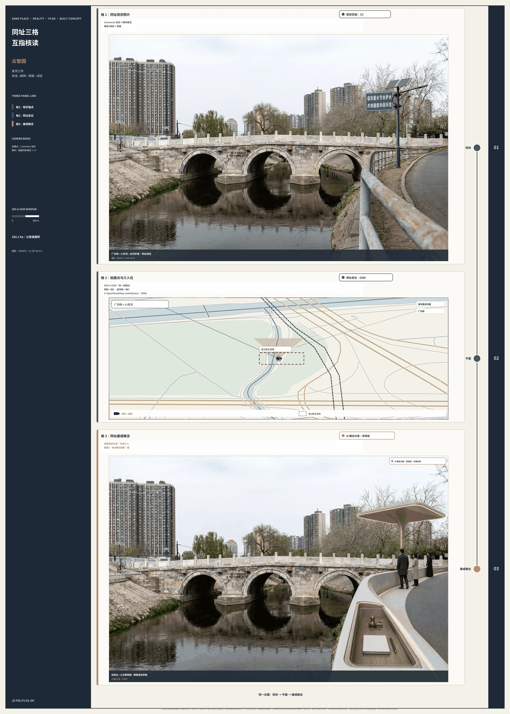

**AI 原点“问题与验证前厅”**的概念定位是让问题先说清再验证。空间上建议保留纸笔、电话、现场共走、人工译题桌和手工采样课；AI 只做归类、冲突提示和错误解释，不自动排优先级，也不采学生脸、声纹或家庭轨迹。公共空间要能容纳无 App 人群、照护者和轮椅使用者，建筑体量、材料、界面与具体点位仍待专业资料确认。空间团队可先沿五种问题入口和三类使用者组织平面关系。[standard:BARRIER-FREE-ENVIRONMENT-LAW]

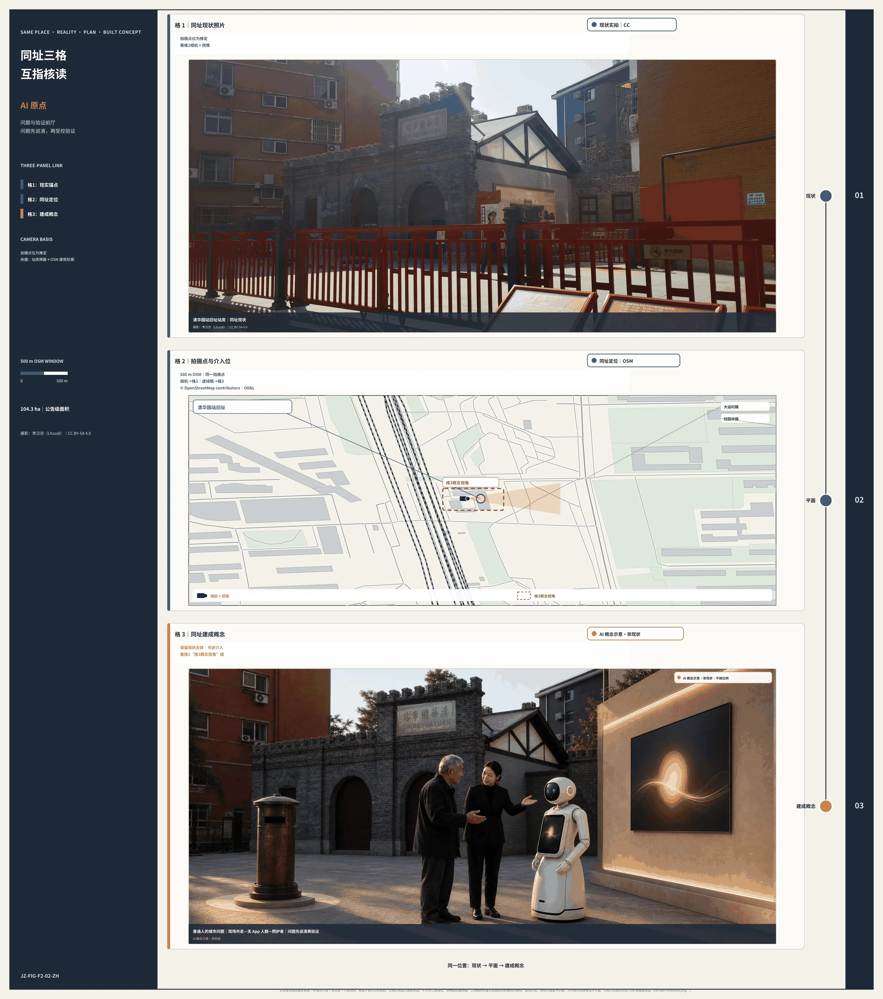

**大钟寺“首用与退出街室”**的概念定位是比较真实生活中的得失。候选单元把首层、路缘、公园接口和社区安静边界放在一起，先比较固定时段、静态车位和人工引导，再决定是否需要匿名计数或可撤调度。只有路权、消防、无障碍、装卸、场地、数据与运营责任都关闭，才可能进入有限首用；责任未接清，不进试验。专业团队可从这七项条件开始现场核查，并把可行时段、恢复动作和维护责任写回候选单元。[standard:MOHURD-ARCH-DESIGN-DEPTH-2016] [depth:height_massing_character]

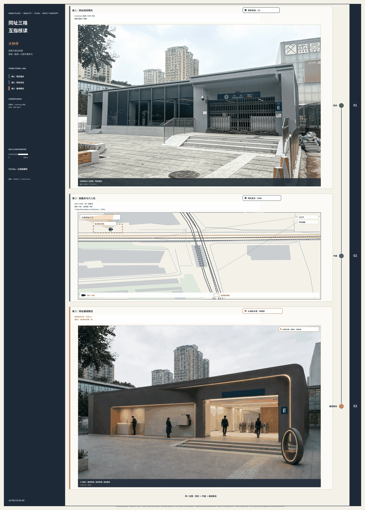

大钟寺“首用与退出街室”可将智能体铭牌墙、人工窗口和可快拆智能终端作为概念表达，责任人、版本、退役日、终端点位、授权与运营状态均为 UNKNOWN。该界面不扩张 C02 职责：AI 仍只聚合比较安静、平衡、活力三案，人工问询、静态导视、固定活动表和无活动对照日继续保留。

大钟寺站四象限步行只以图 3 与 roads 的连续性判断、M01 路缘纪律作为概念表达；站城一体化方案、各象限精确接口、非机动车停放点位和实施责任均为 UNKNOWN，须由轨道、交通与市政专业接续。

三处都按同一七问继续深化：定位是什么，空间怎样组织，建筑怎样对待，交通和慢行怎样连续，公共空间怎样保留非 AI 路径，AI 场景由谁维护，失败后怎样停用和恢复。当前稿回答了职责和判断方法，没有把概念剖面冒充详细施工方案。这七问同时构成建筑、交通、景观和运营团队共同使用的深化提纲。

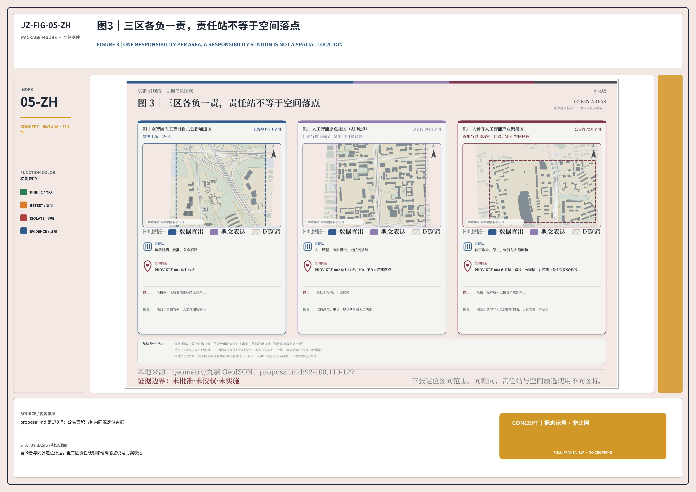

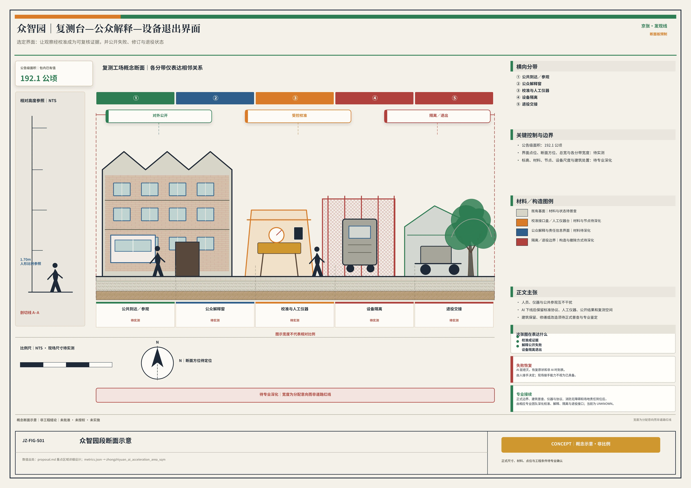

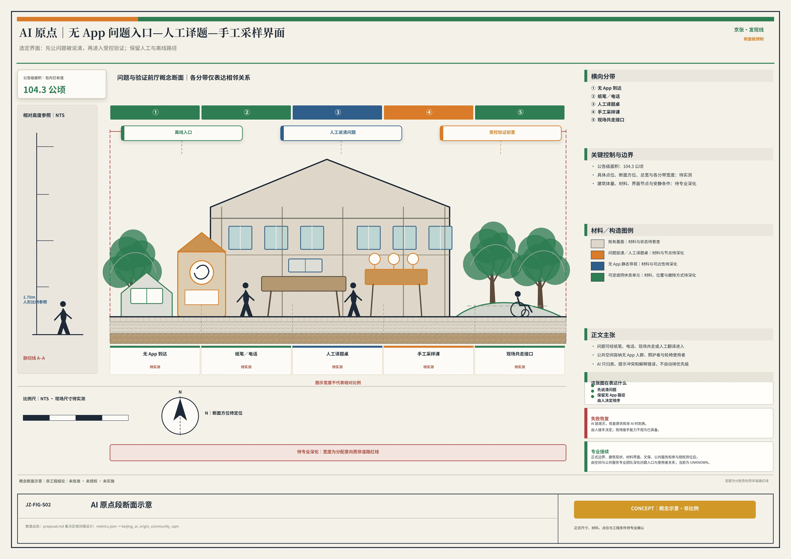

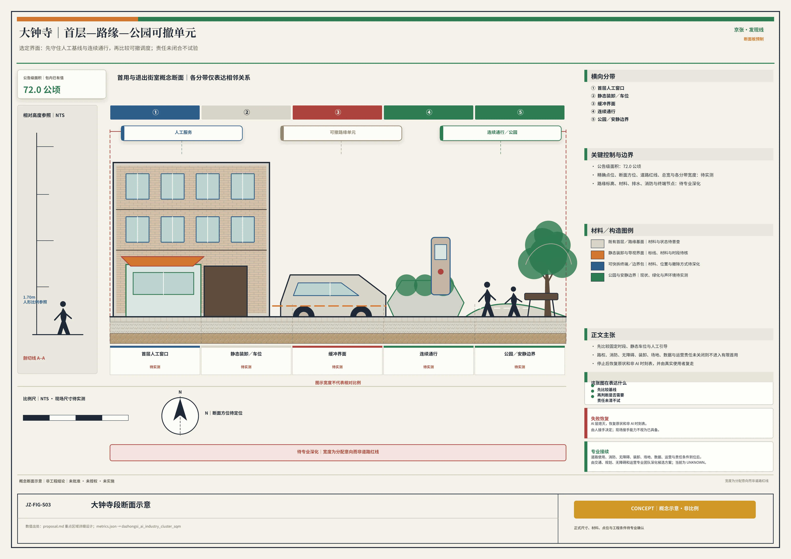

## AI 创新生态、人才画像与 AI+ 场景

这节用人物清单和十个具体使用情境检查方案会不会漏掉谁，也说明 AI 只做哪些比较。这样每种情况都保留人工办法，并在条件不够或结果变差时停止、恢复原状。

我们列出的这些人物不是宣传用的，而是用来检查方案会不会漏掉谁。目前至少包含十类需要后续核实的典型人物：不会用智能手机的老人、坐轮椅的人、照顾家人的人和家长、夜班骑手、沿街商户、外地患者和陪护、学生和老师、研究人员、社区或街区协调员、养护和运营人员。对每一类人，我们都要说明他们一天要完成哪些事、在等什么或承受什么噪声、哪些权利不能让步，以及不用人工智能时怎么完成同样的事。这些人物目前只是假设，不是真实访谈结果；以后可以按这十类人逐项补充真实任务、差异和被遗漏的群体。 **一个人的一天：** 【合成标注】以下为桌面模拟的合成叙述，人物为设定人物·非访谈，不来自任何真实访谈或现场。M01不是物理卡、门票、感应区、自动凭据或实际运行系统。桌面模拟｜非现场测试｜不代表真实项目发生过。 早上，一位设定人物沿街经过，看到路缘同时被骑手补货、商户短停和居民通行争用。M01用同一ID记录问题。 中午，M01把A、B、C三案放在同一ID下，AI只用聚合数据比较：A是固定时段、静态车位、人工引导；B是轻量、可逆、匿名调度，不追踪或考核个人骑手；C是由有权主体与专业团队接手的专业路缘深化。 下午，M01记录有权主体与受影响者人工决定继续、修改、不采用或撤除；当前责任主体仍未确认。 傍晚，桌面模拟中人工接手缺失即NO-GO；AI层熄灭，恢复原状和非AI时刻表，日常任务继续；M01记录停止、恢复与下一轮复测。 责任人：UNKNOWN；叫停人：UNKNOWN／待正式责任主体确认；复测日：UNKNOWN；恢复费用：UNKNOWN。 当前仍是：未批准 · 未授权 · 未实施。[standard:ELDERLY-SMART-TECH-PLAN-2020-45]

十张场景卡一张不少，且都保留人工路径、授权、人审、停止和恢复：

| ID | 场景 | AI 只做什么 | 非 AI 基线与边界 |
|---|---|---|---|
| G01 | 诉求与未诉双入口译题台 | 归类、去重、提示冲突与样本缺口 | 纸笔、电话、人工编码和联席会；AI 不定优先级 |
| W01 | 小月河热—水—通行跨季复测窗 | 质量提示、异常初筛和模型对照 | 人工仪器、固定观察点；无真实数据不发布水质或安全结论 |
| R01 | 道路责任断点证据链 | 比对公开材料并提示责任字段冲突 | 正式查询、台账核对和现场联勘；AI 不判产权 |
| R02 | 全龄通行工单—复走 | 比较数字路网与真实共走记录 | 使用者和无障碍专业人员人工审计，保留静态导视 |
| M01 | 人—车—机路缘时刻表 | 用聚合数据比较人工基线与可撤调度 | 固定装卸时段、静态车位与人工引导；不追踪骑手 |
| H01 | 就医前“少跑一次”公共服务链 | 整理经核目录、可达路径和人工转接 | 电话、纸质目录、人工咨询；不诊断、不分号、不承诺号源 |
| H02 | 医院微型城市流程沙盒 | 比较非临床合成流程 | 人工桌面推演；无医院授权不接真实患者数据 |
| E01 | AI 原点一公里城市科学课 | 提示采样质量并解释手工与 AI 差异 | 教师带队、纸图、人工仪器；不跟踪学生、不自动评分 |
| C01 | 大钟寺生活供给侦察 | 整理场所、价格、时段与矛盾需求 | 门面盘点和人工访谈；不做消费画像或行为操控 |
| C02 | 四时段 AI 首用试营与安静回执 | 聚合比较安静、平衡、活力三案 | 人工问询、静态导视、固定活动表和无活动对照日。十张卡随后按同一字段进入现场补证与责任分配。 |

W01、M01、C02 是三项优先测试验证候选，“优先”不表示获得授权或已完成验证。W01 比较人工仪器与固定点观察、AI 质量提示和跨季复测，未授权、未校准、缺测不可解释或越权发布结论时停止，并撤回不合格数据。C02 比较安静、平衡、活力三案和无活动对照日，AI 只聚合商户、居民、夜班人员和访客的得失，最后由人拍板。[source:BJ-2025-AI4S-ACTION]

M01 是唯一展开最深责任链的候选：先由 R02 查消防、无障碍和责任，再由资产与运营责任接收，建立非 AI 基线，比较三案，由人决定是否进入建议性的 30 至 90 天可撤试验。条件窗：30–90 天可撤试验期内，须覆盖雨天复测至少 1 次、早高峰与晚高峰复测各至少 1 次；假设“雨天与高峰时段路缘冲突加剧”由现场实测证实或证伪；当前无现场基线，相应数值为 UNKNOWN。请求被拒、责任未确认、试验取消、险情上升、最慢群体变差、人工接管失败、原状未恢复或问题转移到邻段，都进入失败分母。停止后先恢复原状和非 AI 时刻表，再由真实使用者复走；说不清责任，就不试。复走结果将回填 R02 和 M01，成为下一轮是否继续的直接依据。[standard:GENERATIVE-AI-INTERIM-MEASURES]

跨文件统一使用发现护照 ID **M01**：责任人为 **UNKNOWN**；叫停人为 **UNKNOWN／待正式责任主体确认**；复测日为 **UNKNOWN**；非 AI 等价路径为固定装卸时段、静态车位与人工引导；恢复动作为停止试验、恢复原状和非 AI 时刻表，并由真实使用者复走，恢复费用为 **UNKNOWN**；适用范围为大钟寺待甲方确认的首层—路缘—公园接口可撤单元，精确点位及获批的时间、路段和人群范围均为 **UNKNOWN**，不得自动扩大；科学回返为三案比较、风险转移与恢复时钟证据，用于更新下一轮采样、协议或工具版本；公共回返为由有权主体与受影响者人工决定继续、修改、不采用或撤除，并留存协议、工单、停用与恢复回执。

每张卡最终应留下协议、工单、修复记录、开放数据字典、服务标准或明确的“不采用”结论之一，并注明维护者、版本、适用范围、复核日和退役办法；只看活动人数、网页展示或演示视频，不算验证完成；场景运营主体、点位、基线值和复测时间当前仍为 **UNKNOWN／待正式资料确认**。正式信息到位后，运营团队可按卡片 ID 逐项补齐并安排复核。

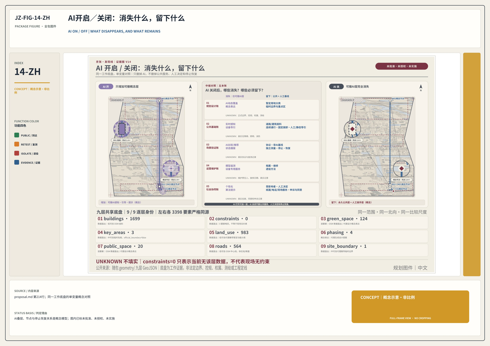

## 用地、建筑规模与拆改留方案

这节先核对现有用地和建筑，再决定哪里保留、修缮、改造、更新或拆除。因为正式测量、土地和建筑归谁、这块地受什么规定约束都还没确认，这里只给判断顺序，不填假的规模和工程尺寸。

在用地建议上，我们先核实现状，再讨论功能混合，最后才决定拆、改还是留。众智园要同时容纳设备核对、科研、共享仪器和向公众解释；AI原点需要教育、社区服务、人工咨询和受控测试需要的安静接口；大钟寺需要底层店铺、路边、公共空间和社区生活分时段共用。中关村科技服务带和小月河场景应用带只是服务和场景联系，不是新设的法定用地类型。等正式用地资料到位后，规划团队可以按三个车站和两条服务带的功能需求，逐块核对是否合适。[standard:MNR-LAND-USE-CLASSIFICATION-GUIDE] [depth:land_use_layout]

建筑规模不能从当前稿推出容积率、高度、密度、退界或新增建筑量。现有 `buildings` 只提供 OSM 建筑基底保守子集，正式任务资料尚未提供足以关闭地块级控规、权属、测绘、合法性和现状用途的数据。专业团队应按结构安全、历史文化价值、公共服务必要性、适配性和居民意愿逐栋核查，再形成保留、修缮、改造、更新或拆除的概念建议。[data:geometry/buildings.geojson] [depth:development_intensity_controls]

“拆改留”不服务于制造未来感。能够以轻触更新承接人工服务、静态导视、校准或可撤试验的建筑，优先考虑保留和再利用；妨碍消防、无障碍或基本公共服务的断点，先做责任核查和最小修复；只有正式鉴定与法定程序支持时，才讨论重大改造或拆除。历史建筑、遗产点和保护范围以正式清单为准，本稿不补造年代、价值等级和保护线。专业团队据此先完成逐栋核查，再把保留、修缮、改造、更新或拆除建议写回对象清单。[depth:retain_renovate_demolish]

`land_use`、`buildings` 和 `constraints` 三层必须一起读：前者是 provisional 功能关系，中者不能证明用途和权属，后者为空表示正式控制条件尚缺。地块级现状来源、面积算法、处置建议、责任主体、法定条件和不确定性仍需在结构化数据中逐项补齐。当前只给判断规则，不把概念建议写成控制指标或工程断面。三层以同一对象 ID 对齐后，新增资料可直接触发对应地块的处置与指标复核。[data:geometry/land_use.geojson] [data:geometry/constraints.geojson]

建筑体量与城市风貌先守住公共界面清楚、可维护、不过度侵入三条原则。新组件建议克制、耐久、可撤，避免强光、噪声和大面积屏幕；工程尺寸、材料、节点和真实落位均为 **UNKNOWN／待正式资料确认**。建筑与景观团队可先用三条原则筛选方案，待工程资料到位后再补齐尺寸、材料和节点。[depth:height_massing_character]

## 交通、轨道、市政与公共服务设施

这节检查一个人走路、换乘、办事时会不会在半路被卡住，并把道路、排水、电力通信和人工服务还要补查什么列出来。这样技术失效时，基本任务仍有电话、纸质资料、固定路牌和人工窗口可以接住。

交通建议的出发点是：一个人能不能不中断地完成一天要办的事。南北方向沿着京张遗址公园的主要通道，我们会检查步行、骑车、轮椅、轨道换乘和一天四个时段的使用情况。东西方向连接高校、社区、企业和公园两侧，我们一个个标出需要核对的接口，包括位置、连接对象和需要哪一方确认，但不会事先假定要拆墙、建桥挖隧道或拓宽道路。目前道路几何取自临时工作底图（provisional 工作面）和公开地图（OSM）的保守底料，只用来组织换乘关系和判断连续性；接口一旦拿到正式资料，可以在原位替换，并只重新计算这一段的连续性结论。[data:geometry/roads.geojson] [depth:traffic_rail_slow_parking]

R02 用完整任务复走代替“单点看起来合规”：老人、轮椅使用者、照护者和日常使用者从起点走到终点，记录坡道、路面、座椅、路标、路缘、换乘和人工问询是否连续。M01 的路缘单元先关闭路权、消防、无障碍、装卸和维护责任，再比较固定装卸时段、静态车位与人工引导等方案；不得用个人轨迹考核骑手。复走表与路缘条件表合并后，交通团队可直接定位需要修复、补证或维持人工方案的断点。

在 R02 全龄通行工单中，可把遗存轨与园路交叉处的高差及可撤跨越垫道作为概念表达的待核断点；精确点位、高差、安全尺寸、授权与实测结果均为 UNKNOWN。

小月河场景赋能翼是一段待正式确认的公共体验路径，不是一条布满传感器的展示带。W01 在高温、雨后和日常等条件下做人工观察、固定点采样和手工／AI 对照，再到众智园校准；E01 可由教师带领学生参加城市科学课，但不采脸、声纹、家庭轨迹或可识别的连续路径。水务、气象和教育团队可以分别从采样协议、校准安排和课程组织三个接口接续。

市政与新型基础设施现阶段先列资料条件：排水分区与积水记录、水务和气象原始数据、管线和检修权属、电力与通信容量、消防条件、环卫和设备维护责任。没有真实水务或气象数据时，不画热力图、不发布水质与安全结论；没有容量校核时，不承诺算力、充换电、设备数量或接入时序。资料到位后，市政团队按排水、水务气象、管线、电力通信、消防和运维六组条件逐项核定方案。[depth:municipal_new_infrastructure]

端侧算力与传统设施融合只以 V08 剖切中的电缆沟、管廊和可撤终端逻辑作为概念表达；容量、点位、权属、接入条件和实施路径均为 UNKNOWN，须由市政、能源与信息通信专业接续。

公共服务设施同时保留人工窗口、电话、纸质目录、静态导视、座椅和可达路径。H01 只做就医前公共信息与人工转接，不承诺号源；H02 在医院正式授权前只做非临床合成桌面沙盒。技术故障时，先看人工接管能否恢复基本任务，而不是只统计系统恢复在线。公共服务团队据此同时核对数字流程与人工路径，把“少跑一次”和“能被接住”作为共同验收对象。

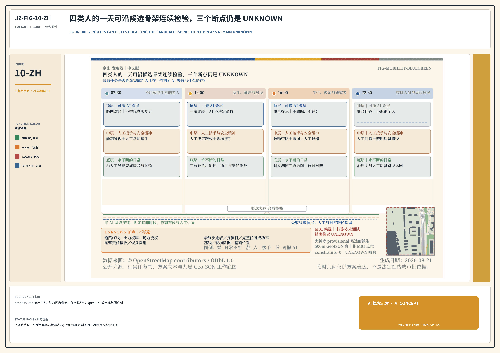

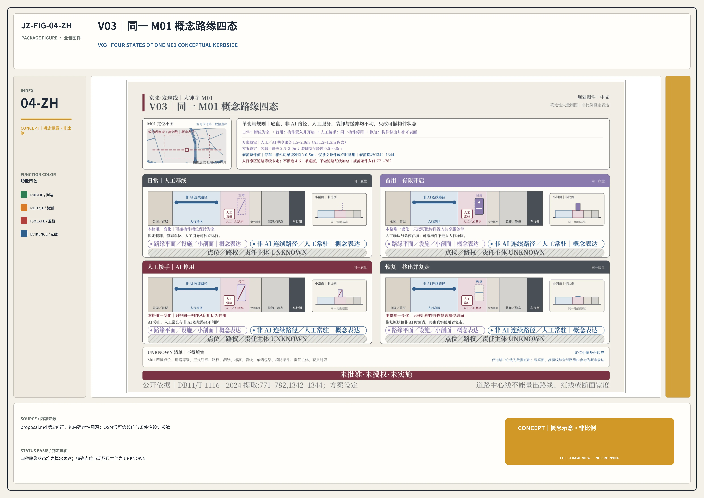

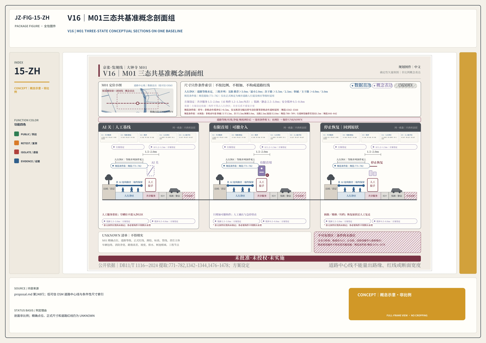

## 蓝绿空间、公共空间与城市风貌

这节看公园和周边公共空间能不能在不同天气、一天不同时段和不同使用方式下保持连贯，也说明三处公共设施要公开谁负责、什么时候复查、怎么停用。这样这些空间先服务每天的真实使用，也让出了问题能找到责任，而不是只做一个看起来很未来的外观。

京张遗址公园和周边的公共空间网络，是南北方向的主要公共通道，也是两项公共任务共同依赖的日常基础：一是应对高温、雨水和通行的韧性，二是让老人小孩每天都能不断线地使用。南北方向我们会检查步行和骑行是否连续、一天四个时段是否都能用、极端天气下有没有断点；东西方向要从高校、社区、企业和公园两侧需要核对的接口开始连接，我们不会把“连接”说成一定要拆墙或建桥。即使人工智能系统下线，固定的设施、人工帮助和基本公共服务仍然要能使用。[depth:blue_green_public_space]

V09 仅作为同一视角下“未来公园×百年遗存”的概念表达：遗存轨轴、光伏遮荫、低位感应照明、养护机器人、AR 历史取景框、复测信息桩和无障碍跨越，不代表已建成。各设施的点位、数量、责任主体、运营数据和实施状态均为 UNKNOWN。

标志节点以南端、北端、上跨环路三类节点作为概念方案回应，V15 仅是南段节点意象；各节点的正式点位、规模、工程条件和实施状态均为 UNKNOWN。

体育与创新交往只以 V09 中的健身角和廊下长桌作为概念表达的设施程序；点位、数量、运营主体和使用结果均为 UNKNOWN。

当前绿地与公共空间来自 OSM 映射存量保守子集和 B 全域骨架概念干预的去重并集；C 首期节点只进入分期，不与 B 重复相加。这两个图层适合解释当前设计模型中的连续性与干预关系，不代表真实现状全量，也不代表正式绿线、公共空间权属或批准方案。正式图层到位后，景观团队可按 B 骨架与 C 节点的既有分工替换底数，并重算连续性和面积关系。[data:geometry/green_space.geojson] [data:geometry/public_space.geojson]

三座 AI 朝圣地标都是可日常使用的公共责任界面。AI 原点“问题碑”公开问题、受影响者、证据缺口和接受或退回理由；众智园“复测台”公开校准、独立复现、失败、修订与退役状态；大钟寺“首用里程碑”公开适用范围、非 AI 选择、维护者、复核日和停用方法。三站承担三座地标，不另造第四座。地标的价值来自责任可查，不来自体量、灯光或造型奇观。设计深化时，三座地标分别以投递、复测和首用三类日常动作组织空间与信息界面。

文化叙事分三层：**京张工程精神是把事情做准**，落在测量、校准、标准、复核和维护；**中关村开放创新是允许试错、开放协作**，落在问题、试验、失败和转化；**AI 公共责任是让技术对人负责**，落在证据、权利、透明、申诉、修正和退出。三层通过“提出问题—形成假设—独立复测—城市首用—证据回到下一轮科学与公共决定”相连，不靠复古装饰或科幻表皮拼接。展陈、导视和公共活动都可沿这条动作链分配内容。[source:HD-2024-JZ-CORRIDOR-PROJECT]

清华园火车站只作为“历史站房—公共问题—复测档案”文化程序的概念表达，不代表已取得场地或内容授权。北影资源只作为“影像采集—城市记忆—公众复核”文化程序的概念表达，不代表已取得机构、作品或素材授权。

荣誉展示不做只记成功的永久颁奖墙，而是同时展示贡献、复现、维护、纠错、失败、退役、证据状态、责任人和到期日。公共空间组件只保留问题投递台、证据责任牌、无 App 路标、校准接口盒、低速试验边界包、可逆遮阴休息单元六类概念方向；每件都要有无障碍与离线后备、维护人、检查周期、停止条件和撤除办法。

## 更新项目清单、实施政策与分期计划

这节把每个候选项目要先补什么、由谁核对、什么情况下才能继续说清楚。这里说的分期只是先补什么、后做什么的条件顺序，不是已经排好的工期、资金或实施安排。

在实施阶段，我们先把每一项工作放进“五本账”和“六道门”里，再谈什么时候动工。五本账分别是规划设计、公共基础设施、场景验证、运营维护和社会协同；六道门分别是数据与边界、问题价值、科学协议、城市首次使用、项目与资金、建设运营。一个项目要六道门都通过才能进入下一步，而且每过一个阶段都要留下负责人、资料和复核记录。 **动词短语组：** 第一道门只认两样：正式材料、责任人 第二道门先问：对大家有没有价值？边界在哪？影响谁？谁负责？ 第三道门：方案变协议，桌面查一遍，再独立复测 第四道门：批了才可能小范围试，没批就是没批 第五道门：地、钱、建设承诺没着落，先停一停 第六道门：正式选址、运维、清权、法律条件都定了，再开工 [source:HD-2025-URBAN-RENEWAL]

| 对象 | 独立核验分工 | 签认格式 |
|---|---|---|
| 第一道门｜数据与边界 | 建议角色：由未参与该项底图整理、数据录入或边界绘制的规划、测绘或数据复核职能角色独立核验来源、范围、版本与 UNKNOWN；本句不表示任何角色已获安排。 | 建议签认格式：核验人姓氏＋工号＋日期；机构名、群聊确认或空白签名栏均不构成通过。 |
| 第二道门｜问题价值 | 建议角色：由未参与问题包装的公共价值、受影响者参与或社会影响复核职能角色独立核验问题是否服务公共利益、影响谁、边界在哪里；本句不表示任何角色已获安排。 | 建议签认格式：核验人姓氏＋工号＋日期；未记录受影响者与异议入口时保持不通过。 |
| 第三道门｜科学协议 | 建议角色：由未编写该协议、未执行该轮测试的科学方法、仪器校准或独立复现职能角色复核假设、协议、工具版本、失败分母与复现条件；本句不表示任何角色已获安排。 | 建议签认格式：核验人姓氏＋工号＋日期；自测自签或缺协议版本均不构成通过。 |
| 第四道门｜城市首次使用 | 建议角色：由未提出该首用候选的授权、伦理、安全、无障碍或受影响者参与复核职能角色独立核验场地许可、人工接管、非 AI 路径、停止与恢复；本句不表示任何角色已获安排。 | 建议签认格式：核验人姓氏＋工号＋日期；授权主体未确认或授权文件缺失时保持 UNKNOWN／不通过。 |
| 第五道门｜项目与资金 | 建议角色：由未编制该项目建议的预算、采购、法务、土地或利益冲突复核职能角色独立核验资金来源、采购权限、场地条件与退出成本；本句不表示任何角色已获安排。 | 建议签认格式：核验人姓氏＋工号＋日期；意向、口头支持或他项资金不得替代正式签认。 |
| 第六道门｜建设运营 | 建议角色：由未编制施工或运营建议的规划建设、消防、无障碍、运维、权利清查或法律复核职能角色独立核验正式选址、维护、停用、恢复和法定条件；本句不表示任何角色已获安排。 | 建议签认格式：核验人姓氏＋工号＋日期；责任、权利或维护条件任一缺失即保持不通过。 |
| M01｜发现护照 | 建议角色：由未生成 M01 候选、未作该轮裁决的协议、无障碍、交通、数据权利或运营复核职能角色独立核验同一 ID 下的三案、非 AI 基线、失败分母、叫停、恢复与回填；本句不表示任何角色已获安排。 | 建议签认格式：核验人姓氏＋工号＋日期；责任人、叫停人、复测日和恢复费用保持 UNKNOWN，直至有权材料与签认同时到位。 |

项目清单按条件组织，而不是把概念建议写成已排期工程：

| 项目簇 | 概念对象 | 先决条件 | 可接受结果 |
|---|---|---|---|
| 公共脊连续任务 | R02 复走、静态导视和最小修复 | 真实通行基线、责任与场地确认 | 修复、补证、停止或维持非 AI 方案 |
| 小月河复测 | W01 观察点、采样协议与众智园复测接口 | 水务气象资料、校准、场地和参与授权 | 复测、撤回不合格数据或不采用 |
| 大钟寺路缘 | R02→M01 可撤路缘单元 | 路权、消防、无障碍、装卸和恢复责任 | 采用、修改、停止或恢复原状 |
| 四时段活动 | C02 三案与无活动对照日 | 商户、居民、夜班人员和访客的人工取舍 | 选择、缩小、暂停或不办 |
| 三站责任界面 | 问题碑、复测台、首用里程碑 | 正式点位、运营维护、清权和法定条件 | 分期设置、调整或不设置。五类项目簇据此进入五本账管理。 |

分期只表达先后条件。第一步取得正式资料和责任，补现场基线与非 AI 方案；第二步形成协议、桌面检查和独立复测；第三步在满足授权后才可能有限首用；第四步由人决定采用、修改、停止或恢复原状。M01 的 30 至 90 天只是可撤试验的建议窗口，不是审批、施工或建设工期。项目团队可按四步设置资料包、负责人和转段记录。[data:geometry/phasing.geojson] [depth:phasing_implementation]

长期运营采用一套四季循环：**城市出题季—校准复测季—首用开放季—证据回返季**。出题季接收真实问题并初筛公共价值、边界、受影响者和责任；复测季公开协议、校准和独立复现；首用季只接纳安全、隐私、无障碍、人工兜底、非 AI 路径和场地授权均已关闭的项目；回返季复盘成功、失败、投诉、维护、撤除与退役，再决定继续科研、进入采购、缩小、停止或退役。

开发者社区建议由后续遴选的运营方与高校、园区伙伴协作，当前主体为 **UNKNOWN／待正式资料确认**。准入同时检查知识产权、数据权利、安全和公共利益；维修或复现活动都要留下协议、工具、修复记录、贡献名单、维护和退出责任。公共体验路线让无 App 人群也能投递问题、读懂状态、找到人工服务和退出方法；国际传播只说明问题、验证状态、公众权利和不适用边界。运营主体确定后，可直接沿准入、维修、复现、公众体验和传播五组任务配置团队。[depth:renewal_project_list]

### agent.6｜长期运营交接矩阵

agent.6 以现有四季循环作为运行时钟：城市出题季收问题，校准复测季查协议，首用开放季只接纳通过条件的候选，证据回返季把成功、失败、投诉、维护、撤除和退役写回。每项工作沿用同一发现护照 ID，进入五本账、通过相应六道门，并把失败写进复测账；活动规模本身不算成功。以下角色和频次均为建议·非授权，不构成人员、采购、资金或日程安排。

| 事项 | 建议角色 | 节奏频次 | 输入 | 输出 | 准入条件 | 退出与停止 | 成功／失败指标 |
|---|---|---|---|---|---|---|---|
| 年度活动体系 | 建议·非授权：运营统筹角色＋三站值守角色 | 每季 1 轮；年末 1 次复测账总复盘 | 五本账候选清单、发现护照、上一轮失败项 | 年度活动日历草案、三站值守表、四季回执包 | 对应候选通过六道门前 3 门；公开日历草案和人工兜底路径齐 | 任一事项缺责任、授权或退出办法，即取消该事项并留“不采用”记录 | 成功：四季均有输入、输出和回执；失败：事项无回执推进或缺口未入下一轮 |
| 活动品牌与传播视觉 | 建议·非授权：品牌编辑角色＋版权与无障碍复核角色 | 年度母版 1 次；每季按状态变更更新 | 方案名称、当季证据状态、权利清单、双语术语表 | 双语视觉使用包、图注与替代文本、版本差异单 | 商标、字体、图片权利和状态警示可核；不把候选写成已实施 | 权利不清、状态标签缺失、翻译改变责任边界，即停用该版 | 成功：候选物料均有版本、权利和状态；失败：错版外流或警示不可读 |
| 开发者社区 | 建议·非授权：社区运营角色＋代码／数据维护角色 | 每月 1 次协议诊所；每季 1 次复现会 | 公开问题单、协议、沙盒数据、工具版本、失败清单 | issue 清单、可复现步骤、贡献与退役名单、复测记录 | 知识产权、数据权利、安全和公共利益检查通过；维护角色可联系 | 权利不清、出现安全问题、无人维护或不能复现，即冻结对应贡献 | 成功：每项贡献有维护者、版本和复现结果；失败：孤儿资产或未记变更 |
| 场景开放 | 建议·非授权：场景接口角色＋安全／无障碍／数据复核角色 | 每季设候选窗口；逐案审查 | 场景卡、非 AI 基线、场地授权、人工接管和恢复方案 | 准入／拒绝回执、D03／D04／D05／D06 交接包 | 六道门前 4 门通过；授权、受影响者参与、人工兜底和恢复责任齐 | 险情上升、最慢群体变差、数据越界、人工接管或恢复失败，即停止 | 成功：每个准入项有停止与恢复回执；失败：越权扩大或撤后未恢复 |
| 公共体验·地标运营 | 建议·非授权：公共服务角色＋无障碍复核角色＋设施维护角色 | 开放候选期每周人工巡检；每月 1 次无 App 路径复走 | 静态导视、纸笔／电话入口、三站状态、投诉与维修单 | 体验路线检查表、维修工单、投诉关闭或“不采用”记录 | 消防、无障碍、人工服务和非 AI 等价路径可用；设施状态可读 | 任一路径中断、人工窗口缺位、设施责任无人接，即关闭相关体验 | 成功：无 App 任务可完成且投诉有回执；失败：最慢群体任务中断 |
| 国际传播 | 建议·非授权：双语编辑角色＋科学与合规复核角色 | 每季 1 份状态简报；证据状态变化时更新 | 发现护照公开字段、失败边界、清权图件、双语术语表 | 双语案例简报、版本差异单、人工联系入口 | 不含个人数据；证据状态、权利和适用边界双语一致 | 误译责任、状态漂移、权利不清或把建议写成承诺，即撤下候选稿 | 成功：双语状态和边界对位；失败：旧版继续流转或关键警示缺失 |
| 招引转化 | 建议·非授权：产业服务角色＋人工尽调／有权决策角色 | D06 后逐案分流；每季 1 次管线复核 | D04／D06、五本账服务需求、法务与资金资料（未提供时为 UNKNOWN） | 继续科研／进入采购准备／不采用／退回补证的分流回执 | 六道门第 5 门通过；预算、采购权限、利益冲突和公共结果可核 | 资金、采购、场地、责任或公共结果不清，即停止转化并退回补证 | 成功：每项候选有分流、责任角色和下一证据；失败：把意向当签约或无权决定 |

| 事项 | 维护责任状态 | 资金科目状态 |
|---|---|---|
| 年度活动体系 | UNKNOWN｜待有权主体确认运营统筹和三站值守责任 | UNKNOWN｜待五本账确认活动、场地、安全和复盘科目 |
| 活动品牌与传播视觉 | UNKNOWN｜待确认品牌版本、版权复核和下架责任 | UNKNOWN｜待确认设计、翻译、无障碍和权利清查科目 |
| 开发者社区 | UNKNOWN｜待确认社区运营、仓库维护和安全响应责任 | UNKNOWN｜待确认场地、工具、复现和维护科目 |
| 场景开放 | UNKNOWN｜待确认场景接收、叫停、撤除和恢复责任 | UNKNOWN｜待确认测试、保险、维护、撤除和恢复科目 |
| 公共体验·地标运营 | UNKNOWN｜待确认人工窗口、巡检、维修和无障碍复走责任 | UNKNOWN｜待确认服务、导视、巡检、维修和恢复科目 |
| 国际传播 | UNKNOWN｜待确认双语编辑、科学复核、版权和撤稿责任 | UNKNOWN｜待确认翻译、设计、清权和版本维护科目 |
| 招引转化 | UNKNOWN｜待确认产业服务、尽调、采购接口和退出责任 | UNKNOWN｜预算与资金来源未提供；不得写成招商或投资承诺 |

尾注：两表均为 agent.6 建议接口；未签约、未授权、未排期。维护责任和资金科目由有权主体在五本账与六道门内确认，未确认项保持 UNKNOWN。

## 指标体系、面积复算与合规矩阵

这节分开说明哪些数字能用随稿文件重新算出来，哪些只来自临时图或电脑演练，并列出还缺哪些正式资料。这样读者能检查数字，但不会把它们当成现场效果、批准或实施。

目前有三个数字（known 值）只是用来描述现在的临时设计模型，置信度低，不能当作法定或现状指标。比如总体设计范围的工作面面积是 **11,412,825.386 平方米**，公式是 `EPSG:4548 下 area(union(site_boundary))`，来源是临时母面 `PROV-SITE-001` 这张临时总图；这个面积不是官方红线，等拿到正式边界后必须重新计算。以后对正式边界沿用同一公式和坐标系统复算，前后两个结果可以直接看出差在哪里。[metric:site_area_sqm] [data:geometry/site_boundary.geojson]

桌面记录先用四格说明。详细事实和可复核边界见“附录：桌面运行细账”；包内最小记录分别位于 `visual/assets/run-record-three-state.json`、`visual/assets/run-record-negative-tests.json`、`visual/assets/run-record-model-round.json` 和 `visual/assets/run-record-downgrade.json`。这些记录只支持桌面条目及其判定，不证明现场成效、批准、授权或实施。

| 普通人任务 | 失败条件 | 停止动作 | 恢复／人工接手 |
|---|---|---|---|
| 不用智能设备，仍能按固定装卸时段、静态车位和人工引导完成送货路缘任务。 | 授权、资源或运营条件未齐，非 AI 通道缺失，撤回或恢复失败，责任无人接，或 M01 记录发生漂移。 | 拒绝继续推进并熄灭 AI 层；任一卡复测不过，整线降一级，不只补最差一卡。 | 恢复原状和非 AI 时刻表，由人决定下一步；责任人、叫停人、复测日和恢复费用仍为 UNKNOWN。 |

另有一份与上述三态记录分名并存、互不混算的离线任务演练账。它采用确定性协议走查：24 个任务的读数直接取自任务表，读者可按同一字段复算；任务总数取 `simulation.json#/tasks` 的数组长度，并与 `simulation.json#/task_count` 交叉核对。[metric:simulation_task_count] 结果如实保留达到预期和未达预期的判定：`simulation.json#/tasks/*/outcome` 中 20 项为 `success` 或以 `_success` 结尾（其中 6 项为按规则正确拦截的拒绝类任务），4 项未达预期，以 `simulation.json#/tasks` 为分母，合计 20/24。[metric:simulation_success_rate] 调度指令格式合规 23/24，分子取 `simulation.json#/tasks/*/dispatch_schema_valid` 的 `true` 计数，分母取 `simulation.json#/tasks`；余下 1 条非法指令被数据与边界门按规则拦下。[metric:tool_schema_pass_rate] 能耗超预算 3 条，由 `simulation.json#/tasks/*/energy_used_kwh` 逐项大于 `simulation.json#/tasks/*/energy_budget_kwh` 的计数得到。[metric:energy_budget_violations] 审计完整度为 21/24，分子取 `simulation.json#/tasks/*/audit_complete` 的 `true` 计数，分母取 `simulation.json#/tasks`。[metric:audit_completeness] 账内六道门逐项对应正文的数据与边界、问题价值、科学协议、城市首用、项目与资金、建设运营六门。以上读数来自桌面上的离线走查，没有进入现场，也不能用来证明项目真实成效。前述三态记录与双计数属同一次桌面推演，包内最小副本可以核对条目和判定，但没有携带执行程序，不能从包内独立重跑；本演练账则可直接由 `simulation.json` 逐字段复算，不计入该锁，也不与之相加。

| 关键指标条目 | 数值 | availability |
|---|---:|---|
| 协同研究范围公告面积 | 43,600,000 sqm | external_public |
| 总体设计范围公告面积 | 11,400,000 sqm | external_public |
| 三处重点详细设计区公告合计面积 | 3,684,000 sqm | external_public |
| 临时工作面面积 | 11,412,825.386 sqm | bundled |
| 绿地比例 | 0.074603 | bundled |
| 公共空间比例 | 0.004293 | bundled |
| 离线演练任务总数 | 24 | bundled |
| 离线演练成功率 | 20/24 | bundled |
| 离线演练调度结构合规率 | 23/24 | bundled |
| 离线演练审计完整度 | 21/24 | bundled |
| 离线演练能耗超预算 | 3 | bundled |

运行证据索引见 `report/narrative.md`；其中四份最小运行记录已随包，其余来源只在项目档案中保留指纹，包内不可独立复核。

绿地比例为 **0.074603**，公式是 `area(union(green_space)) / area(union(site_boundary))`；公共空间比例为 **0.004293**，公式是 `area(union(public_space)) / area(union(site_boundary))`。两个分子都先对 OSM 映射存量保守子集和 B 全域骨架概念干预去重，再做并集；C 首期节点不重复计入。正式绿地、公共空间和边界多边形任一替换，两个比例都要重算。[metric:green_ratio] [data:geometry/green_space.geojson] [metric:public_space_ratio]

绿地比例用于检查当前模型里的蓝绿连续与人才生活支持关系，公共空间比例用于检查创新交往、无 App 服务和三站责任界面的空间供给关系。两个数值共同指向需要补测的空间断点，正式资料到位后可沿同一图层和公式更新判断。[data:geometry/public_space.geojson]

场景指标从真实分母开始。通行看完整任务成功率、最慢群体耗时和复走仍存在的断点；路缘以聚合方式比较险情、等待、无障碍和噪声；公共服务看少跑的步骤、人工接管是否成功和投诉闭环；环境看采样协议完备性、仪器校准、缺测和跨季复现。每项都把拒绝、取消、人工接管失败、撤除未恢复和邻段问题转移计入分母。

| 测什么（当前状态） | 在哪测 | 怎么测（工具／抽样／授权） | 判据与阈值口径 | 复测周期 | 不达标怎么办 |
|---|---|---|---|---|---|
| `[零授权]` R02 完整任务是否出现通行断点；当前：**未测** | 仅限公众正常开放、无需进入管制区的既有步行路径；正式起终点为 UNKNOWN | 纸质任务单、手持计时工具和人工观察；只记录路段状态，不拍人、不采个人轨迹；若现场封闭即停止，转为需授权 | 判据是同一完整任务能否沿非 AI 路径不断线完成；法定宽度、坡度和时间阈值均为 UNKNOWN，未获专业口径前不判通过 | 每轮公众开放条件下的完整复走后；路径状态或修复状态变化后复走 | 保持未通过；标记断点，保留静态导视和人工问询，不进入可撤试验 |
| `[零授权]` 夜间公开路径的照明与静态导视是否连续；当前：**未测** | 与 R02 同一公众开放路线，且不进入站内、工地、院区或其他受控空间 | 手持照度工具和纸质断点表；不布设设备、不妨碍通行、不拍摄、不招募、不识别或记录真实个人 | 判据是不用 App 的公开路径上不得出现无法辨认导视或无法继续任务的暗断点；照度与可读性阈值均为 UNKNOWN，缺专业口径不判通过 | 夜间开放状态或照明、导视状态变化后复看 | 撤回“夜间可连续使用”表述；保留人工问询，标记需要照明和无障碍专业复核的断点 |
| `[零授权]` 公开路缘的等待、装卸冲突与无障碍连续性；当前：**未测** | 仅在公众可见、正常开放且无需占道或进入管理区的路缘外侧观察点 | 纸质观察表和手持计时工具；只记聚合事件类别，不拍摄、不记车牌、不追踪骑手或行人 | 判据是不得增加险情、等待或无障碍中断；事件定义、观察窗和阈值均为 UNKNOWN，不以零观察冒充零风险 | 路缘状态变化后复看；正式授权前只保留未测状态，不形成运营结论 | 停止候选推进，维持固定时段、静态车位与人工引导，并把需授权的深入观察列入依赖 |
| `[零授权]` 雨后公开路径是否出现积水或绕行断点；当前：**未测** | 仅在降雨后公众正常开放、无安全警戒的既有路径表面 | 纸质点位草图、手持尺和时间记录；不取水样、不进入水体、不越过围挡、不记录个人 | 判据是完整通行任务是否被积水或绕行中断；水深、持续时间和安全阈值均为 UNKNOWN，未经水务或专业口径不发布安全结论 | 每次可安全观察的雨后；修复或排水状态变化后 | 保持 UNKNOWN；标记可见断点并转交正式水务、排水和无障碍复核，不发布水质或安全判断 |
| `[零授权]` 无 App 静态导视与人工问询路径是否连续；当前：**未测** | 仅限公众正常开放的既有公共界面，不进入柜台内部或需登记区域 | 纸质任务卡、静态导视检查表和手持计时工具；不与真实服务对象访谈，不采声音、影像或身份信息 | 判据是不用 App 能否从问题入口找到人工服务并完成退出；字体、距离、等待与服务阈值均为 UNKNOWN | 导视、开放状态或人工入口变化后复走 | 标记断点，撤回“可完成”表述，保留纸笔、电话、静态导视和人工问询作为待核基线 |

发现护照至少记录问题责任人、空间对象、证据等级、来源尺度、非 AI 基线、可证伪假设、协议与工具版本、数据权利和质量、独立复现、科学回返、公共决定、取舍回执、责任查询和退出。证据阶梯只有 L0—L5：从政策议程、市区先验和区级信号，到走廊证据、现场补样、可逆试验与复测。方向性判断达到对应证据级别后，才升级为对象级验证结论；专业团队可从护照里的下一证据级开始补样。[depth:metrics_recalculation]

| 依赖 | 前置条件 | 卡住什么 | 谁能提供（仅机构类型／职能类型） | 补齐后可推进深度 |
|---|---|---|---|---|
| D01｜UNKNOWN | 正式总体边界、三区正式多边形、现状测绘、法定控制与权属资料 | 临时几何替换、面积与比例复算、对象级法定判断 | 规划管理、测绘资料保管、自然资源或资产权属管理职能类型 | 可替换 provisional 图层并按同一对象 ID 复算；不能自动进入审批或施工 |
| D02｜UNKNOWN | R02 的正式起终点、消防、无障碍、交通与使用者共走条件 | 通行断点定位、最小修复判断、人工路径和 NO-GO 条件 | 交通、消防、无障碍专业服务、公共参与组织职能类型 | 可形成现场共走协议、断点表和专业复核意见；不能把建议写成已修复 |
| D03｜UNKNOWN | 道路等级、红线、路缘、净宽、装卸和非机动车现状测绘 | M01 三案适用条件、概念剖面复核与可撤时序 | 交通管理、市政道路、测绘或场地运营职能类型 | 可把概念路缘深化为候选图与条件表；仍须授权后才可能首用 |
| D04｜UNKNOWN | 非 AI 基线、聚合数据口径、协议版本、工具与模型版本 | A/B/C 同口径比较、失败分母与独立复现 | 数据治理、运营数据保管、科学方法或 AI 工具维护职能类型 | 可执行可复算的桌面／协议比较；不能替代现场成效 |
| D05｜UNKNOWN | 资产责任、运营接收、维护与撤除班组、恢复动作及费用来源 | 安装、叫停、撤除、恢复与维护工单 | 资产管理、运营维护、财务预算或采购管理职能类型 | 可形成责任和恢复草案；未签认前责任与费用仍为 UNKNOWN |
| D06｜UNKNOWN | 受影响者参与、异议与申诉入口、风险取舍、复走与有权决定 | 是否继续、修改、不采用或撤除的公共决定 | 公共参与、无障碍审计、社会影响复核或有权决策职能类型 | 可形成带异议记录的人工决定回执；不等于批准、采购或实施 |
| M01-1｜UNKNOWN | 正式总体边界与三区多边形 | M01 适用单元、图层替换和包内复算 | 规划管理或测绘资料保管职能类型 | 可替换临时几何并重算相关对象；不自动扩大适用范围 |
| M01-2｜UNKNOWN | 道路红线、道路等级、路缘和现状测绘 | V16 条件、同基准剖面和可撤路缘落位 | 交通管理、市政道路或测绘职能类型 | 可重画候选剖面并标清条件；不形成工程线 |
| M01-3｜UNKNOWN | 消防净宽、无障碍坡度与连续通行专业条件 | R02 能否通过、M01 是否 NO-GO | 消防或无障碍专业复核职能类型 | 可作专业通过／不通过判断；未通过不得试 |
| M01-4｜UNKNOWN | 权属、场地许可与资产责任 | 候选单元能否被有权主体接收 | 资产权属、法务或场地管理职能类型 | 可确认责任接口和授权边界；不等于已授权实施 |
| M01-5｜UNKNOWN | 固定装卸时段、静态车位和人工引导的正式现状基线 | 非 AI 基线 A 与三案同口径比较 | 交通运营、商业街区运营或公共服务管理职能类型 | 可锁定非 AI 基线并开始协议比较；不跟踪或考核个人骑手 |
| M01-6｜UNKNOWN | 运营主体、撤除班组、维护责任和恢复费用来源 | 停止、撤除、恢复与复走是否可执行 | 运营维护、资产管理、预算或采购职能类型 | 可形成可执行的停止与恢复工单草案；签认前不安排人员或日期 |
| M01-7｜UNKNOWN | 聚合数据定义、协议版本、工具版本和模型版本 | A/B/C 可比性、失败分母、复现与审计 | 数据治理、科学方法或 AI 工具维护职能类型 | 可做同口径比较和独立复核；无现场基线时不宣称真实成效 |

#### 众智园｜“复测工场”

1. 现在可做：只按现有文稿整理“校准、解释、隔离、退役”四类普查清单和待补资料目录；不进场、不测量、不采个人数据、不占土地、不取得或暗示授权、不施工。成果只是可修改、可撤回的文档草案。
2. 等什么：正式边界、建筑普查、仪器与协议条件、消防无障碍条件和场地责任；由规划、测绘、建筑、消防、无障碍或场地管理职能类型提供。
3. 补齐后建议固化：建议由具备相应职责的专业团队把校准、解释、隔离和退役空间接口固化为待核专业方案，并另行独立复核；本卡不表示团队已确定、项目已授权或设施已建设。

#### AI 原点｜“问题与验证前厅”

1. 现在可做：只按现有文稿整理纸笔、电话、现场共走、人工译题和手工采样课的关系清单，并列出无 App 人群、照护者和轮椅使用者的待核需求；不进场、不招募、不采真实参与者数据、不占土地、不取得或暗示授权、不施工。成果只是可修改、可撤回的文档草案。
2. 等什么：正式边界、建筑现状、材料与界面、文保条件、公共服务条件和参与授权；由规划、测绘、建筑、文保、公共服务或公共参与职能类型提供。
3. 补齐后建议固化：建议由具备相应职责的空间与公共服务专业团队把五种问题入口和三类使用者的平面关系固化为待核专业方案；本卡不表示团队已确定、入口已运营或参与已经发生。

#### 大钟寺｜“首用与退出街室”

1. 现在可做：只按现有 M01 ID 预排 A／B／C 三案比较表和依赖空表；场地、道路、净宽、基线、责任、费用与日期全部保持 UNKNOWN。不进场、不测量、不采个人数据、不占土地、不取得或暗示授权、不施工。成果只是可修改、可撤回的文档草案。
2. 等什么：道路使用、消防、无障碍、装卸、场地、聚合数据、运营、资产责任、恢复与受影响者参与条件；由交通、消防、无障碍、数据治理、运营、资产或公共参与职能类型提供。
3. 补齐后建议固化：建议由具备相应职责的交通、规划、无障碍和运营专业团队把候选平面、同基准三态剖面与可撤时序固化为待核专业方案；只有授权条件关闭后才可讨论有限首用，本卡不表示已经获批、排期或实施。

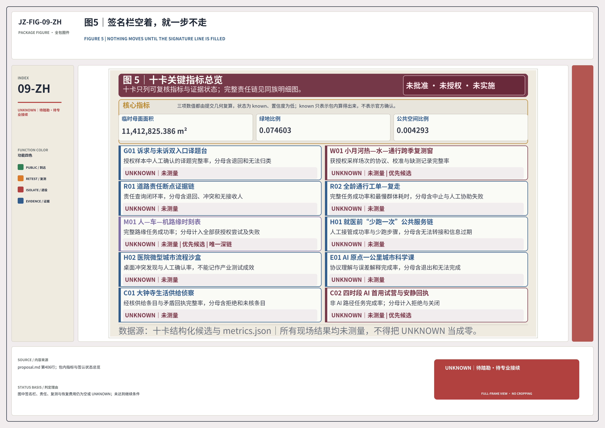

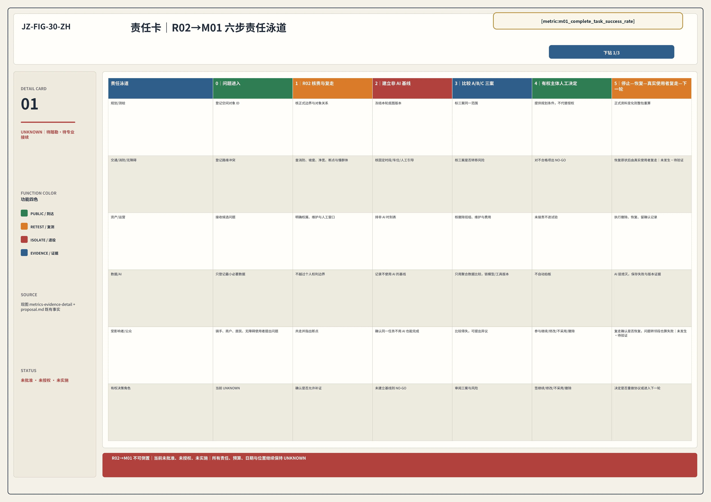

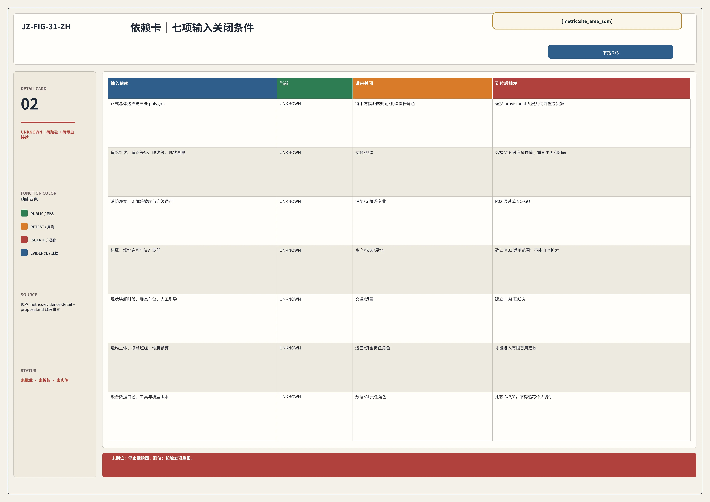

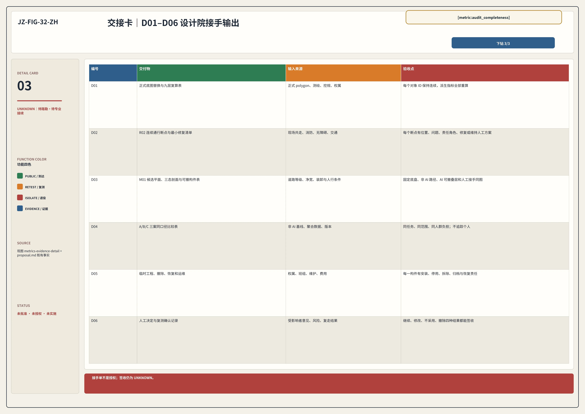

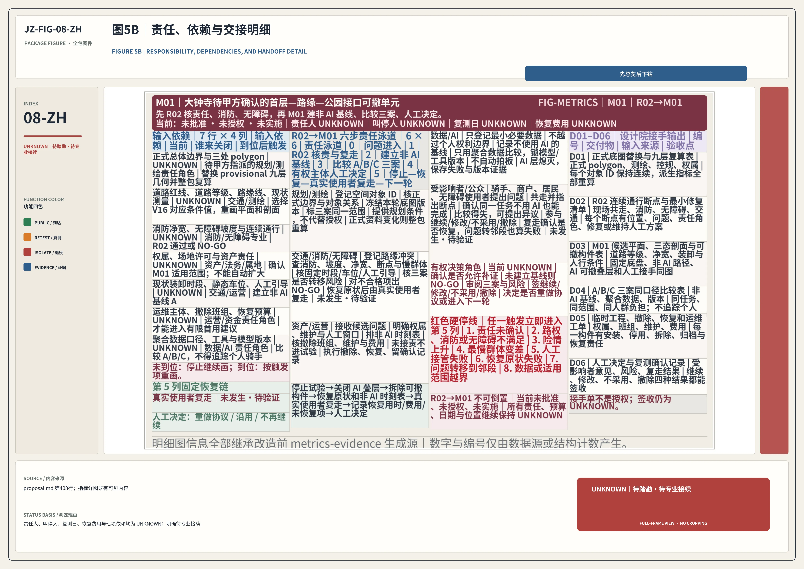

## 风险、版权与合规说明

这节把全稿最容易被误读的地方集中圈出来，包括临时边界、为了推演而虚构的人物、电脑生成的图片、预算、授权和项目状态。这样方案里的设想就不会被说成正式规划、真实访谈或已经实施的项目。

我们特别要防止几类事实错误：把临时边界当成官方红线；把许多人共同提出的要求当成某一条街的具体证据；把其他项目或部门的钱算作本方案的预算；把建议的机构写成已经获得授权的运营方；把假设的人物写成真实访谈对象；把电脑生成的图当成现场照片或正式规划图；把活动和试点候选写成已经排好日期的实施项。只要发现其中任何一种，正文、图纸和配套数据文件都要退回到更保守、更不可靠的状态，重新标注。[depth:risk_missing_data] 另须防止把机器门的『完整』读成专业深化已完成——前者只指证据链满足当前门禁,专业空间深化仍待具备资质的团队接续。

前文案例的通用适用边界集中收口如下：八个案例只回答“借什么、放到哪里、什么不能照搬”，不为京张背书。Punggol Digital District 对应“成熟城区不照搬新建园区的全域感知和中心后台”；Seoul AI Hub / Yangjae 对应“产业生态不能替代居民生活验证，也不代表已有资本或机构加入”；Toyota Woven City 对应“企业主导的封闭新建原型城不能代表成熟城区公共治理”；Detroit–Ann Arbor 对应“不把自动驾驶或企业开发改成京张主线，也不把两个项目写成同一主体”；Curiosity Lab at Peachtree Corners 对应“不迁大规模感知、控制室、道路长度、奖项或自动驾驶主线”；Testbed Helsinki 对应“外地采购、数据和组织体系不能照搬，短期试验不能证明科学有效”；Berkeley A-Lab 对应“封闭实验室没有居民权利、公共授权和城市责任”；Chicago Array of Things 对应“不复制大规模感知网络，避免公共空间监控化和功能漂移”。这些限制与前文表格中的八项正面转译动作一一对应，复核时可按案例名回查。

总体设计、交通与实施的通用免责也在本章集中一次：任何关联项目、政策方向或部门资金都不能自动变成本方案的场地、预算或建设承诺。道路几何来自 provisional 与 OSM 保守底料，不能当精确红线。实施不先排建设日期，而是先把对象放进五本账和六道门。任何一门不满足，项目不自动前进；这套工作方法也不替代法定规划、建设、采购、伦理或数据程序。相应章节已经改为说明专业团队如何接续，本章负责保存完整限制条件。

指标使用边界集中如下：这些数字的设计含义也有限：绿地比例只帮助检查当前模型里的蓝绿连续与人才生活支持关系，公共空间比例只帮助检查创新交往、无 App 服务和三站责任界面的空间供给关系。OSM 存量是保守子集，因此两项都不能直接描述完整现状；没有正式权属与法定控制，也不能由比例推出可建设面积。场景指标不填漂亮分子。路缘看险情、等待、无障碍和噪声，不追踪个人骑手。没有达到对应证据级别，不把方向性判断写成对象级验证结论。指标团队据此保留原公式、原分母和证据等级，在正式资料到位后完成可追踪复算。

空间、运营、品牌和政策表述一律保持“概念建议”。当前方案不替有权主体决定规划、医疗、教育、采购、融资、招商和公共取舍；没有正式资料支持的责任、资金、权属、尺寸、容量、程序与运营事项，均写 **UNKNOWN／待正式资料确认**。临时边界、三处粗略重点区、OSM 底料和概念干预都在图文中持续标明状态。

隐私与权利由最小取数、人工复核、知情与申诉、等价非 AI 路径、到期删除或退役共同控制。若试验导致险情上升、消防或无障碍受阻、等待恶化、夜间噪声越线、必须使用个人轨迹、用于平台劳动考核或维护责任缺位，立即停止或退回非 AI 方案。最后由人拍板，AI 不能把聚合结果变成自动决定。[standard:GENERATIVE-AI-INTERIM-MEASURES] [standard:BARRIER-FREE-ENVIRONMENT-LAW]

本方案的 12 张场景图、历史工程概念图及慢行蓝绿图中的氛围底料，由投稿团队使用 OpenAI 内置图像生成工具制作；每件资产的包内路径、生成批次或可确认时间窗、派生关系和 SHA-256 均登记在 `sources.json`。

与正文一致：封面沿用“一条公共脊串联三站”的蓝调概念意象；它是 `slot-v15` 的派生封面，不是现状照片、正式规划图、批准或建设证据。

依据 2026 年 1 月 1 日生效的 OpenAI Terms of Use，在投稿人与 OpenAI 之间，投稿人拥有 Output；公开展示同时遵循 2022 年 11 月 14 日更新的 Sharing & Publication Policy，并由投稿人完成逐图人工复核、AI 生成披露和最终责任承担。项目 Logo 已替换为不含 Lovart 转换路径的项目自绘矢量。HTML、图件和四份 PDF 统一使用从 adobe-fonts 官方 release 取得的 Source Han Serif SC 2.003R（`SourceHanSerifSC-Regular.otf`、`SourceHanSerifSC-Bold.otf`）与 Source Han Sans SC 2.005R（`SourceHanSansSC-Regular.otf`、`SourceHanSansSC-Bold.otf`），依据 SIL Open Font License 1.1 使用、嵌入和再分发，许可证全文随包提供。上述依据不保证生成内容具有唯一性、当然获得著作权保护或不侵害第三方权利；正式采用、注册或招商前仍应完成独立法律审查。

专业标准矩阵和设计深度矩阵的“已引用”只表示正文已给出回应入口，不表示专业资料齐全或设计深度已经完成。尤其建筑设计深度的官方文件、正式控制条件、生态与文保、现状建筑、权属、资金和运营责任仍须由后续正式资料关闭。[standard:MOHURD-ARCH-DESIGN-DEPTH-2016]

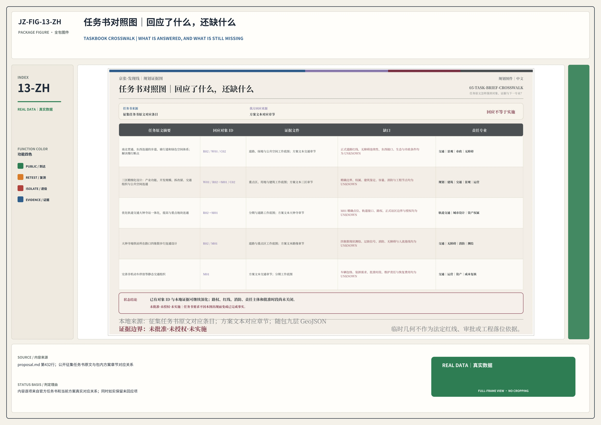

## 官方征集任务逐项应答索引

这节把征集方列出的每一项要求指回正文、图件或具体使用情境，并把还缺什么写在旁边。这样读者能快速查到回答在哪里，也能看到哪些内容还只有初步想法。

本表是逐项应答的索引与缺口自白，不以概念回答代替正式规划、专业资料、授权或实测。公告尺对应 extracted.txt 第 55—65、71—75 行；状态只使用“已回答”“概念级回答”“UNKNOWN＋接续条件”。

| 官方条目（extracted.txt 行号） | 我方回答位置（章节／图／卡） | 状态 |
|---|---|---|
| 产业与空间融合、项目清单、实施政策、控规深度（55） | “总体设计范围城市更新与控规深度城市设计”“更新项目清单、实施政策与分期计划”；缺口接续：规划、产业与实施专业 | UNKNOWN＋接续条件 |
| AI 产业目标、指标、创新网络、“1+X+1”、功能比例与空间组织（57） | “统筹研究范围产业与未来城市研究”及“1+X+1”方向句；缺口接续：产业经济与规划专业 | UNKNOWN＋接续条件 |
| 更新总体框架、职住商服、产业与建筑规模、两侧低效空间和实施图表（59） | “总体设计范围城市更新与控规深度城市设计”“用地、建筑规模与拆改留方案”“更新项目清单、实施政策与分期计划”；缺口接续：规划、建筑与实施专业 | UNKNOWN＋接续条件 |
| 交通、轨道、市政、配套、设施标准、能源与端侧算力融合（61） | “交通、轨道、市政与公共服务设施”及 V08 概念逻辑；缺口接续：交通、市政、能源与信息通信专业 | UNKNOWN＋接续条件 |
| 遗址公园活力带、慢行断点、体育与创新交往、测试展示、三类标志节点（63） | “交通、轨道、市政与公共服务设施”“蓝绿空间、公共空间与城市风貌”、R02、V05、V09、V15 | 概念级回答 |
| AI 时代城市风貌、清华园火车站、北影资源、蓝绿空间与建筑管控（65） | “蓝绿空间、公共空间与城市风貌”及两项文化程序；缺口接续：建筑、景观与文化遗产专业 | UNKNOWN＋接续条件 |
| 众智园：全栈自主创新、标准与安全治理（71） | “众智园复测工场”、W01 与发现护照 | 概念级回答 |
| 众智园：潜力用地功能、建筑规模形态与产业展示（71） | “重点区域详细设计”“用地、建筑规模与拆改留方案”；缺口接续：规划、建筑与产业专业 | UNKNOWN＋接续条件 |
| 众智园：对外交通、五环衔接、建筑绿地水系一体化（71） | 图 3、roads 连续性判断与蓝绿章节；缺口接续：交通、市政、建筑与景观专业 | UNKNOWN＋接续条件 |
| 众智园：清河文化、低碳国际交往与绿色空间服务 AI（71） | 三层文化和蓝绿空间章节；缺口接续：文化、景观与运营专业 | UNKNOWN＋接续条件 |
| AI 原点：成果孵化转化、人才、开源体系与品牌活动（73） | “AI 原点问题与验证前厅”、八案例与年度运营 | 概念级回答 |
| AI 原点：拆改留、展示发布、居住配套与用地布局（73） | “重点区域详细设计”“用地、建筑规模与拆改留方案”；缺口接续：规划、建筑与公共服务专业 | UNKNOWN＋接续条件 |
| AI 原点：对外交通与校区园区慢行联系（73） | 图 3、图 4、roads 连续性判断与 R02 | 概念级回答 |
| AI 原点：五道口、清华东路西口站点一体化与低扰动更新（73） | 当前仅有轨道接口和低扰动原则；缺口接续：轨道、交通、规划与建筑专业 | UNKNOWN＋接续条件 |
| 大钟寺：智能体、智能终端、内容消费、数据要素与数字资产（75） | “大钟寺首用与退出街室”、V07、C01、C02 | 概念级回答 |
| 大钟寺：潜力地块、高校更新与产业载体（75） | “重点区域详细设计”“用地、建筑规模与拆改留方案”；缺口接续：规划、建筑、产业与校方接口 | UNKNOWN＋接续条件 |
| 大钟寺：重点企业周边环境、商业服务与绿地复合利用（75） | M01、C01、C02 与蓝绿空间章节 | 概念级回答 |
| 大钟寺：站城一体化、四象限步行与非机动车停放（75） | 图 3、roads 连续性判断与 M01 路缘纪律；缺口接续：轨道、交通与市政专业 | 概念级回答 |
| 赛道任务书：命名 | “统筹研究范围产业与未来城市研究”的近山主标与方案命名 | 已回答 |
| 赛道任务书：案例 | 八案例对照表与合规章适用边界 | 已回答 |
| 赛道任务书：场景 | 十张场景卡及 W01、M01、C02 深化 | 已回答 |
| 赛道任务书：地标 | 三座责任地标与 V15 节点意象 | 概念级回答 |
| 赛道任务书：文化 | “蓝绿空间、公共空间与城市风貌”的三层文化 | 概念级回答 |
| 赛道任务书：运营 | “更新项目清单、实施政策与分期计划”的全生命周期运营 | 概念级回答 |

## 可实施性逐项应答索引

这节专门回答“先做什么后做什么、谁来做、怎么停、钱怎么算”这类落地问题，并告诉读者答案在随稿材料的哪里。这样一张索引表不会冒充事情已经做完，仍缺的授权、负责人签字和现场测量也不会被藏起来。

本表只做可实施性回答位置与缺口的索引，不以目录、概念回答或 UNKNOWN 登记替代正式资料、授权、签认、实测或评审结论；状态只使用“已回答”“概念级回答”“UNKNOWN＋接续条件”。

| 可实施性问题 | 包内位置（章节／图／卡／机器字段） | 现状态 |
|---|---|---|
| 分期安排在第几节？ | “更新项目清单、实施政策与分期计划”第 365—367 行；`geometry/phasing.geojson`；四步只表达条件先后，M01 的 30—90 天不是审批、施工或建设工期。 | 概念级回答 |
| 实施主体与分工在第几节？ | “更新项目清单、实施政策与分期计划”第 369 行和 `agent.6｜长期运营交接矩阵`第 371—395 行；当前主体为 UNKNOWN，表内角色与频次均为建议、非授权；接续条件见 `UNKNOWN-IMPLEMENTATION-ENTITY-TIME`。 | UNKNOWN＋接续条件 |
| 六道门在哪？ | “更新项目清单、实施政策与分期计划”第 343—353 行给出六门、独立核验分工和签认格式；网页六道门表位于 `visual/index.html:3810`。 | 已回答 |
| 停止与恢复在哪？ | 指标章四格第 405—407 行登记失败条件、停止动作及恢复／人工接手；风险章第 503 行登记立即停止或退回非 AI 方案的条件；M01 恢复费用仍为 UNKNOWN。 | 概念级回答 |
| 触发条件在哪？ | `assumptions.json` 的 12 条 `required_stage=implementation_start` 项逐条登记 `blocks` 与 `recalculation_trigger`；正文 D01—D06、M01-1—M01-7 依赖表登记前置条件和补齐后可推进深度。 | 已回答 |
| 预算算式与核验安排在哪？ | `project_budget` 登记“项目级范围×可追溯单价×全生命周期与恢复成本”的 UNKNOWN 公式；第五道门登记独立预算／采购／法务／土地／利益冲突复核角色与“核验人姓氏＋工号＋日期”签认格式；D05 与 M01-6 保留资产、运营、撤除、恢复和费用来源接续条件。 | UNKNOWN＋接续条件 |

## 附录：桌面运行细账

这节把只在电脑和纸面上做的演练数字、计算方法和能核到哪一步完整列出来。这样读者能检查记录本身，也不会把这次推演当成现场测试或真实运行。

本附录保留从四格入口移出的完整事实。所有结果均来自桌面模拟｜非现场测试｜不代表真实项目发生过；当前状态始终为未批准 · 未授权 · 未实施。

| 审计项 | 数值 | 计算公式 | 源字段指针 | 限制 |
|---|---:|---|---|---|
| 任务总数 | 24 | `length(tasks) = task_count = 24` | `simulation.json#/tasks`；`simulation.json#/task_count` | offline · synthetic · 非现场 |
| 成功 | 20/24 | `count(outcome == "success" 或 ends_with("_success")) / length(tasks) = 20/24` | `simulation.json#/tasks/*/outcome`；`simulation.json#/tasks` | offline · synthetic · 非现场 |
| 调度合规 | 23/24 | `count(dispatch_schema_valid == true) / length(tasks) = 23/24` | `simulation.json#/tasks/*/dispatch_schema_valid`；`simulation.json#/tasks` | offline · synthetic · 非现场 |
| 审计完整 | 21/24 | `count(audit_complete == true) / length(tasks) = 21/24` | `simulation.json#/tasks/*/audit_complete`；`simulation.json#/tasks` | offline · synthetic · 非现场 |
| 能耗超预算 | 3 | `count(energy_used_kwh > energy_budget_kwh) = 3` | `simulation.json#/tasks/*/energy_used_kwh`；`simulation.json#/tasks/*/energy_budget_kwh` | offline · synthetic · 非现场 |

| 项目 | 完整事实 | 包内证据入口 | 可复核边界 |
|---|---|---|---|
| 三态记录 | 十张机制卡各有人工基线、协议比较、越线推进三种记录，共 30/30 条。人工基线与协议比较各 10 条均因条件未齐而停住；越线推进 10/10 被拒绝。 | `visual/assets/run-record-three-state.json` | 可核 30 条摘要、六项判定和桌面／非现场标记；包内没有执行程序，不能独立重跑。 |
| 负向检查 | 14 项故意越界输入覆盖 AI 代替人决定、非 AI 通道缺失、未授权采样、一次数据下结论、责任缺失、停止后不恢复、自动扩大范围、未知资金推进和记录漂移。14 项的预期拒绝点均被实际拒绝点覆盖，漏检为 0。 | `visual/assets/run-record-negative-tests.json` | 可逐项核预期与实际拒绝点；不证明现场安全或真实成效，也不能从包内重跑。 |
| M01 模型轮 | 包内保留一份题面要点、三个空间候选和三个六项裁决；三案的授权、资源和运营条件均未满足，现场计数为 0。精确服务身份与种子不可得。 | `visual/assets/run-record-model-round.json` | 留档说明把它标为单轮且不按结果挑选；包内只能核到这一份题面和三案，不能独立证明没有其他未留存轮次。 |
| 整线降级 | 桌面规则为：任一卡复测不过，整条线护照等级降回上一级，禁止只补最差一卡。 | `visual/assets/run-record-downgrade.json` | 这是规则演算，不是真实复测。 |
| 权限与责任 | 众智园负责复查；AI 原点先把问题说清再验证；大钟寺只有在获得授权后才可能有限首用，并可退出。M01 是唯一展开最深责任链的候选；责任人、叫停人、复测日和恢复费用均为 UNKNOWN。 | 本稿“90秒开场”与“公众版摘要” | 角色均为建议接口，不代表主体已确定或授权已取得。 |
| 非 AI 与恢复 | 固定装卸时段、静态车位和人工引导始终保留；不追踪或考核个人骑手。失败时 AI 层熄灭，恢复原状和非 AI 时刻表，由人接手决定。 | `visual/assets/run-record-model-round.json`、`visual/assets/run-record-downgrade.json` | 只证明桌面候选写入这些限制，不证明现场已经具备接手或恢复能力。 |
| 双计数 | 桌面记录 30/30；真实复测 0；现场运行 0。 | `visual/assets/run-record-three-state.json` | 三个计数互不混算。 |

## 参考资料

这节列出方案引用的公告、征集要求文件、政策、案例和内部底稿，并说明每份材料能证明什么。这样来源可以回查，但不会被拿来代替正式授权或项目现场事实。

下面列出的资料只用来说明可以查证的范围、规则、方法和案例边界，不能代替任何正式授权。

1. 北京市规划和自然资源委员会海淀分局／征集组织方：《百年京张 AI 创新带城市设计国际方案征集资格预审公告及结构化面积摘录》。它提供三层范围、三重点区和任务语境，不提供可直接使用的精确边界。[source:SRC-2026-BJ-GH-QUAL-PREANNOUNCEMENT]
2. open-city-ai/haidian：《面向智能体的征集任务书》。它规定三定位、五功能、三区两翼和命名、案例、场景、地标、文化、运营六项任务。[source:SRC-2026-0518-AGENT-OPEN-CALL-TASKBOOK]
3. 本项目要求对照底稿：《63 项官方要求—成果矩阵》。它用于逐项反查，不替代公告和任务书原文。[source:PROJECT-REQUIREMENTS-MATRIX-20260812]
4. 本项目冻结母稿：《京张·发现线中文正式母稿 V1》。它是本轮叙事、场景、停止恢复和 UNKNOWN 口径的冻结母本。[source:PROJECT-FROZEN-MANUSCRIPT-20260812]
5. open-city-ai/haidian 维护者：《京张 AI 创新带临时粗略边界》。它只用于地图视窗、公开数据发现范围和非正式设计讨论。[source:DATA-SRC-PROVISIONAL-BOUNDARIES-20260605]
6. 国务院办公厅：《关于加快场景培育和开放推动新场景大规模应用的实施意见》。它支持场景开放方向，不替代本地授权、采购和公共取舍。[source:NAT-2025-SCENARIO-OPENING]
7. 北京市科学技术委员会、中关村管委会等：《北京市加快人工智能赋能科学研究高质量发展行动计划（2025—2027 年）》。它支持 AI4S 方向和 W01 等测试验证候选。[source:BJ-2025-AI4S-ACTION]
8. 北京市海淀区人民政府：《京张铁路遗址公园周边将焕新》。它为京张公共脊和文化叙事提供区级公开背景，不支撑法定边界。[source:HD-2024-JZ-CORRIDOR-PROJECT]
9. 北京市海淀区人民政府：《海淀区城市更新导则与实施指引（2025 年版）》。它支撑更新判断方法，不等于具体项目、资金或时序已经确定。[source:HD-2025-URBAN-RENEWAL]
10. 北京市科学技术委员会、中关村科技园区管理委员会：《关于进一步提升概念验证服务能力促进科技成果转化的若干措施》。它支持概念验证和服务转化方向，不替代有权主体人工签认。[source:BJ-2026-CONCEPT-VALIDATION] 专业团队可据此核对概念验证服务与本地人工签认的衔接关系。

八案现有 23 条一手来源登记，8/8 个案例均达到每案至少 2 条一手来源；这个闭合只支持案例身份、事实性转述和机制比较，不包含第三方图像、地图、Logo 或整页内容的复用权，也不证明京张已有同等设施、授权或成效。访问记录、短摘录和许可边界存于项目工作区留档目录，未随本包分发；23 个 source ID 已全部登记在包内 `sources.json`。若正文、矩阵和正式资料发生冲突，以正式资料为准，并记录修订理由。
