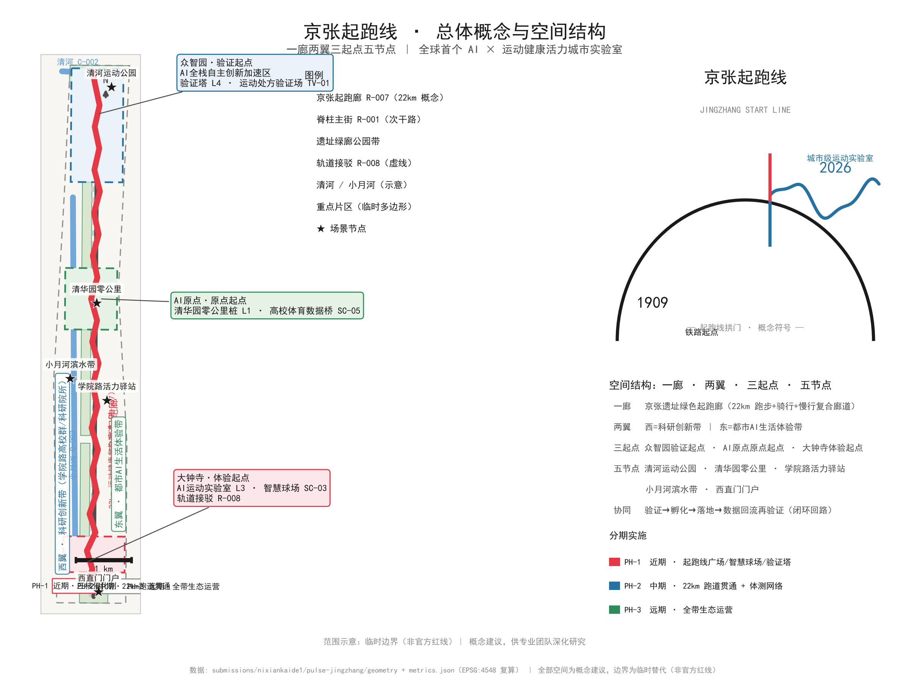
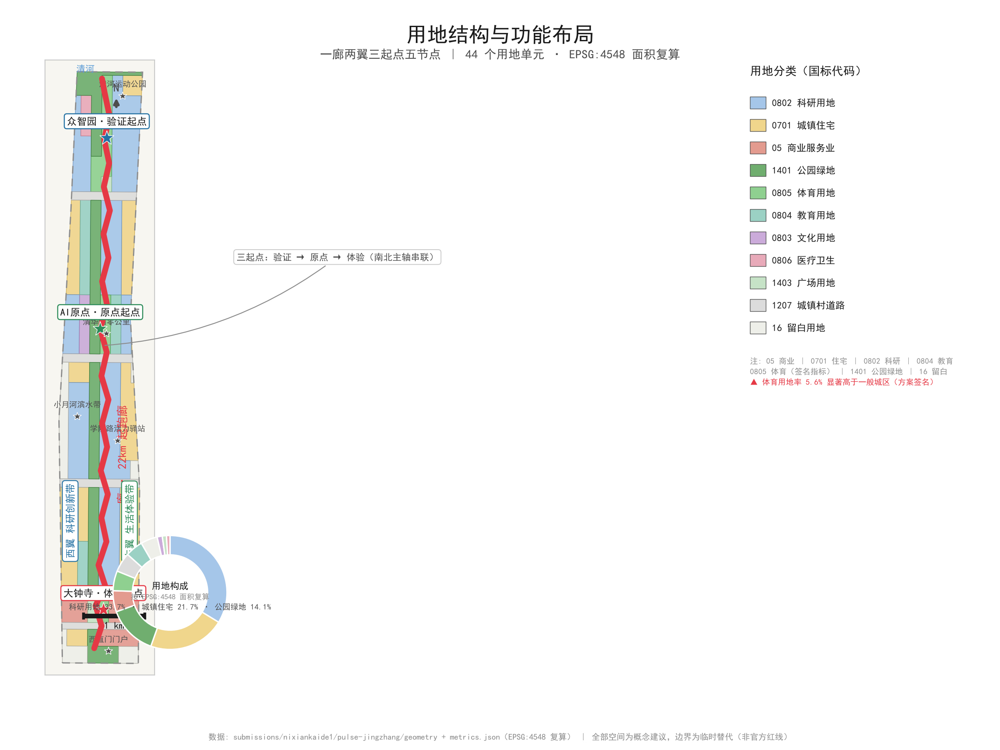
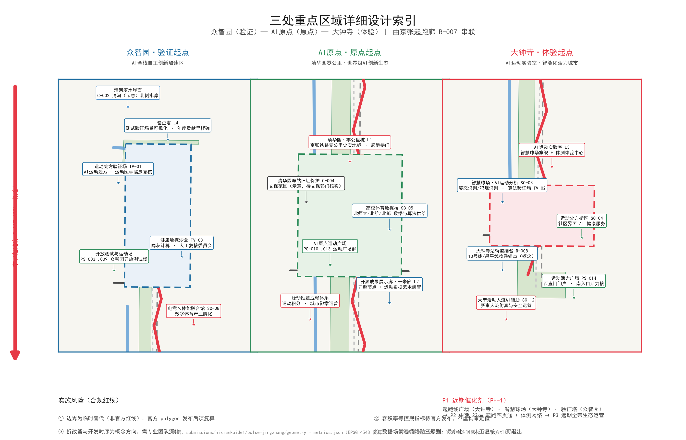
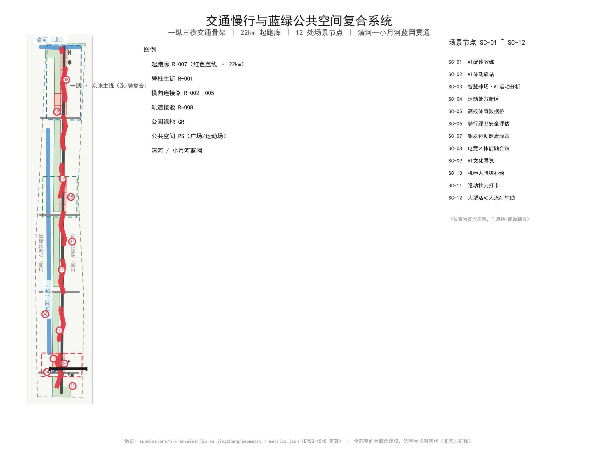
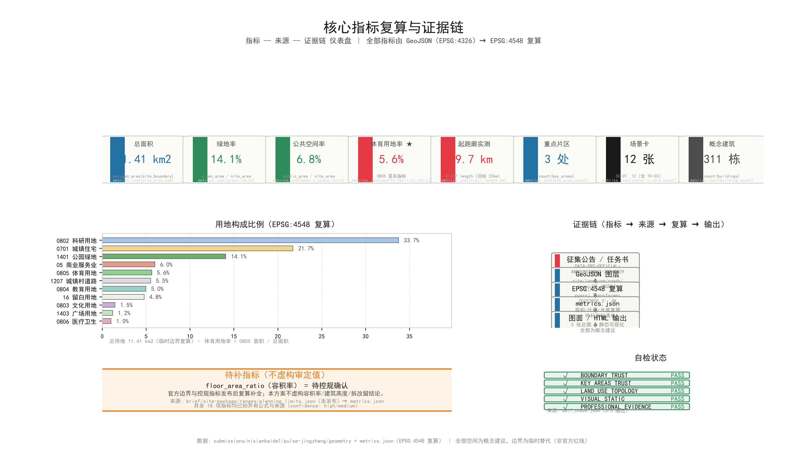

# JINGZHANG START LINE: From the Century-Old Railway Origin to a Global AI Sports & Wellness Vitality Belt

## Design Basis and Source List

The urban-design judgments in this proposal take, as their primary authority, the "Prequalification Announcement of the International Open Call for Urban Design of the Centennial Jing-Zhang AI Innovation Belt" (May 9, 2026, issued by the Haidian Branch of the Beijing Municipal Commission of Planning and Natural Resources) [source:OFFICIAL-ANNOUNCEMENT][standard:PROJECT-OFFICIAL-ANNOUNCEMENT]. The announcement establishes the three-level design scope, the three key areas, the design tasks, the deliverable depth, and the language requirements, and constitutes the statutory context for every spatial narrative in this proposal. Beyond the announcement, this proposal also follows the ten agent co-creation principles, the three positioning statements, the five functions, the Three Zones and Two Wings structure, the six agent tasks, and the unified boundary clause supplemented by the open-call taskbook for global agents [source:AGENT-TASKBOOK][standard:PROJECT-AGENT-OPEN-CALL-TASKBOOK] — which means that the six deliverables of the naming system, ecosystem cases, scenario cards, pilgrimage landmarks, cultural narrative, and long-term operation must be readable in the main text, not merely checked off in JSON.

As to data status, this proposal strictly distinguishes four categories of materials. First, the announcement and taskbook texts (formal-usable, supporting task definition). Second, the `brief/site-package/` package distributed in the repository, including `design_brief.json`, `allowed_design_space.json`, `agent_taskbook.json`, `sources.json`, and `visual_style_recommendations.json` [source:SITE-PACKAGE]. Third, the public source registry `data/source_registry.json`, used to determine the `usable_for_formal` status of each material [source:SOURCE-REGISTRY]. Fourth, the processed fact pack `data/processed/agent_fact_pack.md` and its companion CSVs, used as a navigation layer whose conclusions still trace back to the original source_id [source:PROCESSED-FACT-PACK]. Three professional standards — the Measures for the Administration of Urban Design, the Measures for the Formulation and Approval of Regulatory Detailed Planning for Cities and Towns, and the Ministry of Natural Resources' Classification Guide for Land Use, Sea Use, Planning, and Use Control — serve as the local basis for urban character, regulatory-plan depth, and land-use classification [standard:MOHURD-URBAN-DESIGN-MEASURES][standard:MOHURD-CONTROL-DETAILED-PLANNING][standard:MNR-LAND-USE-CLASSIFICATION-GUIDE]. Official text snapshots of the above standards are registered respectively as [source:MOHURD-URBAN-DESIGN-2017], [source:MOHURD-CONTROL-2008], and [source:MNR-LAND-USE-202311].

It must be honestly disclosed: as of this draft, the official precise redline and the official polygons of the three key areas have not been obtained. This proposal works with the temporary rough boundary provided in `brief/site-package/geometry/provisional_boundaries.geojson`, whose attributes are `geometry_role="provisional_constraint"`, `official_boundary=false`, and `boundary_precision="provisional_rough"`, and which may be used only for plan generation, visualization, and discussion — not as an official planning boundary, approval basis, or basis for precise area recalculation [source:BOUNDARY-SOURCE][depth:existing_conditions_diagnosis]. Accordingly, all areas, ratios, and scales in this proposal are treated as "conceptual recommendations," to be uniformly recalculated once the official polygon is released [data:geometry/site_boundary.geojson#SITE-001][metric:site_area_sqm]. The textual four-direction limits and areas of the three-level scope announced (43.6 km² Coordinated Research Area, 11.4 km² Overall Design Area, 368.4 ha key areas) may serve as formal task basis; any drawings and metrics derived from them only reflect design intent [source:KEY-AREA-SOURCE]. The data-gap list (official redline, regulatory-plan metrics, current building stock, ownership, engineering conditions) is detailed in Chapter 12 and itemized in the corresponding entries of `assumptions.json` and `missing_data_checklist.csv`.

The design judgment of this chapter is: **before official geometric data arrives, organize the proposal by the standard of "readable, verifiable, recalculable"** — spatial claims are expressed as conceptual recommendations, data claims are traceable through evidence tags, and drawings take design intent as the main body, with all provisional boundaries rendered in faint dashed lines. This judgment corresponds to [depth:existing_conditions_diagnosis] and [standard:PROJECT-OFFICIAL-ANNOUNCEMENT]; its data gap is the official geometry files and regulatory-plan metrics, and the list of layers and metrics to be recalculated after replacement is given in Chapters 2 and 11.

## Three-Level Scope Framework

This proposal adopts a three-level working framework of "industry strategy — overall urban design — key-area detailed design," corresponding one-to-one with the three-level scope of the announcement. The objectives, boundaries, areas, depths, and deliverables of the three levels are as follows:

| Level | Working Objective | Spatial Boundary (Announcement Text) | Area | Design Depth | Deliverable Expression |
|---|---|---|---|---|---|
| Coordinated Research Area | Industry strategy and future-city-form research, answering "what is the belt, where is it going" | North to North 5th Ring Road, east to Jingzang Expressway, south to Xizhimen Outer Street, west to Wanquanhe Road | 43.6 km² | Strategic and conceptual research | Naming system, positioning and functions, case translation, future city form, A0 strategy board |
| Overall Design Area | Urban renewal and regulatory-plan-level urban design, answering "how is the belt organized" | North to North 5th Ring Road, east to Xueyuan Road, Xitucheng Road, etc., south to Xizhimen Outer Street, west to Dazhongsi East Road, Heqing Road, etc. | 11.4 km² | Urban design depth of regulatory detailed planning | Spatial structure, land-use layout, transport/rail/municipal, blue-green system, character control |
| Key-Area Detailed Design Area | Detailed design of three key areas, answering "how are the cores implemented" | From north to south: Zhongzhiyuan AI Independent Innovation Acceleration Area, Beijing AI Origin Community, Dazhongsi AI Industry Cluster | 368.4 ha | Urban design depth of an integrated planning implementation plan | Three detailed sub-schemes, DRR concepts, implementation project handles |

[source:BOUNDARY-SOURCE][depth:three_level_scope_framework][metric:key_area_count]

Three-level transmission logic: the Coordinated Research layer establishes the overall proposition of "AI × sports & wellness" and the "START LINE" naming system, constraining the "One Corridor, Two Wings, Three Starts, Five Nodes" structure of the Overall Design layer; the Overall Design layer implements the structure as land-use ratios, a transport skeleton, and a public-space network; the Key-Area layer delivers perceivable spatial schemes and project handles within the three "Start" cores. Each layer corresponds to explicit layers and metrics: the coordinated layer corresponds to [data:geometry/site_boundary.geojson#SITE-001] and naming/case-type metrics; the overall layer corresponds to [data:geometry/land_use.geojson#LU-001] through [data:geometry/land_use.geojson#LU-012], [data:geometry/roads.geojson#R-001], and [data:geometry/green_space.geojson#GR-001]; the key-area layer corresponds to [data:geometry/key_areas.geojson#KEY-001] through [data:geometry/key_areas.geojson#KEY-003] [source:KEY-AREA-SOURCE].

Boundary limitations that must be disclosed: the three-level scope and the three key areas are all currently provisional rough polygons. This proposal accepts this organizational data gap and marks it prominently in all drawings, the main text, and the self-check results; the gap does not block content scoring (per the maintainer's official decision on boundary data status, see [source:DATA-BOUNDARY-DECISION]), but the following layers and metrics must be recalculated once the official polygon is in place: the area of `site_boundary.geojson` (SITE-001) and [metric:site_area_sqm]; the area shares of all zones in `land_use.geojson` and [metric:green_ratio] and [metric:public_space_ratio]; the boundaries and areas of the three key areas in `key_areas.geojson` [metric:key_area_count]; the building footprints in `buildings.geojson` [metric:building_footprint_area_sqm]; the START LINE corridor alignment in `roads.geojson` and [metric:trail_length_km]; and the three-phase implementation scope in `phasing.geojson` [data:geometry/phasing.geojson#PH-1][data:geometry/phasing.geojson#PH-2][data:geometry/phasing.geojson#PH-3]. The three phases correspond to [metric:phase_count] phase layers. Before recalculation, all values are directional concepts.

Design judgment of this chapter: **anchor tasks to the textual four-direction limits of the announcement, use the provisional geometry as the visualization vehicle, and use the official polygon as the recalculation trigger.** This corresponds to [standard:PROJECT-OFFICIAL-ANNOUNCEMENT] and [depth:three_level_scope_framework]; the data gap is the official redline geometry and the official key-area polygons, and once filled, all tabular data in Chapter 2 must be refreshed.

## Coordinated Research Area: Industry and Future City Research

### 3.1 The Overall Proposition: A City That Can Be Run

The Coordinated Research Area (43.6 km²) spans the north-central part of Haidian District, at the confluence of the "centennial Jing-Zhang" railway heritage, the Zhongguancun innovation landscape, and the Xueyuan Road university cluster [source:OFFICIAL-ANNOUNCEMENT]. Faced with the high homogeneity of some two hundred proposals in "axis/corridor/line/pulse/platform" narratives, this proposal puts forward a differentiated proposition: **"JINGZHANG START LINE" (京张起跑线) — the world's first AI × sports & wellness vitality city laboratory.** The "start line" (起跑线) unifies three meanings: Tsinghuayuan Station is the zero-kilometer point of the Jing-Zhang Railway and the start of China's self-built railways (1909 independent innovation); sports & wellness is humanity's first language, bringing AI from the screen onto the body, and the start line belongs to everyone (2026 city-scale sports laboratory); AI computing signals make the city perceivable, responsive, and evolvable, and this is the start line of global AI innovation (future city form) [depth:overall_spatial_structure].

One-sentence claim: **"A century ago, China's railway set off from here; today, let the world start running from here."** This proposition directly responds to the three positioning statements — the centennial Jing-Zhang cultural belt = start-line memory (heritage), the urban AI life experience belt = start-line experience (perception), and the AI-integrated innovation belt = start-line co-creation (innovation) — and, with its perceivable sports & wellness main line, naturally holds an advantage on the three review dimensions of "scenario perceptibility, youth-friendliness, and international communication." The sports-science research resources of Beijing Normal University (southern corridor segment) and the Xueyuan Road universities constitute the real ecological anchors, and this is the local grounding that distinguishes this proposition from purely conceptual submissions [source:PROCESSED-FACT-PACK].

### 3.2 Five Functions and the Three Zones / Two Wings Synergy Loop

The five functions are implemented through the "Five Starts" zoning, forming a closed loop of "validate → incubate → launch → feedback": Full-Stack Independent AI Innovation System → Zhongzhiyuan · Verify Start; world-class AI innovation ecosystem → AI Origin · Origin Start (Tsinghuayuan zero-kilometer); AI-enabled scenario empowerment paradigm → Xiaoyue River · Empower Start (west wing); intelligent AI vitality city → Dazhongsi · Experience Start (south core) + belt-wide sports & wellness network; global discourse power in AI governance → data sandbox + human review committee + honor system (Zhongguancun · Service Start). The synergy loop is: outputs from the Verify Start → incubation at the Origin Start → launch at the Experience Start → the two wings supply factors (capital/scenarios) → data flows back to Zhongzhiyuan for re-validation. The naming system is as follows:

| Level | Chinese | English | Notes |
|---|---|---|---|
| Main name | 京张起跑线·AI运动健康活力带 | JINGZHANG START LINE · AI Sports & Wellness Vitality Belt | Official main name |
| Short name | 京张起点 | JZ-START | For communication |
| Zone 1 | 众智园·验证起点 | Verify Start (Zhongzhiyuan) | North core |
| Zone 2 | AI原点·原点起点 | Origin Start (AI Origin Community) | Central core (Tsinghuayuan zero-kilometer) |
| Zone 3 | 大钟寺·体验起点 | Experience Start (Dazhongsi) | South core |
| Two wings | 中关村·服务起点 / 小月河·赋能起点 | Service Start / Empower Start | East and west wings |

Naming logic: the word "Start" (起点) simultaneously echoes the zero-kilometer history of the Jing-Zhang Railway and the imagery of a marathon start line; the five starts correspond to the five functions [source:AGENT-TASKBOOK][standard:PROJECT-AGENT-OPEN-CALL-TASKBOOK].

### 3.3 Logo and Visual Identity Direction

The main visual is the **Start Line Gate (起跑线拱门)**: three running-track arcs (rail black / pulse red / computing blue) depart from the 1909 centennial marker, pass through the start gate, and converge into a single wave line extending forward — uniting running trajectory, data flow, and railway line in one. The color system is cast-iron black (Jing-Zhang heritage) + pulse red (sports energy) + computing blue (AI data), complemented by track green (public space); the typeface is geometric sans-serif (railway signal-board style), accompanied by the time scale "1909 — 2026 — ∞." The extension system includes zero-kilometer-post-shaped wayfinding, a pace-marking system (pace as a metaphor for the rhythm of the city), and start badges (an activity achievement system). In the overall structure drawing, the start gate / running-track arcs are the main visual elements, and all provisional boundaries are rendered in faint dashed lines. The Logo is a conceptual direction and does not constitute an approved visual identity [depth:overall_spatial_structure].

### 3.4 Global AI Innovation Ecosystem Cases and Method Translation

The six cases cite only public methodological information and are not directly copied; the emphasis is on extracting "experience → transferable mechanism → spatial/layer/metric landing point":

| Case | Key Experience | Transferable Mechanism | Spatial Landing / Layer / Metric |
|---|---|---|---|
| Helsinki Smart Kalasatama | Health-city pilot embedded in old-town renewal, validated through small pilots | "Health data + public space" pilot mechanism | Zhongzhiyuan fitness-assessment station pilot [data:geometry/public_space.geojson#PS-001]; [metric:test_scene_count] |
| Singapore ActiveSG | National sports-points platform; sport as currency | Pulse medal + sports-points system | Belt-wide node check-in system (SC-11); [metric:scenario_card_count] |
| Boston Seaport | Integration of industry incubation and waterfront public space | Stitching industrial space with public space | Zhongzhiyuan industry-green interlocking interface [data:geometry/land_use.geojson#LU-002] |
| Barcelona 22@ | Transformation of an old industrial area into a knowledge-innovation district + reserved social facilities | Demolish–Renovate–Retain and social-facility ratio logic | Renovation building list [data:geometry/buildings.geojson#B-005]; [metric:sports_facility_ratio] |
| Shenzhen Bay smart running track / Hangzhou Binjiang smart trail | Domestic benchmark for AI sports infrastructure | Fitness-assessment station + pace-coach hardware standards | START LINE corridor three-line composite section [data:geometry/roads.geojson#R-001]; [metric:trail_length_km] |
| Tokyo Olympic heritage district | Long-term operation of sports-event legacy + urban vitality | Annual event IP and post-games venue reuse | Dazhongsi event operations base (PH-2) [data:geometry/phasing.geojson#PH-2] |

[metric:case_study_count]

### 3.5 Future AI City Form

This proposal's judgment on future city form: **AI is not a service layer superimposed on streets, but a sports & wellness infrastructure that penetrates the urban fabric.** This is embodied in three ends: the edge side (edge-computing nodes such as fitness-assessment stations and pace terminals embedded in public space, with localized data processing), the cloud side (a sports & wellness data sandbox and a human review committee forming the governance hub), and the field side (a scenario access sandbox evolving through the "admission → pilot → evaluation → rollout" closed loop). The four characteristics of the future form — runnable (a 22 km continuous corridor), perceivable (AI scenarios responding instantly), evolvable (data-feedback iteration), and governable (three privacy-boundary principles) — correspond respectively to [data:geometry/roads.geojson#R-001], [data:geometry/green_space.geojson#GR-001], [metric:green_ratio], and [metric:public_space_ratio]. This judgment on form is a conceptual recommendation for professional teams to develop further [source:AGENT-TASKBOOK][depth:overall_spatial_structure].

## Overall Design Area: Urban Renewal and Regulatory-Plan-Level Urban Design

### 4.1 Spatial Structure: "One Corridor, Two Wings, Three Starts, Five Nodes"

The Overall Design Area (11.4 km²) takes the Jing-Zhang Heritage Park as its spatial main axis, forming the **"One Corridor, Two Wings, Three Starts, Five Nodes"** structure, directly implementing the overall requirements of Announcement clause 1.5(2) concerning industrial objectives, functional layout, urban renewal framework, the Jing-Zhang Heritage Park vitality belt, and urban character [source:OFFICIAL-ANNOUNCEMENT][depth:overall_spatial_structure]:

- **One Corridor**: the green START LINE corridor of the Jing-Zhang Heritage Park (a 22 km sports & wellness composite corridor: running track + cycling path + walking trail in a three-line composite) [data:geometry/roads.geojson#R-001][metric:trail_length_km];
- **Two Wings**: the west belt = research-innovation belt (Xueyuan Road university cluster + research institutes); the east belt = living-experience belt (urban AI life experience);
- **Three Starts**: Zhongzhiyuan (Verify Start) · AI Origin (Origin Start · Tsinghuayuan zero-kilometer) · Dazhongsi (Experience Start) [data:geometry/key_areas.geojson#KEY-001][data:geometry/key_areas.geojson#KEY-002][data:geometry/key_areas.geojson#KEY-003];
- **Five Nodes**: Qinghe Sports Park (north) · Tsinghuayuan Start Plaza (north-central) · Xueyuan Road Vitality Station (central) · Xiaoyue River waterfront belt (west wing) · Xizhimen gateway (south). Blue-green space (parks and green space + squares) totals approximately [metric:green_blue_ratio].

Basis for the structural judgment: the Jing-Zhang Heritage Park alignment is the natural main axis of history and space; the Xueyuan Road university cluster constitutes the research supply of the west wing; and the three key areas are arranged along the main axis from north to south, precisely forming the logical movement line of "verify—origin—experience." This structure responds to [standard:MOHURD-URBAN-DESIGN-MEASURES] requirements on coordinating urban spatial structure and shaping distinctive character, and is implemented across the four layers of `land_use.geojson`, `roads.geojson`, `green_space.geojson`, and `public_space.geojson` [depth:land_use_layout]. This structure interlocks one-to-one with the scenario cards of Chapter 6 and the landmark system of Chapter 9: the START LINE corridor is both the spatial skeleton and the carrier of the SC-01/SC-09/SC-10 scenario types, and the organizing axis of the L1–L4 pilgrimage landmarks — space, scenarios, and culture share the same "start line," which is the key design judgment distinguishing this proposal from "park + supporting facilities" style schemes.

### 4.2 Land-Use Layout and Functional Ratios (Conceptual Targets)

The land-use functional ratios are **conceptual targets of the scheme; the regulatory detailed plan prevails**:

| Land-use type | Ratio (conceptual) | Design rationale |
|---|---|---|
| Residential | 25% | Supports jobs-housing balance and retention of young talent |
| Research | 20% | Main carrier of full-stack AI innovation [data:geometry/land_use.geojson#LU-001] |
| Education | 12% | Continuation of the Xueyuan Road university cluster [data:geometry/land_use.geojson#LU-003] |
| Sports | 6% | Includes 0805 sports land use, significantly higher than typical urban districts — signature metric of the scheme |
| Medical | 3% | Sports & wellness support [data:geometry/land_use.geojson#LU-004] |
| Culture | 4% | Jing-Zhang culture display |
| Commercial | 12% | Scenario consumption and vitality interface [data:geometry/land_use.geojson#LU-006] |
| Roads | 12% | One-vertical-three-horizontal skeleton |
| Green space | 12% | START LINE corridor + green network [data:geometry/green_space.geojson#GR-001] |
| Squares | 4% | Public activity nodes [data:geometry/public_space.geojson#PS-001] |
| Reserved | 2% | Spatial flexibility for rapid AI industry iteration |

[metric:green_ratio][metric:public_space_ratio][metric:floor_area_ratio]

The core of the land-use judgment is the signature significance of "sports 6%": elevating sports & wellness from accessory green space to a statutory land-use layer, supporting [metric:sports_facility_ratio]. This ratio and the zone boundaries are all conceptual recommendations to be recalculated and verified during the formulation of the regulatory detailed plan [standard:MOHURD-CONTROL-DETAILED-PLANNING].

### 4.3 Overall Urban Renewal Framework

The renewal framework follows the four principles of "retain memory, renovate interfaces, release nodes, reserve flexibility," implemented through four renewal logics (see the Demolish–Renovate–Retain scheme in Chapter 7): retain — Jing-Zhang railway heritage and heritage-protection units (e.g., the former Tsinghuayuan Station site [data:geometry/constraints.geojson#C-002]); renovate — old industrial land and stock around universities; demolish — dilapidated buildings and inefficient land (possibilities raised only at the conceptual level); new-build — node complexes at the Three Starts. The spatial handle of the framework is the cluster-type layout along both sides of the START LINE corridor: the core areas (three cores) have high density and open public interfaces, buildings on both sides of the corridor are mainly 5–12 stories, and landmark nodes may be taller (**conceptual recommendation; the regulatory detailed plan prevails**) [depth:development_intensity_controls][depth:height_massing_character][data:geometry/buildings.geojson#B-001].

The design judgment of the renewal framework is to use the sports & wellness corridor as the "suture line" of renewal: old industrial land, university-adjacent stock, and residential communities are renewed in staggered fashion along the corridor, so that renewal projects form a continuous public-space and sports experience rather than scattered point development. This judgment is based on [standard:MOHURD-CONTROL-DETAILED-PLANNING] requirements on regulatory-plan depth and the combination of rigid and flexible controls, and its implementation relies on the joint verification of the two layers `buildings.geojson` (building footprints and Demolish–Renovate–Retain classification) and `phasing.geojson` (phased implementation scope). The specific scope and ownership of renewal targets are pending materials; anything not yet in place is not asserted as concluded.

### 4.4 Urban Character Control Principles

The character keynote is "centennial railway temperament × digital-era lightness": cast-iron black, brick red, and glass gray are the primary building colors, with track green as the public-space color; roof forms are encouraged to participate in sports-data visualization on the fifth facade; large-format slab buildings are prohibited from lining up along the corridor, preserving transparent running view corridors. Character control implements [standard:MOHURD-URBAN-DESIGN-MEASURES], expressed in the drawings through [data:geometry/buildings.geojson#B-001] through [data:geometry/buildings.geojson#B-005] and the character control drawing. All height and massing statements are conceptual ranges, not conclusions [depth:height_massing_character].

### 4.5 Transport, Rail, and Municipal Concepts (see Chapter 8)

The overall-layer transport concept is the "one vertical, three horizontals" skeleton: the Jing-Zhang main line (running/cycling composite) + three horizontals of Xueyuan Road / Dazhongsi East Road / Xizhimen Outer Street; rail organizes a TOD concept (conceptual recommendation) around Line 13, the Changping Line, and the Zhichun Road–Xizhimen interchange anchor. The integration ideas for municipal and new infrastructure (edge computing, sports & wellness data nodes, distributed energy) are given in Chapter 8 [depth:traffic_rail_slow_parking][depth:municipal_new_infrastructure].

The most important regulatory-plan conditions to be confirmed at the Overall Design level: floor area ratio and building-height caps for each plot, road redlines, plot boundaries, heritage-protection control lines, municipal pipelines, and transport sections. All missing items are written into the to-be-confirmed list and are not treated as concluded findings [depth:development_intensity_controls].

## Detailed Design of Key Areas

The three key areas are linked from north to south along the START LINE corridor, forming the "verify—origin—experience" spatial movement line. The polygons of the three areas are all provisional, and the following conclusions are directional designs for professional teams to develop [source:KEY-AREA-SOURCE][depth:three_key_area_detailed_design]. Each area reaches the urban-design depth of an integrated planning implementation plan, following [standard:MOHURD-CONTROL-DETAILED-PLANNING] on the depth conventions of plot-level land use, intensity, and public-space control; until the official polygon is available, all plot boundaries and areas are rough references [metric:key_area_count].

### 5.1 Zhongzhiyuan · Verify Start (192.1 ha)

**Positioning**: Zhongzhiyuan AI Independent Innovation Acceleration Area, carrying the "Verify Start" function — running innovation outcomes through real scenarios [data:geometry/key_areas.geojson#KEY-001]. Design judgment: validation is not a laboratory behavior but a public-space behavior — a testing ground that the public can see and use is what constitutes the urban meaning of a "Verify Start."

**Spatial structure**: "One Core, One Ring, One Belt" — the core is the Verification Tower and the testing/validation cluster; the ring is the industry-service ring (incubators, pilot platforms, public computing center); the belt is the sports & wellness testing belt facing the Qinghe River. **Building renewal**: mainly the renovation of existing research buildings, embedding modular test factories and movable experiment pods; a new Verification Tower in the core area serves as the industry landmark (conceptual), with a data-visualization media facade reserved on the tower, forming an urban interface where "validation results are visible." **Transport and slow mobility**: internally small blocks with a dense road network, connecting to a Line 13 station; a slow-traffic-priority "validation ring" links testing grounds and industry buildings; freight and testing flows are separated to avoid conflicts with slow traffic. **Public space**: a fitness-assessment station pilot cluster (borrowing the Helsinki health-pilot mechanism, small-scale first) and a validation-results visualization plaza, which also serves as the gathering point for hackathon-run activities. **AI scenarios**: SC-08 esports × physical-training fusion venue, TV-01 AI exercise-prescription validation ground, TV-03 health data sandbox (where the human review committee is permanently based). **Implementation risks**: testing scenarios involve personal health data, and privacy boundaries and human review mechanisms must be established before construction; stock renovation involves ownership consolidation requiring plot-by-plot confirmation; the Verification Tower's massing and height must be verified against the regulatory detailed plan, and this proposal offers only a conceptual range.

### 5.2 AI Origin · Origin Start (104.3 ha)

**Positioning**: the composite carrier of the world-class AI innovation ecosystem and the zero-kilometer memory of the Jing-Zhang Railway, where the "Origin Start" is established [data:geometry/key_areas.geojson#KEY-002]. Design judgment: the significance of the Origin Community lies in the "vertical stacking of memory and future" — on the same land, the 1909 zero-kilometer post and the 2026 AI innovation ecosystem coexist; this is precisely the local anchor of the "start line" narrative.

**Spatial structure**: "One Plaza, One Axis, One Corridor" — the Tsinghuayuan Start Plaza (zero-kilometer post + start gate) is the core, the Xueyuan Road Innovation Axis is the industry interface, and the Heritage Park main corridor is the sports interface. **Building renewal**: the former Tsinghuayuan Station site is preserved and exhibited strictly in accordance with heritage-protection requirements [data:geometry/constraints.geojson#C-002]; the surroundings are mainly renovated and mended, with large-volume new construction prohibited within the heritage control area; around the station building, a "first facade of railway memory" is recommended, with controlled height and materials, ensuring a transparent view corridor to the zero-kilometer post. **Transport and slow mobility**: Xitucheng Road slow-traffic renovation connects with the Xueyuan Road university slow-traffic belt, and station access strengthens campus-commuting cycling flows. **Public space**: the Start Plaza features inscriptions + digital nameplates as the core carrier of the honor system (L1), with pace-scale paving as the theme, making the "start" an experienceable piece of urban furniture. **AI scenarios**: SC-05 university sports data bridge (research supply from BNU/BUAA/BUPT), SC-09 AI cultural guide start (the starting point of the Centennial Trajectory Tour). **Implementation risks**: the heritage redline is the highest constraint; any spatial scheme must first pass the review of the heritage authority; station integration involves coordinating rail and commercial interfaces; honor-wall content involves developer attribution, requiring a contribution-tier and content-review mechanism.

### 5.3 Dazhongsi · Experience Start (72.0 ha)

**Positioning**: the southern gateway of AI industry agglomeration and AI life experience — the "Experience Start," making AI sports experiences tangible and touchable [data:geometry/key_areas.geojson#KEY-003]. Design judgment: the Experience Start targets "residents and tourists who encounter AI sports for the first time," and the scenario design follows the principles of low threshold, use-and-go, and see-what-you-get.

**Spatial structure**: "One Core, Two Interfaces" — the Dazhongsi Vitality Core (smart-court flagship + fitness-assessment experience center) and the community interface and the rail interface. **Building renewal**: mainly new node complexes and renovation of street-level commercial interfaces, with controlled massing and setbacks to maintain the sense of arrival at the southern gateway; the community interface mainly uses micro-renewal, avoiding large-scale demolition and construction. **Transport and slow mobility**: the Dazhongsi East Road horizontal axis connects with the Xizhimen Outer Street gateway; an integrated transit-station TOD concept at the rail station, with underground connection space reserving interfaces for commercial and sports facilities. **Public space**: smart courts (SC-03) and exercise-prescription blocks (SC-04) embedded in the community grid; night lighting of the courts considers the "one hour of exercise after work" scenario, serving commuters. **AI scenarios**: TV-02 smart-court algorithm validation ground, SC-12 AI-assisted crowd management for large events (linked with emergency-response authorities). **Implementation risks**: the Dazhongsi area has a high mix of commercial and residential uses, and the renewal sequencing must match property-rights negotiations; crowd densities are high, and event operations must synchronously design emergency evacuation and security plans; the smart-court recognition algorithms carry misjudgment risk, and a human final-arbitration channel must be retained for foul calls.

The three areas total 368.4 ha, corresponding to [metric:key_area_count] (=3); each area's boundary and area must be recalculated once the official polygon in `key_areas.geojson` is available.

## AI Innovation Ecosystem, Personas, and AI+ Scenarios

### 6.1 Six Personas

| ID | Persona | Needs | Related Scenarios | Spatial Anchor |
|---|---|---|---|---|
| P1 | University sports researchers | Data and algorithm supply, testing grounds | SC-05, TV-01 | Xueyuan Road university cluster / AI Origin |
| P2 | AI entrepreneurs / developers | Industrial space, testing & validation, capital matching | SC-08, TV-03 | Zhongzhiyuan |
| P3 | University student sports enthusiasts | High-frequency exercise, social check-ins | SC-01, SC-11 | Xueyuan Road Vitality Station |
| P4 | Nearby community residents (incl. seniors) | Health intervention, nearby services | SC-04, SC-07 | Residential community nodes |
| P5 | Commuting cyclists | Green commuting, safety assessment | SC-06 | Xiaoyue River wing |
| P6 | Foreign athletes / tourists | International events, cultural experience | SC-09, SC-12 | Belt-wide + Dazhongsi |

[metric:persona_count][depth:overall_spatial_structure]

### 6.2 Twelve Scenario Cards (including Three Testing and Validation)

Each card contains space, target users, data, privacy boundary, human review, operator, layer mapping, and risk. The following are readable cards (excerpts of the full fields):

| ID | Scenario | Space | Target Users | Operational Data | Privacy Boundary | Human Review | Operator | Layer | Risk |
|---|---|---|---|---|---|---|---|---|---|
| SC-01 | AI pace coach on the developer running trail | Heritage Park main corridor | P1/P3/P6 | Pace, cadence, trajectory | Anonymous aggregation, no identity stored | Review of prescription-type recommendations | Platform company + sports bureau | [data:geometry/roads.geojson#R-001] | Data drift |
| SC-02 | AI fitness-assessment station (5-minute fitness assessment) | Five Nodes + three cores | P1–P6 | Fitness indicators | Localized processing | Dedicated review of medical indicators | Medical institution + operator | [data:geometry/public_space.geojson#PS-001] | Misdiagnosis risk |
| SC-03 | Smart court · AI sports analysis | Dazhongsi Vitality Core | P2/P3 | Posture, trajectory | In-scene collection | Human final arbitration of foul calls | Venue operator | [data:geometry/key_areas.geojson#KEY-003] | Algorithm misjudgment |
| SC-04 | Exercise-prescription block | Dazhongsi community interface | P4 | Exercise behavior | Minimized collection | Prescribing physician review | Community healthcare | [data:geometry/land_use.geojson#LU-004] | Compliance |
| SC-05 | University sports data bridge | AI Origin (Xueyuan Road) | P1 | Research data | Desensitized sharing | Academic ethics review | University alliance | [data:geometry/key_areas.geojson#KEY-002] | Data ownership |
| SC-06 | Smart safety assessment of the cycling green corridor | Xiaoyue River wing | P5 | Flow, accident risk | Location desensitization | Traffic-authority review | Transport authority | [data:geometry/roads.geojson#R-005] | False alarms |
| SC-07 | Seniors' sports & wellness station | Residential community nodes | P4 | Heart rate, exercise volume | Guardian authorization | Community-doctor review | Community + health station | [data:geometry/public_space.geojson#PS-002] | Fall-detection false alarms |
| SC-08 | Esports × physical-training fusion venue | Zhongzhiyuan | P2/P3 | Fitness, reaction | In-scene | Coach review | Enterprise + operator | [data:geometry/key_areas.geojson#KEY-001] | Sedentary health |
| SC-09 | AI cultural guide · sports challenge line | Full extent of the Heritage Park | P6/P3 | Location, achievements | Anonymous | Content review | Culture authority | [data:geometry/constraints.geojson#C-001] | Content accuracy |
| SC-10 | Robot sparring partner and supply delivery | Along the running trail | P1–P6 | Route, supplies | Low-sensitivity data | Safety-officer monitoring | Service-robot enterprise | [data:geometry/roads.geojson#R-001] | Collision safety |
| SC-11 | Sports social check-in · city badges | Belt-wide nodes | P3/P6 | Check-ins, achievements | Opt-out available | Anti-cheating review | Operations platform | [data:geometry/public_space.geojson#PS-003] | Privacy bragging |
| SC-12 | AI-assisted crowd management for large events | Event scenarios | All | Crowd density | Aggregated statistics | Command-center review | Emergency-response authority | [data:geometry/public_space.geojson#PS-001] | Crowding risk |

Testing and validation scenarios (requirement: at least 3):

| ID | Testing Scenario | Space | Validation Content | Human Review Focus |
|---|---|---|---|---|
| TV-01 | AI exercise-prescription validation ground | Zhongzhiyuan | Exercise-prescription algorithms and sports-medicine indicators | Dual medical + clinical review |
| TV-02 | Smart-court algorithm validation ground | Dazhongsi | Posture recognition / foul recognition | Human final arbitration by referees |
| TV-03 | Health data sandbox | Zhongzhiyuan / AI Origin | Privacy computing and compliance | Data-compliance human review committee |

[metric:scenario_card_count][metric:test_scene_count]

### 6.3 Scenario–Space–Operations Mapping

Scenarios are positioned in four categories of "experience—industry—research—operations": experience types are embedded in public-space layers, industry types in the three cores, research types rely on universities, and operations types are bound to annual events. The operation mechanism is the scenario access sandbox: application-based admission → pilot → evaluation → rollout, with the three privacy-boundary principles (data minimization, human review, opt-out) running through all scenarios [source:AGENT-TASKBOOK][standard:PROJECT-AGENT-OPEN-CALL-TASKBOOK][depth:overall_spatial_structure]. Risk-sharing mechanism: all scenario operators are conceptual recommendations; upon implementation, tripartite agreements with government, enterprises, and universities must be signed, and operations are subject to supervision by the human review committee.

## Land Use, Building Scale, and Retain-Renovate-Demolish Strategy

### 7.1 Land-Use Layout Logic

The land-use layout follows the three principles of "agglomeration along the corridor, mixed clusters, flexible reservation": research and education agglomerate along the west belt (Xueyuan Road), residential and commercial uses mix along the east belt and living interfaces, and sports and green space are arranged tightly along the START LINE corridor [data:geometry/land_use.geojson#LU-001][data:geometry/land_use.geojson#LU-002][data:geometry/land_use.geojson#LU-006]. The 6% sports land (including 0805 sports land use) is significantly higher than typical urban districts and is this proposal's signature judgment: sports & wellness requires statutory land-use assurance, not merely accessory green space [standard:MNR-LAND-USE-CLASSIFICATION-GUIDE][metric:sports_facility_ratio][depth:land_use_layout]. Land-use zone boundaries and ratios are conceptual recommendations; the regulatory detailed plan prevails [standard:MOHURD-CONTROL-DETAILED-PLANNING].

The support chain of the design judgment: the land-use ratios derive from the superposition of three clues — the announcement's functional requirements for the "Full-Stack Independent AI Innovation System" and the "Jing-Zhang Heritage Park vitality belt" (the industry and green-space baseline), the three-level scope areas and four-direction limits recorded in `design_brief.json` in [source:SITE-PACKAGE] (the calculation basis), and this proposal's differentiated claim of the "sports & wellness main line" (the incremental logic of sports 6%). The three combine into an argumentation loop of "inferring ratios from demand, checking structure against ratios." The subdivision and boundaries of land-use types follow the Ministry of Natural Resources' land-use/sea-use classification guide [standard:MNR-LAND-USE-CLASSIFICATION-GUIDE]; each zone LU-001 to LU-012 in `land_use.geojson` is annotated with its conceptual use, among which LU-005 (sports) and LU-004 (medical) are the landing points of this proposal's sports & wellness main line on the statutory layer. Recalculation results: research land about 33.7% [metric:research_space_ratio], residential about 21.7% [metric:residential_ratio], commercial about 6.0% [metric:commercial_ratio], roads about 5.5% [metric:road_land_ratio], with 44 zones seamlessly covering the boundary [metric:land_use_zone_count].

### 7.2 Four Retain–Renovate–Demolish Logics (Conceptual)

| Category | Target (conceptual) | Logic | Layer |
|---|---|---|---|
| Retain | Jing-Zhang railway heritage, heritage-protection units (former Tsinghuayuan Station site, etc.) | Authentic protection; new construction prohibited within heritage control areas | [data:geometry/constraints.geojson#C-002] |
| Renovate | Old industrial land, stock around universities | Functional replacement + spatial mending | [data:geometry/buildings.geojson#B-005] |
| Demolish | Dilapidated buildings and inefficient land (conceptual possibility) | Possibility raised only; confirmed after building-by-building review | [data:geometry/buildings.geojson#B-004] |
| New-build | Node complexes at the Three Starts | Supplementing testing/validation and experience/display functions | [data:geometry/buildings.geojson#B-001] |

[depth:retain_renovate_demolish]

### 7.3 Building Scale (Conceptual Range)

Building footprints and scale are conceptual ranges, not conclusions: the core areas (three cores) are recommended to have high density and low setbacks with open public interfaces; buildings along both sides of the corridor are mainly 5–12 stories, and landmark nodes may be taller; sports facilities have relatively large footprints and should be arranged close to the corridor to avoid blocking view corridors [data:geometry/buildings.geojson#B-001][metric:building_footprint_area_sqm][depth:development_intensity_controls]. Building footprints total approximately [metric:building_footprint_area_sqm] square meters, a share of approximately [metric:building_footprint_ratio], with a total of [metric:building_count] conceptual massing blocks. Building professional depth refers to [standard:MOHURD-ARCH-DESIGN-DEPTH-2016], but since official documents are pending, it serves only as a depth reference. All floor-area ratios, heights, and massing data are "regulatory-plan conditions to be confirmed" and are not stated as approved metrics.

The design judgment on building scale has three layers. First, **height obeys the corridor** — building heights on both sides of the START LINE corridor increase in a gradient outward, preserving transparent running and heritage view corridors. Second, **density serves scenarios** — density in the three cores is increased to support scenario crowd density and industry agglomeration, while peripheral clusters lower density to carry residential and community life. Third, **scale reserves flexibility** — facing rapid AI industry iteration, convertible area is recommended to be reserved within commercial and research land (corresponding to the 2% reserved land), avoiding prematurely locking industrial forms into building forms. All of the above are conceptual directions; the building footprint data in `buildings.geojson` come from provisional estimates and must be recalculated once the current building stock data is available.

### 7.4 To-Be-Confirmed Regulatory-Plan Conditions

① Floor area ratio and building-height caps for each plot; ② road redlines and building setback lines; ③ plot boundaries and land-use subdivision; ④ protection scope and construction-control zones of heritage units; ⑤ municipal pipelines and engineering conditions; ⑥ current building stock and ownership. Until these conditions are available, all spatial supply and operations strategies in this proposal remain conceptual [depth:development_intensity_controls][depth:retain_renovate_demolish].

## Transport, Rail, Municipal Infrastructure, and Public Services

### 8.1 Road and Slow-Mobility Skeleton: "One Vertical, Three Horizontals"

The longitudinal main axis (conceptual length of the north-south spine main street about [metric:spine_road_length_km] km) is the **Jing-Zhang main line slow-mobility composite corridor** (running + cycling + walking three-line, 22 km, i.e., the "START LINE corridor") [data:geometry/roads.geojson#R-001][metric:trail_length_km]; the three horizontals are Xueyuan Road, Dazhongsi East Road, and Xizhimen Outer Street, handling east-west distribution and rail connections [data:geometry/roads.geojson#R-005][data:geometry/roads.geojson#R-008][data:geometry/roads.geojson#R-003]. Slow-mobility gap-repair priorities: the intersection of the Heritage Park and Xueyuan Road, the Xitucheng Road crossing point, and the Qinghe green-belt connection — all require point-by-point confirmation once the official road redlines are available. Parking and non-motorized vehicle organization centers on rail stations + interchange hubs, encouraging "cycling + rail" connections [depth:traffic_rail_slow_parking].

Design judgment: "one vertical, three horizontals" is not an independent road project but a **slow-mobility-priority composite transport network** — the vertical axis carries sports- and leisure-dominant flows, the three horizontals carry living- and commuting-dominant flows, and their intersections are the scenario nodes (fitness-assessment stations, vitality stations, etc.). Cycle paths are arranged on separate lanes under the principle of "not competing with the running track": the running track hugs the inner side of the green corridor, cycle paths on the outer side, and walking trails along the building interface, forming an orderly three-line cross-section; motor traffic is mainly channeled, avoiding crossing the core segment of the START LINE corridor. This judgment is based on [standard:MOHURD-URBAN-DESIGN-MEASURES] requirements on coordinating transport and public space, implemented through the overlay verification of `roads.geojson` and `public_space.geojson`; current road network and traffic flow data are pending materials.

### 8.2 Rail Connection Concept

The rail anchors are Line 13, the Changping Line, and the Zhichun Road–Xizhimen interchange anchor (conceptual recommendation), with the TOD concept organizing high-intensity mixed development around the stations of the Three Starts. The station integration scheme is a reference direction and requires interface coordination with the rail authority [depth:traffic_rail_slow_parking][standard:MOHURD-URBAN-DESIGN-MEASURES]. Design judgment: rail is not an "externally attached transport facility" but the **vertical skeleton** of the Three Starts — station air-rights reserve sports & wellness services (lockers, showers, fitness pre-checks), making "start running right after exiting the station" an everyday commuting option and integrating exercise into commuting time rather than squeezing out extra time. The 800 m radius around stations is recommended as high-density mixed-development units, verified in coordination with the three-area schemes of Chapter 5.

### 8.3 Municipal and New Infrastructure Integration (Conceptual Recommendation)

Three-end integration architecture: **edge computing** — fitness-assessment stations and pace terminals embed edge-computing nodes, with localized processing of sports data (corresponding to the low-sensitivity diversion of the TV-03 sandbox); **sports & wellness data nodes** — data stations distributed along the corridor, interconnected with the health data sandbox; **distributed energy** — corridor photovoltaic running surfaces and energy-storage nodes support event and emergency power. Traditional municipal pipelines and new facilities are laid in shared trenches to reduce re-excavation [depth:municipal_new_infrastructure]. Public services: sports facilities (fitness-assessment stations, smart courts), medical (sports-medicine clinics), education (AI science-popularization points), culture (Jing-Zhang cultural exhibitions) are configured at three tiers of "Three Cores—Five Nodes—Belt-wide." Design judgment: municipal infrastructure is no longer "invisible underground engineering" but urban facilities that participate in scenario generation — manhole covers and nameplates, distribution boxes and data art, pipeline inspection wells and supply stations are combined in design to reduce the perceived cost of infrastructure. All of the above are conceptual recommendations [source:OFFICIAL-ANNOUNCEMENT]. Pipeline integration, substation locations, communication rooms, and other engineering conditions are pending materials.

## Blue-Green Network, Public Space, and Urban Character

### 9.1 The 22 km START LINE Corridor

The START LINE corridor is the spatial signature of the scheme: **a three-line composite of running + cycling + walking**, with a conceptual cross-section of 12–20 m, unfolding along the Jing-Zhang railway alignment in the Heritage Park segment to form a continuous runnable green corridor [data:geometry/roads.geojson#R-001][metric:trail_length_km]. Design judgment: transform the "railway line" into a "movement line," making 22 kilometers an experienceable urban scale — this is the spatial meaning of [metric:trail_length_km] as a signature metric. A public-space component library is configured along both sides of the corridor [depth:blue_green_public_space].

The cross-section design principles of the START LINE corridor: the inner side of the corridor is the running track (hard colored pavement with pace scale), the outer side is the cycling path (independent elevation, anti-slip material), and the building-interface side is the walking trail (shaded path), with the three lines converging into plazas at nodes. The corridor sets up "gateway closures" at four locations — Qinghe, Xiaoyue River, Xueyuan Road, and Xizhimen — using start-gate forms to emphasize the sense of arrival. The corridor is bound to the SC-01, SC-09, and SC-10 scenarios along its full length and is the public-space carrier with the highest density of AI scenarios.

### 9.2 Qinghe–Xiaoyue River–Heritage Park Green Network

The blue-green network is threaded by the Qinghe River (north), the Xiaoyue River (west wing), and the Heritage Park green corridor (main axis), with parks and green space and squares arranged along the movement line [data:geometry/green_space.geojson#GR-001][data:geometry/green_space.geojson#GR-005][metric:green_ratio]. The green network carries three functions: ecological corridor (biodiversity), sports corridor (cycling and jogging), and cultural corridor (centennial railway narrative). Public-space component library: the six components of **fitness-assessment station, supply station, start gate, zero-kilometer post, honor wall, pace signage**, arranged modularly at the Five Nodes and belt-wide stations [data:geometry/public_space.geojson#PS-001][metric:public_space_ratio].

Design judgment: the value of the green network lies in **continuity over single-point scale** — rather than pursuing individual large parks, it is better to guarantee the seamless connection of the 22 km green corridor with the Qinghe and Xiaoyue River green belts, making green infrastructure itself the distribution network for exercise and social interaction. The ratios of green space and squares (green space 12%, squares 4%) derive from this, jointly constituting the spatial meaning of [metric:green_ratio] and [metric:public_space_ratio]. Riverfront shoreline renovation and ecological restoration schemes await confirmation of engineering-condition data.

### 9.3 Four Pilgrimage Landmarks and the Honor System

| ID | Landmark | Location | Function | Honor Display |
|---|---|---|---|---|
| L1 | Tsinghuayuan · Zero-Kilometer Post | Former Tsinghuayuan Station site plaza (AI Origin) | Authentic landmark of the Jing-Zhang Railway zero kilometer + start gate | Inscription + digital nameplate (core carrier) |
| L2 | Open-Source Achievement Gallery · Kilometer Corridor | Heritage Park main corridor (central segment) | Open-source project nodes + sports-data art installations | Developer honor wall |
| L3 | AI Sports Laboratory | Dazhongsi Vitality Core | Smart-court flagship + fitness-assessment experience center | Annual experience records |
| L4 | Zhongzhiyuan · Verification Tower | Zhongzhiyuan core | Visualized display of testing/validation scenarios | Annual contribution milestones |

[metric:landmark_count][source:AGENT-TASKBOOK]

The honor system echoes the Milestone commemoration system of the open call: a three-tier structure of inscription (physical carrier), digital nameplate (data carrier), and annual update (time carrier). Design judgment: the honor system is the emotional landing point of the "start line" concept — the contributions of developers and runners are commemorated in the same language, giving the AI innovation belt social recognition beyond physical space. L1 involves the former Tsinghuayuan Station site (a Beijing municipal heritage-protection unit) and strictly follows heritage-protection requirements in design: the zero-kilometer post and start gate are placed outside the heritage control area or in display areas approved by the heritage authority, with no new construction within the protection scope [data:geometry/constraints.geojson#C-002][standard:MOHURD-URBAN-DESIGN-MEASURES]. Landmarks, wayfinding, and the Logo are conceptual directions, do not claim to be approved construction, and use no corporate identities or copyright-protected graphics [depth:blue_green_public_space].

At the urban character level, this proposal puts forward the concept of a "three-segment narrative facade": the north segment (Qinghe to Zhongzhiyuan) is dominated by technology-R&D facades, the central segment (Tsinghuayuan to Xueyuan Road) by heritage-memory facades, and the south segment (Dazhongsi to Xizhimen) by vibrant commercial facades — the three segments are the spatial projection of the "1909—1980—2026" cultural narrative. Building colors, materials, and roof forms have their own keynote per segment but share the four-color system of "cast-iron black / pulse red / computing blue / track green," ensuring belt-wide recognition. All character control is conceptual, implemented through the building-form attributes of [data:geometry/buildings.geojson#B-001] through [data:geometry/buildings.geojson#B-005] and the landscape-control layers of `green_space.geojson`.

## Renewal Projects, Implementation Policy, and Phasing

### 10.1 Renewal Project List (Conceptual, 12 Projects)

| # | Project | Type | Spatial Location | Phase |
|---|---|---|---|---|
| 1 | START LINE corridor connection project | Blue-green / slow mobility | Heritage Park main corridor [data:geometry/roads.geojson#R-001] | PH-1 |
| 2 | Zero-kilometer plaza | Public space | AI Origin [data:geometry/public_space.geojson#PS-004] | PH-1 |
| 3 | Smart court | Sports facility | Dazhongsi Vitality Core | PH-1 |
| 4 | Verification Tower | Industry landmark | Zhongzhiyuan core | PH-1 |
| 5 | Fitness-assessment station network | New infrastructure | Five Nodes + belt-wide | PH-2 |
| 6 | Qinghe Sports Park | Blue-green | Northern Qinghe waterfront belt [data:geometry/green_space.geojson#GR-005] | PH-2 |
| 7 | Xueyuan Road Vitality Station | Public space | Xueyuan Road [data:geometry/public_space.geojson#PS-005] | PH-2 |
| 8 | Data sandbox center | Governance facility | Zhongzhiyuan / AI Origin | PH-2 |
| 9 | Event operations base | Sports operations | Dazhongsi | PH-2 |
| 10 | Exercise-prescription block | Community renewal | Dazhongsi community interface | PH-3 |
| 11 | Xiaoyue River cycling corridor renovation | Slow mobility | Xiaoyue River wing | PH-3 |
| 12 | Belt-wide scenario access network | Digital operations | Belt-wide | PH-3 |

[metric:renewal_project_count][depth:renewal_project_list]

### 10.2 Phasing Plan

- **PH-1 near term (2026–2028)**: catalyst projects at the Three Starts — the start-line plaza, smart court, and Verification Tower — establishing a perceptible prototype of "verify—origin—experience" [data:geometry/phasing.geojson#PH-1];
- **PH-2 mid term (2028–2030)**: completion of the 22 km START LINE corridor + fitness-assessment station network, realizing the "runnable city" skeleton [data:geometry/phasing.geojson#PH-2];
- **PH-3 long term (2030–2035)**: belt-wide ecosystem operations, with the scenario access network and annual event system maturing [data:geometry/phasing.geojson#PH-3].

[depth:phasing_implementation][metric:renewal_project_count]

### 10.3 Operations Mechanism and Event System (Conceptual Recommendation / Direction for Development)

Annual event system: **Jing-Zhang AI Marathon (April, event IP) ｜ Global Developer Sports Week (June) ｜ AI × Sports Industry Summit (September) ｜ Open-Source Annual Exhibition + Pulse Medal Awards (November)**. Brand matrix: START LINE RUN series events, start-badge achievement system, pace-themed urban furniture. Developer community: weekly "hacker runs" (running + code review), application-based scenario access sandbox, data-compliance human review committee. Translation path: events → developer community → scenario sandbox → enterprise landing → policy-resource matching. Public experience route: the Centennial Trajectory Tour (culture + sports challenge dual line, multilingual wayfinding, echoing the international communication line "From the railway that started a nation, to the city where the world starts running."). All of the above are conceptual recommendations and directions for development and do not constitute confirmed government arrangements [source:AGENT-TASKBOOK][standard:PROJECT-AGENT-OPEN-CALL-TASKBOOK][depth:phasing_implementation].

## Metrics, Area Recalculation, and Compliance Matrix

### 11.1 Core Metrics Summary Table

| Metric | Formula / Source | Status |
|---|---|---|
| site_area_sqm | Overall Design Area, provisional recalculation | known (pending official recalculation) |
| green_ratio | Green space area / total area | known (conceptual) |
| public_space_ratio | Squares + public space / total area | known (conceptual) |
| building_footprint_area_sqm | Sum of building footprint area | known (conceptual) |
| sports_facility_ratio | Sports land / total area (signature metric) | known (conceptual) |
| trail_length_km | START LINE corridor three-line composite length | known (conceptual, 22 km) |
| key_area_count | Number of key areas | known (3) |
| scenario_card_count | Number of scenario cards | known (12) |
| persona_count | Number of personas | known (6) |
| landmark_count | Number of pilgrimage landmarks | known (4) |
| case_study_count | Number of global cases | known (6) |
| renewal_project_count | Number of renewal projects | known (12) |
| test_scene_count | Number of testing and validation scenarios | known (3) |
| floor_area_ratio | Floor area ratio | unknown (pending regulatory plan) |

[metric:site_area_sqm][metric:green_ratio][metric:public_space_ratio][metric:building_footprint_area_sqm][metric:sports_facility_ratio][metric:trail_length_km][metric:key_area_count][metric:scenario_card_count][metric:persona_count][metric:landmark_count][metric:case_study_count][metric:renewal_project_count][metric:test_scene_count][metric:floor_area_ratio]

### 11.2 Design Meaning of the Metrics

Each core metric corresponds to a design judgment: the 12% green-space ratio supports talent living and the sports & wellness network ([depth:blue_green_public_space]); the 4%+12% public-space ratio supports innovation exchange and event hosting ([depth:overall_spatial_structure]); the building footprint [metric:building_footprint_area_sqm] responds to industrial space supply and renewal flexibility; the sports land ratio [metric:sports_facility_ratio] is the statutory guarantee of a "runnable city"; trail_length_km and sports_facility_ratio are the **signature metrics** defining this proposal's differentiation. floor_area_ratio=unknown is explicitly listed as pending and is not treated as a concluded finding [depth:metrics_recalculation][source:SOURCE-REGISTRY].

The construction logic of the metric system has three tiers: the **form tier** (site_area_sqm, floor_area_ratio, building_footprint_area_sqm) answers "what the city looks like"; the **function tier** (green_ratio, public_space_ratio, sports_facility_ratio, trail_length_km) answers "how the city operates"; the **operations tier** (scenario_card_count, test_scene_count, persona_count, landmark_count, case_study_count, renewal_project_count, key_area_count) answers "how the city is used." All three tiers are recalculable from `geometry/*.geojson` and `metrics.json`, with the operations-tier metrics directly counted from the scenario cards, persona table, landmark table, case table, and project list in the main text — this ensures that the main text, JSON, and drawings share the same numerical source. Each metric records its formula, source, and status in `metrics.json`; metrics with `status=known` explain their spatial meaning in the main text, while metrics with `status=unknown` (such as floor_area_ratio) are explicitly suspended pending regulatory-plan data.

### 11.3 Recalculation and Compliance Coverage

Area recalculation uses EPSG:4548 (the coordinate reference system specified in the announcement); GeoJSON interchange uses EPSG:4326; provisional-geometry recalculation results serve only as conceptual basis and are fully refreshed once the official polygon is available [data:geometry/site_boundary.geojson#SITE-001]. Compliance coverage: `compliance_matrix.json` covers all items of Announcement clauses 1.3/1.4/1.5 and agent.1—agent.6; `standard_matrix.json` maps the five mandatory standards; `design_depth_matrix.json` covers 15 core depth items [standard:PROJECT-OFFICIAL-ANNOUNCEMENT]. All values in this chapter remain consistent across the main text, `metrics.json`, and the HTML display (via `data-metric`/`data-value` markers) [depth:metrics_recalculation].

## Risk, Copyright, and Compliance

1. **Provisional boundary limitation**: all geometry in this proposal consists of temporary rough boundaries (`geometry_role="provisional_constraint"`, `official_boundary=false`) and cannot serve as official planning boundaries, approval basis, or precise area basis; once the official polygon is released, `site_boundary.geojson` [data:geometry/site_boundary.geojson#SITE-001], `key_areas.geojson`, `land_use.geojson`, `buildings.geojson`, `roads.geojson`, `phasing.geojson`, and all area-type metrics must be recalculated [source:BOUNDARY-SOURCE][depth:risk_missing_data].
2. **Exclusion of non-public materials**: this proposal uses no un-cleared, non-public, or paid materials; the original Word document of the taskbook was rights-cleared by the user, and the repository stores only structured excerpts [source:SOURCE-REGISTRY].
3. **AI-generation responsibility**: this proposal was generated by AI agents; all spatial implementation recommendations are conceptual recommendations / reference schemes / for professional teams to develop further, do not replace formal planning, and do not constitute government-approved conclusions; floor area ratios, building heights, Demolish–Renovate–Retain, engineering alignments, investment estimates, or development sequencing must not be interpreted as approved decisions [standard:PROJECT-AGENT-OPEN-CALL-TASKBOOK].
4. **No official endorsement**: the proposal name, Logo, landmarks, and events are conceptual directions and do not claim to be approved construction or visual identity; the cases cite only public methodological information.
5. **Pending materials list**: official redline, official polygons of the three key areas, regulatory-plan metrics (floor area ratio / height / plot boundaries), current building stock, ownership, road redlines, municipal pipelines, engineering conditions. The above gaps do not block content scoring, but any formal spatial conclusion must be recalculated once they are filled [depth:risk_missing_data][metric:floor_area_ratio].
6. **Professional review requirements**: heritage-protection control of the former Tsinghuayuan Station site, medical/health data compliance, and event safety must be reviewed by the corresponding professional institutions; the copyright and privacy compliance statement is also provided in `report/copyright_statement.md`.

## References

- `brief/site-package/design_brief.json` (source of areas and four-direction limits, tracing to [source:OFFICIAL-ANNOUNCEMENT])
- `brief/site-package/allowed_design_space.json` [source:SITE-PACKAGE]
- `brief/site-package/agent_taskbook.json` [source:AGENT-TASKBOOK]
- `brief/site-package/sources.json` (upstream source registry, tracing to [source:SOURCE-REGISTRY])
- `brief/site-package/geometry/provisional_boundaries.geojson` [source:BOUNDARY-SOURCE]
- `brief/site-package/visual_style_recommendations.json`
- `brief/site-package/schemas/compliance_matrix.schema.json`
- `brief/site-package/schemas/standard_matrix.schema.json`
- `brief/site-package/schemas/design_depth_matrix.schema.json`
- `brief/site-package/standards/standards.json` and `references/` (project-official-announcement.md [standard:PROJECT-OFFICIAL-ANNOUNCEMENT], agent-open-call-taskbook-0518.md [standard:PROJECT-AGENT-OPEN-CALL-TASKBOOK], mohurd-urban-design-measures.md [standard:MOHURD-URBAN-DESIGN-MEASURES], mohurd-control-detailed-planning.md [standard:MOHURD-CONTROL-DETAILED-PLANNING], mnr-land-use-classification-guide.md [standard:MNR-LAND-USE-CLASSIFICATION-GUIDE]) [depth:metrics_recalculation]
- `data/source_registry.json` [source:SOURCE-REGISTRY]
- `data/processed/agent_fact_pack.md`, `project_scope_summary.csv`, `agent_task_requirements.csv`, `source_use_matrix.csv`, `missing_data_checklist.csv` [source:PROCESSED-FACT-PACK]
- `docs/formal-submission-guide.md`, `docs/data-workflow.md`, `docs/visual-style-recommendations.md`
- `templates/proposal.md`, `templates/changelog.md`
- `schema/proposal.schema.json`, `schema/spatial.schema.json`, `schema/source.schema.json`
- `geometry/site_boundary.geojson` (SITE-001) [data:geometry/site_boundary.geojson#SITE-001], `geometry/key_areas.geojson` (KEY-001/002/003) [data:geometry/key_areas.geojson#KEY-001], `geometry/land_use.geojson` (LU-001…LU-012) [data:geometry/land_use.geojson#LU-001], `geometry/buildings.geojson` (B-001…) [data:geometry/buildings.geojson#B-001], `geometry/roads.geojson` (R-001…, R-001 = START LINE corridor) [data:geometry/roads.geojson#R-001], `geometry/green_space.geojson` (GR-001…) [data:geometry/green_space.geojson#GR-001], `geometry/public_space.geojson` (PS-001…) [data:geometry/public_space.geojson#PS-001], `geometry/constraints.geojson` (C-001 Jing-Zhang heritage line, C-002 former Tsinghuayuan Station site) [data:geometry/constraints.geojson#C-002], `geometry/phasing.geojson` (PH-1/2/3) [data:geometry/phasing.geojson#PH-1] [depth:metrics_recalculation]
- `metrics.json` [metric:site_area_sqm][metric:sports_facility_ratio], `assumptions.json`, `compliance_matrix.json`, `standard_matrix.json`, `design_depth_matrix.json`, `report/copyright_statement.md` (submission package generation)
