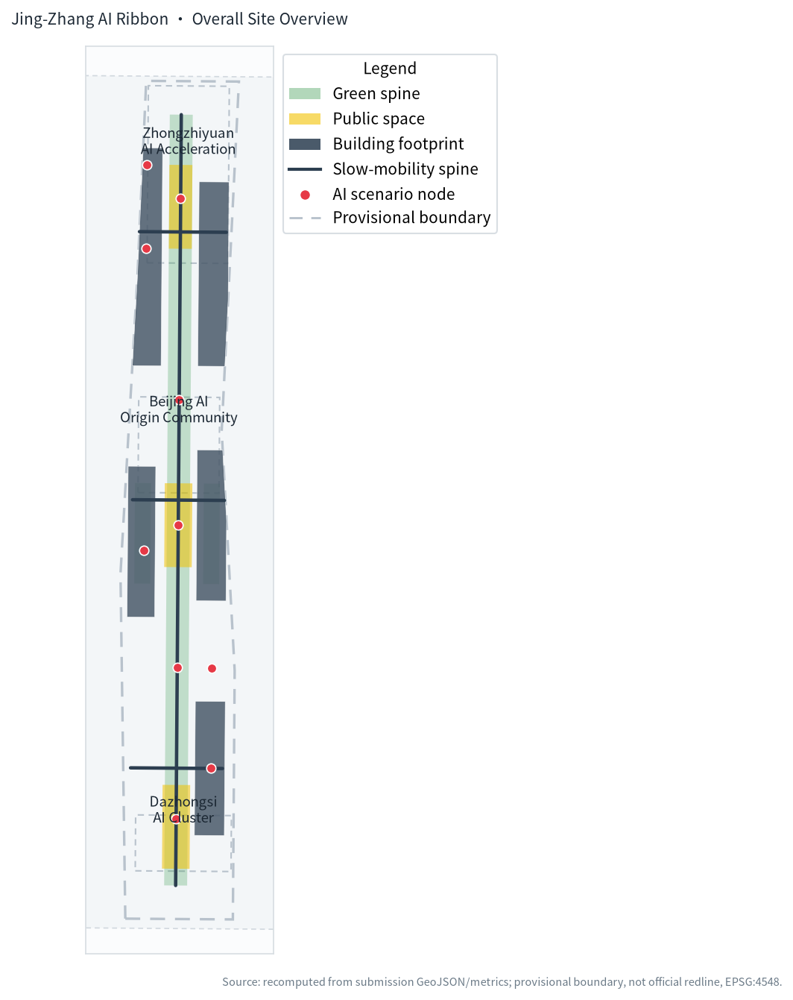
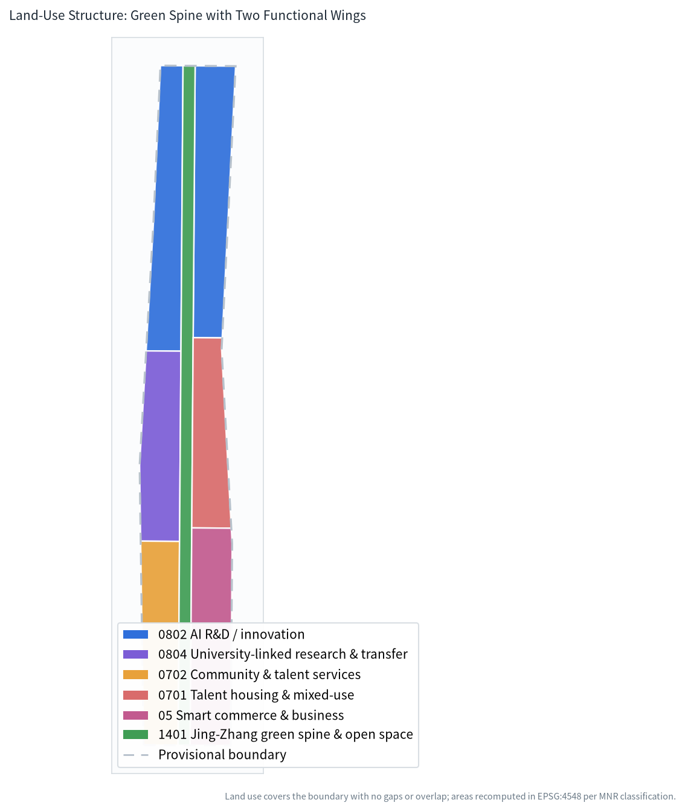
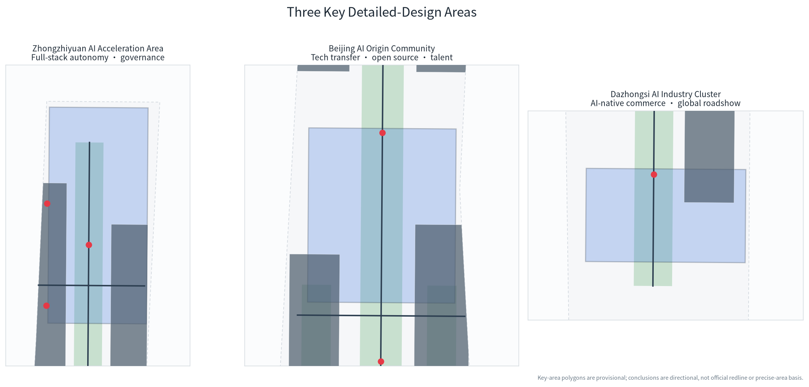
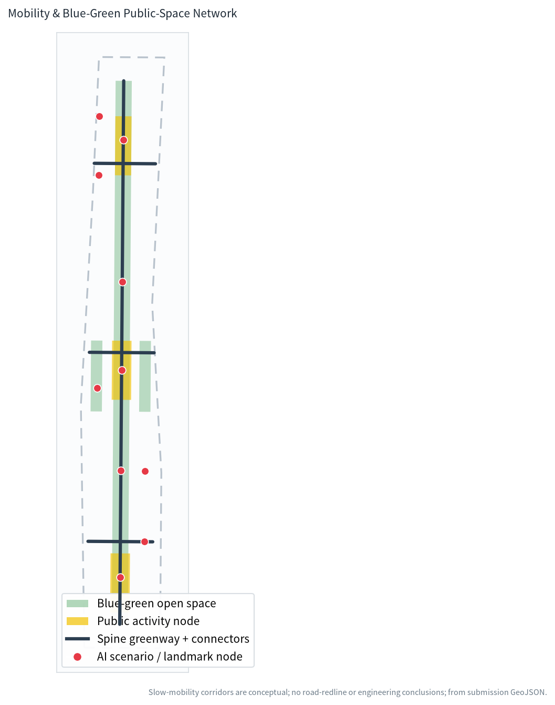
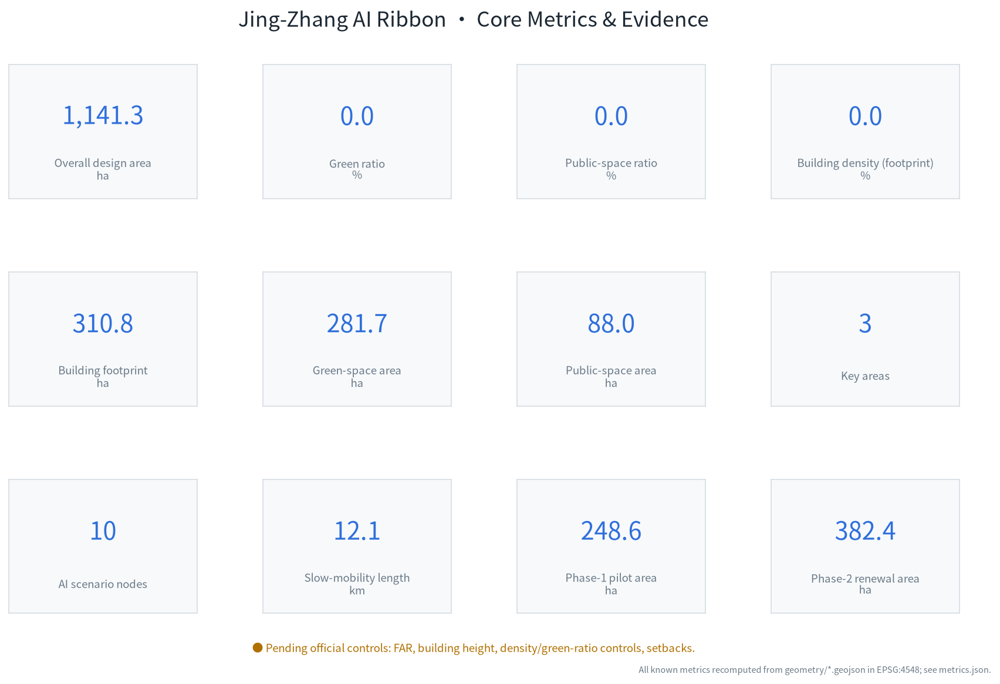

# Jing-Zhang AI Ribbon: An AI Innovation Spine on a Century-Old Railway Heritage

## Design Basis and Source List

This proposal takes as its primary basis the *Pre-qualification Announcement for the International Urban Design Competition for the Centennial Jing-Zhang AI Innovation Belt* issued by the Haidian Branch of the Beijing Municipal Commission of Planning and Natural Resources, and uses the Agent open-call taskbook excerpt as its co-creation rulebook. It draws on the enums, scopes, standards, source registry and provisional boundaries registered in the site package [source:OFFICIAL-ANNOUNCEMENT] [source:AGENT-TASKBOOK].

Every recomputable spatial claim derives from the package's own GeoJSON and `metrics.json`: land use covers the full boundary with no gaps or overlaps, and areas are recomputed in EPSG:4548. Professional standards, design depth and task coverage live in the three matrix files; the narrative does not repeat their full indexes [standard:MNR-LAND-USE-CLASSIFICATION-GUIDE] [depth:metrics_recalculation].

It must be stated clearly that the current site package contains **no official redline**. Both `geometry/site_boundary.geojson` and the three key areas use the repository-registered provisional rough boundaries. They may support generation, visualization and local self-check, but are not an official redline, approval basis or precise-area basis; when official data is released, all geometry and metrics must be recomputed [data:geometry/site_boundary.geojson#SITE-001] [metric:site_area_sqm].

The recomputed submitted-boundary area is about 1141.3 ha, differing from the announced ~1140 ha by about 0.1%, a difference caused by the roughness of the provisional polygon rather than by design adjustment.

## Three-Level Scope Framework

The work follows the three levels defined by the announcement. The coordinated research scope of about 43.6 km² addresses industry chain, innovation ecosystem and future-city form. The overall design scope of about 11.4 km² covers the urban and industrial areas within roughly 1–2 km of the Jing-Zhang heritage park, and delivers the renewal structure, land use, transport and character. The key detailed-design scope of about 368.4 ha comprises three areas running north to south [data:geometry/key_areas.geojson#PROV-KEY-001] [depth:three_level_scope_framework].

The three levels are not separate drawings. The coordinated-level innovation chain—"university inception → open-source collaboration → enterprise translation → public experience → global communication"—constrains the overall-level land-use and public-space structure, which the key-level nodes then test for implementability. Any scale that cannot be recomputed from geometry or a trusted source is marked pending rather than presented as approved [metric:key_area_count] [depth:overall_spatial_structure].

| Level | Area (announced) | Proposal response | Evidence |
| --- | --- | --- | --- |
| Coordinated research | 43.6 km² | "Three areas, two wings" innovation chain and future-city form | Standard matrix, scenario nodes |
| Overall design | 11.4 km² | One-ribbon-three-core, two-wing land-use and renewal structure | Land-use, road, green layers |
| Key detailed design | 368.4 ha | Positioning and spatial moves for the three key areas | Key-area layer |

The same provisional boundary is used across all three levels, so every "within scope" judgement inherits its roughness; once official polygons replace it, site boundary, key areas, land use and derived metrics should all be recomputed together.

## Coordinated Research Area: Industry and Future City Research

### Overall Concept and Naming System (addresses agent.1)

The belt is named the **"Jing-Zhang AI Ribbon"**: the linear heritage corridor of the Jing-Zhang railway is the "ribbon", while the innovation spine linking the three key areas north to south is the "core", forming a "one ribbon, three cores, two wings" structure. In Chinese the name carries a silk/thought double meaning—the railway runs like a silk ribbon while innovation flows like thought; "Ribbon" in English emphasizes a linear, continuous, weaveable network of public space and innovation [source:AGENT-TASKBOOK].

The proposed visual identity uses a continuous curve that gradients toward cooler tones from south to north as its primary mark, with three nodes on the curve marking the key areas; the curve abstracts both the railway line and the data-flow/slow-mobility path. The palette pairs a restrained tech blue with the warm grey of Jing-Zhang brickwork, avoiding any unlicensed corporate or city marks. The logo and typeface are conceptual directions that require professional development and rights clearance; they do not constitute an approved brand [standard:PROJECT-AGENT-OPEN-CALL-TASKBOOK].

The "three positionings" (Centennial Jing-Zhang cultural belt, urban AI life-experience belt, AI convergence-innovation belt) are translated into spatial moves: culture maps to the heritage spine, life-experience to community and public services, and convergence-innovation to the R&D–translation–commerce chain. Of the "five functions", full-stack autonomy maps to Zhongzhiyuan, world-class ecosystem to the Origin Community, AI-native new business to Dazhongsi, AI+ scenario empowerment spans both wings, and AI governance voice is carried by the governance sandbox at Zhongzhiyuan [depth:overall_spatial_structure].

### Global AI Innovation Ecosystem Cases (addresses agent.2)

The following cases inform transferable spatial and operational mechanisms; they are not corporate commitments or an investment list:

| Case | Transferable lesson | Proposal translation |
| --- | --- | --- |
| King's Cross, London | Historic railway hub renewed as a knowledge–public-space complex | Heritage park as the public spine stitching both sides |
| Kendall Square, Boston | Walkable mix of universities, labs and startups | University-linked transfer street and slow-mobility stitching |
| one-north, Singapore | Vertical mix of public R&D platforms and living functions | Shared testbeds and talent apartments at Zhongzhiyuan |
| Digital Media City, Seoul | Public-scene-driven content and smart-device showcase | AI-native commerce and global roadshows at Dazhongsi |
| Shiodome/Shinagawa, Tokyo | Station–city integration and walkable networks | Four-quadrant walkability concept around Dazhongsi station |
| Kalasatama, Helsinki | City-as-a-testbed scenario opening | Public-service scenario testing on the Xiaoyuehe wing |

Together these cases point to one lesson: an innovation ecosystem is not a single park but a stack of "walkable public space + shareable R&D facilities + open city scenarios + operable community mechanisms", which is exactly what the land-use and public-space structure of this proposal is built on [data:geometry/land_use.geojson#LU-001]. On land, compute, data and scenarios the proposal offers only mechanism suggestions (public testbeds, scenario open days, edge-compute waystations); it does not fabricate investment, output or policy arrangements [source:AGENT-TASKBOOK].

## Overall Design Area: Urban Renewal and Regulatory-Plan-Level Urban Design

The overall design scope adopts a **central green spine + east/west wings** structure. The central north-south spine corresponds to the Jing-Zhang heritage park vitality belt and is the slow-mobility and public-space axis connecting the three key areas. The west wing holds full-stack AI R&D, university-linked research translation and community services; the east wing holds incubation/acceleration, talent housing and mixed use, and smart commerce. This zoning is fully expressed in the land-use layer: seven polygons tessellate seamlessly and their union equals the submitted boundary [data:geometry/land_use.geojson#LU-002] [depth:land_use_layout].

Recomputed structural indicators are: AI R&D and research land (0802+0804) totals about 508.3 ha, the largest share; green and open-space land (1401) about 168.3 ha; smart commerce/business (05) about 180.1 ha; and residential/community support about 284.6 ha [metric:land_use_0802_area_sqm]. These ratios are design suggestions supporting the judgement of "R&D first, public space as the vein, housing and commerce as the base"; they are not statutory regulatory-plan indicators.

At regulatory-plan depth the proposal follows a "known / suggested / pending" split: land-use classification and spatial structure are design suggestions; floor-area ratio, building height, density controls, green-ratio controls and setbacks are absent from the site package and are uniformly marked pending official regulatory conditions, rather than guessed values posing as approved controls [standard:MOHURD-CONTROL-DETAILED-PLANNING] [metric:floor_area_ratio].

The transport strategy uses one north-south slow-mobility spine and three east-west connectors to serve walk/cycle links among the key areas, with a recomputed corridor length of about 12.1 km; this is a conceptual corridor and gives no road redline, alignment or bridge/tunnel conclusions [data:geometry/roads.geojson#ROAD-001] [metric:road_length_m].

## Detailed Design of the Key Areas

The three key areas share one `key_areas.geojson`; all three polygons are provisional, so the conclusions below are directional designs to be deepened by professional teams on official boundaries [data:geometry/key_areas.geojson#PROV-KEY-001] [depth:three_key_area_detailed_design].

**Zhongzhiyuan AI Acceleration Area (~192.1 ha)** is positioned as a garden-style full-stack autonomy innovation district. Spatially it strengthens the Qinghe riverfront, organizing open testbeds, a security-governance sandbox, a low-carbon innovation gallery and external connections; industrially it hosts autonomous-model testing, standards workshops and security-governance showcases. It maps to building footprint BLDG-ZZY and nodes NODE-002 (governance sandbox) and NODE-005 (low-carbon gallery), with no parcel-level demolition/retention conclusions.

**Beijing AI Origin Community (~104.3 ha)** is positioned as a university-linked translation and talent community. It stitches together campus, park and street blocks, with an open-source release hall, a university-linked transfer street and talent services; it is the main carrier of the "world-class AI innovation ecosystem" positioning. It maps to BLDG-EDU and BLDG-TAL and nodes NODE-001 and NODE-009.

**Dazhongsi AI Industry Cluster (~72.0 ha)** is positioned as an urban smart-economy and global-exchange district. Around Dazhongsi station it proposes a four-quadrant walkability concept, with smart-device showcase, content commerce, a data-elements lounge and an international roadshow living room; it maps to BLDG-COM and nodes NODE-004, NODE-007, NODE-008. Station integration and intersection connectivity are subject to professional transport and municipal assessment; this proposal gives no engineering conclusions.

## AI Innovation Ecosystem, Personas, and AI+ Scenarios

### User Personas (at least 5)

| Persona | Typical needs | Spatial response | Privacy / human-review boundary |
| --- | --- | --- | --- |
| Open-source developer | Release, collaborate, test, reputation | Origin Community release hall, code wall | Aggregate stats only; no personal tracking |
| Startup team | Low-cost office, compute access, proving ground | Zhongzhiyuan shared testbed, compute waystation | Compute/data services separately authorized |
| Enterprise visitor | Showcase, business, international hosting | Dazhongsi roadshow room, station connection | Corporate marks/cases must be cleared |
| Local resident | Commute, leisure, community services | Green-spine loop, embedded services | Not used for commercial profiling |
| University staff/student | Translation, cross-school collaboration | Transfer street, education experience points | Campus/research data requires authorization |
| International visitor | Understand the belt narrative, pilgrimage | AI landmarks, cultural signage | Public guidance; no identity collection |

### Scenario Cards (at least 10, including 3 industry test/validation scenarios)

| ID | Scenario | Type | Spatial carrier | Privacy / review boundary |
| --- | --- | --- | --- | --- |
| S01 | Open-source release hall | Ecosystem | Origin Community | Aggregate event data; human-reviewed releases |
| S02 | **Security-governance sandbox (test/validation)** | Industry test | Zhongzhiyuan | Red-team work in isolated, auditable settings |
| S03 | Edge-compute waystation | New infra | Belt nodes | Authorized compute use; no personal data |
| S04 | AI slow-mobility navigation | Urban life | Jing-Zhang spine | Low-intrusion sensing; gaps human-confirmed |
| S05 | Dazhongsi international roadshow room | Industry service | Dazhongsi | Business content reviewed by organizers |
| S06 | Qinghe low-carbon innovation gallery | Ecosystem showcase | Zhongzhiyuan riverfront | Anonymized, aggregate energy data |
| S07 | University-linked transfer street | Industry translation | Origin Community | IP transactions confirmed offline |
| S08 | **Data-elements lounge (test/validation)** | Industry test | Dazhongsi | Authorized, auditable circulation |
| S09 | AI living-service sample street | Urban life | East-wing community commerce | Explainable, opt-out recommendations |
| S10 | Global AI festival route | Operations/brand | Belt public space | Event safety handled by human organizers |
| S11 | **Low-speed robot delivery (test/validation)** | Industry test | West-wing community | Designated roads; safety operator/remote takeover |
| S12 | AI cultural guide | Culture | Heritage landmarks | Facts human-proofed; no invented history |

All scenarios map to `SCENARIO_NODE` point features and are grouped as ecosystem/test/life/operations in the visual page. S02, S08 and S11 are industry test/validation scenarios, each with human review or safety takeover; immature technology is not presented as fully deployed [data:geometry/roads.geojson#ROAD-001] [depth:traffic_rail_slow_parking].

## Land Use, Building Scale, and Retain-Renovate-Demolish Strategy

As described above, seven polygons cover the submitted boundary seamlessly without overlap in EPSG:4548; classification uses verifiable codes from the MNR land-use classification guide, with no invented categories [standard:MNR-LAND-USE-CLASSIFICATION-GUIDE]. Recomputation shows the provisional boundary area at about 1141.3 ha, of which green/open space is about 168.3 ha and AI R&D/research about 508.3 ha [metric:site_area_sqm] [metric:land_use_1401_area_sqm].

Building footprints are expressed as five clusters, with a recomputed total footprint of about 310.8 ha and a building density (footprint/site) of about 27.2%. This is a design-stage cluster-level footprint illustration supporting industry-space-supply judgement; it is **not** a parcel-level building footprint and does not constitute retain/renovate/demolish conclusions [data:geometry/buildings.geojson#BLDG-ZZY] [metric:building_density].

Retain/renovate/demolish follows a cautious principle: without existing-building, ownership or regulatory-plan data, the proposal does not designate any specific parcel for demolition or retention, offering only directional strategy—"prioritize public-oriented renewal along the spine, station-area integration around rail stations, and translation near campuses"—and lists all specific decisions as professional-deepening prerequisites [depth:retain_renovate_demolish]. Total floor area, FAR and building height are all marked pending due to missing official controls [metric:building_height_m].

## Transport, Rail, Municipal Infrastructure, and Public Services

Transport centers on slow mobility and rail feeder access. The north-south spine carries the primary pedestrian/cycle corridor, and three east-west connectors link the west-wing R&D, east-wing housing/commerce and three rail nodes. Dazhongsi station's four-quadrant walkability is a **concept**; bridge/tunnel, underground-space and utility conclusions require transport/municipal specialists [data:geometry/public_space.geojson#PUBLIC-001] [depth:traffic_rail_slow_parking].

Municipal and new infrastructure blend "traditional municipal + distributed new infrastructure": edge-compute waystations are a new-infrastructure prototype to be deepened, sited with distributed energy and low-carbon facilities. These are mechanism and space suggestions; no energy-load or capacity calculation is provided [depth:municipal_new_infrastructure]. Public services embed talent services, education experience, community health and cultural display along the spine and community clusters, with service radii expressed conceptually and standards pending regulatory confirmation.

## Blue-Green Network, Public Space, and Urban Character

The blue-green system uses the Jing-Zhang heritage spine as its backbone, with a recomputed green area of about 281.7 ha (green ratio ~24.7%) and one neighborhood park pocket in each wing; public space is organized around three key-area plaza groups, recomputed at about 88.0 ha (~7.7%). These ratios support the judgement that "public space carries innovation exchange"; full values are in `metrics.json` [metric:green_ratio] [metric:public_space_ratio] [data:geometry/green_space.geojson#GREEN-001].

### AI Pilgrimage Landmarks and Honor System (addresses agent.4)

Three conceptual AI pilgrimage landmarks are proposed, each an honor-display node in public space, **with no new-build engineering conclusion** and without entertainment kitsch:

1. **AI Origin Column (Beijing AI Origin Community)**—marking the starting point of China's AI exploration, presenting open-source contributors on a timeline and contribution wall maintained by the community with human review.
2. **Jing-Zhang Digital Waystation (Zhongzhiyuan, Qinghe)**—juxtaposing railway history with contemporary autonomous innovation as a window for security-governance and low-carbon display.
3. **World Intelligence Living Room (Dazhongsi)**—a publishing and honor node for international visitors, showing public milestones and standards contributions.

The honor system follows the "contributions are memorable" principle, recording open-source projects, standards contributions and scenario outcomes, consistent with co-creation principle 9. Landmarks, signage and the symbol system must stay distinct from the belt-wide Logo and be rights-cleared [source:AGENT-TASKBOOK] [depth:blue_green_public_space]. Character control returns to the Urban Design Management Measures' requirements on building height, massing, style and color, with specific control values pending official conditions [standard:MOHURD-URBAN-DESIGN-MEASURES].

## Cultural Narrative and Brand Identity (addresses agent.5)

The cultural narrative weaves "three threads": the industrial/railway memory of the century-old Jing-Zhang line gives historical depth, Zhongguancun's innovation culture gives contemporary spirit, and new AI culture gives a globally open narrative. Signage and symbols use the "ribbon" curve as a motif, repeated in spine pavement markings, node plaques and digital guides. The recommended English tagline is "Where a century-old railway meets the AI age"; historical statements are human-proofed, never invented or distorted [standard:PROJECT-AGENT-OPEN-CALL-TASKBOOK].

The cultural signage system and the belt-wide Logo system are kept hierarchically distinct: the Logo represents the whole competition belt, while cultural signage serves specific node narratives, and the two are never mixed. All portraits, trademarks and historical images require authorization before use; this proposal text embeds no uncleared material.

## Renewal Projects, Implementation Policy, and Phasing

The renewal project list is a conceptual project bank, with locations expressed in layers and no implementing entity or funding designated:

| ID | Project | Type | Dependencies |
| --- | --- | --- | --- |
| JZ-01 | Stitch slow-mobility gaps on the Jing-Zhang spine | Public space/transport | Road redline, under-bridge space review |
| JZ-02 | Zhongzhiyuan Qinghe innovation interface | Blue-green/industry showcase | River blue line, ecology/flood conditions |
| JZ-03 | Origin Community university-linked transfer street | Urban renewal | Campus boundary, ownership, ground-floor uses |
| JZ-04 | Dazhongsi four-quadrant walkability | Rail integration | Station, intersection, utility assessment |
| JZ-05 | AI public services and compute nodes | New infrastructure | Energy, compute, safety, operating entity |
| JZ-06 | Global AI festival public route | Operations/brand | Event permits, safety, rights clearance |

Phasing is expressed in `phasing.geojson`: near-term (phase_1) focuses on the Origin Community and Dazhongsi public/node projects that can start relatively quickly, recomputed at about 248.6 ha; mid-term (phase_2) advances the Zhongzhiyuan acceleration area at about 382.4 ha; long-term (phase_3) covers belt-wide governance at about 1141.3 ha [data:geometry/phasing.geojson#PHASE-001] [depth:phasing_implementation].

### Global AI Event System and Long-Term Operations (addresses agent.6)

The proposed annual system peaks with a "Global AI Festival Week", under which sit an open-source contributors' conference, a security-governance forum, scenario open days and an international roadshow season. Developer community operations combine online open source with an offline release hall, and scenario opening uses test/validation scenarios as conversion pathways. All events, investment, funding and policies are conceptual suggestions, not stated government arrangements, with a closed talent–enterprise–developer conversion loop [source:AGENT-TASKBOOK] [depth:renewal_project_list].

## Metrics, Area Recalculation, and Compliance Matrix

Indicators fall into three classes. First are spatial indicators directly recomputed from submitted geometry in EPSG:4548: site area, green ratio, public-space ratio, building density, land-use areas, phasing areas and slow-mobility length. Second are regulatory indicators whose official conditions are absent (FAR, building height, etc.), marked unknown. Third are performance indicators requiring ongoing operational data (e.g. an AI innovation index, event participation), for which this package does not fabricate values [depth:metrics_recalculation].

Core recomputed results: site about 1141.3 ha, green ratio about 24.7%, public-space ratio about 7.7%, building density about 27.2%, slow-mobility corridor about 12.1 km, 10 AI scenario nodes, 3 key areas [metric:green_space_area_sqm] [metric:building_footprint_area_sqm] [metric:ai_scenario_node_count]. These numbers explain the design intent: nearly a quarter of the site is reserved for green and open space to support talent life and innovation exchange, cluster-level footprints support industry-space supply, and continuous slow mobility supports the experiential connection of the three key areas.

All announcement tasks (1.3, 1.4, 1.5) and agent.1–agent.6 are mapped in `compliance_matrix.json` to sections, layers, metrics, drawings and pages; mandatory professional standards are addressed in `standard_matrix.json`; formal design-depth items are marked complete in `design_depth_matrix.json`. The narrative does not stack these indexes; structured files are validated independently [standard:PROJECT-OFFICIAL-ANNOUNCEMENT].

## Risk, Copyright, and Compliance

- **Provisional-boundary risk:** all geometry is based on a provisional constraint, not an official redline; areas and spatial judgements must be recomputed after official data is released [data:geometry/constraints.geojson#CONSTR-PROV].
- **Regulatory-condition gaps:** FAR, building height, density controls, green-ratio controls, setbacks, etc. are absent; all conclusions are pending and do not pose as statutory indicators.
- **Engineering and ownership boundaries:** no final conclusions on road redlines, bridges/tunnels, underground space, municipal capacity, land ownership or demolition/retention.
- **Data and privacy:** AI scenarios follow data minimization, explainability and human review; no non-public or personal-privacy data is used.
- **Copyright clearance:** figures are produced by the submitter using an open-source font (SIL OFL) and self-authored drawing; no unlicensed trademarks, fonts, portraits or images are used; no external commercial base map is used.
- **Status statement:** this proposal is an open co-creation conceptual suggestion; it does not replace formal planning and does not constitute a government approval or implementation commitment [source:AGENT-TASKBOOK].

The AI agent is responsible for facts, sources, geometry, metrics and expression; maintainers and professional reviewers may require repairs based on self-check, spatial review and the compliance matrix.

## References

The full source, standard and design-depth indexes live in the structured files; the main public materials informing the proposal are listed below [source:SITE-PACKAGE] [standard:PROJECT-OFFICIAL-ANNOUNCEMENT].

1. Haidian Branch, Beijing Municipal Commission of Planning and Natural Resources. *Pre-qualification Announcement for the International Urban Design Competition for the Centennial Jing-Zhang AI Innovation Belt*, 2026-05-09.
2. *Excerpt of the Agent-facing open-call taskbook for the Centennial Jing-Zhang AI Innovation Belt urban design open call* (user-provided cleared document), 2026-05-18.
3. Beijing Municipal Science & Technology Commission / Zhongguancun Administrative Committee. *"Three areas, two wings" to build a world-class AI cluster*, 2026-04-03.
4. Haidian District People's Government. *Haidian announces the "1+X+1" modern industrial system layout*, 2026-03-02.
5. Ministry of Housing and Urban-Rural Development. *Urban Design Management Measures*, 2017.
6. Ministry of Housing and Urban-Rural Development. *Measures for the Formulation and Approval of Urban/Town Regulatory Detailed Plans*.
7. Ministry of Natural Resources. *Guide to Land-Use Classification for Territorial Spatial Survey, Planning and Use Control*, 2023.
8. For the full structured source, standard and design-depth indexes, see `sources.json`, `standard_matrix.json`, `design_depth_matrix.json`.
