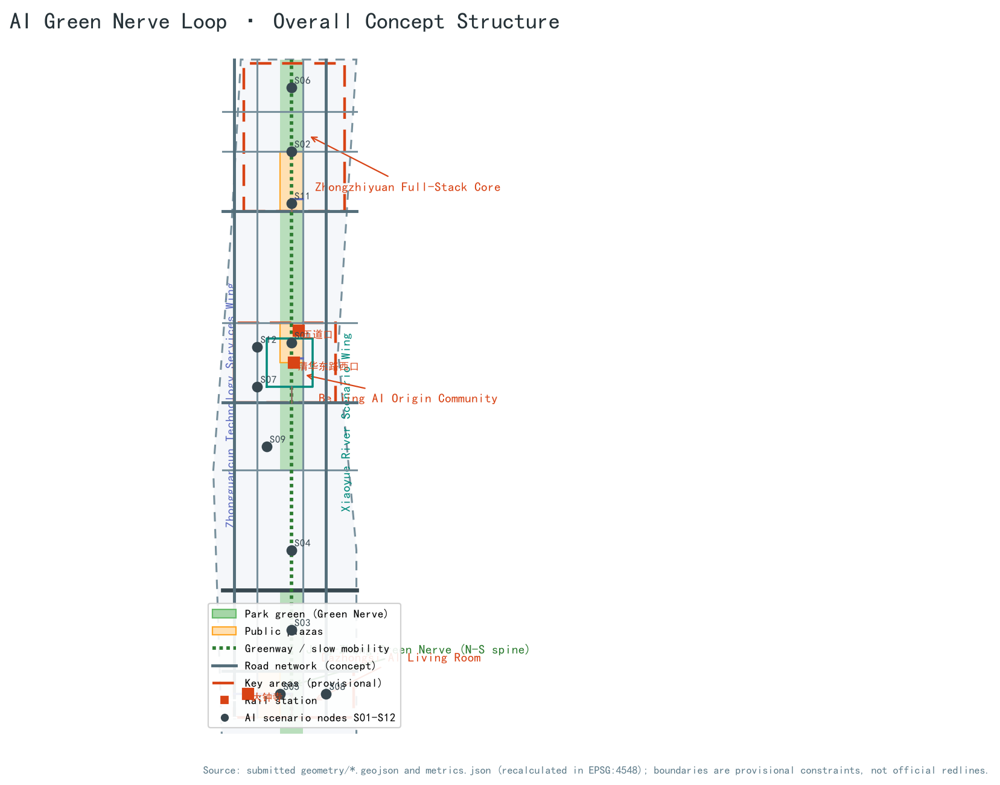
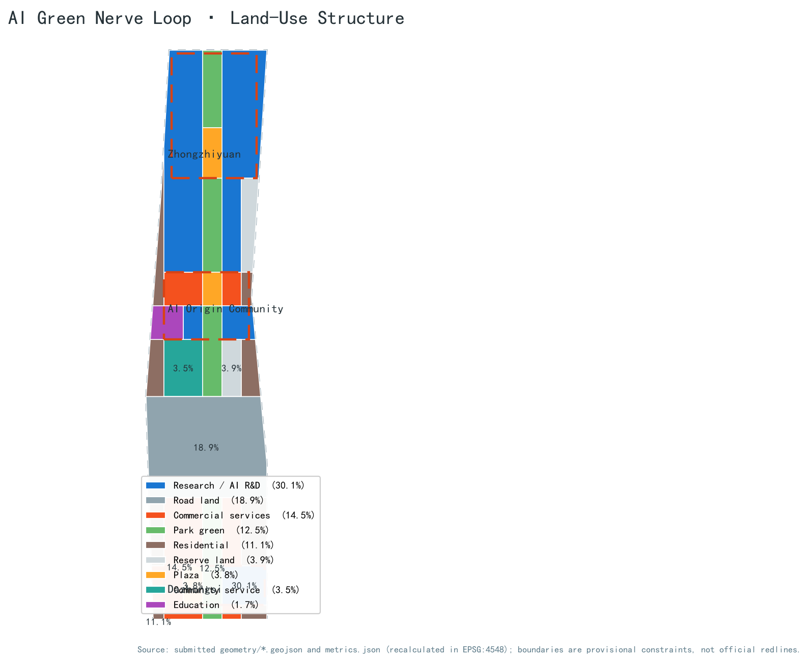
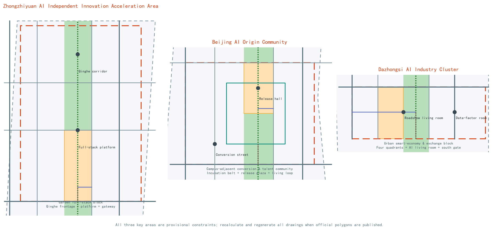
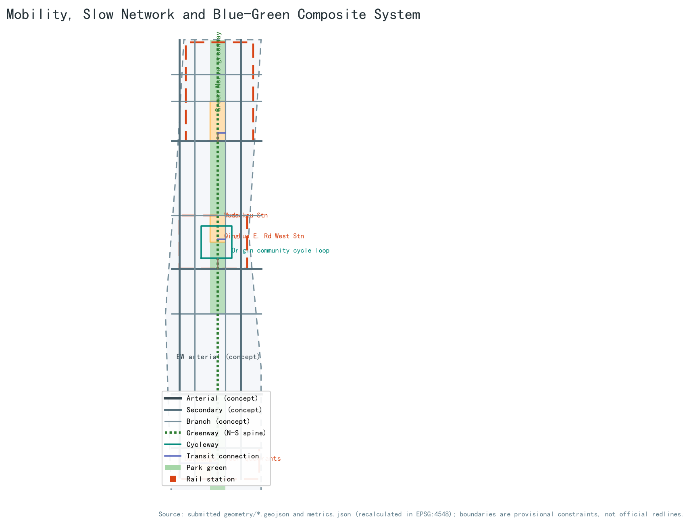
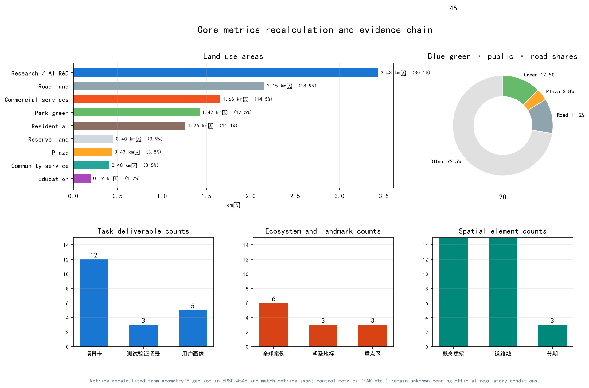

# AI Green Nerve Loop: Urban Design Proposal for the Centennial Jing-Zhang AI Innovation Belt

## Design Basis and Source List

This proposal takes the Qualification Prequalification Announcement for the Centennial Jing-Zhang AI Innovation Belt International Urban Design Open Call, published by the Haidian Branch of the Beijing Municipal Commission of Planning and Natural Resources, as its governing project source, confirming the project name, the three scope levels, the three key areas, the design tasks and the required deliverable depth [source:OFFICIAL-ANNOUNCEMENT]. The agent-facing open-call taskbook was user-provided and rights-cleared; it is the main basis for the six agent tasks covering naming, scenario cards, pilgrimage landmarks, cultural narrative and long-term operations [source:AGENT-TASKBOOK] [standard:PROJECT-AGENT-OPEN-CALL-TASKBOOK]. The national land-use classification guide, the Urban Design Administration Measures and the Regulatory Detailed Planning Measures set the professional standard for land-use codes, public-space and urban-character language, and for distinguishing known controls, design recommendations and pending confirmations [standard:MNR-LAND-USE-CLASSIFICATION-GUIDE] [standard:MOHURD-URBAN-DESIGN-MEASURES] [standard:MOHURD-CONTROL-DETAILED-PLANNING].

The central source registry classifies materials as formal-ready, background-only, provisional-only or needs-review [source:SOURCE-REGISTRY]. The three scope levels and three key areas used here come from maintainer-derived provisional polygons inferred from the announcement's textual boundaries, location clues and approximate areas; they are registered as provisional-only [source:BOUNDARY-SOURCE] [source:KEY-AREA-SOURCE]. They are used solely for generation, display and intake self-checks; they are not official redlines, approval bases or precise-area bases. When official polygons are published, every layer and metric in this package must be recalculated, and the area statements in this narrative updated accordingly.

Machine-readable evidence lives in `metrics.json`, `sources.json`, `assumptions.json` and the three matrices; the narrative keeps only claim-adjacent anchors. Every spatial claim can be re-examined in the submitted layers [data:geometry/site_boundary.geojson#SITE-001] [data:geometry/key_areas.geojson#PROV-KEY-001]. Only public or rights-cleared, redistributable material is used; no restricted-channel material is used.

## Three-Level Scope Framework

The proposal is organised in the announcement's three levels: the Coordinated Research Area (about 43.6 km²) answers the industry-ecosystem and future-city-form questions; the Overall Design Area (about 11.4 km²) completes urban renewal and regulatory-plan-depth urban design; the Key-Area Detailed Design Area (about 368.4 ha) delivers detailed design for the three key areas [standard:PROJECT-OFFICIAL-ANNOUNCEMENT].

The levels cascade from industry strategy to overall structure to area design. The coordinated level builds an innovation chain of "university origination–open-source collaboration–enterprise conversion–public experience–international communication" and maps it onto the Three Zones and Two Wings; the overall level translates the chain into land-use, road, blue-green and phasing layers; the key-area level deepens the layers into buildings, plazas, station connections and AI scenario nodes. All levels share one overall design boundary [data:geometry/site_boundary.geojson#SITE-001], and the key-area scope is aggregated from the three key-area layers [data:geometry/key_areas.geojson#PROV-KEY-001], with the area relation checked by metrics [metric:key_area_count].

All three provisional boundaries are drawn as low-contrast dashed constraints and must not be read as approved boundary lines. After official polygons are issued, the land-use, building, road, green/public-space, phasing layers and all area metrics must be recalculated and all figures and HTML regenerated.

## Coordinated Research Area: Industry and Future City Research

The core judgment for the Coordinated Research Area is that Haidian already has a full chain from original innovation to industrialisation; what is missing is not another park but a perceivable urban corridor that connects university origination, open-source collaboration, enterprise conversion, public experience and international communication. The proposal therefore puts forward the belt-level concept "AI Green Nerve Loop" (智脉绿链): the master name is "Centennial Jing-Zhang AI Innovation Belt · AI Green Nerve Loop", and the naming system consists of one belt, three cores, two wings and multiple nodes. The belt is the Jing-Zhang Green Nerve; the three cores are the Zhongzhiyuan full-stack innovation core, the Beijing AI Origin Community and the Dazhongsi AI Living Room; the two wings are the Zhongguancun Technology Services Wing and the Xiaoyue River Scenario Enablement Wing; the nodes are the twelve city experience points of the scenario cards [source:AGENT-TASKBOOK].

The logo and visual-identity direction is an original conceptual proposal: it takes the Jing-Zhang railway's zigzag mountain-crossing line and sleeper rhythm as the historical motif, overlays a node-and-link neural-network language, and forms a "historic track plus data track" double-rail symbol. The colour system uses Jing-Zhang rust red, Haidian innovation blue and Green-Nerve ecological green. All fonts, graphics and symbols should preferably be open-source or self-drawn; font and trademark clearance must be completed before professional deepening [depth:brand_identity_system].

The three positionings and five functions are realised through the Three Zones and Two Wings collaboration loop: the Beijing AI Origin Community carries origination and conversion for the world-class AI innovation ecosystem; Zhongzhiyuan carries the full-stack independent innovation system and global AI governance discourse; Dazhongsi carries AI-native new business forms; the Zhongguancun Technology Services Wing provides factors, capital and IP services; and the Xiaoyue River Scenario Enablement Wing carries AI-enabled scenarios and the smart vibrant-city public experience [source:AGENT-TASKBOOK] [source:OFFICIAL-ANNOUNCEMENT].

Six publicly documented global cases are used as background: Stanford Research Park in Silicon Valley (university research park plus venture networks), one-north in Singapore (themed clusters plus shared platforms), Shenzhen Bay Science and Technology Ecological Park (platform-based park operation), King's Cross Knowledge Quarter in London (railway-heritage renewal plus knowledge economy), Hangzhou Future Sci-Tech City (university plus anchor enterprises), and the Tel Aviv innovation district (startup density plus international community). Together they support four transferable lessons: shared public living rooms attract innovation exchange more effectively than isolated buildings; rail and railway heritage are the strongest spatial memory of innovation districts; testing and display space must open to small and medium enterprises; and brand and event systems decide international recognition [depth:innovation_ecosystem_cases]. These cases are background research only; no unverified investment or output figures are cited.

For the future city form, the proposal defines three principles of a "perceivable AI city": every AI scenario must be experienceable, human-reviewable and replaceable as technology evolves; public space is the first priority for open testing and display; and data use follows minimisation and authorisation. The AI+ transport and continuous green network are delivered through the slow-mobility and blue-green layers described below.

## Overall Design Area: Urban Renewal and Regulatory-Plan-Level Urban Design

The design judgment for the Overall Design Area is to use the Jing-Zhang Heritage Park as the renewal spine, treating the low-efficiency land on both sides, campus edges and community ground floors as the main renewal objects, and forming a "green chain stringing nodes, station clusters and block stitching" spatial structure. The green chain arranges culture, display and exchange nodes along the park corridor; station clusters organise integrated functional circles around Wudaokou, Qinghua East Road West and Dazhongsi stations; block stitching connects campuses, parks and communities with branch roads, walking and cycling [data:geometry/roads.geojson#ROAD-001] [depth:overall_spatial_structure].

The land-use structure is led by AI industry space and blue-green public space: research land for AI R&D and incubation is about 3.43 km², commercial services about 1.66 km², parkland about 1.42 km², road land about 2.15 km², and residential about 1.26 km², supported by plaza, community-service, education and reserve land [data:geometry/land_use.geojson#LU-05-01] [metric:land_use_area_0802_sqm] [metric:land_use_area_1401_sqm]. Residential and industrial space mix along both sides of the green nerve to form balanced work-residence-commerce renewal units.

Building renewal uses a method-level retain–renovate–new-build classification without parcel-level demolition conclusions: heritage resources (such as the Qinghuayuan station site) and structurally sound built-up areas are recommended for retention; low-efficiency parks, community ground floors and commercial frontages for renovation; only reserve land and parcels confirmed by professional teams for new building. The conceptual massing comprises 46 building footprints of about 728,000 m²; with assumed storey counts by building type, the conceptual total floor area is about 5.765 million m² [data:geometry/buildings.geojson#BLDG-001] [metric:building_footprint_area_sqm] [metric:total_floor_area_sqm]. FAR, building height, building coverage, green ratio and setbacks lack official regulatory conditions and are all listed as pending confirmation [metric:floor_area_ratio].

Transport and municipal support follow a "station first, slow-mobility through, facilities mixed" strategy: transit-station areas organise integrated walking, cycling and bus connection circles; the branch network and greenways complete north-south through-routes and east-west stitching; parking and bicycle storage are included in station-integrated design. New infrastructure, including edge-computing stations, distributed energy and sensing devices, is proposed as conceptual prototypes co-located with conventional municipal facilities; utility, drainage, power, gas and fire-safety conditions remain pending official data [depth:traffic_rail_slow_parking] [depth:municipal_new_infrastructure].

## Detailed Design of Key Areas

The three key areas share a seven-element structure of positioning, spatial structure, building renewal, transport and slow mobility, public space, AI scenarios and implementation risk; every conclusion is a conceptual recommendation [data:geometry/key_areas.geojson#PROV-KEY-001] [data:geometry/key_areas.geojson#PROV-KEY-002] [depth:three_key_area_detailed_design].

**Zhongzhiyuan AI Independent Innovation Acceleration Area** (provisional scope about 192.9 ha) is positioned as a garden-style full-stack independent innovation block. Its spatial structure is "Qinghe waterfront + full-stack platform + Green Nerve gateway": the north organises a low-carbon innovation corridor and industry-display frontage along the Qinghe; the centre hosts the full-stack innovation platform and governance sandbox; the south gateway receives slow mobility and events [data:geometry/green_space.geojson#GREEN-001]. Building renewal favours renovating low-efficiency parks and building on reserve land as garden-style low-density clusters; external transport is proposed conceptually in coordination with the Fifth Ring Road area, with alignment and engineering conclusions left to professional review. Main risks are missing official boundary, Qinghe blue-line and ring-road engineering conditions.

**Beijing AI Origin Community** (provisional scope about 104.3 ha) is positioned as a campus-adjacent conversion and talent community. Its spatial structure is "campus-edge incubation belt + release plaza + living loop": the west organises a conversion street and incubation space along the campus edge; the centre places a release hall and public plaza on the Green Nerve; the outer ring provides talent housing and daily services [data:geometry/public_space.geojson#PUBLIC-002] [data:geometry/land_use.geojson#LU-0804-01]. Building renewal follows low-disturbance organic renewal, mainly upgrading parks and street ground floors and adding result-display and housing services; integrated station circles are proposed around Wudaokou and Qinghua East Road West. Main risks are campus boundaries, ownership and station engineering conditions.

**Dazhongsi AI Industry Cluster** (provisional scope about 72.0 ha) is positioned as an urban smart-economy and international-exchange block. Its spatial structure is "station four quadrants + AI living room + Green Nerve south gate": four-quadrant walking connections and bicycle parking are organised around Dazhongsi station, while the south end of the Green Nerve hosts an international roadshow living room, smart terminals and content-consumption scenarios [data:geometry/roads.geojson#ROAD-001] [data:geometry/public_space.geojson#PUBLIC-001]. Building renewal focuses on improving public environments around anchor enterprises and commercial services, with composite use of planned green space included conceptually. Main risks are station renovation, intersection works and commercial operation coordination.

## AI Innovation Ecosystem, Personas, and AI+ Scenarios

The proposal defines five persona groups covering the main users of the AI ecosystem:

| Persona | Typical needs | Spatial response | Data and review boundary |
| --- | --- | --- | --- |
| Open-source developer | Release, collaborate, test, community reputation | Origin community release hall, public code wall, late-night collaboration space | No personal behaviour tracking; event data aggregated only |
| Startup team | Low-cost offices, compute access, product testbed | Zhongzhiyuan shared test ground, edge-computing stations, governance advice | Compute and data services require separate authorisation |
| Enterprise international visitor | Display, business, international reception, recruiting | Dazhongsi roadshow living room, station connection, public space around enterprises | Enterprise identities and cases must be rights-cleared |
| Local resident | Commute, leisure, community services, low-disturbance renewal | Green Nerve slow loop, embedded community services, graded event lighting | Resident profiles never used for commercial recommendation |
| University faculty and students | Result conversion, cross-campus collaboration, daily walking | Campus-park walking stitches, conversion stations, AI education experience points | Campus data and research results require authorisation |

Twelve AI scenario cards locate both industry scenarios and city-function scenarios in concrete space:

| No. | Scenario card | Spatial carrier | Type | Human review and operation boundary |
| --- | --- | --- | --- | --- |
| S01 | Open-source release hall | Origin community release plaza | Public experience | Release content human-reviewed; contribution data aggregated |
| S02 | Safety and governance sandbox | Zhongzhiyuan governance platform | Industry testing/validation | Red-team tests open by tier; results human-reviewed before publication |
| S03 | Edge-computing station | Green Nerve and community nodes | Public experience | Quota-based compute; usage records anonymised |
| S04 | AI slow-mobility navigation | Whole Jing-Zhang Green Nerve | Public experience | Explainable signage; no personal tracking |
| S05 | Dazhongsi international roadshow living room | Dazhongsi station four quadrants | Public/business experience | Roadshow material rights-cleared; bilingual communication |
| S06 | Qinghe low-carbon innovation corridor | Zhongzhiyuan north frontage | Public experience | Ecological monitoring data public; events by reservation |
| S07 | Campus-adjacent conversion street | Origin community campus edge | Industry service | Results published only with authorisation; legal and IP checks first |
| S08 | Data-factor living room | Dazhongsi cluster | Industry testing/validation | Data-exchange sandbox; complete authorisation and audit chain |
| S09 | AI daily-life service model street | Community-commerce intersection | Public experience | Medical, education and legal services human-reviewed before launch |
| S10 | Global AI event week route | Belt public space | Public experience/operation | Event safety and copyright clearance; organiser responsibility clear |
| S11 | Urban-agent governance simulation ground | Zhongzhiyuan south gateway | Industry testing/validation | Simulation data anonymised; governance advice human-reviewed |
| S12 | AI education and healthcare experience station | Origin community and Xitucheng education belt | Public experience | Education and healthcare data minimised; dedicated authorisation |

S02, S08 and S11 are the industry testing and validation scenarios, satisfying the requirement of at least ten scenario cards and at least three testing scenarios [metric:scenario_card_count] [metric:test_validation_scenario_count]. Every card maps to a spatial layer or compliance-matrix entry; the narrative does not repeat the machine index. All scenarios follow data minimisation, public sources, explainability and human review; none collects personal privacy, depends on a designated supplier, or claims approved operation [depth:scenario_cards_and_personas].

## Land Use, Building Scale, and Retain-Renovate-Demolish Strategy

The land-use plan uses national classification codes and fully covers the submitted boundary without gaps or overlaps [standard:MNR-LAND-USE-CLASSIFICATION-GUIDE]. Industry space (research plus commercial) totals about 5.09 km², about 44.6% of the Overall Design Area, supporting the goal of concentrated AI industry space, balanced public services and continuous blue-green space; blue-green and plazas are about 1.86 km², roads about 2.15 km², residential and community services about 1.67 km², and reserve land about 0.45 km² [metric:land_use_area_05_sqm] [metric:land_use_area_0701_sqm].

Building scale is expressed as a conceptual massing prototype rather than approved indicators: 46 conceptual footprints of about 728,000 m², and with assumed storey counts of 3–10 by type, a conceptual total floor area of about 5.765 million m² [data:geometry/buildings.geojson#BLDG-001] [metric:building_count] [metric:total_floor_area_sqm]. The conceptual building coverage is about 6.4%, far below typical urban block density, because the illustration expresses discussable massing prototypes only; statutory FAR, coverage, height and setbacks must come from approved regulatory conditions [metric:concept_building_density] [metric:floor_area_ratio].

The retain–renovate–demolish strategy is method-level: retention covers heritage resources and structurally sound built-up areas; renovation covers low-efficiency parks, community ground floors and commercial frontages; new building is directed only to reserve land and parcels confirmed by professional teams. The proposal gives no parcel-level demolition or reconstruction conclusions; all renewal objects are expressed as conceptual scopes [depth:retain_renovate_demolish]. Existing building outlines, ownership, construction dates and uses are missing and are listed as prerequisites for formal deepening.

## Transport, Rail, Municipal Infrastructure, and Public Services

The transport strategy answers three questions: how to connect north and south, how to stitch east and west, and how to make rail stations urban living rooms. North-south connection relies on the Green Nerve greenway and corridor branches; slow-mobility gaps around the heritage park (cross-ring-road, cross-rail and cross-arterial nodes) are indicated as conceptual node proposals [data:geometry/roads.geojson#ROAD-013] [data:geometry/roads.geojson#ROAD-014]. East-west stitching is achieved by secondary roads, branches and walking links connecting campus, park and community. Transit-station integration covers Wudaokou, Qinghua East Road West and Dazhongsi, forming walking-first, orderly-cycling, bus-linked connection circles [depth:traffic_rail_slow_parking].

The road network is expressed as conceptual centre-lines: 20 features including east-west arterial, secondary and branch roads, north-south secondaries, greenways, a cycle loop and transit connections [data:geometry/roads.geojson#ROAD-001] [metric:road_length_m]. Road area is estimated from assumed widths by class at about 1.281 million m², about 11.2% of the Overall Design Area [metric:road_area_sqm] [metric:road_ratio]; this is a concept estimate only, pending official redlines and cross-sections.

Municipal and public services combine conventional facilities with new infrastructure: innovation-service platforms (release, roadshow, testing, IP), talent-life services (talent housing, community services, sports and culture) and edge computing, distributed energy and sensing devices are co-located [data:geometry/land_use.geojson#LU-0702-01]. Utility, drainage, power, gas, fire-safety and sponge-city indicators lack official conditions and remain pending; no facility conclusion claims engineering feasibility [depth:municipal_new_infrastructure].

## Blue-Green Network, Public Space, and Urban Character

The core of the blue-green system is the "AI Green Nerve": a north-south green corridor (conceptual width about 250 m) along the Jing-Zhang Railway Heritage Park, connecting the Qinghe frontage, the Xiaoyue River scenario wing and the three key areas [data:geometry/green_space.geojson#GREEN-001]. Conceptual parkland is about 1.423 million m², about 12.5% of the Overall Design Area [metric:green_ratio]; public plazas are about 435,000 m², about 3.8% [metric:public_space_ratio] [metric:public_space_area_sqm]. The Green Nerve simultaneously carries slow mobility, testing and display, ecological stormwater and cultural narrative, making it the spatial carrier of the "urban AI life-experience belt".

Three conceptual AI public-space landmarks are proposed: first, the "Qinghuayuan Station · AI Origin Memorial Station", using the heritage station resource for result releases and honour displays (historic facts follow public heritage materials); second, the "Zigzag Ridge · AI Nerve Tower", an interactive AI culture landmark at the north or south gateway of the Green Nerve (conceptual form only); and third, the "Dazhongsi Smart Bell Plaza", organising public art and international exchange in the station's four quadrants [depth:ai_public_space_landmarks]. The honour-display system includes a contributor wall, open-source leaderboard, annual AI ring and developer honour trail, all operational concept proposals.

Urban character uses "historic rust red, Haidian innovation blue and Green-Nerve ecological green" as its tone: height, massing and roof-form gradients are guided along the Green Nerve; all character-control language is design guidance and does not replace regulatory or heritage requirements [standard:MOHURD-URBAN-DESIGN-MEASURES]. The signage and symbol system is recommended to extract elements from sleepers, spikes, the zigzag line and neural nodes, forming a cultural signage subsystem coordinated with but independent from the belt logo system [depth:cultural_narrative_signage].

## Renewal Projects, Implementation Policy, and Phasing

The renewal project list follows a "public first, industry second, blocks third" sequencing logic and proposes ten conceptual projects:

| No. | Project | Type | Phase | Main dependencies |
| --- | --- | --- | --- | --- |
| JZ-01 | Green Nerve slow-mobility gap stitching | Public space/slow mobility | Phase 1 | Road redlines, under-bridge space, traffic review |
| JZ-02 | Zhongzhiyuan Qinghe innovation frontage | Blue-green/industry display | Phase 1 | River blue line, ecology and flood conditions |
| JZ-03 | Origin community release plaza | Public space/brand | Phase 1 | Campus boundary, ownership, event permits |
| JZ-04 | Dazhongsi four-quadrant walking connection | Transit integration/slow mobility | Phase 1 | Station, intersection, utilities |
| JZ-05 | Campus-adjacent conversion street | Urban renewal/industry service | Phase 2 | Campus coordination, ownership, ground-floor uses |
| JZ-06 | Edge-computing and energy composite node | New infrastructure | Phase 2 | Energy, compute, safety, operator |
| JZ-07 | AI daily-life service model street | Community renewal/scenario | Phase 2 | Community participation, service permits, privacy |
| JZ-08 | West north-south secondary road stitching | Transport/municipal | Phase 2 | Road redlines, utilities, ownership |
| JZ-09 | Remaining block character coordination | Urban design/character | Phase 3 | Regulatory conditions, heritage requirements, public opinion |
| JZ-10 | Global AI event week public route | Operation/brand | Phase 1 launch | Public-space permits, safety, copyright clearance |

Phasing matches the geometry layers: Phase 1 covers the three key areas and the core Green Nerve segments, about 3.693 million m²; Phase 2 covers innovation corridors and station-area stitching, about 4.480 million m²; Phase 3 covers the remaining blocks, about 3.240 million m² [data:geometry/phasing.geojson#PHASE-001] [metric:phasing_area_phase_1_sqm] [metric:phasing_area_phase_2_sqm]. Implementation policy recommendations include urban-renewal coordination units, public-space-for-FAR guidance, scenario-access registration, and an AI contribution-credit system; all are directional policy suggestions, not confirmed government arrangements [depth:phasing_implementation].

Long-term operations respond to the "global AI innovation event system": the annual calendar follows "Open-Source Spring, Scenario Access Summer, AI Innovation Belt Forum Autumn, Developer Carnival Winter"; the developer community operates through open-source issue collaboration, scenario-access lists, contribution credits and honour systems; scenario access uses an "application–review–sandbox–monitoring–retrospective" loop; international communication uses multilingual content, developer ambassadors and overseas roadshow links to convert event traffic into incubation, acceleration and landing channels [source:AGENT-TASKBOOK] [depth:global_event_operation].

## Metrics, Area Recalculation, and Compliance Matrix

Core metrics fall into three classes. Spatial metrics are directly recalculated from the submitted geometry: Overall Design Area about 11.413 million m², green ratio about 12.5%, public-space ratio about 3.8%, road ratio about 11.2%, building footprint about 728,000 m², conceptual total floor area about 5.765 million m², three key-area areas and three phase areas [data:geometry/site_boundary.geojson#SITE-001] [metric:site_area_sqm] [metric:green_ratio]. Task metrics include 12 scenario cards, 3 testing/validation scenarios, 5 personas, 6 global cases and 3 landmarks [metric:scenario_card_count] [metric:persona_count] [metric:case_study_count]. Control metrics such as FAR, building height, building coverage, green ratio and setbacks are all pending official data and professional confirmation; the machine status is recorded in metrics.json [metric:floor_area_ratio].

Area recalculation is performed in EPSG:4548 while GeoJSON exchange coordinates use EPSG:4326; provisional boundary areas deviate from the announcement's approximate areas by 0.02%–0.43%, within inference error, and are not upgraded to precise-area conclusions [data:geometry/key_areas.geojson#PROV-KEY-001] [metric:key_area_count]. All values shown in figures, HTML and PDFs come from `metrics.json`; the narrative explains design meaning while machine re-auditing uses the structured files [depth:metrics_recalculation].

The compliance matrix covers every mandatory task in announcement sections 1.3, 1.4 and 1.5 and all six agent tasks (agent.1–agent.6); the standard matrix covers the five mandatory standards; all 15 required design-depth items in the depth matrix are complete. If any mandatory task or standard is missing, this proposal must not enter formal professional scoring.

## Risk, Copyright, and Compliance

The primary risk is the spatial-data gap: the three scope levels and three key areas are provisional boundaries, and official polygons, regulatory controls, road redlines, existing buildings, ownership, utilities and heritage layers are missing; these gaps do not block content scoring, but they block all claims of official redlines, precise areas, statutory controls or engineering feasibility [source:BOUNDARY-SOURCE] [depth:risk_missing_data]. Every spatial landing is labelled a conceptual recommendation or reference scheme for professional deepening, not a government-approved conclusion.

Copyright and compliance: the proposal uses the public announcement, the user-cleared taskbook, official standard snapshots and maintainer-provided provisional geometry; it uses no OSM data, no commercial map screenshots, and no un-cleared fonts, portraits or enterprise identities. The graphics and logo direction are original self-drawn concepts; fonts should be system or open-source; bilingual terminology follows the repository glossary. AI-generation statement: this proposal was generated by an AI agent from public and rights-cleared materials; the author is responsible for facts, sources and expression [source:SITE-PACKAGE] [standard:PROJECT-AGENT-OPEN-CALL-TASKBOOK]. Full copyright notes are in `report/copyright_statement.md`.

This proposal claims no official approval, approved regulatory plan, final ownership, confirmed construction scale or guaranteed delivery; all events, investment, policies and operations are conceptual recommendations. The HTML pages are fully offline with no remote scripts, map tiles, fonts, iframes, forms or trackers.

## References

- Haidian Branch, Beijing Municipal Commission of Planning and Natural Resources: Qualification Prequalification Announcement for the Centennial Jing-Zhang AI Innovation Belt International Urban Design Open Call (2026-05-09)
- User-provided, rights-cleared excerpt of the Agent Open-Call Taskbook for the Centennial Jing-Zhang AI Innovation Belt (2026-05-18)
- Ministry of Natural Resources: Guidelines for Land and Sea Use Classification in Territorial Spatial Survey, Planning and Use Control (2023)
- Ministry of Housing and Urban-Rural Development: Urban Design Administration Measures and Measures for the Compilation and Approval of Regulatory Detailed Plans
- Beijing Municipal Science & Technology Commission and Zhongguancun Administrative Committee: "Three Zones and Two Wings" to Build a World-Class AI Cluster (2026-04-03)
- Haidian District People's Government: Haidian's "1+X+1" Modern Industry System (2026-03-02)
- Repository maintainers: provisional polygons and inference basis for the three scope levels and three key areas (2026-06-05 / 2026-08-07)
- Public case introductions for Stanford Research Park, one-north, Shenzhen Bay Science and Technology Ecological Park, King's Cross, Hangzhou Future Sci-Tech City and the Tel Aviv innovation district (background only)
- Full machine index: `sources.json`, `metrics.json`, `compliance_matrix.json`, `standard_matrix.json`, `design_depth_matrix.json` [source:SITE-PACKAGE]
