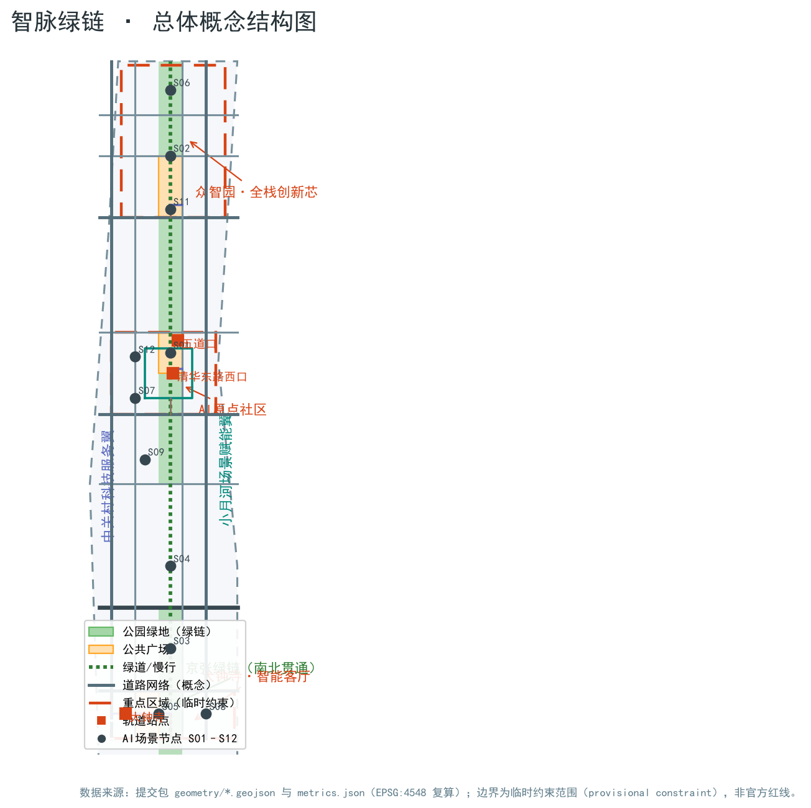
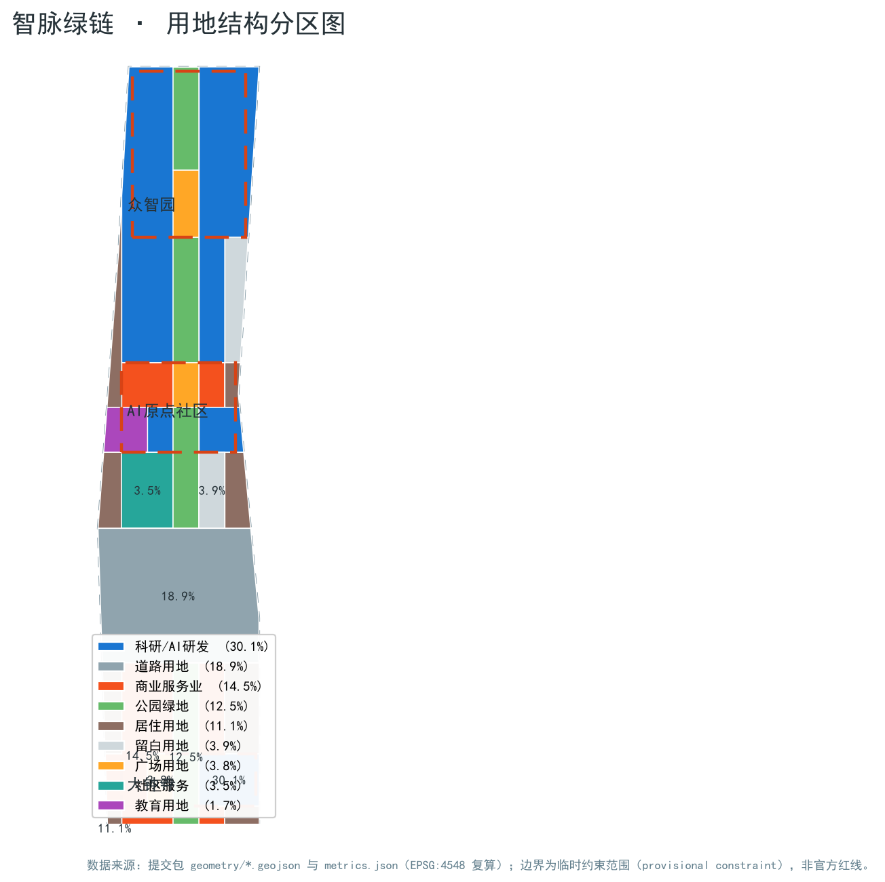
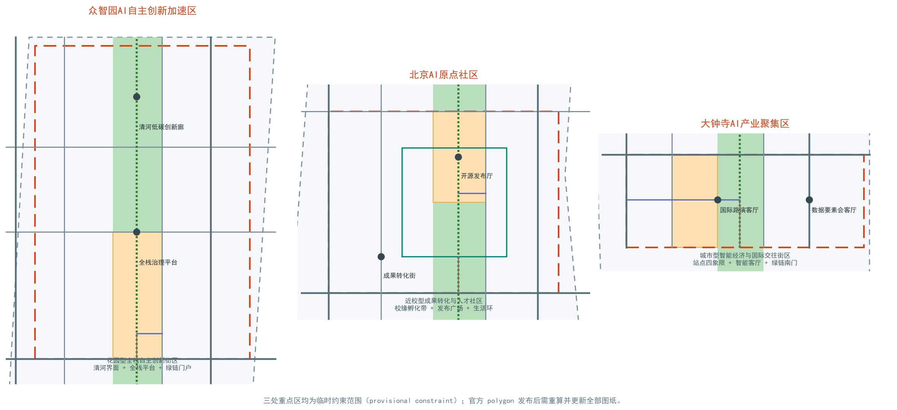
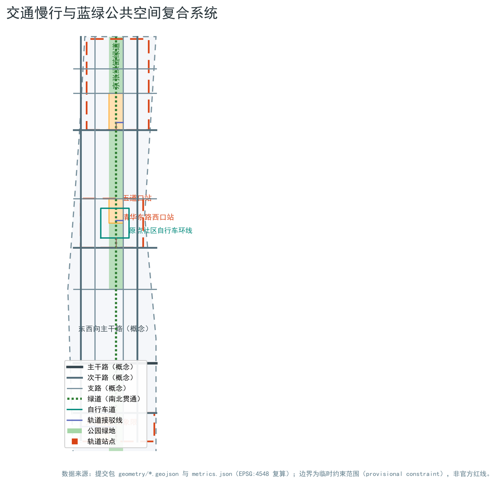
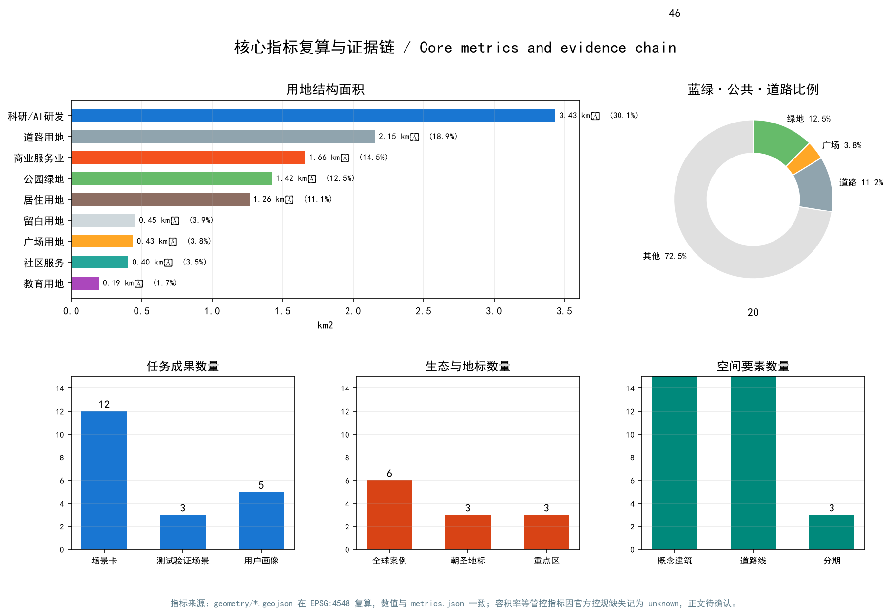

# 智脉绿链：百年京张AI创新带城市设计方案（AI Green Nerve Loop）

## 设计依据与资料清单

本方案以北京市规划和自然资源委员会海淀分局发布的《百年京张AI创新带城市设计国际方案征集资格预审公告》为项目主控依据，确认项目名称、三层范围、三处重点区、设计任务与成果深度 [source:OFFICIAL-ANNOUNCEMENT]。面向智能体的开源征集任务书由用户提供并已清权，是命名、场景卡、朝圣地标、文化叙事与长期运营六项任务的主依据 [source:AGENT-TASKBOOK] [standard:PROJECT-AGENT-OPEN-CALL-TASKBOOK]。国土空间用地分类、城市设计管理办法与控规编制审批办法作为专业标准，约束本方案用地代码、公共空间与风貌统筹语言，以及“已知控制—设计建议—待确认事项”的区分方式 [standard:MNR-LAND-USE-CLASSIFICATION-GUIDE] [standard:MOHURD-URBAN-DESIGN-MEASURES] [standard:MOHURD-CONTROL-DETAILED-PLANNING]。

中央来源登记表把资料分成 formal 可用、背景、provisional-only 与待复核四类 [source:SOURCE-REGISTRY]。本方案使用的三层范围与三处重点区几何来自维护者按公告文字四至、位置线索与约面积推定的临时粗略边界，登记状态为 provisional-only [source:BOUNDARY-SOURCE] [source:KEY-AREA-SOURCE]。这些边界仅用于本方案的生成、展示与临时自检；它不是官方红线、审批依据或精确面积依据。官方 polygon 发布后，本方案的全部图层与指标需要重算，正文中的面积与比例表述应随之更新。

本方案的机器可读证据保存在 `metrics.json`、`sources.json`、`assumptions.json` 与三个矩阵中，正文只保留与判断相邻的证据锚点。所有空间落点均可在提交包图层中复核 [data:geometry/site_boundary.geojson#SITE-001] [data:geometry/key_areas.geojson#PROV-KEY-001]；本方案仅使用公开或已清权可再分发的资料，不使用受限渠道资料。

## 三层范围工作框架

方案按公告三个层次组织工作：统筹研究范围（约43.6平方公里）回答产业生态与未来城市形态问题；总体设计范围（约11.4平方公里）完成城市更新与控规深度城市设计；重点区域范围（约368.4公顷）对三处重点片区开展精细化设计 [standard:PROJECT-OFFICIAL-ANNOUNCEMENT]。

三层范围逐级落实“产业战略—总体结构—片区设计”。统筹层建立“高校策源—开源协作—企业转化—公共体验—国际传播”的创新链，并把它对应到三区两翼；总体层把创新链落到用地、道路、蓝绿与分期图层；重点区层把图层进一步细化到建筑、广场、站点接驳与AI场景节点。三层共享同一个总体设计范围边界 [data:geometry/site_boundary.geojson#SITE-001]，重点区范围由三处重点区图层汇总表达 [data:geometry/key_areas.geojson#PROV-KEY-001]，面积关系由指标复核 [metric:key_area_count]。

当前三层边界均为 provisional constraint，正文与图纸中以淡色虚线标注，不得解释为已批准范围线。替换 official polygon 后，land use、buildings、roads、green/public space、phasing 与全部面积类指标需一次性重算，并重新生成图件与HTML。

## 统筹研究范围产业与未来城市研究

统筹研究范围的核心判断是：海淀已具备从原始创新到产业化的全链条基础，缺的不是单个园区，而是把高校策源、开源协作、企业转化、公共体验与国际传播串成一条可感知的城市走廊。因此本方案提出一带总体概念“智脉绿链”：主名称“百年京张AI创新带·智脉绿链”，英文名 AI Green Nerve Loop；命名体系由“一带、三核、两翼、多节点”构成——一带即京张绿链，三核即众智园全栈创新芯、AI原点社区、大钟寺智能客厅，两翼即中关村科技服务翼与小月河场景赋能翼，多节点即12张场景卡对应的城市体验点 [source:AGENT-TASKBOOK]。

Logo与视觉识别方向为原创概念建议：以京张铁路人字形越岭线与轨枕节奏为历史母题，叠加“节点—连线”的神经网络语言，形成“历史轨道+数据轨道”的双轨符号；主色采用京张铁锈红、海淀创新蓝与智脉绿三色体系。所有字体、图形与符号均建议采用开源或自绘资产，正式深化前须完成字体与商标清权 [depth:brand_identity_system]。

三大定位与五大功能在三区两翼协同回路中落实：AI原点社区承载“世界级AI创新生态”的策源与转化，众智园承载“AI全栈自主创新体系”与“AI治理全球话语权”的平台与治理，大钟寺承载“智能原生新业态”，中关村科技服务翼提供要素、资本与IP服务，小月河场景赋能翼承载“AI+场景赋能”与“智能化AI活力城市”的公共体验 [source:AGENT-TASKBOOK] [source:OFFICIAL-ANNOUNCEMENT]。

全球案例研究选取六个公开、可追溯的生态样本：美国硅谷斯坦福研究园（大学研究园+风投网络）、新加坡纬壹科技城 one-north（主题组团+公共平台）、深圳湾科技生态园（园区平台化运营）、英国伦敦国王十字知识区（铁路遗产更新+知识经济）、杭州未来科技城（高校+头部企业联动）、以色列特拉维夫创新区（创业密度+国际社区）。六个案例共同证明四条可转化经验：一是“公共客厅”比单体建筑更能聚集创新交往；二是轨道与铁路遗产是创新区最强的空间记忆；三是测试与展示空间需要向中小企业开放；四是品牌与活动体系决定国际识别度 [depth:innovation_ecosystem_cases]。上述案例仅作背景研究，不引用未经核实的投资与产值数字。

未来城市形态上，方案提出“可感知的AI城市”三原则：所有AI场景必须可体验、可人工复核、可随技术演进替换；城市公共空间优先承载开放测试与展示；数据使用遵循最小化与授权原则。AI+交通与连续绿色空间体系落到总体层的慢行与蓝绿图层，见后续章节。

## 总体设计范围城市更新与控规深度城市设计

总体设计范围的设计判断是：以京张遗址公园为更新主轴，把两侧低效空间、校园边界与社区首层作为主要更新对象，形成“绿链串珠、站点聚合、街区缝合”的空间结构。绿链串珠指沿公园廊道布置文化、展示与交往节点；站点聚合指五道口、清华东路西口、大钟寺等轨道站点周边组织一体化功能圈；街区缝合指用支路、步行与骑行连接校区、园区与社区 [data:geometry/roads.geojson#ROAD-001] [depth:overall_spatial_structure]。

用地结构以AI产业空间与蓝绿公共空间为双主体：科研用地（AI研发与孵化）约3.43平方公里、商业服务业用地约1.66平方公里、绿地约1.42平方公里、道路用地约2.15平方公里、居住用地约1.26平方公里，另有广场、社区服务、教育与留白用地支撑公共服务与弹性储备 [data:geometry/land_use.geojson#LU-05-01] [metric:land_use_area_0802_sqm] [metric:land_use_area_1401_sqm]。居住与产业空间沿绿链两侧混合布置，形成职住商服均衡的更新单元概念。

建筑更新采用“保留—改造—新建”的分类方法与概念示意，不作出地块级拆改留结论：历史文化资源（清华园车站旧址等）与结构完好的建成区建议保留；低效园区、社区首层与商业界面建议改造；留白用地与经专业团队确认的潜力地块才建议新建。建筑基底概念示意共46个、约72.8万平方米，按建筑类型假设层数后形成约576.5万平方米的概念总规模 [data:geometry/buildings.geojson#BLDG-001] [metric:building_footprint_area_sqm] [metric:total_floor_area_sqm]。容积率、建筑高度、建筑密度、绿地率与退线缺少官方控规条件，全部列为待确认事项 [metric:floor_area_ratio]。

交通与市政支撑采取“站点优先、慢行贯通、设施复合”策略：轨道站点周边组织步行、非机动车与公交接驳的一体化圈；支路网与绿道补足南北贯通与东西缝合；停车与非机动车停放纳入站点一体化设计。新型基础设施以端侧算力驿站、分布式能源与感知设备为概念原型，与传统市政设施复合布置；管线、排水、电力、燃气与消防条件缺官方资料，列为专业深化前置条件 [depth:traffic_rail_slow_parking] [depth:municipal_new_infrastructure]。

## 重点区域详细设计

三处重点区共用“定位—空间结构—建筑更新—交通慢行—公共空间—AI场景—实施风险”的七要素小方案结构，全部结论以概念建议表述 [data:geometry/key_areas.geojson#PROV-KEY-001] [data:geometry/key_areas.geojson#PROV-KEY-002] [data:geometry/key_areas.geojson#PROV-KEY-003]。

**众智园AI自主创新加速区**（临时范围约192.9公顷）定位为花园型全栈自主创新街区。空间结构为“清河界面+全栈平台+绿链门户”：北部临清河组织低碳创新廊与产业展示界面，中部布置全栈自主创新平台与治理沙盒，南部绿链门户承接慢行与活动 [data:geometry/green_space.geojson#GREEN-001]。建筑更新建议以改造低效园区与新建留白用地为主，形成花园式低密度组团；对外交通结合五环路区域一体化提出概念方向，道路线形与工程结论待专业复核。实施风险主要是官方边界、清河蓝线与五环工程条件缺失。

**北京AI原点社区**（临时范围约104.3公顷）定位为近校型成果转化与人才社区。空间结构为“校缘孵化带+发布广场+生活环”：西侧沿校园边界组织成果转化街与孵化空间，中部结合绿链布置发布厅与公共广场，外围组织人才居住与生活服务 [data:geometry/public_space.geojson#PUBLIC-002] [data:geometry/land_use.geojson#LU-0804-01]。建筑更新以低扰动有机更新为原则，重点改造园区与街区首层，补充成果展示发布与居住配套；围绕五道口、清华东路西口轨道站点组织一体化接驳。实施风险主要是校区边界、权属与轨道工程条件待确认。

**大钟寺AI产业聚集区**（临时范围约72.0公顷）定位为城市型智能经济与国际交往街区。空间结构为“站点四象限+智能客厅+绿链南门”：围绕大钟寺站组织四象限步行连通与非机动车停放，沿绿链南端布置国际路演客厅、智能终端与内容消费场景 [data:geometry/roads.geojson#ROAD-001] [data:geometry/public_space.geojson#PUBLIC-001]。建筑更新以重点企业周边公共环境与商业服务业态提升为主，规划绿地复合利用纳入概念设计。实施风险主要是站点改造、道路交叉口与商业运营协调。

## AI 创新生态、人才画像与 AI+ 场景

本方案提出五类用户画像，覆盖AI生态的主要使用者：

| 用户画像 | 典型需求 | 空间响应 | 数据与自检边界 |
| --- | --- | --- | --- |
| 开源开发者 | 发布、协作、测试、社区声誉 | 原点社区发布厅、公共代码墙、夜间协作空间 | 不采集个人行为轨迹，活动数据仅聚合统计 |
| 初创团队 | 低成本办公、算力入口、产品试验场 | 众智园共享测试场、端侧算力驿站、治理咨询 | 算力与数据服务另行授权 |
| 头部企业国际访客 | 展示、商务、国际接待、人才招聘 | 大钟寺国际路演客厅、站点接驳、企业周边公共空间 | 企业标识与案例须清权 |
| 周边居民 | 通勤、休闲、社区服务、低扰动更新 | 绿链慢行环、社区服务嵌入、活动分级照明 | 居民画像不用于商业推荐 |
| 高校师生 | 成果转化、跨校协作、日常慢行 | 校区-园区慢行缝合、转化驿站、AI教育体验点 | 校园数据与科研成果需授权 |

十二张AI场景卡把产业场景与城市功能场景落到具体空间：

| 编号 | 场景卡 | 空间载体 | 类型 | 人工复核与运营边界 |
| --- | --- | --- | --- | --- |
| S01 | 开源发布厅 | 原点社区发布广场 | 公共体验 | 发布内容人工审核，贡献数据聚合展示 |
| S02 | 安全治理沙盒 | 众智园治理平台 | 产业测试验证 | 红队测试分级开放，结果人工复核后发布 |
| S03 | 端侧算力驿站 | 绿链与社区节点 | 公共体验 | 算力配额制，使用记录匿名聚合 |
| S04 | AI慢行导航 | 京张绿链全段 | 公共体验 | 可解释导视，不追踪个人轨迹 |
| S05 | 大钟寺国际路演客厅 | 大钟寺站四象限 | 公共体验/商务 | 企业路演材料清权，双语传播 |
| S06 | 清河低碳创新廊 | 众智园北界面 | 公共体验 | 生态监测数据公开，活动预约制 |
| S07 | 近校成果转化街 | 原点社区校缘带 | 产业服务 | 成果信息经授权发布，法务与知识产权前置 |
| S08 | 数据要素会客厅 | 大钟寺片区 | 产业测试验证 | 数据流通沙盒，授权与审计链完整 |
| S09 | AI生活服务样板街 | 社区商业交汇处 | 公共体验 | 医疗、教育、法律服务人工复核后上线 |
| S10 | 全球AI活动周路线 | 一带公共空间 | 公共体验/运营 | 活动安全与版权清权，主办方责任明确 |
| S11 | 城市智能体治理仿真场 | 众智园南门户 | 产业测试验证 | 仿真数据脱敏，治理建议人工评审 |
| S12 | AI+教育医疗复合体验站 | 原点社区与西土城教育带 | 公共体验 | 教育与医疗数据最小化，专用授权 |

其中S02、S08、S11为产业测试验证场景，合计满足不少于10张场景卡、不少于3个测试验证场景的要求 [metric:scenario_card_count] [metric:test_validation_scenario_count]。每张场景卡均已映射到空间图层或合规矩阵条目，正文不再重复机器索引。所有场景均遵守数据最小化、公开来源、可解释与人工复核原则，不采集个人隐私、不依赖指定供应商、不表述为已批准运营 [depth:scenario_cards_and_personas]。

## 用地、建筑规模与拆改留方案

用地方案采用国土空间分类代码表达，完整覆盖提交边界且无重叠无缝隙 [standard:MNR-LAND-USE-CLASSIFICATION-GUIDE]。产业空间（科研与商业）合计约5.09平方公里，占总体设计范围约44.6%，支撑“AI产业空间集聚、公共服务均衡、蓝绿连续”的目标；蓝绿与广场约1.86平方公里，道路约2.15平方公里，居住与社区服务约1.67平方公里，留白约0.45平方公里 [metric:land_use_area_05_sqm] [metric:land_use_area_0701_sqm]。

建筑规模表达为概念示意而非审定指标：46个概念建筑基底合计约72.8万平方米，按类型假设3—10层层数后得到约576.5万平方米的概念总建筑面积 [data:geometry/buildings.geojson#BLDG-001] [metric:building_count] [metric:total_floor_area_sqm]。概念建筑密度约6.4%，远低于一般城市街区密度，原因是当前示意只表达可讨论的质量原型；正式容积率、建筑密度、高度与退线必须由官方控规确认 [metric:concept_building_density] [metric:floor_area_ratio]。

拆改留采用方法性分类：保留对象包括历史文化资源与结构完好的建成区；改造对象包括低效园区、社区首层与商业界面；新建对象仅指向留白用地与专业团队确认后的潜力地块。本方案不提供地块级拆除或重建结论，所有“更新对象”均以概念范围表达 [depth:retain_renovate_demolish]。现状建筑轮廓、权属、建成年代与用途缺失，列入正式深化前置条件。

## 交通、轨道、市政与公共服务设施

交通策略围绕三个问题展开：南北如何贯通、东西如何缝合、轨道站点如何成为城市客厅。南北贯通由绿链绿道与沿廊支路承担，京张遗址公园两侧的慢行断点（跨环路、跨轨道、跨主干路节点）以概念性节点方案提示优化方向 [data:geometry/roads.geojson#ROAD-013] [data:geometry/roads.geojson#ROAD-014]。东西缝合由次干路、支路与步行连接实现，重点连接校区—园区—街区。轨道站点一体化覆盖五道口、清华东路西口、大钟寺等站点，形成步行优先、非机动车有序、公交衔接的接驳圈 [depth:traffic_rail_slow_parking]。

道路网络以概念中心线表达，含东西向主干路、次干路与支路、南北向次干路、绿道、自行车环线与轨道接驳线共20条 [data:geometry/roads.geojson#ROAD-001] [metric:road_length_m]。道路面积按类型假设宽度计算约128.1万平方米，占总体范围约11.2% [metric:road_area_sqm] [metric:road_ratio]；该数值仅为概念估计，道路红线与断面待官方资料确认。

市政与公共服务设施提出“传统设施+新型基础设施”复合体系：创新服务平台（发布、路演、测试、知识产权）、人才生活服务设施（人才公寓、社区服务、体育文化）与端侧算力、分布式能源、感知设备等新型基础设施协同布局 [data:geometry/land_use.geojson#LU-0702-01]。市政管线、排水、电力、燃气、消防与海绵指标缺官方条件，全部列为待确认；任何设施结论均不构成工程可行性判断 [depth:municipal_new_infrastructure]。

## 蓝绿空间、公共空间与城市风貌

蓝绿体系的核心是“智脉绿链”：沿京张铁路遗址公园形成的南北贯通绿廊（概念宽度约250米），串联清河界面、小月河场景翼与三处重点区 [data:geometry/green_space.geojson#GREEN-001]。公园绿地概念面积约142.3万平方米，占总体范围约12.5% [metric:green_ratio]；公共广场约43.5万平方米，占3.8% [metric:public_space_ratio] [metric:public_space_area_sqm]。绿链同时承担慢行、测试展示、生态雨洪与文化叙事功能，是“都市AI生活体验带”的空间载体。

AI公共空间与朝圣地标提出三个概念节点：一是“清华园车站·AI原点纪念站”，依托清华园火车站旧址资源组织成果发布与荣誉展示（历史信息以公开文保资料为准）；二是“人字脊·智脉塔”，在京张绿链北端或南端标志性景观节点设置可交互的AI文化地标（概念形态，不涉及具体建设）；三是“大钟寺智能钟声广场”，在轨道站点四象限组织公共艺术与国际交往 [depth:ai_public_space_landmarks]。荣誉展示体系包括贡献者墙、开源榜、年度AI之环与开发者荣誉步道，全部为运营性概念建议。

城市风貌以“铁锈红的历史、海淀蓝的科技、智脉绿的生态”为基调：沿绿链控制建筑高度、体量与屋顶形态形成梯度界面，风貌控制建议全部表述为设计引导，不替代控规与文保要求 [standard:MOHURD-URBAN-DESIGN-MEASURES]。导视与符号系统建议从轨枕、道钉、人字形与神经节点提取元素，形成与Logo系统协调但独立的“文化导视子系统” [depth:cultural_narrative_signage]。

## 更新项目清单、实施政策与分期计划

更新项目清单以“先公共、后产业、再街区”为排序逻辑，提出十个概念项目：

| 项目 | 名称 | 类型 | 分期 | 主要依赖 |
| --- | --- | --- | --- | --- |
| JZ-01 | 绿链慢行断点缝合 | 公共空间/慢行 | 一期 | 道路红线、桥下空间、交通组织复核 |
| JZ-02 | 众智园清河创新界面 | 蓝绿/产业展示 | 一期 | 河道蓝线、生态与防洪条件 |
| JZ-03 | 原点社区发布广场 | 公共空间/品牌 | 一期 | 校区边界、权属、活动许可 |
| JZ-04 | 大钟寺站四象限步行连通 | 轨道一体化/慢行 | 一期 | 轨道站点、交叉口、管线 |
| JZ-05 | 近校成果转化街 | 城市更新/产业服务 | 二期 | 校区协同、权属、首层业态 |
| JZ-06 | 端侧算力与能源复合节点 | 新型基础设施 | 二期 | 能源、算力、安全与运营主体 |
| JZ-07 | AI生活服务样板街 | 社区更新/场景 | 二期 | 社区参与、服务许可、隐私合规 |
| JZ-08 | 西侧南北次干路缝合 | 交通/市政 | 二期 | 道路红线、市政管线、权属 |
| JZ-09 | 余量街区风貌协调 | 城市设计/风貌 | 三期 | 控规条件、文保要求、公众意见 |
| JZ-10 | 全球AI活动周公共路线 | 运营/品牌 | 一期启动 | 公共空间许可、安全、版权清权 |

分期与几何图层一致：一期为三处重点区与绿链核心段，面积约369.3万平方米；二期为创新廊道与站点周边缝合带，面积约448.0万平方米；三期为余量街区，面积约324.0万平方米 [data:geometry/phasing.geojson#PHASE-001] [metric:phasing_area_phase_1_sqm] [metric:phasing_area_phase_2_sqm]。实施政策建议包括城市更新统筹单元、公共空间换容积率引导、场景开放备案制与AI贡献积分体系，全部为政策方向性建议，不构成已确定的政府安排 [depth:phasing_implementation]。

长期运营设计回应“一带全球AI创新活动体系”：年度活动形成“春·开源季、夏·场景开放周、秋·AI创新带论坛、冬·开发者嘉年华”四季节奏；开发者社区以开源Issue协作、场景开放清单、贡献积分与荣誉体系运营；场景开放采用“申请—评审—沙盒—监测—复盘”闭环；国际传播通过多语内容、开发者大使与海外路演联动，把活动流量转化为孵化、加速与落地合作通道 [source:AGENT-TASKBOOK] [depth:global_event_operation]。

## 指标体系、面积复算与合规矩阵

核心指标分为三类：空间类指标可由提交几何直接复算，包括总体设计范围面积约1141.3万平方米、绿地比例约12.5%、公共空间比例约3.8%、道路比例约11.2%、建筑基底面积约72.8万平方米、概念总建筑面积约576.5万平方米、三处重点区面积与三期面积 [data:geometry/site_boundary.geojson#SITE-001] [metric:site_area_sqm] [metric:green_ratio]；任务类指标包括12张场景卡、3个测试验证场景、5类用户画像、6个全球案例与3个朝圣地标 [metric:scenario_card_count] [metric:persona_count] [metric:case_study_count]；管控类指标如容积率、建筑高度、建筑密度、绿地率与退线全部为待正式数据补齐，须由官方控规条件与专业团队确认后复算 [metric:floor_area_ratio]。

面积复算统一在 EPSG:4548 下进行，GeoJSON 交换坐标采用 EPSG:4326；临时边界面积与公告约面积偏差在0.02%—0.43%之间，属于推定误差范围，不升级为精确面积结论 [data:geometry/key_areas.geojson#PROV-KEY-001] [metric:key_area_count]。图件、HTML 与PDF中展示的数值均来自 `metrics.json`，正文解释设计含义，机器复核以结构化文件为准 [depth:metrics_recalculation]。

合规矩阵覆盖公告1.3、1.4、1.5全部必选任务与agent.1—agent.6六项任务；专业标准矩阵覆盖五项强制标准；设计深度矩阵的15个必选深度项全部标记为 complete。任一必选任务或标准缺失时，本方案不得进入正式专业评分。

## 风险、版权与合规说明

首要风险是空间数据缺口：三层范围与三处重点区均为 provisional 边界，官方 polygon、控规指标、道路红线、现状建筑、权属、市政管线与文保图层缺失；这些缺口不阻断内容评分，但阻断一切“官方红线、精确面积、法定控制、工程可行性”类结论 [source:BOUNDARY-SOURCE] [depth:risk_missing_data]。所有空间落点均标注为概念建议或参考方案，供专业团队深化，不构成政府审定结论。

版权与合规方面：本方案使用公开公告、用户清权任务书、官方标准快照与仓库维护者提供的临时几何；未使用OSM数据、商业地图截图、未清权字体、人物肖像或企业标识。图形与Logo方向为自绘原创概念，字体建议使用系统或开源字体；中英双语术语遵循仓库术语表。AI生成声明：本方案由AI智能体基于公开与清权资料生成，作者对事实、来源与表达负责 [source:SITE-PACKAGE] [standard:PROJECT-AGENT-OPEN-CALL-TASKBOOK]。完整版权说明见 `report/copyright_statement.md`。

本方案不声称官方批准、审定控规、最终土地权属、确认建设规模或承诺落地；所有活动、招商、政策与运营安排均为概念建议。HTML页面完全离线，无远程脚本、地图瓦片、字体、iframe、表单与追踪代码。

## 参考资料

- 北京市规划和自然资源委员会海淀分局：《百年京张AI创新带城市设计国际方案征集资格预审公告》（2026-05-09）
- 用户提供并清权的《面向全球智能体开展“百年京张AI创新带城市设计开源征集”的任务书摘录》（2026-05-18）
- 自然资源部：《国土空间调查、规划、用途管制用地用海分类指南》（自然资发〔2023〕234号）
- 住房和城乡建设部：《城市设计管理办法》（部令第35号）与《城市、镇控制性详细规划编制审批办法》（部令第7号）
- 北京市科委、中关村管委会：《“三区两翼”打造世界级AI集聚地》（2026-04-03）
- 海淀区人民政府：《海淀区发布“1+X+1”现代化产业体系建设布局》（2026-03-02）
- 仓库维护者：三层范围与三处重点区临时粗略边界及推定依据（2026-06-05/2026-08-07）
- Stanford Research Park、one-north、深圳湾科技生态园、伦敦国王十字、杭州未来科技城、特拉维夫创新区等公开案例介绍（仅作背景）
- 完整机器索引：`sources.json`、`metrics.json`、`compliance_matrix.json`、`standard_matrix.json`、`design_depth_matrix.json` [source:SITE-PACKAGE]
