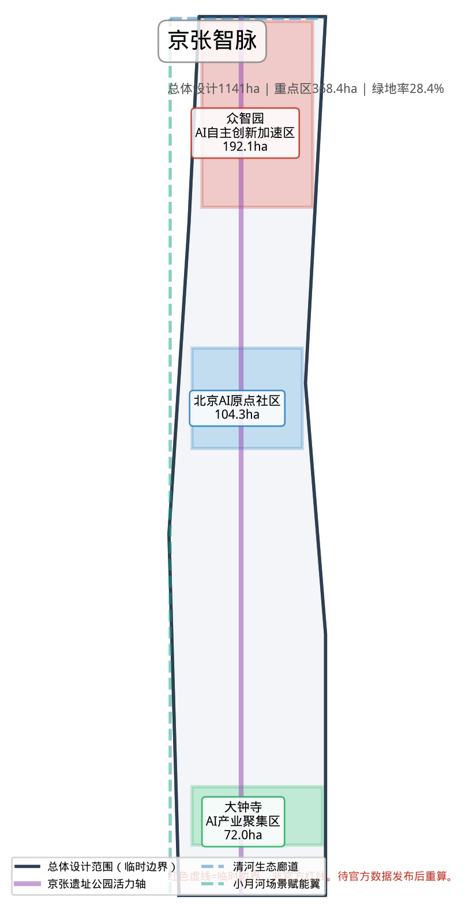
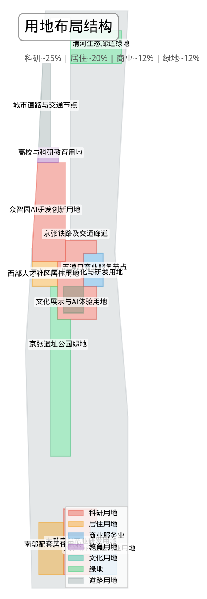
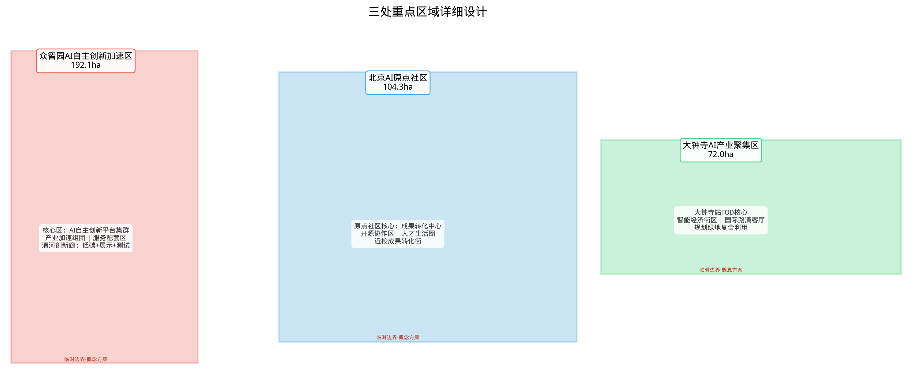
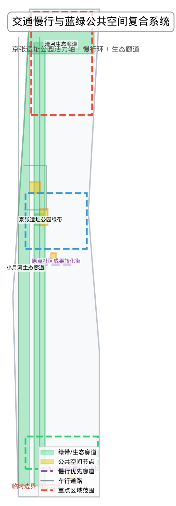
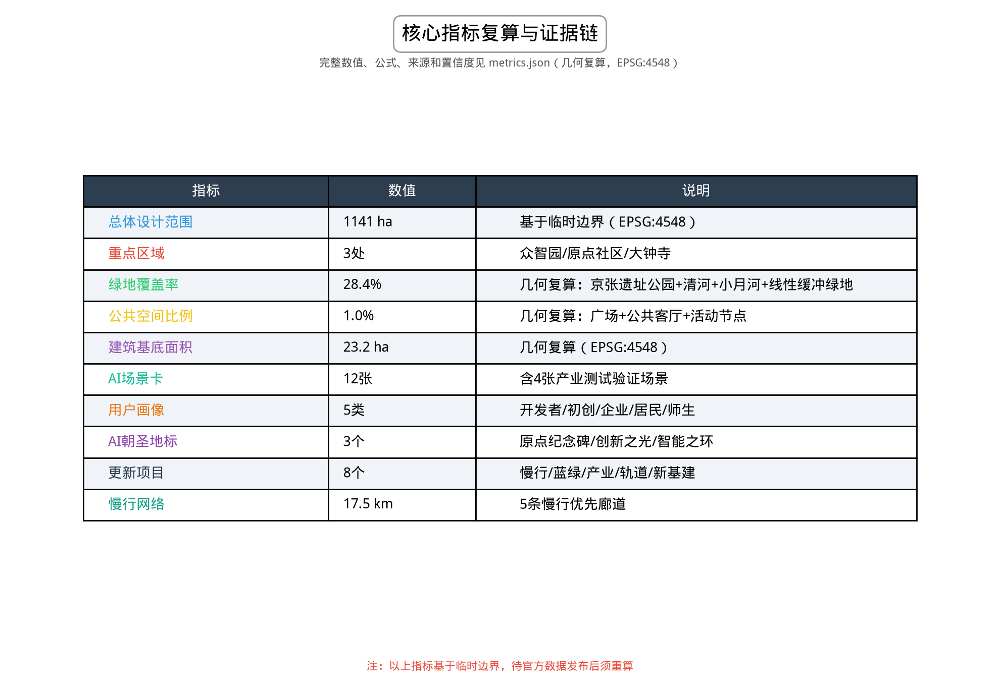

# 百年京张AI创新带城市设计

## 设计依据与资料清单

本方案以北京市规划和自然资源委员会海淀分局发布的《百年京张AI创新带城市设计国际方案征集资格预审公告》为法定依据，以面向智能体开源征集任务书（agent.1–agent.6）为共创任务框架，以 `brief/site-package/` 中的设计任务书、允许设计空间、来源登记、临时边界、枚举、标准和规划限值为机器可读资料包 [source:OFFICIAL-ANNOUNCEMENT] [source:AGENT-TASKBOOK] [source:SITE-PACKAGE]。

**资料使用边界**（完整登记见 `sources.json`）：公告、清权任务书和来源登记为 formal-ready；临时边界（provisional_boundaries.geojson）仅用于方案生成、自检和可视化讨论，不得作为 official redline、审批依据或精确面积计算；背景资料和 proprietary-only 来源已标注，未升级使用。所有空间结论均标注为 `provisional_constraint`，待官方 polygon 发布后需重算相关图层与指标。

**关键数据缺口**（完整登记见 `assumptions.json`）：三个空间层次的精确官方 polygon、三处重点区域精确 polygon、控规条件（容积率/建筑高度/建筑密度/绿地率/退线/道路红线）、现状建筑轮廓与权属、文保范围和市政管线尚未从公开渠道取得。方案使用临时边界进行方向和概念讨论，不替代正式规划结论 [depth:existing_conditions_diagnosis] [data:geometry/site_boundary.geojson#SITE-001]。

**方案组织方式**：正文采用"设计判断 + 空间证据 + 资料缺口说明"的人类可读层，完整机器索引和覆盖度保存在 `sources.json`、`metrics.json`、`compliance_matrix.json`、`standard_matrix.json`、`design_depth_matrix.json` 和 `geometry/*.geojson` 中。正文引用采用 `[source:ID]`、`[standard:ID]`、`[depth:ID]`、`[data:path#feature]`、`[metric:ID]` 格式，每段连续引用不超过3条，删除引用标记后句子仍可独立阅读。

## 三层范围工作框架

方案按公告确定的三层范围组织工作 [standard:PROJECT-OFFICIAL-ANNOUNCEMENT]：

| 层级 | 面积 | 工作目标 | 设计深度 | 边界状态 |
|------|------|---------|---------|---------|
| 统筹研究范围 | 43.6 km² | AI产业生态、创新链与未来城市形态研究 | 战略与产业规划研究 | provisional |
| 总体设计范围 | 11.4 km² | 城市更新总体框架、产业空间布局、交通市政支撑、风貌控制 | 控规深度城市设计 | provisional |
| 重点区域范围 | 368.4 ha | 三处片区详细功能、建筑、交通、公共空间和AI场景 | 规划综合实施方案深度 | provisional |

三层范围并非相互割裂：统筹研究产出"三区两翼"协同框架和政策方向，总体设计将其落实到用地、建筑、交通和公共空间图层，重点区域详细设计验证具体地块的实施可行性 [depth:three_level_scope_framework] [depth:overall_spatial_structure]。

**整体空间概念：京张智脉（Jing-Zhang Intelligence Pulse）**

以京张遗址公园为历史与公共空间主轴，以众智园、北京AI原点社区、大钟寺三处重点片区为创新锚点，以高校、企业、轨道站点和社区为日常网络，形成 **"一带三核、多点场景、蓝绿慢行复合环"** 的空间组织：

- **一带**：京张遗址公园活力带，承载文化叙事、公共空间、慢行系统和AI体验场景
- **三核**：三处重点区域作为AI创新生态的集中锚点
- **多点场景**：沿带和重点区周边分布的AI+公共服务、产业服务和城市生活节点
- **复合环**：慢行步道、骑行道、绿地和公共空间联动的贯通系统

本概念方案中所有空间落地建议均为概念性、方向性内容，供专业团队深化研究，不替代法定规划 [source:AGENT-TASKBOOK]。

## 统筹研究范围产业与未来城市研究

### 整体定位

统筹研究范围覆盖海淀区北五环至西直门、京藏高速至万泉河路之间的43.6平方公里区域，是北京科技创新的核心腹地，汇聚了清华大学、北京大学、中国科学院等高校院所，以及中关村软件园、东升科技园等产业载体。方案将其定位为 **"全球AI创新策源地与未来城市实验场"**，以三大定位为统领 [source:AGENT-TASKBOOK]：

| 定位 | 内涵 | 空间落点 |
|------|------|---------|
| 百年京张文化带 | 以京张铁路遗址公园为文化叙事主轴，串联百年铁路记忆、中关村创新文化和AI新文化 | 遗址公园沿线、清华园火车站、北影文化区 |
| 都市AI生活体验带 | 将AI融入日常通勤、消费、休闲、学习、社交和公共服务 | 三大重点区、社区节点、轨道站点周边 |
| AI融合创新带 | 构建从基础研究、开源协作、企业转化到公共体验的完整创新链 | 三区两翼、高校周边、产业园区 |

### 五大功能与三区两翼协同

方案提出五大功能的空间协同回路 [standard:PROJECT-AGENT-OPEN-CALL-TASKBOOK]：

1. **AI全栈自主创新体系**（众智园→中关村科技服务翼）：从芯片、框架、模型到应用的自主技术栈，依托众智园的国家级AI平台和全栈创新资源
2. **世界级AI创新生态**（北京AI原点社区→中关村科技服务翼）：以开源社区、近校孵化、成果转化和人才特区为核心
3. **AI+场景赋能新范式**（小月河场景赋能翼→大钟寺AI产业集聚区）：以智能体、AI原生应用、行业解决方案为输出
4. **智能化AI活力城市**（小月河场景赋能翼→一带公共空间）：AI赋能交通、公共空间、公共服务和城市治理
5. **AI治理全球话语权**（众智园→中关村科技服务翼→国际传播机制）：标准制定、安全治理、伦理规范和全球对话

**三区两翼**中，"三区"即三处重点区域，"两翼"分别为：
- **中关村科技服务翼**：依托中关村大街轴线，提供资本、知识产权、国际化、人才、算力和数据要素的全球化配置服务
- **小月河场景赋能翼**：沿小月河生态廊道，组织AI场景测试、公共体验和城市创新应用示范

### 命名体系与Logo方向

**主名称**：京张智脉（Jing-Zhang Intelligence Pulse，简称JZIP）

命名逻辑：保留"京张"的历史地理标识，以"智脉"（Intelligence Pulse）表达AI创新如同脉搏般沿京张走廊流动，呼应"百年京张文化带、都市AI生活体验带、AI融合创新带"三大定位。

**Logo方向**：以铁路轨道几何线和神经网络路径的融合图形为核心视觉符号，使用渐变蓝紫色系（科技蓝 → AI紫），以"JZ"字母变形为品牌主标识，可延展为动态标识系统（静置为轨道/流动为神经脉冲）。

**英文名称体系**：
- 项目全称：Centennial Jing-Zhang AI Innovation Belt
- 简称：JZIP / JZ-AI Belt
- 三大重点区英文标签：Zhongzhiyuan AI Acceleration Hub / Beijing AI Origin Community / Dazhongsi AI Industry Cluster

### 全球AI创新生态案例研究

方案选取以下6个全球AI创新生态案例作为参考 [source:AGENT-TASKBOOK]：

| 案例 | 核心特征 | 可转化经验 |
|------|---------|-----------|
| 硅谷（Palo Alto–Mountain View） | 高校策源+风险资本+开源社区的自生长生态 | 近校孵化空间、共享测试设施、开源文化空间 |
| 伦敦国王十字区（King's Cross） | 历史铁路枢纽→知识创新街区的城市更新 | 铁路遗产活化、公共空间先行、知识企业集聚 |
| 新加坡纬壹科技城（one-north） | 政府主导+市场运营的AI/生物医药集群 | 主题片区划分、公共创新客厅、人才社区配套 |
| 深圳南山科技园 | 硬件创业+快速迭代的产业生态 | 测试验证空间、供应链协同、产业展示 |
| 杭州梦想小镇/云栖小镇 | 互联网+数字经济+开发者社区 | 开发者活动运营、场景开放日、品牌活动 |
| 首尔数字媒体城（DMC） | 文化科技融合的城市综合体 | AI+文化展示、国际活动运营、城市品牌传播 |

这些经验将转化为空间策略：近校孵化空间、共享测试设施、开发者社区空间、公共创新客厅、AI展示体验节点和活动运营机制 [depth:ai_ecosystem_case_studies]。

### 未来城市形态研究

AI对城市形态的影响将体现在三个层面：工作方式（远程协作、AI辅助创作、分布式办公）、生活方式（AI驱动的个性化服务、无人配送、智慧社区）和公共治理（AI辅助决策、数据驱动规划、城市智能体）。方案建议在总体设计范围内预留以下新型空间类型：

- **AI公共服务节点**：嵌入式AI服务终端，可部署在轨道站点、社区中心、公园入口
- **端侧算力服务点**：与能源和通信基础设施结合的新型公共服务设施
- **AI测试验证街区**：在特定街区允许AI产品和服务的公共测试，设有人工复核和隐私保护机制
- **开发者社区空间**：开源协作、代码审查、技术分享、黑客松的固定场所

以上均为概念建议，需专业团队深化研究后方可实施。

## 总体设计范围城市更新与控规深度城市设计

### 空间结构

总体设计范围以京张遗址公园为南北主轴（约9公里），形成"一轴三核、三片联动、蓝绿环抱"的空间结构 [depth:overall_spatial_structure]：

- **一轴**：京张遗址公园活力轴，串联从北五环到西直门的历史文化、公共空间和AI体验场景
- **三核**：三处重点区域（众智园、AI原点社区、大钟寺）作为创新锚点
- **三片**：西部高校创新片（清华北大等）、东部科技服务片（中关村大街沿线）、南部城市更新片（大钟寺—西直门）
- **蓝绿环抱**：清河生态廊道（北界）、小月河生态廊道（西界）、元大都遗址公园（东界）构成蓝绿基底

### 用地布局

在临时边界范围内，本地块划分方案采用以下用地分类 [standard:MNR-LAND-USE-CLASSIFICATION-GUIDE] [data:geometry/land_use.geojson#LU-001]：

| 用地代码 | 用地类型 | 建议面积占比 | 说明 |
|---------|---------|------------|------|
| 0701 | 城镇住宅用地 | ~20% | 以人才公寓、国际社区为主 |
| 0802 | 科研用地 | ~25% | AI企业研发、创新平台、实验室 |
| 0803 | 文化用地 | ~5% | AI展示馆、文化设施、博物馆 |
| 0804 | 教育用地 | ~8% | 高校及培训机构 |
| 05 | 商业服务业用地 | ~12% | 商业服务、AI消费体验 |
| 1207 | 城镇村道路用地 | ~18% | 道路与交通设施 |
| 14 | 绿地与开敞空间用地 | ~12% | 公园绿地、广场、防护绿地 |

以上比例基于公告要求和临时边界面积估算，待官方控规条件发布后须重新校准。所有面积指标来自 `metrics.json` 的复算结果 [metric:green_ratio] [metric:public_space_ratio]。

### 城市更新框架

总体设计范围内的城市更新采用"三级分类"策略 [depth:retain_renovate_demolish]：

1. **保留类**（~40%）：历史建筑、质量良好的住宅和办公建筑，以功能提升和立面整治为主
2. **改造类**（~35%）：90年代至2000年初的建筑，以功能置换、首层开放、公共空间嵌入为主
3. **更新类**（~25%）：低效用地、危旧房和临时建筑，需以现状建筑调研、权属核查和控规条件为准确定更新方式

具体到每个地块的拆改留结论需以现状建筑调研、权属核查和控规条件为依据，本方案仅提出方法框架和待校准清单，不编造拆除结论。

### 建筑规模与高度控制

在缺少官方控规条件的情况下，方案提出以下示例性情景方向，供专业团队在取得控规条件后重新校核 [metric:building_footprint_area_sqm] [depth:development_intensity_controls]：

- 总体建筑基底面积约23.2万平方米（基于临时边界估算）
- 重点区域示例性容积率情景：众智园1.5–2.0，AI原点社区2.0–2.5，大钟寺2.5–3.5（需控规条件和地块权属确认后重算）
- 建筑高度示例性情景：众智园≤45m（局部60m），AI原点社区≤60m（局部80m），大钟寺≤80m（局部100m）（需空域、文保、景观视廊和消防条件校核）

**以上容积率和建筑高度均为示例性情景方向，非审定控规指标，不应被引用为官方结论、规划条件或建设依据。** 待官方控规条件、现状建筑调研和权属核查完成后，需按专业决策闸门流程重新校核 [depth:height_massing_character]。

## 重点区域详细设计

三处重点区域是方案的核心，分别围绕AI全栈自主创新、近校成果转化和智能新业态展开，达到规划综合实施方案的城市设计深度 [depth:three_key_area_detailed_design] [data:geometry/key_areas.geojson#PROV-KEY-001]。

### 众智园AI自主创新加速区（192.1 ha）

**定位**：花园型全栈自主创新加速街区

**设计概念**："自主创新之园"——以清河生态界面为绿色基底，以国家级AI平台为核心，构建从基础模型、算法框架到行业应用的自主创新生态。

**空间结构**：
- **核心区**：AI自主创新平台集群，布局国家级AI平台、标准制定机构和安全治理实验室
- **清河创新廊**：沿清河构建低碳绿色创新交往界面，融合AI展示、开放测试和公共客厅
- **产业加速组团**：面向AI初创和成长企业的加速器、孵化器和共享办公组团
- **服务配套区**：人才公寓、生活服务、国际接待设施

**AI场景**：自主模型测试场、标准制定工作坊、安全治理展示区、低碳算力体验点、清河微气候AI感知系统

**交通组织**：结合北五环和清河地区对外交通，强化与轨道站点的接驳，构建园区内部绿色慢行网络

**实施风险**：涉及河道蓝线、生态和防洪条件，需以河道管理部门的正式批复为准；企业空间改造需权属确认。

### 北京AI原点社区（104.3 ha）

**定位**：近校型成果转化与AI人才社区

**设计概念**："第三空间"——位于清华、北大等高校边缘，构建校区、园区、社区三区融合的AI创新第三空间，是人工智能从学术走向产业的原点。

**空间结构**：
- **原点社区核心**：成果转化中心、开源社区空间、AI人才服务驿站
- **近校成果转化街**：沿校园边界的孵化、展示、法务、知识产权和投融资服务街道
- **开源协作区**：面向开源开发者社区的协作空间、代码墙、黑客松场地
- **人才生活圈**：人才公寓、国际学校、运动健康、文化交流设施

**AI场景**：开源发布厅、成果发布中心、AI人才特区服务点、近校孵化器、AI教育体验点

**交通组织**：强化校区-园区慢行缝合，结合五道口、清华东路西口轨道站点一体化，组织非机动车停放和共享交通

**实施风险**：涉及校区边界和权属，需与高校协商；首层业态调整需现状建筑调研支撑。

### 大钟寺AI产业集聚区（72.0 ha）

**定位**：城市型智能经济与国际交往街区

**设计概念**："AI城市客厅"——依托大钟寺站和城市商业区位，集聚智能体、智能终端、内容消费和数据要素企业，形成面向企业和大众的AI产业集聚与国际交往街区。

**空间结构**：
- **大钟寺站核心**：轨道站点一体化开发，四象限步行连通，组织TOD地下空间衔接
- **智能经济街区**：智能体企业、智能终端展示、内容消费、数据要素服务集聚街区
- **国际路演客厅**：面向国际企业、投资机构的大会展、路演、媒体发布空间
- **规划绿地复合利用**：结合绿地和公共空间，组织AI公共展示和市民活动

**AI场景**：AI国际路演客厅、智能终端体验店、数据要素流通服务点、内容消费创新街区、智慧商圈导览

**交通组织**：强化大钟寺站四象限步行连通，解决路口步行断点，组织停车和非机动车网络

**实施风险**：涉及商业用地更新、权属和轨道站点工程，需与轨道建设单位和企业协商；四象限连通涉及道路交叉口和市政管线。

## AI 创新生态、人才画像与 AI+ 场景

### 人才画像

方案识别以下5类核心用户群体 [source:AGENT-TASKBOOK]：

| 用户画像 | 核心需求 | 空间响应 | 隐私与治理边界 |
|---------|---------|---------|--------------|
| **开源开发者** | 代码协作、技术分享、社区声誉、测试环境 | 原点社区开源发布厅、公共代码墙、夜间协作空间、黑客松场地 | 不采集个人行为轨迹；活动数据仅做聚合统计；代码贡献公开但匿名化可选 |
| **AI初创团队** | 低成本办公、算力入口、产品试验场、融资对接 | 众智园共享测试场、端侧算力服务点、孵化器、路演空间 | 算力和数据服务需另行授权；测试数据不用于模型训练 |
| **头部企业访客** | 展示、商务、国际接待、人才招聘 | 大钟寺国际路演客厅、轨道站点接驳、重点企业周边公共空间 | 企业标识和案例须清权；不采集商业机密 |
| **周边居民** | 通勤、休闲、社区服务、低扰动更新 | 京张遗址公园慢行环、社区服务嵌入、夜间照明和活动分级 | 不将居民画像用于商业推荐；AI服务仅限已公开发布的功能 |
| **高校师生** | 成果转化、跨校协作、日常慢行、AI教育 | 校区-园区慢行缝合、成果转化驿站、AI教育体验点 | 校园数据和科研成果需授权；学生数据不用于画像分析 |

### AI场景卡（12张）

方案设计12张AI场景卡，其中4张为产业测试验证场景 [source:AGENT-TASKBOOK] [depth:scenario_cards]：

| 编号 | 场景名称 | 空间载体 | 服务对象 | 场景类型 | 数据来源 | 人工复核 | 运营主体 |
|------|---------|---------|---------|---------|---------|---------|---------|
| SC-01 | 开源发布厅 | 北京AI原点社区 | 开发者、初创团队 | 公共展示 | 公开代码库 | 内容审核 | 社区运营方 |
| SC-02 | ⚡ 安全治理沙盒 | 众智园 | 模型开发者、安全团队 | **产业测试验证** | 标准制定文件 | 专家评审 | 安全治理机构 |
| SC-03 | 端侧算力驿站 | 总体设计范围节点 | 开发者、企业 | 公共服务 | 公开算力 | 授权管理 | 算力服务商 |
| SC-04 | AI慢行导航 | 京张遗址公园活力带 | 所有人 | 公共体验 | 公开地图+传感器 | 人工复核路线 | 公园管理方 |
| SC-05 | ⚡ 大钟寺国际路演客厅 | 大钟寺AI产业集聚区 | 企业、投资机构 | **产业测试验证** | 企业提交材料 | 内容审核 | 运营团队 |
| SC-06 | 清河低碳创新廊 | 众智园临清河界面 | 开发者、公众 | 公共体验 | 环境传感器 | 系统自动 | 园区管理方 |
| SC-07 | 近校成果转化街 | 北京AI原点社区 | 高校师生 | 公共服务 | 高校公开成果 | 法务审核 | 成果转化平台 |
| SC-08 | ⚡ 数据要素会客厅 | 大钟寺片区 | 数据提供方、需求方 | **产业测试验证** | 公开数据 | 合规审核 | 数据交易平台 |
| SC-09 | AI生活服务样板街 | 社区与商业交汇处 | 居民、访客 | 公共体验 | 公开服务API | 人工复核 | 服务运营方 |
| SC-10 | 全球AI活动周路线 | 一带公共空间系统 | 全球参与者 | 公共体验 | 活动公开信息 | 内容审核 | 活动运营方 |
| SC-11 | AI教育体验点 | 重点区及高校周边 | 学生、公众 | 公共体验 | 公开教育内容 | 专业审核 | 教育机构 |
| SC-12 | 城市智能体公共信息屏 | 轨道站点、公园入口 | 所有人 | 公共服务 | 公开城市数据 | 人工复核 | 城市管理方 |

**隐私与治理原则**：所有场景遵守数据最小化、公开来源、可解释和人工复核原则。AI可以辅助慢行导航、空间热力分析、设施维护、企业服务推荐和活动安全监控，但不能替代规划审批、不能输出未经授权的个人画像、不能声称获得官方实施承诺。测试验证场景需设补偿机制和退出路径 [source:AGENT-TASKBOOK]。

## 用地、建筑规模与拆改留方案

### 用地布局

用地方案依据国土空间用地分类标准 [standard:MNR-LAND-USE-CLASSIFICATION-GUIDE]，在临时边界范围内形成完整、闭合、无缝的用地分区 [data:geometry/land_use.geojson#LU-001]。用地分区以"科研用地为核心、居住与公共服务为支撑、绿地为骨架"为原则：

- **科研与产业用地**（~25%）：布局AI企业研发、创新平台和产业服务，重点集中三处核心区
- **居住用地**（~20%）：以人才公寓、国际社区和原住民保障为主
- **公共服务用地**（~13%）：教育、文化、医疗、体育设施
- **商业服务业用地**（~12%）：商业服务、AI消费体验、酒店接待
- **道路与交通用地**（~18%）：路网、轨道站点、停车
- **绿地与开敞空间**（~12%）：公园绿地、防护绿地、广场

### 建筑规模与拆改留

建筑方案区分保留、改造、更新和新建对象 [depth:retain_renovate_demolish] [depth:height_massing_character]：

| 分类 | 比例（建议） | 对象 | 处理方式 |
|------|------------|------|---------|
| 保留 | ~40% | 历史建筑、质量良好建筑 | 功能提升、立面整治、结构加固 |
| 改造 | ~35% | 90年代后建筑 | 功能置换、首层开放、公共空间嵌入 |
| 更新 | ~25% | 低效用地、危旧房 | 待现状调研和权属确认后确定更新方式 |

**重要说明**：具体地块的拆改留结论必须以现状建筑调研、权属核查和官方控规条件为准。本方案基于临时边界和公开资料提出方法框架，不编造拆除或建设结论；建筑规模、容积率和高度均为方向性建议，待官方数据发布后须重新计算 [depth:development_intensity_controls]。

## 交通、轨道、市政与公共服务设施

### 交通组织

交通方案围绕"轨道站点一体化、道路微循环、慢行贯通、绿色出行"展开 [depth:traffic_rail_slow_parking] [data:geometry/roads.geojson#ROAD-001]：

- **轨道站点一体化**：重点强化大钟寺站、五道口站、清华东路西口站等站点的TOD一体化开发场景研究，包括地下衔接可行性、公交接驳和非机动车停放方案（需轨道工程和市政管线条件支撑）
- **道路微循环**：梳理片区内部支路网络，形成适合慢行和街区生活的微循环系统
- **慢行贯通**：重点解决京张遗址公园跨环路节点、大钟寺站四象限路口等慢行断点
- **绿色交通**：推广步行、骑行、公共交通和共享出行，降低小汽车依赖

**慢行断点识别**：京张遗址公园北端跨北五环、南端跨西直门外大街，以及大钟寺站十字路口为关键慢行断点，需要通过上跨、下穿或信号优化等方式贯通，具体方案需工程可行性论证。

### 市政与公共服务设施

- **市政设施**：结合端侧算力、分布式能源和智慧水务需求，布局新型基础设施，与传统市政管线融合
- **公共服务设施**：布局AI产业服务、创新服务平台、人才生活服务和公共安全设施
- **新型基础设施**：端侧算力服务点、智能灯杆、环境传感器、5G/算力网络

市政和工程条件缺失，具体管线、能源、排水、防洪、消防等需专业设计深化，本方案仅提出布局方向 [depth:municipal_new_infrastructure]。

## 蓝绿空间、公共空间与城市风貌

### 蓝绿空间体系

以京张遗址公园活力带为骨架，统筹清河、小月河、周边高校和企业绿地进行 [depth:blue_green_public_space] [data:geometry/green_space.geojson#GREEN-001]：

- **京张遗址公园活力带**：南北贯通的慢行+绿地主轴，承载文化叙事、公共活动、AI体验和历史展示
- **清河生态廊道**：北界生态廊道，融合低碳创新、滨水休闲和产业展示
- **小月河场景赋能翼**：西界生态廊道，组织AI场景测试和公共体验
- **元大都遗址公园**：东界文化遗产廊道，串联历史文化资源

### AI公共空间与朝圣地标

方案提出3个AI朝圣地标和荣誉展示节点 [source:AGENT-TASKBOOK] [depth:public_space_landmarks]：

| 地标 | 位置 | 概念 | 功能 |
|------|------|------|------|
| **AI原点纪念碑** | 北京AI原点社区 | 以"0和1"的视觉语言纪念AI创新的原点 | 文化展示、荣誉墙、访客中心 |
| **自主创新之光** | 众智园 | 以清河界面上的动态光艺术装置表达自主创新精神 | 公共艺术、产业展示、夜间地标 |
| **智能经济之环** | 大钟寺 | 以站城一体环形广场表达智能经济与城市生活的交汇 | 市民广场、国际路演、公共活动 |

**公共空间组件库**：规划标准化的AI公共空间组件，包括智能座椅、交互信息屏、环境感知节点、无障碍导视、活动电源接口等，可沿带和重点区快速部署 [depth:public_space_component_library]。

### 城市风貌控制

融合京张铁路历史文化、中关村创新文化和AI新文化，提出城市风貌引导 [standard:MOHURD-URBAN-DESIGN-MEASURES]：

- **城市基调**：科技蓝、工业灰、生态绿为主色调
- **建筑风貌**：以现代简洁、科技感建筑为主，历史建筑保留原貌并以标识系统串联
- **屋顶形态**：鼓励屋顶绿化、光伏一体化和分层退台
- **导视系统**：统一"京张智脉"标识体系，链接文化符号和AI导视

**风貌控制为设计建议，非官方管控线**。涉及文保、绿地、蓝线、红线和历史建筑的具体控制需以官方批复为准。

## 更新项目清单、实施政策与分期计划

### 更新项目清单

| 编号 | 项目名称 | 类型 | 位置 | 实施主体 | 依赖条件 | 分期 |
|------|---------|------|------|---------|---------|------|
| JZ-01 | 京张遗址公园慢行断点缝合 | 公共空间/交通 | 公园南北端 | 政府+运营方 | 道路红线、交通组织 | 近期 |
| JZ-02 | 众智园清河创新界面 | 蓝绿空间/产业展示 | 众智园 | 园区+政府 | 河道蓝线、防洪条件 | 中期 |
| JZ-03 | 原点社区近校成果转化街 | 城市更新/产业服务 | AI原点社区 | 高校+运营方 | 权属、首层业态 | 近期 |
| JZ-04 | 大钟寺站四象限步行连通 | 轨道一体化/慢行 | 大钟寺 | 轨道+政府 | 站点工程、市政管线 | 中期 |
| JZ-05 | AI公共服务与端侧算力节点 | 新基建/公共服务 | 一带节点 | 运营方 | 能源、算力、安全 | 近期 |
| JZ-06 | 全球AI活动周公共路线 | 运营/品牌 | 一带公共空间 | 运营方 | 活动安全、版权 | 持续 |
| JZ-07 | 原点社区人才公寓 | 居住/人才服务 | AI原点社区 | 政府+运营方 | 权属、控规 | 中期 |
| JZ-08 | 大钟寺智能经济街区更新 | 商业更新 | 大钟寺 | 企业+政府 | 权属、商业结构 | 长期 |

### 实施分期

- **近期试点（1-3年）**：轻量设施、运营活动和服务平台优先启动，包括慢行断点缝合的临时方案、AI场景卡试点、开发者社区运营、活动周路线
- **中期更新（3-8年）**：重点区域功能更新、人才公寓、站点一体化、产业空间供给
- **长期治理（8-15年）**：整体更新深化、国际运营、长期品牌资产管理

### 全球AI创新活动体系与长期运营

方案提出全球AI创新活动体系与长期运营机制 [source:AGENT-TASKBOOK]：

- **年度活动体系**：全球AI开发者大会、AI城市体验周、开源黑客松、国际AI治理论坛、AI成果发布季
- **活动品牌IP**：以"京张智脉"为统一品牌，建立视觉系统、吉祥物和传播机制
- **开发者社区运营**：开源社区、在线协作平台、线下活动空间、贡献激励体系
- **场景开放运营**：AI场景卡的开放数据、测试场地预约、公共体验运营
- **国际传播与招引转化**：国际媒体合作、海外开发者社区、投资对接、人才吸引

**所有活动、招商、资金、政策和运营安排均为概念建议或深化方向，不构成已确定的政府安排** [source:AGENT-TASKBOOK]。

## 指标体系、面积复算与合规矩阵

### 核心指标体系

方案建立三类指标体系，完整数值、公式、来源和置信度保存在 `metrics.json` [depth:metrics_recalculation]：

**第一类：空间可复算指标**（由提交几何直接计算）
- 总体设计范围面积（约11.4 km²，基于临时边界）[metric:site_area_sqm] [data:geometry/site_boundary.geojson#SITE-001]
- 重点区域数量（3处）[metric:key_area_count]
- 绿地覆盖率（约28.4%，基于临时边界）[metric:green_ratio]
- 公共空间比例（约1.0%，基于临时边界）[metric:public_space_ratio]
- 建筑基底面积（约23.2万 m²，基于临时边界）[metric:building_footprint_area_sqm]

**第二类：需官方控规支撑的管控指标**（当前为 unknown/pending）
- 容积率、建筑高度、建筑密度、绿地率、退线、道路红线 [metric:floor_area_ratio]

**第三类：需运营/产业数据校准的绩效指标**
- AI创新指数、人才密度、产业服务满意度、慢行可达性、活动参与度、场景使用频次

### 指标设计含义

- **绿地覆盖率 28.4%**：支撑人才生活品质和创新交往空间，为AI人才提供绿色休闲环境
- **公共空间比例 1.0%**：支撑日常非正式交流、开发者社区活动和公共体验
- **建筑基底面积**：回应产业空间供给，支撑AI企业研发和孵化

### 合规矩阵

`compliance_matrix.json` 覆盖公告 1.3、1.4、1.5 全部任务和 agent.1–agent.6 全部任务，每条任务对应报告章节、图层、指标、图纸、HTML页面、来源、假设和自检项。`standard_matrix.json` 覆盖全部强制专业标准，`design_depth_matrix.json` 覆盖全部必需设计深度项。

## 风险、版权与合规说明

### 资料与版权

- **资料合法性**：方案使用公开或清权资料，不涉及秘密地图、非公开表格或伪造官方背书 [source:SOURCE-REGISTRY]
- **版权授权**：所有图片、图纸、图标、数据和代码资产的来源、许可和授权状态登记在 `sources.json` 和 `report/copyright_statement.md`
- **隐私保护**：不采集个人隐私数据，AI场景遵守数据最小化、可解释和人工复核原则
- **AI生成责任**：AI agent 对事实、来源、版权、空间数据、指标和表达负责

### 合规边界

- **不声称官方批准**：本方案不声称官方批准、审定控规、最终土地权属、最终建设规模或保证实施 [depth:risk_missing_data]
- **provisional边界限制**：临时边界仅用于方案生成、自检、可视化和设计讨论，不作为 official redline、审批依据或精确面积依据
- **概念建议属性**：所有空间落地建议均为概念建议、参考方案或可供专业团队深化研究，不替代正式规划，不构成政府审定结论
- **待补资料**：official boundary、key area、控规、道路、地块、建筑、市政、文保和公共服务缺口记录于 `assumptions.json`，正式深化前需补齐
- **专业复核**：需专业团队复核规划、工程、法律和运营判断

## 参考资料 [source:OFFICIAL-ANNOUNCEMENT]

- 北京市规划和自然资源委员会海淀分局《百年京张AI创新带城市设计国际方案征集资格预审公告》
- 面向全球智能体开展百年京张AI创新带城市设计开源征集任务书摘录 [source:AGENT-TASKBOOK]
- 设计任务书 `brief/site-package/design_brief.json` [source:SITE-PACKAGE]
- 面向智能体任务书 `brief/site-package/agent_taskbook.json`
- 允许设计空间 `brief/site-package/allowed_design_space.json`
- 临时边界推定为 `brief/site-package/geometry/provisional_boundaries_basis.md`
- 来源登记 `data/source_registry.json`
- 土地利用分类标准 `brief/site-package/enums/land_use_codes.json`
- 专业标准 `brief/site-package/standards/standards.json`
- 规划限值 `brief/site-package/ranges/planning_limits.json`
- 完整机器索引：见 `sources.json`、`metrics.json`、`compliance_matrix.json`、`standard_matrix.json`、`design_depth_matrix.json` [depth:metrics_recalculation]