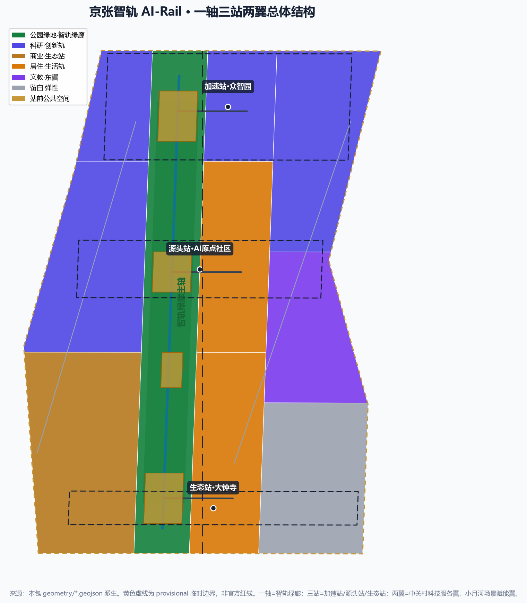
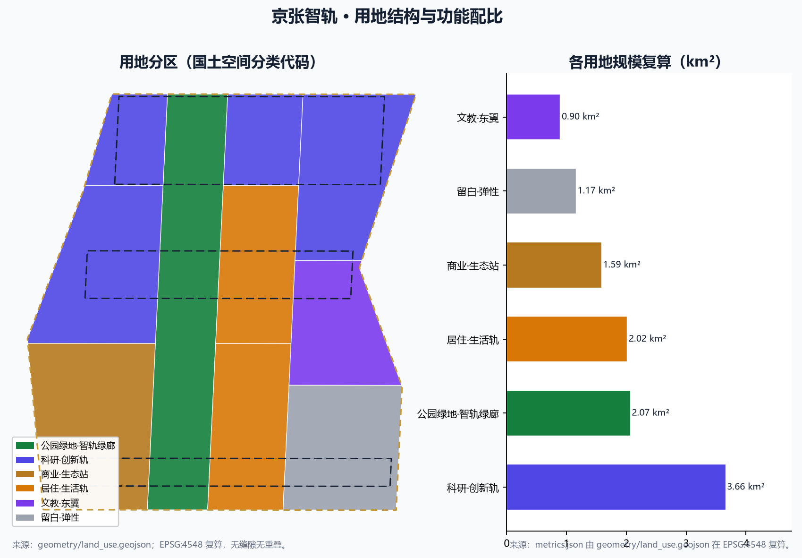
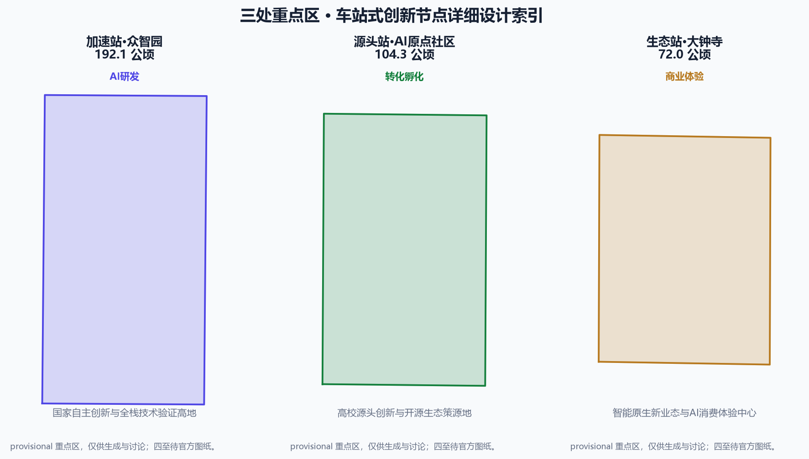
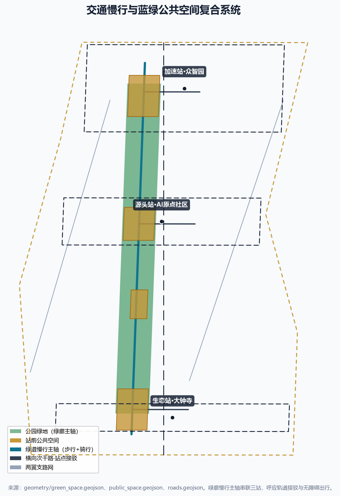
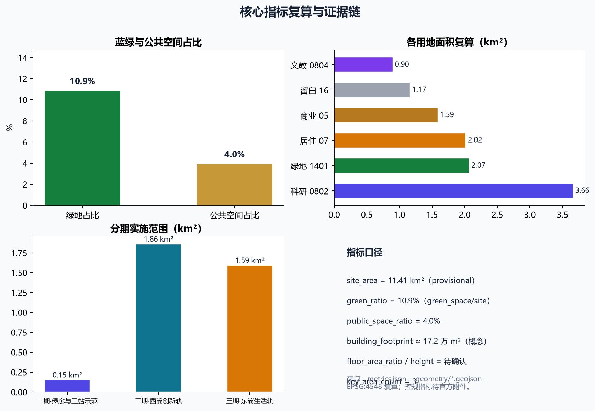

# JINGZHANG AI-RAIL: From Steel Rail to AI-Rail — Urban Design for the Centennial Jing-Zhang AI Innovation Belt

## Design Basis and Source List

This proposal is prepared on the basis of the "Pre-qualification Announcement for the International Urban Design Open Call of the Centennial Jing-Zhang AI Innovation Belt" issued by the Haidian Branch of the Beijing Municipal Commission of Planning and Natural Resources, the excerpted agent open-call taskbook, and the public and cleared materials registered in the repository. All formal authoritative conclusions rely only on sources marked `usable_for_formal="yes"` in `data/source_registry.json`; background and provisional materials are used within their permitted boundaries. Because no official precise polygon is yet public, all spatial boundaries adopt the clearly-labelled provisional rough boundaries provided by the repository [source:OFFICIAL-ANNOUNCEMENT] [source:AGENT-TASKBOOK] [source:BOUNDARY-SOURCE].

Design judgments follow the overall-coordination requirements for public space, building massing and city character in the *Measures for the Administration of Urban Design*, the distinction between known controls, design proposals and pending items required by the *Measures for Compilation and Approval of Regulatory Detailed Plans*, and the land-use classification logic of the *Guidelines for Classification of Land Use and Sea Use*. All statements concerning statutory intensity, road alignments, retain/renovate/demolish actions, investment and development phasing are written as conceptual suggestions to be recomputed after official regulatory conditions, road redlines, ownership and engineering materials become available [standard:MOHURD-URBAN-DESIGN-MEASURES] [standard:MOHURD-CONTROL-DETAILED-PLANNING] [standard:MNR-LAND-USE-CLASSIFICATION-GUIDE].

The complete source, metric, standard, design-depth and task-coverage indexes are carried by `sources.json`, `metrics.json`, `compliance_matrix.json`, `standard_matrix.json` and `design_depth_matrix.json`; the narrative retains only directly relevant evidence markers next to key judgments so that professional reviewers can verify each claim [depth:existing_conditions_diagnosis] [depth:metrics_recalculation].

## Three-Level Scope Framework

The proposal is delivered across the three levels defined in the announcement: the coordinated research area (approx. 43.6 km², bounded by the North Fifth Ring Road, Jingzang Expressway, Xizhimen Outer Street and Wanquanhe Road) hosts industry-ecosystem, three-areas-two-wings and future-city research; the overall design area (approx. 11.4 km², the 1–2 km band around the Jing-Zhang heritage park) hosts regulatory-plan-level urban design; and the key detailed-design area (approx. 368.4 ha, from north to south: Zhongzhiyuan, AI Origin Community and Dazhongsi) hosts detailed design of the three key areas [source:OFFICIAL-ANNOUNCEMENT] [standard:PROJECT-OFFICIAL-ANNOUNCEMENT].

Because the official precise polygon is not yet public, this proposal uses the provisional rough boundaries in `brief/site-package/geometry/provisional_boundaries.geojson`: both `geometry/site_boundary.geojson` and `geometry/key_areas.geojson` are marked `official_boundary=false` and `geometry_role=provisional_constraint`, for generation, display and intake self-check only. When official polygons arrive, the site boundary, key areas, land use, roads, green space, public space, buildings, phasing and all area metrics must be uniformly recomputed [source:BOUNDARY-SOURCE] [depth:three_level_scope_framework].

## Coordinated Research Area: Industry and Future City Research

**Overall concept and naming system.** The proposal puts forward the core concept "JINGZHANG AI-RAIL": upgrading the Jing-Zhang Railway — China's first self-designed mainline railway built a century ago under Zhan Tianyou — into an "AI-RAIL" innovation spine for the artificial-intelligence era. The naming system follows "one main name, three belts, three stations, two wings": the main name is "JINGZHANG AI-RAIL"; the three belts are the "Memory Rail" (Centennial Jing-Zhang cultural belt), the "Life Rail" (urban AI life experience belt) and the "Innovation Rail" (AI convergence innovation belt); the three station-style innovation nodes correspond to the three key areas (Acceleration Station · Zhongzhiyuan, Origin Station · AI Origin Community, Ecosystem Station · Dazhongsi); and the two wings are the Zhongguancun Technology Service Wing and the Xiaoyuehe Scenario Empowerment Wing. The visual-identity direction uses a "rail cross-section + code angle bracket `</>`" motif in historic cast-iron ochre and AI pulse-cyan, with a zigzag rail line symbolizing the iterative innovation loop [source:AGENT-TASKBOOK] [standard:PROJECT-AGENT-OPEN-CALL-TASKBOOK] [depth:overall_spatial_structure].

**Three positionings, five functions and the three-areas-two-wings loop.** The proposal maps the three positionings (Centennial Jing-Zhang cultural belt, urban AI life experience belt, AI convergence innovation belt) and the five functions of the taskbook (full-stack self-reliant AI innovation, world-class AI innovation ecosystem, AI+ scenario empowerment paradigm, intelligent vibrant AI city, and global voice in AI governance). The three areas and two wings form an "origin–acceleration–ecosystem" innovation loop: the AI Origin Community receives university source innovation, Zhongzhiyuan completes full-stack self-reliant technology development and validation, and Dazhongsi converts results into AI-native new formats; the Zhongguancun Technology Service Wing supplies capital, IP and global factors, while the Xiaoyuehe Scenario Empowerment Wing connects AI scenarios to real urban life, which flows back as new source topics [source:AGENT-TASKBOOK] [standard:PROJECT-AGENT-OPEN-CALL-TASKBOOK].

**Global AI innovation ecosystem cases (5–8).** The proposal distills eight transferable experiences: ① Silicon Valley — symbiosis of research universities and venture capital; ② Singapore one-north — a government-led "knowledge triangle" of integrated industry and city; ③ South Korea's Pangyo Techno Valley — highly concentrated factors in a single park; ④ Shenzhen Nanshan (Yuehai) — coordinated hardware-software industry chains; ⑤ Hangzhou Future Sci-Tech City — anchor-enterprise ecosystem plus talent policy; ⑥ **London King's Cross — the directly comparable case of a railway-heritage regeneration into a science and technology district**; ⑦ Munich/Bavaria — deep industry-academia-manufacturing integration; ⑧ Bengaluru — large-scale software talent agglomeration. These are translated into spatial (three station nodes), operational (scenario opening) and institutional (developer community) levers; among them the King's Cross "railway heritage + tech renewal" path is most isomorphic with this project [source:AGENT-TASKBOOK] [depth:overall_spatial_structure].

**Future city form.** The proposal introduces the "AI-Rail city": treating AI as infrastructure in the way railways once were. Railways connected the flow of people and goods through tracks; the AI era connects innovation flows through data, compute and agents. The overall spatial structure is "one spine, three stations, two wings": one AI-Rail greenway spine running through the heritage park, three station nodes hosting functional clusters, and two sidings linking scenarios and factors. This structure responds to the announcement's requirements on AI culture, AI society, AI city and implementable scenarios, and offers a "transport corridor–innovation corridor–cultural corridor" tri-corridor synthesis for comprehensive planning and spatial-industry integration [source:OFFICIAL-ANNOUNCEMENT] [depth:overall_spatial_structure].

## Overall Design Area: Urban Renewal and Regulatory-Plan-Level Urban Design

**Spatial structure and land use.** Within the overall design area, the proposal uses the Jing-Zhang heritage park as the greenway spine and organizes land use on both sides: to the west, from north to south, the Zhongzhiyuan acceleration zone, the AI Origin Community and the Dazhongsi ecosystem zone as three innovation land clusters; to the east, a talent community, university-linked education and public services, and the Xiaoyuehe scenario-empowerment industry zone, with flexible reserve land in the south-east for new AI formats. Land-use zones adopt national land-use classification codes and fully cover the overall design area with no gaps and no overlaps through `geometry/land_use.geojson` [standard:MNR-LAND-USE-CLASSIFICATION-GUIDE] [depth:land_use_layout] [data:geometry/land_use.geojson#LU-001].

**Development intensity and building massing (conceptual scale).** Because official regulatory conditions are not yet available, statutory control indicators — floor-area ratio, building height, building density — are all recorded as `status=unknown` and listed in `assumptions.json` as pending official data. The proposal provides only conceptual building footprints and massing intent recomputed from geometry, labelled as low-confidence design quantities that do not constitute statutory control values: the conceptual building footprint is about 172,000 m², concentrated at the three station nodes and the west innovation wing, with a "station-city integration" of compact blocks and a stepped skyline along the greenway [metric:building_footprint_area_sqm] [depth:development_intensity_controls] [depth:height_massing_character].

**Retain-renovate-demolish logic.** Renewal is framed as four actions — "retain, weave, complement, new": retain railway heritage elements, university enclaves and mature residential areas; weave the east and west sides severed by the railway back together through a slow-mobility network; complement talent housing, community services and public-service gaps; and build new AI R&D, exhibition and experience facilities at node cores. Parcel-level retain/renovate/demolish actions, road alignments and investment estimates require the official baseline survey; this proposal only offers directional strategy [source:OFFICIAL-ANNOUNCEMENT] [depth:retain_renovate_demolish].

## Detailed Design of Key Areas

Each of the three key areas forms a readable mini-proposal of "positioning + spatial structure + building renewal + transport and slow mobility + public space + AI scenarios + implementation risk", all as conceptual suggestions [data:geometry/key_areas.geojson#PROV-KEY-001].

**Acceleration Station · Zhongzhiyuan AI Self-Reliant Innovation Acceleration Area (approx. 192.1 ha).** Positioned as a national self-reliant innovation and full-stack technology-validation highland. The spatial structure is "one core, two wings": the core houses full-stack R&D and compute-collaboration clusters, and the two wings link the greenway slow-mobility system and the Qinghe ecology. Building renewal prioritizes upgrading existing stock with selective new construction; transport is organized through the North Fifth Ring Road, rail and greenway connections; public space consists of station-front plazas and R&D courtyards; AI scenarios focus on self-reliant large-model training and safety evaluation. Implementation risks include compute and power capacity, the entry phasing of large research platforms, and cross-owner coordination [source:OFFICIAL-ANNOUNCEMENT] [depth:three_key_area_detailed_design].

**Origin Station · Beijing AI Origin Community (approx. 104.3 ha).** Positioned as the source of university innovation and the cradle of the open-source ecosystem. The spatial structure is a "university-adjacent origin community": conversion lounges, open-source community, talent apartments and incubators are organized next to the university cluster. Transport emphasizes rail-station integration and slow-mobility priority; public space is composed of innovation plazas, exchange courtyards and open greens; AI scenarios focus on university-industry roadshows, open-source releases and talent-life services. Implementation risks include the ownership and governance innovation for coupling university and urban space, jobs-housing balance, and night-time vitality [source:OFFICIAL-ANNOUNCEMENT] [depth:three_key_area_detailed_design] [data:geometry/key_areas.geojson#PROV-KEY-002].

**Ecosystem Station · Dazhongsi AI Industry Cluster (approx. 72.0 ha).** Positioned as an AI-native new-format and city-level AI consumption-experience center. The spatial structure is "four-quadrant crossroads + station-city integration": four quadrants of functional clusters organized around Dazhongsi station, mixing retail, experience, office and greens. Building renewal prioritizes renovation and adaptive reuse; public space strengthens the station-front plaza and greenway connection; AI scenarios focus on AI-native retail, a data-element theater and robotic services. Implementation risks include coordinating high-density station-area development with heritage, green-line, blue-line and traffic-safety constraints [source:OFFICIAL-ANNOUNCEMENT] [depth:three_key_area_detailed_design] [data:geometry/key_areas.geojson#PROV-KEY-003].

## AI Innovation Ecosystem, Personas, and AI+ Scenarios

**AI innovation ecosystem map.** The ecosystem is organized as a closed loop of "source (universities/institutes) — acceleration (full-stack validation) — conversion (scenarios and capital) — reflux (new topics)", supported by eight factor mechanisms for land, space, industry, capital, talent, compute, data and scenarios. The ecosystem cases and map are set out in the coordinated-research chapter above; the specific factor mechanisms are proposed as conceptual suggestions and do not constitute confirmed policy commitments [source:AGENT-TASKBOOK] [depth:overall_spatial_structure].

**User personas (5+).** ① University researchers and laboratory teams; ② AI founders and start-ups; ③ developer-community members and open-source contributors; ④ park enterprise employees and managers; ⑤ surrounding residents and public-service users (including age-friendly groups). Global visitors and developer pilgrims form a sixth target group serving international communication and pilgrimage-landmark operations [source:AGENT-TASKBOOK].

**AI+ scenario cards (10, including 3 industry test-and-validation scenarios).** Each card maps spatial location, service objects, data sources, privacy boundaries, human review and operating entities:

| No. | Scenario card | Type | Spatial placement | Service objects |
| --- | --- | --- | --- | --- |
| S-01 | Open-source release platform | Scenario | AI-Rail greenway · Developer Platform | Developers/enterprises |
| S-02 | City-agent sandbox | **Industry test & validation** | Origin Station · AI Origin Community | Enterprises/governance |
| S-03 | AI-Rail greenway AI guide | Scenario | Along the heritage park | Visitors/residents |
| S-04 | Low-speed robot delivery corridor | **Industry test & validation** | Ecosystem Station · Dazhongsi blocks | Residents/merchants |
| S-05 | AI safety evaluation corridor | **Industry test & validation** | Acceleration Station · Zhongzhiyuan | Enterprises/regulators |
| S-06 | University-industry conversion lounge | Scenario | Origin Station · Origin Community | Universities/enterprises |
| S-07 | Data-element theater | Scenario | Ecosystem Station · Dazhongsi | Public/enterprises |
| S-08 | Talent life butler | Scenario | Life Rail talent community | Talent/residents |
| S-09 | Low-carbon compute waystation | Scenario | Greenway nodes | Developers/public |
| S-10 | Accessible AI mobility | Scenario | Belt-wide slow network | Elderly/disabled |

The scenario-space-operation mapping, operating data and risks are recorded in `scenarios/*.json` and the relevant chapters; all test-and-validation scenarios emphasize controllability, oversight and human review, and do not present immature technology as ready for full deployment [source:AGENT-TASKBOOK] [depth:overall_spatial_structure].

## Land Use, Building Scale, and Retain-Renovate-Demolish Strategy

The overall design area is about 11.41 km². The land-use structure is dominated by greenway (1401 park green, approx. 2.07 km²), innovation land (0802 research, approx. 3.66 km²), residential (07/0701, approx. 2.02 km²), commercial (05, approx. 1.59 km²), education/culture (0804, approx. 0.90 km²) and reserve (16, approx. 1.17 km²); all areas are recomputed from `geometry/land_use.geojson` in EPSG:4548 [metric:land_use_area_0802_sqm] [metric:land_use_area_05_sqm] [depth:land_use_layout].

Building scale follows the principles of "compact nodes, stepped profile along the greenway, and enclosed blocks". The conceptual building footprint is about 172,000 m², concentrated at the three station nodes and the west innovation wing; building height and development intensity remain pending pending official regulatory plans, with only massing intent provided as material for professional teams to deepen. Retain-renovate-demolish follows the four actions of "retain, weave, complement, new"; parcel-level conclusions await the baseline survey and ownership data [metric:building_footprint_area_sqm] [depth:development_intensity_controls].

## Transport, Rail, Municipal Infrastructure, and Public Services

**Transport and slow mobility.** The proposal builds a transport skeleton of "greenway slow-mobility spine + three horizontal connectors + two-wing branch networks": the greenway spine is a north–south walking and cycling corridor, the three station nodes connect to rail stops through secondary roads, and the east and west wings are woven with branch roads. It responds to rail connection, slow-mobility gaps, barrier-free paths and event-day traffic organization, corresponding to the greenway, secondary-road and branch-road centerlines in `geometry/roads.geojson` [source:OFFICIAL-ANNOUNCEMENT] [depth:traffic_rail_slow_parking] [data:geometry/roads.geojson#ROAD-001].

**Municipal and new infrastructure.** The proposal suggests integrating distributed energy, edge compute, and low-altitude and ground agent infrastructure with conventional municipal utilities as part of "AI-Rail city" new infrastructure. All engineering alignments, municipal capacity and energy loads are pending professional assessment; only directions are proposed [depth:municipal_new_infrastructure].

**Public service facilities.** Education, healthcare, culture, sports and community-service facilities are configured around the talent communities, combined with barrier-free, multilingual public-service interfaces through AI scenarios, responding to age-friendly and inclusive requirements [source:OFFICIAL-ANNOUNCEMENT] [standard:BARRIER-FREE-ENVIRONMENT-LAW].

## Blue-Green Network, Public Space, and Urban Character

**Blue-green network.** The proposal uses the Jing-Zhang heritage park as the spine and the Qinghe and Xiaoyuehe rivers as the two-wing blue ribbons, forming a "one spine, two ribbons" blue-green network: about 2.07 km² of park green with a green ratio of about 10.9% and a public-space ratio of about 4.0%, connecting the three station nodes through a continuous slow-mobility system [metric:green_ratio] [metric:public_space_ratio] [depth:blue_green_public_space].

**Public space and AI pilgrimage landmarks.** The proposal puts forward at least three AI pilgrimage landmarks and honor-display nodes: ① the **Developer Platform** — an open-source release and model-evaluation node inside the heritage park; ② the **Agent Honor Wall** — a display system along the greenway commemorating open-source and agent contributions; ③ the **Zigzag Innovation Monument** — reconstructing the Qinglongqiao zigzag track as public art and an innovation milestone. A public-space component library and honor-display system are proposed as material for professional teams to deepen [source:AGENT-TASKBOOK] [depth:blue_green_public_space].

**Urban character.** The urban tone emphasizes the dual character of "rail memory + digital future": preserving the materiality and scale memory of railway industrial heritage while overlaying lightweight, intelligent AI-era interfaces. Building-character controls along the greenway step back, nodes remain compact, and interfaces stay transparent; the wayfinding and signage system fuses rail symbols with code language to create a recognizable skyline and street section. All character controls are conceptual suggestions pending official regulatory plans and heritage control lines [standard:MOHURD-URBAN-DESIGN-MEASURES] [depth:height_massing_character].

## Renewal Projects, Implementation Policy, and Phasing

**Renewal project list.** Following "retain, weave, complement, new", a project library is formed, including the greenway-spine through-journey project, renewal of the three station nodes, upgrading of the west innovation wing, strengthening of talent communities, the Xiaoyuehe waterfront scenario belt, and dynamic release of reserve land. Project type, spatial location, dependencies and implementing entities are conceptual suggestions corresponding to `geometry/phasing.geojson` [depth:renewal_project_list] [data:geometry/phasing.geojson#PHASE-001].

**Phasing.** Phase 1 centers on the AI-Rail greenway spine and the demonstration sections of the three station nodes; Phase 2 advances the west Innovation Rail with the Acceleration and Origin stations; Phase 3 completes the east Life Rail and the south segment of the Ecosystem Station. Phase areas are recomputed from geometry and recorded in `metrics.json` [metric:phase_1_area_sqm] [depth:phasing_implementation].

**Implementation policy and long-term operations.** Policy suggestions are presented conceptually across five mechanisms: scenario opening, data elements, developer community, AI-governance sandbox, and international communication. The long-term operation system includes an annual "AI-Rail Festival" (developer festival + scenario open day + competition roadshows), developer-community operation (open-source contribution points and honor system), scenario-open operation (real scenarios + sandbox), public experience routes, and international attraction-and-conversion mechanisms. All events, investment promotion, funding and policies are expressed as conceptual suggestions and do not constitute confirmed government arrangements [source:AGENT-TASKBOOK] [depth:renewal_project_list].

## Metrics, Area Recalculation, and Compliance Matrix

Metrics fall into four families: spatial-scale metrics (site area, land-use area by code, building footprint, green/public ratio, roads, phasing), innovation-ecosystem metrics (ecosystem cases, scenario cards, personas, landmark counts), renewal-implementation metrics (number of renewal projects, phase areas) and compliance-coverage metrics (tasks, standards, depth). All spatial-scale metrics are recomputed from `geometry/*.geojson` in the EPSG:4548 projection, and `metrics.json` records formulas, sources and confidence [metric:site_area_sqm] [depth:metrics_recalculation].

The design meaning of the indicators: green and public-space ratios support talent exchange and wellbeing, the innovation-land ratio supports industrial-space supply, the building footprint responds to the compact-node development logic, and reserve land provides flexibility for new AI formats. Core indicators agree with the validator's recomputation, and `visual/index.html` stays in sync with `metrics.json` through `data-metric`/`data-value` markers.

Task coverage: `compliance_matrix.json` covers all mandatory items of announcement items 1.3.1–1.5.3.3 and `agent.1`–`agent.6`; `standard_matrix.json` covers all mandatory professional standards; and `design_depth_matrix.json` marks all core depth items `complete`. The pass status of the four self-check gates (deterministic validation, spatial review, visual packaging check, professional evidence review) is recorded in `self_check.json` [source:AGENT-TASKBOOK] [depth:metrics_recalculation].

## Risk, Copyright, and Compliance

This proposal is a conceptual urban design generated by an AI agent. All spatial landing suggestions are "conceptual suggestions / reference schemes / material for professional teams to deepen", not a substitute for formal planning and not government-approved conclusions. Main risks and pending materials include: no official precise boundary yet (provisional boundaries to be replaced and recomputed), missing official regulatory-plan indicators (FAR/height/density/setback pending official attachments), pending road redlines and ownership, municipal engineering and investment estimates pending professional assessment, and exact key-area boundaries pending official drawings. These are listed in `assumptions.json` and `missing_data_checklist.csv` [source:SOURCE-REGISTRY] [depth:risk_missing_data].

Copyright and compliance: the proposal is based on public or cleared materials; the author bears responsibility for AI-generated content. The landmarks, signage, logo and scenarios are original conceptual directions and do not use unauthorized fonts, images, trademarks, persons or corporate marks. The tools/models, sources and rights boundaries of generated media are recorded in `report/copyright_statement.md`.

## References

1. Haidian Branch, Beijing Municipal Commission of Planning and Natural Resources, *Pre-qualification Announcement for the International Urban Design Open Call of the Centennial Jing-Zhang AI Innovation Belt*, 2026-05-09 [source:OFFICIAL-ANNOUNCEMENT].
2. open-city-ai/haidian, *Excerpted Agent Open-Call Taskbook*, 2026-05-18 [source:AGENT-TASKBOOK].
3. Ministry of Housing and Urban-Rural Development, *Measures for the Administration of Urban Design*.
4. Ministry of Housing and Urban-Rural Development, *Measures for Compilation and Approval of Regulatory Detailed Plans of Cities and Towns*.
5. Ministry of Natural Resources, *Guidelines for Classification of Land Use and Sea Use in Territorial Spatial Survey, Planning and Use Control*, 2023-11.
6. Standing Committee of the National People's Congress, *Barrier-Free Environment Construction Law of the People's Republic of China*, 2023-06.
7. Repository source registry `data/source_registry.json` and processed material pack `data/processed/agent_fact_pack.md` [source:SOURCE-REGISTRY].
8. Public materials on London King's Cross railway-heritage regeneration (background comparative case).
