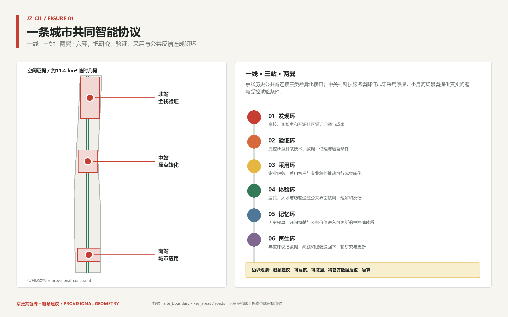
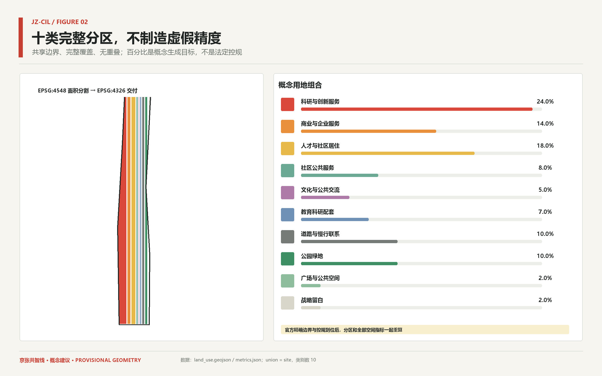
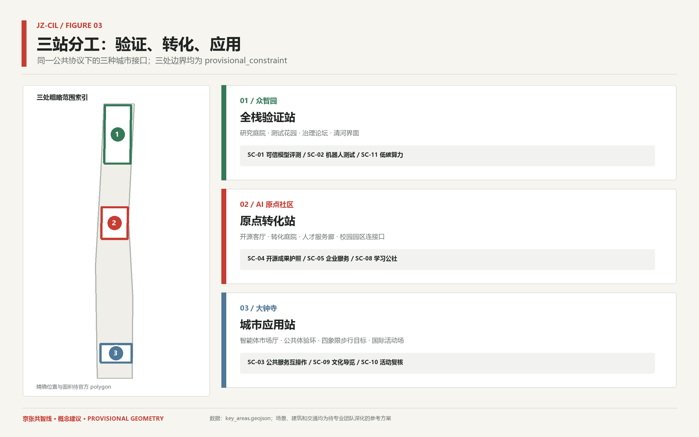
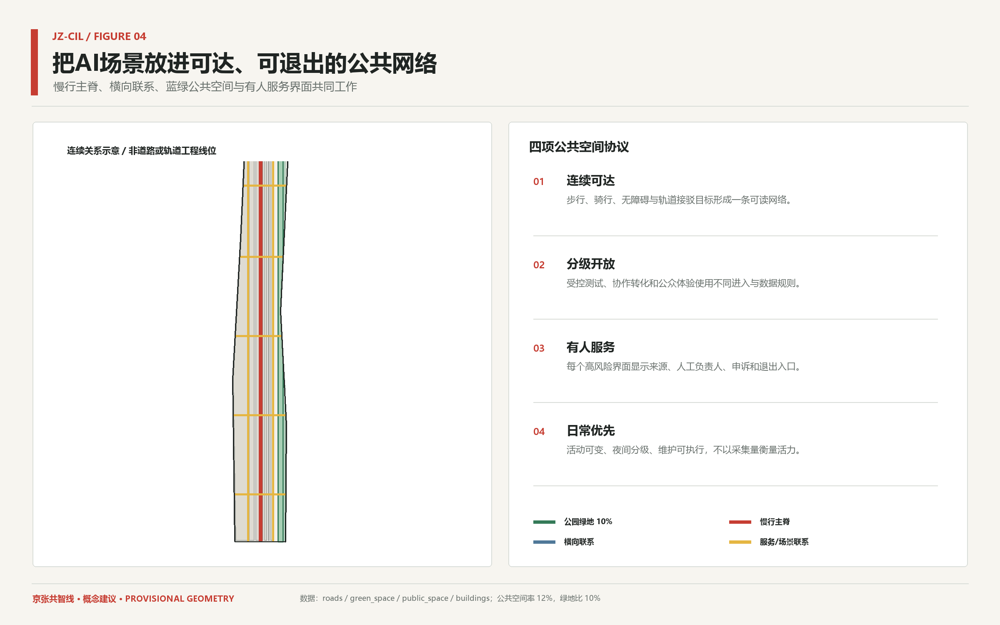
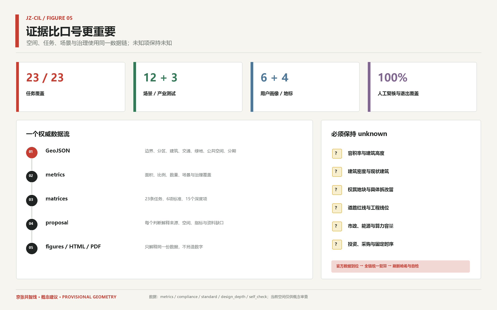

# Jing-Zhang Co-Intelligence Line

**Jing-Zhang Common Intelligence Line**
**A Verifiable, Participatory, and Growing Urban Intelligent Public Protocol**

> Boundary Note: The overall scope of this package and the three focus areas are `provisional_constraint` registered in the warehouse, not official precise spatial references. They are only used for concept generation, relative relationships, visualization, and entry self-check; content is subject to review, but all areas, proportions, buildings, traffic, project locations, and drawings must be recalculated and professionally refined once the official precise boundaries are in place.

## Design Basis and Source List

This proposal is based on the official call for submissions and the agent task book, using the warehouse machine-readable data package, public data registration form, and processed data package as navigation to form an "readable judgment—machine layer—recalculation index—drawing page—self-inspection record" Evidence Chain. [source:OFFICIAL-ANNOUNCEMENT] The proposal clarifies three layers of scope, three key areas, and the outcome requirements, while the agent task book [source:AGENT-TASKBOOK] supplements one overall concept, a world-class AI ecosystem, scenarios, Public Space, culture, and long-term operations as six tasks. The site package [source:SITE-PACKAGE], source registry [source:SOURCE-REGISTRY], and processed fact package [source:PROCESSED-FACT-PACK] are used to identify the authority level of the data, allow design space, and address data gaps. The public data index `brief/public-brief.md` [source:PUBLIC-BRIEF-INDEX] is only for verifying the background of the public draft and cannot replace the aforementioned formal task references. The scheme corresponds to the professional standards of [standard:PROJECT-OFFICIAL-ANNOUNCEMENT], [standard:PROJECT-AGENT-OPEN-CALL-TASKBOOK], [standard:MOHURD-URBAN-DESIGN-MEASURES], [standard:MOHURD-CONTROL-DETAILED-PLANNING], [standard:MNR-LAND-USE-CLASSIFICATION-GUIDE], and [standard:MOHURD-ARCH-DESIGN-DEPTH-2016]. The current conditions and data gaps are recorded in [depth:existing_conditions_diagnosis].

The current repository does not have the official precise overall polygon and three key areas polygon provided by the organizers. Therefore, [source:BOUNDARY-SOURCE] and [source:KEY-AREA-SOURCE] are entered into [data:geometry/site_boundary.geojson#SITE-001] and [data:geometry/key_areas.geojson#PROV-KEY-001] as `provisional_constraint`. The temporary overall geometric recalculated is approximately 11.413 square kilometers [metric:site_area_sqm], which is used for checking topology and relative proportions but does not replace the announced area or subsequent attachments. Once the official precise boundaries are in place, the nine layers, metrics, five figures, HTML, and PDF will be rebuilt using the same generation chain, and not just a single boundary map can be replaced.

The design theme is "common intelligence," not pasting technological facilities onto the city's surface. A century ago, the Jing-Zhang Railway turned engineering knowledge into publicly visible modern capabilities; today, the Co-Intelligence Line organizes research findings, public validation, Human Review, industrial adoption, public feedback, and urban memory into a traceable protocol. Each design action must specify the source of information, spatial carrier, service target, exit conditions, and items for further development; when strength, ownership, engineering, and financial information are missing, they must remain unknown and not be fabricated by intelligent agents.

## Overall Concept and One Line with Three Stations and Two Wings Six Loops

"The Jing-Zhang Co-Knowledge Line" conceptualizes the Jing-Zhang Railway Heritage Park and its surrounding Public Spaces as a continuous spine for public innovation, forming **One Line, Three Stations, Two Wings, and Six Loops**. The line carries a continuous pedestrian and bicycle path, cultural narrative, AI public experience, and annual activity route; the three stations are the northern Zhongzhiyuan "Full Stack Validation Station," the central AI Origin community "Origin Transformation Station," and the southern Dazhongsi "Urban Application Station." The two wings are the Zhongguancun Technology Services Wing and the Xiaoyue River Scenario Enablement Wing. They are not new administrative, railway, or track facilities but connect dispersed universities, parks, communities, businesses, and public service facilities into a differentiated collaborative network. [depth:overall_spatial_structure] [data:geometry/roads.geojson#ROAD-001]

Circular Six rings progress through discovery, validation, adoption, experience, memory, and regeneration: Researchers document issues and outcomes, controlled sandbox testing technologies and data boundaries, enterprise services and professional reviews drive the adoption of feasible results, the public understand and provide feedback through a manned interface, historical and open-source contributions enter an updatable milestone, and annual reviews return issues to research. Brand identity is expressed through open parentheses and two parallel tracks symbolizing historical tracks, data flows, and human judgment. Colors are warm white, charcoal black, railway signal red, and Public Space green; no enterprise logos, personal likenesses, or faux brand assets are used.

The Space Protocol emphasizes a three-tiered openness in the form of "controlled research interface—collaborative transformation interface—public experience interface." Core experimental and data spaces are not arbitrarily opened to the public, while the public interface must display the source, confidence level, update time, human point of contact, and entry points for appeals and exits. Thus, the front line is neither a landscape wrapper nor a corridor for technical demonstrations, but a method of urban operation that connects the innovation ecosystem with public interest.

## Three-Level Scope Framework

The Coordinated Research Area, Overall Design Area, and Key Regions correspond to the Network Governance Layer, Public Protocol Layer, and Demonstration Interface Layer, respectively. [depth:three_level_scope_framework] The Coordinated Research Layer outlines the innovation chain, talent and enterprise services, annual events, and cross-area governance within an announced 43.6 square kilometers, without drawing speculative boundaries; the Overall Design Layer generates a complete conceptual zoning, architectural typology base, pedestrian and green-blue network, Public Spaces, and relative phased development within a temporary polygon generated warehouse; the Key Regions Layer proposes positioning, spatial structure, scenarios, operations, and deepening conditions within three temporary polygons. [source:OFFICIAL-ANNOUNCEMENT]

Three levels are conveyed through the same Evidence Chain: the integrated strategy enters 23 task responses, the overall design is embedded in [data:geometry/land_use.geojson#LU-001], [data:geometry/roads.geojson#ROAD-001], and [data:geometry/phasing.geojson#PHASE-001], while the key areas are embedded in [data:geometry/key_areas.geojson#PROV-KEY-001]. The overall plan does not depict `provisional_constraint` as high-contrast control lines but instead features the Co-creation Line, three stations, two wings, cross-connections, scenarios, and public interfaces as the main elements of the plan, thereby reducing the risk of misinterpretation as an approval outcome.

The third layer is not a repetitive blueprint from large to small. The network governance layer addresses who collaborates with whom and how issues enter the agenda; the public agreement layer addresses which spaces support validation, transformation, experience, and everyday life; and the demonstrative interface layer addresses how each focus area forms testable small solutions. With official precise boundaries in place, the three-layer logic is maintained, and the spatial geometry and overall quantity are recalculated and confirmed by the planning, architecture, transportation, municipal, landscape, and operations professionals.

## Coordinated Research Area: Industry and Future City Research

A world-class AI Innovation Ecosystem does not equate to a list of leading companies or a single landmark, but rather a stable interface between research, validation, adoption, living support, and public trust. The six-one mobile mechanism cases are for comparative studies only and do not support local statutory controls, scale, or funding arrangements: [source:CASE-TORONTO-VECTOR], [source:CASE-MONTREAL-MILA], [source:CASE-KENDALL-SQUARE], [source:CASE-PARIS-SACLAY], [source:CASE-BRAINPORT], [source:CASE-STATION-F]. Case conversion follows the "extraction mechanism, addressing local issues, and listing conditions that cannot be replicated" method, and is limited by assumption A-CASES-001.

| Case | Transformable Mechanism | Local Boundary |
| --- | --- | --- |
| Toronto MaRS + Vector Institute [source:CASE-TORONTO-VECTOR] | Combine independent research institutions, enterprise adoption services, and city-level innovation networks into a research-to-adoption interface | For three-station shared validation protocol with the Zhongguancun Technology Services Wing, not duplicating institutional scale |
| Montreal Mila [source:CASE-MONTREAL-MILA] | A multi-institutional research network, open science, and responsible AI education collectively form the community infrastructure | For the AI Origin community, an inter-institutional open-source living room and mechanism for learning responsible AI |
| MIT Kendall Square [source:CASE-KENDALL-SQUARE] | High-Density Innovation District mitigates the research park's isolation through mixed-use functions, Public Spaces, and sustained community engagement | For the ground-floor public interface and talent living support in the original community and Dazhongsi |
| Paris-Saclay [source:CASE-PARIS-SACLAY] | To facilitate cross-institutional collaboration and connect dispersed research and educational resources sustainably | For cross-zone collaboration governance in the Three Zones and Two Wings, not by analogy with new city scale |
| Brainport Eindhoven [source:CASE-BRAINPORT] | Enterprises, higher education institutions, and public sectors form a regional collaboration around open innovation and a talent environment | An annual closed-loop for problem openness, testing, adoption, and talent services |
| STATION F [source:CASE-STATION-F] | Integrate entrepreneurial support, community services, and public activities within the historical industrial space | For the concept of the intelligent body market hall in Dazhongsi, the specific architectural design still awaits due diligence, cultural heritage review, fire safety, and structural assessment |

The comprehensive insights for Haidian are a continuous service chain: universities and laboratories generate research and open-source outcomes, Zhongzhiyuan provides controlled testing and responsible AI training, the AI Origin community offers licensing, compliance, intellectual property, talent, and entrepreneurial transformation, Dazhongsi provides public service interoperability, smart-native business models, and international exchange, Zhongguancun service wing reduces enterprise adoption friction, and Xiao Yuehe scenario wing feeds back real public issues. This network simultaneously focuses on housing, commuting, accessibility, third spaces, and international talent services, avoiding for innovation resources to become isolated islands from the community. [standard:MOHURD-URBAN-DESIGN-MEASURES]

The assessment of future urban forms will be: AI facilities need to be tiered and open, spaces need to support Human Review, scenarios need to be reversible, and public interfaces need to be explainable. Research spaces should not open without boundaries to facilitate dissemination, public experiences should not measure success by collecting more personal data, and business services should not package public policy explanations as decision substitutes. The overarching agenda will be composed of an annual public issue library, cross-institutional joint testing, first-use customer interfaces, public value assessments, and international communication, with specific institutions and activities still negotiated among relevant stakeholders.

## Overall Design Area: Urban Renewal and Regulatory-Plan-Level Urban Design

The overall design responds to the needs of industry, living, public services, culture, education, roads, green spaces, squares, and strategic blank spaces through ten complete conceptual zones. [depth:land_use_layout] Through EPSG:4548 planar division and shared boundary generation, [data:geometry/land_use.geojson#LU-001] is created, where the union of the ten polygons equals the temporary overall scope, avoiding the creation of false precision with mutually overlapping color blocks. Research and innovation services account for 24%, commercial and business services 14%, talent and community residence 18%, community public services 8%, culture 5%, education and research support 7%, roads and active transportation 10%, parks and green spaces 10%, squares 2%, and strategic blank spaces 2% are used to generate the target and discussion baseline, not to determine the final land use structure. [metric:land_use_area_sqm] [metric:land_use_category_count]

Urban Renewal takes the approach of "preserving first, low-disturbance adaptation, prioritizing public interfaces, and validating scenarios in small steps." The Building Footprint [data:geometry/buildings.geojson#BLDG-001] only expresses the typological relationships within the land that can be developed, without determining specific building units; traffic connections, green spaces, and Public Spaces are derived from [data:geometry/roads.geojson#ROAD-001], [data:geometry/green_space.geojson#GREEN-001], [data:geometry/public_space.geojson#PUBLIC-001], and [data:geometry/phasing.geojson#PHASE-001], respectively. Known conditions and temporary constraints are centralized in [data:geometry/constraints.geojson#CONSTRAINT-001] to maintain a layered relationship between design proposals and their source constraints.

The control depth in this phase is reflected as a structure of issues and evidence, rather than the intelligent body providing statutory values. [depth:development_intensity_controls] and [standard:MOHURD-CONTROL-DETAILED-PLANNING] requirements for Floor Area Ratio, height, density, setbacks, roads, utilities, and comprehensive carrying capacity are all kept as unknown in the metrics, to be confirmed after official attachments, current census, ownership, and professional assessments. Once the official precise boundaries are in place, the district proportions, Building Footprints, and connectivity lengths will be recalculated to avoid drift across map pieces.

## Detailed Design of Key Areas

Three key areas' `provisional_constraint` only express relative positions, names, north-south sequence, and conceptual interfaces, but do not represent parcel boundaries. [depth:three_key_area_detailed_design] Zhongzhiyuan is positioned as a "full-stack validation station," focusing on research courtyards, testing gardens, governance forums, and organizing trustworthy model evaluations, low-speed robot testing, low-carbon computing collaboration, and responsible AI learning; the controlled test zones are separated from the public explanation interface, with all tests having specific time segments, speeds, data, and deactivation conditions. [data:geometry/key_areas.geojson#PROV-KEY-001]

AI Origin community is positioned as an "Origin Transformation Hub," using an open-source living room, transformation courtyard, talent service corridor, and campus connection to support an open-source achievement passport, enterprise service Copilot, AI learning commune, and barrier-free slow travel. Spatial updates emphasize mixed-use functions, a ground-floor public interface, low-disturbance adaptation, and daily life support, without specifying particular building units based on temporary polygon designations. Dazhongsi is positioned as a "City Application Station," with an intelligent body market hall, public experience loop, quadrants of walking goals, and international event field to support public service interoperability, cultural tours, event reviews, and smart-native commercial trials. [data:geometry/key_areas.geojson#PROV-KEY-002] [data:geometry/key_areas.geojson#PROV-KEY-003]

Three small schemes all include location, Public Space, principles for building updates, pedestrian relations, AI scenarios, operational leverage points, and risk conditions. Zhongzhiyuan first verifies the technology and governance, while the Origin Community converts the outcomes into serviceable projects, and Dazhongsi integrates mature scenarios into the everyday urban interface for public feedback; the results are then fed back through the Co-Intelligence Line to the research agenda. Once the official precise boundaries are in place, the three local areas, project locations, building relationships, and traffic organization will be recalculated uniformly. The current focus is on verifying whether the differentiated mechanisms are complete.

## AI Innovation Ecosystem, Personas, and AI+ Scenarios

Six user categories are covered: researchers, developers and students, enterprise teams, residents and caregivers, operators, and international talents and visitors. [metric:persona_count] Each persona is tied to specific needs, spaces, and operational entry points, avoiding the abstraction of "talent" in favor of real-world daily experiences. Researchers need controlled testing and cross-institutional collaboration, developers need open-source contributions and learning networks, enterprises need compliant experimentation and first-use APIs, residents need accessible and trustworthy services, operators need audit-able tools, and international visitors need bilingual navigation and city understanding.

| Image | Core Needs | Main Spaces |
| --- | --- | --- |
| P-01 Basic Researchers and University Faculty | Trustworthy Testing, Cross-Institutional Collaboration, and Research Transformation | Zhongzhiyuan, AI Origin Community |
| P-02 Developers, Students, and Open Source Contributors | Open Collaboration, Verifiable Contributions, and Learning Network | AI Origin Community, Co-Knowledge Line |
| P-03 Startup and Growth Enterprise Team | Compliance Testing, Enterprise Services, and Pilot Scenarios | Three Stations, Zhongguancun Service Wing |
| P-04 Surrounding Residents and Caregivers | Barrier-Free Mobility, Reliable Public Services, and Low-Impact Activities | Co-Created Lines, Community Public Interface |
| P-05 Industrial Park and Public Service Operations Staff | Auditable Tools, Human Review, and Reversible Processes | Three Stations Operations Interface |
| P-06 International Talent, Visitors, and Event Participants | Bilingual Navigation, Urban Understanding, and Professional Exchange | Dazhongsi, Co-Intelligence Line |

Among the twelve scenario cards, exactly three cover industrial test scenarios, while the rest cover innovation services, enterprise services, public services, education, culture, operations, low-carbon new infrastructure, and urban governance. [metric:scenario_count] [metric:industry_test_count] Each card clearly defines spatial anchors, users, data boundaries, Human Review, and exit triggers; the human intervention and exit coverage for all scenarios is 100% [metric:human_review_coverage_ratio] [metric:withdrawal_coverage_ratio]. Scenarios do not require conditions such as facial recognition, cross-scenario tracking, automatic approval, automatic diagnosis, or covert profiling.

| Scenario | Type/Space | Data Boundary | Human Review and Exit |
| --- | --- | --- | --- |
| SC-01 Trustworthy Model Evaluation Garden | industry_test; Zhongzhiyuan Full Stack Validation Station | Only uses authorized test sets, synthetic data, and public benchmarks; does not access resident personal data | Testing schemes, result explanations, and public scope are reviewed by a professional committee; testing is halted upon discovery of unauthorized data, uninterpretable high-risk results, or security incidents | (Human Review)
| SC-02 Robot Shared Testing Ring | industry_test; Zhongzhiyuan and Xiao Yuehe Scene Wing Restricted Road Segment | Record device status and de-identified environmental events, but do not perform cross-scene individual tracking. | Traffic, safety, and accessibility represent collectively approved time periods, speeds, and routes; near-miss events, accessibility conflicts, abnormal shutdowns, or complaint thresholds trigger a pause. |
| SC-03 Public Service Intelligent Agent Interoperability Sandbox | industry_test; Dazhongsi City Application Station | Only use desensitized or simulated transaction data, not connecting to real approval and automated decision-making systems | Public service, legal, and accessibility personnel Human Review of answers and path to human intervention; errors, discriminatory results, privacy risks, or inability to escalate to human intervention leading to shutdown |
| SC-04 Open Source Contribution Passport | innovation_service; AI Origin Community Open Source Living Room | Records project versions, licenses, and contributions publicly shared with the contributor's consent, without establishing a personal sensitive profile | Contributors proactively register, community maintainers manually confirm licenses and display scope; records are immediately hidden upon license disputes, identity fraud, or contributor revocation |
| SC-05 Enterprise Service Copilot | enterprise_service; Zhongguancun Technology Services Wing | only explain publicly disclosed policies and public service catalogs, do not read enterprise confidential information | complex policy, legal, and intellectual property issues must be referred to a human advisor for confirmation; stop automatic responses when sources are outdated, references are missing, or high-risk decision requests are made by users |
| SC-06 Accessible Slow-Travel Assistant | public_service; Continuous Smartline Slow-Travel Network | Use public road information, facility lists, and manual patrols, without saving personal frequently used routes. | Accessible users and inspection personnel manually verify breakpoints, slopes, and temporary barriers; remove the recommendation when the route does not match the site, there are construction changes, or safety risks are unverified. |
| SC-07 AI Health Service Navigation | public_service; Three Station Public Service Interface | Only queries the public medical service directory, does not diagnose, nor collect medical records or biometric information | Maintained by medical professionals who manually update the service scope, operating hours, and referral prompts; redirects to human and emergency channels when diagnostic outputs, emergencies, or service information becomes outdated |
| SC-08 AI Learning Community | education; AI Origin Community Learning Interface | No automatic admissions, student ranking, or hidden behavior profiling | Courses, tools, and age-appropriateness are manually reviewed by teachers, students, and community curators; content that is inaccurate, inappropriate, biased, or in copyright dispute is removed. |
| SC-09 Jing-Zhang Traceable Cultural Tour | culture; Collaborative Line Cultural Narrative Pathway | Use only verifiable public records and clear title content, not generating unverified historical narratives. | Historical, cultural, and copyright personnel manually review each fact and material license; content is removed when the source cannot be traced, the facts are disputed, or there is an objection from the rights holder. |
| SC-10 Activity Safety and Accessibility Review Assistant | operations; Dazhongsi and Gongzhi Line Activity Node | Only address the activity program, public site conditions, and manual inspection checklist; do not identify participant identities. | Safety, fire safety, transportation, and accessibility officers manually sign off on each item of the checklist; the suggestion is stopped if any statutory approvals are incomplete, site conditions change, or risks are not closed out. |
| SC-11 Low-Carbon Computing Power Synergy Dashboard | infrastructure; Zhongzhiyuan Public Display Interface | Only displays aggregated energy consumption and utilization rates that have been confirmed by the operating party, without disclosing sensitive information about corporate tasks and equipment | Energy, computing power, and operations personnel manually confirm the metrics, time range, and anomaly explanations; publishing is paused when there are changes in metrics, data anomalies, or unclear confidentiality boundaries |
| SC-12 Public Space Co-Creation Forum | civic_governance; Three-Station Public Deliberation Interface | Opinions can be anonymous and revocable, and do not represent public opinion or identify individual positions based on automatic clustering results | Community Liaisons and professional teams publicly address issues, objections, and acceptance reasons; functionality is paused if there is harassment, privacy exposure, misleading representation, or lack of appeal mechanisms |

Public landmarks are not large tech sculptures, but maintainable public interfaces: the Jing-Zhang Time Station, open-source milestone wall, collaborative experimentation platform, and global developer convergence point, totaling four categories [metric:landmark_count]. They individually carry history, contributions, experiences, and collaboration, adhering to modular, accessible, and updatable principles; specific materials, structures, foundations, locations, and ownership must be refined by professional teams.

| Landmark Prototype | Public Role |
| --- | --- |
| LM-01 Jing-Zhang Time Station | Organize autonomous engineering, Zhongguancun innovation, and AI public history into a scalable time interface |
| LM-02 Open Source Milestone Wall | records reviewed open source contributions, public issues, and actual improvements |
| LM-03 Collaborative Experiment Platform | Provides an understandable, exitable, and staffed AI experience and feedback entry point |
| LM-04 Global Convergence Point | Hosts variable public components for cross-institutional collaboration, annual events, and international exchanges |

## Land Use, Building Scale, and Retain-Renovate-Demolish Strategy

Land use classification refers to [standard:MNR-LAND-USE-CLASSIFICATION-GUIDE], but the current colors and codes are only machine-readable conceptual zones and do not replace the current land use planning or control plan. Ten categories are as follows, with actual known areas recalculated in GeoJSON; land use boundaries are shared, fully cover the temporary range, and have no mutual overlaps. [data:geometry/land_use.geojson#LU-001]

| Type | Conceptual Proportion | Expressive Boundary |
| --- | --- | --- |
| Research and Innovation Services | 24% | Design recommendations within the fully zoned area; subject to official conditions |
| Commercial and Business Services | 14% | Design recommendations within the zoning district; subject to official conditions |
| Talent and Community Residence | 18% | Design recommendations within the comprehensive district; subject to official conditions for verification |
| Community Public Services | 8% | Design recommendations within the complete district; subject to official conditions |
| Culture and Public Exchange | 5% | Design recommendations for the complete district; subject to official conditions verification |
| Educational and Research Accompaniment | 7% | Design recommendations within the complete district; subject to official verification |
| Road and Non-Motorized Connectivity | 10% | Design Suggestions within the Complete Neighborhood; Subject to Official Review |
| Park and Green Spaces | 10% | Design recommendations within the complete district; subject to official conditions |
| Public Space | 2% | Design Suggestions within Complete Districts; Subject to Official Conditions |
| Strategic Reserves | 2% | Design recommendations within the complete district; subject to official conditions verification |

The architectural strategy follows the principles of "verify before categorizing, prioritize retention, reversible adaptation, ground-floor public access, and low-carbon reuse." [depth:retain_renovate_demolish] When there is a lack of current building, ownership, structural, fire safety, cultural heritage, and leasehold information, `geometry/buildings.geojson` only generates six conceptual base layers to assist in checking spatial capacity and public interfaces, without providing specific judgments on the retention, renovation, or new construction of individual buildings. [metric:building_footprint_area_sqm] This area is the model output for the design base, not a statistical measure of the current building or approved scale.

Height, massing, and façade character are defined by [depth:height_massing_character] and [standard:MOHURD-ARCH-DESIGN-DEPTH-2016]. These elements deepen issues related to the street interface, which should maintain continuity along the historical public spine but avoid excessive homogenization. The focus areas will support research and collaboration through courtyards, shared ground floors, and flexible spaces. Key sightlines, solar access, wind environment, fire safety, structural considerations, and skyline must be subject to specialized review. Development Intensity, Building Coverage Ratio, and maximum height will be kept at unknown levels to avoid misinterpreting the Provisional Boundary and conceptual baseline as control indicators.

## Transport, Rail, Municipal Infrastructure, and Public Services

The traffic strategy focuses on continuous pedestrian and cycling access, barrier-free design, and connections via transit-oriented links and horizontal public connections, without proposing additional rail lines, road right-of-way, bridges, tunnels, or signal projects. [depth:traffic_rail_slow_parking] `geometry/roads.geojson` includes a collaborative line slow-moving spine, service/scenario connections on either side, and multiple horizontal public connections, with a total conceptual length recalculated by [metric:concept_mobility_length_m]. These express the connectivity needs that need to be addressed, with specific line positions to be determined through traffic studies, property verification, accessibility reviews, and engineering feasibility assessments. [data:geometry/roads.geojson#ROAD-001]

Municipal and New Infrastructure should adopt a "need-first, tiered deployment, maintainable, low-carbon, and privacy-minimized" approach. [depth:municipal_new_infrastructure] Zhongzhiyuan can study controlled computational power testing and aggregated energy consumption dashboards, while Yuanqun Community can study shared networks and open-source collaboration facilities. Dazhongsi can study public service interoperability interfaces. Any judgment on computational power, energy, communication, water supply and drainage, sanitation, and emergency capacities must be based on professional current data. utility_capacity_index remains unknown, as the scenario cannot be represented by the number of additional sensors to indicate the level of urban intelligence.

Public service facilities are organized through a "digital entrance + manned counter + alternative barrier-free path." Health navigation does not diagnose, and the enterprise Copilot does not replace legal or policy judgment; activity review assistants do not replace safety responsibility holders. When sources are outdated, site conditions change, or high-risk issues arise, the system must switch to manual operation or be disabled. Parking, non-motorized vehicle order, loading and unloading, and traffic on activity days are established baselines through subsequent investigations and are not provided with pseudo-accurate quantities in the current temporary scope.

## Blue-Green Network, Public Space, and Urban Character

Public Space and green-blue systems are integrated along the Jing-Zhang historical spine as a continuous public base. [depth:blue_green_public_space] Park green spaces come from a 10% conceptual target from ten complete zoning categories [data:geometry/green_space.geojson#GREEN-001], while public spaces merge park green spaces with 2% plaza types into a network that is accessible, inviting, and explainable [data:geometry/public_space.geojson#PUBLIC-001]. Recalculated green space area, public space area, green space ratio, and public space ratio are linked back to [metric:green_space_area_sqm], [metric:public_space_area_sqm], [metric:green_ratio], and [metric:public_space_ratio]; these are design proportions within temporary geometries, not statutory green space ratios.

Public Space operates under the principle of "daily priority, activity variability, controlled testing, and tiered nighttime use." Three stations are set up with manned co-creation test benches and feedback entry points, providing horizontal connections to enhance the visible link between the area and the historical spine. Basic checks for subsequent deepening include accessible routes, resting points, lighting, shading, flood management, and maintenance. Test nodes must specify boundaries, times, responsible parties, and exit strategies to ensure that public space is not turned into a data collection field without clear prompts.

The cultural thread is "autonomous construction—open innovation—shared intelligence": the Jing-Zhang Railway represents autonomous engineering and public connection, while Zhongguancun represents knowledge transformation and experimental spirit. AI New Culture emphasizes verifiability, reproducibility, sharing, and human-centric design. Signage uses railway mileage, open parentheses, and evidence tags as syntax; provisional boundaries are indicated with fine dashed lines and prominent identifiers, ensuring high contrast between the design thread and public nodes, avoiding the transformation of historical and cultural elements into mere technological decoration or advertising backdrops. (Provisional Boundary)

## Renewal Projects, Implementation Policy, and Phasing

Update in order of "mechanism first, space follows, reversible pilot, evidence accumulation." [depth:renewal_project_list] The first group of projects are data and governance foundations: public issue database, source registration, scene card templates, Human Review agreements, and annual self-inspection; the second group are low-disturbance Public Spaces: continuous slow-moving breakpoints, barrier-free inspections, three-station public interfaces and mobile landmark prototypes; the third group are controlled scenarios: three industry tests and enterprise/public service prototypes; the fourth group are architectural, municipal, and key area integrated implementation plans that are deepened by professional teams after official conditions are met. At each stage, the participation subjects, number of pilots, issue closure rates, human review durations, barrier-free feedback, and exit events are registered to form measurable evaluation indicators, rather than relying on exposure or data collection volumes to represent public value.

Relative phasing is expressed by [data:geometry/phasing.geojson#PHASE-001]: the northern segment will establish validation and transformation mechanisms first, followed by the southern segment expanding urban applications and full-line operations; this is not a fixed schedule or construction commitment. [depth:phasing_implementation] The seasonal operational cycle includes spring for problem openness, summer for limited testing, autumn for a global Agent co-creation week, and winter for public value evaluation and milestone updates. Activity names, dates, venues, and host relationships will need to be negotiated. Six roles are issue maintainers, data managers, scenario operators, professional reviewers, community liaisons, and copyright holders.

Policy recommendations focus on actionable rules: establishing traceable source registries, scene grading, and exit agreements; preserving human and accessible alternatives for public services; incorporating open-source licenses, privacy, cybersecurity, fire safety, traffic, and copyright reviews; using small-scale, time-limited, and reversible pilots to generate evidence; and publicly addressing each round of issues, risks, unfulfilled items, and repair results. Specific approval, procurement, financial, land, and construction procedures are to be advanced by the appropriate authorities in accordance with the law, with this plan not superseding these procedures.

## Metrics, Area Recalculation, and Compliance Matrix

Metrics are divided into three categories: known metrics that can be recalculated from current structured data, medium to low confidence metrics constrained by temporary geometry, and control metrics that remain unknown due to the lack of official or professional documentation. [depth:metrics_recalculation] All known metrics must maintain the same value across the proposal, GeoJSON, metrics, drawings, HTML, and PDF; the full generation chain must be rerun whenever any source layer changes. Index of metrics referenced: [metric:site_area_sqm], [metric:land_use_area_sqm], [metric:building_footprint_area_sqm], [metric:green_space_area_sqm], [metric:public_space_area_sqm], [metric:green_ratio], [metric:public_space_ratio], [metric:concept_mobility_length_m], [metric:key_area_count], [metric:land_use_category_count], [metric:scenario_count], [metric:industry_test_count], [metric:persona_count], [metric:landmark_count] [metric:requirement_coverage_count], [metric:human_review_coverage_ratio], [metric:withdrawal_coverage_ratio].

| Indicator | Status | Value/Note |
| --- | --- | --- |
| site_area_sqm | known | 11412825.386 |
| land_use_area_sqm | known | 11412825.386 |
| building_footprint_area_sqm | known | 5849806.61 |
| green_space_area_sqm | known | 1141282.539 |
| public_space_area_sqm | known | 1369539.046 |
| green_ratio | known | 0.1 |
| public_space_ratio | known | 0.12 |
| concept_mobility_length_m | known | 35008.503 |
| key_area_count | known | 3 |
| land_use_category_count | known | 10 |
| scenario_count | known | 12 |
| industry_test_count | known | 3 |
| persona_count | known | 6 |
| landmark_count | known | 4 |
| requirement_coverage_count | known | 23 |
| human_review_coverage_ratio | known | 1.0 |
| withdrawal_coverage_ratio | known | 1.0 |
| floor_area_ratio | unknown | The official control plan intensity and precise redline have not yet entered the public package. |
| max_building_height_m | unknown | Missing official height zoning, airport clearance, and landscape control conditions. |
| building_density_ratio | unknown | Lack of official current building, ownership, and land use control conditions. |
| ownership_verified_parcel_count | unknown | The parcel does not provide ownership cadastral data. |
| existing_building_count | unknown | The census of existing buildings with clear title was not provided in the available data package. |
| utility_capacity_index | unknown | The public data package does not provide municipal capacity, energy, and computational power bearing data. |
| investment_commitment | unknown | The conceptual plan does not make any investment, funding, or implementation commitments. |

23 tasks are mapped to sections, layers, metrics, drawings, pages, sources, assumptions, and self-inspections [metric:requirement_coverage_count] in compliance_matrix.json. Six criteria are linked back to the local reference standard_matrix.json, while 15 professional depth items are described in design_depth_matrix.json for evidence forms: [depth:existing_conditions_diagnosis], [depth:three_level_scope_framework], [depth:overall_spatial_structure], [depth:land_use_layout], [depth:development_intensity_controls], [depth:height_massing_character], [depth:retain_renovate_demolish], [depth:traffic_rail_slow_parking], [depth:municipal_new_infrastructure], [depth:blue_green_public_space]. [depth:three_key_area_detailed_design], [depth:renewal_project_list], [depth:phasing_implementation], [depth:metrics_recalculation], [depth:risk_missing_data]. After the official precise boundaries are in place, the site, key areas, land use, buildings, roads, green/public spaces, phasing, and all spatial metrics will be recalculated uniformly using EPSG:4548. Then, the five maps, HTML, and PDF will be redrawn, and the manifest hash will be refreshed.

The credible boundary for area recalculation must be visible: the current site, green spaces, Public Spaces, Building Footprints, and land area all come from the submitted polygon, but the site itself is marked as `provisional_constraint`, thus only supporting topological, relative proportion, and conceptual content reviews. Floor Area Ratio, height, density, ownership parcels, existing buildings, municipal capacity, and funding arrangements remain unknown; any subsequent professional values should be recorded with their source, date, coordinate system, transformation method, and version differences.

## Risk, Copyright, and Compliance

Main risks include misinterpretation of temporary spaces, land use and indicator drift, over-collection of scenarios, replacement of human decision-making by automated decisions, analogical reasoning, unclear copyright, and misinterpretation of architectural and traffic recommendations as engineering conclusions. [depth:risk_missing_data] The corresponding measures are: to repeatedly annotate `provisional_constraint` in the main text, figures, HTML, PDF, sources, assumptions, and self_check; to ensure that figures, indicators, and text are generated from the same model; and to prohibit the use of facial recognition for necessity and cross-scenario personal tracking. Implement Human Review, appeals, deactivation, and recall for high-risk recommendations; cases should only use textual facts and primary evidence.URL Do not use case study images, logos, portraits of individuals, or proprietary fonts.

Copyright notice is found in `report/copyright_statement.md`. The Chinese text, GeoJSON, charts, HTML, and PDF in this package are guided by the submitter and generated with OpenAI Codex, and are licensed under CC-BY-4.0; repository task documentation is cited under the licenses and use boundaries as registered. The generation process does not scrape or embed remote visual assets, and offline pages do not include CDN, external scripts, remote fonts, iframes, forms, network requests, or telemetry. Case institution names are used for factual comparisons and source identification only, and do not imply collaboration, endorsement, or involvement.

Compliance boundaries are "Conceptual Recommendation, reference scheme, and subject to further research by professional teams." Final official precise boundaries will be recalculated once they are in place; the current conditions, ownership, control plans, cultural heritage, structural integrity, fire safety, traffic, municipal services, cybersecurity, privacy, accessibility, and operational conditions will be confirmed by relevant professional personnel and authorized stakeholders. The current package does not output approval judgments, government commitments, fixed funding, or definitive engineering alignments or specific building conclusions, but rather provides traceable design issues and verification paths. [data:geometry/constraints.geojson#CONSTRAINT-001]

## References

The following table outlines the actual sources used in this package and their purpose boundaries. Formal task documentation, repository materials, temporary geometry, and international background cases are clearly stratified; background cases cannot be upgraded to serve as spatial controls or implementation references, and processing packages cannot replace original sources. Any additional subsequent materials must first enter the source registry before being determined to support formal conclusions.

| Source | Purpose | Limitations |
| --- | --- | --- |
| Centennial Jing-Zhang AI Innovation Belt Machine-Readable Task Package [source:SITE-PACKAGE] | Reads the design task, allows for design space, enumerates, standards, schema, and processing of materials. | Based on registered authoritative levels; the package is not equivalent to a complete pre-qualification annex. |
| Public Documentation Usage Registration Form [source:SOURCE-REGISTRY] | Distinguish between formal usable, background, and provisional-only data. | Do not elevate background or provisional data to the basis for statutory spatial controls. |
| Processing Package for Agents [source:PROCESSED-FACT-PACK] | Navigate three layers of scope, tasks, source boundaries, and missing data lists. | For navigation purposes only, factual assertions refer back to original sources. |
| Overall Design Area provisional boundaries [source:BOUNDARY-SOURCE] | Provisional only; for concept generation, relative spatial relationships, visualization, and entry self-check. | provisional_only; not to be used as an official precise boundary, for approval, or as a basis for accurate area calculation. |
| Three Key Areas Provisional Rough Boundaries [source:KEY-AREA-SOURCE] | Provisional for conceptual positioning and relative relationships only. | To be recalculated uniformly once official polygons are in place. |
| Centennial Jing-Zhang AI Innovation Belt Urban Design International Conceptual Design Call for Entries Pre-Qualification Notice [source:OFFICIAL-ANNOUNCEMENT] | Confirm the task objectives, three levels of scope, key areas, outcomes, and time requirements. | This notice does not replace the precise spatial and technical conditions detailed in subsequent formal attachments. |
| Excerpt from Open Call Task Book for Global Intelligent Entities [source:AGENT-TASKBOOK] | Confirm the Ten Principles, Three Zones and Two Wings, Six Intelligent Entity Tasks, and Unified Boundary Clauses. | Further elaboration of the task response is still required by professional teams under the official documentation conditions. |
| MaRS Discovery District and Vector Institute Official Pages [source:CASE-TORONTO-VECTOR] | compare the organizational interfaces adopted by the enterprises. | Not used for the spatial control, scale, or institutional commitment of this project. |
| Mila Official Page [source:CASE-MONTREAL-MILA] | Compare multi-campus research, open science, and responsible AI education mechanisms. | Do not scale by personnel size, funding, or resident institutions. |
| MIT Kendall Square Initiative Official Page [source:CASE-KENDALL-SQUARE] | Compare mixed-use functions, Public Space, and ongoing community engagement. | Not used for specifying demolition–renovate–retain strategy or property rights determination. | (Demolish–Renovate–Retain Strategy)
| Universite Paris-Saclay Official Page [source:CASE-PARIS-SACLAY] | Compare inter-institutional, multi-node research and education networks. | Do not replicate low-density campus forms or district-scale patterns. |
| Brainport Eindhoven Official Page [source:CASE-BRAINPORT] | Compare the regional common agenda across business, education, government, and living environments. | Does not constitute a fund, financial, or governance arrangement. |
| STATION F Official Page [source:CASE-STATION-F] | Compare historical space reuse with integrated entrepreneurial services. | Specific architectural utilization still requires title review, cultural heritage approval, fire safety, and structural assessment. |
| Centennial Jing-Zhang AI Innovation Belt Public Brief Index [source:PUBLIC-BRIEF-INDEX] | Consistent with the public repository index, to assist in verifying the background and scope of the task. | public-draft; does not replace the official announcement, agent brief, or subsequent formal attachments. |

Space calculations use the temporary geometry of [source:BOUNDARY-SOURCE] and [source:KEY-AREA-SOURCE]. Task explanations use [source:OFFICIAL-ANNOUNCEMENT] and [source:AGENT-TASKBOOK], with standards and schema read from [source:SITE-PACKAGE], purpose judgments read from [source:SOURCE-REGISTRY], and processing materials used only for navigation [source:PROCESSED-FACT-PACK]. Six case studies are all background comparisons. Once the official precise boundaries are in place, the original documents, issuing agency, acquisition date, permits, original format, coordinate system, transformation methods, and hash should be registered, then constraints should be updated, recalculation unified, and version change records retained.

The final judgment of this plan is not to "draw a tech axis," but to establish a city-wide common intelligent protocol: one that is verifiable in research, reversible in experiments, understandable in the public interface, accountable to humans in adoption, traceable in contributions, and learnable for experiences that can be carried forward into the next update. This protocol can continue to grow with increased spatial precision without mistaking temporary graphics for final conclusions.
